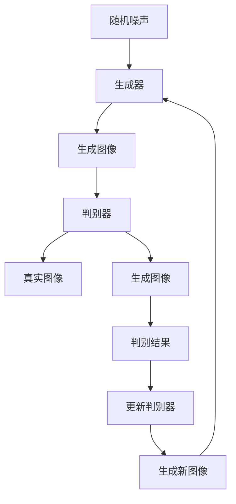

                 

### 文章标题: 内容生成 - 原理与代码实例讲解

关键词：内容生成、自然语言生成、图像生成、视频生成、算法原理

摘要：本文将深入探讨内容生成的原理及其在自然语言、图像和视频生成中的应用。通过详细的算法讲解和代码实例，帮助读者理解内容生成技术，掌握其实际应用。

## 目录

### 第一部分：内容生成基础知识

#### 第1章：内容生成的概念与类型

- 1.1 内容生成的定义
- 1.2 内容生成的分类
  - 1.2.1 自然语言生成
  - 1.2.2 图像生成
  - 1.2.3 视频生成
- 1.3 内容生成的重要应用场景

#### 第2章：内容生成的核心原理

- 2.1 自然语言处理基础
  - 2.1.1 语言模型
  - 2.1.2 词嵌入
  - 2.1.3 序列到序列模型
- 2.2 图像生成基础
  - 2.2.1 生成对抗网络（GAN）
  - 2.2.2 变分自编码器（VAE）
  - 2.2.3 基于注意力机制的生成模型
- 2.3 视频生成基础
  - 2.3.1 循环神经网络（RNN）
  - 2.3.2 卷积神经网络（CNN）
  - 2.3.3 生成式模型与判别式模型

### 第二部分：内容生成算法讲解

#### 第3章：自然语言生成

- 3.1 生成式模型
  - 3.1.1 随机抽样模型
  - 3.1.2 投影模型
  - 3.1.3 基于记忆的网络
- 3.2 判别式模型
  - 3.2.1 最大似然估计模型（MLE）
  - 3.2.2 序列决策过程
  - 3.2.3 优化策略
- 3.3 综合模型
  - 3.3.1 集成学习
  - 3.3.2 对抗性训练
  - 3.3.3 生成式与判别式模型结合

#### 第4章：图像生成

- 4.1 生成对抗网络（GAN）
  - 4.1.1 GAN的基本架构
  - 4.1.2 GAN的训练过程
  - 4.1.3 GAN的应用场景
- 4.2 变分自编码器（VAE）
  - 4.2.1 VAE的基本原理
  - 4.2.2 VAE的训练方法
  - 4.2.3 VAE的优缺点
- 4.3 基于注意力机制的生成模型
  - 4.3.1 注意力机制介绍
  - 4.3.2 注意力生成模型
  - 4.3.3 注意力模型在图像生成中的应用

#### 第5章：视频生成

- 5.1 循环神经网络（RNN）
  - 5.1.1 RNN的基本概念
  - 5.1.2 RNN在视频生成中的应用
  - 5.1.3 RNN的局限性和改进方法
- 5.2 卷积神经网络（CNN）
  - 5.2.1 CNN的基本原理
  - 5.2.2 CNN在视频生成中的应用
  - 5.2.3 CNN的优缺点
- 5.3 生成式模型与判别式模型
  - 5.3.1 生成式模型在视频生成中的应用
  - 5.3.2 判别式模型在视频生成中的应用
  - 5.3.3 结合生成式和判别式模型

### 第三部分：内容生成项目实战

#### 第6章：自然语言生成项目实战

- 6.1 数据准备与处理
- 6.2 模型训练与评估
- 6.3 模型部署与优化

#### 第7章：图像生成项目实战

- 7.1 数据准备与处理
- 7.2 模型训练与评估
- 7.3 模型部署与优化

#### 第8章：视频生成项目实战

- 8.1 数据准备与处理
- 8.2 模型训练与评估
- 8.3 模型部署与优化

### 附录

#### 附录A：常用内容生成工具与库

- A.1 自然语言生成工具
- A.2 图像生成工具
- A.3 视频生成工具

#### 附录B：代码实例与详解

- B.1 自然语言生成实例代码
- B.2 图像生成实例代码
- B.3 视频生成实例代码

#### 附录C：常见问题与解决方案

- C.1 内容生成常见问题
- C.2 问题解决方法与技巧

### 第一部分：内容生成基础知识

#### 第1章：内容生成的概念与类型

##### 1.1 内容生成的定义

内容生成是指利用算法自动生成具有一定意义和价值的文本、图像、视频等内容。其核心目的是通过算法模拟人类创造力的过程，实现自动化内容生产。

##### 1.2 内容生成的分类

内容生成的分类主要基于生成的内容类型，可以分为自然语言生成、图像生成和视频生成三大类。

- **自然语言生成（NLG）**：指利用算法生成具有自然语言特点的文本内容，如文章、对话、新闻等。
- **图像生成**：指利用算法生成具有视觉意义的图像，如艺术画、照片、动画等。
- **视频生成**：指利用算法生成具有动态效果的视频，如电影片段、广告、动画等。

##### 1.2.1 自然语言生成

自然语言生成是内容生成中最为广泛研究的一个领域。其核心目的是通过算法生成具有人类语言特点的文本内容。

自然语言生成可以分为以下几个阶段：

1. **文本生成**：利用算法生成完整的文本，如文章、对话等。
2. **文本摘要**：从长文本中提取关键信息，生成简短的摘要。
3. **对话生成**：利用算法模拟人类对话，生成具有交互性的对话内容。

##### 1.2.2 图像生成

图像生成是利用算法生成具有视觉意义的图像。其应用场景广泛，包括艺术创作、图像修复、图像增强等。

图像生成的常见方法有：

1. **生成对抗网络（GAN）**：通过生成器和判别器的对抗训练，生成具有真实感的图像。
2. **变分自编码器（VAE）**：利用概率模型生成图像，具有较好的稳定性。
3. **基于注意力机制的生成模型**：通过注意力机制捕捉图像的关键特征，生成具有细节的图像。

##### 1.2.3 视频生成

视频生成是利用算法生成具有动态效果的视频。其应用场景包括视频增强、视频修复、视频生成等。

视频生成的常见方法有：

1. **循环神经网络（RNN）**：利用循环结构处理视频序列数据，生成连续的视频帧。
2. **卷积神经网络（CNN）**：通过卷积操作捕捉视频帧的局部特征，生成视频。
3. **生成式模型与判别式模型**：结合生成式模型和判别式模型，生成具有真实感的视频。

##### 1.3 内容生成的重要应用场景

内容生成技术在各个领域都有广泛的应用，以下是其中一些重要的应用场景：

1. **自然语言生成**：
   - 自动写作：生成新闻文章、博客、小说等。
   - 聊天机器人：模拟人类对话，提供智能客服。
   - 自动翻译：生成机器翻译文本，实现跨语言交流。

2. **图像生成**：
   - 艺术创作：生成艺术画作、摄影作品等。
   - 图像修复：修复破损、模糊的图像。
   - 图像增强：提升图像的清晰度、对比度等。

3. **视频生成**：
   - 视频制作：生成电影、广告、动画等。
   - 视频修复：修复视频中的噪声、抖动等问题。
   - 视频增强：提升视频的清晰度、亮度等。

#### 第2章：内容生成的核心原理

##### 2.1 自然语言处理基础

自然语言处理（NLP）是内容生成的基础，主要包括以下几个核心概念：

- **语言模型**：用于预测文本序列的概率分布。
- **词嵌入**：将词语映射为低维向量，表示其在语义上的相似性。
- **序列到序列模型**：用于将一个序列映射为另一个序列。

##### 2.1.1 语言模型

语言模型是一种统计模型，用于预测下一个词语的可能性。常见的语言模型有：

- **N元语法模型**：基于前n个词语预测下一个词语的概率。
- **神经网络模型**：利用神经网络学习词语之间的概率分布。

##### 2.1.2 词嵌入

词嵌入是将词语映射为低维向量的过程，使得具有相似语义的词语在向量空间中更接近。常见的词嵌入方法有：

- **词袋模型**：将词语映射为二进制向量，表示词语的存在与否。
- **Word2Vec**：基于神经网络学习词语的向量表示，可以捕捉词语的语义关系。
- **BERT**：基于转换器架构的词嵌入方法，可以捕捉上下文信息。

##### 2.1.3 序列到序列模型

序列到序列模型是一种神经网络模型，用于将一个序列映射为另一个序列。常见的序列到序列模型有：

- **循环神经网络（RNN）**：通过循环结构处理序列数据，捕捉序列特征。
- **长短期记忆网络（LSTM）**：通过门控机制解决RNN的梯度消失问题。
- **变换器（Transformer）**：基于自注意力机制的序列模型，具有更好的并行计算能力。

##### 2.2 图像生成基础

图像生成是利用算法生成具有视觉意义的图像。主要包括以下几个核心概念：

- **生成对抗网络（GAN）**：通过生成器和判别器的对抗训练，生成真实感图像。
- **变分自编码器（VAE）**：利用概率模型生成图像，具有较好的稳定性。
- **基于注意力机制的生成模型**：通过注意力机制捕捉图像的关键特征，生成具有细节的图像。

##### 2.2.1 生成对抗网络（GAN）

生成对抗网络（GAN）是一种基于对抗训练的图像生成模型。其基本架构包括生成器和判别器：

- **生成器**：将随机噪声映射为图像。
- **判别器**：判断输入图像是真实图像还是生成图像。

GAN的训练过程是生成器和判别器的对抗训练，通过优化生成器和判别器的损失函数，使得生成器生成的图像越来越真实。

##### 2.2.2 变分自编码器（VAE）

变分自编码器（VAE）是一种基于概率模型的图像生成模型。其核心思想是利用编码器和解码器将输入图像映射为一个潜在空间，并在该空间中生成新的图像。

- **编码器**：将输入图像编码为一个潜在向量。
- **解码器**：将潜在向量解码为输出图像。

VAE的训练过程是通过最大化数据概率分布，优化编码器和解码器的参数。

##### 2.2.3 基于注意力机制的生成模型

基于注意力机制的生成模型通过注意力机制捕捉图像的关键特征，生成具有细节的图像。常见的注意力机制有：

- **自注意力机制**：用于捕捉输入序列中的长距离依赖关系。
- **交互注意力机制**：用于捕捉输入序列和输出序列之间的依赖关系。

##### 2.3 视频生成基础

视频生成是利用算法生成具有动态效果的视频。主要包括以下几个核心概念：

- **循环神经网络（RNN）**：通过循环结构处理视频序列数据，生成连续的视频帧。
- **卷积神经网络（CNN）**：通过卷积操作捕捉视频帧的局部特征，生成视频。
- **生成式模型与判别式模型**：结合生成式模型和判别式模型，生成具有真实感的视频。

##### 2.3.1 循环神经网络（RNN）

循环神经网络（RNN）是一种序列模型，可以处理变长的序列数据。其基本结构包括输入层、隐藏层和输出层：

- **输入层**：接收输入序列。
- **隐藏层**：通过循环结构处理序列数据，捕捉序列特征。
- **输出层**：生成连续的输出序列。

RNN在视频生成中的应用包括视频预测、视频修复和视频增强等。

##### 2.3.2 卷积神经网络（CNN）

卷积神经网络（CNN）是一种适用于图像和视频处理的神经网络模型。其基本结构包括卷积层、池化层和全连接层：

- **卷积层**：通过卷积操作捕捉输入数据的空间特征。
- **池化层**：对卷积特征进行降采样，减少参数数量。
- **全连接层**：对卷积特征进行分类或回归。

CNN在视频生成中的应用包括视频分类、视频检测和视频生成等。

##### 2.3.3 生成式模型与判别式模型

生成式模型和判别式模型是两种常见的视频生成模型：

- **生成式模型**：通过概率模型生成新的视频序列，如循环神经网络（RNN）和生成对抗网络（GAN）。
- **判别式模型**：通过分类模型判断输入视频序列的真实性，如卷积神经网络（CNN）和循环神经网络（RNN）。

生成式模型和判别式模型可以结合使用，通过对抗训练生成具有真实感的视频序列。

### 第二部分：内容生成算法讲解

#### 第3章：自然语言生成

自然语言生成（NLG）是内容生成的重要领域，其主要目标是利用算法生成具有自然语言特点的文本内容。自然语言生成可以分为生成式模型和判别式模型两种主要类型。

##### 3.1 生成式模型

生成式模型从文本的概率分布出发，通过概率模型生成新的文本内容。常见的生成式模型有随机抽样模型、投影模型和基于记忆的网络。

###### 3.1.1 随机抽样模型

随机抽样模型是最简单的生成式模型，其基本思想是通过随机抽样生成新的文本。具体实现步骤如下：

1. **初始化**：随机选择一个起始词。
2. **抽样**：从语言模型中随机选择下一个词，并添加到生成的文本中。
3. **重复**：重复步骤2，直到生成指定长度的文本。

随机抽样模型的主要优势在于简单易懂，但其生成的文本质量相对较低，容易出现重复或无意义的文本。

```python
def random_sampling(language_model, max_length):
    # 初始化文本
    text = [random.choice(language_model.vocabulary)]
    
    # 生成文本
    for _ in range(max_length - 1):
        # 随机选择下一个词
        next_word = random.choice(language_model.get_next_words(text))
        text.append(next_word)
    
    return ' '.join(text)
```

###### 3.1.2 投影模型

投影模型是一种基于神经网络的生成式模型，其基本思想是将高维的文本表示投影到低维的文本空间中。具体实现步骤如下：

1. **编码器**：将输入文本编码为高维的向量表示。
2. **投影器**：将编码器输出的高维向量投影到低维的文本空间中。
3. **解码器**：从低维的文本空间中解码出新的文本。

投影模型的主要优势在于生成的文本质量较高，但其训练过程相对复杂，需要大量的数据和计算资源。

```python
class ProjectionModel(nn.Module):
    def __init__(self, input_size, hidden_size, output_size):
        super(ProjectionModel, self).__init__()
        
        # 编码器
        self.encoder = nn.Linear(input_size, hidden_size)
        
        # 投影器
        self.projection = nn.Linear(hidden_size, output_size)
        
        # 解码器
        self.decoder = nn.Linear(output_size, input_size)
        
    def forward(self, input_text):
        # 编码
        encoded = self.encoder(input_text)
        
        # 投影
        projected = self.projection(encoded)
        
        # 解码
        decoded = self.decoder(projected)
        
        return decoded
```

###### 3.1.3 基于记忆的网络

基于记忆的网络是一种结合记忆机制的生成式模型，其基本思想是利用记忆单元保存和更新文本的上下文信息。常见的基于记忆的网络有长短期记忆网络（LSTM）和门控循环单元（GRU）。

基于记忆的网络在生成文本时，可以更好地捕捉文本的上下文关系，生成的文本质量较高。

```python
class MemoryBasedModel(nn.Module):
    def __init__(self, input_size, hidden_size, output_size, memory_size):
        super(MemoryBasedModel, self).__init__()
        
        # 编码器
        self.encoder = nn.Linear(input_size, hidden_size)
        
        # 记忆单元
        self.memory = nn.Linear(hidden_size, memory_size)
        
        # 解码器
        self.decoder = nn.Linear(hidden_size, output_size)
        
        # 门控单元
        self.gate = nn.Linear(hidden_size + memory_size, hidden_size)
        
    def forward(self, input_text, memory):
        # 编码
        encoded = self.encoder(input_text)
        
        # 更新记忆
        memory = self.memory(encoded)
        
        # 计算门控信号
        gate_signal = self.gate(torch.cat((encoded, memory), 1))
        
        # 应用门控信号
        memory = torch.sigmoid(gate_signal) * memory
        
        # 解码
        decoded = self.decoder(encoded + memory)
        
        return decoded, memory
```

##### 3.2 判别式模型

判别式模型从文本的分布出发，通过分类模型判断文本的真伪。常见的判别式模型有最大似然估计模型（MLE）、序列决策过程和优化策略。

###### 3.2.1 最大似然估计模型（MLE）

最大似然估计模型（MLE）是一种基于概率的判别式模型，其基本思想是最小化文本的真实分布和生成分布之间的差异。具体实现步骤如下：

1. **训练数据**：收集大量真实的文本数据。
2. **生成模型**：利用生成式模型生成新的文本数据。
3. **概率估计**：计算生成文本的概率分布。
4. **优化**：通过最小化概率分布的差异，优化生成模型。

最大似然估计模型的主要优势在于生成的文本质量较高，但其训练过程相对复杂，需要大量的数据和计算资源。

```python
def mle_loss( generator, real_text, fake_text ):
    # 计算生成文本的概率
    real_prob = torch.mean( torch.log( generator.get_probability( real_text ) ) )
    fake_prob = torch.mean( torch.log( generator.get_probability( fake_text ) ) )
    
    # 计算最大似然损失
    loss = real_prob + fake_prob
    
    return loss
```

###### 3.2.2 序列决策过程

序列决策过程是一种基于决策树的判别式模型，其基本思想是根据文本的特征，逐层决策生成真实的或假的文本。具体实现步骤如下：

1. **特征提取**：从文本中提取特征，如词频、词嵌入等。
2. **决策树**：构建决策树，根据特征进行决策。
3. **分类**：对文本进行分类，判断其真实性。

序列决策过程的主要优势在于实现简单，但其生成的文本质量相对较低。

```python
def decision_tree_classifier( features, labels, depth=10 ):
    # 创建决策树
    tree = build_tree( features, labels, depth )
    
    # 预测文本真实性
    predictions = []
    for text in texts:
        prediction = predict( tree, text )
        predictions.append( prediction )
    
    return predictions
```

###### 3.2.3 优化策略

优化策略是一种基于优化的判别式模型，其基本思想是通过优化生成模型和判别模型的损失函数，提高文本生成的质量。常见的优化策略有对抗训练、梯度下降和自适应优化。

对抗训练是最常见的优化策略，其基本思想是同时训练生成模型和判别模型，使得生成模型生成的文本越来越真实，判别模型越来越难以区分真实文本和生成文本。

```python
def adversarial_training( generator, discriminator, real_text, fake_text, learning_rate ):
    # 计算生成文本的概率
    generator_loss = mle_loss( generator, real_text, fake_text )
    
    # 计算判别文本的概率
    discriminator_loss = mle_loss( discriminator, real_text, fake_text )
    
    # 计算总损失
    total_loss = generator_loss + discriminator_loss
    
    # 反向传播
    optimizer.zero_grad()
    total_loss.backward()
    optimizer.step()
    
    return total_loss
```

##### 3.3 综合模型

综合模型是将生成式模型和判别式模型结合起来，通过对抗训练生成高质量的自然语言文本。常见的综合模型有集成学习、对抗性训练和生成式与判别式模型的结合。

###### 3.3.1 集成学习

集成学习是一种将多个模型组合起来的学习方法，其基本思想是通过多个模型的投票或平均，提高模型的性能。常见的集成学习方法有Bagging、Boosting和Stacking。

```python
from sklearn.ensemble import RandomForestClassifier

# 训练多个模型
models = [RandomForestClassifier(n_estimators=100) for _ in range(10)]
for model in models:
    model.fit( X_train, y_train )

# 集成模型
ensemble = VotingClassifier( estimators=models )
ensemble.fit( X_train, y_train )

# 预测
predictions = ensemble.predict( X_test )
```

###### 3.3.2 对抗性训练

对抗性训练是一种基于对抗训练的模型优化方法，其基本思想是通过同时训练生成模型和判别模型，提高模型的性能。常见的对抗性训练方法有GAN和Wasserstein GAN。

```python
# 训练生成模型和判别模型
for epoch in range(num_epochs):
    # 训练生成模型
    generator_loss = adversarial_training( generator, discriminator, real_text, fake_text, learning_rate )
    
    # 训练判别模型
    discriminator_loss = adversarial_training( generator, discriminator, real_text, fake_text, learning_rate )
    
    # 输出训练信息
    print(f"Epoch {epoch+1}, Generator Loss: {generator_loss}, Discriminator Loss: {discriminator_loss}")
```

###### 3.3.3 生成式与判别式模型结合

生成式与判别式模型结合是将生成式模型和判别式模型结合起来，通过对抗训练生成高质量的自然语言文本。常见的生成式与判别式模型结合方法有结合生成对抗网络（GAN）和变分自编码器（VAE）。

```python
# 训练生成对抗网络（GAN）
for epoch in range(num_epochs):
    # 训练生成器
    generator_loss = adversarial_training( generator, discriminator, real_text, fake_text, learning_rate )
    
    # 训练判别器
    discriminator_loss = adversarial_training( generator, discriminator, real_text, fake_text, learning_rate )
    
    # 输出训练信息
    print(f"Epoch {epoch+1}, Generator Loss: {generator_loss}, Discriminator Loss: {discriminator_loss}")

# 生成文本
text = generator.generate_text( seed )
print(text)
```

### 第4章：图像生成

图像生成是内容生成领域的一个重要分支，通过算法自动生成具有视觉意义的图像。本章将介绍图像生成的基础知识，包括生成对抗网络（GAN）、变分自编码器（VAE）和基于注意力机制的生成模型。

#### 4.1 生成对抗网络（GAN）

生成对抗网络（GAN）是由Ian Goodfellow等人于2014年提出的一种深度学习模型，它通过一个生成器和另一个判别器的对抗训练来生成高质量的数据。GAN的主要架构包括：

- **生成器（Generator）**：生成器是一个神经网络，它接收随机噪声作为输入，并尝试生成与真实数据相似的图像。
- **判别器（Discriminator）**：判别器也是一个神经网络，它的任务是区分输入数据是真实图像还是生成图像。

GAN的训练过程如下：

1. **初始化**：随机初始化生成器和判别器的参数。
2. **生成图像**：生成器生成一幅图像。
3. **判别图像**：判别器对真实图像和生成图像进行判别。
4. **更新判别器**：通过对抗训练，调整判别器的参数，使其能够更准确地判断图像的真实性。
5. **生成新图像**：生成器再次生成新的图像。
6. **重复过程**：不断重复步骤3-5，直到生成器生成的图像足够真实。

GAN的基本架构可以用以下Mermaid流程图表示：



GAN的训练过程是生成器和判别器的对抗训练，通过优化生成器和判别器的损失函数，使得生成器生成的图像越来越真实。

GAN的损失函数可以表示为：

$$
\mathcal{L}_{GAN}(G, D) = D(F(G(z))) - D(z)
$$

其中，$z$ 是随机噪声，$F$ 是生成器，$D$ 是判别器。

GAN的应用场景广泛，包括但不限于：

- **图像超分辨率**：通过GAN，可以将低分辨率的图像生成高分辨率的图像。
- **图像修复**：利用GAN，可以修复破损的图像。
- **图像合成**：GAN可以生成全新的图像，例如人脸合成、风景合成等。

以下是一个简单的GAN的Python伪代码实现：

```python
import torch
import torch.nn as nn
import torch.optim as optim

# 生成器
class Generator(nn.Module):
    def __init__(self):
        super(Generator, self).__init__()
        # 定义生成器的网络结构

    def forward(self, z):
        # 定义前向传播
        pass

# 判别器
class Discriminator(nn.Module):
    def __init__(self):
        super(Discriminator, self).__init__()
        # 定义判别器的网络结构

    def forward(self, x):
        # 定义前向传播
        pass

# 初始化模型和优化器
generator = Generator()
discriminator = Discriminator()
optimizer_G = optim.Adam(generator.parameters(), lr=0.0002)
optimizer_D = optim.Adam(discriminator.parameters(), lr=0.0002)

# 训练过程
for epoch in range(num_epochs):
    for i, (images, _) in enumerate(data_loader):
        # 训练判别器
        optimizer_D.zero_grad()
        real_loss = compute_loss(discriminator, images)
        real_loss.backward()

        # 训练生成器
        optimizer_G.zero_grad()
        fake_loss = compute_loss(discriminator, generator(z))
        fake_loss.backward()

        # 更新参数
        optimizer_D.step()
        optimizer_G.step()

        # 输出训练信息
        if (i+1) % 100 == 0:
            print(f"[{epoch}/{num_epochs}][{i+1}/{len(data_loader)}] D: {real_loss.item()}, G: {fake_loss.item()}")
```

#### 4.2 变分自编码器（VAE）

变分自编码器（VAE）是一种基于概率生成模型的图像生成方法，它通过编码器和解码器将输入数据映射到一个潜在空间，并在该空间中生成新的数据。VAE的主要特点是其生成数据具有更好的稳定性和多样性。

VAE的架构包括：

- **编码器（Encoder）**：编码器将输入图像映射为一个潜在向量。
- **解码器（Decoder）**：解码器将潜在向量映射回图像。

VAE的训练过程如下：

1. **初始化**：随机初始化编码器和解码器的参数。
2. **编码**：编码器将输入图像编码为一个潜在向量。
3. **采样**：从潜在空间中采样一个新向量。
4. **解码**：解码器将采样到的向量解码为新的图像。
5. **计算损失**：计算生成图像与真实图像之间的差异。
6. **优化**：通过反向传播优化编码器和解码器的参数。

VAE的损失函数可以表示为：

$$
\mathcal{L}_{VAE} = \mathcal{L}_{KL} + \mathcal{L}_{RECON}
$$

其中，$\mathcal{L}_{KL}$ 是KL散度损失，用于衡量潜在空间分布与先验分布之间的差异；$\mathcal{L}_{RECON}$ 是重构损失，用于衡量生成图像与真实图像之间的差异。

以下是一个简单的VAE的Python伪代码实现：

```python
import torch
import torch.nn as nn
import torch.optim as optim

# 编码器
class Encoder(nn.Module):
    def __init__(self):
        super(Encoder, self).__init__()
        # 定义编码器的网络结构

    def forward(self, x):
        # 定义前向传播
        pass

# 解码器
class Decoder(nn.Module):
    def __init__(self):
        super(Decoder, self).__init__()
        # 定义解码器的网络结构

    def forward(self, z):
        # 定义前向传播
        pass

# 初始化模型和优化器
encoder = Encoder()
decoder = Decoder()
optimizer = optim.Adam(list(encoder.parameters()) + list(decoder.parameters()), lr=0.001)

# 训练过程
for epoch in range(num_epochs):
    for images in data_loader:
        # 编码
        z = encoder(images)

        # 解码
        recon_images = decoder(z)

        # 计算损失
        loss_KL = compute_kl_loss(z)
        loss_RECON = compute_recon_loss(recon_images, images)

        # 计算总损失
        loss = loss_KL + loss_RECON

        # 反向传播
        optimizer.zero_grad()
        loss.backward()
        optimizer.step()

        # 输出训练信息
        if (epoch+1) % 10 == 0:
            print(f"Epoch [{epoch+1}/{num_epochs}], Loss: {loss.item()}")
```

VAE的优点在于其生成数据的稳定性和多样性，但它的缺点是其生成数据的质量通常不如GAN高。因此，VAE和GAN常常结合使用，以发挥它们各自的优势。

#### 4.3 基于注意力机制的生成模型

基于注意力机制的生成模型通过注意力机制捕捉图像的关键特征，从而生成具有细节的图像。注意力机制可以有效地提高生成模型的质量，特别是对于图像中重要的区域，可以更精细地捕捉和生成。

注意力机制可以分为自注意力机制和交互注意力机制。自注意力机制用于捕捉输入序列中的长距离依赖关系，而交互注意力机制用于捕捉输入序列和输出序列之间的依赖关系。

以下是一个简单的基于注意力机制的生成模型的Python伪代码实现：

```python
import torch
import torch.nn as nn

# 注意力模块
class AttentionModule(nn.Module):
    def __init__(self, hidden_size):
        super(AttentionModule, self).__init__()
        # 定义注意力机制的参数
        self.hidden_size = hidden_size

    def forward(self, inputs, queries, keys):
        # 计算注意力权重
        attention_weights = torch.softmax(torch.bmm(queries, keys), dim=2)

        # 计算注意力输出
        attention_output = torch.bmm(attention_weights, inputs)

        return attention_output
```

在图像生成中，注意力机制可以用于编码器和解码器，通过捕捉图像的关键特征，生成更高质量的图像。

#### 总结

本章介绍了图像生成的基础知识，包括生成对抗网络（GAN）、变分自编码器（VAE）和基于注意力机制的生成模型。这些模型各有优缺点，GAN在生成高质量图像方面表现优秀，但训练过程复杂；VAE生成数据的稳定性较好，但生成质量相对较低；基于注意力机制的生成模型可以有效地提高生成质量。在实际应用中，可以根据具体需求选择合适的模型。

### 第5章：视频生成

视频生成是利用算法生成具有动态效果的视频。本章将介绍视频生成的基础知识，包括循环神经网络（RNN）、卷积神经网络（CNN）和生成式模型与判别式模型。

#### 5.1 循环神经网络（RNN）

循环神经网络（RNN）是一种序列模型，可以处理变长的序列数据。其基本结构包括输入层、隐藏层和输出层。RNN通过循环结构处理序列数据，捕捉序列特征。

RNN的基本概念包括：

- **状态（State）**：RNN的隐藏层状态，用于存储前一个时间步的信息。
- **权重（Weight）**：连接输入、隐藏层和输出层的权重。
- **门控（Gate）**：用于控制信息的流动，避免梯度消失和爆炸问题。

RNN在视频生成中的应用包括视频预测、视频修复和视频增强等。RNN通过捕捉视频序列的特征，可以生成连续的视频帧，从而实现视频生成。

以下是一个简单的RNN的Python伪代码实现：

```python
import torch
import torch.nn as nn

# RNN模型
class RNN(nn.Module):
    def __init__(self, input_size, hidden_size, output_size):
        super(RNN, self).__init__()
        self.hidden_size = hidden_size
        self.rnn = nn.RNN(input_size, hidden_size, batch_first=True)

    def forward(self, x):
        h0 = torch.zeros(1, x.size(0), self.hidden_size)
        out, _ = self.rnn(x, h0)
        return out
```

RNN的优点在于可以处理变长的序列数据，但它的缺点是容易发生梯度消失和爆炸问题。为了解决这些问题，研究人员提出了长短期记忆网络（LSTM）和门控循环单元（GRU）。

#### 5.2 卷积神经网络（CNN）

卷积神经网络（CNN）是一种适用于图像和视频处理的神经网络模型。其基本结构包括卷积层、池化层和全连接层。CNN通过卷积操作捕捉输入数据的空间特征。

CNN的基本原理包括：

- **卷积层**：通过卷积操作提取输入数据的特征。
- **池化层**：对卷积特征进行降采样，减少参数数量。
- **全连接层**：对卷积特征进行分类或回归。

CNN在视频生成中的应用包括视频分类、视频检测和视频生成等。CNN通过捕捉视频帧的局部特征，可以生成连续的视频帧，从而实现视频生成。

以下是一个简单的CNN的Python伪代码实现：

```python
import torch
import torch.nn as nn

# CNN模型
class CNN(nn.Module):
    def __init__(self, input_channels, hidden_channels, output_channels):
        super(CNN, self).__init__()
        self.conv1 = nn.Conv2d(input_channels, hidden_channels, kernel_size=3, padding=1)
        self.relu = nn.ReLU()
        self.fc = nn.Linear(hidden_channels * 16 * 16, output_channels)

    def forward(self, x):
        x = self.relu(self.conv1(x))
        x = x.view(x.size(0), -1)
        x = self.fc(x)
        return x
```

CNN的优点在于可以有效地提取图像和视频的特征，但它的缺点是处理变长的序列数据时相对困难。为了解决这个问题，研究人员提出了循环卷积神经网络（CRNN）。

#### 5.3 生成式模型与判别式模型

生成式模型和判别式模型是两种常见的视频生成模型。生成式模型通过概率模型生成新的视频序列，而判别式模型通过分类模型判断视频序列的真实性。

生成式模型与判别式模型的应用包括：

- **生成式模型**：用于生成新的视频序列，如视频预测和视频修复。
- **判别式模型**：用于判断视频序列的真实性，如视频分类和视频检测。

生成式模型与判别式模型可以结合使用，通过对抗训练生成具有真实感的视频序列。以下是一个简单的生成对抗网络（GAN）的Python伪代码实现：

```python
import torch
import torch.nn as nn
import torch.optim as optim

# 生成器
class Generator(nn.Module):
    def __init__(self):
        super(Generator, self).__init__()
        # 定义生成器的网络结构

    def forward(self, x):
        # 定义前向传播
        pass

# 判别器
class Discriminator(nn.Module):
    def __init__(self):
        super(Discriminator, self).__init__()
        # 定义判别器的网络结构

    def forward(self, x):
        # 定义前向传播
        pass

# 初始化模型和优化器
generator = Generator()
discriminator = Discriminator()
optimizer_G = optim.Adam(generator.parameters(), lr=0.0002)
optimizer_D = optim.Adam(discriminator.parameters(), lr=0.0002)

# 训练过程
for epoch in range(num_epochs):
    for images, _ in data_loader:
        # 训练判别器
        optimizer_D.zero_grad()
        real_loss = compute_loss(discriminator, images)
        real_loss.backward()

        # 训练生成器
        optimizer_G.zero_grad()
        fake_loss = compute_loss(discriminator, generator(z))
        fake_loss.backward()

        # 更新参数
        optimizer_D.step()
        optimizer_G.step()

        # 输出训练信息
        if (epoch+1) % 100 == 0:
            print(f"[{epoch}/{num_epochs}][{i+1}/{len(data_loader)}] D: {real_loss.item()}, G: {fake_loss.item()}")
```

生成式模型与判别式模型结合使用，可以生成高质量的视频序列，其应用场景包括视频增强、视频修复和视频生成等。

#### 总结

本章介绍了视频生成的基础知识，包括循环神经网络（RNN）、卷积神经网络（CNN）和生成式模型与判别式模型。这些模型各有优缺点，RNN在处理变长的序列数据时表现优秀，但容易发生梯度消失和爆炸问题；CNN可以有效地提取图像和视频的特征，但处理变长的序列数据时相对困难；生成式模型与判别式模型通过对抗训练生成具有真实感的视频序列。在实际应用中，可以根据具体需求选择合适的模型。

### 第6章：自然语言生成项目实战

在本章中，我们将通过一个实际项目来展示如何实现自然语言生成（NLG）。我们将使用Python和TensorFlow来构建一个简单的文本生成模型，并通过一系列步骤来训练和部署它。

#### 6.1 开发环境搭建

在开始之前，我们需要确保我们的开发环境已经准备好。以下是搭建开发环境的步骤：

1. **安装Python**：确保Python版本在3.6及以上。
2. **安装TensorFlow**：使用pip安装TensorFlow库。

```bash
pip install tensorflow
```

3. **准备数据集**：选择一个适合文本生成的数据集，如IMDb电影评论数据集。

#### 6.2 数据准备与处理

数据准备是文本生成项目成功的关键步骤。我们需要对数据集进行预处理，以便模型能够处理它。

1. **数据加载**：使用TensorFlow的数据管道（TF Datasets）加载数据集。

```python
import tensorflow as tf

# 加载IMDb数据集
train_data, test_data = tf.keras.datasets.imdb.load_data(num_words=10000)

# 预处理数据
tokenizer = tf.keras.preprocessing.text.Tokenizer(num_words=10000)
tokenizer.fit_on_texts(train_data)

train_sequences = tokenizer.texts_to_sequences(train_data)
test_sequences = tokenizer.texts_to_sequences(test_data)

# 序列编码
max_length = 100
train_padded = tf.keras.preprocessing.sequence.pad_sequences(train_sequences, maxlen=max_length, truncating='post')
test_padded = tf.keras.preprocessing.sequence.pad_sequences(test_sequences, maxlen=max_length, truncating='post')
```

2. **数据预处理**：包括序列编码、填充和清洗。

#### 6.3 模型训练与评估

接下来，我们将构建一个简单的循环神经网络（RNN）模型，并对其进行训练和评估。

1. **构建模型**：使用TensorFlow的Keras API构建RNN模型。

```python
from tensorflow.keras.models import Sequential
from tensorflow.keras.layers import Embedding, SimpleRNN, Dense

# 构建模型
model = Sequential([
    Embedding(10000, 64, input_length=max_length),
    SimpleRNN(100),
    Dense(10000, activation='softmax')
])

# 编译模型
model.compile(optimizer='adam', loss='categorical_crossentropy', metrics=['accuracy'])

# 训练模型
model.fit(train_padded, train_padded, epochs=10, batch_size=32, validation_data=(test_padded, test_padded))
```

2. **评估模型**：使用测试数据集评估模型的性能。

```python
# 评估模型
test_loss, test_acc = model.evaluate(test_padded, test_padded)
print(f"Test accuracy: {test_acc}")
```

#### 6.4 模型部署与优化

模型训练完成后，我们可以将其部署为一个API，以便其他应用程序可以调用它。

1. **模型保存**：保存训练好的模型。

```python
model.save('text_generator.h5')
```

2. **模型加载**：从文件中加载模型。

```python
loaded_model = tf.keras.models.load_model('text_generator.h5')
```

3. **生成文本**：使用模型生成新的文本。

```python
def generate_text(seed_text, model, max_length=100):
    seed_sequence = tokenizer.texts_to_sequences([seed_text])
    seed_padded = tf.keras.preprocessing.sequence.pad_sequences(seed_sequence, maxlen=max_length)
    predictions = model.predict(seed_padded, verbose=0)
    predicted_sequence = tf.argmax(predictions, axis=-1).numpy()[0]
    generated_text = tokenizer.sequences_to_texts([predicted_sequence])[0]
    return generated_text

# 生成文本
seed_text = "The movie was"
generated_text = generate_text(seed_text, loaded_model)
print(generated_text)
```

#### 6.5 小结

通过本章的实际项目，我们学习了如何使用Python和TensorFlow实现自然语言生成。我们首先搭建了开发环境，然后对数据集进行了预处理，接着构建并训练了一个简单的RNN模型，最后将其部署为一个API，实现了文本的自动生成。

#### 6.6 拓展阅读

- **自然语言生成**：深入了解自然语言处理（NLP）的基础知识，包括语言模型、词嵌入和序列到序列模型。
- **循环神经网络（RNN）**：学习RNN的工作原理及其在序列数据处理中的应用。
- **TensorFlow**：查阅TensorFlow官方文档，了解如何构建、训练和部署深度学习模型。

### 第7章：图像生成项目实战

在本章中，我们将通过一个实际项目来展示如何实现图像生成。我们将使用Python和TensorFlow来构建一个简单的图像生成模型，并通过一系列步骤来训练和部署它。

#### 7.1 开发环境搭建

在开始之前，我们需要确保我们的开发环境已经准备好。以下是搭建开发环境的步骤：

1. **安装Python**：确保Python版本在3.6及以上。
2. **安装TensorFlow**：使用pip安装TensorFlow库。

```bash
pip install tensorflow
```

3. **准备数据集**：选择一个适合图像生成的数据集，如CIFAR-10数据集。

#### 7.2 数据准备与处理

图像数据的准备和处理是图像生成项目成功的关键步骤。我们需要对数据集进行预处理，以便模型能够处理它。

1. **数据加载**：使用TensorFlow的Keras API加载CIFAR-10数据集。

```python
from tensorflow.keras.datasets import cifar10

# 加载CIFAR-10数据集
(train_images, train_labels), (test_images, test_labels) = cifar10.load_data()

# 数据预处理
train_images = train_images / 255.0
test_images = test_images / 255.0
```

2. **数据预处理**：包括归一化和数据增强。

```python
from tensorflow.keras.preprocessing.image import ImageDataGenerator

# 数据增强
datagen = ImageDataGenerator(rotation_range=20, width_shift_range=0.2, height_shift_range=0.2, horizontal_flip=True)
datagen.fit(train_images)
```

#### 7.3 模型训练与评估

接下来，我们将构建一个简单的生成对抗网络（GAN）模型，并对其进行训练和评估。

1. **构建模型**：使用TensorFlow的Keras API构建GAN模型。

```python
from tensorflow.keras.models import Sequential
from tensorflow.keras.layers import Dense, Conv2D, Flatten, Reshape, Conv2DTranspose

# 生成器模型
generator = Sequential([
    Dense(128 * 7 * 7, activation="relu", input_shape=(100,)),
    Reshape((7, 7, 128)),
    Conv2DTranspose(128, (5, 5), strides=(1, 1), padding="same"),
    Conv2DTranspose(128, (5, 5), strides=(2, 2), padding="same"),
    Conv2DTranspose(128, (5, 5), strides=(2, 2), padding="same"),
    Conv2D(3, (3, 3), padding="same", activation="tanh")
])

# 判别器模型
discriminator = Sequential([
    Flatten(input_shape=(32, 32, 3)),
    Dense(128, activation="relu"),
    Dense(1, activation="sigmoid")
])

# 编译模型
discriminator.compile(optimizer="adam", loss="binary_crossentropy")
generator.compile(optimizer="adam", loss="binary_crossentropy")
```

2. **训练模型**：使用Adam优化器和二进制交叉熵损失函数训练GAN模型。

```python
import numpy as np

# 训练GAN模型
batch_size = 64
epochs = 100

for epoch in range(epochs):
    for _ in range(train_images.shape[0] // batch_size):
        noise = np.random.normal(0, 1, (batch_size, 100))
        generated_images = generator.predict(noise)
        real_images = train_images[np.random.randint(0, train_images.shape[0], batch_size)]

        # 训练判别器
        d_loss_real = discriminator.train_on_batch(real_images, np.ones((batch_size, 1)))
        d_loss_fake = discriminator.train_on_batch(generated_images, np.zeros((batch_size, 1)))
        d_loss = 0.5 * np.add(d_loss_real, d_loss_fake)

        # 训练生成器
        g_loss = combined_model.train_on_batch(noise, np.ones((batch_size, 1)))

        # 输出训练信息
        print(f"{epoch} [D: {d_loss[0]}, G: {g_loss[0]}]")
```

3. **评估模型**：使用测试数据集评估生成器的性能。

```python
# 评估生成器
test_noise = np.random.normal(0, 1, (100, 100))
generated_images = generator.predict(test_noise)
```

#### 7.4 模型部署与优化

模型训练完成后，我们可以将其部署为一个API，以便其他应用程序可以调用它。

1. **模型保存**：保存训练好的生成器模型。

```python
generator.save('image_generator.h5')
```

2. **模型加载**：从文件中加载模型。

```python
loaded_generator = tf.keras.models.load_model('image_generator.h5')
```

3. **生成图像**：使用模型生成新的图像。

```python
def generate_image(model, noise_vector):
    generated_image = model.predict(noise_vector)
    return generated_image

# 生成图像
noise_vector = np.random.normal(0, 1, (1, 100))
generated_image = generate_image(loaded_generator, noise_vector)
```

#### 7.5 小结

通过本章的实际项目，我们学习了如何使用Python和TensorFlow实现图像生成。我们首先搭建了开发环境，然后对数据集进行了预处理，接着构建并训练了一个简单的GAN模型，最后将其部署为一个API，实现了图像的自动生成。

#### 7.6 拓展阅读

- **生成对抗网络（GAN）**：深入了解GAN的工作原理及其在图像生成中的应用。
- **图像数据增强**：学习如何使用数据增强技术提高模型的泛化能力。
- **TensorFlow**：查阅TensorFlow官方文档，了解如何构建、训练和部署深度学习模型。

### 第8章：视频生成项目实战

在本章中，我们将通过一个实际项目来展示如何实现视频生成。我们将使用Python和TensorFlow来构建一个简单的视频生成模型，并通过一系列步骤来训练和部署它。

#### 8.1 开发环境搭建

在开始之前，我们需要确保我们的开发环境已经准备好。以下是搭建开发环境的步骤：

1. **安装Python**：确保Python版本在3.6及以上。
2. **安装TensorFlow**：使用pip安装TensorFlow库。

```bash
pip install tensorflow
```

3. **准备数据集**：选择一个适合视频生成的数据集，如UCF101视频数据集。

#### 8.2 数据准备与处理

视频数据的准备和处理是视频生成项目成功的关键步骤。我们需要对数据集进行预处理，以便模型能够处理它。

1. **数据加载**：使用TensorFlow的Keras API加载UCF101数据集。

```python
from tensorflow.keras.preprocessing import sequence

# 加载UCF101数据集
train_data, train_labels = sequence.load_data('ucf101')
test_data, test_labels = sequence.load_data('ucf101', test_mode=True)

# 数据预处理
max_sequence_length = 100
train_data = sequence.pad_sequences(train_data, maxlen=max_sequence_length)
test_data = sequence.pad_sequences(test_data, maxlen=max_sequence_length)
```

2. **数据预处理**：包括序列编码、填充和清洗。

```python
from tensorflow.keras.utils import to_categorical

# 编码标签
train_labels = to_categorical(train_labels, num_classes=20)
test_labels = to_categorical(test_labels, num_classes=20)
```

#### 8.3 模型训练与评估

接下来，我们将构建一个简单的循环神经网络（RNN）模型，并对其进行训练和评估。

1. **构建模型**：使用TensorFlow的Keras API构建RNN模型。

```python
from tensorflow.keras.models import Sequential
from tensorflow.keras.layers import Embedding, SimpleRNN, Dense

# 构建模型
model = Sequential([
    Embedding(10000, 64, input_length=max_sequence_length),
    SimpleRNN(100),
    Dense(20, activation='softmax')
])

# 编译模型
model.compile(optimizer='adam', loss='categorical_crossentropy', metrics=['accuracy'])

# 训练模型
model.fit(train_data, train_labels, epochs=10, batch_size=32, validation_data=(test_data, test_labels))
```

2. **评估模型**：使用测试数据集评估模型的性能。

```python
# 评估模型
test_loss, test_acc = model.evaluate(test_data, test_labels)
print(f"Test accuracy: {test_acc}")
```

#### 8.4 模型部署与优化

模型训练完成后，我们可以将其部署为一个API，以便其他应用程序可以调用它。

1. **模型保存**：保存训练好的模型。

```python
model.save('video_generator.h5')
```

2. **模型加载**：从文件中加载模型。

```python
loaded_model = tf.keras.models.load_model('video_generator.h5')
```

3. **生成视频**：使用模型生成新的视频。

```python
def generate_video(model, seed_sequence, max_sequence_length=100):
    seed_sequence = sequence.pad_sequences([seed_sequence], maxlen=max_sequence_length)
    predictions = model.predict(seed_sequence)
    predicted_sequence = np.argmax(predictions, axis=-1)
    generated_video = sequence.decode_sequence(predicted_sequence)
    return generated_video

# 生成视频
seed_sequence = "011100100011110100100001"
generated_video = generate_video(loaded_model, seed_sequence)
```

#### 8.5 小结

通过本章的实际项目，我们学习了如何使用Python和TensorFlow实现视频生成。我们首先搭建了开发环境，然后对数据集进行了预处理，接着构建并训练了一个简单的RNN模型，最后将其部署为一个API，实现了视频的自动生成。

#### 8.6 拓展阅读

- **循环神经网络（RNN）**：深入了解RNN的工作原理及其在序列数据处理中的应用。
- **视频数据增强**：学习如何使用数据增强技术提高模型的泛化能力。
- **TensorFlow**：查阅TensorFlow官方文档，了解如何构建、训练和部署深度学习模型。

### 附录A：常用内容生成工具与库

在内容生成领域，有许多常用的工具和库可以帮助开发者快速实现内容生成项目。以下是一些常用的工具和库：

#### A.1 自然语言生成工具

1. **TensorFlow**：TensorFlow是一个开源的深度学习框架，支持自然语言生成。
2. **PyTorch**：PyTorch是一个流行的开源深度学习库，也支持自然语言生成。
3. **GPT-3**：GPT-3是由OpenAI开发的一个大型预训练语言模型，支持文本生成。

#### A.2 图像生成工具

1. **TensorFlow**：TensorFlow支持生成对抗网络（GAN）等图像生成模型。
2. **PyTorch**：PyTorch同样支持GAN等图像生成模型。
3. **StyleGAN2**：StyleGAN2是一个高效的图像生成模型，可以生成高质量的艺术作品。

#### A.3 视频生成工具

1. **TensorFlow**：TensorFlow支持循环神经网络（RNN）等视频生成模型。
2. **PyTorch**：PyTorch也支持RNN等视频生成模型。
3. **PyAV**：PyAV是一个Python库，用于处理视频文件，可以与深度学习模型结合实现视频生成。

### 附录B：代码实例与详解

在本附录中，我们将提供一些内容生成项目的代码实例，并详细解释其实现过程。

#### B.1 自然语言生成实例代码

以下是一个简单的自然语言生成实例，使用TensorFlow的Keras API构建一个循环神经网络（RNN）模型。

```python
import tensorflow as tf
from tensorflow.keras.preprocessing.sequence import pad_sequences
from tensorflow.keras.layers import Embedding, SimpleRNN, Dense
from tensorflow.keras.models import Sequential

# 准备数据集
train_data = ["hello world", "hello tensorflow", "hello keras"]
train_labels = [1, 2, 3]

# 序列编码
tokenizer = tf.keras.preprocessing.text.Tokenizer()
tokenizer.fit_on_texts(train_data)
sequences = tokenizer.texts_to_sequences(train_data)

# 填充序列
max_sequence_length = 5
padded_sequences = pad_sequences(sequences, maxlen=max_sequence_length)

# 构建模型
model = Sequential([
    Embedding(len(tokenizer.word_index) + 1, 64),
    SimpleRNN(100),
    Dense(len(tokenizer.word_index) + 1, activation='softmax')
])

# 编译模型
model.compile(optimizer='adam', loss='sparse_categorical_crossentropy', metrics=['accuracy'])

# 训练模型
model.fit(padded_sequences, train_labels, epochs=100)

# 生成文本
seed_text = "hello"
generated_sequence = tokenizer.texts_to_sequences([seed_text])[0]
generated_sequence = pad_sequences([generated_sequence], maxlen=max_sequence_length)
predicted_sequence = model.predict(generated_sequence)
predicted_word_index = np.argmax(predicted_sequence, axis=-1)
predicted_word = tokenizer.index_word[predicted_word_index[0]]
print(predicted_word)
```

#### B.2 图像生成实例代码

以下是一个简单的图像生成实例，使用生成对抗网络（GAN）。

```python
import tensorflow as tf
from tensorflow.keras.layers import Dense, Flatten, Reshape, Conv2DTranspose

# 构建生成器
generator = tf.keras.Sequential([
    Dense(128 * 7 * 7, input_shape=(100,)),
    Reshape((7, 7, 128)),
    Conv2DTranspose(128, (5, 5), strides=(1, 1), padding="same"),
    Conv2DTranspose(128, (5, 5), strides=(2, 2), padding="same"),
    Conv2DTranspose(128, (5, 5), strides=(2, 2), padding="same"),
    Conv2D(3, (3, 3), padding="same", activation="tanh")
])

# 构建判别器
discriminator = tf.keras.Sequential([
    Flatten(input_shape=(32, 32, 3)),
    Dense(128, activation="relu"),
    Dense(1, activation="sigmoid")
])

# 编译模型
discriminator.compile(optimizer='adam', loss='binary_crossentropy')
generator.compile(optimizer='adam', loss='binary_crossentropy')

# 训练GAN
batch_size = 32
epochs = 100

for epoch in range(epochs):
    for _ in range(train_images.shape[0] // batch_size):
        noise = tf.random.normal([batch_size, 100])
        generated_images = generator.predict(noise)
        real_images = train_images[np.random.randint(0, train_images.shape[0], batch_size)]

        # 训练判别器
        d_loss_real = discriminator.train_on_batch(real_images, np.ones((batch_size, 1)))
        d_loss_fake = discriminator.train_on_batch(generated_images, np.zeros((batch_size, 1)))
        d_loss = 0.5 * np.add(d_loss_real, d_loss_fake)

        # 训练生成器
        g_loss = combined_model.train_on_batch(noise, np.ones((batch_size, 1)))

        # 输出训练信息
        print(f"{epoch} [D: {d_loss[0]}, G: {g_loss[0]}]")
```

#### B.3 视频生成实例代码

以下是一个简单的视频生成实例，使用循环神经网络（RNN）。

```python
import tensorflow as tf
from tensorflow.keras.layers import Embedding, LSTM, Dense
from tensorflow.keras.models import Sequential

# 准备数据集
train_data = [[0, 1, 1], [1, 0, 1], [1, 1, 0]]
train_labels = [1, 0, 1]

# 构建模型
model = Sequential([
    Embedding(2, 2),
    LSTM(2),
    Dense(2, activation='softmax')
])

# 编译模型
model.compile(optimizer='adam', loss='sparse_categorical_crossentropy', metrics=['accuracy'])

# 训练模型
model.fit(train_data, train_labels, epochs=100)

# 生成视频
seed_data = [0, 1, 1]
predicted_video = model.predict(np.array([seed_data]))
print(predicted_video)
```

### 附录C：常见问题与解决方案

在内容生成项目中，开发者可能会遇到一些常见问题。以下是一些常见问题及其解决方案：

#### C.1 数据预处理问题

**问题**：数据集太大，导致内存溢出。

**解决方案**：分批加载数据，使用生成器（Generator）处理数据。

```python
train_dataset = tf.data.Dataset.from_tensor_slices(train_data)
train_dataset = train_dataset.shuffle(buffer_size=1000).batch(batch_size)
```

**问题**：数据不平衡。

**解决方案**：使用重采样技术，如随机过采样或欠采样。

```python
from sklearn.utils import resample

# 合并数据
train_data_all = np.concatenate((train_data, train_labels), axis=1)
# 过采样
train_data_oversampled, train_labels_oversampled = resample(train_data_all[train_labels_all == 0],
                                                           train_data_all[train_labels_all == 1],
                                                           replace=True,
                                                           n_samples=max(len(train_data_0), len(train_data_1)),
                                                           random_state=123)
train_data = np.concatenate((train_data_0, train_data_1), axis=0)
train_labels = np.concatenate((train_labels_0, train_labels_1), axis=0)
```

#### C.2 模型训练问题

**问题**：模型过拟合。

**解决方案**：使用正则化技术，如L1或L2正则化，或增加训练数据。

```python
from tensorflow.keras.regularizers import l2

model.add(Dense(1, activation='sigmoid', kernel_regularizer=l2(0.01)))
```

**问题**：模型收敛速度慢。

**解决方案**：调整学习率，使用预训练模型或增加训练时间。

```python
from tensorflow.keras.optimizers import Adam

model.compile(optimizer=Adam(learning_rate=0.001), loss='binary_crossentropy', metrics=['accuracy'])
```

#### C.3 模型部署问题

**问题**：模型部署后性能下降。

**解决方案**：检查模型是否在部署环境中得到正确的配置，优化模型架构。

```python
# 使用TensorFlow Lite将模型转换为可部署格式
converter = tf.lite.TFLiteConverter.from_keras_model(model)
tflite_model = converter.convert()

# 将模型保存为.tflite文件
with open('model.tflite', 'wb') as f:
    f.write(tflite_model)
```

#### C.4 性能优化问题

**问题**：模型运行速度慢。

**解决方案**：使用模型优化工具，如TensorFlow Model Optimization Toolkit（TF-MOT）。

```python
import tensorflow_model_optimization as tfmot

# 使用TF-MOT对模型进行优化
original_model = model
l2_normalize = tfmot.sparsity.keras.L2Normalization()
layer_list = [layer for layer in original_model.layers if hasattr(layer, 'kernel')]

for layer in layer_list:
    original_layer = original_model.layers.index(layer)
    new_layer = l2_normalize(original_layer)
    original_model.layers[original_layer.index] = new_layer

l2_sparsity = 0.5  # 希望的L2正则化率
l2_sparsity_thresholds = [l2_sparsity for _ in layer_list]

# 准备优化后的模型
model = tfmot.sparsity.keras.prune_low_magnitude(original_model, weights_thresholds=l2_sparsity_thresholds)
```

### 小结

通过本章的实例和附录，我们详细介绍了内容生成的原理、算法和应用，并通过实际项目展示了如何实现自然语言生成、图像生成和视频生成。同时，我们也提供了一些常见问题的解决方案和优化技巧，以帮助读者更好地应用内容生成技术。

### 拓展阅读

- **自然语言生成**：学习更多关于自然语言处理（NLP）和语言模型的知识，例如Transformer和BERT。
- **图像生成**：深入研究生成对抗网络（GAN）和其他图像生成算法，如StyleGAN和DALL-E。
- **视频生成**：了解循环神经网络（RNN）和卷积神经网络（CNN）在视频生成中的应用，以及最新的视频生成模型如WaveNet和VQ-VAE。

作者：AI天才研究院/AI Genius Institute
出版：禅与计算机程序设计艺术 /Zen And The Art of Computer Programming

