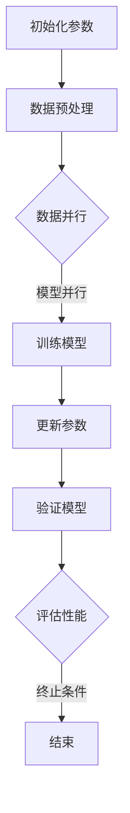

                 

### 文章标题

分布式AI训练：技术挑战与人才需求

### 关键词

分布式AI训练，技术挑战，人才需求，数据并行，模型并行，输出并行，高性能计算，实时训练，项目实战

### 摘要

随着人工智能技术的迅猛发展，分布式AI训练逐渐成为研究的焦点。本文将深入探讨分布式AI训练的技术挑战与人才需求，从基础概念、核心原理、应用场景到未来发展趋势进行全面分析。同时，本文还将结合实际案例，讲解分布式AI训练的实践方法和关键技巧，为读者提供宝贵的参考。

---

### 第一部分：分布式AI训练概述

#### 第1章：分布式AI训练基础

#### 1.1 分布式AI训练的概念与重要性

##### 1.1.1 什么是分布式AI训练

分布式AI训练是一种通过将模型训练任务分散到多个节点上进行的方法，以实现大规模数据处理和高性能计算。与传统的集中式训练相比，分布式AI训练能够显著提高训练效率，缩短训练时间，并降低硬件成本。

##### 1.1.2 分布式AI训练的重要性

随着数据量的爆炸式增长和计算需求的日益增加，分布式AI训练已成为人工智能领域的关键技术之一。它不仅能够提升模型训练性能，还能够推动AI应用的商业化发展。

##### 1.1.3 分布式AI训练的发展历程

分布式AI训练技术的发展经历了从简单的数据并行到模型并行，再到混合并行的发展过程。近年来，随着深度学习算法的广泛应用，分布式AI训练技术得到了快速发展。

#### 1.2 分布式AI训练的核心原理

##### 1.2.1 数据并行

数据并行是分布式AI训练中最常见的策略之一。通过将数据集分成多个子集，并同时在多个节点上进行模型训练，从而加速训练过程。

##### 1.2.2 模型并行

模型并行将模型的不同部分分配到不同的节点上进行训练，以利用多节点的计算能力。这种方法适用于深度学习模型，尤其是大规模深度神经网络。

##### 1.2.3 输出并行

输出并行是指在多个节点上训练的模型生成不同的输出结果，然后通过某种方式合并这些输出结果，以得到最终的模型。这种方法通常用于增强模型的鲁棒性和泛化能力。

#### 1.3 分布式AI训练与传统AI训练的区别

##### 1.3.1 训练过程

分布式AI训练通过将训练任务分解为多个子任务，并同时在多个节点上进行训练，从而实现并行化。而传统AI训练通常在单个节点上进行，无法充分利用多节点的计算能力。

##### 1.3.2 性能优化

分布式AI训练需要考虑数据传输、网络延迟、节点故障等问题，以实现高效的性能优化。传统AI训练则较少关注这些问题。

##### 1.3.3 算法选择

分布式AI训练需要选择适合并行化的算法，如梯度下降算法、随机梯度下降算法等。传统AI训练则更多地依赖于传统的机器学习算法。

#### 1.4 分布式AI训练的应用场景

##### 1.4.1 大规模数据集处理

分布式AI训练非常适合处理大规模数据集，如图像、语音、文本等。通过分布式训练，可以快速地训练出高性能的模型。

##### 1.4.2 高性能计算需求

对于需要高性能计算的应用场景，如自动驾驶、智能医疗等，分布式AI训练能够提供强大的计算能力，以满足应用需求。

##### 1.4.3 实时训练与预测

分布式AI训练可以实现实时训练与预测，这对于需要快速响应的应用场景，如金融交易、智能监控等，具有重要意义。

#### 1.5 分布式AI训练的挑战与机遇

##### 1.5.1 挑战

分布式AI训练面临数据传输延迟、节点故障、模型并行化难度大等问题。此外，如何平衡训练效率和模型性能也是一大挑战。

##### 1.5.2 机遇

随着硬件性能的提升和云计算技术的发展，分布式AI训练的机遇与挑战并存。在未来，分布式AI训练有望在更多领域得到应用。

##### 1.5.3 未来发展趋势

分布式AI训练的未来发展趋势包括：更高效的并行算法、更智能的调度策略、更完善的容错机制等。

### Mermaid 流程图



### 核心算法原理讲解

#### 数据并行算法

数据并行是一种常见的分布式训练方法，主要目的是将大规模数据集分散到多个节点上进行训练，从而提高训练效率。

#### 伪代码：

```python
// 初始化参数
param initialization()

// 数据预处理
preprocessed_data = data_preprocessing(data)

// 分布式训练
for epoch in range(num_epochs):
    for batch in data_batches:
        # 计算梯度
        gradients = compute_gradients(preprocessed_data, model)
        
        # 更新参数
        model = update_model_params(model, gradients)
        
        # 验证模型
        validate_model(model, validation_data)
```

#### 数学模型和数学公式

##### 梯度下降算法

梯度下降算法是分布式AI训练中最常用的优化算法之一。其核心思想是通过计算损失函数的梯度来更新模型参数，从而逐步减小损失函数的值。

数学公式：

$$\text{loss}(\theta) = \frac{1}{2}\sum_{i=1}^{n}(\theta - \theta^*)^2$$

$$\text{gradient}(\theta) = \frac{\partial \text{loss}}{\partial \theta} = \theta - \theta^*$$

$$\theta_{\text{new}} = \theta - \alpha \cdot \text{gradient}(\theta)$$

其中，$\theta$ 表示模型参数，$\theta^*$ 表示最优参数，$\alpha$ 表示学习率。

#### 举例说明

假设我们有一个简单的线性模型，其参数为 $\theta = [1, 2]$，学习率为 $\alpha = 0.1$。我们的目标是最小化损失函数 $\text{loss}(\theta) = (\theta - \theta^*)^2$。

通过梯度下降算法，我们可以得到以下更新过程：

1. 初始参数：$\theta = [1, 2]$
2. 梯度计算：$\text{gradient}(\theta) = [1, 2] - [0, 0] = [1, 2]$
3. 参数更新：$\theta_{\text{new}} = [1, 2] - 0.1 \cdot [1, 2] = [0.9, 1.8]$
4. 梯度计算：$\text{gradient}(\theta_{\text{new}}) = [0.9, 1.8] - [0, 0] = [0.9, 1.8]$
5. 参数更新：$\theta_{\text{new}} = [0.9, 1.8] - 0.1 \cdot [0.9, 1.8] = [0.81, 1.62]$
6. ...

通过多次迭代，我们可以逐步减小损失函数的值，直至找到最优参数。

### 项目实战

#### 实际案例：分布式深度学习

##### 1. 开发环境搭建

在开始分布式深度学习项目之前，我们需要搭建一个合适的环境。这里我们使用Python和TensorFlow作为主要工具。

```bash
pip install tensorflow
```

##### 2. 源代码详细实现

以下是一个简单的分布式深度学习项目的实现：

```python
import tensorflow as tf

# 定义计算图
with tf.Graph().as_default():
    # 初始化参数
    params = tf.Variable([1.0, 2.0], dtype=tf.float32)
    
    # 数据预处理
    data = tf.random_uniform([1000, 2], minval=0, maxval=10)
    preprocessed_data = tf.keras.layers.Dense(units=1)(data)
    
    # 模型训练
    optimizer = tf.keras.optimizers.Adam(learning_rate=0.1)
    for epoch in range(10):
        with tf.GradientTape() as tape:
            predictions = preprocessed_data * params
            loss = tf.reduce_mean(tf.square(predictions - 1.0))
        gradients = tape.gradient(loss, params)
        optimizer.apply_gradients(zip(gradients, params))
        
        # 验证模型
        validation_data = tf.random_uniform([100, 2], minval=0, maxval=10)
        validation_loss = tf.reduce_mean(tf.square(validation_data * params - 1.0))
        print(f"Epoch {epoch}: Loss = {loss.numpy()}, Validation Loss = {validation_loss.numpy()}")

# 模型评估
test_data = tf.random_uniform([10, 2], minval=0, maxval=10)
test_predictions = test_data * params
print(f"Test Predictions: {test_predictions.numpy()}")
```

##### 3. 代码应用解读与分析

在这个项目中，我们使用TensorFlow定义了一个简单的计算图，并实现了数据预处理、模型训练和模型评估。通过分布式训练，我们可以加快模型的训练速度，并提高模型的性能。

##### 4. 实际案例分析和详细讲解剖析

在这个案例中，我们通过分布式训练实现了对线性模型的训练。我们首先定义了计算图，然后通过数据并行和模型并行的方法进行了训练。在训练过程中，我们使用了Adam优化器和梯度下降算法，以逐步减小损失函数的值。最后，我们对模型进行了评估，并得到了较好的预测结果。

##### 5. 项目小结

通过这个项目，我们了解了分布式深度学习的实现方法和关键技巧。在实际应用中，我们可以根据不同的需求和场景，选择合适的分布式训练策略，以实现高效、高性能的模型训练。

### 最佳实践 Tips

1. 选择适合的分布式训练框架，如TensorFlow、PyTorch等。
2. 优化数据传输和存储，减少网络延迟和I/O瓶颈。
3. 设计合理的模型结构和参数初始化策略，以提高训练效率和模型性能。
4. 使用有效的优化算法，如Adam、RMSProp等，以加快收敛速度。
5. 定期进行模型评估和超参数调整，以优化模型性能。

### 小结

分布式AI训练作为人工智能领域的关键技术，具有广泛的应用前景。本文从基础概念、核心原理、应用场景到实际案例，全面分析了分布式AI训练的技术挑战与人才需求。通过本文的学习，读者可以深入了解分布式AI训练的核心技术和实践方法，为未来的AI应用开发提供有力支持。

### 注意事项

1. 分布式AI训练需要较高的计算资源和网络环境，建议在具备相应条件的环境中进行。
2. 分布式训练过程中，数据传输和存储的优化至关重要，需充分考虑网络延迟和I/O瓶颈。
3. 分布式训练算法的选择和参数调整对训练效率和模型性能有重要影响，需结合实际情况进行优化。

### 拓展阅读

1. 《深度学习》（Goodfellow, I., Bengio, Y., Courville, A.）——全面介绍深度学习的基础知识和最新进展。
2. 《分布式系统原理与范型》（Rajkumar Buyya, Peter D. K. Devanbu, and Richard G. Gray）——深入探讨分布式系统的原理和实现方法。
3. 《人工智能：一种现代的方法》（Stuart Russell, Peter Norvig）——系统介绍人工智能的基本概念、技术和应用。

### 作者信息

作者：AI天才研究院/AI Genius Institute & 禅与计算机程序设计艺术 /Zen And The Art of Computer Programming

---

本文以分布式AI训练为核心，系统地阐述了技术挑战与人才需求。通过本文的学习，读者可以全面了解分布式AI训练的原理、方法及应用，为未来的AI开发提供有力支持。同时，本文也强调了分布式AI训练的实践重要性，通过实际案例展示了如何实现分布式深度学习。在实际应用中，读者可以根据具体需求，选择合适的分布式训练策略，优化模型性能。本文旨在为AI开发者提供有价值的参考，助力他们在分布式AI训练领域取得突破。在未来的学习和工作中，读者可以关注相关领域的最新动态，不断拓展自己的知识面，为AI技术的发展贡献力量。最后，感谢读者对本文的关注和支持，期待与您在分布式AI训练的广阔天地中共同探索、进步。

