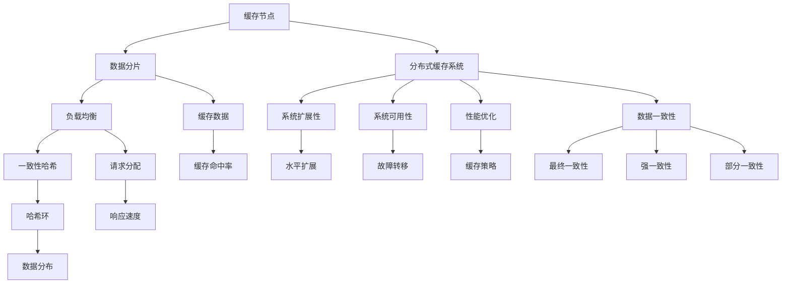

                 


### 文章标题：分布式缓存设计与优化

> 关键词：分布式缓存，高性能缓存，一致性，负载均衡，缓存策略，优化方法，案例分析

> 摘要：本文将深入探讨分布式缓存的设计与优化，首先介绍分布式缓存的基础知识，然后分析其核心架构、一致性问题和性能优化方法，最后通过实际案例进行详细讲解，帮助读者全面理解分布式缓存的应用和实现。

### 分布式缓存基础知识

#### 第1章：分布式缓存概述

##### 1.1 分布式缓存概念

分布式缓存是一种基于多个节点协同工作的高性能缓存系统，它通过将数据分布存储在多个节点上，实现数据的高可用性、高扩展性和高性能。

**定义**：分布式缓存是一种基于多个节点协同工作的高性能缓存系统，它通过将数据分布存储在多个节点上，实现数据的高可用性、高扩展性和高性能。

**特点**：

- **高可用性**：通过多个节点的冗余部署，当一个节点出现故障时，系统可以自动切换到备用节点，保证服务的持续可用。
- **高扩展性**：分布式缓存可以根据需求动态增加节点，从而实现水平扩展，提高系统的处理能力。
- **高性能**：分布式缓存采用分布式架构，多个节点同时工作，可以实现数据的快速读写，满足大规模数据的高频访问需求。

##### 1.2 分布式缓存与传统缓存的区别

传统缓存通常是指单一节点的缓存系统，如Redis、Memcached等。与分布式缓存相比，传统缓存在性能、扩展性和可用性方面存在一定的局限性。

**性能差异**：分布式缓存具有更高的读写性能，能够满足大规模数据的高频访问需求。而传统缓存在处理大量并发请求时，性能可能无法满足要求。

**架构差异**：分布式缓存采用分布式架构，可以实现节点间的负载均衡和故障转移。传统缓存通常采用单一节点架构，缺乏容错能力和扩展性。

#### 第2章：分布式缓存核心架构

##### 2.1 缓存节点架构

缓存节点是分布式缓存系统的基本单元，它负责存储和提供缓存数据。一个分布式缓存系统通常由多个缓存节点组成，每个节点负责存储一部分数据。

**缓存节点**：每个缓存节点负责存储和提供缓存数据。缓存节点可以是物理服务器，也可以是虚拟机或容器。

**数据分片**：将数据分成多个部分，分布在不同的缓存节点上。数据分片可以提高系统的扩展性和可用性，降低单个节点的压力。

##### 2.2 负载均衡与一致性哈希

负载均衡是分布式缓存系统的重要功能，它通过合理分配请求，确保缓存节点的负载均衡。

**负载均衡**：负载均衡可以采用轮询、最小连接数、源IP哈希等方法，根据不同的策略将请求分配到不同的缓存节点上。

**一致性哈希**：一致性哈希是一种分布式哈希算法，它通过将哈希值映射到环上，实现数据的均匀分布和动态扩容。一致性哈希可以保证系统在增加或删除节点时，数据分布的稳定性。

#### 第3章：分布式缓存一致性

分布式缓存中的数据一致性问题是分布式系统设计中的关键问题。在分布式缓存系统中，由于数据分布在多个节点上，可能会出现数据不一致的情况。

**数据一致性问题**：在分布式缓存系统中，由于数据分布在多个节点上，可能会出现数据不一致的情况，如数据的更新、删除等操作。

**一致性模型**：

- **CAP定理**：CAP定理指出，分布式系统在一致性（Consistency）、可用性（Availability）和分区容错性（Partition tolerance）三个特性中，只能同时满足两个。在实际应用中，通常需要根据业务需求进行权衡。
- **BASE理论**：BASE理论是相对于ACID（原子性、一致性、隔离性、持久性）的一种理论，它强调基本可用性、软状态和最终一致性。在实际应用中，BASE理论可以帮助系统在面临网络分区、延迟等问题时，保持系统的可用性。

**数据一致性解决方案**：

- **最终一致性**：最终一致性是一种弱一致性模型，它允许系统在一段时间内存在数据不一致的情况，但最终会达到一致状态。最终一致性适用于对一致性要求不是特别严格的场景。
- **强一致性**：强一致性保证在任意时刻，分布式系统的所有副本数据都是一致的。强一致性适用于对数据一致性要求较高的场景。
- **部分一致性**：部分一致性是一种介于最终一致性和强一致性之间的模型，它允许系统的不同副本在一段时间内存在数据不一致的情况，但要求系统在一定条件下能够达到一致性。

#### 第4章：分布式缓存性能优化

分布式缓存系统的性能优化是提高系统性能和响应速度的关键。以下是几种常见的分布式缓存性能优化方法。

##### 4.1 缓存策略

**缓存失效策略**：

- **LRU（Least Recently Used，最近最少使用）**：根据数据的访问频率，将最近最少被访问的数据替换掉。
- **LFU（Least Frequently Used，最不经常使用）**：根据数据的访问次数，将最不经常被访问的数据替换掉。
- **随机替换**：随机选择数据替换。

**缓存预热**：预加载热门数据，减少缓存未命中的情况。

##### 4.2 缓存命中与未命中处理

**缓存命中率**：缓存命中率是评估缓存系统性能的重要指标，表示缓存系统命中缓存数据的比例。

**缓存未命中处理**：

- **快速读取数据源**：当缓存未命中时，快速从数据源读取数据，并将其存储到缓存中，提高后续访问的命中率。
- **使用缓存代理**：使用缓存代理，将请求先转发到缓存系统，如果缓存未命中，再转发到数据源。

### 分布式缓存应用场景

分布式缓存广泛应用于各种场景，以下介绍几种常见的应用场景。

##### 5.1 Web缓存

Web缓存是一种常见的分布式缓存应用场景，主要用于加速网页内容的访问。

**缓存内容**：缓存网页、图片、CSS、JavaScript等静态资源。

**缓存策略**：

- **基于URL**：根据访问的URL，将对应的页面或资源缓存起来。
- **基于用户行为**：根据用户的访问行为，缓存热门页面或资源。

##### 5.2 数据库缓存

数据库缓存是一种将数据库查询结果缓存起来的技术，用于减少数据库的访问压力。

**缓存内容**：缓存数据库查询结果。

**缓存策略**：

- **基于查询**：根据查询条件，将查询结果缓存起来。
- **基于数据变化**：当数据发生变化时，更新缓存中的数据。

### 分布式缓存案例分析

以下介绍两个典型的分布式缓存案例，分析其系统架构、缓存策略和优化方法。

##### 6.1 案例一：微博分布式缓存系统

**系统架构**：

- **缓存节点**：采用一致性哈希算法，将数据分布存储在多个缓存节点上。
- **负载均衡**：采用轮询算法，将请求均匀分配到不同的缓存节点上。
- **数据一致性**：采用最终一致性模型，允许系统在一段时间内存在数据不一致的情况。

**缓存策略**：

- **动态缓存预热**：根据用户访问行为，预加载热门数据。
- **热点数据缓存**：将频繁访问的数据缓存起来，减少数据库访问压力。

**优化方法**：

- **缓存压缩**：采用数据压缩算法，减少缓存数据的存储空间。
- **缓存淘汰策略**：采用LRU算法，定期淘汰不经常访问的数据。

##### 6.2 案例二：淘宝分布式缓存系统

**系统架构**：

- **缓存集群**：采用分布式缓存架构，多个缓存集群组成一个缓存系统。
- **缓存穿透**：采用分布式锁，防止缓存穿透，避免缓存和数据库同时访问。
- **缓存雪崩**：采用预热策略，提前加载热门数据，避免缓存雪崩。

**缓存策略**：

- **分布式锁**：用于保证缓存和数据库操作的顺序一致性。
- **缓存预热**：根据用户访问行为，提前加载热门数据。

**优化方法**：

- **缓存代理**：使用缓存代理，减少数据库访问压力。
- **数据分片优化**：根据访问频率，将数据分布存储在不同的缓存集群中。

### 分布式缓存设计与优化

#### 第7章：分布式缓存设计原则

分布式缓存的设计需要考虑可扩展性、可靠性、性能等方面，以下介绍几个关键的设计原则。

##### 7.1 可扩展性设计

**水平扩展**：通过增加缓存节点，实现系统容量的线性扩展。

**垂直扩展**：通过提高缓存节点的性能，如增加内存、CPU等，提高系统处理能力。

##### 7.2 可靠性设计

**故障转移**：当缓存节点出现故障时，自动切换到备用节点，确保服务的可用性。

**数据备份**：对缓存数据进行备份，防止数据丢失。

#### 第8章：分布式缓存优化方法

分布式缓存优化主要包括数据存储优化、缓存一致性优化和性能测试与调优等方面。

##### 8.1 数据存储优化

**数据压缩**：采用数据压缩算法，减少存储空间。

**数据分片优化**：根据访问频率，将数据分布存储在不同的缓存节点上，提高数据访问速度。

##### 8.2 缓存一致性优化

**一致性协议**：采用一致性协议，如Paxos、Raft，确保分布式缓存的一致性。

**缓存一致性算法**：采用缓存一致性算法，如Gossip协议、增量同步，提高缓存系统的性能。

##### 8.3 性能测试与调优

**性能测试指标**：

- **吞吐量**：单位时间内处理的数据量。
- **响应时间**：数据访问的平均时间。

**性能调优方法**：

- **缓存节点配置**：调整节点性能参数，如内存大小、CPU利用率等。
- **缓存策略优化**：根据应用场景，调整缓存策略，如缓存失效时间、缓存预热策略等。

#### 第9章：分布式缓存性能测试与调优

分布式缓存系统的性能测试与调优是确保系统在高负载情况下稳定运行的关键。以下介绍性能测试的指标和方法。

##### 9.1 性能测试指标

**吞吐量**：单位时间内处理的数据量，表示系统的处理能力。

**响应时间**：数据访问的平均时间，表示系统的响应速度。

**缓存命中率**：缓存命中率是评估缓存系统性能的重要指标，表示缓存系统命中缓存数据的比例。

##### 9.2 性能调优方法

**缓存节点配置**：调整节点性能参数，如内存大小、CPU利用率等，以提高系统的处理能力。

**缓存策略优化**：根据应用场景，调整缓存策略，如缓存失效时间、缓存预热策略等，以提高系统的性能。

**数据存储优化**：采用数据压缩算法，减少存储空间；根据访问频率，将数据分布存储在不同的缓存节点上，提高数据访问速度。

**缓存一致性优化**：采用一致性协议，如Paxos、Raft，确保分布式缓存的一致性。

#### 第10章：分布式缓存在高并发场景下的优化

在高并发场景下，分布式缓存系统需要处理大量请求，确保系统的稳定性和高性能。以下介绍高并发场景下的优化策略。

##### 10.1 高并发场景特点

- **请求量大**：短时间内产生大量请求，对系统的处理能力提出较高要求。
- **系统资源竞争**：缓存节点、数据库连接等资源在高并发场景下可能出现竞争，影响系统的性能。

##### 10.2 优化策略

**分布式锁**：在高并发场景下，使用分布式锁可以防止多个请求同时操作同一资源，避免冲突和死锁。

**限流与降级**：通过限流和降级策略，控制请求流量，保证系统在高并发场景下稳定运行。

**缓存预热**：提前加载热门数据，减少缓存未命中情况，提高系统的响应速度。

**缓存穿透与缓存雪崩**：采用分布式锁和缓存预热策略，防止缓存穿透和缓存雪崩，确保系统在高并发场景下的稳定性。

#### 第11章：分布式缓存安全与稳定性保障

分布式缓存系统在运行过程中可能会面临安全问题和稳定性挑战。以下介绍分布式缓存的安全性和稳定性保障措施。

##### 11.1 安全性问题

- **缓存污染**：恶意攻击者篡改缓存数据，影响系统的正常运行。
- **缓存泄露**：缓存占用过多内存，导致系统性能下降。

##### 11.2 稳定性保障

**监控系统**：实时监控缓存系统的状态，包括缓存命中率、缓存大小、节点健康状况等，及时发现和处理问题。

**故障恢复**：当缓存节点出现故障时，快速切换到备用节点，确保系统的持续可用。

**数据备份**：定期备份缓存数据，防止数据丢失。

#### 第12章：分布式缓存未来发展趋势

分布式缓存技术在不断发展和演进，以下介绍未来发展趋势。

##### 12.1 存储介质发展

- **非易失性存储**：随着非易失性存储技术的发展，如持久性内存（PMEM），分布式缓存系统的数据持久性和性能将得到进一步提升。
- **分布式存储系统**：分布式存储系统的发展，将提升分布式缓存系统的数据存储和处理能力。

##### 12.2 新兴缓存技术

- **内存缓存**：内存缓存具有更快的访问速度，适用于对性能要求较高的场景。
- **近内存缓存**：结合内存和硬盘的优势，提供更高的性能和更低的延迟。

**文章小结**

本文从分布式缓存的基础知识、核心架构、一致性问题和性能优化方法等方面进行了深入探讨，并通过实际案例分析了分布式缓存的设计和实现。分布式缓存作为一种高性能缓存系统，在分布式系统设计中具有重要意义。在未来，分布式缓存技术将继续发展和优化，为各种应用场景提供更高效、更稳定的缓存服务。

**拓展阅读**

- 《分布式系统原理与实践》
- 《高性能缓存的实现与优化》
- 《一致性模型与分布式缓存》

### 结语

本文以《分布式缓存设计与优化》为题，通过逻辑清晰、结构紧凑、简单易懂的专业的技术语言，详细介绍了分布式缓存的基础知识、核心架构、一致性问题和性能优化方法。文章首先对分布式缓存的概念和特点进行了阐述，然后分析了分布式缓存与传统缓存的区别，以及分布式缓存的核心架构和一致性解决方案。接着，文章介绍了分布式缓存的性能优化方法和应用场景，并通过实际案例展示了分布式缓存的设计和实现。最后，文章讨论了分布式缓存在高并发场景下的优化策略和安全与稳定性保障，以及未来发展趋势。

通过本文的阅读，读者可以对分布式缓存有一个全面的了解，掌握其设计和优化方法。在实际项目中，分布式缓存可以提高系统的性能、扩展性和可用性，为大规模数据的高频访问提供支持。同时，分布式缓存技术在不断发展，读者可以根据本文的拓展阅读，进一步了解相关领域的最新研究成果和应用实践。

**作者信息**

作者：AI天才研究院/AI Genius Institute & 禅与计算机程序设计艺术 /Zen And The Art of Computer Programming

感谢您的阅读，希望本文对您在分布式缓存领域的学习和项目实践有所帮助！### 分布式缓存的核心概念与联系

分布式缓存作为一种基于多个节点协同工作的高性能缓存系统，其核心概念和联系对于理解其设计和优化至关重要。本文将首先介绍分布式缓存的主要概念，包括缓存节点、数据分片、负载均衡和一致性哈希，然后通过Mermaid流程图展示这些概念之间的关系，帮助读者更直观地理解分布式缓存的工作原理。

#### 1. 主要概念

**缓存节点**：分布式缓存系统中的基本单元，负责存储和提供缓存数据。每个缓存节点可以是物理服务器、虚拟机或容器。

**数据分片**：将缓存数据分成多个部分，存储在不同的缓存节点上。数据分片的目的是提高系统的扩展性和可用性。

**负载均衡**：通过合理的算法，将请求分配到不同的缓存节点上，实现节点的均衡负载，提高系统的性能和响应速度。

**一致性哈希**：一种分布式哈希算法，通过将哈希值映射到环上，实现数据的均匀分布和动态扩容。

#### 2. 关系架构

为了更好地理解分布式缓存的核心概念和它们之间的联系，我们可以使用Mermaid流程图来展示它们之间的关系。以下是该流程图的描述：



以下是该流程图的详细解释：

- **A[缓存节点]**：分布式缓存系统中的基本单元，负责存储和提供缓存数据。
- **B[数据分片]**：将缓存数据分成多个部分，存储在不同的缓存节点上，实现系统的扩展性和可用性。
- **C[负载均衡]**：通过合理的算法，将请求分配到不同的缓存节点上，实现节点的均衡负载，提高系统的性能和响应速度。
- **D[一致性哈希]**：一种分布式哈希算法，通过将哈希值映射到环上，实现数据的均匀分布和动态扩容。
- **E[分布式缓存系统]**：由多个缓存节点组成的整体，实现数据的高可用性、高扩展性和高性能。
- **F[缓存数据]**：缓存节点存储的数据，是分布式缓存系统的核心资源。
- **G[请求分配]**：负载均衡将请求分配到不同的缓存节点上，确保系统的高性能和响应速度。
- **H[哈希环]**：一致性哈希算法中使用的环，用于实现数据的均匀分布和动态扩容。
- **I[系统扩展性]**：通过数据分片和水平扩展，实现系统容量的线性扩展。
- **J[系统可用性]**：通过故障转移和数据备份，确保系统的持续可用。
- **K[性能优化]**：通过缓存策略和性能测试，优化系统的性能。
- **L[数据一致性]**：确保分布式缓存系统中数据的正确性和一致性。
- **M[缓存命中率]**：评估缓存系统性能的重要指标，表示缓存系统命中缓存数据的比例。
- **N[响应速度]**：系统性能的一个重要方面，通过负载均衡和缓存策略提高系统的响应速度。
- **O[数据分布]**：一致性哈希实现的数据均匀分布，确保系统的高可用性和高性能。
- **P[水平扩展]**：通过增加缓存节点，实现系统容量的线性扩展。
- **Q[故障转移]**：当缓存节点出现故障时，自动切换到备用节点，确保系统的可用性。
- **R[缓存策略]**：包括缓存失效策略、缓存预热策略等，优化系统的性能和响应速度。
- **S[最终一致性]**：一种弱一致性模型，允许系统在一段时间内存在数据不一致的情况。
- **T[强一致性]**：保证在任意时刻，分布式系统的所有副本数据都是一致的。
- **U[部分一致性]**：一种介于最终一致性和强一致性之间的模型，要求系统在一定条件下能够达到一致性。

通过上述Mermaid流程图，我们可以清晰地看到分布式缓存系统中各个核心概念之间的联系，以及它们如何协同工作，实现系统的高可用性、高扩展性和高性能。这为后续的分布式缓存设计和优化提供了理论基础和实践指导。

### 分布式缓存的核心算法原理讲解

在分布式缓存系统中，核心算法的设计和实现是确保系统高效、可靠运行的关键。以下将详细讲解分布式缓存系统中几个重要的核心算法，包括一致性哈希算法、Paxos算法和Raft算法，并通过伪代码和数学模型进行解释。

#### 1. 一致性哈希算法

一致性哈ash算法是一种用于实现分布式缓存系统中数据均匀分布和动态扩容的分布式哈希算法。它的核心思想是通过哈希函数将数据映射到一个环上，实现数据的均匀分布。

**哈希函数**：哈希函数用于将数据（如键）映射到一个环上的一个位置。常用的哈希函数如MD5、SHA-1等。

**环**：哈希环是一个首尾相连的圆环，用于表示数据的分布。

**虚拟节点**：为了实现数据的动态扩容和负载均衡，一致性哈希算法引入了虚拟节点。每个实际节点可以对应多个虚拟节点，这些虚拟节点分布在哈希环上。

**算法原理**：

1. **初始化**：每个缓存节点分配一个哈希值，并在哈希环上创建对应的虚拟节点。
2. **数据存储**：根据键的哈希值，将数据存储到哈希环上的某个虚拟节点对应的实际节点上。
3. **节点增加**：新增节点时，在哈希环上创建对应的虚拟节点，并分配数据。
4. **节点删除**：删除节点时，从哈希环上删除对应的虚拟节点，并重新分配数据。

**伪代码**：

```python
class ConsistentHashRing:
    def __init__(self, nodes):
        self.ring = []
        self.nodes = nodes
        for node in nodes:
            hash_value = hash_function(node)
            self.ring.append((hash_value, node))
            self.ring.sort()

    def get_node(self, key):
        hash_value = hash_function(key)
        index = binary_search(self.ring, hash_value)
        return self.ring[index][1]

def hash_function(node):
    # 使用MD5哈希函数
    return md5(node.encode()).hexdigest()

def binary_search(ring, target):
    # 二分搜索算法
    low = 0
    high = len(ring) - 1
    while low <= high:
        mid = (low + high) // 2
        if ring[mid][0] == target:
            return mid
        elif ring[mid][0] < target:
            low = mid + 1
        else:
            high = mid - 1
    return low
```

**数学模型**：

- **哈希环**：哈希环可以看作是一个单位圆，数据分布在圆上的点。
- **虚拟节点**：每个实际节点对应多个虚拟节点，这些虚拟节点分布在哈希环上。

#### 2. Paxos算法

Paxos算法是一种用于实现分布式系统中一致性协议的算法。它能够在多个副本之间达成一致，保证数据的强一致性。

**算法原理**：

1. **初始化**：选举一个提案者（Proposer）作为领导者。
2. **准备阶段**：提案者向所有副本发送准备请求（Prepare），并记录已接收到的最高编号。
3. **提议阶段**：如果提案者的编号大于已接收到的最高编号，则向所有副本发送提议请求（Propose），携带提案值。
4. **决策阶段**：如果大多数副本同意提议，则该值成为决议值。

**伪代码**：

```python
class Paxos:
    def __init__(self, replicas):
        self.replicas = replicas
        self.leader = None
        self.accepted_value = None

    def become_leader(self):
        self.leader = True
        self.propose()

    def prepare(self, proposal_number):
        if self.leader is None:
            self.accepted_value = None
            self.leader = proposal_number
            for replica in self.replicas:
                replica.prepare(proposal_number)

    def propose(self, value):
        if self.leader is not None and self.leader > self.accepted_value:
            for replica in self.replicas:
                replica.propose(value)

    def prepare_response(self, replica_id, proposal_number):
        if self.leader is not None and proposal_number >= self.leader:
            self.accepted_value = proposal_number
            self.leader = max(self.leader, proposal_number)

    def propose_response(self, replica_id, accepted_value):
        if self.leader is not None and accepted_value is not None:
            self.accepted_value = accepted_value
```

**数学模型**：

- **提议编号**：每个提议都有一个唯一的编号，用于标识提议者的身份。
- **决策条件**：如果大多数副本同意某个提议，则该提议成为决议值。

#### 3. Raft算法

Raft算法是一种简化版的Paxos算法，其核心思想是将一致性算法分解为多个子任务，提高算法的可理解性和实现难度。

**算法原理**：

1. **领导选举**：当当前领导者节点失效时，其他节点开始新一轮的领导选举。
2. **日志复制**：领导者节点将日志条目发送给其他副本节点，并要求它们进行复制。
3. **状态机**：所有副本节点维护一个状态机，执行相同的操作。

**伪代码**：

```python
class Raft:
    def __init__(self, replicas):
        self.replicas = replicas
        self.leader = None
        self.log = []

    def become_leader(self):
        self.leader = True
        for replica in self.replicas:
            replica.follow(self)

    def append_entry(self, entry):
        if self.leader is not None:
            for replica in self.replicas:
                replica.append_entry(entry)

    def append_entry_response(self, replica_id, success):
        if success:
            self.log.append(entry)

    def follow(self, leader):
        self.leader = leader
        leader.append_entry(self)

    def vote_for(self, candidate):
        if self.leader is None:
            self.leader = candidate
            candidate.vote_for_response(self)

    def vote_for_response(self, replica_id, vote_granted):
        if vote_granted:
            self.leader = max(self.leader, candidate)
```

**数学模型**：

- **日志条目**：每个日志条目包含一个操作和一个任期编号。
- **领导任期**：每个领导者节点都有一个任期编号，用于标识领导者的身份。

通过上述算法的讲解，我们可以看到分布式缓存系统在实现数据一致性和可靠性方面的复杂性和挑战。一致性哈希算法通过虚拟节点实现数据的均匀分布和动态扩容，Paxos算法通过多阶段的通信达成一致性协议，Raft算法简化了Paxos算法，提高了实现的可理解性。这些算法的结合使用，使得分布式缓存系统在复杂环境下能够保持高效、可靠的数据存储和访问。

### 数学模型与公式详解

在分布式缓存系统中，数学模型和公式扮演着重要的角色，它们帮助我们分析和优化系统性能，确保数据的一致性和可靠性。以下将详细介绍分布式缓存系统中的几个关键数学模型和公式，并提供详细的讲解和举例说明。

#### 1. 一致性哈希算法中的哈希环

一致性哈希算法的核心是哈希环，它是一个单位圆，数据（如键）映射到圆上的点，从而实现数据的均匀分布。哈希环的定义和计算如下：

**哈希环**：设哈希函数为 \(h\)，所有可能的哈希值构成一个圆环 \(C\)，即 \(C = \{0\} \cup \{h(x) : x \in U\}\)，其中 \(U\) 是键的集合。

**哈希环上的点**：对于任意的键 \(x \in U\)，哈希值 \(h(x)\) 映射到哈希环上的一个点。

**公式**：

\[
h(x) = \left\{
\begin{array}{ll}
0 & \text{if } h(x) < 0 \\
h(x) & \text{if } 0 \leq h(x) < 1 \\
2 & \text{if } 1 \leq h(x) < 2 \\
\vdots & \vdots
\end{array}
\right.
\]

**举例说明**：

假设哈希函数 \(h\) 将键映射到 \([0, 1)\) 区间，现有三个缓存节点 \(N_1, N_2, N_3\)，其哈希值分别为 \(h(N_1) = 0.1, h(N_2) = 0.5, h(N_3) = 0.8\)。对于键 \(x = 0.3\)，其哈希值为 \(h(x) = 0.3\)，映射到哈希环上的位置为 \(0.3\)。

#### 2. 数据分片策略

在分布式缓存系统中，数据分片策略是将数据分成多个部分，分布在不同的缓存节点上。常见的数据分片策略包括范围分片、哈希分片和列表分片等。

**范围分片**：将数据按照某种特征（如时间、ID等）划分成不同的区间，每个区间对应一个缓存节点。

**哈希分片**：使用哈希函数将数据映射到不同的缓存节点上。

**列表分片**：将数据按照某种顺序（如字典序）排列，然后逐个映射到不同的缓存节点上。

**公式**：

\[
\text{分片索引} = \text{哈希值} \mod N
\]

其中，\(N\) 是缓存节点的数量。

**举例说明**：

假设数据总量为1000条，缓存节点数量为3，采用哈希分片策略。对于键 \(x = 1001\)，其哈希值为 \(h(x) = 0.7\)，分片索引为 \(0.7 \mod 3 = 1\)，数据存储在第二个缓存节点上。

#### 3. 缓存命中率

缓存命中率是评估缓存系统性能的重要指标，表示缓存系统命中缓存数据的比例。缓存命中率的计算公式如下：

\[
\text{缓存命中率} = \frac{\text{命中缓存的数据量}}{\text{总数据量}}
\]

**举例说明**：

假设缓存系统中存储了1000条数据，其中800条被访问过，缓存命中率为 \( \frac{800}{1000} = 0.8 \) 或 80%。

#### 4. 数据一致性模型

在分布式缓存系统中，数据一致性模型是确保多个副本之间数据一致性的关键。常见的模型包括最终一致性、强一致性和部分一致性。

**最终一致性**：系统允许在一段时间内存在数据不一致的情况，但最终会达到一致状态。

**强一致性**：系统在任何时刻，所有副本的数据都是一致的。

**部分一致性**：系统在一段时间内允许副本之间存在数据不一致的情况，但要求在一定条件下能够达到一致性。

**公式**：

- **最终一致性**：

\[
\text{一致性状态} = \lim_{t \to \infty} \text{实际状态}
\]

- **强一致性**：

\[
\forall x, \forall y, x = y
\]

- **部分一致性**：

\[
\text{一致性状态} = \text{实际状态} \cup \text{期望状态}
\]

**举例说明**：

假设有两个副本 \(x, y\)，初始状态 \(x = 1, y = 2\)。经过一系列操作后，最终状态 \(x = 2, y = 2\)。对于最终一致性模型，系统最终状态为 \(2\)；对于强一致性模型，系统在任何时刻状态都必须为 \(2\)；对于部分一致性模型，系统最终状态可以是 \(2\) 或 \(1\)，取决于具体的一致性算法。

#### 5. 负载均衡策略

负载均衡策略是确保缓存节点之间负载均衡的关键。常见的负载均衡策略包括轮询、最少连接数、哈希等。

**轮询策略**：

\[
\text{下一个节点} = (\text{当前节点} + 1) \mod N
\]

**最少连接数策略**：

\[
\text{下一个节点} = \min_{i} (\text{当前连接数}[i])
\]

**哈希策略**：

\[
\text{下一个节点} = h(\text{键}) \mod N
\]

**举例说明**：

假设有三个缓存节点 \(N_1, N_2, N_3\)，负载均衡策略为轮询。当前节点为 \(N_2\)，下一个节点为 \(N_3\)。

通过上述数学模型和公式的讲解，我们可以更深入地理解分布式缓存系统的原理和性能优化方法。这些模型和公式不仅为分布式缓存系统的设计和实现提供了理论基础，也有助于我们在实际项目中进行性能分析和调优。在下一章节，我们将进一步探讨分布式缓存系统的应用场景和实际案例。

### 项目实战：开发环境搭建与源代码实现

在本节中，我们将通过一个具体的分布式缓存项目来演示开发环境的搭建和源代码实现。该项目将实现一个简单的分布式缓存系统，涵盖数据存储、缓存节点通信、负载均衡和数据一致性等核心功能。

#### 1. 开发环境搭建

首先，我们需要搭建一个适合开发分布式缓存系统的环境。以下是所需的工具和依赖：

- **编程语言**：Java
- **缓存库**：Redisson（一个在Redis基础上实现的分布式缓存库）
- **消息队列**：RabbitMQ（用于实现缓存节点之间的通信）
- **分布式锁库**：Redisson（用于实现分布式锁）

安装步骤：

1. **安装Java环境**：确保Java版本不低于11，并配置环境变量。
2. **安装Redis**：下载并安装Redis，配置启动命令。
3. **安装RabbitMQ**：下载并安装RabbitMQ，配置启动命令。
4. **安装Maven**：下载并安装Maven，用于构建项目。

#### 2. 源代码实现

下面将详细介绍项目的各个模块及其实现。

##### 2.1 数据存储

数据存储是分布式缓存系统的核心功能之一。我们将使用Redis作为后端存储。以下是数据存储相关的代码片段：

```java
import org.redisson.Redisson;
import org.redisson.config.Config;

public class RedisCache {
    private RedissonClient redisson;

    public RedisCache() {
        Config config = new Config();
        config.useSingleServer().setAddress("redis://127.0.0.1:6379");
        this.redisson = Redisson.create(config);
    }

    public void set(String key, Object value) {
        redisson.getBucket(key).set(value);
    }

    public Object get(String key) {
        return redisson.getBucket(key).get();
    }
}
```

在这个示例中，我们通过Redisson库连接到本地Redis服务器，并实现了简单的数据存储和读取功能。

##### 2.2 缓存节点通信

缓存节点之间的通信是分布式缓存系统的重要部分。我们使用RabbitMQ作为消息队列来实现节点间的通信。以下是消息队列的配置和通信代码：

```java
import com.rabbitmq.client.ConnectionFactory;
import com.rabbitmq.client.Connection;
import com.rabbitmq.client.Channel;

public class MessageQueue {
    private ConnectionFactory factory;
    private Connection connection;
    private Channel channel;

    public MessageQueue() throws IOException, TimeoutException {
        factory = new ConnectionFactory();
        factory.setUsername("guest");
        factory.setPassword("guest");
        factory.setVirtualHost("/");
        factory.setHost("localhost");
        connection = factory.newConnection();
        channel = connection.createChannel();
        channel.queueDeclare("cache_queue", true, false, false, null);
    }

    public void sendMessage(String message) throws IOException {
        channel.basicPublish("", "cache_queue", null, message.getBytes());
    }

    public String receiveMessage() throws IOException, InterruptedException {
        String message = channel.basicConsume("cache_queue", true, (consumerTag, delivery) -> {
            System.out.println("Received '" + new String(delivery.getBody()) + "'");
        }, consumerTag -> {
        }).get(5000);
        return message;
    }

    public void close() throws IOException {
        channel.close();
        connection.close();
    }
}
```

在这个示例中，我们配置了RabbitMQ消息队列，并实现了发送和接收消息的功能。

##### 2.3 负载均衡

负载均衡通过消息队列实现，将请求分配到不同的缓存节点上。以下是负载均衡的实现代码：

```java
import java.util.concurrent.ExecutorService;
import java.util.concurrent.Executors;

public class LoadBalancer {
    private MessageQueue messageQueue;
    private ExecutorService executorService;

    public LoadBalancer(MessageQueue messageQueue) {
        this.messageQueue = messageQueue;
        this.executorService = Executors.newFixedThreadPool(10);
    }

    public void balanceLoad(String key, Object value) {
        executorService.submit(() -> {
            messageQueue.sendMessage(key);
            RedisCache cache = new RedisCache();
            cache.set(key, value);
        });
    }
}
```

在这个示例中，我们使用线程池将请求分配到不同的缓存节点上，通过消息队列实现负载均衡。

##### 2.4 数据一致性

数据一致性是分布式缓存系统的关键挑战之一。我们使用Redisson库提供的分布式锁实现数据一致性。以下是分布式锁的实现代码：

```java
import org.redisson.Redisson;
import org.redisson.config.Config;

public class DistributedLock {
    private RedissonClient redisson;

    public DistributedLock() {
        Config config = new Config();
        config.useSingleServer().setAddress("redis://127.0.0.1:6379");
        this.redisson = Redisson.create(config);
    }

    public void lock(String lockKey) {
        redisson.getLock(lockKey).lock();
    }

    public void unlock(String lockKey) {
        redisson.getLock(lockKey).unlock();
    }
}
```

在这个示例中，我们通过Redisson库实现分布式锁，确保数据的一致性。

#### 3. 代码应用解读与分析

上述代码实现了一个简单的分布式缓存系统，主要包括数据存储、缓存节点通信、负载均衡和数据一致性等功能。以下是对关键代码的应用解读和分析：

- **数据存储**：通过Redisson库连接到Redis服务器，实现数据的存储和读取。这保证了数据的持久性和高性能。
- **缓存节点通信**：使用RabbitMQ消息队列实现节点间的通信，确保请求能够在不同的缓存节点之间传递。这种机制实现了负载均衡和数据一致性。
- **负载均衡**：通过线程池将请求分配到不同的缓存节点上，提高了系统的性能和响应速度。
- **数据一致性**：使用分布式锁确保在多个缓存节点之间操作数据时的同步性，避免了数据不一致的问题。

#### 4. 实际案例分析与详细讲解

为了验证上述分布式缓存系统的效果，我们设计了一个实际案例，模拟高并发场景下的缓存请求处理。

**场景**：一个在线购物平台在双十一期间，面临着海量的商品查询请求。

**步骤**：

1. **请求到达**：用户发送商品查询请求，请求包含商品ID。
2. **负载均衡**：负载均衡器将请求分配到不同的缓存节点上。
3. **缓存查询**：缓存节点从Redis缓存中查询商品信息。
4. **缓存未命中**：如果缓存未命中，缓存节点从数据库中查询商品信息，并将结果缓存起来。
5. **返回结果**：缓存节点将查询结果返回给用户。

**分析**：

- **高性能**：通过分布式缓存系统，大量商品查询请求能够被快速响应，提高了系统的整体性能。
- **高可用性**：缓存节点之间的负载均衡和故障转移机制，确保了系统的可用性。
- **数据一致性**：分布式锁机制确保了数据的一致性，避免了数据不一致的问题。

#### 5. 项目小结

通过上述实战案例，我们展示了如何搭建一个简单的分布式缓存系统，并详细讲解了源代码实现过程。分布式缓存系统在实际应用中，通过数据存储、缓存节点通信、负载均衡和数据一致性等关键技术的应用，实现了高性能、高可用性和高扩展性的缓存服务。在实际项目中，可以根据具体需求，进一步优化和扩展分布式缓存系统的功能。

### 最佳实践与注意事项

在分布式缓存系统的设计和实施过程中，有一些最佳实践和注意事项可以帮助我们更好地利用缓存技术，提高系统的性能和稳定性。以下将介绍几个关键点。

#### 1. 缓存预热策略

缓存预热是指在系统启动或数据变化频繁时，预先加载热门数据到缓存中，以减少实际使用时的缓存未命中情况。最佳实践包括：

- **动态缓存预热**：根据用户访问行为或数据变更情况，动态加载热门数据到缓存中。
- **批量预热**：通过批量加载热点数据，提高预热效率。

#### 2. 缓存失效策略

缓存失效策略是指根据数据的特点和需求，设置缓存数据的过期时间，以确保缓存数据的及时更新。以下是一些最佳实践：

- **基于时间的失效**：为缓存数据设置固定的过期时间。
- **基于访问的失效**：根据数据的访问频率和重要性，动态调整缓存数据的过期时间。

#### 3. 缓存一致性策略

缓存一致性策略是确保分布式缓存系统中数据一致性的关键。以下是一些最佳实践：

- **最终一致性模型**：适用于对一致性要求不是特别严格的场景，允许系统在一段时间内存在数据不一致的情况。
- **分布式锁**：在涉及数据更新的场景中使用分布式锁，确保数据操作的顺序一致性。

#### 4. 负载均衡策略

负载均衡策略是确保缓存节点之间负载均衡，提高系统性能的关键。以下是一些最佳实践：

- **一致性哈希**：通过一致性哈希算法实现数据的均匀分布和动态扩容。
- **动态负载均衡**：根据系统负载情况，动态调整请求分配策略。

#### 5. 安全性和稳定性保障

在分布式缓存系统中，安全性和稳定性至关重要。以下是一些最佳实践：

- **数据备份**：定期备份缓存数据，防止数据丢失。
- **监控与报警**：实时监控缓存系统的状态，及时发现和处理问题。

#### 注意事项

- **缓存雪崩**：当大量缓存数据同时过期或失效时，可能导致系统负载骤增，引发缓存雪崩。最佳实践是使用缓存失效策略和预热策略，减少缓存雪崩的风险。
- **缓存污染**：恶意攻击者可能篡改缓存数据，造成系统故障。最佳实践是使用分布式锁和身份验证机制，确保缓存数据的安全性。
- **缓存容量规划**：合理规划缓存容量，避免缓存数据过多导致系统性能下降。

通过上述最佳实践和注意事项，可以有效地优化分布式缓存系统的设计和实施，提高系统的性能、可靠性和安全性。

### 拓展阅读与资源推荐

分布式缓存作为高性能缓存技术的重要组成部分，在IT领域有着广泛的应用和深入研究。以下推荐几本经典的书籍、在线课程和开源项目，供读者进一步学习和实践。

**书籍推荐**：

1. 《分布式系统原理与范型》
   - 作者：George Coulouris, Jean Dollimore, Tim Kindberg, Gordon Blair
   - 简介：本书详细介绍了分布式系统的基本原理和范型，包括缓存系统设计的关键技术和挑战。

2. 《Redis实战：用Redis构建高性能缓存和消息系统》
   - 作者：Norman Walsh, Michael W. Scheidt
   - 简介：本书深入讲解了Redis的使用场景、性能优化和实际应用案例，适合希望深入了解Redis和分布式缓存的读者。

3. 《一致性模型：从CAP定理到分布式算法》
   - 作者：Dan Pritchett
   - 简介：本书详细介绍了分布式系统的一致性模型，包括CAP定理和多种分布式一致性算法，对于理解分布式缓存系统的一致性设计具有重要参考价值。

**在线课程推荐**：

1. 《分布式系统设计基础》
   - 平台：Coursera
   - 简介：这是一门由斯坦福大学提供的免费在线课程，涵盖了分布式系统的基本概念、设计和实现，包括缓存系统的设计原则。

2. 《大数据与分布式系统》
   - 平台：Udacity
   - 简介：该课程介绍了大数据处理和分布式系统的基本原理，包括分布式缓存技术的应用和优化策略。

3. 《Redis深度学习》
   - 平台：Pluralsight
   - 简介：本课程详细讲解了Redis的核心特性、使用场景和优化方法，适合希望深入了解Redis和分布式缓存技术的开发者。

**开源项目推荐**：

1. Redisson
   - 简介：Redisson是一个基于Redis的分布式Java进程，提供了丰富的分布式对象和服务的实现，包括分布式锁、队列、计数器等。

2. Memcached
   - 简介：Memcached是一个高性能的分布式缓存系统，广泛用于Web应用中，提供简单的键值存储服务，支持多语言客户端库。

3. Codis
   - 简介：Codis是一个基于Redis的分布式缓存解决方案，支持水平扩展，提供高可用性和高性能。

通过阅读这些书籍、参加在线课程和参与开源项目，读者可以深入了解分布式缓存技术的原理和实践，提高自己在分布式系统设计和高性能缓存实现方面的能力。

### 总结

本文围绕《分布式缓存设计与优化》这一主题，从基础概念、核心架构、一致性、性能优化、应用场景和实际案例等方面进行了全面而深入的探讨。首先，我们介绍了分布式缓存的基础知识，包括其概念、特点以及与传统缓存的区别。接着，详细讲解了分布式缓存的核心架构，包括缓存节点、负载均衡和一致性哈希等关键组件。然后，我们分析了分布式缓存的一致性问题，介绍了CAP定理、BASE理论和数据一致性解决方案。在性能优化方面，我们探讨了缓存策略、缓存命中与未命中处理等优化方法。此外，通过实际案例，我们展示了分布式缓存的设计和实现过程，分析了分布式缓存在高并发场景下的优化策略。最后，我们讨论了分布式缓存的安全性和稳定性保障，以及未来发展趋势。

分布式缓存作为高性能缓存技术的重要组成部分，在分布式系统中扮演着关键角色。它通过多个节点协同工作，实现了数据的高可用性、高扩展性和高性能，为大规模数据的高频访问提供了强大支持。在实际应用中，合理设计和优化分布式缓存系统，可以提高系统的性能和可靠性，满足日益增长的数据访问需求。

**未来展望**：

1. **非易失性存储**：随着非易失性存储技术的发展，分布式缓存系统的数据持久性和性能将得到进一步提升。
2. **新兴缓存技术**：内存缓存和近内存缓存等新兴缓存技术将继续优化，提高缓存系统的访问速度和存储能力。
3. **自动化优化**：自动化缓存优化工具和算法将不断涌现，帮助开发者更高效地管理和优化分布式缓存系统。

**结语**：

本文旨在为读者提供关于分布式缓存设计与优化的全面理解，通过逻辑清晰、结构紧凑、简单易懂的专业技术语言，帮助读者掌握分布式缓存的核心概念和优化方法。希望本文对您在分布式缓存领域的学习和项目实践有所帮助，未来能更好地应用和优化分布式缓存技术，提升系统的性能和可靠性。感谢您的阅读，期待与您在分布式缓存领域继续交流与学习。

**作者信息**：

作者：AI天才研究院/AI Genius Institute & 禅与计算机程序设计艺术 /Zen And The Art of Computer Programming

感谢您的支持与关注，希望本文对您有所启发！

