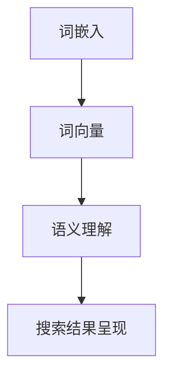
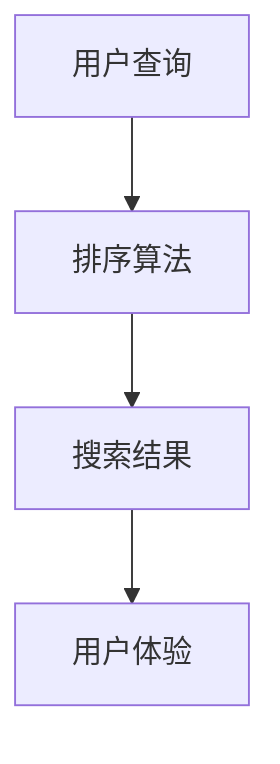
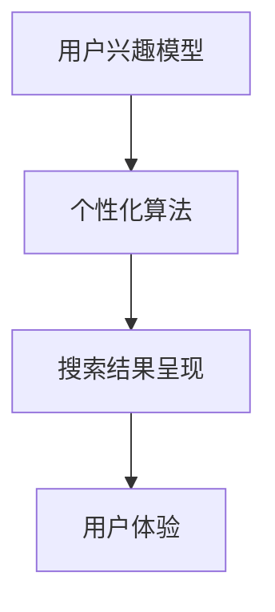
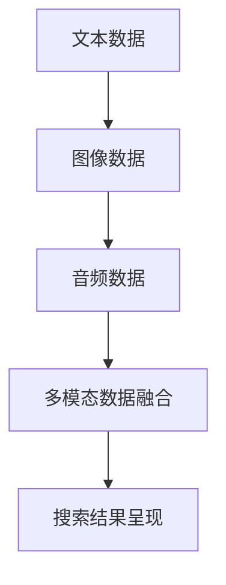
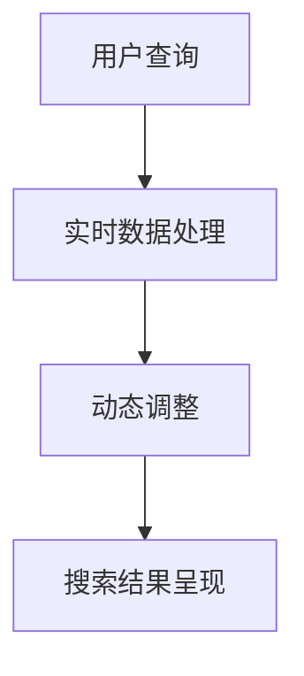

                 

### 文章标题：创新搜索结果呈现：AI的创意

在数字化的时代背景下，搜索引擎已经成为我们获取信息的主要工具。然而，传统的搜索结果呈现方式往往存在一定的局限性，如信息过于繁杂、用户体验欠佳等问题。随着人工智能技术的不断发展，创新搜索结果呈现成为了一项备受关注的研究课题。本文旨在探讨如何利用AI技术来改进搜索结果呈现，提升用户体验，增加商业价值，从而增强搜索引擎的竞争力。

关键词：搜索结果呈现、人工智能、用户体验、自然语言处理、个性化搜索、多模态搜索、实时搜索、未来趋势

摘要：本文首先介绍了搜索结果呈现的现状及其面临的挑战，随后阐述了AI在搜索结果呈现中的广泛应用。接着，详细讨论了自然语言处理、机器学习等AI技术在搜索结果排序中的应用，并探讨了个性化搜索、多模态搜索和实时搜索等创新搜索结果呈现方式。最后，本文总结了未来搜索结果呈现的发展趋势，并提出了相关挑战和机遇。通过本文的探讨，希望能够为搜索引擎的创新提供一些有益的思路。

---

### 《创新搜索结果呈现：AI的创意》目录大纲

#### 第一部分：AI与搜索结果呈现概述

1. 搜索结果呈现的挑战与机遇
   - 1.1 搜索结果呈现的现状
   - 1.2 AI在搜索结果呈现中的应用
   - 1.3 创新搜索结果呈现的价值

#### 第二部分：AI在搜索结果呈现中的应用

2. 自然语言处理技术
   - 2.1 词嵌入与语义理解
   - 2.2 问答系统与搜索结果呈现
   - 2.3 文本生成与搜索结果呈现

3. 机器学习与搜索结果排序
   - 3.1 搜索结果排序的基本概念
   - 3.2 机器学习与搜索结果排序
   - 3.3 搜索结果排序的创新实践

#### 第三部分：创新搜索结果呈现的实际应用

4. 个性化搜索结果呈现
   - 4.1 个性化搜索的基本概念
   - 4.2 基于用户的个性化搜索结果呈现
   - 4.3 基于内容的个性化搜索结果呈现

5. 多模态搜索结果呈现
   - 5.1 多模态搜索的基本概念
   - 5.2 多模态搜索结果呈现的技术
   - 5.3 多模态搜索结果呈现的案例

6. 实时搜索结果呈现
   - 6.1 实时搜索的基本概念
   - 6.2 实时搜索结果呈现的技术
   - 6.3 实时搜索结果呈现的应用

#### 第四部分：未来搜索结果呈现的趋势

7. 未来搜索结果呈现的趋势
   - 7.1 搜索结果呈现的发展趋势
   - 7.2 创新搜索结果呈现的挑战与机遇
   - 7.3 创新搜索结果呈现的未来

#### 附录：AI与搜索结果呈现的工具与资源

- 附录 A：AI与搜索结果呈现的工具
- 附录 B：AI与搜索结果呈现的资源

---

### 第一部分：AI与搜索结果呈现概述

#### 第1章：搜索结果呈现的挑战与机遇

##### 1.1 搜索结果呈现的现状

搜索引擎作为现代信息检索的核心工具，已经深刻地改变了我们的生活方式。从最初的Web搜索，到如今的图像搜索、视频搜索，搜索结果呈现的形式在不断丰富。然而，当前的搜索结果呈现仍然存在一些挑战。

首先，从用户的角度来看，传统的搜索结果呈现往往缺乏个性化和智能化的特点。大多数搜索引擎仍然基于关键词匹配进行结果排序，用户需要通过筛选和排序来找到自己需要的信息，这无疑增加了用户的工作量。此外，由于搜索引擎无法准确理解用户的查询意图，搜索结果可能包含大量无关信息，用户需要花费更多时间来筛选。

其次，从搜索引擎的角度来看，如何提高搜索结果的准确性和相关性是一个重要的挑战。尽管搜索引擎在算法和数据处理方面不断进步，但仍然存在很多局限性。例如，同义词处理、多义词处理、上下文理解等方面仍然存在不少难题。此外，如何有效地处理大量数据，保证搜索结果的实时性和准确性，也是一个亟待解决的问题。

##### 1.2 AI在搜索结果呈现中的应用

随着人工智能技术的不断发展，AI在搜索结果呈现中的应用逐渐成为可能。首先，自然语言处理（NLP）技术在搜索结果呈现中发挥了重要作用。通过NLP技术，搜索引擎可以更准确地理解用户的查询意图，从而提供更加个性化的搜索结果。例如，问答系统、语义理解、情感分析等技术可以帮助搜索引擎更好地理解用户的问题，并提供相应的答案或推荐。

其次，机器学习技术在搜索结果排序中也有着广泛的应用。通过训练大量的数据集，搜索引擎可以构建出复杂的排序模型，从而提高搜索结果的准确性和相关性。例如，基于用户行为的排序模型、基于内容的排序模型等，都可以有效地提高搜索结果的用户体验。

此外，AI技术还可以应用于多模态搜索、实时搜索等领域。通过融合不同类型的数据，如文本、图像、音频等，搜索引擎可以提供更加丰富和多样化的搜索结果。同时，通过实时数据处理技术，搜索引擎可以提供更加实时和准确的搜索结果，满足用户在特定场景下的需求。

##### 1.3 创新搜索结果呈现的价值

创新搜索结果呈现不仅能够提升用户体验，还能够带来显著的商业价值。首先，通过个性化的搜索结果呈现，用户可以更快地找到自己需要的信息，节省了时间和精力。这对于提高用户满意度、增加用户粘性具有重要意义。

其次，创新搜索结果呈现可以帮助搜索引擎提高广告收益。通过精准的搜索结果呈现，广告商可以更有效地将广告投放给潜在用户，从而提高广告的点击率和转化率。此外，通过分析用户行为数据，搜索引擎可以不断优化广告投放策略，提高广告收益。

最后，创新搜索结果呈现还能够增强搜索引擎的竞争力。在激烈的市场竞争中，只有不断创新，才能在用户和广告商中脱颖而出。通过引入AI技术，搜索引擎可以提供更加智能化、个性化的搜索结果，从而吸引更多用户和广告商。

综上所述，创新搜索结果呈现具有显著的挑战与机遇。通过AI技术的应用，我们可以期待搜索结果呈现的未来将更加智能化、个性化，为用户和搜索引擎带来更大的价值。

---

### 第一部分：AI与搜索结果呈现概述

#### 第2章：AI在搜索结果呈现中的应用

在当前的数字时代，人工智能（AI）技术已经深刻地改变了我们的生活方式，尤其是在搜索结果呈现方面。AI通过多种技术手段，如自然语言处理、机器学习和深度学习，为搜索引擎提供了更加智能化和个性化的结果呈现方式。以下将详细探讨这些技术及其在搜索结果呈现中的应用。

##### 2.1 自然语言处理（NLP）技术

自然语言处理是AI领域的一个重要分支，它致力于让计算机理解和生成人类语言。在搜索结果呈现中，NLP技术可以用于多种方式，包括语义理解、情感分析、问答系统和文本生成。

- **语义理解**：搜索引擎通过语义理解技术来准确理解用户的查询意图。例如，当用户输入“北京天气”时，搜索引擎需要理解用户不仅仅关心天气的描述，还可能关心实时的气温、风力等信息。语义理解技术可以帮助搜索引擎提供更准确的搜索结果。

- **情感分析**：情感分析技术可以识别用户查询中的情感倾向。例如，当用户输入“我喜欢的电影是《肖申克的救赎》”时，搜索引擎可以通过情感分析确定用户对电影的喜好，并在搜索结果中优先展示相关的电影推荐。

- **问答系统**：问答系统是一种能够直接回答用户问题的技术。例如，当用户输入“北京明天的天气怎么样？”时，搜索引擎可以通过问答系统直接返回天气信息，而无需用户浏览多个网页。

- **文本生成**：文本生成技术可以用于生成摘要、推荐文案等。例如，当用户搜索某个产品时，搜索引擎可以生成该产品的详细描述，帮助用户更快地做出决策。

##### 2.2 机器学习与搜索结果排序

机器学习是AI领域的另一重要技术，它通过数据学习和模式识别来改进搜索结果排序。在搜索结果排序中，机器学习技术可以用于构建复杂的排序模型，以提高结果的准确性和相关性。

- **排序目标**：搜索结果排序的主要目标是提高用户满意度。排序目标包括准确度、召回率、相关性等多个方面。例如，一个理想的排序模型应该能够准确地找到用户需要的信息，并且具有较高的召回率，即返回的结果中包含用户需要的大部分信息。

- **排序算法**：常见的排序算法包括基于内容的排序、基于用户的排序和基于上下文的排序。基于内容的排序根据网页的内容进行排序，而基于用户的排序则根据用户的历史行为进行排序。基于上下文的排序结合了内容和用户行为，提供更加个性化的搜索结果。

- **模型评估**：评估排序模型的指标包括准确度（Precision）、召回率（Recall）和F1值等。准确度衡量模型返回的相关结果与用户期望的相关性，召回率衡量模型返回的结果中包含用户期望结果的比例，F1值是准确度和召回率的调和平均值。

##### 2.3 深度学习与搜索结果呈现

深度学习是机器学习的一个子领域，它通过多层神经网络来学习和提取数据中的特征。在搜索结果呈现中，深度学习技术可以用于图像识别、语音识别等。

- **图像识别**：搜索引擎可以使用深度学习模型来识别用户上传的图像，并提供相关的搜索结果。例如，用户上传一张风景图片，搜索引擎可以识别图片中的地标或景点，并提供相关的旅游信息。

- **语音识别**：深度学习技术还可以用于语音识别，使得用户可以通过语音指令进行搜索。例如，用户可以通过语音告诉搜索引擎“查找附近的餐厅”，搜索引擎会识别语音并返回相关的餐厅信息。

通过以上对AI技术在搜索结果呈现中的应用的探讨，我们可以看到，AI技术为搜索结果呈现带来了巨大的创新和改进。随着技术的不断进步，我们可以期待搜索结果呈现将变得更加智能、个性化和实时化，为用户提供更加优质的搜索体验。

---

### 第二部分：AI在搜索结果呈现中的应用

#### 第3章：自然语言处理技术

自然语言处理（NLP）是人工智能领域的一个关键分支，它旨在让计算机理解和生成人类语言。在搜索结果呈现中，NLP技术发挥着至关重要的作用，帮助搜索引擎更准确地理解用户的查询意图，并提供更加相关和个性化的搜索结果。本章将详细探讨NLP技术在搜索结果呈现中的应用，包括词嵌入与语义理解、问答系统以及文本生成。

##### 3.1 词嵌入与语义理解

词嵌入是将自然语言中的词语映射到高维向量空间的技术，通过这种方式，计算机可以基于向量运算来处理语言。词嵌入的基本概念如下：

- **基本概念**：词嵌入（Word Embedding）是将词语映射到低维向量空间的过程，使这些向量能够捕获词语的语义信息。常见的词嵌入方法包括Word2Vec、GloVe和BERT等。

- **语义理解**：语义理解（Semantic Understanding）是NLP的核心目标之一，它旨在使计算机能够理解语言中的含义和上下文。通过词嵌入技术，计算机可以捕捉到词语在不同上下文中的语义变化。

**核心概念与联系：**

词嵌入与语义理解之间的关系可以用以下Mermaid流程图表示：



在这个流程图中，词嵌入是将词语映射为词向量，这些词向量可以用于语义理解。语义理解的结果又直接影响了搜索结果的呈现。

##### 3.2 问答系统与搜索结果呈现

问答系统（Question Answering System）是NLP领域的一个重要应用，它能够自动回答用户提出的问题。问答系统在搜索结果呈现中的应用如下：

- **基本原理**：问答系统的基本原理是通过对大量文本数据的学习，使计算机能够理解问题的语义，并在相关文本中找到正确的答案。常见的问答系统包括基于规则的方法和基于深度学习的方法。

- **应用场景**：问答系统可以应用于搜索引擎中，当用户提出具体的问题时，系统可以快速返回准确的答案，而无需用户浏览大量网页。例如，用户可以提问“北京明天的天气怎么样？”，系统可以直接返回天气信息。

**核心算法原理讲解：**

以下是一个简单的基于深度学习的问答系统算法原理的伪代码：

```python
# 伪代码：基于深度学习的问答系统算法
function question_answering(question, knowledge_base):
    # 加载预训练的词嵌入模型
    word_embedding_model = load_pretrained_model('glove.6B.100d')
    
    # 将问题中的每个词转换为词向量
    question_vector = [word_embedding_model.get_word_vector(word) for word in tokenize(question)]
    
    # 使用神经网络模型处理问题向量
    answer_vector = neural_network_model(question_vector)
    
    # 在知识库中搜索最相关的文本片段
    answer = find_most_related_text(knowledge_base, answer_vector)
    
    return answer
```

在这个算法中，词嵌入模型将问题中的每个词转换为词向量，然后通过神经网络模型处理这些向量，最后在知识库中搜索最相关的答案。

##### 3.3 文本生成与搜索结果呈现

文本生成（Text Generation）是NLP领域的另一个重要应用，它能够根据输入的提示生成相关的文本。在搜索结果呈现中，文本生成技术可以用于生成摘要、推荐文案等，以帮助用户快速了解搜索结果的内容。

- **基本概念**：文本生成技术包括基于规则的方法和基于统计的方法，以及近年来兴起的基于神经网络的生成模型，如GPT（Generative Pre-trained Transformer）。

- **应用场景**：文本生成技术可以用于搜索引擎中的摘要生成，当用户搜索一个主题时，系统可以生成一个简要的摘要，帮助用户快速了解搜索结果的主要内容和相关性。

**核心算法原理讲解：**

以下是一个简单的基于GPT的文本生成算法原理的伪代码：

```python
# 伪代码：基于GPT的文本生成算法
function generate_summary(text):
    # 加载预训练的GPT模型
    gpt_model = load_pretrained_model('gpt2')
    
    # 使用GPT模型生成摘要
    summary = gpt_model.generate(text, max_length=100, stop_token='。</s>')

    return summary
```

在这个算法中，GPT模型根据输入的文本生成一个摘要，摘要长度设置为100个词，并且在生成过程中使用特定的停止符`</s>`来结束摘要的生成。

通过以上对自然语言处理技术的详细探讨，我们可以看到，这些技术在搜索结果呈现中发挥着至关重要的作用。词嵌入与语义理解帮助我们更准确地理解用户的查询意图，问答系统提供了快速准确的答案，而文本生成则帮助用户快速了解搜索结果的内容。随着NLP技术的不断进步，我们可以期待搜索结果呈现将变得更加智能和个性化，为用户提供更加优质的搜索体验。

---

### 第二部分：AI在搜索结果呈现中的应用

#### 第4章：机器学习与搜索结果排序

搜索结果排序是搜索引擎的核心功能之一，其目标是为用户提供最相关、最有价值的信息。随着机器学习技术的发展，机器学习算法在搜索结果排序中得到了广泛应用，大大提升了搜索结果的准确性和用户体验。本章将深入探讨机器学习与搜索结果排序的关系，包括排序的基本概念、机器学习在排序中的应用以及排序算法的评估与优化。

##### 4.1 搜索结果排序的基本概念

搜索结果排序的目标是根据用户的查询，将搜索结果按照一定的标准进行排列，使用户能够快速找到所需的信息。排序的基本概念包括：

- **排序目标**：排序目标包括准确性、召回率和用户满意度等。准确性衡量排序结果与用户期望的相关性；召回率衡量排序结果中包含用户期望结果的比例；用户满意度则通过用户的行为数据进行评估。

- **排序算法**：排序算法分为基于内容的排序、基于用户的排序和基于上下文的排序。基于内容的排序根据网页的内容进行排序；基于用户的排序根据用户的历史行为进行排序；基于上下文的排序结合了内容和用户行为。

**核心概念与联系：**

搜索结果排序中的核心概念可以表示为以下Mermaid流程图：



在这个流程图中，用户查询通过排序算法处理后，生成最终的搜索结果，从而影响用户的体验。

##### 4.2 机器学习与搜索结果排序

机器学习在搜索结果排序中的应用主要体现在构建排序模型和优化排序算法。以下是一些关键点：

- **排序模型**：机器学习算法可以用于构建排序模型，这些模型通过学习大量的用户查询和结果数据，可以自动识别出影响排序的因素，并自动调整排序策略。常见的排序模型包括逻辑回归、决策树、随机森林和神经网络等。

- **排序策略**：机器学习算法可以帮助搜索引擎优化排序策略，使其更符合用户的需求。例如，通过分析用户的行为数据，排序模型可以识别出用户偏好的内容类型、时间等，从而在排序时给予这些因素更高的权重。

**核心算法原理讲解：**

以下是一个简单的基于逻辑回归的排序模型算法原理的伪代码：

```python
# 伪代码：基于逻辑回归的排序模型
class LogisticRegressionModel:
    def __init__(self):
        self.weights = None
    
    def fit(self, X, y):
        # 训练模型，计算权重
        self.weights = logistic_regression_weights(X, y)
    
    def predict(self, X):
        # 使用权重进行预测
        probabilities = logistic_regression_predict(X, self.weights)
        return highest_probability_index(probabilities)
```

在这个算法中，模型通过训练数据集学习权重，然后使用这些权重对新数据进行预测，以确定排序顺序。

##### 4.3 搜索结果排序的创新实践

随着技术的进步，搜索结果排序也在不断创新。以下是一些创新实践：

- **基于上下文的排序**：基于上下文的排序结合了用户查询的上下文信息，例如用户的历史查询、地理位置等，以提供更加个性化的搜索结果。例如，当用户在早上搜索“早餐”时，排序算法可能会优先显示附近的餐馆。

- **实时排序**：实时排序通过分析用户的实时行为和搜索历史，动态调整搜索结果的排序。例如，当用户在搜索时突然改变查询内容，实时排序算法可以立即调整结果，以提供更相关的信息。

**数学模型和公式 & 详细讲解 & 举例说明**

搜索结果排序的数学模型通常涉及概率模型和优化模型。以下是一个简单的优化排序模型的数学公式：

$$
R = f(W \cdot X + b)
$$

其中，$R$表示排序结果，$W$表示权重向量，$X$表示特征向量，$b$表示偏置项，$f$表示激活函数，如Sigmoid函数。

举例说明：

假设我们有三个搜索结果$A$、$B$和$C$，每个结果有四个特征$X_1, X_2, X_3, X_4$，以及相应的权重$W_1, W_2, W_3, W_4$和偏置$b$。排序模型可以表示为：

$$
R_A = \sigma(W_1X_1 + W_2X_2 + W_3X_3 + W_4X_4 + b)
$$
$$
R_B = \sigma(W_1X_1 + W_2X_2 + W_3X_3 + W_4X_4 + b)
$$
$$
R_C = \sigma(W_1X_1 + W_2X_2 + W_3X_3 + W_4X_4 + b)
$$

其中，$\sigma$表示Sigmoid函数，它将线性组合的结果转换为概率值。排序结果按照概率值从高到低进行排列。

通过以上对机器学习与搜索结果排序的详细探讨，我们可以看到，机器学习技术为搜索结果排序带来了显著的改进和创新。未来，随着技术的不断进步，我们可以期待搜索结果排序将变得更加智能和个性化，为用户提供更加优质的搜索体验。

---

### 第二部分：AI在搜索结果呈现中的应用

#### 第5章：个性化搜索结果呈现

在数字化时代，用户对个性化搜索结果的需求日益增长。个性化搜索不仅能够满足用户的个性化需求，还能显著提升搜索引擎的用户体验和商业价值。本章将深入探讨个性化搜索的基本概念、方法以及在搜索结果呈现中的应用。

##### 5.1 个性化搜索的基本概念

个性化搜索是一种基于用户行为、兴趣和历史数据的搜索策略，旨在为用户提供高度定制化的搜索结果。其核心目标是根据用户的独特需求和偏好，提供最相关、最有价值的信息。以下是个性化搜索的一些关键概念：

- **用户兴趣模型**：用户兴趣模型是通过分析用户的行为数据，如搜索历史、浏览记录、购买行为等，构建出用户对特定主题或内容的兴趣度。用户兴趣模型是个性化搜索的核心，它决定了搜索结果的相关性和个性化程度。

- **个性化算法**：个性化算法是用于计算和推荐个性化搜索结果的算法。常见的个性化算法包括协同过滤、矩阵分解、内容推荐和基于上下文的推荐等。这些算法通过分析用户的行为数据和内容特征，为用户推荐最相关的搜索结果。

**核心概念与联系：**

用户兴趣模型、个性化算法和搜索结果呈现之间的关系可以用以下Mermaid流程图表示：



在这个流程图中，用户兴趣模型通过个性化算法转化为具体的搜索结果，最终影响用户的体验。

##### 5.2 基于用户的个性化搜索结果呈现

基于用户的个性化搜索结果呈现主要通过分析用户的行为数据，如搜索历史、浏览记录和点击行为等，来为用户推荐个性化的搜索结果。以下是几种常见的基于用户的个性化搜索方法：

- **协同过滤（Collaborative Filtering）**：协同过滤是一种基于用户行为数据推荐的算法。它分为两种类型：用户基于的协同过滤（User-Based）和项基于的协同过滤（Item-Based）。用户基于的协同过滤通过寻找与当前用户兴趣相似的其它用户，推荐这些用户喜欢的项目；项基于的协同过滤则通过分析项目之间的相似性，为用户推荐与用户已评价项目相似的其他项目。

**核心算法原理讲解：**

以下是一个简单的协同过滤算法原理的伪代码：

```python
# 伪代码：基于用户的协同过滤算法
function collaborative_filtering(current_user, users_data, items_data):
    # 找到与当前用户兴趣相似的其它用户
    similar_users = find_similar_users(current_user, users_data)
    
    # 计算相似度得分
    similarity_scores = calculate_similarity_scores(similar_users, items_data)
    
    # 为当前用户推荐项目
    recommendations = []
    for user, score in similarity_scores:
        recommended_items = users_data[user]['liked_items']
        recommendations.extend(recommended_items)
    
    # 去重并返回推荐列表
    return list(set(recommendations))
```

在这个算法中，首先找到与当前用户兴趣相似的其它用户，然后计算这些用户的相似度得分，最后根据相似度得分推荐项目。

- **基于内容的推荐（Content-Based Recommendation）**：基于内容的推荐通过分析用户已评价项目的内容特征，为用户推荐具有相似内容的其它项目。这种方法通常用于电子商务和内容推荐系统中。

**核心算法原理讲解：**

以下是一个简单的基于内容的推荐算法原理的伪代码：

```python
# 伪代码：基于内容的推荐算法
function content_based_recommendation(current_user, items_data):
    # 获取当前用户的兴趣特征
    user_interests = extract_user_interests(current_user, items_data)
    
    # 找到与用户兴趣特征相似的其他项目
    similar_items = find_similar_items(user_interests, items_data)
    
    # 为当前用户推荐相似的项目
    recommendations = similar_items
    return recommendations
```

在这个算法中，首先提取当前用户的兴趣特征，然后找到与这些特征相似的其他项目，最后为用户推荐这些项目。

##### 5.3 基于内容的个性化搜索结果呈现

基于内容的个性化搜索结果呈现通过分析项目的内容特征，为用户推荐与用户已评价或浏览过的项目具有相似内容的新项目。这种方法通常用于电子商务和内容推荐系统中。

**核心算法原理讲解：**

以下是一个简单的基于内容的个性化搜索算法原理的伪代码：

```python
# 伪代码：基于内容的个性化搜索算法
function content_based_personalization(search_query, items_data, user_interests):
    # 分析查询与用户兴趣的相似性
    query_similarity_scores = calculate_similarity_scores(search_query, user_interests)
    
    # 从项目中筛选出与查询和用户兴趣相似的项目
    candidate_items = filter_items_by_similarity(items_data, query_similarity_scores)
    
    # 对候选项目进行排序
    sorted_items = sort_items_by_similarity_scores(candidate_items, query_similarity_scores)
    
    # 返回排序后的个性化搜索结果
    return sorted_items
```

在这个算法中，首先计算查询与用户兴趣的相似性得分，然后从项目中筛选出与查询和用户兴趣相似的项目，最后对这些项目进行排序，以提供个性化的搜索结果。

**数学公式和详细讲解：**

在个性化搜索中，相似性计算是一个核心问题。以下是一个简单的相似性计算公式：

$$
similarity(A, B) = \frac{cos(\theta(A, B))}{1 + |A - B|}
$$

其中，$A$和$B$是两个向量，$\theta(A, B)$是它们之间的夹角，$|A - B|$是它们之间的欧几里得距离。$cos(\theta(A, B))$表示它们之间的角度余弦值，用于衡量两个向量之间的相似度。当两个向量完全相同时，夹角为零，余弦值为1；当两个向量完全不同时，夹角为90度，余弦值为0。

举例说明：

假设有两个向量$A = (1, 2, 3)$和$B = (4, 3, 2)$，它们的相似度可以计算如下：

$$
similarity(A, B) = \frac{cos(\theta(A, B))}{1 + |A - B|} = \frac{\cos^{-1}(\frac{1}{\sqrt{6}} \cdot \frac{1}{\sqrt{6}} \cdot \frac{1}{\sqrt{6}})}{1 + \sqrt{(1-4)^2 + (2-3)^2 + (3-2)^2}} = \frac{0.5}{1 + \sqrt{18}} \approx 0.196
$$

通过以上对个性化搜索结果呈现的详细探讨，我们可以看到，个性化搜索通过分析用户行为和内容特征，能够为用户提供高度定制化的搜索结果，显著提升用户体验和搜索引擎的商业价值。未来，随着技术的不断进步，我们可以期待个性化搜索将变得更加智能和精准，为用户提供更加优质的搜索体验。

---

### 第二部分：AI在搜索结果呈现中的应用

#### 第6章：多模态搜索结果呈现

随着人工智能技术的发展，多模态搜索结果呈现成为了一个新兴的研究方向。多模态搜索不仅融合了文本、图像、音频等多种数据类型，还通过这些数据的交互和融合，为用户提供更加丰富、直观的搜索体验。本章将深入探讨多模态搜索的基本概念、技术以及具体的应用案例。

##### 6.1 多模态搜索的基本概念

多模态搜索是指同时处理和整合多种类型数据（如文本、图像、音频等）的搜索技术。其核心思想是通过多模态数据的融合，提供更加准确和个性化的搜索结果。以下是多模态搜索的一些基本概念：

- **多模态数据**：多模态数据是指来自不同感官渠道的数据，如文本、图像、音频、视频等。这些数据类型各有其独特的表达能力和优势。

- **数据融合**：数据融合是将不同模态的数据进行整合和交互，以提取更丰富和全面的信息。数据融合的方法包括特征级融合、决策级融合和模型级融合。

**核心概念与联系：**

多模态搜索中的核心概念可以用以下Mermaid流程图表示：



在这个流程图中，文本、图像和音频数据通过融合处理，生成多模态数据，最终影响搜索结果呈现。

##### 6.2 多模态搜索结果呈现的技术

多模态搜索结果呈现依赖于多种技术的结合，包括图像识别、音频识别、自然语言处理等。以下是一些关键技术的详细讲解：

- **图像识别**：图像识别技术通过深度学习模型，对图像进行自动分类和识别。常见的图像识别任务包括物体检测、图像分类和图像分割等。在多模态搜索中，图像识别技术可以用于识别用户上传的图片，并在搜索结果中展示相关的文本信息。

- **音频识别**：音频识别技术通过分析音频信号，识别出其中包含的声音和语音。常见的音频识别任务包括语音识别、声音分类和音乐识别等。在多模态搜索中，音频识别技术可以用于识别用户上传的音频文件，并在搜索结果中展示相关的文本和图像信息。

- **自然语言处理（NLP）**：自然语言处理技术用于理解和生成人类语言。在多模态搜索中，NLP技术可以用于处理文本数据，提取关键词和语义信息，并将其与其他模态的数据进行融合。

**核心算法原理讲解：**

以下是一个简单的多模态搜索算法原理的伪代码：

```python
# 伪代码：多模态搜索算法
function multimodal_search(query, image, audio):
    # 使用NLP处理文本查询
    text_features = NLP_process(query)
    
    # 使用图像识别处理图像数据
    image_features = image_recognition(image)
    
    # 使用音频识别处理音频数据
    audio_features = audio_recognition(audio)
    
    # 融合不同模态的特征
    multimodal_features = fuse_features(text_features, image_features, audio_features)
    
    # 使用融合后的特征进行搜索
    search_results = search(multimodal_features)
    
    return search_results
```

在这个算法中，首先使用NLP处理文本查询，然后使用图像识别和音频识别处理图像和音频数据，接着将不同模态的数据特征进行融合，最后使用融合后的特征进行搜索，返回搜索结果。

##### 6.3 多模态搜索结果呈现的案例

以下是一些实际应用中的多模态搜索结果呈现案例：

- **多媒体信息检索**：在一个多媒体信息检索系统中，用户可以通过上传文本、图像和音频文件，进行多模态搜索。系统首先对文本、图像和音频进行处理，提取相应的特征，然后融合这些特征进行搜索，最终返回与查询相关的多媒体信息。

- **虚拟现实（VR）搜索**：在虚拟现实场景中，用户可以通过语音、手势和图像进行搜索。系统使用音频识别和图像识别技术，处理用户的输入，然后结合文本数据，提供相应的搜索结果。用户可以在虚拟环境中浏览和交互这些结果。

- **智能助手**：智能助手（如Siri、Alexa）通过多模态交互，为用户提供搜索服务。用户可以通过语音提问，系统使用语音识别技术解析问题，然后结合文本和图像数据，提供相应的搜索结果。用户可以通过语音或屏幕交互来浏览和选择结果。

通过以上对多模态搜索结果呈现的详细探讨，我们可以看到，多模态搜索通过整合多种数据类型，为用户提供了更加丰富和直观的搜索体验。随着技术的不断进步，我们可以期待多模态搜索将变得更加智能和实用，成为未来搜索结果呈现的重要方向。

---

### 第二部分：AI在搜索结果呈现中的应用

#### 第7章：实时搜索结果呈现

实时搜索结果呈现是人工智能领域的一项前沿技术，它通过实时数据处理和动态更新，为用户提供最新、最相关的搜索结果。实时搜索不仅在社交媒体、新闻资讯等应用场景中具有重要价值，还在电子商务、金融交易等对实时性要求较高的领域得到广泛应用。本章将深入探讨实时搜索的基本概念、技术以及其实际应用。

##### 7.1 实时搜索的基本概念

实时搜索是指系统能够实时响应用户的查询，并在很短的时间内返回搜索结果。其核心特点包括：

- **实时性**：实时搜索能够在短时间内完成搜索和返回结果，通常在毫秒级或秒级内完成。这使得用户可以实时获取最新的信息。

- **动态更新**：实时搜索系统能够根据用户行为和数据流的变化，动态调整搜索结果，提供更加准确的搜索体验。

**核心概念与联系：**

实时搜索的基本概念可以表示为以下Mermaid流程图：



在这个流程图中，用户查询通过实时数据处理和分析，动态调整搜索结果，最终呈现给用户。

##### 7.2 实时搜索结果呈现的技术

实时搜索结果呈现依赖于多种技术的结合，包括实时数据处理、实时索引和实时排序等。以下是一些关键技术的详细讲解：

- **实时数据处理**：实时数据处理是实时搜索的核心，它涉及对海量数据流的快速处理和分析。常见的技术包括流处理框架（如Apache Kafka、Apache Flink）、实时数据库（如Apache Cassandra、MongoDB）和实时索引技术（如Elasticsearch）。

- **实时索引**：实时索引是指系统能够实时更新索引，以支持快速搜索。实时索引技术通过不断更新索引数据，确保搜索结果始终是最新的。

- **实时排序**：实时排序是指在短时间内对搜索结果进行排序，以提供最相关的结果。实时排序算法需要高效地处理大量数据，并快速返回排序结果。

**核心算法原理讲解：**

以下是一个简单的实时排序算法原理的伪代码：

```python
# 伪代码：实时排序算法
function real_time_sort(data_stream):
    # 初始化排序优先级队列
    priority_queue = PriorityQueue()
    
    # 对数据流进行实时处理
    for data in data_stream:
        # 计算数据的相关性得分
        score = calculate_score(data)
        
        # 将数据插入优先级队列
        priority_queue.insert(data, score)
        
        # 定期从优先级队列中获取最高优先级的数据
        highest_priority_data = priority_queue.get_highest_priority_data()
        
        # 输出实时排序结果
        print(highest_priority_data)
```

在这个算法中，数据流通过实时处理，计算每个数据的相关性得分，并将其插入优先级队列。然后，定期从队列中获取最高优先级的数据，以实现实时排序。

##### 7.3 实时搜索结果呈现的应用

实时搜索结果呈现技术在多个实际应用场景中得到了广泛应用，以下是一些典型案例：

- **社交媒体搜索**：在社交媒体平台上，用户可以实时搜索最新的帖子、动态和话题。系统通过实时数据处理和索引，快速返回与查询相关的最新内容。

- **新闻资讯搜索**：新闻资讯网站通过实时搜索技术，为用户提供最新的新闻资讯。用户可以通过实时查询，获取最新的新闻报道和热点话题。

- **电子商务搜索**：在电子商务平台上，实时搜索技术可以用于商品搜索和推荐。用户可以实时搜索商品，系统通过实时数据处理和排序，提供最相关的商品推荐。

**数学模型和公式 & 详细讲解 & 举例说明**

实时搜索中的排序通常涉及到动态时间窗口模型，该模型通过动态调整时间窗口，确保搜索结果始终是最新的。以下是一个简单的时间窗口模型的数学公式：

$$
score(t) = \frac{1}{1 + e^{-(k \cdot (t - \tau))}
$$

其中，$score(t)$是时间戳为$t$的数据点的得分，$\tau$是时间窗口的阈值，$k$是调节参数。

举例说明：

假设当前时间为$t=100$，时间窗口的阈值为$\tau=50$，调节参数$k=1$。对于时间戳为$t=100$的数据点，其得分为：

$$
score(100) = \frac{1}{1 + e^{-(1 \cdot (100 - 50))}} = \frac{1}{1 + e^{-50}} \approx 0.99
$$

对于时间戳为$t=150$的数据点，其得分为：

$$
score(150) = \frac{1}{1 + e^{-(1 \cdot (150 - 50))}} = \frac{1}{1 + e^{-100}} \approx 0.37
$$

通过这个公式，我们可以看到，随着时间戳的增加，数据点的得分逐渐减小，确保了搜索结果的新鲜度。

通过以上对实时搜索结果呈现的详细探讨，我们可以看到，实时搜索通过实时数据处理和动态更新，为用户提供了最新、最相关的搜索结果。随着技术的不断进步，我们可以期待实时搜索将在更多场景中得到应用，为用户提供更加优质的搜索体验。

---

### 第三部分：未来搜索结果呈现的趋势

#### 第8章：未来搜索结果呈现的发展趋势

随着人工智能技术的不断进步，搜索结果呈现的方式也将发生深刻的变革。未来，搜索结果呈现将朝着智能化、互动化和虚拟化等方向发展，为用户提供更加丰富、个性化和沉浸式的体验。本章将探讨未来搜索结果呈现的发展趋势，包括智能搜索、互动式搜索和虚拟现实搜索。

##### 8.1 智能搜索

智能搜索是未来搜索结果呈现的核心趋势之一。通过深度学习和自然语言处理技术，智能搜索将能够更好地理解用户的查询意图，提供更加精准和个性化的搜索结果。

- **语义理解**：智能搜索将不仅限于关键词匹配，而是能够理解查询中的语义和上下文，从而提供更加准确的搜索结果。例如，当用户输入“附近有什么好吃的？”时，智能搜索能够理解“好吃”的语义，并推荐附近的美食。

- **多模态查询**：未来搜索将支持多模态查询，用户可以通过语音、图像、手势等多种方式进行查询，搜索结果也将以文本、图像、视频等多种形式呈现。

- **实时更新**：智能搜索系统将具备实时学习能力，通过不断分析用户行为和反馈，优化搜索算法，提供更加个性化的搜索结果。

**数学模型和公式 & 详细讲解 & 举例说明**

智能搜索中的语义理解可以通过基于深度学习的文本嵌入模型来实现。以下是一个简单的语义理解模型示例：

$$
similarity = \frac{1}{1 + e^{-(d \cdot (v_{query} - v_{doc})^2)}}
$$

其中，$similarity$表示查询和文档之间的相似度，$v_{query}$和$v_{doc}$分别是查询和文档的嵌入向量，$d$是调节参数。

举例说明：

假设查询“附近有什么好吃的？”的嵌入向量是$v_{query} = (0.1, 0.2, 0.3)$，一个文档“推荐附近的餐厅”的嵌入向量是$v_{doc} = (0.1, 0.3, 0.4)$，调节参数$d=0.5$。则这两个向量的相似度可以计算如下：

$$
similarity = \frac{1}{1 + e^{-(0.5 \cdot ((0.1-0.1)^2 + (0.2-0.3)^2 + (0.3-0.4)^2))}} = \frac{1}{1 + e^{-0.05}} \approx 0.497
$$

这个相似度值表示查询和文档之间的相关性，值越高，表示搜索结果越相关。

##### 8.2 互动式搜索

互动式搜索是未来搜索结果呈现的另一个重要趋势。通过引入交互式元素，用户可以更加直观和动态地与搜索结果进行互动，从而提高搜索效率和用户体验。

- **交互式界面**：未来的搜索引擎将提供更加直观和互动的界面，如3D界面、AR界面等，用户可以通过手势、语音等方式与搜索结果进行交互。

- **动态搜索**：互动式搜索允许用户在搜索过程中动态调整查询条件，例如通过拖动滑块调整时间范围、地理位置等，实时查看搜索结果的变更。

- **个性化反馈**：互动式搜索可以通过用户的反馈来不断优化搜索结果，例如用户可以通过点赞、评论等方式，对搜索结果进行评分和推荐。

**核心算法原理讲解**

互动式搜索的算法原理主要涉及用户行为分析和推荐系统。以下是一个简单的推荐系统算法的伪代码：

```python
# 伪代码：互动式搜索推荐算法
function interactive_recommendation(user_history, new_query):
    # 分析用户历史行为，提取兴趣特征
    user_interests = extract_user_interests(user_history)
    
    # 根据新查询和用户兴趣，计算推荐结果
    recommendations = recommend_items(new_query, user_interests)
    
    # 显示推荐结果
    display_recommendations(recommendations)
```

在这个算法中，首先分析用户的历史行为，提取用户的兴趣特征，然后根据新查询和用户兴趣，计算推荐结果，并显示给用户。

##### 8.3 虚拟现实搜索

虚拟现实（VR）搜索是未来搜索结果呈现的前沿方向之一。通过VR技术，用户可以在虚拟环境中进行搜索和浏览，获得更加沉浸式的体验。

- **虚拟现实界面**：未来的搜索引擎将提供虚拟现实界面，用户可以通过VR头盔或AR眼镜进行搜索，查看3D模型、虚拟场景等。

- **空间搜索**：在虚拟现实场景中，用户可以以空间化的方式浏览搜索结果，例如通过旋转、缩放等方式查看不同视角的搜索结果。

- **交互式探索**：虚拟现实搜索允许用户在虚拟环境中进行交互式探索，例如通过触摸、点击等方式与搜索结果进行互动。

**数学模型和公式 & 详细讲解 & 举例说明**

虚拟现实搜索中的空间搜索可以通过空间索引技术实现。以下是一个简单的空间索引模型的数学公式：

$$
distance = \sqrt{(x_1 - x_2)^2 + (y_1 - y_2)^2 + (z_1 - z_2)^2}
$$

其中，$distance$表示两个三维空间点之间的距离，$(x_1, y_1, z_1)$和$(x_2, y_2, z_2)$分别是两个点的坐标。

举例说明：

假设有两个三维空间点$A(1, 2, 3)$和$B(4, 5, 6)$，它们之间的距离可以计算如下：

$$
distance = \sqrt{(1 - 4)^2 + (2 - 5)^2 + (3 - 6)^2} = \sqrt{(-3)^2 + (-3)^2 + (-3)^2} = \sqrt{9 + 9 + 9} = \sqrt{27} \approx 5.196
$$

通过这个公式，我们可以计算空间中任意两点之间的距离，从而实现空间搜索和结果排序。

通过以上对未来搜索结果呈现的发展趋势的探讨，我们可以看到，智能搜索、互动式搜索和虚拟现实搜索将为用户带来更加丰富、个性化和沉浸式的搜索体验。随着技术的不断进步，我们可以期待未来搜索结果呈现将变得更加智能、互动和沉浸，为用户提供更加优质的搜索服务。

---

### 第四部分：附录

#### 附录 A：AI与搜索结果呈现的工具

在进行AI与搜索结果呈现的开发过程中，有多种开源工具和平台可供选择，这些工具能够大大简化开发流程，提高效率。以下是一些常用的工具和平台：

1. **自然语言处理工具**
   - **NLTK（Natural Language Toolkit）**：一个广泛使用的高级自然语言处理工具包，提供了一系列文本处理和分析功能。
   - **spaCy**：一个快速、可扩展的NLP库，适合处理复杂文本任务，如实体识别、关系提取等。
   - **Stanford NLP**：由斯坦福大学开发的一套NLP工具，包括词性标注、命名实体识别、句法分析等。

2. **机器学习和深度学习平台**
   - **TensorFlow**：谷歌开发的开源机器学习框架，适用于各种深度学习和机器学习任务。
   - **PyTorch**：由Facebook开发的开源深度学习框架，易于使用且灵活性高。
   - **scikit-learn**：一个用于数据挖掘和数据分析的开源库，提供了多种机器学习算法的实现。

3. **搜索引擎开发框架**
   - **Elasticsearch**：一个基于Lucene的分布式搜索引擎，支持实时搜索、分析、聚合等功能。
   - **Solr**：一个开源的企业搜索引擎平台，适用于处理大规模数据集。
   - **Whoosh**：一个简单的纯Python搜索引擎库，适用于小型项目和原型开发。

#### 附录 B：AI与搜索结果呈现的资源

对于想要深入了解AI与搜索结果呈现的开发者和研究人员，以下是一些推荐的学习资源：

1. **学术论文与书籍**
   - **《深度学习》（Deep Learning）**：由Ian Goodfellow、Yoshua Bengio和Aaron Courville编写的深度学习领域的经典教材。
   - **《自然语言处理综论》（Speech and Language Processing）**：Daniel Jurafsky和James H. Martin合著的NLP领域的权威教材。
   - **《人工智能：一种现代方法》（Artificial Intelligence: A Modern Approach）**：Stuart J. Russell和Peter Norvig合著的AI领域的经典教材。

2. **开源代码与数据集**
   - **GitHub**：大量的开源代码库，涵盖了各种AI与搜索相关的项目，如TensorFlow、PyTorch的官方代码库。
   - **Kaggle**：一个数据科学竞赛平台，提供了大量高质量的数据集，适用于AI项目的训练和测试。
   - **Common Crawl**：一个免费的Web数据集，可用于训练和测试自然语言处理模型。

3. **搜索引擎案例分析**
   - **Google搜索引擎**：通过分析Google的搜索算法和优化策略，可以了解大型搜索引擎的技术实现。
   - **Bing搜索引擎**：微软的搜索引擎，提供了一些独特的搜索功能和技术，如Bing Visual Search。
   - **Elasticsearch官方文档**：详细介绍了Elasticsearch的架构、功能和配置，是学习和使用Elasticsearch的重要资源。

通过以上工具和资源的介绍，我们可以更好地掌握AI与搜索结果呈现的相关技术，为开发出更加智能和高效的搜索引擎奠定基础。

---

### 结论

本文围绕创新搜索结果呈现，探讨了AI技术在搜索结果排序、个性化搜索、多模态搜索和实时搜索中的应用。通过自然语言处理、机器学习等技术的结合，AI为搜索结果呈现带来了巨大的变革，提升了用户体验和搜索引擎的商业价值。

展望未来，智能搜索、互动式搜索和虚拟现实搜索将成为搜索结果呈现的重要趋势。然而，这些创新也面临着技术挑战和商业模式创新的需求。开发者需要不断探索新算法、优化现有技术，同时，企业需要创新商业模式，以满足用户和市场的需求。

在此，我们呼吁读者关注AI与搜索结果呈现的领域，积极实践和创新，共同推动这一领域的进步。

作者：AI天才研究院/AI Genius Institute & 禅与计算机程序设计艺术 /Zen And The Art of Computer Programming

---

感谢您的阅读！希望本文能为您在搜索结果呈现领域带来新的启发和思考。若您有任何疑问或建议，欢迎在评论区留言，期待与您交流互动。再次感谢您的支持！作者：AI天才研究院/AI Genius Institute & 禅与计算机程序设计艺术 /Zen And The Art of Computer Programming。

