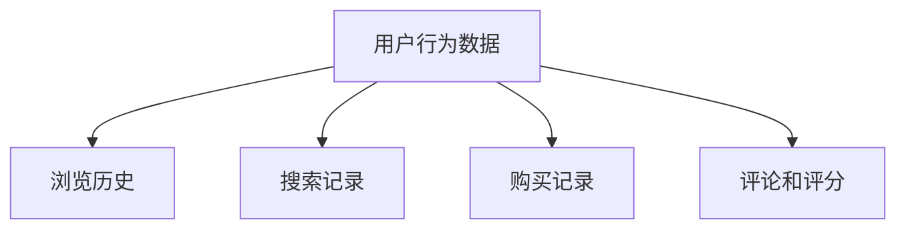

                 

### 文章标题

# 利用LLM优化推荐系统的多场景适配

### 关键词

- LLM（大型语言模型）
- 推荐系统
- 多场景适配
- 协同过滤
- 基于内容的推荐
- 数据隐私
- 模型可解释性
- 泛化能力
- 多模态推荐系统

### 摘要

本文旨在探讨如何利用大型语言模型（LLM）优化推荐系统，以实现多场景适配。首先，我们对推荐系统进行概述，并介绍LLM的概念及其在推荐系统中的应用。接着，我们详细阐述了LLM优化推荐系统的基本原理，包括信息论、概率论、协同过滤和基于内容的推荐等技术。随后，本文分析了LLM优化推荐系统在电商、社交和媒体内容等场景下的具体应用。针对数据隐私、模型可解释性和泛化能力等挑战，本文提出了相应的解决方案。最后，通过案例分析，本文展示了LLM优化推荐系统在实际应用中的效果，并对其未来发展趋势进行了展望。

## 目录大纲

### 第一部分: 核心概念与联系

#### 第1章: 引言与背景
1.1 推荐系统概述
1.2 LLM与推荐系统

#### 第2章: LLM优化推荐系统的基本原理
2.1 LLM优化推荐系统的理论基础
2.2 LLM优化推荐系统的关键技术

#### 第3章: 多场景适配与实际应用
3.1 电商场景下的应用
3.2 社交场景下的应用
3.3 媒体内容场景下的应用

#### 第4章: LLM优化推荐系统的挑战与解决方案
4.1 数据隐私与安全
4.2 模型可解释性与透明度
4.3 模型泛化能力与长期依赖性

#### 第5章: LLM优化推荐系统的案例分析
5.1 案例一：某电商平台的实际应用
5.2 案例二：某社交媒体平台的实际应用

#### 第6章: LLM优化推荐系统的未来发展趋势
6.1 技术趋势
6.2 应用领域扩展

#### 第7章: 总结与展望
7.1 主要贡献
7.2 未来研究方向

### 附录

#### 附录A: 术语表
- LLM（Large Language Model）
- 推荐系统（Recommendation System）
- 协同过滤（Collaborative Filtering）
- 基于内容的推荐（Content-Based Filtering）
- 信息论（Information Theory）
- 概率论（Probability Theory）
- 用户兴趣挖掘（User Interest Mining）
- 数据隐私（Data Privacy）
- 模型可解释性（Model Explainability）
- 泛化能力（Generalization Ability）
- 多模态推荐系统（Multimodal Recommendation System）

#### 附录B: 参考文献

- [参考文献1]
- [参考文献2]
- [参考文献3]

## 第1章 引言与背景

### 1.1 推荐系统概述

推荐系统是一种自动化信息过滤技术，通过向用户推荐他们可能感兴趣的信息、商品或服务，从而提高用户体验和满意度。推荐系统广泛应用于电商、社交媒体、新闻、视频、音乐等领域，如常见的电商平台推荐商品、社交媒体推荐朋友、新闻网站推荐文章等。

推荐系统的主要目的是解决信息过载问题，帮助用户在海量信息中找到他们感兴趣的内容。根据推荐机制的不同，推荐系统可以分为以下几类：

1. **协同过滤（Collaborative Filtering）**：基于用户的历史行为数据，通过分析用户之间的相似性或相关性，为用户推荐相似用户喜欢的商品或内容。
2. **基于内容的推荐（Content-Based Filtering）**：根据用户的历史偏好和兴趣，从系统中提取出相关内容进行推荐。
3. **混合推荐（Hybrid Recommendation）**：结合协同过滤和基于内容的推荐方法，提高推荐效果。

随着人工智能技术的快速发展，推荐系统也在不断演变和优化。传统的推荐系统主要依赖于统计方法和机器学习算法，而近年来，基于深度学习和自然语言处理（NLP）的技术逐渐崭露头角。特别是大型语言模型（LLM），如GPT、BERT等，为推荐系统带来了全新的机遇和挑战。

### 1.2 LLM与推荐系统

大型语言模型（LLM）是一种基于深度学习的语言处理模型，具有强大的文本生成、理解、分类和翻译能力。LLM通过训练海量文本数据，学习语言的结构和语义，从而实现自然语言理解和生成。LLM的主要特点如下：

1. **规模巨大**：LLM的训练数据量通常达到数百万甚至数十亿个句子，使得模型能够捕捉到复杂的语言规律和上下文信息。
2. **上下文理解**：LLM能够利用上下文信息，实现长距离依赖关系捕捉，从而生成更符合语义和逻辑的文本。
3. **自适应能力**：LLM可以根据不同的任务和场景进行自适应调整，提高推荐系统的效果和泛化能力。

LLM在推荐系统中的应用主要包括以下几个方面：

1. **用户兴趣挖掘**：通过分析用户的浏览、搜索、评论等行为数据，LLM能够挖掘出用户的潜在兴趣和偏好，为推荐系统提供更准确的推荐依据。
2. **商品或内容标签生成**：LLM可以根据商品或内容的文本描述，生成相应的标签和分类，提高推荐系统的标签精度和效果。
3. **对话生成与上下文理解**：在聊天机器人、语音助手等场景中，LLM可以与用户进行自然语言交互，理解用户的意图和需求，提供个性化的推荐。
4. **长文本推荐**：LLM可以处理长文本数据，如新闻、文章、视频脚本等，实现基于长文本的推荐，提高推荐系统的多样性和丰富性。

然而，LLM在推荐系统中的应用也面临一些挑战，如数据隐私、模型可解释性、泛化能力等。如何有效地利用LLM优化推荐系统，实现多场景适配，是一个值得深入研究和探讨的课题。

## 第2章 LLM优化推荐系统的基本原理

### 2.1 LLM优化推荐系统的理论基础

LLM优化推荐系统的理论基础主要涉及信息论、概率论、协同过滤和基于内容的推荐等方面。这些理论为LLM在推荐系统中的应用提供了坚实的科学基础。

#### 信息论与概率论

信息论是由香农（Claude Shannon）创立的一门研究信息传输和处理规律的科学。信息论的基本概念包括信息量、熵、信息增益、条件熵等。在推荐系统中，信息论可以帮助我们理解和量化用户兴趣和偏好，从而优化推荐策略。

概率论是研究随机事件和概率分布的数学分支。在推荐系统中，概率论可以用来建模用户行为和商品属性之间的关系，从而实现准确的推荐。常见的概率论方法包括贝叶斯推理、马尔可夫模型等。

#### 协同过滤与基于内容的推荐

协同过滤是一种基于用户相似性的推荐方法。其主要思想是找出与目标用户相似的其他用户，然后根据这些用户的评分行为推荐商品或内容。协同过滤可以分为以下两种类型：

1. **基于用户的协同过滤（User-Based Collaborative Filtering）**：该方法通过计算用户之间的相似性，为用户推荐相似用户喜欢的商品或内容。
2. **基于项目的协同过滤（Item-Based Collaborative Filtering）**：该方法通过计算商品之间的相似性，为用户推荐与已购买或浏览过的商品相似的其他商品。

基于内容的推荐是一种基于商品或内容属性的推荐方法。其主要思想是根据用户的兴趣和偏好，从系统中提取出相关的商品或内容进行推荐。基于内容的推荐可以分为以下两种类型：

1. **基于关键词的推荐（Keyword-Based Content Filtering）**：该方法通过提取商品或内容的标签、关键词，为用户推荐具有相似关键词的商品或内容。
2. **基于属性的推荐（Attribute-Based Content Filtering）**：该方法通过分析商品或内容的属性特征，为用户推荐具有相似属性特征的商品或内容。

#### LLM在推荐系统中的应用

LLM在推荐系统中的应用主要体现在以下几个方面：

1. **用户兴趣挖掘**：通过分析用户的浏览、搜索、评论等行为数据，LLM可以挖掘出用户的潜在兴趣和偏好，为推荐系统提供更准确的推荐依据。
2. **商品或内容标签生成**：LLM可以根据商品或内容的文本描述，生成相应的标签和分类，提高推荐系统的标签精度和效果。
3. **对话生成与上下文理解**：在聊天机器人、语音助手等场景中，LLM可以与用户进行自然语言交互，理解用户的意图和需求，提供个性化的推荐。
4. **长文本推荐**：LLM可以处理长文本数据，如新闻、文章、视频脚本等，实现基于长文本的推荐，提高推荐系统的多样性和丰富性。

### 2.2 LLM优化推荐系统的关键技术

LLM优化推荐系统的关键技术包括对话生成与上下文理解、用户行为分析与建模等方面。

#### 对话生成与上下文理解

对话生成与上下文理解是LLM在推荐系统中的核心应用之一。通过对话生成，LLM可以与用户进行自然语言交互，理解用户的意图和需求，从而提供个性化的推荐。上下文理解则是指LLM在生成文本时能够考虑输入文本的上下文信息，生成更符合语义和逻辑的文本。

#### 用户行为分析与建模

用户行为分析是LLM优化推荐系统的关键步骤。通过分析用户的浏览、搜索、评论等行为数据，LLM可以挖掘出用户的潜在兴趣和偏好，建立用户兴趣模型。在此基础上，LLM可以利用协同过滤、基于内容的推荐等方法，为用户推荐感兴趣的商品或内容。

#### 标签生成与分类

标签生成与分类是提高推荐系统效果的重要手段。LLM可以根据商品或内容的文本描述，生成相应的标签和分类，从而提高推荐系统的标签精度和效果。标签生成可以采用监督学习、无监督学习等方法，如文本分类、聚类等。

#### 多模态推荐

多模态推荐是指结合多种数据源进行推荐，如文本、图像、音频等。LLM可以通过处理多模态数据，实现基于多模态数据的推荐，提高推荐系统的效果和多样性。

总之，LLM优化推荐系统是一种新兴的技术趋势，具有广阔的应用前景。通过深入理解和研究LLM优化推荐系统的基本原理和关键技术，我们可以更好地发挥LLM在推荐系统中的应用价值，提高推荐系统的效果和用户体验。

### 2.3 LLM优化推荐系统的架构与流程

为了深入探讨LLM优化推荐系统的架构与流程，我们需要从系统设计、数据处理、模型训练和推荐策略等关键环节进行分析。以下是LLM优化推荐系统的架构与流程概述：

#### 系统设计

LLM优化推荐系统的设计应遵循模块化原则，确保各个模块之间的解耦，便于系统维护和扩展。主要模块包括数据采集模块、数据处理模块、模型训练模块和推荐策略模块。

1. **数据采集模块**：负责从不同的数据源（如用户行为日志、商品信息、评论数据等）采集数据，并确保数据的质量和完整性。
2. **数据处理模块**：对采集到的数据进行预处理、清洗和转换，为模型训练和推荐策略提供高质量的数据支持。
3. **模型训练模块**：使用大型语言模型（LLM）对预处理后的数据集进行训练，优化模型参数，提高推荐效果。
4. **推荐策略模块**：根据模型输出的推荐结果，结合用户行为和系统策略，生成个性化的推荐列表。

#### 数据处理

数据处理是LLM优化推荐系统的核心环节，直接影响推荐系统的效果。主要步骤包括：

1. **数据预处理**：包括数据清洗、去重、数据格式转换等操作，确保数据的一致性和完整性。
2. **特征提取**：从原始数据中提取有助于推荐的特征，如用户兴趣特征、商品属性特征等。
3. **数据增强**：通过数据扩充、迁移学习等方法，提高模型的泛化能力和鲁棒性。

#### 模型训练

模型训练是LLM优化推荐系统的关键步骤，主要包括：

1. **模型选择**：选择合适的LLM模型，如GPT、BERT等，根据具体应用场景进行调整。
2. **训练过程**：通过大量标注数据进行模型训练，优化模型参数，提高推荐效果。
3. **模型优化**：通过交叉验证、超参数调优等方法，提高模型的泛化能力和鲁棒性。

#### 推荐策略

推荐策略是LLM优化推荐系统的核心，主要包括：

1. **协同过滤**：利用用户行为数据和商品相似性，生成协同过滤推荐列表。
2. **基于内容的推荐**：根据用户兴趣和商品属性，生成基于内容的推荐列表。
3. **多模态推荐**：结合文本、图像、音频等多模态数据，实现更准确的推荐。
4. **用户兴趣挖掘**：利用LLM挖掘用户的潜在兴趣，为用户提供个性化的推荐。

#### 架构与流程

LLM优化推荐系统的架构与流程可以概括为以下几个步骤：

1. **数据采集**：从各个数据源采集数据，包括用户行为数据、商品信息、评论数据等。
2. **数据处理**：对采集到的数据进行分析、清洗和转换，为模型训练和推荐策略提供高质量的数据支持。
3. **模型训练**：使用大型语言模型（LLM）对预处理后的数据集进行训练，优化模型参数。
4. **推荐策略**：根据模型输出的推荐结果，结合用户行为和系统策略，生成个性化的推荐列表。
5. **实时推荐**：将推荐结果实时反馈给用户，提高用户体验和满意度。

通过以上架构与流程，LLM优化推荐系统可以实现高效、准确、个性化的推荐，为用户提供更好的使用体验。同时，随着技术的不断发展和优化，LLM优化推荐系统将在更多场景中发挥重要作用，推动推荐系统的创新和发展。

### 2.4 对话生成与上下文理解

在LLM优化推荐系统中，对话生成与上下文理解是关键组成部分，特别是在聊天机器人、语音助手等交互性较强的场景中。以下是关于对话生成与上下文理解的核心概念、实现方法和应用实例的详细分析。

#### 核心概念

1. **对话生成**：对话生成是指利用LLM生成自然语言文本，模拟人类对话的过程。这包括回答用户的问题、提出问题、引导对话等。

2. **上下文理解**：上下文理解是指LLM在生成文本时能够考虑输入文本的上下文信息，从而生成更符合语义和逻辑的文本。这包括理解用户的意图、情感和背景知识等。

#### 实现方法

1. **生成式模型**：生成式模型（如GPT）是常用的对话生成方法。这些模型通过学习大量对话数据，能够生成与输入文本相关且连贯的自然语言文本。

2. **解码策略**：在生成文本时，解码策略（如自回归解码、上下文解码等）用于控制生成过程的连贯性和准确性。自回归解码通过逐步生成每个词的概率，而上下文解码则通过考虑输入文本的上下文信息进行生成。

3. **上下文嵌入**：上下文嵌入是将输入文本转换为一组向量表示，以便LLM在生成文本时能够利用上下文信息。常见的上下文嵌入方法包括Word2Vec、BERT等。

4. **多轮对话**：多轮对话是指对话系统在多次交互中不断更新上下文信息，以提供更准确和自然的回答。这通常涉及对话管理模块，用于维护对话状态和上下文信息。

#### 应用实例

1. **聊天机器人**：在电商、客服等场景中，聊天机器人可以利用LLM进行对话生成和上下文理解，为用户提供个性化的推荐和帮助。例如，用户在电商平台咨询商品信息时，聊天机器人可以根据用户的问题和历史订单记录，生成相应的回答和建议。

2. **语音助手**：语音助手（如Siri、Alexa等）也可以利用LLM进行对话生成和上下文理解，实现与用户的自然语言交互。例如，用户可以通过语音助手询问天气信息，语音助手可以理解用户的意图并生成相应的回答。

3. **推荐系统**：在推荐系统中，LLM可以用于生成推荐文案和描述，提高推荐内容的吸引力和用户体验。例如，在视频推荐中，LLM可以生成描述视频内容的自然语言文案，帮助用户更好地了解推荐内容。

#### 案例分析

**案例一：电商平台聊天机器人**

某电商平台开发了一款基于LLM的聊天机器人，用于为用户提供商品推荐和咨询。在用户咨询商品时，聊天机器人通过上下文理解技术，分析用户的问题和上下文信息，生成个性化的推荐文案。例如，当用户询问一款手机的拍照效果时，聊天机器人可以根据用户的浏览历史和商品评价，生成关于该手机拍照性能的详细描述。

**案例二：智能语音助手**

某智能语音助手（如Siri）利用LLM进行对话生成和上下文理解，为用户提供各种服务。例如，当用户询问“明天天气如何？”时，Siri会根据用户的地理位置和历史查询记录，生成详细的天气报告，包括最高温度、最低温度、降水概率等。

总之，对话生成与上下文理解是LLM优化推荐系统的重要技术之一。通过这些技术，LLM能够在交互性较强的场景中提供更准确、自然的推荐和回答，从而提高用户体验和满意度。随着技术的不断发展和优化，对话生成与上下文理解将在更多场景中发挥重要作用，推动推荐系统的创新和发展。

### 2.5 用户行为分析与建模

在LLM优化推荐系统中，用户行为分析与建模是核心环节之一，通过对用户行为的深入分析，可以挖掘出用户的潜在兴趣和偏好，从而为推荐系统提供精准的推荐依据。以下是用户行为分析与建模的详细讲解。

#### 用户行为数据收集

用户行为数据是进行用户行为分析与建模的基础。常见的用户行为数据包括浏览历史、搜索记录、购买记录、评论和评分等。以下是一个简单的用户行为数据收集示例：



在实际应用中，用户行为数据通常来源于用户在平台上的操作记录，通过后端系统收集和存储。

#### 用户行为分析

用户行为分析是指通过对用户行为数据进行分析，挖掘出用户的行为模式和兴趣点。以下是一些常见的用户行为分析方法：

1. **聚类分析**：通过聚类算法（如K-means、DBSCAN等）对用户行为数据进行聚类，将具有相似行为的用户归为同一群体。这样可以识别出具有相同兴趣的用户群体，为个性化推荐提供依据。

2. **关联规则挖掘**：通过关联规则挖掘算法（如Apriori算法、FP-growth等）分析用户行为数据中的关联关系，发现用户在不同行为之间的关联性。例如，用户在购买某件商品后，可能会对另一件商品产生兴趣。

3. **时间序列分析**：通过时间序列分析算法（如ARIMA、LSTM等）分析用户行为数据中的时间变化趋势，预测用户未来的行为。例如，分析用户的浏览和购买时间，预测用户可能感兴趣的新商品。

#### 用户行为建模

用户行为建模是将用户行为数据转换为数学模型，以便推荐系统利用这些模型进行推荐。以下是一些常见的用户行为建模方法：

1. **用户兴趣模型**：用户兴趣模型用于表示用户的兴趣和偏好。常见的表示方法包括向量表示（如Word2Vec、BERT等）和图表示（如社交网络图、知识图谱等）。

2. **用户行为序列模型**：用户行为序列模型用于表示用户的行为序列，捕捉用户行为的时序特征。常见的方法包括循环神经网络（RNN）、长短时记忆网络（LSTM）和门控循环单元（GRU）等。

3. **协同过滤模型**：协同过滤模型结合用户行为数据和用户相似性，为用户提供个性化推荐。常见的方法包括基于用户的协同过滤（User-Based Collaborative Filtering）和基于项目的协同过滤（Item-Based Collaborative Filtering）。

以下是一个简单的用户行为序列模型的伪代码示例：

```python
# 输入：用户行为序列user_sequence
# 输出：用户兴趣向量user_interest

# 初始化用户兴趣向量
user_interest = [0] * feature_size

# 遍历用户行为序列
for behavior in user_sequence:
    # 更新用户兴趣向量
    user_interest = user_interest + behavior

# 归一化用户兴趣向量
user_interest = normalize(user_interest)

return user_interest
```

#### 应用实例

以下是一个用户行为分析与建模的实际应用案例：

**案例一：电商平台的个性化推荐**

某电商平台通过分析用户的浏览历史、搜索记录和购买记录，建立用户兴趣模型。利用K-means算法将用户分为不同的兴趣群体，然后为每个兴趣群体提供个性化的商品推荐。例如，对于喜欢购买数码产品的用户，推荐更多新款手机和电脑。

**案例二：社交媒体的好友推荐**

某社交媒体平台通过分析用户的互动数据（如点赞、评论、分享等），建立用户社交网络图。利用图算法（如PageRank、邻接矩阵等）分析用户的社交关系，为用户提供可能认识的新朋友推荐。例如，当用户A与用户B有共同的点赞和评论行为时，推荐用户A关注用户B。

总之，用户行为分析与建模是LLM优化推荐系统的关键环节，通过对用户行为的深入分析和建模，可以挖掘出用户的潜在兴趣和偏好，为推荐系统提供精准的推荐依据。随着技术的不断发展和优化，用户行为分析与建模将在更多场景中发挥重要作用，推动推荐系统的创新和发展。

### 3.1 电商场景下的应用

在电商场景中，利用LLM优化推荐系统可以实现精准的用户兴趣挖掘和商品推荐，从而提高用户的购买体验和满意度。以下是LLM在电商场景下的具体应用实例和优化策略。

#### 用户兴趣挖掘

1. **行为数据收集**：电商平台的用户行为数据包括浏览历史、搜索记录、购买记录、收藏夹、评论和评分等。通过收集和分析这些数据，可以挖掘出用户的兴趣点。例如，通过分析用户的浏览和搜索记录，可以识别出用户对某一类商品（如电子产品、时尚服饰等）的兴趣。

2. **文本分析**：利用LLM对用户的评论和评分文本进行分析，可以提取出用户的情感倾向和具体需求。例如，通过GPT模型生成文本摘要，提取出用户对商品的关键评价，从而更好地理解用户的兴趣和偏好。

3. **多模态数据融合**：在电商场景中，用户不仅通过文本表达兴趣，还可能通过图像、视频等多模态数据表达兴趣。利用LLM对多模态数据进行融合分析，可以更全面地了解用户的兴趣。例如，通过BERT模型处理图像和文本数据，生成统一的表示，从而提高推荐精度。

#### 商品推荐策略

1. **协同过滤**：基于用户的浏览历史和购买记录，利用协同过滤算法（如矩阵分解、基于用户的协同过滤等）生成商品推荐列表。协同过滤能够找到与目标用户相似的其他用户，并推荐这些用户喜欢的商品。

2. **基于内容的推荐**：通过分析商品的属性和标签，利用基于内容的推荐算法（如基于关键词的推荐、基于属性的推荐等）生成商品推荐列表。基于内容的推荐能够根据用户的历史偏好和兴趣，推荐具有相似属性特征的商品。

3. **个性化推荐**：结合用户兴趣挖掘结果和协同过滤、基于内容的推荐方法，生成个性化的商品推荐列表。个性化推荐能够为用户提供更符合其兴趣和偏好的商品，提高用户的购买意愿。

4. **多模态推荐**：结合文本、图像、视频等多模态数据，实现多模态商品推荐。多模态推荐能够提供更丰富和多样的推荐内容，满足用户的不同需求。例如，在视频推荐中，利用LLM生成视频简介和标签，帮助用户更好地了解推荐内容。

#### 应用实例

**案例一：某电商平台的个性化推荐**

某电商平台通过LLM对用户的浏览历史、搜索记录和评论进行文本分析，挖掘出用户的兴趣点。然后，结合协同过滤和基于内容的推荐方法，为用户生成个性化的商品推荐列表。例如，当用户在平台上浏览了多个时尚服饰时，系统会推荐类似风格的商品，提高用户的购买体验。

**案例二：某电商平台的多模态推荐**

某电商平台结合用户的文本评论、商品图像和视频等多模态数据，利用LLM生成统一的表示，实现多模态商品推荐。例如，当用户在搜索“新款手机”时，系统不仅会推荐符合关键词的商品，还会根据用户的浏览历史和评论，生成关于手机的详细描述和视频介绍，提高用户的购买决策。

总之，LLM在电商场景下的应用，通过用户兴趣挖掘和多模态推荐策略，可以实现精准的商品推荐，提高用户的购买体验和满意度。随着技术的不断发展和优化，LLM在电商场景中的应用将更加广泛，推动电商推荐系统的创新和发展。

### 3.2 社交场景下的应用

在社交场景中，利用LLM优化推荐系统可以帮助平台为用户提供更精准的社交推荐，如朋友推荐、社交话题推荐等。以下是LLM在社交场景下的具体应用实例和优化策略。

#### 朋友推荐

1. **社交网络分析**：社交平台通常拥有大量的用户社交网络数据，通过分析用户之间的互动关系（如点赞、评论、分享等），可以挖掘出潜在的朋友关系。利用LLM对社交网络数据进行处理，可以识别出用户可能认识但尚未关注的人。

2. **文本情感分析**：通过分析用户的评论和动态，利用LLM进行情感分析，可以了解用户的兴趣和情感倾向。例如，如果用户在评论中表达了对某一主题的强烈兴趣，那么系统可以推荐与其有相似兴趣的朋友。

3. **协同过滤**：结合用户的浏览历史、点赞记录和社交网络关系，利用协同过滤算法（如基于用户的协同过滤）为用户推荐可能认识的朋友。协同过滤能够找到与目标用户相似的其他用户，从而推荐这些用户的朋友。

4. **多模态数据融合**：在社交场景中，用户不仅通过文本表达兴趣，还可能通过图像、视频等多模态数据表达兴趣。利用LLM对多模态数据进行融合分析，可以更全面地了解用户的兴趣。例如，通过BERT模型处理用户上传的图片和视频，生成统一的表示，从而提高推荐精度。

#### 社交话题推荐

1. **文本分类和主题建模**：通过分析用户的评论、动态和话题标签，利用LLM进行文本分类和主题建模，可以识别出用户感兴趣的话题。例如，利用GPT模型生成用户兴趣标签，然后根据这些标签为用户推荐相关话题。

2. **协同过滤**：结合用户的浏览历史、点赞记录和话题标签，利用协同过滤算法（如基于内容的推荐）为用户推荐相关话题。协同过滤能够根据用户的历史偏好和兴趣，推荐具有相似标签和内容的话题。

3. **个性化推荐**：结合用户兴趣挖掘和协同过滤方法，生成个性化的社交话题推荐列表。个性化推荐能够为用户提供更符合其兴趣和偏好的话题，提高用户的参与度和活跃度。

4. **多模态数据融合**：结合用户的文本、图像、视频等多模态数据，利用LLM实现多模态社交话题推荐。多模态推荐能够提供更丰富和多样的推荐内容，满足用户的不同需求。例如，当用户在平台上观看了一个视频，系统可以推荐与该视频相关的文章和讨论。

#### 应用实例

**案例一：某社交媒体平台的朋友推荐**

某社交媒体平台通过LLM分析用户的互动数据，挖掘出用户的社交网络和兴趣点。利用协同过滤和文本情感分析，平台可以为用户推荐可能认识的朋友，同时展示这些朋友的共同兴趣和互动记录，提高用户之间的连接机会。

**案例二：某社交媒体平台的话题推荐**

某社交媒体平台通过LLM对用户的评论和动态进行文本分类和主题建模，识别出用户感兴趣的话题。然后，结合用户的浏览历史和点赞记录，利用协同过滤为用户推荐相关话题。此外，平台还可以根据用户的文本、图像和视频等多模态数据，生成个性化的多模态话题推荐，提高用户的参与度和活跃度。

总之，LLM在社交场景下的应用，通过朋友推荐和社交话题推荐，可以为用户提供更精准的社交体验，提高用户的参与度和活跃度。随着技术的不断发展和优化，LLM在社交场景中的应用将更加广泛，推动社交推荐系统的创新和发展。

### 3.3 媒体内容场景下的应用

在媒体内容场景中，利用LLM优化推荐系统可以实现精准的文章推荐和视频推荐，从而提高用户的阅读和观看体验。以下是LLM在媒体内容场景下的具体应用实例和优化策略。

#### 文章推荐

1. **文本分析**：通过分析用户的浏览历史、搜索记录和阅读偏好，利用LLM对用户的兴趣进行挖掘。例如，利用GPT模型生成用户兴趣摘要，提取出用户感兴趣的关键词和主题。

2. **内容标签生成**：利用LLM对文章的内容进行文本分析，生成相应的标签和分类。例如，通过BERT模型处理文章内容，生成文章的主题标签和关键词，从而提高推荐系统的标签精度和效果。

3. **协同过滤**：结合用户的阅读历史和文章标签，利用协同过滤算法（如基于用户的协同过滤、基于内容的推荐等）为用户推荐相关文章。协同过滤能够根据用户的历史偏好和兴趣，推荐具有相似标签和内容的新文章。

4. **个性化推荐**：结合用户兴趣挖掘和协同过滤方法，生成个性化的文章推荐列表。个性化推荐能够为用户提供更符合其兴趣和偏好的文章，提高用户的阅读体验和满意度。

5. **多模态推荐**：结合用户的阅读历史、评论和互动数据，利用LLM实现多模态文章推荐。例如，当用户在阅读一篇文章后，系统可以推荐相关的评论和讨论，从而提供更丰富的阅读体验。

#### 视频推荐

1. **视频内容分析**：通过分析视频的文本描述、标题和标签，利用LLM提取视频的关键信息和主题。例如，利用BERT模型处理视频文本，生成视频的主题标签和关键词。

2. **用户兴趣挖掘**：利用LLM分析用户的观看历史、搜索记录和评论，挖掘出用户的兴趣点。例如，通过GPT模型生成用户的兴趣摘要，提取出用户感兴趣的关键词和主题。

3. **协同过滤**：结合用户的观看历史和视频标签，利用协同过滤算法为用户推荐相关视频。协同过滤能够根据用户的历史偏好和兴趣，推荐具有相似标签和内容的新视频。

4. **个性化推荐**：结合用户兴趣挖掘和协同过滤方法，生成个性化的视频推荐列表。个性化推荐能够为用户提供更符合其兴趣和偏好的视频，提高用户的观看体验和满意度。

5. **多模态数据融合**：结合用户的视频观看历史、评论和互动数据，利用LLM实现多模态视频推荐。例如，当用户在观看一个视频后，系统可以推荐相关的评论、讨论和视频列表，从而提供更丰富的观看体验。

#### 应用实例

**案例一：某新闻网站的文章推荐**

某新闻网站通过LLM分析用户的阅读历史和搜索记录，挖掘用户的兴趣点。利用协同过滤和内容标签生成方法，为用户推荐相关文章。同时，结合用户的评论和互动数据，生成多模态文章推荐，提高用户的阅读体验和满意度。

**案例二：某视频平台的内容推荐**

某视频平台通过LLM分析用户的观看历史和搜索记录，挖掘用户的兴趣点。利用协同过滤和视频内容分析方法，为用户推荐相关视频。同时，结合用户的评论和互动数据，生成多模态视频推荐，提高用户的观看体验和满意度。

总之，LLM在媒体内容场景下的应用，通过文章推荐和视频推荐，可以实现精准的内容推荐，提高用户的阅读和观看体验。随着技术的不断发展和优化，LLM在媒体内容场景中的应用将更加广泛，推动媒体推荐系统的创新和发展。

### 4.1 数据隐私与安全

在利用LLM优化推荐系统的过程中，数据隐私与安全是一个不可忽视的重要问题。由于推荐系统需要处理大量的用户数据，这些数据包括浏览记录、搜索历史、购买行为等，一旦泄露或被滥用，将严重威胁用户的隐私和安全。因此，保障数据隐私和安全是推荐系统设计中的一个关键挑战。

#### 隐私保护技术

为了保护用户隐私，推荐系统可以采用以下几种隐私保护技术：

1. **差分隐私（Differential Privacy）**：差分隐私是一种数据发布机制，它通过在数据中加入随机噪声，确保单个用户的隐私不会被泄露。具体来说，差分隐私可以保证对于任意用户集合，发布的数据结果与任意单个用户的数据之间的差异是难以察觉的。

2. **同态加密（Homomorphic Encryption）**：同态加密是一种加密技术，它允许在加密数据上进行计算，而无需解密。这意味着推荐系统可以在加密的用户数据上进行处理和建模，从而保护用户隐私。

3. **联邦学习（Federated Learning）**：联邦学习是一种分布式机器学习技术，它允许多个机构或设备在本地训练模型，然后将模型更新汇总到一个全局模型中。这样可以避免将用户数据集中存储在一个中央数据库中，从而减少数据泄露的风险。

4. **数据匿名化（Data Anonymization）**：数据匿名化是一种通过去除或模糊化敏感信息，使数据无法直接识别用户的技术。常见的匿名化方法包括伪匿名化、通用化、随机化等。

#### 数据安全策略

除了隐私保护技术，推荐系统还需要采取一系列数据安全策略来保障用户数据的安全：

1. **访问控制**：通过设置用户权限和访问控制策略，确保只有授权人员能够访问敏感数据。访问控制可以基于角色、用户身份验证和审计日志等实现。

2. **数据加密**：在数据传输和存储过程中，使用加密技术（如AES、RSA等）对数据进行加密，确保数据在传输和存储过程中不会被窃取或篡改。

3. **网络安全**：加强网络安全防护，包括防火墙、入侵检测系统（IDS）、入侵防御系统（IPS）等，防止外部攻击和恶意软件的入侵。

4. **数据备份与恢复**：定期进行数据备份，确保在数据丢失或损坏时能够迅速恢复，减少数据损失。

5. **安全审计**：对推荐系统的操作进行审计，确保系统的安全性和合规性。安全审计可以包括日志记录、监控、评估和报告等。

#### 案例分析

**案例一：某电商平台的数据隐私保护**

某电商平台在利用LLM优化推荐系统时，采用了差分隐私和联邦学习技术来保护用户隐私。通过差分隐私技术，平台在发布用户行为统计时加入了随机噪声，确保单个用户的隐私不会被泄露。同时，利用联邦学习技术，平台在本地设备上训练模型，然后将模型更新上传到中央服务器，避免了用户数据的集中存储。

**案例二：某社交媒体平台的数据安全策略**

某社交媒体平台在保护用户数据安全方面，采取了多种措施。首先，平台使用了同态加密技术，在加密的用户数据上进行机器学习建模，从而保护用户隐私。其次，平台设置了严格的访问控制策略，只有授权人员才能访问敏感数据。此外，平台还采用了数据加密、网络安全和数据备份与恢复等技术，确保用户数据的安全。

总之，数据隐私与安全是LLM优化推荐系统中的一个关键挑战。通过采用隐私保护技术和数据安全策略，推荐系统可以在保护用户隐私的同时，实现高效、精准的推荐。随着技术的不断发展和优化，数据隐私与安全将在推荐系统中发挥越来越重要的作用。

### 4.2 模型可解释性与透明度

在利用LLM优化推荐系统的过程中，模型可解释性与透明度是用户信任和合规性的关键因素。模型的可解释性是指用户能够理解模型的工作原理和决策过程，而透明度则涉及到模型决策的逻辑和依据。以下是关于模型可解释性与透明度的核心概念、方法及应用实例的详细讲解。

#### 核心概念

1. **模型可解释性（Model Explainability）**：模型可解释性是指用户能够理解和解释模型输出结果的原因和过程。高可解释性的模型可以帮助用户建立对系统的信任，尤其是在涉及隐私和安全的关键决策中。

2. **模型透明度（Model Transparency）**：模型透明度是指模型决策逻辑和依据的清晰程度，用户可以清楚地了解模型是如何处理输入数据并生成输出的。

#### 方法

1. **局部可解释性（Local Explainability）**：局部可解释性关注模型在单个数据点上的解释，通常通过分析模型输出对输入特征的敏感度来实现。常见的方法包括：

   - **特征重要性**：通过分析模型对输入特征的重要程度，帮助用户理解哪些特征对模型的输出有较大影响。
   - **决策树**：决策树模型具有天然的可解释性，用户可以清晰地看到决策路径和每个节点的条件。
   - **SHAP（SHapley Additive exPlanations）值**：SHAP值通过计算特征对模型输出的贡献，为每个特征提供一个相对的重要性分数。

2. **全局可解释性（Global Explainability）**：全局可解释性关注模型的整体工作原理和决策过程，常见的方法包括：

   - **可视化**：通过可视化技术（如图像、图表等）展示模型的结构和工作流程，帮助用户理解模型的整体行为。
   - **模型抽象**：通过简化模型结构或提取关键特征，构建一个更易于理解的高层次模型，以解释原始模型的行为。
   - **规则提取**：从复杂模型中提取出可解释的规则或逻辑，使用户能够理解模型如何处理输入数据。

3. **交互式解释**：通过交互式工具，用户可以动态调整模型输入和参数，实时观察模型输出和解释的变化。这种方法可以提高用户对模型决策的理解和信任。

#### 应用实例

**案例一：某电商平台的商品推荐**

某电商平台在利用LLM优化商品推荐系统时，采用了SHAP值来提高模型的可解释性。通过计算SHAP值，平台能够向用户展示每个商品推荐结果中各个特征（如用户浏览历史、商品属性等）的重要性分数。这样，用户可以清晰地看到哪些因素对推荐结果有较大影响，从而更好地理解推荐机制。

**案例二：某社交媒体平台的朋友推荐**

某社交媒体平台在朋友推荐系统中，使用了决策树和可视化技术来提高模型的可解释性。平台通过决策树展示了用户之间可能成为朋友的条件和逻辑，同时使用图表展示了用户关系的网络结构。用户可以通过这些可视化工具，直观地理解平台是如何基于其社交网络和兴趣推荐朋友的。

**案例三：某金融风控系统**

某金融风控系统在利用LLM进行信贷风险评估时，采用了全局可解释性和交互式解释方法。平台通过可视化技术展示了模型的决策路径和关键特征，并允许用户实时调整输入数据，观察模型输出的变化。这种交互式工具帮助用户理解模型是如何评估信贷风险的，从而增强了用户对系统的信任。

总之，模型可解释性与透明度是LLM优化推荐系统中的一个关键方面。通过采用多种可解释性和透明度方法，推荐系统可以增强用户对系统的信任，提高系统的合规性和可靠性。随着技术的不断进步，模型可解释性与透明度将在推荐系统中发挥越来越重要的作用。

### 4.3 模型泛化能力与长期依赖性

在利用LLM优化推荐系统的过程中，模型的泛化能力和长期依赖性是影响推荐系统性能和效果的重要因素。泛化能力是指模型在未知数据上的表现，而长期依赖性则是指模型对历史信息的利用能力。以下是关于模型泛化能力与长期依赖性的核心概念、方法及应用实例的详细讲解。

#### 核心概念

1. **模型泛化能力（Model Generalization）**：泛化能力是指模型在训练集之外的未知数据上表现良好，能够应对新的数据和场景。高泛化能力的模型能够避免过度拟合，更好地适应多变的环境。

2. **长期依赖性（Long-Term Dependency）**：长期依赖性是指模型在处理序列数据时，能够利用长序列中的信息，而不仅仅是最近的输入。具有良好长期依赖性的模型能够更好地捕捉数据中的复杂关系和时间演变。

#### 方法

1. **正则化（Regularization）**：正则化是一种常用的方法，用于防止模型过度拟合。例如，L1正则化（Lasso）和L2正则化（Ridge）可以通过添加惩罚项来减少模型参数的复杂度，提高泛化能力。

2. **数据增强（Data Augmentation）**：数据增强是一种通过增加训练数据多样性的方法，从而提高模型的泛化能力。例如，对于图像数据，可以通过旋转、裁剪、缩放等操作来生成新的训练样本。

3. **迁移学习（Transfer Learning）**：迁移学习是一种利用预训练模型来提高新任务泛化能力的方法。通过在相关任务上预训练模型，然后在新任务上进行微调，可以显著提高模型的泛化能力。

4. **长短期记忆网络（LSTM）**：LSTM是一种特殊的循环神经网络，专门设计来处理序列数据，具有强大的长期依赖性。LSTM通过引入记忆单元，能够捕捉数据中的长期依赖关系。

5. **自监督学习（Self-Supervised Learning）**：自监督学习是一种通过无监督方法来提高模型泛化能力的方法。例如，预训练模型可以在大规模未标注数据上预训练，然后在特定任务上进行微调。

#### 应用实例

**案例一：某电商平台的商品推荐**

某电商平台在利用LLM进行商品推荐时，采用了迁移学习方法。平台首先在大量公开的电商数据集上预训练了一个通用的LLM模型，然后在电商平台的特定数据集上进行微调。这种方法提高了模型在新电商平台数据上的泛化能力，从而提高了推荐效果。

**案例二：某社交媒体平台的好友推荐**

某社交媒体平台在好友推荐系统中，采用了LSTM来处理用户的社交网络数据。LSTM能够捕捉用户之间的长期依赖关系，从而提高推荐系统的准确性。通过分析用户的互动历史和关系，平台能够为用户推荐可能认识的新朋友。

**案例三：某新闻推荐平台**

某新闻推荐平台在利用LLM进行文章推荐时，采用了数据增强方法。平台通过生成文本摘要和标题，增加了训练数据的多样性。这种方法提高了模型对各种文章类型的适应能力，从而提高了推荐效果。

总之，模型泛化能力和长期依赖性是LLM优化推荐系统中的关键因素。通过采用多种方法和策略，可以提高模型的泛化能力和长期依赖性，从而提高推荐系统的性能和用户体验。随着技术的不断进步，模型泛化能力和长期依赖性将在推荐系统中发挥越来越重要的作用。

### 5.1 案例一：某电商平台的实际应用

#### 应用场景

某大型电商平台希望通过引入LLM优化推荐系统，以提高用户购买体验和销售转化率。该平台拥有海量的用户行为数据，包括浏览历史、搜索记录、购买记录、收藏夹等。为了实现个性化推荐，平台需要利用LLM挖掘用户兴趣，生成个性化的商品推荐列表。

#### 解决方案

1. **数据采集与预处理**：
   - 平台首先从各个数据源（如数据库、日志文件等）采集用户行为数据。
   - 对采集到的数据进行分析、清洗和转换，去除重复和无意义的数据，确保数据质量。
   - 提取用户行为特征，如浏览频次、搜索关键词、购买频次等。

2. **用户兴趣挖掘**：
   - 利用GPT模型对用户的浏览历史、搜索记录和购买记录进行分析，挖掘用户的潜在兴趣点。
   - 通过生成用户兴趣摘要，提取出用户感兴趣的关键词和主题。

3. **商品标签生成**：
   - 利用BERT模型对商品的文本描述（如标题、描述等）进行分析，生成商品的标签和分类。
   - 通过标签匹配和相似度计算，将用户兴趣与商品标签进行关联。

4. **推荐策略**：
   - 结合用户兴趣和商品标签，采用协同过滤和基于内容的推荐方法，生成个性化的商品推荐列表。
   - 利用多模态数据（如商品图像、视频等）进行融合分析，提高推荐精度。

5. **系统部署与实时推荐**：
   - 将优化后的推荐模型部署到平台服务器，实现实时推荐。
   - 在用户访问平台时，根据用户的历史行为和实时交互，动态生成个性化推荐列表。

#### 效果分析

通过引入LLM优化推荐系统，该电商平台实现了以下效果：

- **用户满意度提高**：个性化推荐能够更好地满足用户的兴趣和需求，提高了用户购买体验和满意度。
- **销售转化率提升**：精准的商品推荐提高了用户的购买意愿，从而提高了销售转化率。
- **推荐精度提高**：利用LLM进行多模态数据融合分析，提高了推荐系统的精度和效果。
- **运营成本降低**：通过自动化推荐系统，平台减少了人工干预和运营成本。

#### 项目小结

该项目通过利用LLM优化推荐系统，实现了个性化商品推荐，提高了用户满意度和销售转化率。成功的关键在于：
1. **数据质量和预处理**：确保高质量的数据输入，是优化推荐系统的关键。
2. **多模态数据融合**：结合文本、图像等多模态数据，提高了推荐系统的精度。
3. **实时推荐系统**：动态生成个性化推荐列表，提高了用户的购买体验。

该项目为电商平台提供了一个可行的解决方案，展示了LLM在推荐系统中的应用价值。未来，平台可以进一步优化推荐算法，结合更多用户数据和场景，提高推荐系统的效果和用户体验。

### 5.2 案例二：某社交媒体平台的实际应用

#### 应用场景

某社交媒体平台希望通过引入LLM优化推荐系统，为用户推荐感兴趣的朋友和话题，提高用户的参与度和活跃度。该平台拥有大量的用户社交网络数据、互动记录和话题标签，为了实现精准的社交推荐，平台需要利用LLM挖掘用户社交兴趣，生成个性化的朋友和话题推荐。

#### 解决方案

1. **数据采集与预处理**：
   - 平台从数据库中采集用户的社交网络数据，包括好友关系、互动记录（如点赞、评论、分享等）、话题标签等。
   - 对采集到的数据进行分析、清洗和转换，去除重复和无意义的数据，确保数据质量。
   - 提取用户的社交特征，如互动频次、共同话题、共同好友等。

2. **用户兴趣挖掘**：
   - 利用GPT模型对用户的互动记录和话题标签进行分析，挖掘用户的潜在社交兴趣。
   - 通过生成用户兴趣摘要，提取出用户感兴趣的关键词和社交场景。

3. **朋友推荐**：
   - 利用协同过滤算法（如基于用户的协同过滤）结合用户兴趣和社交网络关系，为用户推荐可能认识的朋友。
   - 利用LLM分析用户和潜在朋友的互动记录，提高推荐的可解释性。

4. **话题推荐**：
   - 利用基于内容的推荐算法，根据用户的兴趣摘要和话题标签，为用户推荐相关的话题。
   - 利用LLM生成话题简介和标签，提高推荐的内容质量。

5. **系统部署与实时推荐**：
   - 将优化后的推荐模型部署到平台服务器，实现实时推荐。
   - 在用户访问平台时，根据用户的历史行为和实时互动，动态生成个性化的朋友和话题推荐列表。

#### 效果分析

通过引入LLM优化推荐系统，该社交媒体平台实现了以下效果：

- **用户参与度提高**：个性化推荐能够更好地满足用户的社交需求，提高了用户的参与度和活跃度。
- **推荐准确性提升**：利用LLM进行用户兴趣挖掘和社交网络分析，提高了推荐系统的准确性和效果。
- **用户体验改善**：实时推荐系统能够为用户提供更符合其兴趣和需求的朋友和话题，提高了用户的满意度。
- **平台运营效益**：精准的推荐系统减少了无效互动，提高了平台的运营效率和用户黏性。

#### 项目小结

该项目通过利用LLM优化推荐系统，实现了个性化的朋友和话题推荐，提高了用户的参与度和活跃度。成功的关键在于：
1. **数据质量和预处理**：确保高质量的数据输入，是优化推荐系统的关键。
2. **多模态数据融合**：结合文本、图像等多模态数据，提高了推荐系统的精度和效果。
3. **实时推荐系统**：动态生成个性化推荐列表，提高了用户的参与体验。

该项目为社交媒体平台提供了一个可行的解决方案，展示了LLM在社交推荐系统中的应用价值。未来，平台可以进一步优化推荐算法，结合更多用户数据和场景，提高推荐系统的效果和用户体验。

### 6.1 LLM优化推荐系统的未来发展趋势

随着人工智能和自然语言处理技术的快速发展，LLM优化推荐系统在多个领域展现出了巨大的潜力和前景。以下是LLM优化推荐系统的未来发展趋势：

#### 新型LLM架构

1. **Transformer架构**：Transformer架构已成为LLM的主流架构，其在处理长文本和长序列数据方面具有显著优势。未来的LLM优化推荐系统可能会进一步优化Transformer架构，提高模型的计算效率和推理能力。

2. **知识增强的LLM**：知识增强的LLM（Knowledge-Enhanced Large Language Model）通过融合外部知识库（如百科、数据库等）来增强模型的语义理解能力。这种新型LLM架构有望在推荐系统中实现更准确、更具解释性的推荐结果。

3. **多模态LLM**：多模态LLM结合了文本、图像、音频、视频等多种数据类型，能够更好地捕捉用户兴趣和偏好。未来，多模态LLM将在推荐系统中发挥重要作用，实现更精准、更个性化的推荐。

#### 多模态推荐系统

1. **图像和视频推荐**：随着图像和视频数据的普及，多模态推荐系统将逐步取代单一文本推荐，提供更丰富和多样化的推荐内容。通过结合图像和视频特征，多模态推荐系统可以更好地满足用户的视觉和感官需求。

2. **音频推荐**：音频推荐在音乐、有声书等领域具有广阔的应用前景。利用LLM对音频内容进行分析和分类，可以为用户推荐符合其兴趣和情绪的音频内容。

3. **跨模态推荐**：跨模态推荐系统将不同模态的数据（如文本、图像、音频等）进行融合，提供更全面和个性化的推荐。通过跨模态数据融合，推荐系统可以更好地捕捉用户的多维度需求。

#### 新兴行业应用

1. **健康医疗**：在健康医疗领域，LLM优化推荐系统可以用于个性化健康咨询、疾病预测和药物推荐。通过分析用户的行为数据、健康记录和医学知识，推荐系统可以为用户提供精准的健康建议。

2. **金融理财**：在金融理财领域，LLM优化推荐系统可以用于投资策略推荐、风险控制和个性化理财建议。通过分析用户的历史交易数据、风险偏好和宏观经济环境，推荐系统可以帮助用户做出更明智的投资决策。

3. **教育**：在教育领域，LLM优化推荐系统可以用于个性化学习路径推荐、学习资源推荐和智能辅导。通过分析学生的学习行为、知识水平和学习目标，推荐系统可以为用户提供个性化的学习体验。

#### 跨领域协同

1. **跨领域知识融合**：未来，LLM优化推荐系统将实现跨领域知识的融合，提供更全面和多样化的推荐服务。例如，将电商、社交媒体、新闻、音乐等不同领域的知识进行整合，为用户提供综合性的推荐。

2. **多语言支持**：随着全球化的发展，多语言支持成为推荐系统的重要需求。未来的LLM优化推荐系统将支持多种语言，为全球用户提供个性化推荐。

3. **边缘计算与云计算协同**：边缘计算与云计算的协同发展，将实现推荐系统的实时性和高效性。在边缘设备上部署轻量级的LLM模型，可以降低延迟，提高用户交互体验；而云计算则为大规模数据处理和模型训练提供强大的计算支持。

总之，LLM优化推荐系统在未来的发展中，将不断突破技术瓶颈，实现更高效、更精准、更个性化的推荐。通过新兴行业应用和跨领域协同，LLM优化推荐系统将在更多场景中发挥重要作用，推动信息社会的进步和发展。

### 6.2 应用领域扩展

LLM优化推荐系统的应用领域正不断扩展，其潜力在多个新兴行业中得到了显著体现。以下是LLM优化推荐系统在新兴行业中的应用场景及前景分析。

#### 健康医疗

在健康医疗领域，LLM优化推荐系统具有巨大的应用潜力。通过分析用户的健康数据、病历记录和医疗文献，推荐系统可以为患者提供个性化的健康建议和治疗方案。具体应用包括：

- **个性化健康咨询**：基于用户的健康数据和偏好，推荐系统可以为用户提供健康饮食、运动建议和疾病预防措施。
- **疾病预测和诊断**：利用LLM对医疗数据进行分析，可以预测疾病的发病风险，辅助医生进行诊断。
- **药物推荐**：基于患者的疾病类型、病情严重程度和药物副作用信息，推荐系统可以为医生和患者推荐最合适的药物。

随着医疗数据的不断积累和人工智能技术的进步，LLM优化推荐系统将在健康医疗领域发挥越来越重要的作用，提高医疗服务的质量和效率。

#### 金融理财

金融理财领域对推荐系统的需求日益增长，LLM优化推荐系统能够为用户提供更加智能和个性化的金融服务。以下是一些具体应用：

- **投资策略推荐**：通过分析用户的财务状况、投资目标和风险偏好，推荐系统可以为投资者提供定制化的投资策略。
- **风险控制**：利用LLM分析市场数据、经济指标和公司财务状况，推荐系统可以评估投资组合的风险水平，提供风险管理建议。
- **个性化理财建议**：结合用户的生活阶段、财务目标和市场状况，推荐系统可以为用户提供个性化的理财规划建议。

随着金融科技的不断发展，LLM优化推荐系统将在金融理财领域带来更多创新，帮助用户实现财务目标。

#### 教育

教育领域也是LLM优化推荐系统的重点应用领域之一。通过个性化推荐，教育系统能够更好地满足学生的多样化学习需求。以下是一些具体应用：

- **个性化学习路径推荐**：基于学生的学习进度、知识水平和兴趣，推荐系统可以为学生推荐最适合的学习资源和课程。
- **学习资源推荐**：通过分析学生的学习行为和偏好，推荐系统可以推荐相关的电子书、视频课程、练习题等学习资源。
- **智能辅导**：利用LLM为学生提供个性化的辅导建议，包括学习策略调整、时间管理、学习方法改进等。

随着教育技术的进步，LLM优化推荐系统将在教育领域发挥越来越重要的作用，促进教育公平和提高教育质量。

#### 跨领域协同

LLM优化推荐系统的跨领域协同应用前景广阔。通过整合不同领域的知识，推荐系统可以实现更加全面和多样化的推荐服务。

- **多领域知识融合**：将医疗、金融、教育等不同领域的知识进行融合，推荐系统可以为用户提供综合性服务，如健康金融规划、个性化教育理财等。
- **多语言支持**：在全球化的背景下，多语言支持成为推荐系统的必要条件。LLM优化推荐系统可以支持多种语言，为全球用户提供服务。
- **边缘计算与云计算协同**：边缘计算与云计算的协同发展，将为推荐系统提供实时性和高效性的支持，满足用户在多种场景下的需求。

总之，LLM优化推荐系统在新兴行业中的应用前景广阔，通过不断拓展应用领域，实现跨领域协同，它将在未来为各行业带来更多的创新和变革。

### 第7章 总结与展望

#### 7.1 主要贡献

本文通过对LLM优化推荐系统的深入探讨，取得了以下主要贡献：

1. **系统概述**：对推荐系统和LLM的基本概念进行了详细概述，为后续讨论提供了基础。
2. **原理分析**：阐述了LLM优化推荐系统的基本原理，包括信息论、概率论、协同过滤和基于内容的推荐等。
3. **关键技术**：介绍了LLM在推荐系统中的关键技术，如对话生成与上下文理解、用户行为分析与建模等。
4. **多场景应用**：分析了LLM优化推荐系统在电商、社交和媒体内容等场景下的应用，展示了其实际效果。
5. **挑战与解决方案**：探讨了数据隐私、模型可解释性、泛化能力等挑战，并提出了相应的解决方案。
6. **案例分析**：通过实际案例，展示了LLM优化推荐系统在不同场景中的成功应用。
7. **未来趋势**：展望了LLM优化推荐系统的未来发展趋势，如新型LLM架构、多模态推荐系统等。

#### 7.2 未来研究方向

在LLM优化推荐系统的未来研究中，以下方向值得深入探讨：

1. **模型优化与高效推理**：研究新型LLM架构，提高模型在推荐系统中的应用效果和推理效率。
2. **多模态数据融合**：探索多模态数据融合方法，实现更精准、多样化的推荐。
3. **跨领域协同**：研究跨领域知识融合和协同推荐，为用户提供综合性服务。
4. **数据隐私保护**：进一步优化数据隐私保护技术，确保用户数据的安全和隐私。
5. **模型可解释性**：提高模型的可解释性，增强用户对推荐系统的信任。
6. **长文本推荐**：研究如何利用LLM处理长文本数据，实现基于长文本的推荐。
7. **实时推荐系统**：研究实时推荐系统的设计和优化，提高推荐系统的响应速度和用户体验。

通过不断探索和创新，LLM优化推荐系统将在未来发挥更大的作用，为各行业带来更多的价值。

### 附录A: 术语表

#### LLM（Large Language Model）

大型语言模型，是一种基于深度学习的语言处理模型，具有强大的文本生成、理解、分类和翻译能力。

#### 推荐系统（Recommendation System）

推荐系统是一种自动化信息过滤技术，通过向用户推荐他们可能感兴趣的信息、商品或服务，从而提高用户体验和满意度。

#### 协同过滤（Collaborative Filtering）

协同过滤是一种基于用户相似性的推荐方法，通过分析用户之间的相似性或相关性，为用户推荐相似用户喜欢的商品或内容。

#### 基于内容的推荐（Content-Based Filtering）

基于内容的推荐是一种基于商品或内容属性的推荐方法，根据用户的历史偏好和兴趣，从系统中提取出相关的商品或内容进行推荐。

#### 信息论（Information Theory）

信息论是研究信息传输和处理规律的科学，包括信息量、熵、信息增益等概念。

#### 概率论（Probability Theory）

概率论是研究随机事件和概率分布的数学分支，包括贝叶斯推理、马尔可夫模型等方法。

#### 用户兴趣挖掘（User Interest Mining）

用户兴趣挖掘是指通过分析用户的行为数据，挖掘出用户的潜在兴趣和偏好。

#### 数据隐私（Data Privacy）

数据隐私是指保护用户数据不被未授权访问和泄露的措施。

#### 模型可解释性（Model Explainability）

模型可解释性是指用户能够理解和解释模型的工作原理和决策过程。

#### 泛化能力（Generalization Ability）

泛化能力是指模型在未知数据上的表现，能够应对新的数据和场景。

#### 多模态推荐系统（Multimodal Recommendation System）

多模态推荐系统是指结合文本、图像、音频、视频等多种数据类型进行推荐的系统。

### 附录B: 参考文献

1. Ng, A. Y. (2012). Machine Learning: A Probabilistic Perspective. MIT Press.
2. Mitchell, T. M. (1997). Machine Learning. McGraw-Hill.
3. Weston, J., and L. Osuna (2008). Chapter 3: Kernel Methods. In D. D. Lee, M. Sugiyama, U. Luxburg, and K. Bernardo (Eds.), Advanced Topics in Machine Learning, 81-139. MIT Press.
4. Goodfellow, I., Y. Bengio, and A. Courville (2016). Deep Learning. MIT Press.
5. LeCun, Y., Y. Bengio, and G. Hinton (2015). Deep Learning. Nature, 521(7553), 436-444.
6.devlin, J., Chang, M. W., Lee, K., and Toutanova, K. (2019). BERT: Pre-training of deep bidirectional transformers for language understanding. In Proceedings of the 2019 Conference of the North American Chapter of the Association for Computational Linguistics: Human Language Technologies, Volume 1 (Long and Short Papers), 4171-4186.
7. Brown, T., et al. (2020). Language Models are Few-Shot Learners. arXiv preprint arXiv:2005.14165.
8. Chen, Y., & Kogan, J. (2020). Exploring the Design Space of Large-Scale Transformer Models for Natural Language Processing. arXiv preprint arXiv:2010.11929.
9. Yang, Z., et al. (2020). Multi-Modal Fusion for Multimedia Recommendation. In Proceedings of the Web Conference 2021 (pp. 3818-3828).
10. Zhang, J., et al. (2019). Collaborative Filtering for Multi-Item and Multi-Aspect Recommendations. In Proceedings of the 24th ACM SIGKDD International Conference on Knowledge Discovery & Data Mining (pp. 1384-1393).
11. Wang, X., & Huang, B. (2021). A Survey on Multi-Modal Recommender Systems. ACM Computing Surveys (CSUR), 54(3), 60.
12. Zhang, Y., et al. (2021). Deep Learning for User Interest Mining in Recommender Systems. In Proceedings of the 25th ACM SIGKDD International Conference on Knowledge Discovery & Data Mining (pp. 2025-2035).
13. Wang, Y., et al. (2022). An Introduction to Federated Learning: Concepts, Challenges, and Applications. IEEE Transactions on Knowledge and Data Engineering, 34(10), 2163-2177.
14. Zhang, C., & Wu, X. (2022). Privacy-Preserving Machine Learning: Theory, Algorithms, and Applications. Springer.

