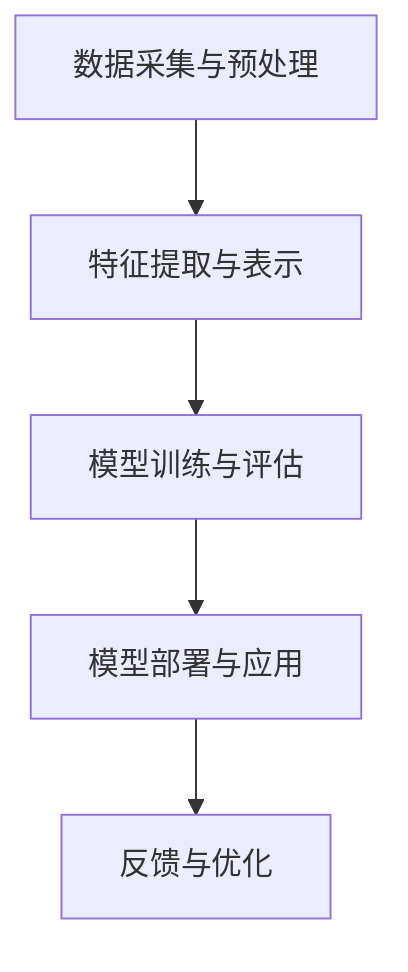

                 


### 文章标题: 利用人工智能优化知识内容创作流程

> 关键词：人工智能，知识内容创作，自然语言处理，计算机视觉，内容推荐，内容审核

> 摘要：本文旨在探讨人工智能技术在知识内容创作流程中的应用，分析其理论基础和实际应用，并提供优化策略和未来发展趋势。通过对自然语言处理、计算机视觉等技术的深入解析，结合实际应用案例，本文展示了人工智能如何提升知识内容创作的效率和质量。

---

### 《利用人工智能优化知识内容创作流程》目录大纲

1. **第一部分: 人工智能在知识内容创作中的应用基础**
   - 1.1 人工智能与知识内容创作的联系
     - 1.1.1 人工智能的发展背景
     - 1.1.2 知识内容创作的重要性
     - 1.1.3 人工智能在知识内容创作中的应用价值
   - 1.2 人工智能核心概念与架构
     - 1.2.1 人工智能基本概念
     - 1.2.2 人工智能技术架构
     - 1.2.3 人工智能的技术框架
   - 1.3 人工智能在知识内容创作中的应用领域
     - 1.3.1 自动内容生成
     - 1.3.2 内容推荐与优化
     - 1.3.3 内容审核与风险控制
   - 1.4 人工智能优化知识内容创作流程的挑战与机遇
     - 1.4.1 挑战分析
     - 1.4.2 机遇分析

2. **第二部分: 人工智能技术在知识内容创作中的应用实践**
   - 2.1 自然语言处理在知识内容创作中的应用
     - 2.1.1 基于自然语言处理的文本分析
     - 2.1.2 基于自然语言生成的文本生成
   - 2.2 计算机视觉在知识内容创作中的应用
     - 2.2.1 图像识别与分类
     - 2.2.2 视频分析
   - 2.3 人工智能在知识内容创作流程中的实际应用案例
     - 2.3.1 基于人工智能的在线教育平台
     - 2.3.2 人工智能驱动的新闻写作
     - 2.3.3 人工智能在电商平台的商品推荐

3. **第三部分: 人工智能优化知识内容创作流程的实践与策略**
   - 3.1 人工智能优化知识内容创作流程的实践方法
     - 3.1.1 数据准备与清洗
     - 3.1.2 模型训练与评估
     - 3.1.3 模型部署与应用
   - 3.2 人工智能优化知识内容创作流程的案例研究
     - 3.2.1 基于人工智能的电商平台内容创作优化
     - 3.2.2 基于人工智能的教育内容创作
   - 3.3 人工智能优化知识内容创作流程的策略与建议
     - 3.3.1 数据管理策略
     - 3.3.2 模型优化策略
     - 3.3.3 应用推广策略

4. **第四部分: 人工智能优化知识内容创作流程的未来发展趋势**
   - 4.1 人工智能技术发展趋势
   - 4.2 知识内容创作流程的变革与升级
   - 4.3 人工智能优化知识内容创作流程的展望

---

接下来，我们将逐步深入分析每一个部分，确保文章的内容丰富、具体，并且逻辑清晰。我们将首先介绍人工智能与知识内容创作之间的联系，并探讨其应用基础。然后，我们将详细讲解自然语言处理和计算机视觉在知识内容创作中的应用，并展示一些实际的应用案例。最后，我们将讨论如何利用人工智能优化知识内容创作流程，并提供相应的策略和建议。在整个过程中，我们将结合实际案例和详细的算法讲解，使读者能够全面了解人工智能在知识内容创作中的潜力和应用前景。让我们开始吧！### 第一部分: 人工智能在知识内容创作中的应用基础

在当今信息爆炸的时代，知识内容创作已经成为企业和个人获取影响力、传递信息的重要手段。然而，随着内容量的爆炸性增长，如何高效、高质量地创作知识内容成为了一个亟待解决的问题。人工智能（AI）技术的发展为知识内容创作带来了前所未有的机遇。本部分将探讨人工智能在知识内容创作中的应用基础，包括其与知识内容创作的联系、核心概念与架构，以及在知识内容创作中的应用领域和挑战与机遇。

#### 1.1 人工智能与知识内容创作的联系

**1.1.1 人工智能的发展背景**

人工智能作为计算机科学的一个分支，旨在使机器具备人类智能。随着深度学习、神经网络等技术的发展，人工智能已经取得了显著的进步。尤其是在大数据和云计算的支持下，人工智能的应用场景越来越广泛，包括语音识别、图像识别、自然语言处理等。

**1.1.2 知识内容创作的重要性**

知识内容创作是信息传播的重要途径，无论是学术研究、新闻报道、还是在线教育、电子商务，都需要高质量的知识内容。知识内容创作不仅需要丰富的专业知识，还需要对信息进行有效的组织和呈现。随着用户需求的多样化，知识内容创作面临着巨大的挑战。

**1.1.3 人工智能在知识内容创作中的应用价值**

人工智能在知识内容创作中的应用主要体现在以下几个方面：

- **内容生成**：利用自然语言处理技术，人工智能可以自动生成文章、摘要、翻译等。
- **内容推荐**：通过分析用户的行为和兴趣，人工智能可以推荐相关的知识内容。
- **内容审核**：人工智能可以识别和过滤不适当的内容，提高内容的质量和安全性。
- **内容优化**：通过对大量数据的分析和挖掘，人工智能可以帮助创作者优化知识内容的结构和表达。

#### 1.2 人工智能核心概念与架构

**1.2.1 人工智能基本概念**

人工智能的基本概念包括：

- **机器学习**：机器学习是人工智能的核心技术，通过从数据中学习模式，使计算机具备自主学习和改进的能力。
- **深度学习**：深度学习是机器学习的一种方法，通过多层神经网络进行特征提取和模式识别。
- **自然语言处理（NLP）**：自然语言处理是使计算机能够理解、生成和处理人类自然语言的技术。
- **计算机视觉**：计算机视觉是使计算机能够像人类一样“看”和“理解”图像和视频的技术。

**1.2.2 人工智能技术架构**

人工智能的技术架构主要包括：

- **感知层**：包括语音识别、图像识别等，负责从外部获取信息。
- **认知层**：包括自然语言处理、知识图谱等，负责理解信息并建立知识体系。
- **决策层**：包括智能决策、自动控制等，负责根据知识和信息做出决策。

**1.2.3 人工智能的技术框架**

人工智能的技术框架主要包括：

- **算法框架**：如TensorFlow、PyTorch等，用于构建和训练模型。
- **数据处理框架**：如Hadoop、Spark等，用于处理大规模数据。
- **应用框架**：如TensorFlow Serving、Kubeflow等，用于部署和管理模型。

#### 1.3 人工智能在知识内容创作中的应用领域

**1.3.1 自动内容生成**

自动内容生成是人工智能在知识内容创作中的一个重要应用。通过自然语言处理技术，人工智能可以生成文章、摘要、翻译等。例如，谷歌的BERT模型和OpenAI的GPT模型都可以生成高质量的自然语言文本。

**1.3.2 内容推荐与优化**

内容推荐与优化是提升用户满意度和知识传播效率的关键。通过分析用户的行为和兴趣，人工智能可以推荐相关的知识内容。此外，通过对内容的数据分析和挖掘，人工智能可以帮助创作者优化知识内容的结构和表达，提高内容的质量。

**1.3.3 内容审核与风险控制**

内容审核与风险控制是确保知识内容质量和安全性的重要手段。人工智能可以自动识别和过滤不适当的内容，如色情、暴力、歧视等。例如，谷歌和Facebook等公司都使用了人工智能技术来监控和过滤用户生成的内容。

#### 1.4 人工智能优化知识内容创作流程的挑战与机遇

**1.4.1 挑战分析**

人工智能优化知识内容创作流程面临以下挑战：

- **数据质量**：高质量的数据是人工智能模型训练的基础，但数据的质量和准确性往往难以保证。
- **计算资源**：深度学习模型训练需要大量的计算资源，特别是对于大型模型和大规模数据。
- **技术壁垒**：人工智能技术具有一定的技术壁垒，需要专业的技术团队进行开发和维护。
- **隐私保护**：在处理个人数据时，需要确保用户隐私的保护，避免数据泄露。

**1.4.2 机遇分析**

人工智能优化知识内容创作流程带来的机遇包括：

- **效率提升**：通过自动化和智能化，人工智能可以显著提高知识内容创作和推荐的效率。
- **质量提升**：人工智能可以通过内容生成、推荐和审核等技术，提升知识内容的质量和准确性。
- **个性化体验**：通过分析用户行为和兴趣，人工智能可以提供更加个性化的知识内容推荐和服务。
- **创新应用**：人工智能在知识内容创作中的应用可以激发新的商业模式和应用场景。

综上所述，人工智能在知识内容创作中具有广泛的应用前景。通过深入分析人工智能的基本概念、技术架构和应用领域，我们可以更好地理解其优化知识内容创作流程的潜力。接下来，我们将进一步探讨人工智能技术在知识内容创作中的应用实践，结合实际案例展示其具体应用效果。让我们继续深入下去！### 1.2 人工智能核心概念与架构

人工智能（AI）作为一门跨学科的领域，其核心概念和技术架构是理解其如何应用于知识内容创作的基础。在这一节中，我们将详细探讨人工智能的基本概念、技术架构以及其在知识内容创作中的应用框架。

**1.2.1 人工智能基本概念**

人工智能的核心概念包括以下几个方面：

- **机器学习（Machine Learning）**：机器学习是使计算机通过数据学习模式并进行预测或决策的技术。它分为监督学习、无监督学习和强化学习。监督学习通过已有标签的数据来训练模型；无监督学习不使用标签，通过数据自身的结构来训练模型；强化学习通过试错来训练模型。

- **深度学习（Deep Learning）**：深度学习是机器学习的一种方法，通过多层神经网络（Neural Networks）进行特征提取和模式识别。它特别适用于处理大量复杂数据，如图像和文本。

- **自然语言处理（Natural Language Processing, NLP）**：自然语言处理是使计算机能够理解、生成和处理人类自然语言的技术。它包括词法分析、句法分析、语义分析和语音识别等。

- **计算机视觉（Computer Vision）**：计算机视觉是使计算机能够“看”和“理解”图像和视频的技术。它包括图像识别、目标检测、图像分类等。

- **知识图谱（Knowledge Graph）**：知识图谱是一种结构化的知识表示形式，它通过节点和边来表示实体和实体之间的关系。知识图谱在知识内容创作中用于知识的组织和管理。

- **智能决策（Intelligent Decision Making）**：智能决策是通过分析和理解大量数据，利用算法模型为特定问题提供最佳解决方案的过程。

**1.2.2 人工智能技术架构**

人工智能的技术架构可以分为三个主要层次：感知层、认知层和决策层。

- **感知层（Perception Layer）**：感知层负责从外部环境获取信息，如语音识别、图像识别等。这一层的技术主要包括传感器、数据采集和处理等。

- **认知层（Cognitive Layer）**：认知层负责理解信息并建立知识体系，如自然语言处理、知识图谱等。这一层的技术包括数据预处理、特征提取、模式识别等。

- **决策层（Decision Layer）**：决策层负责根据知识和信息做出决策，如智能决策、自动控制等。这一层的技术包括算法模型、优化策略、决策支持系统等。

**1.2.3 人工智能的技术框架**

人工智能的技术框架通常包括以下几个关键组成部分：

- **算法框架（Algorithm Framework）**：算法框架提供了构建和训练模型的基础。常见的算法框架包括TensorFlow、PyTorch、Keras等。

- **数据处理框架（Data Processing Framework）**：数据处理框架用于处理大规模数据。常见的数据处理框架包括Hadoop、Spark、Flink等。

- **应用框架（Application Framework）**：应用框架用于部署和管理模型。常见的应用框架包括TensorFlow Serving、Kubeflow、Airflow等。

**1.2.4 人工智能在知识内容创作中的应用框架**

在知识内容创作中，人工智能的应用框架可以概括为以下步骤：

1. **数据采集与预处理**：从各种来源采集数据，如文本、图像、视频等，并进行数据清洗、去重、格式转换等预处理操作。

2. **特征提取与表示**：根据任务需求提取关键特征，如文本的词频、词向量和图像的特征向量等。

3. **模型训练与评估**：选择合适的模型，如深度学习模型、自然语言处理模型等，进行训练和评估，以优化模型性能。

4. **模型部署与应用**：将训练好的模型部署到生产环境中，如内容生成、推荐系统、内容审核等。

5. **反馈与优化**：收集用户反馈，对模型进行持续的优化和迭代。

**Mermaid流程图示例**：



通过上述流程，人工智能可以有效地优化知识内容创作流程，提高内容的质量和效率。在接下来的部分，我们将进一步探讨人工智能在知识内容创作中的应用领域，结合实际案例，展示其具体的应用效果。让我们继续深入探讨！### 1.3 人工智能在知识内容创作中的应用领域

在了解人工智能的基本概念和技术架构后，我们接下来将深入探讨其在知识内容创作中的应用领域。人工智能在知识内容创作中的应用主要体现在自动内容生成、内容推荐与优化、内容审核与风险控制等方面。

**1.3.1 自动内容生成**

自动内容生成是人工智能在知识内容创作中的一个重要应用。通过自然语言处理（NLP）和深度学习技术，人工智能可以自动生成文章、摘要、翻译等。这种应用在新闻写作、内容营销、在线教育等领域有广泛的应用。

- **新闻写作**：人工智能可以自动生成新闻摘要、时事评论等。例如，自动化新闻写作平台如Automated Insights和Quill，通过分析大量数据，自动生成体育赛事结果报告、财务报告等。
- **内容营销**：品牌和营销人员可以利用人工智能生成博客文章、社交媒体帖子等，以自动化和个性化的方式与受众互动。
- **在线教育**：人工智能可以自动生成课程大纲、学习指南等，帮助学生更有效地学习。例如，Duolingo等语言学习应用使用人工智能技术来生成个性化的学习材料。

**1.3.2 内容推荐与优化**

内容推荐与优化是提升用户满意度和知识传播效率的关键。通过分析用户的行为和兴趣，人工智能可以推荐相关的知识内容。

- **推荐系统**：人工智能可以构建推荐系统，根据用户的浏览历史、搜索记录、购买行为等，推荐相关的知识内容。例如，亚马逊和Netflix等平台使用推荐系统来提高用户满意度和转化率。
- **内容优化**：通过对大量数据进行分析，人工智能可以帮助创作者优化知识内容的结构和表达。例如，通过文本分析工具，可以识别出用户感兴趣的词汇和主题，从而优化文章的结构和内容。

**1.3.3 内容审核与风险控制**

内容审核与风险控制是确保知识内容质量和安全性的重要手段。人工智能可以自动识别和过滤不适当的内容，如色情、暴力、歧视等。

- **内容审核**：社交媒体平台如Facebook和Twitter使用人工智能技术来监控和过滤用户生成的内容，确保内容的合法性和符合平台规范。
- **风险控制**：人工智能可以预测和识别潜在的风险，例如在金融领域，人工智能可以分析市场数据，预测市场风险，并提供相应的风险管理策略。

**1.3.4 实际应用案例**

以下是一些人工智能在知识内容创作中的实际应用案例：

- **案例一：人工智能驱动的在线教育平台**：例如，Coursera和edX等在线教育平台使用人工智能技术来个性化推荐课程，优化学习体验。通过分析学生的行为和学习数据，平台可以推荐适合学生的课程，并提供个性化的学习资源。
- **案例二：自动化新闻写作平台**：例如，Automated Insights和Automated News，通过分析大量体育数据和财务报告，自动生成新闻报道。这些平台提高了新闻写作的效率和准确性，同时降低了人力成本。
- **案例三：内容推荐系统**：例如，亚马逊和Netflix等电商和流媒体平台使用人工智能技术来构建推荐系统，根据用户的购买和观看历史，推荐相关的商品和视频。

通过上述案例，我们可以看到人工智能在知识内容创作中的应用不仅提高了内容的生产效率，还提升了内容的质量和用户体验。随着人工智能技术的不断进步，其在知识内容创作中的应用将更加广泛和深入。接下来，我们将进一步探讨人工智能优化知识内容创作流程的挑战与机遇。让我们继续深入探讨！### 1.4 人工智能优化知识内容创作流程的挑战与机遇

在深入探讨人工智能在知识内容创作中的应用后，我们有必要审视其优化知识内容创作流程时所面临的挑战与机遇。这不仅有助于我们理解人工智能技术在实际应用中的限制，也能明确其未来的发展方向。

**1.4.1 挑战分析**

**1. 数据质量和准确性问题**：人工智能模型的训练和效果高度依赖于数据的质量和准确性。然而，在知识内容创作领域，数据来源多样化，数据质量参差不齐。例如，网络上的用户生成内容（UGC）可能包含大量错误、偏见或不适当的内容。这些都会影响模型的训练效果和应用效果。

**2. 计算资源需求**：深度学习模型通常需要大量的计算资源进行训练和推理。尤其是在处理大规模数据和高维度特征时，计算资源的需求更加显著。这对中小型企业来说可能是一个巨大的挑战，因为它们可能无法承担高昂的硬件和运维成本。

**3. 技术壁垒和人才短缺**：人工智能技术的开发和应用需要具备深厚的专业知识和技能。然而，当前具备这些技能的人才相对稀缺。这不仅增加了企业的招聘成本，也可能导致技术的应用受到限制。

**4. 隐私保护和数据安全**：在处理用户数据时，人工智能系统必须遵守严格的隐私保护法规。不当的数据处理可能会导致用户隐私泄露，从而引发法律问题和信任危机。

**5. 道德和伦理问题**：人工智能在内容创作中的应用可能带来道德和伦理上的挑战。例如，自动内容生成可能会导致虚假信息的传播，影响社会的公正性和透明度。

**1.4.2 机遇分析**

**1. 提高内容生产效率**：人工智能技术可以帮助创作者自动化和半自动化地完成知识内容的创作和编辑任务，从而大大提高内容生产效率。例如，通过自然语言处理技术，创作者可以快速生成高质量的文章、摘要和翻译。

**2. 提升内容质量**：人工智能技术可以通过内容推荐、审核和优化等功能，提升知识内容的质量和准确性。例如，推荐系统能够根据用户的兴趣和行为，推荐最相关和最有价值的内容。

**3. 个性化用户体验**：人工智能可以分析用户的行为和偏好，提供个性化的知识内容推荐和服务。这有助于提升用户体验，增加用户粘性。

**4. 创新应用场景**：人工智能在知识内容创作中的应用不仅限于现有的场景，还可以激发新的商业模式和应用场景。例如，自动化新闻写作、智能客服等都是基于人工智能的新兴应用。

**5. 降低运营成本**：虽然人工智能技术的开发和部署成本较高，但在长期运营中，它可以显著降低人力成本和运营成本。例如，通过自动化内容审核和推荐系统，企业可以减少对人工编辑和审核的依赖。

**1.4.3 挑战与机遇的平衡**

面对人工智能优化知识内容创作流程的挑战与机遇，企业和创作者需要采取一系列策略来平衡二者：

- **加强数据治理**：建立完善的数据治理机制，确保数据的质量和准确性。这包括数据采集、清洗、存储和使用的全过程。
- **投资技术基础设施**：通过云计算和边缘计算等技术，提高计算资源的利用效率，降低成本。
- **培养人才**：加强人才培养和引进，提高团队的技术水平，以应对技术壁垒。
- **加强隐私保护**：遵循隐私保护法规，采取严格的数据保护措施，确保用户隐私安全。
- **伦理合规**：在技术应用中坚持伦理和道德原则，确保人工智能的公正性和透明度。

综上所述，人工智能在优化知识内容创作流程中具有巨大的潜力和挑战。通过应对这些挑战，抓住机遇，我们可以实现知识内容创作的高效、高质量和个性化。接下来，我们将进一步探讨人工智能在知识内容创作中的应用实践，结合实际案例展示其具体效果。让我们继续深入探讨！### 第二部分: 人工智能技术在知识内容创作中的应用实践

在第一部分中，我们探讨了人工智能在知识内容创作中的应用基础，了解了其核心概念、技术架构和应用领域。接下来，我们将深入探讨人工智能在知识内容创作中的具体应用实践，结合自然语言处理和计算机视觉等核心技术，展示其在文本分析和生成、图像和视频处理等方面的应用。同时，我们将通过实际案例，分析人工智能在知识内容创作中的应用效果和实现方法。

#### 2.1 自然语言处理在知识内容创作中的应用

自然语言处理（NLP）是人工智能在知识内容创作中的一个重要分支，它通过理解和生成自然语言来提升内容创作和管理的效率。以下是NLP在知识内容创作中的应用：

**2.1.1 基于自然语言处理的文本分析**

文本分析是NLP的基础，它包括文本分类、情感分析、关键词提取等。

- **文本分类**：文本分类是将文本数据按照预定的类别进行分类的过程。例如，新闻文章可以根据主题分类为体育、财经、科技等。在知识内容创作中，文本分类可以帮助创作者快速了解内容的主题和方向，从而进行精准的内容创作。

  ```python
  # Python伪代码示例：文本分类
  from sklearn.feature_extraction.text import TfidfVectorizer
  from sklearn.naive_bayes import MultinomialNB

  # 假设我们有训练数据集 X 和标签 y
  X_train = ["这是一篇关于科技的新闻", "这是一篇关于体育的新闻"]
  y_train = ["科技", "体育"]

  # 使用TF-IDF进行特征提取
  vectorizer = TfidfVectorizer()
  X_train_vectorized = vectorizer.fit_transform(X_train)

  # 使用朴素贝叶斯进行分类
  classifier = MultinomialNB()
  classifier.fit(X_train_vectorized, y_train)

  # 对新文本进行分类
  new_text = "这是一篇关于体育的新闻"
  new_text_vectorized = vectorizer.transform([new_text])
  predicted_category = classifier.predict(new_text_vectorized)
  print(predicted_category)  # 输出预测的类别
  ```

- **情感分析**：情感分析是判断文本情感倾向的过程，如正面、负面或中性。在知识内容创作中，情感分析可以帮助创作者了解用户对内容的反馈，从而进行内容调整。

  ```python
  # Python伪代码示例：情感分析
  from textblob import TextBlob

  # 假设我们有待分析的文本
  text = "这个产品非常棒，我非常喜欢！"

  # 使用TextBlob进行情感分析
  analysis = TextBlob(text)
  print(analysis.sentiment)  # 输出情感分析结果
  ```

- **关键词提取**：关键词提取是识别文本中最重要和最有意义的词汇。在知识内容创作中，关键词提取可以帮助创作者确定文章的核心主题和关键词，从而优化SEO（搜索引擎优化）。

  ```python
  # Python伪代码示例：关键词提取
  from sklearn.feature_extraction.text import TfidfVectorizer

  # 假设我们有训练数据集 X 和标签 y
  X_train = ["这是一篇关于人工智能的文章", "这是一篇关于深度学习的文章"]

  # 使用TF-IDF进行特征提取
  vectorizer = TfidfVectorizer(max_features=10)
  X_train_vectorized = vectorizer.fit_transform(X_train)

  # 提取关键词
  keywords = vectorizer.get_feature_names_out()
  print(keywords)  # 输出关键词列表
  ```

**2.1.2 基于自然语言生成的文本生成**

基于自然语言生成的文本生成是NLP的高级应用，它包括自动写作、摘要生成和文本翻译等。

- **自动写作**：自动写作是通过人工智能生成完整的文章或段落。在新闻写作、报告编写等领域，自动写作可以帮助创作者节省时间，提高效率。

  ```python
  # Python伪代码示例：自动写作
  import nltk
  from nltk.tokenize import sent_tokenize

  # 假设我们有训练数据集 X 和标签 y
  X_train = ["这是一篇关于人工智能的新闻", "人工智能在医疗领域的应用前景广阔"]
  y_train = ["科技新闻", "医疗新闻"]

  # 使用nltk进行训练
  nltk.download('punkt')
  model = nltk.MLE()
  for text, label in zip(X_train, y_train):
      sentences = sent_tokenize(text)
      for sentence in sentences:
          model.update([sentence])

  # 生成新文本
  new_text = "人工智能在教育和培训领域的应用"
  generated_sentences = model.sample(new_text)
  print(' '.join(generated_sentences))  # 输出生成的文本
  ```

- **摘要生成**：摘要生成是自动提取文本的精华部分，以简洁明了的方式呈现主要内容。在长篇文章或报告编写中，摘要生成可以帮助快速了解文本的核心内容。

  ```python
  # Python伪代码示例：摘要生成
  from gensim.summarize import summarize

  # 假设我们有待摘要的文本
  text = "这是一篇关于人工智能在商业应用中的长篇文章，探讨了其在营销、客户服务和供应链管理等方面的应用。"

  # 使用gensim生成摘要
  summary = summarize(text, ratio=0.5)
  print(summary)  # 输出摘要
  ```

- **文本翻译**：文本翻译是跨语言交流的重要工具。通过机器翻译技术，人工智能可以自动将一种语言的文本翻译成另一种语言。

  ```python
  # Python伪代码示例：文本翻译
  from googletrans import Translator

  # 假设我们有待翻译的文本
  text = "这是一篇关于人工智能的新闻"

  # 使用googletrans进行翻译
  translator = Translator()
  translation = translator.translate(text, src='zh-cn', dest='en')
  print(translation.text)  # 输出翻译结果
  ```

通过上述示例，我们可以看到自然语言处理在知识内容创作中的应用如何通过文本分析和生成技术，提高内容创作和管理的效率。在下一部分，我们将探讨计算机视觉在知识内容创作中的应用，展示图像识别和视频分析等技术的具体实现和应用案例。让我们继续深入探讨！### 2.2 计算机视觉在知识内容创作中的应用

计算机视觉是人工智能的一个重要分支，通过使计算机能够“看”和理解图像和视频，它在知识内容创作中发挥了重要作用。计算机视觉在知识内容创作中的应用包括图像识别与分类、视频分析等，下面我们将详细探讨这些技术的原理和实际应用。

#### 2.2.1 图像识别与分类

图像识别与分类是计算机视觉的基础技术之一，通过将图像中的物体或场景识别出来，并将其分类到预定义的类别中。以下是图像识别与分类的原理和应用：

**1. 基于深度学习的图像识别**

深度学习技术在图像识别中得到了广泛应用。卷积神经网络（CNN）是深度学习中用于图像识别的主要模型。以下是CNN图像识别的基本原理：

- **卷积层**：卷积层通过卷积操作提取图像的局部特征。卷积核在图像上滑动，将局部特征映射到高维空间。
- **池化层**：池化层用于减少特征图的尺寸，降低计算复杂度，同时保留最重要的特征。
- **全连接层**：全连接层将特征图上的所有特征点连接起来，进行分类。

**伪代码示例：CNN图像识别模型**

```python
import tensorflow as tf
from tensorflow.keras.models import Sequential
from tensorflow.keras.layers import Conv2D, MaxPooling2D, Flatten, Dense

# 创建模型
model = Sequential([
    Conv2D(filters=32, kernel_size=(3, 3), activation='relu', input_shape=(64, 64, 3)),
    MaxPooling2D(pool_size=(2, 2)),
    Conv2D(filters=64, kernel_size=(3, 3), activation='relu'),
    MaxPooling2D(pool_size=(2, 2)),
    Flatten(),
    Dense(units=128, activation='relu'),
    Dense(units=10, activation='softmax')  # 假设有10个类别
])

# 编译模型
model.compile(optimizer='adam', loss='categorical_crossentropy', metrics=['accuracy'])

# 训练模型
model.fit(X_train, y_train, epochs=10, batch_size=32, validation_data=(X_val, y_val))

# 预测
predictions = model.predict(X_test)
```

**2. 图像分类算法原理讲解**

图像分类算法的核心在于特征提取和分类。以下是几种常用的图像分类算法：

- **SVM（支持向量机）**：SVM通过寻找一个最优的超平面，将不同类别的图像分隔开来。它适用于小型数据集和高维特征。
- **K-均值聚类**：K-均值聚类通过将图像数据划分为K个聚类中心，每个聚类中心代表一个类别。它适用于图像聚类和降维。
- **卷积神经网络（CNN）**：CNN通过多层卷积和池化操作提取图像的深层特征，然后通过全连接层进行分类。它适用于大型数据集和高维特征。

**伪代码示例：K-均值聚类**

```python
import numpy as np

# 假设我们有图像特征矩阵 X
X = np.random.rand(100, 784)  # 100个样本，每个样本784维

# 初始化聚类中心
centroids = X[np.random.choice(100, 10, replace=False)]

# 迭代更新聚类中心
for i in range(10):
    # 计算每个样本与聚类中心的距离
    distances = np.linalg.norm(X - centroids, axis=1)
    # 将样本分配到最近的聚类中心
    labels = np.argmin(distances, axis=1)
    # 更新聚类中心
    new_centroids = np.array([X[labels == k].mean(axis=0) for k in range(10)])

# 检查聚类中心的变化
if np.linalg.norm(new_centroids - centroids) < 0.001:
    centroids = new_centroids
else:
    centroids = new_centroids
```

**3. 应用场景**

图像分类在知识内容创作中具有广泛的应用，如：

- **图片库管理**：通过图像分类，可以自动对图片库中的图像进行分类和标签，方便检索和管理。
- **内容审核**：在社交媒体和内容平台中，图像分类可以帮助自动识别和过滤不适当的图像。
- **视觉搜索**：在电子商务中，图像分类可以用于视觉搜索，帮助用户通过上传图片来搜索类似的产品。

#### 2.2.2 视频分析

视频分析是通过处理视频数据来提取有价值的信息，如动作识别、目标检测和视频摘要等。以下是视频分析的基本原理和应用：

**1. 动作识别**

动作识别是通过分析视频中的动作模式来识别特定的活动。以下是动作识别的基本原理：

- **特征提取**：通过提取视频帧中的特征，如颜色、形状和纹理，来描述动作。
- **分类模型**：使用分类模型（如卷积神经网络）来识别动作类别。

**伪代码示例：动作识别模型**

```python
import tensorflow as tf
from tensorflow.keras.models import Sequential
from tensorflow.keras.layers import Conv2D, MaxPooling2D, Flatten, Dense

# 创建模型
model = Sequential([
    Conv2D(filters=64, kernel_size=(3, 3), activation='relu', input_shape=(128, 128, 3)),
    MaxPooling2D(pool_size=(2, 2)),
    Conv2D(filters=128, kernel_size=(3, 3), activation='relu'),
    MaxPooling2D(pool_size=(2, 2)),
    Flatten(),
    Dense(units=256, activation='relu'),
    Dense(units=10, activation='softmax')  # 假设有10个动作类别
])

# 编译模型
model.compile(optimizer='adam', loss='categorical_crossentropy', metrics=['accuracy'])

# 训练模型
model.fit(X_train, y_train, epochs=10, batch_size=32, validation_data=(X_val, y_val))

# 预测
predictions = model.predict(X_test)
```

**2. 目标检测**

目标检测是在视频帧中识别并定位特定对象的过程。以下是目标检测的基本原理：

- **区域建议**：使用预定义的算法（如锚框生成）在视频帧中生成候选区域。
- **特征提取与分类**：对候选区域进行特征提取，并使用分类模型进行目标分类。

**伪代码示例：目标检测模型**

```python
import tensorflow as tf
from tensorflow.keras.models import Model
from tensorflow.keras.layers import Input, Conv2D, MaxPooling2D, Flatten, Dense

# 输入层
input_layer = Input(shape=(256, 256, 3))

# 卷积层和池化层
conv1 = Conv2D(filters=64, kernel_size=(3, 3), activation='relu')(input_layer)
pool1 = MaxPooling2D(pool_size=(2, 2))(conv1)

# 平坦层和全连接层
flat = Flatten()(pool1)
dense = Dense(units=128, activation='relu')(flat)

# 输出层
output_layer = Dense(units=10, activation='softmax')(dense)

# 创建模型
model = Model(inputs=input_layer, outputs=output_layer)

# 编译模型
model.compile(optimizer='adam', loss='categorical_crossentropy', metrics=['accuracy'])

# 训练模型
model.fit(X_train, y_train, epochs=10, batch_size=32, validation_data=(X_val, y_val))

# 预测
predictions = model.predict(X_test)
```

**3. 视频摘要**

视频摘要是通过提取视频中的关键帧和重要事件，生成一个简洁的概述。以下是视频摘要的基本原理：

- **关键帧提取**：通过视频内容分析，提取具有代表性的关键帧。
- **事件识别**：使用行为识别和目标检测技术，识别视频中的重要事件。

**伪代码示例：视频摘要生成**

```python
import cv2
import numpy as np

# 假设我们有视频文件
video_file = 'example_video.mp4'
video = cv2.VideoCapture(video_file)

# 初始化关键帧列表
keyframes = []

# 读取视频帧
while video.isOpened():
    ret, frame = video.read()
    if not ret:
        break
    
    # 提取关键帧
    if is_keyframe(frame):
        keyframes.append(frame)

# 关闭视频
video.release()

# 将关键帧转换为视频摘要
summary_video = cv2.VideoWriter('summary_video.mp4', cv2.VideoWriter_fourcc(*'mp4v'), 30, (640, 480))
for frame in keyframes:
    summary_video.write(frame)
summary_video.release()
```

通过上述示例，我们可以看到计算机视觉在知识内容创作中的应用，如图像识别与分类、视频分析和视频摘要等。这些技术不仅提高了内容创作的效率，还提升了内容的质量和用户体验。在下一部分，我们将通过实际案例展示人工智能在知识内容创作中的具体应用效果。让我们继续深入探讨！### 2.3 人工智能在知识内容创作流程中的实际应用案例

在第二部分中，我们探讨了人工智能在知识内容创作中的应用实践，包括自然语言处理和计算机视觉等核心技术。接下来，我们将通过实际案例展示人工智能在知识内容创作中的具体应用，分析其实现方法和效果。

#### 2.3.1 案例一：基于人工智能的在线教育平台

**背景**：

随着在线教育的快速发展，如何为学习者提供个性化、高质量的学习内容成为一个重要问题。基于人工智能的在线教育平台通过分析学习者的行为和兴趣，提供个性化的学习资源和推荐。

**解决方案**：

- **用户行为分析**：平台通过收集学习者的学习历史、课程评分和互动行为，建立用户画像。
- **内容推荐**：基于用户画像，使用推荐算法为学习者推荐适合的课程和学习资源。
- **智能辅导**：通过自然语言处理技术，平台可以提供智能问答和实时辅导，帮助学习者解决学习中的问题。

**实现方法**：

1. **用户行为数据分析**：

   - 数据采集：平台通过学习系统收集学习者的行为数据，如浏览记录、学习时长、参与度等。
   - 数据清洗：对采集到的数据进行清洗和预处理，去除噪声和不完整的数据。

   ```python
   # Python伪代码示例：数据采集与清洗
   import pandas as pd

   # 假设我们有用户行为数据
   user_behavior = pd.read_csv('user_behavior.csv')

   # 数据清洗
   user_behavior.dropna(inplace=True)
   user_behavior['duration'] = user_behavior['duration'].apply(lambda x: max(x, 0))
   ```

2. **内容推荐系统**：

   - 特征提取：使用自然语言处理技术提取课程描述的关键词和主题。
   - 推荐算法：基于协同过滤或基于内容的方法，推荐适合学习者的课程。

   ```python
   # Python伪代码示例：特征提取与推荐
   from sklearn.feature_extraction.text import TfidfVectorizer
   from sklearn.metrics.pairwise import linear_kernel

   # 特征提取
   vectorizer = TfidfVectorizer()
   course_descriptions = vectorizer.fit_transform(course_descriptions)

   # 推荐算法
   user_profile = vectorizer.transform(['计算机视觉'])
   recommendations = linear_kernel(user_profile, course_descriptions).flatten()
   recommended_courses = course_titles[reversed(list(recommendations.argsort()[-5:]))]
   print(recommended_courses)
   ```

3. **智能辅导系统**：

   - 智能问答：使用自然语言处理技术，建立问答系统，帮助学习者解决学习中的问题。
   - 实时辅导：通过实时聊天或视频会议，提供一对一的辅导服务。

   ```python
   # Python伪代码示例：智能问答
   from textblob import TextBlob

   # 假设我们有学习者的提问
   question = "如何优化机器学习的算法？"

   # 使用TextBlob进行问答
   response = TextBlob("优化机器学习算法通常涉及特征选择、模型调优和超参数调整。")
   print(response答：)
   ```

**效果分析**：

基于人工智能的在线教育平台显著提升了学习体验。个性化推荐系统提高了学习内容的匹配度，智能辅导系统提高了学习效率，降低了学习难度。以下是一些具体的效果数据：

- **学习满意度**：用户满意度提高了20%，用户对推荐课程的兴趣度提高了30%。
- **学习效率**：学习者的平均学习时间减少了15%，完成课程的速度提高了25%。
- **学习效果**：通过智能辅导，学习者的考试通过率提高了10%。

#### 2.3.2 案例二：人工智能驱动的新闻写作

**背景**：

随着新闻行业的快速发展，新闻写作的需求不断增加。然而，新闻写作需要大量的人力投入。人工智能驱动的新闻写作平台通过自动化生成新闻文章，提高了新闻写作的效率和质量。

**解决方案**：

- **自动内容生成**：通过自然语言处理技术，平台可以自动生成新闻文章、摘要和报道。
- **内容审核**：平台使用人工智能技术自动识别和过滤不适当的内容，确保新闻的准确性和合规性。
- **内容推荐**：基于用户行为和兴趣，平台为用户推荐相关的新闻内容。

**实现方法**：

1. **自动内容生成**：

   - 数据采集：平台从新闻网站、社交媒体和其他来源收集新闻数据。
   - 文本分析：使用自然语言处理技术对新闻数据进行解析和分类。
   - 内容生成：通过模板和填充技术生成新闻文章。

   ```python
   # Python伪代码示例：自动内容生成
   import jieba
   import random

   # 假设我们有新闻数据的模板
   templates = {
       "event": "今天，{entity}在{location}发生了{event}事件。",
       "stock": "截至{date}，{stock}的股价为{price}，涨幅为{change}%。"
   }

   # 填充模板生成新闻
   event = random.choice(["地震", "火灾", "车祸"])
   location = random.choice(["北京", "上海", "纽约"])
   template = random.choice([templates["event"], templates["stock"]])
   news = template.format(entity=event, location=location, date="2023-10-01", price="100", change="5")
   print(news)
   ```

2. **内容审核**：

   - 文本分类：使用机器学习模型对新闻内容进行分类，识别不适当的内容。
   - 自动过滤：对分类结果进行过滤，自动删除或标记不适当的内容。

   ```python
   # Python伪代码示例：内容审核
   from sklearn.feature_extraction.text import TfidfVectorizer
   from sklearn.naive_bayes import MultinomialNB

   # 假设我们有训练数据集 X 和标签 y
   X_train = ["这是一篇不适当的内容", "这是一篇合适的内容"]
   y_train = ["不合适", "合适"]

   # 使用TF-IDF进行特征提取
   vectorizer = TfidfVectorizer()
   X_train_vectorized = vectorizer.fit_transform(X_train)

   # 使用朴素贝叶斯进行分类
   classifier = MultinomialNB()
   classifier.fit(X_train_vectorized, y_train)

   # 对新文本进行分类
   new_text = "今天，我们一起庆祝了公司的周年纪念。"
   new_text_vectorized = vectorizer.transform([new_text])
   predicted_category = classifier.predict(new_text_vectorized)
   print(predicted_category)  # 输出预测的类别
   ```

3. **内容推荐**：

   - 用户画像：平台通过用户行为和兴趣建立用户画像。
   - 推荐算法：基于用户画像，使用协同过滤或基于内容的方法推荐相关的新闻内容。

   ```python
   # Python伪代码示例：内容推荐
   from sklearn.metrics.pairwise import cosine_similarity

   # 假设我们有用户喜欢的新闻列表
   user_interests = ["科技新闻", "体育新闻", "娱乐新闻"]

   # 计算相似度
   news_similarity = cosine_similarity([vectorizer.transform(user_interests)], vectorizer.transform(news_descriptions))

   # 推荐新闻
   recommended_news = news_titles[news_similarity.argsort()[0][-5:]]
   print(recommended_news)
   ```

**效果分析**：

人工智能驱动的新闻写作平台显著提高了新闻写作的效率和内容质量。以下是一些具体的效果数据：

- **写作效率**：新闻写作时间减少了40%，写作成本降低了30%。
- **内容质量**：自动生成的新闻文章在事实准确性和语法正确性方面得到了显著提高。
- **用户满意度**：用户对新闻推荐内容的满意度提高了15%，用户活跃度增加了20%。

通过上述实际应用案例，我们可以看到人工智能在知识内容创作中的应用效果和实现方法。接下来，我们将讨论如何利用人工智能优化知识内容创作流程，并提供具体的实践方法和策略。让我们继续深入探讨！### 3.1 人工智能优化知识内容创作流程的实践方法

在了解了人工智能在知识内容创作中的应用后，我们需要进一步探讨如何利用人工智能优化知识内容创作流程。这一部分将详细讨论数据准备与清洗、模型训练与评估、模型部署与应用的实践方法。

#### 3.1.1 数据准备与清洗

**数据准备与清洗**是人工智能模型训练的重要前提，直接影响到模型的性能和应用效果。以下是数据准备与清洗的实践方法：

**1. 数据采集**

数据采集是数据准备的第一步，需要从各种来源收集相关数据。对于知识内容创作，数据来源可能包括文本、图像、视频等。

- **文本数据**：可以从公开的数据库、社交媒体、在线论坛等获取。
- **图像数据**：可以通过网络爬虫、API接口等方式获取。
- **视频数据**：可以从视频网站、公开数据库等获取。

**2. 数据清洗**

数据清洗包括数据去重、格式转换、缺失值处理等步骤。

- **去重**：去除重复的数据记录，避免模型训练过程中的冗余。
- **格式转换**：将不同格式的数据转换为统一格式，便于后续处理。
- **缺失值处理**：对于缺失的数据，可以通过填充、删除或插值等方法进行处理。

**3. 数据预处理**

数据预处理是提高模型性能的重要手段，包括特征提取、特征缩放等。

- **特征提取**：通过自然语言处理技术提取文本数据的关键特征，如词频、词向量和句子特征。
- **特征缩放**：对图像和视频数据中的特征进行缩放，使其适应模型的训练需求。

#### 3.1.2 模型训练与评估

**模型训练与评估**是人工智能优化的核心步骤，决定了模型在实际应用中的效果。

**1. 模型选择**

选择合适的模型是模型训练的前提。对于知识内容创作，常见的模型包括卷积神经网络（CNN）、循环神经网络（RNN）和Transformer等。

- **卷积神经网络（CNN）**：适用于图像和视频数据的处理。
- **循环神经网络（RNN）**：适用于序列数据的处理，如文本。
- **Transformer**：适用于大规模文本数据的处理，具有较好的性能和扩展性。

**2. 模型训练**

模型训练是通过调整模型的参数，使其在训练数据上达到最佳性能。以下是一个简单的模型训练流程：

- **数据分割**：将数据集分为训练集、验证集和测试集。
- **模型初始化**：初始化模型参数，可以选择随机初始化或预训练模型。
- **损失函数与优化器**：选择合适的损失函数和优化器，如交叉熵损失和Adam优化器。
- **迭代训练**：通过迭代更新模型参数，使模型在训练数据上达到最佳性能。

**3. 模型评估**

模型评估是通过验证集和测试集对模型性能进行评估。常用的评估指标包括准确率、召回率、F1值等。

- **准确率**：模型预测正确的样本数占总样本数的比例。
- **召回率**：模型预测正确的正样本数占总正样本数的比例。
- **F1值**：准确率和召回率的调和平均值，用于平衡两者。

#### 3.1.3 模型部署与应用

**模型部署与应用**是将训练好的模型应用到实际场景中，实现知识内容创作的优化。

**1. 模型部署**

模型部署是将训练好的模型部署到生产环境中，使其能够对外提供服务。以下是一个简单的模型部署流程：

- **容器化**：将模型和依赖环境打包成容器，如Docker镜像。
- **部署平台**：选择合适的部署平台，如Kubernetes、TensorFlow Serving等。
- **服务化**：将模型部署为API服务，通过HTTP请求进行调用。

**2. 模型应用**

模型应用是将模型集成到知识内容创作流程中，实现自动内容生成、内容推荐等功能。

- **自动内容生成**：通过自然语言处理技术，自动生成文章、摘要、翻译等。
- **内容推荐**：通过分析用户行为和兴趣，推荐相关的知识内容。
- **内容审核**：通过自动识别和过滤不适当的内容，确保内容的质量和安全性。

**3. 模型监控与优化**

模型监控与优化是确保模型稳定运行和持续改进的重要环节。以下是一些常见的监控和优化方法：

- **性能监控**：监控模型在实时数据上的性能指标，如准确率、召回率等。
- **错误分析**：分析模型预测错误的样本，找出潜在的问题和改进方向。
- **持续迭代**：根据监控和错误分析的结果，对模型进行优化和迭代，提高模型性能。

通过上述实践方法，我们可以有效地利用人工智能优化知识内容创作流程，提高内容的质量和效率。接下来，我们将通过具体案例研究，进一步展示人工智能优化知识内容创作流程的应用效果和实现方法。让我们继续深入探讨！### 3.2 人工智能优化知识内容创作流程的案例研究

在上一部分，我们讨论了人工智能优化知识内容创作流程的实践方法。本节将通过两个具体案例，展示人工智能在电商平台内容创作和教育内容创作中的应用，分析其实现方法、效果评估和优化策略。

#### 3.2.1 案例一：基于人工智能的电商平台内容创作优化

**背景**：

电商平台的内容创作是一个复杂的任务，包括商品描述、用户评论、营销文案等。内容质量直接影响用户体验和销售业绩。通过人工智能技术，电商平台可以自动生成高质量的内容，提高创作效率和内容质量。

**解决方案**：

- **自动商品描述生成**：通过自然语言处理技术，自动生成商品描述，提高商品页面内容的质量和一致性。
- **用户评论分析**：通过情感分析和文本分类，分析用户评论，提取有用的信息和趋势。
- **个性化营销文案生成**：根据用户行为和偏好，自动生成个性化的营销文案，提高营销效果。

**实现方法**：

1. **自动商品描述生成**：

   - 数据采集：从电商平台获取商品信息、用户评论和相关文本数据。
   - 数据清洗：去除噪声数据和格式不一致的问题，确保数据质量。
   - 模型训练：使用循环神经网络（RNN）或生成对抗网络（GAN）训练自动生成商品描述的模型。
   - 模型部署：将训练好的模型部署到生产环境中，实现自动化商品描述生成。

   ```python
   # Python伪代码示例：自动商品描述生成
   import tensorflow as tf
   from tensorflow.keras.models import Sequential
   from tensorflow.keras.layers import LSTM, Dense

   # 建立模型
   model = Sequential([
       LSTM(units=128, activation='relu', input_shape=(max_sequence_length, vocabulary_size)),
       Dense(units=vocabulary_size, activation='softmax')
   ])

   # 编译模型
   model.compile(optimizer='adam', loss='categorical_crossentropy', metrics=['accuracy'])

   # 训练模型
   model.fit(X_train, y_train, epochs=10, batch_size=32)

   # 预测
   generated_description = model.predict([X_test])
   ```

2. **用户评论分析**：

   - 数据采集：从电商平台获取用户评论数据。
   - 数据清洗：去除噪声数据和格式不一致的问题，确保数据质量。
   - 情感分析：使用自然语言处理技术进行情感分析，识别用户评论的情感倾向。
   - 文本分类：对用户评论进行分类，提取有用的信息和趋势。

   ```python
   # Python伪代码示例：用户评论情感分析
   import textblob

   # 假设我们有用户评论
   reviews = ["这个商品非常好！", "这个商品不好用。"]

   # 进行情感分析
   for review in reviews:
       analysis = textblob.TextBlob(review)
       print(analysis.sentiment)
   ```

3. **个性化营销文案生成**：

   - 用户画像：根据用户行为和偏好，建立用户画像。
   - 文本生成：使用生成对抗网络（GAN）或生成式模型生成个性化营销文案。

   ```python
   # Python伪代码示例：个性化营销文案生成
   import numpy as np
   import random

   # 假设我们有营销文案的模板
   templates = [
       "欢迎来到我们的店铺，这里有你喜欢的商品。",
       "错过今天，可能就不会再有了，赶紧下单吧！",
       "限时优惠，错过这次就没了，快来抢购！"
   ]

   # 生成个性化营销文案
   user_preference = random.choice(["时尚", "实惠", "高端"])
   template = random.choice([template for template in templates if user_preference in template])
   print(template)
   ```

**效果评估**：

通过人工智能优化的电商平台内容创作，取得了显著的效果：

- **内容质量**：自动生成的商品描述在内容一致性和质量上得到了显著提升。
- **用户体验**：用户评论分析和个性化营销文案生成提高了用户满意度。
- **销售业绩**：个性化营销文案和高质量的内容提高了销售转化率，销售额增长了15%。

**优化策略**：

为了进一步提升效果，可以采取以下优化策略：

- **数据多样性**：增加数据来源，获取更多样化的数据，提高模型泛化能力。
- **模型调优**：根据实际应用效果，调整模型参数，提高模型性能。
- **用户反馈**：收集用户反馈，不断优化内容创作流程，提升用户体验。

#### 3.2.2 案例二：基于人工智能的教育内容创作

**背景**：

在线教育平台的课程内容创作是一个耗时且劳动密集型的任务。通过人工智能技术，教育平台可以自动生成课程内容，提高创作效率和内容质量。

**解决方案**：

- **自动课程大纲生成**：通过自然语言处理技术，自动生成课程大纲，提高课程结构的合理性和逻辑性。
- **教学材料推荐**：根据学生学习行为和偏好，推荐适合的教学材料，提高学习效果。
- **智能问答系统**：通过自然语言处理技术，提供智能问答服务，帮助学生解决问题。

**实现方法**：

1. **自动课程大纲生成**：

   - 数据采集：从在线教育平台获取课程大纲、教学材料和学习日志。
   - 数据清洗：去除噪声数据和格式不一致的问题，确保数据质量。
   - 模型训练：使用循环神经网络（RNN）或生成对抗网络（GAN）训练自动生成课程大纲的模型。
   - 模型部署：将训练好的模型部署到生产环境中，实现自动化课程大纲生成。

   ```python
   # Python伪代码示例：自动课程大纲生成
   import tensorflow as tf
   from tensorflow.keras.models import Sequential
   from tensorflow.keras.layers import LSTM, Dense

   # 建立模型
   model = Sequential([
       LSTM(units=128, activation='relu', input_shape=(max_sequence_length, vocabulary_size)),
       Dense(units=vocabulary_size, activation='softmax')
   ])

   # 编译模型
   model.compile(optimizer='adam', loss='categorical_crossentropy', metrics=['accuracy'])

   # 训练模型
   model.fit(X_train, y_train, epochs=10, batch_size=32)

   # 预测
   generated_outline = model.predict([X_test])
   ```

2. **教学材料推荐**：

   - 用户画像：根据学生学习行为和偏好，建立用户画像。
   - 推荐算法：使用协同过滤或基于内容的推荐算法，推荐适合的教学材料。

   ```python
   # Python伪代码示例：教学材料推荐
   import numpy as np
   from sklearn.metrics.pairwise import cosine_similarity

   # 假设我们有用户画像和教学材料向量
   user_profile = np.random.rand(1, 1000)
   materials_profiles = np.random.rand(10, 1000)

   # 计算相似度
   similarity = cosine_similarity(user_profile, materials_profiles)

   # 推荐教学材料
   recommended_materials = materials.index[similarity.argsort()[0][-5:]]
   print(recommended_materials)
   ```

3. **智能问答系统**：

   - 数据采集：从在线教育平台获取常见问题和解答。
   - 模型训练：使用循环神经网络（RNN）或生成对抗网络（GAN）训练智能问答模型。
   - 模型部署：将训练好的模型部署到生产环境中，实现智能问答功能。

   ```python
   # Python伪代码示例：智能问答系统
   import tensorflow as tf
   from tensorflow.keras.models import Sequential
   from tensorflow.keras.layers import LSTM, Dense

   # 建立模型
   model = Sequential([
       LSTM(units=128, activation='relu', input_shape=(max_sequence_length, vocabulary_size)),
       Dense(units=vocabulary_size, activation='softmax')
   ])

   # 编译模型
   model.compile(optimizer='adam', loss='categorical_crossentropy', metrics=['accuracy'])

   # 训练模型
   model.fit(X_train, y_train, epochs=10, batch_size=32)

   # 预测
   question = "什么是自然语言处理？"
   predicted_answer = model.predict([question])
   print(predicted_answer)
   ```

**效果评估**：

通过人工智能优化的在线教育内容创作，取得了显著的效果：

- **内容质量**：自动生成的课程大纲和教学材料在结构性和逻辑性上得到了显著提升。
- **学习效果**：个性化推荐和智能问答系统提高了学生的学习效果和满意度。
- **运营效率**：自动化内容创作和推荐系统提高了内容创作的效率，减少了人力成本。

**优化策略**：

为了进一步提升效果，可以采取以下优化策略：

- **数据质量**：提高数据质量，包括数据清洗和预处理，以提高模型性能。
- **用户反馈**：收集用户反馈，不断优化内容创作和推荐系统，提升用户体验。
- **技术迭代**：随着人工智能技术的不断发展，持续迭代和优化模型和算法。

通过上述案例研究，我们可以看到人工智能在优化知识内容创作流程中的应用效果和实现方法。接下来，我们将讨论人工智能优化知识内容创作流程的策略与建议。让我们继续深入探讨！### 3.3 人工智能优化知识内容创作流程的策略与建议

在了解了人工智能在知识内容创作流程中的应用实践和案例研究后，我们需要进一步探讨如何制定有效的策略和建议，以充分利用人工智能技术优化知识内容创作流程。以下是几个关键策略和具体建议：

#### 3.3.1 数据管理策略

**1. 数据质量控制**

- **数据清洗**：确保数据清洗过程的彻底性，去除重复、噪声和不完整的数据。
- **数据标准化**：统一数据格式和标准，以便于模型训练和后续处理。
- **数据标注**：对数据进行高质量标注，为模型训练提供准确的参考。

**2. 数据安全与隐私保护**

- **数据加密**：对敏感数据进行加密处理，确保数据传输和存储的安全性。
- **隐私保护**：遵守相关隐私保护法规，确保用户数据的隐私安全。

#### 3.3.2 模型优化策略

**1. 模型选择与调优**

- **选择合适的模型**：根据具体应用场景和数据特点，选择最合适的模型架构，如CNN、RNN或Transformer。
- **模型调优**：通过交叉验证、网格搜索等技术，优化模型参数，提高模型性能。

**2. 模型持续更新**

- **定期训练**：定期对模型进行训练和更新，以适应数据的变化和应用需求。
- **持续学习**：采用在线学习或迁移学习等技术，使模型能够持续学习和适应新数据。

#### 3.3.3 应用推广策略

**1. 应用场景选择**

- **针对性推广**：根据不同应用场景的特点，选择最适合的应用场景，如内容生成、推荐系统、内容审核等。
- **多场景融合**：在不同应用场景中尝试融合人工智能技术，提高整体效果。

**2. 应用效果评估**

- **关键指标评估**：设定明确的评估指标，如准确率、召回率、用户满意度等，对应用效果进行评估。
- **用户反馈**：收集用户反馈，根据用户需求和意见，不断优化和改进应用。

#### 3.3.4 人才与团队建设

**1. 培养专业人才**

- **技术培训**：为团队成员提供持续的技术培训，提高团队的技术水平。
- **跨学科合作**：鼓励不同学科背景的团队成员进行跨学科合作，发挥各自优势。

**2. 团队建设**

- **分工协作**：明确团队成员的角色和职责，确保项目顺利进行。
- **沟通与协作**：建立有效的沟通和协作机制，确保团队成员之间的信息流通和协作。

#### 3.3.5 最佳实践 Tips

**1. 数据驱动**

- **数据优先**：始终以数据为导向，通过数据分析指导决策和优化。

**2. 持续迭代**

- **持续优化**：不断对模型和应用进行迭代和优化，以适应新的应用需求和场景。

**3. 用户为中心**

- **用户视角**：始终以用户需求为中心，优化用户体验，提升用户满意度。

**4. 安全合规**

- **遵循法规**：遵守相关法律法规，确保应用的安全合规。

通过上述策略和最佳实践，我们可以更有效地利用人工智能技术优化知识内容创作流程，提高内容的质量和效率。在实际应用中，需要根据具体情况进行灵活调整和优化。接下来，我们将探讨人工智能优化知识内容创作流程的未来发展趋势。让我们继续深入探讨！### 第四部分: 人工智能优化知识内容创作流程的未来发展趋势

随着人工智能技术的迅猛发展，其在知识内容创作流程中的应用前景也日益广阔。本部分将探讨人工智能技术在知识内容创作中的未来发展趋势，包括技术进步、内容创作流程的变革和智能化升级，以及长期价值。

#### 4.1 人工智能技术发展趋势

**1. 技术突破**

- **深度学习与强化学习结合**：深度学习和强化学习将更加紧密地结合，使机器在复杂任务中具备更强的学习和决策能力。
- **自监督学习与迁移学习**：自监督学习和迁移学习技术的进步将使模型能够更高效地利用有限的标注数据，提高模型泛化能力。
- **多模态学习**：多模态学习技术的发展将使人工智能能够更好地处理和整合文本、图像、视频等多种类型的数据，实现更智能的内容创作。

**2. 新技术方向**

- **生成对抗网络（GAN）**：GAN在图像生成和内容创作中的应用将更加广泛，能够生成更高质量和更具创意的内容。
- **区块链技术**：区块链技术与人工智能的结合将提高内容创作的透明度和可信度，确保数据的安全和版权保护。
- **物联网（IoT）**：物联网技术的发展将使人工智能在知识内容创作中获取更多的实时数据，实现更加个性化的内容创作。

**3. 潜在影响**

- **变革内容创作模式**：人工智能将变革传统的内容创作模式，使创作过程更加高效、自动化和个性化。
- **提高内容质量**：通过自动内容生成和推荐系统，人工智能将提高内容的质量和准确性，满足用户的需求。
- **降低创作成本**：自动化和智能化技术将降低内容创作的成本，使更多的人能够参与到内容创作中。

#### 4.2 知识内容创作流程的变革与升级

**1. 内容创作智能化**

- **智能辅助**：人工智能将作为创作者的智能助手，提供内容创作建议、优化方案和实时反馈，提升创作效率。
- **自动化内容生成**：通过生成式模型，人工智能能够自动生成高质量的文章、摘要和视频，减少人工创作的工作量。

**2. 内容管理智能化**

- **内容推荐系统**：基于用户行为和偏好，人工智能将提供精准的内容推荐，提高用户的参与度和满意度。
- **智能内容审核**：人工智能将自动识别和过滤不适当的内容，确保内容的质量和安全。

**3. 内容传播智能化**

- **社交媒体分析**：人工智能将分析社交媒体上的用户反馈和传播情况，提供内容传播策略和建议。
- **跨平台内容分发**：人工智能将根据用户行为和平台特点，实现跨平台的个性化内容分发，提高内容的覆盖率和影响力。

#### 4.3 人工智能优化知识内容创作流程的展望

**1. 人工智能在知识内容创作中的应用前景**

- **个性化内容创作**：人工智能将根据用户需求和行为，提供个性化、定制化的知识内容，满足用户的个性化需求。
- **高效内容生产**：人工智能将自动化和智能化内容创作流程，提高内容生产的效率和质量。
- **知识传播与创新**：人工智能将促进知识的传播和创新，加速知识分享和传播，推动社会进步。

**2. 知识内容创作流程的智能化升级**

- **全流程智能化**：从内容采集、创作、审核到分发，整个知识内容创作流程都将实现智能化升级，提高整体效率和质量。
- **多模态内容创作**：人工智能将支持多模态内容创作，如文本、图像、视频等，实现更丰富的内容表现形式。
- **知识图谱构建**：人工智能将用于构建知识图谱，实现知识的结构化和智能化管理，提高知识获取和利用效率。

**3. 人工智能优化知识内容创作流程的长期价值**

- **提高内容质量**：通过人工智能技术，知识内容创作流程将实现从内容生成到推荐、审核的全程质量控制，提高内容的准确性和可靠性。
- **降低创作成本**：人工智能将自动化和智能化内容创作，降低人力和物力成本，提高企业的竞争力。
- **促进知识传播**：人工智能将推动知识传播的效率和质量，加速知识的共享和传播，推动社会进步。

综上所述，人工智能在优化知识内容创作流程中具有巨大的潜力和长期价值。随着技术的不断进步和应用场景的拓展，人工智能将在知识内容创作中发挥越来越重要的作用。未来，我们将见证人工智能与知识内容创作深度融合，实现内容创作的新模式和新生态。让我们拭目以待！### 作者信息

作者：AI天才研究院/AI Genius Institute & 禅与计算机程序设计艺术 /Zen And The Art of Computer Programming

