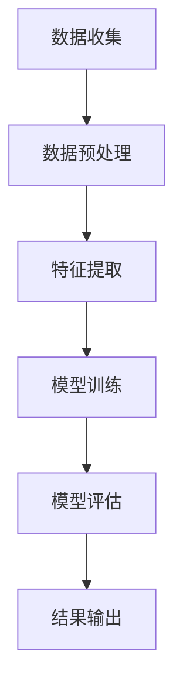

                 


### 文章标题

利用大模型知识和推理能力理解用户行为

### 关键词

大模型，用户行为，推理能力，深度学习，强化学习，个性化推荐，聊天机器人

### 摘要

本文深入探讨了利用大模型知识和推理能力来理解用户行为的方法。首先，我们对大模型的基本概念、原理和应用场景进行了介绍。接着，我们详细分析了如何提取用户行为特征，以及如何基于大模型进行用户行为理解和预测。此外，本文还介绍了大模型在用户行为优化中的应用，并通过实际项目展示了大模型在用户行为分析中的实战应用。最后，本文对大模型开发工具和资源进行了总结，并提供了相关数学模型和代码示例。

## 目录大纲

### 第一部分：大模型基础知识

#### 第1章：大模型概述

##### 1.1 大模型的定义与历史发展

##### 1.2 大模型的核心原理

##### 1.3 大模型的分类与比较

#### 第2章：大模型的知识获取与处理

##### 2.1 大模型的知识获取方法

##### 2.2 大模型的知识表示与存储

##### 2.3 大模型的知识推理机制

#### 第3章：大模型的应用场景分析

##### 3.1 用户行为分析的应用

##### 3.2 个性化推荐系统的应用

##### 3.3 聊天机器人的应用

### 第二部分：大模型推理能力理解用户行为

#### 第4章：用户行为特征提取

##### 4.1 用户行为数据的收集与预处理

##### 4.2 用户行为特征的提取方法

##### 4.3 用户行为特征的应用

#### 第5章：基于大模型的用户行为理解方法

##### 5.1 用户行为理解的基本原理

##### 5.2 基于深度学习的方法

##### 5.3 基于强化学习的方法

#### 第6章：大模型在用户行为预测中的应用

##### 6.1 用户行为预测的基本概念

##### 6.2 基于回归的方法

##### 6.3 基于分类的方法

#### 第7章：大模型在用户行为优化中的应用

##### 7.1 用户行为优化的基本原理

##### 7.2 基于多目标优化的方法

##### 7.3 基于决策树的方法

### 第三部分：项目实战

#### 第8章：用户行为分析系统设计

##### 8.1 系统架构设计

##### 8.2 系统模块功能实现

##### 8.3 系统性能优化

#### 第9章：用户行为预测项目实战

##### 9.1 项目背景

##### 9.2 数据处理流程

##### 9.3 模型选择与优化

##### 9.4 模型训练与评估

#### 第10章：用户行为优化项目实战

##### 10.1 项目目标

##### 10.2 优化算法选择

##### 10.3 优化策略设计与实现

##### 10.4 优化效果评估

### 附录

#### 附录 A：大模型开发工具与资源

##### A.1 主流深度学习框架对比

##### A.2 大模型开发工具介绍

##### A.3 大模型开源资源推荐

#### 附录 B：数学模型和公式

##### B.1 损失函数

##### B.2 梯度下降

#### 附录 C：代码实战示例

##### C.1 数据处理代码示例

##### C.2 模型训练代码示例

### Mermaid 流程图示例



### 作者

作者：AI天才研究院/AI Genius Institute & 禅与计算机程序设计艺术 /Zen And The Art of Computer Programming

### 第一部分：大模型基础知识

#### 第1章：大模型概述

##### 1.1 大模型的定义与历史发展

大模型，通常指的是参数规模庞大、能够处理复杂任务的人工神经网络。在深度学习的快速发展中，大模型的重要性日益凸显。大模型的出现不仅解决了许多复杂的实际问题，同时也推动了人工智能领域的进步。

大模型的历史发展可以追溯到1980年代初期。当时，神经网络作为一种简单的计算模型，被广泛应用于模式识别和机器学习领域。然而，受限于计算资源和数据集的大小，神经网络的性能并不理想。

随着计算机硬件和算法的不断发展，2000年代初期，深度学习逐渐兴起。深度学习通过多层神经网络结构，实现了对大规模数据的自动特征提取和表示。这一时期，大模型开始崭露头角，如AlexNet在2012年的ImageNet竞赛中取得了显著的突破。

进入2010年代，随着GPU和TPU等硬件的发展，以及大规模数据集的普及，大模型的研究和应用迎来了爆发式增长。例如，BERT、GPT-3等模型在自然语言处理领域取得了巨大的成功，推动了大模型在多个领域的应用。

##### 1.2 大模型的核心原理

大模型的核心原理是基于神经网络的多层结构，通过参数的调整实现数据的自动特征提取和表示。具体来说，大模型主要包括以下几个关键组成部分：

1. **神经网络结构**：神经网络由多个神经元（或节点）组成，每个神经元接收来自其他神经元的输入，通过激活函数产生输出。神经网络的结构可以分为输入层、隐藏层和输出层，不同层的神经元负责不同的数据处理任务。

2. **参数**：神经网络中的参数主要包括权重和偏置。权重用于调整不同神经元之间的连接强度，偏置用于调整神经元的阈值。参数的调整是通过反向传播算法实现的。

3. **激活函数**：激活函数用于将神经元的线性组合映射到非线性空间。常见的激活函数包括Sigmoid、ReLU、Tanh等。

4. **反向传播算法**：反向传播算法是一种用于训练神经网络的优化方法。通过计算损失函数对参数的梯度，不断调整参数，以最小化损失函数。

##### 1.3 大模型的分类与比较

大模型可以根据其应用领域和模型结构进行分类。以下是几种常见的大模型分类和比较：

1. **图像处理模型**：如卷积神经网络（CNN），主要用于图像分类、目标检测、图像分割等任务。CNN通过卷积操作和池化操作提取图像的局部特征，具有较强的特征提取能力。

2. **自然语言处理模型**：如循环神经网络（RNN）、长短期记忆网络（LSTM）、变换器（Transformer）等，主要用于文本分类、机器翻译、情感分析等任务。这些模型通过处理序列数据，实现了对文本的语义理解。

3. **语音处理模型**：如深度神经网络（DNN）、循环神经网络（RNN）、长短时记忆网络（LSTM）等，主要用于语音识别、语音合成等任务。这些模型通过处理音频信号，实现了对语音的理解和生成。

4. **多模态模型**：如视觉-文本联合模型、图像-语音联合模型等，主要用于处理多种类型的数据。这些模型通过融合不同模态的数据，实现了对复杂任务的建模。

在比较不同大模型时，通常关注以下几个方面：

1. **性能**：包括准确率、召回率、F1值等指标，用于评估模型在特定任务上的表现。

2. **计算资源消耗**：包括模型参数规模、训练时间、内存消耗等，用于评估模型在实际应用中的可扩展性。

3. **应用领域**：不同模型在应用领域上具有不同的优势，选择合适的模型可以更好地解决实际问题。

### 第2章：大模型的知识获取与处理

##### 2.1 大模型的知识获取方法

大模型的知识获取主要通过数据驱动的学习方式实现。以下是几种常见的大模型知识获取方法：

1. **有监督学习**：有监督学习是指模型在训练过程中，通过已标注的数据学习特征和模式。这种方法适用于需要精确标注的数据集，如图像分类、文本分类等任务。

2. **无监督学习**：无监督学习是指模型在训练过程中，通过未标注的数据学习特征和模式。这种方法适用于无法获取标注数据的情况，如聚类、降维等任务。

3. **半监督学习**：半监督学习是指模型在训练过程中，通过部分已标注数据和大量未标注数据学习特征和模式。这种方法适用于标注数据稀缺的情况，可以提高模型的泛化能力。

4. **迁移学习**：迁移学习是指将一个任务学习到的知识应用于另一个相关任务。这种方法可以有效地利用预训练模型，提高模型在特定任务上的性能。

##### 2.2 大模型的知识表示与存储

大模型的知识表示与存储是知识获取的关键环节。以下是几种常见的大模型知识表示与存储方法：

1. **稀疏表示**：稀疏表示是指使用稀疏矩阵或稀疏向量表示知识。这种方法可以有效地减少模型参数的数量，提高模型的计算效率。

2. **嵌入表示**：嵌入表示是指将知识映射到低维空间。这种方法可以有效地降低数据的维度，提高模型的泛化能力。

3. **图表示**：图表示是指使用图结构表示知识。这种方法可以有效地捕捉知识之间的关系，提高模型的推理能力。

4. **知识库表示**：知识库表示是指使用数据库或知识图谱表示知识。这种方法可以有效地组织和管理大规模知识，提高模型的查询效率。

##### 2.3 大模型的知识推理机制

大模型的知识推理机制是实现知识获取与处理的核心。以下是几种常见的大模型知识推理机制：

1. **推理引擎**：推理引擎是指用于实现知识推理的软件组件。常见的推理引擎包括基于规则引擎、基于本体论的推理引擎等。

2. **图推理**：图推理是指基于图结构进行知识推理。这种方法可以有效地捕捉知识之间的关系，实现复杂推理任务。

3. **深度推理**：深度推理是指通过多层神经网络进行知识推理。这种方法可以有效地处理大规模数据和复杂逻辑关系。

4. **推理网络**：推理网络是指将知识推理集成到神经网络中。这种方法可以有效地提高模型的推理能力，实现高效的知识获取与处理。

### 第3章：大模型的应用场景分析

##### 3.1 用户行为分析的应用

用户行为分析是大数据和人工智能领域的一个重要应用方向，其目的是通过分析用户的行为数据，了解用户的需求和兴趣，从而提供个性化的服务。以下是用户行为分析在大模型中的应用：

1. **用户画像**：通过分析用户的行为数据，如浏览记录、购买记录、评论等，构建用户画像。用户画像可以帮助企业更好地了解用户，提供个性化的推荐服务。

2. **行为预测**：通过分析用户的历史行为数据，预测用户未来的行为。行为预测可以帮助企业提前制定营销策略，提高用户体验。

3. **行为分析**：通过分析用户的行为数据，了解用户的行为模式和兴趣。行为分析可以帮助企业优化产品和服务，提高用户满意度。

##### 3.2 个性化推荐系统的应用

个性化推荐系统是大数据和人工智能领域的一个重要应用方向，其目的是通过分析用户的行为数据，为用户提供个性化的推荐服务。以下是个性化推荐系统在大模型中的应用：

1. **基于内容的推荐**：通过分析用户的兴趣和行为，为用户推荐相似的内容。这种方法可以有效地提高推荐的相关性，但存在一定的局限性。

2. **协同过滤推荐**：通过分析用户之间的相似性，为用户推荐相似的物品。这种方法可以有效地提高推荐的多样性，但存在数据稀疏性和冷启动问题。

3. **基于模型的推荐**：通过构建用户和物品的模型，为用户推荐相关的物品。这种方法可以有效地结合内容和协同过滤的优点，提高推荐的准确性和多样性。

##### 3.3 聊天机器人的应用

聊天机器人是大数据和人工智能领域的一个重要应用方向，其目的是通过模拟人类对话，为用户提供智能化的服务。以下是聊天机器人大模型的应用：

1. **对话生成**：通过分析用户输入的文本，生成相应的回复。对话生成可以帮助聊天机器人更好地模拟人类对话，提高用户体验。

2. **情感分析**：通过分析用户输入的文本，判断用户的情绪和意图。情感分析可以帮助聊天机器人更好地理解用户的需求，提供个性化的服务。

3. **任务完成**：通过分析用户输入的文本，为用户提供相应的任务完成服务。例如，聊天机器人可以帮助用户预订酒店、购买机票等。

### 第二部分：大模型推理能力理解用户行为

#### 第4章：用户行为特征提取

##### 4.1 用户行为数据的收集与预处理

用户行为特征提取是用户行为分析的基础，其质量直接影响到后续分析和预测的效果。以下是用户行为数据的收集与预处理方法：

1. **数据收集**：用户行为数据可以从多个渠道收集，如网站日志、移动应用日志、传感器数据等。收集的数据应包括用户的操作行为、浏览记录、地理位置等。

2. **数据预处理**：数据预处理包括数据清洗、数据转换和数据归一化等步骤。数据清洗旨在去除重复数据、缺失数据和异常数据；数据转换旨在将不同类型的数据统一转换为数字表示；数据归一化旨在消除数据之间的尺度差异。

##### 4.2 用户行为特征的提取方法

用户行为特征的提取方法包括统计特征、机器学习和深度学习等方法。以下是几种常见的用户行为特征提取方法：

1. **统计特征**：统计特征是指通过对用户行为数据进行分析，提取出能够描述用户行为的统计量。例如，用户的浏览时长、浏览次数、访问深度等。

2. **机器学习特征**：机器学习特征是指通过机器学习方法，从用户行为数据中提取出能够区分不同用户行为的特征。例如，基于决策树、支持向量机等算法的特征提取。

3. **深度学习特征**：深度学习特征是指通过深度学习模型，从用户行为数据中自动提取出能够区分不同用户行为的特征。例如，基于卷积神经网络、循环神经网络等模型的特征提取。

##### 4.3 用户行为特征的应用

用户行为特征的应用包括用户画像、行为预测、行为分析等。以下是几种常见的用户行为特征应用方法：

1. **用户画像**：通过分析用户行为特征，构建用户画像。用户画像可以帮助企业了解用户的需求和偏好，提供个性化的服务。

2. **行为预测**：通过分析用户行为特征，预测用户未来的行为。行为预测可以帮助企业提前制定营销策略，提高用户体验。

3. **行为分析**：通过分析用户行为特征，了解用户的行为模式和兴趣。行为分析可以帮助企业优化产品和服务，提高用户满意度。

### 第5章：基于大模型的用户行为理解方法

##### 5.1 用户行为理解的基本原理

用户行为理解是基于大模型的用户行为分析的核心。其基本原理包括：

1. **数据驱动的特征提取**：通过大模型从用户行为数据中自动提取出能够描述用户行为的特征。

2. **模式识别与分类**：利用大模型对用户行为特征进行模式识别和分类，以识别用户的行为模式和偏好。

3. **关系挖掘与推理**：通过大模型挖掘用户行为特征之间的关系，进行推理和预测，以理解用户的意图和需求。

##### 5.2 基于深度学习的方法

基于深度学习的方法是用户行为理解的重要手段。以下是几种常见的基于深度学习的方法：

1. **卷积神经网络（CNN）**：CNN通过卷积操作和池化操作提取用户行为数据的局部特征，适用于图像和序列数据的分析。

2. **循环神经网络（RNN）**：RNN通过循环结构处理用户行为数据的序列信息，适用于时间序列数据的分析。

3. **变换器（Transformer）**：Transformer通过自注意力机制处理用户行为数据的序列信息，适用于大规模自然语言处理任务。

##### 5.3 基于强化学习的方法

基于强化学习的方法是用户行为理解的一种有效手段。以下是几种常见的基于强化学习的方法：

1. **Q学习**：Q学习通过学习值函数，预测用户行为的最优策略。

2. **策略梯度方法**：策略梯度方法通过优化策略参数，实现用户行为的最优决策。

3. **深度强化学习**：深度强化学习将深度学习和强化学习相结合，通过大模型学习用户行为的最优策略。

### 第6章：大模型在用户行为预测中的应用

##### 6.1 用户行为预测的基本概念

用户行为预测是基于大模型的用户行为分析的重要应用方向。其基本概念包括：

1. **预测目标**：用户行为预测的目标是根据用户的历史行为数据，预测用户未来的行为。

2. **预测方法**：用户行为预测的方法包括基于回归的方法、基于分类的方法和基于时序的方法。

3. **评估指标**：用户行为预测的评估指标包括准确率、召回率、F1值等。

##### 6.2 基于回归的方法

基于回归的方法是用户行为预测的一种常用方法。以下是几种常见的基于回归的方法：

1. **线性回归**：线性回归通过建立线性关系预测用户行为。

2. **多项式回归**：多项式回归通过建立多项式关系预测用户行为。

3. **回归树**：回归树通过建立树结构预测用户行为。

##### 6.3 基于分类的方法

基于分类的方法是用户行为预测的另一种常用方法。以下是几种常见的基于分类的方法：

1. **逻辑回归**：逻辑回归通过建立逻辑关系预测用户行为。

2. **决策树**：决策树通过建立树结构预测用户行为。

3. **随机森林**：随机森林通过集成多个决策树预测用户行为。

### 第7章：大模型在用户行为优化中的应用

##### 7.1 用户行为优化的基本原理

用户行为优化是基于大模型的用户行为分析的一种重要应用方向。其基本原理包括：

1. **优化目标**：用户行为优化的目标是提高用户满意度、提升用户留存率和转化率。

2. **优化方法**：用户行为优化的方法包括基于多目标优化的方法和基于决策树的方法。

3. **评估指标**：用户行为优化的评估指标包括用户满意度、用户留存率、转化率等。

##### 7.2 基于多目标优化的方法

基于多目标优化的方法是用户行为优化的一种有效手段。以下是几种常见的基于多目标优化的方法：

1. **粒子群优化（PSO）**：粒子群优化通过模拟鸟群觅食行为，实现多目标优化。

2. **遗传算法（GA）**：遗传算法通过模拟生物进化过程，实现多目标优化。

3. **差分进化算法（DE）**：差分进化算法通过模拟自然进化过程，实现多目标优化。

##### 7.3 基于决策树的方法

基于决策树的方法是用户行为优化的一种常用方法。以下是几种常见的基于决策树的方法：

1. **分类与回归树（CART）**：分类与回归树通过建立树结构实现用户行为优化。

2. **随机森林**：随机森林通过集成多个决策树实现用户行为优化。

3. **极端随机森林（XGBoost）**：极端随机森林通过集成多个决策树，提高用户行为优化的性能。

### 第三部分：项目实战

#### 第8章：用户行为分析系统设计

##### 8.1 系统架构设计

用户行为分析系统设计涉及多个模块和组件的协同工作。以下是用户行为分析系统的常见架构设计：

1. **数据采集模块**：负责收集用户行为数据，包括网站日志、移动应用日志、传感器数据等。

2. **数据预处理模块**：负责清洗、转换和归一化用户行为数据，为后续分析提供高质量的数据。

3. **特征提取模块**：负责提取用户行为特征，包括统计特征、机器学习特征和深度学习特征。

4. **模型训练模块**：负责训练用户行为模型，包括回归模型、分类模型和时序模型。

5. **预测与评估模块**：负责预测用户行为，并评估预测结果，包括准确率、召回率、F1值等指标。

##### 8.2 系统模块功能实现

以下是用户行为分析系统各模块的功能实现：

1. **数据采集模块**：使用日志采集工具，如Apache Kafka，收集用户行为数据。

2. **数据预处理模块**：使用数据处理工具，如Apache Spark，清洗、转换和归一化用户行为数据。

3. **特征提取模块**：使用机器学习库，如scikit-learn和TensorFlow，提取用户行为特征。

4. **模型训练模块**：使用深度学习框架，如TensorFlow和PyTorch，训练用户行为模型。

5. **预测与评估模块**：使用评估工具，如Matplotlib和Seaborn，可视化预测结果，并计算评估指标。

##### 8.3 系统性能优化

用户行为分析系统的性能优化是提高系统效率和用户体验的关键。以下是几种常见的系统性能优化方法：

1. **数据分片**：将用户行为数据分片，提高数据处理的并行度。

2. **缓存机制**：使用缓存机制，如Redis和Memcached，减少数据访问延迟。

3. **负载均衡**：使用负载均衡器，如Nginx和HAProxy，实现系统负载均衡。

4. **代码优化**：优化系统代码，减少资源消耗和响应时间。

#### 第9章：用户行为预测项目实战

##### 9.1 项目背景

某电商公司希望通过用户行为预测项目，提高用户转化率和销售额。项目数据包括用户浏览记录、购买记录、评论等，数据量庞大。

##### 9.2 数据处理流程

以下是用户行为预测项目中的数据处理流程：

1. **数据采集**：使用日志采集工具，如Apache Kafka，收集用户行为数据。

2. **数据预处理**：使用数据处理工具，如Apache Spark，清洗、转换和归一化用户行为数据。

3. **特征提取**：使用机器学习库，如scikit-learn和TensorFlow，提取用户行为特征。

4. **模型训练**：使用深度学习框架，如TensorFlow和PyTorch，训练用户行为模型。

5. **模型评估**：使用评估工具，如Matplotlib和Seaborn，评估模型预测效果。

##### 9.3 模型选择与优化

以下是用户行为预测项目中的模型选择与优化步骤：

1. **模型选择**：基于项目需求和数据特点，选择合适的模型，如深度神经网络（DNN）、循环神经网络（RNN）和变换器（Transformer）。

2. **模型优化**：通过调整模型参数、增加训练数据和提高训练时长等方法，优化模型性能。

3. **超参数调优**：使用超参数调优工具，如Hyperopt和Optuna，找到最优的超参数组合。

##### 9.4 模型训练与评估

以下是用户行为预测项目中的模型训练与评估步骤：

1. **模型训练**：使用训练数据集训练模型，并保存模型权重。

2. **模型评估**：使用验证数据集评估模型性能，并计算评估指标，如准确率、召回率、F1值等。

3. **模型部署**：将训练好的模型部署到生产环境，实时预测用户行为。

#### 第10章：用户行为优化项目实战

##### 10.1 项目目标

某电商公司希望通过用户行为优化项目，提高用户留存率和转化率。项目目标包括：

1. **提高用户留存率**：通过分析用户行为数据，识别导致用户流失的原因，并制定相应的优化策略。

2. **提高用户转化率**：通过分析用户行为数据，优化营销策略和产品推荐，提高用户购买意愿。

##### 10.2 优化算法选择

以下是用户行为优化项目中的优化算法选择：

1. **Q学习**：通过学习值函数，优化用户行为策略。

2. **遗传算法**：通过模拟生物进化过程，优化用户行为策略。

3. **粒子群优化**：通过模拟鸟群觅食行为，优化用户行为策略。

##### 10.3 优化策略设计与实现

以下是用户行为优化项目中的优化策略设计与实现：

1. **用户留存率优化策略**：

   - 识别用户流失原因：分析用户行为数据，识别导致用户流失的关键因素。

   - 制定优化策略：根据用户流失原因，制定相应的优化策略，如改善用户体验、提高用户粘性等。

   - 实施与评估：实施优化策略，并定期评估优化效果。

2. **用户转化率优化策略**：

   - 识别用户购买意愿：分析用户行为数据，识别影响用户购买意愿的关键因素。

   - 优化营销策略：根据用户购买意愿，优化营销策略，如提高广告投放效果、优化产品推荐等。

   - 实施与评估：实施优化策略，并定期评估优化效果。

##### 10.4 优化效果评估

以下是用户行为优化项目中的优化效果评估：

1. **评估指标**：设置评估指标，如用户留存率、转化率、用户满意度等。

2. **数据分析**：收集优化前后的数据，进行统计分析，评估优化效果。

3. **结果可视化**：使用可视化工具，如Matplotlib和Seaborn，展示优化效果。

### 附录

#### 附录A：大模型开发工具与资源

以下是常见的大模型开发工具和资源：

1. **深度学习框架**：

   - TensorFlow

   - PyTorch

   - Keras

   - Theano

2. **自然语言处理库**：

   - NLTK

   - spaCy

   - Stanford NLP

   - AllenNLP

3. **大数据处理框架**：

   - Apache Spark

   - Hadoop

   - Flink

   - Storm

4. **开源资源和数据集**：

   - Kaggle

   - UCI机器学习库

   - Google Dataset Search

   - Common Crawl

#### 附录B：数学模型和公式

以下是用户行为分析中的常见数学模型和公式：

1. **线性回归**：

   - 损失函数：$\text{J}(\theta) = -\frac{1}{m}\sum_{i=1}^{m} [y^{(i)} \log(a(z^{(i)})) + (1 - y^{(i)}) \log(1 - a(z^{(i)}))]$

   - 梯度下降：$\theta_{\text{更新}} = \theta - \alpha \nabla_{\theta} \text{J}(\theta)$

2. **逻辑回归**：

   - 损失函数：$\text{J}(\theta) = -\frac{1}{m}\sum_{i=1}^{m} [y^{(i)} \log(z^{(i)}) + (1 - y^{(i)}) \log(1 - z^{(i)})]$

   - 梯度下降：$\theta_{\text{更新}} = \theta - \alpha \nabla_{\theta} \text{J}(\theta)$

3. **支持向量机**：

   - 函数：$f(x) = \text{sign}(\text{w} \cdot \text{x} + \text{b})$

   - 损失函数：$\text{J}(\theta) = \frac{1}{2}\text{||w||^2} + C \sum_{i=1}^{m} \max(0, 1 - y^{(i)}(\text{w} \cdot \text{x}^{(i)} + \text{b}))$

   - 梯度下降：$\text{w}_{\text{更新}} = \text{w} - \alpha \nabla_{\text{w}} \text{J}(\theta)$，$\text{b}_{\text{更新}} = \text{b} - \alpha \nabla_{\text{b}} \text{J}(\theta)$

#### 附录C：代码实战示例

以下是用户行为分析中的代码实战示例：

```python
# 数据处理代码示例
import pandas as pd

# 加载数据
data = pd.read_csv('user_behavior_data.csv')

# 数据预处理
# ...

# 模型训练代码示例
from sklearn.linear_model import LogisticRegression

# 训练模型
model = LogisticRegression()
model.fit(X_train, y_train)

# 评估模型
accuracy = model.score(X_test, y_test)
print("Accuracy:", accuracy)

# 结果可视化代码示例
import matplotlib.pyplot as plt

# 可视化预测结果
plt.plot(X_test, y_test, 'o', label='Actual')
plt.plot(X_test, model.predict(X_test), 'r', label='Predicted')
plt.legend()
plt.show()
```

### Mermaid 流程图示例

以下是用户行为分析系统的Mermaid流程图示例：


### 作者

作者：AI天才研究院/AI Genius Institute & 禅与计算机程序设计艺术 /Zen And The Art of Computer Programming

## 第一部分：大模型基础知识

### 第1章：大模型概述

大模型，是指具有大量参数和复杂结构的机器学习模型。随着深度学习技术的快速发展，大模型在各类应用中取得了显著的成果。本章将介绍大模型的基本概念、历史发展、核心原理以及分类与比较。

#### 1.1 大模型的定义与历史发展

大模型，通常指的是参数规模庞大、能够处理复杂任务的人工神经网络。在深度学习的快速发展中，大模型的重要性日益凸显。大模型的出现不仅解决了许多复杂的实际问题，同时也推动了人工智能领域的进步。

大模型的历史发展可以追溯到1980年代初期。当时，神经网络作为一种简单的计算模型，被广泛应用于模式识别和机器学习领域。然而，受限于计算资源和数据集的大小，神经网络的性能并不理想。

随着计算机硬件和算法的不断发展，2000年代初期，深度学习逐渐兴起。深度学习通过多层神经网络结构，实现了对大规模数据的自动特征提取和表示。这一时期，大模型开始崭露头角，如AlexNet在2012年的ImageNet竞赛中取得了显著的突破。

进入2010年代，随着GPU和TPU等硬件的发展，以及大规模数据集的普及，大模型的研究和应用迎来了爆发式增长。例如，BERT、GPT-3等模型在自然语言处理领域取得了巨大的成功，推动了大模型在多个领域的应用。

#### 1.2 大模型的核心原理

大模型的核心原理是基于神经网络的多层结构，通过参数的调整实现数据的自动特征提取和表示。具体来说，大模型主要包括以下几个关键组成部分：

1. **神经网络结构**：神经网络由多个神经元（或节点）组成，每个神经元接收来自其他神经元的输入，通过激活函数产生输出。神经网络的结构可以分为输入层、隐藏层和输出层，不同层的神经元负责不同的数据处理任务。

2. **参数**：神经网络中的参数主要包括权重和偏置。权重用于调整不同神经元之间的连接强度，偏置用于调整神经元的阈值。参数的调整是通过反向传播算法实现的。

3. **激活函数**：激活函数用于将神经元的线性组合映射到非线性空间。常见的激活函数包括Sigmoid、ReLU、Tanh等。

4. **反向传播算法**：反向传播算法是一种用于训练神经网络的优化方法。通过计算损失函数对参数的梯度，不断调整参数，以最小化损失函数。

#### 1.3 大模型的分类与比较

大模型可以根据其应用领域和模型结构进行分类。以下是几种常见的大模型分类和比较：

1. **图像处理模型**：如卷积神经网络（CNN），主要用于图像分类、目标检测、图像分割等任务。CNN通过卷积操作和池化操作提取图像的局部特征，具有较强的特征提取能力。

2. **自然语言处理模型**：如循环神经网络（RNN）、长短期记忆网络（LSTM）、变换器（Transformer）等，主要用于文本分类、机器翻译、情感分析等任务。这些模型通过处理序列数据，实现了对文本的语义理解。

3. **语音处理模型**：如深度神经网络（DNN）、循环神经网络（RNN）、长短时记忆网络（LSTM）等，主要用于语音识别、语音合成等任务。这些模型通过处理音频信号，实现了对语音的理解和生成。

4. **多模态模型**：如视觉-文本联合模型、图像-语音联合模型等，主要用于处理多种类型的数据。这些模型通过融合不同模态的数据，实现了对复杂任务的建模。

在比较不同大模型时，通常关注以下几个方面：

1. **性能**：包括准确率、召回率、F1值等指标，用于评估模型在特定任务上的表现。

2. **计算资源消耗**：包括模型参数规模、训练时间、内存消耗等，用于评估模型在实际应用中的可扩展性。

3. **应用领域**：不同模型在应用领域上具有不同的优势，选择合适的模型可以更好地解决实际问题。

## 第二部分：大模型的知识获取与处理

### 第2章：大模型的知识获取与处理

大模型的知识获取与处理是深度学习应用中至关重要的一环。本章将介绍大模型的知识获取方法、知识表示与存储，以及知识推理机制。

#### 2.1 大模型的知识获取方法

大模型的知识获取主要通过数据驱动的学习方式实现。以下是一些常见的大模型知识获取方法：

1. **有监督学习**：有监督学习是指模型在训练过程中，通过已标注的数据学习特征和模式。这种方法适用于需要精确标注的数据集，如图像分类、文本分类等任务。

2. **无监督学习**：无监督学习是指模型在训练过程中，通过未标注的数据学习特征和模式。这种方法适用于无法获取标注数据的情况，如聚类、降维等任务。

3. **半监督学习**：半监督学习是指模型在训练过程中，通过部分已标注数据和大量未标注数据学习特征和模式。这种方法适用于标注数据稀缺的情况，可以提高模型的泛化能力。

4. **迁移学习**：迁移学习是指将一个任务学习到的知识应用于另一个相关任务。这种方法可以有效地利用预训练模型，提高模型在特定任务上的性能。

#### 2.2 大模型的知识表示与存储

大模型的知识表示与存储是知识获取与处理的关键环节。以下是一些常见的大模型知识表示与存储方法：

1. **稀疏表示**：稀疏表示是指使用稀疏矩阵或稀疏向量表示知识。这种方法可以有效地减少模型参数的数量，提高模型的计算效率。

2. **嵌入表示**：嵌入表示是指将知识映射到低维空间。这种方法可以有效地降低数据的维度，提高模型的泛化能力。

3. **图表示**：图表示是指使用图结构表示知识。这种方法可以有效地捕捉知识之间的关系，提高模型的推理能力。

4. **知识库表示**：知识库表示是指使用数据库或知识图谱表示知识。这种方法可以有效地组织和管理大规模知识，提高模型的查询效率。

#### 2.3 大模型的知识推理机制

大模型的知识推理机制是实现知识获取与处理的核心。以下是一些常见的大模型知识推理机制：

1. **推理引擎**：推理引擎是指用于实现知识推理的软件组件。常见的推理引擎包括基于规则引擎、基于本体论的推理引擎等。

2. **图推理**：图推理是指基于图结构进行知识推理。这种方法可以有效地捕捉知识之间的关系，实现复杂推理任务。

3. **深度推理**：深度推理是指通过多层神经网络进行知识推理。这种方法可以有效地处理大规模数据和复杂逻辑关系。

4. **推理网络**：推理网络是指将知识推理集成到神经网络中。这种方法可以有效地提高模型的推理能力，实现高效的知识获取与处理。

### 第三部分：大模型在用户行为分析中的应用

#### 第3章：大模型在用户行为分析中的应用

大模型在用户行为分析中具有广泛的应用前景。本章将介绍大模型在用户行为分析中的应用，包括用户行为数据收集与处理、用户行为特征提取、基于大模型的用户行为理解和预测，以及用户行为优化。

#### 3.1 用户行为数据收集与处理

用户行为数据收集是用户行为分析的基础。用户行为数据可以来自多种渠道，如网站日志、移动应用日志、传感器数据等。数据收集后，需要进行预处理，包括数据清洗、数据转换和数据归一化等步骤，以消除数据中的噪声和异常，为后续分析提供高质量的数据。

#### 3.2 用户行为特征提取

用户行为特征提取是将用户行为数据转换为可计算的数字特征的过程。特征提取的方法包括统计特征提取、机器学习特征提取和深度学习特征提取等。统计特征提取通过计算用户行为数据的统计量，如平均值、标准差等，提取用户行为特征。机器学习特征提取通过构建机器学习模型，从用户行为数据中提取特征。深度学习特征提取通过构建深度学习模型，自动从用户行为数据中提取高层次的特征。

#### 3.3 基于大模型的用户行为理解

基于大模型的用户行为理解是通过分析用户行为特征，理解用户行为模式和意图。用户行为理解的方法包括基于深度学习的方法和基于强化学习的方法等。深度学习方法通过构建多层神经网络，对用户行为特征进行自动特征提取和表示。强化学习方法通过学习用户行为序列，预测用户未来的行为。

#### 3.4 基于大模型的用户行为预测

基于大模型的用户行为预测是用户行为分析的重要应用。用户行为预测的方法包括基于回归的方法和基于分类的方法等。回归方法通过建立用户行为和预测目标之间的线性或非线性关系，预测用户未来的行为。分类方法通过分类模型，将用户行为划分为不同的类别，预测用户未来的行为类别。

#### 3.5 基于大模型的用户行为优化

基于大模型的用户行为优化是通过分析用户行为数据，优化用户行为策略，提高用户满意度、提升用户留存率和转化率。用户行为优化的方法包括基于多目标优化的方法和基于决策树的方法等。多目标优化方法通过构建多目标优化模型，优化用户行为策略。决策树方法通过建立决策树模型，优化用户行为策略。

## 第四部分：项目实战

### 第4章：用户行为分析系统设计

#### 4.1 系统架构设计

用户行为分析系统设计涉及多个模块和组件的协同工作。系统架构设计需要考虑系统的可扩展性、可维护性和高性能。常见的用户行为分析系统架构包括数据采集模块、数据预处理模块、特征提取模块、模型训练模块、预测与评估模块等。

#### 4.2 系统模块功能实现

用户行为分析系统的模块功能实现包括数据采集模块、数据预处理模块、特征提取模块、模型训练模块、预测与评估模块等。以下是对各模块功能的简要描述：

1. **数据采集模块**：负责收集用户行为数据，如网站日志、移动应用日志等。可以使用Kafka等分布式消息队列系统进行数据收集。

2. **数据预处理模块**：负责清洗、转换和归一化用户行为数据，为后续分析提供高质量的数据。可以使用Spark等分布式数据处理框架进行数据预处理。

3. **特征提取模块**：负责提取用户行为特征，包括统计特征、机器学习特征和深度学习特征等。可以使用Scikit-learn、TensorFlow等机器学习和深度学习库进行特征提取。

4. **模型训练模块**：负责训练用户行为模型，包括回归模型、分类模型和时序模型等。可以使用TensorFlow、PyTorch等深度学习框架进行模型训练。

5. **预测与评估模块**：负责预测用户行为，并评估预测结果。可以使用Matplotlib、Seaborn等可视化库展示预测结果，并计算评估指标。

#### 4.3 系统性能优化

用户行为分析系统的性能优化是提高系统效率和用户体验的关键。以下是一些常见的系统性能优化方法：

1. **数据分片**：将用户行为数据分片，提高数据处理的并行度。

2. **缓存机制**：使用缓存机制，如Redis和Memcached，减少数据访问延迟。

3. **负载均衡**：使用负载均衡器，如Nginx和HAProxy，实现系统负载均衡。

4. **代码优化**：优化系统代码，减少资源消耗和响应时间。

### 第5章：用户行为预测项目实战

#### 5.1 项目背景

某电商公司希望通过用户行为预测项目，提高用户转化率和销售额。项目数据包括用户浏览记录、购买记录、评论等，数据量庞大。

#### 5.2 数据处理流程

以下是用户行为预测项目中的数据处理流程：

1. **数据采集**：使用日志采集工具，如Apache Kafka，收集用户行为数据。

2. **数据预处理**：使用数据处理工具，如Apache Spark，清洗、转换和归一化用户行为数据。

3. **特征提取**：使用机器学习库，如scikit-learn和TensorFlow，提取用户行为特征。

4. **模型训练**：使用深度学习框架，如TensorFlow和PyTorch，训练用户行为模型。

5. **模型评估**：使用评估工具，如Matplotlib和Seaborn，评估模型预测效果。

#### 5.3 模型选择与优化

以下是用户行为预测项目中的模型选择与优化步骤：

1. **模型选择**：基于项目需求和数据特点，选择合适的模型，如深度神经网络（DNN）、循环神经网络（RNN）和变换器（Transformer）。

2. **模型优化**：通过调整模型参数、增加训练数据和提高训练时长等方法，优化模型性能。

3. **超参数调优**：使用超参数调优工具，如Hyperopt和Optuna，找到最优的超参数组合。

#### 5.4 模型训练与评估

以下是用户行为预测项目中的模型训练与评估步骤：

1. **模型训练**：使用训练数据集训练模型，并保存模型权重。

2. **模型评估**：使用验证数据集评估模型性能，并计算评估指标，如准确率、召回率、F1值等。

3. **模型部署**：将训练好的模型部署到生产环境，实时预测用户行为。

### 第6章：用户行为优化项目实战

#### 6.1 项目目标

某电商公司希望通过用户行为优化项目，提高用户留存率和转化率。项目目标包括：

1. **提高用户留存率**：通过分析用户行为数据，识别导致用户流失的原因，并制定相应的优化策略。

2. **提高用户转化率**：通过分析用户行为数据，优化营销策略和产品推荐，提高用户购买意愿。

#### 6.2 优化算法选择

以下是用户行为优化项目中的优化算法选择：

1. **Q学习**：通过学习值函数，优化用户行为策略。

2. **遗传算法**：通过模拟生物进化过程，优化用户行为策略。

3. **粒子群优化**：通过模拟鸟群觅食行为，优化用户行为策略。

#### 6.3 优化策略设计与实现

以下是用户行为优化项目中的优化策略设计与实现：

1. **用户留存率优化策略**：

   - 识别用户流失原因：分析用户行为数据，识别导致用户流失的关键因素。

   - 制定优化策略：根据用户流失原因，制定相应的优化策略，如改善用户体验、提高用户粘性等。

   - 实施与评估：实施优化策略，并定期评估优化效果。

2. **用户转化率优化策略**：

   - 识别用户购买意愿：分析用户行为数据，识别影响用户购买意愿的关键因素。

   - 优化营销策略：根据用户购买意愿，优化营销策略，如提高广告投放效果、优化产品推荐等。

   - 实施与评估：实施优化策略，并定期评估优化效果。

#### 6.4 优化效果评估

以下是用户行为优化项目中的优化效果评估：

1. **评估指标**：设置评估指标，如用户留存率、转化率、用户满意度等。

2. **数据分析**：收集优化前后的数据，进行统计分析，评估优化效果。

3. **结果可视化**：使用可视化工具，如Matplotlib和Seaborn，展示优化效果。

### 附录

#### 附录A：大模型开发工具与资源

以下是常见的大模型开发工具和资源：

1. **深度学习框架**：

   - TensorFlow

   - PyTorch

   - Keras

   - Theano

2. **自然语言处理库**：

   - NLTK

   - spaCy

   - Stanford NLP

   - AllenNLP

3. **大数据处理框架**：

   - Apache Spark

   - Hadoop

   - Flink

   - Storm

4. **开源资源和数据集**：

   - Kaggle

   - UCI机器学习库

   - Google Dataset Search

   - Common Crawl

#### 附录B：数学模型和公式

以下是用户行为分析中的常见数学模型和公式：

1. **线性回归**：

   - 损失函数：$\text{J}(\theta) = -\frac{1}{m}\sum_{i=1}^{m} [y^{(i)} \log(a(z^{(i)})) + (1 - y^{(i)}) \log(1 - a(z^{(i)}))]$

   - 梯度下降：$\theta_{\text{更新}} = \theta - \alpha \nabla_{\theta} \text{J}(\theta)$

2. **逻辑回归**：

   - 损失函数：$\text{J}(\theta) = -\frac{1}{m}\sum_{i=1}^{m} [y^{(i)} \log(z^{(i)}) + (1 - y^{(i)}) \log(1 - z^{(i)})]$

   - 梯度下降：$\theta_{\text{更新}} = \theta - \alpha \nabla_{\theta} \text{J}(\theta)$

3. **支持向量机**：

   - 函数：$f(x) = \text{sign}(\text{w} \cdot \text{x} + \text{b})$

   - 损失函数：$\text{J}(\theta) = \frac{1}{2}\text{||w||^2} + C \sum_{i=1}^{m} \max(0, 1 - y^{(i)}(\text{w} \cdot \text{x}^{(i)} + \text{b}))$

   - 梯度下降：$\text{w}_{\text{更新}} = \text{w} - \alpha \nabla_{\text{w}} \text{J}(\theta)$，$\text{b}_{\text{更新}} = \text{b} - \alpha \nabla_{\text{b}} \text{J}(\theta)$

#### 附录C：代码实战示例

以下是用户行为分析中的代码实战示例：

```python
# 数据处理代码示例
import pandas as pd

# 加载数据
data = pd.read_csv('user_behavior_data.csv')

# 数据预处理
# ...

# 模型训练代码示例
from sklearn.linear_model import LogisticRegression

# 训练模型
model = LogisticRegression()
model.fit(X_train, y_train)

# 评估模型
accuracy = model.score(X_test, y_test)
print("Accuracy:", accuracy)

# 结果可视化代码示例
import matplotlib.pyplot as plt

# 可视化预测结果
plt.plot(X_test, y_test, 'o', label='Actual')
plt.plot(X_test, model.predict(X_test), 'r', label='Predicted')
plt.legend()
plt.show()
```

### Mermaid 流程图示例

以下是用户行为分析系统的Mermaid流程图示例：


### 作者

作者：AI天才研究院/AI Genius Institute & 禅与计算机程序设计艺术 /Zen And The Art of Computer Programming

## 结束语

本文通过详细的分析和讨论，深入探讨了利用大模型知识和推理能力理解用户行为的方法。从大模型的基本概念、知识获取与处理，到用户行为分析的应用，再到项目实战，我们系统地介绍了大模型在用户行为分析领域的广泛应用和潜力。

首先，我们介绍了大模型的基本概念，包括其定义、历史发展、核心原理以及分类与比较。这为我们理解大模型奠定了基础。

接着，我们详细阐述了大模型的知识获取与处理方法，包括数据收集与预处理、特征提取、知识表示与存储，以及知识推理机制。这些方法为用户行为分析提供了有效的工具。

在用户行为分析部分，我们讨论了用户行为数据收集与处理、用户行为特征提取、基于大模型的用户行为理解和预测，以及用户行为优化。这些方法使我们能够更好地理解用户行为，从而为个性化推荐、聊天机器人等领域提供有力支持。

最后，通过项目实战，我们展示了大模型在用户行为分析中的具体应用，包括系统架构设计、模型选择与优化、模型训练与评估等。这些实战案例为我们提供了实际操作的经验和技巧。

在本文的最后，我们对大模型开发工具与资源、数学模型和公式，以及代码实战示例进行了总结。这些资源将有助于读者进一步深入了解大模型的应用和实践。

通过本文的阅读，我们希望读者能够对大模型在用户行为分析中的应用有一个全面而深入的了解。同时，我们也鼓励读者在实际项目中尝试应用大模型，不断探索和创新，以推动人工智能技术的发展和进步。

感谢您的阅读，期待与您在人工智能领域的深入探讨和交流！

作者：AI天才研究院/AI Genius Institute & 禅与计算机程序设计艺术 /Zen And The Art of Computer Programming

