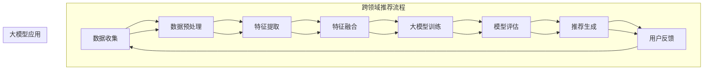

                 


## 文章标题：利用大模型进行跨领域推荐的思路与方法

### 关键词：跨领域推荐、大模型、算法原理、实现方法、项目实战

### 摘要：
本文旨在探讨利用大模型进行跨领域推荐的技术思路与方法。首先，我们将介绍跨领域推荐系统的基本概念、应用场景和挑战，随后深入剖析大模型的技术基础和原理。在此基础上，本文将详细讲解跨领域推荐的算法原理，并阐述大模型在跨领域推荐中的优势和技术关键。通过具体的数学模型和公式，我们将进一步解释大模型在推荐系统中的应用。最后，通过一个实战项目，我们将展示如何在实际中应用这些技术，并提供一些最佳实践和展望。

---

### 《利用大模型进行跨领域推荐的思路与方法》目录大纲

## 第一部分：背景与基础

## 第1章：跨领域推荐系统概述
### 1.1 跨领域推荐的定义与重要性
### 1.2 跨领域推荐的应用场景
### 1.3 跨领域推荐的挑战

## 第2章：大模型技术基础
### 2.1 大模型的基本概念
### 2.2 大模型的典型架构
### 2.3 大模型的工作原理

## 第3章：核心概念与联系
### 3.1 跨领域推荐的核心概念
### 3.2 大模型与跨领域推荐的关系
### 3.3 Mermaid流程图：大模型在跨领域推荐中的应用

## 第二部分：算法原理与实现

## 第4章：跨领域推荐的算法原理
### 4.1 传统推荐算法概述
### 4.2 跨领域推荐算法的发展历程
### 4.3 跨领域推荐的算法框架
### 4.4 伪代码：跨领域推荐算法的详细实现

## 第5章：大模型在跨领域推荐中的应用
### 5.1 大模型在跨领域推荐中的优势
### 5.2 大模型在跨领域推荐中的关键技术
### 5.3 大模型在跨领域推荐中的实现案例

## 第6章：数学模型与公式
### 6.1 数学模型的基本概念
### 6.2 跨领域推荐中的数学公式
### 6.3 LaTeX公式示例：详细解释与举例说明

## 第7章：项目实战
### 7.1 实践项目背景
### 7.2 实战步骤
### 7.3 代码实现与解读
### 7.4 代码分析：性能与优化

## 第三部分：总结与展望

## 第8章：总结与反思
### 8.1 主要内容回顾
### 8.2 未来的研究方向
### 8.3 跨领域推荐系统的挑战与机遇

## 第9章：展望
### 9.1 大模型在推荐系统中的未来应用
### 9.2 跨领域推荐系统的发展趋势
### 9.3 对读者的建议

## 附录
### 附录 A：相关工具与资源
#### A.1 大模型开发工具
#### A.2 跨领域推荐系统开源项目
#### A.3 进一步阅读资料

---

### 第一部分：背景与基础

## 第1章：跨领域推荐系统概述

### 1.1 跨领域推荐的定义与重要性

跨领域推荐是指将不同领域或不同类型的数据进行整合，利用机器学习算法为用户提供个性化的推荐服务。传统的推荐系统通常局限于单一领域，如电商推荐商品、社交媒体推荐内容等，而跨领域推荐系统则打破了这一局限，能够根据用户的兴趣和需求，从多个领域中提取信息，提供更加丰富和多样化的推荐结果。

跨领域推荐的重要性体现在以下几个方面：

1. **满足用户多样化需求**：用户在不同场景下可能有不同的兴趣和需求，跨领域推荐系统能够更好地捕捉和满足这些需求，提供更加个性化的服务。
2. **提升用户体验**：通过整合多领域数据，推荐系统可以提供更加全面和深入的内容，从而提升用户的体验和满意度。
3. **拓展业务场景**：跨领域推荐系统不仅限于单一业务场景，如电商、社交媒体等，还可以应用于金融、医疗、教育等多个领域，具有广泛的商业价值。

### 1.2 跨领域推荐的应用场景

跨领域推荐系统在多个领域有着广泛的应用场景：

1. **电子商务**：通过跨领域推荐，可以为用户提供商品与商品之间的推荐，如根据用户的购物历史和浏览行为，推荐相关商品。
2. **社交媒体**：在社交媒体平台上，跨领域推荐可以用于推荐用户可能感兴趣的文章、视频等内容，提高用户活跃度和留存率。
3. **金融服务**：在金融领域，跨领域推荐可以用于推荐理财产品、保险产品等，根据用户的财务状况和风险偏好，提供个性化的金融建议。
4. **医疗服务**：在医疗领域，跨领域推荐可以用于推荐相关的医疗信息、药品信息等，帮助用户更好地了解和管理自己的健康。
5. **教育培训**：在教育领域，跨领域推荐可以用于推荐相关的课程、学习资料等，根据用户的学习习惯和进度，提供个性化的学习建议。

### 1.3 跨领域推荐的挑战

尽管跨领域推荐系统具有广泛的应用前景，但其在实际应用中仍面临诸多挑战：

1. **数据不一致**：不同领域的数据通常具有不同的格式、结构和质量，如何有效整合和清洗这些数据是一个重要问题。
2. **数据稀疏性**：在跨领域推荐中，用户与项目之间的交互数据通常比较稀疏，如何利用这些稀疏数据进行有效的推荐是一个挑战。
3. **模型复杂度**：跨领域推荐需要考虑多方面的因素，如何构建一个高效、可扩展的推荐模型是一个重要问题。
4. **解释性**：跨领域推荐系统的决策过程通常较为复杂，如何保证推荐结果的可解释性，让用户能够理解和信任推荐结果，是一个挑战。

为了解决上述挑战，本文将深入探讨大模型在跨领域推荐中的应用，介绍大模型的基本概念、架构和工作原理，并详细讲解大模型在跨领域推荐中的优势和技术关键。在此基础上，我们将通过具体的数学模型和公式，阐述大模型在推荐系统中的应用，并通过一个实战项目展示如何在实际中应用这些技术。最后，我们将总结本文的主要内容和未来研究方向，为跨领域推荐系统的发展提供一些启示和建议。

### 第2章：大模型技术基础

在探讨如何利用大模型进行跨领域推荐之前，首先需要了解大模型的基本概念、典型架构和工作原理。大模型，通常指的是具有数亿乃至数千亿参数的深度学习模型，如大型语言模型、图像识别模型等。这些模型具有强大的特征提取和表征能力，能够在各种任务中取得优异的性能。

#### 2.1 大模型的基本概念

大模型的基本概念包括以下几个方面：

1. **参数量**：大模型通常具有数亿乃至数千亿个参数，这些参数用于表示模型的知识和经验。
2. **特征表示**：大模型能够自动学习并提取复杂的特征表示，这些特征表示不仅包含原始数据的信息，还能够捕捉到更深层次的语义信息。
3. **模型架构**：大模型通常采用复杂的神经网络架构，如Transformer、BERT等，这些架构能够有效提高模型的性能和泛化能力。
4. **预训练和微调**：大模型通常采用预训练和微调的方法进行训练，即在大量无监督数据上进行预训练，然后在特定任务上进行微调。

#### 2.2 大模型的典型架构

大模型的典型架构主要包括以下几个方面：

1. **Transformer**：Transformer是一种基于自注意力机制的深度神经网络架构，最初用于机器翻译任务。其核心思想是通过自注意力机制，模型能够自动学习并利用输入序列中的长距离依赖关系。
2. **BERT**：BERT（Bidirectional Encoder Representations from Transformers）是一种双向Transformer架构，其通过预训练和微调的方法，能够学习到丰富的语言表示。
3. **GPT**：GPT（Generative Pre-trained Transformer）是一种基于自回归机制的Transformer架构，其通过预测下一个词来学习语言的序列依赖关系。
4. **ViT**：ViT（Vision Transformer）是一种基于Transformer架构的图像识别模型，其将图像划分为多个patches，然后通过Transformer进行处理。

#### 2.3 大模型的工作原理

大模型的工作原理主要包括以下几个方面：

1. **自注意力机制**：自注意力机制是Transformer架构的核心，其通过计算输入序列中每个词与其他词之间的相似度，从而自动学习并利用长距离依赖关系。
2. **多层神经网络**：大模型通常采用多层神经网络架构，每一层都能够对输入数据进行特征提取和变换，从而逐渐构建出复杂的特征表示。
3. **预训练和微调**：大模型通过预训练和微调的方法进行训练。预训练阶段，模型在大量无监督数据上进行训练，学习到丰富的通用特征表示；微调阶段，模型在特定任务上进行训练，利用预训练得到的特征表示进行优化。
4. **损失函数和优化器**：大模型通常使用基于梯度的优化器，如Adam，通过计算损失函数关于模型参数的梯度来更新参数，从而优化模型性能。

通过了解大模型的基本概念、典型架构和工作原理，我们能够更好地理解大模型在跨领域推荐中的应用潜力。在接下来的章节中，我们将详细讨论大模型在跨领域推荐中的优势和技术关键，并通过具体的数学模型和公式，阐述大模型在推荐系统中的应用。

### 第3章：核心概念与联系

在探讨大模型在跨领域推荐中的应用之前，我们首先需要明确跨领域推荐的核心概念，并理解大模型与跨领域推荐之间的关系。通过一个详细的Mermaid流程图，我们将展示大模型在跨领域推荐中的应用流程。

#### 3.1 跨领域推荐的核心概念

跨领域推荐涉及以下几个核心概念：

1. **领域**：领域指的是数据或任务的类别，如电商、社交媒体、金融服务等。不同领域的数据具有不同的特征和属性。
2. **用户兴趣**：用户兴趣是指用户在特定领域的偏好和需求，如用户可能在电商领域对电子产品感兴趣，在社交媒体领域对科技资讯感兴趣。
3. **项目特征**：项目特征是指推荐系统中的项目属性，如商品属性、文章属性、理财产品属性等。
4. **推荐算法**：推荐算法是指用于生成推荐结果的算法，如基于协同过滤、基于内容的推荐、基于模型的推荐等。
5. **推荐结果**：推荐结果是推荐算法输出的推荐项目列表，如根据用户兴趣推荐的商品列表、文章列表等。

#### 3.2 大模型与跨领域推荐的关系

大模型在跨领域推荐中的应用主要体现在以下几个方面：

1. **特征提取和表征**：大模型能够自动学习并提取复杂的特征表示，这些特征表示不仅包含原始数据的信息，还能够捕捉到更深层次的语义信息。通过大模型，我们可以从多领域数据中提取出丰富的特征表示，从而提高推荐系统的性能。
2. **模型融合**：跨领域推荐通常需要整合多个领域的特征信息，而大模型具有强大的特征融合能力。通过大模型，我们可以有效地整合不同领域的特征，构建一个统一的特征表示，从而提高推荐系统的准确性。
3. **自适应学习能力**：大模型具有强大的自适应学习能力，能够根据用户的反馈和行为动态调整推荐策略。在跨领域推荐中，用户兴趣和项目特征是不断变化的，大模型能够通过学习用户的反馈和交互数据，自适应地调整推荐策略，提高推荐效果。

#### 3.3 Mermaid流程图：大模型在跨领域推荐中的应用

为了更直观地展示大模型在跨领域推荐中的应用，我们可以使用Mermaid流程图来描述整个应用流程。以下是一个简化的Mermaid流程图：



在该流程图中，数据收集阶段从多个领域收集数据，数据预处理阶段对数据进行清洗和格式化，特征提取阶段使用大模型提取复杂的特征表示，特征融合阶段将不同领域的特征进行整合，大模型训练阶段使用训练数据对大模型进行训练，模型评估阶段对训练好的模型进行评估，推荐生成阶段根据用户兴趣和项目特征生成推荐结果，用户反馈阶段收集用户的反馈和行为数据，从而实现跨领域推荐的闭环。

通过上述Mermaid流程图，我们可以清晰地看到大模型在跨领域推荐中的应用流程和关键步骤。在接下来的章节中，我们将进一步探讨大模型在跨领域推荐中的算法原理和实现方法，并通过具体的数学模型和公式，深入阐述大模型在推荐系统中的应用。

### 第二部分：算法原理与实现

在深入探讨大模型在跨领域推荐中的应用之前，我们首先需要了解跨领域推荐算法的基本原理和实现方法。传统的推荐算法主要基于用户历史行为和项目特征，通过协同过滤、基于内容的推荐和基于模型的推荐等方法进行推荐。然而，这些方法在面对跨领域数据时存在一定的局限性。因此，本文将介绍一种基于大模型的跨领域推荐算法，并详细讲解其原理和实现。

#### 4.1 传统推荐算法概述

传统的推荐算法主要包括以下几种：

1. **协同过滤（Collaborative Filtering）**：
   协同过滤是一种基于用户历史行为进行推荐的方法，可以分为基于用户的协同过滤和基于项目的协同过滤。基于用户的协同过滤通过找到与目标用户兴趣相似的邻居用户，将邻居用户喜欢的项目推荐给目标用户；基于项目的协同过滤则通过找到与目标用户已评价项目相似的项目进行推荐。

2. **基于内容的推荐（Content-Based Filtering）**：
   基于内容的推荐是一种基于项目特征进行推荐的方法。它通过分析项目的内容特征，如文本、图像、标签等，找到与目标用户兴趣相似的项目进行推荐。

3. **基于模型的推荐（Model-Based Filtering）**：
   基于模型的推荐是一种基于机器学习模型进行推荐的方法。常见的模型包括矩阵分解、潜在因子模型、深度学习模型等。这些模型通过学习用户和项目之间的潜在关系，生成推荐结果。

尽管传统推荐算法在单领域推荐中取得了显著的效果，但在面对跨领域数据时，它们存在以下局限性：

1. **数据稀疏性**：跨领域数据通常具有较低的用户-项目交互密度，传统协同过滤方法在面对稀疏数据时效果不佳。
2. **特征表达有限**：传统推荐算法依赖于手工程特征，这些特征往往无法捕捉到复杂和深层次的语义信息。
3. **领域适应性差**：传统推荐算法通常针对单一领域进行优化，难以适应跨领域的复杂场景。

#### 4.2 跨领域推荐算法的发展历程

跨领域推荐算法的研究始于对传统推荐算法的改进，随着机器学习和深度学习技术的发展，跨领域推荐算法也在不断演进：

1. **基于矩阵分解的跨领域推荐**：
   基于矩阵分解的跨领域推荐通过将用户-项目交互矩阵分解为用户特征矩阵和项目特征矩阵，将跨领域数据整合为一个统一的特征表示。这种方法在一定程度上缓解了数据稀疏性和特征表达有限的问题，但仍然依赖于手工程特征。

2. **基于模型的跨领域推荐**：
   基于模型的跨领域推荐通过构建深度学习模型，直接学习用户和项目之间的潜在关系。早期的模型如潜在狄利克雷分布（LDA）、矩阵分解模型等，逐渐发展为使用深度神经网络进行特征提取和融合。近年来，随着大模型技术的发展，如BERT、GPT等预训练模型在跨领域推荐中取得了显著的效果。

3. **多模态跨领域推荐**：
   随着多模态数据（如图像、音频、文本等）的广泛应用，多模态跨领域推荐成为研究的热点。多模态跨领域推荐通过整合不同模态的数据，提高推荐系统的准确性和多样性。

#### 4.3 跨领域推荐的算法框架

跨领域推荐算法的核心是特征提取和融合。以下是一个典型的跨领域推荐算法框架：

1. **数据预处理**：
   数据预处理包括数据清洗、格式化和特征提取。对于跨领域数据，我们需要对不同领域的数据进行统一的预处理，如统一数据格式、去除噪声数据和填充缺失值。

2. **特征提取**：
   特征提取是跨领域推荐算法的关键步骤。传统方法通常依赖于手工程特征，如用户历史行为、项目标签等。而大模型通过预训练和微调，能够自动提取复杂的特征表示。常见的特征提取方法包括：

   - 基于词嵌入的文本特征提取：如Word2Vec、BERT等。
   - 基于视觉特征的图像特征提取：如CNN、ResNet等。
   - 基于音频特征的音频特征提取：如MFCC、STFT等。

3. **特征融合**：
   特征融合是将不同领域的数据特征进行整合，构建一个统一的特征表示。常见的特征融合方法包括：

   - 简单拼接：直接将不同领域的特征进行拼接。
   - 嵌入层融合：使用嵌入层将不同领域的特征映射到同一维度。
   - 跨模态匹配：使用跨模态匹配方法，如Siamese网络，将不同模态的特征进行匹配。

4. **推荐模型**：
   推荐模型是基于特征融合后的统一特征表示进行推荐。常见的推荐模型包括：

   - 基于矩阵分解的模型：如ALS、SVD++等。
   - 基于深度学习的模型：如GRU、LSTM、BERT等。
   - 基于图神经网络的模型：如Gated Graph Sequence Neural Network（GG-SEN）等。

5. **推荐生成**：
   推荐生成是根据用户特征和项目特征，生成推荐结果。常见的推荐生成方法包括：

   - 点积方法：计算用户特征和项目特征的内积，选取内积最大的项目作为推荐结果。
   - 分类方法：使用分类模型，如SVM、Logistic Regression等，将推荐任务转化为分类任务。
   - 生成对抗网络（GAN）：通过生成对抗网络生成用户和项目的潜在特征，然后根据潜在特征进行推荐。

#### 4.4 伪代码：跨领域推荐算法的详细实现

以下是一个简化的伪代码，用于描述跨领域推荐算法的详细实现：

```python
# 数据预处理
data = preprocess_data(raw_data)

# 特征提取
user_features = extract_text_features(user_data)
item_features = extract_image_features(item_data)

# 特征融合
merged_features = fuse_features(user_features, item_features)

# 模型训练
model = train_model(merged_features)

# 推荐生成
recommendations = generate_recommendations(model, user_features, item_features)

# 输出推荐结果
print(recommendations)
```

在实际应用中，上述伪代码需要根据具体的任务和数据进行调整和优化。在接下来的章节中，我们将详细讨论大模型在跨领域推荐中的应用，并介绍具体的数学模型和公式，以便更深入地理解大模型在推荐系统中的作用。

### 第5章：大模型在跨领域推荐中的应用

在上一章节中，我们介绍了跨领域推荐算法的基本原理和实现方法。在这一章节中，我们将重点关注大模型在跨领域推荐中的应用，探讨其优势、关键技术及其具体实现案例。

#### 5.1 大模型在跨领域推荐中的优势

大模型在跨领域推荐中的应用具有显著的优势，主要体现在以下几个方面：

1. **强大的特征提取能力**：大模型通过预训练和微调的方法，能够自动提取复杂的特征表示。这些特征不仅包含原始数据的信息，还能够捕捉到更深层次的语义信息。这使得大模型能够更好地处理跨领域数据，提高推荐系统的性能。

2. **高效的特征融合能力**：跨领域推荐需要整合不同领域的特征信息。大模型通过自注意力机制等机制，能够有效地融合不同领域的特征，构建一个统一的特征表示。这种统一的特征表示有助于提高推荐系统的准确性和多样性。

3. **自适应学习能力**：大模型具有强大的自适应学习能力。通过不断学习和调整，大模型能够根据用户的反馈和行为动态调整推荐策略，提高推荐效果。这种自适应能力使得大模型能够更好地适应跨领域的复杂场景。

4. **可扩展性**：大模型通常采用模块化架构，如Transformer等。这使得大模型具有很好的可扩展性，可以根据不同的任务和数据规模进行调整和优化。在跨领域推荐中，这种可扩展性有助于构建高效的推荐系统。

#### 5.2 大模型在跨领域推荐中的关键技术

大模型在跨领域推荐中的应用涉及多个关键技术，包括预训练、微调、特征提取和融合等。以下是一些关键技术及其具体实现：

1. **预训练（Pre-training）**：
   预训练是指在大规模无监督数据集上训练模型，使其能够提取通用的特征表示。在跨领域推荐中，预训练有助于模型学习到不同领域之间的共性特征，提高推荐系统的泛化能力。常见的预训练模型包括BERT、GPT等。

2. **微调（Fine-tuning）**：
   微调是指在使用预训练模型的基础上，针对特定任务进行进一步训练。在跨领域推荐中，微调能够使模型更好地适应特定领域的特征和需求。通过微调，模型可以优化推荐效果，提高推荐的准确性。

3. **特征提取（Feature Extraction）**：
   特征提取是指从原始数据中提取出有助于推荐的特征表示。大模型通过预训练和微调，能够自动提取复杂的特征表示。这些特征表示不仅包含原始数据的信息，还能够捕捉到更深层次的语义信息。常见的特征提取方法包括词嵌入、图像特征提取等。

4. **特征融合（Feature Fusion）**：
   特征融合是指将不同领域的特征进行整合，构建一个统一的特征表示。大模型通过自注意力机制等机制，能够有效地融合不同领域的特征。这种统一的特征表示有助于提高推荐系统的准确性和多样性。常见的特征融合方法包括简单拼接、嵌入层融合等。

5. **推荐生成（Recommendation Generation）**：
   推荐生成是指根据用户特征和项目特征，生成推荐结果。大模型通过自注意力机制和深度学习模型，能够高效地生成推荐结果。常见的推荐生成方法包括点积方法、分类方法、生成对抗网络等。

#### 5.3 大模型在跨领域推荐中的实现案例

以下是一个简单的实现案例，展示如何利用大模型进行跨领域推荐：

1. **数据集准备**：
   准备包含用户、项目、用户行为和项目特征的数据集。数据集可以从电商、社交媒体、金融服务等不同领域获取。

2. **预训练模型选择**：
   选择一个预训练模型，如BERT或GPT，用于提取特征表示。根据具体任务和数据规模，可以选择不同类型的预训练模型。

3. **特征提取**：
   使用预训练模型提取用户和项目的特征表示。对于文本数据，可以使用BERT进行特征提取；对于图像数据，可以使用ResNet进行特征提取。

4. **特征融合**：
   将用户和项目的特征表示进行融合，构建一个统一的特征表示。可以使用简单的拼接方法或嵌入层融合方法。

5. **模型训练**：
   使用训练数据集对融合后的特征表示进行训练，构建推荐模型。可以使用矩阵分解、深度学习模型等推荐算法。

6. **推荐生成**：
   根据用户特征和项目特征，生成推荐结果。可以使用点积方法、分类方法或生成对抗网络等推荐生成方法。

7. **模型评估**：
   使用测试数据集对训练好的模型进行评估，计算推荐准确率、召回率等指标。

通过上述实现案例，我们可以看到大模型在跨领域推荐中的应用过程。在实际应用中，需要根据具体任务和数据进行调整和优化，以提高推荐效果。在接下来的章节中，我们将进一步探讨大模型在跨领域推荐中的数学模型和公式，以便更深入地理解其原理和实现。

### 第6章：数学模型与公式

在跨领域推荐中，大模型的应用离不开数学模型和公式的支持。数学模型能够帮助我们从理论上理解和分析大模型的工作机制，而公式则提供了具体操作的指导。在这一章节中，我们将详细介绍跨领域推荐中的数学模型和公式，并通过具体的例子进行解释和说明。

#### 6.1 数学模型的基本概念

数学模型是利用数学语言描述现实世界问题的抽象表示。在跨领域推荐中，数学模型主要用于描述用户兴趣、项目特征、推荐算法和推荐结果之间的关系。常见的数学模型包括线性模型、非线性模型、概率模型和统计模型等。

1. **线性模型**：线性模型是指通过线性函数描述输入和输出之间关系的一种模型。常见的线性模型包括线性回归和线性分类。

2. **非线性模型**：非线性模型是指通过非线性函数描述输入和输出之间关系的一种模型。常见的非线性模型包括多项式回归、神经网络等。

3. **概率模型**：概率模型是指通过概率分布描述输入和输出之间关系的一种模型。常见的概率模型包括贝叶斯网络、马尔可夫模型等。

4. **统计模型**：统计模型是指通过统计方法描述输入和输出之间关系的一种模型。常见的统计模型包括协方差矩阵、主成分分析（PCA）等。

#### 6.2 跨领域推荐中的数学公式

在跨领域推荐中，常用的数学公式包括用户表示公式、项目表示公式和推荐公式。

1. **用户表示公式**：
   用户表示公式用于描述用户在推荐系统中的特征表示。常见的用户表示公式包括基于协同过滤的用户表示公式和基于内容的用户表示公式。

   - 基于协同过滤的用户表示公式：
     $$ u_i = \sum_{j \in N(i)} w_{ij} v_j $$
     其中，$u_i$ 表示用户 $i$ 的特征表示，$v_j$ 表示项目 $j$ 的特征表示，$w_{ij}$ 表示用户 $i$ 对项目 $j$ 的兴趣度。

   - 基于内容的用户表示公式：
     $$ u_i = \sum_{k=1}^{K} w_{ik} c_i^k $$
     其中，$u_i$ 表示用户 $i$ 的特征表示，$c_i^k$ 表示用户 $i$ 在第 $k$ 个特征维度上的值，$w_{ik}$ 表示用户 $i$ 在第 $k$ 个特征维度上的权重。

2. **项目表示公式**：
   项目表示公式用于描述项目在推荐系统中的特征表示。常见的项目表示公式包括基于协同过滤的项目表示公式和基于内容的

