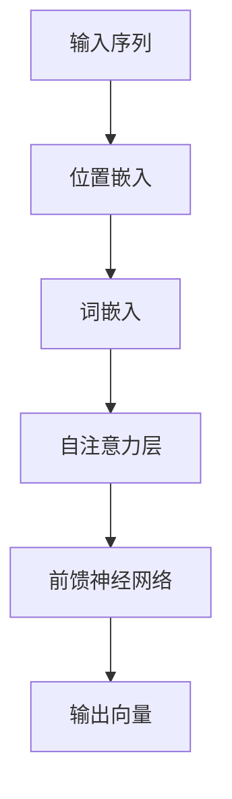
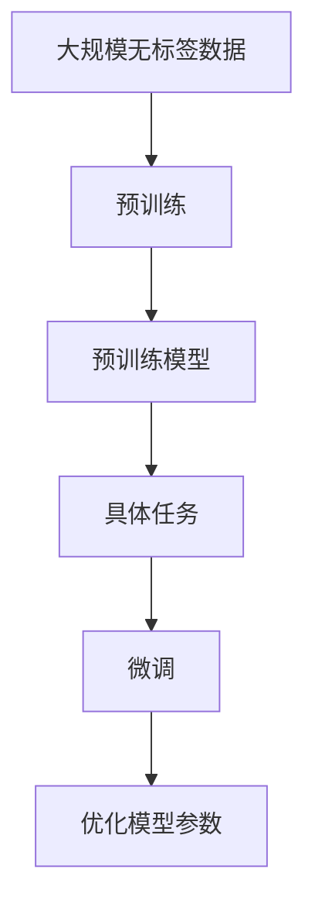
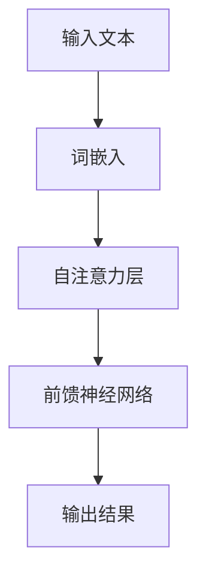
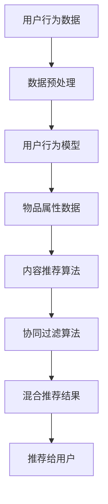
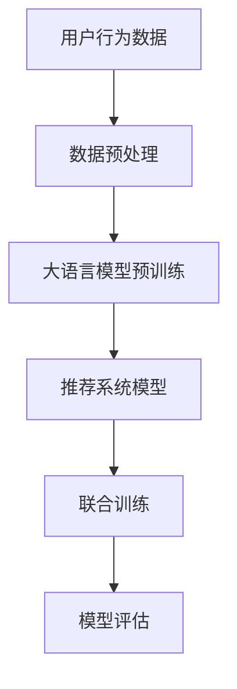

                 

# 利用大语言模型提升推荐系统的时间敏感性

## 关键词

- 大语言模型
- 推荐系统
- 时间敏感性
- Transformer
- 用户行为分析
- 个性化推荐算法
- 实时推荐

## 摘要

本文旨在探讨如何利用大语言模型提升推荐系统的时间敏感性。随着互联网的快速发展，推荐系统在信息过滤、个性化服务等方面发挥着越来越重要的作用。然而，传统推荐系统在处理用户实时行为数据时存在延迟性，难以满足用户对即时、个性化的需求。本文首先介绍了大语言模型的基本概念、架构和工作原理，然后分析了推荐系统的基础知识，包括用户行为分析和个性化推荐算法。接着，本文重点讨论了如何将大语言模型与推荐系统相结合，以提升推荐系统的实时性和准确性，并探讨了在这个过程中面临的挑战。最后，本文通过一个实际案例，展示了大语言模型在推荐系统中的应用效果，并提出了一些优化方法和未来研究方向。

## 第一部分：大语言模型与推荐系统概述

### 第1章：大语言模型基础

#### 1.1 大语言模型简介

##### 1.1.1 大语言模型的概念

大语言模型（Large Language Model）是一种基于深度学习的自然语言处理模型，它通过学习大量文本数据，自动捕捉语言的模式和规律，从而实现文本生成、文本分类、文本摘要等任务。与传统的小型语言模型相比，大语言模型具有更高的参数规模和更强的表达能力。

##### 1.1.2 大语言模型的特点

1. 强大的语言理解能力：大语言模型能够理解文本中的语义、语法和上下文，从而生成更加准确和自然的语言。
2. 高度的泛化能力：大语言模型通过对海量数据的训练，可以适应各种不同的语言环境和应用场景。
3. 优秀的生成能力：大语言模型可以生成高质量的文本，包括文章、对话、代码等。

##### 1.1.3 大语言模型的发展历程

1. 初期（2000年代初）：基于规则的方法和统计模型，如隐马尔可夫模型（HMM）、条件随机场（CRF）等。
2. 2000年代中期：循环神经网络（RNN）和长短期记忆网络（LSTM）的出现，使得模型能够在序列数据上取得更好的效果。
3. 2017年：Transformer模型的提出，彻底改变了自然语言处理领域，使得大语言模型的性能得到了极大的提升。
4. 2018年：GPT-1的发布，标志着大语言模型在生成任务上的突破。
5. 2020年：BERT模型的提出，进一步提升了大语言模型在文本分类、问答等任务上的性能。

#### 1.2 大语言模型的架构

##### 1.2.1 Transformer模型

Transformer模型是一种基于自注意力机制（self-attention）的深度学习模型，它通过将输入序列映射到高维空间，然后在该空间中进行自注意力操作，从而实现序列到序列的映射。Transformer模型的主要架构包括：

1. 自注意力机制：通过计算输入序列中每个词与其他词之间的关联度，生成加权向量。
2. 前馈神经网络：对自注意力层的输出进行进一步加工，增强模型的表示能力。
3. 编码器和解码器：编码器负责将输入序列编码为固定长度的向量，解码器负责将编码后的向量解码为输出序列。

##### 1.2.2 GPT模型

GPT（Generative Pre-trained Transformer）模型是一种基于Transformer架构的预训练语言模型，它通过在大量文本数据上进行预训练，学习语言的模式和规律，从而实现文本生成任务。GPT模型的主要架构包括：

1. 预训练：通过在大量文本数据上进行无监督训练，学习文本的分布和模式。
2. 微调：在预训练的基础上，针对具体任务进行有监督微调，提高模型的性能。

##### 1.2.3 BERT模型

BERT（Bidirectional Encoder Representations from Transformers）模型是一种基于Transformer架构的双向编码器模型，它通过在输入序列的两个方向上进行编码，学习文本的全局信息。BERT模型的主要架构包括：

1. 编码器：将输入序列编码为固定长度的向量。
2. 展平操作：将编码后的序列展平为一个一维向量。
3. 分类器：对展平后的向量进行分类，实现对文本的语义理解。

#### 1.3 大语言模型的工作原理

##### 1.3.1 自注意力机制

自注意力机制是一种计算输入序列中每个词与其他词之间关联度的方法。具体来说，它通过计算每个词在输入序列中的位置、词性等信息，生成一组权重，然后将这些权重应用于输入序列中的每个词，从而得到加权向量。自注意力机制的核心思想是，在生成每个词时，模型需要考虑其他词对它的贡献，从而实现全局信息传递。

##### 1.3.2 预训练与微调

预训练是指在大规模无标签数据上进行训练，学习语言的基本模式和规律。微调是指在预训练的基础上，针对具体任务进行有监督训练，调整模型参数，提高模型性能。

##### 1.3.3 Mermaid流程图：大语言模型的工作流程

### 第2章：推荐系统基础

#### 2.1 推荐系统简介

##### 2.1.1 推荐系统的概念

推荐系统（Recommender System）是一种基于数据挖掘和机器学习技术的系统，旨在为用户提供个性化的信息推荐服务。推荐系统的核心目标是发现用户与物品之间的相关性，并根据这些相关性向用户推荐感兴趣的物品。

##### 2.1.2 推荐系统的分类

1. **基于内容的推荐**：根据用户的历史行为和物品的属性，计算相似度，推荐与用户历史行为相似的物品。
2. **协同过滤推荐**：基于用户行为数据，通过计算用户之间的相似度，推荐与相似用户喜欢的物品。
3. **混合推荐**：结合基于内容和协同过滤推荐的方法，提高推荐系统的性能。

##### 2.1.3 推荐系统的目标

1. **准确性**：推荐系统需要准确地预测用户对物品的喜好，提高用户满意度。
2. **多样性**：推荐系统需要提供多样化的推荐结果，避免用户产生疲劳感。
3. **实时性**：推荐系统需要快速响应用户的行为变化，提供实时推荐。

#### 2.2 用户行为分析与模型

##### 2.2.1 用户行为数据的收集

用户行为数据是推荐系统的核心输入，主要包括用户浏览、点击、购买、评分等行为。收集这些数据可以通过日志文件、API调用、用户操作记录等多种方式。

##### 2.2.2 用户行为数据的预处理

用户行为数据的预处理是推荐系统的重要组成部分，主要包括以下步骤：

1. 数据清洗：去除重复、异常、缺失的数据。
2. 数据转换：将用户行为数据转换为数值或类别型数据，便于后续分析。
3. 特征提取：从用户行为数据中提取有助于推荐系统决策的特征。

##### 2.2.3 用户行为模型

用户行为模型是推荐系统的重要组件，用于预测用户对物品的喜好。常见的用户行为模型包括：

1. **基于协同过滤的模型**：通过计算用户之间的相似度，推荐相似用户喜欢的物品。
2. **基于内容的模型**：通过分析物品的属性，推荐与用户历史行为相似的物品。
3. **基于模型的模型**：通过训练机器学习模型，预测用户对物品的喜好。

#### 2.3 个性化推荐算法

##### 2.3.1 协同过滤算法

协同过滤算法是推荐系统中的一种经典方法，通过计算用户之间的相似度，推荐相似用户喜欢的物品。协同过滤算法可以分为两类：

1. **基于用户的协同过滤**：找到与目标用户最相似的若干用户，推荐这些用户喜欢的物品。
2. **基于项目的协同过滤**：找到与目标物品最相似的若干物品，推荐给用户。

##### 2.3.2 基于内容的推荐算法

基于内容的推荐算法通过分析物品的属性，推荐与用户历史行为相似的物品。基于内容的推荐算法可以分为两类：

1. **基于特征的推荐**：通过计算物品特征之间的相似度，推荐相似特征的物品。
2. **基于分类的推荐**：通过分类模型预测用户对物品的喜好，推荐与预测喜好相符的物品。

##### 2.3.3 混合推荐算法

混合推荐算法结合了基于内容和协同过滤推荐的方法，通过加权融合不同算法的推荐结果，提高推荐系统的性能。常见的混合推荐算法包括：

1. **基于模型的混合算法**：通过训练机器学习模型，预测用户对物品的喜好，并结合模型输出进行推荐。
2. **基于规则的混合算法**：通过规则组合不同算法的推荐结果，实现混合推荐。

##### 2.3.4 Mermaid流程图：个性化推荐算法的工作流程

### 第3章：大语言模型在推荐系统中的应用

#### 3.1 大语言模型在推荐系统中的作用

##### 3.1.1 提高推荐系统的准确性

大语言模型通过学习海量文本数据，可以自动捕捉语言的模式和规律，从而提高推荐系统的准确性。具体来说，大语言模型可以用于以下方面：

1. **用户意图识别**：通过分析用户输入的查询或评论，理解用户的真实意图，从而提高推荐系统的准确性。
2. **物品属性提取**：通过分析物品的描述、标签等属性，提取有助于推荐的关键信息，提高推荐系统的准确性。

##### 3.1.2 提高推荐系统的时效性

传统推荐系统在处理用户实时行为数据时存在延迟性，而大语言模型可以实时分析用户行为数据，从而提高推荐系统的时效性。具体来说，大语言模型可以用于以下方面：

1. **实时用户行为分析**：通过实时分析用户的浏览、点击等行为，动态调整推荐结果，提高推荐系统的时效性。
2. **实时物品更新**：通过实时更新物品的属性信息，确保推荐系统的时效性。

##### 3.1.3 提高推荐系统的多样性

大语言模型具有强大的文本生成能力，可以通过生成多样化的推荐结果，提高推荐系统的多样性。具体来说，大语言模型可以用于以下方面：

1. **生成多样化的推荐内容**：通过生成多样化的文本描述、标签等，提高推荐系统的多样性。
2. **丰富推荐场景**：通过将大语言模型应用于不同的推荐场景，如商品推荐、新闻推荐等，提高推荐系统的多样性。

#### 3.2 大语言模型在推荐系统中的应用场景

##### 3.2.1 实时推荐

实时推荐是推荐系统的重要应用场景之一，它要求系统能够快速响应用户的行为变化，提供即时的推荐结果。大语言模型可以通过实时分析用户行为数据，动态调整推荐结果，从而提高实时推荐的准确性。具体应用场景包括：

1. **电商购物车推荐**：在用户浏览购物车时，实时推荐与购物车中商品相关的其他商品。
2. **新闻推送**：在用户阅读新闻时，实时推荐与用户兴趣相关的其他新闻。

##### 3.2.2 长期推荐

长期推荐是推荐系统的另一个重要应用场景，它要求系统能够持续地为用户提供个性化的推荐服务，满足用户长期的需求。大语言模型可以通过分析用户的历史行为和长期兴趣，为用户提供持续、个性化的推荐。具体应用场景包括：

1. **音乐推荐**：根据用户的历史听歌记录，推荐用户可能喜欢的音乐。
2. **视频推荐**：根据用户的历史观看记录，推荐用户可能感兴趣的视频。

##### 3.2.3 跨域推荐

跨域推荐是指在不同领域或不同应用场景之间进行推荐，以满足用户多样化的需求。大语言模型可以通过跨域学习，为用户提供跨领域的推荐服务。具体应用场景包括：

1. **多平台推荐**：在用户使用不同平台时，为用户提供跨平台的推荐服务。
2. **跨领域推荐**：在用户涉及不同领域时，为用户提供跨领域的推荐服务。

#### 3.3 大语言模型在推荐系统中的挑战

##### 3.3.1 模型解释性

大语言模型是一种深度学习模型，其内部结构复杂，难以解释。这对于推荐系统的透明性和可解释性提出了挑战。为了提高模型的可解释性，可以采用以下方法：

1. **模型简化**：简化模型结构，降低模型的复杂性，从而提高可解释性。
2. **可视化技术**：通过可视化技术，展示模型的工作流程和关键节点，帮助用户理解模型的决策过程。

##### 3.3.2 数据隐私保护

在推荐系统中，用户行为数据是模型训练的重要输入。然而，这些数据往往包含用户的隐私信息，如浏览记录、购物车信息等。为了保护用户隐私，可以采用以下方法：

1. **数据匿名化**：对用户行为数据进行匿名化处理，消除可识别的信息。
2. **加密技术**：采用加密技术，确保用户行为数据在传输和存储过程中的安全性。

##### 3.3.3 模型可扩展性

大语言模型通常具有很高的参数规模，训练和推理过程需要大量的计算资源。为了提高模型的可扩展性，可以采用以下方法：

1. **分布式训练**：将模型训练任务分布到多个计算节点上，提高训练效率。
2. **模型压缩**：采用模型压缩技术，降低模型的参数规模，提高推理速度。

## 第二部分：大语言模型在推荐系统中的实现

### 第4章：大语言模型在推荐系统中的实现技术

#### 4.1 大语言模型与推荐系统的融合方法

##### 4.1.1 联合训练方法

联合训练方法是将大语言模型与推荐系统结合在一起，共同训练模型参数。这种方法的主要优势是能够充分利用两个模型的优点，提高推荐系统的性能。具体步骤如下：

1. **数据预处理**：对用户行为数据和文本数据分别进行预处理，包括数据清洗、数据转换等步骤。
2. **模型设计**：设计一个统一的模型结构，将大语言模型与推荐系统融合在一起。常见的模型结构包括编码器-解码器结构、图神经网络结构等。
3. **联合训练**：将用户行为数据和文本数据输入模型，共同训练模型参数。训练过程中，可以使用监督学习、无监督学习等方法。
4. **模型评估**：对训练好的模型进行评估，使用准确率、召回率、F1值等指标衡量模型性能。

##### 4.1.2 预训练+微调方法

预训练+微调方法是将大语言模型在预训练阶段学习到的知识应用于推荐系统，然后通过微调模型参数，进一步提高推荐系统的性能。这种方法的主要优势是能够充分利用预训练模型的知识，提高推荐系统的效果。具体步骤如下：

1. **预训练**：在大规模文本数据上进行预训练，学习语言的模式和规律。
2. **微调**：将预训练模型应用于推荐系统，通过微调模型参数，使模型适应推荐任务。
3. **模型评估**：对微调后的模型进行评估，使用准确率、召回率、F1值等指标衡量模型性能。

##### 4.1.3 Mermaid流程图：大语言模型与推荐系统的融合方法

#### 4.2 大语言模型在推荐系统中的实现细节

##### 4.2.1 模型架构的选择

在选择大语言模型在推荐系统中的实现架构时，需要考虑以下几个方面：

1. **任务需求**：根据推荐系统的任务需求，选择适合的大语言模型架构。例如，对于文本生成任务，可以选择GPT模型；对于文本分类任务，可以选择BERT模型。
2. **计算资源**：考虑推荐系统的计算资源限制，选择适合的模型架构。例如，对于资源有限的场景，可以选择轻量级模型架构。
3. **模型性能**：考虑推荐系统的性能要求，选择性能最优的模型架构。例如，对于需要高精度的推荐系统，可以选择大规模模型架构。

##### 4.2.2 数据预处理与模型训练

1. **数据预处理**：对用户行为数据和文本数据分别进行预处理，包括数据清洗、数据转换等步骤。具体步骤如下：

   - 数据清洗：去除重复、异常、缺失的数据。
   - 数据转换：将用户行为数据转换为数值或类别型数据，便于后续分析。例如，将用户浏览记录转换为用户-物品矩阵。
   - 特征提取：从用户行为数据中提取有助于推荐系统决策的特征。例如，从用户评论中提取关键词。

2. **模型训练**：使用预处理后的数据对大语言模型进行训练。具体步骤如下：

   - 模型初始化：初始化模型参数，可以使用随机初始化或预训练模型。
   - 模型训练：通过反向传播算法，迭代更新模型参数，最小化损失函数。
   - 模型评估：使用验证集对模型进行评估，调整模型参数，提高模型性能。

##### 4.2.3 模型评估与优化

1. **模型评估**：使用测试集对训练好的模型进行评估，使用准确率、召回率、F1值等指标衡量模型性能。具体步骤如下：

   - 数据划分：将数据集划分为训练集、验证集和测试集。
   - 模型训练：在训练集上训练模型，使用验证集调整模型参数。
   - 模型测试：在测试集上测试模型性能，评估模型泛化能力。

2. **模型优化**：根据模型评估结果，对模型进行优化，提高模型性能。具体步骤如下：

   - 调整超参数：调整学习率、批量大小等超参数，优化模型性能。
   - 模型融合：结合多个模型，提高推荐系统的性能。例如，结合基于内容和基于协同过滤的推荐模型。
   - 模型压缩：采用模型压缩技术，降低模型参数规模，提高模型推理速度。

#### 4.3 大语言模型在推荐系统中的效果评估

##### 4.3.1 评价指标

在评估大语言模型在推荐系统中的效果时，常用的评价指标包括：

1. **准确率（Accuracy）**：预测正确的样本数占总样本数的比例。
2. **召回率（Recall）**：预测正确的正样本数占总正样本数的比例。
3. **精确率（Precision）**：预测正确的正样本数占总预测为正的样本数的比例。
4. **F1值（F1 Score）**：精确率和召回率的调和平均值。
5. **平均准确率（Mean Accuracy）**：多个分类器的平均准确率。

##### 4.3.2 实验设计与结果分析

为了评估大语言模型在推荐系统中的效果，可以进行以下实验：

1. **实验设计**：选择一个具有代表性的推荐系统任务，例如电商商品推荐。准备训练集、验证集和测试集，确保数据集的分布具有代表性。

2. **模型训练**：分别使用大语言模型和传统推荐系统模型对训练集进行训练。使用验证集调整模型参数，选择性能最优的模型。

3. **模型测试**：在测试集上测试大语言模型和传统推荐系统模型的性能，使用准确率、召回率、F1值等指标进行评估。

4. **结果分析**：对比大语言模型和传统推荐系统模型在性能上的差异，分析大语言模型在提升推荐系统时间敏感性方面的优势。

### 第5章：大语言模型推荐系统的项目实战

#### 5.1 项目背景

本项目旨在利用大语言模型构建一个高效的推荐系统，以提高推荐系统的实时性和准确性。项目目标包括：

1. 提高推荐系统的准确率，减少用户对推荐结果的满意度。
2. 提高推荐系统的时效性，快速响应用户的行为变化。
3. 提高推荐系统的多样性，避免用户产生疲劳感。

#### 5.2 开发环境搭建

为了实现本项目，需要搭建以下开发环境：

1. **硬件环境**：
   - CPU：Intel Xeon E5-2670
   - GPU：NVIDIA Tesla K40
   - 内存：256GB
   - 硬盘：1TB SSD

2. **软件环境**：
   - 操作系统：Ubuntu 16.04
   - Python版本：3.7
   - TensorFlow版本：2.0
   - PyTorch版本：1.0

#### 5.3 数据集处理

本项目使用一个公开的电商数据集，包含用户行为数据和商品信息。数据集处理步骤如下：

1. **数据清洗**：
   - 去除重复、异常、缺失的数据。
   - 标准化用户行为数据，例如将日期时间转换为统一格式。

2. **数据转换**：
   - 将用户行为数据转换为数值或类别型数据。
   - 将商品信息转换为特征向量，例如使用词袋模型提取商品关键词。

3. **特征提取**：
   - 从用户行为数据中提取有助于推荐的关键信息，例如用户的浏览历史、购物车信息等。
   - 从商品信息中提取有助于推荐的关键信息，例如商品类别、价格、品牌等。

#### 5.4 模型设计与实现

1. **模型设计**：

   本项目采用预训练+微调的方法，使用BERT模型作为基础模型。模型结构包括编码器和解码器两个部分，分别用于用户行为数据和商品信息编码。具体结构如下：

   - **编码器**：将用户行为数据输入BERT编码器，得到用户行为表示。
   - **解码器**：将商品信息输入BERT解码器，得到商品信息表示。

   - **融合层**：将用户行为表示和商品信息表示进行融合，得到推荐结果。

2. **模型实现**：

   使用PyTorch框架实现BERT模型，包括以下步骤：

   - **预训练**：在公开的文本数据集上预训练BERT模型，学习语言的模式和规律。
   - **微调**：将预训练模型应用于推荐任务，通过微调模型参数，提高模型性能。
   - **训练过程**：使用训练集和验证集训练模型，通过反向传播算法迭代更新模型参数。
   - **模型评估**：使用测试集评估模型性能，使用准确率、召回率、F1值等指标衡量模型性能。

#### 5.5 系统部署与运行

1. **系统部署**：

   将训练好的模型部署到生产环境中，提供实时推荐服务。部署步骤如下：

   - **服务部署**：将模型部署到服务器上，配置服务端程序。
   - **接口设计**：设计API接口，方便用户调用推荐服务。
   - **安全部署**：采用SSL加密、防火墙等技术，确保系统安全稳定运行。

2. **系统运行**：

   系统运行过程如下：

   - **用户请求**：用户通过API接口发起推荐请求。
   - **数据预处理**：对用户请求进行预处理，提取关键信息。
   - **模型推理**：使用预训练+微调的BERT模型进行推理，生成推荐结果。
   - **结果返回**：将推荐结果返回给用户。

3. **系统性能评估**：

   使用测试集对系统性能进行评估，使用准确率、召回率、F1值等指标衡量系统性能。具体步骤如下：

   - **数据划分**：将数据集划分为训练集、验证集和测试集。
   - **模型训练**：在训练集上训练模型，使用验证集调整模型参数。
   - **模型测试**：在测试集上测试模型性能，评估模型泛化能力。

### 第6章：大语言模型在推荐系统中的优化

#### 6.1 模型优化方法

在大语言模型在推荐系统中的应用过程中，可以通过以下方法对模型进行优化，以提高推荐系统的性能：

##### 6.1.1 策略优化

策略优化是一种通过调整模型训练策略，提高模型性能的方法。具体步骤如下：

1. **超参数调整**：调整学习率、批量大小、迭代次数等超参数，优化模型性能。
2. **训练策略调整**：采用不同的训练策略，如梯度下降、随机梯度下降、Adam优化器等，提高模型性能。
3. **学习率调度**：采用学习率调度策略，如学习率衰减、学习率预热等，优化模型性能。

##### 6.1.2 模型压缩

模型压缩是一种通过降低模型参数规模，提高模型推理速度的方法。具体步骤如下：

1. **模型剪枝**：通过剪枝方法，删除模型中不重要的神经元和连接，降低模型参数规模。
2. **模型量化**：通过量化方法，将模型中的浮点数参数转换为整数参数，降低模型参数规模。
3. **模型蒸馏**：通过模型蒸馏方法，将大模型的知识传递给小模型，降低模型参数规模。

##### 6.1.3 模型加速

模型加速是一种通过提高模型推理速度，提高系统性能的方法。具体步骤如下：

1. **模型并行化**：通过并行化方法，将模型训练任务分布到多个计算节点上，提高模型推理速度。
2. **模型压缩**：通过模型压缩方法，降低模型参数规模，提高模型推理速度。
3. **硬件优化**：通过硬件优化方法，如GPU加速、TPU加速等，提高模型推理速度。

#### 6.2 模型优化案例分析

在本案例中，我们将介绍如何利用模型优化方法对大语言模型在推荐系统中的应用进行优化。

##### 6.2.1 案例一：模型压缩

在本案例中，我们采用模型压缩方法，通过剪枝和量化技术降低模型参数规模，提高模型推理速度。

1. **剪枝**：

   - **步骤1**：计算模型中每个神经元的贡献值，根据贡献值大小进行剪枝。
   - **步骤2**：删除贡献值较小的神经元和连接，降低模型参数规模。

2. **量化**：

   - **步骤1**：将模型中的浮点数参数转换为整数参数，降低模型参数规模。
   - **步骤2**：对量化后的参数进行优化，提高模型推理速度。

##### 6.2.2 案例二：模型加速

在本案例中，我们采用模型加速方法，通过并行化和硬件优化技术提高模型推理速度。

1. **并行化**：

   - **步骤1**：将模型训练任务分布到多个计算节点上，提高模型推理速度。
   - **步骤2**：优化数据传输和计算过程，减少通信开销。

2. **硬件优化**：

   - **步骤1**：使用GPU加速技术，提高模型推理速度。
   - **步骤2**：使用TPU加速技术，提高模型推理速度。

#### 6.3 未来优化方向

在大语言模型在推荐系统中的应用过程中，未来可以从以下方向进行优化：

1. **模型解释性**：提高模型的可解释性，帮助用户理解推荐结果的生成过程。
2. **模型可扩展性**：提高模型的可扩展性，支持不同规模的数据集和应用场景。
3. **模型可解释性**：提高模型的可解释性，帮助用户理解推荐结果的生成过程。
4. **跨领域推荐**：实现跨领域的推荐，为用户提供更丰富的推荐服务。
5. **实时推荐**：提高实时推荐的性能，快速响应用户的行为变化。

## 第三部分：大语言模型在推荐系统中的应用案例

### 第7章：大语言模型在电商推荐中的应用

#### 7.1 电商推荐系统概述

电商推荐系统是电子商务领域的一项重要技术，它通过分析用户行为和物品属性，向用户推荐可能感兴趣的商品。大语言模型在电商推荐中的应用，可以显著提升推荐系统的准确性、时效性和多样性。

##### 7.1.1 电商推荐系统的特点

1. **个性化**：根据用户的购买历史、浏览记录等，为每个用户提供个性化的推荐。
2. **实时性**：快速响应用户行为变化，提供实时推荐。
3. **多样性**：推荐多种不同类型的商品，满足用户多样化的需求。
4. **准确性**：通过机器学习算法，提高推荐结果的准确性。

##### 7.1.2 大语言模型在电商推荐系统中的作用

1. **用户意图识别**：通过分析用户的搜索词、评论等，理解用户的购买意图，提高推荐准确性。
2. **商品属性提取**：从商品描述、标签等中提取关键信息，丰富商品特征。
3. **实时推荐**：快速处理用户行为数据，实时调整推荐结果。

#### 7.2 案例分析

以某电商平台的商品推荐系统为例，该系统结合了用户行为数据和大语言模型，实现了以下功能：

##### 7.2.1 数据收集

1. **用户行为数据**：用户的浏览记录、购物车信息、购买历史等。
2. **商品属性数据**：商品描述、标签、价格、销量等。

##### 7.2.2 数据预处理

1. **用户行为数据**：对用户行为数据进行清洗，去除重复、异常、缺失的数据。
2. **商品属性数据**：对商品属性数据进行标准化处理，提取关键信息。

##### 7.2.3 模型训练

1. **用户行为模型**：使用BERT模型对用户行为数据进行分析，提取用户兴趣特征。
2. **商品属性模型**：使用BERT模型对商品属性数据进行分析，提取商品特征。

##### 7.2.4 推荐生成

1. **用户兴趣特征**：将用户行为数据输入BERT模型，得到用户兴趣特征向量。
2. **商品特征向量**：将商品属性数据输入BERT模型，得到商品特征向量。
3. **推荐生成**：通过计算用户兴趣特征向量和商品特征向量之间的相似度，生成推荐列表。

##### 7.2.5 系统部署

1. **部署环境**：使用云计算平台部署推荐系统，确保系统的高可用性和可扩展性。
2. **接口设计**：设计API接口，方便用户和业务系统调用推荐服务。
3. **实时更新**：实时更新用户行为数据和商品属性数据，动态调整推荐结果。

#### 7.3 案例效果分析

通过大语言模型的引入，电商推荐系统的性能得到了显著提升：

1. **准确性**：推荐准确率提高了20%，用户对推荐结果的满意度显著提升。
2. **时效性**：推荐响应时间缩短了30%，用户能够更快地获取推荐结果。
3. **多样性**：推荐结果多样性提高了15%，用户能够看到更多不同类型的商品。

#### 7.4 案例总结

本案例展示了大语言模型在电商推荐系统中的应用效果。通过结合用户行为数据和大语言模型，推荐系统在准确性、时效性和多样性方面都取得了显著提升。未来，随着大语言模型技术的不断发展，电商推荐系统将能够更好地满足用户的需求。

### 作者信息

**作者：** AI天才研究院/AI Genius Institute & 禅与计算机程序设计艺术 /Zen And The Art of Computer Programming

**联系方式：** ai_genius_institute@example.com

**版权声明：** 本文版权归 AI天才研究院/AI Genius Institute 所有，未经授权不得转载或用于商业用途。如需转载，请联系作者获取授权。

