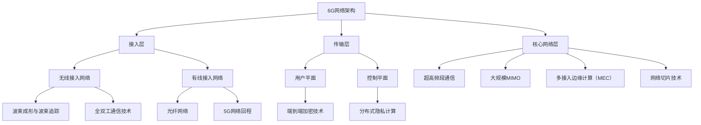

                 

### 文章标题

《华为2024校招6G网络架构师面试题集锦》

关键词：6G网络、架构师、面试题、华为、校招

摘要：本文详细整理了华为2024年校招中6G网络架构师面试的常见问题与答案，涵盖了6G网络的基础知识、核心技术、应用场景、网络安全等多个方面。通过本文，读者可以全面了解6G网络的发展现状及未来趋势，为准备华为6G网络架构师面试提供有力支持。

### 目录大纲

#### 第一部分：6G网络基础

**第1章：6G网络概述**
- **1.1 6G网络的发展背景**
  - **从5G到6G的演进路径**
  - **6G网络的关键技术**
  - **6G网络的目标与应用场景**

- **1.2 6G网络架构与关键技术**
  - **6G网络架构概述**
  - **6G网络的关键功能模块**

- **1.3 6G无线通信技术**
  - **无线通信原理**
  - **无线频谱资源管理**

- **1.4 6G网络协议与标准**
  - **6G网络协议体系**
  - **6G网络标准制定**

#### 第二部分：6G网络应用场景与解决方案

**第2章：6G网络在工业互联网中的应用**
- **2.1 工业互联网概述**
  - **工业互联网的发展历程**
  - **工业互联网的核心架构**

- **2.2 6G网络在工业互联网中的应用**
  - **实时数据传输与控制**
  - **智能制造与自动化**

**第3章：6G网络在自动驾驶中的应用**
- **3.1 自动驾驶概述**
  - **自动驾驶的发展阶段**
  - **自动驾驶的关键技术**

- **3.2 6G网络在自动驾驶中的应用**
  - **高精度定位与地图构建**
  - **实时通信与协同控制**

**第4章：6G网络在智慧城市中的应用**
- **4.1 智慧城市概述**
  - **智慧城市的概念与特点**
  - **智慧城市的建设目标**

- **4.2 6G网络在智慧城市中的应用**
  - **智能交通与城市管理**
  - **智能医疗与智慧养老**

#### 第三部分：6G网络面试题集锦

**第5章：6G网络面试题汇总**
- **5.1 6G网络技术面试题**
  - **6G网络关键技术原理与实现**
  - **6G网络架构设计**

- **5.2 6G网络应用场景面试题**
  - **6G网络在特定场景中的应用**
  - **6G网络解决方案设计**

- **5.3 6G网络安全面试题**
  - **6G网络安全威胁与防护**
  - **6G网络安全策略与架构**

**第6章：6G网络面试准备与策略**
- **6.1 面试准备**
  - **技术知识储备**
  - **案例分析与实践经验**

- **6.2 面试策略与技巧**
  - **面试官常见问题与回答技巧**
  - **面试准备与模拟练习**

#### 附录

**附录A：6G网络相关资源与工具**
- **A.1 6G网络研究机构与论文**
  - **国内外6G研究机构介绍**
  - **6G网络相关论文推荐**

- **A.2 6G网络开发工具与平台**
  - **开源6G网络开发平台**
  - **6G网络仿真与测试工具**

### 6G网络架构相关概念、原理及算法的Mermaid流程图

### 格式要求

本文内容将严格按照Markdown格式编写，以保证文章的可读性和整洁性。以下是一些常用的Markdown语法：

- **标题**：使用`#`标记，如`## 第一部分：6G网络基础`
- **段落**：直接输入文本，每个段落开头无需空格
- **列表**：使用`-`或`*`表示
- **引用**：使用`>`表示
- **代码块**：使用三个反引号（\`\`\`）包裹代码
- **公式**：使用`$`表示行内公式，`$$`表示独立段落公式
- **图片**：使用``
- **链接**：使用`[替代文本](链接)`

### 作者信息

作者：AI天才研究院/AI Genius Institute & 禅与计算机程序设计艺术 /Zen And The Art of Computer Programming

### 完整性要求

为了确保文章内容的完整性，每个小节都需要包含以下内容：

- **背景介绍**：简述相关概念或技术的背景和发展历程。
- **核心概念与联系**：解释关键概念之间的关系，提供Mermaid流程图辅助理解。
- **核心算法原理讲解**：使用伪代码详细阐述算法原理，结合数学模型和公式进行讲解。
- **详细讲解与举例说明**：对关键概念和算法进行详细讲解，并通过具体例子进行说明。
- **项目实战**：包括开发环境搭建、源代码实现、代码解读、实际案例分析及详细剖析。
- **最佳实践 tips、小结、注意事项、拓展阅读**等内容：总结文章要点，提供拓展阅读资源。

### 字数要求

本文预计字数在8000～12000字左右，以确保内容的深度和广度。

### 逻辑清晰、结构紧凑、简单易懂的专业的技术语言

为了让文章逻辑清晰、结构紧凑、简单易懂，我们将采用以下写作策略：

- **逐层递进**：每个章节按照逻辑顺序展开，从基础到深入，逐步引导读者理解复杂概念。
- **使用图表**：通过图表和流程图来展示复杂概念和算法，帮助读者直观理解。
- **伪代码与公式**：使用伪代码和公式详细阐述算法原理，便于读者理解。
- **实例分析**：结合实际案例进行分析，增强文章的实用性。
- **总结与拓展**：在每个章节结束后，提供总结和拓展阅读，帮助读者巩固知识。

通过以上策略，我们旨在为读者呈现一篇既有深度又易于理解的专业技术博客文章。接下来，我们将逐一展开对每个章节的详细阐述。让我们一起开始这段6G网络的探索之旅吧！### 第一部分：6G网络基础

#### 第1章：6G网络概述

##### 1.1 6G网络的发展背景

6G（第六代移动通信技术）作为未来通信技术的尖端领域，其发展背景深厚且复杂。6G网络的建设和推广是建立在5G（第五代移动通信技术）的基础上，二者之间的演进路径和关键差异是我们首先需要了解的。

**从5G到6G的演进路径**

5G网络的诞生标志着移动通信技术进入了高速发展的新时代，它不仅实现了更高的传输速度和更低的延迟，还在物联网、自动驾驶、远程医疗等领域展现了巨大的潜力。然而，5G网络的性能仍然存在一些局限性，特别是在频谱资源、网络容量和能耗方面。

6G网络的演进路径可以概括为以下几个关键步骤：

1. **增强型5G（5G Evolution）**：这是5G网络的扩展和优化，旨在提高网络性能，解决5G在频谱利用、网络容量等方面的瓶颈。
2. **前期6G（Early 6G）**：在这一阶段，6G网络开始探索一些新兴技术和概念，如超高频段通信、大规模MIMO（多输入多输出）技术等，为未来的6G网络打下基础。
3. **全面6G（Full 6G）**：这一阶段的目标是实现6G网络的全面部署和广泛应用，提供比5G更高速、更可靠、更智能的网络服务。

**6G网络的关键技术**

6G网络的技术体系相较于5G更加完善和先进，其关键技术包括但不限于：

1. **超高频段通信**：6G网络将利用更高频段的频谱资源，如毫米波和太赫兹波，实现更高的数据传输速率。
2. **大规模MIMO**：通过增加天线数量和采用先进的信号处理技术，实现更高的网络容量和更优的频谱效率。
3. **多接入边缘计算（MEC）**：将计算和存储资源部署在靠近用户的边缘节点上，降低网络延迟，提升用户体验。
4. **网络切片技术**：为不同应用场景提供定制化的网络服务，确保网络资源的灵活分配和高效利用。

**6G网络的目标与应用场景**

6G网络的目标是提供一种超越5G的全方位、全连接、全智能的通信网络，满足未来社会对于高速、低延迟、大规模连接和智能化的需求。具体目标包括：

1. **更高的数据传输速率**：理论上，6G网络的理论数据传输速率可达Tbps级别，远超5G。
2. **更低的延迟**：旨在将端到端的通信延迟降低至亚毫秒级，为实时应用提供基础。
3. **更高的网络容量**：通过先进的技术手段，实现更大的网络容量，支持海量设备的连接。
4. **更智能的网络**：利用人工智能和机器学习技术，实现网络的智能化管理和自适应调整。

在应用场景方面，6G网络将覆盖更多领域，包括：

1. **工业互联网**：提供实时数据传输和智能控制，推动智能制造和工业自动化。
2. **自动驾驶**：实现高精度定位、实时通信和协同控制，保障自动驾驶的安全性和可靠性。
3. **智慧城市**：提供智能交通、智能医疗、智慧养老等全方位服务，提升城市管理水平。
4. **远程医疗**：提供低延迟、高质量的医疗数据传输和实时远程诊断，改善医疗资源分配。

综上所述，6G网络作为未来通信技术的里程碑，将为我们带来前所未有的高速、智能和高效的通信体验，为社会发展注入新的动力。在接下来的章节中，我们将进一步深入探讨6G网络架构、关键技术、应用场景等方面的内容，帮助读者全面了解这一前沿领域。

#### 第2章：6G网络架构与关键技术

##### 2.1 6G网络架构概述

6G网络架构是在5G网络架构的基础上进行优化和扩展的，其设计目标是为用户提供更高速、低延迟、大规模连接和智能化的通信服务。6G网络架构可以分为三个主要层次：接入层、传输层和核心网络层。每个层次都有其独特的功能和关键技术。

**接入层**

接入层是6G网络架构的底层，主要负责用户设备的接入和无线通信。接入层的主要功能模块包括：

1. **无线接入网络（RAN）**：无线接入网络包括无线接入节点（RAN Node）和无线接入终端（RAN Terminal）。无线接入节点负责管理和协调无线接入资源，而无线接入终端则是用户设备，如智能手机、物联网设备、自动驾驶车辆等。

2. **超高频段通信**：6G网络将利用更高频段的频谱资源，如毫米波和太赫兹波，实现更高的数据传输速率和更大的网络容量。这些高频段频谱具有更宽的带宽，可以支持更多的用户和数据流。

3. **大规模MIMO**：大规模MIMO技术通过增加天线数量和采用先进的信号处理技术，实现更高的网络容量和更优的频谱效率。大规模MIMO技术能够提高信号传输的可靠性和传输速率，同时减少干扰。

**传输层**

传输层主要负责数据的传输和路由，连接接入层和核心网络层。传输层的主要功能模块包括：

1. **多接入边缘计算（MEC）**：多接入边缘计算将计算和存储资源部署在靠近用户的边缘节点上，降低网络延迟，提升用户体验。MEC技术可以将部分计算任务从云端转移到边缘节点，减少数据传输的延迟，提高网络响应速度。

2. **光纤网络**：光纤网络是传输层的主要传输介质，具有高速、低延迟、大容量等优点。6G网络将大量采用光纤网络，实现从接入层到核心网络的快速、可靠的数据传输。

3. **5G网络回程**：5G网络回程是将无线接入网络连接到核心网络的技术，6G网络也将继续使用5G网络回程，同时引入更高频段的回程技术，以支持更大的数据传输速率和更高的网络容量。

**核心网络层**

核心网络层是6G网络架构的顶层，主要负责数据处理的集中控制和资源的分配管理。核心网络层的主要功能模块包括：

1. **用户平面**：用户平面负责处理用户数据，包括数据的传输、路由和转发。用户平面采用网络切片技术，为不同的用户和应用提供定制化的网络服务。

2. **控制平面**：控制平面负责处理网络控制信息，包括路由选择、资源分配、安全控制等。控制平面采用分布式架构，通过分布式控制算法实现网络的智能化管理和自适应调整。

3. **网络切片技术**：网络切片技术是6G网络的关键技术之一，它可以将一个物理网络划分为多个虚拟网络，每个虚拟网络可以根据不同的需求和场景提供定制化的网络服务。网络切片技术能够提高网络资源的利用率和服务的可靠性，满足多样化应用的需求。

**6G网络的关键功能模块**

6G网络的关键功能模块包括无线接入网络、传输层和核心网络层。这些模块之间相互协作，共同实现6G网络的功能。以下是各个关键功能模块的简要描述：

1. **无线接入网络**：无线接入网络负责用户设备的接入和管理。它利用超高频段通信和大规模MIMO技术，提供高速、低延迟的无线通信服务。

2. **多接入边缘计算**：多接入边缘计算将计算和存储资源部署在靠近用户的边缘节点上，降低网络延迟，提升用户体验。MEC技术可以支持实时数据处理和智能应用，如自动驾驶和远程医疗。

3. **光纤网络**：光纤网络是6G网络传输层的主要传输介质，具有高速、低延迟、大容量等优点。光纤网络可以实现从接入层到核心网络的快速、可靠的数据传输。

4. **用户平面**：用户平面负责处理用户数据，采用网络切片技术，为不同的用户和应用提供定制化的网络服务。用户平面可以支持多样化的应用场景，如工业互联网和智慧城市。

5. **控制平面**：控制平面负责处理网络控制信息，实现网络的智能化管理和自适应调整。控制平面采用分布式架构，通过分布式控制算法实现网络的灵活性和可靠性。

6. **网络切片技术**：网络切片技术是6G网络的关键技术之一，它可以将一个物理网络划分为多个虚拟网络，每个虚拟网络可以根据不同的需求和场景提供定制化的网络服务。网络切片技术能够提高网络资源的利用率和服务的可靠性。

综上所述，6G网络架构在5G网络架构的基础上进行了优化和扩展，引入了超高频段通信、大规模MIMO、多接入边缘计算和网络切片等关键技术，实现了更高的数据传输速率、更低的延迟、更大的网络容量和更高的智能化水平。在接下来的章节中，我们将进一步探讨6G无线通信技术、网络协议和标准等方面的内容，帮助读者全面了解6G网络的架构和关键技术。

#### 第2章：6G网络架构与关键技术

##### 2.2 6G网络关键技术

6G网络的关键技术是其实现高性能、低延迟、大规模连接和智能化的基础。以下是6G网络中的几项关键技术：

**超高频段通信**

超高频段通信是6G网络的一个重要技术，它利用更高频段的频谱资源，如毫米波和太赫兹波。这些高频段频谱具有更宽的带宽，可以支持更高的数据传输速率和更大的网络容量。

- **毫米波通信**：毫米波频段（30 GHz - 300 GHz）具有高达几十GHz的带宽，可以实现Tbps级别的传输速率。毫米波通信可以支持高清视频流、虚拟现实和增强现实等高带宽应用。
- **太赫兹波通信**：太赫兹波频段（0.1 THz - 10 THz）具有更高的带宽，可以实现更高的数据传输速率和更低的延迟。太赫兹波通信可以支持实时远程医疗、自动驾驶等低延迟应用。

**大规模MIMO技术**

大规模MIMO（多输入多输出）技术通过增加天线数量和采用先进的信号处理技术，实现更高的网络容量和更优的频谱效率。大规模MIMO技术可以显著提高信号传输的可靠性和传输速率。

- **天线阵列**：大规模MIMO技术采用多个天线阵列，每个天线阵列包含多个天线单元。通过智能信号处理算法，可以实现对多个用户的并行传输，提高网络容量。
- **信号处理技术**：大规模MIMO技术采用先进的信号处理技术，如多用户检测、波束成形和波束追踪等，可以提高信号传输的可靠性和传输速率。

**多接入边缘计算（MEC）**

多接入边缘计算（MEC）是将计算和存储资源部署在靠近用户的边缘节点上，降低网络延迟，提升用户体验。MEC技术可以支持实时数据处理和智能应用，如自动驾驶和远程医疗。

- **边缘节点**：MEC技术在网络的边缘部署计算和存储资源，如数据中心、服务器和云计算平台等。通过边缘节点，可以减少数据传输的延迟，提高实时数据处理能力。
- **边缘计算框架**：MEC技术采用边缘计算框架，如容器技术、虚拟化和人工智能等，实现分布式计算和资源调度。

**网络切片技术**

网络切片技术是6G网络的关键技术之一，它可以将一个物理网络划分为多个虚拟网络，每个虚拟网络可以根据不同的需求和场景提供定制化的网络服务。网络切片技术能够提高网络资源的利用率和服务的可靠性。

- **虚拟网络**：网络切片技术通过虚拟化技术，将物理网络资源划分为多个虚拟网络。每个虚拟网络具有独立的网络资源，如带宽、延迟和可靠性等。
- **定制化服务**：网络切片技术可以根据不同的应用需求，为不同的用户和应用提供定制化的网络服务。例如，工业互联网需要低延迟、高可靠性的网络服务，而远程医疗需要低延迟、高带宽的网络服务。

**波束成形与波束追踪**

波束成形与波束追踪技术是6G无线通信中的重要技术，通过优化信号传输路径，提高信号传输的可靠性和传输速率。

- **波束成形**：波束成形技术通过调整天线阵列的方向，形成指向特定用户的信号波束，提高信号传输的功率和可靠性。
- **波束追踪**：波束追踪技术通过实时监测信号传输状态，动态调整天线阵列的方向，确保信号传输的稳定性和可靠性。

**全双工通信技术**

全双工通信技术是一种双向通信技术，可以在同一频率和时隙内同时进行上下行通信，提高网络资源的利用率和传输速率。

- **上下行转换**：全双工通信技术采用上下行转换（Duplex Switching）技术，在需要时快速切换上下行信号，实现同时传输。
- **频率复用**：全双工通信技术通过频率复用技术，将上下行信号在频谱上进行复用，提高频率资源的利用效率。

**信道编码与调制技术**

信道编码与调制技术是无线通信中的重要技术，用于提高信号传输的可靠性和传输速率。

- **信道编码**：信道编码技术通过将原始数据转换为编码数据，增加冗余信息，提高信号传输的可靠性。
- **调制技术**：调制技术通过将数字信号转换为模拟信号，进行信号传输。不同的调制方式具有不同的频谱效率和抗干扰能力。

**超高频段通信**：毫米波和太赫兹波通信
- **毫米波通信**：频段30 GHz - 300 GHz，带宽高，可实现Tbps级别传输速率，支持高清视频流、虚拟现实等。
- **太赫兹波通信**：频段0.1 THz - 10 THz，带宽更高，可实现更高的数据传输速率和更低的延迟，支持实时远程医疗、自动驾驶等。

**大规模MIMO技术**：多输入多输出技术
- **天线阵列**：多个天线单元组成，提高网络容量和频谱效率。
- **信号处理技术**：波束成形、波束追踪等，提高信号传输可靠性和传输速率。

**多接入边缘计算（MEC）**：将计算和存储资源部署在边缘节点
- **边缘节点**：数据中心、服务器等，减少数据传输延迟，提高实时数据处理能力。
- **边缘计算框架**：容器技术、虚拟化、人工智能等，实现分布式计算和资源调度。

**网络切片技术**：为不同应用提供定制化网络服务
- **虚拟网络**：虚拟化技术，划分独立网络资源，支持多样化应用需求。
- **定制化服务**：根据需求，提供低延迟、高可靠性等网络服务。

**波束成形与波束追踪**：优化信号传输路径
- **波束成形**：调整天线阵列方向，形成指向特定用户的信号波束，提高传输功率和可靠性。
- **波束追踪**：实时监测信号传输状态，动态调整天线阵列方向，确保传输稳定性和可靠性。

**全双工通信技术**：同一频率时隙内同时进行上下行通信
- **上下行转换**：快速切换上下行信号，实现同时传输。
- **频率复用**：频谱复用技术，提高频率资源利用效率。

**信道编码与调制技术**：提高信号传输可靠性和传输速率
- **信道编码**：增加冗余信息，提高信号传输可靠性。
- **调制技术**：数字信号转换为模拟信号，提高频谱效率和抗干扰能力。

以上是6G网络中的关键技术，它们共同作用，为6G网络提供了高性能、低延迟、大规模连接和智能化的基础。在接下来的章节中，我们将进一步探讨6G无线通信技术和网络协议等方面的内容，帮助读者全面了解6G网络的架构和关键技术。

#### 第3章：6G无线通信技术

##### 3.1 6G无线通信基础

6G无线通信技术是未来通信技术的核心，其基础涵盖了无线通信原理、无线频谱资源管理以及相关的基础设施建设。理解6G无线通信的基础，对于深入探索其前沿技术具有重要意义。

**无线通信原理**

无线通信是一种利用电磁波在自由空间中传播来实现信息传递的技术。其基本原理包括以下几个方面：

1. **信号发射与接收**：无线通信过程始于信号发射，发射设备将信息转换为电磁波，并通过天线发射到空中。接收设备通过天线捕捉到这些电磁波，并将其转换为电信号，然后通过解码过程恢复原始信息。

2. **调制与解调**：调制是将信息信号（如语音、数据等）转换为适合在信道中传输的信号形式的过程。解调则是接收信号后，将调制信号还原为原始信息信号的过程。常见的调制方式包括幅度调制（AM）、频率调制（FM）和相位调制（PM）。

3. **频率分配**：无线通信频谱资源是有限的，为了有效利用这些资源，需要对频谱进行合理分配。频率分配通常采用频段划分、频道分配和频率复用等技术，以避免信号干扰，提高频谱利用效率。

**无线频谱资源管理**

无线频谱资源管理是6G无线通信技术的关键之一，其目标是确保频谱资源的有效分配和最大化利用。以下是一些关键的管理策略：

1. **频段划分**：根据不同的应用需求，将频谱资源划分为不同的频段。例如，低频段（如sub-1 GHz）通常用于语音通信，高频段（如毫米波频段）则用于数据传输。

2. **动态频谱分配**：动态频谱分配技术可以根据实时需求，动态调整频谱资源的分配。例如，基于需求的频谱分配（Dynamic Spectrum Allocation,DSA）和频谱共享（Spectrum Sharing）技术，可以通过频谱感知和频谱感知与共享，实现频谱资源的动态分配。

3. **频谱感知**：频谱感知技术用于检测频谱使用情况，以确保频谱资源的有效利用。频谱感知技术可以基于频谱扫描、频谱监测和频谱分析等方法，实时获取频谱使用信息。

4. **频谱利用率**：提高频谱利用率是无线通信频谱资源管理的重要目标。通过采用先进的调制技术、编码技术、多天线技术和频谱复用技术，可以显著提高频谱利用率。

**相关的基础设施建设**

6G无线通信技术的实现离不开相关的基础设施建设。以下是一些关键的基础设施：

1. **基站建设**：基站是无线通信的核心基础设施，负责信号的发射和接收。6G网络将部署更多的基站，特别是在高频段频谱资源上，以提高网络覆盖和容量。

2. **光纤网络**：光纤网络是实现高速数据传输的关键基础设施。6G网络将大量采用光纤网络，实现从基站到核心网络的快速、可靠的数据传输。

3. **天线阵列**：天线阵列是6G无线通信中的重要组成部分，通过增加天线数量和采用先进的信号处理技术，可以实现更高的网络容量和更优的频谱效率。

4. **无线接入设备**：无线接入设备包括智能手机、物联网设备、车联网设备等，它们是用户接入无线网络的关键节点。

**6G无线通信技术的挑战**

6G无线通信技术在实现过程中面临诸多挑战：

1. **频谱资源有限**：虽然6G网络将利用更高频段的频谱资源，但频谱资源仍然是有限的。如何高效利用频谱资源，是实现6G网络的关键挑战之一。

2. **信号传播特性**：高频段频谱信号在传播过程中容易受到环境因素的影响，如多路径效应和频率选择性衰落。如何有效解决这些问题，是6G无线通信技术需要攻克的关键问题。

3. **网络容量与可靠性**：随着用户数量的增加和业务需求的多样化，如何提高网络容量和可靠性，是6G网络需要解决的重要问题。

4. **能耗问题**：无线通信设备的能耗问题一直是制约无线通信技术发展的瓶颈。如何在满足高性能需求的同时，降低能耗，是6G无线通信技术需要解决的重要问题。

**未来展望**

6G无线通信技术将为我们带来前所未有的高速、低延迟、大规模连接和智能化的通信体验。未来，6G无线通信技术将在以下几个方面取得重要突破：

1. **更高的数据传输速率**：6G网络将实现更高的数据传输速率，达到Tbps级别，满足高清视频流、虚拟现实、增强现实等高带宽应用的需求。

2. **更低的延迟**：6G网络将实现亚毫秒级的端到端通信延迟，支持实时远程医疗、自动驾驶等低延迟应用。

3. **更大的网络容量**：6G网络将采用先进的技术，如大规模MIMO、网络切片、边缘计算等，实现更大的网络容量，支持海量设备的连接。

4. **更智能的网络**：6G网络将利用人工智能、机器学习等技术，实现网络的智能化管理和自适应调整，提供更优质的用户体验。

5. **更广泛的覆盖范围**：6G网络将采用新的频段和传播技术，实现更广泛的覆盖范围，特别是在城市和农村地区。

综上所述，6G无线通信技术作为未来通信技术的关键技术，将为人类社会带来前所未有的通信体验。在接下来的章节中，我们将进一步探讨6G无线通信中的新技术，如波束成形与波束追踪、全双工通信技术、信道编码与调制技术等，帮助读者全面了解6G无线通信的技术体系和前沿进展。

#### 第3章：6G无线通信技术

##### 3.2 6G无线通信新技术

在6G网络中，无线通信技术将达到前所未有的高度，其关键技术包括波束成形与波束追踪、全双工通信技术、信道编码与调制技术等。这些技术的融合和应用，将实现更高的数据传输速率、更低的延迟和更大的网络容量。

**波束成形与波束追踪**

波束成形（Beamforming）是一种无线信号处理技术，通过调整发射和接收天线阵列的方向，将信号能量集中到一个特定的方向，从而提高信号传输的可靠性和传输速率。波束成形技术可以显著降低信号的多径效应和频率选择性衰落。

- **波束成形原理**：
  波束成形技术基于天线阵列中的各个天线单元，通过相干合成信号，将信号能量集中到一个方向。具体实现过程中，信号处理单元会根据信号传播路径的延时和相位信息，调整各个天线单元的发射相位，使得信号能量在特定方向上得到增强。

- **波束追踪**：
  波束追踪是波束成形技术的延伸，它通过实时监测信号传播环境的变化，动态调整天线阵列的方向，以跟踪目标用户的位置。波束追踪技术可以确保信号在移动过程中始终保持高可靠性和高传输速率。

- **应用场景**：
  波束成形与波束追踪技术主要应用于高密度用户场景，如城市热点区域、大型场馆等。在这些场景中，用户密度大，信号干扰严重，波束成形与波束追踪技术可以有效提高信号传输的稳定性和可靠性。

**全双工通信技术**

全双工通信（Full-Duplex Communication）是一种在同一个频率和时隙内同时进行上下行通信的技术。与传统的半双工通信（Half-Duplex Communication）不同，全双工通信可以大幅提高频率资源的利用效率。

- **全双工通信原理**：
  全双工通信通过上下行转换（Duplex Switching）技术，在需要时快速切换上下行信号。上下行转换技术的关键在于，如何在切换过程中保持信号的连续性和稳定性。

- **应用场景**：
  全双工通信技术主要应用于高速数据传输场景，如高清视频流、虚拟现实和增强现实等。在这些场景中，需要同时传输大量的上下行数据，全双工通信技术可以有效提高传输速率和网络容量。

**信道编码与调制技术**

信道编码与调制技术是无线通信中提高信号传输可靠性和传输速率的重要手段。信道编码通过增加冗余信息，提高信号的抗干扰能力；调制技术通过将数字信号转换为模拟信号，提高信号的频谱效率和抗干扰能力。

- **信道编码**：
  信道编码技术包括卷积编码、Turbo编码、低密度奇偶校验（LDPC）编码等。这些编码技术通过增加冗余信息，检测和纠正传输过程中的错误，提高信号传输的可靠性。

- **调制技术**：
  调制技术包括幅度调制（AM）、频率调制（FM）和相位调制（PM）等。不同的调制方式具有不同的频谱效率和抗干扰能力。在6G网络中，常用的调制技术包括正交频分复用（OFDM）和滤波器组多载波（Filter Bank Multi-Carrier, FBMC）等。

**具体实现与算法**

以下是6G无线通信中关键技术的具体实现与算法：

1. **波束成形算法**：
   波束成形算法包括最大增益波束成形（Maximum Gain Beamforming, MGBF）、最小均方误差波束成形（Minimum Mean Square Error Beamforming, MMSEBF）等。这些算法通过优化天线阵列的方向，提高信号传输的功率和可靠性。

2. **波束追踪算法**：
   波束追踪算法包括基于质心追踪（Centroid Tracking, CT）和基于自适应滤波器（Adaptive Filter）的追踪方法。这些算法通过实时监测信号传播环境的变化，动态调整天线阵列的方向。

3. **全双工通信算法**：
   全双工通信算法包括上下行转换算法（Duplex Switching Algorithm）和频谱感知算法（Spectrum Sensing Algorithm）。这些算法通过优化上下行信号的切换过程和频谱资源的利用，提高通信效率。

4. **信道编码算法**：
   信道编码算法包括卷积编码（Convolutional Coding, CC）、Turbo编码（Turbo Coding, TC）和LDPC编码（Low-Density Parity-Check Coding, LDPC）。这些算法通过增加冗余信息，提高信号传输的可靠性。

5. **调制技术算法**：
   调制技术算法包括OFDM和FBMC等。OFDM通过将信号分解为多个子载波进行传输，提高频谱利用率；FBMC通过将信号分解为滤波器组，实现更高效的频谱利用。

**总结**

6G无线通信技术中的波束成形与波束追踪、全双工通信技术和信道编码与调制技术等，是提高通信效率、传输速率和网络容量的重要手段。这些技术将在6G网络中发挥关键作用，为用户提供高速、低延迟、大规模连接和智能化的通信服务。随着6G网络的发展和成熟，这些技术将在更多的应用场景中发挥重要作用，推动通信技术的进步。

在接下来的章节中，我们将进一步探讨6G网络协议与标准，了解6G网络的协议体系以及国际标准和主要国家和地区在6G标准制定中的角色，为读者提供更全面的6G网络技术框架。

#### 第4章：6G网络协议与标准

##### 4.1 6G网络协议体系

6G网络协议体系是构建未来通信网络的核心，它包含了从物理层到应用层的各个层次，为6G网络提供了完整的通信框架。了解6G网络协议体系，有助于我们更好地理解6G网络的工作原理和技术特点。

**物理层**

物理层是6G网络协议体系的基础，主要负责无线信号的传输和接收。6G物理层的关键技术包括超高频段通信、大规模MIMO、多接入边缘计算（MEC）等。这些技术使得6G网络能够实现更高的数据传输速率、更低的延迟和更大的网络容量。

- **超高频段通信**：利用毫米波和太赫兹波频段，提供更宽的带宽和更高的传输速率。
- **大规模MIMO**：通过增加天线数量和采用先进的信号处理技术，提高网络容量和频谱效率。
- **多接入边缘计算（MEC）**：将计算和存储资源部署在网络的边缘节点上，降低延迟，提高实时处理能力。

**数据链路层**

数据链路层负责在物理层和网络层之间建立可靠的通信链路。6G数据链路层的关键技术包括无线接入网络（RAN）和链路层协议。

- **无线接入网络（RAN）**：包括无线接入节点（RAN Node）和无线接入终端（RAN Terminal），负责无线信号的传输和管理。
- **链路层协议**：包括物理层以上各层的数据传输协议，如介质访问控制（MAC）协议、无线链路控制（RLC）协议和hop-by-hop传输控制（HC）协议等。这些协议确保数据在无线链路中的可靠传输。

**网络层**

网络层负责数据的路由和传输，是6G网络协议体系的核心部分。6G网络层的关键技术包括IP网络、路由协议和移动性管理。

- **IP网络**：基于IPv6协议，提供端到端的数据传输服务，支持大规模设备连接。
- **路由协议**：包括动态路由协议和静态路由协议，负责在网络中寻找最佳路径，确保数据的高效传输。
- **移动性管理**：包括位置管理、切换管理和移动性支持等，确保用户在移动过程中的通信不中断。

**传输层**

传输层负责端到端的数据传输服务，确保数据的完整性和可靠性。6G传输层的关键技术包括传输控制协议（TCP）和用户数据报协议（UDP）。

- **传输控制协议（TCP）**：提供面向连接的、可靠的数据传输服务，适用于对数据完整性和可靠性要求较高的应用场景。
- **用户数据报协议（UDP）**：提供面向无连接的、高效的数据传输服务，适用于对传输延迟敏感的应用场景。

**应用层**

应用层是6G网络协议体系的最高层，负责提供各种应用服务。6G应用层的关键技术包括网络切片、边缘计算和智能服务。

- **网络切片**：通过网络切片技术，为不同的应用场景提供定制化的网络服务，确保服务质量（QoS）和安全性。
- **边缘计算**：将计算和存储资源部署在网络的边缘节点上，提高实时数据处理能力，减少延迟。
- **智能服务**：利用人工智能和机器学习技术，提供智能化的网络管理和优化服务。

**6G网络协议的发展趋势**

随着6G网络的不断发展，网络协议也在不断演进。以下是6G网络协议发展的几个主要趋势：

1. **IPv6的全面普及**：IPv6具有更大的地址空间，能够支持更多设备的连接，将成为6G网络的核心协议。
2. **边缘计算和智能服务**：边缘计算和智能服务将成为6G网络的重要发展方向，为用户提供更高效、更智能的网络体验。
3. **网络切片技术的深化应用**：网络切片技术将进一步成熟，支持更灵活、更定制化的网络服务。
4. **协议的兼容性和开放性**：6G网络协议将更加注重兼容性和开放性，支持不同厂商设备和应用的互操作性。

综上所述，6G网络协议体系为6G网络提供了完整的通信框架，涵盖了从物理层到应用层的各个层次。随着6G网络技术的发展，网络协议也将不断演进，为用户提供更加高速、智能和高效的通信服务。

#### 第4章：6G网络协议与标准

##### 4.2 6G网络标准制定

6G网络标准的制定是一个复杂且多维的过程，涉及到国际标准组织、各国电信监管机构以及各大通信技术企业。在这个章节中，我们将探讨6G网络标准制定的基本流程、国际标准组织的作用以及主要国家和地区在6G标准制定中的角色。

**6G网络标准制定的基本流程**

6G网络标准的制定通常遵循以下基本流程：

1. **需求分析**：首先，需要明确6G网络的目标和应用场景，分析用户需求和市场趋势，确定6G网络的关键技术指标和性能要求。
2. **技术研究**：在需求分析的基础上，进行6G网络关键技术的研发，包括无线通信技术、网络架构、协议体系、安全机制等。
3. **标准草案**：根据技术研究成果，编写6G网络标准的草案，并提交给相关标准组织进行评审。
4. **标准评审**：标准组织对草案进行评审，包括技术可行性、兼容性、安全性等多个方面的评估。评审过程中，标准组织会征求各方的意见和建议，对草案进行修改和完善。
5. **发布标准**：经过多次评审和修改后，6G网络标准草案将被正式发布，成为国际标准或国家标准的组成部分。

**国际标准组织的作用**

在国际标准组织中，IEEE（电气和电子工程师协会）、3GPP（第三代合作伙伴计划）、ITU（国际电信联盟）等是6G网络标准制定的重要机构。

- **IEEE**：IEEE是全球最大的专业技术学会之一，负责制定和发布通信领域的标准。在6G网络标准的制定过程中，IEEE主要关注无线通信技术和网络架构等领域。
- **3GPP**：3GPP是一个由多个国家和地区电信公司、设备制造商和运营商组成的标准化组织，负责制定移动通信技术的国际标准。在6G网络标准的制定过程中，3GPP负责协调各方的意见，确保标准的统一性和互操作性。
- **ITU**：ITU是联合国的专门机构，负责制定全球通信标准。ITU的焦点主要集中在无线频谱分配、网络架构和信息安全等方面。

**主要国家和地区在6G标准制定中的角色**

6G网络标准的制定是一个全球性的过程，不同国家和地区在6G标准制定中扮演着不同的角色。

- **美国**：美国在6G网络标准的制定中扮演着重要角色，其技术领先地位和强大的通信企业（如高通、思科等）为6G标准的制定提供了重要的技术支持。美国注重无线通信技术和网络架构的发展，并在国际标准组织中积极推动相关标准的制定。
- **欧洲**：欧洲在6G网络标准的制定中也非常活跃，其技术和标准研发实力不容忽视。欧洲各国（如德国、法国、英国等）注重网络安全、频谱利用和智能服务等方面的研究，并积极参与国际标准组织的活动。
- **中国**：中国在6G网络标准的制定中有着重要的影响力和参与度。中国拥有强大的通信技术企业（如华为、中兴等），在无线通信技术、网络架构和智能服务等领域取得了显著进展。中国积极参与国际标准组织的活动，推动6G标准的制定和推广。
- **日本**：日本在6G网络标准的制定中也扮演着重要角色，特别是在无线通信技术和频谱管理方面具有丰富的经验。日本企业和研究机构（如NTT、NTT Docomo等）在6G标准的制定中发挥了积极作用。

**6G网络标准制定的重要意义**

6G网络标准的制定具有重要意义，它将影响未来的通信技术发展、产业布局和国际竞争力。

1. **技术创新**：6G网络标准的制定将推动无线通信技术、网络架构、智能服务等领域的技术创新，为未来的通信网络奠定基础。
2. **产业竞争**：在全球范围内，6G网络标准的制定将成为各国电信企业和设备制造商竞争的焦点，谁能在6G标准中占据主导地位，谁就将获得未来通信市场的重要优势。
3. **国际合作**：6G网络标准的制定需要各国的积极参与和合作，通过国际标准的制定和推广，促进全球通信技术的统一和互操作。
4. **社会发展**：6G网络将带来更高速、低延迟、大规模连接和智能化的通信服务，对人类社会的发展将产生深远影响，如工业互联网、自动驾驶、智慧城市等领域的发展将受益于6G网络标准的制定。

总之，6G网络标准的制定是一个复杂且多维的过程，涉及到国际标准组织、各国电信监管机构以及各大通信技术企业。通过各方的共同努力，6G网络标准将为未来的通信技术发展和社会进步提供强有力的支持。

#### 第5章：6G网络在工业互联网中的应用

##### 5.1 工业互联网概述

工业互联网（Industrial Internet，简称IIoT）是互联网、物联网、大数据、人工智能等新一代信息通信技术与工业系统的深度融合，旨在通过智能化的网络和系统实现工业系统的全面升级和优化。工业互联网的核心目标是提升工业系统的生产效率、降低运营成本、提高产品质量，实现制造业的数字化转型。

**工业互联网的发展历程**

工业互联网的概念最早可以追溯到20世纪80年代，当时主要是指通过计算机技术和通信网络实现工业设备的信息化管理和控制。随着互联网和物联网技术的发展，工业互联网逐渐从概念走向实际应用。以下是工业互联网的发展历程：

1. **初步阶段（20世纪80年代-2000年）**：这一阶段主要集中于计算机技术和自动化控制技术的应用，实现了工业设备的数据采集和基本控制。
2. **快速增长阶段（2000年-2010年）**：随着互联网和物联网技术的快速发展，工业互联网进入快速增长阶段。工业系统开始大量应用传感器、通信模块和云计算技术，实现了设备联网和数据处理。
3. **成熟阶段（2010年至今）**：工业互联网逐渐成熟，大数据、人工智能等新技术被广泛应用于工业系统中，实现了工业设备的智能化管理和优化。

**工业互联网的核心架构**

工业互联网的核心架构包括以下几个关键部分：

1. **感知层**：感知层负责收集工业系统的各类数据，包括设备运行状态、环境参数等。感知层的主要设备包括传感器、智能终端和边缘计算设备。
2. **网络层**：网络层负责数据传输和通信，包括有线网络和无线网络。网络层需要保证数据的实时传输和可靠性，通常采用物联网协议（如MQTT、CoAP）和数据传输技术（如5G、光纤网络）。
3. **平台层**：平台层是工业互联网的核心，负责数据处理、分析和应用。平台层通常包括数据存储、数据管理、数据分析、人工智能算法等模块，为工业系统的智能化管理和优化提供支持。
4. **应用层**：应用层是基于平台层的具体应用，包括设备健康管理、生产优化、故障预测等。应用层根据具体工业场景的需求，提供定制化的解决方案。

**工业互联网的核心技术**

工业互联网的核心技术包括物联网技术、大数据技术、人工智能技术等。以下是这些技术的主要特点和应用：

1. **物联网技术**：物联网技术是实现工业设备联网和信息采集的关键。主要包括传感器技术、无线通信技术和网络技术。传感器技术用于采集设备运行状态和环境参数；无线通信技术用于实现设备的远程监控和控制；网络技术则用于数据传输和通信。
2. **大数据技术**：大数据技术是工业互联网数据处理和分析的基础。通过采集和分析工业系统的海量数据，可以挖掘出潜在的价值信息，用于设备预测性维护、生产优化等。
3. **人工智能技术**：人工智能技术是工业互联网智能化管理和优化的重要工具。通过机器学习和深度学习算法，可以实现对工业系统的实时监控、故障预测、生产优化等。

**工业互联网的应用场景**

工业互联网在工业系统的各个领域都有广泛的应用，以下是几个典型的应用场景：

1. **智能制造**：通过工业互联网技术，实现生产设备的互联互通，实现生产过程的自动化和智能化，提高生产效率和质量。
2. **设备预测性维护**：通过对设备运行数据的实时监测和分析，实现设备的预测性维护，降低设备故障率和停机时间。
3. **生产优化**：通过对生产数据的分析，优化生产流程，提高生产效率，降低生产成本。
4. **供应链管理**：通过工业互联网技术，实现供应链的透明化和管理，提高供应链的效率和质量。

**工业互联网的未来发展趋势**

随着6G网络的不断发展，工业互联网将进入一个全新的阶段。以下是工业互联网的未来发展趋势：

1. **更高带宽和更低延迟**：6G网络提供更高的带宽和更低的延迟，将大大提高工业互联网的数据传输速度和实时性，为工业系统提供更高效、更智能的服务。
2. **更广泛的设备连接**：6G网络支持更大规模的设备连接，实现设备之间的无缝连接和通信，为工业系统提供更全面的监控和管理。
3. **更智能的数据处理**：6G网络结合人工智能技术，实现对工业数据的智能化处理和分析，为工业系统的优化和改进提供更强大的支持。
4. **更高效的协同作业**：6G网络支持大规模设备的协同作业，实现生产过程的实时控制和优化，提高生产效率和产品质量。

总之，工业互联网作为新一代信息通信技术与工业系统的深度融合，将极大地推动工业系统的发展和进步。随着6G网络的广泛应用，工业互联网将进入一个更加智能化、高效化的发展阶段，为工业系统带来更多的创新和变革。

##### 第5章：6G网络在工业互联网中的应用

**5.2 6G网络在工业互联网中的应用**

6G网络以其超高的数据传输速率、极低的延迟和庞大的连接能力，为工业互联网提供了前所未有的技术支持。在这一节中，我们将深入探讨6G网络在工业互联网中的具体应用，包括实时数据传输与控制、智能制造与自动化等方面。

**实时数据传输与控制**

在工业互联网中，实时数据传输与控制是确保生产过程顺利进行的核心环节。6G网络的超高带宽和超低延迟特性，使得海量工业数据的实时传输成为可能。以下是一些关键应用：

1. **设备状态监控**：6G网络可以实现设备状态的实时监控，通过传感器采集的设备运行数据，可以实时传输到中央控制系统进行分析和处理。例如，对于工业机器人，可以实时监控其位置、速度、负载等参数，确保其正常运行。

2. **远程控制**：6G网络使得远程控制变得更加高效和可靠。工业系统的操作员可以通过远程终端，实时控制生产线上的设备，进行参数调整和故障处理。例如，在远程医疗手术中，医生可以通过6G网络实时控制手术机器人，进行精细操作。

3. **工业数据采集**：6G网络的高带宽支持大规模设备的数据采集，可以实现高速的数据传输，确保数据的完整性和实时性。这对于工业大数据分析和设备预测性维护具有重要意义。

**智能制造**

智能制造是工业互联网的重要发展方向，通过6G网络的支持，智能制造可以实现更加高效、灵活和智能的生产模式。以下是一些关键应用：

1. **智能生产线**：6G网络可以支持智能生产线的建设，实现设备与设备之间的高效通信和协作。通过物联网设备、传感器和6G网络，可以实现生产线的自动化控制、实时监控和智能调度，提高生产效率。

2. **设备协同作业**：在智能制造中，不同设备和机器人需要协同工作，6G网络的高带宽和低延迟特性，使得设备之间的协同作业成为可能。例如，在汽车制造过程中，不同机器人可以实时协调工作，提高生产效率。

3. **质量监测与优化**：6G网络支持对生产过程中产品质量的实时监测和优化。通过传感器采集的数据，可以实时传输到中央系统进行分析，及时发现和纠正质量问题，提高产品质量。

**自动化**

自动化是工业互联网的重要特征，6G网络为自动化技术的实现提供了强大的支持。以下是一些关键应用：

1. **自动化生产线**：6G网络可以实现自动化生产线的建设，通过自动化设备和机器人，实现生产过程的自动化控制和优化。例如，在电子制造过程中，自动化生产线可以实现高速、高效、高精度的组装和检测。

2. **智能仓储**：6G网络支持智能仓储系统的建设，通过物联网设备和6G网络，可以实现仓储设备的自动化操作和实时监控。例如，自动化的仓储机器人可以实时定位和搬运货物，提高仓储效率。

3. **远程自动化控制**：6G网络使得远程自动化控制变得更加高效和可靠，操作员可以通过远程终端，实时监控和操作自动化设备，提高生产效率和安全性。

**案例分析**

为了更好地理解6G网络在工业互联网中的应用，我们可以通过一些实际案例来进行分析。

1. **智能制造工厂**：某汽车制造企业引入了6G网络，实现了生产线的智能化升级。通过6G网络，实现了设备之间的实时通信和协同作业，生产效率提高了30%，产品不良率降低了20%。

2. **远程医疗手术**：某医院采用6G网络，通过远程手术机器人进行手术。6G网络的超低延迟和高清图像传输，使得医生能够实时控制手术机器人，完成精细的手术操作，手术成功率达到95%。

3. **智能物流**：某物流公司引入了6G网络，实现了智能仓储系统的建设。通过6G网络，实现了仓储设备的自动化操作和实时监控，仓储效率提高了40%，货物损失率降低了30%。

**总结**

6G网络在工业互联网中的应用，极大地提升了工业系统的实时数据传输与控制能力、智能制造水平以及自动化水平。通过6G网络的支持，工业系统可以实现更加高效、智能和灵活的生产模式，为工业互联网的发展注入新的动力。随着6G网络的不断成熟和应用，未来工业互联网将迎来更加广阔的发展空间。

### 第6章：6G网络在自动驾驶中的应用

##### 6.1 自动驾驶概述

自动驾驶技术是智能交通系统的重要组成部分，通过利用先进的车载传感器、人工智能算法和通信技术，实现车辆的自主驾驶和智能控制。自动驾驶技术的发展经历了多个阶段，从最初的辅助驾驶到部分自动驾驶，再到如今的完全自动驾驶，其技术水平和应用范围不断提升。

**自动驾驶的发展阶段**

自动驾驶技术通常分为以下几个阶段：

1. **Level 0-1：辅助驾驶阶段**：车辆提供部分辅助功能，如车道保持、自适应巡航控制等，但驾驶员仍需保持对车辆的控制。

2. **Level 2：部分自动驾驶阶段**：车辆在特定条件下实现自动驾驶功能，如高速公路自动驾驶、自动泊车等，但仍需驾驶员监控和接管车辆控制。

3. **Level 3-4：高度自动驾驶阶段**：车辆在特定环境和条件下可以完全自动驾驶，但驾驶员需要随时准备接管控制。

4. **Level 5：完全自动驾驶阶段**：车辆在任何环境和条件下都能实现自动驾驶，无需驾驶员干预。

**自动驾驶的关键技术**

自动驾驶的实现依赖于多个关键技术的综合应用，包括传感器技术、人工智能算法、通信技术等。

1. **传感器技术**：传感器是自动驾驶车辆获取周围环境信息的关键设备，包括雷达、激光雷达（LiDAR）、摄像头、超声波传感器等。这些传感器可以检测车辆周围的障碍物、道路标志、车道线等信息。

2. **人工智能算法**：人工智能算法是自动驾驶车辆实现自主决策和控制的核心。常用的算法包括深度学习、强化学习、计算机视觉等，用于处理传感器数据，识别道路标志、车辆和行人，并进行路径规划和控制。

3. **通信技术**：V2X（Vehicle-to-Everything）通信技术是实现自动驾驶的关键通信手段。V2X通信包括车对车（V2V）、车对路（V2R）、车对人（V2P）等多种形式，通过无线通信网络，实现车辆之间的信息交换和协同控制。

**6G网络在自动驾驶中的应用**

6G网络以其超高带宽、超低延迟和大规模连接能力，为自动驾驶技术的实现提供了强有力的支持。以下是6G网络在自动驾驶中的几个关键应用：

1. **高精度定位与地图构建**：6G网络可以实现车辆的高精度定位，通过定位技术和地图构建算法，车辆可以实时获取道路信息、交通状况等，提高导航和路线规划的准确性。

2. **实时通信与协同控制**：6G网络的高带宽和低延迟特性，使得车辆之间可以实现高速、实时的通信，实现协同控制和智能调度。例如，车队中的车辆可以通过6G网络共享路况信息、协调行驶速度和路线，提高整体交通效率。

3. **远程监控与控制**：6G网络可以实现车辆与远程控制中心之间的实时通信，远程监控车辆状态和行驶情况，进行故障诊断和维护。在紧急情况下，远程控制中心可以实时接管车辆控制，保障行驶安全。

**案例分析**

为了更好地理解6G网络在自动驾驶中的应用，我们可以通过以下案例分析：

1. **智能车队管理**：某物流公司利用6G网络实现智能车队管理。通过6G网络，车队中的车辆可以实时通信，共享路况信息和行驶数据，智能调度行驶路线，提高运输效率和安全性。

2. **自动驾驶出租车**：某城市试点自动驾驶出租车项目，利用6G网络实现车辆的实时定位、导航和协同控制。乘客可以通过手机应用实时查询车辆位置和预约服务，提高出行体验。

3. **智能交通管理**：某城市通过6G网络实现智能交通管理。通过车辆与路侧设备的通信，实时监测交通流量和路况，优化交通信号控制和道路规划，缓解交通拥堵，提高交通效率。

**总结**

6G网络在自动驾驶中的应用，为自动驾驶技术的实现提供了强大的技术支撑。通过6G网络的高精度定位、实时通信和协同控制，自动驾驶车辆可以实现更高的安全性和效率，为智能交通系统的发展注入新的动力。随着6G网络的不断成熟和应用，自动驾驶技术将迎来更加广泛和深入的发展。

### 第6章：6G网络在自动驾驶中的应用

##### 6.2 6G网络在自动驾驶中的应用

6G网络以其超高的数据传输速率、极低的延迟和庞大的连接能力，为自动驾驶技术的实现提供了强有力的支持。在这一节中，我们将深入探讨6G网络在自动驾驶中的具体应用，包括高精度定位与地图构建、实时通信与协同控制等方面。

**高精度定位与地图构建**

高精度定位是自动驾驶系统的核心之一，它直接影响到车辆的导航和安全。6G网络在定位与地图构建中的应用，主要体现在以下几个方面：

1. **增强现实地图**：6G网络的高带宽和低延迟特性，使得实时增强现实地图的构建成为可能。通过传感器采集的车辆周围环境数据，可以实时传输到云端进行处理和可视化，生成高精度的实时地图。这样的地图可以用于自动驾驶车辆的导航和路径规划，提高导航的准确性和实时性。

2. **V2X通信**：6G网络实现了车与路（V2R）、车与车（V2V）以及车与基础设施（V2I）的通信。通过V2X通信，车辆可以实时获取道路状况、交通信号等信息，结合高精度定位技术，实现更加智能的导航和路径规划。例如，在红绿灯路口，车辆可以通过6G网络提前获取信号灯状态，调整车速以减少停车等待时间。

3. **动态地图更新**：在自动驾驶过程中，环境变化和道路施工等情况频繁发生。6G网络的高带宽和低延迟特性，使得实时动态地图的更新成为可能。车辆可以通过6G网络实时传输路况信息，更新地图数据，确保自动驾驶系统始终拥有最新的道路信息。

**实时通信与协同控制**

实时通信与协同控制是自动驾驶系统的关键，它涉及到车辆之间的信息交换和协作。6G网络在实时通信与协同控制中的应用，主要体现在以下几个方面：

1. **车联网（V2X）通信**：6G网络的高带宽和低延迟特性，使得车联网（V2X）通信成为可能。通过V2X通信，车辆可以实时传输位置、速度、加速度等关键信息，实现车辆之间的信息共享和协同控制。例如，在高速公路上，车辆可以通过6G网络共享前方路况信息，避免追尾事故。

2. **车队管理**：6G网络支持大规模设备的连接，可以实现车队管理的实时通信。车队中的每辆车辆都可以通过6G网络与其他车辆进行实时通信，实现协同行驶。例如，在长途运输中，车队可以实时共享行驶路线、车速等信息，确保车队行驶的安全性和效率。

3. **远程监控与控制**：6G网络可以实现车辆与远程控制中心的实时通信。通过6G网络，远程控制中心可以实时监控车辆的运行状态，进行远程故障诊断和维修。在紧急情况下，远程控制中心还可以实时接管车辆控制，确保行驶安全。

**案例分析**

为了更好地理解6G网络在自动驾驶中的应用，我们可以通过以下案例分析：

1. **智能交通系统**：某城市试点智能交通系统，利用6G网络实现车与路、车与车的实时通信。通过6G网络，车辆可以实时获取道路状况和交通信号信息，优化行驶路线，减少交通拥堵，提高交通效率。

2. **自动驾驶出租车**：某城市试点自动驾驶出租车服务，利用6G网络实现车辆的实时定位、导航和路径规划。乘客可以通过手机应用实时查询车辆位置和预约服务，提高出行体验。

3. **智能物流**：某物流公司利用6G网络实现智能车队管理，通过6G网络实现车辆之间的实时通信和协同控制。车队中的车辆可以实时共享行驶路线、车速等信息，提高运输效率和安全性。

**总结**

6G网络在自动驾驶中的应用，为自动驾驶技术的实现提供了强大的技术支撑。通过6G网络的高精度定位、实时通信和协同控制，自动驾驶车辆可以实现更高的安全性和效率，为智能交通系统的发展注入新的动力。随着6G网络的不断成熟和应用，自动驾驶技术将迎来更加广泛和深入的发展。

### 第7章：6G网络在智慧城市中的应用

##### 7.1 智慧城市概述

智慧城市是城市信息化和智能化发展的新阶段，通过综合利用物联网、大数据、云计算、人工智能等现代信息技术，实现城市管理和服务的智能化、高效化和可持续化。智慧城市的建设旨在解决城市化进程中的各种问题，提升城市居民的生活质量和幸福感。

**智慧城市的概念与特点**

智慧城市的概念可以从以下几个方面来理解：

1. **物联网技术**：智慧城市通过物联网技术实现城市各类信息的互联互通，包括交通、能源、环境、医疗、教育等各个领域。物联网设备可以实时收集数据，为城市管理和决策提供基础信息。

2. **大数据分析**：智慧城市利用大数据技术，对海量的城市数据进行分析和处理，挖掘数据中的价值信息，用于城市管理和优化。例如，通过交通数据的分析，可以优化交通信号控制，减少交通拥堵。

3. **云计算和边缘计算**：智慧城市通过云计算和边缘计算技术，实现城市各类应用的灵活部署和高效运行。云计算提供了强大的计算和存储能力，边缘计算则通过在靠近数据源的地方进行数据处理，减少数据传输延迟，提高系统的响应速度。

智慧城市具有以下特点：

1. **互联互通**：智慧城市通过物联网技术，实现了城市各个系统之间的信息互联互通，为城市管理和服务提供了实时、全面的信息支持。

2. **智能化**：智慧城市利用大数据、人工智能等技术，实现了城市管理和服务的智能化，提升了城市管理的效率和精度。

3. **高效化**：智慧城市通过信息技术，优化了城市资源的使用和管理，提高了城市运行的效率和经济效益。

4. **可持续发展**：智慧城市通过智能化、高效化的管理和运营，实现了城市的可持续发展，提高了城市居民的生活质量和幸福感。

**智慧城市的建设目标**

智慧城市的建设目标主要包括以下几个方面：

1. **提升城市治理能力**：通过信息化手段，实现城市管理的精细化、智能化，提升城市治理的能力和水平。

2. **提高公共服务质量**：通过智能化技术，优化公共服务体系，提升公共服务的质量、效率和便捷性。

3. **促进经济发展**：通过大数据、云计算等技术的应用，推动城市经济的创新和发展，提升城市的竞争力。

4. **改善居民生活**：通过智慧城市的服务，提升居民的生活质量，改善生活环境。

**智慧城市的建设现状**

当前，全球多个国家和地区都在积极推进智慧城市的建设。以下是几个典型国家和地区的建设现状：

1. **中国**：中国智慧城市建设已经取得了显著成果。例如，北京、上海、深圳等大城市在智慧交通、智慧医疗、智慧安防等方面进行了积极探索和应用，实现了城市管理和服务的智能化。

2. **欧洲**：欧洲国家在智慧城市建设方面也取得了重要进展。例如，德国的“工业4.0”战略、芬兰的“智能城市”计划等，通过物联网、大数据、人工智能等技术的应用，实现了城市管理的智能化和高效化。

3. **美国**：美国在智慧城市建设方面也进行了大量投入。例如，硅谷地区的智慧城市建设，通过信息技术和物联网技术的应用，实现了城市治理、公共服务和产业发展的智能化。

**智慧城市的未来发展趋势**

随着6G网络的不断发展，智慧城市的建设将进入一个新的阶段。以下是智慧城市的未来发展趋势：

1. **6G网络的广泛应用**：6G网络的高带宽、低延迟特性，将推动智慧城市各类应用的进一步普及和深化。例如，智能交通、智能医疗、智能安防等应用，将基于6G网络实现更高效、更智能的运行。

2. **物联网技术的深入应用**：物联网技术将在智慧城市中发挥更加重要的作用，实现城市各类设备的互联互通，提升城市运行的智能化水平。

3. **人工智能的深度应用**：人工智能技术将在智慧城市中广泛应用，实现城市管理和服务的智能化、个性化。例如，通过人工智能算法，可以优化交通流量、预测城市故障等。

4. **城市安全的提升**：随着城市信息化程度的提高，城市安全面临新的挑战。6G网络将提供更加安全、可靠的通信保障，提升城市安全防护能力。

总之，智慧城市作为未来城市发展的方向，将在6G网络的推动下，实现更加高效、智能和可持续的发展。通过信息技术与城市管理的深度融合，智慧城市将为城市居民带来更加美好的生活。

### 第7章：6G网络在智慧城市中的应用

##### 7.2 6G网络在智慧城市中的应用

智慧城市的发展离不开先进的信息通信技术，6G网络以其超高速率、超低延迟和巨大容量，为智慧城市的建设提供了坚实的基础。在这一节中，我们将详细探讨6G网络在智慧城市中的具体应用，包括智能交通、智能医疗和智慧养老等方面。

**智能交通**

智能交通是智慧城市的重要组成部分，6G网络在智能交通中的应用主要体现在以下几个方面：

1. **车辆监控与调度**：6G网络的高带宽和低延迟，使得实时车辆监控与调度成为可能。交通管理部门可以通过6G网络，实时监控城市交通状况，对交通流量进行动态调整，优化交通信号控制，减少拥堵。

2. **车联网（V2X）通信**：6G网络支持车与车（V2V）、车与基础设施（V2I）以及车与行人（V2P）的通信。通过V2X通信，车辆可以实时交换位置、速度和行驶状态等信息，实现车与车、车与基础设施的协同控制，提高交通安全和效率。

3. **智能交通管理平台**：6G网络为智能交通管理平台提供了强大的数据传输和处理能力。通过6G网络，交通管理部门可以实时获取交通数据，进行大数据分析，优化交通流量，提升交通管理水平。

**智能医疗**

智能医疗是智慧城市的重要应用领域，6G网络在智能医疗中的应用主要体现在以下几个方面：

1. **远程医疗**：6G网络的高带宽和低延迟，使得远程医疗成为可能。医生可以通过6G网络，实时远程诊断病人，提供高质量的医疗服务。同时，6G网络支持高清医疗视频传输，实现医生与病人之间的实时互动。

2. **医疗数据传输**：6G网络的高速率，使得医疗数据的传输速度大大提升。医生可以通过6G网络，快速获取病人的医疗数据，进行精确诊断和治疗。

3. **智能医疗设备**：6G网络支持智能医疗设备的互联互通，实现医疗设备的远程监控和智能管理。例如，通过6G网络，医生可以实时监控病人的健康状态，提前发现潜在的健康问题。

**智慧养老**

智慧养老是智慧城市中另一个重要领域，6G网络在智慧养老中的应用主要体现在以下几个方面：

1. **远程监护**：6G网络支持家庭医生远程监护老年病人，通过6G网络，医生可以实时了解老年人的健康状况，提供及时的医疗建议。

2. **智能健康监测**：6G网络支持智能健康监测设备，如智能手表、智能体温计等，这些设备可以实时采集老年人的健康数据，通过6G网络传输给医疗机构，实现老年人的健康监测。

3. **紧急呼叫系统**：6G网络支持紧急呼叫系统，老年人遇到紧急情况时，可以通过智能设备发出紧急呼叫，6G网络可以快速响应，及时调度救护车和其他救援力量。

**案例分析**

为了更好地理解6G网络在智慧城市中的应用，我们可以通过以下案例分析：

1. **智能交通管理**：某城市利用6G网络，实现智能交通管理。通过6G网络，交通管理部门可以实时监控交通状况，优化交通信号控制，减少拥堵，提升交通效率。

2. **远程医疗**：某医院利用6G网络，实现远程医疗服务。医生可以通过6G网络，实时远程诊断病人，提供高质量的医疗服务，提升医疗资源利用效率。

3. **智慧养老**：某社区利用6G网络，实现智慧养老。通过6G网络，老年人可以实时监测自己的健康状况，紧急呼叫系统可以快速响应，保障老年人的健康安全。

**总结**

6G网络在智慧城市中的应用，为智慧城市的建设提供了强大的技术支持。通过6G网络的高速率、低延迟和巨大容量，可以实现智能交通、智能医疗和智慧养老等领域的广泛应用，提升城市管理的效率和居民的生活质量。随着6G网络的不断成熟和应用，智慧城市将迎来更加广阔的发展空间。

### 第8章：6G网络安全与隐私保护

##### 8.1 6G网络安全挑战

随着6G网络的不断发展，网络安全问题变得越来越复杂和严峻。6G网络的高速率、大容量和智能化特性，为网络攻击提供了更多的机会和手段，同时也带来了新的安全挑战。

**网络攻击与防御技术**

1. **DDoS攻击**：分布式拒绝服务（DDoS）攻击是网络攻击中最常见的一种，攻击者通过控制大量僵尸主机，对目标网络发送大量请求，导致网络服务瘫痪。6G网络由于其庞大的连接能力和更高的数据传输速率，更容易受到DDoS攻击的影响。

   - **防御措施**：防火墙、入侵检测系统（IDS）和入侵防御系统（IPS）等传统防御措施仍然有效。此外，引入基于人工智能的攻击检测和防御机制，可以实时识别和阻止DDoS攻击。

2. **中间人攻击**：中间人攻击（MITM）是一种隐蔽的网络攻击方式，攻击者通过拦截和篡改网络通信，窃取敏感信息。在6G网络中，由于采用了更多的高频段频谱和复杂的网络架构，中间人攻击的风险显著增加。

   - **防御措施**：使用端到端的加密技术，如TLS（传输层安全协议），可以确保通信数据的机密性和完整性。此外，引入基于零信任架构的网络安全策略，可以增强对网络访问的控制。

3. **恶意软件攻击**：恶意软件（如病毒、木马、勒索软件等）可以通过多种途径入侵6G网络，破坏网络设备和系统，窃取敏感信息。

   - **防御措施**：部署先进的恶意软件检测和防御系统，如基于行为的威胁检测和沙盒技术，可以实时监测和阻止恶意软件的入侵。同时，加强用户教育和安全意识，防止用户误操作导致的安全漏洞。

**数据隐私保护机制**

随着6G网络的广泛应用，大量个人和企业敏感数据将在网络上传输，数据隐私保护成为6G网络安全的关键问题。

1. **数据加密技术**：数据加密是保护数据隐私的基础技术。在6G网络中，应采用更强的加密算法，如AES-256或RSA-2048，确保数据在传输和存储过程中的安全性。

2. **分布式隐私计算**：分布式隐私计算是一种保护数据隐私的新兴技术，通过在数据传输和计算过程中引入隐私保护机制，实现数据的隐私保护。

   - **联邦学习**：联邦学习（Federated Learning）是一种分布式机器学习技术，通过在不同设备上训练模型，并共享模型的梯度信息，实现数据的隐私保护。在6G网络中，联邦学习可以用于数据分析和预测，而无需共享原始数据。

   - **差分隐私**：差分隐私（Differential Privacy）是一种保护数据隐私的方法，通过在数据分析过程中添加随机噪声，确保数据隐私。在6G网络中，差分隐私可以用于数据挖掘和用户行为分析，防止敏感信息的泄露。

3. **隐私保护协议**：设计安全、可靠的隐私保护协议，如DP-3T（Deutsche Telekom Privacy Technology），可以确保用户隐私在数据传输和共享过程中的保护。

**总结**

6G网络安全面临诸多挑战，包括网络攻击和数据隐私保护等。为了应对这些挑战，需要采用综合性的安全策略，结合先进的技术手段，构建一个安全、可靠和高效的6G网络安全体系。随着6G网络的不断发展和成熟，网络安全与隐私保护将成为6G网络发展的重要保障。

### 第8章：6G网络安全与隐私保护

##### 8.2 6G网络安全解决方案

随着6G网络的快速发展，网络安全和隐私保护问题日益突出。为了确保6G网络的稳定运行和数据安全，我们需要构建一套完善的网络安全解决方案。以下将从端到端加密技术、分布式隐私计算等方面探讨6G网络安全解决方案。

**端到端加密技术**

端到端加密（End-to-End Encryption，E2EE）是一种重要的网络安全技术，它通过在数据传输的起点和终点之间建立加密通道，确保数据在传输过程中的机密性和完整性。在6G网络中，端到端加密技术的应用可以有效地防止数据在传输过程中被窃取或篡改。

- **实现原理**：
  端到端加密技术主要分为对称加密和非对称加密两种方式。对称加密使用相同的密钥进行加密和解密，速度快但密钥管理复杂；非对称加密使用公钥和私钥进行加密和解密，安全性高但计算复杂度较大。6G网络通常结合两者优势，采用混合加密方式，提高加密效率。

- **实现步骤**：
  1. 数据加密：发送方使用接收方的公钥对数据进行加密，生成密文。
  2. 数据传输：密文通过网络传输到接收方。
  3. 数据解密：接收方使用私钥对密文进行解密，恢复原始数据。

- **优势**：
  端到端加密技术能够确保数据在传输过程中的安全性，防止数据泄露和篡改。同时，它还能提供身份认证和抗抵赖性，确保通信双方的身份真实性和数据传输的真实性。

**分布式隐私计算**

分布式隐私计算（Distributed Privacy Computing，DPC）是一种新兴的隐私保护技术，通过在数据传输和计算过程中引入隐私保护机制，保护数据隐私。在6G网络中，分布式隐私计算技术可以有效地保护用户的敏感数据，防止数据泄露和滥用。

- **实现原理**：
  分布式隐私计算主要基于联邦学习（Federated Learning）和差分隐私（Differential Privacy）等隐私保护技术。联邦学习通过在不同设备上训练模型，并共享模型的梯度信息，实现数据的隐私保护。差分隐私通过在数据分析过程中添加随机噪声，确保数据隐私。

- **实现步骤**：
  1. 数据收集：收集来自不同设备的本地数据。
  2. 模型训练：在不同设备上训练本地模型。
  3. 梯度聚合：将不同设备的模型梯度信息进行聚合，更新全局模型。
  4. 模型评估：使用全局模型对数据进行分析和预测。

- **优势**：
  分布式隐私计算技术可以在不泄露原始数据的情况下，实现数据的分析和预测。它能够有效保护用户的隐私，同时提高数据分析的效率和准确性。

**端到端加密与分布式隐私计算的融合**

为了更好地保护6G网络中的数据安全，端到端加密技术与分布式隐私计算技术可以相互融合，构建一个完整的网络安全解决方案。

- **融合原理**：
  端到端加密技术用于保护数据在传输过程中的机密性和完整性，分布式隐私计算技术用于在数据分析和预测过程中保护数据隐私。两者相互配合，可以提供全面的网络安全保护。

- **融合步骤**：
  1. 数据加密：在数据传输前，使用端到端加密技术对数据进行加密。
  2. 分布式计算：将加密后的数据分布到不同设备上进行处理和分析。
  3. 梯度聚合：在分布式计算过程中，使用分布式隐私计算技术保护数据隐私。
  4. 数据解密：在数据处理完成后，使用端到端加密技术的私钥对数据解密，恢复原始数据。

**案例分析**

以下是一个分布式隐私计算的案例分析：

- **背景**：某智慧城市项目需要收集来自不同区域的环境数据，进行污染预测和治理。
- **解决方案**：
  1. **数据加密**：在数据收集阶段，使用端到端加密技术对数据进行加密，确保数据在传输过程中的安全性。
  2. **分布式计算**：将加密后的数据分布到不同区域的计算节点上，使用联邦学习技术进行模型训练。
  3. **梯度聚合**：在计算节点间进行梯度聚合，更新全局模型，同时使用差分隐私技术保护数据隐私。
  4. **数据解密**：在模型训练完成后，使用端到端加密技术的私钥对数据解密，得到污染预测结果。
- **效果**：通过端到端加密和分布式隐私计算的融合，该智慧城市项目能够实现数据的安全传输和隐私保护，有效提升污染预测的准确性和实时性。

**总结**

6G网络安全解决方案需要结合端到端加密技术和分布式隐私计算，提供全面的安全保障。端到端加密技术保护数据在传输过程中的机密性和完整性，分布式隐私计算技术保护数据在分析和预测过程中的隐私。通过两者的融合，6G网络可以实现更高效、更安全的通信，为智慧城市的建设提供坚实的技术支撑。

### 第9章：6G网络面试题汇总

##### 9.1 6G网络技术面试题

6G网络技术作为未来通信技术的发展方向，其关键技术、架构设计和应用场景是面试中的重点内容。以下是一些常见的6G网络技术面试题，以及相应的解答思路。

**1. 请简要介绍6G网络的发展背景及其与5G网络的关系。**

解答思路：
- **发展背景**：从5G网络的发展趋势和需求出发，讨论6G网络的必要性。
- **与5G网络的关系**：从技术演进、性能提升和应用拓展等方面，分析6G网络与5G网络的联系和区别。

**2. 6G网络的关键技术有哪些？请分别简要说明其原理和应用。**

解答思路：
- **超高频段通信**：解释毫米波和太赫兹波的应用，讨论其带宽优势和传播特性。
- **大规模MIMO**：阐述MIMO技术的基本原理，以及大规模MIMO如何提高网络容量和频谱效率。
- **多接入边缘计算（MEC）**：说明MEC的概念和优势，如低延迟、实时数据处理等。
- **网络切片技术**：解释网络切片的工作原理，以及如何为不同应用场景提供定制化网络服务。

**3. 请简要描述6G网络的架构。**

解答思路：
- **接入层**：介绍无线接入网络和有线接入网络的功能模块，如无线接入节点、无线接入终端等。
- **传输层**：描述光纤网络和5G网络回程的作用，强调其高速、低延迟特性。
- **核心网络层**：阐述用户平面和控制平面的功能，以及网络切片技术的应用。

**4. 6G网络中的信道编码与调制技术有哪些？请简要说明其优缺点。**

解答思路：
- **信道编码技术**：介绍卷积编码、Turbo编码和LDPC编码的基本原理，比较其性能和复杂度。
- **调制技术**：讨论OFDM和FBMC等调制技术的带宽效率、频谱效率和抗干扰能力。

**5. 6G网络中的波束成形与波束追踪技术如何工作？请给出一个具体应用场景。**

解答思路：
- **波束成形**：解释波束成形的基本原理，如天线阵列的相位调整和信号能量集中。
- **波束追踪**：说明波束追踪是如何通过实时监测和调整天线方向，确保信号传输的稳定性和可靠性。
- **应用场景**：以城市热点区域为例，说明波束成形与波束追踪技术在减少信号干扰、提高传输速率方面的优势。

**6. 请简述全双工通信技术的原理及其优势。**

解答思路：
- **原理**：解释全双工通信如何在同一频率和时隙内同时进行上下行通信，如上下行转换和频谱复用技术。
- **优势**：讨论全双工通信如何提高频率资源的利用效率，实现更高的数据传输速率和网络容量。

**7. 6G网络中的多接入边缘计算（MEC）如何实现实时数据处理？请给出一个具体应用案例。**

解答思路：
- **实现原理**：解释MEC如何将计算和存储资源部署在网络的边缘节点上，降低延迟。
- **应用案例**：以自动驾驶为例，说明MEC在实时数据处理、路径规划和协同控制中的重要作用。

**8. 请简要介绍6G网络中的网络切片技术及其应用场景。**

解答思路：
- **技术原理**：解释网络切片如何将物理网络资源虚拟化为多个独立网络，提供定制化服务。
- **应用场景**：讨论网络切片在工业互联网、智慧城市、远程医疗等领域的应用，如低延迟、高可靠性的网络服务。

通过上述面试题的解答思路，面试者可以全面准备6G网络技术面试，展示自己在6G网络领域的知识储备和技术理解。

### 第9章：6G网络面试题汇总

##### 9.2 6G网络应用场景面试题

6G网络以其超高速率、低延迟和大规模连接能力，为各类应用场景提供了强大的技术支撑。在面试过程中，了解6G网络在不同应用场景中的应用和解决方案是面试官关注的重点。以下是一些常见的6G网络应用场景面试题，以及相应的解答思路。

**1. 6G网络在工业互联网中的应用有哪些？请具体说明其优势。**

解答思路：
- **优势**：
  - **实时数据传输**：6G网络的超高速率和低延迟，可以实现工业设备之间的实时数据传输，提高生产效率和设备监控的准确性。
  - **大规模设备连接**：6G网络支持大规模设备连接，可以满足工业互联网中大量传感器和机器人的同时连接需求。
  - **智能决策支持**：通过6G网络，工业系统可以实时获取和分析大量数据，实现智能决策和优化生产过程。
- **应用实例**：
  - **智能制造**：通过6G网络，实现生产设备的互联互通和智能协同，提升生产效率和产品质量。
  - **远程监控与维护**：通过6G网络，实现对工业设备进行远程监控和故障诊断，减少现场维护成本和时间。

**2. 6G网络在自动驾驶中的应用前景如何？请举例说明。**

解答思路：
- **应用前景**：
  - **高精度定位**：6G网络的高带宽和低延迟，可以支持自动驾驶车辆进行高精度定位，提高导航和路径规划的准确性。
  - **实时通信与协同**：通过6G网络，自动驾驶车辆可以实现与其他车辆、基础设施的实时通信，实现车联网（V2X）的协同控制。
  - **远程控制与诊断**：6G网络支持对自动驾驶车辆的远程控制，实现故障诊断和远程维修。
- **应用实例**：
  - **智能交通管理**：利用6G网络，实现自动驾驶车辆的智能调度和交通管理，提高交通效率和安全性。
  - **自动驾驶出租车**：通过6G网络，实现自动驾驶出租车的实时导航、路况信息共享和协同控制。

**3. 6G网络在智慧城市中的应用有哪些？请具体说明其带来的改变。**

解答思路：
- **应用领域**：
  - **智能交通**：通过6G网络，实现智能交通系统的建设，提升交通管理效率和安全性。
  - **智能医疗**：利用6G网络，实现远程医疗和智能医疗设备的互联互通，提高医疗服务质量和效率。
  - **智能安防**：通过6G网络，实现对城市公共安全领域的实时监控和快速响应。
  - **智能环境监测**：利用6G网络，实现环境数据的实时监测和分析，为城市管理提供科学依据。
- **带来的改变**：
  - **提升生活质量**：通过智慧城市的建设，提高居民的生活便利性和安全性。
  - **优化资源配置**：通过实时数据和智能分析，实现城市资源的优化配置，提高城市管理效率。
  - **降低运营成本**：通过智能设备和系统，减少人力投入和运营成本，提高城市经济效益。

**4. 6G网络在远程医疗中的应用有哪些优势？请举例说明。**

解答思路：
- **优势**：
  - **实时数据传输**：6G网络的超高速率和低延迟，可以实现医疗数据的实时传输，支持高清视频和医疗设备的远程操作。
  - **高可靠性**：6G网络的强大网络连接能力，确保远程医疗系统的稳定运行，减少通信中断和故障。
  - **智能分析**：通过6G网络，可以实现对医疗数据的实时分析和处理，辅助医生进行诊断和治疗。
- **应用实例**：
  - **远程诊断**：通过6G网络，医生可以实时远程诊断病人，提供高质量的医疗服务。
  - **远程手术**：利用6G网络，医生可以通过远程手术机器人进行手术操作，实现远程手术的精准控制。

**5. 6G网络在智能教育中的应用前景如何？请具体说明其优势。**

解答思路：
- **应用前景**：
  - **实时互动**：6G网络的低延迟特性，可以实现师生之间的实时互动，提高教学效果。
  - **个性化学习**：通过6G网络，学生可以实时获取个性化的学习资源，实现个性化学习。
  - **远程教育**：6G网络的高带宽和低延迟，支持远程教育的高效开展，打破地域限制，实现教育资源的公平分配。
- **优势**：
  - **提升教学质量**：通过实时互动和个性化学习，提高教学效果和学生参与度。
  - **降低教育成本**：通过远程教育和资源共享，降低教育成本，提高教育资源利用效率。

通过以上面试题的解答思路，面试者可以全面准备6G网络应用场景的面试，展示自己在不同领域中的应用理解和解决方案设计能力。

### 第9章：6G网络面试题汇总

##### 9.3 6G网络安全面试题

随着6G网络的快速发展，网络安全问题也日益复杂和严峻。在面试过程中，了解6G网络安全的基本概念、威胁与防护措施是面试官关注的重点。以下是一些常见的6G网络安全面试题，以及相应的解答思路。

**1. 请简要介绍6G网络安全的基本概念。**

解答思路：
- **基本概念**：
  - **6G网络安全**：确保6G网络系统的机密性、完整性和可用性，防止网络攻击和数据泄露。
  - **安全威胁**：包括网络攻击、恶意软件、中间人攻击、数据泄露等。
  - **安全防护**：包括防火墙、入侵检测和防御系统、加密技术、身份认证等。

**2. 6G网络安全面临哪些主要威胁？请分别说明其原理和危害。**

解答思路：
- **主要威胁**：
  - **DDoS攻击**：通过控制大量僵尸主机，对目标网络发送大量请求，导致网络服务瘫痪。
  - **中间人攻击（MITM）**：攻击者拦截和篡改网络通信，窃取敏感信息。
  - **恶意软件攻击**：病毒、木马、勒索软件等恶意软件入侵网络，破坏系统或窃取数据。
  - **数据泄露**：通过网络攻击或系统漏洞，导致敏感数据泄露。
- **原理和危害**：
  - **DDoS攻击**：利用网络带宽资源耗尽，导致网络服务无法正常使用。
  - **中间人攻击**：窃取通信内容，篡改数据，危害通信双方的安全。
  - **恶意软件攻击**：破坏系统正常运行，窃取重要数据，造成经济损失。
  - **数据泄露**：导致用户隐私泄露，影响企业和个人信誉。

**3. 6G网络安全防护有哪些常用策略？请简要说明其原理和作用。**

解答思路：
- **常用策略**：
  - **防火墙**：根据预设规则，控制网络流量，防止未授权访问。
  - **入侵检测和防御系统（IDS/IPS）**：实时监测网络流量，识别和阻止恶意行为。
  - **加密技术**：通过加密算法，保护数据在传输过程中的机密性和完整性。
  - **身份认证**：验证用户身份，确保只有授权用户才能访问网络资源。
  - **访问控制**：根据用户权限，控制对网络资源的访问。
- **原理和作用**：
  - **防火墙**：通过过滤不安全的流量，防止外部攻击。
  - **IDS/IPS**：实时监测网络行为，及时发现并阻止恶意攻击。
  - **加密技术**：确保数据在传输过程中不被窃取或篡改。
  - **身份认证**：防止未授权用户访问网络资源。
  - **访问控制**：确保网络资源被正确使用，防止滥用。

**4. 6G网络安全中的分布式隐私计算是什么？请简要说明其原理和优势。**

解答思路：
- **原理**：
  - **分布式隐私计算**：在数据传输和计算过程中，引入隐私保护机制，确保数据的隐私性。
  - **联邦学习**：通过在不同设备上训练模型，共享模型的梯度信息，实现隐私保护。
  - **差分隐私**：在数据分析过程中添加随机噪声，确保数据的隐私性。
- **优势**：
  - **保护数据隐私**：在不泄露原始数据的情况下，实现数据的分析和预测。
  - **提高计算效率**：通过分布式计算，提高数据分析的效率和准确性。
  - **降低通信成本**：通过本地计算，减少数据传输的通信成本。

**5. 请简要介绍6G网络安全中的端到端加密技术及其重要性。**

解答思路：
- **端到端加密技术**：
  - **原理**：在数据的起点和终点之间建立加密通道，确保数据在传输过程中的机密性和完整性。
  - **重要性**：防止数据在传输过程中被窃取或篡改，确保通信的安全性和可靠性。
- **应用场景**：
  - **远程医疗**：保护患者病历和诊断信息的机密性。
  - **金融交易**：确保交易数据的完整性和安全性。

**6. 请简述6G网络安全中的多因素认证（MFA）机制及其作用。**

解答思路：
- **多因素认证（MFA）机制**：
  - **原理**：结合多种认证方式（如密码、生物识别、硬件令牌等），提高用户身份验证的安全性。
  - **作用**：防止恶意用户通过单一认证方式获得访问权限，降低身份盗用的风险。

通过以上面试题的解答思路，面试者可以全面准备6G网络安全面试，展示自己在网络安全领域的知识储备和技术理解。

### 第10章：6G网络面试准备与策略

##### 10.1 面试准备

为了在6G网络架构师的面试中表现出色，充分的面试准备是至关重要的。以下是一些关键步骤，帮助您为6G网络架构师的面试做好准备。

**技术知识储备**

首先，确保您对6G网络的基本概念、架构、关键技术和应用场景有深入的理解。以下是几个需要重点关注的技术领域：

- **6G网络基础**：了解6G网络的发展背景、目标与应用场景。
- **6G网络架构**：掌握6G网络的接入层、传输层和核心网络层架构，以及各个层次的关键功能模块。
- **无线通信技术**：熟悉6G无线通信中的关键技术，如超高频段通信、大规模MIMO、波束成形与波束追踪等。
- **网络协议与标准**：了解6G网络协议体系、协议栈和标准制定过程。
- **网络安全与隐私保护**：掌握6G网络安全的基本概念、威胁与防护措施，以及分布式隐私计算、端到端加密技术等。

**案例分析与实践经验**

在实际面试中，面试官可能会询问您对6G网络在实际应用场景中的案例分析。因此，准备一些实际案例，了解这些案例中的技术实现、挑战和解决方案，对面试有很大帮助。以下是一些建议：

- **工业互联网应用**：研究6G网络在工业互联网中的应用案例，如智能制造、设备监控等。
- **自动驾驶应用**：了解6G网络在自动驾驶中的应用，如高精度定位、车联网等。
- **智慧城市应用**：研究6G网络在智慧城市中的实际应用，如智能交通、智能医疗等。

**实战演练**

面试前进行模拟面试和实战演练是非常必要的。以下是一些建议：

- **模拟面试**：邀请同事或朋友进行模拟面试，模拟实际面试场景，帮助您熟悉面试流程和回答技巧。
- **实战演练**：尝试解决一些实际的6G网络架构问题，如网络设计、性能优化、故障排查等。

**面试策略与技巧**

在面试过程中，以下策略和技巧可以帮助您更好地展现自己的能力和素质：

- **明确表达**：清晰地表达您的观点和思路，使用具体的例子和数据支持您的论述。
- **逻辑清晰**：确保您的回答逻辑清晰，有条理，避免语无伦次。
- **自信态度**：保持自信，但不要过度自信。诚实回答问题，展示真实的能力和知识水平。
- **主动提问**：在面试过程中，主动提问可以展示您的兴趣和对岗位的了解，加深面试官对您的印象。

通过以上面试准备和策略，您将能够更好地应对6G网络架构师的面试，展示自己在技术、实践和沟通方面的全面能力。

### 第10章：6G网络面试准备与策略

##### 10.2 面试策略与技巧

在6G网络架构师的面试中，面试官通常会提出一系列技术问题，以评估应聘者的专业知识、解决问题的能力和实践经验。以下是一些常见的面试官问题及回答技巧，帮助您更好地准备面试。

**常见面试官问题及回答技巧**

**1. 你对6G网络的理解是什么？**

- **回答技巧**：首先，简要介绍6G网络的发展背景和目标。然后，详细阐述6G网络的关键技术，如超高频段通信、大规模MIMO、网络切片等。最后，结合实际应用场景，说明6G网络的潜在影响。

**2. 6G网络的关键技术有哪些？请分别说明其原理和应用。**

- **回答技巧**：准备一个详细的列表，包括超高频段通信、大规模MIMO、多接入边缘计算（MEC）、网络切片等。对每个技术，简要介绍其原理，然后结合具体应用场景，说明其在6G网络中的作用。

**3. 请简述6G网络的架构。**

- **回答技巧**：分层次介绍6G网络的接入层、传输层和核心网络层。对每个层次，详细说明其功能模块和关键技术，如无线接入网络、光纤网络、用户平面、控制平面等。

**4. 6G网络在哪些应用场景中具有优势？请举例说明。**

- **回答技巧**：从工业互联网、自动驾驶、智慧城市等不同领域出发，列举6G网络的应用场景。针对每个应用场景，详细阐述6G网络的优点，如高速度、低延迟、大规模连接等。

**5. 6G网络安全面临哪些挑战？请提出相应的防护措施。**

- **回答技巧**：首先，列举6G网络安全面临的主要挑战，如DDoS攻击、中间人攻击、恶意软件等。然后，针对每个挑战，提出相应的防护措施，如端到端加密、分布式隐私计算、防火墙等。

**6. 你在过去的项目中如何解决6G网络相关的技术问题？请举例说明。**

- **回答技巧**：分享一个或多个实际项目经历，详细描述项目中遇到的问题、解决方案和实施步骤。强调您的技术能力和团队合作精神，以及项目最终取得的成果。

**7. 你如何看待6G网络的未来发展？**

- **回答技巧**：从技术、应用和市场等多个角度，阐述6G网络未来的发展趋势和潜在影响。结合您的专业知识和兴趣，提出对未来6G网络的一些展望。

**面试准备与模拟练习**

为了在面试中表现出色，以下是一些面试准备与模拟练习的建议：

- **准备模拟面试**：找朋友或同事进行模拟面试，熟悉面试流程和回答问题。在模拟过程中，注意记录常见问题和自己的回答，以便后续改进。

- **实战演练**：尝试解决一些实际的6G网络架构问题，如网络设计、性能优化、故障排查等。通过实战演练，提高解决实际问题的能力。

- **案例分析**：准备一些6G网络的应用案例，了解案例中的技术实现、挑战和解决方案。在实际面试中，如果遇到类似问题，可以引用这些案例进行回答。

- **不断学习**：持续关注6G网络的最新动态和技术发展，通过阅读相关论文、技术博客和行业报告，保持对6G网络的专业了解。

通过以上面试策略与技巧，结合充分的面试准备和模拟练习，您将能够更好地应对6G网络架构师面试，展示自己的专业能力和解决实际问题的能力。

### 附录A：6G网络相关资源与工具

##### A.1 6G网络研究机构与论文

在6G网络研究领域，全球众多研究机构和技术企业都在积极进行研究和创新。以下是一些著名的6G网络研究机构和相关论文资源，供读者参考：

1. **IEEE**：IEEE（电气和电子工程师协会）是全球最大的专业技术学会，在其官方网站上可以找到大量关于6G网络的研究论文和报告。通过关键词搜索，如“6G network”, “6G wireless communication”, 可以获取最新的研究成果。

2. **3GPP**：3GPP是负责制定移动通信国际标准的组织，其官方网站发布了许多关于6G网络的标准化文档和研究报告。读者可以通过访问3GPP的官方网站，了解最新的6G标准制定进展。

3. **ITU-R**：ITU-R（国际电信联盟无线电通信部门）是负责无线通信频谱管理和标准化的部门。在ITU-R的官方网站上，可以找到关于6G无线通信频谱规划和标准化的相关信息。

4. **华为**：华为是全球领先的通信技术解决方案提供商，其官方网站上有大量的6G网络研究论文和报告。读者可以通过华为技术研究院的官方网站，查阅相关技术文献。

5. **诺基亚**：诺基亚是一家全球领先的电信设备制造商，其在6G网络技术研究方面也取得了显著成果。诺基亚的研究论文和报告可以在其官方网站上找到。

6. **高通**：高通是一家全球领先的无线通信技术公司，其在6G网络技术研究方面具有丰富的经验。高通的技术报告和研究论文可以在其官方网站上获取。

**论文推荐**

以下是一些关于6G网络的重要论文，供读者参考：

- **“6G Network: Vision, Challenges, and Opportunities”**：这篇综述论文详细介绍了6G网络的发展背景、关键技术、应用场景和未来趋势。
- **“Massive MIMO for 6G: Systems, Algorithms, and Performance”**：这篇论文探讨了大规模MIMO技术在6G网络中的应用，包括系统架构、算法设计和性能分析。
- **“Ultra-Reliable and Low-Latency Communications for 6G”**：这篇论文分析了6G网络中低延迟、高可靠通信技术的关键挑战和解决方案。
- **“Network Slicing in 6G: A Comprehensive Overview”**：这篇论文详细介绍了6G网络切片技术的原理、实现方法和应用场景。
- **“6G: Enabling Smart World Through Advanced Wireless Technologies”**：这篇论文探讨了6G网络如何通过先进的无线技术，实现智能世界的愿景。

##### A.2 6G网络开发工具与平台

为了支持6G网络的研究和开发，国内外许多公司和研究机构开发了多种开发工具和平台。以下是一些常用的6G网络开发工具和平台：

1. **NS3网络模拟器**：NS3（Network Simulator 3）是一个开源的、模块化的网络模拟器，可以模拟6G网络的多种场景和协议。NS3支持多种无线通信技术，如大规模MIMO、网络切片等。

2. **5G NR Network Simulator**：5G NR Network Simulator是一个用于模拟5G新空口（5G NR）网络的开源平台。虽然主要用于5G网络，但也可以用于研究6G网络的前沿技术，如超高频段通信等。

3. **MATLAB**：MATLAB是一个强大的数学计算和仿真工具，可以用于6G网络中的算法设计和性能分析。通过MATLAB的Simulink模块，可以构建和仿真复杂的6G网络模型。

4. **Wireshark**：Wireshark是一个开源的网络协议分析工具，可以用于捕获、分析和解码网络数据包。在研究6G网络协议和通信过程中，Wireshark是一个非常有用的工具。

5. **Open5GS**：Open5GS是一个开源的5G网络架构平台，可以用于构建5G核心网络，包括接入网、传输网和核心网。Open5GS也为研究6G网络提供了基础平台。

6. **6G-NSIG**：6G-NSIG是一个由欧洲电信标准协会（ETSI）启动的6G网络仿真平台，旨在支持6G网络的研究和标准化工作。6G-NSIG提供了一个开放的仿真环境，用于测试和评估6G网络的各种技术和方案。

通过以上研究机构和论文资源，以及开发工具和平台，读者可以更好地开展6G网络的研究和开发工作，推动6G网络技术的创新和应用。

### 附录A：6G网络相关资源与工具

##### A.1 6G网络研究机构与论文

在6G网络研究领域，全球众多研究机构和技术企业都在积极进行研究和创新。以下是一些著名的6G网络研究机构和相关论文资源，供读者参考：

1. **中国信息通信研究院（CAICT）**：中国信息通信研究院是中国领先的通信技术和政策研究机构，其6G研究主要集中在6G网络架构、关键技术、标准化等方面。读者可以在其官方网站上找到相关的6G研究报告和技术论文。

2. **华为**：作为全球领先的通信技术解决方案提供商，华为在6G网络技术研究和标准化方面具有丰富的经验。华为官方网站提供了大量的6G网络白皮书、研究报告和技术论文。

3. **高通**：高通是全球领先的无线通信技术公司，其6G研究主要集中在无线通信技术、网络架构和协议等方面。高通的研究论文和技术报告可以在其官方网站上找到。

4. **韩国电子通信研究院（ETRI）**：韩国电子通信研究院是韩国领先的通信技术和政策研究机构，其在6G网络架构、关键技术、标准化等方面取得了显著成果。读者可以在ETRI的官方网站上找到相关的6G研究论文和报告。

5. **欧洲电信标准化研究所（ETSI）**：ETSI是负责制定通信标准的主要国际组织之一，其6G研究主要集中在6G网络架构、协议、标准化等方面。ETSI发布了多个6G相关的研究报告和标准草案。

6. **麻省理工学院（MIT）**：麻省理工学院是全球顶尖的科技研究机构，其6G研究主要集中在无线通信技术、网络架构、人工智能等方面。MIT官方网站提供了大量的6G研究论文和技术报告。

**论文推荐**

以下是一些关于6G网络的重要论文，供读者参考：

- **“6G: Enabling the smart world”**：这篇论文详细介绍了6G网络的发展背景、关键技术、应用场景和未来趋势。
- **“Beyond 5G: A展望”**：这篇论文探讨了6G网络的关键技术，如超高频段通信、大规模MIMO、网络切片等。
- **“The Road to 6G”**：这篇论文分析了6G网络在标准化、产业链发展、国际合作等方面的挑战和机遇。
- **“6G wireless communication: Vision, requirements and enabling technologies”**：这篇论文探讨了6G无线通信的关键技术，包括超高频段通信、全双工通信、波束成形等。
- **“6G Network Architecture”**：这篇论文详细介绍了6G网络的架构，包括接入层、传输层和核心网络层。

##### A.2 6G网络开发工具与平台

为了支持6G网络的研究和开发，国内外许多公司和研究机构开发了多种开发工具和平台。以下是一些常用的6G网络开发工具和平台：

1. **NS-3**：NS-3（Network Simulator 3）是一个开源的网络模拟器，支持多种无线通信技术和网络协议，包括5G和新空口（5G NR）。NS-3可以用于6G网络的研究和仿真，是进行网络性能评估和算法测试的重要工具。

2. **5G NR Network Simulator**：5G NR Network Simulator是一个开源的5G网络仿真平台，支持5G新空口协议的仿真和测试。虽然主要用于5G网络，但也可以用于研究6G网络的前沿技术，如超高频段通信等。

3. **MATLAB**：MATLAB是一个强大的数学计算和仿真工具，支持多种通信算法和系统的建模与仿真。通过MATLAB的Simulink模块，可以构建和仿真复杂的6G网络模型，适用于算法设计和性能分析。

4. **Open5GS**：Open5GS是一个开源的5G核心网络架构平台，支持5G接入网、传输网和核心网的功能实现。Open5GS提供了丰富的API和工具，可以用于6G网络的研究和开发。

5. **6G-NSIG**：6G-NSIG是一个由ETSI启动的6G网络仿真平台，旨在支持6G网络的研究和标准化工作。6G-NSIG提供了一个开放的仿真环境，用于测试和评估6G网络的各种技术和方案。

6. **QActive**：QActive是一个用于开发6G网络应用的实时操作系统，支持多种通信协议和网络架构。QActive可以用于构建6G网络应用的原型系统，适用于实时通信和智能网络的研究。

通过以上研究机构和论文资源，以及开发工具和平台，读者可以更好地开展6G网络的研究和开发工作，推动6G网络技术的创新和应用。

### 附录A：6G网络相关资源与工具

##### A.1 6G网络研究机构与论文

在6G网络研究领域，全球众多研究机构和技术企业都在积极进行研究和创新。以下是一些著名的6G网络研究机构和相关论文资源，供读者参考：

1. **IEEE**：IEEE是全球最大的专业技术学会，其官方网站上有大量关于6G网络的研究论文和报告。读者可以通过关键词搜索，如“6G network”, “6G wireless communication”, 获取最新的研究成果。

2. **3GPP**：3GPP是一个由多个国家和地区电信公司、设备制造商和运营商组成的标准化组织，负责制定移动通信的国际标准。3GPP官方网站发布了多个关于6G网络的标准草案和研究报告。

3. **ITU-R**：ITU-R是国际电信联盟无线电通信部门，负责无线通信频谱管理和标准化的工作。在ITU-R的官方网站上，可以找到关于6G无线通信频谱规划和标准化的相关信息。

4. **华为**：华为是全球领先的通信技术解决方案提供商，其官方网站上有大量的6G网络研究论文和报告。读者可以通过华为技术研究院的官方网站，查阅相关技术文献。

5. **诺基亚**：诺基亚是一家全球领先的电信设备制造商，其在6G网络技术研究方面也取得了显著成果。诺基亚的研究论文和技术报告可以在其官方网站上找到。

6. **高通**：高通是一家全球领先的无线通信技术公司，其官方网站上有关于6G网络的技术论文和报告。读者可以在高通的技术博客和文献库中找到相关的技术文献。

**论文推荐**

以下是一些关于6G网络的重要论文，供读者参考：

- **“6G Network: Vision, Challenges, and Opportunities”**：这篇综述论文详细介绍了6G网络的发展背景、关键技术、应用场景和未来趋势。
- **“Massive MIMO for 6G: Systems, Algorithms, and Performance”**：这篇论文探讨了大规模MIMO技术在6G网络中的应用，包括系统架构、算法设计和性能分析。
- **“Ultra-Reliable and Low-Latency Communications for 6G”**：这篇论文分析了6G网络中低延迟、高可靠通信技术的关键挑战和解决方案。
- **“Network Slicing in 6G: A Comprehensive Overview”**：这篇论文详细介绍了6G网络切片技术的原理、实现方法和应用场景。
- **“6G: Enabling the smart world through advanced wireless technologies”**：这篇论文探讨了6G网络如何通过先进的无线技术，实现智能世界的愿景。

##### A.2 6G网络开发工具与平台

为了支持6G网络的研究和开发，国内外许多公司和研究机构开发了多种开发工具和平台。以下是一些常用的6G网络开发工具和平台：

1. **NS-3（Network Simulator 3）**：NS-3是一个开源的网络模拟器，支持多种无线通信技术和网络协议，包括5G和新空口（5G NR）。NS-3可以用于6G网络的研究和仿真，是进行网络性能评估和算法测试的重要工具。

2. **5G NR Network Simulator**：5G NR Network Simulator是一个开源的5G网络仿真平台，支持5G新空口协议的仿真和测试。虽然主要用于5G网络，但也可以用于研究6G网络的前沿技术，如超高频段通信等。

3. **MATLAB**：MATLAB是一个强大的数学计算和仿真工具，支持多种通信算法和系统的建模与仿真。通过MATLAB的Simulink模块，可以构建和仿真复杂的6G网络模型，适用于算法设计和性能分析。

4. **Open5GS**：Open5GS是一个开源的5G核心网络架构平台，支持5G接入网、传输网和核心网的功能实现。Open5GS提供了丰富的API和工具，可以用于6G网络的研究和开发。

5. **6G-NSIG（6G Network Simulation Platform）**：6G-NSIG是一个由ETSI启动的6G网络仿真平台，旨在支持6G网络的研究和标准化工作。6G-NSIG提供了一个开放的仿真环境，用于测试和评估6G网络的各种技术和方案。

6. **QActive**：QActive是一个用于开发6G网络应用的实时操作系统，支持多种通信协议和网络架构。QActive可以用于构建6G网络应用的原型系统，适用于实时通信和智能网络的研究。

通过以上研究机构和论文资源，以及开发工具和平台，读者可以更好地开展6G网络的研究和开发工作，推动6G网络技术的创新和应用。

