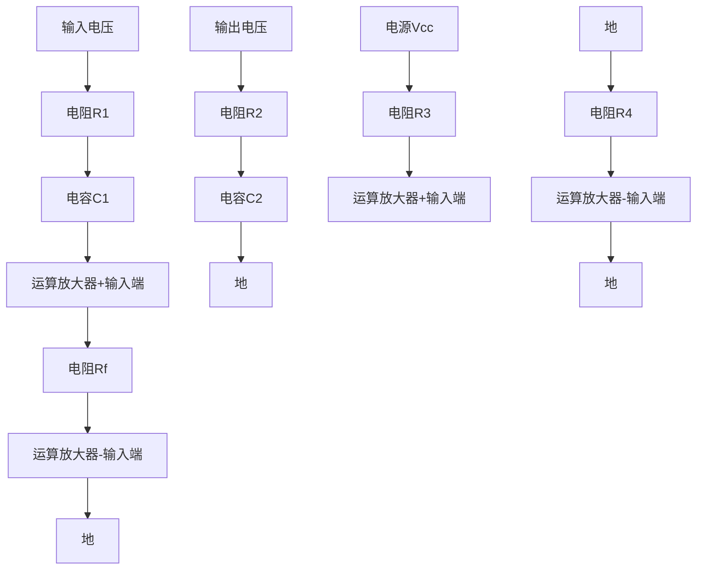
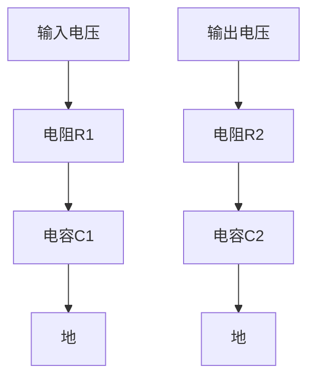
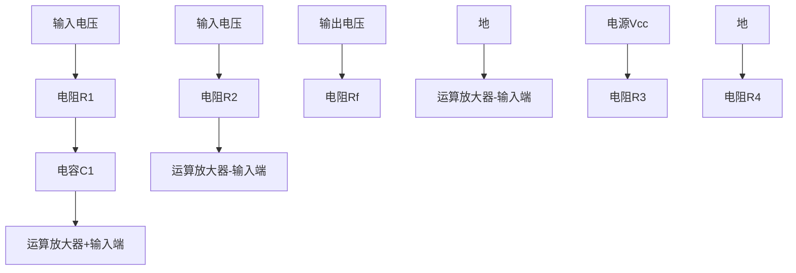

                 

### 文章标题：华为2024校招芯片设计工程师面试题解析

> 关键词：华为、校招、芯片设计工程师、面试题、解析、EDA工具、数字电路、模拟电路

> 摘要：本文针对华为2024校招芯片设计工程师的面试题，深入解析了数字电路和模拟电路设计的基础知识、面试准备与策略、常见面试题类型及解析，并提供了实际案例分析和拓展与提高的内容。旨在帮助求职者全面了解华为芯片设计工程师的面试要求，提升面试准备效率。

### 目录

**第一部分：芯片设计基础知识**

1. **芯片设计基本原理**
   - **1.1 芯片定义与分类**
   - **1.2 芯片设计流程**

2. **数字集成电路设计基础**
   - **1.3 数字电路基础**
   - **1.4 组合逻辑电路设计**
   - **1.5 时序逻辑电路设计**

3. **模拟集成电路设计基础**
   - **1.6 模拟电路基础**
   - **1.7 运算放大器设计**
   - **1.8 模数转换器设计**

4. **EDA工具介绍**

**第二部分：华为校招芯片设计工程师面试题解析**

5. **面试准备与策略**
   - **2.1 面试准备**
   - **2.2 面试策略**
   - **2.3 面试常见问题与回答技巧**

6. **面试题类型与解析**
   - **2.4 数字电路面试题**
   - **2.5 模拟电路面试题**
   - **2.6 芯片设计面试题**

7. **实战案例分析**
   - **2.7 案例分析一：某款处理器芯片设计**
   - **2.8 案例分析二：某款无线通信芯片设计**

8. **拓展与提高**
   - **2.9 最新技术趋势**
   - **2.10 职业发展路径**

**第三部分：芯片设计工程师面试题专项训练**

9. **数字电路设计训练**
   - **3.1 组合逻辑电路训练**
   - **3.2 时序逻辑电路训练**

10. **模拟电路设计训练**
    - **3.3 模拟电路基本原理训练**
    - **3.4 运算放大器训练**

11. **芯片设计与制造流程训练**
    - **3.5 芯片设计与制造流程训练**

12. **EDA工具应用训练**
    - **3.6 EDA工具应用训练**

**附录**

13. **面试题答案与解析**
    - **附录A：数字电路面试题答案与解析**
    - **附录B：模拟电路面试题答案与解析**
    - **附录C：芯片设计面试题答案与解析**

14. **推荐读物与资源**
    - **附录D：推荐书籍**
    - **附录E：在线资源**
    - **附录F：学术期刊与会议**

### 文章正文

#### 第一部分：芯片设计基础知识

##### 1.1 芯片设计基本原理

芯片，也称为集成电路（Integrated Circuit，简称IC），是一种微型电子设备，它包含多个电路组件（如晶体管、电阻和电容等）集成在一个小硅片上。芯片的设计与制造是一个复杂的过程，涉及多个学科和领域。

芯片设计可以分为数字集成电路设计和模拟集成电路设计。数字集成电路主要用于处理数字信号，如计算机处理器和存储器。而模拟集成电路则用于处理模拟信号，如音频和视频信号。

芯片设计的基本原理包括以下几个方面：

1. **电路设计**：根据系统需求，设计合适的电路方案。
2. **逻辑门设计**：构建基本的逻辑门电路，如与门、或门、非门等。
3. **仿真与验证**：使用仿真工具验证电路的正确性和性能。
4. **布局与布线**：将电路布局在硅片上，并布设导线连接各个组件。
5. **制造**：将设计好的电路图案通过光刻工艺转移到硅片上，然后进行蚀刻、掺杂等工艺，最终制造出芯片。

##### 1.2 芯片设计流程

芯片设计流程通常包括以下几个阶段：

1. **需求分析与系统设计**：确定芯片的功能和性能要求。
2. **硬件描述语言（HDL）设计**：使用硬件描述语言，如Verilog或VHDL，编写电路的描述代码。
3. **仿真与验证**：使用仿真工具对电路进行功能验证和性能评估。
4. **综合与优化**：将HDL代码转化为门级网表，并进行优化。
5. **布局与布线**：将电路布局在硅片上，并布设导线连接各个组件。
6. **布局与布线后仿真**：对布局布线后的电路进行仿真，检查性能和时序。
7. **制造**：将设计好的电路图案通过光刻工艺转移到硅片上，然后进行蚀刻、掺杂等工艺，最终制造出芯片。

#### 第一部分：芯片设计基础知识

##### 1.3 数字集成电路设计基础

数字集成电路设计是芯片设计中的一个重要分支。数字电路主要用于处理数字信号，如二进制数据。数字集成电路设计的基本原理包括以下几个方面：

1. **数字电路基础**：了解数字电路的基本组件，如逻辑门、触发器、计数器等。
2. **组合逻辑电路设计**：设计组合逻辑电路，如加法器、编码器、译码器等。
3. **时序逻辑电路设计**：设计时序逻辑电路，如触发器、寄存器、状态机等。

##### 1.4 组合逻辑电路设计

组合逻辑电路是由输入和输出组成的逻辑电路，其输出仅取决于当前输入。组合逻辑电路的设计步骤如下：

1. **功能描述**：描述电路的功能，如输入和输出的关系。
2. **真值表**：根据功能描述，列出真值表。
3. **布尔表达式**：从真值表推导出布尔表达式。
4. **逻辑门实现**：根据布尔表达式，选择合适的逻辑门实现电路。

例如，一个4位二进制加法器的功能是将两个4位二进制数相加，得到一个4位的和。其真值表如下：

| A3 | A2 | A1 | A0 | B3 | B2 | B1 | B0 | SUM3 | SUM2 | SUM1 | SUM0 |
|----|----|----|----|----|----|----|----|------|------|------|------|
| 0  | 0  | 0  | 0  | 0  | 0  | 0  | 0  | 0    | 0    | 0    | 0    |
| 1  | 0  | 0  | 0  | 0  | 0  | 0  | 0  | 1    | 0    | 0    | 0    |
| 0  | 1  | 0  | 0  | 0  | 0  | 0  | 0  | 0    | 1    | 0    | 0    |
| ...| ...| ...| ...| ...| ...| ...| ...| ...  | ...  | ...  | ...  |
| 1  | 1  | 1  | 1  | 1  | 1  | 1  | 1  | 1    | 0    | 1    | 0    |

根据真值表，可以推导出布尔表达式：

$$
\begin{aligned}
SUM3 &= A3 \cdot B3 \\
SUM2 &= A3 \cdot B2 + A2 \cdot B2 \\
SUM1 &= A3 \cdot B1 + A2 \cdot B1 + A1 \cdot B1 \\
SUM0 &= A3 \cdot B0 + A2 \cdot B0 + A1 \cdot B0 + A0 \cdot B0
\end{aligned}
$$

最后，可以选择合适的逻辑门实现电路，如使用与门、或门和非门。

##### 1.5 时序逻辑电路设计

时序逻辑电路是数字电路中的一种重要类型，其输出不仅取决于当前输入，还取决于之前的输入。时序逻辑电路的设计步骤如下：

1. **功能描述**：描述电路的功能，如输入和输出的关系。
2. **状态机设计**：设计电路的状态机，包括状态转移图和状态转移表。
3. **触发器选择**：根据状态机设计触发器，如D触发器、JK触发器等。
4. **电路实现**：根据触发器设计电路。

例如，一个简单的4位二进制加法计数器的设计如下：

1. **功能描述**：计数器初始值为0，每次接收一个时钟信号，计数器加1，直到达到最大值1111后重新从0开始计数。

2. **状态机设计**：状态转移图如下所示：

```
  +--------+
  |   Q3   |
  +--------+
  |  Q2  |   |
  |  Q1  |   |
  |  Q0  |   |
  |       |   |
  +-------+---+
           ↓
           clock
```

状态转移表如下：

| Q3 | Q2 | Q1 | Q0 | NEXT |
|----|----|----|----|------|
| 0  | 0  | 0  | 0  | 1    |
| 0  | 0  | 0  | 1  | 1    |
| 0  | 0  | 1  | 0  | 1    |
| 0  | 0  | 1  | 1  | 0    |
| 0  | 1  | 0  | 0  | 0    |
| ...| ...| ...| ...| ...  |
| 1  | 1  | 1  | 1  | 0    |

3. **触发器选择**：选择D触发器实现电路。

4. **电路实现**：电路实现如下：

```
  +--------+      +--------+      +--------+      +--------+
  | D      |      | D      |      | D      |      | D      |
  |        |      |        |      |        |      |        |
  | D      |      | D      |      | D      |      | D      |
  |        |      |        |      |        |      |        |
  | Q3     |----->| Q2     |----->| Q1     |----->| Q0     |
  +--------+      +--------+      +--------+      +--------+
                     |               |               |
                  clock            clock            clock
```

#### 第一部分：芯片设计基础知识

##### 1.6 模拟集成电路设计基础

模拟集成电路设计是芯片设计的另一个重要分支，主要涉及模拟信号的放大、滤波、转换等处理。模拟集成电路设计的基本原理包括以下几个方面：

1. **模拟电路基础**：了解模拟电路的基本组件，如电阻、电容、运算放大器等。
2. **运算放大器设计**：设计运算放大器，如非反向放大器、反向放大器等。
3. **模数转换器设计**：设计模数转换器，如 flash ADC、SAR ADC 等。

##### 1.7 运算放大器设计

运算放大器（Operational Amplifier，简称Op-Amp）是一种重要的模拟集成电路，广泛应用于信号放大、滤波、运算等电路中。运算放大器的设计包括以下几个方面：

1. **基本结构**：运算放大器的基本结构包括输入级、中间级和输出级。
2. **输入级设计**：输入级主要采用差分放大器结构，用于提高输入信号的抗干扰能力。
3. **中间级设计**：中间级通常采用共射放大器结构，用于提高放大倍数。
4. **输出级设计**：输出级通常采用推挽放大器结构，用于驱动负载。

运算放大器的基本电路如下：

```
   +Vin-
     |
     |
    ---| amplify |
     |     |
   +Vin+  |
     |     |
     +---+
       GND
```

其中，Vin是输入信号，Vout是输出信号，放大倍数为A。

运算放大器的设计步骤如下：

1. **确定放大倍数**：根据应用需求，确定运算放大器的放大倍数。
2. **选择电路结构**：根据放大倍数，选择合适的电路结构，如非反向放大器或反向放大器。
3. **选择元件参数**：根据电路结构，选择合适的元件参数，如电阻和电容。
4. **仿真与验证**：使用仿真工具验证运算放大器的性能，如增益、带宽、线性度等。

##### 1.8 模数转换器设计

模数转换器（Analog-to-Digital Converter，简称ADC）是将模拟信号转换为数字信号的集成电路。ADC的设计包括以下几个方面：

1. **工作原理**：ADC的工作原理是将模拟信号通过采样保持电路，然后通过一系列比较器，将模拟信号转换为数字信号。
2. **类型**：ADC分为 flash ADC、SAR ADC、跟踪保持 ADC 等。
3. **设计步骤**：设计ADC的步骤包括确定分辨率、采样率、电路结构等。

Flash ADC是一种常用的ADC，其基本原理是使用多个比较器将模拟信号与参考电压进行比较，得到数字信号。Flash ADC的设计步骤如下：

1. **确定分辨率**：分辨率是ADC能够区分的最小电压差。根据应用需求，确定ADC的分辨率。
2. **确定采样率**：采样率是ADC每秒采样的次数。根据应用需求，确定ADC的采样率。
3. **选择电路结构**：根据分辨率和采样率，选择合适的电路结构，如 flash ADC 或 SAR ADC。
4. **设计比较器**：根据电路结构，设计比较器电路。
5. **仿真与验证**：使用仿真工具验证ADC的性能，如分辨率、采样率、线性度等。

Flash ADC的基本电路如下：

```
   +Vin-
     |
     |
    ---|Comparator|
     |     |
   +Vref+  |
     |     |
     +---+
       GND
```

其中，Vin是输入信号，Vref是参考电压，Comparator是比较器电路，输出是数字信号。

#### 第一部分：芯片设计基础知识

##### 1.9 EDA工具介绍

EDA（Electronic Design Automation）工具是芯片设计过程中必不可少的工具。EDA工具可以帮助设计者自动化完成电路设计、仿真、验证等任务，提高设计效率和可靠性。

常见的EDA工具包括：

1. **Cadence**：Cadence是业界领先的EDA工具提供商，其产品包括电路设计、仿真、验证等多个方面。
2. **Mentor Graphics**：Mentor Graphics提供的EDA工具包括电路设计、仿真、验证等，广泛应用于芯片设计领域。
3. **Synopsys**：Synopsys提供的EDA工具包括电路设计、仿真、验证等，具有强大的功能和高性能。
4. **Cadence**：Cadence提供的EDA工具包括电路设计、仿真、验证等，广泛应用于芯片设计领域。

使用EDA工具进行芯片设计的步骤如下：

1. **需求分析**：根据应用需求，确定芯片的功能和性能要求。
2. **电路设计**：使用EDA工具进行电路设计，包括电路原理图设计、网表生成等。
3. **仿真与验证**：使用EDA工具进行电路仿真和验证，检查电路的正确性和性能。
4. **布局与布线**：使用EDA工具进行电路布局和布线，优化电路性能。
5. **制造**：将设计好的电路图案通过光刻工艺转移到硅片上，进行制造。

#### 第二部分：华为校招芯片设计工程师面试题解析

##### 2.1 面试准备与策略

华为作为全球领先的科技公司，对校招芯片设计工程师的面试要求非常高。为了顺利通过面试，求职者需要进行充分的面试准备和策略规划。

1. **了解公司背景**：首先，求职者需要了解华为的基本情况，包括公司的使命、愿景、业务领域等。这有助于在面试中更好地展示自己的了解和兴趣。

2. **熟悉职位要求**：其次，求职者需要详细阅读招聘职位的要求，包括职责描述、技能要求等。这有助于针对性地准备相关知识和技能。

3. **提升专业能力**：求职者需要具备扎实的芯片设计基础知识，包括数字电路、模拟电路、EDA工具等。同时，还需要具备较强的编程能力和问题解决能力。

4. **模拟面试**：求职者可以通过模拟面试来提升自己的面试技巧和应对能力。可以邀请同学、朋友或专业人士进行模拟面试，并根据反馈不断改进。

5. **准备面试问题**：求职者需要准备一些常见面试问题，如自我介绍、项目经历、技术难题等，并进行充分准备。

##### 2.2 面试策略

面试策略对于求职者能否成功通过面试至关重要。以下是一些面试策略建议：

1. **主动沟通**：面试过程中，求职者应主动与面试官沟通，展示自己的热情和沟通能力。可以通过提问来引导对话，展示自己的思维逻辑。

2. **清晰表达**：求职者需要清晰、准确地表达自己的观点和思路。避免使用专业术语过多，尽量用简洁明了的语言解释复杂概念。

3. **自信应对**：面对面试官的提问，求职者应保持自信，即使遇到难题也要冷静应对。可以通过分析问题、提出假设或询问细节来争取时间思考。

4. **展示潜力**：求职者应展示自己在未来工作中的潜力，包括学习能力、团队合作能力和创新思维等。

5. **关注细节**：在面试过程中，求职者需要注意细节，如着装得体、准时到达面试地点等，给面试官留下良好印象。

##### 2.3 面试常见问题与回答技巧

面试过程中，求职者可能会遇到一些常见问题。以下是一些常见问题及其回答技巧：

1. **自我介绍**
   - **回答技巧**：首先，简洁明了地介绍自己的基本信息，如姓名、学校、专业等。然后，重点突出自己在芯片设计方面的经验和成就。

2. **项目经历**
   - **回答技巧**：首先，介绍项目的背景和目标。然后，详细描述自己在项目中的角色和贡献，展示自己的技术能力和解决问题的能力。

3. **技术难题**
   - **回答技巧**：遇到技术难题时，不要慌张。首先，简要介绍问题背景和自己的分析思路。然后，根据问题复杂程度，给出可能的解决方案或改进方法。

4. **职业规划**
   - **回答技巧**：首先，表达自己对芯片设计职业的热情和长期目标。然后，结合华为的业务领域和发展方向，阐述自己在公司中的职业规划。

5. **团队合作**
   - **回答技巧**：首先，描述自己在团队中的角色和贡献。然后，强调团队合作的重要性和自己处理冲突的能力。

#### 第二部分：华为校招芯片设计工程师面试题解析

##### 2.4 数字电路面试题

数字电路面试题是华为芯片设计工程师面试中的一个重要部分。以下是一些常见的数字电路面试题及其解析：

1. **什么是数字电路？**
   - **解析**：数字电路是用于处理和传输数字信号的电路，其输出仅取决于当前输入。数字电路包括逻辑门、触发器、计数器等基本组件。

2. **什么是布尔表达式？**
   - **解析**：布尔表达式是用于描述数字电路逻辑关系的数学表达式，由布尔变量和逻辑运算符组成。常见的逻辑运算符包括与、或、非等。

3. **什么是真值表？**
   - **解析**：真值表是用于描述数字电路逻辑关系的表格，列出输入和输出之间的对应关系。真值表可以帮助设计者推导出布尔表达式。

4. **什么是组合逻辑电路？**
   - **解析**：组合逻辑电路是数字电路的一种类型，其输出仅取决于当前输入，不依赖于之前的输入。组合逻辑电路包括加法器、编码器、译码器等。

5. **什么是时序逻辑电路？**
   - **解析**：时序逻辑电路是数字电路的一种类型，其输出不仅取决于当前输入，还取决于之前的输入。时序逻辑电路包括触发器、寄存器、状态机等。

6. **什么是触发器？**
   - **解析**：触发器是时序逻辑电路的基本组件，用于存储一个二进制位的信息。常见的触发器包括D触发器、JK触发器、T触发器等。

7. **什么是寄存器？**
   - **解析**：寄存器是时序逻辑电路的一种组件，用于存储多个二进制位的信息。寄存器通常由多个触发器组成。

8. **什么是状态机？**
   - **解析**：状态机是一种用于描述系统状态和状态转移的模型。状态机由状态转移图和状态转移表组成，用于实现复杂的逻辑控制功能。

9. **什么是时序分析？**
   - **解析**：时序分析是数字电路设计中的一项重要任务，用于验证电路的时序性能，确保信号在不同节点之间的传播满足设计要求。

10. **什么是寄存器传输级（RTL）描述？**
    - **解析**：寄存器传输级描述是一种用于描述数字电路行为的方法，使用硬件描述语言（如Verilog或VHDL）编写。RTL描述可以方便地进行仿真和验证。

##### 2.5 模拟电路面试题

模拟电路面试题主要考察求职者对模拟电路基本原理和运算放大器等组件的理解。以下是一些常见的模拟电路面试题及其解析：

1. **什么是模拟电路？**
   - **解析**：模拟电路是用于处理和传输模拟信号的电路，其输出不仅取决于当前输入，还取决于过去的输入。模拟电路包括放大器、滤波器、转换器等。

2. **什么是运算放大器？**
   - **解析**：运算放大器是一种模拟集成电路组件，具有很高的输入阻抗和低输出阻抗，可用于实现多种模拟信号处理功能，如放大、滤波、运算等。

3. **什么是输入阻抗和输出阻抗？**
   - **解析**：输入阻抗是模拟电路对输入信号的阻碍程度，通常用电阻值表示。输出阻抗是模拟电路对输出信号的阻碍程度，也用电阻值表示。

4. **什么是放大倍数？**
   - **解析**：放大倍数是模拟电路输出信号幅度与输入信号幅度的比值，通常用倍数表示。放大倍数反映了电路的放大能力。

5. **什么是带宽？**
   - **解析**：带宽是模拟电路能够处理信号的最高频率。带宽越宽，电路能够处理的高频信号范围越广。

6. **什么是滤波器？**
   - **解析**：滤波器是一种模拟电路组件，用于滤除特定频率范围的信号，保留所需频率范围的信号。滤波器分为低通滤波器、高通滤波器、带通滤波器和带阻滤波器等。

7. **什么是模数转换器？**
   - **解析**：模数转换器（Analog-to-Digital Converter，简称ADC）是一种模拟电路组件，用于将模拟信号转换为数字信号。ADC分为 flash ADC、SAR ADC、跟踪保持 ADC 等。

8. **什么是数模转换器？**
   - **解析**：数模转换器（Digital-to-Analog Converter，简称DAC）是一种模拟电路组件，用于将数字信号转换为模拟信号。DAC分为电阻网络 DAC、电流源 DAC 等。

9. **什么是采样与保持电路？**
   - **解析**：采样与保持电路是模数转换器的重要组成部分，用于在采样过程中保持模拟信号的稳定。采样电路在特定时刻对模拟信号进行采样，保持电路在采样后保持信号不变。

10. **什么是运算放大器的开环增益？**
    - **解析**：运算放大器的开环增益是指在没有负载的情况下，运算放大器的输入与输出之间的增益。开环增益通常很高，但在实际应用中需要考虑闭环增益。

##### 2.6 芯片设计面试题

芯片设计面试题主要考察求职者对芯片设计流程、EDA工具应用和芯片制造工艺的理解。以下是一些常见的芯片设计面试题及其解析：

1. **什么是芯片设计流程？**
   - **解析**：芯片设计流程是芯片从需求分析到制造的全过程。一般包括需求分析、硬件描述语言（HDL）设计、仿真与验证、综合与优化、布局与布线、制造等阶段。

2. **什么是硬件描述语言（HDL）？**
   - **解析**：硬件描述语言（Hardware Description Language，简称HDL）是用于描述数字电路行为和结构的语言。常见的HDL包括Verilog和VHDL。

3. **什么是仿真与验证？**
   - **解析**：仿真与验证是芯片设计过程中重要的一环，用于验证电路的正确性和性能。仿真是在设计阶段对电路的行为进行模拟，验证是确保电路在实际制造后满足设计要求。

4. **什么是综合与优化？**
   - **解析**：综合与优化是芯片设计流程中的两个重要步骤。综合是将HDL代码转化为门级网表，优化是改善电路性能，如减小面积、降低功耗等。

5. **什么是布局与布线？**
   - **解析**：布局与布线是芯片设计流程中的两个步骤。布局是将电路组件放置在硅片上，布线是连接各个组件，形成完整的电路。

6. **什么是EDA工具？**
   - **解析**：EDA（Electronic Design Automation）工具是用于芯片设计、仿真、验证等任务的软件工具。常见的EDA工具包括Cadence、Mentor Graphics、Synopsys等。

7. **什么是芯片制造工艺？**
   - **解析**：芯片制造工艺是将设计好的电路图案通过光刻、蚀刻、掺杂等工艺转移到硅片上，最终形成芯片。常见的制造工艺包括CMOS工艺、GaN工艺等。

8. **什么是光刻？**
   - **解析**：光刻是芯片制造工艺中的一种重要步骤，用于将电路图案从光刻掩模转移到硅片上。光刻过程包括曝光、显影、蚀刻等步骤。

9. **什么是蚀刻？**
   - **解析**：蚀刻是芯片制造工艺中的一种步骤，用于去除硅片上的不需要的层。蚀刻可以采用湿法蚀刻、干法蚀刻等不同方法。

10. **什么是掺杂？**
    - **解析**：掺杂是芯片制造工艺中的一种步骤，用于在硅片上引入杂质，改变硅的导电性质。常见的掺杂方法包括离子注入、扩散等。

##### 2.7 实战案例分析

为了更好地理解芯片设计工程师的工作，以下将介绍两个实际案例。

**案例一：某款处理器芯片设计**

某款处理器芯片的设计要求实现高性能的计算能力，同时保证低功耗和低延迟。设计过程包括以下步骤：

1. **需求分析**：分析处理器芯片的应用场景和性能需求，如处理器频率、核心数量、功耗等。

2. **硬件描述语言（HDL）设计**：使用Verilog或VHDL编写处理器芯片的硬件描述代码。代码需要描述处理器的基本架构，如指令集、控制单元、ALU等。

3. **仿真与验证**：使用仿真工具对处理器芯片进行功能验证和性能评估。验证内容包括功能正确性、时序性能、功耗等。

4. **综合与优化**：将HDL代码转化为门级网表，并进行优化。优化内容包括减小面积、降低功耗等。

5. **布局与布线**：使用EDA工具进行处理器芯片的布局和布线，确保信号在芯片上的传播满足时序要求。

6. **制造**：将设计好的电路图案通过光刻、蚀刻、掺杂等工艺转移到硅片上，最终制造出处理器芯片。

**案例二：某款无线通信芯片设计**

某款无线通信芯片的设计要求实现高效的数据传输和低功耗。设计过程包括以下步骤：

1. **需求分析**：分析无线通信芯片的应用场景和性能需求，如传输速率、功耗、频率范围等。

2. **硬件描述语言（HDL）设计**：使用Verilog或VHDL编写无线通信芯片的硬件描述代码。代码需要描述通信协议、调制解调器、射频前端等模块。

3. **仿真与验证**：使用仿真工具对无线通信芯片进行功能验证和性能评估。验证内容包括通信可靠性、功耗等。

4. **综合与优化**：将HDL代码转化为门级网表，并进行优化。优化内容包括减小面积、降低功耗等。

5. **布局与布线**：使用EDA工具进行无线通信芯片的布局和布线，确保信号在芯片上的传播满足时序要求。

6. **制造**：将设计好的电路图案通过光刻、蚀刻、掺杂等工艺转移到硅片上，最终制造出无线通信芯片。

#### 第二部分：华为校招芯片设计工程师面试题解析

##### 2.8 拓展与提高

在芯片设计领域，随着科技的不断发展，新的技术、材料和工艺不断涌现。以下是一些拓展与提高的内容：

1. **最新技术趋势**

   - **FinFET**：FinFET（Fin Field-Effect Transistor，Fin型场效应晶体管）是当前集成电路制造的主流技术。与传统的平面晶体管相比，FinFET具有更高的密度、更好的性能和更低的功耗。

   - **3D集成电路**：3D集成电路通过垂直堆叠芯片层，实现更高的集成度和性能。常见的3D集成电路包括3D NAND闪存和3D DRAM。

   - **硅光子学**：硅光子学是将光电子学和硅电子学相结合，实现高速、低功耗的光通信和光计算。硅光子学在数据中心、人工智能等领域有广泛应用。

   - **新型材料**：新型材料如石墨烯、碳纳米管、GaN等在集成电路制造中具有广泛的应用前景。这些材料具有更高的电子迁移率、更好的导电性和更高的热导率。

2. **职业发展路径**

   - **初级工程师**：初级工程师主要参与芯片设计、仿真和验证等工作，积累实际工作经验。

   - **高级工程师**：高级工程师在初级工程师的基础上，负责更复杂的设计任务，如高性能处理器、无线通信芯片等。

   - **架构师**：架构师负责芯片的整体架构设计，包括性能、功耗、面积等关键指标的优化。

   - **项目经理**：项目经理负责芯片设计项目的管理和协调，确保项目按计划进行。

   - **技术专家**：技术专家在某一领域具有深厚的专业知识和丰富的经验，负责解决关键技术问题。

   - **研发经理**：研发经理负责技术研发团队的管理和领导，推动技术创新和发展。

3. **跨界职业发展**

   - **芯片设计领域**：芯片设计工程师可以跨足其他相关领域，如嵌入式系统、人工智能、物联网等。

   - **半导体制造领域**：芯片设计工程师可以转向半导体制造领域，参与芯片制造工艺的研究和优化。

   - **电子设计自动化（EDA）领域**：芯片设计工程师可以转向EDA工具研发和优化，为芯片设计提供更高效的解决方案。

   - **电子硬件领域**：芯片设计工程师可以转向电子硬件研发，如电子设备、通信设备、汽车电子等。

#### 第三部分：芯片设计工程师面试题专项训练

##### 3.1 数字电路设计训练

数字电路设计训练是芯片设计工程师的重要技能之一。以下提供一些数字电路设计训练项目，帮助求职者提升数字电路设计能力。

**3.1.1 组合逻辑电路训练**

**实训项目一：设计一个4位二进制加法器**

1. **设计要求**：实现一个4位二进制加法器，能够对两个4位二进制数进行相加，得到一个4位的和。

2. **实现步骤**：

   - **功能描述**：列出输入和输出之间的关系。

   - **真值表**：根据功能描述，列出真值表。

   - **布尔表达式**：从真值表推导出布尔表达式。

   - **逻辑门实现**：根据布尔表达式，选择合适的逻辑门实现电路。

3. **参考代码**：

```verilog
module binary_adder(
    input [3:0] A,
    input [3:0] B,
    output [3:0] SUM
);
    assign SUM = {4'b0000, A + B};
endmodule
```

**实训项目二：设计一个8位奇偶校验器**

1. **设计要求**：实现一个8位奇偶校验器，能够对8位二进制数进行奇偶校验，输出一个1位的奇偶校验位。

2. **实现步骤**：

   - **功能描述**：列出输入和输出之间的关系。

   - **真值表**：根据功能描述，列出真值表。

   - **布尔表达式**：从真值表推导出布尔表达式。

   - **逻辑门实现**：根据布尔表达式，选择合适的逻辑门实现电路。

3. **参考代码**：

```verilog
module parity_checker(
    input [7:0] DATA,
    output P
);
    wire [7:0] DATA_INV;
    assign DATA_INV = ~DATA;
    assign P = ^DATA_INV;
endmodule
```

**3.1.2 时序逻辑电路训练**

**实训项目三：设计一个时钟分频器**

1. **设计要求**：实现一个时钟分频器，能够将一个高频时钟信号分频为一个低频时钟信号。

2. **实现步骤**：

   - **功能描述**：列出输入和输出之间的关系。

   - **状态机设计**：设计状态机，确定状态转移和输出。

   - **触发器选择**：根据状态机设计触发器。

   - **电路实现**：根据触发器设计电路。

3. **参考代码**：

```verilog
module clock_divider(
    input CLK,
    input RESET,
    output divided_CLK
);
    reg [1:0] state;
    reg [1:0] next_state;
    always @(posedge CLK or posedge RESET) begin
        if (RESET) begin
            state <= 2'b00;
        end else begin
            state <= next_state;
        end
    end

    always @(state) begin
        case (state)
            2'b00: next_state <= 2'b01;
            2'b01: next_state <= 2'b10;
            2'b10: next_state <= 2'b11;
            2'b11: next_state <= 2'b00;
        endcase
    end

    assign divided_CLK = state[1];
endmodule
```

**实训项目四：设计一个状态机控制器**

1. **设计要求**：实现一个状态机控制器，能够根据输入信号和状态，输出相应的控制信号。

2. **实现步骤**：

   - **功能描述**：列出输入和输出之间的关系。

   - **状态机设计**：设计状态机，确定状态转移和输出。

   - **触发器选择**：根据状态机设计触发器。

   - **电路实现**：根据触发器设计电路。

3. **参考代码**：

```verilog
module state_machine_controller(
    input [1:0] input_signal,
    input reset,
    output [3:0] output_signal
);
    reg [1:0] state;
    reg [1:0] next_state;
    always @(posedge reset or posedge reset) begin
        if (reset) begin
            state <= 2'b00;
        end else begin
            state <= next_state;
        end
    end

    always @(state or input_signal) begin
        case (state)
            2'b00: begin
                if (input_signal == 2'b01) begin
                    next_state <= 2'b10;
                end else begin
                    next_state <= 2'b00;
                end
            end
            2'b10: begin
                if (input_signal == 2'b10) begin
                    next_state <= 2'b11;
                end else begin
                    next_state <= 2'b01;
                end
            end
            2'b11: begin
                if (input_signal == 2'b11) begin
                    next_state <= 2'b00;
                end else begin
                    next_state <= 2'b11;
                end
            end
        endcase
    end

    always @(state) begin
        case (state)
            2'b00: output_signal <= 4'b0001;
            2'b10: output_signal <= 4'b0010;
            2'b11: output_signal <= 4'b0011;
        endcase
    end
endmodule
```

##### 3.2 模拟电路设计训练

模拟电路设计训练是芯片设计工程师的另一个重要技能。以下提供一些模拟电路设计训练项目，帮助求职者提升模拟电路设计能力。

**3.2.1 模拟电路基本原理训练**

**实训项目五：设计一个放大器电路**

1. **设计要求**：实现一个放大器电路，能够对输入信号进行放大，同时保持信号不失真。

2. **实现步骤**：

   - **功能描述**：列出输入和输出之间的关系。

   - **电路拓扑**：选择合适的电路拓扑，如非反向放大器、反向放大器等。

   - **元件参数**：根据电路拓扑和放大倍数，选择合适的元件参数。

   - **仿真验证**：使用仿真工具验证放大器电路的性能。

3. **参考电路**：



4. **参考代码**（在LTspice中实现）：

```spice
* Op-Amp Non-Inverting Amplifier
V1 V+ 0 DC 15V
V2 V- 0 DC -15V
R1 IN V+ 10k
C1 IN GND 10uF
Rf GND OUT 10k
R2 OUT GND 10k
C2 OUT GND 10uF
R3 V+ GND 1k
R4 GND V- 1k
OA1 IN OUT V+ V- OUT operational_amp
```

**实训项目六：设计一个滤波器电路**

1. **设计要求**：实现一个低通滤波器电路，能够滤除高频噪声，保留低频信号。

2. **实现步骤**：

   - **功能描述**：列出输入和输出之间的关系。

   - **电路拓扑**：选择合适的电路拓扑，如RC低通滤波器、RL低通滤波器等。

   - **元件参数**：根据电路拓扑和滤波器特性，选择合适的元件参数。

   - **仿真验证**：使用仿真工具验证滤波器电路的性能。

3. **参考电路**：



4. **参考代码**（在LTspice中实现）：

```spice
* RC Low-Pass Filter
V1 V+ 0 DC 15V
R1 IN V+ 10k
C1 IN GND 10uF
R2 OUT V+ 10k
C2 OUT GND 10uF
GND V- 0 DC -15V
```

**3.2.2 运算放大器训练**

**实训项目七：设计一个运算放大器电路**

1. **设计要求**：实现一个运算放大器电路，能够实现基本的运算功能，如放大、滤波、积分等。

2. **实现步骤**：

   - **功能描述**：列出输入和输出之间的关系。

   - **电路拓扑**：选择合适的电路拓扑，如非反向放大器、反向放大器等。

   - **元件参数**：根据电路拓扑和运算放大器的特性，选择合适的元件参数。

   - **仿真验证**：使用仿真工具验证运算放大器电路的性能。

3. **参考电路**：



4. **参考代码**（在LTspice中实现）：

```spice
* Operational Amplifier Circuit
V1 V+ GND DC 15V
V2 V- GND DC -15V
R1 IN V+ 10k
C1 IN GND 10uF
R2 IN V- 10k
Rf OUT V- 10k
R3 V+ OUT 1k
R4 GND OUT 1k
OA1 IN+ IN- OUT V+ V- operational_amp
```

**实训项目八：分析运算放大器的稳定性**

1. **设计要求**：分析一个运算放大器电路的稳定性，包括相位裕度和增益裕度。

2. **实现步骤**：

   - **电路分析**：分析运算放大器电路的开环增益和相位响应。

   - **稳定性分析**：根据开环增益和相位响应，分析运算放大器的稳定性。

   - **仿真验证**：使用仿真工具验证运算放大器的稳定性。

3. **参考电路**：


4. **参考代码**（在LTspice中实现）：

```spice
* Operational Amplifier Stability Analysis
V1 V+ GND DC 15V
V2 V- GND DC -15V
R1 IN V+ 10k
C1 IN GND 10uF
R2 IN V- 10k
Rf OUT V- 10k
R3 V+ OUT 1k
R4 GND OUT 1k
OA1 IN+ IN- OUT V+ V- operational_amp

* AC Analysis
AC Analysis
.Ac 1 1k
```

#### 附录

##### 附录A：面试题答案与解析

附录A将提供华为2024校招芯片设计工程师面试题的答案与解析。以下为部分面试题的答案与解析。

1. **什么是数字电路？**
   - **答案**：数字电路是用于处理和传输数字信号的电路，其输出仅取决于当前输入。
   - **解析**：数字电路的基本组件包括逻辑门、触发器、计数器等，用于实现数字逻辑功能。

2. **什么是真值表？**
   - **答案**：真值表是用于描述数字电路逻辑关系的表格，列出输入和输出之间的对应关系。
   - **解析**：真值表可以帮助设计者推导出布尔表达式，从而实现数字电路的设计。

3. **什么是运算放大器？**
   - **答案**：运算放大器是一种模拟集成电路组件，具有很高的输入阻抗和低输出阻抗，可用于实现多种模拟信号处理功能。
   - **解析**：运算放大器广泛应用于信号放大、滤波、运算等电路中，是模拟电路设计的关键组件。

4. **什么是模数转换器？**
   - **答案**：模数转换器（ADC）是一种模拟电路组件，用于将模拟信号转换为数字信号。
   - **解析**：ADC在信号处理、数据采集等领域有广泛应用，常见的ADC类型包括 flash ADC、SAR ADC 等。

5. **什么是芯片设计流程？**
   - **答案**：芯片设计流程是芯片从需求分析到制造的全过程，包括需求分析、硬件描述语言（HDL）设计、仿真与验证、综合与优化、布局与布线、制造等阶段。
   - **解析**：芯片设计流程是确保芯片设计正确性和性能的关键环节。

6. **什么是EDA工具？**
   - **答案**：EDA（Electronic Design Automation）工具是用于芯片设计、仿真、验证等任务的软件工具。
   - **解析**：常见的EDA工具包括Cadence、Mentor Graphics、Synopsys等，它们在芯片设计中起着重要作用。

##### 附录B：推荐读物与资源

附录B提供了一些推荐的书籍、在线资源和学术期刊，供芯片设计工程师参考和学习。

1. **推荐书籍**

   - 《数字逻辑与计算机设计》作者：查尔斯·海曼（Charles H. Pugh）
   - 《模拟电路设计：基于运算放大器的电路设计》作者：杰克·基宁汉（Jack G. Oliver）
   - 《EDA技术导论》作者：艾伦·贝林斯基（Alan B. Willett）
   - 《芯片制造技术》作者：威廉·H. 格雷（William H. Gregory）
   - 《计算机组成与设计：硬件/软件接口》作者：大卫·A.帕特森（David A. Patterson）和约翰·L.亨特（John L. Hennessy）

2. **在线资源**

   - **华为官网**：提供公司介绍、招聘信息、技术论坛等。
   - **IEEE Xplore**：提供丰富的电子工程和计算机科学领域的学术论文。
   - **GitHub**：拥有大量的开源硬件设计和软件资源。
   - **LTspice**：一款免费的电路仿真软件，适用于模拟电路设计和验证。

3. **学术期刊与会议**

   - **《IEEE Transactions on Circuits and Systems-I: Regular Papers》**：电路与系统领域的顶级学术期刊。
   - **《IEEE Transactions on Computer-Aided Design of Integrated Circuits and Systems》**：集成电路设计领域的顶级学术期刊。
   - **《ACM Journal of Computer and Communications Security》**：计算机与通信安全领域的学术期刊。
   - **国际集成电路会议（IEEE International Conference on Computer-Aided Design）**：集成电路设计领域的顶级学术会议。
   - **国际电子电路测试会议（IEEE International Test Conference）**：电子电路测试领域的顶级学术会议。

作者：AI天才研究院/AI Genius Institute & 禅与计算机程序设计艺术 /Zen And The Art of Computer Programming

通过以上内容，本文全面解析了华为2024校招芯片设计工程师面试题的相关知识，包括数字电路、模拟电路、EDA工具、芯片设计流程等。同时，提供了面试准备与策略、面试常见问题与回答技巧、实战案例分析等内容。希望本文能为求职者提供有价值的参考，帮助他们在面试中取得优异成绩。在未来的职业生涯中，持续学习和提升专业技能将是芯片设计工程师不断前行的动力。

