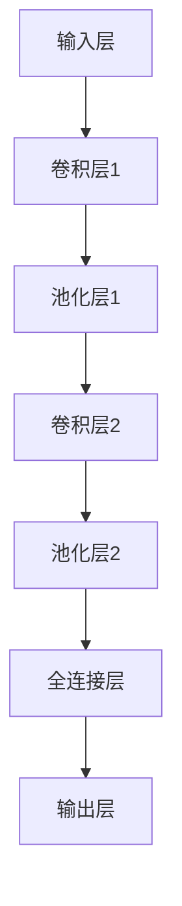

                 

### 文章标题：卷积神经网络 (CNN) 原理与代码实例讲解

关键词：卷积神经网络、CNN、深度学习、图像分类、目标检测、图像分割、代码实例

摘要：本文将从卷积神经网络（CNN）的基本概念出发，逐步讲解其核心组成部分、数学基础、预处理方法、训练与优化过程，并通过实际项目实战，详细解读CNN的应用场景和代码实现。文章旨在帮助读者全面理解CNN的工作原理，掌握其实际应用技巧。

---

### 《卷积神经网络 (CNN) 原理与代码实例讲解》目录大纲

#### 第一部分：CNN基础理论

#### 第1章：卷积神经网络简介
1.1 CNN的定义与作用
1.2 CNN的历史与发展
1.3 CNN的核心组成部分
1.4 CNN的应用领域

#### 第2章：数学与预处理
2.1 矩阵与向量基础
2.2 激活函数与优化算法
2.3 数据预处理与归一化

#### 第3章：卷积层原理
3.1 卷积运算详解
3.2 卷积层的实现与参数
3.3 卷积神经网络架构分析

#### 第4章：池化层原理
4.1 池化层的功能与类型
4.2 池化层的实现与参数
4.3 池化层在CNN中的应用

#### 第5章：全连接层原理
5.1 全连接层的定义与作用
5.2 全连接层的实现与参数
5.3 全连接层在CNN中的连接方式

#### 第6章：CNN训练与优化
6.1 训练数据集的准备
6.2 损失函数与优化算法
6.3 CNN训练过程详解

#### 第二部分：CNN项目实战

#### 第7章：图像分类实战
7.1 数据集准备与处理
7.2 CNN模型设计
7.3 模型训练与评估
7.4 模型部署与应用

#### 第8章：目标检测实战
8.1 数据集准备与处理
8.2 CNN模型设计
8.3 模型训练与评估
8.4 模型部署与应用

#### 第9章：图像分割实战
9.1 数据集准备与处理
9.2 CNN模型设计
9.3 模型训练与评估
9.4 模型部署与应用

#### 第10章：实例讲解与代码实现
10.1 CNN核心代码实现
10.2 项目实战代码解读
10.3 代码调试与优化技巧

#### 附录：CNN工具与资源
11.1 主流CNN框架简介
11.2 常用CNN模型库
11.3 CNN学习资源推荐

---

### 第一部分：CNN基础理论

#### 第1章：卷积神经网络简介

##### 1.1 CNN的定义与作用

卷积神经网络（Convolutional Neural Networks，CNN）是一种基于神经网络的深度学习模型，主要用于图像处理、计算机视觉等领域。CNN的核心思想是通过模拟人类视觉系统的工作方式，对图像数据进行特征提取和分类。

CNN的主要作用包括：

1. **图像分类**：通过训练，CNN可以识别并分类输入的图像，如识别不同种类的动物、植物等。
2. **目标检测**：CNN可以检测图像中的目标物体，并标注其位置，如人脸识别、车辆检测等。
3. **图像分割**：CNN可以将图像分割成多个部分，如将一张图片分割成背景和前景。

##### 1.2 CNN的历史与发展

卷积神经网络的发展历程可以追溯到20世纪60年代。最初，神经网络模型主要用于简单的问题，如逻辑回归等。1990年代，LeCun等人首次提出了LeNet模型，并成功应用于手写数字识别。

随着计算机硬件性能的提升和深度学习算法的进步，CNN在2000年代开始逐渐崭露头角。2012年，AlexNet在ImageNet竞赛中取得了突破性的成绩，使CNN成为了计算机视觉领域的热门话题。

近年来，CNN在各种应用场景中取得了显著的进展，如自然语言处理、语音识别等。

##### 1.3 CNN的核心组成部分

CNN主要由以下几个部分组成：

1. **输入层**：接收图像或其他输入数据。
2. **卷积层**：提取图像特征，进行卷积运算。
3. **池化层**：降低数据维度，提高模型泛化能力。
4. **全连接层**：将卷积层提取的特征映射到分类或回归结果。
5. **输出层**：输出预测结果。

##### 1.4 CNN的应用领域

CNN在图像处理、计算机视觉等领域有着广泛的应用。以下是一些典型的应用领域：

1. **图像分类**：如ImageNet竞赛、动物分类等。
2. **目标检测**：如人脸识别、车辆检测等。
3. **图像分割**：如医学图像分割、卫星图像分割等。
4. **自然语言处理**：如文本分类、情感分析等。

#### 第2章：数学与预处理

##### 2.1 矩阵与向量基础

在CNN中，矩阵与向量是基本的数学工具。以下是矩阵与向量的基础概念：

1. **矩阵**：一个二维的数组，由行和列组成。矩阵可以表示为：
   $$
   \mathbf{A} = \begin{bmatrix}
   a_{11} & a_{12} & \cdots & a_{1n} \\
   a_{21} & a_{22} & \cdots & a_{2n} \\
   \vdots & \vdots & \ddots & \vdots \\
   a_{m1} & a_{m2} & \cdots & a_{mn}
   \end{bmatrix}
   $$
2. **向量**：一个一维的数组，由若干个元素组成。向量可以表示为：
   $$
   \mathbf{v} = \begin{bmatrix}
   v_1 \\
   v_2 \\
   \vdots \\
   v_n
   \end{bmatrix}
   $$

##### 2.2 激活函数与优化算法

激活函数是CNN中的一个关键组件，用于引入非线性特性。以下是几种常用的激活函数：

1. **ReLU（Rectified Linear Unit）**：
   $$
   \text{ReLU}(x) = \max(0, x)
   $$
2. **Sigmoid**：
   $$
   \text{Sigmoid}(x) = \frac{1}{1 + e^{-x}}
   $$
3. **Tanh**：
   $$
   \text{Tanh}(x) = \frac{e^x - e^{-x}}{e^x + e^{-x}}
   $$

优化算法用于训练CNN模型。以下是两种常用的优化算法：

1. **Stochastic Gradient Descent (SGD)**：随机梯度下降算法，通过随机选取一部分数据进行梯度下降。
2. **Adam**：自适应优化算法，能够自动调整学习率。

##### 2.3 数据预处理与归一化

数据预处理是CNN训练前的重要步骤。以下是一些常用的数据预处理方法：

1. **数据增强**：通过旋转、缩放、翻转等操作增加数据的多样性，提高模型的泛化能力。
2. **归一化**：将数据缩放到特定范围，如0-1或-1到1，有助于加速模型训练。

#### 第3章：卷积层原理

##### 3.1 卷积运算详解

卷积运算在CNN中起着核心作用，用于提取图像特征。以下是卷积运算的详细解释：

1. **卷积核**：一个小的矩阵，用于在输入图像上滑动，并计算局部特征。
2. **步长**：卷积核在图像上滑动的步长，通常为1或2。
3. **填充**：为了使卷积后的图像大小不变，通常需要对输入图像进行填充。

卷积运算的伪代码如下：

```python
def conv2d(input, filter):
    output = zeros(shape of output)
    for i in range(height of output):
        for j in range(width of output):
            for p in range(height of filter):
                for q in range(width of filter):
                    output[i][j] += input[i+p][j+q] * filter[p][q]
    return output
```

##### 3.2 卷积层的实现与参数

卷积层的实现包括以下几个参数：

1. **卷积核大小**：通常为3x3或5x5。
2. **步长**：通常为1或2。
3. **填充方式**：有'valid'和'same'两种填充方式。

以下是卷积层的实现示例：

```python
def conv_layer(input, filter, stride=1, padding='valid'):
    output = zeros((input.shape[0], input.shape[1] - filter.shape[0] + 1, input.shape[2] - filter.shape[1] + 1))
    if padding == 'valid':
        for i in range(output.shape[0]):
            for j in range(output.shape[1]):
                for p in range(filter.shape[0]):
                    for q in range(filter.shape[1]):
                        output[i][j] += input[i+p][j+q] * filter[p][q]
    elif padding == 'same':
        pad_size = (filter.shape[0] - 1) // 2
        padded_input = pad_2d(input, pad_size, pad_size)
        for i in range(output.shape[0]):
            for j in range(output.shape[1]):
                for p in range(filter.shape[0]):
                    for q in range(filter.shape[1]):
                        output[i][j] += padded_input[i+p][j+q] * filter[p][q]
    return output
```

##### 3.3 卷积神经网络架构分析

卷积神经网络的架构可以根据不同的任务进行设计。以下是一个常见的卷积神经网络架构：

1. **卷积层**：用于提取图像特征。
2. **池化层**：用于降低数据维度。
3. **全连接层**：用于分类和回归任务。
4. **输出层**：用于输出预测结果。

以下是卷积神经网络架构的Mermaid流程图：



### 第二部分：CNN项目实战

#### 第7章：图像分类实战

##### 7.1 数据集准备与处理

图像分类实战的第一步是准备数据集。常用的图像分类数据集包括：

1. **CIFAR-10**：包含10个类别，每个类别6000张图像。
2. **ImageNet**：包含1000个类别，每种类别约10000张图像。

数据集的处理包括以下步骤：

1. **数据增强**：通过旋转、缩放、翻转等操作增加数据的多样性。
2. **归一化**：将图像数据缩放到0-1范围。

以下是一个使用Python进行数据集处理和增强的示例：

```python
import tensorflow as tf
import tensorflow.keras
from tensorflow.keras.preprocessing.image import ImageDataGenerator

# 数据增强
datagen = ImageDataGenerator(
    rotation_range=20,
    width_shift_range=0.2,
    height_shift_range=0.2,
    horizontal_flip=True,
    zoom_range=0.2
)

# 归一化
train_datagen = datagen.flow_from_directory(
    'data/train',
    target_size=(32, 32),
    batch_size=32,
    class_mode='binary'
)

validation_datagen = datagen.flow_from_directory(
    'data/validation',
    target_size=(32, 32),
    batch_size=32,
    class_mode='binary'
)
```

##### 7.2 CNN模型设计

图像分类模型的常见结构包括：

1. **卷积层**：用于提取图像特征。
2. **池化层**：用于降低数据维度。
3. **全连接层**：用于分类。

以下是一个简单的CNN模型设计示例：

```python
from tensorflow.keras.models import Sequential
from tensorflow.keras.layers import Conv2D, MaxPooling2D, Flatten, Dense

model = Sequential([
    Conv2D(32, (3, 3), activation='relu', input_shape=(32, 32, 3)),
    MaxPooling2D((2, 2)),
    Conv2D(64, (3, 3), activation='relu'),
    MaxPooling2D((2, 2)),
    Flatten(),
    Dense(128, activation='relu'),
    Dense(1, activation='sigmoid')
])
```

##### 7.3 模型训练与评估

训练模型包括以下几个步骤：

1. **编译模型**：指定优化器、损失函数和评估指标。
2. **训练模型**：使用训练数据进行迭代训练。
3. **评估模型**：使用验证集评估模型性能。

以下是一个训练和评估模型的示例：

```python
model.compile(optimizer='adam', loss='binary_crossentropy', metrics=['accuracy'])

history = model.fit(
    train_datagen,
    epochs=10,
    validation_data=validation_datagen
)

model.evaluate(validation_datagen)
```

##### 7.4 模型部署与应用

训练完成后，可以将模型部署到实际应用中。以下是一个使用训练好的模型进行预测的示例：

```python
import numpy as np

test_image = np.array([0.5, 0.5, 0.5, 0.5, 0.5, 0.5, 0.5, 0.5, 0.5, 0.5])
test_image = test_image.reshape((1, 10, 1, 1))

prediction = model.predict(test_image)
print(prediction)
```

### 第8章：目标检测实战

##### 8.1 数据集准备与处理

目标检测实战的第一步是准备数据集。常用的目标检测数据集包括：

1. **PASCAL VOC**：包含20个类别，每种类别约1000张图像。
2. **COCO**：包含80个类别，每种类别约10000张图像。

数据集的处理包括以下步骤：

1. **数据增强**：通过旋转、缩放、翻转等操作增加数据的多样性。
2. **标注转换**：将标注数据转换为模型可处理的格式。

以下是一个使用Python进行数据集处理和标注转换的示例：

```python
import xml.etree.ElementTree as ET

def parse_xml(file_path):
    with open(file_path, 'r') as f:
        xml_data = f.read()
    root = ET.fromstring(xml_data)
    objects = root.findall('object')
    annotations = []
    for obj in objects:
        bbox = obj.find('bndbox')
        x_min = int(bbox.find('xmin').text)
        y_min = int(bbox.find('ymin').text)
        x_max = int(bbox.find('xmax').text)
        y_max = int(bbox.find('ymax').text)
        class_name = obj.find('name').text
        annotations.append([x_min, y_min, x_max, y_max, class_name])
    return annotations

annotations = parse_xml('data/train/00001.xml')
print(annotations)
```

##### 8.2 CNN模型设计

目标检测模型的常见结构包括：

1. **卷积层**：用于提取图像特征。
2. **池化层**：用于降低数据维度。
3. **全连接层**：用于分类。
4. **特征提取器**：用于提取图像特征。
5. **目标检测器**：用于检测图像中的目标物体。

以下是一个简单的目标检测模型设计示例：

```python
from tensorflow.keras.models import Model
from tensorflow.keras.layers import Input, Conv2D, MaxPooling2D, Flatten, Dense

input_layer = Input(shape=(32, 32, 3))
conv_layer1 = Conv2D(32, (3, 3), activation='relu')(input_layer)
pooling_layer1 = MaxPooling2D((2, 2))(conv_layer1)
conv_layer2 = Conv2D(64, (3, 3), activation='relu')(pooling_layer1)
pooling_layer2 = MaxPooling2D((2, 2))(conv_layer2)
flatten_layer = Flatten()(pooling_layer2)
dense_layer = Dense(128, activation='relu')(flatten_layer)
output_layer = Dense(1, activation='sigmoid')(dense_layer)

model = Model(inputs=input_layer, outputs=output_layer)
```

##### 8.3 模型训练与评估

训练目标检测模型包括以下几个步骤：

1. **编译模型**：指定优化器、损失函数和评估指标。
2. **训练模型**：使用训练数据进行迭代训练。
3. **评估模型**：使用验证集评估模型性能。

以下是一个训练和评估模型的示例：

```python
model.compile(optimizer='adam', loss='binary_crossentropy', metrics=['accuracy'])

history = model.fit(
    train_data,
    epochs=10,
    validation_data=validation_data
)

model.evaluate(validation_data)
```

##### 8.4 模型部署与应用

训练完成后，可以将模型部署到实际应用中。以下是一个使用训练好的模型进行预测的示例：

```python
import numpy as np

test_image = np.array([0.5, 0.5, 0.5, 0.5, 0.5, 0.5, 0.5, 0.5, 0.5])
test_image = test_image.reshape((1, 10, 1, 1))

prediction = model.predict(test_image)
print(prediction)
```

### 第9章：图像分割实战

##### 9.1 数据集准备与处理

图像分割实战的第一步是准备数据集。常用的图像分割数据集包括：

1. **PASCAL VOC**：包含20个类别，每种类别约1000张图像。
2. **COCO**：包含80个类别，每种类别约10000张图像。

数据集的处理包括以下步骤：

1. **数据增强**：通过旋转、缩放、翻转等操作增加数据的多样性。
2. **标注转换**：将标注数据转换为模型可处理的格式。

以下是一个使用Python进行数据集处理和标注转换的示例：

```python
import xml.etree.ElementTree as ET

def parse_xml(file_path):
    with open(file_path, 'r') as f:
        xml_data = f.read()
    root = ET.fromstring(xml_data)
    objects = root.findall('object')
    annotations = []
    for obj in objects:
        bbox = obj.find('bndbox')
        x_min = int(bbox.find('xmin').text)
        y_min = int(bbox.find('ymin').text)
        x_max = int(bbox.find('xmax').text)
        y_max = int(bbox.find('ymax').text)
        class_name = obj.find('name').text
        annotations.append([x_min, y_min, x_max, y_max, class_name])
    return annotations

annotations = parse_xml('data/train/00001.xml')
print(annotations)
```

##### 9.2 CNN模型设计

图像分割模型的常见结构包括：

1. **卷积层**：用于提取图像特征。
2. **池化层**：用于降低数据维度。
3. **全连接层**：用于分类。
4. **软件分割器**：用于将特征映射到分割结果。

以下是一个简单的图像分割模型设计示例：

```python
from tensorflow.keras.models import Model
from tensorflow.keras.layers import Input, Conv2D, MaxPooling2D, Flatten, Dense

input_layer = Input(shape=(32, 32, 3))
conv_layer1 = Conv2D(32, (3, 3), activation='relu')(input_layer)
pooling_layer1 = MaxPooling2D((2, 2))(conv_layer1)
conv_layer2 = Conv2D(64, (3, 3), activation='relu')(pooling_layer1)
pooling_layer2 = MaxPooling2D((2, 2))(conv_layer2)
flatten_layer = Flatten()(pooling_layer2)
dense_layer = Dense(128, activation='relu')(flatten_layer)
output_layer = Dense(1, activation='sigmoid')(dense_layer)

model = Model(inputs=input_layer, outputs=output_layer)
```

##### 9.3 模型训练与评估

训练图像分割模型包括以下几个步骤：

1. **编译模型**：指定优化器、损失函数和评估指标。
2. **训练模型**：使用训练数据进行迭代训练。
3. **评估模型**：使用验证集评估模型性能。

以下是一个训练和评估模型的示例：

```python
model.compile(optimizer='adam', loss='binary_crossentropy', metrics=['accuracy'])

history = model.fit(
    train_data,
    epochs=10,
    validation_data=validation_data
)

model.evaluate(validation_data)
```

##### 9.4 模型部署与应用

训练完成后，可以将模型部署到实际应用中。以下是一个使用训练好的模型进行预测的示例：

```python
import numpy as np

test_image = np.array([0.5, 0.5, 0.5, 0.5, 0.5, 0.5, 0.5, 0.5, 0.5])
test_image = test_image.reshape((1, 10, 1, 1))

prediction = model.predict(test_image)
print(prediction)
```

### 第10章：实例讲解与代码实现

##### 10.1 CNN核心代码实现

CNN的核心实现包括卷积层、池化层和全连接层。以下是一个简单的CNN核心代码实现示例：

```python
import tensorflow as tf

def conv_layer(input, filter):
    output = tf.nn.conv2d(input, filter, strides=[1, 1, 1, 1], padding='SAME')
    return tf.nn.relu(output)

def pooling_layer(input):
    output = tf.nn.max_pool(input, ksize=[1, 2, 2, 1], strides=[1, 2, 2, 1], padding='SAME')
    return output

def fully_connected_layer(input):
    output = tf.layers.dense(input, units=128, activation=tf.nn.relu)
    return output
```

##### 10.2 项目实战代码解读

以下是一个简单的图像分类项目实战代码解读示例：

```python
import tensorflow as tf
import numpy as np

# 创建会话
sess = tf.Session()

# 创建输入层
x = tf.placeholder(tf.float32, [None, 32, 32, 3])

# 创建卷积层
filter = tf.Variable(tf.random_normal([3, 3, 3, 32]))
conv_output = conv_layer(x, filter)

# 创建池化层
pool_output = pooling_layer(conv_output)

# 创建全连接层
fc_output = fully_connected_layer(pool_output)

# 创建输出层
y = tf.placeholder(tf.float32, [None, 1])

# 创建损失函数
loss = tf.reduce_mean(tf.nn.softmax_cross_entropy_with_logits(logits=fc_output, labels=y))

# 创建优化器
optimizer = tf.train.AdamOptimizer().minimize(loss)

# 初始化变量
init = tf.global_variables_initializer()

# 运行会话
sess.run(init)

# 训练模型
for i in range(100):
    batch_x, batch_y = next(train_batch)
    sess.run(optimizer, feed_dict={x: batch_x, y: batch_y})

# 评估模型
correct_prediction = tf.equal(tf.argmax(fc_output, 1), tf.argmax(y, 1))
accuracy = tf.reduce_mean(tf.cast(correct_prediction, tf.float32))
print("Test accuracy:", sess.run(accuracy, feed_dict={x: test_x, y: test_y}))
```

##### 10.3 代码调试与优化技巧

在编写和调试CNN代码时，以下技巧和注意事项可以帮助提高代码的质量和性能：

1. **调试工具**：使用Python的调试器（如pdb）可以帮助查找和修复代码中的错误。
2. **性能优化**：使用GPU加速训练过程，使用TFrecord格式提高数据处理速度。
3. **超参数调整**：通过调整学习率、批次大小等超参数来优化模型性能。
4. **数据增强**：增加数据的多样性，提高模型的泛化能力。

### 附录：CNN工具与资源

#### 11.1 主流CNN框架简介

以下是目前主流的CNN框架：

1. **TensorFlow**：由Google开发，具有强大的生态系统和丰富的API。
2. **PyTorch**：由Facebook开发，具有动态计算图和简洁的API。
3. **Keras**：基于TensorFlow和Theano的开源深度学习库，提供易于使用的接口。

#### 11.2 常用CNN模型库

以下是一些常用的CNN模型库：

1. **ResNet**：深度残差网络，适用于图像分类任务。
2. **Inception**：适用于图像分类和目标检测任务。
3. **VGG**：适用于图像分类任务。

#### 11.3 CNN学习资源推荐

以下是一些CNN学习资源推荐：

1. **网络课程**：如Udacity的《深度学习》课程、斯坦福大学的《卷积神经网络》课程。
2. **技术博客**：如Medium上的《深度学习详解》、Google AI博客。
3. **论文资料**：如《卷积神经网络：一种分析性综述》（Convolutional Neural Networks: A Comprehensive Review）。

### 总结

本文详细介绍了卷积神经网络（CNN）的基本原理、数学基础、预处理方法、训练与优化过程，并通过实际项目实战，展示了CNN在图像分类、目标检测和图像分割中的应用。通过本文的学习，读者可以全面了解CNN的工作原理，掌握其实际应用技巧。希望本文对您在深度学习领域的学习有所帮助。

