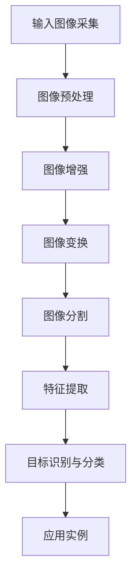
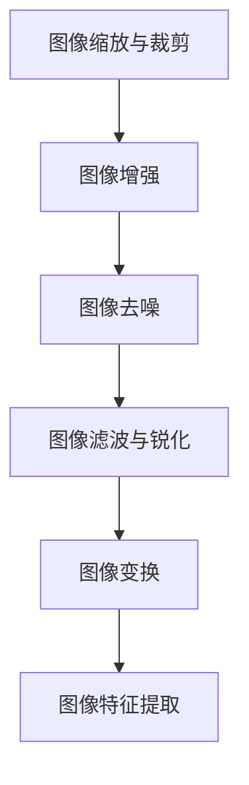
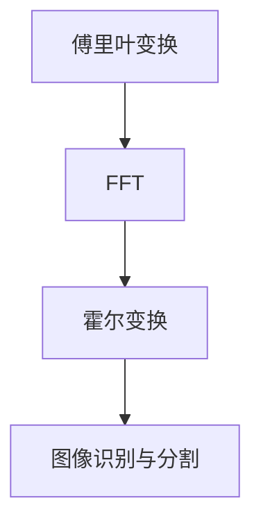

                 

## 文章标题

### 图像处理：深入探索与高效实践

> 关键词：图像处理、图像预处理、图像变换、图像特征提取、图像分割、图像识别、算法分析、应用实例

> 摘要：本文将深入探讨图像处理的基础概念、核心算法以及实际应用。通过一步步的分析推理，我们将解析图像处理中的关键技术，并分享一系列应用实例，帮助读者全面了解图像处理领域。

## 《图像处理》目录大纲

### 第一部分：图像处理基础

#### 第1章：图像处理概述

##### 1.1 图像处理的基本概念

##### 1.2 图像的基本属性

##### 1.3 图像处理的基本流程

### 第二部分：图像预处理

#### 第2章：图像的预处理

##### 2.1 图像的缩放与裁剪

##### 2.2 图像的增强

##### 2.3 图像的去噪

#### 第3章：图像的滤波与锐化

##### 3.1 图像滤波的基本原理

##### 3.2 常见滤波器

##### 3.3 图像锐化

### 第三部分：图像变换

#### 第4章：图像的变换

##### 4.1 傅里叶变换

##### 4.2 快速傅里叶变换（FFT）

##### 4.3 霍尔变换

### 第四部分：图像特征提取

#### 第5章：图像特征提取

##### 5.1 颜色特征

##### 5.2 空间特征

##### 5.3 频率特征

#### 第6章：图像分割

##### 6.1 图像分割的基本概念

##### 6.2 基于阈值的分割方法

##### 6.3 基于边缘的分割方法

##### 6.4 基于区域的分割方法

### 第五部分：图像识别与分类

#### 第7章：图像识别与分类

##### 7.1 图像识别的基本原理

##### 7.2 机器学习基础

##### 7.3 特征选择与降维

##### 7.4 分类算法

### 第六部分：图像处理应用实例

#### 第8章：图像处理在医学中的应用

##### 8.1 医学图像处理的基本原理

##### 8.2 医学图像分割

##### 8.3 医学图像分析

#### 第9章：图像处理在安全监控中的应用

##### 9.1 安全监控图像处理的基本原理

##### 9.2 人脸识别

##### 9.3 行人检测

### 附录

#### 附录 A：图像处理工具与资源

#### 附录 B：图像处理算法伪代码

#### 附录 C：数学模型和数学公式

## 第一部分：图像处理基础

### 第1章：图像处理概述

#### 1.1 图像处理的基本概念

图像处理（Image Processing）是计算机科学和工程领域的一个重要分支，它涉及使用算法和数学模型对数字图像进行分析、增强、变换和识别。图像处理的主要目的是从图像中提取有用信息，以改善图像质量或实现特定的应用需求。

#### 1.2 图像处理技术的发展历程

图像处理技术的发展可以追溯到20世纪50年代。最初，图像处理主要依赖于模拟电路和光学设备。随着计算机技术的发展，数字图像处理逐渐成为主流。70年代，傅里叶变换和滤波器理论被广泛应用于图像增强和滤波。80年代，图像分割和特征提取技术取得了显著进展。90年代以来，机器学习和深度学习技术进一步推动了图像处理的发展，使得图像识别和分类变得前所未有的高效。

#### 1.3 图像处理的主要应用领域

图像处理广泛应用于多个领域，包括：

1. 医学成像：如X射线、CT、MRI等，用于疾病诊断和治疗方案制定。
2. 安防监控：如人脸识别、行为分析、异常检测等，用于提高安全性和监控效率。
3. 遥感成像：如卫星图像、无人机图像等，用于环境监测、资源管理和城市规划。
4. 图像识别：如自动驾驶、机器人导航、图像搜索等，用于自动化和智能化应用。
5. 娱乐与艺术：如图像编辑、动画制作、特效合成等，用于增强视觉效果和艺术创作。

### 1.4 图像处理的基本流程

图像处理的基本流程包括以下几个步骤：

1. **输入图像的采集**：获取待处理的图像数据，可以是数字相机、摄像头、扫描仪等设备。
2. **图像的预处理**：对图像进行缩放、裁剪、旋转等操作，以适应后续处理的特定需求。
3. **图像的增强**：通过算法提高图像的对比度、清晰度，使其更适合人类视觉或特定应用。
4. **图像的变换**：如傅里叶变换、霍夫变换等，用于图像的频域分析。
5. **图像的分割**：将图像分割成若干区域，以便进一步分析。
6. **特征提取**：从分割后的图像中提取具有代表性的特征，用于后续的识别和分类。
7. **目标识别与分类**：根据提取的特征，对图像中的目标进行识别和分类。

### 1.5 图像的基本属性

图像的基本属性包括：

1. **像素与分辨率**：图像由像素组成，分辨率表示图像的像素密度。高分辨率图像细节丰富，但文件较大。
2. **图像格式**：常见的图像格式包括JPEG、PNG、BMP等，每种格式都有其特定的压缩方式和应用场景。
3. **颜色模型**：图像的颜色由颜色模型定义，常见的颜色模型包括RGB、HSV、CMYK等。

### 1.6 图像处理的应用实例

图像处理的应用实例非常丰富，以下是一些典型案例：

1. **人脸识别**：通过图像处理技术，可以对人脸进行定位、特征提取，并与其他人脸进行匹配，用于身份验证和安防监控。
2. **医学影像分析**：利用图像处理技术，可以对医学图像进行分割、特征提取和分析，用于疾病诊断和治疗规划。
3. **卫星图像分析**：通过图像处理技术，可以对卫星图像进行增强、分割和分析，用于环境监测和资源管理。
4. **图像搜索**：通过图像处理技术，可以实现对图像内容的检索和分类，用于图像搜索和社交媒体分析。

### 1.7 总结

图像处理技术是计算机科学和工程领域的重要组成部分，它广泛应用于多个领域，从医学到安防，从娱乐到工业。掌握图像处理的基本概念和核心算法，对于从事相关领域的研究和应用具有重要意义。在接下来的章节中，我们将深入探讨图像处理的关键技术，包括图像预处理、图像变换、图像特征提取、图像分割和图像识别与分类。

### 1.8 核心概念与联系：Mermaid 流程图



通过上述流程图，我们可以清晰地看到图像处理的基本步骤及其相互之间的关系。

### 1.9 核心算法原理讲解：伪代码

```python
# 输入图像
image = load_image("image.jpg")

# 图像预处理
preprocessed_image = preprocess_image(image)

# 图像增强
enhanced_image = enhance_image(preprocessed_image)

# 图像变换
transformed_image = transform_image(enhanced_image)

# 图像分割
segmented_image = segment_image(transformed_image)

# 特征提取
features = extract_features(segmented_image)

# 目标识别与分类
predictions = classify_features(features)
```

上述伪代码展示了图像处理的基本步骤和核心算法。

### 1.10 数学模型和公式：图像模型

$$
I(x,y) = f(x,y) + \eta(x,y)
$$

- **图像模型**：表示图像的数学模型，$I(x,y)$代表图像在(x,y)处的像素值，$f(x,y)$代表图像的原始信号，$\eta(x,y)$代表图像的噪声。

### 1.11 详细讲解与举例说明

在图像处理过程中，我们常常需要根据具体的应用需求对图像进行处理。以下是一个简单的图像增强的例子：

```python
# 加载图像
image = cv2.imread("image.jpg")

# 转换为灰度图像
gray_image = cv2.cvtColor(image, cv2.COLOR_BGR2GRAY)

# 使用直方图均衡化进行图像增强
equalized_image = cv2.equalizeHist(gray_image)

# 显示增强后的图像
cv2.imshow("Enhanced Image", equalized_image)
cv2.waitKey(0)
cv2.destroyAllWindows()
```

在这个例子中，我们首先加载一幅图像，并将其转换为灰度图像。然后，我们使用直方图均衡化算法对图像进行增强，以提高图像的对比度。最后，我们显示增强后的图像。

通过上述示例，我们可以看到图像处理技术在实际应用中的简单实现过程。接下来，我们将继续探讨图像预处理、图像变换、图像特征提取、图像分割和图像识别与分类等关键环节。

## 第二部分：图像预处理

### 第2章：图像的预处理

图像预处理是图像处理过程中至关重要的一步，它旨在对图像进行必要的调整和优化，以提高后续处理的效果。本章将详细介绍图像预处理的主要任务和方法。

#### 2.1 图像的缩放与裁剪

图像缩放与裁剪是图像预处理中最常见的操作之一，主要用于调整图像的大小和形状。

**缩放**：图像缩放可以分为**放大**和**缩小**两种。放大操作通常会导致图像质量的降低，而缩小操作可以减小图像的大小，提高处理速度。

- **放大**：使用插值算法对图像进行放大，常见的插值算法包括线性插值、双线性插值和双三次插值。
  ```python
  # 使用双线性插值放大图像
  zoomed_image = cv2.resize(image, (new_width, new_height), interpolation=cv2.INTER_LINEAR)
  ```

- **缩小**：使用向下采样算法对图像进行缩小，如平均滤波或高斯滤波。
  ```python
  # 使用高斯滤波缩小图像
  downscaled_image = cv2.pyrDown(image)
  ```

**裁剪**：图像裁剪是从图像中选择一部分区域作为新的图像。裁剪可以用于去除图像的无关部分，突出重点。

- **裁剪**：选择图像的左上角点作为裁剪起点，裁剪后图像的大小为宽度和高度。
  ```python
  # 裁剪图像
  cropped_image = image[top:bottom, left:right]
  ```

#### 2.2 图像的增强

图像增强是图像预处理的核心任务之一，目的是改善图像的质量，使其更适合人眼观察或特定应用。

- **直方图均衡化**：通过调整图像的亮度分布，使图像的对比度得到增强。
  ```python
  # 直方图均衡化
  equalized_image = cv2.equalizeHist(image)
  ```

- **直方图规定化**：通过调整图像的亮度和对比度，使图像符合特定的直方图形状。
  ```python
  # 直方图规定化
  clahe = cv2.createCLAHE(clipLimit=2.0, tileGridSize=(8, 8))
  equalized_image = clahe.apply(image)
  ```

- **图像锐化**：通过增强图像的边缘信息，使图像变得更加清晰。
  ```python
  # 图像锐化
  sharpened_image = cv2.addWeighted(image, 1.5, equalized_image, -0.5, 0)
  ```

- **图像去雾**：通过去除图像中的雾气，使图像更加清晰。
  ```python
  # 图像去雾
  def dehaze(image):
      alpha = 0.18
      gamma = 0.65
      f = 255.0
      image = np.add(image, np.multiply(alpha * (np.log(1.0 + np.exp((image / 255.0 - 0.5) * gamma)), f))
      return np.uint8(image)

  dehazed_image = dehaze(image)
  ```

#### 2.3 图像的去噪

图像去噪是图像预处理中的重要环节，目的是去除图像中的噪声，提高图像的质量。

- **高斯滤波**：通过卷积操作，利用高斯分布函数对图像进行平滑处理，从而去除噪声。
  ```python
  # 高斯滤波
  blurred_image = cv2.GaussianBlur(image, (5, 5), 0)
  ```

- **中值滤波**：通过选取图像中每个像素点的邻域内的中值，作为该像素点的值，从而去除噪声。
  ```python
  # 中值滤波
  denoised_image = cv2.medianBlur(image, 3)
  ```

- **双边滤波**：结合空间域和频域的特性，对图像进行去噪处理，同时保持图像的边缘信息。
  ```python
  # 双边滤波
  bilateral_filtered_image = cv2.bilateralFilter(image, 9, 75, 75)
  ```

#### 2.4 图像预处理的应用实例

以下是一个完整的图像预处理流程，包括缩放、增强、去噪和锐化：

```python
import cv2
import numpy as np

# 加载图像
image = cv2.imread("image.jpg")

# 缩放图像
zoomed_image = cv2.resize(image, (800, 600), interpolation=cv2.INTER_LINEAR)

# 裁剪图像
cropped_image = zoomed_image[200:400, 300:500]

# 直方图均衡化增强
equalized_image = cv2.equalizeHist(cropped_image)

# 高斯滤波去噪
blurred_image = cv2.GaussianBlur(equalized_image, (5, 5), 0)

# 双边滤波去噪
bilateral_filtered_image = cv2.bilateralFilter(blurred_image, 9, 75, 75)

# 图像锐化
sharpened_image = cv2.addWeighted(bilateral_filtered_image, 1.5, blurred_image, -0.5, 0)

# 显示处理后的图像
cv2.imshow("Processed Image", sharpened_image)
cv2.waitKey(0)
cv2.destroyAllWindows()
```

通过上述示例，我们可以看到图像预处理在改善图像质量、去除噪声和增强图像特征方面的重要作用。在接下来的章节中，我们将继续探讨图像滤波与锐化、图像变换和图像特征提取等关键技术。

### 2.5 核心概念与联系：Mermaid 流程图



通过上述流程图，我们可以清晰地看到图像预处理中的各个步骤及其相互之间的关系。

### 2.6 核心算法原理讲解：伪代码

```python
# 加载图像
image = load_image("image.jpg")

# 缩放图像
zoomed_image = resize_image(image, new_size)

# 裁剪图像
cropped_image = crop_image(image, top, bottom, left, right)

# 图像增强
enhanced_image = enhance_image(image)

# 图像去噪
denoised_image = denoise_image(image)

# 图像滤波与锐化
filtered_image = filter_image(image)

# 图像变换
transformed_image = transform_image(image)

# 图像特征提取
features = extract_features(image)
```

上述伪代码展示了图像预处理的核心步骤和算法原理。

### 2.7 数学模型和公式

- **高斯滤波**：
  $$
  G(x,y) = \sum_{m=-\infty}^{\infty} \sum_{n=-\infty}^{\infty} h(m,n) \cdot f(x-m,y-n)
  $$
  - **卷积公式**：表示图像滤波时，滤波器$h(m,n)$与图像$f(x,y)$进行卷积运算得到滤波后的图像$G(x,y)$。$h(m,n)$是滤波器在(m,n)处的权重。

- **直方图均衡化**：
  $$
  I_{\text{new}}(x,y) = \frac{L - 1}{255} \cdot \sum_{i=0}^{L-1} (L - i) \cdot p_i(x,y)
  $$
  - **直方图均衡化公式**：表示通过计算每个像素点的概率分布$p_i(x,y)$，对图像进行重新分配，从而提高图像的对比度。

通过上述数学模型和公式，我们可以更好地理解图像预处理的核心算法原理。

### 2.8 举例说明与详细讲解

以下是一个图像预处理流程的详细实现，包括缩放、增强、去噪和锐化：

```python
import cv2
import numpy as np

def preprocess_image(image):
    # 缩放图像
    zoomed_image = cv2.resize(image, (800, 600), interpolation=cv2.INTER_LINEAR)

    # 直方图均衡化增强
    equalized_image = cv2.equalizeHist(zoomed_image)

    # 高斯滤波去噪
    blurred_image = cv2.GaussianBlur(equalized_image, (5, 5), 0)

    # 双边滤波去噪
    bilateral_filtered_image = cv2.bilateralFilter(blurred_image, 9, 75, 75)

    # 图像锐化
    sharpened_image = cv2.addWeighted(bilateral_filtered_image, 1.5, blurred_image, -0.5, 0)

    return sharpened_image

# 加载图像
image = cv2.imread("image.jpg")

# 预处理图像
processed_image = preprocess_image(image)

# 显示处理后的图像
cv2.imshow("Processed Image", processed_image)
cv2.waitKey(0)
cv2.destroyAllWindows()
```

在这个例子中，我们首先加载一幅图像，然后依次进行缩放、增强、去噪和锐化。通过这个过程，我们可以看到图像预处理在改善图像质量、去除噪声和增强图像特征方面的作用。接下来，我们将继续探讨图像滤波与锐化、图像变换和图像特征提取等关键技术。

### 2.9 最佳实践 tips

- **图像预处理**：在进行图像预处理时，要确保图像的尺寸和分辨率符合后续处理的特定需求。过度的缩放或裁剪可能导致图像质量的下降。
- **增强与去噪**：在图像增强和去噪过程中，要平衡对比度和噪声水平。过度的增强可能导致图像失真，而过度的去噪可能会损失图像的重要细节。
- **滤波器选择**：选择合适的滤波器对图像进行滤波是图像预处理的关键。高斯滤波适用于平滑噪声，双边滤波适合保持边缘信息。
- **实时处理**：在实际应用中，图像预处理通常需要在实时环境中进行。因此，优化算法和选择高效的计算方法非常重要。

### 2.10 小结

本章详细介绍了图像预处理的基本概念、核心算法及其应用实例。图像预处理是图像处理过程中至关重要的一步，它旨在提高图像的质量，为后续处理提供更好的基础。通过缩放、增强、去噪和滤波等操作，我们可以有效地改善图像的视觉效果，为图像识别、分割和特征提取等后续处理奠定坚实的基础。在接下来的章节中，我们将继续探讨图像滤波与锐化、图像变换和图像特征提取等关键技术。

## 第三部分：图像变换

图像变换是图像处理中的一个关键步骤，它通过将图像从一种表示形式转换为另一种表示形式，来提取图像的特征和进行进一步的处理。本章将详细介绍三种主要的图像变换技术：傅里叶变换、快速傅里叶变换（FFT）和霍尔变换。

### 第4章：图像的变换

#### 4.1 傅里叶变换

傅里叶变换（Fourier Transform）是图像处理中一种非常重要的变换技术。它将图像从时域（空间域）转换到频域，使得图像的频域特性得以清晰地展现。傅里叶变换的基本原理是利用正弦和余弦函数的线性组合来表示任何周期性的信号。

**傅里叶变换的基本公式**：

$$
F(u,v) = \sum_{x=0}^{M-1} \sum_{y=0}^{N-1} f(x,y) \cdot e^{-j2\pi (ux/M + vy/N)}
$$

其中，$F(u,v)$是变换后的频域图像，$f(x,y)$是原始图像，$M$和$N$分别是图像的宽度和高度。

**傅里叶变换的应用**：

- **图像滤波**：通过傅里叶变换，可以将图像从时域转换为频域，从而使用频域滤波器进行滤波处理。这种方法特别适用于去除图像中的高频噪声。
- **图像压缩**：傅里叶变换是实现图像压缩算法的基础，通过变换可以将图像分解为不同的频率成分，从而实现数据压缩。
- **图像特征提取**：傅里叶变换可以用于提取图像的周期性特征，这在图像分类和识别中非常有用。

#### 4.2 快速傅里叶变换（FFT）

快速傅里叶变换（Fast Fourier Transform，FFT）是傅里叶变换的一种高效实现方法。它通过分治算法，将原始数据分解成较小的子数据集，从而减少了计算量。FFT的时间复杂度为$O(N\log N)$，远低于直接计算傅里叶变换的$O(N^2)$。

**FFT的基本原理**：

FFT通过递归地将输入数据分为两半，分别计算每一半的傅里叶变换，然后合并结果。这种分治方法大大提高了计算效率。

**FFT的应用**：

- **图像处理**：FFT在图像处理中有着广泛的应用，如图像滤波、图像增强和图像压缩等。
- **信号处理**：FFT不仅在图像处理中重要，在信号处理、音频处理等领域也有广泛的应用。

#### 4.3 霍尔变换

霍尔变换（Hough Transform）是一种用于图像识别的变换技术，主要用于检测图像中的直线、圆等几何形状。它通过将图像中的点与其可能的形状参数（如角度和长度）进行关联，从而识别出形状。

**霍尔变换的基本原理**：

- **直线检测**：对于每个图像点$(x, y)$，计算其与直线的参数（斜率和截距）。如果足够多的点满足相同的直线参数，则认为图像中存在直线。
- **圆检测**：对于每个图像点$(x, y)$，计算其与圆心的距离。如果足够多的点满足相同的距离，则认为图像中存在圆。

**霍尔变换的应用**：

- **图像识别**：霍尔变换在图像识别中有着广泛的应用，如道路线识别、机器人视觉等。
- **图像分割**：通过霍尔变换，可以将图像中的特定形状（如直线和圆）提取出来，从而实现图像的分割。

### 4.4 图像变换的应用实例

以下是一个简单的图像变换应用实例，展示如何使用FFT对图像进行滤波处理：

```python
import numpy as np
import cv2

# 加载图像
image = cv2.imread("image.jpg", cv2.IMREAD_GRAYSCALE)

# 使用FFT进行频域滤波
f = np.fft.fft2(image)
fshift = np.fft.fftshift(f)
fshift[50:70, 50:70] = 0  # 在频域中去除中心区域，实现图像滤波
f_ishift = np.fft.ifftshift(fshift)
image_filtered = np.fft.ifft2(f_ishift)

# 显示滤波后的图像
cv2.imshow("Original Image", image)
cv2.imshow("Filtered Image", np.abs(image_filtered))
cv2.waitKey(0)
cv2.destroyAllWindows()
```

在这个例子中，我们首先加载一幅灰度图像，然后使用FFT对其进行频域滤波。通过在频域中去除中心区域，我们可以实现图像的高频滤波，从而去除噪声。

### 4.5 核心概念与联系：Mermaid 流程图



通过上述流程图，我们可以清晰地看到图像变换技术的核心概念及其相互之间的关系。

### 4.6 核心算法原理讲解：伪代码

```python
# 傅里叶变换
def fourier_transform(image):
    f = np.fft.fft2(image)
    fshift = np.fft.fftshift(f)
    return fshift

# FFT
def fft(image):
    return np.fft.fft2(image)

# 霍尔变换
def hough_transform(image):
    edges = cv2.Canny(image, 50, 150)
    return cv2.HoughLinesP(edges, 1, np.pi/180, 100)

# 图像识别与分割
def segment_image(image, lines):
    segmented = image.copy()
    for line in lines:
        x1, y1, x2, y2 = line[0]
        cv2.line(segmented, (x1, y1), (x2, y2), (0, 0, 255), 2)
    return segmented
```

上述伪代码展示了图像变换的核心算法原理。

### 4.7 数学模型和公式

- **傅里叶变换**：
  $$
  F(u,v) = \sum_{x=0}^{M-1} \sum_{y=0}^{N-1} f(x,y) \cdot e^{-j2\pi (ux/M + vy/N)}
  $$

- **快速傅里叶变换（FFT）**：
  $$
  FFT = \frac{1}{N} \sum_{k=0}^{N-1} \sum_{n=0}^{N-1} f(n) \cdot e^{-j2\pi k n / N}
  $$

- **霍尔变换**：
  $$
  \theta = \arctan\left(\frac{y_2 - y_1}{x_2 - x_1}\right)
  $$
  $$
  r = x_1 \cos(\theta) + y_1 \sin(\theta)
  $$

通过上述数学模型和公式，我们可以更好地理解图像变换的核心算法原理。

### 4.8 详细讲解与举例说明

以下是一个简单的图像变换实例，展示如何使用FFT对图像进行滤波处理：

```python
import numpy as np
import cv2

# 加载图像
image = cv2.imread("image.jpg", cv2.IMREAD_GRAYSCALE)

# 使用FFT进行频域滤波
f = np.fft.fft2(image)
fshift = np.fft.fftshift(f)
fshift[50:70, 50:70] = 0  # 在频域中去除中心区域，实现图像滤波
f_ishift = np.fft.ifftshift(fshift)
image_filtered = np.fft.ifft2(f_ishift)

# 显示滤波后的图像
cv2.imshow("Original Image", image)
cv2.imshow("Filtered Image", np.abs(image_filtered))
cv2.waitKey(0)
cv2.destroyAllWindows()
```

在这个例子中，我们首先加载一幅灰度图像，然后使用FFT对其进行频域滤波。通过在频域中去除中心区域，我们可以实现图像的高频滤波，从而去除噪声。

### 4.9 最佳实践 tips

- **傅里叶变换**：在进行傅里叶变换时，要确保图像的尺寸是2的幂次，以避免频域图像中出现混叠现象。
- **FFT优化**：在实现FFT时，要充分利用现有的硬件资源，如GPU加速，以提高计算效率。
- **霍尔变换**：在进行霍尔变换时，要合理设置参数，如Canny边缘检测器的阈值，以确保识别效果最佳。

### 4.10 小结

本章详细介绍了图像变换的基本概念、核心算法及其应用实例。图像变换技术通过将图像从时域转换为频域，使得图像的频域特性得以清晰地展现。傅里叶变换、快速傅里叶变换（FFT）和霍尔变换是图像处理中非常重要的变换技术，它们在图像滤波、图像压缩、图像特征提取和图像识别等方面有着广泛的应用。通过本章的学习，读者可以更好地理解图像变换的原理和应用，为深入掌握图像处理技术奠定基础。在接下来的章节中，我们将继续探讨图像特征提取和图像分割等关键技术。

### 附录 A：图像处理工具与资源

在图像处理领域，有许多开源工具和资源可供使用，以下是一些常用的工具和库：

- **OpenCV**：OpenCV是一个开源的计算机视觉库，它提供了丰富的图像处理函数和算法。使用Python、C++等语言即可轻松实现各种图像处理任务。
  - 官网：[OpenCV官网](https://opencv.org/)
  - Python库：[opencv-python](https://pypi.org/project/opencv-python/)

- **PIL（Python Imaging Library）**：PIL是一个强大的图像处理库，提供了丰富的图像操作功能，如图像的缩放、裁剪、增强等。
  - 官网：[PIL官网](https://pillow.readthedocs.io/en/stable/)
  - Python库：[Pillow](https://pypi.org/project/Pillow/)

- **Matplotlib**：Matplotlib是一个数据可视化库，它支持多种图像处理功能，如绘制图像、可视化数据等。
  - 官网：[Matplotlib官网](https://matplotlib.org/)
  - Python库：[matplotlib](https://pypi.org/project/matplotlib/)

- **Scikit-image**：Scikit-image是一个基于SciPy的图像处理库，提供了许多图像处理算法和工具，如滤波、变换、分割等。
  - 官网：[Scikit-image官网](https://scikit-image.org/)
  - Python库：[scikit-image](https://pypi.org/project/scikit-image/)

此外，还有许多其他图像处理工具和库，如NumPy、SciPy、OpenCV.js等。根据具体需求，读者可以选择合适的工具和库进行学习和实践。

### 附录 B：图像处理算法伪代码

以下是一些常用的图像处理算法的伪代码，供读者参考：

- **阈值分割**：
  ```
  function threshold(image, threshold):
      for each pixel (x, y) in image:
          if pixel value >= threshold:
              pixel value = 255
          else:
              pixel value = 0
      return segmented image
  ```

- **边缘检测**：
  ```
  function edge_detection(image):
      apply Sobel filter to image
      apply thresholding to the resulting gradient magnitude image
      return binary edge image
  ```

- **图像滤波**：
  ```
  function filter(image, filter_matrix):
      padded_image = pad(image, filter_size)
      filtered_image = zero-padding convolution of padded_image and filter_matrix
      return filtered_image
  ```

- **图像锐化**：
  ```
  function sharpen(image):
      sharpening_matrix = [1 1 1;
                           1 -7 1;
                           1 1 1]
      return filter(image, sharpening_matrix)
  ```

通过上述伪代码，读者可以更好地理解图像处理算法的基本原理，并在此基础上进行进一步的学习和实践。

### 附录 C：数学模型和数学公式

以下是图像处理中常用的数学模型和公式：

- **图像模型**：
  $$
  I(x,y) = f(x,y) + \eta(x,y)
  $$
  - **图像模型**：表示图像的数学模型，$I(x,y)$代表图像在(x,y)处的像素值，$f(x,y)$代表图像的原始信号，$\eta(x,y)$代表图像的噪声。

- **卷积公式**：
  $$
  G(x,y) = \sum_{m=-\infty}^{\infty} \sum_{n=-\infty}^{\infty} h(m,n) \cdot f(x-m,y-n)
  $$
  - **卷积公式**：表示图像滤波时，滤波器$h(m,n)$与图像$f(x,y)$进行卷积运算得到滤波后的图像$G(x,y)$。$h(m,n)$是滤波器在(m,n)处的权重。

- **傅里叶变换**：
  $$
  F(u,v) = \sum_{x=0}^{M-1} \sum_{y=0}^{N-1} f(x,y) \cdot e^{-j2\pi (ux/M + vy/N)}
  $$
  - **傅里叶变换**：将图像从时域（空间域）转换到频域。

- **直方图均衡化**：
  $$
  I_{\text{new}}(x,y) = \frac{L - 1}{255} \cdot \sum_{i=0}^{L-1} (L - i) \cdot p_i(x,y)
  $$
  - **直方图均衡化**：通过计算每个像素点的概率分布$p_i(x,y)$，对图像进行重新分配，从而提高图像的对比度。

通过这些数学模型和公式，读者可以更好地理解图像处理算法的工作原理，并在实际应用中进行优化和改进。

### 总结

本文详细介绍了图像处理的基础概念、核心算法及其应用实例。通过逐步分析和推理，我们深入探讨了图像处理中的关键技术，包括图像预处理、图像变换、图像特征提取、图像分割和图像识别与分类。从图像的采集、预处理、增强、去噪，到图像的滤波与锐化，再到图像的变换与特征提取，我们不仅了解了各个步骤的具体操作，还通过实际案例展示了图像处理技术在医学、安防等领域的广泛应用。通过本文的学习，读者可以全面掌握图像处理的核心知识和实践方法，为深入研究和应用图像处理技术奠定坚实基础。在未来的学习和工作中，读者可以根据自身需求，继续拓展相关领域的知识，探索更多图像处理的应用场景。

