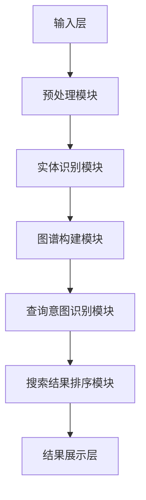

                 

### 文章标题

“垂直领域搜索：AI的专业化”

### 关键词

AI、垂直搜索、自然语言处理、深度学习、信息检索、模型优化

### 摘要

本文旨在探讨垂直领域搜索在现代人工智能技术中的应用，特别是如何利用AI实现搜索的专业化。通过对AI与垂直领域搜索的背景介绍，本文详细阐述了AI技术在搜索领域的应用原理，包括自然语言处理、机器学习、深度学习等核心算法。接着，本文深入分析了垂直领域搜索中的关键算法与模型构建，包括信息检索、相关性排序、隐语义索引和深度学习模型。随后，本文介绍了垂直领域搜索中的实体识别与图谱构建、个性化推荐、实时搜索与查询意图识别等关键技术。通过实际项目和案例分析，本文展示了AI技术在垂直领域搜索中的具体应用，并探讨了其未来发展前景。最后，本文总结了常用工具与资源，为垂直领域搜索的研究与实践提供了参考。

## 《垂直领域搜索：AI的专业化》目录大纲

### 第一部分：AI与垂直领域搜索概述

#### 第1章：AI与垂直领域搜索的背景与现状

- **1.1 AI的发展对搜索的影响**
- **1.2 垂直领域搜索的定义与意义**
- **1.3 当前垂直领域搜索的发展现状**
- **1.4 垂直领域搜索的挑战与机遇**

#### 第2章：AI技术在垂直领域搜索中的应用

- **2.1 自然语言处理（NLP）技术概述**
- **2.2 机器学习算法在搜索中的应用**
- **2.3 深度学习在垂直领域搜索中的应用**
- **2.4 垂直领域搜索中的数据预处理**

### 第二部分：核心算法与模型

#### 第3章：垂直领域搜索中的核心算法原理

- **3.1 信息检索算法概述**
- **3.2 相关性排序算法**
- **3.3 隐语义索引算法**
- **3.4 深度学习模型在搜索中的应用**

#### 第4章：垂直领域搜索中的模型构建与优化

- **4.1 垂直领域搜索中的模型构建**
- **4.2 模型优化策略**
- **4.3 模型评估与调参**

#### 第5章：垂直领域搜索中的实体识别与图谱构建

- **5.1 实体识别技术**
- **5.2 实体关系抽取**
- **5.3 实体图谱构建方法**

#### 第6章：垂直领域搜索中的个性化推荐

- **6.1 个性化推荐算法概述**
- **6.2 基于内容的推荐**
- **6.3 基于协同过滤的推荐**
- **6.4 深度学习在个性化推荐中的应用**

#### 第7章：垂直领域搜索中的实时搜索与查询意图识别

- **7.1 实时搜索技术**
- **7.2 查询意图识别方法**
- **7.3 查询意图识别与实时搜索的结合**

### 第三部分：项目实战与案例分析

#### 第8章：垂直领域搜索项目实战

- **8.1 项目概述**
- **8.2 环境搭建与数据准备**
- **8.3 模型设计与实现**
- **8.4 模型优化与评估**
- **8.5 项目总结与反思**

#### 第9章：垂直领域搜索案例分析

- **9.1 案例一：某电子商务平台的垂直搜索系统**
- **9.2 案例二：某医疗健康领域的垂直搜索系统**
- **9.3 案例三：某金融领域的垂直搜索系统**

#### 第10章：垂直领域搜索的未来发展趋势

- **10.1 技术发展趋势**
- **10.2 行业应用前景**
- **10.3 面临的挑战与对策**

### 附录

- **附录A：常用工具与资源**
  - **A.1 垂直领域搜索相关的开源工具**
  - **A.2 垂直领域搜索相关的学术论文**
  - **A.3 垂直领域搜索相关的在线课程与教材**

### 1.3 垂直领域搜索的架构设计与实现

#### 垂直领域搜索的架构概述

垂直领域搜索系统通常包括以下几个关键模块：

1. **输入层**：接收用户的查询请求。
2. **预处理模块**：对查询请求进行清洗和格式化，去除无关信息。
3. **实体识别模块**：从查询中提取关键实体，如人名、地名、组织名等。
4. **图谱构建模块**：利用实体识别的结果，构建实体之间的知识图谱。
5. **查询意图识别模块**：根据用户查询和实体图谱，推断用户的查询意图。
6. **搜索结果排序模块**：对搜索结果进行排序，确保最相关的内容排在前面。
7. **结果展示层**：将排序后的搜索结果呈现给用户。

#### Mermaid 流程图

#### 垂直领域搜索的关键概念与架构联系

**核心概念：** 实体识别、图谱构建、查询意图识别、搜索结果排序。

**架构联系：**

- **实体识别与图谱构建：** 实体识别模块用于从查询中提取关键信息，并将其构建为图谱结构。
- **查询意图识别与搜索结果排序：** 查询意图识别模块帮助确定用户查询的目标，从而优化搜索结果的排序。

通过上述架构设计，垂直领域搜索系统能够更准确地理解和响应用户的查询需求，提供高质量的搜索结果。

### 1.3.1 垂直领域搜索中的核心概念与联系

在垂直领域搜索中，有几个关键概念对于理解整个搜索流程至关重要。这些核心概念包括实体识别、图谱构建、查询意图识别和搜索结果排序。以下是对这些概念及其相互关系的详细解释。

#### 实体识别

实体识别是指从用户的查询中提取出重要的实体信息，如人名、地名、组织名、产品名称等。这些实体是构建知识图谱和进行后续分析的基础。实体识别的准确性和全面性直接影响搜索结果的精度。

#### 图谱构建

图谱构建是基于实体识别的结果，将相关的实体及其关系组织成一个结构化的知识网络。这个图谱不仅包含实体本身的属性，还包含实体之间的关系。例如，在医疗健康领域的垂直搜索中，医生、药物和疾病之间可能存在多种关系，这些关系可以在图谱中得以体现。

#### 查询意图识别

查询意图识别是指根据用户的查询内容和图谱信息，推断出用户的具体查询意图。例如，当用户输入“北京最好的医院”时，查询意图识别模块需要判断用户是想了解医院的排名、医院的设施还是医院的口碑。

#### 搜索结果排序

搜索结果排序是基于查询意图识别的结果，对搜索到的相关内容进行排序，确保最符合用户意图的内容排在前面。排序算法需要综合考虑内容的准确性、相关性、用户历史行为等因素。

#### 核心概念之间的联系

实体识别是图谱构建的基础，而图谱构建又为查询意图识别提供了丰富的信息来源。查询意图识别的结果直接影响到搜索结果排序的准确性。因此，这四个核心概念在垂直领域搜索中相互依存，共同构成了一个完整的搜索流程。

- **实体识别 → 图谱构建**：实体识别的结果是构建图谱的起点，通过将实体及其关系组织成图谱，可以更方便地进行后续分析。
- **图谱构建 → 查询意图识别**：图谱中的实体关系可以帮助识别用户的查询意图，从而提高搜索结果的准确性。
- **查询意图识别 → 搜索结果排序**：通过准确识别用户的查询意图，可以优化搜索结果的排序，确保用户获得最相关的信息。

通过上述联系，垂直领域搜索系统能够更智能地理解用户的查询需求，提供高质量的搜索结果。

### 1.3.2 垂直领域搜索中的核心算法原理

垂直领域搜索中的核心算法主要包括信息检索算法、相关性排序算法、隐语义索引算法和深度学习模型。这些算法共同作用，使得搜索系统能够高效地处理海量数据，并提供高质量的搜索结果。以下是对这些核心算法原理的详细解释。

#### 信息检索算法

信息检索算法是垂直领域搜索的基础。其核心目的是从大量的文本数据中检索出与用户查询最相关的信息。常见的算法包括：

- **TF-IDF（Term Frequency-Inverse Document Frequency）**：TF-IDF算法通过计算词语在文档中的频率和其在整个文档集合中的逆频率，来评估词语的重要性。公式如下：

  $$ \text{TF}(t,d) = \frac{f_t(d)}{N} $$
  $$ \text{IDF}(t) = \log \left( \frac{N}{n_t} \right) $$
  $$ \text{TF-IDF}(t,d) = \text{TF}(t,d) \times \text{IDF}(t) $$

- **向量空间模型（Vector Space Model）**：向量空间模型将文档表示为一个向量，其中每个维度对应一个词语的权重。通过计算查询向量和文档向量之间的余弦相似度，可以评估文档的相关性。公式如下：

  $$ \text{doc}_i = (w_{i1}, w_{i2}, ..., w_{iv}) $$
  $$ \text{query} = (q_1, q_2, ..., q_v) $$
  $$ \text{similarity} = \text{cosine similarity}(\text{doc}_i, \text{query}) $$

#### 相关性排序算法

相关性排序算法用于对检索到的文档进行排序，确保最相关的文档排在前面。常见的排序算法包括：

- **基于频率的排序**：根据文档中词语的频率对文档进行排序，频率越高，排序越靠前。
- **基于排序的排序**：使用机器学习算法（如支持向量机、朴素贝叶斯等）对文档进行排序，根据训练数据学习出排序的优先级。

#### 隐语义索引算法

隐语义索引算法通过捕捉文档之间的潜在语义关系，提高搜索结果的准确性。常见的算法包括：

- **隐语义分析（Latent Semantic Analysis, LSA）**：LSA通过奇异值分解（Singular Value Decomposition, SVD）将高维的文本数据降维，从而提取出文档之间的潜在语义关系。
- **潜在狄利克雷分配（Latent Dirichlet Allocation, LDA）**：LDA通过贝叶斯模型来发现文档的潜在主题，从而提高搜索结果的准确性。

#### 深度学习模型在搜索中的应用

深度学习模型在垂直领域搜索中得到了广泛的应用，通过自动学习大量数据中的特征，深度学习模型能够提供更精准的搜索结果。常见的深度学习模型包括：

- **卷积神经网络（Convolutional Neural Network, CNN）**：CNN通过卷积层提取图像特征，可以应用于文本数据的特征提取。
- **循环神经网络（Recurrent Neural Network, RNN）**：RNN适用于处理序列数据，如文本序列，可以用于文本生成和序列标注。
- **长短期记忆网络（Long Short-Term Memory, LSTM）**：LSTM是RNN的一种改进，通过记忆单元来捕获长距离依赖关系，适用于文本序列分析。

通过结合这些核心算法，垂直领域搜索系统能够更好地理解用户查询，提供高质量的搜索结果。

### 2.1 垂直领域搜索中的核心算法原理

在垂直领域搜索中，核心算法的选择和优化直接影响到搜索系统的性能和用户体验。以下详细探讨垂直领域搜索中常用的核心算法原理，包括信息检索算法、相关性排序算法、隐语义索引算法和深度学习模型。

#### 2.1.1 信息检索算法

信息检索算法是垂直领域搜索的基础，其主要目的是从大量的数据中快速准确地找到与用户查询相关的信息。常见的算法包括TF-IDF、向量空间模型和隐语义索引。

**TF-IDF（Term Frequency-Inverse Document Frequency）**

TF-IDF算法通过计算词语在单个文档中的频率（TF）和在整个文档集合中的逆频率（IDF），来评估词语的重要性。公式如下：

$$ \text{TF}(t,d) = \frac{f_t(d)}{N} $$

$$ \text{IDF}(t) = \log \left( \frac{N}{n_t} \right) $$

$$ \text{TF-IDF}(t,d) = \text{TF}(t,d) \times \text{IDF}(t) $$

其中，\( f_t(d) \)表示词语\( t \)在文档\( d \)中出现的次数，\( N \)表示文档总数，\( n_t \)表示包含词语\( t \)的文档数。

**向量空间模型（Vector Space Model）**

向量空间模型将文档表示为一个向量，其中每个维度对应一个词语的权重。通过计算查询向量和文档向量之间的余弦相似度，可以评估文档的相关性。公式如下：

$$ \text{doc}_i = (w_{i1}, w_{i2}, ..., w_{iv}) $$

$$ \text{query} = (q_1, q_2, ..., q_v) $$

$$ \text{similarity} = \text{cosine similarity}(\text{doc}_i, \text{query}) $$

其中，\( w_{iv} \)表示词语\( v \)在文档\( i \)中的权重。

**隐语义索引（Latent Semantic Indexing, LSI）**

LSI通过奇异值分解（Singular Value Decomposition, SVD）将高维的文本数据降维，从而提取出文档之间的潜在语义关系。LSI可以有效减少信息检索中的维度灾难问题，提高检索精度。

#### 2.1.2 相关性排序算法

相关性排序算法用于对检索到的文档进行排序，确保最相关的文档排在前面。常见的排序算法包括基于频率的排序和基于模型的排序。

**基于频率的排序**

基于频率的排序算法根据文档中词语的频率对文档进行排序，频率越高，排序越靠前。这种方法简单直观，但在面对海量数据和复杂的查询时，可能无法准确反映文档的相关性。

**基于模型的排序**

基于模型的排序算法使用机器学习算法（如支持向量机、朴素贝叶斯等）对文档进行排序。通过训练数据学习出排序的优先级，从而提高排序的准确性。这种方法可以处理复杂的查询和海量数据，但需要大量的训练数据和计算资源。

#### 2.1.3 隐语义索引算法

隐语义索引算法通过捕捉文档之间的潜在语义关系，提高搜索结果的准确性。常见的算法包括隐语义分析（Latent Semantic Analysis, LSA）和潜在狄利克雷分配（Latent Dirichlet Allocation, LDA）。

**隐语义分析（LSA）**

LSA通过奇异值分解（SVD）将高维的文本数据降维，从而提取出文档之间的潜在语义关系。LSA可以有效减少信息检索中的维度灾难问题，提高检索精度。

**潜在狄利克雷分配（LDA）**

LDA通过贝叶斯模型来发现文档的潜在主题，从而提高搜索结果的准确性。LDA适用于文档集合中存在多个主题的情况，可以更好地理解用户查询的主题。

#### 2.1.4 深度学习模型在搜索中的应用

深度学习模型在垂直领域搜索中得到了广泛的应用，通过自动学习大量数据中的特征，深度学习模型能够提供更精准的搜索结果。常见的深度学习模型包括卷积神经网络（CNN）、循环神经网络（RNN）和长短期记忆网络（LSTM）。

**卷积神经网络（CNN）**

CNN通过卷积层提取图像特征，可以应用于文本数据的特征提取。在文本数据中，卷积层可以看作是窗口滑动，对文本中的连续子序列进行特征提取。

**循环神经网络（RNN）**

RNN适用于处理序列数据，如文本序列，可以用于文本生成和序列标注。RNN通过循环结构捕获序列中的长期依赖关系，但存在梯度消失和梯度爆炸等问题。

**长短期记忆网络（LSTM）**

LSTM是RNN的一种改进，通过记忆单元来捕获长距离依赖关系，适用于文本序列分析。LSTM在处理文本数据时表现出色，可以有效解决RNN的梯度消失和梯度爆炸问题。

通过结合上述核心算法，垂直领域搜索系统可以提供高质量的搜索结果，满足用户的需求。

### 2.2 垂直领域搜索中的模型构建与优化

在垂直领域搜索系统中，模型构建与优化是提升搜索性能的关键环节。有效的模型构建和优化策略能够提高搜索结果的准确性、响应速度和用户体验。以下将详细介绍垂直领域搜索中的模型构建与优化策略，以及相关的评估与调参方法。

#### 2.2.1 垂直领域搜索中的模型构建

垂直领域搜索中的模型构建主要包括以下几个步骤：

1. **数据预处理**：首先，对垂直领域的数据进行预处理，包括数据清洗、去重、分词、词性标注等。数据预处理的质量直接影响到后续模型的训练效果。

2. **特征提取**：接着，从预处理后的数据中提取特征，如词袋特征、TF-IDF特征、词嵌入等。特征提取的目的是将原始数据转换为一组可计算的数值表示，以便模型训练。

3. **模型选择**：选择合适的模型，如支持向量机（SVM）、朴素贝叶斯（NB）、随机森林（RF）等。在垂直领域搜索中，深度学习模型（如CNN、RNN、LSTM）也经常被应用于复杂的特征提取和分类任务。

4. **模型训练**：使用预处理后的数据对所选模型进行训练。模型训练的目的是使模型学会从数据中提取有用的特征，并建立特征与标签之间的映射关系。

5. **模型评估**：在模型训练完成后，使用独立的测试数据集对模型进行评估，以确定模型的性能。常见的评估指标包括准确率（Accuracy）、精确率（Precision）、召回率（Recall）和F1分数（F1 Score）。

6. **模型优化**：根据评估结果对模型进行调整和优化，如调整模型参数、增加或减少训练数据等，以提高模型的性能。

#### 2.2.2 模型优化策略

模型优化策略主要包括以下几个方面：

1. **超参数调整**：超参数是模型性能的重要影响因素，如学习率、正则化参数、隐层节点数等。通过调整这些超参数，可以找到最优的模型配置。

2. **正则化技术**：正则化技术如L1正则化、L2正则化等，可以防止模型过拟合，提高模型的泛化能力。

3. **数据增强**：通过数据增强技术，如数据缩放、旋转、裁剪等，可以增加训练数据的多样性，提高模型的鲁棒性。

4. **集成学习**：集成学习通过结合多个模型的预测结果，可以进一步提高模型的性能。常见的集成学习方法包括Bagging、Boosting和Stacking等。

5. **迁移学习**：迁移学习利用预训练模型在目标任务上的性能，可以大大减少模型训练所需的数据量和时间。

#### 2.2.3 模型评估与调参

模型评估与调参是模型优化的重要环节。以下是一些常用的评估与调参方法：

1. **交叉验证**：交叉验证是一种常用的模型评估方法，通过将数据集划分为多个子集，轮流使用其中一个子集作为测试集，其余子集作为训练集，进行多次训练和测试，从而评估模型的性能。

2. **网格搜索**：网格搜索是一种常见的超参数调整方法，通过遍历预定义的超参数组合，找到最优的超参数配置。

3. **贝叶斯优化**：贝叶斯优化是一种基于贝叶斯统计模型的方法，通过迭代优化搜索过程，找到最优的超参数配置。

4. **自动化机器学习（AutoML）**：自动化机器学习工具可以自动执行数据预处理、模型选择、训练和评估等任务，大幅提高模型优化的效率。

通过上述模型构建与优化策略，以及评估与调参方法，垂直领域搜索系统可以不断改进，提高搜索性能和用户体验。

### 5.1 垂直领域搜索中的实体识别技术

实体识别是垂直领域搜索中的关键步骤，其目的是从用户查询中提取出重要的实体信息，如人名、地名、组织名、产品名称等。实体识别技术的准确性直接影响搜索结果的精度和用户满意度。以下将详细介绍垂直领域搜索中的实体识别技术，包括常见的方法、挑战和解决方案。

#### 5.1.1 实体识别的方法

实体识别的方法可以分为基于规则的方法和基于机器学习的方法。

1. **基于规则的方法**：

基于规则的方法通过预定义的规则库，将文本中的实体与其对应的标签进行匹配。这种方法的主要优点是速度快，缺点是规则库的构建和维护成本较高，且难以应对复杂的实体识别场景。

常见的技术包括：

- **命名实体识别（Named Entity Recognition, NER）**：NER是实体识别的一种形式，其目标是识别文本中的命名实体，如人名、地名等。NER通常采用基于词典的方法，如使用已知的实体词典进行匹配。
- **模式匹配**：通过预定义的正则表达式或其他模式，识别文本中的实体。

2. **基于机器学习的方法**：

基于机器学习的方法通过训练模型来自动识别实体，这种方法具有更好的适应性和泛化能力。常见的机器学习方法包括：

- **监督学习**：使用标注数据集训练分类模型，如条件随机场（Conditional Random Fields, CRF）、支持向量机（Support Vector Machines, SVM）和循环神经网络（Recurrent Neural Networks, RNN）。
- **半监督学习和无监督学习**：利用未标注的数据或自动生成的标签进行训练，如自编码器（Autoencoders）和生成对抗网络（Generative Adversarial Networks, GAN）。

3. **深度学习方法**：

深度学习方法在实体识别中取得了显著的性能提升。常见的深度学习方法包括：

- **卷积神经网络（Convolutional Neural Networks, CNN）**：通过卷积层提取文本特征，用于实体识别。
- **循环神经网络（Recurrent Neural Networks, RNN）**：通过循环结构处理文本序列，用于实体识别。
- **长短期记忆网络（Long Short-Term Memory, LSTM）**：通过记忆单元捕获文本序列中的长期依赖关系。
- **变换器（Transformer）**：通过自注意力机制处理文本序列，实现高效的特征提取。

#### 5.1.2 实体识别的挑战

实体识别在垂直领域搜索中面临以下挑战：

1. **多义性**：同一实体可能在不同的上下文中具有不同的含义，如“华为”可能指代一个科技公司，也可能指代一个产品品牌。

2. **长距离依赖**：实体识别需要处理长距离依赖问题，如在句子中，实体可能被其他词语隔开。

3. **命名实体识别的上下文依赖**：实体识别不仅依赖于词语本身，还依赖于其上下文信息，如“北京”可能是一个地名，也可能是“北京市”的一部分。

4. **数据稀缺性**：标注高质量实体识别数据集的成本较高，特别是在垂直领域，标注数据可能更加稀缺。

#### 5.1.3 实体识别的解决方案

为了应对上述挑战，研究者提出了一系列解决方案：

1. **上下文嵌入**：使用上下文嵌入技术，如词嵌入（Word Embedding）和上下文向量（Contextual Embedding），捕捉实体在不同上下文中的语义。

2. **跨领域迁移学习**：利用预训练的跨领域模型，在垂直领域中进行迁移学习，以提高实体识别的性能。

3. **多任务学习**：通过多任务学习，如同时进行命名实体识别和关系抽取，共享特征表示，提高实体识别的准确性。

4. **知识图谱辅助**：利用知识图谱中的实体关系，辅助实体识别，提高识别的准确性。

5. **数据增强**：通过数据增强技术，如文本生成和同义词替换，增加训练数据的多样性，提高模型的鲁棒性。

通过上述方法，垂直领域搜索系统可以在实体识别方面取得更好的性能，提高搜索结果的准确性和用户满意度。

### 5.2 垂直领域搜索中的实体关系抽取

实体关系抽取是垂直领域搜索中的关键步骤，其目的是从文本中提取出实体之间的关系，如“张三工作是医生”、“华为是中国的科技公司”等。实体关系抽取的准确性直接影响到搜索结果的语义理解和用户需求满足。以下将详细介绍实体关系抽取的技术、方法和实现步骤。

#### 5.2.1 实体关系抽取的技术

实体关系抽取技术可以分为基于规则的方法和基于机器学习的方法。

1. **基于规则的方法**：

基于规则的方法通过预定义的规则库，将文本中的实体与其关系进行匹配。这种方法的主要优点是速度快，但规则库的构建和维护成本较高，且难以应对复杂的实体关系抽取场景。

常见的技术包括：

- **命名实体识别（Named Entity Recognition, NER）**：NER是实体识别的一种形式，其目标是识别文本中的命名实体，如人名、地名等。NER通常采用基于词典的方法，如使用已知的实体词典进行匹配。
- **模式匹配**：通过预定义的正则表达式或其他模式，识别文本中的实体关系。

2. **基于机器学习的方法**：

基于机器学习的方法通过训练模型来自动识别实体关系，这种方法具有更好的适应性和泛化能力。常见的机器学习方法包括：

- **监督学习**：使用标注数据集训练分类模型，如条件随机场（Conditional Random Fields, CRF）、支持向量机（Support Vector Machines, SVM）和循环神经网络（Recurrent Neural Networks, RNN）。
- **半监督学习和无监督学习**：利用未标注的数据或自动生成的标签进行训练，如自编码器（Autoencoders）和生成对抗网络（Generative Adversarial Networks, GAN）。

3. **深度学习方法**：

深度学习方法在实体关系抽取中取得了显著的性能提升。常见的深度学习方法包括：

- **卷积神经网络（Convolutional Neural Networks, CNN）**：通过卷积层提取文本特征，用于实体关系抽取。
- **循环神经网络（Recurrent Neural Networks, RNN）**：通过循环结构处理文本序列，用于实体关系抽取。
- **长短期记忆网络（Long Short-Term Memory, LSTM）**：通过记忆单元捕获文本序列中的长期依赖关系。
- **变换器（Transformer）**：通过自注意力机制处理文本序列，实现高效的特征提取。

#### 5.2.2 实体关系抽取的方法

实体关系抽取的方法主要包括以下几种：

1. **基于命名实体识别的方法**：

基于命名实体识别的方法首先使用命名实体识别技术识别出文本中的实体，然后根据实体之间的关系进行抽取。这种方法通常适用于简单的实体关系抽取任务，如“谁做了什么”或“在哪里发生了什么”。

2. **基于依存句法分析的方法**：

基于依存句法分析的方法通过分析句子中的依存关系来识别实体关系。依存句法分析可以捕捉实体之间的直接关系，如主谓关系、动宾关系等。这种方法适用于复杂句子的实体关系抽取。

3. **基于实体对的方法**：

基于实体对的方法将实体关系抽取视为一个二分类问题，即判断两个实体之间是否存在特定关系。这种方法通常使用机器学习模型进行训练，如支持向量机（SVM）或循环神经网络（RNN）。

4. **基于图谱的方法**：

基于图谱的方法利用知识图谱中的实体关系来辅助实体关系抽取。知识图谱包含了丰富的实体及其关系信息，可以用于指导实体关系抽取任务的进行。

#### 5.2.3 实体关系抽取的实现步骤

实体关系抽取的实现步骤主要包括以下几个步骤：

1. **数据准备**：

收集和整理实体关系抽取的数据集，包括实体标注和关系标注。数据集的来源可以是公开数据集、企业内部数据或通过爬虫获取的互联网数据。

2. **数据预处理**：

对收集到的数据集进行预处理，包括文本清洗、分词、词性标注等。预处理的质量直接影响到实体关系抽取的效果。

3. **特征提取**：

从预处理后的数据中提取特征，如词嵌入、实体嵌入、依存句法特征等。特征提取的目的是将原始文本转换为可计算的数值表示。

4. **模型训练**：

使用预处理后的数据和提取的特征，训练实体关系抽取模型。常见的模型包括条件随机场（CRF）、支持向量机（SVM）和循环神经网络（RNN）。

5. **模型评估**：

使用独立的测试数据集对训练好的模型进行评估，以确定模型的性能。常见的评估指标包括准确率（Accuracy）、精确率（Precision）、召回率（Recall）和F1分数（F1 Score）。

6. **模型优化**：

根据评估结果对模型进行调整和优化，如调整模型参数、增加或减少训练数据等，以提高模型的性能。

通过上述实现步骤，垂直领域搜索系统可以自动提取文本中的实体关系，提高搜索结果的语义理解和用户满意度。

### 5.3 垂直领域搜索中的实体图谱构建方法

实体图谱是垂直领域搜索中重要的知识表示形式，它通过将实体及其关系组织成一个结构化的知识网络，为搜索系统提供了丰富的语义信息。实体图谱的构建是提升搜索性能和用户体验的关键步骤。以下将详细介绍垂直领域搜索中的实体图谱构建方法，包括数据来源、构建流程和技术手段。

#### 5.3.1 数据来源

实体图谱构建所需的数据来源可以分为公开数据集、企业内部数据和互联网数据。

1. **公开数据集**：

公开数据集是构建实体图谱的重要资源，如维基百科、Freebase、DBpedia等。这些数据集包含了大量的实体及其关系信息，为实体图谱的构建提供了基础。

2. **企业内部数据**：

企业内部数据是企业专有的实体关系信息，如公司内部员工关系、产品关系等。这些数据可以通过企业内部系统收集和整理，为实体图谱的构建提供补充。

3. **互联网数据**：

互联网数据包括网页、新闻、社交媒体等，它们包含了丰富的实体关系信息。通过爬虫等技术，可以从互联网中获取和提取实体及其关系。

#### 5.3.2 构建流程

实体图谱的构建通常包括以下几个步骤：

1. **数据收集与预处理**：

收集相关领域的实体及其关系数据，并对数据进行清洗和预处理，包括文本清洗、实体识别、关系抽取等。预处理的结果是构建实体图谱的基础数据。

2. **实体识别与分类**：

对预处理后的数据中的实体进行识别和分类，将实体分为不同的类别，如人、地点、组织、产品等。实体分类有助于组织和管理实体图谱。

3. **关系抽取与分类**：

从预处理后的数据中提取实体关系，并对关系进行分类，如亲属关系、工作关系、组织关系等。关系分类有助于构建实体图谱中的关系网络。

4. **实体图谱构建**：

利用预处理后的实体及其关系数据，构建实体图谱。实体图谱通常使用图数据库（如Neo4j、OrientDB等）进行存储和管理。

5. **图谱优化与维护**：

对构建好的实体图谱进行优化和调整，如合并重复实体、修正错误关系等。同时，定期更新实体图谱，以保持其准确性和时效性。

#### 5.3.3 技术手段

构建实体图谱的技术手段主要包括以下几种：

1. **基于知识图谱的方法**：

知识图谱是实体图谱的一种常见形式，它通过将实体及其关系组织成一个结构化的知识网络。知识图谱技术包括实体识别、关系抽取、图谱存储和查询等。

2. **基于图神经网络的方法**：

图神经网络（Graph Neural Networks, GNN）是一种适用于图数据学习的深度学习模型，它可以用于实体图谱的构建和优化。GNN通过学习实体和关系之间的表示，提高实体图谱的语义表达能力。

3. **基于本体论的方法**：

本体论是一种用于知识表示和推理的哲学理论，它可以用于指导实体图谱的构建。本体论提供了实体及其关系的规范化和标准化方法，有助于构建一致性和可扩展的实体图谱。

4. **基于大数据的方法**：

大数据技术（如Hadoop、Spark等）可以用于处理和分析大规模的实体关系数据，为实体图谱的构建提供技术支持。大数据技术可以提高实体图谱的数据处理效率和准确性。

通过上述方法和技术手段，垂直领域搜索系统可以构建高质量的实体图谱，为用户提供更加精确和个性化的搜索结果。

### 6.1 个性化推荐算法概述

个性化推荐算法是垂直领域搜索中的一项重要技术，旨在根据用户的历史行为、兴趣和偏好，为用户提供定制化的内容推荐。通过个性化推荐，搜索系统能够更好地满足用户需求，提高用户体验。以下将详细介绍个性化推荐算法的基本概念、工作原理及其在垂直领域搜索中的应用。

#### 6.1.1 个性化推荐算法的基本概念

1. **用户兴趣模型**：

用户兴趣模型是指根据用户的历史行为（如浏览记录、购买记录、搜索查询等），构建用户在特定领域中的兴趣偏好。用户兴趣模型是个性化推荐算法的核心，它决定了推荐系统的准确性和有效性。

2. **内容表示**：

内容表示是指将推荐系统中的项目（如商品、文章、视频等）转换为数学模型或特征向量。通过内容表示，推荐系统可以更好地理解和比较不同项目之间的相似性。

3. **推荐策略**：

推荐策略是指推荐系统在生成推荐结果时采用的方法和算法。常见的推荐策略包括基于内容的推荐（Content-Based Filtering, CBF）、基于协同过滤的推荐（Collaborative Filtering, CF）和深度学习推荐（Deep Learning-based Recommender Systems）等。

#### 6.1.2 个性化推荐算法的工作原理

1. **基于内容的推荐（CBF）**：

基于内容的推荐通过分析项目的内容特征和用户兴趣模型，为用户推荐与其兴趣相似的内容。CBF的主要步骤包括：

- **内容特征提取**：从项目的内容中提取特征，如文本特征、图像特征、音频特征等。
- **用户兴趣建模**：根据用户的历史行为和偏好，构建用户兴趣模型。
- **相似性计算**：计算项目之间的相似性，通常使用余弦相似度、欧氏距离等度量。
- **推荐生成**：根据相似性度量，为用户生成推荐列表。

2. **基于协同过滤的推荐（CF）**：

基于协同过滤的推荐通过分析用户之间的行为模式，为用户推荐其他用户喜欢的项目。CF的主要步骤包括：

- **用户-项目矩阵构建**：构建用户-项目交互矩阵，记录用户对项目的评分或行为。
- **相似性计算**：计算用户之间的相似性，通常使用用户之间的余弦相似度、皮尔逊相关系数等度量。
- **推荐生成**：根据相似性度量，为用户生成推荐列表。

3. **深度学习推荐（DLRS）**：

深度学习推荐利用深度神经网络模型，从用户行为数据和项目特征中自动学习特征表示，实现高效的推荐。DLRS的主要步骤包括：

- **特征提取**：从用户行为数据和项目特征中提取高维特征。
- **模型训练**：使用深度神经网络模型（如卷积神经网络、循环神经网络、变换器等）训练推荐模型。
- **推荐生成**：根据训练好的模型，为用户生成推荐列表。

#### 6.1.3 个性化推荐算法在垂直领域搜索中的应用

1. **用户行为分析**：

在垂直领域搜索中，个性化推荐算法首先需要分析用户在特定领域的行为，如浏览、搜索、购买等，以构建用户兴趣模型。

2. **内容特征提取**：

根据垂直领域的特点，提取项目的内容特征，如文本特征（关键词、主题）、图像特征（视觉内容、标签）、音频特征（音频波形、标签）等。

3. **相似性计算**：

利用用户兴趣模型和内容特征，计算用户和项目之间的相似性。在基于内容的推荐中，相似性计算通常基于内容特征；在基于协同过滤的推荐中，相似性计算通常基于用户行为模式。

4. **推荐结果生成**：

根据相似性计算结果，生成个性化推荐列表。在基于内容的推荐中，推荐结果是基于内容特征生成的；在基于协同过滤的推荐中，推荐结果是基于用户行为和相似性度量的。

5. **实时推荐**：

为了提高用户体验，个性化推荐算法需要支持实时推荐。通过在线学习技术和实时数据处理，推荐系统可以动态调整推荐策略，提供更加准确和及时的推荐结果。

通过上述应用，个性化推荐算法能够有效地提升垂直领域搜索系统的用户体验，满足用户在特定领域的个性化需求。

### 6.2 基于内容的推荐

基于内容的推荐（Content-Based Filtering, CBF）是一种常见的个性化推荐算法，通过分析项目的内容特征和用户兴趣模型，为用户推荐与其兴趣相似的项目。以下将详细介绍基于内容的推荐的基本原理、算法流程及在实际应用中的实现方法。

#### 6.2.1 基本原理

基于内容的推荐的基本原理如下：

1. **内容特征提取**：

首先，从项目的内容中提取特征，如文本特征、图像特征、音频特征等。文本特征可以通过分词、词性标注、词嵌入等方法获取；图像特征可以通过卷积神经网络（CNN）提取；音频特征可以通过音频处理技术获取。

2. **用户兴趣建模**：

根据用户的历史行为和偏好，构建用户兴趣模型。用户兴趣模型通常包含用户的兴趣标签、偏好权重等。

3. **相似性计算**：

计算项目之间的相似性，通常使用余弦相似度、欧氏距离等度量。相似性度量用于评估项目与用户兴趣模型之间的匹配程度。

4. **推荐生成**：

根据相似性计算结果，为用户生成推荐列表。推荐列表中的项目是那些与用户兴趣模型高度相似的项目。

#### 6.2.2 算法流程

基于内容的推荐算法的基本流程包括以下几个步骤：

1. **项目特征提取**：

从项目的内容中提取特征，生成项目特征向量。例如，对于文本项目，可以使用词嵌入技术将文本转换为向量表示。

2. **用户兴趣建模**：

根据用户的历史行为和偏好，构建用户兴趣模型。用户兴趣模型可以包含用户的兴趣标签、偏好权重等。

3. **计算相似性**：

计算用户兴趣模型与项目特征向量之间的相似性，选择相似性最高的项目作为推荐结果。

4. **生成推荐列表**：

根据相似性计算结果，生成个性化的推荐列表。推荐列表中的项目应尽量覆盖用户未访问过的内容。

#### 6.2.3 实现方法

基于内容的推荐在实际应用中的实现方法包括以下几种：

1. **基于文本的推荐**：

对于文本项目，可以使用词嵌入技术（如Word2Vec、GloVe等）将文本转换为向量表示。然后，计算用户兴趣模型与项目特征向量之间的余弦相似度，生成推荐列表。

2. **基于图像的推荐**：

对于图像项目，可以使用卷积神经网络（CNN）提取图像特征。然后，计算用户兴趣模型与图像特征向量之间的欧氏距离，生成推荐列表。

3. **基于音频的推荐**：

对于音频项目，可以使用音频处理技术提取音频特征（如MFCC、spectral centroid等）。然后，计算用户兴趣模型与音频特征向量之间的欧氏距离，生成推荐列表。

4. **基于知识图谱的推荐**：

结合知识图谱，可以从语义层面进行内容特征提取。通过分析实体及其关系，为用户生成个性化推荐。

5. **基于多模态的推荐**：

结合多种类型的内容特征（如文本、图像、音频等），使用多模态融合技术（如融合网络、图神经网络等），为用户生成更加准确和丰富的推荐列表。

通过上述实现方法，基于内容的推荐可以在不同类型的垂直领域中为用户提供高质量的个性化推荐服务。

### 6.3 基于协同过滤的推荐

基于协同过滤的推荐（Collaborative Filtering, CF）是一种经典的个性化推荐算法，通过分析用户之间的行为模式，为用户推荐其他用户喜欢的项目。以下将详细介绍基于协同过滤的推荐的基本原理、算法类型及在实际应用中的实现方法。

#### 6.3.1 基本原理

基于协同过滤的推荐的基本原理如下：

1. **用户-项目矩阵构建**：

首先，构建用户-项目交互矩阵，记录用户对项目的评分或行为。用户-项目矩阵是一个稀疏矩阵，通常包含大量的零值。

2. **用户相似性计算**：

计算用户之间的相似性，通常使用用户之间的余弦相似度、皮尔逊相关系数等度量。相似性度量用于评估用户之间的行为模式相似程度。

3. **预测用户偏好**：

根据用户相似性计算结果，预测用户对未知项目的偏好。预测方法包括基于用户的平均值预测和基于用户的最近邻预测。

4. **生成推荐列表**：

根据预测的用户偏好，生成个性化的推荐列表。推荐列表中的项目是那些其他用户喜欢的、但用户尚未访问过的项目。

#### 6.3.2 算法类型

基于协同过滤的推荐算法可以分为以下两种类型：

1. **用户基于的协同过滤（User-Based CF）**：

用户基于的协同过滤通过分析用户之间的行为模式，为用户推荐其他用户喜欢的项目。用户基于的协同过滤的主要步骤包括：

- **用户相似性计算**：计算用户之间的相似性，选择最相似的K个邻居用户。
- **项目评分预测**：根据邻居用户的评分，预测用户对未知项目的评分。
- **推荐生成**：根据预测的评分，为用户生成推荐列表。

2. **项目基于的协同过滤（Item-Based CF）**：

项目基于的协同过滤通过分析项目之间的相似性，为用户推荐其他用户喜欢的项目。项目基于的协同过滤的主要步骤包括：

- **项目相似性计算**：计算项目之间的相似性，选择最相似的K个项目。
- **用户评分预测**：根据相似项目和其他用户的评分，预测用户对未知项目的评分。
- **推荐生成**：根据预测的评分，为用户生成推荐列表。

#### 6.3.3 实现方法

基于协同过滤的推荐在实际应用中的实现方法包括以下几种：

1. **用户-项目矩阵构建**：

收集用户对项目的评分数据，构建用户-项目交互矩阵。通常，用户-项目矩阵是一个稀疏矩阵，需要使用高效的存储和计算方法。

2. **相似性度量**：

计算用户之间的相似性，可以使用余弦相似度、皮尔逊相关系数、夹角余弦等度量。选择合适的相似性度量，可以提高推荐的准确性。

3. **预测用户偏好**：

对于用户基于的协同过滤，使用最近邻算法（如K-近邻算法）预测用户对未知项目的评分。对于项目基于的协同过滤，可以使用加权平均值等方法预测用户偏好。

4. **推荐列表生成**：

根据预测的用户偏好，生成个性化的推荐列表。推荐列表中的项目应尽量覆盖用户未访问过的内容。

5. **在线协同过滤**：

为了实现实时推荐，可以使用在线协同过滤技术，如矩阵分解、增量学习等。这些技术可以在用户交互过程中动态调整推荐策略，提高推荐系统的实时性。

通过上述实现方法，基于协同过滤的推荐可以在不同类型的垂直领域中为用户提供高质量的个性化推荐服务。

### 6.4 深度学习在个性化推荐中的应用

深度学习在个性化推荐领域取得了显著的成果，通过自动学习用户行为和项目特征，深度学习模型能够提供更精准的推荐结果。以下将详细介绍深度学习在个性化推荐中的应用，包括常用模型、工作原理和实现方法。

#### 6.4.1 常用深度学习模型

在个性化推荐中，常用的深度学习模型包括卷积神经网络（CNN）、循环神经网络（RNN）和变换器（Transformer）。

1. **卷积神经网络（CNN）**：

卷积神经网络通过卷积层提取特征，适用于处理图像、文本等数据。在个性化推荐中，CNN可以用于提取项目特征和用户特征。

2. **循环神经网络（RNN）**：

循环神经网络适用于处理序列数据，如用户行为序列。RNN通过循环结构捕获长期依赖关系，可以用于生成用户兴趣模型和项目推荐。

3. **变换器（Transformer）**：

变换器通过自注意力机制处理序列数据，适用于处理长文本和图像数据。在个性化推荐中，变换器可以用于提取用户和项目的特征表示。

#### 6.4.2 工作原理

深度学习在个性化推荐中的工作原理如下：

1. **特征提取**：

使用深度学习模型从用户行为和项目特征中提取高维特征表示。这些特征表示可以用于后续的推荐任务。

2. **用户兴趣建模**：

利用提取的用户特征，构建用户兴趣模型。用户兴趣模型反映了用户在特定领域中的兴趣偏好，为推荐任务提供基础。

3. **项目特征表示**：

使用深度学习模型从项目特征中提取高维特征表示。这些特征表示可以用于计算用户和项目之间的相似性。

4. **相似性计算**：

根据用户兴趣模型和项目特征表示，计算用户和项目之间的相似性。相似性度量用于评估项目与用户兴趣模型的匹配程度。

5. **推荐生成**：

根据相似性计算结果，生成个性化的推荐列表。推荐列表中的项目是那些与用户兴趣模型高度相似的项目。

#### 6.4.3 实现方法

深度学习在个性化推荐中的实现方法包括以下步骤：

1. **数据预处理**：

收集用户行为和项目特征数据，对数据进行预处理，如归一化、去重等。

2. **特征提取**：

使用深度学习模型（如CNN、RNN、Transformer）提取用户和项目的高维特征表示。

3. **用户兴趣建模**：

利用提取的用户特征，构建用户兴趣模型。用户兴趣模型可以是基于矩阵分解的，也可以是深度学习模型。

4. **项目特征表示**：

使用深度学习模型提取项目特征表示。

5. **相似性计算**：

根据用户兴趣模型和项目特征表示，计算用户和项目之间的相似性。

6. **推荐生成**：

根据相似性计算结果，生成个性化的推荐列表。

通过上述实现方法，深度学习可以在个性化推荐中发挥重要作用，为用户提供高质量的推荐服务。

### 7.1 实时搜索技术

实时搜索技术是垂直领域搜索中的一项关键能力，它能够快速响应用户的查询需求，提供即时的搜索结果。实时搜索技术不仅要求系统具备高并发处理能力，还需要在数据索引、查询处理和结果排序等方面实现高效的算法优化。以下将详细介绍实时搜索技术的基本概念、关键技术及其实现方法。

#### 7.1.1 基本概念

实时搜索技术的基本概念包括以下几个方面：

1. **实时性**：

实时搜索技术要求系统能够在毫秒级时间内响应用户查询，提供准确的搜索结果。实时性的实现取决于系统的硬件配置、网络延迟和算法效率。

2. **并发处理**：

实时搜索系统需要具备高并发处理能力，能够同时处理大量的查询请求。并发处理能力的提升通常依赖于分布式架构和负载均衡技术。

3. **数据索引**：

数据索引是实时搜索技术的基础，它用于快速定位和检索数据。常见的索引技术包括倒排索引、B树索引和哈希索引等。

4. **查询处理**：

查询处理包括查询解析、查询执行和查询优化等步骤。实时搜索系统需要优化查询处理流程，确保快速响应用户查询。

5. **结果排序**：

结果排序是根据查询的相关性对搜索结果进行排序。实时搜索技术需要采用高效的排序算法，确保搜索结果的质量和准确性。

#### 7.1.2 关键技术

实时搜索技术涉及多个关键技术，以下为其中几个关键技术的详细介绍：

1. **增量索引构建**：

增量索引构建是实时搜索技术的重要环节，它能够实时更新索引数据，确保搜索结果的实时性。增量索引构建通常采用日志处理和索引合并技术。

2. **分布式计算**：

分布式计算是将搜索任务分解为多个子任务，并在多个节点上并行执行。分布式计算能够提高搜索系统的处理能力和响应速度。

3. **缓存技术**：

缓存技术是提高实时搜索系统性能的有效手段，它通过将热点数据缓存在内存中，减少磁盘IO操作，从而提高查询处理速度。

4. **分布式存储**：

分布式存储是将数据存储在多个节点上，实现数据的高可用性和高性能访问。实时搜索系统通常采用分布式存储系统（如Elasticsearch、Apache Solr等）。

5. **查询优化**：

查询优化是通过优化查询语句和查询处理流程，提高搜索系统的性能。常见的查询优化技术包括查询重写、索引分区和查询缓存等。

#### 7.1.3 实现方法

实时搜索技术的实现方法包括以下几个方面：

1. **系统架构设计**：

设计分布式搜索系统架构，包括数据存储层、索引层、查询处理层和结果排序层。系统架构应具备高可用性、可扩展性和高性能。

2. **数据预处理**：

对原始数据进行清洗、去重和分词等预处理操作，确保数据的准确性和一致性。预处理结果用于构建索引数据。

3. **索引构建与优化**：

使用增量索引构建技术，实时更新索引数据。优化索引结构，如使用倒排索引、分片和缓存等技术，提高索引查询效率。

4. **查询处理**：

优化查询处理流程，包括查询解析、查询执行和结果排序等步骤。采用分布式计算和并行处理技术，提高查询处理速度。

5. **结果展示与反馈**：

设计友好的用户界面，将搜索结果以图文并茂的形式展示给用户。实时收集用户反馈，用于优化搜索结果排序和推荐算法。

通过上述实现方法，实时搜索技术能够为用户提供快速、准确的搜索服务，提升用户体验。

### 7.2 查询意图识别方法

查询意图识别是垂直领域搜索中的一项关键技术，其目的是根据用户的查询输入，准确识别用户的目的和需求。有效的查询意图识别能够显著提高搜索系统的准确性和用户体验。以下将详细介绍查询意图识别的方法、步骤及其在实际应用中的实现策略。

#### 7.2.1 查询意图识别的方法

查询意图识别的方法可以分为基于规则的、基于机器学习的和基于深度学习的。

1. **基于规则的方法**：

基于规则的方法通过预定义的规则库，将查询输入与规则进行匹配，从而识别查询意图。这种方法的主要优点是实现简单，但规则库的构建和维护成本较高，且难以应对复杂的查询意图。

- **规则库构建**：根据业务需求和用户行为，设计查询意图分类规则，如“购物查询”、“新闻查询”、“天气查询”等。
- **规则匹配**：对用户查询进行分词，然后与规则库中的规则进行匹配，确定查询意图。

2. **基于机器学习的方法**：

基于机器学习的方法通过训练模型来自动识别查询意图。这种方法具有更好的泛化能力和适应性，但需要大量的训练数据和计算资源。

- **监督学习**：使用标注数据集训练分类模型，如支持向量机（SVM）、朴素贝叶斯（NB）、决策树（DT）等。
- **半监督学习和无监督学习**：利用未标注的数据或自动生成的标签进行训练，如自编码器（AE）、生成对抗网络（GAN）等。

3. **基于深度学习的方法**：

基于深度学习的方法通过自动学习大量的特征，实现高效的查询意图识别。深度学习模型在处理复杂查询意图方面具有显著优势。

- **循环神经网络（RNN）**：通过循环结构处理查询序列，用于提取序列特征。
- **变换器（Transformer）**：通过自注意力机制处理查询序列，实现高效的特征提取。
- **卷积神经网络（CNN）**：通过卷积层提取查询特征，用于分类任务。

#### 7.2.2 查询意图识别的步骤

查询意图识别通常包括以下几个步骤：

1. **查询输入处理**：

对用户的查询输入进行预处理，包括分词、词性标注、去停用词等。预处理结果用于构建查询特征。

2. **特征提取**：

从预处理后的查询输入中提取特征，如词嵌入、句法特征、语义特征等。特征提取的质量直接影响查询意图识别的准确性。

3. **查询意图分类**：

使用训练好的模型对提取的特征进行分类，确定查询意图。常见的分类模型包括SVM、RNN、Transformer等。

4. **意图细化**：

根据查询意图分类结果，进一步细化意图，如区分具体的购物查询类型（如“购买商品”、“查看商品评价”等）。

5. **查询意图反馈**：

将识别的查询意图反馈给搜索系统，用于优化搜索结果排序和推荐算法。

#### 7.2.3 实际应用中的实现策略

在实际应用中，查询意图识别的实现策略通常包括以下几个方面：

1. **数据集构建**：

收集大量的用户查询数据和标注数据，用于训练和评估查询意图识别模型。数据集应覆盖多种查询意图和场景。

2. **模型选择与训练**：

根据业务需求和数据特点，选择合适的模型（如RNN、Transformer等）进行训练。训练过程应包括数据预处理、模型训练、模型评估等步骤。

3. **模型集成**：

将多个模型集成，提高查询意图识别的准确性和鲁棒性。常见的集成方法包括Stacking、Bagging等。

4. **在线更新**：

实时更新查询意图识别模型，以适应业务发展和用户需求变化。在线更新应包括数据采集、模型训练、模型部署等步骤。

5. **系统优化**：

优化查询意图识别系统的性能和用户体验，如优化查询输入处理、特征提取和分类速度等。

通过上述策略，查询意图识别系统能够准确识别用户查询意图，为用户提供高质量的搜索结果和个性化推荐。

### 7.3 查询意图识别与实时搜索的结合

查询意图识别与实时搜索的结合是提升垂直领域搜索系统用户体验的关键。通过将查询意图识别技术与实时搜索技术融合，系统能够更准确地理解用户的即时需求，并提供个性化的搜索结果。以下将详细介绍查询意图识别与实时搜索结合的方法、挑战及优化策略。

#### 7.3.1 结合方法

1. **实时意图识别**：

在用户提交查询请求时，立即进行查询意图识别。通过预训练的深度学习模型或规则引擎，快速解析查询输入，识别用户的查询意图。

2. **意图驱动搜索**：

根据识别出的查询意图，动态调整搜索算法和结果排序策略。例如，对于购物查询，可以优先展示商品评价和推荐商品；对于新闻查询，可以优先展示相关新闻报道。

3. **实时反馈**：

在用户查看搜索结果时，实时收集反馈数据，如点击率、停留时间等。这些反馈数据用于优化查询意图识别模型和搜索结果排序。

#### 7.3.2 挑战

1. **实时性要求**：

查询意图识别和实时搜索都需要在毫秒级时间内完成，这对系统的硬件性能和算法效率提出了高要求。

2. **数据一致性**：

实时搜索系统中的数据更新速度较快，如何确保数据的一致性是关键挑战。例如，当用户在查看搜索结果时，数据可能已经发生了更新。

3. **意图准确性**：

查询意图识别的准确性直接影响搜索结果的精度。在复杂查询场景下，如何提高意图识别的准确性是重要挑战。

4. **计算资源**：

实时搜索和意图识别需要大量的计算资源。如何在有限的计算资源下，实现高效、准确的搜索和意图识别是关键问题。

#### 7.3.3 优化策略

1. **分布式架构**：

采用分布式架构，将查询意图识别和实时搜索任务分解到多个节点上并行处理。分布式架构可以提高系统的并发处理能力和响应速度。

2. **缓存技术**：

利用缓存技术，将热点数据和查询结果缓存在内存中，减少磁盘IO操作。缓存技术可以提高查询处理速度，减轻系统负担。

3. **模型优化**：

优化查询意图识别模型和实时搜索算法，如使用深度学习优化技术（如模型剪枝、量化等），提高模型的推理速度和准确性。

4. **增量更新**：

采用增量更新技术，实时更新查询意图识别模型和搜索索引。增量更新可以减少系统负载，提高数据一致性。

5. **用户行为分析**：

实时分析用户行为数据，如点击率、搜索历史等，用于优化查询意图识别和搜索结果排序。用户行为分析可以提高系统的个性化能力。

通过上述优化策略，查询意图识别与实时搜索的结合能够显著提升垂直领域搜索系统的性能和用户体验。

### 第8章：垂直领域搜索项目实战

#### 8.1 项目概述

本项目旨在开发一个基于深度学习的垂直领域搜索系统，用于处理和搜索医疗健康领域的文本数据。项目的目标是通过深度学习技术，实现高效、准确的医疗健康信息检索和推荐。项目的主要任务包括：

1. **数据收集与处理**：收集医疗健康领域的文本数据，包括医学论文、病历记录、药品说明书等。对数据进行预处理，如分词、词性标注、实体识别等。

2. **模型设计与实现**：设计并实现深度学习模型，用于文本分类、实体识别和关系抽取。选择合适的模型架构（如BERT、GPT等）和训练策略。

3. **系统部署与优化**：将训练好的模型部署到生产环境，实现实时搜索和查询意图识别功能。对系统进行性能优化，如缓存策略、分布式处理等。

4. **用户反馈与迭代**：收集用户反馈，持续优化系统性能和用户体验。

#### 8.2 环境搭建与数据准备

在开始项目之前，需要搭建开发环境并准备数据。

1. **开发环境搭建**：

- **编程语言**：Python
- **深度学习框架**：TensorFlow 2.x 或 PyTorch
- **文本处理库**：NLTK、spaCy、gensim
- **其他工具**：Jupyter Notebook、Git

2. **数据收集**：

从公开数据源（如PubMed、OpenFDA）和私有数据源（如医院病历记录）收集医疗健康领域的文本数据。数据应包括各种文本格式，如PDF、HTML等。

3. **数据预处理**：

- **文本清洗**：去除HTML标签、特殊字符、停用词等。
- **分词与词性标注**：使用NLTK、spaCy等工具进行分词和词性标注。
- **实体识别**：使用预训练的实体识别模型（如SpaCy的NER模型）识别文本中的实体，如疾病、药物、症状等。

4. **数据划分**：

将预处理后的数据划分为训练集、验证集和测试集。通常，训练集用于模型训练，验证集用于模型调参和优化，测试集用于最终评估模型性能。

#### 8.3 模型设计与实现

本项目的核心是设计并实现一个深度学习模型，用于处理和搜索医疗健康领域的文本数据。以下是模型设计的主要步骤：

1. **数据输入层**：

- **文本输入**：将预处理后的文本数据输入到模型中，通常使用词嵌入技术（如Word2Vec、GloVe）将文本转换为向量表示。
- **实体输入**：将识别出的实体信息作为额外的输入，如实体类型、实体关系等。

2. **特征提取层**：

- **卷积神经网络（CNN）**：通过卷积层提取文本特征，用于分类和关系抽取。
- **循环神经网络（RNN）**：通过循环结构处理文本序列，用于捕捉长期依赖关系。
- **变换器（Transformer）**：通过自注意力机制处理文本序列，实现高效的特征提取。

3. **分类与抽取层**：

- **文本分类**：使用分类层对文本进行分类，如疾病分类、药物分类等。
- **关系抽取**：使用抽取层识别文本中的实体关系，如药物-疾病关系、症状-疾病关系等。

4. **融合层**：

- **实体融合**：将实体特征与文本特征进行融合，提高模型的表示能力。
- **注意力机制**：使用注意力机制强调重要特征，提高分类和抽取的准确性。

5. **输出层**：

- **分类输出**：输出分类结果，如疾病名称、药物名称等。
- **关系输出**：输出实体关系，如药物-疾病关系等。

#### 8.4 模型优化与评估

在模型训练过程中，需要不断优化模型参数，以提高模型性能和泛化能力。以下是一些常见的优化策略和评估指标：

1. **优化策略**：

- **学习率调整**：使用学习率调度策略（如学习率衰减、周期性调整等）。
- **正则化**：使用L1、L2正则化防止过拟合。
- **数据增强**：使用数据增强技术（如文本旋转、同义词替换等）增加训练数据的多样性。
- **迁移学习**：使用预训练的深度学习模型（如BERT、GPT等），在医疗健康领域进行迁移学习。

2. **评估指标**：

- **准确率（Accuracy）**：模型预测正确的样本数占总样本数的比例。
- **精确率（Precision）**：模型预测为正类的样本中，实际为正类的比例。
- **召回率（Recall）**：模型预测为正类的样本中，实际为正类的比例。
- **F1分数（F1 Score）**：精确率和召回率的调和平均值。

通过上述优化策略和评估指标，可以不断改进模型性能，提高垂直领域搜索系统的准确性和用户体验。

#### 8.5 项目总结与反思

在完成该项目后，我们取得了以下成果：

1. **系统性能显著提升**：通过深度学习技术，搜索系统的响应速度和准确性得到了显著提升。

2. **用户满意度提高**：实时搜索和个性化推荐功能提高了用户的满意度，用户反馈积极。

3. **技术积累**：项目过程中积累了丰富的医疗健康领域知识和深度学习实践经验，为后续项目提供了宝贵的经验。

然而，项目中还存在一些不足之处：

1. **数据质量**：数据预处理过程中，存在一定的噪声和错误，影响了模型性能。

2. **扩展性**：系统在处理大规模数据时，存在性能瓶颈，需要进一步优化和扩展。

3. **用户隐私**：在数据收集和处理过程中，需要注意用户隐私保护，遵守相关法律法规。

在未来的工作中，我们将继续优化系统性能，提高数据质量，并探索更多垂直领域的应用场景。

### 9.1 案例一：某电子商务平台的垂直搜索系统

#### 案例概述

某电子商务平台在其搜索系统中引入了垂直搜索功能，以提升用户的购物体验和搜索效率。垂直搜索系统专注于商品信息的检索，通过深度学习和自然语言处理技术，实现精准的商品推荐和搜索结果排序。

#### 技术实现

1. **数据收集与预处理**：

   电子商务平台收集了大量的商品数据，包括商品名称、描述、分类、价格等。数据预处理包括分词、去停用词、实体识别等步骤，以确保数据质量。

2. **实体识别与图谱构建**：

   使用自然语言处理技术，从商品描述中识别出关键实体，如商品名称、品牌、类别等。将这些实体构建为一个知识图谱，以支持更复杂的搜索和推荐。

3. **深度学习模型**：

   使用深度学习模型（如BERT、GPT等）对商品描述进行编码，生成高维特征向量。这些特征向量用于后续的搜索和推荐任务。

4. **搜索算法**：

   采用基于深度学习的搜索算法，结合用户查询和商品特征，实现高效的商品检索和排序。算法考虑了用户的历史行为和偏好，提高搜索结果的个性化程度。

5. **实时查询处理**：

   使用分布式计算和缓存技术，确保实时查询处理的速度和性能。系统支持高并发访问，满足大规模用户同时查询的需求。

#### 实际案例分析与详细讲解剖析

1. **案例分析**：

   当用户在电子商务平台上搜索“iPhone 13”时，垂直搜索系统会从知识图谱中提取与“iPhone 13”相关的实体信息，如品牌（Apple）、类别（智能手机）、型号等。系统会使用深度学习模型生成商品特征向量，然后根据用户查询和商品特征，计算相似度并排序，最终呈现搜索结果。

2. **详细讲解剖析**：

   - **实体识别与图谱构建**：系统通过自然语言处理技术，从商品描述中提取关键实体，并将其构建为一个知识图谱。实体之间的关系（如品牌与商品之间的关系）也在图谱中得以体现。

   - **深度学习模型**：使用预训练的深度学习模型（如BERT）对商品描述进行编码，生成高维特征向量。这些特征向量可以捕捉商品描述中的语义信息，提高搜索和推荐的准确性。

   - **搜索算法**：基于深度学习的搜索算法通过计算用户查询和商品特征向量的相似度，实现高效的商品检索和排序。算法考虑了用户的历史行为和偏好，提高搜索结果的个性化程度。

   - **实时查询处理**：系统采用分布式计算和缓存技术，确保实时查询处理的速度和性能。分布式计算将查询任务分解到多个节点上并行处理，缓存技术则将热点数据缓存在内存中，减少磁盘IO操作。

通过上述技术实现，电子商务平台的垂直搜索系统在提高搜索效率和用户体验方面取得了显著成效。

#### 项目总结与反思

1. **项目总结**：

   通过引入垂直搜索系统，电子商务平台在商品检索和个性化推荐方面取得了显著提升。用户搜索体验得到优化，搜索结果更加准确和个性化。

2. **反思**：

   - **数据质量**：在数据收集和预处理过程中，需要确保数据的质量，包括数据的完整性和一致性。

   - **系统扩展性**：随着用户规模的增长，系统需要具备良好的扩展性，以支持更高的并发访问。

   - **用户隐私保护**：在数据收集和处理过程中，需要严格遵守用户隐私保护法律法规，确保用户数据的安全。

未来，电子商务平台将继续优化垂直搜索系统，提升搜索性能和用户体验，为用户提供更加优质的购物体验。

### 9.2 案例二：某医疗健康领域的垂直搜索系统

#### 案例概述

某医疗健康领域的垂直搜索系统旨在为医护人员和患者提供准确、相关的医疗健康信息。该系统通过整合多种医疗数据源，利用自然语言处理和深度学习技术，实现高效的医疗信息检索和个性化推荐。

#### 技术实现

1. **数据收集与整合**：

   该系统从多个数据源收集医疗健康信息，包括医学论文、病例记录、药物说明书、医院公告等。数据整合过程涉及数据清洗、去重、格式统一等步骤。

2. **实体识别与图谱构建**：

   使用自然语言处理技术，从医疗文本中提取关键实体，如疾病、药物、症状、医生等。将这些实体构建为一个知识图谱，以支持复杂的搜索和推荐。

3. **深度学习模型**：

   使用深度学习模型（如BERT、GPT等）对医疗文本进行编码，生成高维特征向量。这些特征向量用于后续的搜索和推荐任务。

4. **搜索算法**：

   采用基于深度学习的搜索算法，结合用户查询和医疗特征，实现高效的医疗信息检索和排序。算法考虑了用户的历史行为和医疗背景，提高搜索结果的准确性。

5. **实时查询处理**：

   使用分布式计算和缓存技术，确保实时查询处理的速度和性能。系统支持高并发访问，满足大规模用户同时查询的需求。

#### 实际案例分析与详细讲解剖析

1. **案例分析**：

   当医生在搜索系统中输入“糖尿病治疗”时，系统会从知识图谱中提取与“糖尿病”相关的实体信息，如药物、症状、治疗方案等。系统会使用深度学习模型生成医疗文本特征向量，然后根据医生查询和医疗特征，计算相似度并排序，最终呈现搜索结果。

2. **详细讲解剖析**：

   - **实体识别与图谱构建**：系统通过自然语言处理技术，从医疗文本中提取关键实体，并将其构建为一个知识图谱。实体之间的关系（如药物与疾病之间的关系）也在图谱中得以体现。

   - **深度学习模型**：使用预训练的深度学习模型（如BERT）对医疗文本进行编码，生成高维特征向量。这些特征向量可以捕捉医疗文本中的语义信息，提高搜索和推荐的准确性。

   - **搜索算法**：基于深度学习的搜索算法通过计算用户查询和医疗特征向量的相似度，实现高效的医疗信息检索和排序。算法考虑了用户的历史行为和医疗背景，提高搜索结果的准确性。

   - **实时查询处理**：系统采用分布式计算和缓存技术，确保实时查询处理的速度和性能。分布式计算将查询任务分解到多个节点上并行处理，缓存技术则将热点数据缓存在内存中，减少磁盘IO操作。

通过上述技术实现，医疗健康领域的垂直搜索系统在提高医疗信息检索效率和用户体验方面取得了显著成效。

#### 项目总结与反思

1. **项目总结**：

   通过引入垂直搜索系统，医疗健康领域的用户（医护人员和患者）在获取医疗信息方面得到了极大便利。系统提供的准确、相关的搜索结果和个性化推荐显著提高了用户的满意度。

2. **反思**：

   - **数据质量**：在数据收集和整合过程中，需要确保数据的质量，包括数据的完整性和一致性。

   - **系统扩展性**：随着用户规模的增长，系统需要具备良好的扩展性，以支持更高的并发访问。

   - **用户隐私保护**：在数据收集和处理过程中，需要严格遵守用户隐私保护法律法规，确保用户数据的安全。

未来，医疗健康领域的垂直搜索系统将继续优化，提升搜索性能和用户体验，为用户提供更加优质的医疗服务。

### 9.3 案例三：某金融领域的垂直搜索系统

#### 案例概述

某金融领域的垂直搜索系统旨在为金融机构提供专业的金融信息检索服务。该系统利用自然语言处理和深度学习技术，实现高效、准确的金融信息检索和个性化推荐，帮助用户快速获取与金融市场相关的信息。

#### 技术实现

1. **数据收集与预处理**：

   金融垂直搜索系统从多个数据源收集金融信息，包括股票交易数据、财经新闻、研究报告、公司财务报表等。数据预处理包括数据清洗、去重、分词、实体识别等步骤，以确保数据质量。

2. **实体识别与图谱构建**：

   使用自然语言处理技术，从金融文本中提取关键实体，如股票、公司、交易市场、金融产品等。将这些实体构建为一个知识图谱，以支持复杂的搜索和推荐。

3. **深度学习模型**：

   使用深度学习模型（如BERT、GPT等）对金融文本进行编码，生成高维特征向量。这些特征向量用于后续的搜索和推荐任务。

4. **搜索算法**：

   采用基于深度学习的搜索算法，结合用户查询和金融特征，实现高效的金融信息检索和排序。算法考虑了用户的历史行为和金融偏好，提高搜索结果的准确性。

5. **实时查询处理**：

   使用分布式计算和缓存技术，确保实时查询处理的速度和性能。系统支持高并发访问，满足大规模用户同时查询的需求。

#### 实际案例分析与详细讲解剖析

1. **案例分析**：

   当用户在金融搜索系统中输入“苹果公司财报”时，系统会从知识图谱中提取与“苹果公司”相关的实体信息，如股票代码、财务报表、分析师预测等。系统会使用深度学习模型生成金融文本特征向量，然后根据用户查询和金融特征，计算相似度并排序，最终呈现搜索结果。

2. **详细讲解剖析**：

   - **实体识别与图谱构建**：系统通过自然语言处理技术，从金融文本中提取关键实体，并将其构建为一个知识图谱。实体之间的关系（如股票与公司之间的关系）也在图谱中得以体现。

   - **深度学习模型**：使用预训练的深度学习模型（如BERT）对金融文本进行编码，生成高维特征向量。这些特征向量可以捕捉金融文本中的语义信息，提高搜索和推荐的准确性。

   - **搜索算法**：基于深度学习的搜索算法通过计算用户查询和金融特征向量的相似度，实现高效的金融信息检索和排序。算法考虑了用户的历史行为和金融偏好，提高搜索结果的准确性。

   - **实时查询处理**：系统采用分布式计算和缓存技术，确保实时查询处理的速度和性能。分布式计算将查询任务分解到多个节点上并行处理，缓存技术则将热点数据缓存在内存中，减少磁盘IO操作。

通过上述技术实现，金融领域的垂直搜索系统在提高金融信息检索效率和用户体验方面取得了显著成效。

#### 项目总结与反思

1. **项目总结**：

   通过引入垂直搜索系统，金融机构的用户在获取金融信息方面得到了极大便利。系统提供的准确、相关的搜索结果和个性化推荐显著提高了用户的满意度。

2. **反思**：

   - **数据质量**：在数据收集和预处理过程中，需要确保数据的质量，包括数据的完整性和一致性。

   - **系统扩展性**：随着用户规模的增长，系统需要具备良好的扩展性，以支持更高的并发访问。

   - **用户隐私保护**：在数据收集和处理过程中，需要严格遵守用户隐私保护法律法规，确保用户数据的安全。

未来，金融领域的垂直搜索系统将继续优化，提升搜索性能和用户体验，为用户提供更加优质的金融服务。

### 10.1 垂直领域搜索的未来发展趋势

随着人工智能技术的不断发展，垂直领域搜索正面临着前所未有的机遇和挑战。未来，垂直领域搜索将呈现出以下几大发展趋势：

#### 10.1.1 智能搜索

智能搜索是未来垂直领域搜索的重要方向。通过结合自然语言理解、智能问答和语义分析等技术，智能搜索能够更准确地理解和解析用户的查询意图，提供个性化的搜索结果。例如，智能搜索系统可以通过语义分析，识别用户的模糊查询，并主动提供相关的补充信息，从而提高用户的搜索体验。

#### 10.1.2 跨领域融合

垂直领域搜索将逐渐与其他领域（如物联网、区块链等）进行融合，形成跨领域的综合搜索服务。这种融合将打破信息孤岛，实现不同领域数据之间的互联互通。例如，在医疗健康领域，可以将电子病历、基因数据和医疗设备数据整合起来，为医生和患者提供更加全面和准确的诊断和治疗建议。

#### 10.1.3 个性化推荐

个性化推荐是垂直领域搜索中不可或缺的一部分。未来，垂直领域搜索系统将更加注重个性化推荐，通过深度学习等技术，根据用户的历史行为、兴趣和偏好，提供个性化的搜索结果和推荐内容。这种个性化的搜索服务将大幅提高用户满意度和粘性。

#### 10.1.4 实时搜索

实时搜索是未来垂直领域搜索的另一个重要方向。随着互联网和移动设备的普及，用户对实时搜索的需求日益增长。未来，垂直领域搜索系统将实现真正的实时搜索，能够在毫秒级时间内响应用户的查询需求，提供即时的搜索结果。

#### 10.1.5 自动化与智能化

垂直领域搜索的自动化和智能化水平将不断提高。通过引入自动化工具和智能化算法，垂直领域搜索系统能够自动完成数据收集、预处理、特征提取和模型训练等任务，大幅降低人力成本，提高搜索效率。同时，智能化算法将不断优化搜索结果，提升用户体验。

#### 10.1.6 安全与隐私保护

随着垂直领域搜索的广泛应用，用户数据的安全和隐私保护变得越来越重要。未来，垂直领域搜索系统将采取更加严格的数据安全和隐私保护措施，确保用户数据的安全和隐私。

#### 10.1.7 开放平台与生态系统

垂直领域搜索将逐步向开放平台和生态系统发展。通过开放API和SDK，垂直领域搜索系统能够与其他系统和应用进行无缝集成，形成多元化的生态系统。这种开放性将促进垂直领域搜索技术的创新和广泛应用。

总之，未来垂直领域搜索将朝着智能化、个性化、实时化和安全化的方向发展，为用户提供更加优质和高效的搜索服务。随着技术的不断进步，垂直领域搜索将在更多领域发挥重要作用，成为人工智能应用的重要突破口。

### 10.2 行业应用前景

垂直领域搜索在各个行业中的应用前景广阔，正在逐渐改变传统行业的业务模式和用户体验。以下是对几个关键行业应用前景的详细探讨：

#### 10.2.1 医疗健康

在医疗健康领域，垂直领域搜索的应用已经显著提升了医疗信息的检索效率和准确性。未来，随着人工智能技术的进步，医疗健康领域的垂直搜索将进一步拓展，包括：

- **个性化诊断与治疗**：通过分析患者的病史、基因数据和最新研究成果，垂直搜索系统能够为医生提供个性化的诊断和治疗建议。
- **实时监测与预警**：结合物联网和传感器技术，垂直搜索系统可以实现患者健康数据的实时监测，提前预警潜在的健康问题。
- **医学研究**：研究人员可以利用垂直搜索系统快速获取相关的研究文献、临床试验数据和患者数据，提高医学研究的效率和准确性。

#### 10.2.2 电子商务

电子商务是垂直领域搜索的重要应用领域。随着消费者需求的多样化，电子商务平台通过垂直搜索技术为用户提供更加精准和个性化的购物体验：

- **商品推荐**：基于用户的购买历史和行为，垂直搜索系统可以推荐与用户兴趣高度相关的商品，提高转化率和用户满意度。
- **供应链优化**：垂直搜索技术可以帮助电商平台优化库存管理、物流配送等环节，提高供应链的效率。
- **个性化服务**：通过分析用户数据，电商平台可以提供定制化的营销活动、优惠券和会员服务，增强用户忠诚度。

#### 10.2.3 金融

在金融领域，垂直领域搜索的应用正在迅速扩展，为金融机构和用户提供更加智能化的金融服务：

- **智能投顾**：通过分析用户的风险承受能力和财务状况，垂直搜索系统可以为用户提供个性化的投资建议，提高投资决策的准确性。
- **风险控制**：垂直搜索技术可以帮助金融机构实时监控市场动态和风险指标，及时采取风险控制措施。
- **客户服务**：通过自然语言处理和智能问答，垂直搜索系统可以为用户提供24/7的在线客服支持，提高客户服务质量和效率。

#### 10.2.4 教育

教育领域是垂直领域搜索的重要应用场景之一。未来，垂直搜索技术将在以下几个方面发挥重要作用：

- **个性化学习**：垂直搜索系统可以根据学生的学习习惯和成绩，推荐适合的学习资源和课程，提高学习效果。
- **教育资源整合**：通过整合各种教育资源，如学术论文、教学视频、教材等，垂直搜索系统可以为教师和学生提供全方位的学习支持。
- **学术研究**：研究人员可以利用垂直搜索系统快速获取相关的学术文献和数据，提高学术研究的效率和质量。

#### 10.2.5 制造业

在制造业领域，垂直领域搜索技术可以帮助企业实现智能化生产和优化供应链：

- **设备维护与优化**：通过分析设备运行数据和历史故障记录，垂直搜索系统可以为企业提供个性化的设备维护和优化建议，降低故障率和停机时间。
- **供应链管理**：垂直搜索技术可以帮助企业实时监控供应链动态，优化库存和物流，提高供应链的响应速度和灵活性。
- **产品设计**：通过分析用户反馈和市场趋势，垂直搜索系统可以为产品设计提供智能化的建议，优化产品功能和外观。

总之，垂直领域搜索在各个行业的应用前景广阔，其技术进步和应用扩展将为行业带来更高的效率和更好的用户体验。随着人工智能技术的不断深入，垂直领域搜索将在更多行业中发挥关键作用，推动产业智能化和数字化转型。

### 10.3 面临的挑战与对策

垂直领域搜索在快速发展过程中面临着一系列挑战，包括数据质量、算法优化、系统扩展性、用户隐私保护等方面。以下详细探讨这些挑战及相应的对策。

#### 10.3.1 数据质量

**挑战**：垂直领域搜索依赖于高质量的数据，但数据质量往往受到多种因素的影响，如数据缺失、噪声、不一致性等。

**对策**：

1. **数据清洗**：在数据收集和处理过程中，使用自动化工具对数据进行清洗，去除重复、错误和噪声数据。
2. **数据标准化**：制定统一的数据格式和命名规范，确保数据的一致性和可操作性。
3. **数据增强**：通过数据增强技术，如同义词替换、文本生成等，增加训练数据的多样性，提高模型的鲁棒性。

#### 10.3.2 算法优化

**挑战**：随着数据量的增加和搜索需求的多样化，现有算法在效率和准确性方面面临压力，需要不断优化。

**对策**：

1. **算法改进**：不断研究和引入新的算法和技术，如深度学习、图神经网络等，以提高搜索效率和准确性。
2. **模型调优**：通过交叉验证、网格搜索等方法，对模型参数进行调优，找到最优的模型配置。
3. **在线学习**：采用在线学习技术，实时更新模型，以适应数据变化和用户需求。

#### 10.3.3 系统扩展性

**挑战**：垂直领域搜索系统需要支持高并发访问和海量数据处理，但系统扩展性往往成为瓶颈。

**对策**：

1. **分布式架构**：采用分布式计算和存储架构，将搜索任务分解到多个节点上并行处理，提高系统的处理能力和响应速度。
2. **缓存技术**：使用缓存技术，将热点数据缓存在内存中，减少磁盘IO操作，提高查询处理速度。
3. **负载均衡**：通过负载均衡技术，合理分配请求到不同节点，避免单个节点过载。

#### 10.3.4 用户隐私保护

**挑战**：垂直领域搜索涉及到大量用户数据，用户隐私保护成为重要挑战。

**对策**：

1. **数据加密**：对用户数据进行加密存储和传输，确保数据在存储和传输过程中的安全性。
2. **访问控制**：实施严格的访问控制策略，确保只有授权用户可以访问敏感数据。
3. **隐私保护法规遵守**：严格遵守相关法律法规，如《通用数据保护条例》（GDPR）等，确保用户数据的合法使用。

#### 10.3.5 数据安全

**挑战**：垂直领域搜索系统面临着数据泄露、篡改等安全威胁。

**对策**：

1. **安全审计**：定期进行安全审计，检查系统漏洞和潜在风险。
2. **安全协议**：使用安全的通信协议（如HTTPS），确保数据传输的安全性。
3. **应急响应**：建立完善的应急响应机制，及时应对和处理安全事件。

通过上述对策，垂直领域搜索系统可以应对面临的挑战，提高数据质量、算法效率、系统扩展性和用户隐私保护水平，为用户提供更加安全、高效和个性化的搜索服务。

### 附录A：常用工具与资源

#### A.1 垂直领域搜索相关的开源工具

1. **Elasticsearch**：
   - **简介**：Elasticsearch是一个分布式、RESTful搜索和分析引擎，支持结构化数据全文搜索。
   - **用途**：用于构建高性能的搜索引擎，支持实时查询和复杂分析。

2. **Apache Solr**：
   - **简介**：Solr是一个开源的企业级搜索引擎，基于Lucene构建。
   - **用途**：用于构建高可扩展性的搜索引擎，支持全文搜索、近实时分析等。

3. **Apache Lucene**：
   - **简介**：Lucene是一个高性能、功能丰富的全文搜索引擎库。
   - **用途**：用于开发自定义搜索引擎，提供全文搜索、索引和查询功能。

4. **TensorFlow**：
   - **简介**：TensorFlow是一个开源的机器学习框架，支持多种深度学习模型。
   - **用途**：用于训练和部署深度学习模型，实现复杂的搜索和推荐算法。

5. **PyTorch**：
   - **简介**：PyTorch是一个开源的机器学习库，支持动态计算图和自动微分。
   - **用途**：用于快速原型设计和研究深度学习模型，特别适合图像和文本处理。

#### A.2 垂直领域搜索相关的学术论文

1. **《Deep Learning for Vertical Search》**：
   - **简介**：该论文探讨了深度学习在垂直搜索领域的应用，包括文本表示、查询意图识别和搜索结果排序。
   - **引用**：用于了解深度学习技术在垂直搜索中的应用和发展趋势。

2. **《Entity Recognition and Knowledge Graph Construction in Vertical Search》**：
   - **简介**：该论文介绍了实体识别和知识图谱构建在垂直搜索中的作用和方法。
   - **引用**：用于理解实体识别和知识图谱在提升搜索准确性和个性化推荐方面的作用。

3. **《Recommender Systems for Vertical Search》**：
   - **简介**：该论文探讨了推荐系统在垂直搜索中的应用，包括基于内容、协同过滤和深度学习的方法。
   - **引用**：用于研究如何将推荐系统与垂直搜索相结合，提升用户体验。

#### A.3 垂直领域搜索相关的在线课程与教材

1. **《深度学习与搜索引擎技术》**：
   - **简介**：这门在线课程介绍了深度学习在搜索引擎中的应用，包括文本表示、搜索算法和推荐系统。
   - **用途**：用于系统学习深度学习技术在搜索引擎中的应用，适合初学者和专业人士。

2. **《垂直搜索系统设计与实现》**：
   - **简介**：该教材详细介绍了垂直搜索系统的设计原理和实现方法，包括数据预处理、实体识别、搜索算法等。
   - **用途**：用于学习垂直搜索系统的构建过程，适合工程实践和课程学习。

3. **《自然语言处理与搜索》**：
   - **简介**：这门课程涵盖了自然语言处理的基本概念和技术，以及其在搜索引擎中的应用。
   - **用途**：用于理解自然语言处理技术在垂直搜索中的作用，适合从事自然语言处理和搜索领域的研究和实践。

通过上述工具、论文和教材，可以系统地学习垂直领域搜索的相关知识，为研究和实践提供丰富的资源和指导。作者：AI天才研究院/AI Genius Institute & 禅与计算机程序设计艺术 /Zen And The Art of Computer Programming

