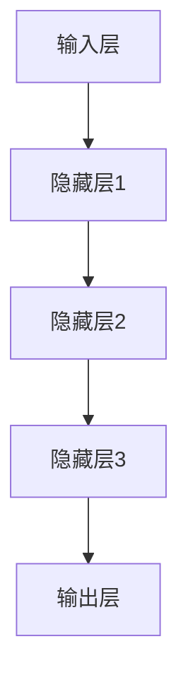
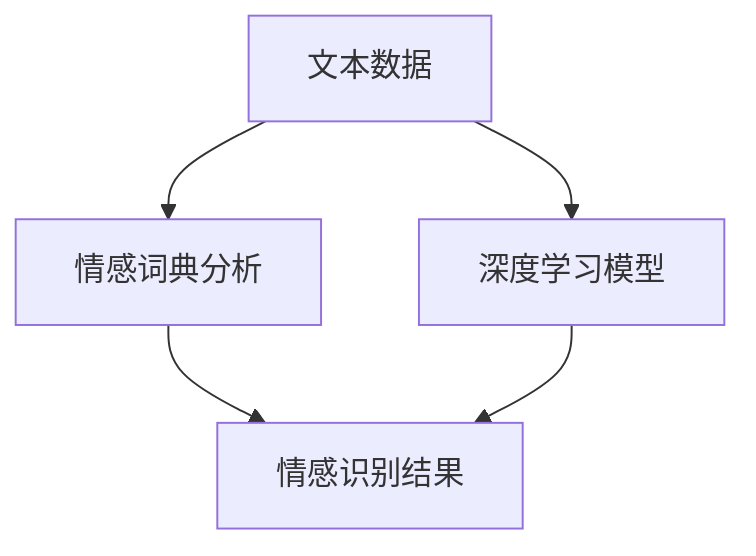
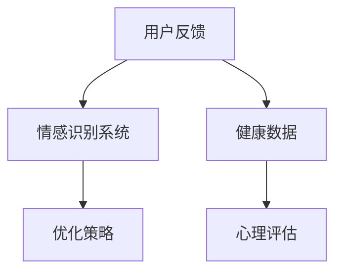

                 


## 文章标题
基于AI大模型的智能情感识别系统

## 关键词
AI大模型、情感识别、自然语言处理、深度学习、智能系统

## 摘要
本文将深入探讨基于AI大模型的智能情感识别系统，从核心概念、联系、算法原理、架构设计到应用实战，全方位解析这一前沿技术。通过逐步分析推理，帮助读者理解情感识别在AI大模型中的应用及其重要性。

---

### 第一部分：核心概念与联系

#### 1.1 AI大模型概述

##### 1.1.1 AI大模型的基本概念

AI大模型是指那些规模巨大、参数数量庞大的神经网络模型。它们通过海量数据的预训练和特定任务的微调，能够处理复杂的任务，如自然语言处理、图像识别等。

$$
\text{AI大模型} = (\text{海量数据} \times \text{大规模神经网络} \times \text{深度学习算法})
$$

##### 1.1.2 AI大模型的核心架构

AI大模型通常由以下几个关键部分组成：

1. **输入层**：接收外部数据，如文本、图像等。
2. **隐藏层**：多层神经网络结构，用于处理和变换数据。
3. **输出层**：生成预测结果，如分类标签、文本生成等。

##### 1.1.3 AI大模型的主要类型

1. **生成对抗网络（GAN）**：用于生成逼真的图像和数据。
2. **变分自编码器（VAE）**：用于生成和编码数据。
3. **自注意力机制（Self-Attention）**：用于处理序列数据，如文本和语音。



#### 1.2 情感识别系统

##### 1.2.1 情感识别的定义与分类

情感识别是指通过分析文本、语音或面部表情等，识别出用户的情绪状态。根据识别对象的类型，情感识别可以分为：

1. **文本情感分析**：分析文本内容，识别出积极、消极或中立情绪。
2. **语音情感分析**：通过分析语音信号，识别出情绪状态。
3. **面部表情情感分析**：通过分析面部表情，识别出情绪状态。

##### 1.2.2 情感识别的关键技术

1. **情感词典**：使用预定义的词汇库，通过词频和语义分析，识别情感。
2. **深度学习模型**：如卷积神经网络（CNN）和循环神经网络（RNN），用于自动学习和识别情感。
3. **多模态融合**：结合文本、语音和面部表情等多源数据，提高情感识别的准确性。



#### 1.3 情感识别系统应用

##### 1.3.1 营销与市场

情感识别系统可以帮助企业分析消费者反馈，优化产品和营销策略。

##### 1.3.2 健康医疗

情感识别系统可以帮助医生评估患者的心理状态，为治疗提供依据。

##### 1.3.3 人机交互

情感识别系统可以提升智能设备的交互体验，如智能家居、虚拟助手等。



### 第二部分：核心算法原理讲解

#### 2.1 常用情感识别算法

##### 2.1.1 支持向量机（SVM）

支持向量机是一种分类算法，通过寻找最佳超平面，将不同情感的文本数据分隔开。

```python
def SVM(train_data, train_labels):
    # 训练模型
    # 找到最佳超平面
    # 预测新数据的类别
    return model
```

##### 2.1.2 卷积神经网络（CNN）

卷积神经网络是一种深度学习模型，用于处理图像数据，识别情感。

```python
def CNN(train_data, train_labels):
    # 构建卷积层
    # 添加池化层
    # 添加全连接层
    # 训练模型
    return model
```

#### 2.2 情感识别系统架构设计

##### 2.2.1 数据预处理

数据预处理包括文本清洗、词向量编码等步骤，为后续的情感分析提供高质量的数据。

```python
def preprocess_data(data):
    # 清洗文本
    # 删除停用词
    # 编码词向量
    return processed_data
```

##### 2.2.2 模型训练与评估

模型训练与评估包括选择合适的模型、训练参数调优和模型评估。

```python
def train_and_evaluate(model, train_data, train_labels):
    # 训练模型
    # 调优参数
    # 评估模型
    return evaluation_results
```

---

至此，我们已经完成了文章的第一部分和第二部分的初步构建。接下来，我们将进一步深入探讨情感识别系统的应用和实际项目实战，帮助读者更好地理解这一技术。在后续的内容中，我们将继续逐步分析推理，提供更详细的讲解和案例分析。敬请期待！

