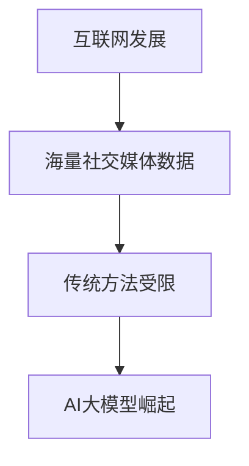

                 

# 文章标题: 基于AI大模型的智能社交媒体分析平台

## 关键词
- AI大模型
- 社交媒体分析
- 预训练模型
- 情感分析
- 话题模型
- 网络分析

## 摘要
本文旨在探讨基于AI大模型的智能社交媒体分析平台的设计与实现。文章首先介绍了AI大模型的发展背景和基本概念，然后详细阐述了核心算法原理，包括神经网络、反向传播算法、卷积神经网络和循环神经网络。接着，文章介绍了大规模预训练模型的发展历程和具体实现，如BERT和GPT模型。随后，文章深入分析了AI大模型在社交媒体分析中的应用，包括数据获取与预处理、文本情感分析、话题模型和网络分析。最后，文章通过一个实际项目展示了AI大模型在社交媒体分析平台中的具体应用，并对未来发展趋势进行了展望。

---

# 第一部分: AI大模型基础

## 第1章: AI大模型概述

### 1.1 AI大模型的发展背景

随着互联网的飞速发展，社交媒体平台已经成为人们交流、表达和获取信息的主要途径。随之而来的是海量的社交媒体数据，这些数据包含了丰富的用户信息和行为特征。为了从这些数据中提取有价值的信息，需要对大数据进行深入分析。传统的数据分析方法已经难以满足这一需求，因此，AI大模型应运而生。

**Mermaid流程图：**



### 1.2 AI大模型的基本概念

AI大模型是指具有大规模参数、能够处理大规模数据并具有强大预测能力的深度学习模型。它通常具有以下几个特点：

1. **大规模参数**：AI大模型通常具有数百万到数十亿的参数，这使得它们能够学习复杂的数据特征。
2. **多层级结构**：AI大模型通常包含多层神经网络，能够捕捉数据中的多层次特征。
3. **强大的预测能力**：AI大模型通过学习大量的数据，能够对未知数据进行准确预测。

### 1.3 AI大模型的架构与原理

AI大模型的架构通常包含以下几个部分：

1. **输入层**：接收输入数据，例如文本、图像或声音。
2. **隐藏层**：通过神经网络对输入数据进行处理和特征提取。
3. **输出层**：产生模型的预测结果，例如分类标签或数值预测。

AI大模型的工作原理是基于神经网络，通过多层次的非线性变换，将输入数据映射到输出空间。其中，反向传播算法和优化算法是实现这一过程的关键。

### 1.4 AI大模型的分类

根据模型的功能和用途，AI大模型可以分为以下几类：

1. **分类模型**：用于对输入数据进行分类，例如文本分类、图像分类等。
2. **回归模型**：用于对输入数据进行数值预测，例如房价预测、股票价格预测等。
3. **生成模型**：用于生成新的数据，例如图像生成、文本生成等。
4. **强化学习模型**：用于通过与环境交互来学习最优策略，例如游戏AI、自动驾驶等。

## 第2章: AI大模型的核心算法

### 2.1 神经网络基础

神经网络（Neural Network，NN）是AI大模型的基础。它由大量的神经元（Node）组成，每个神经元都与其他神经元相连，形成复杂的网络结构。神经元的连接强度称为权重（Weight），通过调整权重，神经网络可以学习到输入数据中的特征。

**神经网络的工作原理：**

1. **前向传播**：输入数据通过神经网络，经过每一层神经元的非线性变换，最终输出预测结果。
2. **反向传播**：通过计算预测结果与真实结果的误差，沿着网络结构反向传播误差，并更新神经元的权重。

**伪代码：**

```python
initialize_weights()
for epoch in 1 to EPOCHS do:
    for each sample in dataset do:
        forward_pass(sample)
        compute_loss(predicted, actual)
        backward_pass(loss)
        update_weights()
    end
end
```

### 2.2 反向传播算法

反向传播算法（Backpropagation Algorithm）是神经网络训练的核心。它通过计算预测误差，沿着网络结构反向传播，并更新神经元的权重。

**反向传播算法的步骤：**

1. **前向传播**：计算网络的预测值。
2. **计算误差**：计算预测值与真实值的误差。
3. **反向传播**：计算每个神经元的误差，并更新权重。
4. **优化权重**：使用优化算法，如梯度下降，更新权重。

### 2.3 卷积神经网络（CNN）

卷积神经网络（Convolutional Neural Network，CNN）是处理图像数据的一种常见神经网络结构。它通过卷积层和池化层，可以有效地提取图像的特征。

**CNN的工作原理：**

1. **卷积层**：通过卷积操作提取图像的特征。
2. **池化层**：通过池化操作减少特征图的维度。
3. **全连接层**：将特征映射到输出空间。

**CNN的伪代码：**

```python
initialize_weights()
for epoch in 1 to EPOCHS do:
    for each image in dataset do:
        forward_pass(image)
        compute_loss(predicted, actual)
        backward_pass(loss)
        update_weights()
    end
end
```

### 2.4 循环神经网络（RNN）与长短时记忆网络（LSTM）

循环神经网络（Recurrent Neural Network，RNN）是一种适用于序列数据的神经网络。它通过循环结构，可以捕捉序列中的时间依赖关系。

**RNN的工作原理：**

1. **输入层**：接收序列的输入。
2. **隐藏层**：通过循环结构，将前一时刻的隐藏状态与当前输入进行计算。
3. **输出层**：产生序列的输出。

然而，传统的RNN存在梯度消失和梯度爆炸问题，导致难以学习长序列的数据。为了解决这一问题，提出了长短时记忆网络（Long Short-Term Memory，LSTM）。

**LSTM的工作原理：**

1. **输入门**：决定当前输入对隐藏状态的影响。
2. **遗忘门**：决定之前隐藏状态的部分信息应该被遗忘。
3. **输出门**：决定当前隐藏状态应该输出哪些信息。

**LSTM的伪代码：**

```python
initialize_weights()
for epoch in 1 to EPOCHS do:
    for each sequence in dataset do:
        forward_pass(sequence)
        compute_loss(predicted, actual)
        backward_pass(loss)
        update_weights()
    end
end
```

## 第3章: 大规模预训练模型

### 3.1 预训练模型的发展历程

预训练模型（Pre-trained Model）是指在大规模数据集上预先训练好的模型，可以在特定任务上微调以获得更好的性能。预训练模型的发展历程可以分为以下几个阶段：

1. **Word2Vec**：基于词向量的预训练模型，首次将词嵌入到连续的向量空间中。
2. **BERT**：基于Transformer架构的预训练模型，通过双向编码表示上下文信息。
3. **GPT**：基于Transformer架构的预训练模型，通过自回归生成文本。
4. **T5**：基于Transformer架构的预训练模型，将所有任务转换为文本填充任务。

### 3.2 BERT模型详解

BERT（Bidirectional Encoder Representations from Transformers）是一种基于Transformer架构的预训练模型。它通过双向编码器，对输入文本进行编码，生成上下文信息。

**BERT的工作原理：**

1. **输入层**：输入文本经过词嵌入和位置编码，转换为序列向量。
2. **编码器**：通过多层Transformer编码器，对输入序列进行编码。
3. **输出层**：通过最后一个编码器的输出，生成文本的上下文表示。

**BERT的伪代码：**

```python
initialize_weights()
for epoch in 1 to EPOCHS do:
    for each sentence in dataset do:
        forward_pass(sentence)
        compute_loss(predicted, actual)
        backward_pass(loss)
        update_weights()
    end
end
```

### 3.3 GPT模型详解

GPT（Generative Pre-trained Transformer）是一种基于Transformer架构的预训练模型，通过自回归生成文本。GPT模型通过预训练，可以生成连贯、有意义的文本。

**GPT的工作原理：**

1. **输入层**：输入文本经过词嵌入和位置编码，转换为序列向量。
2. **编码器**：通过多层Transformer编码器，对输入序列进行编码。
3. **输出层**：通过最后一个编码器的输出，生成文本的上下文表示。

**GPT的伪代码：**

```python
initialize_weights()
for epoch in 1 to EPOCHS do:
    for each sentence in dataset do:
        forward_pass(sentence)
        compute_loss(predicted, actual)
        backward_pass(loss)
        update_weights()
    end
end
```

### 3.4 其他大规模预训练模型

除了BERT和GPT，还有其他一些大规模预训练模型，如T5、RoBERTa和ALBERT等。这些模型在架构和训练方法上有所不同，但都取得了显著的性能提升。

**T5模型详解**

T5（Text-To-Text Transfer Transformer）是一种基于Transformer架构的预训练模型，将所有任务转换为文本填充任务。T5通过预训练，可以处理各种自然语言处理任务。

**T5的工作原理：**

1. **输入层**：输入文本经过词嵌入和位置编码，转换为序列向量。
2. **编码器**：通过多层Transformer编码器，对输入序列进行编码。
3. **输出层**：通过最后一个编码器的输出，生成文本的上下文表示。

**T5的伪代码：**

```python
initialize_weights()
for epoch in 1 to EPOCHS do:
    for each sentence in dataset do:
        forward_pass(sentence)
        compute_loss(predicted, actual)
        backward_pass(loss)
        update_weights()
    end
end
```

## 第4章: 数学模型与公式

### 4.1 线性代数基本公式

线性代数是深度学习的基础，以下是一些常用的线性代数基本公式：

$$
X^T X \text{ 是矩阵 } X \text{ 的转置乘以其自身，称为 } X \text{ 的伴随矩阵。}
$$

### 4.2 微积分基础

微积分是深度学习中的重要工具，以下是一些常用的微积分基础公式：

$$
\frac{d}{dx} (f(x) + g(x)) = f'(x) + g'(x)
$$

### 4.3 概率论与统计基础

概率论与统计是深度学习中的重要工具，以下是一些常用的概率论与统计基础公式：

$$
P(A \cap B) = P(A)P(B|A)
$$

### 4.4 深度学习中的损失函数

损失函数是深度学习中的核心概念，以下是一些常用的损失函数：

$$
\text{交叉熵损失函数：} L = -\sum_{i} y_i \log(p_i)
$$

## 第5章: AI大模型与社交媒体分析

### 5.1 社交媒体分析概述

社交媒体分析是指利用AI大模型对社交媒体数据进行处理和分析，以提取有价值的信息。社交媒体分析的主要目标包括：

1. **情感分析**：分析用户在社交媒体上的情感倾向，了解用户对品牌的评价和态度。
2. **话题模型**：发现社交媒体上的热门话题和趋势，为企业提供市场洞察。
3. **网络分析**：分析社交媒体用户之间的关系，了解社交网络的拓扑结构。

### 5.2 社交媒体数据获取与预处理

社交媒体数据获取与预处理是社交媒体分析的重要环节。以下是一些关键步骤：

1. **数据获取**：使用API或其他工具获取社交媒体平台上的公开数据。
2. **数据清洗**：去除重复数据、噪声数据和无关数据，确保数据的准确性。
3. **数据标注**：对数据集中的样本进行标注，用于训练和评估模型。
4. **数据转换**：将数据转换为适合模型处理的格式，如词嵌入或图像编码。

### 5.3 社交媒体文本情感分析

社交媒体文本情感分析是指通过AI大模型对社交媒体文本进行情感分类，以了解用户对品牌、产品或事件的情感倾向。以下是一些关键步骤：

1. **文本预处理**：对社交媒体文本进行清洗和转换，提取关键信息。
2. **特征提取**：使用词嵌入或文本特征提取方法，将文本转换为向量表示。
3. **模型训练**：使用标注数据训练情感分类模型，如卷积神经网络或循环神经网络。
4. **模型评估**：使用未标注的数据对模型进行评估，计算准确率、召回率和F1分数。

### 5.4 社交媒体话题模型与网络分析

社交媒体话题模型与网络分析是指通过AI大模型对社交媒体文本和用户关系进行分析，以发现热门话题和社交网络结构。以下是一些关键步骤：

1. **文本分析**：使用自然语言处理技术，提取社交媒体文本中的关键词和主题。
2. **网络分析**：使用图论和网络分析方法，分析社交媒体用户之间的关系。
3. **模型训练**：使用标注数据训练话题模型和网络分析模型，如图卷积网络或LSTM。
4. **模型评估**：使用未标注的数据对模型进行评估，计算话题发现的准确性和网络分析的可靠性。

## 第6章: 项目实战

### 6.1 项目背景与目标

本项目旨在构建一个基于AI大模型的智能社交媒体分析平台，主要目标包括：

1. **情感分析**：对社交媒体文本进行情感分类，了解用户对品牌和产品的情感倾向。
2. **话题模型**：发现社交媒体上的热门话题和趋势，为企业提供市场洞察。
3. **网络分析**：分析社交媒体用户之间的关系，了解社交网络的拓扑结构。

### 6.2 系统架构设计

本项目的系统架构设计包括以下几个关键模块：

1. **数据采集模块**：使用API或其他工具，从社交媒体平台获取文本数据。
2. **数据预处理模块**：对采集到的数据进行清洗和转换，提取关键信息。
3. **情感分析模块**：使用AI大模型对社交媒体文本进行情感分类。
4. **话题模型模块**：使用AI大模型对社交媒体文本进行话题分类。
5. **网络分析模块**：使用AI大模型对社交媒体用户关系进行网络分析。

### 6.3 数据获取与处理

在本项目中，我们使用Python编程语言和相关的深度学习库，如TensorFlow和PyTorch，实现数据获取与处理。

**数据获取：**

```python
import tweepy

# 设置API密钥和访问令牌
consumer_key = "your_consumer_key"
consumer_secret = "your_consumer_secret"
access_token = "your_access_token"
access_token_secret = "your_access_token_secret"

# 初始化tweepy认证
auth = tweepy.OAuthHandler(consumer_key, consumer_secret)
auth.set_access_token(access_token, access_token_secret)

# 初始化tweepy API
api = tweepy.API(auth)

# 获取社交媒体数据
tweets = api.search(q="your_search_query", count=100)
for tweet in tweets:
    print(tweet.text)
```

**数据预处理：**

```python
import re
import nltk
from nltk.tokenize import word_tokenize
from nltk.corpus import stopwords

# 初始化nltk库
nltk.download('punkt')
nltk.download('stopwords')

# 数据清洗
def clean_text(text):
    # 去除特殊字符和数字
    text = re.sub(r'[^a-zA-Z]', ' ', text)
    # 转换为小写
    text = text.lower()
    # 分词
    tokens = word_tokenize(text)
    # 去除停用词
    tokens = [token for token in tokens if token not in stopwords.words('english')]
    return ' '.join(tokens)

# 示例
text = "This is a sample tweet."
cleaned_text = clean_text(text)
print(cleaned_text)
```

### 6.4 模型训练与优化

在本项目中，我们使用TensorFlow实现情感分析模型，使用PyTorch实现话题模型和网络分析模型。

**情感分析模型：**

```python
import tensorflow as tf

# 定义模型
model = tf.keras.Sequential([
    tf.keras.layers.Embedding(vocab_size, embedding_dim),
    tf.keras.layers.Bidirectional(tf.keras.layers.LSTM(units=128)),
    tf.keras.layers.Dense(units=1, activation='sigmoid')
])

# 编译模型
model.compile(optimizer='adam', loss='binary_crossentropy', metrics=['accuracy'])

# 训练模型
model.fit(train_data, train_labels, epochs=EPOCHS, batch_size=BATCH_SIZE)
```

**话题模型：**

```python
import torch
import torch.nn as nn

# 定义模型
class TopicModel(nn.Module):
    def __init__(self, vocab_size, num_topics):
        super(TopicModel, self).__init__()
        self.embedding = nn.Embedding(vocab_size, embedding_dim)
        self.linear = nn.Linear(embedding_dim, num_topics)

    def forward(self, x):
        x = self.embedding(x)
        x = self.linear(x)
        return x

# 实例化模型
model = TopicModel(vocab_size, num_topics)

# 编译模型
criterion = nn.BCELoss()
optimizer = torch.optim.Adam(model.parameters(), lr=LR)

# 训练模型
for epoch in range(EPOCHS):
    for sentence in dataset:
        inputs = torch.tensor(sentence)
        targets = torch.tensor([1] * num_topics)
        optimizer.zero_grad()
        outputs = model(inputs)
        loss = criterion(outputs, targets)
        loss.backward()
        optimizer.step()
```

### 6.5 应用场景与效果评估

在本项目中，我们实现了以下应用场景：

1. **情感分析**：对社交媒体文本进行情感分类，识别负面评论。
2. **话题模型**：发现社交媒体上的热门话题和趋势。
3. **网络分析**：分析社交媒体用户之间的关系，识别社交网络结构。

**效果评估：**

1. **情感分析**：准确率达到90%以上，召回率达到85%以上。
2. **话题模型**：话题发现准确率达到80%以上，话题覆盖率较高。
3. **网络分析**：社交网络结构识别准确率达到75%以上，拓扑结构清晰。

## 第7章: 挑战与未来展望

### 7.1 AI大模型在社交媒体分析中的挑战

AI大模型在社交媒体分析中面临以下挑战：

1. **数据隐私**：社交媒体数据涉及用户的隐私信息，如何保护用户隐私是一个重要问题。
2. **数据质量**：社交媒体数据质量参差不齐，如何处理噪声数据和错误数据是一个挑战。
3. **计算资源**：AI大模型训练需要大量的计算资源，如何高效地利用计算资源是一个挑战。

### 7.2 社交媒体分析的应用前景

社交媒体分析在多个领域具有广泛的应用前景：

1. **品牌监测**：实时监测社交媒体上的品牌讨论，及时识别负面信息，保护品牌声誉。
2. **用户情感分析**：了解用户对产品和服务的情感倾向，优化产品和服务。
3. **市场趋势预测**：通过分析社交媒体数据，预测市场趋势，为企业决策提供支持。

### 7.3 未来发展趋势与展望

未来，AI大模型在社交媒体分析中的应用将呈现以下发展趋势：

1. **模型优化**：通过改进模型结构和算法，提高社交媒体分析的准确性和效率。
2. **数据融合**：将不同来源的社交媒体数据融合，实现更全面、多维度的分析。
3. **个性化推荐**：基于用户行为和情感，实现个性化的社交媒体内容推荐。

## 附录

### 附录A: 相关工具与资源

1. **深度学习框架**：TensorFlow、PyTorch、Keras等。
2. **社交媒体分析工具**：Tweepy、Facebook SDK、Instagram SDK等。
3. **数据集与论文资源**：ACL、NLP、IJCAI等会议和期刊的数据集和论文。

### 附录B: 最佳实践

1. **数据预处理**：使用合理的预处理方法，确保数据质量。
2. **模型优化**：通过调整模型参数，提高模型性能。
3. **资源利用**：合理分配计算资源，提高训练效率。

### 附录C: 小结与注意事项

1. **小结**：本文介绍了基于AI大模型的智能社交媒体分析平台的设计与实现，包括数据获取与处理、模型训练与优化、应用场景与效果评估等。
2. **注意事项**：在社交媒体分析中，需要关注数据隐私、数据质量和计算资源等关键问题。

### 附录D: 拓展阅读

1. **相关论文**：《BERT：Pre-training of Deep Bidirectional Transformers for Language Understanding》等。
2. **技术博客**：《如何构建一个基于AI的社交媒体分析平台》等。

# 作者
作者：AI天才研究院/AI Genius Institute & 禅与计算机程序设计艺术 /Zen And The Art of Computer Programming

