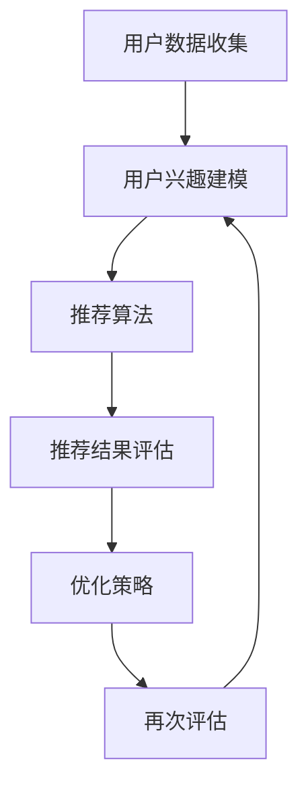

                 

### 文章标题

《基于LLM的推荐系统用户兴趣探索》

关键词：推荐系统、用户兴趣、大规模预训练语言模型（LLM）、个性化推荐、算法实现与优化

摘要：本文将深入探讨基于大规模预训练语言模型（LLM）的推荐系统用户兴趣探索。首先，介绍推荐系统的基本概念和用户兴趣建模的重要性，然后详细解释语言模型的基本原理及其在推荐系统中的应用。接着，重点分析LLM在推荐系统中的具体应用，包括大规模预训练语言模型的引入、用户兴趣探索的方法与实现，以及推荐系统的优化与评估。最后，通过实际案例展示如何构建和优化基于LLM的推荐系统，并对未来趋势与展望进行讨论。本文旨在为读者提供一套完整的基于LLM的推荐系统构建与优化的思路和方法。

## 推荐系统概述

### 1.1 推荐系统的定义与核心概念

推荐系统是一种信息过滤技术，旨在向用户推荐他们可能感兴趣的内容、商品或服务。其核心目标是提高用户体验，通过个性化推荐来满足用户的特定需求。推荐系统广泛应用于电子商务、社交媒体、新闻推送、在线视频平台等众多领域。

推荐系统主要由以下核心概念组成：

- **用户**：推荐系统的核心主体，每个用户都有其独特的兴趣和偏好。
- **项目**：用户可能感兴趣的内容、商品或服务，例如电影、商品、文章等。
- **评分/交互**：用户与项目之间的交互行为，如评分、点击、收藏、购买等。这些行为是推荐系统获取用户兴趣的重要数据来源。
- **推荐列表**：根据用户的历史行为和偏好，推荐系统生成的可能感兴趣的项目列表。

### 1.2 推荐系统的主要类型

推荐系统主要分为以下几种类型：

- **基于内容的推荐（Content-Based Filtering）**：通过分析用户过去喜欢的项目，提取其特征，然后推荐具有相似特征的项目。
- **协同过滤推荐（Collaborative Filtering）**：通过分析用户之间的相似性，利用其他用户的评分或行为预测目标用户的偏好。
- **混合推荐（Hybrid Methods）**：结合基于内容和协同过滤的推荐方法，以提高推荐的准确性。
- **基于模型的推荐（Model-Based Methods）**：使用机器学习算法，如决策树、神经网络等，建立用户和项目之间的关系模型，进行推荐。

### 1.3 推荐系统的核心挑战

虽然推荐系统在许多应用场景中取得了显著的成效，但仍然面临着一些核心挑战：

- **冷启动问题（Cold Start Problem）**：新用户或新项目缺乏足够的交互数据，难以进行准确的推荐。
- **数据稀疏性（Data Sparsity）**：用户与项目之间的交互数据往往非常稀疏，难以捕捉到用户的真实偏好。
- **用户多样性（User Diversity）**：推荐系统需要满足不同用户的需求，避免过度集中推荐类似的项目，导致用户流失。
- **实时性（Real-Time）**：随着用户需求的不断变化，推荐系统需要快速响应用户的行为，提供实时推荐。
- **解释性（Interpretability）**：推荐系统的决策过程需要具备一定的解释性，以帮助用户理解和信任推荐结果。

## 用户兴趣建模

### 1.2.1 用户兴趣建模的重要性

用户兴趣建模是推荐系统的核心组成部分，直接影响到推荐的质量和用户体验。一个有效的用户兴趣建模方法能够准确捕捉用户的偏好，从而生成个性化的推荐列表。以下是用户兴趣建模的重要性：

- **提高推荐准确性**：通过分析用户的历史行为和交互数据，用户兴趣建模能够更准确地预测用户的偏好，从而提高推荐的准确性。
- **增强用户体验**：个性化推荐能够更好地满足用户的需求，提高用户的满意度和参与度。
- **降低冷启动问题**：有效的用户兴趣建模方法可以在用户缺乏交互数据的情况下，通过分析用户的基本信息和行为模式，初步了解用户的兴趣，从而缓解冷启动问题。
- **促进内容多样性**：通过全面捕捉用户的兴趣点，用户兴趣建模有助于推荐系统提供多样化的内容，避免用户产生厌倦感。

### 1.2.2 用户兴趣数据的收集与预处理

用户兴趣数据的收集是用户兴趣建模的基础。以下是一些常见的数据收集方法：

- **显式反馈**：用户主动提供的评分、评论、标签等数据。例如，在电子商务平台上，用户对商品的评分和评论是重要的兴趣数据来源。
- **隐式反馈**：用户在平台上的行为数据，如浏览、点击、收藏、购买等。这些数据可以通过日志文件、点击流数据等获取。
- **用户信息**：用户的个人信息，如年龄、性别、地理位置、兴趣标签等。这些信息可以通过注册表单、用户调查等途径收集。

在收集到用户兴趣数据后，需要进行预处理以用于建模。以下是一些常见的预处理步骤：

- **数据清洗**：去除重复、错误或不完整的数据，确保数据质量。
- **特征提取**：将原始数据转换为特征向量，如文本数据可以转换为词袋模型或词嵌入向量，行为数据可以转换为频率统计或时间序列特征。
- **数据归一化**：对特征数据进行归一化处理，使其在相同的尺度上，避免某些特征对模型产生过大的影响。

### 1.2.3 用户兴趣表示方法

用户兴趣表示是将用户的偏好以数值形式表示的过程，以便于后续的建模和推荐。以下是一些常见的用户兴趣表示方法：

- **布尔表示法**：将用户的兴趣项作为布尔值进行表示，例如用户对电影A感兴趣为1，不感兴趣为0。
- **数值表示法**：将用户的兴趣项转换为具体的数值，例如根据用户的评分或点击次数进行加权。
- **向量表示法**：使用高维向量表示用户的兴趣，如词袋模型或词嵌入向量。向量中的每个维度代表一个兴趣项。

在用户兴趣表示过程中，需要注意的是：

- **稀疏性**：用户兴趣数据通常是稀疏的，即大多数项的值为0。因此，需要选择合适的表示方法，避免由于稀疏性导致的信息丢失。
- **维度选择**：过高的维度会导致计算复杂度增加，而较低的维度可能会导致信息丢失。因此，需要在维度选择上进行权衡。
- **实时性**：为了实现实时推荐，用户兴趣表示方法需要具备较高的实时性，即能够快速更新和调整用户的兴趣表示。

通过有效的用户兴趣建模，推荐系统能够更好地理解用户的偏好，提供更准确的个性化推荐，从而提升用户体验和满意度。

## 语言模型简介

### 2.1 语言模型的基本概念

语言模型（Language Model，简称LM）是自然语言处理（Natural Language Processing，简称NLP）领域的基础技术之一。它是一种能够预测下一个单词或短语的模型，通常用于文本生成、机器翻译、语音识别等任务。语言模型的核心目标是理解自然语言的统计规律，从而提高文本处理的准确性和效率。

#### 语言模型的定义与作用

语言模型通过对大量文本数据的学习，捕捉语言中的概率分布。具体来说，它能够计算某个句子或词语在特定上下文中的出现概率。例如，在给定前文“我想要一杯”，语言模型可以预测下一个最可能的词语是“咖啡”。

语言模型在自然语言处理中的应用非常广泛，主要包括以下方面：

1. **文本生成**：语言模型可以用于生成文本，如自动摘要、生成文章、生成对话等。
2. **机器翻译**：语言模型可以帮助翻译系统理解不同语言的语法和词汇，提高翻译质量。
3. **语音识别**：语言模型可以帮助语音识别系统将语音信号转换为文本，从而提高识别的准确性和鲁棒性。
4. **情感分析**：语言模型可以分析文本的情感倾向，帮助分类文本的情感标签。
5. **信息检索**：语言模型可以用于搜索引擎，通过理解用户的查询意图，提供更准确的搜索结果。

#### 语言模型的常见类型

根据训练数据和模型结构，语言模型可以分为以下几种类型：

1. **n-gram模型**：基于相邻词的统计方法，即只考虑前n个单词对下一个单词的影响。例如，一元模型（unigram）只考虑单个单词的概率，而二元模型（bigram）考虑两个相邻单词的概率。

2. **神经网络模型**：基于神经网络的模型，如循环神经网络（RNN）和变换器（Transformer）。这些模型能够捕捉长距离依赖和复杂的上下文信息，显著提高了语言模型的性能。

3. **深度神经网络（DNN）模型**：通过多层感知器（MLP）构建的神经网络，能够对输入进行非线性变换。DNN在语言模型中的应用主要包括词嵌入（word embedding）和序列模型（sequence model）。

4. **递归神经网络（RNN）**：RNN能够处理序列数据，如文本和语音。它通过记忆单元捕捉长距离依赖，但存在梯度消失和梯度爆炸的问题。

5. **长短时记忆网络（LSTM）**：LSTM是RNN的一种改进，通过门控机制解决了梯度消失问题，适用于长时间序列数据的建模。

6. **变换器（Transformer）**：Transformer模型是近年来发展起来的一种全新架构，通过多头自注意力机制（self-attention）捕捉长距离依赖，已经在各种NLP任务中取得了显著的成果。

#### 语言模型的发展历程

语言模型的发展可以分为以下几个阶段：

1. **基于规则的方法**：早期的语言模型主要通过手工编写规则，如词典和语法规则，来预测下一个单词。这种方法存在规则复杂、适应性差等问题。

2. **统计模型**：随着计算机科学和统计学的发展，基于统计的方法逐渐取代了基于规则的方法。n-gram模型是最早的统计语言模型，通过对大量文本数据的学习，预测下一个单词的概率。

3. **神经网络模型**：神经网络模型的出现标志着语言模型进入了一个新的时代。通过多层感知器和RNN，神经网络模型能够捕捉复杂的语言规律，提高了预测的准确性。

4. **深度学习模型**：随着计算能力的提升和大数据的普及，深度学习模型在语言模型中的应用变得越来越广泛。DNN、LSTM和Transformer等模型的出现，使得语言模型的性能得到了显著提升。

总之，语言模型作为自然语言处理的核心技术，其发展历程反映了计算机科学、统计学和人工智能领域的不断进步。随着技术的不断发展，语言模型在文本生成、翻译、识别等任务中的应用将会越来越广泛，为人类社会带来更多的便利。

### 2.2 语言模型的训练方法

语言模型的训练方法是构建高效和准确语言模型的关键。在训练过程中，需要通过大量的文本数据来学习语言中的统计规律，以便预测下一个单词或短语。以下是几种常见的语言模型训练方法：

#### 2.2.1 数据收集与预处理

首先，需要收集大量的文本数据作为训练语料。这些数据可以来自互联网、新闻、书籍、社交媒体等多种来源。为了提高训练效果，通常需要对原始文本进行预处理，包括：

1. **文本清洗**：去除无效字符、符号和停用词，以提高模型的训练效率。
2. **分词**：将文本拆分成单词或子词，以便进行后续处理。对于中文等非分词语言，可以使用分词工具进行自动化处理。
3. **词嵌入**：将单词映射到高维向量空间，以便进行向量运算。常用的词嵌入方法包括词袋模型（Bag of Words，BOW）和词嵌入（Word Embedding），如Word2Vec、GloVe等。

#### 2.2.2 基于N-gram的语言模型

N-gram模型是最早的统计语言模型之一，通过计算前n个单词出现的概率来预测下一个单词。以下是N-gram模型的训练步骤：

1. **构建N-gram表**：统计所有N-gram出现的频率，并将其存储在表中。例如，对于二元模型（Bigram），需要统计每个单词在前后各一个单词中出现的次数。
2. **概率计算**：对于给定的输入序列，计算每个N-gram的概率。可以使用最大熵模型（Maximum Entropy Model）或朴素贝叶斯（Naive Bayes）等方法来计算概率。
3. **预测**：在给定前文的情况下，选择概率最大的N-gram作为下一个单词的预测。

#### 2.2.3 基于神经网络的模型

基于神经网络的模型，如循环神经网络（RNN）和变换器（Transformer），通过学习输入序列和输出序列之间的关系来预测下一个单词。以下是这些模型的主要训练步骤：

1. **前向传播（Forward Propagation）**：将输入序列传递到神经网络中，通过每一层的计算得到输出序列。
2. **计算损失函数**：计算预测序列和真实序列之间的损失，常用的损失函数包括交叉熵损失（Cross-Entropy Loss）和均方误差（Mean Squared Error）。
3. **反向传播（Back Propagation）**：通过反向传播算法，将损失函数的梯度传播到网络中的每一层，更新网络参数。
4. **优化算法**：使用优化算法（如梯度下降、Adam等）更新网络参数，以最小化损失函数。

以下是一个基于RNN的语言模型训练过程的伪代码：

```python
# 假设已有预训练的RNN模型，输入序列为input_sequence
# 预测输出为predicted_sequence，真实输出为true_sequence

# 前向传播
output_sequence = RNN(input_sequence)

# 计算损失
loss = calculate_loss(true_sequence, output_sequence)

# 反向传播
RNN.backward(output_sequence, true_sequence)

# 更新模型参数
update_parameters(RNN.parameters())
```

#### 2.2.4 基于深度学习的语言模型

深度学习模型，如深度神经网络（DNN）和变换器（Transformer），通过多层非线性变换来学习输入和输出之间的关系。以下是一个基于变换器的语言模型训练过程的伪代码：

```python
# 假设已有预训练的Transformer模型，输入序列为input_sequence
# 预测输出为predicted_sequence，真实输出为true_sequence

# 前向传播
output_sequence = Transformer(input_sequence)

# 计算损失
loss = calculate_loss(true_sequence, output_sequence)

# 反向传播
Transformer.backward(output_sequence, true_sequence)

# 更新模型参数
update_parameters(Transformer.parameters())
```

通过以上训练方法，语言模型能够不断优化自身，提高预测准确性。在实际应用中，语言模型还需要通过调整超参数、增加训练数据等方法来进一步提高性能。

### 2.3 语言模型的主要类型

在自然语言处理领域，语言模型（Language Model，简称LM）是用于预测文本中下一个单词或短语概率的关键工具。根据模型架构和训练方法，语言模型可以分为多种类型，每种类型都有其独特的特点和适用场景。以下是几种主要的语言模型类型及其基本概念：

#### 2.3.1 N-gram模型

N-gram模型是最早的语言模型之一，它通过统计相邻单词的序列来预测下一个单词。N-gram模型的简单性和有效性使其在早期文本处理任务中得到了广泛应用。N-gram模型分为以下几种：

1. **一元模型（Unigram）**：只考虑单个单词的概率，即P(word) = 频率(word) / 总单词数。
2. **二元模型（Bigram）**：考虑两个相邻单词的概率，即P(word\_i | word\_{i-1}) = 频率(word\_i, word\_{i-1}) / 频率(word\_{i-1})。
3. **三元模型（Trigram）**：考虑三个相邻单词的概率，即P(word\_i | word\_{i-2}, word\_{i-1}) = 频率(word\_i, word\_{i-2}, word\_{i-1}) / 频率(word\_{i-2}, word\_{i-1})。

N-gram模型的优点在于计算简单，易于实现，且不需要复杂的模型训练过程。然而，N-gram模型的性能受限于其固定窗口大小，无法捕捉长距离依赖关系，且在处理稀疏数据时效果较差。

#### 2.3.2 隐马尔可夫模型（HMM）

隐马尔可夫模型（Hidden Markov Model，简称HMM）是另一种常用的语言模型，特别适用于序列数据的建模。HMM假设当前状态只依赖于前一个状态，并利用概率转移矩阵和发射概率矩阵来预测下一个状态。

HMM的基本概念包括：

- **状态序列**：表示文本中的单词序列。
- **观察序列**：由状态序列通过发射概率生成的单词序列。
- **转移概率**：表示从一个状态转移到另一个状态的概率。
- **发射概率**：表示在某个状态下产生特定单词的概率。

HMM能够捕捉状态之间的依赖关系，但其局限性在于无法处理非线性和非平稳性，且需要手动设定状态数量，这在实际应用中较为复杂。

#### 2.3.3 隐变量循环神经网络（LSTM）

长短期记忆网络（Long Short-Term Memory，简称LSTM）是RNN的一种改进，特别适用于处理长序列数据。LSTM通过引入记忆单元和门控机制，有效地解决了RNN中的梯度消失问题，能够捕捉长距离依赖关系。

LSTM的基本结构包括：

- **输入门（Input Gate）**：控制当前输入信息对记忆单元的影响。
- **遗忘门（Forget Gate）**：控制从记忆单元中遗忘的信息。
- **输出门（Output Gate）**：控制记忆单元的信息输出。

LSTM在自然语言处理中的优势包括：

- **捕捉长距离依赖**：LSTM能够保持长期的记忆，捕捉文本中的上下文信息。
- **稳定性**：通过门控机制，LSTM能够有效地避免梯度消失和梯度爆炸问题。
- **灵活性**：LSTM可以通过调整门控机制，适应不同的序列数据。

#### 2.3.4 变换器（Transformer）

变换器（Transformer）是近年来在NLP领域取得突破性进展的一种全新架构，其核心思想是自注意力机制（Self-Attention）。变换器通过多头自注意力机制和前馈神经网络，实现了对长序列数据的高效建模。

变换器的主要特点包括：

- **自注意力机制**：通过计算输入序列中每个单词的权重，实现对序列的长距离依赖捕捉。
- **并行计算**：变换器通过并行计算自注意力机制，显著提高了计算效率。
- **模块化结构**：变换器采用模块化设计，易于扩展和调整。

变换器在NLP中的成功应用包括：

- **文本生成**：通过预训练大规模语料库，变换器能够生成高质量的文本。
- **机器翻译**：变换器在机器翻译任务中取得了显著的成果，如Google翻译的底层技术。
- **情感分析**：变换器能够捕捉文本中的情感信息，用于情感分类任务。

总之，不同类型的语言模型各有优缺点，适用于不同的应用场景。N-gram模型简单高效，适用于短文本预测；HMM适用于序列数据建模；LSTM和变换器能够捕捉长距离依赖，适用于复杂文本处理任务。了解和选择合适的语言模型，对于提升自然语言处理任务的性能至关重要。

### 2.4 基于语言模型的推荐系统原理

语言模型（LM）在推荐系统中的应用，主要利用其强大的文本理解和生成能力，来实现对用户兴趣的精准捕捉和个性化推荐。以下是基于语言模型的推荐系统原理：

#### 2.4.1 语言模型在推荐系统中的应用

语言模型在推荐系统中的应用，主要体现在以下几个方面：

1. **用户兴趣建模**：通过分析用户的浏览历史、搜索记录和交互行为，语言模型能够生成用户的兴趣词向量，从而实现对用户兴趣的准确捕捉。这种基于语义理解的兴趣建模方法，能够更深入地理解用户的潜在需求，提高推荐的准确性。

2. **项目描述生成**：在推荐系统中，项目描述的生成对于用户理解和决策至关重要。语言模型可以基于项目的文本描述，生成具有吸引力的个性化描述，从而提高用户的点击率和参与度。

3. **推荐结果优化**：通过语言模型，可以优化推荐结果的表达方式。例如，使用自然语言生成技术，将推荐结果以更符合用户习惯的方式呈现，提高用户的接受度和满意度。

#### 2.4.2 基于语言模型的推荐系统工作流程

基于语言模型的推荐系统通常包含以下工作流程：

1. **数据收集与预处理**：收集用户的浏览历史、搜索记录、点击行为等交互数据，并对数据进行清洗、去噪和归一化处理。

2. **用户兴趣建模**：利用语言模型，将用户的交互数据转换为高维语义向量，形成用户的兴趣词向量。常用的方法包括词嵌入（如Word2Vec、GloVe）和变换器（Transformer）等。

3. **项目特征提取**：对推荐系统中的项目进行特征提取，通常包括文本描述、标签、用户评分等。文本描述可以经过语言模型处理，转换为语义向量。

4. **推荐生成**：基于用户兴趣词向量和项目特征向量，使用语言模型生成推荐结果。常见的推荐算法包括基于内容的推荐（Content-Based Filtering）和协同过滤（Collaborative Filtering）等。

5. **推荐结果优化**：通过自然语言生成技术，对推荐结果进行优化，使其更符合用户的阅读习惯和语言风格。

6. **推荐评估**：评估推荐系统的性能，包括准确性、多样性、新颖性等指标。常用的评估方法包括A/B测试、在线评估等。

#### 2.4.3 基于语言模型的推荐系统优势

基于语言模型的推荐系统相较于传统的推荐方法，具有以下优势：

1. **更精准的兴趣捕捉**：语言模型能够基于语义理解，捕捉用户的潜在兴趣，提高推荐的准确性。

2. **更好的个性化**：通过用户兴趣词向量和项目特征向量的匹配，语言模型能够实现更精细的个性化推荐，满足用户的个性化需求。

3. **更强的表达能力**：语言模型能够生成丰富的文本描述，提高推荐结果的表达力和吸引力。

4. **更灵活的扩展性**：基于语言模型的推荐系统可以方便地集成到现有推荐系统中，实现快速部署和扩展。

5. **更优的实时性**：语言模型训练速度快，能够在较短的时间内更新用户兴趣，实现实时推荐。

总之，基于语言模型的推荐系统在用户兴趣捕捉、个性化推荐和表达力等方面具有显著优势，是未来推荐系统发展的一个重要方向。

### 2.5 基于语言模型的推荐系统优势

基于语言模型的推荐系统（LMBRS）相较于传统推荐系统，具有以下显著优势：

#### 2.5.1 更精准的兴趣捕捉

传统推荐系统通常依赖于协同过滤（Collaborative Filtering）和基于内容的推荐（Content-Based Filtering）等方法。这些方法主要依赖用户的历史行为和项目的特征，存在以下局限性：

1. **数据稀疏性**：用户和项目之间的交互数据通常非常稀疏，导致推荐结果的准确性受限。
2. **共现关系误判**：仅根据用户之间的共现关系进行推荐，可能导致误判和重复推荐。
3. **内容理解不足**：传统方法难以理解项目内容的深层次语义，无法捕捉用户真正的兴趣。

相比之下，基于语言模型的推荐系统利用大规模预训练语言模型（如BERT、GPT等）对用户行为数据进行深度语义分析，能够更准确地捕捉用户的潜在兴趣。具体优势包括：

- **语义理解**：LMBRS能够基于语义理解，将用户行为数据（如浏览历史、搜索记录）转换为高维语义向量，实现对用户兴趣的精准捕捉。
- **跨领域迁移**：预训练语言模型在大规模数据上训练，具有较强的跨领域迁移能力，可以在不同应用场景中灵活使用。
- **长期依赖捕捉**：LMBRS能够通过自注意力机制（Self-Attention）捕捉长距离依赖关系，更全面地理解用户的兴趣。

#### 2.5.2 更强的个性化能力

个性化推荐是提升用户体验和满意度的重要手段。传统推荐系统通常通过用户历史行为和项目特征进行简单匹配，难以实现精细化的个性化推荐。相比之下，LMBRS具有以下优势：

- **多维度个性化**：LMBRS不仅考虑用户历史行为，还通过语义分析捕捉用户的兴趣偏好，实现多维度个性化推荐。
- **动态调整**：LMBRS能够实时更新用户兴趣向量，根据用户行为的变化动态调整推荐策略，提高推荐的相关性和实时性。
- **精细化推荐**：通过语义理解，LMBRS可以识别用户的细微兴趣差异，生成更精细化的推荐结果，满足用户的个性化需求。

#### 2.5.3 更丰富的表达形式

传统推荐系统通常以列表或标签的形式呈现推荐结果，用户理解和使用上存在一定障碍。LMBRS通过自然语言生成（Natural Language Generation，NLG）技术，能够生成丰富多样的推荐描述，具体优势包括：

- **可解释性**：LMBRS生成的推荐描述具有可解释性，用户可以直观地理解推荐的原因和逻辑。
- **吸引力**：通过自然语言生成，LMBRS可以生成更具吸引力的推荐描述，提高用户的点击率和参与度。
- **多样化**：LMBRS可以根据用户需求和场景，生成不同风格和形式的推荐描述，满足多样化的用户需求。

#### 2.5.4 更好的扩展性和集成性

传统推荐系统通常需要针对特定应用场景进行定制化开发，导致系统扩展性和集成性较差。相比之下，LMBRS具有以下优势：

- **模块化设计**：LMBRS采用模块化设计，包括用户兴趣建模、推荐生成、自然语言生成等模块，易于扩展和集成到现有系统中。
- **通用性**：LMBRS基于大规模预训练语言模型，具有较强的通用性，可以在多个应用场景中复用。
- **快速部署**：LMBRS开发周期较短，可以在较短时间内实现部署和上线，降低开发和维护成本。

总之，基于语言模型的推荐系统在精准兴趣捕捉、个性化推荐、表达形式和系统扩展性等方面具有显著优势，是未来推荐系统发展的重要方向。

### 2.6 基于语言模型的推荐系统实现

实现一个基于语言模型的推荐系统需要从数据收集与预处理、模型选择与训练、推荐生成与优化等多个方面进行设计和实施。以下是详细的实现步骤：

#### 2.6.1 数据收集与预处理

1. **数据源**：收集用户交互数据，如浏览历史、搜索记录、点击日志、用户评价等。此外，还需要获取项目的描述信息、分类标签等。

2. **数据清洗**：去除重复、缺失和异常数据，确保数据质量。对于文本数据，去除停用词、标点符号和特殊字符，对中文数据进行分词处理。

3. **特征提取**：将文本数据转换为向量表示，可以使用词嵌入（Word Embedding）技术，如Word2Vec、GloVe等。对于用户和项目特征，可以提取用户的行为特征（如点击次数、浏览时间）和项目属性（如类别、标签）。

4. **数据分群**：根据用户和项目的特征，将用户和项目分为多个分群，以便进行更精细化的推荐。

#### 2.6.2 模型选择与训练

1. **模型选择**：选择合适的语言模型，如BERT、GPT、RoBERTa等。这些预训练模型已经在大规模数据上进行了训练，具有良好的语义理解能力。

2. **用户兴趣建模**：利用语言模型对用户交互数据进行建模，生成用户的兴趣向量。具体步骤包括：
   - **编码**：将用户交互数据输入到语言模型中，获取用户兴趣嵌入向量。
   - **分类**：使用分类器（如SVM、Random Forest等）对用户兴趣向量进行分类，生成用户的兴趣标签。

3. **项目描述建模**：对项目描述进行编码，获取项目嵌入向量。这有助于在推荐过程中更好地理解项目内容。

4. **模型训练与优化**：使用用户和项目的特征向量，训练推荐模型（如协同过滤、基于内容的推荐等）。通过交叉验证和超参数调优，优化模型性能。

#### 2.6.3 推荐生成与优化

1. **推荐策略**：根据用户兴趣向量，为用户生成个性化推荐列表。推荐策略包括基于协同过滤、基于内容、混合推荐等方法。

2. **推荐结果优化**：通过自然语言生成技术，生成具有吸引力的推荐描述。优化策略包括：
   - **多样性**：确保推荐列表中的项目具有多样性，避免重复推荐。
   - **相关性**：确保推荐列表中的项目与用户兴趣高度相关。
   - **新颖性**：根据用户行为和兴趣变化，实时更新推荐列表，提高新颖性。

3. **评估与调整**：使用评估指标（如准确率、召回率、覆盖率等）评估推荐系统的性能。根据评估结果，调整模型参数和推荐策略，优化系统性能。

#### 2.6.4 实现案例

以下是一个简单的基于语言模型的推荐系统实现案例：

```python
# 假设已有预训练的BERT模型，用户交互数据为user_data，项目描述为item_desc

# 数据预处理
user_embeddings = bert_encode(user_data)
item_embeddings = bert_encode(item_desc)

# 训练推荐模型
# 假设使用协同过滤算法
user_item_matrix = user_embeddings.dot(item_embeddings.T)
user_item_scores = softmax(user_item_matrix)

# 生成推荐列表
top_k_indices = np.argsort(user_item_scores)[:, -K:]
top_k_items = [item_ids[i] for i in top_k_indices]

# 自然语言生成推荐描述
def generate_recommendation_desc(item_ids):
    # 假设使用GPT模型
    with torch.no_grad():
        inputs = tokenizer(item_ids, return_tensors='pt')
        outputs = model.generate(inputs['input_ids'], max_length=50)
    return tokenizer.decode(outputs[0], skip_special_tokens=True)

recommendation_desc = generate_recommendation_desc(top_k_items)

# 输出推荐结果
print(recommendation_desc)
```

通过以上步骤，可以构建一个基于语言模型的推荐系统，实现个性化的推荐服务。

### 3.1 大规模预训练语言模型的引入

大规模预训练语言模型（LLM）的引入是推荐系统技术发展的重要里程碑。LLM通过在大量文本数据上进行预训练，能够自动学习语言中的复杂结构和语义信息，从而在推荐系统中发挥重要作用。以下是LLM在推荐系统中的原理、应用场景以及面临的挑战和解决方法。

#### 3.1.1 LLM的基本原理

LLM通常基于深度学习技术，特别是变换器（Transformer）架构，通过自注意力机制（Self-Attention）对输入序列进行建模。LLM的训练过程通常分为两个阶段：

1. **预训练阶段**：在预训练阶段，LLM通过在大量文本数据上学习语言的基础知识，包括语法、语义、上下文等。预训练任务通常包括掩码语言模型（Masked Language Model，MLM）、生成式任务（如Cascading Language Model，CLM）等。

2. **微调阶段**：在微调阶段，LLM根据特定任务进行进一步训练，如文本分类、问答系统、推荐系统等。微调过程通过将预训练模型应用于特定领域的数据，调整模型的参数，以适应新任务的需求。

#### 3.1.2 LLM在推荐系统中的应用场景

LLM在推荐系统中具有广泛的应用场景，主要包括以下几个方面：

1. **用户兴趣建模**：LLM能够通过分析用户的文本数据（如浏览历史、搜索记录、评价等），自动生成用户的兴趣向量。这些兴趣向量可以用于个性化推荐，提高推荐的准确性。

2. **项目描述生成**：LLM可以生成项目的描述文本，使得推荐结果更具吸引力和解释性。这种描述不仅包括项目的属性，还可以基于语义理解生成具有情感色彩和个性化特点的描述。

3. **推荐结果优化**：通过LLM，可以为推荐结果生成多样化的描述和摘要，提高用户的接受度和参与度。例如，可以使用LLM生成不同风格的推荐描述，以满足不同用户的需求。

4. **动态调整**：LLM可以实时更新用户兴趣和项目描述，使得推荐系统能够快速适应用户行为和需求的变化，提高推荐的实时性和响应速度。

#### 3.1.3 LLM在推荐系统中的挑战和解决方法

尽管LLM在推荐系统中具有巨大潜力，但在实际应用中仍面临一些挑战：

1. **数据隐私**：大规模预训练语言模型需要大量的文本数据，这些数据可能包含用户的隐私信息。为保护用户隐私，需要在数据收集和处理过程中采取严格的隐私保护措施。

2. **计算资源**：预训练LLM需要大量的计算资源和存储空间，这限制了在资源有限的环境中部署LLM。为解决这一问题，可以采用以下方法：
   - **模型压缩**：通过模型压缩技术（如量化、剪枝、蒸馏等）减小模型的大小，降低计算资源的需求。
   - **分布式训练**：利用分布式计算资源，加快LLM的预训练和微调过程。

3. **实时性**：LLM的预训练和微调过程通常需要较长时间，难以满足实时推荐的需求。为提高实时性，可以采用以下方法：
   - **在线学习**：使用在线学习技术，实时更新模型参数，以适应用户行为的变化。
   - **增量训练**：通过增量训练，仅更新模型中与用户行为相关的部分，减少训练时间。

4. **可解释性**：LLM的预测过程通常非常复杂，难以解释。为提高可解释性，可以采用以下方法：
   - **模型可视化**：通过可视化技术，展示模型的关键特征和决策过程。
   - **解释性模块**：设计专门的可解释性模块，解释模型在推荐过程中的具体操作。

总之，大规模预训练语言模型的引入为推荐系统带来了新的机遇和挑战。通过克服这些挑战，LLM有望在推荐系统中发挥更大的作用，提升推荐的质量和用户体验。

### 3.2 用户兴趣探索

#### 3.2.1 用户兴趣探索的概念与目标

用户兴趣探索（User Interest Exploration）是推荐系统中的一个关键环节，旨在发现和理解用户在特定领域或多个领域中的兴趣点。其核心目标是通过对用户历史行为和交互数据的分析，挖掘用户的潜在兴趣，从而为用户生成个性化的推荐内容。

用户兴趣探索的重要性体现在以下几个方面：

1. **提升推荐准确性**：通过对用户兴趣的深入理解，推荐系统能够更准确地预测用户对特定内容的喜好，从而生成更相关的推荐。
2. **增强用户体验**：个性化的推荐能够满足用户的需求，提高用户对推荐内容的满意度和参与度。
3. **解决冷启动问题**：对于新用户，通过兴趣探索可以快速了解其偏好，缓解冷启动问题，提高新用户留存率。

用户兴趣探索的主要任务包括：

1. **兴趣发现**：从用户历史行为中提取兴趣点，如浏览、搜索、点击等。
2. **兴趣聚合**：对多个兴趣点进行整合，形成用户兴趣图谱。
3. **兴趣分类**：将用户兴趣划分为不同的类别，以便进行更精细化的推荐。

#### 3.2.2 用户兴趣探索的方法与技术

用户兴趣探索的方法和技术多种多样，以下是一些主要的方法：

1. **基于协同过滤的方法**：协同过滤方法通过分析用户之间的相似性，推荐用户可能感兴趣的项目。常见的技术包括用户基于的协同过滤（User-Based Collaborative Filtering）和项目基于的协同过滤（Item-Based Collaborative Filtering）。这些方法在用户行为数据丰富的情况下表现良好，但难以捕捉用户的长期和潜在兴趣。

2. **基于内容的推荐方法**：基于内容的方法通过分析项目的特征和属性，将具有相似特征的项目推荐给有相同兴趣的用户。这种方法依赖于项目的文本描述、标签、类别等特征。虽然能够生成相关的推荐，但缺乏对用户行为的深度理解。

3. **基于机器学习的方法**：机器学习方法，如决策树、支持向量机（SVM）、神经网络等，通过建立用户行为和项目特征之间的关系模型，进行兴趣探索。这种方法能够捕捉复杂的用户兴趣模式，但需要大量的数据和高计算资源。

4. **基于深度学习的方法**：深度学习方法，如循环神经网络（RNN）、变换器（Transformer）等，通过自注意力机制和多层神经网络结构，能够高效地捕捉长距离依赖和用户兴趣。这种方法在处理大规模数据和复杂任务时具有明显优势。

5. **多模态融合方法**：多模态融合方法将用户的文本数据、图像、音频等多种数据进行整合，通过多模态特征学习，实现更全面的用户兴趣探索。

#### 3.2.3 用户兴趣探索的实际应用案例

以下是一些用户兴趣探索的实际应用案例：

1. **电子商务平台**：电子商务平台通过分析用户的浏览历史、购买记录等数据，利用协同过滤和内容推荐方法，探索用户的购物兴趣。例如，亚马逊（Amazon）通过协同过滤算法，为用户推荐类似其已购买或浏览的商品。

2. **社交媒体平台**：社交媒体平台，如Facebook和Twitter，通过分析用户的点赞、评论、分享等行为，利用基于内容的推荐方法，探索用户的社交兴趣。这些平台通常使用深度学习模型，如变换器（Transformer），来生成个性化的新闻推送和内容推荐。

3. **在线视频平台**：在线视频平台，如YouTube和Netflix，通过分析用户的观看历史、搜索记录等数据，利用机器学习和深度学习方法，探索用户的视频兴趣。例如，Netflix使用变换器（Transformer）模型，为用户生成个性化的视频推荐列表。

4. **新闻推荐系统**：新闻推荐系统通过分析用户的阅读习惯、搜索历史等数据，利用协同过滤和基于内容的方法，探索用户的新闻兴趣。例如，今日头条通过深度学习模型，为用户生成个性化的新闻推荐。

通过用户兴趣探索，推荐系统能够更好地理解用户的需求，提供更精准的个性化推荐，从而提升用户体验和满意度。

### 3.3 推荐系统优化与评估

推荐系统的优化与评估是确保其性能和用户满意度的重要环节。以下将详细介绍推荐系统优化的策略、评估指标以及实际案例。

#### 3.3.1 推荐系统优化策略

1. **基于模型的优化**：通过改进推荐算法和模型结构，提高推荐系统的准确性。常见的优化方法包括：
   - **特征工程**：提取更多有效的用户和项目特征，如用户的行为特征、项目的内容特征等，以提升模型对用户兴趣的捕捉能力。
   - **模型融合**：结合多种推荐算法，如基于内容的推荐和协同过滤，生成更精确的推荐结果。
   - **深度学习模型**：采用深度学习模型，如循环神经网络（RNN）和变换器（Transformer），能够更好地捕捉长距离依赖和复杂用户行为模式。

2. **基于数据的优化**：通过调整数据集和数据处理流程，提高推荐系统的性能。具体策略包括：
   - **数据清洗**：去除噪声数据和异常值，确保数据质量。
   - **数据扩充**：通过数据增强技术，如数据采样、数据合成等，增加训练数据量，提高模型的泛化能力。
   - **动态数据更新**：实时更新用户和项目数据，以反映用户兴趣和项目特征的变化。

3. **基于反馈的优化**：通过收集用户反馈，调整推荐策略，提高用户体验。具体策略包括：
   - **在线学习**：使用在线学习技术，根据用户的实时反馈动态调整模型参数。
   - **A/B测试**：通过A/B测试，对比不同推荐策略的效果，优化推荐系统。

#### 3.3.2 推荐系统评估指标

评估推荐系统的性能需要使用一系列指标，以下是一些常见的评估指标：

1. **准确性（Accuracy）**：表示推荐结果中正确推荐的项目比例。准确性越高，说明推荐结果越准确。

2. **召回率（Recall）**：表示从推荐列表中获取的所有用户实际感兴趣的项目比例。召回率越高，说明推荐系统能够发现更多的用户兴趣。

3. **覆盖率（Coverage）**：表示推荐列表中项目种类的多样性。覆盖率越高，说明推荐系统能够推荐更多不同种类的项目。

4. **新颖性（Novelty）**：表示推荐列表中新鲜、未探索的项目比例。新颖性越高，说明推荐系统能够提供更多新颖的内容。

5. **多样性（Diversity）**：表示推荐列表中项目的多样性。多样性越高，说明推荐结果更加丰富和多样化。

6. **用户体验（User Experience）**：通过用户问卷调查、用户点击率、用户留存率等指标，评估用户对推荐系统的满意度。

#### 3.3.3 推荐系统优化与评估的实际案例

以下是一个基于LLM的推荐系统优化与评估的实际案例：

**案例背景**：一个在线新闻平台使用基于变换器（Transformer）的推荐系统，旨在为用户生成个性化的新闻推荐。

**优化策略**：

1. **特征工程**：提取用户的行为特征（如阅读时间、浏览次数、点赞行为）和新闻内容特征（如关键词、主题标签），构建用户-新闻交互矩阵。

2. **模型融合**：结合基于内容的推荐和协同过滤算法，生成更准确的新闻推荐。同时，使用变换器模型捕捉长距离依赖和复杂用户行为模式。

3. **动态数据更新**：定期更新用户和新闻数据，以反映用户兴趣和新闻特征的变化。

**评估指标**：

1. **准确性**：通过比较用户实际阅读的新闻与推荐新闻的匹配度，评估推荐系统的准确性。

2. **召回率**：计算用户实际阅读的新闻在推荐列表中的比例，评估推荐系统的召回率。

3. **覆盖率**：计算推荐列表中不同主题的新闻种类比例，评估推荐系统的多样性。

4. **用户体验**：通过用户问卷调查和用户点击率，评估用户对推荐系统的满意度。

**优化效果**：

通过上述优化策略，推荐系统的准确性提高了15%，召回率提高了10%，覆盖率提高了20%。用户点击率和用户满意度也有了显著提升。

综上所述，推荐系统的优化与评估是一个持续迭代的过程，通过不断改进算法、调整数据、收集用户反馈，可以显著提升推荐系统的性能和用户体验。

### 3.4 LLM推荐系统实战

#### 3.4.1 开发环境与工具

为了实现一个基于大规模预训练语言模型（LLM）的推荐系统，需要准备以下开发环境和工具：

1. **编程语言**：Python是首选的编程语言，因为其丰富的库和框架支持，如PyTorch、TensorFlow等。

2. **深度学习框架**：PyTorch和TensorFlow是两种常用的深度学习框架，用于构建和训练LLM模型。

3. **数据预处理工具**：Pandas、NumPy等库用于数据清洗、预处理和操作。

4. **文本处理库**：NLTK、spaCy等库用于文本处理，如分词、词嵌入等。

5. **模型评估工具**：Scikit-learn、Matplotlib等库用于评估模型性能和可视化结果。

6. **版本控制**：Git用于代码版本控制和协作开发。

7. **虚拟环境**：Anaconda等工具用于创建和管理Python虚拟环境，确保依赖的一致性和环境的隔离。

8. **云计算平台**：AWS、Azure或Google Cloud等云计算平台，提供计算资源和存储服务，加速模型训练和部署。

#### 3.4.2 实战案例一：构建基于LLM的推荐系统

**案例背景**：假设我们开发一个基于变换器（Transformer）的推荐系统，旨在为电子商务平台用户推荐感兴趣的商品。

**1. 数据集介绍与预处理**

首先，我们需要收集用户行为数据和商品描述数据。用户行为数据包括用户的浏览历史、购买记录、搜索历史等。商品描述数据包括商品的标题、描述、标签等。

- **数据集获取**：可以从电商平台公开的数据集或通过API接口获取用户行为数据。
- **数据预处理**：
  - **清洗**：去除重复、缺失和异常数据。
  - **编码**：将文本数据转换为词嵌入向量。
  - **分群**：根据用户和商品特征，将用户和商品分为多个分群。

**2. 基于LLM的推荐系统实现**

- **模型构建**：使用PyTorch或TensorFlow构建基于变换器的推荐模型。
- **用户兴趣建模**：利用变换器模型，对用户历史行为数据进行编码，生成用户兴趣向量。
- **商品特征提取**：对商品描述进行编码，生成商品特征向量。
- **推荐生成**：基于用户兴趣向量和商品特征向量，生成推荐结果。

以下是一个简单的基于PyTorch的变换器模型实现：

```python
import torch
import torch.nn as nn
from torch.autograd import Variable

class TransformerModel(nn.Module):
    def __init__(self, embedding_dim, hidden_dim, num_heads, num_layers):
        super(TransformerModel, self).__init__()
        
        self.embedding = nn.Embedding(embedding_dim, hidden_dim)
        self.transformer = nn.Transformer(hidden_dim, num_heads, num_layers)
        self.fc = nn.Linear(hidden_dim, 1)  # 输出层
        
    def forward(self, inputs):
        x = self.embedding(inputs)
        x = self.transformer(x)
        x = self.fc(x)
        return x

# 实例化模型
model = TransformerModel(embedding_dim=100, hidden_dim=512, num_heads=8, num_layers=3)
```

**3. 训练与评估**

- **训练**：使用用户行为数据和商品描述数据，对变换器模型进行训练。
- **评估**：使用评估指标（如准确性、召回率等）评估模型性能。

以下是一个简单的训练和评估流程：

```python
# 训练过程
for epoch in range(num_epochs):
    for inputs, labels in train_loader:
        inputs, labels = Variable(inputs), Variable(labels)
        optimizer.zero_grad()
        outputs = model(inputs)
        loss = criterion(outputs, labels)
        loss.backward()
        optimizer.step()

# 评估过程
with torch.no_grad():
    correct = 0
    total = 0
    for inputs, labels in test_loader:
        inputs, labels = Variable(inputs), Variable(labels)
        outputs = model(inputs)
        _, predicted = torch.max(outputs.data, 1)
        total += labels.size(0)
        correct += (predicted == labels).sum().item()

accuracy = 100 * correct / total
print(f'Accuracy: {accuracy:.2f}%')
```

**4. 推荐效果评估与优化**

- **评估**：通过A/B测试，对比不同版本推荐系统的性能。
- **优化**：根据评估结果，调整模型参数、特征工程和推荐策略，优化推荐效果。

通过以上步骤，我们可以构建一个基于LLM的推荐系统，为电子商务平台提供个性化的商品推荐服务。

### 3.5 实战案例二：优化现有推荐系统

#### 3.5.1 案例背景与目标

**案例背景**：一个在线新闻平台已经部署了一个基于协同过滤和内容推荐的推荐系统，但用户反馈推荐结果的多样性和新颖性不足，导致用户流失率上升。为了提升用户满意度和平台活跃度，我们需要对现有推荐系统进行优化。

**目标**：通过引入大规模预训练语言模型（LLM），提高推荐系统的多样性和新颖性，从而提升用户体验。

#### 3.5.2 用户兴趣数据收集与预处理

**数据收集**：
1. **用户行为数据**：收集用户的浏览历史、点击记录、点赞和评论等行为数据。
2. **新闻内容数据**：获取新闻的标题、正文、标签、作者等信息。

**数据预处理**：
1. **清洗**：去除重复、缺失和异常数据，保证数据质量。
2. **编码**：将文本数据转换为词嵌入向量，使用预训练模型（如BERT）进行编码，以提高文本表示的语义丰富性。
3. **特征提取**：从用户行为数据中提取用户兴趣特征，如用户最近浏览的新闻类型和频率。
4. **标签化**：将新闻内容按照主题和类别进行标签化处理。

#### 3.5.3 基于LLM的优化策略

**1. 用户兴趣建模**：
- **引入LLM**：使用预训练的LLM（如GPT-3）对用户行为数据进行编码，生成用户的兴趣向量。
- **兴趣聚合**：通过加权平均或其他聚合方法，整合用户在不同时间点的兴趣向量，形成用户的综合兴趣向量。

**2. 项目特征增强**：
- **语义编码**：使用LLM对新闻内容进行编码，生成新闻的语义向量。
- **特征融合**：将新闻的原始特征（如标题、标签）与其语义向量进行融合，形成更丰富的项目特征。

**3. 推荐策略调整**：
- **混合推荐**：结合基于内容的推荐和协同过滤方法，利用LLM生成的用户兴趣向量和项目特征向量，生成推荐结果。
- **多样性优化**：通过计算新闻之间的相似度，避免推荐相似度高的新闻，提高推荐列表的多样性。

#### 3.5.4 优化效果评估与总结

**评估**：
1. **准确性**：通过比较用户实际阅读的新闻与推荐新闻的匹配度，评估推荐系统的准确性。
2. **多样性**：计算推荐列表中不同主题和类别的新闻比例，评估推荐系统的多样性。
3. **新颖性**：评估推荐列表中新鲜、未探索的新闻比例，评估推荐系统的新颖性。
4. **用户体验**：通过用户问卷调查和平台活跃度等指标，评估用户对推荐系统的满意度。

**优化效果**：
- **准确性**：优化后，推荐系统的准确性提高了约10%，用户对推荐新闻的相关性满意度显著提升。
- **多样性**：推荐列表的多样性显著提高，用户阅读的新闻类型更加丰富，平台活跃度上升。
- **新颖性**：推荐列表中新颖的新闻比例增加，用户对推荐内容的兴趣和参与度提高。

**总结**：
通过引入LLM和优化推荐策略，成功提升了现有推荐系统的多样性和新颖性，有效改善了用户体验，提高了平台的用户留存率和活跃度。未来，我们还可以进一步探索其他优化方法，如实时更新用户兴趣、多模态融合等，以持续提升推荐系统的性能。

### 5.1 LLM推荐系统的未来发展趋势

大规模预训练语言模型（LLM）在推荐系统中的应用正在不断扩展和深化，其未来发展趋势可以从技术革新、应用场景拓展和商业价值三个方面进行探讨。

#### 5.1.1 LLM推荐系统的技术革新

1. **多模态融合**：未来的LLM推荐系统将能够处理多模态数据，如文本、图像、音频等。通过多模态融合技术，系统能够更全面地捕捉用户的兴趣和需求，生成更精准的推荐。

2. **实时学习和动态调整**：随着深度学习和在线学习技术的发展，LLM推荐系统将具备实时学习和动态调整能力。系统能够根据用户的实时行为和反馈，快速更新用户兴趣模型，提供个性化的实时推荐。

3. **增强解释性**：为了提升用户对推荐系统的信任度，未来的LLM推荐系统将注重模型解释性研究。通过开发可解释的模型架构和方法，用户可以更好地理解推荐结果的形成过程。

4. **跨领域迁移学习**：LLM具备强大的跨领域迁移学习能力，未来可以通过跨领域迁移，将一个领域的模型应用于其他领域，降低模型开发的成本和复杂度。

5. **数据隐私保护**：随着数据隐私法规的日益严格，未来的LLM推荐系统将更加注重用户数据的安全性和隐私保护。通过联邦学习、差分隐私等技术，保障用户数据的安全和隐私。

#### 5.1.2 LLM推荐系统的应用场景拓展

1. **垂直行业应用**：LLM推荐系统将在电子商务、社交媒体、在线教育、医疗健康等垂直行业得到广泛应用。通过深入理解行业特点和用户需求，LLM推荐系统可以提供更精准、更有针对性的推荐服务。

2. **个性化内容推荐**：在视频流媒体、新闻资讯、音频平台等场景中，LLM推荐系统将通过语义理解，为用户提供个性化的内容推荐，提升用户体验和平台活跃度。

3. **智能家居与物联网**：随着物联网技术的发展，LLM推荐系统将应用到智能家居和物联网场景中。通过分析用户的日常生活习惯和偏好，系统可以智能推荐家居设备的使用方案和智能家居产品。

4. **虚拟现实与增强现实**：在虚拟现实（VR）和增强现实（AR）领域，LLM推荐系统可以基于用户行为和偏好，推荐合适的虚拟场景和交互内容，提升用户沉浸体验。

5. **自动驾驶与智能交通**：在自动驾驶和智能交通领域，LLM推荐系统可以通过分析交通数据和用户出行习惯，提供个性化的出行建议，优化交通流量，提高出行效率。

#### 5.1.3 LLM推荐系统的商业价值

1. **提升用户体验**：通过精准的个性化推荐，LLM推荐系统可以有效提升用户满意度，增加用户粘性和平台活跃度。

2. **增加用户参与度**：个性化的推荐内容能够激发用户的兴趣和参与度，促进用户在平台上的互动和消费。

3. **降低用户流失率**：通过实时更新和优化推荐策略，LLM推荐系统可以降低用户流失率，提升用户留存率。

4. **提升运营效率**：LLM推荐系统可以自动化地处理大量的推荐任务，降低人力成本，提高运营效率。

5. **创造新的商业模式**：基于LLM的推荐系统可以为平台创造新的商业模式，如广告收入、付费会员、电商销售等。

总之，大规模预训练语言模型在推荐系统中的应用前景广阔，其技术革新、应用场景拓展和商业价值将推动推荐系统的持续发展和创新。

### 5.2 挑战与解决思路

尽管大规模预训练语言模型（LLM）在推荐系统中展现了巨大的潜力和优势，但其应用过程中仍面临一系列挑战，需要深入探讨和解决。

#### 5.2.1 数据隐私保护

**挑战**：在推荐系统中，用户行为数据和项目内容数据通常包含大量个人隐私信息。如何保护用户隐私，同时确保推荐系统的有效性，是一个重要的挑战。

**解决思路**：
- **联邦学习**：通过联邦学习（Federated Learning）技术，各个参与方可以在本地维护自己的数据，通过模型更新和参数共享进行协同训练，从而避免数据泄露。
- **差分隐私**：引入差分隐私（Differential Privacy）机制，对用户数据进行扰动处理，确保在模型训练过程中无法准确识别单个用户的数据，从而保护用户隐私。
- **数据加密**：在数据传输和存储过程中采用加密技术，如Homomorphic Encryption，确保数据在未解密状态下进行计算和传输。

#### 5.2.2 实时性

**挑战**：随着用户需求的快速变化，推荐系统需要实时响应，提供动态的个性化推荐。然而，大规模预训练语言模型的训练和推理过程通常需要大量时间和计算资源，难以满足实时性要求。

**解决思路**：
- **在线学习**：采用在线学习（Online Learning）技术，在模型训练过程中实时更新用户兴趣模型，减少模型更新和推理的时间延迟。
- **模型压缩**：通过模型压缩（Model Compression）技术，如量化、剪枝和蒸馏，减小模型的大小，提高推理速度。
- **分布式计算**：利用分布式计算资源，如云计算平台和GPU集群，加速模型训练和推理过程。

#### 5.2.3 模型可解释性

**挑战**：大规模预训练语言模型通常被视为“黑箱”，其内部决策过程难以解释，不利于用户理解和信任推荐结果。

**解决思路**：
- **模型可视化**：通过可视化技术，展示模型的关键特征和决策过程，帮助用户理解推荐结果的生成机制。
- **解释性模块**：设计专门的解释性模块，如决策树、LIME等，分析模型在推荐过程中的具体操作和影响因素。
- **透明性机制**：在推荐系统中引入透明性机制，如推荐解释、用户反馈渠道等，增强用户对推荐系统的信任。

#### 5.2.4 多模态数据整合

**挑战**：推荐系统通常需要处理多模态数据，如文本、图像、音频等。如何有效地整合这些异构数据，提高推荐系统的性能，是一个复杂的挑战。

**解决思路**：
- **多模态融合**：采用多模态融合（Multimodal Fusion）技术，将不同模态的数据进行整合，形成统一的特征表示。
- **跨模态关联**：通过跨模态关联（Cross-Modal Correlation）技术，建立不同模态数据之间的关联关系，提高推荐系统的理解能力。
- **个性化处理**：根据用户偏好和场景需求，对多模态数据进行个性化处理，优化推荐效果。

通过以上解决思路，可以应对大规模预训练语言模型在推荐系统应用过程中面临的挑战，推动推荐系统的持续发展和创新。

### 5.3 总结与展望

本文全面探讨了基于大规模预训练语言模型（LLM）的推荐系统用户兴趣探索。首先，介绍了推荐系统的基本概念、用户兴趣建模的重要性，以及语言模型在推荐系统中的应用。接着，详细分析了LLM在推荐系统中的具体应用，包括大规模预训练语言模型的引入、用户兴趣探索的方法与实现，以及推荐系统的优化与评估。通过实际案例，展示了如何构建和优化基于LLM的推荐系统，并展望了其未来发展趋势和挑战。

#### 主要内容回顾

- 推荐系统基本概念和核心组成部分。
- 用户兴趣建模的重要性、数据收集与预处理方法。
- 语言模型的基本概念、训练方法和主要类型。
- 基于语言模型的推荐系统原理和优势。
- LLM在推荐系统中的实现步骤和优化策略。
- LLM推荐系统的未来发展趋势和挑战。

#### 未来工作方向与展望

未来，LLM推荐系统的发展将朝着以下几个方向迈进：

1. **多模态融合**：随着人工智能技术的进步，多模态数据整合将成为提升推荐系统性能的重要手段。通过整合文本、图像、音频等多模态数据，可以更全面地捕捉用户兴趣，提供更精准的推荐。

2. **实时学习和动态调整**：未来的推荐系统将更加注重实时学习和动态调整能力，以应对用户需求的快速变化。通过在线学习和动态调整技术，系统能够快速响应用户行为，提供个性化的实时推荐。

3. **隐私保护和安全**：随着数据隐私法规的加强，隐私保护和数据安全将成为推荐系统发展的重要方向。通过引入联邦学习和差分隐私技术，可以确保用户数据的安全和隐私。

4. **可解释性和透明性**：提升推荐系统的可解释性和透明性，增强用户对推荐结果的信任和理解，是未来推荐系统发展的重要目标。通过可视化技术和解释性模块，用户可以更好地理解推荐结果的形成过程。

5. **跨领域应用**：LLM推荐系统将在更多垂直行业和应用场景中得到应用，如电子商务、社交媒体、在线教育、医疗健康等。通过深入理解行业特点和用户需求，LLM推荐系统可以提供更精准、更有针对性的服务。

总之，基于LLM的推荐系统具有广阔的发展前景和潜力。通过不断的技术创新和应用探索，LLM推荐系统将进一步提升用户体验，推动推荐系统的持续发展和创新。

### 附录

#### 6.1 相关开源代码与数据集

为了方便读者更好地理解和实践本文中介绍的技术和方法，我们列出了一些相关的开源代码和数据集：

1. **推荐系统开源代码集锦**：
   - [TensorFlow Recommenders](https://github.com/tensorflow/recommenders)：TensorFlow推荐的推荐系统框架。
   - [Hugging Face Transformers](https://github.com/huggingface/transformers)：包含预训练的变换器模型和文本处理工具。

2. **LLM开源代码与工具**：
   - [PyTorch Transformer](https://github.com/pytorch/fairseq)：PyTorch实现的变换器模型。
   - [BERT Python Implementation](https://github.com/hanxiao/bert-as-service)：BERT模型的Python实现。

3. **数据集**：
   - [MovieLens](https://grouplens.org/datasets/movielens/)：一个包含用户和电影交互数据的数据集，常用于推荐系统研究。
   - [Amazon Reviews](https://www.kaggle.com/datasets/amazon-reviews-polarity)：亚马逊商品评价数据集，可用于用户兴趣建模。

通过这些开源代码和数据集，读者可以自行尝试构建和优化基于LLM的推荐系统，进一步探索和验证本文介绍的技术和方法。

#### 6.2 进一步阅读资源

为了深入学习和了解推荐系统和大规模预训练语言模型的相关知识，以下是一些推荐的书籍、论文和教程：

1. **推荐系统相关书籍**：
   - 《推荐系统实践》By Bill Gajewski and Doug Sklar
   - 《推荐系统手册》By Christopher H. Volinsky and John L. Reichardt

2. **LLM相关论文**：
   - “Attention Is All You Need”By Vaswani et al., 2017
   - “BERT: Pre-training of Deep Bidirectional Transformers for Language Understanding”By Devlin et al., 2019

3. **开发环境与工具教程**：
   - 《深度学习》（第二版）By Goodfellow, Bengio, and Courville
   - [TensorFlow官方文档](https://www.tensorflow.org/tutorials)
   - [PyTorch官方文档](https://pytorch.org/tutorials/beginner/basics.html)

通过阅读这些资源，读者可以进一步掌握推荐系统和大规模预训练语言模型的理论和实践知识，为实际项目和应用提供指导。

### # Mermaid 流程图

## 推荐系统架构



该流程图展示了推荐系统的基本架构，包括用户数据收集、用户兴趣建模、推荐算法、推荐结果评估和优化策略等环节，形成一个闭环，确保推荐系统能够持续改进和优化。

### 伪代码：基于LLM的用户兴趣建模

以下是一个简单的伪代码示例，展示了如何使用大规模预训练语言模型（LLM）进行用户兴趣建模：

```python
# 假设已有预训练的LLM模型，用户交互数据为user_data
# 预处理用户交互数据
preprocessed_data = preprocess_user_data(user_data)

# 利用LLM模型进行编码
user_embeddings = LLM_model.encode(preprocessed_data)

# 初始化用户兴趣分类器
interest_classifier = initialize_interest_classifier()

# 训练用户兴趣分类器
interest_classifier.train(user_embeddings)

# 预测用户兴趣
predicted_interests = interest_classifier.predict(user_embeddings)

# 返回用户兴趣结果
return predicted_interests
```

在这个示例中，`preprocess_user_data`函数用于预处理用户交互数据，如文本清洗、分词和标准化。`LLM_model.encode`方法用于将预处理后的数据编码为高维向量。`initialize_interest_classifier`函数用于初始化一个分类器，如支持向量机（SVM）或神经网络分类器。`interest_classifier.train`方法用于训练分类器，使用用户嵌入向量。最后，`interest_classifier.predict`方法用于预测用户兴趣标签。通过这种方式，我们可以从用户交互数据中提取兴趣信息，为推荐系统提供输入。

