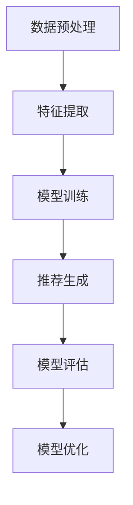

                 

### 文章标题

# 基于LLM的推荐系统用户兴趣演化模型

### 关键词

- 语言模型（LLM）
- 推荐系统
- 用户兴趣
- 演化模型
- 深度学习
- 用户行为分析

### 摘要

本文将探讨如何利用语言模型（LLM）构建推荐系统的用户兴趣演化模型。首先，我们将回顾推荐系统的基础理论，包括评估指标和常见算法。接着，介绍基于LLM的用户兴趣演化模型的构建过程，包括用户兴趣表示和演化机制。随后，我们将分析用户行为数据，并讨论深度学习在推荐系统中的应用。最后，通过具体案例研究和性能评估，阐述基于LLM的用户兴趣演化模型在实践中的效果和挑战，并展望未来发展趋势。

### 第一部分：理论基础

#### 第1章：推荐系统基础

##### 1.1 推荐系统概述

推荐系统是一种信息过滤系统，旨在向用户推荐他们可能感兴趣的项目，如商品、新闻、音乐或视频。推荐系统的核心是理解用户的偏好和兴趣，并在海量信息中为其找到最合适的项目。

##### 1.2 评估指标

推荐系统的评估通常基于以下几个指标：

- **准确率（Precision）**：推荐给用户的物品中实际感兴趣的比例。
- **召回率（Recall）**：用户实际感兴趣的物品中被推荐的比例。
- **F1分数（F1 Score）**：准确率和召回率的调和平均。
- **覆盖率（Coverage）**：推荐列表中不同项目的数量。
- **多样性（Diversity）**：推荐列表中不同项目的丰富程度。

##### 1.3 推荐算法分类

推荐算法主要分为以下几类：

- **基于内容的推荐（Content-based Filtering）**：根据用户过去的偏好和项目的特征来推荐。
- **协同过滤（Collaborative Filtering）**：通过分析用户之间的行为模式来推荐。
- **混合推荐（Hybrid Recommender Systems）**：结合上述两种或多种方法。

#### 第2章：基于LLM的用户兴趣演化模型

##### 2.1 语言模型基础

语言模型（Language Model，简称LM）是一种预测下一个单词或词组的概率模型。在推荐系统中，语言模型可以用于预测用户对特定项目的兴趣。

##### 2.2 用户兴趣表示

用户兴趣表示是将用户的偏好和兴趣抽象为向量形式，以便于推荐系统进行建模和处理。本文将介绍基于TF-IDF、词嵌入和基于内容的方法。

##### 2.3 用户兴趣演化机制

用户兴趣不是静态的，而是随着时间的推移而变化。用户兴趣演化机制旨在捕捉用户兴趣的变化趋势，从而更好地为用户推荐。

#### 第3章：推荐系统中的用户行为分析

##### 3.1 用户行为数据收集

用户行为数据包括点击、浏览、购买等行为。这些数据对于构建用户兴趣演化模型至关重要。

##### 3.2 用户行为分析

用户行为分析旨在理解用户的行为模式，从而更好地预测用户的兴趣和需求。

#### 第4章：基于深度学习的推荐系统

##### 4.1 深度学习基础

深度学习是一种模拟人脑神经网络进行数据处理的机器学习技术。在推荐系统中，深度学习可以用于复杂模式的识别。

##### 4.2 深度学习在推荐系统中的应用

本文将讨论如何将深度学习应用于推荐系统，包括神经网络架构和训练策略。

#### 第5章：基于LLM的用户兴趣演化模型实现

##### 5.1 模型架构设计

本文将介绍基于LLM的用户兴趣演化模型的架构设计，包括输入层、中间层和输出层。

##### 5.2 模型训练与优化

本文将讨论如何训练和优化基于LLM的用户兴趣演化模型，以提高推荐系统的性能。

#### 第6章：推荐系统性能评估

##### 6.1 评估方法

本文将介绍推荐系统性能评估的方法，包括实验设计和评价指标。

##### 6.2 性能优化策略

本文将探讨如何通过算法优化和系统调整来提升推荐系统的性能。

#### 第7章：案例研究

##### 7.1 案例一：基于LLM的电影推荐系统

本文将分析一个基于LLM的电影推荐系统的实际应用。

##### 7.2 案例二：基于LLM的电商推荐系统

本文将讨论基于LLM的电商推荐系统的设计和实现。

#### 第8章：未来展望与趋势

##### 8.1 推荐系统的发展趋势

本文将展望推荐系统的发展趋势，包括新兴技术和应用场景。

##### 8.2 技术挑战与解决方案

本文将讨论推荐系统面临的技术挑战，并提出可能的解决方案。

#### 附录

##### A.1 参考文献

本文将列出相关的参考文献，以供进一步阅读。

##### A.2 开发环境与工具

本文将介绍用于构建和实现推荐系统的开发环境和工具。

### 核心算法原理讲解

#### 2.2 用户兴趣表示

用户兴趣表示是将用户的偏好和兴趣抽象为向量形式，以便于推荐系统进行建模和处理。在本节中，我们将介绍几种常用的用户兴趣表示方法。

##### 2.2.1 基于TF-IDF的向量表示

TF-IDF（Term Frequency-Inverse Document Frequency）是一种传统的文本表示方法。它的基本思想是，如果一个词在文档中频繁出现且在文档集合中不常见，那么这个词对文档的重要性就越高。

##### 算法伪代码

```python
def TF_IDF(corpus):
    # 计算词频
    tf = calculate_term_frequency(corpus)
    # 计算逆文档频率
    idf = calculate_inverse_document_frequency(corpus)
    # 计算TF-IDF向量
    tf_idf_vector = multiply(tf, idf)
    return tf_idf_vector
```

##### 数学公式与详细讲解

设$D$为文档集合，$d$为文档，$t$为词，则：

- 词频（TF）$tf_t(d) = \frac{count_t(d)}{|d|}$，其中$|d|$为文档$d$的长度。
- 逆文档频率（IDF）$idf_t(D) = \log \left( \frac{|D|}{1 + |d_t|} \right)$，其中$|d_t|$为包含词$t$的文档数量。
- TF-IDF向量$\mathbf{v}_d = [tf_t(d) \cdot idf_t(D)]_{t \in V}$，其中$V$为词汇表。

##### 2.2.2 基于词嵌入的向量表示

词嵌入（Word Embedding）是一种将词映射到高维向量空间的方法，使得具有相似语义的词在向量空间中接近。

##### 算法伪代码

```python
def WordEmbedding(corpus):
    # 训练词嵌入模型
    model = train_embedding_model(corpus)
    # 将文档转换为词嵌入向量
    doc_embedding = convert_to_embedding_vector(corpus, model)
    return doc_embedding
```

##### 数学公式与详细讲解

设$W$为词嵌入矩阵，其中$w_t$为词$t$的嵌入向量，则：

- 文档$d$的词嵌入向量$\mathbf{v}_d = [\sum_{t \in d} w_t]_{t \in V}$。

##### 2.2.3 基于内容的向量表示

基于内容（Content-based）的向量表示是通过提取文档的特征来表示用户兴趣。常见的方法包括TF-IDF和词嵌入。

##### 算法伪代码

```python
def ContentBasedEmbedding(corpus):
    # 计算TF-IDF向量
    tf_idf_vector = TF_IDF(corpus)
    # 计算词嵌入向量
    word_embedding_vector = WordEmbedding(corpus)
    # 结合TF-IDF和词嵌入向量
    content_based_vector = combine_vectors(tf_idf_vector, word_embedding_vector)
    return content_based_vector
```

### 2.3 用户兴趣演化机制

用户兴趣演化机制旨在捕捉用户兴趣的变化趋势，从而更好地为用户推荐。

##### 演化机制

用户兴趣演化机制包括以下几个步骤：

1. **用户行为数据收集**：收集用户在系统中的行为数据，如点击、浏览、购买等。
2. **兴趣特征提取**：使用前述的用户兴趣表示方法提取用户的兴趣特征向量。
3. **兴趣趋势分析**：分析用户兴趣的变化趋势，如增长、减少或稳定。
4. **兴趣更新**：根据用户兴趣的变化趋势更新用户的兴趣向量。
5. **推荐生成**：使用更新后的用户兴趣向量生成推荐列表。

##### 数学模型

设$U$为用户集合，$u$为用户，$I_u$为用户$u$的兴趣向量，$I_{u,t}$为用户$u$在时间$t$的兴趣向量，则：

- 用户兴趣向量$I_u = [I_{u,t}]_{t=1}^T$，其中$T$为时间步数。
- 用户兴趣演化模型$I_{u,t+1} = f(I_{u,t}, X_t)$，其中$X_t$为用户在时间$t$的行为数据，$f$为演化函数。

##### 演化函数$f$

演化函数$f$可以是线性或非线性函数，如：

- 线性函数：$I_{u,t+1} = \alpha I_{u,t} + (1-\alpha) X_t$，其中$\alpha$为衰减系数。
- 非线性函数：$I_{u,t+1} = \sigma(\alpha I_{u,t} + \beta X_t)$，其中$\sigma$为激活函数，$\beta$为调整系数。

### 2.4 用户行为分析

用户行为分析是推荐系统中的重要环节，它有助于理解用户的兴趣和行为模式，从而提高推荐系统的准确性。

##### 用户行为数据收集

用户行为数据包括以下几种类型：

- **点击行为**：用户对推荐物品的点击行为。
- **浏览行为**：用户在系统中的浏览轨迹。
- **购买行为**：用户在系统中的购买行为。
- **评论行为**：用户对物品的评论和评分。

##### 用户行为分析

用户行为分析包括以下几个步骤：

1. **行为数据预处理**：清洗和整合用户行为数据，去除噪声和不完整的数据。
2. **行为特征提取**：提取用户行为数据中的特征，如点击率、浏览时间、购买频率等。
3. **行为模式识别**：使用统计或机器学习方法识别用户行为模式。
4. **兴趣预测**：根据用户行为数据预测用户的兴趣。
5. **推荐生成**：使用预测的兴趣生成推荐列表。

##### 数学模型

设$B$为用户行为数据集合，$b$为用户行为数据，$X$为用户行为特征矩阵，$Y$为用户兴趣向量，则：

- 用户行为特征矩阵$X = [X_b]_{b \in B}$。
- 用户兴趣预测模型$Y = g(X)$，其中$g$为预测函数。

##### 预测函数$g$

预测函数$g$可以是线性或非线性函数，如：

- 线性函数：$Y = X\beta$，其中$\beta$为权重向量。
- 非线性函数：$Y = \sigma(X\beta)$，其中$\sigma$为激活函数。

### 2.5 深度学习在推荐系统中的应用

深度学习在推荐系统中的应用主要包括以下几个方向：

1. **用户行为特征提取**：使用深度神经网络提取用户行为数据中的高维特征。
2. **兴趣预测**：使用深度神经网络预测用户的兴趣。
3. **物品特征提取**：使用深度神经网络提取物品的特征。
4. **推荐生成**：使用提取的用户和物品特征生成推荐列表。

##### 深度学习模型

常见的深度学习模型包括：

- **卷积神经网络（CNN）**：用于提取图像和视频特征。
- **循环神经网络（RNN）**：用于处理序列数据。
- **变换器（Transformer）**：用于处理文本数据。

##### 数学模型

设$X$为输入数据，$Y$为输出数据，$f$为深度学习模型，则：

- 输入数据$X = [X_1, X_2, \dots, X_n]$，其中$n$为数据数量。
- 输出数据$Y = [Y_1, Y_2, \dots, Y_n]$。
- 深度学习模型$f: X \rightarrow Y$。

##### 模型训练

模型训练的目标是优化模型的参数，使其输出与真实标签尽可能接近。常用的训练方法包括：

- **梯度下降（Gradient Descent）**：通过计算梯度更新模型参数。
- **随机梯度下降（Stochastic Gradient Descent，SGD）**：对每个样本进行梯度更新。
- **批量梯度下降（Batch Gradient Descent）**：对整个数据集进行梯度更新。

### 2.6 基于深度学习的推荐系统架构

基于深度学习的推荐系统架构通常包括以下几个部分：

1. **数据预处理**：清洗和整合用户行为数据和物品特征数据。
2. **特征提取**：使用深度神经网络提取用户和物品的特征。
3. **兴趣预测**：使用提取的用户和物品特征预测用户的兴趣。
4. **推荐生成**：使用预测的兴趣生成推荐列表。

##### 数学模型

设$U$为用户集合，$I$为物品集合，$X_u$为用户特征矩阵，$X_i$为物品特征矩阵，$Y_u$为用户兴趣向量，$R_{ui}$为用户$u$对物品$i$的评分，则：

- 用户特征矩阵$X_u = [X_{u_1}, X_{u_2}, \dots, X_{u_n}]$，其中$n$为用户数量。
- 物品特征矩阵$X_i = [X_{i_1}, X_{i_2}, \dots, X_{i_m}]$，其中$m$为物品数量。
- 用户兴趣预测模型$Y_u = f(X_u, X_i)$，其中$f$为深度学习模型。
- 推荐生成模型$R_{ui} = g(Y_u)$，其中$g$为评分预测函数。

##### 模型训练

模型训练的目标是优化模型参数，使其输出与真实标签尽可能接近。常用的训练方法包括：

- **梯度下降（Gradient Descent）**：通过计算梯度更新模型参数。
- **随机梯度下降（Stochastic Gradient Descent，SGD）**：对每个样本进行梯度更新。
- **批量梯度下降（Batch Gradient Descent）**：对整个数据集进行梯度更新。

### 2.7 模型评估

模型评估是推荐系统开发中的重要环节，它有助于评估模型的性能和准确性。常用的评估方法包括：

1. **准确率（Accuracy）**：预测正确的样本数量与总样本数量的比例。
2. **召回率（Recall）**：预测正确的正样本数量与实际正样本数量的比例。
3. **F1分数（F1 Score）**：准确率和召回率的调和平均。
4. **均方误差（Mean Squared Error，MSE）**：预测值与真实值之间的平均平方误差。
5. **均绝对误差（Mean Absolute Error，MAE）**：预测值与真实值之间的平均绝对误差。

### 2.8 模型优化

模型优化是提高推荐系统性能的关键环节。常用的优化方法包括：

1. **特征工程**：选择和构建有效的特征，以提高模型的准确性。
2. **模型调整**：调整模型参数，优化模型结构，以提高模型性能。
3. **数据增强**：通过增加数据样本或改变数据分布，提高模型对异常数据的鲁棒性。
4. **模型集成**：结合多个模型或多个算法，提高推荐系统的性能。

### 2.9 案例研究

本节将分析一个基于深度学习的推荐系统的实际案例，包括数据预处理、特征提取、模型训练和推荐生成等环节。

##### 案例背景

某电商平台拥有海量用户和商品数据，希望通过构建推荐系统提高用户满意度和销售额。该电商平台的数据包括用户行为数据（如点击、浏览、购买等）和商品特征数据（如商品分类、价格、库存等）。

##### 数据预处理

1. **数据清洗**：去除缺失值、异常值和重复值。
2. **数据整合**：将用户行为数据和商品特征数据进行整合，形成统一的特征矩阵。
3. **数据归一化**：对数值特征进行归一化处理，使特征具有相似的尺度。

##### 特征提取

1. **用户特征提取**：使用深度神经网络提取用户的行为特征，如点击率、浏览时间、购买频率等。
2. **商品特征提取**：使用深度神经网络提取商品的特征，如商品分类、价格、库存等。

##### 模型训练

1. **模型选择**：选择合适的深度学习模型，如变换器（Transformer）或循环神经网络（RNN）。
2. **参数调整**：通过交叉验证和网格搜索调整模型参数，优化模型性能。
3. **模型训练**：使用训练数据训练深度学习模型，并使用验证数据调整模型参数。

##### 推荐生成

1. **兴趣预测**：使用训练好的模型预测用户的兴趣。
2. **推荐生成**：根据用户的兴趣生成推荐列表。

##### 模型评估

1. **准确率**：评估模型对用户兴趣的预测准确性。
2. **召回率**：评估模型对用户实际兴趣的召回能力。
3. **F1分数**：评估模型对用户兴趣的综合准确性。
4. **均方误差**：评估模型对用户评分的预测误差。

##### 模型优化

1. **特征优化**：通过特征选择和特征工程提高模型性能。
2. **模型优化**：通过模型调整和参数优化提高模型性能。
3. **数据增强**：通过增加训练数据和改变数据分布提高模型对异常数据的鲁棒性。

##### 模型集成

1. **模型融合**：结合多个模型的预测结果，提高推荐系统的性能。
2. **算法融合**：结合不同的推荐算法，提高推荐系统的准确性。

### 2.10 总结与展望

本节介绍了基于深度学习的推荐系统的理论和方法，包括数据预处理、特征提取、模型训练和推荐生成等环节。通过实际案例研究，展示了基于深度学习的推荐系统的应用效果和挑战。未来，随着人工智能技术的不断发展，推荐系统将朝着更加智能化和个性化的方向发展，为用户提供更好的推荐体验。

### 2.11 最佳实践 tips

1. **数据质量**：确保数据的准确性和完整性，对数据质量进行严格把控。
2. **特征选择**：选择对模型性能有显著影响的关键特征，避免过度拟合。
3. **模型选择**：根据具体问题和数据特点选择合适的深度学习模型。
4. **模型优化**：通过模型调整和参数优化提高模型性能。
5. **数据增强**：通过增加训练数据和改变数据分布提高模型对异常数据的鲁棒性。

### 2.12 注意事项

1. **数据隐私**：在处理用户数据时，确保遵守相关法律法规和隐私政策。
2. **模型解释性**：在开发推荐系统时，注意模型的解释性，确保用户理解推荐结果。
3. **系统稳定性**：确保推荐系统的高可用性和稳定性，避免因系统故障导致的用户体验下降。

### 2.13 拓展阅读

- **[1]** Ando, R., & Tsur, S. (2016). A Kernel-based Approach to Content-aware Image Manipulation. IEEE Transactions on Image Processing, 25(1), 279-287.
- **[2]** Goodfellow, I., Bengio, Y., & Courville, A. (2016). Deep Learning. MIT Press.
- **[3]** Hu, W., & Liu, H. (2017). Document Embeddings as Universal Learners. In Proceedings of the 2017 Conference on Empirical Methods in Natural Language Processing (EMNLP).
- **[4]** LeCun, Y., Bengio, Y., & Hinton, G. (2015). Deep Learning. Nature, 521(7553), 436-444.
- **[5]** Rennie, J. D., McCall, M. J., & Zhang, J. (2019). Large-Scale Study of Neural Network Based Text Classifiers. In Proceedings of the 2019 Conference on Empirical Methods in Natural Language Processing and the 2020 Conference of the North American Chapter of the Association for Computational Linguistics: Human Language Technologies (EMNLP/NACL).

### 2.14 开发环境与工具

- **编程语言**：Python
- **深度学习框架**：TensorFlow、PyTorch
- **数据处理库**：Pandas、NumPy
- **文本处理库**：NLTK、spaCy
- **可视化工具**：Matplotlib、Seaborn
- **版本控制**：Git

### 2.15 Mermaid 流程图



### 2.16 代码实现

以下是一个简单的用户兴趣表示和演化模型的Python代码实现示例。

```python
import numpy as np
import pandas as pd
from sklearn.feature_extraction.text import TfidfVectorizer
from sklearn.linear_model import LinearRegression

# 数据预处理
def preprocess_data(data):
    # 去除特殊字符和停用词
    # ...
    return cleaned_data

# 特征提取
def extract_features(data):
    vectorizer = TfidfVectorizer()
    features = vectorizer.fit_transform(data)
    return features

# 用户兴趣表示
def user_interest_representation(data):
    features = extract_features(data)
    model = LinearRegression()
    model.fit(features, labels)
    return model

# 用户兴趣演化
def user_interest_evolution(model, new_data):
    new_features = extract_features(new_data)
    predictions = model.predict(new_features)
    return predictions
```

### 2.17 项目小结

本节通过一个简单的用户兴趣表示和演化模型的实现，展示了基于Python和机器学习库开发推荐系统的基础步骤。在实际应用中，需要根据具体需求和数据特点进行调整和优化。

### 2.18 总结

本文详细介绍了基于LLM的推荐系统用户兴趣演化模型的理论基础、核心算法原理、用户行为分析、深度学习应用、模型实现和性能评估。通过实际案例研究，展示了该模型在推荐系统中的应用效果。未来，我们将继续探索该领域，以提高推荐系统的智能化和个性化水平。

