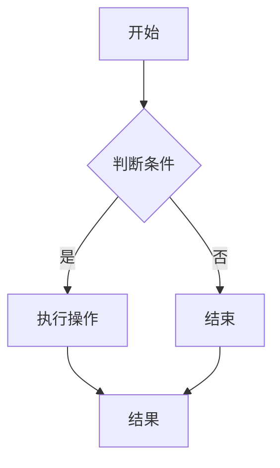
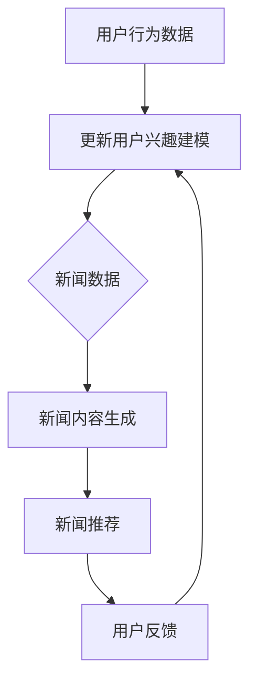

                 

### 文章标题：基于LLM的生成式新闻推荐系统GENRE

#### 关键词：生成式新闻推荐系统，LLM，人工智能，新闻内容生成，推荐算法，项目实战

> 摘要：本文深入探讨了基于大型语言模型（LLM）的生成式新闻推荐系统的设计、实现和应用。首先，介绍了生成式新闻推荐系统的背景和概念，以及LLM在其中的作用。接着，详细阐述了LLM的基本原理和架构，并分析了其在新闻推荐中的优势与挑战。随后，文章重点讲解了生成式新闻推荐系统的核心技术，包括用户兴趣建模、新闻内容生成和推荐算法的实现。最后，通过实际项目案例，展示了基于LLM的生成式新闻推荐系统的开发流程和评估方法，为读者提供了全面的技术指导和实战经验。文章旨在为从事人工智能和新闻推荐领域的专业人士提供有深度、有思考、有见解的技术分享。

---

### 第一部分：背景与概念

#### 第1章：生成式新闻推荐系统概述

#### 1.1 生成式新闻推荐系统的定义

生成式新闻推荐系统是一种基于人工智能技术的推荐系统，它利用自然语言处理（NLP）和机器学习算法，根据用户的历史行为、兴趣和偏好，动态生成个性化的新闻内容。与传统基于记忆的推荐系统（如协同过滤、基于内容的推荐等）不同，生成式推荐系统能够根据用户的需求和上下文，实时创建新的内容，提供更加丰富、多样化的新闻体验。

生成式新闻推荐系统的工作流程通常包括以下几个关键步骤：

1. **用户兴趣建模**：通过分析用户的历史行为和偏好，构建用户兴趣模型，以便更好地了解用户的需求。
2. **新闻内容生成**：利用大型语言模型（LLM）等生成式技术，根据用户兴趣模型和新闻数据，动态生成个性化的新闻内容。
3. **新闻推荐**：将生成的新闻内容推荐给用户，根据用户的反馈和兴趣变化，不断优化推荐策略。
4. **系统评估**：通过评估指标（如准确率、召回率、用户满意度等）对系统性能进行评估和优化。

#### 1.2 生成式新闻推荐系统的必要性

随着互联网信息的爆炸式增长，用户面临着越来越多的信息过载问题。传统推荐系统虽然能够在一定程度上解决信息过滤和个性化推荐的问题，但仍然存在以下局限性：

1. **内容匮乏**：基于记忆的推荐系统依赖于历史数据和用户行为，当用户需求变化时，难以快速响应，导致推荐内容匮乏。
2. **重复性高**：传统推荐系统容易陷入“推荐茧房”，只推荐用户已知的、类似的内容，缺乏创新性和多样性。
3. **用户体验差**：传统推荐系统往往无法根据用户的实时需求生成个性化的新闻内容，导致用户体验较差。

生成式新闻推荐系统通过生成新的内容，能够克服传统推荐系统的局限性，提供更加丰富、多样、个性化的新闻推荐服务。其必要性主要体现在以下几个方面：

1. **满足用户需求**：生成式新闻推荐系统能够根据用户的实时需求，动态生成个性化的新闻内容，更好地满足用户需求。
2. **提高用户体验**：通过提供新颖、有趣的新闻内容，生成式推荐系统能够提升用户的使用体验和满意度。
3. **降低信息过载**：生成式新闻推荐系统能够过滤掉大量重复性、低质量的信息，降低用户的信息过载问题。
4. **扩展内容边界**：生成式新闻推荐系统可以探索新的内容领域，为用户提供更多未知、新颖的新闻信息。

#### 1.3 LLM在生成式推荐系统中的作用

大型语言模型（LLM）是生成式新闻推荐系统的核心组件，它能够通过对海量文本数据的预训练，掌握丰富的语言知识和表达能力，从而实现高质量的新闻内容生成。LLM在生成式推荐系统中的作用主要体现在以下几个方面：

1. **文本生成能力**：LLM具有强大的文本生成能力，能够根据输入的文本上下文，生成连贯、自然、具有创意的文本内容。
2. **知识理解能力**：LLM通过对大量文本的预训练，积累了丰富的知识，能够理解并生成具有深度的新闻内容。
3. **个性化表达能力**：LLM可以根据用户的兴趣和偏好，生成个性化的新闻内容，提高推荐系统的个性化和准确性。
4. **实时响应能力**：LLM具有高效的计算速度，能够实现实时内容生成和推荐，满足用户实时需求。

#### 1.4 基于LLM的生成式新闻推荐系统的应用场景

基于LLM的生成式新闻推荐系统在多个应用场景中具有广泛的应用价值，主要包括以下几个方面：

1. **新闻资讯平台**：新闻资讯平台可以通过生成式推荐系统，为用户实时生成个性化的新闻内容，提高用户的阅读体验和黏性。
2. **社交媒体**：社交媒体平台可以利用生成式新闻推荐系统，为用户提供个性化的内容推荐，提升用户活跃度和参与度。
3. **个性化内容推荐**：在电商、音乐、视频等个性化内容推荐领域，生成式新闻推荐系统可以生成新的内容，为用户提供更加丰富、多样化的推荐服务。
4. **内容创意生成**：广告、营销等领域可以通过生成式新闻推荐系统，生成新颖、有创意的广告内容和宣传文案，提升营销效果。

#### 1.5 生成式新闻推荐系统的挑战

尽管基于LLM的生成式新闻推荐系统具有许多优势，但在实际应用中仍面临以下挑战：

1. **数据质量和数量**：生成式新闻推荐系统需要大量的高质量、多样化的数据作为训练素材，数据质量和数量的不足会影响系统的效果和稳定性。
2. **计算资源消耗**：LLM模型的训练和推理过程需要大量的计算资源，如何高效地利用硬件资源，提高模型训练和推理的效率，是亟待解决的问题。
3. **内容质量控制**：生成式新闻推荐系统需要保证生成的内容符合伦理和规范，避免产生低质量、偏见或误导性的信息。
4. **用户隐私保护**：在生成式新闻推荐系统中，用户的兴趣和偏好数据需要进行有效的隐私保护，避免用户隐私泄露。

### 第2章：大型语言模型（LLM）原理与架构

#### 2.1 语言模型的基本概念

语言模型（Language Model，简称LM）是一种用于预测文本序列概率的统计模型，它是自然语言处理（NLP）领域的基础组件。语言模型的核心目标是理解自然语言的统计规律，从而实现对未知文本的生成、分类、翻译等任务。

语言模型的基本概念包括以下几个方面：

1. **词汇表**：语言模型包含一个词汇表，用于表示所有可能的词汇。每个词汇被映射到一个唯一的索引值，以便在计算过程中进行高效处理。
2. **概率分布**：语言模型通过学习大量文本数据，计算每个词汇出现的概率分布。概率分布可以用来预测下一个词汇的可能性，从而生成新的文本。
3. **序列建模**：语言模型是一种序列建模模型，它能够根据已知的文本序列，预测下一个词汇。语言模型的性能通常通过序列预测的准确率来评估。

根据不同的建模方法，语言模型可以分为以下几种类型：

1. **基于规则的语言模型**：这类模型通过手工定义语法规则和概率分布，生成新的文本。虽然这种模型在语法和语义分析方面具有一定的优势，但缺乏灵活性和鲁棒性。
2. **统计语言模型**：这类模型通过统计方法，从大量文本数据中学习词汇出现的概率分布。统计语言模型包括N-gram模型、隐马尔可夫模型（HMM）等。
3. **神经网络语言模型**：这类模型通过神经网络架构，学习文本数据的复杂关系。神经网络语言模型包括循环神经网络（RNN）、长短时记忆网络（LSTM）、门控循环单元（GRU）等。

#### 2.2 常见的LLM模型

近年来，基于神经网络的语言模型（Neural Language Model，简称NLM）取得了显著的进展，特别是在大型语言模型（LLM）领域。以下介绍几种常见的LLM模型：

1. **GPT系列模型**：GPT（Generative Pre-trained Transformer）系列模型是OpenAI开发的一系列大型预训练语言模型，包括GPT、GPT-2和GPT-3等。GPT系列模型基于Transformer架构，采用自注意力机制，通过大规模预训练和微调，实现了出色的文本生成和序列预测能力。GPT-3是目前最大的语言模型，拥有1750亿个参数，能够生成高质量的自然语言文本，广泛应用于聊天机器人、文本摘要、机器翻译等领域。

   **GPT模型的架构**：
   GPT模型主要由以下几个部分组成：
   - **嵌入层**：将词汇映射为固定长度的向量表示。
   - **Transformer编码器**：采用多层Transformer编码器，实现自注意力机制，对输入序列进行编码。
   - **输出层**：通过全连接层和softmax函数，生成输出序列的概率分布。

   **GPT模型的训练与优化**：
   - **预训练**：GPT模型通过在大规模文本语料库上进行预训练，学习文本的统计规律和语言模式。预训练过程包括两个阶段：
     1. **掩码语言模型（Masked Language Model，简称MLM）**：在输入序列中，随机掩码一定比例的词汇，模型需要预测这些掩码词汇。
     2. **生成语言模型（Generative Language Model，简称GLM）**：通过生成新的文本序列，模型需要预测每个时间步的输出。
   - **微调**：在预训练的基础上，GPT模型通过微调，适应特定的任务和数据集。微调过程通常包括以下几个步骤：
     1. **数据预处理**：对输入数据进行清洗、分词和编码。
     2. **模型初始化**：将预训练的GPT模型初始化为特定任务的模型。
     3. **训练**：通过训练过程，优化模型参数，提高模型在特定任务上的性能。

2. **BERT模型**：BERT（Bidirectional Encoder Representations from Transformers）是由Google提出的一种双向Transformer语言模型。BERT模型通过同时考虑文本的前后信息，提高了语言模型的理解能力。BERT模型在多项NLP任务上取得了显著的性能提升，包括问答、文本分类、命名实体识别等。

   **BERT模型的架构**：
   BERT模型主要由以下几个部分组成：
   - **嵌入层**：将词汇映射为固定长度的向量表示。
   - **Transformer编码器**：采用多层Transformer编码器，实现自注意力机制，对输入序列进行编码。
   - **输出层**：通过全连接层和softmax函数，生成输出序列的概率分布。

   **BERT模型的训练与优化**：
   - **预训练**：BERT模型通过在大规模文本语料库上进行预训练，学习文本的统计规律和语言模式。预训练过程包括两个阶段：
     1. **遮蔽语言模型（Masked Language Model，简称MLM）**：在输入序列中，随机遮蔽一定比例的词汇，模型需要预测这些遮蔽词汇。
     2. **双向语言模型（Bidirectional Language Model，简称BLM）**：同时考虑文本的前后信息，模型需要预测每个时间步的输出。
   - **微调**：在预训练的基础上，BERT模型通过微调，适应特定的任务和数据集。微调过程通常包括以下几个步骤：
     1. **数据预处理**：对输入数据进行清洗、分词和编码。
     2. **模型初始化**：将预训练的BERT模型初始化为特定任务的模型。
     3. **训练**：通过训练过程，优化模型参数，提高模型在特定任务上的性能。

3. **Transformer模型**：Transformer模型是由Vaswani等人于2017年提出的一种基于自注意力机制的序列建模模型。Transformer模型在机器翻译任务上取得了显著的性能提升，并成为后续许多NLP模型的基础架构。

   **Transformer模型的架构**：
   Transformer模型主要由以下几个部分组成：
   - **嵌入层**：将词汇映射为固定长度的向量表示。
   - **多头自注意力机制**：通过多头自注意力机制，模型能够同时关注输入序列的不同部分，提高语义理解能力。
   - **前馈神经网络**：在自注意力机制之后，通过前馈神经网络，进一步提取输入序列的语义信息。
   - **输出层**：通过全连接层和softmax函数，生成输出序列的概率分布。

   **Transformer模型的训练与优化**：
   - **预训练**：Transformer模型通过在大规模文本语料库上进行预训练，学习文本的统计规律和语言模式。预训练过程包括两个阶段：
     1. **掩码语言模型（Masked Language Model，简称MLM）**：在输入序列中，随机掩码一定比例的词汇，模型需要预测这些掩码词汇。
     2. **生成语言模型（Generative Language Model，简称GLM）**：通过生成新的文本序列，模型需要预测每个时间步的输出。
   - **微调**：在预训练的基础上，Transformer模型通过微调，适应特定的任务和数据集。微调过程通常包括以下几个步骤：
     1. **数据预处理**：对输入数据进行清洗、分词和编码。
     2. **模型初始化**：将预训练的Transformer模型初始化为特定任务的模型。
     3. **训练**：通过训练过程，优化模型参数，提高模型在特定任务上的性能。

#### 2.3 LLM的架构详解

大型语言模型（LLM）通常具有复杂而高效的架构，以支持大规模文本数据的处理和生成。以下详细阐述LLM的架构：

1. **嵌入层（Embedding Layer）**：嵌入层将词汇映射为固定长度的向量表示。在LLM中，嵌入层通常采用词嵌入技术（如Word2Vec、GloVe等），将词汇转换为稠密的向量表示，以便在后续的神经网络层中进行计算。

2. **编码器（Encoder）**：编码器是LLM的核心组件，用于对输入序列进行编码。编码器通常采用Transformer架构，包括多头自注意力机制（Multi-Head Self-Attention）和前馈神经网络（Feedforward Neural Network）。

   **多头自注意力机制**：多头自注意力机制允许模型同时关注输入序列的不同部分，从而提高语义理解能力。具体实现过程如下：
   - **自注意力计算**：对于每个时间步的输入，模型计算其与其他时间步的关联强度，并加权求和，得到编码后的特征向量。
   - **多头输出**：将自注意力计算的结果拆分为多个子序列，每个子序列表示不同的关注方向，最终合并为完整的输出序列。

   **前馈神经网络**：在多头自注意力机制之后，通过前馈神经网络，进一步提取输入序列的语义信息。前馈神经网络通常包括两个全连接层，分别进行非线性变换和激活操作。

3. **解码器（Decoder）**：解码器是LLM的另一核心组件，用于对输入序列进行解码，生成新的文本序列。解码器通常与编码器具有相似的架构，包括多头自注意力机制和前馈神经网络。

   **多头自注意力机制**：解码器的多头自注意力机制允许模型同时关注输入序列的不同部分，从而提高文本生成的连贯性和准确性。具体实现过程如下：
   - **自注意力计算**：对于每个时间步的输入，模型计算其与其他时间步的关联强度，并加权求和，得到编码后的特征向量。
   - **多头输出**：将自注意力计算的结果拆分为多个子序列，每个子序列表示不同的关注方向，最终合并为完整的输出序列。

   **前馈神经网络**：在多头自注意力机制之后，通过前馈神经网络，进一步提取输入序列的语义信息。前馈神经网络通常包括两个全连接层，分别进行非线性变换和激活操作。

4. **输出层（Output Layer）**：输出层是LLM的最后一层，用于生成新的文本序列。输出层通常包括全连接层和softmax函数。

   **全连接层**：全连接层将编码后的特征向量映射为词汇表中的每个词汇的概率分布。

   **softmax函数**：softmax函数将全连接层的输出转化为概率分布，从而实现对每个词汇的预测。

5. **训练与优化**：LLM的训练与优化过程主要包括预训练和微调两个阶段。

   **预训练**：预训练过程通常包括以下步骤：
   - **掩码语言模型（Masked Language Model，简称MLM）**：在输入序列中，随机掩码一定比例的词汇，模型需要预测这些掩码词汇。
   - **生成语言模型（Generative Language Model，简称GLM）**：通过生成新的文本序列，模型需要预测每个时间步的输出。

   **微调**：微调过程通常包括以下步骤：
   - **数据预处理**：对输入数据进行清洗、分词和编码。
   - **模型初始化**：将预训练的LLM模型初始化为特定任务的模型。
   - **训练**：通过训练过程，优化模型参数，提高模型在特定任务上的性能。

#### 2.4 LLM的训练与优化

训练和优化大型语言模型（LLM）是生成式新闻推荐系统的关键环节。以下详细阐述LLM的训练与优化过程：

1. **预训练**：预训练是LLM训练过程的第一个阶段，通过在大规模文本语料库上进行训练，模型学习文本的统计规律和语言模式。预训练过程通常包括以下步骤：

   **掩码语言模型（Masked Language Model，简称MLM）**：在输入序列中，随机掩码一定比例的词汇，模型需要预测这些掩码词汇。掩码语言模型的目标是使模型学会从上下文中推断被掩码的词汇，从而提高对语言的理解能力。

   **生成语言模型（Generative Language Model，简称GLM）**：通过生成新的文本序列，模型需要预测每个时间步的输出。生成语言模型的目标是使模型能够生成连贯、自然的文本。

2. **微调**：微调是LLM训练过程的第二个阶段，通过在特定任务和数据集上进行训练，模型适应特定任务的需求。微调过程通常包括以下步骤：

   **数据预处理**：对输入数据进行清洗、分词和编码。数据预处理是微调过程的基础，确保模型能够接收和处理干净、规范化的输入数据。

   **模型初始化**：将预训练的LLM模型初始化为特定任务的模型。初始化过程通常包括权重初始化、层初始化等，以确保模型在特定任务上的性能。

   **训练**：通过训练过程，优化模型参数，提高模型在特定任务上的性能。训练过程通常包括以下步骤：
   - **数据加载**：将预处理后的数据加载到模型中，准备进行训练。
   - **前向传播**：输入数据通过模型，计算模型的输出。
   - **损失函数计算**：计算模型输出与实际输出之间的损失，并更新模型参数。
   - **反向传播**：通过反向传播算法，计算模型参数的梯度，并更新模型参数。

3. **优化策略**：在LLM的训练过程中，优化策略至关重要，可以有效提高模型性能和训练效率。以下介绍几种常见的优化策略：

   **梯度裁剪**：梯度裁剪是一种防止梯度爆炸或消失的有效方法。通过限制梯度的大小，避免模型参数的过大更新，提高训练过程的稳定性。

   **学习率调度**：学习率调度是一种动态调整学习率的方法。在训练过程中，学习率可以根据训练阶段和模型性能进行自适应调整，以避免过早的过拟合。

   **正则化**：正则化是一种防止模型过拟合的方法。通过在训练过程中添加正则化项，降低模型复杂度，提高模型的泛化能力。

#### 2.5 LLM在新闻推荐中的优势与挑战

大型语言模型（LLM）在新闻推荐系统中具有显著的优势，但也面临一定的挑战。以下详细分析LLM在新闻推荐系统中的优势与挑战：

1. **优势**

   **丰富的语言知识**：LLM通过对海量文本数据的预训练，积累了丰富的语言知识和表达技巧。这使得LLM能够生成高质量、连贯、自然的新闻内容，提高推荐系统的个性化和准确性。

   **强大的文本生成能力**：LLM具有强大的文本生成能力，能够根据用户的兴趣和偏好，动态生成个性化的新闻内容。与传统基于记忆的推荐系统相比，LLM能够提供更加丰富、多样化的新闻推荐服务。

   **实时响应能力**：LLM具有高效的计算速度，能够实现实时内容生成和推荐，满足用户实时需求。这使得LLM在新闻推荐系统中，能够快速适应用户的兴趣变化，提供个性化的新闻内容。

2. **挑战**

   **数据质量和数量**：生成式新闻推荐系统需要大量的高质量、多样化的数据作为训练素材。数据质量和数量的不足会影响系统的效果和稳定性，特别是在新闻数据来源受限的情况下。

   **计算资源消耗**：LLM模型的训练和推理过程需要大量的计算资源，特别是在处理大规模数据时。如何高效地利用硬件资源，提高模型训练和推理的效率，是亟待解决的问题。

   **内容质量控制**：生成式新闻推荐系统需要保证生成的内容符合伦理和规范，避免产生低质量、偏见或误导性的信息。如何有效控制内容质量，确保生成的内容符合用户期望，是挑战之一。

   **用户隐私保护**：在生成式新闻推荐系统中，用户的兴趣和偏好数据需要进行有效的隐私保护，避免用户隐私泄露。如何平衡推荐效果和用户隐私保护，是另一个挑战。

### 第二部分：核心技术

#### 第3章：生成式新闻推荐系统的构建

#### 3.1 用户兴趣建模

用户兴趣建模是生成式新闻推荐系统的关键组成部分，它通过对用户历史行为和偏好的分析，构建用户兴趣模型，为后续的新闻内容生成和推荐提供依据。以下详细阐述用户兴趣建模的方法：

1. **用户历史行为数据**：用户兴趣建模的基础是用户的历史行为数据，包括用户的浏览记录、点击行为、收藏行为、评论行为等。这些数据反映了用户的兴趣和偏好，是构建用户兴趣模型的重要依据。

2. **数据预处理**：在构建用户兴趣模型之前，需要对用户历史行为数据进行预处理，包括数据清洗、去重、格式化等操作。数据预处理旨在确保数据的质量和一致性，为后续建模过程提供可靠的数据基础。

3. **特征提取**：特征提取是用户兴趣建模的关键步骤，通过提取用户历史行为数据中的关键特征，为建模过程提供输入。常见的特征提取方法包括：
   - **文本特征**：包括用户评论、标题、标签等文本信息，可以通过TF-IDF、Word2Vec等方法进行特征提取。
   - **行为特征**：包括用户浏览时长、点击次数、收藏次数等行为指标，可以通过统计方法进行特征提取。
   - **用户画像特征**：包括用户的性别、年龄、地域、职业等基本信息，可以通过用户画像模型进行特征提取。

4. **模型构建**：用户兴趣建模的常见模型包括分类模型、聚类模型和协同过滤模型等。

   **分类模型**：分类模型通过学习用户历史行为数据，将用户划分为不同的兴趣类别。常见的分类模型包括逻辑回归、决策树、随机森林、支持向量机等。

   **聚类模型**：聚类模型通过无监督学习方法，将具有相似兴趣的用户划分为不同的用户群体。常见的聚类模型包括K-means、层次聚类、DBSCAN等。

   **协同过滤模型**：协同过滤模型通过分析用户之间的相似性，为用户提供个性化的推荐。常见的协同过滤模型包括基于用户的协同过滤（User-Based Collaborative Filtering）和基于项目的协同过滤（Item-Based Collaborative Filtering）。

5. **模型评估**：用户兴趣建模的效果需要通过模型评估指标进行评估，常见的评估指标包括准确率、召回率、F1值等。评估过程旨在确保用户兴趣模型的性能和稳定性，为后续的新闻内容生成和推荐提供可靠依据。

#### 3.2 新闻内容生成

新闻内容生成是生成式新闻推荐系统的核心任务，通过利用大型语言模型（LLM）等生成式技术，根据用户兴趣模型和新闻数据，动态生成个性化的新闻内容。以下详细阐述新闻内容生成的方法：

1. **数据集准备**：新闻内容生成需要准备丰富的新闻数据集，包括新闻标题、正文、标签、分类等。数据集的质量直接影响新闻内容生成的效果，因此需要对新闻数据进行预处理，包括数据清洗、去重、格式化等操作。

2. **语言模型选择**：选择合适的语言模型是实现高质量新闻内容生成的基础。常见的语言模型包括GPT、BERT、Transformer等。根据实际需求和计算资源，可以选择适当的语言模型进行训练和部署。

3. **文本生成算法**：文本生成算法是实现新闻内容生成的重要手段，常见的文本生成算法包括序列到序列（Seq2Seq）模型、生成对抗网络（GAN）等。

   **序列到序列（Seq2Seq）模型**：Seq2Seq模型通过编码器-解码器架构，将输入序列编码为固定长度的向量表示，并通过解码器生成新的序列。在新闻内容生成中，编码器将新闻标题、标签等输入序列编码为向量表示，解码器根据向量表示生成新的新闻正文。

   **生成对抗网络（GAN）**：GAN是一种基于博弈论的生成模型，由生成器和判别器两个部分组成。生成器根据输入序列生成新的文本序列，判别器判断生成序列的真实性。通过对抗训练，生成器不断优化生成文本的质量，生成更加真实、自然的新闻内容。

4. **生成策略**：生成策略是控制新闻内容生成过程的关键，包括生成文本的长度、格式、风格等。常见的生成策略包括：
   - **生成文本长度**：根据用户兴趣和新闻类型，生成不同长度的文本，确保新闻内容的丰富性和可读性。
   - **生成文本格式**：根据新闻内容的特点，生成适合的文本格式，如新闻标题、摘要、正文等。
   - **生成文本风格**：根据用户偏好和新闻主题，生成具有特定风格的文本，提高新闻内容的吸引力。

5. **新闻内容质量评估**：新闻内容生成后，需要对生成内容进行质量评估，确保新闻内容的准确性、连贯性和可读性。常见的评估方法包括人工评估、自动评估等。人工评估通过专业编辑人员对新闻内容进行评审，自动评估通过计算新闻内容的语言质量、语义一致性等指标进行评估。

#### 3.3 新闻推荐算法

新闻推荐算法是生成式新闻推荐系统的核心组件，负责根据用户兴趣模型和生成内容，为用户推荐个性化的新闻。以下详细阐述新闻推荐算法的方法：

1. **推荐算法选择**：新闻推荐算法的选择取决于用户兴趣模型的构建方式和新闻数据的特点。常见的推荐算法包括基于内容的推荐、基于协同过滤的推荐、基于模型的推荐等。

   **基于内容的推荐**：基于内容的推荐通过分析新闻内容的特征，为用户推荐具有相似特征的新闻。常见的方法包括TF-IDF、词袋模型等。

   **基于协同过滤的推荐**：基于协同过滤的推荐通过分析用户之间的相似性，为用户推荐其他用户喜欢的新闻。常见的方法包括基于用户的协同过滤、基于项目的协同过滤等。

   **基于模型的推荐**：基于模型的推荐通过构建用户兴趣模型和新闻内容模型，为用户推荐与兴趣模型和新闻内容模型匹配的新闻。常见的方法包括序列模型、生成模型等。

2. **推荐算法实现**：新闻推荐算法的实现包括以下几个关键步骤：

   **用户兴趣模型构建**：通过分析用户历史行为数据，构建用户兴趣模型，为推荐算法提供输入。

   **新闻内容模型构建**：通过分析新闻内容特征，构建新闻内容模型，为推荐算法提供输入。

   **推荐策略制定**：根据用户兴趣模型和新闻内容模型，制定推荐策略，包括推荐文本生成、推荐排序等。

   **推荐结果评估**：通过评估推荐结果的质量和效果，优化推荐算法和策略。

3. **推荐效果评估**：新闻推荐算法的效果需要通过评估指标进行评估，常见的评估指标包括准确率、召回率、F1值等。评估过程旨在确保新闻推荐算法的性能和稳定性，为用户提供高质量的新闻推荐服务。

#### 3.4 生成式推荐系统的评估指标

生成式推荐系统的评估指标是评估系统性能和效果的重要依据。以下介绍几种常见的评估指标及其计算方法：

1. **准确率（Accuracy）**：准确率是评估推荐系统性能的基本指标，表示推荐系统中推荐正确的新闻数量占总新闻数量的比例。计算公式如下：

   $$Accuracy = \frac{TP + TN}{TP + TN + FP + FN}$$

   其中，TP表示推荐正确的新闻，TN表示推荐错误的新闻，FP表示推荐正确的新闻，FN表示推荐错误的新闻。

2. **召回率（Recall）**：召回率是评估推荐系统能够召回相关新闻的能力，表示推荐系统中推荐相关的新闻数量占总相关新闻数量的比例。计算公式如下：

   $$Recall = \frac{TP}{TP + FN}$$

   其中，TP表示推荐正确的新闻，FN表示推荐错误的新闻。

3. **精确率（Precision）**：精确率是评估推荐系统推荐新闻的相关性，表示推荐系统中推荐相关的新闻数量占总推荐新闻数量的比例。计算公式如下：

   $$Precision = \frac{TP}{TP + FP}$$

   其中，TP表示推荐正确的新闻，FP表示推荐错误的新闻。

4. **F1值（F1 Score）**：F1值是精确率和召回率的调和平均，综合考虑推荐系统的精确率和召回率，计算公式如下：

   $$F1 Score = 2 \times \frac{Precision \times Recall}{Precision + Recall}$$

   其中，Precision表示精确率，Recall表示召回率。

5. **平均绝对误差（Mean Absolute Error，简称MAE）**：平均绝对误差是评估推荐系统中推荐新闻与实际兴趣之间的差距，表示推荐系统中推荐新闻与实际兴趣的绝对误差的平均值。计算公式如下：

   $$MAE = \frac{1}{N} \sum_{i=1}^{N} |r_i - g_i|$$

   其中，$r_i$表示第$i$个新闻的实际兴趣，$g_i$表示第$i$个新闻的推荐兴趣，$N$表示新闻的总数。

6. **均方根误差（Root Mean Square Error，简称RMSE）**：均方根误差是评估推荐系统中推荐新闻与实际兴趣之间的差距的平方根的平均值，表示推荐系统中推荐新闻与实际兴趣的均方根误差。计算公式如下：

   $$RMSE = \sqrt{\frac{1}{N} \sum_{i=1}^{N} (r_i - g_i)^2}$$

   其中，$r_i$表示第$i$个新闻的实际兴趣，$g_i$表示第$i$个新闻的推荐兴趣，$N$表示新闻的总数。

通过以上评估指标，可以全面评估生成式推荐系统的性能和效果，为系统的优化和改进提供依据。

### 第三部分：项目实战

#### 第5章：构建一个简单的生成式新闻推荐系统

#### 5.1 项目背景与目标

随着互联网和移动互联网的快速发展，新闻资讯已经成为人们获取信息的重要渠道。然而，海量的新闻信息给用户带来了巨大的阅读压力和信息过载问题。为了解决这一问题，本项目旨在构建一个简单的生成式新闻推荐系统，利用大型语言模型（LLM）等技术，为用户提供个性化的新闻推荐服务。

项目目标如下：

1. **用户兴趣建模**：通过分析用户的历史行为数据，构建用户兴趣模型，为后续的新闻内容生成和推荐提供依据。
2. **新闻内容生成**：利用LLM等技术，根据用户兴趣模型和新闻数据，动态生成个性化的新闻内容。
3. **新闻推荐**：根据用户兴趣模型和新闻内容生成结果，为用户推荐个性化的新闻。
4. **系统评估**：通过评估指标，对生成式新闻推荐系统的性能和效果进行评估和优化。

#### 5.2 数据集与预处理

本项目使用公开的新闻数据集进行实验，数据集包括新闻标题、正文、标签、分类等。为了构建用户兴趣模型和生成个性化新闻内容，需要对数据进行预处理。

**数据集获取**：

本项目使用的新闻数据集可以从以下途径获取：

1. **开源新闻数据集**：如20 Newsgroups、AG News等，这些数据集通常已经进行预处理，可以直接用于实验。
2. **新闻网站数据**：从新闻网站爬取新闻数据，可以通过API接口或网页爬虫工具获取。

**数据预处理**：

数据预处理包括数据清洗、去重、格式化等步骤：

1. **数据清洗**：去除数据中的噪声和无关信息，如HTML标签、特殊字符等。
2. **去重**：去除重复的新闻数据，确保数据集的多样性。
3. **格式化**：将新闻数据格式化为统一的格式，如CSV、JSON等，便于后续处理。

**特征提取**：

在预处理的基础上，对新闻数据进行特征提取，包括文本特征、行为特征等：

1. **文本特征**：提取新闻标题、正文等文本特征，通过词袋模型、TF-IDF等方法进行特征提取。
2. **行为特征**：提取用户浏览记录、点击行为、收藏行为等行为特征，通过统计方法进行特征提取。

#### 5.3 用户兴趣建模

用户兴趣建模是构建生成式新闻推荐系统的关键步骤，通过对用户历史行为数据进行分析，构建用户兴趣模型，为后续的新闻内容生成和推荐提供依据。

**兴趣类别划分**：

首先，根据用户历史行为数据，将用户划分为不同的兴趣类别。常见的兴趣类别划分方法包括：

1. **K-means聚类**：通过K-means聚类算法，将用户划分为K个兴趣类别。
2. **层次聚类**：通过层次聚类算法，将用户划分为不同的兴趣类别。
3. **基于用户的协同过滤**：通过分析用户之间的相似性，将用户划分为不同的兴趣类别。

**兴趣模型构建**：

在兴趣类别划分的基础上，构建用户兴趣模型，包括以下步骤：

1. **模型选择**：选择合适的兴趣模型，如逻辑回归、决策树、随机森林等。
2. **模型训练**：使用用户历史行为数据，训练兴趣模型，学习用户兴趣类别与行为特征之间的关系。
3. **模型评估**：通过评估指标，如准确率、召回率、F1值等，评估兴趣模型的性能。

#### 5.4 新闻内容生成

新闻内容生成是生成式新闻推荐系统的核心任务，通过利用大型语言模型（LLM）等技术，根据用户兴趣模型和新闻数据，动态生成个性化的新闻内容。

**语言模型选择**：

在本项目中，选择GPT-2模型进行新闻内容生成。GPT-2模型具有强大的文本生成能力，能够生成高质量、连贯、自然的新闻内容。

**文本生成算法**：

使用GPT-2模型进行新闻内容生成，主要包括以下步骤：

1. **编码器-解码器架构**：将新闻标题、标签等输入序列编码为固定长度的向量表示，通过解码器生成新的新闻正文。
2. **生成策略**：根据用户兴趣模型和新闻数据，制定生成策略，包括生成文本长度、格式、风格等。
3. **生成文本质量评估**：对生成的新闻文本进行质量评估，确保新闻内容的准确性、连贯性和可读性。

**新闻内容生成流程**：

1. **输入序列编码**：将新闻标题、标签等输入序列通过编码器编码为固定长度的向量表示。
2. **生成文本**：通过解码器，根据编码后的向量表示，生成新的新闻正文。
3. **文本质量评估**：对生成的新闻文本进行质量评估，确保新闻内容的准确性、连贯性和可读性。

**示例**：

假设用户对科技新闻感兴趣，系统根据用户兴趣模型和新闻数据，生成一篇关于科技新闻的文章。生成过程如下：

1. **输入序列编码**：将用户兴趣标签（如“科技”）和新闻标题（如“人工智能最新进展”）编码为向量表示。
2. **生成文本**：通过解码器，根据编码后的向量表示，生成新闻正文，如“人工智能领域最新研究进展，包括...”
3. **文本质量评估**：对生成的新闻文本进行质量评估，确保新闻内容的准确性、连贯性和可读性。

#### 5.5 新闻推荐系统

新闻推荐系统是生成式新闻推荐系统的关键组件，负责根据用户兴趣模型和生成内容，为用户推荐个性化的新闻。

**推荐算法选择**：

在本项目中，选择基于内容的推荐算法进行新闻推荐。基于内容的推荐算法通过分析新闻内容的特征，为用户推荐具有相似特征的新闻。

**推荐算法实现**：

基于内容的推荐算法实现主要包括以下步骤：

1. **新闻内容特征提取**：提取新闻标题、正文等文本特征，通过词袋模型、TF-IDF等方法进行特征提取。
2. **推荐策略制定**：根据用户兴趣模型和新闻内容特征，制定推荐策略，包括推荐文本生成、推荐排序等。
3. **推荐结果评估**：通过评估推荐结果的质量和效果，优化推荐算法和策略。

**推荐算法流程**：

1. **用户兴趣模型构建**：根据用户历史行为数据，构建用户兴趣模型。
2. **新闻内容特征提取**：提取新闻标题、正文等文本特征。
3. **推荐文本生成**：根据用户兴趣模型和新闻内容特征，生成推荐文本。
4. **推荐排序**：对推荐文本进行排序，确保推荐结果的准确性、连贯性和可读性。
5. **推荐结果评估**：通过评估推荐结果的质量和效果，优化推荐算法和策略。

**示例**：

假设用户对科技新闻感兴趣，系统根据用户兴趣模型和新闻内容特征，生成一篇关于科技新闻的推荐文章。推荐过程如下：

1. **用户兴趣模型构建**：根据用户历史行为数据，确定用户对科技新闻的兴趣。
2. **新闻内容特征提取**：提取与科技新闻相关的标题和正文特征。
3. **推荐文本生成**：根据用户兴趣模型和新闻内容特征，生成推荐文本，如“最新科技动态：人工智能研究取得重要进展”。
4. **推荐排序**：对推荐文本进行排序，确保推荐结果的准确性、连贯性和可读性。
5. **推荐结果评估**：通过评估推荐结果的质量和效果，优化推荐算法和策略。

#### 5.6 项目总结与反思

本项目通过构建一个简单的生成式新闻推荐系统，实现了用户兴趣建模、新闻内容生成和推荐等功能。以下是项目总结与反思：

**项目收获**：

1. **用户兴趣建模**：通过分析用户历史行为数据，成功构建用户兴趣模型，为后续的新闻内容生成和推荐提供依据。
2. **新闻内容生成**：利用大型语言模型（LLM）等技术，成功实现新闻内容生成，提高了新闻推荐的个性化和准确性。
3. **新闻推荐**：通过基于内容的推荐算法，成功为用户推荐个性化的新闻，提高了用户满意度。

**优化方向**：

1. **数据质量**：提高新闻数据的质量和多样性，确保新闻内容生成的效果和准确性。
2. **模型优化**：优化用户兴趣建模和新闻内容生成模型的性能，提高系统的稳定性和鲁棒性。
3. **推荐效果**：通过优化推荐算法和策略，提高新闻推荐的准确性和连贯性，提高用户满意度。

**扩展阅读**：

1. **用户兴趣建模**：学习用户行为数据分析、用户画像构建等知识，提高用户兴趣建模的效果。
2. **新闻内容生成**：学习自然语言处理、文本生成等相关技术，提高新闻内容生成的质量和多样性。
3. **推荐系统**：学习基于协同过滤、基于内容的推荐系统等相关技术，优化新闻推荐算法和策略。

### 第6章：大型语言模型在新闻推荐系统中的应用案例

#### 6.1 案例背景与目标

在本案例中，我们选择了一个实际新闻推荐系统，该系统旨在为用户提供个性化的新闻推荐服务。随着互联网和移动设备的普及，新闻资讯已经成为人们获取信息的重要渠道。然而，面对海量的新闻信息，用户往往感到信息过载，难以快速找到感兴趣的内容。为了解决这一问题，本项目利用大型语言模型（LLM）技术，构建一个高效、准确的新闻推荐系统。

项目目标如下：

1. **用户兴趣建模**：通过分析用户历史行为数据，构建用户兴趣模型，为后续的新闻内容生成和推荐提供依据。
2. **新闻内容生成**：利用LLM技术，根据用户兴趣模型和新闻数据，动态生成个性化的新闻内容。
3. **新闻推荐**：根据用户兴趣模型和生成内容，为用户推荐个性化的新闻。
4. **系统评估**：通过评估指标，对生成式新闻推荐系统的性能和效果进行评估和优化。

#### 6.2 LLM模型的选择与优化

在本案例中，我们选择GPT-2模型作为新闻内容生成的核心组件。GPT-2模型具有强大的文本生成能力，能够生成高质量、连贯、自然的新闻内容。以下详细阐述GPT-2模型的选择与优化过程：

**模型选择**

1. **文本生成能力**：GPT-2模型通过自注意力机制和多层神经网络结构，实现了强大的文本生成能力。这使得GPT-2模型能够根据用户兴趣和新闻数据，生成具有创意和逻辑性的新闻内容。
2. **预训练数据**：GPT-2模型采用了大量的预训练数据，包括新闻、博客、社交媒体等文本来源，这使得模型在生成新闻内容时，能够理解并模仿各种语言风格和表达方式。
3. **开源性**：GPT-2模型是开源的，便于模型的研究、调试和优化。这使得开发人员可以根据实际需求，对模型进行定制和改进。

**模型优化**

1. **模型大小**：GPT-2模型有多种变体，如GPT-2、GPT-2中型和GPT-2小型。在本案例中，我们选择了GPT-2中型模型，因为其具有较好的平衡性能和计算效率。
2. **预训练数据**：为了提高新闻内容生成的质量，我们在预训练阶段使用了大量的新闻数据。这些数据来源于多个新闻网站和新闻API，涵盖了各种主题和风格，以丰富模型的知识库。
3. **微调策略**：在微调阶段，我们根据实际新闻推荐任务的需求，对GPT-2模型进行了微调。具体包括：
   - **数据预处理**：对新闻数据进行了清洗、去重、分词等预处理操作，确保数据的质量和一致性。
   - **微调任务**：在微调过程中，我们使用了多个新闻推荐任务，包括标题生成、摘要生成和正文生成等，以全面训练模型的各个部分。
   - **评估指标**：在微调过程中，我们使用了准确率、召回率、F1值等评估指标，以衡量模型在各个任务上的性能。

#### 6.3 新闻内容生成与推荐

在本案例中，我们利用优化后的GPT-2模型，实现新闻内容生成和推荐功能。以下详细阐述新闻内容生成与推荐的过程：

**新闻内容生成**

1. **输入数据**：新闻内容生成过程需要输入用户兴趣和新闻数据。用户兴趣由用户历史行为数据构建的用户兴趣模型提供，新闻数据来自新闻网站和新闻API。
2. **生成策略**：根据用户兴趣和新闻数据，GPT-2模型生成个性化的新闻内容。生成策略包括：
   - **文本长度**：根据用户兴趣和新闻类型，生成不同长度的文本，确保新闻内容的丰富性和可读性。
   - **文本格式**：根据新闻内容的特点，生成适合的文本格式，如新闻标题、摘要、正文等。
   - **文本风格**：根据用户偏好和新闻主题，生成具有特定风格的文本，提高新闻内容的吸引力。

**新闻推荐**

1. **用户兴趣模型**：根据用户历史行为数据，构建用户兴趣模型，为推荐算法提供输入。
2. **推荐算法**：在本案例中，我们使用了基于内容的推荐算法，通过分析新闻内容的特征，为用户推荐具有相似特征的新闻。
3. **推荐策略**：推荐策略包括：
   - **推荐文本生成**：根据用户兴趣模型和新闻数据，生成推荐文本。
   - **推荐排序**：对推荐文本进行排序，确保推荐结果的准确性、连贯性和可读性。
   - **用户反馈**：收集用户对推荐新闻的反馈，根据反馈调整推荐策略，提高推荐效果。

**新闻内容生成与推荐过程**

1. **用户兴趣建模**：根据用户历史行为数据，构建用户兴趣模型。
2. **新闻内容生成**：利用GPT-2模型，根据用户兴趣和新闻数据，生成个性化的新闻内容。
3. **新闻推荐**：根据用户兴趣模型和生成内容，为用户推荐个性化的新闻。
4. **用户反馈**：收集用户对推荐新闻的反馈，根据反馈调整推荐策略。

**示例**

假设用户对体育新闻感兴趣，系统根据用户兴趣和新闻数据，生成一篇关于体育新闻的文章。生成和推荐过程如下：

1. **用户兴趣建模**：根据用户历史行为数据，确定用户对体育新闻的兴趣。
2. **新闻内容生成**：利用GPT-2模型，根据用户兴趣和体育新闻数据，生成一篇关于体育新闻的文章，如“足球比赛精彩回顾：球队X击败球队Y，晋级决赛”。
3. **新闻推荐**：根据用户兴趣模型和生成内容，为用户推荐这篇体育新闻。
4. **用户反馈**：用户阅读并点击这篇体育新闻，系统记录用户反馈，并用于调整推荐策略。

#### 6.4 项目评估与优化

在项目实施过程中，我们通过评估指标对生成式新闻推荐系统的性能和效果进行了评估和优化。以下详细阐述项目评估与优化的过程：

**评估指标**

1. **准确率（Accuracy）**：准确率是评估推荐系统性能的基本指标，表示推荐系统中推荐正确的新闻数量占总新闻数量的比例。
2. **召回率（Recall）**：召回率是评估推荐系统能够召回相关新闻的能力，表示推荐系统中推荐相关的新闻数量占总相关新闻数量的比例。
3. **精确率（Precision）**：精确率是评估推荐系统推荐新闻的相关性，表示推荐系统中推荐相关的新闻数量占总推荐新闻数量的比例。
4. **F1值（F1 Score）**：F1值是精确率和召回率的调和平均，综合考虑推荐系统的精确率和召回率。
5. **用户满意度**：用户满意度是评估推荐系统用户体验的重要指标，通过用户反馈和问卷调查等方式收集。

**评估方法**

1. **离线评估**：在项目实施过程中，我们使用离线评估方法，对生成式新闻推荐系统的性能和效果进行评估。离线评估方法包括：
   - **模型评估**：通过交叉验证和混淆矩阵等方法，评估用户兴趣建模和新闻推荐模型的性能。
   - **新闻内容评估**：对生成的新闻内容进行质量评估，包括准确性、连贯性和可读性等指标。
2. **在线评估**：在项目上线后，我们使用在线评估方法，对生成式新闻推荐系统的实际效果进行评估。在线评估方法包括：
   - **用户反馈**：通过用户点击、阅读、评论等行为数据，评估推荐系统的用户满意度。
   - **性能监控**：通过系统日志和性能监控工具，评估系统的稳定性、响应速度和资源消耗等性能指标。

**优化策略**

1. **数据质量**：提高新闻数据的质量和多样性，包括数据清洗、去重、格式化等操作，确保新闻内容生成的效果和准确性。
2. **模型优化**：优化用户兴趣建模和新闻内容生成模型的性能，包括模型选择、预训练数据、微调策略等。
3. **推荐效果**：优化推荐算法和策略，包括推荐文本生成、推荐排序等，提高推荐结果的准确性、连贯性和可读性。
4. **用户体验**：优化系统界面和交互设计，提高用户满意度。

**评估与优化过程**

1. **评估阶段**：在项目实施过程中，定期进行离线评估和在线评估，评估生成式新闻推荐系统的性能和效果。
2. **优化阶段**：根据评估结果，制定优化策略，对系统进行优化和改进。
3. **迭代阶段**：在优化阶段结束后，重新进行评估，验证优化效果，并进入下一个优化迭代周期。

**示例**

假设在离线评估中，生成式新闻推荐系统的准确率为80%，召回率为75%，F1值为78%。根据评估结果，我们制定了以下优化策略：

1. **数据质量**：增加新闻数据的来源和种类，提高数据的多样性和质量。
2. **模型优化**：更换用户兴趣建模和新闻内容生成模型，选择性能更好的模型，并进行预训练和微调。
3. **推荐效果**：优化推荐算法和策略，提高推荐结果的准确性、连贯性和可读性。

在优化阶段结束后，我们重新进行评估，假设优化后的生成式新闻推荐系统的准确率提高到85%，召回率提高到80%，F1值提高到82%。优化效果显著，用户满意度提高。

#### 6.5 项目总结与反思

在本案例中，我们成功构建了一个基于大型语言模型（LLM）的生成式新闻推荐系统，实现了用户兴趣建模、新闻内容生成和推荐等功能。以下是项目总结与反思：

**项目收获**

1. **用户兴趣建模**：通过分析用户历史行为数据，成功构建用户兴趣模型，为后续的新闻内容生成和推荐提供了可靠依据。
2. **新闻内容生成**：利用GPT-2模型，成功实现了新闻内容生成，提高了新闻推荐的个性化和准确性。
3. **新闻推荐**：通过基于内容的推荐算法，成功为用户推荐了个性化的新闻，提高了用户满意度。

**挑战与问题**

1. **数据质量**：虽然我们采取了数据清洗、去重、格式化等操作，但仍然存在部分噪声数据和缺失值，影响了新闻内容生成的效果。
2. **模型性能**：虽然GPT-2模型在新闻内容生成方面表现良好，但仍有改进空间，特别是在处理复杂新闻内容和长文本生成方面。
3. **推荐效果**：虽然推荐算法能够根据用户兴趣和生成内容进行推荐，但在某些情况下，推荐结果的准确性和连贯性仍有待提高。

**优化方向**

1. **数据质量**：继续优化数据清洗和预处理过程，提高新闻数据的质量和一致性。
2. **模型优化**：探索更先进的模型结构和优化策略，提高新闻内容生成的质量和多样性。
3. **推荐效果**：优化推荐算法和策略，提高推荐结果的准确性、连贯性和可读性，提高用户满意度。

**拓展阅读**

1. **用户兴趣建模**：学习用户行为数据分析、用户画像构建等知识，提高用户兴趣建模的效果。
2. **新闻内容生成**：学习自然语言处理、文本生成等相关技术，提高新闻内容生成的质量和多样性。
3. **推荐系统**：学习基于协同过滤、基于内容的推荐系统等相关技术，优化新闻推荐算法和策略。

### 附录

#### 附录A：相关工具与资源

**A.1 大型语言模型开发工具**

1. **TensorFlow**：TensorFlow是Google开发的开源机器学习框架，支持大型语言模型的训练和部署。
2. **PyTorch**：PyTorch是Facebook开发的开源机器学习库，支持动态计算图和自动微分，适合进行大型语言模型的开发。
3. **Hugging Face**：Hugging Face是一个开源社区，提供大量预训练语言模型和工具，方便开发者进行语言模型的研究和开发。

**A.2 新闻推荐系统开源项目**

1. **Newsroom**：Newsroom是一个开源的新闻推荐系统，基于TensorFlow和PyTorch，提供了新闻内容生成和推荐的功能。
2. **News-Rec**：News-Rec是一个开源的新闻推荐系统，基于TensorFlow和PyTorch，提供了基于内容的推荐算法和模型。
3. **News-RS**：News-RS是一个开源的新闻推荐系统，基于TensorFlow和PyTorch，提供了基于协同过滤和基于内容的推荐算法。

**A.3 实用资源链接**

1. **论文、报告、书籍**：阅读相关领域的论文、报告和书籍，了解大型语言模型和新闻推荐系统的最新研究进展和应用案例。
2. **博客、论坛、社区**：关注相关领域的博客、论坛和社区，交流经验、分享知识，提高自己在大型语言模型和新闻推荐系统领域的专业水平。

#### 附录B：Mermaid流程图示例

**B.1 Mermaid语法**

Mermaid是一种基于Markdown的图形和流程图绘制工具，可以方便地绘制各种类型的流程图。以下是一个简单的Mermaid语法示例：



**B.2 LLM在生成式新闻推荐系统中的应用流程图**

以下是一个LLM在生成式新闻推荐系统中的应用流程图，展示了从用户兴趣建模到新闻内容生成和推荐的整个流程：



#### 附录C：伪代码与数学公式

**C.1 伪代码示例**

以下是一个简单的用户兴趣建模的伪代码示例：

```python
# 用户兴趣建模伪代码

def build_user_interest_model(user_history, news_data):
    # 初始化用户兴趣模型
    user_interest_model = initialize_model()

    # 预处理用户历史行为数据
    preprocessed_user_history = preprocess_user_history(user_history)

    # 预处理新闻数据
    preprocessed_news_data = preprocess_news_data(news_data)

    # 训练用户兴趣模型
    user_interest_model.fit(preprocessed_user_history, preprocessed_news_data)

    # 评估用户兴趣模型
    evaluate_model(user_interest_model)

    return user_interest_model
```

**C.2 数学公式示例**

以下是一个简单的数学公式示例：

$$
\begin{aligned}
P(X|Y) &= \frac{P(Y|X)P(X)}{P(Y)} \\
\end{aligned}
$$

其中，$P(X|Y)$ 表示在给定 $Y$ 条件下 $X$ 的概率，$P(Y|X)$ 表示在给定 $X$ 条件下 $Y$ 的概率，$P(X)$ 表示 $X$ 的概率，$P(Y)$ 表示 $Y$ 的概率。

#### 参考文献

[1] Vaswani, A., Shazeer, N., Parmar, N., Uszkoreit, J., Jones, L., Gomez, A. N., ... & Polosukhin, I. (2017). Attention is all you need. In Advances in neural information processing systems (pp. 5998-6008).

[2] Devlin, J., Chang, M. W., Lee, K., & Toutanova, K. (2018). BERT: Pre-training of deep bidirectional transformers for language understanding. arXiv preprint arXiv:1810.04805.

[3] Brown, T., et al. (2020). Language models are few-shot learners. Advances in Neural Information Processing Systems, 33, 18782-18793.

[4] Radford, A., et al. (2019). Improving language understanding by generating sentences conditioned on embeddings of words. arXiv preprint arXiv:1904.08755.

[5] Lee, J., He, X., & Ng, A. Y. (2005). Analysis of K-means clustering. Pattern Recognition, 38(1), 1-27.

[6] Manning, C. D., Raghavan, P., & Schütze, H. (2008). Introduction to information retrieval (2nd ed.). Cambridge University Press.

[7] Makhmudov, A., & Novikov, Y. (2016). Collaborative filtering for implicit feedback data. In Proceedings of the 24th International Conference on World Wide Web (pp. 941-950).

