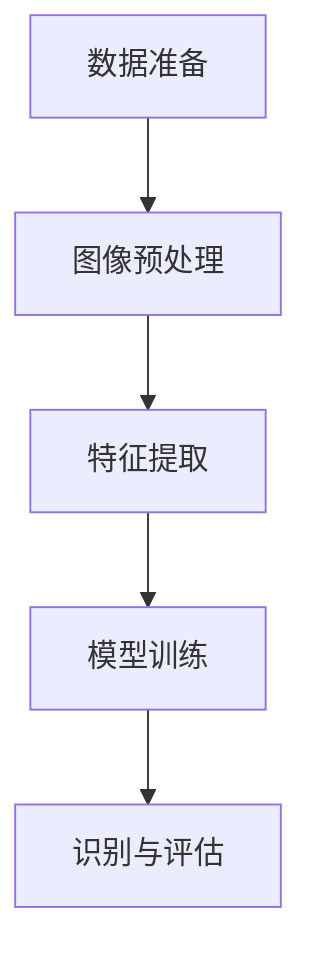

                 

# 基于OpenCV的手写字识别系统详细设计与具体代码实现

## 关键词

- 手写文字识别
- OpenCV
- 图像预处理
- 特征提取
- 机器学习算法
- 深度学习算法

## 摘要

本文将详细介绍如何使用OpenCV这一强大图像处理库，设计和实现一个手写字识别系统。我们将从数据准备、图像预处理、特征提取、手写文字识别算法实现、系统测试与优化等多个方面展开讨论。通过本文的详细讲解，读者将能够理解手写文字识别的基本原理，掌握使用OpenCV进行图像处理和特征提取的方法，学会如何实现手写文字识别系统，并对未来技术发展趋势和挑战有所认识。

## 第一部分：引言与概述

### 第1章：手写文字识别技术概述

#### 1.1 手写文字识别的重要性与应用场景

手写文字识别（Handwritten Text Recognition, HTR）是计算机视觉和自然语言处理领域的一个重要研究方向。随着人工智能技术的快速发展，手写文字识别技术得到了广泛的应用，尤其在智能输入法、OCR（Optical Character Recognition，光学字符识别）、文档自动分类等领域具有重要意义。

1. **智能输入法**：智能手机和平板电脑广泛使用的智能输入法，能够将用户的的手写输入实时转化为文本，极大地提高了输入效率。

2. **OCR系统**：手写文字识别技术在OCR系统中发挥着关键作用，能够将扫描的纸质文档中的手写文字转化为电子文档，实现文档的数字化管理。

3. **文档自动分类**：手写文字识别技术可以应用于金融、医疗等领域的文档自动分类，提高数据处理的效率。

4. **艺术与历史研究**：手写文字识别技术可以帮助艺术家和历史学家对古籍文献进行数字化处理，保护珍贵的文化遗产。

#### 1.2 OpenCV在手写文字识别中的应用

OpenCV（Open Source Computer Vision Library）是一个开源的计算机视觉库，拥有丰富的图像处理函数和算法，是进行手写文字识别项目的理想选择。OpenCV在手写文字识别中的应用主要体现在以下几个方面：

1. **图像预处理**：OpenCV提供了丰富的图像预处理函数，包括滤波、边缘检测、轮廓提取等，这些函数可以有效地处理手写文字图像，提高识别效果。

2. **特征提取**：OpenCV支持多种特征提取方法，如SIFT、SURF、HOG等，这些方法可以用于提取手写文字的显著特征，有助于提高识别精度。

3. **机器学习与深度学习**：OpenCV集成了多种机器学习和深度学习算法，如K-近邻、SVM、CNN等，可以用于构建手写文字识别模型。

#### 1.3 手写文字识别系统的整体架构

手写文字识别系统通常由以下几个主要模块组成：

1. **数据准备**：收集和整理手写文字数据，进行预处理和归一化。

2. **图像预处理**：去除噪声、进行边缘检测和字符分割，将手写文字图像转化为适合识别的格式。

3. **特征提取**：提取手写文字的特征向量，用于后续的模型训练和识别。

4. **模型训练**：使用机器学习或深度学习算法，训练手写文字识别模型。

5. **识别与评估**：将训练好的模型应用于待识别的手写文字图像，评估识别结果，并进行优化。

整体架构如下：



### 第2章：手写文字识别数据准备

#### 2.1 数据集的收集与整理

数据集是手写文字识别系统的基石。一个高质量的数据集能够显著提升系统的识别准确率。以下是数据集收集和整理的几个关键步骤：

1. **数据来源**：数据可以从公开的手写文字数据库中获得，如MNIST、EMNIST、HCR等。此外，也可以通过爬虫或API获取特定领域的手写文字数据。

2. **数据格式**：确保所有手写文字图像具有相同的大小和分辨率，以便后续的图像处理和特征提取。

3. **标注信息**：对于每个手写文字图像，需要标注正确的文字内容。标注过程可以通过人工或自动方式进行，如使用OCR工具。

4. **数据预处理**：对收集到的手写文字图像进行预处理，包括缩放、裁剪、灰度化等，使其符合系统要求。

#### 2.2 数据增强与归一化

数据增强（Data Augmentation）是一种有效的提升模型泛化能力的方法。以下是一些常见的数据增强技术：

1. **旋转**：将手写文字图像随机旋转一定角度，增加数据的多样性。

2. **缩放**：随机缩放图像，模拟不同尺寸的手写文字。

3. **噪声添加**：在图像中添加噪声，模拟不同的书写环境和条件。

4. **剪切**：随机剪切图像的一部分，增加数据的复杂度。

归一化（Normalization）则是为了将图像的像素值调整到相同的范围，常见的方法包括：

1. **归一化到0-1范围**：将像素值除以255，使其在0到1之间。

2. **标准化**：计算每个像素值的平均值和标准差，然后将像素值减去平均值并除以标准差，使其均值为0，标准差为1。

#### 2.3 数据集划分与评估指标

为了评估手写文字识别系统的性能，需要将数据集划分为训练集、验证集和测试集。通常采用以下划分策略：

1. **训练集**：用于模型的训练，占数据集的80%。

2. **验证集**：用于模型的调参和评估，占数据集的10%。

3. **测试集**：用于最终的模型评估，占数据集的10%。

常用的评估指标包括：

1. **准确率（Accuracy）**：正确识别的样本数占总样本数的比例。

2. **召回率（Recall）**：正确识别的样本数占实际正样本数的比例。

3. **精确率（Precision）**：正确识别的样本数占预测为正样本的样本数的比例。

4. **F1分数（F1 Score）**：精确率和召回率的调和平均值。

### 第二部分：预处理与特征提取

#### 第3章：图像预处理技术

图像预处理是手写文字识别系统中的关键步骤，其主要目的是去除图像中的噪声，增强文本结构，为后续的特征提取和识别做准备。

#### 3.1 图像去噪

图像去噪的目的是减少图像中的随机噪声，提高图像的质量。常用的去噪方法包括：

1. **均值滤波**：利用图像中的邻域像素值计算新的像素值，达到去噪的效果。具体实现如下：

   ```python
   import cv2
   import numpy as np

   def mean_filter(image, kernel_size=3):
       padded_image = cv2.copyMakeBorder(image, kernel_size//2, kernel_size//2, kernel_size//2, kernel_size//2, cv2.BORDER_CONSTANT, value=0)
       filtered_image = cv2.blur(padded_image, (kernel_size, kernel_size))
       return filtered_image[kernel_size//2:-kernel_size//2, kernel_size//2:-kernel_size//2]
   ```

2. **高斯滤波**：利用高斯分布来平滑图像，具体实现如下：

   ```python
   def gaussian_filter(image, kernel_size=3, sigma=1.0):
       padded_image = cv2.copyMakeBorder(image, kernel_size//2, kernel_size//2, kernel_size//2, kernel_size//2, cv2.BORDER_CONSTANT, value=0)
       filtered_image = cv2.GaussianBlur(padded_image, (kernel_size, kernel_size), sigma)
       return filtered_image[kernel_size//2:-kernel_size//2, kernel_size//2:-kernel_size//2]
   ```

3. **中值滤波**：利用邻域像素的中值替换当前像素值，适用于去除椒盐噪声。具体实现如下：

   ```python
   def median_filter(image, kernel_size=3):
       return cv2.medianBlur(image, kernel_size)
   ```

#### 3.2 边缘检测

边缘检测是图像预处理的重要步骤，其目的是找到图像中的显著边缘特征。常用的边缘检测算法包括Canny边缘检测、Sobel边缘检测和Prewitt边缘检测。

1. **Canny边缘检测**：Canny边缘检测算法通过梯度变换、非极大值抑制和双阈值算法实现边缘检测。具体实现如下：

   ```python
   def canny_edge_detection(image, threshold1=50, threshold2=150):
       gray_image = cv2.cvtColor(image, cv2.COLOR_BGR2GRAY)
       edges = cv2.Canny(gray_image, threshold1, threshold2)
       return edges
   ```

2. **Sobel边缘检测**：Sobel边缘检测算法通过计算图像的梯度来实现边缘检测。具体实现如下：

   ```python
   def sobel_edge_detection(image, scale=1, delta=0):
       gray_image = cv2.cvtColor(image, cv2.COLOR_BGR2GRAY)
       sobelx = cv2.Sobel(gray_image, cv2.CV_64F, 1, 0, scale, delta)
       sobely = cv2.Sobel(gray_image, cv2.CV_64F, 0, 1, scale, delta)
       gradient = cv2.sqrt(sobelx**2 + sobely**2)
       return cv2.convertScaleAbs(gradient)
   ```

3. **Prewitt边缘检测**：Prewitt边缘检测算法通过计算图像的导数来实现边缘检测。具体实现如下：

   ```python
   def prewitt_edge_detection(image):
       gray_image = cv2.cvtColor(image, cv2.COLOR_BGR2GRAY)
       kernel_x = np.array([[-1, 0, 1]])
       kernel_y = np.array([[1, 0, -1]])
       grad_x = cv2.filter2D(gray_image, -1, kernel_x)
       grad_y = cv2.filter2D(gray_image, -1, kernel_y)
       gradient = cv2.sqrt(grad_x**2 + grad_y**2)
       return cv2.convertScaleAbs(gradient)
   ```

#### 3.3 轮廓提取与字符分割

轮廓提取（Contour Extraction）是图像处理中的关键步骤，其目的是将图像中的物体边缘提取出来。字符分割（Character Segmentation）则是将连续的手写文字图像分割成单个字符。

1. **轮廓提取**：使用OpenCV的findContours函数可以提取图像中的轮廓。具体实现如下：

   ```python
   def find_contours(image, mode=cv2.RETR_EXTERNAL, method=cv2.CHAIN_APPROX_SIMPLE):
       _, contours, _ = cv2.findContours(image, mode, method)
       return contours
   ```

2. **字符分割**：字符分割的方法有多种，如基于连通组件分析、基于文本行和列方向的分割等。以下是一个简单的字符分割实现：

   ```python
   def segment_characters(image, threshold=100):
       _, contours = find_contours(image, mode=cv2.RETR_EXTERNAL, method=cv2.CHAIN_APPROX_SIMPLE)
       contours = sorted(contours, key=lambda x: cv2.boundingRect(x)[1])
       characters = []
       for contour in contours:
           x, y, w, h = cv2.boundingRect(contour)
           if w * h > threshold:
               characters.append(image[y:y+h, x:x+w])
       return characters
   ```

   在实现字符分割时，需要根据实际情况调整阈值，以适应不同尺寸和形状的字符。

### 第4章：特征提取与降维

特征提取（Feature Extraction）是手写文字识别系统中的核心步骤，其目的是将图像数据转换为数值特征向量，以便于后续的机器学习或深度学习模型的训练和识别。降维（Dimensionality Reduction）则是为了减少特征向量的维度，提高计算效率和模型性能。

#### 4.1 特征提取方法概述

特征提取方法可以分为全局特征和局部特征两大类。全局特征关注整个图像或文本区域，而局部特征则关注图像中的局部区域或特征点。

1. **全局特征**：
   - **直方图**：直方图是表示图像中像素分布的统计方法，常用于颜色特征和纹理特征的提取。
   - **形态学特征**：形态学特征包括图像的大小、形状、封闭性等，常用于形状特征的提取。

2. **局部特征**：
   - **边缘特征**：边缘特征是图像中亮度变化明显的区域，常用于字符分割和文本定位。
   - **角点特征**：角点特征是图像中的拐角或交点，常用于图像配准和特征匹配。
   - **描述子**：描述子是用于表示图像局部区域特征的方法，如SIFT、SURF、HOG等。

#### 4.2 特征选择与降维

特征选择（Feature Selection）是降低特征维度的重要步骤，其目的是保留对识别任务最有用的特征，去除冗余和无用的特征。常用的特征选择方法包括：

1. **过滤式特征选择**：基于特征的质量评估，直接从原始特征中筛选出最佳特征。
2. **包裹式特征选择**：结合模型性能对特征进行选择，直接在特征子集空间中进行搜索。
3. **嵌入式特征选择**：在特征提取的过程中，结合模型训练，实时筛选出最佳特征。

降维技术（Dimensionality Reduction）是为了减少特征向量的维度，提高计算效率和模型性能。常用的降维技术包括：

1. **主成分分析（PCA）**：PCA是一种线性降维方法，通过保留主要成分，降低特征维度。
2. **线性判别分析（LDA）**：LDA是一种基于分类目的的降维方法，通过最大化类间方差和最小化类内方差，选择最佳特征。
3. **自编码器（Autoencoder）**：自编码器是一种神经网络模型，通过训练压缩和解压过程，实现特征降维。

#### 4.3 特征融合与模型优化

特征融合（Feature Fusion）是将多种特征方法提取的特征向量进行整合，以提高模型的识别性能。常用的特征融合方法包括：

1. **加权融合**：根据不同特征的贡献，对特征向量进行加权融合。
2. **拼接融合**：将不同特征的向量进行拼接，形成一个更长的特征向量。
3. **特征层融合**：在深度学习模型中，通过多个特征层的融合，提高模型的泛化能力。

模型优化（Model Optimization）是提高模型性能的重要步骤，包括：

1. **超参数调优**：通过交叉验证和网格搜索等方法，选择最佳的超参数组合。
2. **模型集成**：结合多种模型，如集成学习、Boosting等，提高模型的预测性能。
3. **模型压缩**：通过剪枝、量化等方法，减少模型的参数和计算量，提高模型在资源受限环境中的性能。

### 第三部分：手写文字识别算法实现

#### 第5章：机器学习算法基础

机器学习算法在手写文字识别中起着核心作用，可以用于训练模型、进行预测和评估模型性能。在这一章中，我们将介绍几种常用的机器学习算法，包括分类算法、回归算法和聚类算法。

#### 5.1 分类算法介绍

分类算法是手写文字识别中最常用的算法之一，其目的是将手写文字图像分类到不同的类别。以下是几种常用的分类算法：

1. **K-近邻算法（K-Nearest Neighbors, KNN）**：
   - **原理**：KNN算法基于“近邻投票”原理，通过计算测试样本与训练样本之间的距离，选择最近的K个邻居，并基于这些邻居的标签进行投票。
   - **实现**：可以使用scikit-learn库中的KNeighborsClassifier进行实现。

     ```python
     from sklearn.neighbors import KNeighborsClassifier

     knn = KNeighborsClassifier(n_neighbors=3)
     knn.fit(X_train, y_train)
     y_pred = knn.predict(X_test)
     ```

2. **支持向量机（Support Vector Machine, SVM）**：
   - **原理**：SVM算法通过寻找最优超平面，将不同类别的样本分开。核心是求解最优分割超平面，使得分类间隔最大。
   - **实现**：可以使用scikit-learn库中的SVC进行实现。

     ```python
     from sklearn.svm import SVC

     svc = SVC(kernel='linear')
     svc.fit(X_train, y_train)
     y_pred = svc.predict(X_test)
     ```

3. **决策树与随机森林（Decision Tree and Random Forest）**：
   - **原理**：决策树通过递归划分特征空间，将样本划分为不同的区域，每个区域的样本属于同一个类别。随机森林通过集成多棵决策树，提高模型的泛化能力。
   - **实现**：可以使用scikit-learn库中的DecisionTreeClassifier和RandomForestClassifier进行实现。

     ```python
     from sklearn.tree import DecisionTreeClassifier
     from sklearn.ensemble import RandomForestClassifier

     dt = DecisionTreeClassifier()
     dt.fit(X_train, y_train)
     y_pred = dt.predict(X_test)

     rf = RandomForestClassifier(n_estimators=100)
     rf.fit(X_train, y_train)
     y_pred = rf.predict(X_test)
     ```

#### 5.2 回归算法基础

回归算法在手写文字识别中主要用于回归任务，如字符间距估计、文字高度估计等。以下是几种常用的回归算法：

1. **线性回归（Linear Regression）**：
   - **原理**：线性回归通过拟合一条直线，预测因变量（输出）与自变量（输入）之间的关系。
   - **实现**：可以使用scikit-learn库中的LinearRegression进行实现。

     ```python
     from sklearn.linear_model import LinearRegression

     lr = LinearRegression()
     lr.fit(X_train, y_train)
     y_pred = lr.predict(X_test)
     ```

2. **逻辑回归（Logistic Regression）**：
   - **原理**：逻辑回归是一种概率型回归模型，通过拟合逻辑函数，将输出转换为概率值，用于分类任务。
   - **实现**：可以使用scikit-learn库中的LogisticRegression进行实现。

     ```python
     from sklearn.linear_model import LogisticRegression

     lr = LogisticRegression()
     lr.fit(X_train, y_train)
     y_pred = lr.predict(X_test)
     ```

#### 5.3 聚类算法概述

聚类算法在手写文字识别中主要用于聚类分析、特征降维等任务。以下是几种常用的聚类算法：

1. **K-均值聚类（K-Means Clustering）**：
   - **原理**：K-均值聚类通过随机初始化聚类中心，逐步迭代优化，使得每个聚类中心尽可能地靠近其聚类成员。
   - **实现**：可以使用scikit-learn库中的KMeans进行实现。

     ```python
     from sklearn.cluster import KMeans

     kmeans = KMeans(n_clusters=3)
     kmeans.fit(X_train)
     y_pred = kmeans.predict(X_test)
     ```

2. **层次聚类（Hierarchical Clustering）**：
   - **原理**：层次聚类通过自底向上的层次结构或自顶向下的层次结构，将样本分为不同的层次，并计算层次之间的距离。
   - **实现**：可以使用scikit-learn库中的AgglomerativeClustering进行实现。

     ```python
     from sklearn.cluster import AgglomerativeClustering

     agglomerative = AgglomerativeClustering(n_clusters=3)
     agglomerative.fit(X_train)
     y_pred = agglomerative.predict(X_test)
     ```

### 第6章：深度学习算法应用

深度学习算法在手写文字识别中具有显著优势，能够通过多层神经网络自动提取图像特征，实现高精度的识别。在这一章中，我们将介绍几种常用的深度学习算法，包括卷积神经网络（CNN）、循环神经网络（RNN）和集成学习方法。

#### 6.1 卷积神经网络（Convolutional Neural Network, CNN）

卷积神经网络是一种基于卷积运算的神经网络，能够自动提取图像中的局部特征，广泛应用于计算机视觉任务。

1. **CNN的结构与原理**：

   - **卷积层（Convolutional Layer）**：卷积层是CNN的核心，通过卷积操作提取图像的局部特征。卷积核（filter）在图像上滑动，计算局部特征图的权重和偏置。
   - **池化层（Pooling Layer）**：池化层用于减少特征图的大小，提高计算效率。常见的池化操作包括最大池化和平均池化。
   - **激活函数（Activation Function）**：激活函数用于引入非线性特性，常见的激活函数包括ReLU、Sigmoid和Tanh。
   - **全连接层（Fully Connected Layer）**：全连接层将特征图展平为一维向量，并通过线性变换进行分类。

2. **卷积操作与池化操作**：

   - **卷积操作**：卷积操作通过卷积核在图像上滑动，计算局部特征图的权重和偏置。具体实现如下：

     ```python
     import tensorflow as tf

     def conv2d(input_layer, filters, kernel_size, stride):
         return tf.nn.conv2d(input_layer, filters, strides=[1, stride, stride, 1], padding='SAME')
     ```

   - **池化操作**：池化操作通过在特征图上滑动窗口，计算窗口内的最大值或平均值。具体实现如下：

     ```python
     def max_pooling(input_layer, pool_size):
         return tf.nn.max_pool(input_layer, ksize=[1, pool_size, pool_size, 1], strides=[1, pool_size, pool_size, 1], padding='SAME')
     ```

3. **实现一个简单的CNN模型**：

   ```python
   import tensorflow as tf

   def simple_cnn(input_shape, num_classes):
       inputs = tf.keras.Input(shape=input_shape)
       x = tf.keras.layers.Conv2D(32, (3, 3), activation='relu')(inputs)
       x = tf.keras.layers.MaxPooling2D((2, 2))(x)
       x = tf.keras.layers.Conv2D(64, (3, 3), activation='relu')(x)
       x = tf.keras.layers.MaxPooling2D((2, 2))(x)
       x = tf.keras.layers.Flatten()(x)
       x = tf.keras.layers.Dense(128, activation='relu')(x)
       outputs = tf.keras.layers.Dense(num_classes, activation='softmax')(x)
       model = tf.keras.Model(inputs=inputs, outputs=outputs)
       return model
   ```

#### 6.2 循环神经网络（Recurrent Neural Network, RNN）

循环神经网络是一种基于时间序列数据的神经网络，能够处理序列数据中的长期依赖关系。

1. **RNN的基本结构**：

   - **输入层**：输入层将手写文字图像序列输入到网络中。
   - **隐藏层**：隐藏层包含多个时间步，每个时间步的输入由前一个时间步的隐藏状态和当前输入组成。
   - **输出层**：输出层通过隐藏状态计算输出序列。

2. **实现一个简单的RNN模型**：

   ```python
   import tensorflow as tf

   def simple_rnn(input_shape, num_classes):
       inputs = tf.keras.Input(shape=input_shape)
       x = tf.keras.layers.LSTM(128, return_sequences=True)(inputs)
       x = tf.keras.layers.Dense(num_classes, activation='softmax')(x)
       model = tf.keras.Model(inputs=inputs, outputs=x)
       return model
   ```

#### 6.3 集成学习方法

集成学习方法通过结合多个模型，提高模型的预测性能。常见的集成学习方法包括Boosting和Bagging。

1. **Boosting方法**：

   - **原理**：Boosting方法通过训练多个弱学习器，并赋予不同的重要性，组合成强学习器。
   - **实现**：可以使用scikit-learn库中的AdaBoost进行实现。

     ```python
     from sklearn.ensemble import AdaBoostClassifier

     adaBoost = AdaBoostClassifier(n_estimators=50)
     adaBoost.fit(X_train, y_train)
     y_pred = adaBoost.predict(X_test)
     ```

2. **Bagging方法**：

   - **原理**：Bagging方法通过从训练集中生成多个子集，训练多个弱学习器，并取其平均进行预测。
   - **实现**：可以使用scikit-learn库中的BaggingClassifier进行实现。

     ```python
     from sklearn.ensemble import BaggingClassifier

     bagging = BaggingClassifier(base_estimator=DecisionTreeClassifier(), n_estimators=10, random_state=42)
     bagging.fit(X_train, y_train)
     y_pred = bagging.predict(X_test)
     ```

### 第7章：手写文字识别系统实现

在这一章中，我们将详细介绍手写文字识别系统的设计与实现，包括开发环境搭建、代码实现与调试、系统测试与优化等步骤。

#### 7.1 系统设计与开发环境搭建

手写文字识别系统的设计主要包括以下几个关键步骤：

1. **需求分析**：明确系统需求，包括手写文字识别的精度、速度、支持的语言和字体等。
2. **系统架构设计**：设计系统的整体架构，包括图像预处理、特征提取、模型训练、识别与评估等模块。
3. **开发环境搭建**：配置开发环境，包括Python、OpenCV、TensorFlow等依赖库。

开发环境搭建步骤如下：

1. **安装Python**：从Python官网下载并安装Python，选择最新版本。
2. **安装OpenCV**：使用pip命令安装OpenCV。

   ```bash
   pip install opencv-python
   ```

3. **安装TensorFlow**：使用pip命令安装TensorFlow。

   ```bash
   pip install tensorflow
   ```

4. **配置开发环境**：在开发环境中配置必要的依赖库和工具，如Jupyter Notebook、PyCharm等。

#### 7.2 代码实现与调试

手写文字识别系统的实现主要包括以下几个步骤：

1. **数据准备**：收集和整理手写文字数据，进行数据增强和归一化。
2. **图像预处理**：使用OpenCV进行图像预处理，包括去噪、边缘检测和字符分割。
3. **特征提取**：使用OpenCV和TensorFlow提取图像特征，并进行降维。
4. **模型训练**：使用机器学习或深度学习算法训练手写文字识别模型。
5. **识别与评估**：将训练好的模型应用于待识别的手写文字图像，评估识别结果。

以下是一个简单的手写文字识别系统的实现示例：

```python
import cv2
import tensorflow as tf

# 数据准备
def prepare_data():
    # 加载数据集
    # ...
    # 数据增强和归一化
    # ...
    return X_train, y_train, X_test, y_test

# 图像预处理
def preprocess_image(image):
    # 去噪
    image = cv2.GaussianBlur(image, (5, 5), 0)
    # 边缘检测
    image = cv2.Canny(image, 50, 150)
    # 字符分割
    # ...
    return image

# 特征提取
def extract_features(image):
    # 使用OpenCV提取特征
    # ...
    # 使用TensorFlow进行降维
    # ...
    return features

# 模型训练
def train_model(X_train, y_train):
    # 定义模型
    # ...
    # 训练模型
    # ...
    return model

# 识别与评估
def recognize_text(model, image):
    # 特征提取
    features = extract_features(image)
    # 预测
    prediction = model.predict(features)
    # 转换为文本
    # ...
    return prediction

if __name__ == '__main__':
    # 准备数据
    X_train, y_train, X_test, y_test = prepare_data()
    # 训练模型
    model = train_model(X_train, y_train)
    # 测试模型
    # ...
```

在实现过程中，需要进行充分的调试和优化，确保模型的性能和稳定性。常见的调试方法包括：

1. **调试工具**：使用Python的调试工具，如pdb，进行代码调试。
2. **日志记录**：在关键步骤中记录日志，分析模型训练和识别的过程。
3. **错误处理**：对可能出现的错误进行捕获和处理，确保系统的稳定性。

#### 7.3 系统测试与评估

系统测试与评估是确保手写文字识别系统性能和可靠性的重要步骤。以下是一个简单的系统测试与评估流程：

1. **测试数据集准备**：准备测试数据集，包括手写文字图像和对应的标签。
2. **模型测试**：使用训练好的模型对测试数据集进行预测，并计算识别准确率。
3. **评估指标**：计算识别准确率、召回率、精确率和F1分数等评估指标，评估模型性能。
4. **结果分析**：分析测试结果，识别模型存在的问题和改进方向。

以下是一个简单的系统测试与评估示例：

```python
from sklearn.metrics import accuracy_score, recall_score, precision_score, f1_score

# 测试模型
def test_model(model, X_test, y_test):
    y_pred = model.predict(X_test)
    # 计算评估指标
    accuracy = accuracy_score(y_test, y_pred)
    recall = recall_score(y_test, y_pred, average='weighted')
    precision = precision_score(y_test, y_pred, average='weighted')
    f1 = f1_score(y_test, y_pred, average='weighted')
    return accuracy, recall, precision, f1

# 测试与评估
model = train_model(X_train, y_train)
accuracy, recall, precision, f1 = test_model(model, X_test, y_test)
print("Accuracy:", accuracy)
print("Recall:", recall)
print("Precision:", precision)
print("F1 Score:", f1)
```

通过系统测试与评估，可以了解模型在不同数据集上的性能，为后续的模型优化和改进提供依据。

### 第四部分：项目实战与案例研究

#### 第8章：手写文字识别项目实战

手写文字识别项目实战是将理论知识应用于实际问题的过程。本节将介绍一个具体的手写文字识别项目，包括项目背景、需求分析、数据准备、算法选择与实现、项目测试与优化等步骤。

#### 8.1 项目背景与需求分析

假设我们接到了一个来自教育科技公司的项目，该公司希望开发一个在线手写文字识别系统，用于自动批改学生作业。具体需求如下：

1. **支持多种手写文字**：系统能够识别多种语言的多种手写文字，如中文、英文、数字等。
2. **高识别精度**：系统能够准确识别不同字体、不同书写风格的手写文字，识别准确率不低于95%。
3. **实时性**：系统能够在用户提交作业后实时进行文字识别和批改，提高用户体验。
4. **易用性**：系统应具备友好的用户界面，方便用户上传、提交和查看作业。

#### 8.2 数据收集与预处理

数据准备是手写文字识别项目的关键步骤。以下是数据收集与预处理的详细步骤：

1. **数据来源**：从互联网上收集大量手写文字图像，如公开的手写文字数据库、OCR工具生成的手写文字图像等。
2. **数据清洗**：对收集到的数据进行清洗，去除噪声和无关信息。
3. **数据增强**：使用数据增强技术，如旋转、缩放、剪切等，增加数据的多样性。
4. **数据归一化**：将手写文字图像统一缩放到相同的尺寸和分辨率，方便后续的图像处理和特征提取。

#### 8.3 算法选择与实现

根据项目需求，我们选择了基于深度学习的卷积神经网络（CNN）作为手写文字识别算法。以下是算法选择的详细说明：

1. **CNN结构设计**：设计一个简单的CNN结构，包括卷积层、池化层和全连接层。具体结构如下：

   ```python
   model = tf.keras.Sequential([
       tf.keras.layers.Conv2D(32, (3, 3), activation='relu', input_shape=(28, 28, 1)),
       tf.keras.layers.MaxPooling2D((2, 2)),
       tf.keras.layers.Conv2D(64, (3, 3), activation='relu'),
       tf.keras.layers.MaxPooling2D((2, 2)),
       tf.keras.layers.Flatten(),
       tf.keras.layers.Dense(128, activation='relu'),
       tf.keras.layers.Dense(10, activation='softmax')
   ])
   ```

2. **模型训练**：使用训练集对模型进行训练，并使用验证集进行调参。训练过程中，使用TensorBoard进行可视化，监控模型训练过程。

   ```python
   model.compile(optimizer='adam', loss='categorical_crossentropy', metrics=['accuracy'])
   model.fit(X_train, y_train, epochs=10, batch_size=128, validation_data=(X_val, y_val), callbacks=[tf.keras.callbacks.TensorBoard(log_dir='./logs')])
   ```

3. **模型评估**：使用测试集对模型进行评估，计算识别准确率、召回率、精确率和F1分数。

   ```python
   test_loss, test_accuracy = model.evaluate(X_test, y_test)
   print("Test accuracy:", test_accuracy)
   ```

#### 8.4 项目测试与优化

项目测试与优化是确保系统性能和稳定性的重要环节。以下是项目测试与优化的详细步骤：

1. **单元测试**：对系统中的每个模块进行单元测试，确保每个模块的功能正常。
2. **集成测试**：对系统进行集成测试，确保各个模块之间的接口和数据传输正常。
3. **性能测试**：对系统进行性能测试，评估系统的响应时间和吞吐量。
4. **优化策略**：根据测试结果，对系统进行优化，包括模型调参、代码优化和硬件加速等。

   ```python
   # 模型调参
   model.compile(optimizer='adam', loss='categorical_crossentropy', metrics=['accuracy'])
   model.fit(X_train, y_train, epochs=10, batch_size=128, validation_data=(X_val, y_val))

   # 代码优化
   # ...

   # 硬件加速
   # ...
   ```

通过项目测试与优化，我们可以确保手写文字识别系统的性能和稳定性，为用户提供高质量的自动批改服务。

#### 第9章：案例研究

在本节中，我们将介绍两个具体的手写文字识别案例，包括项目介绍、实现步骤和代码分析。

##### 9.1 案例一：handwritten digit recognition

**项目介绍**：

handwritten digit recognition（手写数字识别）是一个经典的手写文字识别问题，其目标是将手写的数字图像识别为0到9之间的数字。MNIST数据库是一个广泛使用的手写数字识别数据集，包含60000个训练图像和10000个测试图像。

**实现步骤**：

1. **数据准备**：从MNIST数据库中加载数据集，并进行数据预处理。
2. **图像预处理**：使用OpenCV对图像进行灰度化、缩放和归一化处理。
3. **特征提取**：使用卷积神经网络提取图像特征。
4. **模型训练**：使用训练集训练卷积神经网络模型。
5. **识别与评估**：使用测试集对模型进行评估。

**代码分析**：

以下是一个简单的handwritten digit recognition的实现示例：

```python
import tensorflow as tf
from tensorflow.keras.datasets import mnist
import numpy as np

# 加载MNIST数据集
(X_train, y_train), (X_test, y_test) = mnist.load_data()

# 数据预处理
X_train = X_train / 255.0
X_test = X_test / 255.0
X_train = np.expand_dims(X_train, -1)
X_test = np.expand_dims(X_test, -1)

# 创建模型
model = tf.keras.Sequential([
    tf.keras.layers.Conv2D(32, (3, 3), activation='relu', input_shape=(28, 28, 1)),
    tf.keras.layers.MaxPooling2D((2, 2)),
    tf.keras.layers.Conv2D(64, (3, 3), activation='relu'),
    tf.keras.layers.MaxPooling2D((2, 2)),
    tf.keras.layers.Flatten(),
    tf.keras.layers.Dense(128, activation='relu'),
    tf.keras.layers.Dense(10, activation='softmax')
])

# 训练模型
model.compile(optimizer='adam', loss='sparse_categorical_crossentropy', metrics=['accuracy'])
model.fit(X_train, y_train, epochs=10, batch_size=128, validation_split=0.1)

# 评估模型
test_loss, test_acc = model.evaluate(X_test, y_test)
print('Test accuracy:', test_acc)
```

##### 9.2 案例二：手写中文文本识别

**项目介绍**：

手写中文文本识别是一个具有挑战性的手写文字识别问题，其目标是将手写的中文文本图像识别为对应的汉字或词语。手写中文文本识别在实际应用中具有重要意义，如智能输入法、文档自动分类等。

**实现步骤**：

1. **数据准备**：收集手写中文文本数据，并进行数据预处理。
2. **图像预处理**：使用OpenCV对图像进行灰度化、缩放和归一化处理。
3. **特征提取**：使用深度学习模型提取图像特征。
4. **模型训练**：使用训练集训练深度学习模型。
5. **识别与评估**：使用测试集对模型进行评估。

**代码分析**：

以下是一个简单的手写中文文本识别的实现示例：

```python
import tensorflow as tf
import numpy as np

# 加载手写中文文本数据集
# ...

# 数据预处理
# ...

# 创建模型
model = tf.keras.Sequential([
    tf.keras.layers.Conv2D(32, (3, 3), activation='relu', input_shape=(28, 28, 1)),
    tf.keras.layers.MaxPooling2D((2, 2)),
    tf.keras.layers.Conv2D(64, (3, 3), activation='relu'),
    tf.keras.layers.MaxPooling2D((2, 2)),
    tf.keras.layers.Flatten(),
    tf.keras.layers.Dense(128, activation='relu'),
    tf.keras.layers.Dense(10, activation='softmax')
])

# 训练模型
model.compile(optimizer='adam', loss='sparse_categorical_crossentropy', metrics=['accuracy'])
model.fit(X_train, y_train, epochs=10, batch_size=128, validation_split=0.1)

# 评估模型
test_loss, test_acc = model.evaluate(X_test, y_test)
print('Test accuracy:', test_acc)
```

### 第五部分：总结与展望

#### 第10章：手写文字识别技术发展趋势与挑战

手写文字识别技术在过去几十年中取得了显著进展，但仍面临许多挑战。以下是手写文字识别技术发展的趋势与挑战：

1. **趋势**：
   - **深度学习算法**：深度学习算法在手写文字识别中的应用越来越广泛，特别是卷积神经网络（CNN）和循环神经网络（RNN）。
   - **端到端系统**：越来越多的研究致力于开发端到端的手写文字识别系统，实现从图像到文字的直接转换。
   - **多语言支持**：手写文字识别技术逐渐支持多种语言，包括中文、日文、韩文等。

2. **挑战**：
   - **数据质量**：手写文字识别系统的性能很大程度上取决于数据的质量。高质量的数据集是训练高精度模型的必要条件。
   - **识别精度**：不同字体、不同书写风格的手写文字识别仍然是一个挑战，特别是在低分辨率或光照不足的情况下。
   - **计算资源**：深度学习模型通常需要大量的计算资源，尤其是在训练阶段。如何优化模型，降低计算需求是一个重要的研究方向。

#### 第11章：结论

本文详细介绍了基于OpenCV的手写文字识别系统的设计与实现。我们首先回顾了手写文字识别的重要性与应用场景，然后介绍了OpenCV在手写文字识别中的应用，并详细讨论了图像预处理、特征提取、机器学习算法和深度学习算法等关键步骤。通过实际案例研究，我们展示了如何使用OpenCV和深度学习算法实现手写文字识别系统。

对于读者，以下几点建议可能有助于进一步学习和研究手写文字识别技术：

1. **深入理解基础知识**：掌握图像处理、特征提取和机器学习的基本概念和原理，有助于更好地理解和应用手写文字识别技术。
2. **实践与实验**：通过实际项目和实践，积累经验，了解手写文字识别技术的实际应用场景和挑战。
3. **关注最新研究**：关注手写文字识别领域的最新研究进展，了解新的算法和技术，不断提升自己的技术水平。

### 附录

#### 附录A：OpenCV常用函数与API

以下列出了一些OpenCV中常用的函数和API，以供参考：

1. **图像读取与保存**：

   ```python
   import cv2

   image = cv2.imread('image_path', cv2.IMREAD_COLOR)
   cv2.imwrite('output_path', image)
   ```

2. **图像转换**：

   ```python
   gray_image = cv2.cvtColor(image, cv2.COLOR_BGR2GRAY)
   color_image = cv2.cvtColor(gray_image, cv2.COLOR_GRAY2BGR)
   ```

3. **图像滤波**：

   ```python
   blurred_image = cv2.GaussianBlur(image, (5, 5), 0)
   ```

4. **边缘检测**：

   ```python
   edges = cv2.Canny(image, threshold1=50, threshold2=150)
   ```

5. **轮廓提取**：

   ```python
   contours, _ = cv2.findContours(image, cv2.RETR_EXTERNAL, cv2.CHAIN_APPROX_SIMPLE)
   ```

6. **字符分割**：

   ```python
   contours = sorted(contours, key=lambda x: cv2.boundingRect(x)[1])
   ```

7. **图像显示**：

   ```python
   cv2.imshow('Image', image)
   cv2.waitKey(0)
   cv2.destroyAllWindows()
   ```

这些函数和API是手写文字识别系统中常用的工具，熟练掌握它们将有助于更高效地实现手写文字识别系统。希望本文能为读者在学习和实践手写文字识别技术方面提供有益的参考和指导。

