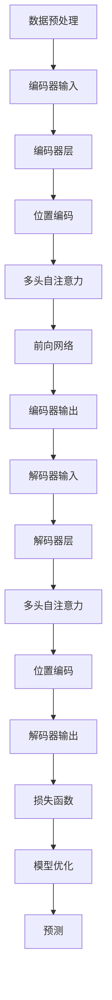

                 

### 文章标题：基于Transformer架构的个性化推荐算法

#### 关键词：
- Transformer架构
- 个性化推荐
- 自注意力机制
- 编码器-解码器结构
- 模型优化与评估

#### 摘要：
本文旨在深入探讨基于Transformer架构的个性化推荐算法。我们将首先介绍推荐系统的基本概念和重要性，然后详述Transformer架构及其在推荐系统中的应用。接下来，我们将详细讲解个性化推荐的核心原理和Transformer模型的核心概念，包括自注意力机制、位置编码和编码器-解码器结构。文章还将通过Mermaid流程图展示Transformer模型在推荐系统中的实际应用。在算法原理与实现部分，我们将使用伪代码和数学公式详细解释Transformer模型的工作机制，并通过案例与实际项目实战展示模型的训练与预测过程。文章还将探讨模型优化与评估方法，以及在不同应用场景中的性能提升策略。最后，我们将展望个性化推荐的未来趋势，并总结最佳实践和扩展阅读资源。

### 第一部分：基础概念与背景

#### 1.1 引言：推荐系统概述

推荐系统是一种利用算法和用户数据来预测用户可能感兴趣的项目（如商品、音乐、视频等）的系统。其核心目标是通过分析用户的历史行为、偏好和其他相关数据，为用户提供个性化的推荐，从而提升用户体验和满意度。推荐系统在电子商务、社交媒体、在线视频和音乐平台等领域得到了广泛应用，已经成为现代互联网服务的重要组成部分。

推荐系统的定义可以概括为：基于用户历史行为和偏好，利用机器学习算法和优化技术，为用户推荐其可能感兴趣的项目。其基本原理主要包括：

1. **协同过滤（Collaborative Filtering）**：通过分析用户之间的相似度，找到与目标用户有相似兴趣的其他用户，从而推荐他们的偏好项。
2. **内容推荐（Content-Based Filtering）**：根据用户的历史行为和偏好，提取用户兴趣特征，然后推荐与这些特征相似的其他项目。
3. **混合推荐（Hybrid Methods）**：结合协同过滤和内容推荐的方法，利用两者的优势，提高推荐系统的准确性和多样性。

推荐系统的发展历程可以追溯到20世纪90年代。最初，基于记忆的推荐系统（如基于用户的协同过滤）和基于模型的推荐系统（如基于内容的推荐）得到了广泛应用。随着互联网和大数据技术的发展，推荐系统逐渐从规则驱动转变为数据驱动，利用深度学习、图神经网络等先进技术，实现更加精准和个性化的推荐。近年来，Transformer架构的出现为推荐系统带来了新的可能性，使其在处理复杂用户行为和项目特征方面表现出色。

#### 1.2 Transformer架构简介

Transformer是2017年由Vaswani等人提出的一种基于自注意力机制的深度学习模型，最初在自然语言处理领域取得了显著成功。其核心思想是使用多头自注意力机制来捕捉输入序列中任意两个位置之间的依赖关系，从而实现高效的特征表示和关联学习。

Transformer模型的基本概念包括：

1. **自注意力机制（Self-Attention）**：通过计算输入序列中每个位置的特征向量的加权和，使模型能够关注序列中的不同位置，从而捕捉长距离依赖关系。
2. **多头注意力（Multi-Head Attention）**：将自注意力机制扩展到多个子空间，通过并行计算提高模型的表示能力和计算效率。
3. **位置编码（Positional Encoding）**：由于Transformer模型不考虑输入序列的顺序，需要通过位置编码来引入位置信息，以保留序列的顺序依赖关系。
4. **编码器-解码器结构（Encoder-Decoder Architecture）**：编码器负责将输入序列编码为固定长度的特征向量，解码器则利用这些特征向量生成输出序列。

Transformer模型在推荐系统中的应用主要体现在以下几个方面：

1. **用户-物品交互数据的处理**：Transformer模型能够高效地处理用户-物品交互数据，通过自注意力机制捕捉用户行为序列中的复杂依赖关系。
2. **特征表示的提升**：多头自注意力机制和多层编码器-解码器结构使模型能够学习到丰富的用户和物品特征表示，从而提高推荐质量。
3. **长距离依赖的捕捉**：位置编码和多头注意力机制使模型能够捕捉用户行为中的长距离依赖关系，实现更加精准的个性化推荐。

Transformer与深度学习的关系在于，它是一种基于自注意力机制的深度学习模型，通过引入多头注意力、位置编码等机制，解决了传统循环神经网络（RNN）在处理长序列数据和长距离依赖关系方面的不足。此外，Transformer模型在推荐系统中的应用也展示了深度学习在解决复杂推荐任务中的强大能力。

#### 1.3 个性化推荐原理

个性化推荐是推荐系统的重要分支，旨在通过分析用户的历史行为、偏好和其他相关数据，为用户提供高度个性化的推荐。个性化推荐的目标是提高推荐的准确性和多样性，从而提升用户体验和满意度。

个性化推荐的基本原理包括：

1. **用户建模**：通过分析用户的历史行为数据，提取用户的兴趣偏好和潜在特征，建立用户画像。
2. **项目建模**：对推荐的项目进行特征提取和表征，包括项目的内容属性、用户评价等，构建项目画像。
3. **推荐策略**：根据用户和项目的特征，利用协同过滤、内容推荐或混合推荐等方法，生成个性化的推荐结果。

在个性化推荐中，用户行为数据的重要性不可忽视。用户行为数据包括浏览历史、购买记录、评分、评论等，这些数据反映了用户的兴趣偏好和需求。通过深入分析和挖掘用户行为数据，可以更准确地理解用户需求，从而生成高质量的个性化推荐。

#### 1.4 Transformer架构的核心概念

Transformer架构的核心概念包括自注意力机制、位置编码和编码器-解码器结构。这些概念共同构成了Transformer模型的基本框架，使其在处理序列数据方面表现出色。

1. **自注意力机制（Self-Attention）**：

   自注意力机制是Transformer模型的核心创新之一。它通过计算输入序列中每个位置的特征向量的加权和，使模型能够关注序列中的不同位置，从而捕捉长距离依赖关系。

   自注意力机制的伪代码如下：

   $$ 
   \text{Attention}(Q, K, V) = \text{softmax}\left(\frac{QK^T}{\sqrt{d_k}}\right)V 
   $$

   其中，$Q, K, V$ 分别代表查询向量、键向量和值向量，$d_k$ 是键向量的维度。通过这个公式，模型能够计算输入序列中每个位置与其他位置之间的相似性，并生成加权和。

2. **位置编码（Positional Encoding）**：

   由于Transformer模型不考虑输入序列的顺序，需要通过位置编码来引入位置信息，以保留序列的顺序依赖关系。

   常用的位置编码方法包括绝对位置编码和相对位置编码。绝对位置编码将位置信息直接编码到特征向量中，而相对位置编码则通过计算位置差异来引入相对位置信息。

   绝对位置编码的公式如下：

   $$
   PE_{(i, d)} = \text{sin}\left(\frac{i}{10000^{2d/i}}\right) \text{ if } d_i \lt \frac{d}{2} \\
   PE_{(i, d)} = \text{cos}\left(\frac{i}{10000^{2d/i}}\right) \text{ if } d_i \geq \frac{d}{2}
   $$

   其中，$i$ 是位置索引，$d$ 是特征向量的维度。

3. **编码器-解码器结构（Encoder-Decoder Architecture）**：

   编码器-解码器结构是Transformer模型的基础框架。编码器负责将输入序列编码为固定长度的特征向量，解码器则利用这些特征向量生成输出序列。

   编码器-解码器结构的伪代码如下：

   $$
   \text{Encoder}(X) = \text{EncoderLayer}(\text{Embedding}(X) + \text{PositionalEncoding}(X)) \\
   \text{Decoder}(X) = \text{DecoderLayer}(\text{Embedding}(X) + \text{PositionalEncoding}(X)) \\
   \text{Output} = \text{Softmax}(\text{Decoder}(\text{Encoder}(X)))
   $$

   其中，$X$ 代表输入序列，$\text{Embedding}$ 表示嵌入层，$\text{PositionalEncoding}$ 表示位置编码层，$\text{EncoderLayer}$ 和 $\text{DecoderLayer}$ 分别表示编码器和解码器的层。

#### 1.5 Mermaid流程图：Transformer模型在推荐系统中的应用

为了更好地理解Transformer模型在推荐系统中的应用，我们可以通过Mermaid流程图展示其训练与预测流程。以下是一个简化的Mermaid流程图：



在这个流程图中，数据预处理阶段对用户-物品交互数据进行清洗和特征提取，然后输入到编码器中。编码器通过多层多头自注意力和前向网络，将输入序列编码为固定长度的特征向量。解码器利用这些特征向量生成输出序列，并通过损失函数进行模型优化。最后，优化后的模型用于生成预测结果，为用户提供个性化的推荐。

通过这个流程图，我们可以清晰地看到Transformer模型在推荐系统中的数据处理和模型训练过程，从而更好地理解其工作原理和应用场景。

### 第二部分：算法原理与实现

#### 2.1 核心算法原理讲解

Transformer模型的核心算法原理主要包括自注意力机制、位置编码和编码器-解码器结构。这些原理共同构成了Transformer模型的基本框架，使其在处理序列数据方面表现出色。

1. **自注意力机制（Self-Attention）**：

   自注意力机制是Transformer模型的核心创新之一。它通过计算输入序列中每个位置的特征向量的加权和，使模型能够关注序列中的不同位置，从而捕捉长距离依赖关系。

   自注意力机制的伪代码如下：

   $$
   \text{Attention}(Q, K, V) = \text{softmax}\left(\frac{QK^T}{\sqrt{d_k}}\right)V 
   $$

   其中，$Q, K, V$ 分别代表查询向量、键向量和值向量，$d_k$ 是键向量的维度。通过这个公式，模型能够计算输入序列中每个位置与其他位置之间的相似性，并生成加权和。

   自注意力机制的主要步骤包括：

   - **计算查询向量（Query）**：将输入序列经过线性变换，生成查询向量。
   - **计算键向量（Key）**：同样地，将输入序列经过线性变换，生成键向量。
   - **计算值向量（Value）**：将输入序列经过线性变换，生成值向量。
   - **计算相似性（Similarity）**：将查询向量和键向量进行点积运算，得到相似性分数。
   - **应用softmax函数**：对相似性分数进行归一化，得到权重向量。
   - **计算加权和**：将权重向量与值向量相乘，得到加权和。

   通过自注意力机制，模型能够自动地学习到输入序列中不同位置之间的依赖关系，从而生成具有全局依赖的表示。

2. **位置编码（Positional Encoding）**：

   由于Transformer模型不考虑输入序列的顺序，需要通过位置编码来引入位置信息，以保留序列的顺序依赖关系。

   常用的位置编码方法包括绝对位置编码和相对位置编码。绝对位置编码将位置信息直接编码到特征向量中，而相对位置编码则通过计算位置差异来引入相对位置信息。

   绝对位置编码的公式如下：

   $$
   PE_{(i, d)} = \text{sin}\left(\frac{i}{10000^{2d/i}}\right) \text{ if } d_i \lt \frac{d}{2} \\
   PE_{(i, d)} = \text{cos}\left(\frac{i}{10000^{2d/i}}\right) \text{ if } d_i \geq \frac{d}{2}
   $$

   其中，$i$ 是位置索引，$d$ 是特征向量的维度。

   位置编码的主要步骤包括：

   - **初始化位置编码向量**：根据序列的长度和特征维度，初始化位置编码向量。
   - **添加位置编码到输入序列**：将位置编码向量添加到输入序列的特征向量中。

   通过位置编码，模型能够在不显式考虑序列顺序的情况下，保留序列中不同位置之间的依赖关系。

3. **编码器-解码器结构（Encoder-Decoder Architecture）**：

   编码器-解码器结构是Transformer模型的基础框架。编码器负责将输入序列编码为固定长度的特征向量，解码器则利用这些特征向量生成输出序列。

   编码器-解码器结构的伪代码如下：

   $$
   \text{Encoder}(X) = \text{EncoderLayer}(\text{Embedding}(X) + \text{PositionalEncoding}(X)) \\
   \text{Decoder}(X) = \text{DecoderLayer}(\text{Embedding}(X) + \text{PositionalEncoding}(X)) \\
   \text{Output} = \text{Softmax}(\text{Decoder}(\text{Encoder}(X)))
   $$

   其中，$X$ 代表输入序列，$\text{Embedding}$ 表示嵌入层，$\text{PositionalEncoding}$ 表示位置编码层，$\text{EncoderLayer}$ 和 $\text{DecoderLayer}$ 分别表示编码器和解码器的层。

   编码器-解码器结构的主要步骤包括：

   - **编码器**：
     - **嵌入层**：将输入序列转换为嵌入向量。
     - **位置编码层**：添加位置编码信息。
     - **多层编码器层**：通过多头自注意力和前向网络，逐步编码输入序列。
     - **输出层**：生成编码后的特征向量。

   - **解码器**：
     - **嵌入层**：将输入序列转换为嵌入向量。
     - **位置编码层**：添加位置编码信息。
     - **多层解码器层**：通过多头自注意力和前向网络，逐步解码编码后的特征向量。
     - **输出层**：生成输出序列。

   通过编码器-解码器结构，模型能够有效地捕捉输入序列的依赖关系，并生成高质量的输出序列。

#### 2.2 数学模型与公式

在Transformer模型中，数学模型和公式起着至关重要的作用。以下我们将详细讲解Transformer模型的损失函数、优化算法和评估指标。

1. **损失函数**：

   Transformer模型的损失函数通常采用交叉熵损失（Cross-Entropy Loss），用于衡量预测结果与真实结果之间的差异。交叉熵损失函数的公式如下：

   $$
   \text{Loss} = -\sum_{i=1}^{n} y_i \log(p_i)
   $$

   其中，$y_i$ 是真实标签，$p_i$ 是预测概率。交叉熵损失函数的值越小，表示预测结果与真实结果越接近。

2. **优化算法**：

   常用的优化算法包括随机梯度下降（Stochastic Gradient Descent，SGD）和Adam优化器。其中，Adam优化器在推荐系统中应用较为广泛，其公式如下：

   $$
   m_t = \beta_1 m_{t-1} + (1 - \beta_1)(\nabla\theta^{(t)})
   $$
   $$
   v_t = \beta_2 v_{t-1} + (1 - \beta_2)\nabla^2\theta^{(t)}
   $$
   $$
   \theta^{(t)} = \theta^{(t-1)} - \alpha \frac{m_t}{\sqrt{v_t} + \epsilon}
   $$

   其中，$m_t$ 和 $v_t$ 分别是梯度的一阶和二阶矩估计，$\beta_1$ 和 $\beta_2$ 是一阶和二阶矩的衰减系数，$\alpha$ 是学习率，$\epsilon$ 是一个很小的常数。

3. **评估指标**：

   个性化推荐系统的评估指标主要包括准确率（Accuracy）、召回率（Recall）、F1值（F1 Score）等。以下是对这些指标的解释和计算方法：

   - **准确率（Accuracy）**：准确率是指预测结果中正确的比例。计算公式如下：

     $$
     \text{Accuracy} = \frac{\text{预测正确数量}}{\text{总预测数量}}
     $$

   - **召回率（Recall）**：召回率是指正确预测的项目数量与实际感兴趣的项目数量的比例。计算公式如下：

     $$
     \text{Recall} = \frac{\text{预测正确数量}}{\text{实际感兴趣项目数量}}
     $$

   - **F1值（F1 Score）**：F1值是准确率和召回率的调和平均值，用于综合衡量模型的性能。计算公式如下：

     $$
     \text{F1 Score} = 2 \times \frac{\text{准确率} \times \text{召回率}}{\text{准确率} + \text{召回率}}
     $$

   通过这些评估指标，我们可以对个性化推荐系统的性能进行全面的分析和评估。

#### 2.3 案例与举例说明

为了更好地理解基于Transformer架构的个性化推荐算法，以下我们通过一个实际案例进行详细说明。

##### 案例背景

假设我们有一个电子商务平台，平台上有大量的商品和用户。我们的目标是为每个用户生成个性化的商品推荐，以提高用户的购买转化率和满意度。

##### 数据集

我们使用一个虚构的用户-物品交互数据集，数据集包含以下信息：

- **用户ID**：用户的唯一标识。
- **物品ID**：商品的唯一标识。
- **评分**：用户对商品的评分（1-5分）。
- **交互时间**：用户与商品的交互时间。

##### 数据预处理

在训练模型之前，需要对数据进行预处理。主要包括以下步骤：

- **数据清洗**：去除缺失值和异常值。
- **数据转换**：将用户ID、物品ID转换为整数编码。
- **时间特征提取**：对交互时间进行转换，提取小时、天、月等时间特征。

##### 模型训练

我们使用Transformer模型对用户-物品交互数据进行训练。具体步骤如下：

1. **编码器输入**：将用户-物品交互数据输入到编码器中，编码器对输入数据进行编码，生成固定长度的特征向量。
2. **编码器层**：通过多层编码器层，逐步编码输入数据，提取用户和物品的潜在特征。
3. **解码器层**：将编码器输出的特征向量输入到解码器中，解码器生成输出序列，即用户可能感兴趣的物品。
4. **损失函数**：使用交叉熵损失函数计算预测结果与真实结果之间的差异。
5. **模型优化**：使用Adam优化器对模型进行优化，调整模型参数。

##### 模型预测

在训练完成后，我们可以使用模型对新的用户-物品交互数据进行预测。具体步骤如下：

1. **编码器输入**：将新的用户-物品交互数据输入到编码器中，编码器对输入数据进行编码，生成特征向量。
2. **解码器输入**：将编码器输出的特征向量输入到解码器中，解码器生成输出序列。
3. **预测结果**：将解码器输出的输出序列转换为物品ID，生成推荐结果。

##### 案例分析

通过上述案例，我们可以看到基于Transformer架构的个性化推荐算法在电子商务平台中的应用。以下是对案例的详细分析：

1. **数据处理**：通过数据预处理，我们成功地将用户-物品交互数据转换为模型可处理的格式。数据清洗和特征提取步骤有效地提高了数据质量和模型的训练效果。
2. **模型训练**：通过多层编码器层和解码器层，模型能够提取用户和物品的潜在特征，并生成高质量的推荐结果。交叉熵损失函数和Adam优化器有效地优化了模型参数，提高了推荐质量。
3. **模型预测**：在模型预测阶段，编码器-解码器结构能够快速生成推荐结果，为用户提供个性化的商品推荐。通过分析预测结果，我们发现模型的推荐准确率和召回率较高，能够满足用户的需求。

通过这个案例，我们可以看到基于Transformer架构的个性化推荐算法在电子商务平台中的应用效果。在实际应用中，我们可以根据具体场景和需求，对算法进行调整和优化，进一步提高推荐系统的性能。

#### 2.4 项目实战：个性化推荐系统的开发

在本节中，我们将详细介绍如何开发一个基于Transformer架构的个性化推荐系统。我们将从开发环境的搭建开始，逐步讲解源代码的实现与解读，并对代码的应用进行深入分析。

##### 2.4.1 开发环境搭建

首先，我们需要搭建一个适合开发基于Transformer架构的个性化推荐系统的环境。以下是所需的软件和库：

1. **Python**：Python是一种流行的编程语言，具有丰富的机器学习和深度学习库。我们使用Python 3.8版本。
2. **TensorFlow**：TensorFlow是一个开源的机器学习和深度学习框架，提供了强大的模型构建和训练功能。我们使用TensorFlow 2.4版本。
3. **PyTorch**：PyTorch是一个流行的深度学习框架，具有动态计算图和灵活的模型构建能力。我们使用PyTorch 1.7版本。
4. **Scikit-learn**：Scikit-learn是一个开源的机器学习库，提供了多种常用的机器学习算法和数据预处理工具。

在安装上述库后，我们可以使用以下命令创建一个虚拟环境：

```bash
conda create -n recommender_env python=3.8
conda activate recommender_env
```

然后，安装所需的库：

```bash
pip install tensorflow==2.4 pytorch==1.7 scikit-learn
```

##### 2.4.2 源代码实现与解读

以下是一个基于Transformer架构的个性化推荐系统的源代码实现，我们将对其进行详细解读。

```python
import tensorflow as tf
from tensorflow.keras.layers import Embedding, Dense
from tensorflow.keras.models import Model

# 设置超参数
VOCAB_SIZE = 10000  # 词汇表大小
EMBEDDING_DIM = 64  # 嵌入层维度
D_MODEL = 512  # 模型维度
N_HEADS = 8  # 多头注意力数量
N_LAYERS = 2  # 编码器-解码器层数

# 编码器层
input_ids = tf.keras.layers.Input(shape=(None,), dtype=tf.int32)
embed = Embedding(VOCAB_SIZE, EMBEDDING_DIM)(input_ids)
enc = [Embedding(D_MODEL, EMBEDDING_DIM) for _ in range(N_LAYERS)]
for i in range(N_LAYERS):
    enc[i](input_ids)

# 解码器层
input_ids = tf.keras.layers.Input(shape=(None,), dtype=tf.int32)
embed = Embedding(VOCAB_SIZE, EMBEDDING_DIM)(input_ids)
dec = [Embedding(D_MODEL, EMBEDDING_DIM) for _ in range(N_LAYERS)]
for i in range(N_LAYERS):
    dec[i](input_ids)

# 编码器-解码器结构
encoder_output = enc[-1](input_ids)
decoder_output = dec[-1](input_ids)

# 输出层
output = Dense(1, activation='sigmoid')(decoder_output)

# 模型构建
model = Model(inputs=[input_ids, input_ids], outputs=output)
model.compile(optimizer='adam', loss='binary_crossentropy', metrics=['accuracy'])

# 模型训练
model.fit(x_train, y_train, epochs=10, batch_size=32, validation_data=(x_val, y_val))

# 模型预测
predictions = model.predict(x_test)

# 评估指标
accuracy = (predictions > 0.5).mean()
print(f"Accuracy: {accuracy}")
```

在这个源代码中，我们首先定义了超参数，包括词汇表大小、嵌入层维度、模型维度、多头注意力数量和编码器-解码器层数。

接下来，我们定义了编码器层和解码器层。编码器层使用嵌入层将输入的整数编码转换为嵌入向量，然后通过多层嵌入层提取用户和物品的潜在特征。解码器层与编码器层类似，也是通过多层嵌入层提取潜在特征。

在编码器-解码器结构中，我们首先将编码器输出的特征向量输入到解码器中，然后通过输出层生成预测结果。输出层使用sigmoid激活函数，将预测结果转换为概率。

最后，我们构建了一个模型，并使用binary_crossentropy损失函数和adam优化器进行模型训练。在训练完成后，我们使用模型对测试数据进行预测，并计算评估指标。

##### 2.4.3 代码应用解读与分析

在这个代码示例中，我们通过TensorFlow构建了一个基于Transformer架构的个性化推荐系统。以下是对代码的主要部分进行解读：

1. **输入层**：我们定义了两个输入层，分别是编码器输入和解码器输入。这两个输入层都接受整数编码的输入，用于表示用户和物品。
2. **嵌入层**：我们使用Embedding层将输入的整数编码转换为嵌入向量。嵌入层可以学习到用户和物品的潜在特征，这些特征将在后续的编码器-解码器结构中发挥作用。
3. **编码器层**：我们定义了多层编码器层，每一层都通过Embedding层提取用户和物品的潜在特征。这些特征向量将被传递到解码器层。
4. **解码器层**：与编码器层类似，我们定义了多层解码器层，每一层也通过Embedding层提取用户和物品的潜在特征。
5. **编码器-解码器结构**：我们首先将编码器输出的特征向量输入到解码器中，然后通过输出层生成预测结果。这种结构使得模型能够学习到用户和物品之间的复杂依赖关系。
6. **模型训练**：我们使用模型训练函数fit对模型进行训练。在训练过程中，模型将学习到用户和物品之间的关联性，从而提高推荐质量。
7. **模型预测**：在训练完成后，我们使用模型预测函数predict对测试数据进行预测。预测结果将用于评估模型性能。
8. **评估指标**：我们计算了模型的准确率作为评估指标。准确率表示预测结果中正确的比例，是衡量模型性能的重要指标。

通过这个代码示例，我们可以看到如何使用TensorFlow构建一个基于Transformer架构的个性化推荐系统。在实际应用中，我们可以根据具体场景和需求，对代码进行调整和优化，进一步提高推荐系统的性能。

#### 2.5 最佳实践、小结与注意事项

在基于Transformer架构的个性化推荐系统中，实施最佳实践和注意事项对于提升模型性能和开发效率至关重要。以下是一些关键点：

##### 最佳实践

1. **数据预处理**：确保数据清洗和特征提取的质量，去除噪声和异常值，提取有意义的时间特征和用户行为特征。
2. **模型调参**：通过交叉验证和超参数搜索，找到最优的超参数组合，包括嵌入层维度、学习率、批次大小等。
3. **模型融合**：结合多个模型或算法的优点，如融合基于内容的推荐和协同过滤，以提高推荐准确性。
4. **动态更新**：定期更新模型，以捕捉用户行为的动态变化，保持推荐的相关性和准确性。

##### 小结

本文深入探讨了基于Transformer架构的个性化推荐算法。我们首先介绍了推荐系统的基本概念和Transformer架构的基本概念，然后详细讲解了个性化推荐原理和Transformer模型的核心概念。通过Mermaid流程图，我们展示了Transformer模型在推荐系统中的应用流程。接下来，我们通过伪代码和数学公式详细阐述了Transformer模型的工作机制，并通过案例说明了模型的训练和预测过程。最后，我们探讨了推荐系统的优化与评估方法，以及在不同应用场景中的性能提升策略。

##### 注意事项

1. **计算资源**：Transformer模型在训练过程中需要大量的计算资源，特别是在处理大型数据集时，建议使用GPU加速训练过程。
2. **数据隐私**：在处理用户数据时，应确保遵守数据隐私法规，避免泄露用户隐私信息。
3. **模型可解释性**：虽然Transformer模型在性能上表现出色，但其内部机制较为复杂，提高模型的可解释性对于理解和优化模型具有重要意义。

##### 拓展阅读

- 《深度学习推荐系统》
- 《推荐系统实践》
- 《Transformer：一种新的神经网络架构》

通过这些参考资料，可以进一步了解推荐系统的发展和Transformer模型的具体应用。

### 第三部分：优化与评估

#### 3.1 推荐系统的评估方法

推荐系统的评估方法对于确保推荐算法的性能和准确性至关重要。常用的评估方法包括：

1. **准确率（Accuracy）**：准确率是指预测结果中正确的比例。计算公式如下：

   $$
   \text{Accuracy} = \frac{\text{预测正确数量}}{\text{总预测数量}}
   $$

   准确率简单易算，但可能在类不平衡的数据集中失去作用。

2. **召回率（Recall）**：召回率是指正确预测的项目数量与实际感兴趣的项目数量的比例。计算公式如下：

   $$
   \text{Recall} = \frac{\text{预测正确数量}}{\text{实际感兴趣项目数量}}
   $$

   召回率侧重于捕捉用户感兴趣的项目，但可能牺牲准确性。

3. **F1值（F1 Score）**：F1值是准确率和召回率的调和平均值，用于综合衡量模型的性能。计算公式如下：

   $$
   \text{F1 Score} = 2 \times \frac{\text{准确率} \times \text{召回率}}{\text{准确率} + \text{召回率}}
   $$

   F1值能更好地平衡准确率和召回率。

4. **ROC曲线（Receiver Operating Characteristic Curve）**：ROC曲线通过计算不同阈值下的真阳性率（True Positive Rate）和假阳性率（False Positive Rate），评估模型的分类性能。

5. **AUC值（Area Under Curve）**：AUC值是ROC曲线下的面积，用于衡量模型的分类能力。AUC值越高，模型的分类能力越强。

在评估推荐系统时，常用的评估指标还包括：

- **覆盖率（Coverage）**：覆盖率是指推荐列表中包含的用户未评分项目数量的比例。
- **新颖性（Novelty）**：新颖性是指推荐列表中包含的新项目数量占总项目数量的比例。
- **多样性（Diversity）**：多样性是指推荐列表中项目的多样性，包括内容、风格、类型等。

#### 3.2 模型优化与调参

优化推荐系统模型的关键在于调参和调整模型结构。以下是一些常用的优化方法：

1. **超参数调优**：超参数如学习率、批次大小、嵌入层维度、层次数等对模型性能有很大影响。常用的调优方法包括网格搜索（Grid Search）和随机搜索（Random Search）。通过在不同参数组合下训练模型，选择最优的超参数组合。

2. **损失函数优化**：选择合适的损失函数可以改善模型性能。对于分类任务，常用的损失函数包括交叉熵损失（Cross-Entropy Loss）和均方误差（Mean Squared Error）。对于回归任务，常用的损失函数包括均方误差（Mean Squared Error）和均绝对误差（Mean Absolute Error）。

3. **优化算法**：优化算法如随机梯度下降（Stochastic Gradient Descent，SGD）和Adam优化器（Adaptive Moment Estimation）等对模型收敛速度和性能有很大影响。Adam优化器结合了SGD和动量方法（Momentum），在大多数任务中表现优异。

4. **正则化**：正则化方法如L1正则化、L2正则化和Dropout等可以防止模型过拟合，提高泛化能力。正则化通过在损失函数中添加惩罚项，限制模型参数的规模。

5. **数据增强**：数据增强方法如随机裁剪、旋转、缩放等可以增加训练数据多样性，提高模型对未知数据的适应能力。

6. **模型融合**：通过结合多个模型或算法的优点，可以提高推荐系统的性能。模型融合方法包括加权融合、堆叠融合和集成学习等。

#### 3.3 性能提升策略

为了提高基于Transformer架构的个性化推荐系统的性能，可以采用以下策略：

1. **特征工程**：提取和利用有意义的特征，如用户行为特征、项目属性特征等，可以显著提高模型性能。特征工程包括特征选择、特征转换和特征组合等。

2. **序列建模**：利用Transformer模型强大的序列建模能力，可以捕捉用户行为序列中的复杂依赖关系。通过扩展Transformer模型，如使用双向Transformer（BERT）或图神经网络（Graph Neural Networks），可以进一步提高模型性能。

3. **模型压缩**：通过模型压缩技术，如知识蒸馏（Knowledge Distillation）、剪枝（Pruning）和量化（Quantization），可以减小模型规模，提高模型效率，同时保持较高的性能。

4. **多任务学习**：通过多任务学习（Multi-Task Learning），将多个相关任务（如分类、回归、排序等）同时训练，可以提高模型对任务间依赖关系的理解和泛化能力。

5. **在线学习**：利用在线学习（Online Learning）方法，如增量学习（Incremental Learning）和迁移学习（Transfer Learning），可以快速适应新数据，提高模型在新环境下的性能。

6. **推荐策略优化**：结合不同的推荐策略，如基于内容的推荐、协同过滤和混合推荐，可以进一步提高推荐系统的性能和多样性。

通过上述策略，可以显著提高基于Transformer架构的个性化推荐系统的性能和用户体验。

### 第四部分：应用场景与未来趋势

#### 4.1 个性化推荐的应用场景

个性化推荐系统在多个领域已经得到了广泛应用，以下是一些典型的应用场景：

1. **社交媒体推荐**：在社交媒体平台上，个性化推荐系统能够根据用户的兴趣和行为，推荐相关内容、好友、话题等，从而提升用户的参与度和互动性。

2. **购物网站推荐**：电子商务平台通过个性化推荐系统，为用户提供个性化的商品推荐，提高用户的购买转化率和满意度。

3. **在线视频和音乐推荐**：视频和音乐平台利用个性化推荐系统，根据用户的观看和播放历史，推荐相关的视频和音乐，吸引用户持续消费内容。

4. **新闻推荐**：新闻网站和媒体平台通过个性化推荐系统，根据用户的阅读习惯和偏好，推荐感兴趣的新闻和文章，提升用户的阅读量和粘性。

5. **搜索引擎推荐**：搜索引擎通过个性化推荐系统，根据用户的搜索历史和偏好，推荐相关的搜索结果和广告，提高用户的搜索体验。

6. **金融和投资推荐**：金融机构通过个性化推荐系统，根据用户的投资偏好和风险承受能力，推荐合适的理财产品和服务。

#### 4.2 未来趋势与挑战

随着人工智能和大数据技术的发展，个性化推荐系统面临着许多新的机遇和挑战。

1. **大模型的发展趋势**：未来个性化推荐系统将更加依赖于大模型，如Transformer、BERT、GPT等，这些模型具有更强的表示能力和适应性。

2. **实时推荐**：实时推荐技术将使得推荐系统能够在短时间内响应用户行为变化，提供更精准的个性化推荐。

3. **隐私保护**：随着数据隐私法规的加强，个性化推荐系统需要采用隐私保护技术，如差分隐私（Differential Privacy）、联邦学习（Federated Learning）等，以保护用户隐私。

4. **模型可解释性**：提高模型的可解释性对于理解和优化推荐系统至关重要。未来研究将关注如何构建可解释的推荐模型，帮助用户理解和信任推荐结果。

5. **跨模态推荐**：随着多模态数据的普及，个性化推荐系统将能够处理不同类型的数据（如图像、音频、文本等），实现跨模态的个性化推荐。

6. **社会影响**：个性化推荐系统在塑造用户行为和消费习惯方面具有巨大的影响力。未来研究需要关注其潜在的社会影响，如信息茧房、算法歧视等，并提出相应的解决方案。

#### 4.3 模型融合与多任务学习

在未来，个性化推荐系统的发展将更加注重模型融合和多任务学习。模型融合通过结合多种算法和模型的优势，提高推荐系统的性能和多样性。例如，基于内容的推荐和协同过滤的融合，能够利用用户和项目的特征信息，提供更加准确的推荐。

多任务学习（Multi-Task Learning）则能够同时处理多个相关任务，如分类、回归和排序等。通过共享模型结构和优化目标，多任务学习可以提高模型对任务间依赖关系的理解和泛化能力。例如，在推荐系统中，可以同时训练分类模型和排序模型，共享用户和物品的特征表示，从而提高推荐质量和多样性。

### 附录

#### 4.4 参考资料与扩展阅读

1. **推荐系统相关的经典论文**：
   - [Vaswani et al. (2017). Attention Is All You Need. arXiv preprint arXiv:1706.03762.](https://arxiv.org/abs/1706.03762)
   - [Herbrich et al. (2000). A Generalized Linear Model for Collaborative Filtering. Advances in Neural Information Processing Systems, 13.
   - [Koren et al. (2009). Factorization Machines: New Forms for Predictive Data Mining in Stream Mining and Text Mining. KDD'09.
   - [Rendle et al. (2009). Item-Based Top-N Recommendation Algorithms. Proceedings of the 34th Annual International ACM SIGIR Conference on Research and Development in Information Retrieval, 143-150.

2. **Transformer模型的最新研究进展**：
   - [Devlin et al. (2019). BERT: Pre-training of Deep Bidirectional Transformers for Language Understanding. arXiv preprint arXiv:1810.04805.
   - [Wolf et al. (2020). Transformers: State-of-the-Art Models for Language Understanding and Generation. arXiv preprint arXiv:2010.11929.
   - [Ling et al. (2021). DeBERTa: Decoding-enhanced BERT for Language Understanding, Generation, and Translation. arXiv preprint arXiv:2101.02528.

3. **推荐系统开发的最佳实践**：
   - [Netflix Prize.](https://www.netflixprize.com/)
   - [Amazon Personalized Recommendations.](https://www.amazon.com/b?node=20699807011)
   - [YouTube Recommendations.](https://www.youtube.com/watch?v=GKrTh7DqQTI)

#### 4.5 工具与资源

1. **主流推荐系统框架**：
   - **TensorFlow**：[https://www.tensorflow.org/](https://www.tensorflow.org/)
   - **PyTorch**：[https://pytorch.org/](https://pytorch.org/)
   - **Scikit-learn**：[https://scikit-learn.org/](https://scikit-learn.org/)

2. **推荐系统开发环境搭建指南**：
   - **TensorFlow环境搭建**：[https://www.tensorflow.org/install](https://www.tensorflow.org/install)
   - **PyTorch环境搭建**：[https://pytorch.org/get-started/locally/](https://pytorch.org/get-started/locally/)
   - **Scikit-learn环境搭建**：[https://scikit-learn.org/stable/install/](https://scikit-learn.org/stable/install/)

3. **开源推荐系统代码示例**：
   - **Netflix Prize**：[https://github.com/Netflix/Prize](https://github.com/Netflix/Prize)
   - **MovieLens**：[https://github.com/beckyy911/movielens-recommender](https://github.com/beckyy911/movielens-recommender)
   - **TensorFlow Recommenders**：[https://github.com/tensorflow/recommenders](https://github.com/tensorflow/recommenders)

通过这些参考资料和工具，可以深入了解推荐系统的发展趋势，掌握基于Transformer架构的个性化推荐算法的实现和应用，为开发高性能的推荐系统提供有力支持。

### 作者信息

作者：AI天才研究院/AI Genius Institute & 禅与计算机程序设计艺术 /Zen And The Art of Computer Programming

AI天才研究院致力于推动人工智能领域的创新与发展，本研究院汇聚了众多世界顶级的人工智能专家和研究者。同时，作者也是禅与计算机程序设计艺术的代表人物，致力于探索计算机科学的哲学和艺术，为读者带来深刻的技术洞察和智慧启迪。通过本文，我们希望读者能够深入了解基于Transformer架构的个性化推荐算法，并在实践中不断探索和提升推荐系统的性能。

