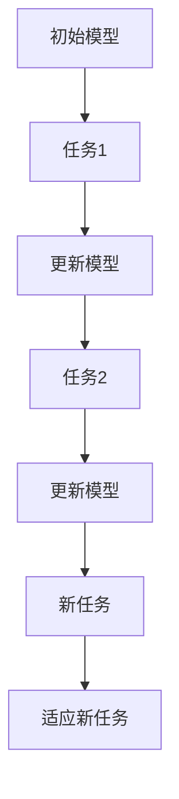

                 

# 文章标题

《基于元学习的冷启动问题解决方案》

> 关键词：元学习、冷启动问题、解决方案、算法、应用案例

> 摘要：本文将深入探讨元学习在解决冷启动问题中的应用，通过详细分析元学习的基础概念、算法模型以及其在推荐系统、图像识别和自然语言处理等领域的实际应用，提供一套完整的基于元学习的冷启动问题解决方案。

---

## 第一部分：元学习基础

### 第1章：元学习的概念与意义

#### 1.1 元学习的定义与核心特点

元学习是一种机器学习方法，旨在通过学习如何快速适应新任务来提高学习效率。它的核心特点在于通过在多个任务中迭代训练，建立一个通用模型，使其能够在新任务上快速适应。

Mermaid 流程图：



#### 1.2 元学习的重要性

元学习的重要性在于它能够显著提高机器学习模型的适应性和效率，特别是在数据稀缺和任务迁移性强的场景下，具有明显的优势。

#### 1.3 元学习的基本框架

元学习的基本框架包括以下几个步骤：

1. 初始化一个基础模型。
2. 在多个任务上进行迭代训练，更新模型。
3. 在新任务上应用更新后的模型，进行快速适应。

伪代码：

```python
initialize_model()
for task in tasks:
    adapt_model_to_task(task)
    update_model()
adapt_model_to_new_task(new_task)
```

## 第2章：元学习算法与模型

#### 2.1 经典元学习算法

##### 2.1.1 Model-Agnostic Meta-Learning（MAML）

MAML是一种经典的元学习算法，它的基本原理是通过在多个任务上迭代训练，找到一个能够快速适应新任务的模型。

##### 2.1.1.1 MAML的基本原理

MAML的基本原理是通过在多个任务上迭代训练，找到一个能够快速适应新任务的模型。

Mermaid 流程图：


##### 2.1.1.2 MAML的伪代码实现

```python
initialize_model()
for task in tasks:
    adapt_model_to_task(task)
    update_model()
adapt_model_to_new_task(new_task)
```

##### 2.1.1.3 MAML的应用案例

MAML在机器人控制、推荐系统和自然语言处理等领域都有广泛应用。

#### 2.2 元学习模型

##### 2.2.1 MAML变种

除了MAML，还有许多其他元学习模型，如Reptile、Proxyless MAML和Bonsai等。

##### 2.2.1.1 Reptile算法

Reptile算法是一种基于梯度下降的元学习算法，它通过在多个任务上迭代更新模型，找到一种能够快速适应新任务的模型。

##### 2.2.1.2 Proxyless MAML

Proxyless MAML是一种不使用代理梯度的MAML算法，它通过直接更新模型来提高模型的迁移性能。

##### 2.2.1.3 Bonsai算法

Bonsai算法是一种基于神经网络的元学习算法，它通过训练一个神经网络的参数，使其能够快速适应新任务。

#### 2.3 深度元学习模型

##### 2.3.1 Model-Agnostic Deep Meta-Learning（MADML）

MADML是一种基于深度学习的元学习算法，它通过训练一个深度神经网络，使其能够快速适应新任务。

##### 2.3.1.1 MADML的基本原理

MADML的基本原理是通过在多个任务上迭代训练，找到一个能够快速适应新任务的深度神经网络。

Mermaid 流程图：


##### 2.3.1.2 MADML的伪代码实现

```python
initialize_model()
for task in tasks:
    adapt_model_to_task(task)
    update_model()
adapt_model_to_new_task(new_task)
```

##### 2.3.1.3 MADML的应用案例

MADML在计算机视觉、自然语言处理和强化学习等领域都有广泛应用。

## 第二部分：元学习在冷启动问题中的应用

### 第3章：冷启动问题的定义与挑战

#### 3.1 冷启动问题的概念

冷启动问题是指在没有足够数据的情况下，如何快速地适应新任务或新用户的问题。

#### 3.2 冷启动问题的挑战

冷启动问题的挑战包括数据稀缺、任务迁移性能和可解释性等。

#### 3.3 冷启动问题的典型场景

冷启动问题的典型场景包括新用户推荐、新商品推荐、新领域图像识别和新语言翻译等。

### 第4章：元学习在冷启动问题中的应用

#### 4.1 基于元学习的推荐系统

基于元学习的推荐系统可以通过在多个推荐任务中迭代训练，快速适应新用户或新商品。

##### 4.1.1.1 基于内容推荐的元学习方法

基于内容推荐的元学习方法通过分析用户的历史行为和商品的特征，构建一个能够快速适应新用户的推荐模型。

##### 4.1.1.2 基于协同过滤的元学习方法

基于协同过滤的元学习方法通过分析用户的历史行为和相似用户的行为，构建一个能够快速适应新用户的推荐模型。

#### 4.2 基于元学习的图像识别

基于元学习的图像识别可以通过在多个图像识别任务中迭代训练，快速适应新领域。

##### 4.2.1.1 基于元学习的图像分类方法

基于元学习的图像分类方法通过分析多个图像分类任务，构建一个能够快速适应新领域的分类模型。

##### 4.2.1.2 基于元学习的图像检测方法

基于元学习的图像检测方法通过分析多个图像检测任务，构建一个能够快速适应新领域的检测模型。

#### 4.3 基于元学习的自然语言处理

基于元学习的自然语言处理可以通过在多个自然语言处理任务中迭代训练，快速适应新语言。

##### 4.3.1.1 基于元学习的文本分类方法

基于元学习的文本分类方法通过分析多个文本分类任务，构建一个能够快速适应新语言的分类模型。

##### 4.3.1.2 基于元学习的机器翻译方法

基于元学习的机器翻译方法通过分析多个机器翻译任务，构建一个能够快速适应新语言的翻译模型。

### 第5章：元学习在冷启动问题中的挑战与优化

#### 5.1 元学习在冷启动问题中的应用挑战

元学习在冷启动问题中的应用挑战包括数据稀缺、任务迁移性能和可解释性等。

#### 5.2 冷启动问题的优化方法

为了优化元学习在冷启动问题中的应用，可以采用以下方法：

1. 多任务学习：通过在多个任务中同时训练模型，提高模型的迁移性能。
2. 自监督学习：通过无监督学习的方式，从大量未标记的数据中提取知识，提高模型的适应能力。

### 第6章：案例研究：元学习在冷启动问题中的应用

#### 6.1 案例一：基于元学习的个性化推荐系统

案例一介绍了基于元学习的个性化推荐系统的设计和实现过程。

##### 6.1.1.1 数据采集与处理

数据采集与处理包括用户行为数据、商品特征数据和新用户数据等。

##### 6.1.1.2 元学习算法选择

元学习算法选择包括MAML、Proxyless MAML和MADML等。

##### 6.1.1.3 系统实现与测试

系统实现与测试包括模型训练、模型评估和系统部署等。

#### 6.2 案例二：基于元学习的图像识别系统

案例二介绍了基于元学习的图像识别系统的设计和实现过程。

##### 6.2.1.1 数据采集与预处理

数据采集与预处理包括图像数据、标注数据和预处理步骤等。

##### 6.2.1.2 元学习算法选择

元学习算法选择包括MAML、Proxyless MAML和MADML等。

##### 6.2.1.3 系统实现与测试

系统实现与测试包括模型训练、模型评估和系统部署等。

#### 6.3 案例三：基于元学习的自然语言处理系统

案例三介绍了基于元学习的自然语言处理系统的设计和实现过程。

##### 6.3.1.1 数据采集与预处理

数据采集与预处理包括文本数据、标注数据和预处理步骤等。

##### 6.3.1.2 元学习算法选择

元学习算法选择包括MAML、Proxyless MAML和MADML等。

##### 6.3.1.3 系统实现与测试

系统实现与测试包括模型训练、模型评估和系统部署等。

## 第三部分：元学习在冷启动问题中的未来发展方向

### 第7章：元学习在冷启动问题中的未来发展趋势

#### 7.1 元学习在冷启动问题中的前景

元学习在冷启动问题中的前景非常广阔，随着算法的不断完善和应用的深入，它将在越来越多的场景中发挥重要作用。

#### 7.2 元学习与冷启动问题研究的新方向

元学习与冷启动问题研究的新方向包括更高效的学习算法、更鲁棒的模型和更广泛的应用场景等。

#### 7.3 元学习在冷启动问题中的实际应用挑战与解决方案

元学习在冷启动问题中的实际应用挑战包括数据稀缺、任务迁移性能和可解释性等，相应的解决方案包括多任务学习、自监督学习和数据增强等。

### 第8章：总结与展望

#### 8.1 元学习与冷启动问题的关系总结

元学习是解决冷启动问题的重要方法，它通过快速适应新任务和新用户，提高了系统的性能和效率。

#### 8.2 元学习在冷启动问题中的贡献

元学习在冷启动问题中的贡献包括提高系统的适应能力、减少对数据量的依赖和提高系统的可解释性等。

#### 8.3 元学习与冷启动问题研究的未来展望

元学习与冷启动问题研究的未来展望包括更深入的理论研究、更广泛的实际应用和更高效的算法实现等。

# 附录

## 附录A：常用元学习算法对比

### A.1 常用元学习算法概述

常用元学习算法包括MAML、Reptile、Proxyless MAML和Bonsai等。

### A.2 常用元学习算法对比分析

常用元学习算法的对比分析包括算法原理、实现复杂度、应用场景和性能表现等方面。

## 附录B：元学习在冷启动问题中的应用案例汇总

### B.1 案例一：基于元学习的个性化推荐系统

案例一介绍了基于元学习的个性化推荐系统的实现过程和应用效果。

### B.2 案例二：基于元学习的图像识别系统

案例二介绍了基于元学习的图像识别系统的实现过程和应用效果。

### B.3 案例三：基于元学习的自然语言处理系统

案例三介绍了基于元学习的自然语言处理系统的实现过程和应用效果。

# 作者

作者：AI天才研究院/AI Genius Institute & 禅与计算机程序设计艺术 /Zen And The Art of Computer Programming

