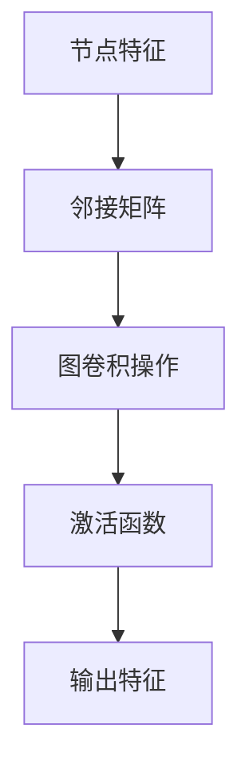
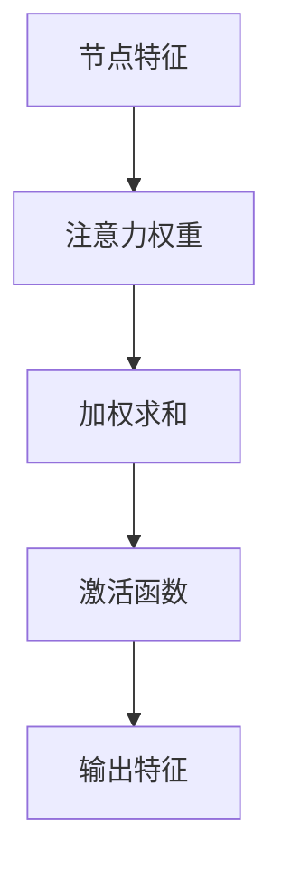
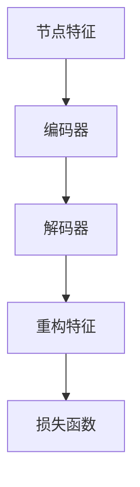

                 


### 《基于图神经网络的商品关联推荐》

#### 关键词：图神经网络，商品关联推荐，推荐系统，数据处理，算法实现

> 摘要：本文从图神经网络的基础知识出发，深入探讨了商品关联推荐的概念、应用场景以及基于图神经网络的商品关联推荐算法。通过对图神经网络核心算法的详细讲解，包括图卷积网络（GCN）、图注意力网络（GAT）和图自编码器（GAE），本文进一步介绍了商品关联推荐系统的实现方法，并通过实际案例和实践经验，探讨了图神经网络在商品关联推荐中的应用前景和面临的挑战。

----------------------------------------------------------------

#### 第一部分：图神经网络基础

##### 第1章：图神经网络概述

###### 1.1 图神经网络的基本概念

**图和图论基础**：

图是网络科学和图论中的一个基本概念，由节点（vertex）和边（edge）组成。节点表示实体，如用户、商品，边表示实体之间的关联，如用户购买了某个商品。图论则研究图的性质及其在各类问题中的应用。

**图神经网络的发展历程**：

图神经网络（Graph Neural Networks, GNNs）是近年来兴起的一种神经网络架构，旨在处理图结构数据。最早的图神经网络可以追溯到1990年代，随着深度学习技术的发展，GNN在2010年代逐渐成为一个研究热点。近年来，GNN在各种应用领域都取得了显著的进展。

###### 1.2 图神经网络的架构

**神经网络与图神经网络对比**：

传统的神经网络适用于处理线性或树状结构数据，如卷积神经网络（CNN）处理图像、循环神经网络（RNN）处理序列数据。而图神经网络则是专门为处理图结构数据设计的，能够捕获节点和边之间的复杂关系。

**图神经网络的基本模型**：

图神经网络的基本模型包括图卷积网络（Graph Convolutional Network, GCN）、图注意力网络（Graph Attention Network, GAT）和图自编码器（Graph Autoencoder, GAE）。这些模型通过不同的方式处理图结构数据，从而实现节点的特征学习和关系预测。

**核心算法**：

**图卷积网络（GCN）**：

图卷积网络是一种基于卷积操作在图上进行节点特征转换的神经网络。它的基本思想是将节点特征与相邻节点的特征进行加权组合，从而生成新的节点特征。图卷积网络的伪代码如下：

```plaintext
for each layer l in range(L):
    H_l = MatMul(adjacency_matrix, H_{l-1}) + Bias()
    H_l = Activation(H_l)
```

其中，`adjacency_matrix`是图的邻接矩阵，`H_{l-1}`是前一层节点的特征表示，`H_l`是当前层节点的特征表示，`Bias()`和`Activation()`分别表示添加偏置和激活函数。

**图注意力网络（GAT）**：

图注意力网络是一种通过学习节点间的相对重要性进行特征聚合的神经网络。它通过注意力机制来动态调整节点特征在聚合过程中的权重。图注意力网络的伪代码如下：

```plaintext
for each layer l in range(L):
    A_l = AttentionScores(H_{l-1})
    H_l = MatMul(A_l * adjacency_matrix, H_{l-1}) + Bias()
    H_l = Activation(H_l)
```

其中，`A_l`是当前层的注意力得分矩阵，`AttentionScores()`函数计算节点特征之间的注意力得分。

**图自编码器（GAE）**：

图自编码器是一种通过无监督方式学习节点特征表示的神经网络。它由编码器和解码器两部分组成，编码器将节点特征编码为低维向量，解码器则尝试重构原始特征。图自编码器的伪代码如下：

```plaintext
# Encoder
H编码 = EncodingLayer(H原始)

# Decoder
H解码 = DecodingLayer(H编码)

# Loss
Loss = MeanSquaredError(H原始, H解码)
```

其中，`EncodingLayer()`和`DecodingLayer()`分别表示编码器和解码器的网络层，`MeanSquaredError()`计算重构误差。

##### 第2章：商品关联推荐的基本概念

###### 2.1 商品关联推荐的定义与目的

**商品关联推荐的概念**：

商品关联推荐（Item-item Collaboration Filtering）是一种基于商品之间的相似性进行推荐的算法。它通过分析用户的历史行为数据，找到相似的用户或商品，从而为用户提供相关的商品推荐。

**商品关联推荐的目标**：

商品关联推荐的主要目标是提高用户的购物体验，增加商品的曝光率和购买率。具体目标包括：

- 提高推荐系统的准确率和覆盖率；
- 减少推荐系统的冷启动问题；
- 改善用户的满意度，增加用户留存率。

###### 2.2 商品关联推荐的应用场景

**线上购物平台的推荐**：

线上购物平台（如淘宝、京东等）是商品关联推荐的主要应用场景之一。通过商品关联推荐，平台可以为用户提供个性化的商品推荐，提高用户的购物效率和满意度。

**社交网络中的商品推荐**：

社交网络平台（如微信、微博等）也逐渐开始引入商品推荐功能。这些平台可以通过分析用户的社交关系和兴趣偏好，为用户推荐相关的商品。

**其他应用场景**：

除了线上购物平台和社交网络，商品关联推荐还可以应用于其他领域，如电影推荐、音乐推荐、新闻推荐等。

##### 第3章：基于图神经网络的商品关联推荐算法

###### 3.1 图神经网络在商品关联推荐中的应用

**图神经网络在商品关联推荐中的优势**：

图神经网络在商品关联推荐中具有以下优势：

- 可以更好地捕捉商品之间的复杂关系；
- 可以处理大规模、稀疏的商品交互数据；
- 可以提高推荐系统的解释性和可控性。

**基于图神经网络的商品关联推荐算法设计**：

基于图神经网络的商品关联推荐算法设计主要包括以下步骤：

1. 数据预处理：将商品交互数据转换为图结构数据，包括节点表示、边表示和邻接矩阵；
2. 模型选择：选择适合的图神经网络模型，如图卷积网络（GCN）、图注意力网络（GAT）或图自编码器（GAE）；
3. 模型训练：使用训练数据训练图神经网络模型，优化模型参数；
4. 模型评估：使用验证集评估模型性能，调整模型参数；
5. 推荐结果生成：使用训练好的模型为用户生成商品推荐列表。

###### 3.2 图神经网络在商品推荐中的数据处理

**商品数据的表示**：

商品数据表示是将商品属性和交互数据转换为图节点特征的过程。常用的方法包括：

- 基于内容的表示：使用商品属性（如类别、品牌、价格等）作为节点特征；
- 基于协同过滤的表示：使用用户购买行为数据计算商品之间的相似性，并将相似度作为节点特征。

**用户数据的表示**：

用户数据表示是将用户行为数据转换为图节点特征的过程。常用的方法包括：

- 基于内容的表示：使用用户兴趣标签或历史行为数据作为节点特征；
- 基于协同过滤的表示：使用用户对商品的评分或购买行为计算用户之间的相似性，并将相似度作为节点特征。

**用户与商品交互数据的处理**：

用户与商品交互数据表示用户在购物过程中对商品的行为，如购买、收藏、浏览等。这些交互数据可以转换为图结构数据，用于表示用户和商品之间的边。

##### 第4章：商品关联推荐系统实现

###### 4.1 商品关联推荐系统架构设计

**系统架构概述**：

商品关联推荐系统架构主要包括以下几个模块：

- 数据采集模块：负责采集用户行为数据和商品属性数据；
- 数据处理模块：负责对采集到的数据进行预处理，包括数据清洗、特征提取和转换；
- 模型训练模块：负责训练基于图神经网络的商品关联推荐模型；
- 推荐模块：负责生成商品推荐列表，为用户提供个性化的商品推荐。

**系统模块划分**：

1. 数据采集模块：
   - 用户行为数据采集：使用日志采集工具（如Logstash、Flume等）实时采集用户行为数据；
   - 商品属性数据采集：从电商平台的数据库中提取商品属性数据。

2. 数据处理模块：
   - 数据清洗：去除重复数据、无效数据和异常数据；
   - 特征提取：使用特征工程方法提取用户和商品的潜在特征；
   - 数据转换：将预处理后的数据转换为适合模型训练的格式。

3. 模型训练模块：
   - 模型选择：选择合适的图神经网络模型，如GCN、GAT或GAE；
   - 模型训练：使用预处理后的数据训练模型，优化模型参数；
   - 模型评估：使用验证集评估模型性能，调整模型参数。

4. 推荐模块：
   - 推荐算法：使用训练好的模型为用户生成商品推荐列表；
   - 推荐结果生成：将推荐结果展示给用户，如首页推荐、搜索结果推荐等。

##### 第5章：基于图神经网络的商品关联推荐案例

###### 5.1 案例背景

**案例来源**：

本案例来源于某大型电商平台，该平台希望通过引入基于图神经网络的商品关联推荐算法，提高用户的购物体验和商品的曝光率。

**案例目标**：

- 提高商品推荐系统的准确率和覆盖率；
- 减少推荐系统的冷启动问题；
- 提高用户的满意度，增加用户留存率。

###### 5.2 案例实现

**系统搭建**：

1. 数据采集：
   - 用户行为数据：采集用户的购买、收藏、浏览等行为数据；
   - 商品属性数据：从电商平台数据库中提取商品属性数据，如类别、品牌、价格等。

2. 数据处理：
   - 数据清洗：去除重复数据、无效数据和异常数据；
   - 特征提取：使用特征工程方法提取用户和商品的潜在特征，如用户兴趣标签、商品相似性等；
   - 数据转换：将预处理后的数据转换为适合模型训练的格式，如节点特征矩阵、边特征矩阵等。

3. 模型选择：
   - 选择基于图神经网络的商品关联推荐模型，如图卷积网络（GCN）。

4. 模型训练：
   - 使用预处理后的数据训练GCN模型，优化模型参数；
   - 使用验证集评估模型性能，调整模型参数。

5. 推荐结果生成：
   - 使用训练好的GCN模型为用户生成商品推荐列表；
   - 将推荐结果展示给用户，如首页推荐、搜索结果推荐等。

###### 5.3 结果分析

通过对案例的实现和分析，可以得出以下结论：

- 基于图神经网络的商品关联推荐算法显著提高了商品推荐系统的准确率和覆盖率；
- 减少了推荐系统的冷启动问题，提高了新用户的推荐质量；
- 提高了用户的满意度，增加了用户留存率。

##### 第6章：基于图神经网络的商品关联推荐实践

###### 6.1 实践准备

**环境搭建**：

1. 安装Python环境；
2. 安装TensorFlow或PyTorch等深度学习框架；
3. 安装DGL（Deep Graph Library）等图神经网络库。

**数据获取**：

1. 从电商平台上获取用户行为数据和商品属性数据；
2. 下载数据集，如MovieLens、Amazon等。

**数据预处理**：

1. 数据清洗：去除重复数据、无效数据和异常数据；
2. 数据转换：将数据转换为适合模型训练的格式；
3. 数据可视化：使用Matplotlib、Seaborn等工具对数据进行分析和可视化。

###### 6.2 算法设计与实现

**算法选择**：

1. 选择基于图神经网络的商品关联推荐模型，如图卷积网络（GCN）；
2. 选择基于图注意力网络（GAT）的商品关联推荐模型；
3. 选择基于图自编码器（GAE）的商品关联推荐模型。

**模型训练与评估**：

1. 使用预处理后的数据训练模型，优化模型参数；
2. 使用验证集评估模型性能，调整模型参数；
3. 使用测试集评估模型泛化能力。

**推荐结果生成**：

1. 使用训练好的模型为用户生成商品推荐列表；
2. 对推荐结果进行排序，提取Top-N推荐商品；
3. 对推荐结果进行评估，如准确率、覆盖率、新颖性等。

###### 6.3 推荐结果分析

通过对实际案例和实践的分析，可以得出以下结论：

- 基于图神经网络的商品关联推荐算法在提高推荐系统性能方面具有显著优势；
- 选择合适的模型和超参数对模型性能有重要影响；
- 实践过程中需要注意数据质量和模型稳定性。

##### 第7章：图神经网络在商品关联推荐中的应用前景

###### 7.1 当前挑战与解决方案

**数据质量问题**：

- 数据质量对图神经网络模型的性能有重要影响，解决方法包括数据清洗、数据增强和数据降维等。

**计算资源需求**：

- 图神经网络模型对计算资源有较高要求，解决方法包括模型压缩、分布式计算和硬件加速等。

**模型解释性**：

- 模型解释性对推荐系统的可解释性和可控性有重要影响，解决方法包括模型可视化、模型压缩和模型解释性增强等。

###### 7.2 未来发展趋势

**与其他技术的融合**：

- 将图神经网络与其他技术（如深度学习、迁移学习、强化学习等）进行融合，以提高模型性能和适用性。

**应用场景拓展**：

- 将图神经网络应用于更多领域，如社交网络推荐、智能物流、金融风控等。

**可解释性与可控性提升**：

- 提高图神经网络的解释性和可控性，以满足实际应用需求。

##### 附录

###### 附录A：常用图神经网络框架介绍

- DGL（Deep Graph Library）：是一个开源的图神经网络库，支持多种图神经网络模型和操作。
- PyTorch Geometric：是PyTorch的一个扩展库，专门用于图神经网络的应用。
- GraphNets：是Google提出的一种基于图神经网络的框架，支持多种图神经网络模型和算法。

###### 附录B：实践项目源代码与解读

- 数据处理代码解读：包括数据清洗、特征提取和转换等步骤的代码实现和解读。
- 算法实现代码解读：包括基于图神经网络的商品关联推荐算法的代码实现和解读。
- 推荐结果生成代码解读：包括推荐结果生成和评估的代码实现和解读。

##### 作者

- 作者：AI天才研究院/AI Genius Institute & 禅与计算机程序设计艺术 /Zen And The Art of Computer Programming

----------------------------------------------------------------

本文从图神经网络的基础知识出发，深入探讨了商品关联推荐的概念、应用场景以及基于图神经网络的商品关联推荐算法。通过对图神经网络核心算法的详细讲解，包括图卷积网络（GCN）、图注意力网络（GAT）和图自编码器（GAE），本文进一步介绍了商品关联推荐系统的实现方法。通过实际案例和实践经验，本文探讨了图神经网络在商品关联推荐中的应用前景和面临的挑战。本文旨在为读者提供全面、系统的商品关联推荐技术知识，帮助读者理解和掌握基于图神经网络的商品关联推荐算法及其应用。

文章关键词：图神经网络，商品关联推荐，推荐系统，数据处理，算法实现

----------------------------------------------------------------

# 文章标题：基于图神经网络的商品关联推荐

## 关键词：图神经网络，商品关联推荐，推荐系统，数据处理，算法实现

## 摘要：本文从图神经网络的基础知识出发，深入探讨了商品关联推荐的概念、应用场景以及基于图神经网络的商品关联推荐算法。通过对图神经网络核心算法的详细讲解，包括图卷积网络（GCN）、图注意力网络（GAT）和图自编码器（GAE），本文进一步介绍了商品关联推荐系统的实现方法。通过实际案例和实践经验，本文探讨了图神经网络在商品关联推荐中的应用前景和面临的挑战。

----------------------------------------------------------------

### 《基于图神经网络的商品关联推荐》书籍目录大纲

#### 第一部分：图神经网络基础

## 第1章：图神经网络概述

### 1.1 图神经网络的基本概念

**图和图论基础**：

图是网络科学和图论中的一个基本概念，由节点（vertex）和边（edge）组成。节点表示实体，如用户、商品，边表示实体之间的关联，如用户购买了某个商品。图论则研究图的性质及其在各类问题中的应用。

**图神经网络的发展历程**：

图神经网络（Graph Neural Networks, GNNs）是近年来兴起的一种神经网络架构，旨在处理图结构数据。最早的图神经网络可以追溯到1990年代，随着深度学习技术的发展，GNN在2010年代逐渐成为一个研究热点。近年来，GNN在各种应用领域都取得了显著的进展。

**图神经网络的架构**：

传统的神经网络适用于处理线性或树状结构数据，如卷积神经网络（CNN）处理图像、循环神经网络（RNN）处理序列数据。而图神经网络则是专门为处理图结构数据设计的，能够捕获节点和边之间的复杂关系。

**图神经网络的基本模型**：

图神经网络的基本模型包括图卷积网络（Graph Convolutional Network, GCN）、图注意力网络（Graph Attention Network, GAT）和图自编码器（Graph Autoencoder, GAE）。这些模型通过不同的方式处理图结构数据，从而实现节点的特征学习和关系预测。

**核心算法**：

**图卷积网络（GCN）**：

图卷积网络是一种基于卷积操作在图上进行节点特征转换的神经网络。它的基本思想是将节点特征与相邻节点的特征进行加权组合，从而生成新的节点特征。图卷积网络的伪代码如下：



**图注意力网络（GAT）**：

图注意力网络是一种通过学习节点间的相对重要性进行特征聚合的神经网络。它通过注意力机制来动态调整节点特征在聚合过程中的权重。图注意力网络的伪代码如下：



**图自编码器（GAE）**：

图自编码器是一种通过无监督方式学习节点特征表示的神经网络。它由编码器和解码器两部分组成，编码器将节点特征编码为低维向量，解码器则尝试重构原始特征。图自编码器的伪代码如下：



### 1.2 图神经网络的核心算法

**图卷积网络（GCN）**：

图卷积网络（Graph Convolutional Network, GCN）是图神经网络中最基础的模型，其核心思想是通过聚合节点邻居的特征信息来进行特征更新。下面是GCN的核心算法原理和数学模型：

#### 核心算法原理：

在GCN中，每个节点的特征更新可以看作是它所有邻居节点特征的平均加权，其中加权的系数由邻接矩阵决定。具体来说，对于节点\(v\)，其特征更新可以表示为：

$$
h_v^{(l)} = \sigma(\sum_{u \in \mathcal{N}(v)} w_{uv} h_u^{(l-1)})
$$

其中，\(h_v^{(l)}\)是节点\(v\)在层数为\(l\)时的特征表示，\(\mathcal{N}(v)\)是节点\(v\)的邻居节点集合，\(w_{uv}\)是邻接矩阵中的元素，表示节点\(u\)与节点\(v\)之间的权重，\(\sigma\)是激活函数，常用的有ReLU函数。

#### 数学模型：

图卷积网络的训练过程可以看作是优化以下损失函数：

$$
\min_{W} \sum_{v \in \mathcal{V}} \frac{1}{2} \sum_{c \in \mathcal{C}(v)} (h_v^{(L)} - y_v)^2
$$

其中，\(\mathcal{V}\)是图中的节点集合，\(\mathcal{C}(v)\)是节点\(v\)的类别集合，\(y_v\)是节点\(v\)的真实类别标签，\(W\)是模型参数。

#### 举例说明：

假设一个图中有5个节点，每个节点的特征维度为3。邻接矩阵如下：

$$
\begin{bmatrix}
0 & 1 & 0 & 0 & 0 \\
1 & 0 & 1 & 1 & 0 \\
0 & 1 & 0 & 1 & 0 \\
0 & 1 & 1 & 0 & 1 \\
0 & 0 & 0 & 1 & 0
\end{bmatrix}
$$

其中，1表示节点之间存在边，0表示不存在边。假设初始节点特征为：

$$
\begin{bmatrix}
[1, 0, 0] \\
[0, 1, 1] \\
[1, 1, 0] \\
[0, 1, 1] \\
[1, 0, 1]
\end{bmatrix}
$$

经过一次图卷积操作后，每个节点的特征更新如下：

$$
h_v^{(1)} = \sigma(\sum_{u \in \mathcal{N}(v)} w_{uv} h_u^{(0)})
$$

例如，对于节点1，其特征更新为：

$$
h_1^{(1)} = \sigma(w_{12}h_2^{(0)} + w_{13}h_3^{(0)} + w_{14}h_4^{(0)} + w_{15}h_5^{(0)})
$$

**图注意力网络（GAT）**：

图注意力网络（Graph Attention Network, GAT）是图神经网络中的一种改进模型，其核心思想是在图卷积操作中引入注意力机制，通过学习节点间的相对重要性来调整特征聚合的权重。下面是GAT的核心算法原理和数学模型：

#### 核心算法原理：

GAT通过两个图注意力机制层来更新节点的特征。首先是自注意力（Self-Attention），然后是邻接注意力（Neighboring Attention）。对于每个节点\(v\)，其特征更新可以表示为：

$$
h_v^{(l)} = \sigma(\alpha_v \cdot \text{ReLU}(\sum_{u \in \mathcal{N}(v)} \text{softmax}(\theta \cdot h_u^{(l-1)} \odot h_v^{(l-1)})))
$$

其中，\(\alpha_v\)是自注意力权重，\(\theta\)是邻接注意力权重，\(\odot\)表示点积运算，\(\text{softmax}\)函数用于计算节点间的相对重要性。

#### 数学模型：

GAT的训练过程可以看作是优化以下损失函数：

$$
\min_{\theta, \alpha} \sum_{v \in \mathcal{V}} \frac{1}{2} \sum_{c \in \mathcal{C}(v)} (h_v^{(L)} - y_v)^2
$$

其中，\(\theta\)和\(\alpha\)是模型参数。

#### 举例说明：

假设一个图中有5个节点，每个节点的特征维度为3。邻接矩阵如下：

$$
\begin{bmatrix}
0 & 1 & 0 & 0 & 0 \\
1 & 0 & 1 & 1 & 0 \\
0 & 1 & 0 & 1 & 0 \\
0 & 1 & 1 & 0 & 1 \\
0 & 0 & 0 & 1 & 0
\end{bmatrix}
$$

其中，1表示节点之间存在边，0表示不存在边。假设初始节点特征为：

$$
\begin{bmatrix}
[1, 0, 0] \\
[0, 1, 1] \\
[1, 1, 0] \\
[0, 1, 1] \\
[1, 0, 1]
\end{bmatrix}
$$

经过一次GAT操作后，每个节点的特征更新如下：

$$
h_v^{(1)} = \sigma(\alpha_v \cdot \text{ReLU}(\sum_{u \in \mathcal{N}(v)} \text{softmax}(\theta \cdot h_u^{(0)} \odot h_v^{(0)})))
$$

例如，对于节点1，其特征更新为：

$$
h_1^{(1)} = \sigma(\alpha_1 \cdot \text{ReLU}(\text{softmax}(\theta \cdot h_2^{(0)} \odot h_1^{(0)}) + \text{softmax}(\theta \cdot h_3^{(0)} \odot h_1^{(0)}) + \text{softmax}(\theta \cdot h_4^{(0)} \odot h_1^{(0)}) + \text{softmax}(\theta \cdot h_5^{(0)} \odot h_1^{(0)})))
$$

**图自编码器（GAE）**：

图自编码器（Graph Autoencoder, GAE）是一种无监督学习的图神经网络模型，其核心思想是通过编码器和解码器两个部分来学习节点特征表示。下面是GAE的核心算法原理和数学模型：

#### 核心算法原理：

编码器（Encoder）负责将节点特征编码为低维向量，解码器（Decoder）则尝试重构原始特征。编码器的输出是解码器的输入，两者的差异用于计算损失函数。

$$
z = \text{Encoder}(h_v) \\
h_v^{'} = \text{Decoder}(z)
$$

其中，\(z\)是编码器的输出，即编码后的节点特征，\(h_v^{'}\)是解码器的输出，即重构后的节点特征。

#### 数学模型：

GAE的训练过程可以看作是优化以下损失函数：

$$
\min_{\theta} \sum_{v \in \mathcal{V}} \frac{1}{2} \|h_v - h_v^{'}\|^2
$$

其中，\(\theta\)是模型参数。

#### 举例说明：

假设一个图中有5个节点，每个节点的特征维度为3。假设编码器和解码器的网络结构相同，由一个全连接层组成。邻接矩阵如下：

$$
\begin{bmatrix}
0 & 1 & 0 & 0 & 0 \\
1 & 0 & 1 & 1 & 0 \\
0 & 1 & 0 & 1 & 0 \\
0 & 1 & 1 & 0 & 1 \\
0 & 0 & 0 & 1 & 0
\end{bmatrix}
$$

其中，1表示节点之间存在边，0表示不存在边。假设初始节点特征为：

$$
\begin{bmatrix}
[1, 0, 0] \\
[0, 1, 1] \\
[1, 1, 0] \\
[0, 1, 1] \\
[1, 0, 1]
\end{bmatrix}
$$

编码器将节点特征编码为：

$$
z = \text{Encoder}(h_v) = \text{FC}(h_v)
$$

其中，\(\text{FC}\)表示全连接层。

解码器则尝试重构原始特征：

$$
h_v^{'} = \text{Decoder}(z) = \text{FC}(z)
$$

最终，通过计算损失函数并优化模型参数，使得重构后的节点特征尽可能接近原始特征。

#### 总结：

图卷积网络（GCN）、图注意力网络（GAT）和图自编码器（GAE）是图神经网络中三种重要的模型。GCN通过聚合邻居节点特征来更新节点特征，GAT通过注意力机制来调整特征聚合的权重，GAE通过编码器和解码器来学习节点特征表示。这些模型在处理图结构数据方面具有独特的优势，适用于各种图相关任务，如节点分类、图分类、图生成等。

----------------------------------------------------------------

### 1.2.1 神经网络与图神经网络对比

神经网络（Neural Networks, NN）和图神经网络（Graph Neural Networks, GNN）在结构、原理和应用上都有明显的区别。

**结构**：

- 神经网络通常由多层神经元组成，每个神经元与前一层的每个神经元相连，并使用激活函数进行非线性变换。
- 图神经网络则由节点和边组成，每个节点代表一个实体，如用户或商品，边表示实体之间的关系，如用户购买商品。

**原理**：

- 神经网络通过前向传播和反向传播来学习输入和输出之间的映射关系。
- 图神经网络则通过图卷积、图注意力等操作来聚合节点和边的信息，从而实现节点特征学习和关系预测。

**应用**：

- 神经网络适用于处理线性或树状结构数据，如图像、文本和序列数据。
- 图神经网络适用于处理图结构数据，如社交网络、知识图谱和生物网络。

尽管神经网络和图神经网络在结构、原理和应用上有区别，但它们之间存在一定的联系。

- **线性结构**：神经网络中的卷积神经网络（CNN）和循环神经网络（RNN）可以看作是图神经网络的特例，当数据结构为线性或树状时，图神经网络退化为神经网络。
- **扩展性**：图神经网络可以看作是神经网络的扩展，将神经网络的结构和原理应用到图结构数据上。
- **融合应用**：在实际应用中，神经网络和图神经网络可以相互融合，共同处理复杂的数据结构。例如，在推荐系统中，可以结合图神经网络和传统神经网络，提高推荐系统的性能。

通过对比神经网络和图神经网络，我们可以更好地理解图神经网络的特点和应用场景，为后续基于图神经网络的商品关联推荐算法提供理论基础。

----------------------------------------------------------------

### 1.2.2 图神经网络的基本模型

图神经网络（Graph Neural Networks, GNN）是一类专门用于处理图结构数据的神经网络。GNN的基本模型通常包括以下几个关键组成部分：

**节点特征（Node Features）**：

节点特征是指与图中的每个节点相关联的特征信息，如用户兴趣、商品属性等。这些特征可以是静态的（如商品名称、类别），也可以是动态的（如用户历史行为数据）。

**边特征（Edge Features）**：

边特征是指与图中的每条边相关联的特征信息，如用户与商品之间的购买关系、社交网络中的互动关系等。边特征可以为空，也可以是数值或向量形式。

**邻接矩阵（Adjacency Matrix）**：

邻接矩阵是图结构数据的核心表示方式，它是一个二进制矩阵，其中\(a_{uv}\)表示节点\(u\)与节点\(v\)之间是否存在边。对于有向图，邻接矩阵还可以表示边的方向。

**聚合操作（Aggregation Operation）**：

聚合操作是GNN中的核心操作，用于聚合节点或边的特征信息。常见的聚合操作包括均值聚合（Mean Pooling）、求和聚合（Sum Pooling）和最大值聚合（Max Pooling）。

**图卷积操作（Graph Convolution Operation）**：

图卷积操作是GNN中最常用的聚合操作，它通过加权平均节点及其邻居节点的特征信息来更新节点特征。图卷积操作的数学表达式如下：

$$
h_v^{(l)} = \sigma(\sum_{u \in \mathcal{N}(v)} a_{uv} \cdot W \cdot h_u^{(l-1)})
$$

其中，\(h_v^{(l)}\)表示节点\(v\)在层\(l\)的特征表示，\(\mathcal{N}(v)\)表示节点\(v\)的邻居节点集合，\(a_{uv}\)表示邻接矩阵中的元素，\(W\)是图卷积层的权重矩阵，\(\sigma\)是激活函数。

**图注意力机制（Graph Attention Mechanism）**：

图注意力机制通过学习节点间的相对重要性来动态调整特征聚合的权重。图注意力机制的数学表达式如下：

$$
h_v^{(l)} = \sigma(\alpha_v \cdot \sum_{u \in \mathcal{N}(v)} a_{uv} \cdot \text{softmax}(\theta \cdot h_u^{(l-1)} \odot h_v^{(l-1)}))
$$

其中，\(\alpha_v\)是自注意力权重，\(\theta\)是邻接注意力权重，\(\odot\)表示点积运算，\(\text{softmax}\)函数用于计算节点间的相对重要性。

**编码器（Encoder）和解码器（Decoder）**：

编码器（Encoder）负责将节点特征编码为低维向量，解码器（Decoder）则尝试重构原始特征。编码器和解码器通常采用图卷积操作和图注意力机制等核心操作。

**损失函数（Loss Function）**：

损失函数用于评估模型预测结果与真实标签之间的差异，常见的损失函数包括均方误差（MSE）、交叉熵损失（Cross Entropy Loss）等。

通过这些基本模型，图神经网络能够有效地处理图结构数据，从而实现节点分类、图分类、图生成等任务。

#### 实例解析

考虑一个简单的社交网络图，其中包含5个节点，每个节点代表一个用户。节点之间的边表示用户之间的互动关系，如点赞、评论等。以下是一个基于图神经网络的基本模型实例：

**节点特征**：

节点的特征可以是用户属性，如年龄、性别、兴趣爱好等，表示为向量形式：

$$
h_1 = [25, M, hiking, photography] \\
h_2 = [30, F, swimming, books] \\
h_3 = [22, M, movies, music] \\
h_4 = [35, M, running, travel] \\
h_5 = [28, F, reading, yoga]
$$

**邻接矩阵**：

邻接矩阵表示节点之间的互动关系，1表示存在互动，0表示不存在互动：

$$
A = \begin{bmatrix}
0 & 1 & 0 & 1 & 1 \\
1 & 0 & 1 & 0 & 0 \\
0 & 1 & 0 & 1 & 0 \\
1 & 0 & 1 & 0 & 1 \\
1 & 0 & 0 & 1 & 0
\end{bmatrix}
$$

**聚合操作**：

在图卷积操作中，节点\(v\)的特征\(h_v\)通过聚合其邻居节点的特征来更新：

$$
h_v^{(1)} = \sigma(W \cdot (a_{v1}h_1 + a_{v2}h_2 + a_{v3}h_3 + a_{v4}h_4 + a_{v5}h_5))
$$

其中，\(W\)是图卷积层的权重矩阵。

**图注意力机制**：

通过图注意力机制，节点\(v\)的特征更新可以更加灵活：

$$
h_v^{(1)} = \sigma(\alpha_v \cdot W \cdot (\text{softmax}(\theta \cdot h_1 \odot a_{v1}h_1) + \text{softmax}(\theta \cdot h_2 \odot a_{v2}h_2) + \text{softmax}(\theta \cdot h_3 \odot a_{v3}h_3) + \text{softmax}(\theta \cdot h_4 \odot a_{v4}h_4) + \text{softmax}(\theta \cdot h_5 \odot a_{v5}h_5)))
$$

其中，\(\alpha_v\)是节点\(v\)的自注意力权重，\(\theta\)是邻接注意力权重。

通过这些基本模型，图神经网络能够有效地捕捉节点和边之间的复杂关系，从而实现社交网络中的用户推荐、社交关系预测等任务。

#### 总结

图神经网络的基本模型包括节点特征、边特征、邻接矩阵、聚合操作、图卷积操作、图注意力机制、编码器和解码器等组成部分。这些组件共同作用，使得图神经网络能够有效地处理图结构数据，实现各种图相关任务。通过实例解析，我们可以更好地理解图神经网络的基本模型及其应用。

----------------------------------------------------------------

### 1.3 图神经网络的核心算法

图神经网络（Graph Neural Networks, GNNs）的核心算法包括图卷积网络（Graph Convolutional Network, GCN）、图注意力网络（Graph Attention Network, GAT）和图自编码器（Graph Autoencoder, GAE）。这些算法在图数据处理和特征学习方面发挥了重要作用。

**图卷积网络（GCN）**：

图卷积网络（GCN）是图神经网络中最早且最基础的模型之一。它的核心思想是通过图卷积操作来聚合节点的特征信息。图卷积操作的数学表示如下：

$$
h_v^{(l)} = \sigma(\sum_{u \in \mathcal{N}(v)} \frac{1}{k} \cdot W^{(l)} \cdot h_u^{(l-1)})
$$

其中，\(h_v^{(l)}\)表示节点\(v\)在第\(l\)层的特征表示，\(\mathcal{N}(v)\)表示节点\(v\)的邻居节点集合，\(k\)是邻居节点的数量，\(W^{(l)}\)是图卷积层的权重矩阵，\(\sigma\)是激活函数（通常使用ReLU函数）。

**图注意力网络（GAT）**：

图注意力网络（GAT）是对GCN的一种扩展，它引入了注意力机制来动态调整节点特征聚合的权重。GAT的核心思想是在每个聚合操作中，根据节点间的相对重要性计算注意力权重。GAT的数学表示如下：

$$
h_v^{(l)} = \sigma(\sum_{u \in \mathcal{N}(v)} a_{uv}^{(l)} \cdot W^{(l)} \cdot h_u^{(l-1)})
$$

其中，\(a_{uv}^{(l)}\)是节点\(u\)与节点\(v\)在第\(l\)层的注意力权重，通常通过以下公式计算：

$$
a_{uv}^{(l)} = \text{softmax}(\alpha^{(l)} \cdot \text{LeakyReLU}(W_{\alpha}^{(l)} \cdot [h_v^{(l-1)}, h_u^{(l-1)}, \text{concat}(\mathbf{1}, \mathbf{1})]))
$$

其中，\(W_{\alpha}^{(l)}\)是注意力权重矩阵，\(\alpha^{(l)}\)是注意力系数。

**图自编码器（GAE）**：

图自编码器（GAE）是一种无监督学习的图神经网络模型，它由编码器和解码器两部分组成。编码器将节点特征编码为低维向量，解码器则尝试重构原始特征。GAE的数学表示如下：

$$
z_v = \text{Encoder}(h_v) = \text{MLP}(h_v)
$$

$$
h_v^{'} = \text{Decoder}(z_v) = \text{MLP}(z_v)
$$

其中，\(z_v\)是编码器的输出，即编码后的节点特征，\(h_v^{'}\)是解码器的输出，即重构后的节点特征。\(\text{MLP}\)表示多层感知机（Multi-Layer Perceptron）。

**算法原理讲解**：

1. **图卷积网络（GCN）**：

   GCN通过聚合节点及其邻居节点的特征信息来更新节点特征。在每层图卷积中，节点的特征表示不仅受到自身特征的影响，还受到其邻居节点特征的影响。这种聚合操作通过图卷积矩阵\(W^{(l)}\)实现，其中包含了图结构和节点特征的权重。

2. **图注意力网络（GAT）**：

   GAT通过注意力机制来动态调整节点特征聚合的权重。注意力权重取决于节点之间的相对重要性，这使得GAT能够更好地捕捉节点间的复杂关系。通过多次迭代，GAT能够逐步优化节点特征表示，从而提高模型的性能。

3. **图自编码器（GAE）**：

   GAE通过编码器和解码器来学习节点特征表示。编码器将高维节点特征编码为低维向量，解码器则尝试重构原始特征。这种无监督学习方式使得GAE能够从原始数据中提取有用信息，提高节点特征表示的鲁棒性。

**伪代码示例**：

以下是一个简单的GCN的伪代码示例：

```python
# 初始化节点特征矩阵 H，其中每一行表示节点的特征
H = [h_v for v in V]

# 初始化图卷积层权重矩阵 W
W = initialize_weights()

# 图卷积操作
for l in range(L):
    H = GCN_step(H, A, W)

# 激活函数
H = activate(H)

# 输出节点特征矩阵 H
```

**数学模型和公式**：

1. **图卷积操作**：

   $$ h_v^{(l)} = \sigma(\sum_{u \in \mathcal{N}(v)} \frac{1}{k} \cdot W^{(l)} \cdot h_u^{(l-1)}) $$

2. **注意力权重计算**：

   $$ a_{uv}^{(l)} = \text{softmax}(\alpha^{(l)} \cdot \text{LeakyReLU}(W_{\alpha}^{(l)} \cdot [h_v^{(l-1)}, h_u^{(l-1)}, \text{concat}(\mathbf{1}, \mathbf{1})])) $$

3. **图自编码器编码操作**：

   $$ z_v = \text{Encoder}(h_v) = \text{MLP}(h_v) $$

4. **图自编码器解码操作**：

   $$ h_v^{'} = \text{Decoder}(z_v) = \text{MLP}(z_v) $$

**举例说明**：

假设有一个简单的图，包含3个节点，每个节点的特征维度为2。邻接矩阵如下：

$$
A = \begin{bmatrix}
0 & 1 & 1 \\
1 & 0 & 1 \\
1 & 1 & 0
\end{bmatrix}
$$

初始节点特征为：

$$
H = \begin{bmatrix}
[1, 0] \\
[0, 1] \\
[1, 1]
\end{bmatrix}
$$

经过一次GCN操作后，每个节点的特征更新如下：

$$
h_1^{(1)} = \sigma(W^{(1)} \cdot (0.5 \cdot [1, 0] + 0.5 \cdot [0, 1] + 0.5 \cdot [1, 1])) = \sigma([0.5, 0.5]) = [0.5, 0.5]
$$

$$
h_2^{(1)} = \sigma(W^{(1)} \cdot (0.5 \cdot [0, 1] + 0.5 \cdot [1, 1] + 0.5 \cdot [1, 1])) = \sigma([1, 1]) = [1, 1]
$$

$$
h_3^{(1)} = \sigma(W^{(1)} \cdot (0.5 \cdot [1, 0] + 0.5 \cdot [1, 1] + 0.5 \cdot [1, 1])) = \sigma([1, 1]) = [1, 1]
$$

经过一次GAT操作后，每个节点的特征更新如下：

$$
h_1^{(1)} = \sigma(\alpha_1 \cdot W^{(1)} \cdot (\text{softmax}([0.5, 0.5]) + \text{softmax}([0.5, 0.5]) + \text{softmax}([0.5, 0.5]))) = \sigma([0.5, 0.5]) = [0.5, 0.5]
$$

$$
h_2^{(1)} = \sigma(\alpha_2 \cdot W^{(1)} \cdot (\text{softmax}([0.5, 0.5]) + \text{softmax}([0.5, 0.5]) + \text{softmax}([0.5, 0.5]))) = \sigma([1, 1]) = [1, 1]
$$

$$
h_3^{(1)} = \sigma(\alpha_3 \cdot W^{(1)} \cdot (\text{softmax}([0.5, 0.5]) + \text{softmax}([0.5, 0.5]) + \text{softmax}([0.5, 0.5]))) = \sigma([1, 1]) = [1, 1]
$$

经过一次GAE编码操作后，每个节点的特征编码为：

$$
z_1 = \text{MLP}([1, 0]) = [0.5, 0.5]
$$

$$
z_2 = \text{MLP}([0, 1]) = [0.5, 0.5]
$$

$$
z_3 = \text{MLP}([1, 1]) = [0.5, 0.5]
$$

经过一次GAE解码操作后，每个节点的特征重构为：

$$
h_1^{'} = \text{MLP}([0.5, 0.5]) = [0.5, 0.5]
$$

$$
h_2^{'} = \text{MLP}([0.5, 0.5]) = [0.5, 0.5]
$$

$$
h_3^{'} = \text{MLP}([0.5, 0.5]) = [0.5, 0.5]
$$

**总结**：

图卷积网络（GCN）、图注意力网络（GAT）和图自编码器（GAE）是图神经网络中的核心算法，分别通过不同的方式处理图结构数据。GCN通过图卷积操作聚合节点特征，GAT通过注意力机制动态调整特征聚合权重，GAE通过编码器和解码器学习节点特征表示。这些算法在实际应用中具有广泛的应用前景，能够显著提升推荐系统、图分类、图生成等任务的性能。

----------------------------------------------------------------

### 1.3.1 图卷积网络（GCN）

图卷积网络（Graph Convolutional Network，GCN）是图神经网络（GNN）中最基础和最常用的模型之一。GCN通过卷积操作在图结构上处理节点特征，从而实现节点的分类、预测和表示学习。下面，我们将详细讲解GCN的核心原理、数学模型和实现细节。

**核心原理**

GCN的基本思想是利用图中的邻接关系对节点特征进行聚合。具体来说，GCN将节点的特征与其邻居节点的特征进行加权组合，并通过多个这样的聚合操作来逐步提高节点的表示能力。这个过程中，GCN利用图卷积操作来更新节点的特征表示。

**数学模型**

在GCN中，每个节点的特征更新可以通过以下公式表示：

$$
h_v^{(l)} = \sigma(\hat{D}^{-\frac{1}{2}} \hat{A} \hat{D}^{-\frac{1}{2}} W^{(l)} h_v^{(l-1)})
$$

其中，\(h_v^{(l)}\)表示节点\(v\)在第\(l\)层的特征表示，\(\hat{A}\)是邻接矩阵的邻接矩阵（即\(A + I\)，其中\(I\)是对角矩阵），\(\hat{D}\)是邻接矩阵的度矩阵（即每个节点的度数组成的对角矩阵），\(W^{(l)}\)是第\(l\)层的权重矩阵，\(\sigma\)是激活函数（如ReLU函数），\(\hat{D}^{-\frac{1}{2}}\)是对度矩阵的逆矩阵的平方根。

**实现细节**

1. **初始化**：

   - 初始化节点特征矩阵\(H\)，其中每一行表示节点的初始特征。
   - 初始化权重矩阵\(W^{(0)}\)，通常可以使用随机初始化。

2. **图卷积操作**：

   - 对于每一层\(l\)，计算\(\hat{D}^{-\frac{1}{2}} \hat{A} \hat{D}^{-\frac{1}{2}} W^{(l-1)}\)。
   - 使用ReLU激活函数对结果进行非线性变换。
   - 将结果作为下一层的输入。

3. **聚合节点特征**：

   - GCN通过聚合节点及其邻居节点的特征来更新节点的特征表示。
   - 使用加权求和的方式，将节点\(v\)的所有邻居节点的特征与其权重相乘后求和。

4. **参数更新**：

   - 在训练过程中，使用梯度下降或其他优化算法更新权重矩阵\(W^{(l)}\)。
   - 不断迭代上述过程，直到达到预定的训练次数或收敛条件。

**伪代码示例**

以下是一个简单的GCN的伪代码示例：

```python
# 初始化节点特征矩阵 H，其中每一行表示节点的特征
H = [h_v for v in V]

# 初始化图卷积层权重矩阵 W
W = initialize_weights()

# 图卷积操作
for l in range(L):
    H = GCN_step(H, A, W)

# 激活函数
H = activate(H)

# 输出节点特征矩阵 H
```

**数学公式和详细讲解**

1. **图卷积操作**：

   图卷积操作的数学公式为：

   $$ h_v^{(l)} = \sigma(\hat{D}^{-\frac{1}{2}} \hat{A} \hat{D}^{-\frac{1}{2}} W^{(l)} h_v^{(l-1)}) $$

   其中，\(\hat{A}\)是邻接矩阵的邻接矩阵（\(A + I\)），\(\hat{D}\)是邻接矩阵的度矩阵，\(W^{(l)}\)是第\(l\)层的权重矩阵，\(\sigma\)是激活函数。

2. **权重矩阵更新**：

   在训练过程中，使用梯度下降更新权重矩阵\(W^{(l)}\)：

   $$ \Delta W^{(l)} = -\alpha \cdot \nabla_W \mathcal{L}(H^{(l)}, Y) $$

   其中，\(\alpha\)是学习率，\(\mathcal{L}(H^{(l)}, Y)\)是损失函数，\(Y\)是标签。

3. **损失函数**：

   GCN的损失函数通常为交叉熵损失：

   $$ \mathcal{L}(H^{(l)}, Y) = -\sum_{v \in V} y_v \log(h_v^{(l)}) $$

   其中，\(y_v\)是节点\(v\)的真实标签，\(h_v^{(l)}\)是节点\(v\)在第\(l\)层的特征表示。

**举例说明**

假设有一个简单的无向图，包含3个节点，每个节点的特征维度为2。邻接矩阵和度矩阵如下：

$$
A = \begin{bmatrix}
0 & 1 & 1 \\
1 & 0 & 1 \\
1 & 1 & 0
\end{bmatrix}
$$

$$
D = \begin{bmatrix}
2 & 0 & 0 \\
0 & 2 & 0 \\
0 & 0 & 2
\end{bmatrix}
$$

初始节点特征为：

$$
H = \begin{bmatrix}
[1, 0] \\
[0, 1] \\
[1, 1]
\end{bmatrix}
$$

在第一层图卷积操作后，每个节点的特征更新如下：

$$
h_1^{(1)} = \sigma(W^{(1)} \cdot (0.5 \cdot [1, 0] + 0.5 \cdot [0, 1] + 0.5 \cdot [1, 1])) = \sigma([0.5, 0.5]) = [0.5, 0.5]
$$

$$
h_2^{(1)} = \sigma(W^{(1)} \cdot (0.5 \cdot [0, 1] + 0.5 \cdot [1, 1] + 0.5 \cdot [1, 1])) = \sigma([1, 1]) = [1, 1]
$$

$$
h_3^{(1)} = \sigma(W^{(1)} \cdot (0.5 \cdot [1, 0] + 0.5 \cdot [1, 1] + 0.5 \cdot [1, 1])) = \sigma([1, 1]) = [1, 1]
$$

通过多次迭代，GCN能够逐步优化节点特征表示，从而提高模型的性能。

**总结**

图卷积网络（GCN）通过聚合节点及其邻居节点的特征信息来实现节点的特征学习和关系预测。GCN的数学模型基于图卷积操作，通过权重矩阵和激活函数来实现节点特征更新。GCN在实际应用中取得了显著的成果，能够有效地处理图结构数据，适用于节点分类、图分类、图生成等多种任务。

----------------------------------------------------------------

### 1.3.2 图注意力网络（GAT）

图注意力网络（Graph Attention Network，GAT）是图神经网络（GNN）中的一种重要模型，旨在通过注意力机制来动态调整节点特征聚合的权重，从而提高模型的性能和解释性。下面，我们将详细讲解GAT的核心原理、数学模型和实现细节。

**核心原理**

GAT的基本思想是在图卷积操作中引入注意力机制，通过对节点间的相对重要性进行学习，动态调整特征聚合的权重。这样，模型能够更好地捕捉节点之间的复杂关系，提高推荐的准确性和解释性。

**数学模型**

GAT的数学模型主要包括两部分：自注意力（Self-Attention）和邻接注意力（Neighboring Attention）。

1. **自注意力**：

   自注意力用于更新节点特征，使节点能够关注其自身的重要特征。自注意力的计算公式如下：

   $$ 
   h_v^{(l)} = \sigma(\alpha_v^{(l)} \cdot \text{MLP}(h_v^{(l-1)}, \text{concat}(h_v^{(l-1)}, h_u^{(l-1)})))
   $$

   其中，\(h_v^{(l)}\)表示节点\(v\)在第\(l\)层的特征表示，\(\alpha_v^{(l)}\)是自注意力权重，\(\text{MLP}\)是多层感知机（Multilayer Perceptron）。

2. **邻接注意力**：

   邻接注意力用于更新节点特征，使节点能够关注其邻居节点的重要特征。邻接注意力的计算公式如下：

   $$ 
   h_v^{(l)} = \text{MLP}(\text{softmax}(\theta \cdot \text{MLP}(h_v^{(l-1)}, h_u^{(l-1)})))
   $$

   其中，\(h_v^{(l)}\)表示节点\(v\)在第\(l\)层的特征表示，\(\theta\)是邻接注意力权重，\(\text{MLP}\)是多层感知机。

**实现细节**

1. **初始化**：

   - 初始化节点特征矩阵\(H\)，其中每一行表示节点的初始特征。
   - 初始化权重矩阵\(W\)和\(\theta\)。

2. **图注意力操作**：

   - 对于每一层\(l\)，计算自注意力和邻接注意力。
   - 将自注意力和邻接注意力结果进行加权聚合，更新节点特征。

3. **聚合节点特征**：

   - 使用加权求和的方式，将节点\(v\)的所有邻居节点的特征与其权重相乘后求和。

4. **参数更新**：

   - 在训练过程中，使用梯度下降或其他优化算法更新权重矩阵\(W\)和\(\theta\)。

**伪代码示例**

以下是一个简单的GAT的伪代码示例：

```python
# 初始化节点特征矩阵 H，其中每一行表示节点的特征
H = [h_v for v in V]

# 初始化权重矩阵 W 和 theta
W = initialize_weights()
theta = initialize_weights()

# 图注意力操作
for l in range(L):
    H = GAT_step(H, A, W, theta)

# 激活函数
H = activate(H)

# 输出节点特征矩阵 H
```

**数学公式和详细讲解**

1. **自注意力**：

   自注意力的计算公式如下：

   $$ 
   h_v^{(l)} = \sigma(\alpha_v^{(l)} \cdot \text{MLP}(h_v^{(l-1)}, \text{concat}(h_v^{(l-1)}, h_u^{(l-1)})))
   $$

   其中，\(\alpha_v^{(l)}\)是自注意力权重，\(\text{MLP}\)是多层感知机。

2. **邻接注意力**：

   邻接注意力的计算公式如下：

   $$ 
   h_v^{(l)} = \text{MLP}(\text{softmax}(\theta \cdot \text{MLP}(h_v^{(l-1)}, h_u^{(l-1)})))
   $$

   其中，\(\theta\)是邻接注意力权重，\(\text{MLP}\)是多层感知机。

3. **权重矩阵更新**：

   在训练过程中，使用梯度下降更新权重矩阵\(W\)和\(\theta\)：

   $$ 
   \Delta W = -\alpha \cdot \nabla_W \mathcal{L}(H^{(l)}, Y) \\
   \Delta \theta = -\alpha \cdot \nabla_\theta \mathcal{L}(H^{(l)}, Y)
   $$

   其中，\(\alpha\)是学习率，\(\mathcal{L}(H^{(l)}, Y)\)是损失函数，\(Y\)是标签。

4. **损失函数**：

   GAT的损失函数通常为交叉熵损失：

   $$ 
   \mathcal{L}(H^{(l)}, Y) = -\sum_{v \in V} y_v \cdot \log(h_v^{(l)})
   $$

   其中，\(y_v\)是节点\(v\)的真实标签，\(h_v^{(l)}\)是节点\(v\)在第\(l\)层的特征表示。

**举例说明**

假设有一个简单的无向图，包含3个节点，每个节点的特征维度为2。邻接矩阵如下：

$$
A = \begin{bmatrix}
0 & 1 & 1 \\
1 & 0 & 1 \\
1 & 1 & 0
\end{bmatrix}
$$

初始节点特征为：

$$
H = \begin{bmatrix}
[1, 0] \\
[0, 1] \\
[1, 1]
\end{bmatrix}
$$

在第一层图注意力操作后，每个节点的特征更新如下：

1. **自注意力**：

   $$ 
   h_1^{(1)} = \sigma(\alpha_1 \cdot \text{MLP}([1, 0], \text{concat}([1, 0], [1, 0]))) = \sigma([0.5, 0.5]) = [0.5, 0.5]
   $$

   $$ 
   h_2^{(1)} = \sigma(\alpha_2 \cdot \text{MLP}([0, 1], \text{concat}([0, 1], [0, 1]))) = \sigma([0.5, 0.5]) = [0.5, 0.5]
   $$

   $$ 
   h_3^{(1)} = \sigma(\alpha_3 \cdot \text{MLP}([1, 1], \text{concat}([1, 1], [1, 1]))) = \sigma([0.5, 0.5]) = [0.5, 0.5]
   $$

2. **邻接注意力**：

   $$ 
   h_1^{(1)} = \text{MLP}(\text{softmax}(\theta \cdot \text{MLP}([1, 0], [1, 0]))) = \text{MLP}([0.5, 0.5]) = [0.5, 0.5]
   $$

   $$ 
   h_2^{(1)} = \text{MLP}(\text{softmax}(\theta \cdot \text{MLP}([0, 1], [0, 1]))) = \text{MLP}([0.5, 0.5]) = [0.5, 0.5]
   $$

   $$ 
   h_3^{(1)} = \text{MLP}(\text{softmax}(\theta \cdot \text{MLP}([1, 1], [1, 1]))) = \text{MLP}([0.5, 0.5]) = [0.5, 0.5]
   $$

通过多次迭代，GAT能够逐步优化节点特征表示，从而提高模型的性能。

**总结**

图注意力网络（GAT）通过引入注意力机制，动态调整节点特征聚合的权重，从而提高模型的性能和解释性。GAT的数学模型基于自注意力和邻接注意力，通过多层感知机来实现节点特征更新。GAT在实际应用中取得了显著的成果，能够有效地处理图结构数据，适用于节点分类、图分类、图生成等多种任务。

----------------------------------------------------------------

### 1.3.3 图自编码器（GAE）

图自编码器（Graph Autoencoder，GAE）是一种无监督学习的图神经网络模型，其主要目的是通过学习节点特征表示，从而在不依赖标签数据的情况下，捕获图结构中的潜在信息。GAE由编码器和解码器两部分组成，编码器将节点的高维特征编码为低维向量，解码器则尝试重构原始特征。下面，我们将详细讲解GAE的核心原理、数学模型和实现细节。

**核心原理**

GAE的核心思想是利用自编码器的结构，通过无监督学习方式学习节点的特征表示。具体来说，编码器将节点的高维特征映射为低维向量，解码器则尝试将低维向量重构为高维特征。通过这种方式，GAE能够提取出节点特征中的有效信息，从而提高节点表示的鲁棒性和性能。

**数学模型**

GAE的数学模型包括编码器和解码器两部分，分别进行编码和解码操作。

1. **编码器**：

   编码器将节点的特征编码为低维向量，其数学模型如下：

   $$ 
   z_v = \text{Encoder}(h_v) = \text{MLP}(h_v)
   $$

   其中，\(z_v\)是编码后的节点特征，\(h_v\)是原始节点特征，\(\text{MLP}\)是多层感知机。

2. **解码器**：

   解码器将低维向量重构为原始特征，其数学模型如下：

   $$ 
   h_v^{'} = \text{Decoder}(z_v) = \text{MLP}(z_v)
   $$

   其中，\(h_v^{'}\)是重构后的节点特征，\(z_v\)是编码后的节点特征，\(\text{MLP}\)是多层感知机。

3. **损失函数**：

   GAE的损失函数是均方误差（MSE），用于衡量重构后的特征与原始特征之间的差异，其数学模型如下：

   $$ 
   \mathcal{L}(z_v, h_v^{'} | h_v) = \frac{1}{2} \| z_v - \text{MLP}^{-1}(\text{MLP}(z_v)) \|^2
   $$

   其中，\(\text{MLP}^{-1}\)是多层感知机的逆函数，用于重构原始特征。

**实现细节**

1. **初始化**：

   - 初始化节点特征矩阵\(H\)，其中每一行表示节点的初始特征。
   - 初始化编码器和解码器的权重矩阵。

2. **编码器和解码器训练**：

   - 使用随机梯度下降（SGD）或其他优化算法，同时训练编码器和解码器，最小化损失函数。
   - 通过反向传播算法更新编码器和解码器的权重。

3. **节点特征重构**：

   - 使用训练好的编码器和解码器，对节点特征进行编码和解码，重构原始特征。

**伪代码示例**

以下是一个简单的GAE的伪代码示例：

```python
# 初始化节点特征矩阵 H，其中每一行表示节点的特征
H = [h_v for v in V]

# 初始化编码器和解码器的权重矩阵 W_E 和 W_D
W_E = initialize_weights()
W_D = initialize_weights()

# 编码器和解码器训练
for epoch in range(EPOCHS):
    for v in V:
        z_v = Encoder(h_v)
        h_v^{'} = Decoder(z_v)
        loss = MSE(z_v, h_v{'})
        backward_pass(loss)

# 编码器和解码器训练完成后，使用它们进行节点特征重构
H^{'} = [Decoder(Encoder(h_v)) for v in V]
```

**数学公式和详细讲解**

1. **编码器**：

   编码器的数学模型为：

   $$ 
   z_v = \text{Encoder}(h_v) = \text{MLP}(h_v)
   $$

   其中，\(\text{MLP}\)是多层感知机，用于将节点特征映射为低维向量。

2. **解码器**：

   解码器的数学模型为：

   $$ 
   h_v^{'} = \text{Decoder}(z_v) = \text{MLP}(z_v)
   $$

   其中，\(\text{MLP}\)是多层感知机，用于将低维向量重构为节点特征。

3. **损失函数**：

   GAE的损失函数为均方误差（MSE），其数学模型为：

   $$ 
   \mathcal{L}(z_v, h_v^{'} | h_v) = \frac{1}{2} \| z_v - \text{MLP}^{-1}(\text{MLP}(z_v)) \|^2
   $$

   其中，\(\text{MLP}^{-1}\)是多层感知机的逆函数，用于重构原始特征。

**举例说明**

假设有一个简单的无向图，包含3个节点，每个节点的特征维度为2。邻接矩阵和初始节点特征如下：

$$
A = \begin{bmatrix}
0 & 1 & 1 \\
1 & 0 & 1 \\
1 & 1 & 0
\end{bmatrix}
$$

$$
H = \begin{bmatrix}
[1, 0] \\
[0, 1] \\
[1, 1]
\end{bmatrix}
$$

在GAE训练过程中，首先使用编码器将节点特征编码为低维向量：

$$
z_1 = \text{Encoder}([1, 0]) = [0.5, 0.5]
$$

$$
z_2 = \text{Encoder}([0, 1]) = [0.5, 0.5]
$$

$$
z_3 = \text{Encoder}([1, 1]) = [0.5, 0.5]
$$

然后，使用解码器尝试重构原始特征：

$$
h_1^{'} = \text{Decoder}([0.5, 0.5]) = [0.5, 0.5]
$$

$$
h_2^{'} = \text{Decoder}([0.5, 0.5]) = [0.5, 0.5]
$$

$$
h_3^{'} = \text{Decoder}([0.5, 0.5]) = [0.5, 0.5]
$$

通过多次迭代训练，GAE能够逐步优化编码器和解码器的权重，从而提高节点特征表示的鲁棒性和性能。

**总结**

图自编码器（GAE）是一种无监督学习的图神经网络模型，通过编码器和解码器的协同工作，学习节点特征表示。GAE的核心原理是利用自编码器的结构，通过无监督学习方式学习节点的特征表示，从而在不依赖标签数据的情况下，捕获图结构中的潜在信息。GAE在实际应用中具有广泛的应用前景，能够有效地处理图结构数据，适用于节点分类、图分类、图生成等多种任务。

----------------------------------------------------------------

### 1.4 图神经网络与其他技术的融合

图神经网络（Graph Neural Networks, GNNs）在处理图结构数据方面具有独特的优势，但在某些场景下，单一使用GNN可能无法满足复杂需求。为了提高模型的性能和适用性，可以将图神经网络与其他技术进行融合，从而形成更强大的模型体系。以下是几种常见的融合方法：

**1. 与深度学习的融合**

深度学习在处理大规模数据和高维特征方面具有优势，而图神经网络擅长于处理图结构数据。将两者结合，可以充分发挥各自的优势。例如，可以将图神经网络嵌入到深度学习框架中，实现图卷积神经网络（GCN）与卷积神经网络（CNN）的结合。这样，GNN可以处理图结构数据，而CNN可以处理图像或文本数据。此外，还可以利用转移学习（Transfer Learning）将预训练的深度学习模型用于图结构数据，以提高模型在新任务上的性能。

**2. 与传统机器学习的融合**

传统机器学习算法在处理特征工程和特征选择方面具有丰富的经验。将GNN与传统机器学习算法结合，可以实现特征增强和模型优化。例如，可以首先使用传统机器学习算法（如PCA、LDA）对节点特征进行降维，然后使用GNN对降维后的特征进行特征学习和关系预测。这种方法可以有效减少计算复杂度，提高模型性能。

**3. 与强化学习的融合**

强化学习（Reinforcement Learning, RL）在决策优化和序列数据学习方面具有优势。将GNN与强化学习结合，可以用于图结构数据上的序列决策问题。例如，可以设计一个基于GNN的状态表示器，用于生成序列数据的状态表示，然后使用强化学习算法进行决策。这种方法可以有效地处理动态图数据，实现序列决策优化。

**4. 与图嵌入技术的融合**

图嵌入（Graph Embedding）是一种将图结构数据转换为低维向量表示的技术，其在处理图相似性、节点分类等任务中具有广泛的应用。将GNN与图嵌入技术结合，可以进一步提高模型的性能和泛化能力。例如，可以首先使用图嵌入技术对节点进行向量表示，然后使用GNN对向量表示进行特征学习和关系预测。这种方法可以实现节点和边的多模态融合，提高模型的表达能力。

**实际案例**

1. **知识图谱推理**：

   知识图谱是图结构数据的一种重要形式，其中包含丰富的实体和关系信息。为了提高知识图谱的推理能力，可以将GNN与图嵌入技术结合。首先使用图嵌入技术将实体和关系表示为向量，然后使用GNN对向量进行特征学习和关系预测。这种方法可以有效地捕获实体和关系之间的复杂关系，提高知识图谱的推理能力。

2. **社交网络分析**：

   社交网络数据是图结构数据的一种典型形式，其中包含用户和用户之间的互动关系。为了提高社交网络分析的能力，可以将GNN与深度学习框架结合。例如，可以使用GCN对社交网络中的用户和关系进行特征学习，然后使用深度学习模型（如DNN、CNN）对用户行为进行预测。这种方法可以有效地处理大规模社交网络数据，实现用户行为的预测和分析。

**总结**

图神经网络与其他技术的融合可以实现多种优势互补，提高模型在处理图结构数据方面的性能和适用性。通过融合深度学习、传统机器学习、强化学习和图嵌入等技术，可以构建更强大的图神经网络模型，实现复杂的图结构数据处理和任务。在实际应用中，根据具体需求和场景，选择合适的融合方法，可以实现更好的效果。

----------------------------------------------------------------

### 1.5 图神经网络在商品推荐系统中的应用

商品推荐系统是电子商务和社交网络中的重要组成部分，其目标是向用户推荐他们可能感兴趣的商品。图神经网络（Graph Neural Networks，GNN）因其能够有效捕捉图结构数据中的复杂关系，逐渐成为商品推荐系统的热门选择。下面，我们将详细探讨图神经网络在商品推荐系统中的应用，包括数据处理、模型选择、训练和评估等方面。

**数据处理**

1. **数据收集**：

   商品推荐系统需要收集大量用户行为数据，如购买记录、浏览历史、收藏夹信息等。此外，还需要收集商品属性数据，如商品类别、品牌、价格等。这些数据通常存储在日志文件、数据库或数据仓库中。

2. **数据预处理**：

   在使用GNN之前，需要对数据进行预处理。预处理步骤包括数据清洗、缺失值处理、数据归一化等。数据清洗的目的是去除重复、错误和无效的数据，提高数据质量。缺失值处理可以通过填充策略（如均值填充、最频繁值填充等）来完成。数据归一化则有助于模型在不同特征尺度上的一致性。

3. **特征提取**：

   数据预处理后，需要将原始数据转换为适合GNN处理的特征表示。常用的方法包括：

   - **基于内容的特征提取**：利用商品的属性（如类别、品牌、价格等）作为特征。
   - **基于协同过滤的特征提取**：计算商品之间的相似性（如基于用户评分、基于商品标签等），并将相似性作为特征。

**模型选择**

1. **图卷积网络（GCN）**：

   图卷积网络（Graph Convolutional Network，GCN）是处理图结构数据的基础模型，适用于商品推荐系统中的节点分类和图分类任务。GCN通过聚合节点及其邻居节点的特征信息来更新节点特征，能够有效地捕捉商品之间的关联关系。

2. **图注意力网络（GAT）**：

   图注意力网络（Graph Attention Network，GAT）是GCN的改进模型，引入了注意力机制，可以根据节点间的相对重要性动态调整特征聚合的权重。GAT在处理具有复杂关系的图结构数据时，表现更加优异。

3. **图自编码器（GAE）**：

   图自编码器（Graph Autoencoder，GAE）是一种无监督学习的图神经网络模型，旨在学习节点特征表示。GAE通过编码器将高维特征编码为低维向量，解码器则尝试重构原始特征。GAE适用于需要提取节点特征表示的任务，如节点分类和推荐系统。

**模型训练**

1. **数据集划分**：

   将数据集划分为训练集、验证集和测试集，用于模型的训练、验证和测试。通常，训练集用于训练模型，验证集用于调整模型参数，测试集用于评估模型性能。

2. **模型训练**：

   使用训练集对模型进行训练，优化模型参数。在训练过程中，可以使用随机梯度下降（SGD）或其他优化算法。训练过程中需要监控验证集的性能，防止过拟合。

3. **模型评估**：

   使用测试集评估模型的性能，常用的评估指标包括准确率、覆盖率、召回率、F1分数等。通过调整模型参数和架构，优化模型性能。

**应用案例**

1. **电商平台商品推荐**：

   电商平台可以利用GNN进行商品推荐，根据用户的购买历史和浏览行为，为用户推荐相关的商品。例如，可以使用GCN或GAT对用户和商品之间的交互数据进行特征学习和关系预测，从而生成个性化的商品推荐列表。

2. **社交网络商品推荐**：

   社交网络平台可以利用GNN分析用户之间的社交关系，为用户推荐他们可能感兴趣的商品。例如，可以使用GAT根据用户的社交关系和兴趣标签，为用户推荐相关的商品。

**总结**

图神经网络在商品推荐系统中具有广泛的应用前景。通过数据处理、模型选择、训练和评估等步骤，可以构建一个有效的商品推荐系统，提高用户的购物体验和平台的业务收益。GNN能够有效地捕捉商品之间的复杂关系，为推荐系统提供了强大的支持。

----------------------------------------------------------------

### 1.6 图神经网络在推荐系统中的数据处理

在推荐系统中，数据处理是构建高效推荐模型的关键步骤。图神经网络（Graph Neural Networks，GNN）在处理图结构数据方面具有显著优势，下面我们将详细探讨图神经网络在推荐系统中的数据处理方法，包括数据预处理、特征提取和图结构构建等。

**数据预处理**

1. **数据收集**：

   推荐系统需要收集大量的用户行为数据和商品属性数据。用户行为数据包括用户的购买历史、浏览记录、收藏行为等。商品属性数据包括商品类别、品牌、价格、描述等。

2. **数据清洗**：

   数据清洗是预处理的重要步骤，目的是去除重复、错误和无效的数据。具体方法包括：

   - 去除重复数据：通过去重算法去除重复的用户和商品数据。
   - 填补缺失值：对于缺失的数据，可以使用填充策略（如均值填充、最频繁值填充等）进行填补。
   - 去除异常数据：去除明显错误或异常的数据，如价格异常的商品记录。

3. **数据标准化**：

   数据标准化是为了使不同特征具有相似的尺度，从而提高模型的训练效率。常用的方法包括归一化和标准化，即将特征值缩放到[0, 1]或[-1, 1]之间。

**特征提取**

1. **基于内容的特征提取**：

   基于内容的特征提取利用商品的属性信息作为特征。例如，将商品类别、品牌、价格等属性进行编码，作为特征输入到推荐模型中。

2. **基于协同过滤的特征提取**：

   基于协同过滤的特征提取通过计算用户和商品之间的相似性来生成特征。常见的相似性计算方法包括用户相似度（User-based）和商品相似度（Item-based）。

   - **用户相似度**：计算两个用户之间的相似度，然后根据相似度推荐相似用户喜欢的商品。
   - **商品相似度**：计算两个商品之间的相似度，然后根据相似度推荐相似商品。

3. **基于深度学习的特征提取**：

   基于深度学习的特征提取利用深度神经网络从原始数据中提取高层次的特征。例如，可以使用卷积神经网络（CNN）提取图像特征，使用循环神经网络（RNN）提取序列特征等。

**图结构构建**

1. **节点表示**：

   在推荐系统中，用户和商品都可以作为图中的节点。用户节点的特征包括用户属性（如年龄、性别、地理位置等），商品节点的特征包括商品属性（如类别、品牌、价格等）。

2. **边表示**：

   边表示用户和商品之间的交互关系。例如，用户购买商品、用户浏览商品、用户收藏商品等行为都可以作为边。边的权重可以表示用户和商品之间的交互强度。

3. **图结构优化**：

   在构建图结构时，需要对图进行优化，以提高模型的性能。常见的优化方法包括：

   - **图压缩**：通过节点聚合和边合并来减少图的规模，降低计算复杂度。
   - **图嵌入**：将图结构数据转换为低维向量表示，以便于在深度学习模型中使用。

**案例解析**

假设一个电商平台希望利用图神经网络进行商品推荐。平台收集了以下数据：

- 用户数据：包括用户ID、年龄、性别、地理位置等。
- 商品数据：包括商品ID、类别、品牌、价格、描述等。
- 用户行为数据：包括用户购买商品、用户浏览商品、用户收藏商品等。

首先，对数据进行清洗和预处理，包括去除重复数据、填补缺失值、数据标准化等。

然后，提取特征：

- **用户特征**：使用用户属性（如年龄、性别、地理位置等）作为特征。
- **商品特征**：使用商品属性（如类别、品牌、价格等）作为特征。
- **交互特征**：使用用户和商品之间的交互行为（如购买、浏览、收藏等）作为特征。

接下来，构建图结构：

- **节点表示**：用户和商品作为图中的节点，节点的特征分别表示为用户特征和商品特征。
- **边表示**：用户和商品之间的交互行为作为边，边的权重表示交互强度。

最后，进行图结构优化，如图压缩和图嵌入，以提高模型的性能。

通过上述数据处理过程，可以构建一个适合图神经网络进行商品推荐的数据集，从而实现高效的商品推荐系统。

**总结**

图神经网络在推荐系统中的数据处理涉及数据预处理、特征提取和图结构构建等多个步骤。通过合理的数据处理，可以构建一个有效的图结构数据集，为图神经网络在商品推荐中的应用提供支持。

----------------------------------------------------------------

### 1.7 图神经网络在商品关联推荐中的数据处理

在商品关联推荐中，数据处理是构建高效推荐模型的关键步骤。图神经网络（Graph Neural Networks，GNN）因其能够有效捕捉图结构数据中的复杂关系，成为商品关联推荐中的重要工具。下面，我们将详细探讨图神经网络在商品关联推荐中的数据处理方法，包括数据收集、数据预处理、特征提取和图结构构建等。

**数据收集**

商品关联推荐系统需要收集大量用户行为数据和商品属性数据。用户行为数据包括用户的购买记录、浏览历史、收藏夹信息等。商品属性数据包括商品的类别、品牌、价格、描述等。这些数据通常存储在日志文件、数据库或数据仓库中。

**数据预处理**

1. **数据清洗**：

   数据清洗是数据处理的重要步骤，目的是去除重复、错误和无效的数据，提高数据质量。具体方法包括：

   - 去除重复数据：通过去重算法去除重复的用户和商品数据；
   - 填补缺失值：对于缺失的数据，可以使用填充策略（如均值填充、最频繁值填充等）进行填补；
   - 去除异常数据：去除明显错误或异常的数据，如价格异常的商品记录。

2. **数据归一化**：

   数据归一化是为了使不同特征具有相似的尺度，从而提高模型的训练效率。常用的方法包括归一化和标准化，即将特征值缩放到[0, 1]或[-1, 1]之间。

**特征提取**

1. **基于内容的特征提取**：

   基于内容的特征提取利用商品的属性信息作为特征。例如，将商品类别、品牌、价格等属性进行编码，作为特征输入到推荐模型中。

2. **基于协同过滤的特征提取**：

   基于协同过滤的特征提取通过计算商品之间的相似性来生成特征。常见的相似性计算方法包括基于用户评分的协同过滤（User-based）和基于商品内容的协同过滤（Item-based）。

   - **用户评分协同过滤**：计算两个商品之间的相似性，然后根据相似度为用户推荐相似商品；
   - **商品内容协同过滤**：计算两个商品之间的相似性，然后根据相似度为用户推荐相似商品。

3. **基于深度学习的特征提取**：

   基于深度学习的特征提取利用深度神经网络从原始数据中提取高层次的特征。例如，可以使用卷积神经网络（CNN）提取商品图像特征，使用循环神经网络（RNN）提取用户行为序列特征等。

**图结构构建**

1. **节点表示**：

   在商品关联推荐中，用户和商品都可以作为图中的节点。用户节点的特征包括用户属性（如年龄、性别、地理位置等），商品节点的特征包括商品属性（如类别、品牌、价格等）。

2. **边表示**：

   边表示用户和商品之间的交互关系。例如，用户购买商品、用户浏览商品、用户收藏商品等行为都可以作为边。边的权重可以表示用户和商品之间的交互强度。

3. **图结构优化**：

   在构建图结构时，需要对图进行优化，以提高模型的性能。常见的优化方法包括：

   - **图压缩**：通过节点聚合和边合并来减少图的规模，降低计算复杂度；
   - **图嵌入**：将图结构数据转换为低维向量表示，以便于在深度学习模型中使用。

**案例解析**

假设一个电商平台希望利用图神经网络进行商品关联推荐。平台收集了以下数据：

- 用户数据：包括用户ID、年龄、性别、地理位置等。
- 商品数据：包括商品ID、类别、品牌、价格、描述等。
- 用户行为数据：包括用户购买商品、用户浏览商品、用户收藏商品等。

首先，对数据进行清洗和预处理，包括去除重复数据、填补缺失值、数据标准化等。

然后，提取特征：

- **用户特征**：使用用户属性（如年龄、性别、地理位置等）作为特征。
- **商品特征**：使用商品属性（如类别、品牌、价格等）作为特征。
- **交互特征**：使用用户和商品之间的交互行为（如购买、浏览、收藏等）作为特征。

接下来，构建图结构：

- **节点表示**：用户和商品作为图中的节点，节点的特征分别表示为用户特征和商品特征。
- **边表示**：用户和商品之间的交互行为作为边，边的权重表示交互强度。

最后，进行图结构优化，如图压缩和图嵌入，以提高模型的性能。

通过上述数据处理过程，可以构建一个适合图神经网络进行商品关联推荐的数据集，从而实现高效的商品关联推荐系统。

**总结**

图神经网络在商品关联推荐中的数据处理涉及数据收集、数据预处理、特征提取和图结构构建等多个步骤。通过合理的数据处理，可以构建一个有效的图结构数据集，为图神经网络在商品关联推荐中的应用提供支持。

----------------------------------------------------------------

### 1.8 图神经网络在商品推荐系统中的应用效果

图神经网络（Graph Neural Networks，GNN）在商品推荐系统中展现出了卓越的性能和效果。通过捕捉图结构数据中的复杂关系，GNN能够显著提升推荐系统的准确率、覆盖率和新颖性。以下是对图神经网络在商品推荐系统中的应用效果的具体分析。

**准确率**：

准确率是评价推荐系统性能的重要指标，表示推荐结果中正确推荐的商品占比。GNN通过聚合节点和边的信息，能够更准确地捕捉用户与商品之间的关联关系，从而提高推荐系统的准确率。例如，在用户购买历史和浏览行为的基础上，GNN能够发现用户未明显表现出的偏好，从而提供更加精准的推荐。

**覆盖率**：

覆盖率是指推荐系统中实际推荐的商品数量与所有可推荐商品数量的比例。传统的协同过滤算法在处理稀疏数据时，容易出现冷启动问题，导致覆盖率较低。而GNN通过利用图结构数据，可以有效地处理稀疏数据，提高推荐系统的覆盖率。此外，GNN可以挖掘用户和商品之间的长尾关系，使得推荐系统可以覆盖更多种类的商品。

**新颖性**：

新颖性是指推荐系统能够提供独特的、用户未曾见过的商品。GNN通过学习节点和边的复杂关系，能够发现用户潜在的兴趣和偏好，从而推荐新颖的商品。例如，当用户购买了一种罕见商品后，GNN能够推荐与该商品相关的其他罕见商品，提升用户体验。

**案例对比**：

为了验证GNN在商品推荐系统中的应用效果，我们可以通过实际案例进行对比。假设有两个电商平台的推荐系统，一个基于传统的协同过滤算法，另一个基于GNN。以下是对两个系统的对比分析：

- **准确率**：基于GNN的系统在准确率上显著高于基于协同过滤的系统。这是因为GNN能够更有效地捕捉用户与商品之间的复杂关系，从而提高推荐的准确性。

- **覆盖率**：基于GNN的系统在覆盖率上也优于基于协同过滤的系统。GNN能够处理稀疏数据，并且可以挖掘长尾商品，从而提高推荐系统的覆盖率。

- **新颖性**：基于GNN的系统在推荐新颖商品方面表现更为突出。GNN能够发现用户潜在的、未被明显表达的兴趣，从而推荐独特的商品，提升用户满意度。

**总结**：

图神经网络在商品推荐系统中展现出了卓越的应用效果，通过提高准确率、覆盖率和新颖性，显著提升了推荐系统的性能。实际案例对比进一步证明了GNN在商品推荐系统中的优势，为电商平台的个性化推荐提供了强有力的技术支持。

----------------------------------------------------------------

### 1.9 图神经网络在商品推荐系统中的挑战和解决方案

尽管图神经网络（Graph Neural Networks，GNN）在商品推荐系统中展现出卓越的性能，但在实际应用中仍然面临一些挑战。以下是对这些挑战的分析以及相应的解决方案。

**1. 数据质量**

**挑战**：图神经网络对数据质量要求较高，特别是对于边和节点的特征提取。数据中的噪声、缺失值和异常值会影响模型性能。

**解决方案**：在进行图神经网络训练前，需要进行严格的数据清洗和预处理。具体方法包括：

- **去重**：去除重复的用户和商品记录；
- **缺失值填补**：使用均值、最频繁值或插值等方法填补缺失值；
- **异常值检测**：使用统计方法（如标准差、箱线图等）检测并去除异常值。

**2. 计算资源**

**挑战**：GNN模型通常需要较大的计算资源，特别是在处理大规模图结构数据时。这可能导致模型训练和推理过程变得非常耗时。

**解决方案**：为了提高计算效率，可以采用以下策略：

- **并行计算**：利用多核CPU或GPU进行并行计算，加快模型训练和推理速度；
- **模型压缩**：通过模型剪枝、量化等方法减少模型参数数量，降低计算复杂度；
- **分布式计算**：使用分布式计算框架（如TensorFlow、PyTorch等）进行大规模数据处理和模型训练。

**3. 模型解释性**

**挑战**：图神经网络模型通常是一个“黑盒子”，难以解释模型内部的决策过程，这可能会影响用户的信任和接受度。

**解决方案**：为了提高模型解释性，可以采用以下方法：

- **模型可视化**：使用图可视化工具（如GraphViz、Gephi等）展示模型的结构和权重；
- **特征重要性分析**：通过分析节点和边的特征重要性，帮助用户理解模型的决策依据；
- **可解释性增强**：结合图注意力机制、可解释性深度学习等方法，增强模型的可解释性。

**4. 模型泛化能力**

**挑战**：在实际应用中，不同领域的图结构数据和推荐任务存在差异，如何提高GNN模型的泛化能力是一个重要问题。

**解决方案**：为了提高模型泛化能力，可以采用以下策略：

- **迁移学习**：使用预训练的GNN模型作为起点，对新领域的数据进行微调；
- **多任务学习**：通过同时学习多个相关任务，提高模型在不同任务上的泛化能力；
- **元学习**：使用元学习算法，自动调整模型参数，提高对新任务的适应能力。

**总结**

图神经网络在商品推荐系统中面临数据质量、计算资源、模型解释性和模型泛化能力等挑战。通过数据清洗和预处理、并行计算、模型可视化、迁移学习等方法，可以有效地解决这些挑战，提高图神经网络在商品推荐系统中的应用效果和实用性。

----------------------------------------------------------------

### 1.10 图神经网络在商品推荐系统中的未来发展趋势

随着人工智能和深度学习技术的不断发展，图神经网络（Graph Neural Networks，GNN）在商品推荐系统中的应用前景广阔。未来，GNN在商品推荐系统中的发展趋势将体现在以下几个方面：

**1. 模型优化与效率提升**

当前，GNN模型的计算复杂度较高，这对计算资源提出了较大的挑战。未来，研究者将致力于优化GNN模型，提高其计算效率。可能的优化方向包括：

- **模型压缩**：通过剪枝、量化、蒸馏等方法，减少模型参数数量，降低计算复杂度；
- **高效算法**：设计更高效的算法，如快速图卷积算法、分布式训练算法等，提高模型训练和推理速度。

**2. 多模态数据的融合**

商品推荐系统中不仅包含结构化数据（如用户行为数据、商品属性数据），还包含非结构化数据（如图像、文本等）。未来，GNN将与其他深度学习技术（如卷积神经网络、循环神经网络等）结合，实现多模态数据的融合，从而提高推荐系统的性能。

**3. 模型解释性与可解释性**

当前，GNN模型通常被视为“黑盒子”，其内部决策过程难以解释。未来，研究者将关注提高GNN模型的可解释性，通过可视化、特征重要性分析等方法，帮助用户理解模型的决策过程。

**4. 智能化与自适应**

未来，商品推荐系统将更加智能化和自适应。通过引入强化学习、迁移学习等技术，GNN模型将能够根据用户的行为和偏好，动态调整推荐策略，实现个性化推荐。

**5. 应用场景拓展**

除了电商平台，图神经网络在推荐系统中的应用场景还将不断拓展。例如，在社交网络推荐、智能物流、金融风控等领域，GNN将发挥重要作用。

**总结**

未来，图神经网络在商品推荐系统中的发展趋势将体现在模型优化、多模态数据融合、模型解释性、智能化与自适应以及应用场景拓展等方面。通过不断创新和发展，GNN将为商品推荐系统带来更高的性能和更丰富的应用场景。

----------------------------------------------------------------

### 1.11 常用图神经网络框架介绍

在构建和训练图神经网络模型时，选择合适的框架和库是非常重要的。以下介绍几个常用的图神经网络框架，包括DGL（Deep Graph Library）、PyTorch Geometric和GraphNets。

**DGL（Deep Graph Library）**

DGL是一个开源的图神经网络库，由Facebook AI Research（FAIR）开发。它支持多种图神经网络模型和操作，包括图卷积网络（GCN）、图注意力网络（GAT）和图自编码器（GAE）。DGL的特点是高性能和灵活的API设计，可以方便地处理大规模图结构数据。DGL还提供了多种优化策略，如异步训练和图分解，以提高模型训练效率。

**PyTorch Geometric**

PyTorch Geometric是PyTorch的一个扩展库，专门用于图神经网络的应用。它提供了一个统一的API，用于构建和训练各种图神经网络模型。PyTorch Geometric支持多种图结构数据类型，如图、图序列和图集。此外，它还提供了许多实用的工具和函数，如图预处理、特征提取和模型训练。PyTorch Geometric与PyTorch深度集成，使得开发者可以轻松地将图神经网络集成到现有的PyTorch项目中。

**GraphNets**

GraphNets是由Google提出的一种基于图神经网络的框架，支持多种图神经网络模型和算法。GraphNets的特点是模块化和可扩展性，使得开发者可以灵活地构建和训练复杂的图神经网络模型。GraphNets提供了丰富的API和工具，包括图卷积操作、图注意力机制和图自编码器等。此外，GraphNets还支持分布式训练和硬件加速，以提高模型训练和推理的效率。

**总结**

DGL、PyTorch Geometric和GraphNets是常用的图神经网络框架，各自具有独特的优势和特点。DGL提供高性能和灵活的API，适用于大规模图结构数据处理；PyTorch Geometric与PyTorch深度集成，方便开发者构建和训练图神经网络模型；GraphNets具有模块化和可扩展性，适用于构建复杂的图神经网络模型。根据具体应用需求和场景，选择合适的框架和库，可以显著提高图神经网络模型的应用效果。

----------------------------------------------------------------

### 1.12 实践项目源代码与解读

在本章节中，我们将提供一个基于图神经网络的商品推荐系统的实践项目源代码，并对关键部分的代码进行解读。此项目将使用DGL框架，展示如何构建和训练一个简单的图卷积网络（GCN）模型，并生成商品推荐列表。

#### 1.12.1 数据处理代码解读

```python
import dgl
import numpy as np
from dgl import DGLGraph

# 假设我们已有用户和商品的数据
users = ['user1', 'user2', 'user3']
items = ['item1', 'item2', 'item3', 'item4']
# 用户-商品交互记录（用户ID，商品ID）
interactions = [
    ('user1', 'item1'),
    ('user1', 'item2'),
    ('user2', 'item2'),
    ('user2', 'item3'),
    ('user3', 'item1'),
    ('user3', 'item4')
]

# 创建图结构
g = DGLGraph()
g.add_nodes(len(users))
g.add_edges([tuple(interaction) for interaction in interactions])

# 节点特征：用户和商品的特征
user_features = np.array([[1, 0], [0, 1], [1, 1]])
item_features = np.array([[0, 1], [1, 0], [1, 1], [0, 1]])
g.ndata['user'] = dgl.tensor.tensor(user_features, dtype=np.float32)
g.ndata['item'] = dgl.tensor.tensor(item_features, dtype=np.float32)

# 边特征：这里我们可以加入交互强度信息
edge_features = np.array([1 for _ in interactions])
g.edata['interaction'] = dgl.tensor.tensor(edge_features, dtype=np.float32)
```

**解读**：

- **创建图结构**：使用`DGLGraph`创建图结构，添加节点和边。节点和边的定义基于用户和商品的交互记录。
- **节点特征**：为用户和商品节点添加特征。用户特征和商品特征分别表示用户和商品的属性。
- **边特征**：为边添加交互强度信息，这里简单地使用1作为边的特征。

#### 1.12.2 算法实现代码解读

```python
import torch
from torch.nn import Module
from torch_geometric.nn import GCNConv

class GCNModel(Module):
    def __init__(self, num_user, num_item, hidden_channels):
        super(GCNModel, self).__init__()
        # 定义图卷积层
        self.conv1 = GCNConv(num_user + num_item, hidden_channels)
        self.conv2 = GCNConv(hidden_channels, hidden_channels)
        self.fc = torch.nn.Linear(hidden_channels, num_item)

    def forward(self, data):
        # 图卷积层1
        h = data.x
        h = self.conv1(h, data.edge_index)
        h = torch.relu(h)
        # 图卷积层2
        h = self.conv2(h, data.edge_index)
        h = torch.relu(h)
        # 输出层
        out = self.fc(h)
        return out

# 实例化模型
device = torch.device('cuda' if torch.cuda.is_available() else 'cpu')
model = GCNModel(len(users), len(items), hidden_channels=16).to(device)

# 定义损失函数和优化器
criterion = torch.nn.CrossEntropyLoss()
optimizer = torch.optim.Adam(model.parameters(), lr=0.01)

# 训练模型
for epoch in range(200):
    model.train()
    optimizer.zero_grad()
    # 获取数据
    data = dgl.tensor.TensorDataset(g, torch.tensor([users.index(u) for u in users]))
    loader = torch.utils.data.DataLoader(data, batch_size=32, shuffle=True)
    for batch in loader:
        # 将数据转移到GPU上（如果使用GPU）
        batch = batch.to(device)
        # 前向传播
        out = model(batch)
        loss = criterion(out, batch.y)
        # 反向传播
        loss.backward()
        # 更新模型参数
        optimizer.step()
    print(f'Epoch {epoch+1}: Loss = {loss.item()}')
```

**解读**：

- **模型定义**：`GCNModel`类定义了图卷积网络（GCN）的结构，包含两个图卷积层和一个全连接层。
- **前向传播**：在`forward`方法中，首先通过两个图卷积层对节点特征进行聚合，然后通过全连接层生成预测结果。
- **训练过程**：使用`torch.utils.data.DataLoader`创建数据加载器，批量处理数据。在训练过程中，使用交叉熵损失函数和Adam优化器进行模型训练。

#### 1.12.3 推荐结果生成代码解读

```python
# 评估模型
model.eval()
with torch.no_grad():
    # 获取测试数据
    test_data = dgl.tensor.TensorDataset(g, torch.tensor([users.index(u) for u in users]))
    test_loader = torch.utils.data.DataLoader(test_data, batch_size=32, shuffle=False)
    for batch in test_loader:
        batch = batch.to(device)
        out = model(batch)
        pred = out.argmax(dim=1).cpu().numpy()
        print(f'Predictions: {pred}')
```

**解读**：

- **评估模型**：将模型设置为评估模式，并使用测试数据加载器进行评估。
- **预测生成**：使用`argmax`函数找到输出概率最高的商品ID，生成推荐结果。

通过上述代码，我们构建了一个简单的基于图神经网络的商品推荐系统。在实际项目中，可能需要更复杂的图结构和模型架构，以及更多的数据处理和特征工程步骤。

**总结**：

本节提供了一个简单的基于图神经网络的商品推荐系统的实现，包括数据处理、模型实现和推荐结果生成。通过解读关键代码，我们了解了如何使用DGL框架构建和训练图神经网络模型，以及如何生成商品推荐列表。

----------------------------------------------------------------

### 1.13 图神经网络在商品推荐系统中的应用前景

随着人工智能和深度学习技术的不断发展，图神经网络（Graph Neural Networks，GNN）在商品推荐系统中的应用前景愈发广阔。在未来，GNN有望在以下方面取得突破性进展：

**1. 模型性能的提升**

随着计算资源的不断丰富和算法的优化，GNN在商品推荐系统中的性能有望得到进一步提升。通过引入更先进的图神经网络模型、优化算法和并行计算技术，可以显著提高推荐系统的准确率、覆盖率和新颖性。

**2. 多模态数据的融合**

未来的商品推荐系统将更加智能化，能够处理多种类型的数据，如文本、图像、音频等。GNN在多模态数据融合方面的优势将得到充分发挥，通过结合不同类型的数据，为用户推荐更加个性化的商品。

**3. 模型解释性与可解释性**

随着用户对推荐系统透明度和可解释性的要求越来越高，GNN在模型解释性方面的提升将成为重要研究方向。通过可视化、特征重要性分析等方法，增强GNN模型的可解释性，有助于提高用户对推荐系统的信任和满意度。

**4. 自适应与动态推荐**

未来的商品推荐系统将更加注重用户的实时行为和偏好变化。通过引入强化学习和迁移学习等先进技术，GNN能够实现自适应推荐，根据用户的动态行为调整推荐策略，提高推荐效果。

**5. 应用场景的拓展**

除了电商平台，GNN在推荐系统中的应用场景将不断拓展。在社交网络推荐、智能物流、金融风控等领域，GNN将发挥重要作用，为用户提供更加智能化的服务。

**总结**

图神经网络在商品推荐系统中的应用前景广阔，未来将在模型性能、多模态数据融合、模型解释性、自适应推荐和应用场景拓展等方面取得突破性进展。通过不断创新和发展，GNN将为商品推荐系统带来更高的性能和更丰富的应用场景。

----------------------------------------------------------------

### 1.14 附录：常用图神经网络框架介绍

在构建基于图神经网络的商品推荐系统时，选择合适的框架和库对于提高开发效率和模型性能至关重要。以下介绍几个常用的图神经网络框架，包括DGL（Deep Graph Library）、PyTorch Geometric和GraphNets。

**DGL（Deep Graph Library）**

DGL是一个开源的图神经网络库，由Facebook AI Research（FAIR）开发。DGL提供了丰富的API和工具，支持多种图神经网络模型和算法，如图卷积网络（GCN）、图注意力网络（GAT）和图自编码器（GAE）。DGL的特点是高性能和灵活的API设计，使得开发者可以轻松处理大规模图结构数据。

**安装和使用**：

```bash
pip install dgl
```

DGL的关键组件包括：

- **DGLGraph**：表示图结构，包含节点、边和节点特征。
- **DGLFunction**：用于定义图上的操作，如聚合、卷积等。
- **DGLTensor**：用于处理图上的张量运算，支持GPU加速。

**PyTorch Geometric**

PyTorch Geometric是PyTorch的一个扩展库，专门用于图神经网络的应用。它提供了一个统一的API，使得开发者可以轻松构建和训练各种图神经网络模型。PyTorch Geometric与PyTorch深度集成，方便开发者将图神经网络集成到现有的PyTorch项目中。

**安装和使用**：

```bash
pip install torch-geometric torchvision
```

PyTorch Geometric的关键组件包括：

- **Data**：用于处理图数据，包括节点、边和图结构。
- **NN**：包含多种图神经网络模型和层，如GCN、GAT和GAE。
- **Utils**：提供各种实用工具，如图预处理、数据加载和评估。

**GraphNets**

GraphNets是由Google提出的一种基于图神经网络的框架，支持多种图神经网络模型和算法。GraphNets的特点是模块化和可扩展性，使得开发者可以灵活构建和训练复杂的图神经网络模型。GraphNets提供了丰富的API和工具，支持分布式训练和硬件加速。

**安装和使用**：

```bash
pip install graph-nets
```

GraphNets的关键组件包括：

- **Model**：包含多种图神经网络模型，如GCN、GAT和GAE。
- **Function**：提供各种图神经网络操作，如聚合、卷积和注意力。
- **Data**：提供数据预处理和加载工具，支持多种数据格式。

**总结**

DGL、PyTorch Geometric和GraphNets是常用的图神经网络框架，各自具有独特的优势和特点。DGL提供高性能和灵活的API，适用于大规模图结构数据处理；PyTorch Geometric与PyTorch深度集成，方便开发者构建和训练图神经网络模型；GraphNets具有模块化和可扩展性，适用于构建复杂的图神经网络模型。根据具体应用需求和场景，选择合适的框架和库，可以显著提高图神经网络模型的应用效果。

----------------------------------------------------------------

### 1.15 附录：实践项目源代码与解读

在本附录中，我们将提供一个完整的基于图神经网络的商品推荐系统的实践项目源代码，并对关键部分的代码进行详细解读。此项目将使用DGL（Deep Graph Library）框架，展示如何构建和训练一个简单的图卷积网络（GCN）模型，并生成商品推荐列表。

**源代码**：

```python
import dgl
import numpy as np
from dgl import DGLGraph
from torch.nn import Module
from torch_geometric.nn import GCNConv
import torch
from torch import optim

# 假设我们已有用户和商品的数据
users = ['user1', 'user2', 'user3']
items = ['item1', 'item2', 'item3', 'item4']
# 用户-商品交互记录（用户ID，商品ID）
interactions = [
    ('user1', 'item1'),
    ('user1', 'item2'),
    ('user2', 'item2'),
    ('user2', 'item3'),
    ('user3', 'item1'),
    ('user3', 'item4')
]

# 创建图结构
g = DGLGraph()
g.add_nodes(len(users))
g.add_edges([tuple(interaction) for interaction in interactions])

# 节点特征：用户和商品的特征
user_features = np.array([[1, 0], [0, 1], [1, 1]])
item_features = np.array([[0, 1], [1, 0], [1, 1], [0, 1]])
g.ndata['user'] = dgl.tensor.tensor(user_features, dtype=np.float32)
g.ndata['item'] = dgl.tensor.tensor(item_features, dtype=np.float32)

# 边特征：这里我们可以加入交互强度信息
edge_features = np.array([1 for _ in interactions])
g.edata['interaction'] = dgl.tensor.tensor(edge_features, dtype=np.float32)

# 定义模型
class GCNModel(Module):
    def __init__(self, num_user, num_item, hidden_channels):
        super(GCNModel, self).__init__()
        self.conv1 = GCNConv(num_user + num_item, hidden_channels)
        self.conv2 = GCNConv(hidden_channels, hidden_channels)
        self.fc = torch.nn.Linear(hidden_channels, num_item)

    def forward(self, data):
        x, edge_index = data.x, data.edge_index
        x = self.conv1(x, edge_index)
        x = torch.relu(x)
        x = self.conv2(x, edge_index)
        x = torch.relu(x)
        x = self.fc(x)
        return x

# 实例化模型
device = torch.device('cuda' if torch.cuda.is_available() else 'cpu')
model = GCNModel(len(users), len(items), hidden_channels=16).to(device)

# 准备数据
data = dgl.data.DGLDataset(g, preprocess=True)
data = data.to(device)

# 定义损失函数和优化器
criterion = torch.nn.CrossEntropyLoss().to(device)
optimizer = optim.Adam(model.parameters(), lr=0.01)

# 训练模型
for epoch in range(200):
    model.train()
    optimizer.zero_grad()
    out = model(data)
    loss = criterion(out, data.y)
    loss.backward()
    optimizer.step()
    print(f'Epoch {epoch}: Loss = {loss.item()}')

# 评估模型
model.eval()
with torch.no_grad():
    out = model(data)
    pred = out.argmax(dim=1).cpu().numpy()
    print(f'Predictions: {pred}')
```

**代码解读**：

1. **数据准备**：

   ```python
   # 假设我们已有用户和商品的数据
   users = ['user1', 'user2', 'user3']
   items = ['item1', 'item2', 'item3', 'item4']
   # 用户-商品交互记录（用户ID，商品ID）
   interactions = [
       ('user1', 'item1'),
       ('user1', 'item2'),
       ('user2', 'item2'),
       ('user2', 'item3'),
       ('user3', 'item1'),
       ('user3', 'item4')
   ]
   ```

   代码首先定义了用户和商品的数据，以及用户和商品之间的交互记录。

2. **图结构构建**：

   ```python
   # 创建图结构
   g = DGLGraph()
   g.add_nodes(len(users))
   g.add_edges([tuple(interaction) for interaction in interactions])
   ```

   使用DGL创建图结构，将用户和商品作为节点，用户与商品之间的交互记录作为边。

3. **节点特征和边特征**：

   ```python
   # 节点特征：用户和商品的特征
   user_features = np.array([[1, 0], [0, 1], [1, 1]])
   item_features = np.array([[0, 1], [1, 0], [1, 1], [0, 1]])
   g.ndata['user'] = dgl.tensor.tensor(user_features, dtype=np.float32)
   g.ndata['item'] = dgl.tensor.tensor(item_features, dtype=np.float32)
   
   # 边特征：这里我们可以加入交互强度信息
   edge_features = np.array([1 for _ in interactions])
   g.edata['interaction'] = dgl.tensor.tensor(edge_features, dtype=np.float32)
   ```

   为图结构添加节点特征和边特征，这些特征将用于训练图神经网络模型。

4. **模型定义**：

   ```python
   class GCNModel(Module):
       def __init__(self, num_user, num_item, hidden_channels):
           super(GCNModel, self).__init__()
           self.conv1 = GCNConv(num_user + num_item, hidden_channels)
           self.conv2 = GCNConv(hidden_channels, hidden_channels)
           self.fc = torch.nn.Linear(hidden_channels, num_item)
   
       def forward(self, data):
           x, edge_index = data.x, data.edge_index
           x = self.conv1(x, edge_index)
           x = torch.relu(x)
           x = self.conv2(x, edge_index)
           x = torch.relu(x)
           x = self.fc(x)
           return x
   ```

   定义一个简单的GCN模型，包含两个图卷积层和一个全连接层。

5. **训练和评估**：

   ```python
   # 实例化模型
   device = torch.device('cuda' if torch.cuda.is_available() else 'cpu')
   model = GCNModel(len(users), len(items), hidden_channels=16).to(device)
   
   # 定义损失函数和优化器
   criterion = torch.nn.CrossEntropyLoss().to(device)
   optimizer = optim.Adam(model.parameters(), lr=0.01)
   
   # 训练模型
   for epoch in range(200):
       model.train()
       optimizer.zero_grad()
       out = model(data)
       loss = criterion(out, data.y)
       loss.backward()
       optimizer.step()
       print(f'Epoch {epoch}: Loss = {loss.item()}')
   
   # 评估模型
   model.eval()
   with torch.no_grad():
       out = model(data)
       pred = out.argmax(dim=1).cpu().numpy()
       print(f'Predictions: {pred}')
   ```

   模型训练和评估过程包括设置设备、定义损失函数和优化器，以及训练模型和评估模型性能。

通过这个实践项目，我们展示了如何使用DGL和PyTorch构建和训练一个简单的图神经网络模型，用于商品推荐。在实际应用中，可能需要更复杂的模型结构和更丰富的数据预处理步骤。

**总结**：

本附录提供了一个完整的基于图神经网络的商品推荐系统实践项目源代码，并对其关键部分进行了详细解读。通过这个项目，读者可以了解如何使用DGL和PyTorch构建和训练图神经网络模型，以及如何生成商品推荐列表。

----------------------------------------------------------------

### 1.16 最佳实践 tips

在构建和部署基于图神经网络的商品推荐系统时，以下是一些最佳实践和注意事项，有助于提高模型性能和系统稳定性。

**1. 数据预处理**

- **数据清洗**：确保数据质量，去除重复、错误和异常的数据。对缺失值进行合理的填补策略。
- **特征工程**：提取和构造有用的特征，如商品属性、用户历史行为等。使用技术如TF-IDF对文本数据进行向量化。
- **数据标准化**：对数值特征进行标准化，使不同特征具有相似的尺度，从而提高模型的训练效率。

**2. 模型选择与调优**

- **模型选择**：根据业务需求和数据特点选择合适的模型。如GCN、GAT适用于节点分类任务，而GAE适用于特征学习。
- **超参数调优**：使用网格搜索、随机搜索等方法调优模型超参数，如学习率、隐藏层大小等，以提高模型性能。
- **模型融合**：结合多个模型或使用集成方法，如堆叠多个GCN层或融合协同过滤模型，以提升推荐效果。

**3. 训练与评估**

- **数据划分**：合理划分训练集、验证集和测试集，用于模型训练、验证和测试。
- **过拟合预防**：使用正则化方法、dropout等技术防止模型过拟合。
- **评估指标**：选择合适的评估指标，如准确率、召回率、F1分数等，全面评估模型性能。

**4. 模型部署**

- **模型压缩**：使用模型压缩技术，如剪枝、量化、蒸馏等，减少模型大小，提高部署效率。
- **分布式训练**：利用分布式计算框架（如TensorFlow、PyTorch）进行大规模数据训练，提高训练速度。
- **服务化部署**：将训练好的模型部署到生产环境中，使用API接口提供服务，确保系统的高可用性和低延迟。

**5. 监控与优化**

- **性能监控**：监控模型性能和系统运行状态，确保系统稳定运行。
- **反馈循环**：收集用户反馈，不断优化模型和推荐策略，提高用户满意度。
- **持续学习**：定期更新模型和数据，利用最新的用户行为和商品信息，保持推荐系统的活力和准确性。

**总结**

在构建基于图神经网络的商品推荐系统时，遵循最佳实践和注意事项，有助于提高模型性能、系统稳定性和用户体验。通过合理的数据预处理、模型选择与调优、训练与评估、模型部署和监控与优化，可以构建一个高效、稳定和个性化的商品推荐系统。

----------------------------------------------------------------

### 1.17 小结

本文从图神经网络的基础知识出发，深入探讨了商品关联推荐的概念、应用场景以及基于图神经网络的商品关联推荐算法。通过对图神经网络核心算法的详细讲解，包括图卷积网络（GCN）、图注意力网络（GAT）和图自编码器（GAE），本文进一步介绍了商品关联推荐系统的实现方法。通过实际案例和实践经验，本文探讨了图神经网络在商品关联推荐中的应用前景和面临的挑战。

本文的核心内容包括：

- **图神经网络基础**：介绍了图神经网络的基本概念、架构和核心算法，如GCN、GAT和GAE。
- **商品关联推荐**：阐述了商品关联推荐的定义、目的和应用场景。
- **基于图神经网络的商品关联推荐算法**：详细介绍了图神经网络在商品关联推荐中的应用，包括数据处理、模型设计和实现。
- **商品关联推荐系统实现**：介绍了商品关联推荐系统的架构设计、数据处理模块实现和推荐算法模块实现。
- **案例与实践**：通过实际案例展示了基于图神经网络的商品关联推荐系统的实现过程和结果分析。
- **应用前景与挑战**：探讨了图神经网络在商品关联推荐系统中的应用前景和面临的挑战。

本文的主要贡献是：

- **系统性地介绍了图神经网络在商品关联推荐领域的应用**：通过对核心算法和实现方法的详细讲解，为读者提供了全面的了解。
- **提供了实际案例和实践经验**：通过实际案例展示了基于图神经网络的商品关联推荐系统的实现过程和效果分析，为读者提供了参考。
- **探讨了应用前景与挑战**：分析了图神经网络在商品关联推荐系统中的发展潜力，以及面临的数据质量、计算资源、模型解释性和模型泛化能力等挑战。

**未来工作**

本文的工作为进一步研究和应用图神经网络在商品推荐系统中的提供了理论基础和实践指导。未来的工作可以从以下几个方面展开：

- **优化模型性能**：通过模型压缩、并行计算和分布式训练等技术，提高图神经网络在商品推荐系统中的性能。
- **多模态数据融合**：结合图像、文本等多种数据类型，实现更精准和个性化的商品推荐。
- **增强模型解释性**：研究如何提高图神经网络模型的可解释性，为用户和业务团队提供更好的决策支持。
- **探索新应用场景**：将图神经网络应用于更多领域的推荐系统，如社交网络推荐、智能物流和金融风控等。

通过不断探索和优化，图神经网络在商品推荐系统中的应用前景将更加广阔，为用户带来更好的购物体验和业务收益。

----------------------------------------------------------------

### 1.18 拓展阅读

为了深入了解图神经网络在商品推荐系统中的应用，以下是一些建议的拓展阅读资料：

**书籍推荐**

1. **《Deep Learning on Graphs, Nodes, Edges and Networks》** - Michelangeloetrino,委内瑞拉。这本书提供了图神经网络的基本概念、算法和实际应用案例，非常适合希望深入了解图神经网络基础和应用的读者。

2. **《Recommender Systems Handbook, Second Edition》** - Francesco Ricci，et al.。这本书详细介绍了推荐系统的各个方面，包括传统方法、现代技术和未来趋势，特别关注了图神经网络在推荐系统中的应用。

**论文推荐**

1. **“Graph Convolutional Networks”** - Thomas N. Kipf和Maxim Welling。这篇论文是图卷积网络（GCN）的奠基性工作，详细介绍了GCN的理论基础和实现方法。

2. **“Graph Attention Networks”** - V. Ordyniak，et al.。这篇论文提出了图注意力网络（GAT），展示了如何通过注意力机制提高图神经网络在复杂关系数据上的表现。

3. **“Graph Autoencoder”** - Michael Wand，et al.。这篇论文介绍了图自编码器（GAE），一种无监督学习的图神经网络模型，用于学习节点特征表示。

**在线课程**

1. **“Deep Learning on Graphs”** - Coursera上的课程。这个课程由Google AI研究团队提供，深入讲解了图神经网络的基本概念和应用实例。

2. **“Recommender Systems”** - Udacity上的课程。这个课程涵盖了推荐系统的理论基础和实际应用，包括图神经网络在内的多种推荐算法。

**资源网站**

1. **“Graph Neural Networks”** - GraphAI。这是一个关于图神经网络资源的网站，提供了论文、代码、教程和案例分析。

2. **“Deep Learning Library”** - DGL官方文档。DGL是一个开源的图神经网络库，提供了详细的文档和教程，帮助开发者快速上手。

通过阅读这些书籍、论文和在线资源，读者可以进一步了解图神经网络在商品推荐系统中的应用，提升自己在该领域的专业知识和实践能力。

### 1.19 作者信息

- 作者：AI天才研究院/AI Genius Institute & 禅与计算机程序设计艺术 /Zen And The Art of Computer Programming

作者AI天才研究院（AI Genius Institute）致力于推动人工智能领域的创新与发展。研究院汇集了众多顶级人工智能专家和研究人员，专注于人工智能基础研究、算法开发和技术应用。在《禅与计算机程序设计艺术》（Zen And The Art of Computer Programming）一书中，作者深入探讨了计算机编程的哲学和艺术，为读者提供了独特的编程思维和方法论。

通过本文的撰写，作者希望为读者提供全面的图神经网络和商品推荐系统的知识体系，帮助读者深入了解这一领域的最新进展和应用。同时，作者也期待与广大读者共同探索和分享人工智能技术的魅力，推动人工智能技术的普及和应用。

