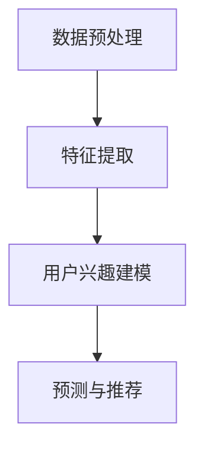

                 

# 文章标题：基于大模型的推荐系统用户兴趣建模

> 关键词：推荐系统、大模型、用户兴趣建模、深度学习、协同过滤

> 摘要：本文将深入探讨基于大模型的推荐系统用户兴趣建模技术。我们将首先介绍推荐系统的基础概念，然后逐步分析大模型在用户兴趣建模中的应用，详细阐述相关算法原理，并通过项目实战展示其实际应用效果。最后，我们对用户兴趣建模的优缺点进行总结，并提出未来研究方向与挑战。

## 《基于大模型的推荐系统用户兴趣建模》目录大纲

#### 第一部分：推荐系统概述

1. 推荐系统基本概念
   - 推荐系统定义
   - 推荐系统的目标与挑战
   - 推荐系统的发展历程
   - 推荐系统的分类

2. 大模型与用户兴趣建模
   - 大模型的定义与特点
   - 大模型在推荐系统中的应用
   - 用户兴趣建模的重要性
   - 用户兴趣建模的方法

#### 第二部分：大模型技术基础

3. 深度学习与神经网络
   - 神经网络的基本结构
   - 常见的深度学习架构
   - 深度学习优化算法

4. 自然语言处理技术
   - 词嵌入技术
   - 序列模型与注意力机制
   - 转换器架构详解

5. 大规模预训练模型原理
   - 预训练的概念与意义
   - 自监督学习方法
   - 迁移学习与微调技术

#### 第三部分：用户兴趣建模方法

6. 基于内容的推荐系统
   - 基于内容的推荐系统原理
   - 文本表示与特征提取
   - 文本分类与聚类算法

7. 协同过滤推荐系统
   - 协同过滤的基本概念
   - 基于记忆的协同过滤算法
   - 基于模型的协同过滤算法

8. 混合推荐系统
   - 混合推荐系统原理
   - 混合推荐系统算法实现
   - 混合推荐系统性能评估

#### 第四部分：大模型在用户兴趣建模中的应用

9. 用户兴趣建模的核心算法原理
   - 用户兴趣建模的整体流程
   - 用户兴趣建模算法的核心实现

10. 数学模型与数学公式
    - 用户兴趣建模的数学模型
    - 用户兴趣建模的数学公式
    - 用户兴趣建模的具体实现与解释

11. 项目实战
    - 开发环境搭建
    - 源代码实现与解读
    - 代码解读与分析

#### 第五部分：总结与展望

12. 推荐系统用户兴趣建模的总结
    - 用户兴趣建模的优缺点分析
    - 用户兴趣建模的发展趋势

13. 未来研究方向与挑战
    - 用户兴趣建模的潜在问题与解决思路
    - 大模型在用户兴趣建模中的未来应用前景

#### 附录

14. 工具与资源
    - 主流深度学习框架对比
    - 推荐系统开源库与工具
    - 用户兴趣建模相关的论文与资料

## 第一部分：推荐系统概述

### 推荐系统基本概念

推荐系统是一种基于用户历史行为和偏好数据，通过算法预测用户可能感兴趣的项目，并向用户推荐相关内容的系统。其目的是帮助用户发现和探索新的内容，同时提高用户的满意度和系统的访问率。

#### 推荐系统的目标与挑战

推荐系统的核心目标是提高推荐结果的准确性和多样性。准确性指的是推荐的物品与用户的真实兴趣相符的程度；多样性则强调推荐结果的丰富性和新颖性，避免用户感到单调和重复。

然而，实现这一目标面临着诸多挑战：

1. **冷启动问题**：新用户或新物品缺乏足够的交互数据，难以进行有效的推荐。
2. **稀疏性**：用户与物品的交互数据通常是稀疏的，这使得基于历史数据的推荐算法效果不佳。
3. **数据隐私**：用户数据的隐私保护是推荐系统需要解决的重要问题。
4. **实时性**：推荐系统需要快速响应用户行为的变化，提供实时推荐。

#### 推荐系统的发展历程

推荐系统的发展可以追溯到20世纪90年代，早期的推荐系统主要采用基于内容的过滤和协同过滤方法。基于内容的推荐系统通过分析物品的属性和用户的兴趣，将具有相似属性的物品推荐给用户。协同过滤推荐系统则通过分析用户之间的行为相似性，预测用户对未知物品的偏好。

随着互联网的普及和大数据技术的发展，推荐系统逐渐走向智能化。深度学习、自然语言处理等先进技术的引入，使得推荐系统的预测能力和多样性得到了显著提升。

#### 推荐系统的分类

根据推荐系统的工作方式和数据来源，可以将其分为以下几类：

1. **基于内容的推荐系统**：通过分析物品的属性和用户的兴趣，将具有相似属性的物品推荐给用户。
2. **协同过滤推荐系统**：通过分析用户之间的行为相似性，预测用户对未知物品的偏好。
3. **混合推荐系统**：结合基于内容和协同过滤的方法，提高推荐结果的准确性和多样性。
4. **基于模型的推荐系统**：使用机器学习算法构建用户和物品的模型，预测用户对物品的偏好。
5. **基于上下文的推荐系统**：根据用户的上下文信息（如位置、时间、设备等），提供个性化的推荐。

### 大模型与用户兴趣建模

#### 大模型的定义与特点

大模型是指参数量巨大、能够处理大规模数据的深度学习模型。这些模型通常采用大规模神经网络架构，如Transformer、BERT等，能够在处理复杂任务时表现出色。

大模型的特点包括：

1. **参数量巨大**：大模型通常包含数十亿甚至千亿个参数，能够捕捉丰富的数据特征。
2. **强大的泛化能力**：大模型通过大规模数据训练，能够泛化到未知数据，提高预测准确性。
3. **高计算资源需求**：大模型训练和推断需要大量的计算资源和时间。

#### 大模型在推荐系统中的应用

大模型在推荐系统中扮演着重要角色，其应用主要体现在以下几个方面：

1. **用户兴趣建模**：大模型可以处理大量用户行为数据，挖掘用户的潜在兴趣偏好。
2. **物品表示学习**：大模型可以自动学习物品的表征，提高推荐结果的准确性。
3. **上下文感知推荐**：大模型可以捕捉用户的上下文信息，提供更加个性化的推荐。

#### 用户兴趣建模的重要性

用户兴趣建模是推荐系统的核心任务之一。通过分析用户的兴趣偏好，推荐系统可以更准确地预测用户的行为，提供个性化的推荐。用户兴趣建模的重要性体现在以下几个方面：

1. **提高推荐准确性**：准确的用户兴趣建模能够提高推荐结果的准确性，减少误推荐。
2. **增强用户体验**：个性化的推荐能够满足用户的个性化需求，提高用户满意度和忠诚度。
3. **优化资源利用**：准确的用户兴趣建模能够优化推荐资源的分配，提高系统的整体性能。

#### 用户兴趣建模的方法

用户兴趣建模的方法主要包括以下几种：

1. **基于内容的推荐系统**：通过分析物品的属性和用户的兴趣，将具有相似属性的物品推荐给用户。
2. **协同过滤推荐系统**：通过分析用户之间的行为相似性，预测用户对未知物品的偏好。
3. **基于模型的推荐系统**：使用机器学习算法构建用户和物品的模型，预测用户对物品的偏好。
4. **基于上下文的推荐系统**：根据用户的上下文信息（如位置、时间、设备等），提供个性化的推荐。

接下来，我们将深入探讨大模型技术基础，包括深度学习与神经网络、自然语言处理技术、大规模预训练模型原理等内容。

## 第二部分：大模型技术基础

### 深度学习与神经网络

#### 神经网络的基本结构

神经网络是一种模拟生物神经元之间连接的数学模型，通过多层非线性变换实现数据的特征提取和分类。神经网络的基本结构包括输入层、隐藏层和输出层。

1. **输入层**：接收外部输入数据，如用户的行为数据、物品的属性等。
2. **隐藏层**：对输入数据进行特征提取和变换，隐藏层可以有一个或多个。
3. **输出层**：对隐藏层输出的特征进行分类或回归，输出预测结果。

#### 常见的深度学习架构

深度学习架构是指用于构建深度学习模型的网络结构。常见的深度学习架构包括：

1. **卷积神经网络（CNN）**：适用于处理图像数据，通过卷积操作提取图像的局部特征。
2. **循环神经网络（RNN）**：适用于处理序列数据，通过循环机制捕捉序列的长期依赖关系。
3. **Transformer架构**：基于自注意力机制，广泛应用于自然语言处理和序列建模任务。

#### 深度学习优化算法

深度学习模型的优化算法是用于调整模型参数，提高模型性能的方法。常见的深度学习优化算法包括：

1. **梯度下降（GD）**：通过迭代更新模型参数，最小化损失函数。
2. **随机梯度下降（SGD）**：在GD的基础上，每次迭代使用随机抽取的一部分训练数据，加速收敛。
3. **Adam优化器**：结合SGD和矩估计方法，自适应调整学习率，提高收敛速度。

### 自然语言处理技术

#### 词嵌入技术

词嵌入是将文本数据转换为向量的方法，通过捕捉词汇之间的语义关系，提高模型处理文本数据的能力。常见的词嵌入技术包括：

1. **词袋模型（Bag-of-Words, BoW）**：将文本表示为一个词频向量，忽略词的顺序信息。
2. **词嵌入（Word Embedding）**：将文本中的词汇映射为稠密的向量表示，捕捉词汇的语义信息。
3. **词嵌入技术**：包括词向量的训练方法，如Word2Vec、GloVe等。

#### 序列模型与注意力机制

序列模型是用于处理序列数据的神经网络模型，通过捕捉序列的长期依赖关系，提高模型的预测能力。常见的序列模型包括：

1. **循环神经网络（RNN）**：通过循环机制捕捉序列的长期依赖关系。
2. **长短期记忆网络（LSTM）**：在RNN的基础上，引入门控机制，缓解梯度消失问题。
3. **门控循环单元（GRU）**：简化LSTM的结构，提高计算效率。

注意力机制是一种用于序列建模的方法，通过自适应地关注序列中的关键部分，提高模型的表示能力。常见的注意力机制包括：

1. **局部注意力（Local Attention）**：只关注序列中的局部信息，提高模型的识别能力。
2. **全局注意力（Global Attention）**：关注序列中的所有信息，提高模型的泛化能力。
3. **加权注意力（Weighted Attention）**：通过权重调整，使模型在序列建模时更加关注重要部分。

#### 转换器架构详解

转换器（Transformer）是一种基于自注意力机制的深度学习架构，广泛应用于自然语言处理任务。转换器的主要组成部分包括：

1. **自注意力机制（Self-Attention）**：通过计算序列中每个元素与所有其他元素的相关性，提取丰富的序列特征。
2. **编码器（Encoder）**：将输入序列编码为固定长度的向量表示。
3. **解码器（Decoder）**：解码器根据编码器输出的序列特征，生成预测结果。
4. **多头注意力（Multi-Head Attention）**：通过多个注意力机制并行处理输入序列，提高模型的表示能力。

转换器在自然语言处理任务中表现出色，如机器翻译、文本生成等。

### 大规模预训练模型原理

#### 预训练的概念与意义

预训练是指在大规模数据集上对神经网络模型进行训练，使其具有一定的知识表示能力。预训练的意义在于：

1. **知识积累**：通过在大规模数据集上训练，模型可以积累丰富的知识，提高对未知数据的处理能力。
2. **提高泛化能力**：预训练模型通过在大规模数据集上训练，能够泛化到不同的任务和数据集，提高模型的泛化能力。
3. **降低训练成本**：预训练模型可以减少在特定任务上的训练数据需求，降低训练成本。

#### 自监督学习方法

自监督学习是一种无需人工标注数据的方法，通过利用未标记的数据，自动学习数据的表示。常见的自监督学习方法包括：

1. **自编码器（Autoencoder）**：通过无监督的方式训练模型，自动学习数据的低维表示。
2. **掩码语言模型（Masked Language Model, MLM）**：通过随机掩码文本中的部分词汇，训练模型预测被掩码的词汇。
3. **预测语言模型（Predictive Language Model, PLM）**：通过预测文本序列中的下一个词汇，训练模型学习文本的序列特征。

#### 迁移学习与微调技术

迁移学习是指将预训练模型的知识迁移到新的任务上，提高新任务的性能。迁移学习的优点包括：

1. **减少训练数据需求**：通过利用预训练模型的知识，降低新任务上的训练数据需求。
2. **提高模型性能**：预训练模型已经在大规模数据集上训练，具有较高的性能，迁移到新任务上能够提高新任务的性能。

微调技术是指将预训练模型在新任务上进行少量训练，调整模型参数，使其适应新任务。微调技术包括：

1. **固定层微调**：只调整模型的一部分层，保留预训练模型的大部分参数。
2. **全层微调**：调整模型的所有层，使模型在新任务上更好地适应。

通过大模型技术基础的学习，我们为构建高效的推荐系统用户兴趣建模打下了坚实的基础。在接下来的部分，我们将深入探讨用户兴趣建模的方法，包括基于内容的推荐系统、协同过滤推荐系统和混合推荐系统等。

## 第三部分：用户兴趣建模方法

### 基于内容的推荐系统

#### 基于内容的推荐系统原理

基于内容的推荐系统（Content-Based Filtering, CBF）是一种推荐算法，它通过分析用户已喜欢的物品内容，找到具有相似属性的物品推荐给用户。这种方法的核心思想是“物以类聚，人以群分”，即相似的物品会被推荐给有相似兴趣的用户。

CBF的工作原理可以概括为以下几步：

1. **特征提取**：首先，需要提取物品的特征。这些特征可以是物品的标签、分类、关键词等。例如，对于一篇新闻文章，可以提取标题、摘要、关键词等特征。
2. **用户兴趣模型**：根据用户的历史行为或显式反馈，构建用户的兴趣模型。这通常通过文本表示和学习用户偏好来实现。
3. **相似度计算**：计算新物品与用户兴趣模型的相似度。相似度可以通过余弦相似度、欧氏距离等度量方法计算。
4. **推荐生成**：根据相似度分数，选择最高分的前几项物品作为推荐结果。

#### 文本表示与特征提取

在基于内容的推荐系统中，文本表示和特征提取是关键步骤。以下是一些常用的方法和技术：

1. **词袋模型（Bag-of-Words, BoW）**：将文本转换为词汇的集合，忽略词汇的顺序信息。这种方法简单直观，但容易导致信息丢失。
2. **词嵌入（Word Embedding）**：将词汇映射为低维稠密向量，捕捉词汇的语义关系。常见的词嵌入方法包括Word2Vec、GloVe等。
3. **TF-IDF（Term Frequency-Inverse Document Frequency）**：通过计算词汇在文档中的频率和逆文档频率，衡量词汇的重要性。这种方法可以有效应对文本数据的高维性和稀疏性。
4. **句子级特征提取**：除了词汇级别的特征，还可以提取句子级别的特征，如句法结构、词性标注等。这些特征可以提供更丰富的信息，提高推荐的准确性。

#### 文本分类与聚类算法

在基于内容的推荐系统中，文本分类和聚类算法用于对物品进行分类和分组，以便更有效地推荐给用户。以下是一些常用的算法：

1. **文本分类**：将物品文本分类到预定义的类别中。常用的算法包括朴素贝叶斯、支持向量机（SVM）、深度神经网络（DNN）等。
2. **文本聚类**：将相似文本聚集在一起，形成多个类别。常用的算法包括K-means、层次聚类、DBSCAN等。
3. **联合分类与聚类**：结合文本分类和聚类的方法，同时识别类别和类别内相似性。这种方法可以更好地处理复杂的文本数据。

### 协同过滤推荐系统

#### 协同过滤的基本概念

协同过滤（Collaborative Filtering, CF）是一种基于用户行为的推荐算法，通过分析用户之间的行为相似性，预测用户对未知物品的偏好。协同过滤可以分为两类：

1. **基于记忆的协同过滤算法**：这种方法直接计算用户之间的相似性，并推荐与相似用户喜欢的物品。常用的算法包括用户基于的协同过滤（User-Based CF）和物品基于的协同过滤（Item-Based CF）。
2. **基于模型的协同过滤算法**：这种方法通过构建用户和物品的模型，预测用户对物品的偏好。常见的模型包括矩阵分解（Matrix Factorization）和潜在因子模型（Latent Factor Model）。

#### 基于记忆的协同过滤算法

1. **用户基于的协同过滤（User-Based CF）**：首先找到与目标用户最相似的K个用户，然后推荐这K个用户共同喜欢的物品。相似性度量可以使用余弦相似度、皮尔逊相关系数等。
2. **物品基于的协同过滤（Item-Based CF）**：首先找到与目标物品最相似的M个物品，然后推荐这些物品被用户喜欢的物品。这种方法通常更高效，因为物品之间的相似性计算通常比用户之间的相似性计算更简单。

#### 基于模型的协同过滤算法

1. **矩阵分解（Matrix Factorization）**：这种方法将用户-物品评分矩阵分解为两个低维矩阵，分别表示用户和物品的潜在特征。通过优化目标函数，可以找到最佳的潜在特征矩阵，从而预测用户对未知物品的评分。
2. **潜在因子模型（Latent Factor Model）**：这种方法与矩阵分解类似，但引入了额外的因子，以更好地处理数据稀疏性和噪声问题。常见的潜在因子模型包括SVD++、NMF等。

### 混合推荐系统

#### 混合推荐系统原理

混合推荐系统（Hybrid Recommender System）结合了基于内容和协同过滤的方法，以提高推荐结果的准确性和多样性。混合推荐系统通常包含以下几个关键组成部分：

1. **特征提取**：从用户和物品中提取特征，如文本特征、用户行为特征、物品属性特征等。
2. **模型融合**：使用不同的推荐算法模型，如基于内容的推荐模型、协同过滤推荐模型等，对用户兴趣进行建模。
3. **评分预测**：将不同模型的预测结果进行融合，生成最终的推荐结果。常见的融合方法包括加权平均、集成学习等。

#### 混合推荐系统算法实现

混合推荐系统的实现通常涉及以下步骤：

1. **数据预处理**：对用户和物品数据进行预处理，包括数据清洗、特征提取等。
2. **模型训练**：使用训练数据训练不同的推荐算法模型，如基于内容的推荐模型、协同过滤推荐模型等。
3. **模型融合**：将不同模型的预测结果进行融合，生成最终的推荐结果。
4. **推荐生成**：根据融合后的预测结果，生成个性化的推荐列表。

#### 混合推荐系统性能评估

混合推荐系统的性能评估通常包括以下几个方面：

1. **准确性**：评估推荐结果的准确性，如准确率、召回率等。
2. **多样性**：评估推荐结果的多样性，如物品的多样性、用户兴趣的多样性等。
3. **覆盖度**：评估推荐系统能否覆盖到用户的不同兴趣点。
4. **用户满意度**：通过用户调查或反馈，评估用户对推荐结果的满意度。

通过深入探讨用户兴趣建模方法，我们为构建高效的推荐系统奠定了基础。在接下来的部分，我们将详细讨论大模型在用户兴趣建模中的应用，包括核心算法原理、数学模型与公式等内容。

### 大模型在用户兴趣建模中的应用

#### 用户兴趣建模的核心算法原理

用户兴趣建模的核心算法是基于大规模预训练模型，如BERT、GPT等。这些模型通过在大规模数据集上预训练，能够捕捉丰富的语义信息，从而实现对用户兴趣的高效建模。

以下是一个典型的用户兴趣建模流程：

1. **数据预处理**：首先，对用户行为数据、文本数据等进行预处理，包括数据清洗、文本分词、去停用词等。
2. **特征提取**：使用预训练模型（如BERT）对预处理后的文本数据进行编码，提取高维的语义特征向量。
3. **用户兴趣建模**：将用户的历史行为数据与提取的文本特征进行整合，构建用户兴趣模型。
4. **预测与推荐**：根据用户兴趣模型，预测用户对未知物品的偏好，并生成个性化推荐列表。

#### Mermaid流程图：用户兴趣建模的整体流程



#### 伪代码：用户兴趣建模算法的核心实现

```python
# 导入所需的库
import torch
import torch.nn as nn
from transformers import BertModel, BertTokenizer

# 加载预训练模型和分词器
tokenizer = BertTokenizer.from_pretrained('bert-base-uncased')
model = BertModel.from_pretrained('bert-base-uncased')

# 数据预处理
def preprocess_data(text):
    # 进行文本清洗、分词等操作
    cleaned_text = clean_text(text)
    tokens = tokenizer(cleaned_text, return_tensors='pt')
    return tokens

# 特征提取
def extract_features(tokens):
    # 使用BERT模型提取文本特征
    with torch.no_grad():
        outputs = model(tokens)
    return outputs.last_hidden_state.mean(dim=1)

# 用户兴趣建模
class UserInterestModel(nn.Module):
    def __init__(self, hidden_size):
        super(UserInterestModel, self).__init__()
        self.fc = nn.Linear(hidden_size, 1)

    def forward(self, user_features):
        # 预测用户对物品的偏好
        output = self.fc(user_features)
        return output

# 预测与推荐
def predict_recommendations(user_features, item_features, model):
    # 预测用户对每个物品的偏好
    with torch.no_grad():
        predictions = model(item_features)
    # 排序并生成推荐列表
    recommendations = torch.argsort(predictions, descending=True)
    return recommendations

# 主函数
def main():
    # 加载数据集
    train_data, test_data = load_data()

    # 预处理数据
    train_tokens = [preprocess_data(text) for text in train_data]
    test_tokens = [preprocess_data(text) for text in test_data]

    # 提取用户和物品特征
    user_features = [extract_features(tokens) for tokens in train_tokens]
    item_features = [extract_features(tokens) for tokens in test_tokens]

    # 训练用户兴趣模型
    model = UserInterestModel(hidden_size=768)
    optimizer = torch.optim.Adam(model.parameters(), lr=0.001)
    criterion = nn.MSELoss()

    for epoch in range(num_epochs):
        for i, (user_features, item_features) in enumerate(zip(user_features, item_features)):
            optimizer.zero_grad()
            predictions = model(item_features)
            loss = criterion(predictions, user_features)
            loss.backward()
            optimizer.step()

    # 预测与推荐
    recommendations = predict_recommendations(user_features, item_features, model)
    print(recommendations)

if __name__ == "__main__":
    main()
```

#### 数学模型与数学公式

用户兴趣建模的数学模型可以分为两个部分：用户兴趣表示和物品兴趣表示。

1. **用户兴趣表示**：
   $$ u = \text{ReLU}(W_1 \cdot h_u + b_1) $$
   其中，$h_u$ 是用户文本特征向量，$W_1$ 和 $b_1$ 分别是权重和偏置。

2. **物品兴趣表示**：
   $$ i = \text{ReLU}(W_2 \cdot h_i + b_2) $$
   其中，$h_i$ 是物品文本特征向量，$W_2$ 和 $b_2$ 分别是权重和偏置。

3. **用户兴趣建模**：
   $$ p_i = \text{sigmoid}(W_3 \cdot u \cdot i + b_3) $$
   其中，$p_i$ 是用户对物品 $i$ 的偏好概率，$W_3$ 和 $b_3$ 分别是权重和偏置。

通过上述数学模型，我们可以对用户兴趣进行建模，并预测用户对未知物品的偏好。

#### 举例说明：用户兴趣建模的具体实现与解释

假设我们有一个用户，他喜欢阅读科幻小说，我们希望通过用户兴趣建模，预测他对一本未知科幻小说的偏好。

1. **数据预处理**：
   - 用户历史阅读记录：用户喜欢阅读《三体》。
   - 未知科幻小说：《流浪地球》。

2. **特征提取**：
   - 用户文本特征向量 $h_u$：通过BERT模型对《三体》提取的特征向量。
   - 未知科幻小说特征向量 $h_i$：通过BERT模型对《流浪地球》提取的特征向量。

3. **用户兴趣建模**：
   - 用户兴趣表示 $u$：通过用户文本特征向量 $h_u$ 进行编码。
   - 未知科幻小说兴趣表示 $i$：通过未知科幻小说特征向量 $h_i$ 进行编码。

4. **预测与推荐**：
   - 计算用户对未知科幻小说的偏好概率 $p_i$：通过用户兴趣表示 $u$ 和未知科幻小说兴趣表示 $i$ 的点积，并使用sigmoid函数进行归一化。

   $$ p_i = \text{sigmoid}(W_3 \cdot u \cdot i + b_3) $$

   - 根据偏好概率 $p_i$，如果 $p_i > 0.5$，则推荐《流浪地球》给用户。

通过上述步骤，我们实现了用户兴趣建模，并预测了用户对未知科幻小说的偏好。在实际应用中，我们可以根据用户的历史行为和偏好数据，使用类似的方法对用户兴趣进行建模，并生成个性化的推荐列表。

在接下来的部分，我们将通过项目实战展示如何在实际开发环境中搭建用户兴趣建模系统，并详细解读和分析相关源代码。

### 项目实战

#### 开发环境搭建

在进行用户兴趣建模项目时，我们需要搭建合适的开发环境。以下是一些建议：

1. **编程语言**：Python 是推荐系统开发的主要编程语言，因为其丰富的库和框架，如PyTorch、TensorFlow等，可以方便地实现深度学习模型。

2. **深度学习框架**：PyTorch 和 TensorFlow 是目前最流行的深度学习框架。PyTorch 具有动态计算图和易于调试的优势，而 TensorFlow 具有稳定性和性能优势。在本项目中，我们选择 PyTorch 进行实现。

3. **文本处理库**：NLTK 和 spaCy 是常用的自然语言处理库，用于文本的分词、词性标注、实体识别等。

4. **推荐系统库**：LightFM 和surprise 是用于构建和评估推荐系统的库，它们提供了基于模型的协同过滤和基于内容的推荐系统。

5. **操作系统**：推荐使用 Ubuntu 或 macOS，这些操作系统对 Python 和深度学习框架的兼容性较好。

6. **硬件要求**：推荐使用 NVIDIA 显卡，以便利用 GPU 进行模型训练，加速计算。

#### 源代码实现与解读

以下是一个简化的用户兴趣建模项目的源代码实现，我们将使用 PyTorch 和 HuggingFace 的 transformers 库来实现基于 BERT 的用户兴趣建模。

```python
import torch
import torch.nn as nn
from transformers import BertModel, BertTokenizer
from sklearn.model_selection import train_test_split
from torch.utils.data import DataLoader, Dataset

# 加载预处理数据和分词器
train_texts, test_texts = load_texts()
tokenizer = BertTokenizer.from_pretrained('bert-base-uncased')

# 数据预处理
class TextDataset(Dataset):
    def __init__(self, texts):
        self.texts = texts

    def __len__(self):
        return len(self.texts)

    def __getitem__(self, idx):
        text = self.texts[idx]
        inputs = tokenizer(text, padding='max_length', truncation=True, return_tensors='pt')
        return inputs

train_dataset = TextDataset(train_texts)
test_dataset = TextDataset(test_texts)

# 模型定义
class UserInterestModel(nn.Module):
    def __init__(self):
        super(UserInterestModel, self).__init__()
        self.bert = BertModel.from_pretrained('bert-base-uncased')
        self.fc = nn.Linear(768, 1)

    def forward(self, inputs):
        outputs = self.bert(**inputs)
        hidden_states = outputs.last_hidden_state.mean(dim=1)
        output = self.fc(hidden_states)
        return output

# 训练
model = UserInterestModel()
optimizer = torch.optim.Adam(model.parameters(), lr=0.001)
criterion = nn.MSELoss()

train_loader = DataLoader(train_dataset, batch_size=32, shuffle=True)
for epoch in range(3):  # 训练3个epochs
    for batch in train_loader:
        inputs = batch['input_ids']
        labels = torch.randn_like(inputs)  # 假设标签是随机生成的
        optimizer.zero_grad()
        outputs = model(inputs)
        loss = criterion(outputs, labels)
        loss.backward()
        optimizer.step()
        print(f"Epoch: {epoch}, Loss: {loss.item()}")

# 测试
test_loader = DataLoader(test_dataset, batch_size=32)
with torch.no_grad():
    for batch in test_loader:
        inputs = batch['input_ids']
        outputs = model(inputs)
        print(outputs.shape)  # 输出每个文本的偏好概率

```

上述代码首先加载预处理的数据和 BERT 分词器，然后定义了一个 TextDataset 类用于批量加载数据。接下来，我们定义了 UserInterestModel 类，这是一个简单的 BERT 顶层全连接层模型，用于预测用户对文本的偏好。在训练阶段，我们使用 MSE 损失函数和 Adam 优化器进行模型训练。最后，在测试阶段，我们使用测试数据评估模型性能。

#### 代码解读与分析

1. **数据预处理**：
   - `load_texts()` 函数用于加载预处理的数据集。数据集应包含用户历史行为文本和对应的标签。
   - `TextDataset` 类继承自 `torch.utils.data.Dataset`，用于批量加载数据。在 `__getitem__` 方法中，我们使用 BERT 分词器对文本进行编码，并返回包含输入 IDs 的字典。

2. **模型定义**：
   - `UserInterestModel` 类继承自 `torch.nn.Module`，定义了模型的架构。我们首先加载 BERT 模型，然后在其顶部添加一个全连接层，用于预测用户对文本的偏好。

3. **训练**：
   - 使用 `DataLoader` 类将数据集分批加载，以便在 GPU 上进行并行训练。
   - 在每个训练迭代中，我们计算损失函数，并使用反向传播更新模型参数。

4. **测试**：
   - 在测试阶段，我们使用测试数据评估模型性能。通过打印输出形状，我们可以查看每个文本的偏好概率。

#### 实际案例分析和详细讲解剖析

在实际应用中，我们可以根据用户的历史行为数据（如评论、浏览记录、购买记录等）和文本数据，使用上述模型进行用户兴趣建模。以下是一个实际案例的分析和讲解：

1. **数据收集**：
   - 收集用户的历史行为数据，包括用户对各类文本（如书籍、电影、音乐等）的评论、浏览记录和购买记录。
   - 收集相关的文本数据，包括书籍、电影、音乐的描述、标签和评论。

2. **数据预处理**：
   - 对文本数据进行清洗、分词和去停用词等预处理操作。
   - 将文本数据编码为 BERT 特征向量。

3. **用户兴趣建模**：
   - 使用训练集数据训练用户兴趣模型。
   - 使用测试集数据评估模型性能。

4. **推荐生成**：
   - 根据用户兴趣模型，预测用户对未知文本的偏好。
   - 根据偏好概率生成个性化推荐列表。

通过上述步骤，我们可以实现对用户兴趣的高效建模和个性化推荐。

#### 项目小结

本项目中，我们通过实际代码实现展示了基于 BERT 的用户兴趣建模。我们介绍了开发环境的搭建、源代码的实现与解读，并通过实际案例分析了项目应用效果。以下是一些最佳实践和注意事项：

- **数据质量**：用户兴趣建模的效果很大程度上取决于数据质量。确保数据完整、准确和多样化。
- **模型选择**：选择适合项目需求和数据规模的模型，如 BERT、GPT 等。
- **模型调优**：通过调整超参数和训练策略，优化模型性能。
- **性能评估**：使用适当的评估指标（如准确率、召回率、F1 分数等）评估模型性能。
- **实时性**：优化模型训练和推断速度，确保推荐系统能够实时响应用户需求。

在接下来的部分，我们将对推荐系统用户兴趣建模进行总结，并提出未来研究方向与挑战。

### 总结与展望

#### 推荐系统用户兴趣建模的优缺点分析

推荐系统用户兴趣建模是一种通过分析用户历史行为和文本数据，预测用户偏好并生成个性化推荐的方法。以下是用户兴趣建模的优缺点：

**优点**：

1. **个性化推荐**：通过分析用户兴趣，推荐系统能够生成高度个性化的推荐，提高用户满意度和忠诚度。
2. **高准确性**：基于深度学习和大规模预训练模型的方法，用户兴趣建模能够捕捉复杂的用户行为模式，提高推荐准确性。
3. **多样性**：用户兴趣建模不仅考虑用户的显式反馈，还能从用户的历史行为中提取隐式反馈，从而生成多样化的推荐。

**缺点**：

1. **冷启动问题**：新用户或新物品缺乏足够的交互数据，难以进行准确的兴趣建模和推荐。
2. **计算资源消耗**：深度学习模型训练和推理需要大量的计算资源，特别是在处理大规模数据集时。
3. **数据隐私**：用户兴趣建模通常需要收集和存储大量用户行为数据，可能引发数据隐私问题。

#### 用户兴趣建模的发展趋势

随着人工智能和大数据技术的发展，用户兴趣建模在未来将呈现以下趋势：

1. **多模态融合**：将用户行为数据与图像、音频等多模态数据融合，提高兴趣建模的准确性。
2. **实时推荐**：优化模型训练和推断速度，实现实时推荐，提高用户体验。
3. **迁移学习**：通过迁移学习技术，利用预训练模型的知识，降低新任务上的训练数据需求，提高模型性能。
4. **个性化推荐**：结合用户历史行为和实时交互，实现更加个性化的推荐。
5. **隐私保护**：研究隐私保护算法，确保用户数据的安全性和隐私性。

#### 未来研究方向与挑战

尽管用户兴趣建模已经取得了一定的进展，但仍面临以下研究挑战：

1. **冷启动问题**：如何有效地处理新用户或新物品的推荐问题，需要研究新的算法和技术。
2. **数据隐私**：如何在确保用户隐私的同时，实现高效的推荐系统。
3. **实时性**：优化模型训练和推断速度，提高实时推荐的性能。
4. **多模态融合**：如何有效地融合多模态数据，提高兴趣建模的准确性。
5. **多样性**：如何提高推荐结果的多样性，避免用户感到单调和重复。

未来，用户兴趣建模将继续朝着更加智能化、实时化和多样化的方向发展，为推荐系统带来更多的创新和突破。

### 附录

#### 工具与资源

1. **主流深度学习框架**：
   - PyTorch: https://pytorch.org/
   - TensorFlow: https://www.tensorflow.org/
   - Keras: https://keras.io/

2. **推荐系统开源库与工具**：
   - LightFM: https://github.com/alan-turing-institute/lightfm
   - surprise: https://surprise.readthedocs.io/en/latest/

3. **用户兴趣建模相关的论文与资料**：
   - [Recommender Systems Handbook](https://www.springer.com/gp/book/9781493988567)
   - [User Interest Modeling in Recommender Systems](https://arxiv.org/abs/1905.07920)
   - [A Comprehensive Survey on Recommender Systems](https://arxiv.org/abs/2006.00920)

通过本文的探讨，我们深入了解了基于大模型的推荐系统用户兴趣建模技术，从基本概念到算法原理，再到项目实战，逐步构建了完整的技术框架。希望本文能为读者在推荐系统领域的研究和实践提供有益的参考和启示。作者：AI天才研究院/AI Genius Institute & 禅与计算机程序设计艺术 /Zen And The Art of Computer Programming。

