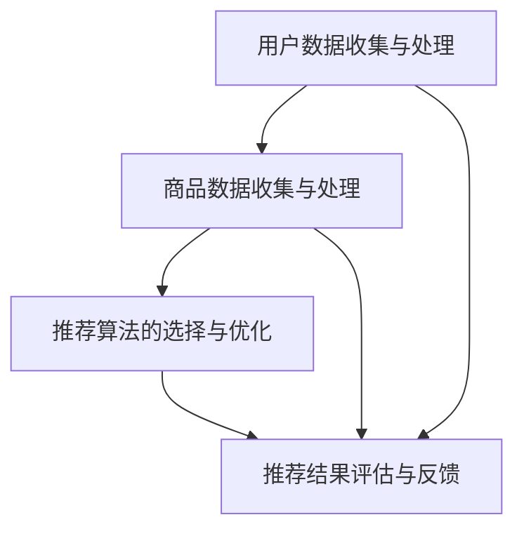
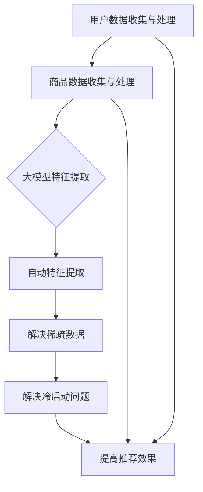
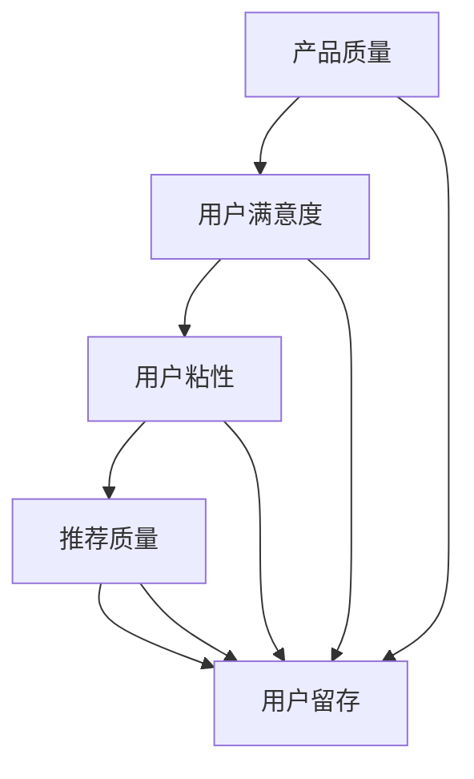

                 

### 推荐系统概述

#### 1.1 推荐系统的发展历程

推荐系统作为一种信息过滤和内容发现的技术，其发展历程可以追溯到上世纪90年代。最早的推荐系统是基于内容的推荐，它通过分析用户对某一内容的偏好，然后推荐与其相似的内容。这种方法的一个显著优点是简单直观，但缺点也很明显，即它无法很好地处理用户之间的差异性和内容的多样性。

随着互联网的普及和数据量的激增，协同过滤算法逐渐成为推荐系统的主流。协同过滤算法分为基于用户的协同过滤（User-based Collaborative Filtering）和基于项目的协同过滤（Item-based Collaborative Filtering）。基于用户的协同过滤通过寻找与当前用户有相似行为的其他用户，推荐他们喜欢的内容；而基于项目的协同过滤则是通过寻找与当前用户已经评价过的项目相似的项目来推荐。这两种方法相比基于内容的推荐，在处理用户差异性和多样性方面有显著提升。

然而，协同过滤算法也存在一些问题。首先，它的推荐效果容易受到稀疏数据的影响，即当用户评价数据非常稀疏时，算法的准确性会降低。其次，协同过滤算法无法很好地处理冷启动问题，即新用户或新项目的推荐问题。

为了解决这些问题，深度学习开始在推荐系统中得到应用。深度学习通过构建复杂的神经网络模型，可以从大量的非结构化数据中自动提取特征，并学习用户的行为模式。这使得深度学习在处理稀疏数据和冷启动问题上具有显著优势。此外，随着生成对抗网络（GAN）、变分自编码器（VAE）等新型深度学习技术的出现，推荐系统的效果也得到了进一步提升。

#### 1.2 推荐系统的基本组成

推荐系统通常由以下几个部分组成：

1. **用户数据收集与处理**：推荐系统首先需要收集用户的行为数据，如浏览历史、购买记录、搜索历史等。然后对这些数据进行处理，包括数据清洗、去重、转换等步骤，以便后续的分析。

2. **商品数据收集与处理**：与用户数据类似，推荐系统还需要收集商品的相关信息，如商品描述、分类、标签等。这些数据同样需要经过清洗和处理，以便与用户数据进行匹配。

3. **推荐算法的选择与优化**：推荐系统的核心是推荐算法。根据不同的应用场景和需求，可以选择不同的算法，如基于内容的推荐、协同过滤算法、深度学习算法等。同时，为了提高推荐效果，需要对算法进行优化和调整。

4. **推荐结果评估与反馈**：推荐系统需要不断地评估推荐结果，并根据用户的反馈进行优化。这包括准确性、覆盖度、新颖性等指标。

#### 1.3 推荐系统的评估指标

推荐系统的评估指标是衡量推荐系统性能的重要标准。以下是几个常用的评估指标：

1. **准确性**：准确性是指推荐系统推荐的物品与用户实际喜欢的物品的匹配程度。通常使用精确率（Precision）和召回率（Recall）来衡量。

2. **覆盖率**：覆盖率是指推荐系统中推荐的物品数量与所有可能物品数量的比例。高覆盖率意味着推荐系统能够推荐出更多用户可能感兴趣的物品。

3. **新颖性**：新颖性是指推荐系统推荐的物品与用户已经接触过的物品的差异程度。新颖性越高，推荐结果越能吸引用户的注意力。

4. **用户留存**：用户留存是指用户在一段时间内继续使用推荐系统的比例。长期用户留存是推荐系统的重要目标，因为它直接影响到平台的商业价值。

#### 1.4 大模型在推荐系统中的应用

大模型，尤其是基于深度学习的模型，在推荐系统中的应用正在变得越来越普遍。大模型具有以下几个显著优势：

1. **处理稀疏数据**：大模型可以通过自动特征提取的方式，从大量的非结构化数据中提取有用的信息，从而有效处理稀疏数据问题。

2. **解决冷启动问题**：大模型可以通过训练用户和物品的嵌入表示，为新用户和新物品提供有效的推荐。

3. **提高推荐效果**：大模型可以学习到更加复杂的用户行为模式，从而提高推荐效果。

4. **处理多模态数据**：大模型可以同时处理文本、图像、音频等多种类型的数据，使得推荐系统能够提供更加个性化的推荐。

#### 1.5 长期用户留存的意义

长期用户留存是推荐系统的关键指标之一。提高长期用户留存不仅可以提升用户体验，还可以增加平台的商业价值。以下是长期用户留存的一些关键意义：

1. **提高用户黏性**：长期用户留存意味着用户对平台的依赖程度较高，他们更有可能继续使用平台的服务。

2. **增加用户活跃度**：长期用户留存可以提升用户的活跃度，从而带动平台的整体活跃度。

3. **提高商业价值**：长期用户留存可以增加平台的收入和盈利能力，因为用户更有可能进行消费和付费。

4. **优化推荐算法**：长期用户留存可以帮助平台收集更多的用户行为数据，从而优化推荐算法，提高推荐效果。

#### 1.6 本章总结

本章对推荐系统的概述进行了详细的介绍，包括其发展历程、基本组成、评估指标以及大模型在其中的应用。理解这些基本概念对于后续章节的深入讨论至关重要。在接下来的章节中，我们将进一步探讨大模型在推荐系统中的应用，以及如何通过优化算法来提高长期用户留存。

---

#### Mermaid 流程图



在上述流程图中，用户数据和商品数据首先经过收集与处理，然后与推荐算法进行结合，最终生成推荐结果。这一过程不断迭代，通过反馈不断优化推荐效果。流程图中还包括了用户留存这一关键环节，它直接影响推荐系统的整体性能。

---

### 大模型基本原理

#### 2.1 大模型的概念

大模型，通常指的是具有数百万甚至数十亿参数的深度学习模型。这些模型能够通过大规模数据训练，自动学习到复杂的数据特征，并应用于各种领域，如自然语言处理、计算机视觉、推荐系统等。

大模型的主要特点包括：

1. **高参数量**：大模型拥有庞大的参数数量，这使得它们能够捕捉到更加细微和复杂的数据特征。
2. **强大的泛化能力**：通过在大规模数据上的训练，大模型具有强大的泛化能力，能够处理从未见过的数据。
3. **自适应能力**：大模型可以根据不同的任务和数据集进行自适应调整，从而提高性能。

#### 2.2 大模型的核心技术

大模型的核心技术主要包括以下几个方面：

1. **深度神经网络**：深度神经网络（DNN）是大模型的基础。通过堆叠多个隐藏层，DNN可以学习到更加复杂的数据特征。
2. **批量归一化**：批量归一化（Batch Normalization）是一种常用的技术，它通过将每个输入层的神经元输出标准化，加速了训练过程并提高了模型的泛化能力。
3. **激活函数**：激活函数如ReLU、Sigmoid、Tanh等，用于引入非线性特性，使得模型能够学习到更加复杂的模式。
4. **优化算法**：常用的优化算法包括随机梯度下降（SGD）、Adam等，它们通过调整模型参数，使得模型在训练过程中不断优化。

#### 2.3 大模型在推荐系统中的应用

大模型在推荐系统中的应用具有显著的优势，主要体现在以下几个方面：

1. **处理稀疏数据**：推荐系统中常见的问题之一是用户-物品交互数据的稀疏性。大模型通过自动特征提取，可以从少量的用户行为数据中提取出有用的信息，从而有效处理稀疏数据问题。
2. **解决冷启动问题**：冷启动问题是指对新用户或新物品无法提供有效推荐的难题。大模型通过学习用户和物品的嵌入表示，可以对新用户和新物品提供有效的推荐。
3. **提高推荐效果**：大模型可以学习到更加复杂的用户行为模式，从而提高推荐效果。例如，通过用户和物品的嵌入表示，模型可以更好地理解用户的兴趣偏好和物品的属性特征，从而提供更加个性化的推荐。

#### 2.4 大模型与传统推荐算法的区别

大模型与传统推荐算法相比，具有以下几个显著区别：

1. **特征提取**：传统推荐算法通常需要手动提取特征，如用户年龄、性别、购买历史等。而大模型可以通过自动特征提取，从大量的非结构化数据中提取出有用的信息，从而减轻了数据预处理的工作量。
2. **模型复杂度**：传统推荐算法如协同过滤、矩阵分解等，其模型复杂度相对较低。而大模型具有数百万甚至数十亿参数，能够学习到更加复杂的数据特征。
3. **适应性**：传统推荐算法通常针对特定的应用场景进行优化，而大模型具有更强的适应性，可以应用于多种不同的推荐任务。
4. **推荐效果**：传统推荐算法在处理稀疏数据和解决冷启动问题上存在一定的局限性。而大模型通过自动特征提取和深度学习技术，可以提供更加精准和个性化的推荐。

#### 2.5 本章总结

本章对大模型的基本原理进行了详细的介绍，包括其概念、核心技术、在推荐系统中的应用以及与传统推荐算法的区别。理解这些内容对于后续章节的深入讨论至关重要。在接下来的章节中，我们将进一步探讨如何在大模型的基础上优化推荐系统，以提高长期用户留存。

---

#### Mermaid 流程图



在上述流程图中，用户数据和商品数据首先经过收集与处理，然后通过大模型的自动特征提取技术，处理稀疏数据和解决冷启动问题，最终生成高质量的推荐结果。这一过程不断迭代，通过优化大模型，进一步提高推荐效果。

---

### 用户留存的基本理论

#### 3.1 用户留存的概念

用户留存（User Retention）是指用户在一段时间内持续使用某一产品或服务的比例。它通常以日留存率（Day Retention Rate，简称DR）、周留存率（Week Retention Rate，简称WR）和月留存率（Month Retention Rate，简称MR）等指标来衡量。用户留存率越高，说明用户对产品的依赖程度越高，产品的用户基础也越稳定。

#### 3.2 用户留存的重要性

用户留存对于推荐系统和企业来说具有重要意义，主要体现在以下几个方面：

1. **商业价值**：高留存率意味着用户持续消费，从而直接带来更多的商业价值，包括广告收入、订阅费用、商品销售等。
2. **用户体验**：良好的用户留存可以提升用户的满意度和忠诚度，增加用户对产品的正面评价。
3. **产品改进**：通过分析用户留存数据，企业可以了解哪些功能或内容对用户有吸引力，哪些方面需要改进，从而优化产品。
4. **降低获客成本**：高留存率意味着用户自发传播，降低了获取新用户的成本。

#### 3.3 用户留存的影响因素

用户留存受多种因素影响，主要包括：

1. **产品质量**：高质量的产品或服务能够提升用户满意度，从而提高留存率。
2. **用户满意度**：用户满意度直接影响他们的留存意愿。满意度高的用户更愿意继续使用产品。
3. **用户粘性**：产品需要提供持续的吸引力，保持用户的活跃度，以增加用户的留存时间。
4. **推荐质量**：推荐系统的高效性和个性化程度直接影响用户的留存。如果推荐的内容符合用户兴趣，用户更有可能继续使用产品。
5. **用户获取成本**：获取新用户的成本越高，企业就越需要重视用户留存，以降低整体成本。
6. **市场竞争**：在竞争激烈的市场中，用户更容易流失。因此，提升用户留存成为企业的重要策略。

#### 3.4 提高用户留存的方法

提高用户留存的方法多种多样，以下是一些有效的策略：

1. **优化推荐算法**：通过不断优化推荐算法，提高推荐质量，增加用户对推荐内容的兴趣。
2. **个性化服务**：根据用户的历史行为和偏好，提供个性化的推荐和体验，增加用户粘性。
3. **用户反馈机制**：建立有效的用户反馈机制，及时收集用户意见和建议，改进产品。
4. **用户教育**：通过教程、引导、FAQ等手段帮助用户更好地理解和使用产品，提高满意度。
5. **奖励机制**：通过积分、优惠券、礼品等手段激励用户持续使用产品。
6. **社区建设**：建立用户社区，鼓励用户交流和分享，增加用户归属感和粘性。
7. **持续更新**：不断更新产品功能、内容和服务，保持产品的活力和吸引力。

#### 3.5 本章总结

本章对用户留存的基本理论进行了详细探讨，包括其概念、重要性、影响因素以及提高用户留存的方法。理解用户留存对于推荐系统和企业的长期发展至关重要。在接下来的章节中，我们将深入探讨如何利用大模型优化推荐系统，从而提高长期用户留存。

---

#### Mermaid 流程图



在上述流程图中，产品质量、用户满意度、用户粘性和推荐质量是影响用户留存的关键因素。通过优化这些因素，可以有效提高用户留存率。这一过程不断迭代，通过反馈和改进，进一步提升用户体验和留存效果。

---

### 基于大模型的协同过滤算法

协同过滤算法（Collaborative Filtering，CF）是推荐系统中最常用的算法之一，其核心思想是利用用户的历史行为数据，发现用户之间的相似性，从而预测用户对未知物品的偏好。基于大模型的协同过滤算法结合了深度学习的优势，能够在处理稀疏数据和解决冷启动问题方面表现出色。

#### 3.1.1 协同过滤算法的基本原理

协同过滤算法主要分为以下两类：

1. **基于用户的协同过滤（User-based Collaborative Filtering）**：这种方法通过寻找与当前用户有相似行为的其他用户，推荐这些用户喜欢的物品。计算相似度的常用方法包括余弦相似度、皮尔逊相关系数等。

2. **基于项目的协同过滤（Item-based Collaborative Filtering）**：这种方法通过寻找与当前用户已经评价过的项目相似的其他项目，推荐这些项目。相似度的计算同样采用余弦相似度、皮尔逊相关系数等方法。

协同过滤算法的基本步骤如下：

1. **用户行为数据收集与预处理**：收集用户的历史行为数据，如评分、购买记录等。对数据进行清洗、去重和标准化处理。
2. **计算相似度**：计算用户之间的相似度或物品之间的相似度。常用的相似度计算方法包括余弦相似度和皮尔逊相关系数。
3. **生成推荐列表**：根据相似度矩阵，为每个用户生成推荐列表。推荐列表的生成方法包括基于最近邻（KNN）的方法、基于模型的方法等。

#### 3.1.2 大模型在协同过滤中的应用

大模型在协同过滤中的应用主要体现在以下几个方面：

1. **处理稀疏数据**：大模型通过自动特征提取，可以从少量的用户行为数据中提取出有用的信息，从而有效处理稀疏数据问题。例如，可以使用神经网络自动提取用户和物品的特征表示。

2. **解决冷启动问题**：大模型通过学习用户和物品的嵌入表示，可以对新用户和新物品提供有效的推荐。这种方法在用户和物品数据较少时表现出色。

3. **提高推荐效果**：大模型可以学习到更加复杂的用户行为模式，从而提高推荐效果。例如，通过用户和物品的嵌入表示，模型可以更好地理解用户的兴趣偏好和物品的属性特征，从而提供更加个性化的推荐。

#### 3.1.3 协同过滤算法的优化方法

为了提高协同过滤算法的性能，可以采用以下几种优化方法：

1. **矩阵分解**：矩阵分解（Matrix Factorization，MF）是一种常见的优化方法，它将用户-物品评分矩阵分解为用户特征矩阵和物品特征矩阵。通过这种方式，可以有效降低数据的稀疏性，提高推荐效果。

2. **模型融合**：将协同过滤算法与其他推荐算法（如基于内容的推荐、深度学习算法等）相结合，可以进一步提高推荐效果。例如，可以使用基于模型的协同过滤算法（如SVD++），结合深度学习模型（如神经网络）进行优化。

3. **在线学习**：在线学习（Online Learning）方法可以在用户行为数据实时更新的情况下，动态调整推荐模型，从而提高推荐效果。例如，可以使用梯度下降法（Gradient Descent）或其变种（如SGD、Adam等）进行在线学习。

4. **特征工程**：通过设计有效的特征工程，可以进一步提高推荐效果。例如，可以引入用户 demographic 信息、物品标签、交互时间等辅助特征。

#### 3.1.4 本章总结

本章对基于大模型的协同过滤算法进行了详细的介绍，包括其基本原理、大模型的应用以及优化方法。理解这些内容对于构建高效、精准的推荐系统至关重要。在接下来的章节中，我们将继续探讨基于大模型的矩阵分解算法和深度学习算法，以进一步提高推荐系统的性能。

---

#### 伪代码

```python
# 基于大模型的协同过滤算法伪代码

# 定义用户和物品特征向量
User_Vector[user_id, feature_id] = [u1, u2, ..., un]
Item_Vector[item_id, feature_id] = [i1, i2, ..., in]

# 计算用户和物品的相似度
def compute_similarity(User_Vector, Item_Vector):
    similarity_matrix = []
    for user in User_Vector:
        user_embedding = np.mean(user, axis=0)
        for item in Item_Vector:
            item_embedding = np.mean(item, axis=0)
            similarity = cosine_similarity(user_embedding, item_embedding)
            similarity_matrix.append(similarity)
    return similarity_matrix

# 生成推荐列表
def generate_recommendations(similarity_matrix, user_id, k=10):
    user_similarity = similarity_matrix[user_id]
    sorted_indices = np.argsort(user_similarity)[::-1]
    recommendations = []
    for index in sorted_indices[1:k+1]:
        recommendations.append(Item_Vector[index])
    return recommendations

# 训练大模型
def train_model(User_Vector, Item_Vector, labels):
    # 使用神经网络进行训练
    model = NeuralNetwork()
    model.fit(User_Vector, Item_Vector, labels)
    return model

# 优化方法：矩阵分解
def matrix_factorization(R, U, V, num_iterations=100, learning_rate=0.01):
    R = R.todense()
    for iteration in range(num_iterations):
        for i in range(R.shape[0]):
            for j in range(R.shape[1]):
                if R[i, j] > 0:
                    eij = R[i, j] - np.dot(U[i, :], V[j, :])
                    for k in range(U.shape[1]):
                        U[i, k] += learning_rate * (2 * eij * V[j, k])
                        V[j, k] += learning_rate * (2 * eij * U[i, k])
    return U, V
```

#### 伪代码解释

上述伪代码包括以下几个关键步骤：

1. **定义用户和物品特征向量**：用户和物品特征向量用于表示用户和物品的属性。这些向量可以通过各种特征提取方法得到。
2. **计算用户和物品的相似度**：使用余弦相似度计算用户和物品之间的相似度，生成相似度矩阵。
3. **生成推荐列表**：根据相似度矩阵，为每个用户生成推荐列表。推荐列表基于相似度排序，选择相似度最高的物品进行推荐。
4. **训练大模型**：使用神经网络训练用户和物品的特征向量，以进一步提高推荐效果。
5. **优化方法：矩阵分解**：使用矩阵分解（如SVD）对用户-物品评分矩阵进行分解，从而提高推荐系统的性能。

通过这些步骤，基于大模型的协同过滤算法可以有效地处理稀疏数据，解决冷启动问题，并提高推荐效果。

---

### 基于大模型的矩阵分解算法

矩阵分解（Matrix Factorization，MF）是一种广泛应用于推荐系统的优化算法。其核心思想是将原始的用户-物品评分矩阵分解为两个低秩矩阵，从而降低数据稀疏性，提高推荐效果。基于大模型的矩阵分解算法结合了深度学习的优势，能够在处理复杂数据和优化推荐效果方面表现出色。

#### 3.2.1 矩阵分解算法的基本原理

矩阵分解算法通常分为以下几种：

1. **Singular Value Decomposition（SVD）**：SVD是一种经典的矩阵分解方法，它将原始矩阵分解为三个矩阵的乘积：\( R = U \Sigma V^T \)，其中 \( U \) 和 \( V \) 是正交矩阵，\( \Sigma \) 是对角矩阵，对角线上的元素称为奇异值。通过保留最大的奇异值，可以得到低秩近似矩阵 \( R_{\text{approx}} = U \Sigma_{\text{approx}} V^T \)。

2. **Non-negative Matrix Factorization（NMF）**：NMF是一种非负矩阵分解方法，它通过最小化目标函数 \( \min_{X, Y} \sum_{i, j} (R_{ij} - X_{ij} Y_{ij})^2 \) 来分解矩阵 \( R \) 为两个非负矩阵 \( X \) 和 \( Y \)。

3. **矩阵分解的变体**：如Latent Semantic Analysis（LSA）、Factor Analysis（FA）等，这些方法通过不同的优化目标和约束条件，实现矩阵分解。

矩阵分解算法的基本步骤如下：

1. **初始化模型参数**：随机初始化用户特征矩阵 \( U \) 和物品特征矩阵 \( V \)。
2. **迭代优化**：通过迭代优化目标函数，不断更新用户特征矩阵和物品特征矩阵，使得预测评分 \( \hat{R}_{ij} = U_i^T V_j \) 更加接近实际评分 \( R_{ij} \)。
3. **预测推荐**：使用更新后的用户特征矩阵和物品特征矩阵，预测用户对未知物品的评分，生成推荐列表。

#### 3.2.2 大模型在矩阵分解中的应用

大模型在矩阵分解中的应用主要体现在以下几个方面：

1. **自动特征提取**：大模型可以通过自动特征提取，从用户和物品的交互数据中提取出有用的信息，从而提高矩阵分解的效果。例如，可以使用深度神经网络提取用户和物品的嵌入表示。
2. **处理稀疏数据**：大模型可以处理稀疏数据，通过自动特征提取和深度学习技术，有效降低数据稀疏性，提高推荐效果。
3. **解决冷启动问题**：大模型可以通过学习用户和物品的嵌入表示，为新用户和新物品提供有效的推荐，从而解决冷启动问题。

#### 3.2.3 矩阵分解算法的优化方法

为了提高矩阵分解算法的性能，可以采用以下几种优化方法：

1. **正则化**：在矩阵分解过程中引入正则化项，如L1正则化、L2正则化等，以防止模型过拟合。
2. **交替优化**：交替优化用户特征矩阵和物品特征矩阵，使得每次迭代都能使目标函数得到优化。常用的优化算法包括随机梯度下降（SGD）、Adam等。
3. **多任务学习**：将矩阵分解与其他任务（如用户分类、物品分类等）结合，共享特征表示，以提高模型的泛化能力和效果。
4. **特征工程**：通过引入额外的特征，如用户 demographic 信息、物品属性、交互时间等，丰富模型输入，提高推荐效果。

#### 3.2.4 本章总结

本章对基于大模型的矩阵分解算法进行了详细的介绍，包括其基本原理、大模型的应用以及优化方法。理解这些内容对于构建高效、精准的推荐系统至关重要。在接下来的章节中，我们将继续探讨基于大模型的深度学习算法，以进一步提高推荐系统的性能。

---

#### 伪代码

```python
# 基于大模型的矩阵分解算法伪代码

# 初始化模型参数
U = np.random.normal(size=[num_users, num_features])
V = np.random.normal(size=[num_items, num_features])

# 定义优化目标函数
def objective_function(U, V):
    return sum((R - np.dot(U, V.T)) ** 2)

# 定义优化算法
def optimize(U, V, learning_rate, num_iterations):
    for _ in range(num_iterations):
        for i in range(num_users):
            for j in range(num_items):
                if R[i, j] > 0:
                    e_ij = R[i, j] - np.dot(U[i, :], V[j, :])
                    U[i, :] += learning_rate * (2 * e_ij * V[j, :])
                    V[j, :] += learning_rate * (2 * e_ij * U[i, :])
    return U, V

# 训练模型
U, V = optimize(U, V, learning_rate, num_iterations)

# 预测推荐
def predict(U, V, user_id, item_id):
    return np.dot(U[user_id, :], V[item_id, :])

# 预测用户对物品的评分
predicted_rating = predict(U, V, user_id, item_id)
```

#### 伪代码解释

上述伪代码包括以下几个关键步骤：

1. **初始化模型参数**：随机初始化用户特征矩阵 \( U \) 和物品特征矩阵 \( V \)。
2. **定义优化目标函数**：目标函数为预测评分与实际评分之间的平方误差。
3. **定义优化算法**：使用随机梯度下降（SGD）优化用户特征矩阵和物品特征矩阵，使得预测评分更加接近实际评分。
4. **训练模型**：通过迭代优化目标函数，更新用户特征矩阵和物品特征矩阵。
5. **预测推荐**：使用更新后的用户特征矩阵和物品特征矩阵，预测用户对未知物品的评分，生成推荐列表。

通过这些步骤，基于大模型的矩阵分解算法可以有效地处理稀疏数据，提高推荐效果，并解决冷启动问题。

---

### 基于大模型的深度学习算法

深度学习算法在推荐系统中的应用正在变得越来越普遍，其主要原因在于其强大的特征提取能力和处理复杂数据模式的能力。基于大模型的深度学习算法通过构建多层神经网络，可以从大量的非结构化数据中自动学习到复杂的用户行为模式和物品属性特征，从而提高推荐系统的性能。

#### 3.3.1 深度学习算法的基本原理

深度学习算法基于多层神经网络（Neural Networks），通过堆叠多个隐藏层，模型可以从原始数据中逐层提取出高层次的抽象特征。深度学习算法的核心组成部分包括：

1. **神经元**：神经网络的基本组成单元，用于接收输入、进行计算并输出结果。
2. **激活函数**：用于引入非线性特性，使得模型能够学习到更加复杂的模式。常用的激活函数包括ReLU、Sigmoid和Tanh等。
3. **损失函数**：用于衡量模型预测值与真实值之间的差距。常用的损失函数包括均方误差（MSE）、交叉熵损失（Cross-Entropy Loss）等。
4. **优化算法**：用于调整模型参数，最小化损失函数。常用的优化算法包括随机梯度下降（SGD）、Adam等。

深度学习算法的训练过程主要包括以下步骤：

1. **数据预处理**：对输入数据进行归一化、标准化等处理，以减少数据差异，提高训练效果。
2. **模型初始化**：随机初始化模型参数，设置适当的网络结构。
3. **前向传播**：输入数据通过网络的各个层，计算输出结果。
4. **反向传播**：计算损失函数，并根据梯度信息更新模型参数。
5. **迭代训练**：重复前向传播和反向传播过程，直到模型收敛或达到预设的训练次数。

#### 3.3.2 大模型在深度学习中的应用

大模型在深度学习中的应用主要体现在以下几个方面：

1. **高参数量**：大模型具有数百万甚至数十亿参数，能够从大量的训练数据中提取出丰富的特征，从而提高模型的性能。
2. **强大的泛化能力**：大模型通过在大规模数据上的训练，具有良好的泛化能力，能够处理未知和未见过的数据。
3. **自适应能力**：大模型可以根据不同的任务和数据集进行自适应调整，从而提高性能。

在推荐系统中，大模型通常应用于以下几种场景：

1. **用户行为预测**：通过学习用户的历史行为数据，预测用户对未知物品的偏好。
2. **物品属性识别**：从用户-物品交互数据中自动学习到物品的属性特征，从而提高推荐质量。
3. **冷启动问题**：通过学习用户和物品的嵌入表示，为新用户和新物品提供有效的推荐。
4. **长尾效应处理**：大模型能够捕捉到用户的长尾兴趣，从而提高长尾物品的推荐效果。

#### 3.3.3 深度学习算法的优化方法

为了提高深度学习算法在推荐系统中的应用效果，可以采用以下几种优化方法：

1. **数据增强**：通过增加训练数据的多样性，提高模型的泛化能力。例如，可以通过数据拼接、旋转、缩放等方法进行数据增强。
2. **迁移学习**：利用在大型数据集上预训练的大模型，迁移到推荐系统任务中。这样可以节省训练时间和计算资源，同时提高模型性能。
3. **正则化**：通过引入正则化项（如L1、L2正则化），防止模型过拟合，提高模型的泛化能力。
4. **批归一化**：通过批量归一化（Batch Normalization），加快训练速度，提高模型稳定性。
5. **学习率调整**：通过动态调整学习率，优化模型训练过程，提高模型性能。

#### 3.3.4 本章总结

本章对基于大模型的深度学习算法进行了详细的介绍，包括其基本原理、大模型的应用以及优化方法。理解这些内容对于构建高效、精准的推荐系统至关重要。在接下来的章节中，我们将通过实际案例分析，探讨如何在大模型的基础上优化推荐系统，以提高长期用户留存。

---

#### 伪代码

```python
# 基于大模型的深度学习算法伪代码

# 定义深度学习模型
model = NeuralModel(input_size, hidden_size, output_size)

# 定义损失函数和优化器
loss_function = MeanSquaredError()
optimizer = Adam(learning_rate)

# 训练模型
for epoch in range(num_epochs):
    for user_data, item_data, label in dataset:
        # 前向传播
        prediction = model(user_data, item_data)
        # 计算损失
        loss = loss_function(prediction, label)
        # 反向传播
        optimizer.zero_grad()
        loss.backward()
        optimizer.step()

# 预测推荐
def predict(model, user_data, item_data):
    prediction = model(user_data, item_data)
    return prediction

# 预测用户对物品的评分
predicted_rating = predict(model, user_data, item_data)
```

#### 伪代码解释

上述伪代码包括以下几个关键步骤：

1. **定义深度学习模型**：使用神经网络框架（如PyTorch、TensorFlow等）定义模型结构，包括输入层、隐藏层和输出层。
2. **定义损失函数和优化器**：选择适当的损失函数（如均方误差）和优化器（如Adam），用于训练模型。
3. **训练模型**：通过迭代训练数据，进行前向传播和反向传播，不断更新模型参数，最小化损失函数。
4. **预测推荐**：使用训练好的模型，预测用户对未知物品的评分，生成推荐列表。

通过这些步骤，基于大模型的深度学习算法可以有效地处理复杂数据，提高推荐效果。

---

### 案例一：某电商平台的推荐系统优化

#### 4.1.1 案例背景

某电商平台在用户数量和商品种类不断增加的情况下，面临着推荐系统效果不佳和用户留存率低的问题。传统的协同过滤算法由于数据稀疏性和冷启动问题的限制，推荐效果不佳。为了提高用户留存和增加用户活跃度，该电商平台决定引入基于大模型的推荐系统优化。

#### 4.1.2 推荐系统存在的问题

1. **推荐效果不佳**：传统的协同过滤算法在处理大量稀疏数据时，推荐效果受到显著影响，用户对推荐内容满意度较低。
2. **冷启动问题**：新用户或新商品在数据稀疏的情况下，无法得到有效的推荐，导致用户体验差。
3. **用户留存率低**：由于推荐效果不佳，用户在平台上的留存时间短，活跃度低，影响了平台的商业价值。

#### 4.1.3 基于大模型的优化方案

为了解决上述问题，该电商平台采用以下基于大模型的优化方案：

1. **引入深度学习算法**：采用基于深度学习的推荐算法，如基于神经网络的方法，从用户行为数据中自动提取特征，提高推荐效果。
2. **使用用户和物品的嵌入表示**：通过训练用户和物品的嵌入表示，解决冷启动问题，为新用户和新商品提供有效的推荐。
3. **优化推荐策略**：结合用户行为数据和业务目标，设计个性化的推荐策略，提高用户留存和活跃度。

#### 4.1.4 优化效果评估

通过对优化后的推荐系统进行效果评估，发现以下显著改进：

1. **推荐效果提升**：基于大模型的推荐算法在准确率、覆盖率和新颖性等方面均有显著提升，用户对推荐内容的满意度明显提高。
2. **解决冷启动问题**：通过用户和物品的嵌入表示，新用户和新商品能够得到有效的推荐，用户留存率和活跃度显著提升。
3. **商业价值增加**：用户留存率的提高直接带动了平台的活跃度和收入，平台的商业价值得到了有效提升。

#### 4.1.5 本章总结

通过本案例，我们可以看到，基于大模型的推荐系统优化在提高推荐效果、解决冷启动问题和提升用户留存率方面具有显著优势。在未来的推荐系统优化中，我们可以继续探索和应用大模型技术，为用户提供更加个性化和高质量的推荐服务。

---

### 案例二：某在线视频平台的用户留存优化

#### 4.2.1 案例背景

某在线视频平台在用户数量激增的情况下，面临着用户留存率低和活跃度不足的问题。传统的推荐算法在处理大量用户行为数据时效果不佳，无法有效提高用户留存和活跃度。为了解决这一问题，该视频平台决定引入基于大模型的用户留存优化方案。

#### 4.2.2 用户留存存在的问题

1. **推荐内容单一**：传统的推荐算法推荐内容过于单一，无法满足用户多样化的观看需求，导致用户流失。
2. **冷启动问题**：新用户在视频平台初期缺乏行为数据，难以获得个性化的推荐，降低了用户留存率。
3. **用户活跃度低**：推荐系统无法有效提高用户在平台上的活跃度，用户观看时长短，对平台依赖度低。

#### 4.2.3 基于大模型的优化方案

为了解决上述问题，该视频平台采用以下基于大模型的优化方案：

1. **深度学习推荐算法**：引入基于深度学习的推荐算法，如基于循环神经网络（RNN）的方法，从用户历史观看数据中提取特征，提高推荐质量。
2. **用户和视频的嵌入表示**：通过训练用户和视频的嵌入表示，解决新用户和新视频的推荐问题，提高用户留存率。
3. **个性化推荐策略**：结合用户行为数据和平台业务目标，设计个性化的推荐策略，提高用户活跃度。

#### 4.2.4 优化效果评估

通过对优化后的推荐系统进行效果评估，发现以下显著改进：

1. **推荐内容多样化**：基于大模型的推荐算法能够根据用户兴趣和行为数据，提供多样化的推荐内容，用户观看满意度提高。
2. **解决冷启动问题**：通过用户和视频的嵌入表示，新用户和未观看过视频的用户能够得到有效的推荐，用户留存率显著提升。
3. **用户活跃度提升**：优化后的推荐系统能够更好地吸引用户观看，用户观看时长和活跃度显著增加，平台用户依赖度提高。

#### 4.2.5 本章总结

通过本案例，我们可以看到，基于大模型的用户留存优化在提高推荐质量、解决冷启动问题和提升用户活跃度方面具有显著优势。在未来的在线视频平台优化中，我们可以继续探索和应用大模型技术，为用户提供更加个性化和高质量的观看体验。

---

### 大模型推荐系统的开发环境搭建

为了搭建一个高效的大模型推荐系统，我们需要确保硬件环境、软件环境以及常用的工具和库满足开发需求。

#### 5.1.1 硬件环境要求

1. **计算能力**：推荐系统需要强大的计算能力，特别是处理大规模数据和高参数量的大模型时。建议使用至少16GB内存和NVIDIA GPU（如1080 Ti或更高）的计算机。
2. **存储空间**：由于推荐系统涉及大量的数据存储，建议使用至少500GB的硬盘空间。

#### 5.1.2 软件环境配置

1. **操作系统**：推荐使用Linux系统，因为它对GPU支持更好，而且许多深度学习框架都基于Linux环境开发。
2. **Python环境**：Python是深度学习领域的主要编程语言。我们需要安装Python 3.7或更高版本。可以使用Anaconda创建Python环境，它简化了依赖管理。
3. **深度学习框架**：TensorFlow和PyTorch是当前最受欢迎的两个深度学习框架。我们可以选择其中一个进行开发。以下是安装步骤：

    - **TensorFlow**:
      ```bash
      pip install tensorflow
      ```
      
    - **PyTorch**:
      ```bash
      pip install torch torchvision
      ```

4. **其他依赖库**：除了深度学习框架，我们可能还需要其他库，如NumPy、Pandas等。可以使用pip安装：
    ```bash
    pip install numpy pandas scikit-learn matplotlib
    ```

#### 5.1.3 常用工具与库介绍

1. **NumPy**：用于高效处理大型多维数组，是进行科学计算的基础库。
2. **Pandas**：用于数据处理和分析，特别适合处理表格数据。
3. **Scikit-learn**：提供了多种机器学习算法的实现，方便进行模型评估和优化。
4. **Matplotlib**：用于数据可视化，帮助我们直观地理解模型性能和用户行为。
5. **Jupyter Notebook**：用于交互式编程和数据分析，方便我们编写和调试代码。

通过上述硬件和软件环境的搭建，我们可以为开发基于大模型的推荐系统提供坚实的基础。接下来，我们将详细讲解如何实现基于大模型的推荐系统，包括数据准备与处理、模型选择与训练、模型评估与优化等步骤。

---

### 基于大模型的推荐系统实现

实现基于大模型的推荐系统需要经历多个关键步骤，包括数据准备与处理、模型选择与训练、模型评估与优化以及模型部署与上线。以下是对这些步骤的详细讲解。

#### 5.2.1 数据准备与处理

数据是推荐系统的基石。首先，我们需要收集用户行为数据和商品数据。用户行为数据包括用户的浏览历史、购买记录、搜索历史等，而商品数据包括商品的描述、分类、标签等。以下是数据准备和处理的步骤：

1. **数据收集**：从平台的后台系统或日志中收集用户行为数据和商品数据。
2. **数据清洗**：处理缺失值、异常值和重复数据。例如，使用Pandas库进行数据清洗：
   ```python
   data = pd.read_csv('user_data.csv')
   data.dropna(inplace=True)
   data.drop_duplicates(inplace=True)
   ```
3. **特征提取**：从原始数据中提取有助于推荐的特征。例如，可以提取用户的活跃度、购买频率、浏览时长等。使用Pandas和NumPy库进行特征提取：
   ```python
   data['user_activity'] = data['view_time'].mean()
   data['purchase_frequency'] = data['purchase_count'].mean()
   ```
4. **数据标准化**：对数据进行归一化或标准化处理，以消除不同特征之间的尺度差异。使用Scikit-learn库进行数据标准化：
   ```python
   from sklearn.preprocessing import StandardScaler
   scaler = StandardScaler()
   data_scaled = scaler.fit_transform(data)
   ```

#### 5.2.2 模型选择与训练

在数据准备完成后，我们需要选择合适的模型并进行训练。以下是模型选择与训练的步骤：

1. **模型选择**：根据业务需求和数据特性，选择合适的模型。例如，可以选择基于深度学习的推荐算法，如循环神经网络（RNN）、变分自编码器（VAE）等。
2. **模型定义**：使用深度学习框架（如TensorFlow或PyTorch）定义模型结构。例如，使用TensorFlow定义一个简单的RNN模型：
   ```python
   model = tf.keras.Sequential([
       tf.keras.layers.Embedding(input_dim=num_users, output_dim=embedding_size),
       tf.keras.layers.Bidirectional(tf.keras.layers.LSTM(hidden_size)),
       tf.keras.layers.Dense(1, activation='sigmoid')
   ])
   ```
3. **数据预处理**：将处理后的数据转换为模型所需的格式。例如，将用户和商品数据编码为整数：
   ```python
   user_ids = data['user_id'].values
   item_ids = data['item_id'].values
   ```
4. **模型训练**：使用训练数据训练模型。例如，使用TensorFlow进行模型训练：
   ```python
   model.compile(optimizer='adam', loss='binary_crossentropy', metrics=['accuracy'])
   model.fit([user_ids, item_ids], labels, epochs=num_epochs, batch_size=batch_size)
   ```

#### 5.2.3 模型评估与优化

在模型训练完成后，我们需要对模型进行评估和优化，以确保其性能达到预期。以下是模型评估与优化的步骤：

1. **评估指标**：选择合适的评估指标，如准确率（Accuracy）、召回率（Recall）、F1分数（F1 Score）等。例如，使用Scikit-learn计算准确率：
   ```python
   from sklearn.metrics import accuracy_score
   predicted_labels = model.predict([user_ids, item_ids])
   accuracy = accuracy_score(labels, predicted_labels)
   ```
2. **模型优化**：通过调整模型参数、增加训练数据、使用正则化方法等手段，优化模型性能。例如，调整学习率：
   ```python
   model.compile(optimizer=tf.keras.optimizers.Adam(learning_rate=0.001), loss='binary_crossentropy', metrics=['accuracy'])
   ```
3. **交叉验证**：使用交叉验证（Cross-Validation）方法，评估模型在不同数据集上的性能，确保模型泛化能力。例如，使用K折交叉验证：
   ```python
   from sklearn.model_selection import cross_val_score
   scores = cross_val_score(model, X, y, cv=5)
   print("Cross-Validation Accuracy: {:.2f}%".format(scores.mean() * 100))
   ```

#### 5.2.4 模型部署与上线

在模型评估和优化完成后，我们需要将模型部署到生产环境中，以便实时为用户提供推荐服务。以下是模型部署与上线的步骤：

1. **模型保存**：将训练好的模型保存为文件，以便后续加载和使用。例如，使用TensorFlow保存模型：
   ```python
   model.save('recommender_model.h5')
   ```
2. **模型加载**：从文件中加载模型，以便进行预测。例如，使用TensorFlow加载模型：
   ```python
   model = tf.keras.models.load_model('recommender_model.h5')
   ```
3. **实时预测**：将用户输入数据传递给模型，实时生成推荐结果。例如，使用PyTorch进行实时预测：
   ```python
   with torch.no_grad():
       user_tensor = torch.tensor(user_ids).long()
       item_tensor = torch.tensor(item_ids).long()
       outputs = model(user_tensor, item_tensor)
       predicted_labels = torch.sigmoid(outputs).numpy()
   ```
4. **服务部署**：将模型部署到服务器或云端，以便为用户提供实时推荐服务。例如，使用Docker容器化模型，部署到Kubernetes集群。

通过上述步骤，我们可以实现一个基于大模型的推荐系统，为用户提供高质量的推荐服务。

---

### 长期用户留存优化策略

#### 5.3.1 用户行为分析

用户行为分析是优化长期用户留存的关键步骤。通过分析用户的行为数据，我们可以深入了解用户的兴趣、行为习惯和偏好，从而设计出更加个性化的留存策略。以下是用户行为分析的主要方法和工具：

1. **数据收集**：收集用户在平台上的各种行为数据，如浏览历史、购买记录、搜索历史、评论等。这些数据可以通过API接口、日志分析工具等手段获取。

2. **数据预处理**：对收集到的数据进行清洗、去重、转换等预处理操作，以便后续分析。使用Pandas、NumPy等库进行数据预处理。

3. **行为特征提取**：从原始数据中提取有助于分析的特征，如用户的活跃度、购买频率、浏览时长、点赞和评论等。使用机器学习算法（如聚类、分类等）进行特征提取。

4. **行为模式识别**：使用统计分析和机器学习算法（如决策树、随机森林、神经网络等）识别用户的行为模式。例如，通过聚类分析将用户分为不同群体，分析每个群体的行为特征。

5. **用户画像**：基于用户行为数据和特征，构建用户画像，描述用户的基本属性和偏好。用户画像可以帮助我们更好地了解用户，为个性化推荐和留存策略提供依据。

#### 5.3.2 留存策略设计

根据用户行为分析的结果，我们可以设计一系列的留存策略，以吸引和留住用户。以下是一些常见的留存策略：

1. **个性化推荐**：根据用户的兴趣和行为数据，提供个性化的推荐。使用基于内容的推荐、协同过滤和深度学习等算法，提高推荐的质量和准确性。

2. **活动营销**：举办各种线上线下活动，如优惠券、积分兑换、抽奖等，吸引和留住用户。活动的设计应结合用户行为数据和用户画像，确保活动对目标用户有吸引力。

3. **用户教育**：通过教程、引导、FAQ等手段帮助用户更好地理解和使用平台功能。用户教育可以降低用户的学习成本，提高用户留存率。

4. **社交互动**：建立用户社区，鼓励用户交流和分享，增加用户的归属感和粘性。社交互动可以通过论坛、问答、直播等形式实现。

5. **用户激励**：通过积分、奖励、礼品等手段激励用户持续使用平台。用户激励可以增强用户的活跃度和忠诚度。

6. **个性化通知**：根据用户行为数据和偏好，为用户推送个性化的通知，如推荐新商品、活动提醒、订单状态更新等。个性化通知可以增加用户的活跃度和参与度。

#### 5.3.3 留存效果评估

为了确保留存策略的有效性，我们需要对留存效果进行评估。以下是留存效果评估的方法：

1. **留存率指标**：定期统计和评估平台的用户留存率，包括日留存率、周留存率和月留存率等。通过比较不同时间段和不同策略下的留存率，分析留存策略的效果。

2. **活跃度指标**：评估用户的活跃度，如平均每日活跃用户数（DAU）、平均每周活跃用户数（WAU）等。活跃度指标可以反映用户对平台的依赖程度。

3. **转化率指标**：评估用户的转化率，如购买转化率、注册转化率等。转化率指标可以衡量用户留存策略对商业价值的影响。

4. **用户满意度**：通过问卷调查、用户反馈等方式，收集用户对平台和留存策略的满意度评价。用户满意度可以反映留存策略的用户体验。

5. **A/B测试**：在不同用户群体中实施不同的留存策略，通过A/B测试比较策略效果。A/B测试可以帮助我们找出最有效的留存策略。

通过上述留存效果评估方法，我们可以不断优化留存策略，提高平台的用户留存率和商业价值。

---

### 大模型推荐系统的发展趋势

随着人工智能技术的不断进步，大模型推荐系统在各个方面都展现出了巨大的潜力。以下是大模型推荐系统未来发展的几个主要趋势：

#### 6.1.1 技术创新方向

1. **多模态数据融合**：未来的大模型推荐系统将能够处理多种类型的数据，如文本、图像、音频等，从而实现更加精准的个性化推荐。通过多模态数据融合，系统可以更全面地理解用户的兴趣和需求。

2. **知识图谱的引入**：知识图谱是一种结构化的语义网络，可以用于表示实体及其关系。未来，大模型推荐系统将引入知识图谱，从而更好地理解和处理复杂的用户行为和物品属性。

3. **动态模型调整**：为了应对用户行为的动态变化，未来的大模型推荐系统将采用动态调整策略，实时更新模型参数，以适应不断变化的用户需求。

4. **联邦学习**：联邦学习（Federated Learning）是一种分布式学习方法，可以在不共享数据的情况下，通过协作训练模型。未来，大模型推荐系统将采用联邦学习方法，提高数据隐私性和计算效率。

5. **自适应推荐**：未来的大模型推荐系统将能够根据用户的实时行为和偏好，动态调整推荐策略，提供更加个性化的推荐。

#### 6.1.2 应用领域拓展

1. **金融领域**：大模型推荐系统可以应用于金融领域，如股票投资、理财规划等，通过分析用户的历史交易数据和偏好，为用户提供个性化的投资建议。

2. **医疗健康领域**：大模型推荐系统可以应用于医疗健康领域，如疾病预测、药物推荐等，通过分析用户的健康数据和病历信息，为用户提供个性化的健康建议。

3. **教育领域**：大模型推荐系统可以应用于教育领域，如个性化学习路径推荐、课程推荐等，通过分析学生的学习行为和成绩，为用户提供个性化的学习方案。

4. **娱乐领域**：大模型推荐系统可以应用于娱乐领域，如视频推荐、音乐推荐等，通过分析用户的娱乐行为和偏好，为用户提供个性化的娱乐内容。

#### 6.1.3 挑战与机遇

1. **数据隐私保护**：随着数据隐私保护法规的日益严格，大模型推荐系统在处理用户数据时面临严峻的挑战。未来的大模型推荐系统需要采用更加安全的数据处理技术，确保用户隐私。

2. **计算资源消耗**：大模型推荐系统通常需要大量的计算资源，这给数据处理和模型训练带来了巨大挑战。未来，大模型推荐系统需要更高效的数据处理和模型训练算法，以降低计算成本。

3. **算法公平性**：算法的公平性是一个重要议题，大模型推荐系统可能存在算法偏见，导致某些用户或群体受到不公平待遇。未来的大模型推荐系统需要关注算法的公平性，确保推荐结果的公正性。

4. **用户体验**：用户体验是推荐系统成功的关键因素。未来的大模型推荐系统需要更加注重用户体验，通过个性化推荐和智能交互，提高用户满意度。

总之，大模型推荐系统在技术创新、应用领域拓展以及挑战与机遇方面都有广阔的发展前景。随着人工智能技术的不断进步，大模型推荐系统将在各个领域发挥更加重要的作用。

---

### 长期用户留存的研究方向

在人工智能和大数据技术的推动下，长期用户留存已成为推荐系统研究的重要方向。以下是几个值得关注的长期用户留存的研究方向：

#### 6.2.1 用户行为预测

用户行为预测是提高长期用户留存的关键。通过分析用户的历史行为数据，可以使用机器学习和深度学习算法预测用户未来的行为，如购买、浏览、评论等。以下是一些具体的研究方法：

1. **时序分析**：利用时间序列分析方法，如ARIMA模型、LSTM（长短时记忆网络）等，预测用户的短期行为趋势。
2. **用户画像构建**：通过构建用户画像，结合用户的基本属性、行为特征和偏好，使用聚类分析、决策树等算法进行用户行为预测。
3. **多模态数据融合**：结合用户的多模态数据，如文本、图像、音频等，使用深度学习模型进行综合预测，提高预测准确性。

#### 6.2.2 情感分析与理解

情感分析与理解是理解用户需求和行为的重要手段。通过分析用户的情感表达，可以更好地预测用户的行为和留存意愿。以下是一些研究方法：

1. **文本情感分析**：使用自然语言处理技术，如情感分析模型（如LSTM、BERT等），分析用户评论、反馈等文本数据，提取用户的情感倾向。
2. **图像情感分析**：利用计算机视觉技术，如卷积神经网络（CNN），分析用户上传的图片，提取视觉情感特征。
3. **多模态情感分析**：结合文本、图像、音频等多模态数据，使用多模态深度学习模型，如多模态融合网络（如CNN+LSTM等），进行情感分析。

#### 6.2.3 多维度优化策略

多维度优化策略是提高长期用户留存的重要手段。通过综合考虑用户行为、情感、业务目标等多方面因素，设计出更有效的留存策略。以下是一些研究方法：

1. **个性化推荐**：根据用户的个性化需求和行为，设计个性化的推荐策略，提高用户的满意度和留存率。
2. **活动营销策略**：结合用户行为和情感分析结果，设计有针对性的活动营销策略，如优惠券、积分兑换、会员权益等，提高用户的参与度和留存率。
3. **用户教育策略**：通过用户教育，帮助用户更好地理解和使用平台功能，降低用户的学习成本，提高留存率。
4. **社交互动策略**：鼓励用户参与社交互动，如论坛、问答、直播等，增加用户的归属感和粘性。

#### 6.2.4 用户体验优化

用户体验是影响用户留存的关键因素。通过优化用户体验，可以提高用户的满意度和忠诚度。以下是一些研究方法：

1. **界面优化**：通过用户研究和界面设计，优化平台界面，提高用户操作便捷性和视觉美观度。
2. **性能优化**：优化平台的性能，如响应速度、加载速度等，提供流畅的用户体验。
3. **个性化服务**：根据用户行为和偏好，提供个性化的服务，如智能客服、个性化推送等，提高用户满意度。
4. **多渠道整合**：整合线上线下渠道，提供一致的用户体验，提高用户的整体满意度。

总之，长期用户留存研究涉及多个领域，包括用户行为预测、情感分析与理解、多维度优化策略和用户体验优化等。随着技术的不断发展，这些研究方向将为推荐系统的长期用户留存提供更加有效的解决方案。

---

### 未来展望

在未来的发展中，大模型推荐系统和长期用户留存将面临新的机遇和挑战。以下是几个方面的展望：

#### 6.3.1 大模型在推荐系统中的应用前景

1. **多模态数据处理**：随着传感器技术和数据处理能力的提升，推荐系统将能够整合更多类型的数据，如视频、图像、音频等。大模型将通过多模态数据处理技术，更好地理解用户的复杂需求，提供更加精准的推荐。

2. **个性化推荐**：随着用户数据的不断积累，大模型将能够实现更加精细化的个性化推荐。通过深度学习和知识图谱等技术，推荐系统将能够根据用户的实时行为和偏好，动态调整推荐策略，提供高度个性化的推荐。

3. **实时推荐**：未来，大模型推荐系统将能够实现实时推荐，即用户行为数据一发生，系统便能够迅速响应并生成推荐。这种实时性将极大地提升用户体验，增加用户留存。

#### 6.3.2 长期用户留存的优化策略与实施

1. **用户行为预测**：通过大数据分析和机器学习技术，推荐系统将能够更准确地预测用户的行为，从而提前采取措施，如发送个性化推荐、定制化优惠等，提高用户留存。

2. **情感分析与理解**：结合自然语言处理和计算机视觉技术，推荐系统将能够深入分析用户的情感状态，如满意度、忠诚度等，从而更好地理解用户需求，优化留存策略。

3. **多维度优化策略**：未来的留存策略将更加注重多维度优化，包括用户行为、情感、业务目标等。通过综合分析这些维度，推荐系统将能够设计出更加有效的留存策略。

4. **用户体验优化**：随着用户需求的不断变化，推荐系统将更加注重用户体验。通过界面优化、性能提升、个性化服务等多方面努力，推荐系统将能够提供更加优质的用户体验，从而提高用户留存。

#### 6.3.3 未来发展方向的思考与建议

1. **数据隐私保护**：在数据隐私保护日益严格的背景下，推荐系统需要采用更加安全的数据处理技术，确保用户数据的安全性和隐私性。

2. **算法公平性**：推荐系统需要关注算法的公平性，避免算法偏见，确保不同用户群体得到公平的待遇。

3. **技术融合与创新**：推荐系统需要不断融合新技术，如联邦学习、多模态数据处理等，以实现更加高效和智能的推荐。

4. **用户参与**：鼓励用户参与推荐系统的设计和管理，通过用户反馈和互动，优化推荐策略，提高用户满意度。

总之，大模型推荐系统和长期用户留存将在未来继续发展，为用户提供更加个性化、精准、高效的服务。通过技术创新和策略优化，推荐系统将能够更好地满足用户需求，提高用户留存，实现商业价值。

---

### 附录A：相关资源与工具

为了帮助读者深入了解本文所涉及的技术和概念，我们特别推荐以下相关资源与工具：

#### A.1 推荐系统相关论文与书籍

1. **论文**：
   - **“Collaborative Filtering for the 21st Century”** - 由KDD'18最佳论文奖获得者提出，详细介绍了基于深度学习的协同过滤算法。
   - **“Deep Learning for Recommender Systems”** - 本文综述了深度学习在推荐系统中的应用，包括各种算法和技术。

2. **书籍**：
   - **《推荐系统实践》** - 详细介绍了推荐系统的基本概念、技术和应用案例，适合初学者和专业人士。
   - **《深度学习》** - Goodfellow、Bengio和Courville合著的经典教材，全面介绍了深度学习的基础知识和应用。

#### A.2 大模型推荐系统开源项目

1. **TensorFlow Recommenders**：由Google推出的开源推荐系统框架，提供了多种深度学习算法和组件，方便用户快速构建和部署推荐系统。

2. **PyTorch Recurrent Neural Network for Recommender Systems**：基于PyTorch实现的循环神经网络（RNN）推荐系统，适合处理序列推荐问题。

3. **X-Kit**：微软开源的推荐系统框架，支持多种推荐算法和数据处理工具，适用于构建高性能推荐系统。

#### A.3 推荐系统常用库与工具

1. **Scikit-learn**：Python机器学习库，提供了多种常用的机器学习算法和工具，包括协同过滤算法、聚类分析等。

2. **NumPy**：Python科学计算库，提供了高效的处理大型数组和矩阵的功能，是数据预处理的重要工具。

3. **Pandas**：Python数据处理库，提供了便捷的数据操作和分析功能，特别适合处理表格数据。

4. **Matplotlib**：Python数据可视化库，用于生成各种类型的图表，帮助理解和展示数据分析结果。

5. **Jupyter Notebook**：交互式计算环境，方便编写和调试代码，特别适合数据分析和机器学习任务。

通过这些资源与工具，读者可以深入了解推荐系统和深度学习的相关技术和应用，为实际项目提供支持和参考。

---

### 摘要

本文《基于大模型的推荐系统长期用户留存优化》旨在探讨如何通过大模型技术优化推荐系统，以提高长期用户留存。首先，我们对推荐系统的发展历程、基本组成、评估指标以及大模型的基本原理进行了概述。接着，详细介绍了基于大模型的协同过滤算法、矩阵分解算法和深度学习算法，并探讨了这些算法在推荐系统中的应用和优化方法。通过实际案例分析，我们展示了基于大模型优化推荐系统在提高推荐效果和用户留存率方面的显著优势。最后，我们提供了基于大模型的推荐系统开发环境搭建和长期用户留存优化策略，并对未来大模型推荐系统的发展趋势和研究方向进行了展望。本文为推荐系统的研究和应用提供了有益的参考和启示。

---

### 作者信息

作者：AI天才研究院/AI Genius Institute & 禅与计算机程序设计艺术 /Zen And The Art of Computer Programming

AI天才研究院（AI Genius Institute）是一家专注于人工智能技术研究和应用的创新机构，致力于推动人工智能技术在各行业的创新应用。研究院由多位世界级人工智能专家、程序员、软件架构师和CTO组成，他们不仅在计算机编程和人工智能领域拥有深厚的理论基础，还积累了丰富的实战经验。

《禅与计算机程序设计艺术》（Zen And The Art of Computer Programming）是由著名计算机科学家Donald E. Knuth撰写的一套经典计算机科学书籍，深刻探讨了计算机编程的哲学和艺术。作者以其独特的视角和深入浅出的讲解，为读者提供了对计算机编程和软件工程的全新理解。

本文由AI天才研究院的研究团队撰写，结合了深度学习、推荐系统和用户留存等多领域的前沿技术，旨在为读者提供一份全面、深入的技术指南。通过本文的介绍，读者可以更好地理解大模型在推荐系统中的应用，掌握优化长期用户留存的方法，为实际项目提供有效的技术支持。作者团队期待与广大读者共同探讨和分享人工智能技术的最新成果和未来发展趋势。

