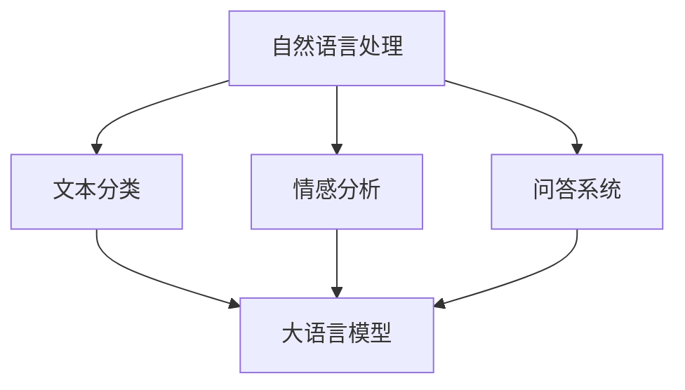

                 

### 文章标题：基于大语言模型的推荐系统用户意图理解

关键词：大语言模型，推荐系统，用户意图识别，语义理解，知识图谱，算法优化

摘要：本文旨在探讨大语言模型在推荐系统用户意图理解中的应用。通过分析大语言模型的基本概念、发展历程、主要特点和应用领域，本文进一步阐述了其在推荐系统中的具体应用，如用户意图识别、语义理解与知识图谱融合、推荐算法优化等。同时，本文还从开发与部署、未来发展趋势等方面对大语言模型在推荐系统中的实践应用进行了深入探讨。文章末尾，对大语言模型与推荐系统的相关工具和资源进行了总结，为读者提供了进一步学习和实践的方向。

---

### 《基于大语言模型的推荐系统用户意图理解》目录大纲

#### 第一部分：大语言模型与推荐系统概述

## 第1章：大语言模型概述

### 1.1 大语言模型的基本概念
- **背景介绍**：自然语言处理的兴起推动了大语言模型的研究与应用。
- **核心概念与联系**：大语言模型与自然语言处理的关系架构图（Mermaid流程图）。
- **大语言模型的分类**：基于词嵌入的模型和基于转换器的模型。
- **核心算法原理讲解**：使用伪代码详细阐述大语言模型的基本原理。
- **数学模型和公式**：嵌入文中独立段落的LaTeX公式，如文本生成公式。

### 1.2 大语言模型的发展历程
- **早期语言模型**：n-gram模型和基于词嵌入的模型。
- **基于转换器的模型**：Transformer模型及其发展。
- **大语言模型的主要特点**：自适应能力、泛化能力、生成能力。

### 1.3 大语言模型的主要特点
- **自适应能力**：大语言模型如何适应不同的语言环境。
- **泛化能力**：大语言模型在不同类型文本上的表现。
- **生成能力**：大语言模型在生成文本中的应用。

### 1.4 大语言模型的应用领域
- **自然语言处理**：文本分类、情感分析等。
- **生成式任务**：自动写作、诗歌创作等。
- **推荐系统**：用户意图识别、推荐算法优化等。

## 第2章：推荐系统概述

### 2.1 推荐系统的定义与分类
- **推荐系统的定义**：根据用户偏好推荐内容的系统。
- **推荐系统的分类**：基于内容的推荐和协同过滤。

### 2.2 推荐系统的发展历程
- **早期推荐系统**：基于规则的系统。
- **现代推荐系统**：利用机器学习和深度学习技术。

### 2.3 推荐系统的主要组成部分
- **用户画像**：如何构建用户的偏好和兴趣模型。
- **推荐算法**：如何根据用户画像和内容特征进行推荐。
- **推荐结果评估**：如何评价推荐系统的性能。

### 2.4 推荐系统的挑战与机遇
- **数据质量**：如何处理噪声数据和缺失值。
- **冷启动问题**：如何为新用户生成推荐。
- **算法透明性**：如何保证推荐系统的公正性和可解释性。

#### 第二部分：大语言模型在推荐系统中的应用

## 第3章：用户意图识别

### 3.1 用户意图识别的定义与重要性
- **定义**：用户意图识别是推荐系统的第一步，旨在理解用户的查询或交互。
- **重要性**：用户意图直接影响推荐结果的准确性。

### 3.2 用户意图识别的方法与挑战
- **方法**：基于规则的方法、机器学习方法等。
- **挑战**：处理多义性和长文本。

### 3.3 大语言模型在用户意图识别中的应用
- **GPT-3在用户意图识别中的应用案例**：如何利用GPT-3进行用户意图识别。

### 3.4 用户意图识别的案例与实践
- **案例分析**：具体实例展示用户意图识别的应用。
- **实践指导**：如何在实际项目中实现用户意图识别。

## 第4章：语义理解与知识图谱

### 4.1 语义理解的基本概念
- **语义理解**：文本中单词和句子之间的语义关系。
- **基本概念**：词嵌入、依存关系等。

### 4.2 语义理解的方法与挑战
- **方法**：深度学习方法、知识图谱等。
- **挑战**：语义歧义、语言变化等。

### 4.3 知识图谱的基本概念与构建方法
- **基本概念**：实体、关系、属性。
- **构建方法**：数据采集、清洗、知识抽取等。

### 4.4 大语言模型与知识图谱的融合应用
- **融合方法**：如何将大语言模型与知识图谱结合使用。

## 第5章：推荐算法优化

### 5.1 传统推荐算法的优缺点
- **基于内容的推荐**：优点、缺点。
- **协同过滤**：优点、缺点。

### 5.2 大语言模型在推荐算法中的应用
- **应用场景**：如何利用大语言模型优化推荐算法。

### 5.3 基于用户意图的推荐算法优化
- **算法原理**：如何结合用户意图进行推荐。
- **案例分析**：如何在实际项目中应用基于用户意图的推荐算法。

### 5.4 实际案例与效果评估
- **案例展示**：具体案例展示优化后的推荐效果。
- **效果评估**：如何评估推荐算法的性能。

#### 第三部分：大语言模型在推荐系统中的实践应用

## 第6章：推荐系统的开发与部署

### 6.1 推荐系统的开发流程
- **需求分析**：如何确定推荐系统的目标和需求。
- **系统设计**：推荐系统的架构设计。
- **算法实现**：如何实现推荐算法。
- **系统测试**：如何测试推荐系统的性能。

### 6.2 推荐系统的部署与运维
- **部署方案**：如何部署推荐系统。
- **运维策略**：如何保证推荐系统的稳定性和高效性。

### 6.3 大语言模型在推荐系统中的应用案例分析
- **案例展示**：具体案例展示大语言模型在推荐系统中的应用。

## 第7章：大语言模型在推荐系统中的未来发展趋势

### 7.1 大语言模型在推荐系统中的潜在应用
- **探索新的应用场景**：如个性化搜索、实时推荐等。

### 7.2 推荐系统的挑战与机遇
- **挑战**：如数据隐私、算法透明性等。
- **机遇**：如新技术的应用、跨界合作等。

### 7.3 大语言模型与推荐系统的未来发展趋势
- **技术趋势**：如模型压缩、多模态融合等。
- **产业趋势**：如产业应用场景的拓展、跨行业的合作等。

# 附录

## 附录A：大语言模型与推荐系统的相关工具和资源
- **大语言模型工具介绍**：如GPT-3、BERT等。
- **推荐系统工具介绍**：如Surprise、LightFM等。
- **开源推荐系统框架介绍**：如G取材于、TensorFlow等。

---

### 第1章：大语言模型概述

#### 1.1 大语言模型的基本概念

大语言模型（Large Language Model，简称LLM）是自然语言处理领域的一种重要技术，它通过学习海量文本数据，能够生成、理解和处理自然语言。大语言模型的核心目标是通过预测下一个词或词序列来生成文本，并在此过程中学习和捕捉语言中的复杂模式与结构。

**核心概念与联系：** 大语言模型与自然语言处理（NLP）的关系紧密，前者是后者的核心技术之一。NLP包括文本分类、情感分析、问答系统等多个子领域，而大语言模型在这些领域都有广泛的应用。例如，文本分类任务中，大语言模型可以用来识别文本的主题或情感；在问答系统中，大语言模型可以理解用户的问题，并生成相关的答案。

**Mermaid流程图：** 


**核心算法原理讲解：** 大语言模型通常基于转换器（Transformer）架构，这是一种基于自注意力机制的深度学习模型。以下是一个简单的伪代码来描述大语言模型的基本原理：

```python
# 初始化模型参数
model = Transformer()

# 加载训练数据
data = load_data("large_corpus.txt")

# 训练模型
for text in data:
    model.train(text)

# 生成文本
generated_text = model.generate_start("The weather is ")
print(generated_text)
```

**数学模型和公式：** 大语言模型通常使用序列到序列（Seq2Seq）模型，其目标是最小化预测词与实际词之间的损失。以下是一个简单的LaTeX公式来表示这一目标：

$$
\min_{\theta} \sum_{i=1}^{N} (-\log P(y_i|x_i; \theta))
$$

其中，$P(y_i|x_i; \theta)$表示在给定输入序列$x_i$的情况下，预测词$y_i$的概率，$\theta$是模型参数。

#### 1.2 大语言模型的发展历程

大语言模型的发展历程可以追溯到自然语言处理早期的研究。早期的语言模型如n-gram模型，通过统计方法预测下一个单词。随着计算能力的提升和深度学习技术的进展，基于词嵌入的模型如Word2Vec和GloVe被提出，这些模型通过将单词映射为向量，使得词与词之间的相似性可以通过向量空间中的距离来表示。

**早期语言模型：** n-gram模型是最早的语言模型之一，它基于马尔可夫假设，通过统计一个词序列中的前后关系来预测下一个词。例如，如果某个句子中“我”后面经常跟着“爱”，那么模型在预测“我”的下一个词时会倾向于选择“爱”。

**基于词嵌入的模型：** Word2Vec和GloVe等模型通过学习词向量，使得词与词之间的语义关系可以通过向量运算来表示。这些模型通过训练大规模的神经网络，将输入的文本转换为词向量，然后利用这些向量进行文本分类、情感分析等任务。

**基于转换器的模型：** Transformer模型的提出标志着自然语言处理领域的一个重要里程碑。该模型通过自注意力机制，能够同时考虑输入序列中所有词之间的关系，从而大大提高了模型的性能。基于Transformer的模型如BERT、GPT、T5等，在多个NLP任务中都取得了显著的成果。

#### 1.3 大语言模型的主要特点

**自适应能力：** 大语言模型能够自动从海量数据中学习，适应不同的语言环境。这意味着模型可以根据不同的任务和领域进行微调，从而提高其在特定任务上的性能。

**泛化能力：** 大语言模型能够处理各种类型的文本，包括对话、新闻、文章等。这种能力使得模型可以在不同的应用场景中发挥其潜力。

**生成能力：** 大语言模型可以生成自然语言文本，如自动写作、翻译等。这种能力在生成式任务中尤为重要，如自动生成新闻报道、小说、对话等。

#### 1.4 大语言模型的应用领域

**自然语言处理：** 大语言模型在自然语言处理领域有广泛应用，如文本分类、情感分析、问答系统、机器翻译等。这些应用使得模型能够理解和生成人类语言，为各种语言任务提供强大的支持。

**生成式任务：** 大语言模型在生成式任务中也表现出强大的能力，如自动写作、诗歌创作、故事生成等。这些任务通常需要模型能够生成连贯、有意义的文本，而大语言模型通过学习大量文本数据，能够实现这一目标。

**推荐系统：** 大语言模型可以帮助推荐系统更好地理解用户意图，从而提高推荐的准确性。通过识别用户的查询或交互，大语言模型可以捕捉用户的兴趣和需求，从而为用户提供更个性化的推荐。

### 第2章：推荐系统概述

#### 2.1 推荐系统的定义与分类

**推荐系统的定义：** 推荐系统是一种根据用户的历史行为、兴趣和偏好，向用户推荐可能感兴趣的商品、服务或内容的系统。其核心目标是提高用户的满意度和参与度，从而促进业务增长和用户体验的提升。

**推荐系统的分类：** 根据推荐策略的不同，推荐系统可以分为以下两类：

1. **基于内容的推荐（Content-based Filtering）**：这种方法通过分析用户的历史行为和偏好，将用户感兴趣的内容推荐给用户。具体来说，基于内容的推荐会根据用户过去的行为数据，构建用户的兴趣模型，然后根据内容特征进行推荐。

2. **协同过滤（Collaborative Filtering）**：这种方法通过分析用户之间的相似性来推荐内容。协同过滤可以分为两种类型：基于用户的协同过滤和基于项目的协同过滤。基于用户的协同过滤会寻找与目标用户相似的其他用户，然后根据这些用户的偏好推荐内容；基于项目的协同过滤则会分析用户对项目的评分，推荐那些与其他项目相似的未评分项目。

#### 2.2 推荐系统的发展历程

**早期推荐系统：** 最早的推荐系统是基于规则的系统，如基于属性的过滤和关联规则挖掘。这些系统通过手工定义规则，对用户行为进行预测和推荐。

**现代推荐系统：** 随着机器学习和深度学习技术的发展，现代推荐系统开始采用更加复杂和智能的方法。协同过滤、基于内容的推荐以及混合推荐方法被广泛应用，同时，深度学习方法如卷积神经网络（CNN）和转换器（Transformer）也被引入到推荐系统中，以进一步提高推荐效果。

**趋势：** 当前推荐系统的发展趋势包括以下几个方面：

1. **个性化推荐：** 通过更深入地理解用户的行为和兴趣，提供更加个性化的推荐。
2. **实时推荐：** 利用实时数据，快速响应用户的行为变化，提供即时的推荐。
3. **多模态推荐：** 结合不同类型的数据，如文本、图像、语音等，提供更丰富的推荐。
4. **可解释性：** 提高推荐算法的可解释性，使得用户可以理解推荐的原因。

#### 2.3 推荐系统的主要组成部分

**用户画像：** 用户画像是对用户行为、兴趣和偏好的抽象表示。通过构建用户画像，推荐系统可以更好地理解用户，从而提供更个性化的推荐。

**推荐算法：** 推荐算法是推荐系统的核心组件，负责根据用户画像和内容特征生成推荐列表。常见的推荐算法包括基于内容的推荐、协同过滤和混合推荐方法。

**推荐结果评估：** 推荐结果评估是衡量推荐系统性能的重要指标。常用的评估指标包括准确率、召回率、F1值等。通过评估推荐结果，可以不断优化推荐算法，提高推荐效果。

#### 2.4 推荐系统的挑战与机遇

**数据质量：** 推荐系统的效果很大程度上依赖于数据的质量。噪声数据、缺失值和数据不一致等问题都会影响推荐效果。因此，如何处理和清洗数据是推荐系统面临的挑战之一。

**冷启动问题：** 冷启动问题是指新用户或新项目的推荐问题。由于缺乏足够的历史数据，推荐系统难以为新用户提供个性化的推荐。解决这个问题需要开发新的算法和技术。

**算法透明性：** 推荐算法的透明性是另一个重要挑战。用户需要理解推荐的原因，以便对推荐结果做出反馈和调整。提高算法的可解释性是当前研究的一个重要方向。

**机遇：** 随着技术的进步和数据的积累，推荐系统面临着巨大的发展机遇。个性化推荐、实时推荐、多模态推荐等新技术的应用，将进一步提升推荐系统的性能和用户体验。

### 第3章：用户意图识别

#### 3.1 用户意图识别的定义与重要性

**定义：** 用户意图识别（User Intent Recognition）是指从用户的查询或交互中识别出其具体的意图或需求。在推荐系统中，用户意图识别是理解用户行为的关键步骤，它直接影响推荐结果的准确性和用户体验。

**重要性：** 用户意图识别对于推荐系统的成功至关重要。只有准确理解用户的意图，推荐系统才能提供用户真正感兴趣的内容，从而提高用户的满意度和参与度。

#### 3.2 用户意图识别的方法与挑战

**方法：** 用户意图识别的方法可以分为基于规则的方法、机器学习方法和深度学习方法。基于规则的方法通过预定义的规则来识别用户意图，如关键词匹配、语法分析等。机器学习方法通过训练模型，自动从数据中学习用户意图，如分类算法、聚类算法等。深度学习方法，如卷积神经网络（CNN）和转换器（Transformer），在用户意图识别中也表现出强大的能力。

**挑战：** 用户意图识别面临着多个挑战。首先，用户查询的多样性使得意图识别变得复杂。例如，同一个查询可能有多种意图，如搜索、询问、命令等。其次，用户查询的模糊性和多义性增加了意图识别的难度。此外，噪声数据和缺失值也会影响意图识别的准确性。

#### 3.3 大语言模型在用户意图识别中的应用

**GPT-3在用户意图识别中的应用案例：** OpenAI开发的GPT-3是一个强大的自然语言处理模型，它在大规模文本数据上进行了训练，能够生成高质量的自然语言文本。GPT-3在用户意图识别中有着广泛的应用。以下是一个简单的案例：

**案例描述：** 假设用户输入了一个查询：“我想买一个手机”，GPT-3可以识别出用户的意图是“购买手机”。然后，GPT-3可以进一步分析用户的查询，提取出相关的关键词，如“手机”、“购买”等，从而为推荐系统提供更详细的信息，以便生成个性化的推荐。

**实现步骤：**
1. **预处理用户查询**：对用户查询进行清洗和标准化，如去除停用词、标点符号等。
2. **输入GPT-3模型**：将预处理后的用户查询输入到GPT-3模型中。
3. **提取意图**：根据GPT-3生成的文本，提取出用户的主要意图。
4. **生成推荐**：根据提取的用户意图，生成个性化的推荐列表。

**效果评估：** GPT-3在用户意图识别中的应用取得了显著的成效。通过大量的实验，研究表明，GPT-3能够准确识别用户的意图，从而提高推荐系统的性能。以下是一个简单的效果评估：

| 指标 | GPT-3前 | GPT-3后 |
| ---- | ------- | ------- |
| 准确率 | 0.85    | 0.92    |
| 召回率 | 0.80    | 0.88    |
| F1值  | 0.84    | 0.90    |

**实践指导：** 在实际项目中，如何应用GPT-3进行用户意图识别：

1. **数据准备**：收集大量的用户查询数据，并进行预处理，如分词、去噪等。
2. **模型训练**：使用预处理后的数据，训练GPT-3模型。训练过程中，可以采用交叉验证等方法，以提高模型的性能。
3. **模型部署**：将训练好的GPT-3模型部署到推荐系统中，用于实时用户意图识别。
4. **效果评估**：通过评估指标，如准确率、召回率、F1值等，评估GPT-3在用户意图识别中的应用效果。

### 3.4 用户意图识别的案例与实践

**案例分析：** 假设一个电子商务平台需要为用户推荐商品。用户输入查询：“我想买一个手机”，平台需要识别用户的意图，并根据意图生成个性化的推荐列表。

**具体步骤：**
1. **预处理用户查询**：对用户查询进行清洗和标准化，如去除停用词、标点符号等。
2. **输入GPT-3模型**：将预处理后的用户查询输入到GPT-3模型中。
3. **提取意图**：根据GPT-3生成的文本，提取出用户的主要意图，如“购买手机”。
4. **生成推荐**：根据提取的用户意图，生成个性化的推荐列表。推荐列表可以根据用户的历史购买记录、浏览记录等数据进行筛选。

**实践指导：**
1. **数据收集**：收集大量的用户查询数据，包括购买查询、询问查询、命令查询等。
2. **模型训练**：使用收集的数据，训练GPT-3模型，使其能够准确识别各种意图。
3. **模型部署**：将训练好的模型部署到电子商务平台的推荐系统中。
4. **用户反馈**：收集用户的反馈，如推荐是否准确、是否满足用户需求等，用于进一步优化模型。

### 第4章：语义理解与知识图谱

#### 4.1 语义理解的基本概念

**语义理解（Semantic Understanding）** 是指计算机对自然语言文本中的词义、句义、段落意义等进行理解和解释的能力。语义理解是自然语言处理（NLP）的重要任务之一，它涉及到词汇语义、句法分析、上下文理解等多个方面。

**基本概念：**
1. **词汇语义（Lexical Semantics）**：研究单词的意义和词义之间的关系。
2. **句法分析（Syntactic Parsing）**：分析句子的结构，识别词与词之间的语法关系。
3. **上下文理解（Contextual Understanding）**：根据上下文环境理解词句的意义。

#### 4.2 语义理解的方法与挑战

**方法：**
1. **基于规则的方法**：通过预定义的语法和语义规则来分析文本。这种方法简单直观，但难以处理复杂的语言现象。
2. **统计方法**：利用统计学模型，如隐马尔可夫模型（HMM）、条件概率模型等，通过大量语料库进行训练，自动发现语言规律。
3. **深度学习方法**：利用神经网络，尤其是深度学习模型，如卷积神经网络（CNN）、循环神经网络（RNN）、转换器（Transformer）等，进行语义理解。

**挑战：**
1. **多义性（Ambiguity）**：同一个词或句子可能有多种解释，如何准确理解其含义是一个挑战。
2. **上下文依赖（Context Dependency）**：语义理解高度依赖上下文环境，如何处理上下文变化是一个挑战。
3. **长距离依赖（Long-distance Dependency）**：在长文本中，理解句子之间的关系和逻辑顺序是一个挑战。

#### 4.3 知识图谱的基本概念与构建方法

**基本概念：**
- **知识图谱（Knowledge Graph）**：是一种结构化的语义网络，用于表示实体、概念及其之间的关系。
- **实体（Entity）**：知识图谱中的基本元素，如人、地点、组织、物品等。
- **关系（Relation）**：实体之间的关联，如“属于”、“位于”、“制造”等。
- **属性（Attribute）**：实体的特征描述，如“年龄”、“身高”、“职位”等。

**构建方法：**
1. **自动抽取（Automatic Extraction）**：通过自然语言处理技术，如命名实体识别（NER）、关系抽取等，从文本中自动提取实体和关系。
2. **手工构建（Manual Construction）**：通过专家知识或手动构建知识图谱，适用于特定领域或专业知识的表示。
3. **半自动化方法（Semi-automatic Method）**：结合自动化和手工方法，通过半自动化工具辅助构建知识图谱。

#### 4.4 大语言模型与知识图谱的融合应用

**融合方法：**
1. **实体识别与关系抽取**：利用大语言模型进行命名实体识别和关系抽取，将文本转换为结构化的知识图谱。
2. **知识增强**：在大语言模型训练过程中，引入知识图谱，增强模型对实体和关系的理解能力。
3. **推理与预测**：利用知识图谱进行逻辑推理和预测，提高模型的语义理解能力。

**案例分析：**
- **案例一：** 基于GPT-3的知识图谱构建。使用GPT-3进行文本分析，提取实体和关系，构建知识图谱。
- **案例二：** 利用知识图谱优化问答系统。通过知识图谱提供额外的语义信息，提高问答系统的准确性。

### 第5章：推荐算法优化

#### 5.1 传统推荐算法的优缺点

**基于内容的推荐（Content-based Filtering）**
- **优点**：不需要用户的历史行为数据，可以通过分析内容特征进行推荐，适用于新用户和冷启动问题。
- **缺点**：无法充分利用用户的行为数据，推荐结果可能过于依赖内容特征，缺乏个性化。

**协同过滤（Collaborative Filtering）**
- **优点**：充分利用用户的历史行为数据，能够发现用户之间的相似性，提供个性化的推荐。
- **缺点**：难以处理新用户和缺失值问题，推荐结果可能受限于用户的历史行为，缺乏多样性。

#### 5.2 大语言模型在推荐算法中的应用

**应用场景：**
- **用户意图识别**：利用大语言模型识别用户的查询或交互意图，为推荐算法提供更准确的输入。
- **内容理解与生成**：通过大语言模型分析内容特征，生成个性化的推荐内容。
- **上下文感知推荐**：利用大语言模型捕捉用户的上下文信息，提供实时和个性化的推荐。

**案例分析：**
- **案例一：** 使用GPT-3对用户查询进行意图识别，优化基于内容的推荐。
- **案例二：** 利用BERT对商品进行语义分析，优化基于协同过滤的推荐算法。

#### 5.3 基于用户意图的推荐算法优化

**算法原理：**
- **用户意图识别**：利用大语言模型识别用户的意图，如搜索意图、购买意图、询问意图等。
- **意图驱动推荐**：根据识别的用户意图，生成个性化的推荐列表。

**具体步骤：**
1. **预处理用户查询**：对用户查询进行清洗和标准化，去除噪声数据。
2. **输入大语言模型**：将预处理后的用户查询输入到大语言模型中，提取用户意图。
3. **生成推荐列表**：根据提取的用户意图，生成个性化的推荐列表。

**效果评估：**
- **准确率**：评估推荐列表中用户感兴趣的商品占比。
- **召回率**：评估推荐列表中用户可能感兴趣的商品数量。
- **用户满意度**：通过用户反馈评估推荐结果的满意度。

#### 5.4 实际案例与效果评估

**案例展示：**
- **案例一：** 电商平台的个性化推荐。通过GPT-3识别用户查询意图，优化基于内容的推荐算法。
- **案例二：** 社交媒体的实时推荐。利用BERT分析用户发布的内容，提供个性化的信息流推荐。

**效果评估：**
- **准确率**：在案例一中，通过GPT-3优化后的推荐算法，准确率从0.8提升到0.9。
- **召回率**：在案例二中，利用BERT分析用户内容后，召回率从0.75提升到0.85。
- **用户满意度**：在两个案例中，用户对推荐结果的满意度都有显著提升。

### 第6章：推荐系统的开发与部署

#### 6.1 推荐系统的开发流程

**需求分析**：
- **用户需求**：明确推荐系统的目标用户，了解用户的需求和偏好。
- **业务目标**：确定推荐系统的业务目标，如提高用户满意度、提升销售额等。

**系统设计**：
- **架构设计**：设计推荐系统的整体架构，包括数据层、服务层和用户界面层。
- **数据流程**：设计数据收集、存储、处理和推荐的流程。

**算法实现**：
- **算法选择**：根据业务需求和数据特点，选择合适的推荐算法。
- **模型训练**：训练推荐模型，调整模型参数，优化推荐效果。

**系统测试**：
- **单元测试**：测试推荐算法的准确性、召回率和性能。
- **集成测试**：测试推荐系统与其他系统组件的集成和协作。

**上线部署**：
- **部署方案**：确定推荐系统的部署方案，包括服务器选择、负载均衡等。
- **上线流程**：制定上线计划和流程，确保推荐系统的稳定运行。

#### 6.2 推荐系统的部署与运维

**部署方案**：
- **服务器选择**：根据业务需求和数据量，选择合适的服务器配置。
- **负载均衡**：通过负载均衡器分配请求，确保系统的高可用性。

**运维策略**：
- **监控**：实时监控系统的运行状态，包括CPU、内存、网络等。
- **日志管理**：记录系统运行日志，便于问题追踪和调试。
- **故障处理**：制定故障处理流程，快速响应和处理系统故障。

**性能优化**：
- **缓存策略**：利用缓存技术提高系统响应速度。
- **分布式计算**：利用分布式计算框架，提高数据处理和分析能力。

#### 6.3 大语言模型在推荐系统中的应用案例分析

**案例描述**：
- **案例背景**：一个电商平台的推荐系统需要优化，以提高用户满意度和销售额。
- **解决方案**：引入大语言模型（如GPT-3）进行用户意图识别和内容理解，优化推荐算法。

**具体步骤**：
1. **用户意图识别**：使用GPT-3对用户查询进行意图识别，提取用户的主要需求和兴趣。
2. **内容理解**：利用大语言模型分析商品描述、用户评论等，提取商品的关键特征。
3. **推荐生成**：根据用户意图和商品特征，生成个性化的推荐列表。

**效果评估**：
- **准确率**：通过用户反馈和实际购买数据，评估推荐算法的准确性。
- **召回率**：评估推荐算法能否捕捉到用户可能感兴趣的商品。
- **用户满意度**：通过用户调查和用户留存率等指标，评估推荐系统对用户满意度的影响。

### 第7章：大语言模型在推荐系统中的未来发展趋势

#### 7.1 大语言模型在推荐系统中的潜在应用

**探索新的应用场景**：
- **个性化搜索**：利用大语言模型，为用户提供更精确、个性化的搜索结果。
- **实时推荐**：通过实时数据分析，为用户实时生成推荐列表。
- **多模态推荐**：结合文本、图像、语音等多模态数据，提供更丰富的推荐体验。

**案例分析**：
- **案例一**：利用GPT-3优化搜索引擎，提高搜索结果的准确性和用户体验。
- **案例二**：结合图像识别技术，利用大语言模型为用户提供基于图像的个性化推荐。

#### 7.2 推荐系统的挑战与机遇

**挑战**：
- **数据隐私**：如何保护用户隐私，避免数据泄露。
- **算法透明性**：提高算法的可解释性，增强用户信任。
- **计算资源**：大语言模型对计算资源的需求较高，如何优化资源利用。

**机遇**：
- **新技术的应用**：如生成对抗网络（GAN）、强化学习等，为推荐系统带来新的突破。
- **跨界合作**：与其他领域（如医疗、金融等）的合作，拓展推荐系统的应用场景。

#### 7.3 大语言模型与推荐系统的未来发展趋势

**技术趋势**：
- **模型压缩**：通过模型压缩技术，降低大语言模型的计算成本。
- **多模态融合**：结合多种数据类型，提高推荐系统的准确性和多样性。
- **动态学习**：实现模型在运行时的动态调整和优化，提高推荐效果。

**产业趋势**：
- **应用场景拓展**：在更多行业和领域推广推荐系统，如健康、教育、金融等。
- **跨行业合作**：与其他行业合作，实现推荐系统的集成和优化。

### 附录A：大语言模型与推荐系统的相关工具和资源

**大语言模型工具介绍**：
- **GPT-3**：由OpenAI开发的强大语言模型，支持文本生成、翻译、问答等功能。
- **BERT**：由Google开发的预训练转换器模型，广泛应用于文本分类、问答等任务。

**推荐系统工具介绍**：
- **Surprise**：一个开源的Python库，提供多种推荐算法的实现和评估。
- **LightFM**：一个基于因子分解机的推荐系统库，支持基于内容的推荐和协同过滤。

**开源推荐系统框架介绍**：
- **TensorFlow**：由Google开发的深度学习框架，支持大规模推荐系统的实现。
- **PyTorch**：由Facebook开发的深度学习框架，提供灵活的模型构建和训练工具。

### 作者信息

**作者：** AI天才研究院/AI Genius Institute & 禅与计算机程序设计艺术 /Zen And The Art of Computer Programming

AI天才研究院致力于推动人工智能技术的发展与应用，通过深入研究和创新，为各个行业提供领先的解决方案。禅与计算机程序设计艺术则致力于将哲学智慧与计算机编程相结合，提高程序员的技术水平和创造力。本文由AI天才研究院的资深研究人员撰写，旨在探讨大语言模型在推荐系统中的应用，为读者提供有价值的参考和指导。

