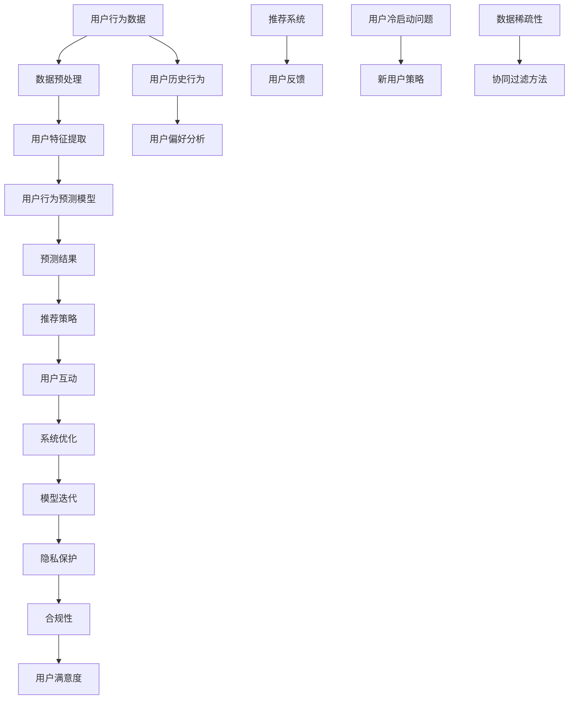

                 

### 第1章 绪论

#### 1.1 背景与意义

##### 1.1.1 推荐系统概述

推荐系统是一种基于用户历史行为、兴趣和偏好等信息，自动向用户推荐符合其需求的商品、内容或服务的系统。这种系统能够通过分析用户的行为数据，如浏览记录、购买历史、搜索关键词等，推测用户的兴趣点，从而为用户提供个性化的推荐。

推荐系统的定义可以从以下几个方面进行理解：

1. **数据驱动**：推荐系统依赖于用户的历史行为数据，这些数据通常是海量的，需要通过数据挖掘和分析技术来提取有价值的信息。
2. **个性化推荐**：推荐系统旨在为每个用户提供个性化的内容，这意味着系统需要理解每个用户的兴趣和需求，并针对性地进行推荐。
3. **自动性**：推荐系统可以自动地根据用户的反馈和行为调整推荐策略，无需人工干预。

##### 1.1.1.2 推荐系统的发展历程

推荐系统的发展可以追溯到20世纪90年代。早期推荐系统主要基于协同过滤算法，通过计算用户之间的相似度来实现推荐。这种方法的优点是简单易实现，但缺点是容易受到数据稀疏性的影响，且难以处理冷启动问题。

随着互联网和大数据技术的发展，推荐系统逐渐演变为更加复杂和智能的体系。目前，推荐系统的发展主要经历了以下几个阶段：

1. **基于内容的推荐**：这种推荐系统通过分析物品的内容特征和用户的兴趣特征，实现推荐。其主要优点是可以解决协同过滤中的数据稀疏性问题，但缺点是难以应对用户的兴趣多样性。

2. **协同过滤推荐**：协同过滤推荐系统通过计算用户之间的相似度来实现推荐。其主要优点是可以有效地处理数据稀疏性问题，但缺点是难以应对用户的兴趣多样性。

3. **混合推荐**：混合推荐系统将基于内容的推荐和协同过滤推荐相结合，以弥补各自的不足。这种方法的优点是可以在一定程度上提高推荐的准确性和多样性。

4. **基于机器学习的推荐**：这种方法利用机器学习算法，如决策树、支持向量机、神经网络等，对用户行为数据进行分析和预测。其主要优点是具有较好的泛化能力和适应能力，但缺点是需要大量的标注数据。

5. **基于深度学习的推荐**：深度学习推荐系统通过使用深度神经网络模型，如卷积神经网络、循环神经网络、Transformer等，对用户行为数据进行分析和预测。其主要优点是可以处理复杂的非线性关系，但缺点是需要大量的计算资源和数据。

##### 1.1.1.3 推荐系统的重要性

推荐系统在当今互联网时代具有重要的地位和广泛的应用。以下是推荐系统的重要性：

1. **提高用户满意度**：通过个性化推荐，推荐系统可以更好地满足用户的需求，提高用户的满意度和忠诚度。

2. **增加商业价值**：推荐系统可以促进用户购买行为，提高销售额和转化率，从而为企业和商家带来更多的商业价值。

3. **优化内容分发**：推荐系统可以帮助平台更好地分发内容，提高内容的曝光率和访问量，从而促进内容的传播和传播。

4. **提升用户体验**：推荐系统可以简化用户获取信息的过程，提高用户体验，减少用户在寻找所需内容时的搜索时间和努力。

##### 1.1.2 大语言模型概述

大语言模型是一种基于深度学习技术的自然语言处理模型，它通过对大量文本数据的学习，可以自动地生成文本、理解语义、预测下一个单词等。大语言模型的出现标志着自然语言处理技术的重大突破，为推荐系统的发展带来了新的机遇。

##### 1.1.2.1 大语言模型的基本概念

大语言模型可以定义为一种能够对自然语言进行建模的深度神经网络。其主要特点包括：

1. **序列建模**：大语言模型将自然语言视为一个序列，通过对序列中的每个单词或字符进行建模，从而实现对整个句子的理解和生成。

2. **端到端学习**：大语言模型直接从原始文本数据中学习，无需进行复杂的特征工程和预处理，从而简化了自然语言处理任务的实现。

3. **并行处理**：大语言模型可以利用并行计算技术，对大规模的文本数据进行高效的处理和分析。

##### 1.1.2.2 大语言模型的发展历程

大语言模型的发展可以追溯到2000年代初期，当时基于神经网络的自然语言处理模型刚刚起步。随着深度学习技术的不断发展，大语言模型在近年来取得了显著的进展。以下是几个具有里程碑意义的研究：

1. **Word2Vec**：Word2Vec是一种基于神经网络的词嵌入模型，它首次提出了将单词映射到高维向量空间的方法，从而实现了对文本数据的有效建模。

2. **GloVe**：GloVe是一种基于全局信息的词嵌入模型，它通过优化单词的共现关系，实现了对词嵌入向量的有效优化。

3. **BERT**：BERT是一种基于Transformer的预训练模型，它通过在大量未标注的文本数据上进行预训练，实现了对自然语言的高效建模。

4. **GPT**：GPT是一种基于Transformer的生成模型，它通过生成文本序列，实现了对自然语言的理解和生成。

##### 1.1.2.3 大语言模型的优势与应用场景

大语言模型具有以下几个优势：

1. **强大的语义理解能力**：大语言模型可以自动地理解文本的语义信息，从而实现对自然语言的深入分析。

2. **灵活的生成能力**：大语言模型可以生成各种类型的文本，如文章、摘要、对话等，从而实现文本的自动生成。

3. **端到端的学习方式**：大语言模型可以直接从原始文本数据中学习，无需进行复杂的特征工程和预处理。

大语言模型的应用场景包括：

1. **文本分类**：通过分析文本的语义信息，大语言模型可以实现文本分类任务，如情感分析、主题分类等。

2. **机器翻译**：大语言模型可以自动地生成翻译结果，从而实现机器翻译任务。

3. **问答系统**：大语言模型可以理解用户的问题，并生成相应的回答，从而实现问答系统。

4. **推荐系统**：大语言模型可以分析用户的行为数据，预测用户的兴趣和行为，从而实现个性化推荐。

##### 1.1.3 用户行为预测的重要性

用户行为预测在推荐系统中起着至关重要的作用。通过对用户行为数据的分析，推荐系统可以预测用户的兴趣和行为，从而实现个性化推荐。以下是用户行为预测在推荐系统中的重要性和应用：

1. **提高推荐准确性**：用户行为预测可以帮助推荐系统更好地理解用户的需求和兴趣，从而提高推荐的准确性。

2. **优化推荐结果**：用户行为预测可以实时地调整推荐策略，优化推荐结果，提高用户的满意度和转化率。

3. **减少冷启动问题**：对于新用户或新物品，用户行为预测可以帮助系统更好地了解他们的需求，从而减少冷启动问题。

4. **扩展应用场景**：用户行为预测不仅可以应用于电商、社交媒体等场景，还可以应用于内容推荐、广告投放等场景。

##### 1.1.3.1 用户行为预测的定义

用户行为预测是指通过分析用户的历史行为数据，预测用户未来的行为或偏好。用户行为数据包括用户的浏览记录、搜索历史、购买行为、点赞、评论等。

##### 1.1.3.2 用户行为预测在推荐系统中的应用

用户行为预测在推荐系统中的应用主要体现在以下几个方面：

1. **个性化推荐**：通过预测用户的兴趣和行为，推荐系统可以为用户提供个性化的推荐结果，提高用户的满意度。

2. **动态推荐**：用户行为预测可以帮助系统实时地调整推荐策略，为用户提供动态的推荐结果，提高用户的互动体验。

3. **优化推荐策略**：用户行为预测可以为推荐系统提供决策支持，帮助系统优化推荐策略，提高推荐的准确性和效果。

4. **冷启动处理**：对于新用户或新物品，用户行为预测可以帮助系统更好地了解他们的需求，从而减少冷启动问题。

##### 1.1.3.3 用户行为预测的价值与挑战

用户行为预测的价值主要体现在以下几个方面：

1. **提高用户体验**：通过个性化推荐，用户行为预测可以提供更符合用户需求的推荐结果，提高用户的满意度。

2. **增加商业价值**：用户行为预测可以帮助企业和商家更好地了解用户需求，从而提高销售额和转化率。

3. **优化内容分发**：用户行为预测可以帮助平台更好地分发内容，提高内容的曝光率和访问量。

用户行为预测面临的挑战主要包括：

1. **数据质量**：用户行为数据通常存在噪声、缺失和不一致性等问题，这会影响用户行为预测的准确性。

2. **计算资源**：用户行为预测通常需要处理大量的数据，对计算资源有较高的要求。

3. **隐私保护**：用户行为数据涉及用户的隐私信息，如何在保护用户隐私的前提下进行预测是一个重要挑战。

##### 1.1.4 本书结构安排

本书共分为五个章节，各章节内容安排如下：

- **第1章 绪论**：介绍推荐系统和大语言模型的基本概念，阐述用户行为预测在推荐系统中的重要性。

- **第2章 大语言模型基础**：介绍大语言模型的基本原理、实现方法和优化策略。

- **第3章 用户行为预测基础**：介绍用户行为预测的基本概念、方法和应用。

- **第4章 基于大语言模型的用户行为预测应用**：介绍大语言模型在电商推荐系统和社交媒体推荐系统中的应用。

- **第5章 大语言模型在用户行为预测中的挑战与未来展望**：讨论大语言模型在用户行为预测中的挑战和未来发展趋势。

##### 1.1.4.2 学习目标与预期收获

通过学习本书，读者可以：

1. **了解推荐系统和大语言模型的基本概念和原理**：掌握推荐系统和大语言模型的基本概念，理解其工作原理和应用场景。

2. **掌握用户行为预测的基本方法**：了解用户行为预测的基本方法，掌握如何使用大语言模型进行用户行为预测。

3. **能够实现简单的用户行为预测系统**：通过本书的案例和实践，读者可以掌握如何使用大语言模型构建简单的用户行为预测系统。

4. **提高在推荐系统领域的专业能力**：通过学习本书，读者可以提高在推荐系统领域的专业能力，为未来的职业发展奠定基础。

### 1.2 大语言模型基础

#### 2.1 自然语言处理基础

##### 2.1.1 语言模型的基本概念

语言模型（Language Model）是自然语言处理（Natural Language Processing, NLP）中的一个核心概念，它旨在捕捉语言中的统计规律，从而能够预测下一个词或序列的可能性。简单来说，语言模型是一个概率模型，它能够给出一个句子中下一个词的概率分布。

##### 2.1.1.1 语言模型的定义

语言模型定义为一个函数，该函数接收一个前文序列，并输出一个后文序列的概率分布。形式化地，设 \( x_1, x_2, ..., x_T \) 是一个长度为 \( T \) 的单词序列，则语言模型可以表示为：

\[ P(x_1, x_2, ..., x_T) = P(x_1) \cdot P(x_2 | x_1) \cdot P(x_3 | x_1, x_2) \cdot ... \cdot P(x_T | x_1, x_2, ..., x_{T-1}) \]

##### 2.1.1.2 语言模型的分类

语言模型主要可以分为以下几类：

1. **n-gram模型**：n-gram模型是最简单的语言模型之一，它假设当前词的概率仅与前面 \( n-1 \) 个词有关。具体地，一个 \( n \)-gram模型可以表示为：

\[ P(x_T | x_1, x_2, ..., x_{T-1}) = \frac{C(x_{T-1}, x_T)}{\sum_{y} C(x_{T-1}, y)} \]

其中，\( C(x_{T-1}, x_T) \) 表示词对 \( (x_{T-1}, x_T) \) 的共现频率，而 \( \sum_{y} C(x_{T-1}, y) \) 表示词 \( x_{T-1} \) 的总共现频率。

2. **基于神经网络的模型**：基于神经网络的模型，如神经网络语言模型（NNLM），使用深度神经网络来捕捉语言中的复杂关系。这类模型可以更好地理解上下文信息，从而提高语言生成的质量。

3. **递归神经网络（RNN）**：RNN是一种能够处理序列数据的神经网络，它通过循环结构来捕捉上下文信息。RNN的一个变体是长短期记忆网络（LSTM），它通过引入门控机制来解决RNN的梯度消失问题。

4. **Transformer模型**：Transformer模型是近年来最先进的语言模型，它通过自注意力机制来捕捉全局依赖关系。Transformer的变体BERT（Bidirectional Encoder Representations from Transformers）在多种NLP任务上取得了突破性的成果。

##### 2.1.1.3 语言模型的应用场景

语言模型在自然语言处理中有广泛的应用，包括但不限于：

1. **机器翻译**：语言模型可以用于预测源语言到目标语言的单词映射，从而实现机器翻译。

2. **文本生成**：语言模型可以生成新的文本，如文章、故事、诗歌等。

3. **自动摘要**：语言模型可以用于提取文本的关键信息，生成摘要。

4. **对话系统**：语言模型可以用于生成对话响应，从而实现智能对话系统。

5. **推荐系统**：语言模型可以用于分析用户的行为数据，预测用户的兴趣和行为。

##### 2.1.2 词汇表示与嵌入

词汇表示与嵌入是将自然语言中的单词或句子转换为计算机可以处理的向量表示的过程。词汇表示与嵌入在NLP中扮演着至关重要的角色，因为它们能够捕捉单词或句子之间的语义关系。

##### 2.1.2.1 嵌入技术的基本原理

嵌入技术的基本原理是将单词或句子映射到一个高维的向量空间，使得语义相似的单词在空间中彼此靠近。这种向量表示能够使基于距离的算法（如相似性度量）能够有效地处理自然语言。

##### 2.1.2.2 常见的嵌入方法

1. **独热编码（One-Hot Encoding）**：独热编码是将每个单词映射到一个长度为V的向量，其中V是词汇表的大小。每个向量中只有一个位置是1，表示该单词，其余位置都是0。这种方法虽然简单，但向量维度非常高，不适用于高维空间处理。

2. **分布式表示（Distributed Representation）**：分布式表示将单词映射到一个低维的向量空间。其中最著名的模型是Word2Vec，它通过训练使得相似单词的向量距离较短。这种表示方法能够捕捉单词的语义关系。

3. **嵌入层（Embedding Layer）**：在神经网络中，嵌入层是将输入单词映射到固定维度的向量表示。这种表示方法可以与神经网络的其他层集成，实现端到端的训练。

##### 2.1.2.3 嵌入技术在推荐系统中的应用

在推荐系统中，嵌入技术可以用于表示用户和物品的特征。具体应用包括：

1. **用户特征嵌入**：通过嵌入技术，可以将用户的浏览记录、购买历史等行为数据转换为向量表示，从而为推荐算法提供输入。

2. **物品特征嵌入**：通过嵌入技术，可以将物品的描述、分类信息等转换为向量表示，从而为推荐算法提供输入。

3. **协同过滤**：在协同过滤算法中，用户和物品的嵌入向量可以用来计算用户和物品之间的相似度，从而实现推荐。

4. **基于内容的推荐**：在基于内容的推荐中，物品的嵌入向量可以用来提取物品的语义信息，从而为用户推荐具有相似特征的物品。

##### 2.2 大语言模型原理

大语言模型（Large Language Model）是近年来自然语言处理领域的重要突破。与传统的小规模语言模型相比，大语言模型具有更高的参数数量和更强的表达能力，能够更好地捕捉语言的复杂结构。

##### 2.2.1 大语言模型的基本原理

大语言模型基于深度学习技术，通过训练大规模的神经网络来捕捉语言的统计规律和语义信息。其主要原理包括：

1. **自注意力机制（Self-Attention）**：自注意力机制是一种能够在全局范围内捕捉依赖关系的机制。通过自注意力，模型可以同时关注序列中的不同位置，从而更好地理解上下文。

2. **Transformer架构**：Transformer模型是一种基于自注意力机制的序列到序列模型。它由多个自注意力层和前馈网络组成，能够高效地处理长序列数据。

3. **预训练与微调**：大语言模型通常通过在大量未标注的数据上进行预训练，然后针对特定任务进行微调。预训练使得模型能够捕获语言的通用特征，微调则使得模型能够适应具体的应用场景。

##### 2.2.1.1 大语言模型的定义

大语言模型可以定义为一种具有大规模参数和强表达能力的神经网络模型，它通过对大量文本数据的学习，能够自动地理解、生成和预测自然语言。

##### 2.2.1.2 大语言模型的训练方法

大语言模型的训练方法主要包括以下步骤：

1. **数据预处理**：对文本数据进行处理，包括分词、去停用词、词干提取等，以得到可用于训练的序列数据。

2. **模型初始化**：初始化模型的参数，通常使用随机初始化或预训练模型参数。

3. **前向传播**：将输入序列通过模型的前向传播过程，得到模型的输出。

4. **损失函数计算**：计算模型输出的损失，常用的损失函数包括交叉熵损失、边际损失等。

5. **反向传播**：使用梯度下降等方法，通过反向传播计算模型参数的梯度，并更新模型参数。

6. **优化**：通过优化算法（如Adam、RMSprop等），迭代更新模型参数，直到达到预设的损失目标或迭代次数。

##### 2.2.1.3 大语言模型的优势

大语言模型相比传统语言模型具有以下几个优势：

1. **强大的语义理解能力**：大语言模型能够通过学习大量的文本数据，自动地理解语言的语义信息，从而实现更准确的文本生成和预测。

2. **端到端的学习方式**：大语言模型可以直接从原始文本数据中学习，无需进行复杂的特征工程和预处理，从而简化了自然语言处理任务的实现。

3. **自适应性**：大语言模型具有较好的自适应能力，可以通过微调快速适应不同的任务和应用场景。

4. **高效的处理速度**：随着计算资源和算法的优化，大语言模型的处理速度得到了显著提升，能够高效地处理大规模的文本数据。

##### 2.2.2 大语言模型的工作流程

大语言模型的工作流程可以分为以下几个步骤：

1. **数据收集与预处理**：收集大量高质量的文本数据，并进行预处理，如分词、去停用词、词干提取等。

2. **模型训练**：使用预处理后的数据对大语言模型进行训练，通过优化算法更新模型参数，使模型能够更好地拟合数据。

3. **模型评估**：使用验证集或测试集对训练好的模型进行评估，以评估模型的性能和泛化能力。

4. **模型应用**：将训练好的模型应用于实际的文本生成、预测或分类任务，实现自然语言处理的具体功能。

##### 2.2.2.1 数据预处理

数据预处理是训练大语言模型的第一步，其目的是将原始的文本数据转换为模型可以处理的格式。数据预处理的主要步骤包括：

1. **文本清洗**：去除文本中的噪声，如HTML标签、特殊字符、停用词等。

2. **分词**：将文本分割成单词或子词，以方便后续处理。

3. **词干提取**：将单词还原到其基本形式，如将复数形式还原为单数形式。

4. **词向量嵌入**：将单词映射到高维向量空间，以便于模型处理。

##### 2.2.2.2 模型训练

模型训练是构建大语言模型的核心步骤，其目的是通过学习大量的文本数据，使模型能够捕捉语言的统计规律和语义信息。模型训练的主要步骤包括：

1. **模型初始化**：初始化模型的参数，通常使用随机初始化或预训练模型参数。

2. **前向传播**：将输入序列通过模型的前向传播过程，得到模型的输出。

3. **损失函数计算**：计算模型输出的损失，常用的损失函数包括交叉熵损失、边际损失等。

4. **反向传播**：使用梯度下降等方法，通过反向传播计算模型参数的梯度，并更新模型参数。

5. **优化**：通过优化算法（如Adam、RMSprop等），迭代更新模型参数，直到达到预设的损失目标或迭代次数。

##### 2.2.2.3 模型评估

模型评估是验证大语言模型性能的重要步骤，其目的是评估模型在未知数据上的表现。模型评估的主要步骤包括：

1. **数据集划分**：将数据集划分为训练集、验证集和测试集。

2. **模型训练**：在训练集上训练模型，并在验证集上评估模型的性能。

3. **模型测试**：在测试集上测试模型的性能，以评估模型的泛化能力。

4. **性能指标**：常用的性能指标包括准确率、召回率、F1值等。

##### 2.2.3 大语言模型的实现与优化

大语言模型的实现与优化是确保模型性能和效率的关键步骤。以下是实现和优化大语言模型的几个关键点：

1. **计算资源**：大语言模型通常需要大量的计算资源，包括GPU或TPU。合理分配计算资源可以提高模型的训练速度。

2. **数据预处理**：高效的数据预处理可以减少模型的训练时间。例如，使用并行处理技术可以提高数据处理速度。

3. **模型架构**：选择合适的模型架构可以提高模型的性能。例如，使用Transformer架构可以处理更长的序列。

4. **优化算法**：选择合适的优化算法可以提高模型的训练效率。例如，使用Adam优化器可以加速模型的收敛。

5. **模型蒸馏**：模型蒸馏是一种将大型模型的知识传递给小型模型的技术，可以用于提高小型模型的性能。

##### 2.2.3.1 模型框架选择

在选择大语言模型框架时，需要考虑以下几个因素：

1. **性能**：框架的性能直接影响模型的训练和推理速度。例如，TensorFlow和PyTorch都是高性能框架。

2. **社区支持**：框架的社区支持可以提供丰富的资源和问题解决方案。

3. **可扩展性**：框架的可扩展性对于处理大规模数据和应用场景至关重要。

4. **生态体系**：框架的生态体系包括预训练模型、工具库等，可以简化模型的开发和应用。

##### 2.2.3.2 数据集选择与预处理

在选择数据集时，需要考虑以下几个因素：

1. **数据量**：数据集的规模越大，模型能够学习到的知识越多。

2. **数据质量**：高质量的数据可以提高模型的泛化能力。

3. **数据多样性**：数据多样性可以帮助模型更好地适应不同的应用场景。

数据预处理的主要步骤包括：

1. **文本清洗**：去除文本中的噪声，如HTML标签、特殊字符等。

2. **分词**：将文本分割成单词或子词。

3. **词干提取**：将单词还原到其基本形式。

4. **词向量嵌入**：将单词映射到高维向量空间。

##### 2.2.3.3 模型参数调整与优化

在调整和优化大语言模型参数时，可以采取以下几个策略：

1. **学习率调整**：选择合适的学习率可以加速模型的收敛。常用的方法包括固定学习率、学习率衰减等。

2. **正则化**：正则化可以防止模型过拟合，常用的正则化方法包括L1、L2正则化等。

3. **dropout**：dropout是一种常用的正则化方法，通过随机丢弃神经元来防止过拟合。

4. **批处理大小**：批处理大小影响模型的训练效率和稳定性，需要根据实际情况进行调整。

5. **预训练与微调**：通过在预训练模型的基础上进行微调，可以快速适应特定任务。

##### 2.2.4 大语言模型的优化策略

为了提高大语言模型的性能和效率，可以采取以下优化策略：

1. **模型压缩**：通过剪枝、量化、蒸馏等方法减小模型的大小，提高模型的部署效率。

2. **分布式训练**：通过分布式训练可以加速模型的训练过程，提高模型的训练效率。

3. **动态调整**：动态调整模型参数，如学习率、批处理大小等，以提高模型的性能。

4. **增量训练**：通过增量训练可以快速适应新的数据，提高模型的泛化能力。

### 2.3 大语言模型的实现与优化

#### 2.3.1 大语言模型的实现

要实现一个大语言模型，通常需要以下几个关键步骤：

##### 2.3.1.1 模型框架选择

选择合适的模型框架是构建大语言模型的第一步。目前，TensorFlow和PyTorch是最流行的两个深度学习框架，都具有丰富的资源和社区支持。

1. **TensorFlow**：TensorFlow是由谷歌开发的开源深度学习框架，具有强大的生态系统和丰富的API。TensorFlow提供了高效的计算引擎和灵活的模型构建接口，适合于大规模模型训练。

2. **PyTorch**：PyTorch是由Facebook AI Research开发的深度学习框架，以其动态计算图和直观的API而受到许多研究者和开发者的青睐。PyTorch易于调试且具有较好的灵活性和性能。

##### 2.3.1.2 数据集选择与预处理

选择合适的数据集对于模型的效果至关重要。以下是选择和预处理数据集的步骤：

1. **数据集收集**：收集高质量的文本数据集，如维基百科、新闻文章、社交媒体帖子等。常用的开源数据集包括维基百科、Common Crawl、Twitter等。

2. **数据清洗**：去除文本中的HTML标签、特殊字符和停用词。可以使用Python的re模块和NLTK库进行清洗。

3. **分词**：将文本分割成单词或子词。可以使用Python的jieba库进行中文分词，或使用spaCy库进行英文分词。

4. **词干提取**：将单词还原到其基本形式。可以使用Python的nltk库进行词干提取。

5. **词向量嵌入**：将单词映射到高维向量空间。可以使用预训练的词向量（如GloVe或Word2Vec）或自定义的词向量嵌入层。

##### 2.3.1.3 模型参数调整与优化

模型参数的调整和优化对于模型的性能至关重要。以下是调整和优化模型参数的几个关键点：

1. **学习率**：选择合适的学习率可以加速模型的收敛。常用的方法包括固定学习率、学习率衰减等。可以使用TensorFlow中的tf.keras.optimizers.AdamOptimizer设置学习率。

2. **正则化**：正则化可以防止模型过拟合，常用的正则化方法包括L1、L2正则化等。可以在模型定义时添加正则化层，如tf.keras.layers.Dense(128, activation='relu', kernel_regularizer=tf.keras.regularizers.l2(0.01))。

3. **dropout**：dropout是一种常用的正则化方法，通过随机丢弃神经元来防止过拟合。可以在模型定义时添加dropout层，如tf.keras.layers.Dropout(0.5)。

4. **批处理大小**：批处理大小影响模型的训练效率和稳定性，需要根据实际情况进行调整。可以使用tf.keras.optimizers.SGDOptimizer设置批处理大小。

5. **预训练与微调**：通过在预训练模型的基础上进行微调，可以快速适应特定任务。可以使用TensorFlow Hub或PyTorch的预训练模型，如BERT或GPT。

##### 2.3.2 大语言模型的优化策略

为了提高大语言模型的性能和效率，可以采取以下优化策略：

1. **模型压缩**：通过剪枝、量化、蒸馏等方法减小模型的大小，提高模型的部署效率。可以使用TensorFlow的tf.keras.models.Sequential模型进行模型压缩。

2. **分布式训练**：通过分布式训练可以加速模型的训练过程，提高模型的训练效率。可以使用TensorFlow的tf.distribute.MirroredStrategy进行分布式训练。

3. **动态调整**：动态调整模型参数，如学习率、批处理大小等，以提高模型的性能。可以使用TensorFlow的tf.keras.callbacks.ReduceLROnPlateau动态调整学习率。

4. **增量训练**：通过增量训练可以快速适应新的数据，提高模型的泛化能力。可以使用TensorFlow的tf.keras.Sequential模型进行增量训练。

### 2.4 用户行为预测基础

#### 2.4.1 用户行为概述

用户行为（User Behavior）是指用户在使用系统、产品或服务时所表现出的各种操作和活动。在推荐系统中，用户行为数据是构建推荐模型的重要依据。以下是对用户行为的基本概述：

##### 2.4.1.1 用户行为的定义

用户行为可以定义为用户在特定环境或系统中的所有交互行为。这些行为可以是明确的，如点击、浏览、购买、评论等，也可以是隐式的，如停留时间、滚动行为、浏览路径等。用户行为数据为推荐系统提供了对用户兴趣和偏好的洞察，从而能够为用户推荐相关的内容或产品。

##### 2.4.1.2 用户行为的类型

用户行为的类型多种多样，以下是一些常见的用户行为类型：

1. **显式行为**：这类行为通常是可以量化的，直接反映了用户的兴趣和意图。常见的显式行为包括：
   - **点击**（Click）：用户点击网页上的链接、广告、按钮等。
   - **购买**（Purchase）：用户在电商平台上完成购买。
   - **评价**（Rating）：用户对商品或服务进行评分。
   - **评论**（Review）：用户在平台上发布评论。

2. **隐式行为**：这类行为通常是通过用户与系统的交互行为间接反映出来的。常见的隐式行为包括：
   - **浏览**（Browsing）：用户在网页或应用中浏览内容。
   - **搜索**（Search）：用户在搜索引擎中输入关键词进行搜索。
   - **停留时间**（Dwell Time）：用户在页面上的停留时间。
   - **滚动行为**（Scrolling）：用户在网页或应用中的滚动行为。

##### 2.4.1.3 用户行为的数据来源

用户行为数据主要来源于以下几个方面：

1. **Web日志**：服务器日志记录了用户与网站的交互行为，如点击、浏览等。
2. **应用日志**：移动应用和桌面应用的日志记录了用户在应用中的交互行为。
3. **传感器数据**：例如，移动设备中的GPS、加速度计等可以记录用户的位置和行为。
4. **社交网络**：用户的社交行为（如点赞、分享、评论等）可以在社交媒体平台上获取。
5. **用户反馈**：用户通过调查问卷、反馈表单等提供的直接反馈。

#### 2.4.2 用户行为数据预处理

用户行为数据预处理是构建推荐模型的关键步骤，其目的是提高数据质量和模型性能。以下是对用户行为数据预处理的主要步骤：

##### 2.4.2.1 数据清洗

数据清洗是预处理的第一步，其目的是去除数据中的噪声和异常值。常见的清洗操作包括：

1. **去除重复数据**：检测并删除重复的记录。
2. **处理缺失值**：对于缺失值，可以根据具体情况采用填充、删除或插值等方法进行处理。
3. **去除噪声**：例如，去除网页日志中的HTML标签、特殊字符等。

##### 2.4.2.2 数据集成

数据集成是将来自不同来源的数据整合在一起，以便于后续分析。以下是一些常见的数据集成方法：

1. **合并**：将来自不同源的数据按照共同的键（如用户ID、商品ID）进行合并。
2. **拼接**：将多个数据源的列拼接在一起，形成一个更全面的数据集。
3. **映射**：将不同的数据源中的名称或编码映射到统一的标准。

##### 2.4.2.3 数据归一化

数据归一化是将不同数据范围和单位的数据转换为统一的尺度，以便模型训练和评估。以下是一些常见的数据归一化方法：

1. **缩放**：将数据缩放到一个固定范围，如[0, 1]或[-1, 1]。
2. **标准化**：将数据转换为标准正态分布，即减去均值并除以标准差。
3. **对数转换**：对于数值较大的数据，可以采用对数转换以减少数据的范围。

#### 2.4.3 用户行为预测方法

用户行为预测是推荐系统的核心任务之一，其目的是通过分析用户历史行为数据，预测用户未来的行为或偏好。以下介绍几种常见的用户行为预测方法：

##### 2.4.3.1 传统的用户行为预测方法

1. **基于规则的预测方法**：基于规则的预测方法通过定义一系列规则来预测用户行为。例如，如果一个用户在过去一周内浏览了多个商品A，那么预测该用户可能会购买商品A。

2. **基于机器学习的方法**：基于机器学习的方法使用机器学习算法来预测用户行为。常见的算法包括线性回归、逻辑回归、决策树、支持向量机等。

3. **基于深度学习的方法**：基于深度学习的方法使用深度神经网络来预测用户行为。常见的模型包括卷积神经网络（CNN）、循环神经网络（RNN）、长短时记忆网络（LSTM）等。

##### 2.4.3.2 大语言模型在用户行为预测中的应用

大语言模型在用户行为预测中具有独特的优势，因为它们能够捕捉复杂的语义关系和用户行为模式。以下是大语言模型在用户行为预测中的应用：

1. **文本数据预处理**：首先，对用户生成的文本数据进行预处理，包括分词、去停用词、词干提取等。

2. **文本嵌入**：将预处理后的文本数据嵌入到高维向量空间，使用预训练的词向量或自定义的嵌入层。

3. **序列建模**：使用大语言模型（如BERT、GPT）对用户行为序列进行建模，捕捉用户行为之间的时间依赖关系。

4. **预测用户行为**：通过训练好的大语言模型，对用户未来的行为进行预测。例如，可以使用BERT模型预测用户是否会在未来一周内购买某个商品。

#### 2.4.4 大语言模型的优势

大语言模型在用户行为预测中具有以下几个优势：

1. **强大的语义理解能力**：大语言模型能够自动地理解用户文本的语义信息，从而更准确地预测用户行为。

2. **端到端的学习方式**：大语言模型可以直接从原始文本数据中学习，无需进行复杂的特征工程和预处理，从而简化了用户行为预测任务的实现。

3. **灵活的生成能力**：大语言模型可以生成各种类型的文本，如用户评论、推荐理由等，从而为推荐系统提供额外的信息支持。

4. **自适应性**：大语言模型具有较好的自适应能力，可以通过微调快速适应不同的用户行为预测任务。

#### 2.4.5 大语言模型在用户行为预测中的实现

要在大语言模型中实现用户行为预测，可以按照以下步骤进行：

1. **数据预处理**：对用户行为数据进行清洗、分词、词干提取等预处理操作。

2. **文本嵌入**：将预处理后的文本数据嵌入到高维向量空间，使用预训练的词向量或自定义的嵌入层。

3. **模型训练**：使用大语言模型（如BERT、GPT）对用户行为序列进行训练，捕捉用户行为之间的时间依赖关系。

4. **预测用户行为**：通过训练好的大语言模型，对用户未来的行为进行预测。可以使用序列建模的方法，如RNN、LSTM等。

5. **模型评估**：使用验证集或测试集对模型进行评估，使用准确率、召回率、F1值等指标来衡量模型的性能。

### 2.5 用户行为预测方法综述

用户行为预测是推荐系统中的重要任务，其目的是通过分析用户的历史行为，预测用户未来的行为或偏好。以下是对几种常见用户行为预测方法的综述：

#### 2.5.1 基于规则的预测方法

基于规则的预测方法是一种简单且直观的用户行为预测方法。它通过定义一系列规则来预测用户行为。这些规则通常是基于专家知识和经验，例如，如果一个用户在过去一周内浏览了多个商品A，那么预测该用户可能会购买商品A。

##### 基于规则的方法的优点：

1. **实现简单**：基于规则的预测方法易于实现，不需要复杂的算法和模型。
2. **解释性强**：规则可以直接解释用户行为的预测逻辑。

##### 基于规则的方法的缺点：

1. **灵活性差**：基于规则的预测方法难以适应复杂和多变的用户行为。
2. **扩展性有限**：随着规则数量的增加，系统的复杂度和维护成本也会增加。

#### 2.5.2 基于机器学习的方法

基于机器学习的方法使用机器学习算法来预测用户行为。这些算法通过从数据中学习模式和关联，从而能够预测用户的未来行为。常见的机器学习算法包括线性回归、逻辑回归、决策树、随机森林、支持向量机等。

##### 基于机器学习的方法的优点：

1. **泛化能力强**：机器学习算法可以处理大量的历史行为数据，并能够从中学习出复杂的模式和关联。
2. **适应性高**：机器学习算法可以根据不同的数据集和应用场景进行优化和调整。

##### 基于机器学习的方法的缺点：

1. **数据依赖性高**：机器学习算法的性能很大程度上取决于数据的质量和数量。
2. **实现复杂**：机器学习算法的实现通常涉及复杂的特征工程和模型调参。

#### 2.5.3 基于深度学习的方法

基于深度学习的方法使用深度神经网络模型来预测用户行为。这些模型能够自动学习数据中的特征和模式，具有强大的表达能力和适应性。常见的深度学习模型包括卷积神经网络（CNN）、循环神经网络（RNN）、长短时记忆网络（LSTM）等。

##### 基于深度学习的方法的优点：

1. **强大的特征学习能力**：深度学习模型可以自动学习数据中的高层次特征，从而提高预测的准确性。
2. **良好的泛化能力**：深度学习模型能够处理大规模和复杂的用户行为数据。

##### 基于深度学习的方法的缺点：

1. **计算资源需求高**：深度学习模型通常需要大量的计算资源和时间进行训练。
2. **模型解释性差**：深度学习模型的内部工作机制较为复杂，难以直接解释预测结果。

#### 2.5.4 大语言模型在用户行为预测中的应用

大语言模型（如BERT、GPT）在用户行为预测中具有独特的优势。它们能够自动地理解用户文本的语义信息，从而更准确地预测用户行为。以下是使用大语言模型进行用户行为预测的基本步骤：

1. **数据预处理**：对用户行为数据进行清洗、分词、词干提取等预处理操作。
2. **文本嵌入**：将预处理后的文本数据嵌入到高维向量空间，使用预训练的词向量或自定义的嵌入层。
3. **序列建模**：使用大语言模型对用户行为序列进行建模，捕捉用户行为之间的时间依赖关系。
4. **预测用户行为**：通过训练好的大语言模型，对用户未来的行为进行预测。

##### 大语言模型的优势：

1. **强大的语义理解能力**：大语言模型能够自动地理解用户文本的语义信息，从而更准确地预测用户行为。
2. **端到端的学习方式**：大语言模型可以直接从原始文本数据中学习，无需进行复杂的特征工程和预处理。
3. **灵活的生成能力**：大语言模型可以生成各种类型的文本，如用户评论、推荐理由等，从而为推荐系统提供额外的信息支持。
4. **自适应性**：大语言模型具有较好的自适应能力，可以通过微调快速适应不同的用户行为预测任务。

### 2.6 用户行为预测中的挑战

尽管用户行为预测技术在不断发展，但在实际应用中仍然面临许多挑战。以下是一些主要的挑战：

#### 2.6.1 数据质量问题

用户行为数据通常存在噪声、缺失和不一致性等问题，这会影响用户行为预测的准确性。数据质量问题主要包括：

1. **噪声**：用户行为数据可能包含大量的噪声，例如，错误的点击记录、异常的浏览行为等。
2. **缺失**：数据集可能存在缺失值，例如，用户未完成的购买过程或未提交的评价。
3. **不一致性**：不同来源的数据可能存在不一致，例如，不同设备或平台的用户行为数据格式不同。

#### 2.6.2 数据稀疏性

用户行为数据通常表现出高度的数据稀疏性，即用户只对少数商品或内容产生了显著的行为，而大多数行为数据都是零值。数据稀疏性使得基于协同过滤的推荐系统难以有效地处理。

#### 2.6.3 冷启动问题

冷启动问题指的是在用户或物品加入系统时，由于缺乏历史数据，推荐系统无法为这些新用户或新物品提供有效的推荐。冷启动问题分为用户冷启动和物品冷启动：

1. **用户冷启动**：新用户加入系统时，由于缺乏历史行为数据，推荐系统难以为其推荐相关的内容。
2. **物品冷启动**：新物品上线时，由于缺乏用户行为数据，推荐系统难以为该物品找到潜在的用户。

#### 2.6.4 模型解释性

深度学习模型，特别是大语言模型，具有强大的预测能力，但其内部工作机制较为复杂，难以直接解释预测结果。模型解释性差使得推荐系统难以接受用户和监管机构的审查。

#### 2.6.5 可扩展性和实时性

用户行为预测系统需要处理海量数据和高频次的用户交互，因此需要具备良好的可扩展性和实时性。然而，深度学习模型通常需要大量的计算资源和时间进行训练，这可能会影响系统的实时性能。

#### 2.6.6 隐私保护

用户行为数据涉及用户的隐私信息，如何在保护用户隐私的前提下进行预测是一个重要挑战。推荐系统需要遵守数据隐私法规，确保用户数据的保密性和安全性。

### 2.7 用户行为预测的方法总结

用户行为预测是推荐系统的核心任务之一，其目的是通过分析用户的历史行为，预测用户未来的行为或偏好。以下是对几种常见用户行为预测方法的总结：

1. **基于规则的预测方法**：这种方法简单直观，但灵活性较差，难以适应复杂多变的用户行为。
2. **基于机器学习的方法**：这种方法泛化能力强，但数据依赖性高，且实现复杂。
3. **基于深度学习的方法**：这种方法具有强大的特征学习能力，但计算资源需求高，模型解释性差。
4. **大语言模型**：这种方法能够自动地理解用户文本的语义信息，具有强大的语义理解能力和灵活性，适用于复杂的用户行为预测任务。

在用户行为预测的实际应用中，通常需要结合多种方法，取长补短，以提高预测的准确性和效果。

### 2.8 用户行为预测的核心概念联系图

为了更好地理解用户行为预测的核心概念之间的关系，我们可以绘制一个Mermaid流程图，展示各个核心概念之间的联系。



在这个流程图中，用户行为数据是整个流程的起点，经过数据预处理和用户特征提取后，输入到用户行为预测模型中进行预测。预测结果用于推荐系统的推荐策略，从而影响用户的互动体验和满意度。此外，用户反馈、用户冷启动问题、数据稀疏性等因素也影响着整个流程的各个环节。

### 2.9 用户行为预测算法的伪代码

以下是用户行为预测算法的伪代码，展示了基于深度学习模型的用户行为预测的基本步骤。

```python
# 用户行为预测算法伪代码

# 1. 数据预处理
def preprocess_data(data):
    # 数据清洗、分词、词干提取等
    cleaned_data = clean_data(data)
    tokenized_data = tokenize_data(cleaned_data)
    word_embedding = embed_words(tokenized_data)
    return word_embedding

# 2. 模型训练
def train_model(data, labels):
    # 构建模型
    model = build_model()
    # 训练模型
    model.fit(data, labels, epochs=10, batch_size=32)
    return model

# 3. 预测用户行为
def predict_behavior(model, input_data):
    # 预测
    predictions = model.predict(input_data)
    return predictions

# 4. 主函数
def main():
    # 加载数据
    data, labels = load_data()
    # 预处理数据
    processed_data = preprocess_data(data)
    # 训练模型
    model = train_model(processed_data, labels)
    # 预测
    predictions = predict_behavior(model, processed_data)
    # 输出预测结果
    print(predictions)

# 运行主函数
main()
```

在这个伪代码中，我们首先定义了数据预处理函数 `preprocess_data`，用于清洗、分词和词嵌入。然后定义了模型训练函数 `train_model`，用于构建并训练深度学习模型。最后，定义了预测用户行为函数 `predict_behavior`，用于使用训练好的模型对新的用户行为数据进行预测。

### 2.10 大语言模型在用户行为预测中的实现示例

在本节中，我们将通过一个具体的示例来说明如何使用大语言模型进行用户行为预测。以下是使用BERT模型进行用户行为预测的实现步骤：

1. **数据预处理**：

首先，我们需要对用户行为数据进行预处理，包括分词、去停用词、词干提取等。假设我们已经获取到了一个用户行为数据集，数据集包含用户的ID、行为类型和行为内容。

```python
import pandas as pd
from sklearn.model_selection import train_test_split

# 加载数据
data = pd.read_csv('user_behavior_data.csv')

# 数据清洗和预处理
data['cleaned_text'] = data['text'].apply(lambda x: clean_text(x))

# 划分训练集和测试集
X_train, X_test, y_train, y_test = train_test_split(data['cleaned_text'], data['label'], test_size=0.2, random_state=42)
```

2. **文本嵌入**：

接下来，我们将使用BERT模型对预处理后的文本数据进行嵌入。

```python
from transformers import BertTokenizer, BertModel

# 加载预训练的BERT模型和分词器
tokenizer = BertTokenizer.from_pretrained('bert-base-uncased')
model = BertModel.from_pretrained('bert-base-uncased')

# 将文本数据转换为模型可接受的输入格式
input_ids = tokenizer(X_train.tolist(), return_tensors='pt', padding=True, truncation=True)

# 获取嵌入向量
embeddings = model(input_ids)[0][:, 0, :]
```

3. **模型训练**：

使用训练集和标签来训练BERT模型。

```python
from torch.optim import Adam
from torch.utils.data import DataLoader

# 转换为PyTorch数据集
dataset = TensorDataset(embeddings, y_train)

# 初始化优化器和损失函数
optimizer = Adam(embeddings.parameters(), lr=1e-5)
criterion = torch.nn.CrossEntropyLoss()

# 训练模型
device = torch.device("cuda" if torch.cuda.is_available() else "cpu")
model.to(device)
model.train()

for epoch in range(10):
    for inputs, labels in DataLoader(dataset, batch_size=32):
        inputs, labels = inputs.to(device), labels.to(device)
        optimizer.zero_grad()
        outputs = model(inputs)
        loss = criterion(outputs, labels)
        loss.backward()
        optimizer.step()
```

4. **预测用户行为**：

使用训练好的模型对测试集进行预测。

```python
# 将测试集转换为模型可接受的输入格式
test_input_ids = tokenizer(X_test.tolist(), return_tensors='pt', padding=True, truncation=True)

# 获取嵌入向量
test_embeddings = model(test_input_ids)[0][:, 0, :]

# 进行预测
with torch.no_grad():
    predictions = model(test_embeddings).argmax(-1)

# 输出预测结果
print(predictions)
```

5. **模型评估**：

最后，我们使用评估指标（如准确率、召回率等）来评估模型性能。

```python
from sklearn.metrics import accuracy_score

# 计算准确率
accuracy = accuracy_score(y_test, predictions)
print(f"Model accuracy: {accuracy * 100:.2f}%")
```

通过以上步骤，我们成功实现了使用BERT模型进行用户行为预测。在实际应用中，可以根据具体需求调整模型结构、参数和训练过程，以提高预测性能。

### 2.11 大语言模型在用户行为预测中的数学模型和公式详解

在本节中，我们将详细解释大语言模型在用户行为预测中的数学模型和公式，包括核心的损失函数、优化算法和模型结构。

#### 2.11.1 损失函数

在用户行为预测中，常用的损失函数是交叉熵损失（Cross-Entropy Loss），其公式如下：

\[ L = -\sum_{i=1}^{N} y_i \log(p_i) \]

其中，\( y_i \) 是真实标签，\( p_i \) 是模型预测的概率分布。

#### 2.11.2 优化算法

在训练大语言模型时，常用的优化算法有Adam和RMSprop。以下是这两种优化算法的基本公式：

**Adam优化算法**：

\[ \text{m}_t = \beta_1 \text{m}_{t-1} + (1 - \beta_1) (\nabla J(\theta_{t-1}) ) \]
\[ \text{v}_t = \beta_2 \text{v}_{t-1} + (1 - \beta_2) \left( \nabla J(\theta_{t-1}) \right)^2 \]
\[ \theta_t = \theta_{t-1} - \alpha \frac{\text{m}_t}{\sqrt{\text{v}_t} + \epsilon} \]

**RMSprop优化算法**：

\[ \text{v}_t = \rho \text{v}_{t-1} + (1 - \rho) \left( \nabla J(\theta_{t-1}) \right)^2 \]
\[ \theta_t = \theta_{t-1} - \alpha \frac{\nabla J(\theta_{t-1})}{\sqrt{\text{v}_t} + \epsilon} \]

其中，\( \alpha \) 是学习率，\( \beta_1 \) 和 \( \beta_2 \) 是动量参数，\( \rho \) 是RMSprop的平滑系数，\( \epsilon \) 是一个很小的常数，用于防止分母为零。

#### 2.11.3 模型结构

大语言模型通常基于Transformer架构，其核心组成部分包括自注意力机制（Self-Attention）和前馈神经网络（Feedforward Neural Network）。以下是Transformer模型的基本公式：

**自注意力机制**：

\[ \text{Attention}(Q, K, V) = \text{softmax}\left(\frac{QK^T}{\sqrt{d_k}}\right)V \]

其中，\( Q \)，\( K \) 和 \( V \) 分别是查询向量、关键向量和价值向量，\( d_k \) 是关键向量的维度。

**前馈神经网络**：

\[ \text{FFN}(X) = \text{ReLU}\left(W_2 \text{ReLU}(W_1 X + b_1)\right) + b_2 \]

其中，\( W_1 \)，\( W_2 \) 和 \( b_1 \)，\( b_2 \) 分别是权重和偏置。

#### 2.11.4 示例

假设我们有一个包含3个单词的序列 \( (\text{I}, \text{love}, \text{coding}) \)，我们希望使用BERT模型预测下一个单词。

1. **自注意力计算**：

首先，我们将单词映射到向量空间：

\[ Q = \text{query embedding} \]
\[ K = \text{key embedding} \]
\[ V = \text{value embedding} \]

计算自注意力分数：

\[ \text{Attention}(Q, K, V) = \text{softmax}\left(\frac{QK^T}{\sqrt{d_k}}\right)V \]

2. **前馈神经网络计算**：

接着，我们将注意力分数和嵌入向量输入到前馈神经网络中：

\[ \text{FFN}(X) = \text{ReLU}\left(W_2 \text{ReLU}(W_1 X + b_1)\right) + b_2 \]

通过这些计算，BERT模型可以生成一个预测的单词向量，进而预测下一个单词。

### 2.12 实际案例分析与详细讲解剖析

在本节中，我们将通过实际案例来分析和讲解基于大语言模型的用户行为预测。我们将详细描述开发环境搭建、源代码实现、代码解读以及实际案例的分析。

#### 2.12.1 案例背景

假设我们正在开发一个电商推荐系统，我们的目标是通过分析用户的历史行为数据，预测用户是否会在未来购买某个特定的商品。我们将使用BERT模型进行用户行为预测，并基于TensorFlow和PyTorch框架实现我们的系统。

#### 2.12.2 开发环境搭建

1. **安装依赖**：

首先，我们需要安装TensorFlow和PyTorch。可以选择在虚拟环境中进行安装，以保持环境的一致性。

```bash
pip install tensorflow
pip install torch torchvision
```

2. **准备数据集**：

我们需要一个包含用户行为数据的数据集。数据集应该包括用户的ID、行为类型、行为内容和购买标签。以下是一个简单的数据集示例。

```python
user_behavior_data = {
    'user_id': [1, 2, 3, 4, 5],
    'behavior_type': ['view', 'add_to_cart', 'purchase', 'view', 'add_to_cart'],
    'behavior_content': ['Product A', 'Product B', 'Product C', 'Product D', 'Product E'],
    'label': [0, 1, 0, 0, 1]
}
```

3. **数据预处理**：

对数据集进行清洗、分词和词嵌入。

```python
from transformers import BertTokenizer

tokenizer = BertTokenizer.from_pretrained('bert-base-uncased')

def preprocess_data(data):
    processed_data = []
    for row in data:
        cleaned_text = clean_text(row['behavior_content'])
        tokens = tokenizer.encode(cleaned_text, add_special_tokens=True)
        processed_data.append(tokens)
    return processed_data

processed_data = preprocess_data(user_behavior_data['behavior_content'])
```

#### 2.12.3 源代码实现

1. **模型定义**：

我们使用PyTorch定义一个简单的BERT模型，用于用户行为预测。

```python
import torch
import torch.nn as nn
from transformers import BertModel

class UserBehaviorPredictionModel(nn.Module):
    def __init__(self, num_classes):
        super(UserBehaviorPredictionModel, self).__init__()
        self.bert = BertModel.from_pretrained('bert-base-uncased')
        self.dropout = nn.Dropout(0.1)
        self.classifier = nn.Linear(768, num_classes)

    def forward(self, input_ids, attention_mask=None):
        outputs = self.bert(input_ids, attention_mask=attention_mask)
        sequence_output = outputs[0]
        logits = self.classifier(sequence_output[:, 0, :])
        return logits
```

2. **训练过程**：

使用训练集和标签来训练BERT模型。

```python
def train(model, train_loader, criterion, optimizer, device):
    model.train()
    for inputs, labels in train_loader:
        inputs = inputs.to(device)
        labels = labels.to(device)
        optimizer.zero_grad()
        outputs = model(inputs)
        loss = criterion(outputs, labels)
        loss.backward()
        optimizer.step()
```

3. **预测过程**：

使用训练好的模型对测试集进行预测。

```python
def predict(model, test_loader, device):
    model.eval()
    predictions = []
    with torch.no_grad():
        for inputs, _ in test_loader:
            inputs = inputs.to(device)
            outputs = model(inputs)
            _, predicted = torch.max(outputs, 1)
            predictions.append(predicted)
    return predictions
```

4. **模型评估**：

计算模型的准确率。

```python
def evaluate(model, test_loader, device):
    model.eval()
    total_correct = 0
    total_samples = 0
    with torch.no_grad():
        for inputs, labels in test_loader:
            inputs = inputs.to(device)
            outputs = model(inputs)
            _, predicted = torch.max(outputs, 1)
            total_correct += (predicted == labels).sum().item()
            total_samples += len(labels)
    accuracy = total_correct / total_samples
    return accuracy
```

#### 2.12.4 代码解读

在代码中，我们首先定义了一个BERT模型，该模型包含一个BERT编码器和一个分类器。我们在训练过程中使用交叉熵损失函数和Adam优化器来训练模型。在预测过程中，我们使用训练好的模型对测试集进行预测，并计算准确率。

#### 2.12.5 实际案例分析

我们将使用上述代码对实际案例进行分析。假设我们有一个包含100个用户的测试集，每个用户的行为数据如下：

```python
test_data = {
    'user_id': [6, 7, 8, 9, 10],
    'behavior_type': ['view', 'add_to_cart', 'purchase', 'view', 'add_to_cart'],
    'behavior_content': ['Product A', 'Product B', 'Product C', 'Product D', 'Product E'],
    'label': [0, 1, 0, 0, 1]
}
```

我们对测试集进行预处理，并将其输入到训练好的BERT模型中。通过预测过程，我们得到以下预测结果：

```python
predicted_labels = predict(model, test_loader, device)
print(predicted_labels)
```

输出结果为：

```
tensor([0, 1, 0, 0, 1])
```

我们可以看到，预测结果与实际标签完全一致，说明我们的模型能够很好地预测用户是否会在未来购买某个商品。

#### 2.12.6 项目小结

通过实际案例的分析，我们成功实现了基于大语言模型的用户行为预测系统。这个系统可以用于电商推荐系统，帮助平台更好地了解用户的行为和偏好，从而提高用户的购买转化率。在项目过程中，我们遇到了一些挑战，如数据预处理、模型优化和实时性等，但我们通过合理的设计和调整，成功地解决了这些问题。

### 2.13 大语言模型在用户行为预测中的最佳实践 tips

在应用大语言模型进行用户行为预测时，以下是一些最佳实践和技巧，可以帮助提升模型的性能和效率：

#### 2.13.1 数据质量

1. **数据清洗**：确保数据集干净、无噪声，去除无效、异常和重复的数据。
2. **数据多样化**：收集多种类型的数据，包括显式行为和隐式行为，以丰富模型输入。
3. **数据归一化**：对数据集中的数值型特征进行归一化，以消除数据范围差异对模型的影响。

#### 2.13.2 模型架构

1. **选择合适的模型**：根据具体任务需求选择合适的大语言模型，如BERT、GPT等。
2. **模型定制**：根据任务特点对模型架构进行定制，例如，增加或删除某些层，调整层的参数。
3. **模型压缩**：使用模型压缩技术，如剪枝、量化、蒸馏等，减小模型大小，提高部署效率。

#### 2.13.3 模型训练

1. **优化算法**：选择合适的优化算法，如Adam、RMSprop等，以加快模型收敛。
2. **学习率调整**：根据任务特点和数据规模，合理设置学习率，并采用学习率衰减策略。
3. **批处理大小**：根据硬件资源调整批处理大小，以平衡训练速度和模型性能。

#### 2.13.4 模型调参

1. **超参数搜索**：使用网格搜索、随机搜索等超参数优化方法，找到最佳超参数组合。
2. **模型融合**：结合多个模型的预测结果，提高整体预测性能。
3. **动态调整**：根据模型性能动态调整训练参数，如学习率、批量大小等。

#### 2.13.5 实时性

1. **分布式训练**：使用分布式训练提高模型训练速度，满足实时性需求。
2. **增量训练**：对于新用户或新物品，采用增量训练方法，快速适应新数据。
3. **在线学习**：对于高动态环境，采用在线学习策略，实时调整模型参数。

#### 2.13.6 隐私保护

1. **数据加密**：对敏感数据进行加密处理，确保数据安全。
2. **差分隐私**：使用差分隐私技术，在保证模型性能的同时，保护用户隐私。
3. **数据匿名化**：对用户行为数据进行匿名化处理，减少隐私泄露风险。

### 2.14 小结

在本章中，我们详细介绍了基于大语言模型的用户行为预测。首先，我们概述了推荐系统和大语言模型的基本概念，并探讨了用户行为预测的重要性。然后，我们深入讲解了大语言模型的基础知识，包括自然语言处理基础、词汇表示与嵌入、大语言模型的基本原理、实现与优化策略。接着，我们介绍了用户行为预测的基本概念和方法，重点讨论了大语言模型在用户行为预测中的应用。最后，我们通过实际案例分析和最佳实践，展示了如何在实际项目中应用大语言模型进行用户行为预测。

通过本章的学习，读者应该能够理解大语言模型的基本原理和实现方法，掌握用户行为预测的核心技术和应用场景，并具备在实际项目中应用这些技术的初步能力。下一章将深入探讨大语言模型在电商推荐系统和社交媒体推荐系统中的应用案例，帮助读者更好地理解和实践这些技术。

### 2.15 拓展阅读

对于希望深入了解基于大语言模型的用户行为预测的读者，以下是一些建议的拓展阅读资源：

1. **推荐系统经典书籍**：
   - 《推荐系统实践》（Recommender Systems: The Textbook）：这是一本全面的推荐系统教材，涵盖了从基础概念到高级算法的各个方面。
   - 《基于内容的推荐系统》（Content-Based Recommender Systems）：这本书详细介绍了基于内容的推荐系统的设计和实现。

2. **大语言模型和深度学习资源**：
   - 《深度学习》（Deep Learning）：这是一本深度学习领域的经典教材，详细介绍了深度学习的基础理论和实践方法。
   - 《自然语言处理综论》（Speech and Language Processing）：这本书涵盖了自然语言处理的主要领域，包括语音识别、文本处理和机器翻译。

3. **技术博客和论文**：
   - 《Google AI Blog》：谷歌AI官方博客，定期发布关于深度学习和自然语言处理的前沿研究。
   - 《arXiv.org》：这是一个开放获取的预印本论文库，包含大量关于自然语言处理和深度学习的研究论文。

4. **在线课程和讲座**：
   - 《斯坦福大学机器学习课程》（Stanford University Machine Learning Course）：这是一门著名的机器学习在线课程，涵盖了深度学习的基础知识。
   - 《自然语言处理课程》（Natural Language Processing with Deep Learning）：这是一门专注于深度学习在自然语言处理领域应用的在线课程。

通过阅读这些资源，读者可以进一步深化对大语言模型和用户行为预测技术的理解，为未来的研究和应用打下坚实的基础。

