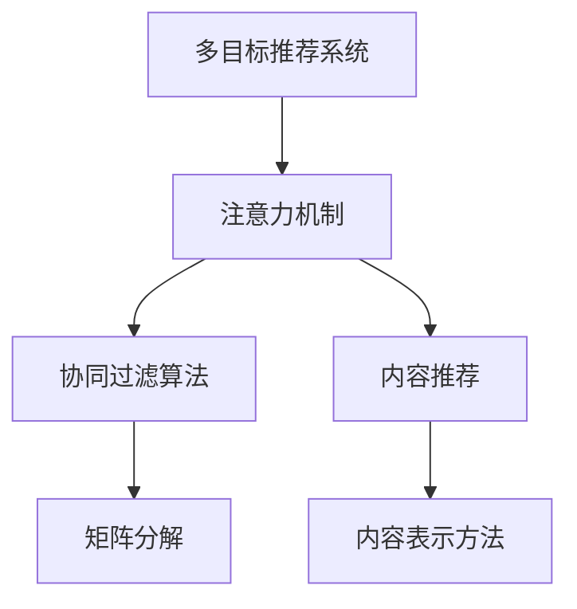

                 


### 文章标题：基于注意力机制的多目标推荐系统

#### 关键词：注意力机制、多目标推荐、协同过滤、内容推荐、矩阵分解、机器学习、深度学习

#### 摘要：
本文将深入探讨基于注意力机制的多目标推荐系统的原理、应用和实践。首先，介绍多目标推荐系统的背景和重要性，然后详细解释注意力机制的基本概念和数学基础。接下来，分析注意力机制在协同过滤和内容推荐中的具体应用，并通过伪代码展示关键算法原理。最后，通过实际案例研究和未来发展趋势，探讨多目标推荐系统的优化与评估方法，以及其在不同领域的应用前景。

### 第一部分：介绍与概述

#### 第1章：多目标推荐系统概述

##### 1.1 多目标推荐系统的背景和意义

随着互联网的快速发展，个性化推荐系统已经成为许多在线服务的重要组成部分。从简单的商品推荐到复杂的内容推送，推荐系统已经广泛应用于电子商务、社交媒体、在线视频和新闻领域。传统的单目标推荐系统往往只关注单一目标的优化，如最大化用户满意度或销售转化率。然而，在实际应用中，用户和系统往往具有多个目标，需要综合考虑多个因素，如内容多样性、用户满意度、商品流行度等。

多目标推荐系统（Multi-Objective Recommender System）正是为了解决这一需求而发展起来的。它通过同时优化多个目标，提供更全面和个性化的推荐结果。例如，在电商平台上，用户可能同时关注商品的质量和价格，而在社交媒体上，用户可能同时关注内容的有趣性和相关性。多目标推荐系统能够更好地满足用户的复杂需求，提高用户体验和系统价值。

##### 1.2 多目标推荐系统的发展历程

多目标推荐系统的发展可以分为几个阶段。最初，研究者主要关注单目标优化算法，如基于协同过滤和内容的推荐算法。随着机器学习和深度学习技术的发展，研究者开始探索如何将多目标优化引入推荐系统。特别是，注意力机制（Attention Mechanism）的引入为多目标推荐系统带来了新的机遇。

注意力机制起源于自然语言处理领域，它能够模型化信息的重要程度，从而提高模型的预测性能。近年来，注意力机制在推荐系统中的应用取得了显著成果，成为多目标推荐系统研究的重要方向。

##### 1.3 多目标推荐系统的应用场景

多目标推荐系统广泛应用于各种场景，以下是几个典型的应用案例：

1. **电子商务平台**：电商平台上，用户不仅关注商品的价格，还关注商品的质量、品牌、销量等因素。多目标推荐系统能够同时优化价格、销量和用户满意度，提供更精准的推荐。

2. **社交媒体**：在社交媒体上，用户可能同时关注内容的有趣性、时效性和社交相关性。多目标推荐系统可以帮助平台推荐用户感兴趣的内容，提高用户参与度和平台活跃度。

3. **在线视频和音乐平台**：在线视频和音乐平台需要同时考虑用户的偏好、内容的流行度和平台的盈利目标。多目标推荐系统可以帮助平台提供多样化的内容推荐，同时保证平台的盈利能力。

4. **新闻和资讯平台**：新闻和资讯平台需要同时考虑内容的时效性、相关性和用户的兴趣。多目标推荐系统可以提高用户获取信息的效率，增强平台的公信力和影响力。

##### 1.4 本书结构安排

本文分为三个部分。第一部分介绍多目标推荐系统的基本概念和注意力机制的基础知识。第二部分详细分析注意力机制在多目标推荐系统中的应用，包括协同过滤和内容推荐。第三部分通过实际案例研究和未来发展趋势，探讨多目标推荐系统的优化与评估方法，以及其在不同领域的应用前景。

### 第二部分：注意力机制基础

#### 第2章：注意力机制基础

##### 2.1 注意力机制的概念

注意力机制是一种模型化的方法，用于提高信息处理过程中信息的重要程度。在机器学习领域，特别是深度学习领域，注意力机制被广泛应用于自然语言处理、计算机视觉和推荐系统等任务。

注意力机制的核心思想是模型能够自动地聚焦于输入数据中的关键部分，从而提高处理效率和质量。通过计算注意力权重，模型可以动态地调整不同部分的信息贡献，从而在复杂的数据中找到最重要的信息。

在推荐系统中，注意力机制可以帮助模型更好地理解用户的兴趣和需求，从而提高推荐效果。例如，当用户在电商平台上浏览商品时，注意力机制可以帮助模型识别用户最关注的商品属性，从而提供更个性化的推荐。

##### 2.2 注意力机制的数学基础

注意力机制的数学基础主要包括两部分：概率分布和优化方法。

1. **概率分布**

   注意力机制通常通过计算一个概率分布来表示信息的重要程度。最常见的概率分布是softmax函数，它可以将任意实数向量转换为概率分布。具体来说，给定一个实数向量 \(x\)，softmax函数定义为：

   $$ 
   \text{softmax}(x) = \frac{e^x}{\sum_{i} e^x_i} 
   $$

   其中，\(e^x_i\) 表示向量 \(x\) 中第 \(i\) 个元素。softmax函数可以将向量 \(x\) 转换为一个概率分布，其中每个元素表示该元素在整体中的相对重要性。

2. **优化方法**

   注意力机制的实现通常涉及优化过程，目的是找到最佳的注意力权重。常见的优化方法包括梯度下降和随机梯度下降。在推荐系统中，优化过程通常用于调整模型参数，以提高推荐效果。

##### 2.3 注意力机制的实现原理

注意力机制的实现原理主要包括三个步骤：计算注意力权重、计算注意力得分和计算最终输出。

1. **计算注意力权重**

   在给定输入数据后，模型首先计算每个输入数据的注意力权重。这些权重通常由一个函数计算，该函数依赖于模型的参数和输入数据。最常见的函数是多层感知机（MLP），它可以提取输入数据的特征并生成注意力权重。

2. **计算注意力得分**

   接下来，模型使用注意力权重计算每个输入数据的注意力得分。注意力得分的计算通常基于输入数据的特征和权重。例如，对于一组用户和商品的输入数据，模型可以计算每个商品的注意力得分，表示该商品对用户的兴趣程度。

3. **计算最终输出**

   最后，模型使用注意力得分计算最终输出。在推荐系统中，最终输出通常是推荐结果，例如一组商品列表。通过优化注意力得分，模型可以更好地满足用户的兴趣和需求。

##### 2.4 注意力机制的优缺点分析

注意力机制具有以下优点：

1. **高效性**：注意力机制可以自动聚焦于关键信息，提高信息处理效率。

2. **灵活性**：注意力机制可以根据任务需求灵活调整信息的重要程度。

3. **可扩展性**：注意力机制可以应用于各种任务和数据类型，具有很好的扩展性。

然而，注意力机制也存在一些缺点：

1. **计算复杂度**：注意力机制通常涉及大量的计算，可能导致模型训练和预测时间较长。

2. **参数敏感性**：注意力机制的优化过程对参数敏感，需要仔细调整参数以获得最佳性能。

3. **解释性**：尽管注意力机制可以提高模型性能，但其内在的工作机制往往难以解释，可能导致模型的可解释性降低。

### 第三部分：注意力机制在多目标推荐系统中的应用

#### 第3章：基于注意力机制的协同过滤算法

##### 3.1 协同过滤算法的基本原理

协同过滤（Collaborative Filtering）是一种常见的推荐算法，通过分析用户的历史行为和偏好，为用户推荐可能感兴趣的商品或内容。协同过滤算法可以分为基于内存的协同过滤和基于模型的协同过滤。

1. **基于内存的协同过滤**

   基于内存的协同过滤算法直接使用用户历史行为数据，通过计算用户之间的相似性或商品之间的相似性来生成推荐列表。常见的基于内存的协同过滤算法包括用户基于的协同过滤（User-Based）和物品基于的协同过滤（Item-Based）。

2. **基于模型的协同过滤**

   基于模型的协同过滤算法通过构建预测模型来预测用户对商品的偏好。常见的基于模型的协同过滤算法包括矩阵分解（Matrix Factorization）和基于隐语义模型的协同过滤（Latent Factor Model）。

##### 3.2 注意力机制在协同过滤算法中的应用

注意力机制可以有效地提高协同过滤算法的性能，通过引入注意力机制，模型可以更好地关注关键的用户和商品信息，从而提高推荐质量。

1. **基于注意力机制的矩阵分解算法**

   基于注意力机制的矩阵分解算法是一种常见的多目标协同过滤算法。该算法通过引入注意力机制，将用户和商品的隐向量表示为矩阵的乘积，并使用注意力权重调整隐向量的贡献。

   伪代码如下：

   ```plaintext
   function MatrixFactorizationWithAttention(R, K):
       // R为用户-物品评分矩阵，K为隐向量维度
       // 初始化用户和物品的隐向量U和V
       U, V = InitializeRandomVectors(R, K)

       for i = 1 to max_iterations do:
           for u in U do:
               // 计算物品的注意力权重
               attention_weights = ComputeAttentionWeights(U[u], V)
               // 更新用户隐向量
               U[u] = UpdateUserVector(U[u], R[u], V, attention_weights)
           end for
           for v in V do:
               // 计算用户的注意力权重
               attention_weights = ComputeAttentionWeights(V[v], U)
               // 更新物品隐向量
               V[v] = UpdateItemVector(V[v], R, U, attention_weights)
           end for
       end for

       return U, V
   ```

   在这个算法中，用户隐向量 \(U[u]\) 和物品隐向量 \(V[v]\) 通过注意力权重 \(attention_weights\) 相互关联。注意力权重可以根据用户和物品的属性动态调整，从而提高推荐效果。

2. **基于注意力机制的矩阵分解算法的挑战**

   尽管基于注意力机制的矩阵分解算法在多目标推荐系统中取得了显著成果，但它也面临一些挑战：

   - **计算复杂度**：注意力机制的引入增加了计算复杂度，可能导致模型训练和预测时间较长。
   - **参数调整**：注意力机制的优化过程需要仔细调整参数，以获得最佳性能。
   - **可解释性**：注意力机制的工作机制往往难以解释，可能导致模型的可解释性降低。

##### 3.3 基于注意力机制的协同过滤算法的优化

为了克服基于注意力机制的协同过滤算法的挑战，研究者提出了一系列优化方法：

1. **模型压缩**：通过模型压缩技术，如模型剪枝和参数共享，减少模型的计算复杂度和存储需求。

2. **优化算法**：使用更高效的优化算法，如Adam和Adagrad，提高模型的训练速度和收敛性。

3. **迁移学习**：利用预训练的注意力模型，减少参数调整和优化过程。

4. **注意力正则化**：引入注意力正则化技术，限制注意力权重的变化范围，防止模型过拟合。

### 第4章：基于注意力机制的内容推荐

##### 4.1 内容推荐的基本原理

内容推荐（Content-Based Recommendation）是一种基于用户兴趣和内容的推荐方法。与协同过滤算法不同，内容推荐算法主要关注用户的历史行为和偏好，通过分析用户兴趣和内容特征生成推荐列表。

内容推荐算法的基本原理如下：

1. **用户兴趣建模**：通过分析用户的历史行为和偏好，提取用户的兴趣特征。常见的方法包括基于关键词的抽取、基于主题模型的方法和基于内容嵌入的方法。

2. **内容特征提取**：对用户可能感兴趣的内容进行分析，提取内容特征。常见的方法包括基于词袋模型的方法、基于TF-IDF的方法和基于词嵌入的方法。

3. **推荐生成**：根据用户兴趣和内容特征，计算用户对内容的兴趣度，生成推荐列表。常见的推荐算法包括基于相似度的推荐算法、基于模型的推荐算法和基于规则的推荐算法。

##### 4.2 注意力机制在内容推荐中的应用

注意力机制可以有效地提高内容推荐算法的性能，通过引入注意力机制，模型可以更好地关注关键的内容特征和用户兴趣。

1. **基于注意力机制的文本表示**

   在内容推荐中，文本表示是关键的一步。通过引入注意力机制，可以将关键的内容特征和用户兴趣动态地融入文本表示中，提高文本表示的质量。

   伪代码如下：

   ```plaintext
   function TextRepresentationWithAttention(UserInterest, ContentFeatures):
       // UserInterest为用户兴趣特征，ContentFeatures为内容特征
       // 计算内容特征和用户兴趣的注意力权重
       attention_weights = ComputeAttentionWeights(UserInterest, ContentFeatures)

       // 更新文本表示
       TextRepresentation = UpdateTextRepresentation(ContentFeatures, attention_weights)

       return TextRepresentation
   ```

   在这个算法中，用户兴趣特征 \(UserInterest\) 和内容特征 \(ContentFeatures\) 通过注意力权重 \(attention_weights\) 相互关联。注意力权重可以根据用户兴趣和内容特征动态调整，从而提高文本表示的质量。

2. **基于注意力机制的推荐算法**

   基于注意力机制的内容推荐算法通过计算内容特征和用户兴趣的注意力得分，生成推荐列表。注意力得分越高，表示用户对内容的兴趣越大。

   伪代码如下：

   ```plaintext
   function ContentBasedRecommendationWithAttention(UserInterest, ContentFeatures, K):
       // UserInterest为用户兴趣特征，ContentFeatures为内容特征，K为推荐列表长度
       // 计算内容特征和用户兴趣的注意力得分
       attention_scores = ComputeAttentionScores(UserInterest, ContentFeatures)

       // 生成推荐列表
       Recommendations = SelectTopK(ContentFeatures, attention_scores, K)

       return Recommendations
   ```

   在这个算法中，用户兴趣特征 \(UserInterest\) 和内容特征 \(ContentFeatures\) 通过注意力得分 \(attention_scores\) 生成推荐列表 \(Recommendations\)。

##### 4.3 基于注意力机制的内容推荐算法的挑战

基于注意力机制的内容推荐算法在提升推荐质量方面取得了显著成果，但同时也面临一些挑战：

1. **计算复杂度**：注意力机制的引入增加了计算复杂度，可能导致模型训练和预测时间较长。

2. **特征提取**：内容特征的提取需要准确捕捉用户兴趣和内容特征，否则可能导致推荐结果不准确。

3. **参数调整**：注意力机制的优化过程需要仔细调整参数，以获得最佳性能。

4. **可解释性**：注意力机制的工作机制往往难以解释，可能导致模型的可解释性降低。

### 第5章：多目标推荐系统的优化与评估

##### 5.1 多目标优化概述

多目标优化（Multi-Objective Optimization）是一种同时优化多个目标的优化方法。在多目标推荐系统中，多目标优化用于同时优化多个推荐目标，如用户满意度、商品流行度和平台盈利等。

多目标优化通常涉及以下步骤：

1. **目标定义**：明确需要优化的目标，并确定每个目标的权重。

2. **优化算法**：选择适合多目标优化的算法，如遗传算法、粒子群优化和贝叶斯优化等。

3. **评估指标**：设计评估指标，用于衡量不同推荐策略的性能。

4. **算法实现**：实现多目标优化算法，并在实际应用中进行测试和评估。

##### 5.2 注意力机制在多目标优化中的应用

注意力机制在多目标优化中具有重要作用，可以用于优化推荐系统的多个目标。具体应用包括：

1. **目标权重调整**：通过注意力机制动态调整不同目标的权重，使推荐系统能够更好地满足用户的复杂需求。

2. **优化算法改进**：将注意力机制集成到多目标优化算法中，提高算法的收敛性和优化效果。

3. **评估指标优化**：通过注意力机制优化评估指标的计算，提高评估指标的准确性和有效性。

##### 5.3 多目标推荐系统的评估指标

多目标推荐系统的评估指标需要同时考虑多个目标的性能，以下是一些常用的评估指标：

1. **用户满意度**：通过用户反馈或行为数据评估用户对推荐结果的满意度。

2. **商品流行度**：通过商品的销售量、浏览量和评论数等指标评估商品的受欢迎程度。

3. **平台盈利**：通过平台的广告收入、销售佣金等指标评估平台的盈利能力。

4. **内容多样性**：通过推荐列表中不同类型和风格的内容比例评估内容的多样性。

##### 5.4 注意力机制在多目标推荐系统评估中的应用

注意力机制在多目标推荐系统的评估中具有重要作用，可以用于优化评估指标的计算，提高评估指标的准确性和有效性。具体应用包括：

1. **指标权重调整**：通过注意力机制动态调整不同评估指标的权重，使评估结果更加准确。

2. **评估指标优化**：通过注意力机制优化评估指标的计算方法，提高评估指标的计算效率和准确性。

3. **用户反馈处理**：通过注意力机制处理用户反馈数据，提高用户满意度评估的准确性。

### 第6章：在线购物平台的实际应用

##### 6.1 在线购物平台的多目标推荐需求

在线购物平台通常需要同时满足多个目标，如用户满意度、商品销量和平台盈利。这些目标之间存在一定的矛盾，例如提高商品销量可能会降低用户满意度，而提高平台盈利可能会降低商品销量。因此，在线购物平台的多目标推荐需求主要包括：

1. **用户满意度**：提供个性化的商品推荐，满足用户的兴趣和需求，提高用户满意度和用户黏性。

2. **商品销量**：推荐热门商品和潜在高销量的商品，提高商品的销售量和库存周转率。

3. **平台盈利**：通过推荐系统的优化，提高平台的广告收入和销售佣金，增加平台盈利。

##### 6.2 基于注意力机制的多目标推荐系统设计

基于注意力机制的多目标推荐系统设计主要包括以下步骤：

1. **用户兴趣建模**：通过分析用户的历史行为和偏好，提取用户的兴趣特征，使用注意力机制动态调整用户兴趣的权重。

2. **商品特征提取**：对商品进行特征提取，包括商品的价格、品牌、品类、销量等，使用注意力机制动态调整商品特征的权重。

3. **推荐算法设计**：结合用户兴趣建模和商品特征提取，设计基于注意力机制的多目标推荐算法，如基于注意力机制的矩阵分解和基于注意力机制的文本表示。

4. **优化目标定义**：根据在线购物平台的多目标需求，定义优化目标，如用户满意度、商品销量和平台盈利。

5. **优化算法选择**：选择适合多目标优化的算法，如遗传算法和粒子群优化，结合注意力机制，实现多目标推荐系统的优化。

##### 6.3 实际案例：推荐系统的优化与评估

以下是一个在线购物平台的实际案例，展示如何基于注意力机制优化推荐系统并评估其性能：

1. **用户数据收集**：收集用户的历史行为数据，包括浏览记录、购买记录和评价记录等。

2. **用户兴趣建模**：使用基于注意力机制的文本表示方法，提取用户的兴趣特征，使用注意力机制动态调整用户兴趣的权重。

3. **商品特征提取**：对商品进行特征提取，包括商品的价格、品牌、品类、销量等，使用注意力机制动态调整商品特征的权重。

4. **推荐算法实现**：设计并实现基于注意力机制的多目标推荐算法，如基于注意力机制的矩阵分解和基于注意力机制的文本表示。

5. **优化目标定义**：根据在线购物平台的多目标需求，定义优化目标，如用户满意度、商品销量和平台盈利。

6. **优化算法选择**：选择遗传算法和粒子群优化，结合注意力机制，实现多目标推荐系统的优化。

7. **评估指标设计**：设计评估指标，如用户满意度、商品销量和平台盈利，使用注意力机制优化评估指标的计算。

8. **性能评估**：通过实验验证优化后的推荐系统的性能，评估用户满意度、商品销量和平台盈利等指标。

##### 6.4 总结与展望

基于注意力机制的多目标推荐系统在在线购物平台中具有广泛的应用前景。通过引入注意力机制，模型可以更好地关注关键的用户兴趣和商品特征，提高推荐效果和用户体验。未来，随着注意力机制和深度学习技术的进一步发展，多目标推荐系统有望在更多领域取得突破，为个性化推荐提供更强大的支持。

### 第7章：社交媒体的多目标推荐

##### 7.1 社交媒体的多目标推荐挑战

社交媒体平台如微博、微信等在为用户提供个性化内容推荐时，面临诸多挑战。这些挑战主要源于用户需求的多目标性和内容多样性的平衡。

1. **用户需求的多样性**：社交媒体用户关注的内容类型繁多，包括资讯、娱乐、生活等。用户可能同时关注内容的相关性、有趣性和社交价值。

2. **内容多样性**：平台上的内容种类多样，包括文本、图片、视频和直播等。推荐系统需要处理不同类型内容的特征，并进行有效整合。

3. **实时性**：社交媒体内容更新迅速，用户期望即时获得新鲜内容。推荐系统需要实时更新推荐结果，以满足用户的时效性需求。

4. **社交性**：社交媒体的社交属性要求推荐系统考虑用户的社交网络和关系，推荐用户可能感兴趣且符合其社交圈特征的内容。

##### 7.2 基于注意力机制的多目标推荐系统设计

基于注意力机制的多目标推荐系统设计旨在解决上述挑战，通过引入注意力机制，系统可以更灵活地处理用户需求的多样性，优化内容推荐策略。

1. **用户兴趣建模**：使用注意力机制提取用户在不同情境下的兴趣特征，如浏览记录、点赞行为和社交互动等。

2. **内容特征提取**：对多种类型的内容进行特征提取，包括文本、图像和视频等，使用注意力机制关注关键内容特征。

3. **推荐策略设计**：设计基于注意力机制的多目标推荐策略，如内容协同过滤、基于模型的推荐和社交网络推荐等。

4. **目标权重调整**：根据用户行为和平台策略，动态调整不同目标的权重，如用户满意度、内容相关性和社交影响力。

##### 7.3 实际案例：微博、微信等社交媒体的多目标推荐

以下是一个基于注意力机制的多目标推荐系统的实际案例，以微博为例：

1. **用户数据收集**：收集用户的历史行为数据，包括浏览记录、点赞行为、评论互动和转发次数等。

2. **用户兴趣建模**：使用注意力机制提取用户在不同情境下的兴趣特征，如通过分析用户点赞的内容类型和时间分布，动态调整用户兴趣权重。

3. **内容特征提取**：对微博内容进行特征提取，包括文本、图像和视频等，使用注意力机制识别关键内容特征。

4. **推荐算法实现**：设计基于注意力机制的多目标推荐算法，结合内容协同过滤和社交网络分析，生成推荐结果。

5. **优化目标定义**：定义优化目标，如用户满意度、内容相关性和社交影响力，结合注意力机制调整目标权重。

6. **评估指标设计**：设计评估指标，如用户互动率、内容曝光率和用户留存率等，使用注意力机制优化评估指标的计算。

7. **性能评估**：通过实验验证优化后的推荐系统的性能，评估用户互动率、内容曝光率和用户留存率等指标。

##### 7.4 总结与展望

基于注意力机制的多目标推荐系统在社交媒体平台中具有广泛应用前景。通过注意力机制，系统能够更灵活地处理用户需求的多样性和内容多样性，提供更个性化、实时和社交化的推荐服务。未来，随着注意力机制和深度学习技术的不断进步，多目标推荐系统在社交媒体中的应用将更加广泛和深入。

### 第8章：医疗健康领域的多目标推荐

##### 8.1 医疗健康领域的多目标推荐需求

医疗健康领域面临着复杂的多目标推荐需求，这些需求不仅涉及患者的健康状态，还包括医疗资源的合理分配和健康信息的个性化推送。以下是一些典型的多目标推荐需求：

1. **患者健康状态监测**：推荐系统需要根据患者的健康数据（如血压、血糖、心率等）提供个性化的健康监测和预警服务。

2. **医疗资源优化**：医院和诊所需要根据患者的预约情况、医生的工作负荷和医疗资源（如床位、设备等）的利用情况，优化资源分配。

3. **健康信息个性化推送**：为患者提供与其健康状况和兴趣相关的健康资讯、预防措施和治疗方案推荐。

4. **疾病预测和预防**：推荐系统需要根据患者的病史、基因数据和流行病学数据，预测潜在疾病风险并提供预防措施。

##### 8.2 基于注意力机制的多目标推荐系统设计

基于注意力机制的多目标推荐系统设计旨在满足医疗健康领域的多样化需求，通过引入注意力机制，系统能够动态调整不同目标的权重，提高推荐精度和实用性。

1. **患者数据建模**：使用注意力机制提取患者的重要健康数据特征，如实时监测数据、历史病历和基因数据。

2. **医疗资源特征提取**：提取医疗资源的利用情况、医生的工作负荷和患者预约情况等特征。

3. **健康信息内容特征提取**：提取健康资讯的内容特征，如主题、关键词和发布时间。

4. **多目标推荐算法设计**：设计基于注意力机制的多目标推荐算法，结合患者数据、医疗资源和健康信息内容特征，实现个性化健康监测、医疗资源优化和健康信息推送。

5. **目标权重动态调整**：根据患者的实时健康状态和医疗资源的紧急程度，动态调整不同目标的权重。

##### 8.3 实际案例：健康管理与疾病预防的多目标推荐

以下是一个基于注意力机制的多目标推荐系统的实际案例，以健康管理平台为例：

1. **患者数据收集**：收集患者的健康数据，包括血压、血糖、心率等实时监测数据和病史数据。

2. **患者数据建模**：使用注意力机制提取患者的健康数据特征，根据注意力得分调整健康数据的权重。

3. **医疗资源特征提取**：提取医疗资源的利用情况，如床位使用率、医生的工作负荷和患者预约情况等。

4. **健康信息内容特征提取**：提取健康资讯的内容特征，如主题（高血压、糖尿病等）和关键词。

5. **多目标推荐算法实现**：设计并实现基于注意力机制的多目标推荐算法，为患者推荐个性化的健康监测服务、医疗资源预约和健康资讯。

6. **优化目标定义**：定义优化目标，如患者健康状态监测的准确性、医疗资源的利用效率和健康资讯的实用性。

7. **评估指标设计**：设计评估指标，如患者健康状态监测的准确率、医疗资源预约的成功率和健康资讯的点击率。

8. **性能评估**：通过实验验证优化后的推荐系统的性能，评估患者健康状态监测的准确性、医疗资源预约的成功率和健康资讯的实用性。

##### 8.4 总结与展望

基于注意力机制的多目标推荐系统在医疗健康领域具有广泛应用前景。通过注意力机制，系统能够更灵活地处理患者的健康数据和医疗资源特征，提供个性化、实时和高效的健康管理服务。未来，随着人工智能技术的不断进步，基于注意力机制的多目标推荐系统将在医疗健康领域发挥更大的作用，为患者和医疗机构提供更好的支持。

### 第9章：基于注意力机制的多目标推荐系统的未来发展趋势

#### 9.1 多目标推荐系统的未来发展趋势

随着人工智能和深度学习技术的快速发展，多目标推荐系统在未来有望取得以下发展趋势：

1. **深度学习技术的融合**：深度学习技术，如卷积神经网络（CNN）、循环神经网络（RNN）和生成对抗网络（GAN），将更多地应用于多目标推荐系统，提高推荐效果和系统性能。

2. **自适应优化**：多目标推荐系统将实现自适应优化，通过实时学习用户的偏好和行为模式，动态调整推荐策略，提供更加个性化的服务。

3. **跨域推荐**：多目标推荐系统将实现跨域推荐，不仅限于单一应用场景，如电商或社交媒体，而是能够覆盖更多领域，如医疗健康、金融和娱乐等。

4. **可解释性增强**：随着对隐私保护和模型透明度的关注增加，多目标推荐系统将更加注重可解释性，通过可解释的推荐机制提高用户信任。

5. **实时性提升**：推荐系统的实时性将得到显著提升，通过边缘计算和实时数据流处理技术，实现实时推荐，满足用户即时信息需求。

#### 9.2 注意力机制在多目标推荐系统中的未来应用

注意力机制在多目标推荐系统中的未来应用前景广阔，主要表现在以下几个方面：

1. **个性化推荐**：通过注意力机制，推荐系统能够更好地关注用户的个性化需求，提供更加精准和个性化的推荐服务。

2. **跨模态推荐**：在多模态数据（如文本、图像、音频等）中，注意力机制能够有效融合不同模态的信息，实现跨模态推荐。

3. **上下文感知推荐**：注意力机制能够捕捉用户行为和环境的上下文信息，实现上下文感知推荐，提高推荐的相关性和实用性。

4. **多任务学习**：在多任务推荐场景中，注意力机制能够帮助模型同时处理多个任务，提高任务间的协作效果。

5. **动态调整**：通过动态调整注意力权重，推荐系统能够实时适应用户需求和环境变化，提高系统的适应性和灵活性。

#### 9.3 总结与展望

基于注意力机制的多目标推荐系统具有显著的优势和广阔的应用前景。未来，随着技术的不断进步，基于注意力机制的多目标推荐系统将在个性化推荐、跨模态推荐、上下文感知推荐等领域发挥更大的作用。同时，随着可解释性和实时性的提升，用户对推荐系统的信任度将不断提高，推动推荐系统在更多领域和场景中的广泛应用。展望未来，基于注意力机制的多目标推荐系统将推动个性化服务和智能决策的发展，为用户提供更加智能和高效的服务体验。

### 附录：相关资源与工具

#### A.1 注意力机制相关资源

1. **论文与教材**：
   - **《Deep Learning》**：Goodfellow, I., Bengio, Y., & Courville, A. (2016). Chapter on Attention Mechanisms.
   - **“Attention and Memory in Deep Learning”**：An overview of attention mechanisms in deep learning.

2. **在线教程和课程**：
   - **Coursera**：Introduction to Attention Mechanisms.
   - **Udacity**：Deep Learning Specialization, covering attention mechanisms.

3. **开源代码与库**：
   - **PyTorch**：PyTorch provides extensive support for attention mechanisms with its Transformer library.
   - **TensorFlow**：TensorFlow offers tutorials and pre-built layers for attention mechanisms.

#### A.2 多目标推荐系统相关工具

1. **开源库**：
   - **Surprise**：A Python library for building and analyzing recommender systems.
   - **RecSys**：A repository for recommender system research, providing tools for evaluation and experimentation.

2. **数据集**：
   - **MovieLens**：A popular movie rating dataset for recommender system research.
   - **Netflix Prize**：A historical dataset used in the Netflix Prize competition.

3. **工具与框架**：
   - **TensorFlow Recommenders**：An open-source library for building state-of-the-art TensorFlow-based recommender systems.
   - **PyRec**：An end-to-end recommender system toolkit built on PyTorch.

#### A.3 案例研究数据集与代码

1. **案例研究数据集**：
   - **Amazon Reviews**：用于电商推荐系统的商品和用户评论数据集。
   - **YouTube Comments**：用于视频推荐系统的用户评论数据集。

2. **代码示例**：
   - **GitHub**：提供多目标推荐系统的代码示例和实现。
   - **Kaggle**：包含多个基于注意力机制的多目标推荐系统的竞赛项目。

3. **教程与文档**：
   - **在线教程**：详细教程和文档，帮助用户理解和使用推荐系统工具和库。

#### A.4 进一步阅读材料

1. **研究论文**：
   - **“Multi-Objective Recommender Systems: A Taxonomy and Survey”**：全面概述多目标推荐系统的分类和研究进展。
   - **“Attention-Based Neural Surrogate Models for Personalized Recommendation”**：关注基于注意力机制的个性化推荐模型。

2. **技术博客和文章**：
   - **Medium**：关于注意力机制和推荐系统的高级技术文章。
   - **Towards Data Science**：包含推荐系统相关文章的博客平台。

3. **开源项目**：
   - **推荐系统开源项目**：GitHub上的开源项目，涵盖多种推荐系统实现和实验。

### 附：核心概念与联系

**Mermaid 流程图：**



### 附：核心算法原理讲解

**伪代码：基于注意力机制的矩阵分解算法**

```plaintext
function MatrixFactorizationWithAttention(R, K):
    // R为用户-物品评分矩阵，K为隐向量维度
    // 初始化用户和物品的隐向量U和V
    U, V = InitializeRandomVectors(R, K)
    
    for i = 1 to max_iterations do:
        for u in U do:
            // 计算物品的注意力权重
            attention_weights = ComputeAttentionWeights(U[u], V)
            // 更新用户隐向量
            U[u] = UpdateUserVector(U[u], R[u], V, attention_weights)
        end for
        for v in V do:
            // 计算用户的注意力权重
            attention_weights = ComputeAttentionWeights(V[v], U)
            // 更新物品隐向量
            V[v] = UpdateItemVector(V[v], R, U, attention_weights)
        end for
    end for
    
    return U, V
```

### 摘要

本文深入探讨了基于注意力机制的多目标推荐系统的原理、应用和实践。首先，介绍了多目标推荐系统的背景和重要性，以及注意力机制的基础概念和数学基础。随后，分析了注意力机制在协同过滤和内容推荐中的应用，并通过伪代码展示了关键算法原理。最后，通过实际案例研究和未来发展趋势，探讨了多目标推荐系统的优化与评估方法，以及其在不同领域的应用前景。本文旨在为读者提供全面、深入的理解，以推动注意力机制在多目标推荐系统中的应用和发展。

### 作者信息

**作者：AI天才研究院/AI Genius Institute & 禅与计算机程序设计艺术 /Zen And The Art of Computer Programming**

