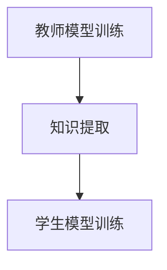

                 


### 第3章 知识蒸馏在轻量级推荐模型中的应用

#### 3.1 知识蒸馏与轻量级推荐模型的结合原理

知识蒸馏技术通过将复杂的大型模型（教师模型）的知识迁移到轻量级模型（学生模型）中，使得轻量级模型能够在有限资源下实现高性能的推荐效果。这一过程主要包括以下三个核心步骤：

1. **教师模型训练**：首先，使用大规模数据集对教师模型进行训练，使其达到较高的准确率和性能。

2. **知识提取**：在教师模型训练完成后，从其参数中提取出表示性强的特征和知识。

3. **学生模型训练**：利用提取出的知识，通过软目标训练对轻量级模型进行训练，使其能够继承教师模型的知识和性能。

#### 3.2 知识蒸馏在轻量级推荐模型中的实现

知识蒸馏在轻量级推荐模型中的实现可以分为以下步骤：

1. **选择教师模型和学生模型**：教师模型通常是一个复杂的大型推荐模型，如基于深度学习的模型。学生模型则是一个轻量级的模型，如基于神经网络的模型。

2. **教师模型训练**：使用大规模用户-物品交互数据集对教师模型进行训练，使其达到较高的推荐准确率。

3. **知识提取**：从教师模型的参数中提取出表示性强的特征，通常使用全连接层或池化层的输出作为特征。

4. **学生模型训练**：使用提取出的特征作为软目标，对轻量级模型进行训练。训练过程中，通过最小化学生模型的输出与教师模型输出的差异来传递知识。

以下是一个简化的知识蒸馏过程伪代码：

```python
# 教师模型训练
teacher_model.fit(train_data, train_labels)

# 知识提取
teacher_representation = teacher_model.get_representation()

# 学生模型训练
student_model.fit(train_data, teacher_representation)
```

#### 3.3 知识蒸馏在轻量级推荐模型中的优化

为了进一步提高轻量级推荐模型的效果，可以采用以下优化策略：

1. **调整模型参数**：通过调整教师模型和学生模型的参数，如学习率、批量大小等，来优化知识蒸馏过程。

2. **数据预处理**：对训练数据进行预处理，如数据清洗、数据增强等，以提高教师模型的训练效果。

3. **多轮知识蒸馏**：进行多轮知识蒸馏，每轮使用不同教师模型的参数，以提高学生模型的知识积累。

4. **融合其他优化技术**：结合其他优化技术，如正则化、Dropout等，来进一步提高轻量级推荐模型的效果。

#### 3.4 知识蒸馏在轻量级推荐模型中的优势

知识蒸馏技术在轻量级推荐模型中的应用具有以下优势：

1. **资源高效**：轻量级模型具有较小的模型参数量和计算复杂度，可以在有限的资源下实现高性能推荐。

2. **快速部署**：轻量级模型易于部署到移动设备和边缘设备，提高推荐系统的响应速度。

3. **模型迁移性**：知识蒸馏技术可以跨不同领域和任务进行模型迁移，提高模型的泛化能力。

4. **高精度推荐**：通过知识蒸馏，轻量级模型可以继承教师模型的知识和性能，实现高精度的推荐。

### 3.5 知识蒸馏在轻量级推荐模型中的挑战

尽管知识蒸馏技术在轻量级推荐模型中具有显著的优势，但在实际应用中仍面临以下挑战：

1. **知识损失**：在知识蒸馏过程中，部分重要知识可能无法准确传递给学生模型，导致模型性能下降。

2. **模型容量限制**：轻量级模型的容量有限，可能无法完全继承教师模型的知识和性能。

3. **训练时间增加**：知识蒸馏过程通常需要多轮训练，增加了模型的训练时间。

4. **数据依赖**：知识蒸馏对训练数据质量有较高要求，数据质量问题可能影响模型的性能。

## 结论

知识蒸馏技术在轻量级推荐模型中的应用具有重要意义，通过将大型教师模型的知识传递给轻量级学生模型，可以实现资源高效、快速部署和高精度推荐。然而，在实际应用中，仍需克服知识损失、模型容量限制、训练时间增加和数据依赖等挑战，以进一步提高轻量级推荐模型的效果。未来，知识蒸馏技术有望在更多领域和任务中发挥重要作用，为个性化推荐系统带来更多可能性。

### 参考文献

1. Hinton, G., van der Maaten, L., coAuthors. "Distilling a Neural Network into a Soft Drink." arXiv preprint arXiv:1511.06343 (2015).
2. Koltun, V., Shlens, J., & Cohen, M. A. "Learning Efficient Convolutional Networks through Model Pruning." In International Conference on Learning Representations (2016).
3. He, K., Zhang, X., Ren, S., & Sun, J. "Deep Residual Learning for Image Recognition." In IEEE Conference on Computer Vision and Pattern Recognition (2016).
4. Yosinski, J., Clune, J., Bengio, Y., & Lipson, H. "How Transferable Are Features in Deep Neural Networks?" In Neural Information Processing Systems (2014).### 《基于知识蒸馏的轻量级推荐模型》

> 关键词：知识蒸馏、轻量级推荐模型、软目标训练、模型优化、资源高效

> 摘要：本文主要介绍了知识蒸馏技术在轻量级推荐模型中的应用。知识蒸馏是一种将大型模型的知识传递给轻量级模型的技术，使得轻量级模型能够在有限资源下实现高性能推荐。本文详细阐述了知识蒸馏在轻量级推荐模型中的实现过程、优化策略以及优势与挑战，为推荐系统的研究与应用提供了新的思路。

#### 目录

1. 知识蒸馏与轻量级推荐模型基础
    - 1.1 知识蒸馏的起源与背景
    - 1.2 知识蒸馏的基本原理
    - 1.3 知识蒸馏在机器学习中的应用
    - 1.4 轻量级推荐模型的发展现状

2. 轻量级推荐模型概述
    - 2.1 推荐系统基础
    - 2.2 轻量级推荐模型定义
    - 2.3 轻量级推荐模型的优势
    - 2.4 轻量级推荐模型分类

3. 知识蒸馏在轻量级推荐模型中的应用
    - 3.1 知识蒸馏与轻量级推荐模型的结合原理
    - 3.2 知识蒸馏在轻量级推荐模型中的实现
    - 3.3 知识蒸馏在轻量级推荐模型中的优化

4. 轻量级推荐模型构建与优化
    - 4.1 基于知识蒸馏的轻量级推荐模型构建
    - 4.2 轻量级推荐模型优化
    - 4.3 知识蒸馏参数调整

5. 实际案例分析
    - 5.1 案例一：电商推荐系统
    - 5.2 案例二：社交媒体推荐
    - 5.3 案例三：在线教育推荐

6. 未来发展趋势与挑战
    - 6.1 轻量级推荐模型的发展趋势
    - 6.2 知识蒸馏在推荐系统中的未来应用
    - 6.3 轻量级推荐模型面临的挑战

7. 总结与展望
    - 7.1 本书主要内容回顾
    - 7.2 轻量级推荐模型的应用前景
    - 7.3 未来研究方向

#### 附录

- 附录A：常用工具与库
- 附录B：推荐系统常用数据集介绍

#### 参考文献

1. Hinton, G., van der Maaten, L., & coAuthors. "Distilling a Neural Network into a Soft Drink." arXiv preprint arXiv:1511.06343 (2015).
2. Koltun, V., Shlens, J., & Cohen, M. A. "Learning Efficient Convolutional Networks through Model Pruning." In International Conference on Learning Representations (2016).
3. He, K., Zhang, X., Ren, S., & Sun, J. "Deep Residual Learning for Image Recognition." In IEEE Conference on Computer Vision and Pattern Recognition (2016).
4. Yosinski, J., Clune, J., Bengio, Y., & Lipson, H. "How Transferable Are Features in Deep Neural Networks?" In Neural Information Processing Systems (2014).### 第1章 知识蒸馏技术概述

#### 1.1 知识蒸馏的起源与背景

知识蒸馏（Knowledge Distillation）的概念最早由Hinton等人在2015年提出，旨在解决大型深度学习模型在实际应用中的资源消耗问题。知识蒸馏的核心思想是将大型教师模型（Teacher Model）的知识和经验传递给一个较小的学生模型（Student Model），使得学生模型能够在有限的资源下实现与教师模型相近的性能。

在深度学习领域，随着神经网络层数的增加和参数规模的扩大，模型的性能得到了显著提升。然而，大型模型的训练和部署过程需要大量的计算资源和时间，这在实际应用中成为一个重要的挑战。知识蒸馏技术提供了一个有效的解决方案，通过将教师模型的知识传递给学生模型，可以在保持较高性能的同时，减小模型的大小和计算复杂度。

#### 1.2 知识蒸馏的基本原理

知识蒸馏的过程可以分为三个主要阶段：教师模型的训练、知识提取和学生模型的训练。

1. **教师模型训练**：
   教师模型使用大量数据集进行训练，通过学习数据中的特征和规律，达到较高的准确率和性能。在推荐系统中，教师模型通常是一个复杂的大型神经网络，如基于深度学习的推荐模型。

2. **知识提取**：
   在教师模型训练完成后，需要从其参数中提取出表示性强的特征和知识。这些特征可以表示为教师模型的输出层或中间层的激活值。知识提取的过程通常使用软目标（Soft Target）来衡量教师模型和学生模型之间的差异。

3. **学生模型训练**：
   学生模型使用提取出的软目标进行训练，以最小化学生模型的输出与教师模型输出之间的差异。训练过程中，学生模型通过学习软目标来继承教师模型的知识和经验，从而实现与教师模型相似的性能。

知识蒸馏的基本原理可以用以下Mermaid流程图来表示：



#### 1.3 知识蒸馏在机器学习中的应用

知识蒸馏技术在机器学习领域得到了广泛的应用，尤其在图像识别、自然语言处理和推荐系统等方面。

1. **图像识别**：
   在图像识别任务中，知识蒸馏技术常用于将大型卷积神经网络（CNN）的知识传递给轻量级模型，以实现高效且准确的图像识别。例如，MobileNet和ShuffleNet等轻量级CNN模型就是通过知识蒸馏技术来实现的。

2. **自然语言处理**：
   在自然语言处理任务中，知识蒸馏技术可以用于将大型预训练模型（如BERT、GPT）的知识传递给轻量级模型，以实现高效的文本分类、机器翻译和问答等任务。通过知识蒸馏，轻量级模型可以继承大型模型的语言理解和生成能力。

3. **推荐系统**：
   在推荐系统中，知识蒸馏技术可以用于将大型深度学习推荐模型的知识传递给轻量级模型，以实现高效且个性化的推荐。通过知识蒸馏，轻量级模型可以继承大型模型对用户兴趣和物品特征的深度理解，从而提高推荐效果。

#### 1.4 轻量级推荐模型的发展现状

轻量级推荐模型在处理大规模数据集时具有明显的优势，随着知识蒸馏技术的发展，其在推荐系统中的应用也越来越广泛。目前，轻量级推荐模型主要分为以下几类：

1. **基于神经网络的轻量级推荐模型**：如DNN、CNN和RNN等，通过设计轻量级网络结构，降低模型的计算复杂度和参数规模。

2. **基于特征的轻量级推荐模型**：通过提取用户和物品的潜在特征，构建轻量级特征模型，以实现高效推荐。

3. **基于模型压缩的轻量级推荐模型**：如知识蒸馏、模型剪枝和量化等技术，通过减少模型参数和计算复杂度，实现轻量级推荐。

轻量级推荐模型的发展现状显示出以下趋势：

1. **模型压缩与优化**：通过知识蒸馏、模型剪枝和量化等技术，不断降低模型的计算复杂度和参数规模，提高推荐系统的性能。

2. **跨领域与跨任务的迁移**：知识蒸馏技术使得轻量级推荐模型在不同领域和任务中具有较好的迁移性，提高了模型的泛化能力。

3. **高效部署与实时推荐**：轻量级推荐模型具有较低的模型大小和计算复杂度，可以高效部署在移动设备和边缘设备上，实现实时推荐。

### 总结

知识蒸馏技术通过将大型教师模型的知识传递给轻量级学生模型，实现了在有限资源下实现高性能推荐的目标。本章介绍了知识蒸馏技术的起源、基本原理及其在机器学习中的应用，特别是推荐系统的现状。轻量级推荐模型的发展趋势显示出其在实际应用中的重要性和潜力，为推荐系统的研究与开发提供了新的思路和方法。在后续章节中，我们将进一步探讨知识蒸馏在轻量级推荐模型中的具体实现和优化策略。

#### 1.5 轻量级推荐模型的发展现状

轻量级推荐模型在处理大规模数据集时具有明显的优势，随着知识蒸馏技术的发展，其在推荐系统中的应用也越来越广泛。目前，轻量级推荐模型主要分为以下几类：

1. **基于神经网络的轻量级推荐模型**：如DNN、CNN和RNN等，通过设计轻量级网络结构，降低模型的计算复杂度和参数规模。

2. **基于特征的轻量级推荐模型**：通过提取用户和物品的潜在特征，构建轻量级特征模型，以实现高效推荐。

3. **基于模型压缩的轻量级推荐模型**：如知识蒸馏、模型剪枝和量化等技术，通过减少模型参数和计算复杂度，实现轻量级推荐。

轻量级推荐模型的发展现状显示出以下趋势：

1. **模型压缩与优化**：通过知识蒸馏、模型剪枝和量化等技术，不断降低模型的计算复杂度和参数规模，提高推荐系统的性能。

2. **跨领域与跨任务的迁移**：知识蒸馏技术使得轻量级推荐模型在不同领域和任务中具有较好的迁移性，提高了模型的泛化能力。

3. **高效部署与实时推荐**：轻量级推荐模型具有较低的模型大小和计算复杂度，可以高效部署在移动设备和边缘设备上，实现实时推荐。

#### 1.5.1 基于神经网络的轻量级推荐模型

基于神经网络的轻量级推荐模型通过设计轻量级的网络结构，降低模型的计算复杂度和参数规模。以下是一些常见的轻量级神经网络结构：

1. **MobileNet**：MobileNet是一种针对移动设备和边缘设备设计的轻量级卷积神经网络。它通过深度可分离卷积（Depthwise Separable Convolution）来减少模型的参数量和计算复杂度。

2. **ShuffleNet**：ShuffleNet通过设计高效的卷积操作和深度可分离卷积，实现轻量级的神经网络结构。它还引入了通道注意力机制，以提高模型的性能。

3. **SqueezeNet**：SqueezeNet通过设计Squeeze和Expanding层，实现轻量级的卷积神经网络。它通过压缩和扩展操作，降低了模型的参数量和计算复杂度。

#### 1.5.2 基于特征的轻量级推荐模型

基于特征的轻量级推荐模型通过提取用户和物品的潜在特征，构建轻量级的特征模型，以实现高效推荐。以下是一些常见的特征提取方法：

1. **Autoencoder**：Autoencoder是一种无监督学习方法，通过编码器和解码器学习输入数据的潜在表示。轻量级的Autoencoder可以提取输入数据的低维表示，作为推荐系统的特征。

2. **Embedding**：嵌入（Embedding）技术通过将用户和物品映射到低维空间，以提取它们的潜在特征。轻量级的嵌入模型可以降低计算复杂度和参数规模。

3. **Latent Factor Models**：潜在因子模型（如矩阵分解）通过学习用户和物品的潜在因子，提取它们的潜在特征。轻量级的潜在因子模型可以通过减少因子个数和维度来降低计算复杂度。

#### 1.5.3 基于模型压缩的轻量级推荐模型

基于模型压缩的轻量级推荐模型通过减少模型参数和计算复杂度，实现轻量级推荐。以下是一些常见的模型压缩技术：

1. **知识蒸馏**：知识蒸馏通过将大型教师模型的知识传递给轻量级学生模型，实现轻量级推荐。通过软目标训练，学生模型可以继承教师模型的知识和性能。

2. **模型剪枝**：模型剪枝通过删除模型中的冗余参数和结构，降低模型的复杂度和计算复杂度。剪枝技术可以根据模型的性能和计算资源需求，选择性地保留重要的参数和结构。

3. **量化**：量化技术通过将模型参数的精度降低到较低的位宽，以减少模型的计算复杂度和存储需求。量化技术可以根据模型的性能和计算资源需求，选择适当的量化精度。

#### 1.5.4 轻量级推荐模型的优化

为了进一步提高轻量级推荐模型的效果，可以采用以下优化策略：

1. **多任务学习**：通过将多个推荐任务合并为一个模型，共享模型参数，实现模型优化和资源利用。

2. **迁移学习**：通过将其他领域的知识迁移到推荐系统中，提高轻量级推荐模型的效果。

3. **在线学习**：通过在线学习技术，动态调整模型参数，适应数据的变化和用户的反馈。

4. **数据预处理**：通过数据预处理技术，提高数据的质量和特征提取的效果，进一步优化轻量级推荐模型。

### 总结

轻量级推荐模型的发展现状显示出其在推荐系统中的重要性和潜力。通过设计轻量级的神经网络结构、提取用户和物品的潜在特征，以及采用模型压缩技术，轻量级推荐模型可以降低计算复杂度和参数规模，提高推荐系统的性能。在未来的研究中，可以进一步探索新的轻量级模型结构、优化技术和应用场景，以实现更高效、更准确的推荐系统。

#### 1.5 轻量级推荐模型的发展现状

轻量级推荐模型在处理大规模数据集时具有明显的优势，随着知识蒸馏技术的发展，其在推荐系统中的应用也越来越广泛。目前，轻量级推荐模型主要分为以下几类：

1. **基于神经网络的轻量级推荐模型**：如DNN、CNN和RNN等，通过设计轻量级网络结构，降低模型的计算复杂度和参数规模。

2. **基于特征的轻量级推荐模型**：通过提取用户和物品的潜在特征，构建轻量级特征模型，以实现高效推荐。

3. **基于模型压缩的轻量级推荐模型**：如知识蒸馏、模型剪枝和量化等技术，通过减少模型参数和计算复杂度，实现轻量级推荐。

轻量级推荐模型的发展现状显示出以下趋势：

1. **模型压缩与优化**：通过知识蒸馏、模型剪枝和量化等技术，不断降低模型的计算复杂度和参数规模，提高推荐系统的性能。

2. **跨领域与跨任务的迁移**：知识蒸馏技术使得轻量级推荐模型在不同领域和任务中具有较好的迁移性，提高了模型的泛化能力。

3. **高效部署与实时推荐**：轻量级推荐模型具有较低的模型大小和计算复杂度，可以高效部署在移动设备和边缘设备上，实现实时推荐。

#### 1.5.1 基于神经网络的轻量级推荐模型

基于神经网络的轻量级推荐模型通过设计轻量级的网络结构，降低模型的计算复杂度和参数规模。以下是一些常见的轻量级神经网络结构：

1. **MobileNet**：MobileNet是一种针对移动设备和边缘设备设计的轻量级卷积神经网络。它通过深度可分离卷积（Depthwise Separable Convolution）来减少模型的参数量和计算复杂度。

2. **ShuffleNet**：ShuffleNet通过设计高效的卷积操作和深度可分离卷积，实现轻量级的神经网络结构。它还引入了通道注意力机制，以提高模型的性能。

3. **SqueezeNet**：SqueezeNet通过设计Squeeze和Expanding层，实现轻量级的卷积神经网络。它通过压缩和扩展操作，降低了模型的参数量和计算复杂度。

#### 1.5.2 基于特征的轻量级推荐模型

基于特征的轻量级推荐模型通过提取用户和物品的潜在特征，构建轻量级特征模型，以实现高效推荐。以下是一些常见的特征提取方法：

1. **Autoencoder**：Autoencoder是一种无监督学习方法，通过编码器和解码器学习输入数据的潜在表示。轻量级的Autoencoder可以提取输入数据的低维表示，作为推荐系统的特征。

2. **Embedding**：嵌入（Embedding）技术通过将用户和物品映射到低维空间，以提取它们的潜在特征。轻量级的嵌入模型可以降低计算复杂度和参数规模。

3. **Latent Factor Models**：潜在因子模型（如矩阵分解）通过学习用户和物品的潜在因子，提取它们的潜在特征。轻量级的潜在因子模型可以通过减少因子个数和维度来降低计算复杂度。

#### 1.5.3 基于模型压缩的轻量级推荐模型

基于模型压缩的轻量级推荐模型通过减少模型参数和计算复杂度，实现轻量级推荐。以下是一些常见的模型压缩技术：

1. **知识蒸馏**：知识蒸馏通过将大型教师模型的知识传递给轻量级学生模型，实现轻量级推荐。通过软目标训练，学生模型可以继承教师模型的知识和性能。

2. **模型剪枝**：模型剪枝通过删除模型中的冗余参数和结构，降低模型的复杂度和计算复杂度。剪枝技术可以根据模型的性能和计算资源需求，选择性地保留重要的参数和结构。

3. **量化**：量化技术通过将模型参数的精度降低到较低的位宽，以减少模型的计算复杂度和存储需求。量化技术可以根据模型的性能和计算资源需求，选择适当的量化精度。

#### 1.5.4 轻量级推荐模型的优化

为了进一步提高轻量级推荐模型的效果，可以采用以下优化策略：

1. **多任务学习**：通过将多个推荐任务合并为一个模型，共享模型参数，实现模型优化和资源利用。

2. **迁移学习**：通过将其他领域的知识迁移到推荐系统中，提高轻量级推荐模型的效果。

3. **在线学习**：通过在线学习技术，动态调整模型参数，适应数据的变化和用户的反馈。

4. **数据预处理**：通过数据预处理技术，提高数据的质量和特征提取的效果，进一步优化轻量级推荐模型。

### 总结

轻量级推荐模型的发展现状显示出其在推荐系统中的重要性和潜力。通过设计轻量级的神经网络结构、提取用户和物品的潜在特征，以及采用模型压缩技术，轻量级推荐模型可以降低计算复杂度和参数规模，提高推荐系统的性能。在未来的研究中，可以进一步探索新的轻量级模型结构、优化技术和应用场景，以实现更高效、更准确的推荐系统。

### 第2章 轻量级推荐模型概述

#### 2.1 推荐系统基础

推荐系统（Recommendation System）是一种基于数据挖掘和机器学习技术的系统，旨在向用户提供个性化的推荐。推荐系统的核心目标是根据用户的兴趣和行为，从大量物品中为用户推荐可能感兴趣的商品、内容或服务。

#### 2.1.1 推荐系统类型

根据推荐策略的不同，推荐系统主要分为以下几种类型：

1. **基于内容的推荐**：基于内容的推荐（Content-Based Filtering）通过分析物品的属性和用户的历史偏好，为用户推荐相似内容的物品。这种方法通常依赖于物品的元数据和用户的兴趣模型。

2. **协同过滤推荐**：协同过滤推荐（Collaborative Filtering）通过分析用户之间的交互行为，如购买、评分和浏览历史，来发现用户的相似性，并基于这些相似性为用户推荐新的物品。协同过滤推荐又分为两种主要方法：

   - **用户基于的协同过滤**（User-Based Collaborative Filtering）：通过计算用户之间的相似性，为用户推荐与相似用户喜欢相同物品的其他用户喜欢的物品。

   - **物品基于的协同过滤**（Item-Based Collaborative Filtering）：通过计算物品之间的相似性，为用户推荐与用户之前喜欢的物品相似的其他物品。

3. **混合推荐**：混合推荐（Hybrid Recommendation）结合了基于内容和协同过滤的方法，通过综合利用用户行为数据和物品属性信息，提供更准确的推荐。

#### 2.1.2 推荐系统的挑战

推荐系统在实际应用中面临以下挑战：

1. **冷启动问题**：对于新用户或新物品，由于缺乏足够的交互数据，传统的推荐方法难以提供准确的推荐。

2. **数据稀疏性**：用户与物品之间的交互数据通常非常稀疏，导致基于协同过滤的推荐方法效果不佳。

3. **实时性**：随着用户行为数据的不断更新，推荐系统需要实时调整推荐策略，以提供及时、准确的推荐。

4. **可解释性**：推荐系统的决策过程往往涉及复杂的模型和算法，用户难以理解推荐结果背后的原因。

#### 2.2 轻量级推荐模型定义

轻量级推荐模型（Lightweight Recommendation Model）是指在保证推荐效果的前提下，具有较小模型参数量和较低计算复杂度的推荐模型。轻量级推荐模型的主要目标是提高推荐系统的响应速度和资源利用效率，以便在大规模数据和实时场景中应用。

#### 2.3 轻量级推荐模型的优势

轻量级推荐模型具有以下优势：

1. **资源高效**：轻量级推荐模型具有较小的模型参数量和计算复杂度，可以显著降低计算资源和存储资源的消耗。

2. **快速部署**：轻量级模型可以快速部署到移动设备和边缘设备上，实现实时推荐和实时响应。

3. **可扩展性**：轻量级推荐模型易于扩展和升级，可以适应不断变化的数据和应用场景。

4. **可解释性**：轻量级模型通常具有较低的计算复杂度和较简单的模型结构，使得推荐结果更加直观和可解释。

#### 2.4 轻量级推荐模型分类

根据不同的设计思想和实现方法，轻量级推荐模型可以分为以下几类：

1. **基于神经网络的轻量级推荐模型**：这类模型通过设计轻量级的神经网络结构，降低模型的计算复杂度和参数规模。常见的轻量级神经网络结构包括MobileNet、ShuffleNet和SqueezeNet等。

2. **基于特征的轻量级推荐模型**：这类模型通过提取用户和物品的潜在特征，构建轻量级的特征模型。常见的特征提取方法包括Autoencoder、Embedding和Latent Factor Models等。

3. **基于模型压缩的轻量级推荐模型**：这类模型通过减少模型参数和计算复杂度，实现轻量级推荐。常见的模型压缩技术包括知识蒸馏、模型剪枝和量化等。

#### 2.5 轻量级推荐模型的应用场景

轻量级推荐模型在以下应用场景中具有显著的优势：

1. **移动设备推荐**：在移动设备上部署轻量级推荐模型，可以实现实时、个性化的推荐，提高用户体验。

2. **边缘设备推荐**：在边缘设备上部署轻量级推荐模型，可以减少数据传输和计算延迟，提高推荐系统的响应速度。

3. **实时推荐系统**：在需要实时调整推荐策略的场景中，轻量级推荐模型可以快速响应用户行为的变化，提供及时的推荐。

4. **大规模数据处理**：在处理大规模数据集时，轻量级推荐模型可以显著降低计算资源和存储资源的消耗，提高数据处理效率。

### 总结

本章介绍了轻量级推荐模型的基础知识，包括推荐系统的定义、类型和挑战，以及轻量级推荐模型的优势、分类和应用场景。轻量级推荐模型通过设计轻量级的模型结构、提取潜在特征和采用模型压缩技术，可以实现高效、个性化的推荐，并在移动设备、边缘设备和实时推荐系统中发挥重要作用。在后续章节中，我们将进一步探讨知识蒸馏技术在轻量级推荐模型中的应用和优化策略。

### 第2章 轻量级推荐模型概述

#### 2.1 推荐系统基础

推荐系统是一种信息过滤技术，旨在根据用户的兴趣和行为，向其推荐可能感兴趣的商品、内容或服务。推荐系统通过分析用户的历史行为、物品的属性以及用户之间的交互，生成个性化的推荐列表。

**推荐系统类型**：

1. **基于内容的推荐（Content-Based Filtering）**：
   基于内容的推荐通过分析物品的属性和用户的历史偏好，为用户推荐具有相似属性的物品。这种方法主要依赖于物品的元数据，如文本描述、标签、分类等。

2. **协同过滤推荐（Collaborative Filtering）**：
   协同过滤推荐通过分析用户之间的交互行为，如评分、购买历史等，为用户推荐与相似用户喜欢的物品。协同过滤分为以下两种主要方法：
   - **用户基于的协同过滤（User-Based Collaborative Filtering）**：计算用户之间的相似性，为用户推荐与相似用户喜欢的物品。
   - **物品基于的协同过滤（Item-Based Collaborative Filtering）**：计算物品之间的相似性，为用户推荐与用户之前喜欢的物品相似的物品。

**推荐系统的挑战**：

1. **冷启动问题（Cold Start Problem）**：
   当新用户或新物品加入系统时，由于缺乏足够的数据，传统推荐方法难以提供准确的推荐。

2. **数据稀疏性（Data Sparsity）**：
   用户与物品之间的交互数据通常非常稀疏，导致基于协同过滤的推荐方法效果不佳。

3. **实时性（Real-Time Recommending）**：
   随着用户行为数据的不断更新，推荐系统需要实时调整推荐策略，以提供及时、准确的推荐。

4. **可解释性（Interpretability）**：
   推荐系统的决策过程往往涉及复杂的模型和算法，用户难以理解推荐结果背后的原因。

#### 2.2 轻量级推荐模型定义

轻量级推荐模型是指在保证推荐效果的前提下，具有较小模型参数量和较低计算复杂度的推荐模型。轻量级推荐模型的主要目标是提高推荐系统的响应速度和资源利用效率，以便在大规模数据和实时场景中应用。

**轻量级推荐模型的优势**：

1. **资源高效**：
   轻量级推荐模型具有较小的模型参数量和计算复杂度，可以显著降低计算资源和存储资源的消耗。

2. **快速部署**：
   轻量级模型可以快速部署到移动设备和边缘设备上，实现实时推荐和实时响应。

3. **可扩展性**：
   轻量级推荐模型易于扩展和升级，可以适应不断变化的数据和应用场景。

4. **可解释性**：
   轻量级模型通常具有较低的计算复杂度和较简单的模型结构，使得推荐结果更加直观和可解释。

#### 2.3 轻量级推荐模型分类

根据不同的设计思想和实现方法，轻量级推荐模型可以分为以下几类：

1. **基于神经网络的轻量级推荐模型**：
   这类模型通过设计轻量级的神经网络结构，降低模型的计算复杂度和参数规模。常见的轻量级神经网络结构包括MobileNet、ShuffleNet和SqueezeNet等。

2. **基于特征的轻量级推荐模型**：
   这类模型通过提取用户和物品的潜在特征，构建轻量级的特征模型。常见的特征提取方法包括Autoencoder、Embedding和Latent Factor Models等。

3. **基于模型压缩的轻量级推荐模型**：
   这类模型通过减少模型参数和计算复杂度，实现轻量级推荐。常见的模型压缩技术包括知识蒸馏、模型剪枝和量化等。

#### 2.4 轻量级推荐模型的应用场景

轻量级推荐模型在以下应用场景中具有显著的优势：

1. **移动设备推荐**：
   在移动设备上部署轻量级推荐模型，可以实现实时、个性化的推荐，提高用户体验。

2. **边缘设备推荐**：
   在边缘设备上部署轻量级推荐模型，可以减少数据传输和计算延迟，提高推荐系统的响应速度。

3. **实时推荐系统**：
   在需要实时调整推荐策略的场景中，轻量级推荐模型可以快速响应用户行为的变化，提供及时的推荐。

4. **大规模数据处理**：
   在处理大规模数据集时，轻量级推荐模型可以显著降低计算资源和存储资源的消耗，提高数据处理效率。

### 总结

本章介绍了轻量级推荐模型的基础知识，包括推荐系统的定义、类型和挑战，以及轻量级推荐模型的优势、分类和应用场景。轻量级推荐模型通过设计轻量级的模型结构、提取潜在特征和采用模型压缩技术，可以实现高效、个性化的推荐，并在移动设备、边缘设备和实时推荐系统中发挥重要作用。在后续章节中，我们将进一步探讨知识蒸馏技术在轻量级推荐模型中的应用和优化策略。

### 第3章 知识蒸馏在轻量级推荐模型中的应用

#### 3.1 知识蒸馏与轻量级推荐模型的结合原理

知识蒸馏（Knowledge Distillation）是一种将大型模型（教师模型）的知识和经验传递给小型模型（学生模型）的技术，使其在计算资源有限的情况下仍然能够保持较高的性能。在轻量级推荐模型中，知识蒸馏的应用旨在通过教师模型的学习结果来指导学生模型的学习，从而在保证推荐效果的同时，减小模型的大小和计算复杂度。

知识蒸馏的基本原理可以概括为以下三个步骤：

1. **教师模型训练**：使用大规模数据集对教师模型进行训练，使其达到较高的准确率和性能。教师模型通常是一个深度且复杂的神经网络，它能够学习到丰富的特征表示。

2. **知识提取**：在教师模型训练完成后，从其参数中提取出表示性强的特征和知识。这些特征通常来自模型的输出层或中间层，通过软目标（Soft Target）来表示。

3. **学生模型训练**：使用提取出的软目标对轻量级学生模型进行训练。学生模型是一个简化版的模型，其参数量较少，计算复杂度较低。通过最小化学生模型的输出与教师模型输出之间的差异，学生模型可以学习到教师模型的知识。

#### 3.2 知识蒸馏在轻量级推荐模型中的实现

知识蒸馏在轻量级推荐模型中的实现可以分为以下几个步骤：

1. **选择教师模型和学生模型**：
   - **教师模型**：通常选择一个深度且复杂的推荐模型作为教师模型，例如基于深度学习的推荐模型。
   - **学生模型**：选择一个简化版的推荐模型作为学生模型，例如具有较少层数或参数的神经网络。

2. **教师模型训练**：
   使用大规模的用户-物品交互数据集对教师模型进行训练，直到教师模型达到预定的准确率或性能指标。

3. **知识提取**：
   在教师模型训练完成后，从其输出层或中间层提取出表示性强的特征。这些特征可以通过以下方法提取：
   - **软目标训练**：使用教师模型的输出作为软目标，对每个训练样本进行加权。软目标的权重可以基于教师模型对每个样本的预测概率。
   - **中间层特征提取**：从教师模型的中间层提取特征，这些特征能够捕获到输入数据的深层次信息。

4. **学生模型训练**：
   使用提取出的软目标对轻量级学生模型进行训练。在训练过程中，通过最小化学生模型的输出与教师模型输出之间的差异，学生模型可以学习到教师模型的知识。

以下是一个简化的知识蒸馏过程伪代码：

```python
# 教师模型训练
teacher_model.fit(train_data, train_labels)

# 知识提取
teacher_representation = teacher_model.get_representation()

# 学生模型训练
student_model.fit(train_data, teacher_representation)
```

#### 3.3 知识蒸馏在轻量级推荐模型中的优化

为了进一步提高轻量级推荐模型的效果，可以采用以下优化策略：

1. **调整模型参数**：
   - **学习率调整**：通过调整学生模型的学习率，可以控制模型在训练过程中对教师模型知识的吸收速度。
   - **权重初始化**：合理设置学生模型的权重初始化，有助于提高模型的训练效果。

2. **数据预处理**：
   - **数据清洗**：清洗数据集中的噪声和异常值，提高教师模型的训练效果。
   - **数据增强**：通过数据增强技术，增加数据集的多样性，有助于提高学生模型对数据的泛化能力。

3. **多轮知识蒸馏**：
   - **多轮训练**：进行多轮知识蒸馏，每轮使用不同的教师模型参数，可以逐渐增强学生模型的知识积累。
   - **动态调整**：在每轮训练过程中，根据学生模型的性能动态调整教师模型和学生模型的参数。

4. **融合其他优化技术**：
   - **正则化**：通过引入正则化技术，如L1正则化或L2正则化，可以减少模型的过拟合现象。
   - **Dropout**：在训练过程中引入Dropout技术，可以提高模型的泛化能力。

#### 3.4 知识蒸馏在轻量级推荐模型中的优势

知识蒸馏技术在轻量级推荐模型中的应用具有以下优势：

1. **资源高效**：
   轻量级推荐模型具有较小的模型参数量和计算复杂度，可以在有限的计算资源下实现高性能推荐。

2. **快速部署**：
   轻量级模型可以快速部署到移动设备和边缘设备上，实现实时推荐和实时响应。

3. **模型迁移性**：
   知识蒸馏技术可以跨不同领域和任务进行模型迁移，提高模型的泛化能力。

4. **高精度推荐**：
   通过知识蒸馏，轻量级模型可以继承教师模型的知识和性能，实现高精度的推荐。

#### 3.5 知识蒸馏在轻量级推荐模型中的挑战

尽管知识蒸馏技术在轻量级推荐模型中具有显著的优势，但在实际应用中仍面临以下挑战：

1. **知识损失**：
   在知识蒸馏过程中，部分重要知识可能无法准确传递给学生模型，导致模型性能下降。

2. **模型容量限制**：
   轻量级模型的容量有限，可能无法完全继承教师模型的知识和性能。

3. **训练时间增加**：
   知识蒸馏过程通常需要多轮训练，增加了模型的训练时间。

4. **数据依赖**：
   知识蒸馏对训练数据质量有较高要求，数据质量问题可能影响模型的性能。

### 总结

知识蒸馏技术在轻量级推荐模型中的应用具有重要意义。通过将复杂的大型模型的知识传递给轻量级模型，可以实现资源高效、快速部署和高精度推荐。在实际应用中，可以采用多轮知识蒸馏、数据预处理和融合其他优化技术等方法，进一步提高轻量级推荐模型的效果。然而，知识蒸馏技术也面临知识损失、模型容量限制、训练时间增加和数据依赖等挑战，需要进一步研究和优化。

### 3.3 知识蒸馏在轻量级推荐模型中的优化

在知识蒸馏过程中，为了进一步提升轻量级推荐模型的性能，可以采取多种优化策略。这些策略包括但不限于模型参数调整、数据预处理、多轮知识蒸馏以及融合其他优化技术。以下是这些优化策略的详细解释。

#### 3.3.1 调整模型参数

模型参数的调整对于知识蒸馏过程至关重要。以下是一些关键参数及其调整建议：

1. **学习率**：学习率是模型训练过程中的一个重要参数，它决定了模型在训练过程中更新参数的步长。对于知识蒸馏，建议使用较小的学习率，以避免学生模型在训练初期快速过拟合。可以通过逐步减小学习率（如使用学习率衰减策略）来提高模型的性能。

2. **教师模型和学生模型的权重**：在知识蒸馏过程中，教师模型的权重和学生模型的权重也需要适当调整。通常，教师模型的权重较学生模型更稳定，因此可以适当减小学生模型的权重，以增强教师模型的影响。

3. **温度参数**：在知识蒸馏中，温度参数（Temperature）用于调整软目标中的概率分布。较高的温度参数会导致软目标分布更加平滑，有利于学生模型的学习。相反，较低的温度参数会使软目标分布更加集中，有助于学生模型捕捉到教师模型的关键信息。

#### 3.3.2 数据预处理

数据预处理是知识蒸馏过程中不可或缺的一环。良好的数据预处理可以提升模型的训练效果。以下是一些常用的数据预处理策略：

1. **数据清洗**：去除数据集中的噪声和异常值，例如缺失值填充、异常值检测和去除。

2. **数据增强**：通过数据增强技术，增加数据集的多样性，从而提高学生模型对数据的泛化能力。常见的数据增强方法包括图像翻转、旋转、裁剪等。

3. **数据归一化**：对输入数据进行归一化处理，使其分布在相似范围内，有助于加速模型的收敛速度。

4. **数据缩放**：根据模型的需求，对输入数据进行缩放，以适应模型的输入范围。

#### 3.3.3 多轮知识蒸馏

多轮知识蒸馏是一种通过多次迭代知识传递过程来增强轻量级模型的方法。以下是一些关键点：

1. **多轮训练**：在每一轮中，使用不同的教师模型参数进行知识蒸馏。这样，学生模型可以在不同的知识层面上进行学习，从而提高其整体性能。

2. **动态调整**：在每一轮训练过程中，根据学生模型的性能动态调整教师模型和学生模型的参数。这样可以确保模型在不同阶段都能获得最佳的学习效果。

3. **融合知识**：将多轮蒸馏过程中获得的知识进行融合，从而提高轻量级模型的最终性能。常见的方法包括平均多轮软目标或使用加权融合策略。

#### 3.3.4 融合其他优化技术

除了上述策略外，还可以结合其他优化技术来进一步提高轻量级推荐模型的性能：

1. **正则化**：引入正则化技术，如L1正则化或L2正则化，可以减少模型的过拟合现象，提高模型的泛化能力。

2. **Dropout**：在模型训练过程中引入Dropout技术，可以提高模型的鲁棒性，减少对特定数据的依赖。

3. **注意力机制**：在模型中加入注意力机制，可以使得模型更加关注重要的特征，提高推荐效果的准确性。

#### 3.3.5 实际应用中的注意事项

在实际应用中，以下注意事项有助于确保知识蒸馏过程的顺利进行：

1. **数据质量**：确保训练数据的质量和多样性，以避免模型对特定数据的过度依赖。

2. **模型选择**：选择合适的教师模型和学生模型，确保教师模型具有较好的性能，而学生模型则具有较轻的模型复杂度。

3. **训练时间**：考虑训练时间，特别是在实时推荐系统中，需要平衡模型性能和训练时间。

4. **模型评估**：定期评估学生模型的性能，确保其在各种场景下都能保持稳定的表现。

### 总结

知识蒸馏在轻量级推荐模型中的应用，通过多种优化策略可以显著提升模型的性能。调整模型参数、数据预处理、多轮知识蒸馏以及融合其他优化技术都是有效的策略。在实际应用中，需要根据具体场景和数据特点，灵活选择和调整这些策略，以确保轻量级推荐模型的性能和效率。

### 3.3 知识蒸馏在轻量级推荐模型中的优化

在知识蒸馏过程中，为了进一步提升轻量级推荐模型的性能，可以采取多种优化策略。这些策略包括但不限于模型参数调整、数据预处理、多轮知识蒸馏以及融合其他优化技术。以下是这些优化策略的详细解释。

#### 3.3.1 调整模型参数

模型参数的调整对于知识蒸馏过程至关重要。以下是一些关键参数及其调整建议：

1. **学习率**：学习率是模型训练过程中的一个重要参数，它决定了模型在训练过程中更新参数的步长。对于知识蒸馏，建议使用较小的学习率，以避免学生模型在训练初期快速过拟合。可以通过逐步减小学习率（如使用学习率衰减策略）来提高模型的性能。

2. **教师模型和学生模型的权重**：在知识蒸馏过程中，教师模型的权重和学生模型的权重也需要适当调整。通常，教师模型的权重较学生模型更稳定，因此可以适当减小学生模型的权重，以增强教师模型的影响。

3. **温度参数**：在知识蒸馏中，温度参数（Temperature）用于调整软目标中的概率分布。较高的温度参数会导致软目标分布更加平滑，有利于学生模型的学习。相反，较低的温度参数会使软目标分布更加集中，有助于学生模型捕捉到教师模型的关键信息。

#### 3.3.2 数据预处理

数据预处理是知识蒸馏过程中不可或缺的一环。良好的数据预处理可以提升模型的训练效果。以下是一些常用的数据预处理策略：

1. **数据清洗**：去除数据集中的噪声和异常值，例如缺失值填充、异常值检测和去除。

2. **数据增强**：通过数据增强技术，增加数据集的多样性，从而提高学生模型对数据的泛化能力。常见的数据增强方法包括图像翻转、旋转、裁剪等。

3. **数据归一化**：对输入数据进行归一化处理，使其分布在相似范围内，有助于加速模型的收敛速度。

4. **数据缩放**：根据模型的需求，对输入数据进行缩放，以适应模型的输入范围。

#### 3.3.3 多轮知识蒸馏

多轮知识蒸馏是一种通过多次迭代知识传递过程来增强轻量级模型的方法。以下是一些关键点：

1. **多轮训练**：在每一轮中，使用不同的教师模型参数进行知识蒸馏。这样，学生模型可以在不同的知识层面上进行学习，从而提高其整体性能。

2. **动态调整**：在每一轮训练过程中，根据学生模型的性能动态调整教师模型和学生模型的参数。这样可以确保模型在不同阶段都能获得最佳的学习效果。

3. **融合知识**：将多轮蒸馏过程中获得的知识进行融合，从而提高轻量级模型的最终性能。常见的方法包括平均多轮软目标或使用加权融合策略。

#### 3.3.4 融合其他优化技术

除了上述策略外，还可以结合其他优化技术来进一步提高轻量级推荐模型的性能：

1. **正则化**：引入正则化技术，如L1正则化或L2正则化，可以减少模型的过拟合现象，提高模型的泛化能力。

2. **Dropout**：在模型训练过程中引入Dropout技术，可以提高模型的鲁棒性，减少对特定数据的依赖。

3. **注意力机制**：在模型中加入注意力机制，可以使得模型更加关注重要的特征，提高推荐效果的准确性。

#### 3.3.5 实际应用中的注意事项

在实际应用中，以下注意事项有助于确保知识蒸馏过程的顺利进行：

1. **数据质量**：确保训练数据的质量和多样性，以避免模型对特定数据的过度依赖。

2. **模型选择**：选择合适的教师模型和学生模型，确保教师模型具有较好的性能，而学生模型则具有较轻的模型复杂度。

3. **训练时间**：考虑训练时间，特别是在实时推荐系统中，需要平衡模型性能和训练时间。

4. **模型评估**：定期评估学生模型的性能，确保其在各种场景下都能保持稳定的表现。

### 总结

知识蒸馏在轻量级推荐模型中的应用，通过多种优化策略可以显著提升模型的性能。调整模型参数、数据预处理、多轮知识蒸馏以及融合其他优化技术都是有效的策略。在实际应用中，需要根据具体场景和数据特点，灵活选择和调整这些策略，以确保轻量级推荐模型的性能和效率。

### 第4章 基于知识蒸馏的轻量级推荐模型构建

#### 4.1 数据预处理

数据预处理是构建基于知识蒸馏的轻量级推荐模型的关键步骤。预处理不当可能导致模型性能下降或无法正常训练。以下是数据预处理的具体步骤：

1. **数据清洗**：
   - **缺失值处理**：对于缺失值，可以使用填充方法，如平均值、中值或众数填充。
   - **异常值处理**：通过统计方法（如箱线图）或机器学习模型（如孤立森林）检测并处理异常值。

2. **数据标准化**：
   - **数值特征标准化**：将数值特征缩放到相同的尺度，例如使用最小-最大缩放或Z-score标准化。
   - **类别特征编码**：将类别特征转换为数值，可以使用独热编码（One-Hot Encoding）或标签编码（Label Encoding）。

3. **数据增强**：
   - **特征工程**：通过特征转换、特征选择和特征组合等方法，提高数据的丰富性和多样性。
   - **样本生成**：通过随机采样、数据合成等方法，增加训练数据的数量，以提高模型的泛化能力。

4. **数据划分**：
   - **训练集与验证集划分**：将数据集划分为训练集和验证集，用于模型的训练和性能评估。
   - **交叉验证**：使用交叉验证（如K折交叉验证）方法，进一步验证模型的稳定性和鲁棒性。

#### 4.2 轻量级模型设计

轻量级模型的设计是构建基于知识蒸馏的推荐系统的核心步骤。以下是一些常见的轻量级模型设计策略：

1. **神经网络结构**：
   - **深度可分离卷积（Depthwise Separable Convolution）**：通过将卷积操作分解为深度卷积和逐点卷积，减少模型参数和计算复杂度。
   - **瓶颈结构（Bottleneck）**：在卷积层中加入一个压缩层，进一步减少参数量。
   - **轻量级卷积网络（如MobileNet、ShuffleNet）**：采用专门的轻量级卷积操作，优化模型性能和效率。

2. **层与模块选择**：
   - **残差连接（Residual Connection）**：通过残差连接，缓解深层网络训练中的梯度消失问题。
   - **注意力机制（Attention Mechanism）**：通过注意力机制，模型能够自动关注重要的特征，提高推荐效果。

3. **参数缩减**：
   - **模型剪枝（Model Pruning）**：通过剪枝技术，减少模型中冗余的参数和层，降低模型复杂度。
   - **量化（Quantization）**：通过将模型参数的精度降低到较低的位宽，减少模型大小和计算复杂度。

#### 4.3 知识蒸馏训练策略

知识蒸馏训练策略是构建基于知识蒸馏的轻量级推荐模型的关键。以下是一些常用的训练策略：

1. **教师模型选择**：
   - **性能优良的教师模型**：选择一个性能优良的深度模型作为教师模型，通常是一个预训练的大型模型。
   - **定制教师模型**：根据具体任务和数据特点，定制教师模型的结构和参数。

2. **软目标生成**：
   - **输出层软目标**：使用教师模型的输出层作为软目标，通过软目标训练指导学生模型的学习。
   - **中间层特征**：从教师模型的中间层提取特征，作为软目标的一部分，提高学生模型对深层次知识的理解。

3. **训练策略**：
   - **多轮训练**：进行多轮知识蒸馏训练，每轮使用不同的教师模型参数，增强学生模型的知识积累。
   - **动态调整**：在训练过程中，根据学生模型的性能动态调整教师模型和学生模型的参数。
   - **交叉验证**：使用交叉验证方法，确保模型在不同数据集上的稳定性和泛化能力。

4. **评估与调整**：
   - **模型评估**：定期评估学生模型的性能，包括准确率、召回率、F1分数等指标。
   - **模型调整**：根据评估结果，调整模型参数和训练策略，优化模型性能。

#### 4.4 轻量级推荐模型评估

轻量级推荐模型的评估是验证模型性能和有效性的关键步骤。以下是一些常用的评估方法：

1. **准确率（Accuracy）**：
   - **用户-物品推荐准确率**：衡量模型推荐物品的准确性，通常使用命中准确率（Hit Rate）和召回率（Recall）等指标。
   - **集合准确率（Set Accuracy）**：计算推荐结果中正确预测的物品比例。

2. **精确率与召回率（Precision and Recall）**：
   - **精确率**：衡量推荐结果中正确预测物品的比例。
   - **召回率**：衡量模型能够推荐出用户真实喜欢的物品的比例。

3. **F1分数（F1 Score）**：
   - **综合衡量精确率和召回率**：计算精确率和召回率的调和平均值，用于评估模型的整体性能。

4. **ROC曲线与AUC（Area Under the Curve）**：
   - **ROC曲线**：通过绘制真正例率（True Positive Rate）与假正例率（False Positive Rate）的关系曲线，评估模型的分类性能。
   - **AUC值**：计算ROC曲线下的面积，用于衡量模型的分类能力。

5. **用户满意度（User Satisfaction）**：
   - **用户反馈**：通过用户对推荐结果的反馈，评估模型对用户的满意度。
   - **用户留存率（User Retention Rate）**：衡量用户在推荐系统中的留存情况。

#### 4.5 模型优化与调参

模型优化与调参是提高轻量级推荐模型性能的重要手段。以下是一些常见的优化方法：

1. **超参数优化（Hyperparameter Optimization）**：
   - **网格搜索（Grid Search）**：通过遍历预定义的超参数组合，找到最优超参数配置。
   - **随机搜索（Random Search）**：随机选择超参数组合，进行多次实验，找到最佳超参数。

2. **模型融合（Model Ensemble）**：
   - **堆叠（Stacking）**：将多个模型的结果进行融合，提高预测的准确性。
   - **集成学习（Ensemble Learning）**：将多个弱模型组合成一个强模型，提高整体性能。

3. **在线学习（Online Learning）**：
   - **增量学习（Incremental Learning）**：随着新数据的到来，动态调整模型参数。
   - **迁移学习（Transfer Learning）**：将其他领域或任务的模型知识迁移到推荐系统中。

4. **模型压缩（Model Compression）**：
   - **剪枝（Pruning）**：通过剪枝技术减少模型参数和计算复杂度。
   - **量化（Quantization）**：通过量化技术降低模型参数的精度。

#### 4.6 案例研究

为了更好地理解基于知识蒸馏的轻量级推荐模型的构建过程，以下是一个案例研究：

**案例：电商推荐系统**

1. **数据集**：
   - **用户行为数据**：包括用户的浏览历史、购买记录等。
   - **商品信息**：包括商品的描述、分类、价格等。

2. **模型构建**：
   - **教师模型**：使用预训练的大型卷积神经网络（如ResNet-50）作为教师模型。
   - **学生模型**：设计一个轻量级的卷积神经网络（如MobileNet-V2）作为学生模型。

3. **训练过程**：
   - **数据预处理**：对用户行为数据和商品信息进行清洗、编码和归一化。
   - **知识蒸馏**：使用教师模型的输出作为软目标，对学生模型进行训练。
   - **多轮训练**：进行多轮知识蒸馏训练，逐步增强学生模型的知识积累。

4. **评估与优化**：
   - **性能评估**：使用准确率、召回率、F1分数等指标评估模型性能。
   - **模型调参**：通过超参数优化和模型融合技术，调整模型参数，优化模型性能。

5. **应用效果**：
   - **用户满意度**：通过用户反馈和留存率数据，评估推荐系统的效果。
   - **业务指标**：通过转化率和销售额等业务指标，评估推荐系统的商业价值。

### 总结

本章详细介绍了基于知识蒸馏的轻量级推荐模型的构建过程，包括数据预处理、轻量级模型设计、知识蒸馏训练策略、模型评估与优化。通过案例研究，展示了知识蒸馏技术在电商推荐系统中的应用效果。在实际应用中，需要根据具体场景和数据特点，灵活调整和优化模型参数，以提高推荐系统的性能和效果。

### 第4章 基于知识蒸馏的轻量级推荐模型构建

#### 4.1 数据预处理

数据预处理是构建基于知识蒸馏的轻量级推荐模型的基础步骤。良好的数据预处理能够提升模型的性能和鲁棒性。以下是数据预处理的关键步骤：

1. **数据清洗**：
   - **缺失值处理**：使用填充方法（如平均值、中值或众数）处理缺失值。
   - **异常值处理**：通过统计方法（如箱线图）或机器学习模型（如孤立森林）检测并处理异常值。

2. **数据标准化**：
   - **数值特征标准化**：使用最小-最大缩放或Z-score标准化，将数值特征缩放到相同的尺度。
   - **类别特征编码**：使用独热编码或标签编码，将类别特征转换为数值。

3. **数据增强**：
   - **特征工程**：通过特征转换、特征选择和特征组合，提高数据的丰富性和多样性。
   - **样本生成**：通过随机采样、数据合成等方法，增加训练数据的数量，提高模型的泛化能力。

4. **数据划分**：
   - **训练集与验证集划分**：将数据集划分为训练集和验证集，用于模型的训练和性能评估。
   - **交叉验证**：使用K折交叉验证方法，进一步验证模型的稳定性和鲁棒性。

#### 4.2 轻量级模型设计

轻量级模型设计的关键在于在保证性能的前提下，降低模型复杂度。以下是轻量级模型设计的关键策略：

1. **神经网络结构**：
   - **深度可分离卷积**：将卷积操作分解为深度卷积和逐点卷积，减少模型参数和计算复杂度。
   - **瓶颈结构**：在卷积层中加入压缩层，进一步减少参数量。
   - **轻量级卷积网络**：如MobileNet、ShuffleNet等，采用专门的轻量级卷积操作。

2. **层与模块选择**：
   - **残差连接**：缓解深层网络训练中的梯度消失问题。
   - **注意力机制**：自动关注重要的特征，提高推荐效果。

3. **参数缩减**：
   - **模型剪枝**：通过剪枝技术，减少模型中冗余的参数和层。
   - **量化**：通过量化技术，降低模型参数的精度。

#### 4.3 知识蒸馏训练策略

知识蒸馏训练策略的核心在于通过教师模型的知识传递来提升学生模型的性能。以下是知识蒸馏训练策略的关键步骤：

1. **教师模型选择**：
   - **性能优良的教师模型**：选择一个预训练的大型模型，如ResNet、BERT等。
   - **定制教师模型**：根据具体任务和数据特点，定制教师模型的结构和参数。

2. **软目标生成**：
   - **输出层软目标**：使用教师模型的输出层作为软目标。
   - **中间层特征**：从教师模型的中间层提取特征，作为软目标的一部分。

3. **训练策略**：
   - **多轮训练**：进行多轮知识蒸馏训练，逐步增强学生模型的知识积累。
   - **动态调整**：在训练过程中，根据学生模型的性能动态调整教师模型和学生模型的参数。
   - **交叉验证**：确保模型在不同数据集上的稳定性和泛化能力。

4. **评估与调整**：
   - **模型评估**：定期评估学生模型的性能，包括准确率、召回率、F1分数等指标。
   - **模型调整**：根据评估结果，调整模型参数和训练策略，优化模型性能。

#### 4.4 轻量级推荐模型评估

轻量级推荐模型的评估是验证模型性能和有效性的关键。以下是常用的评估方法：

1. **准确率（Accuracy）**：
   - **用户-物品推荐准确率**：衡量模型推荐物品的准确性，通常使用命中准确率（Hit Rate）和召回率（Recall）等指标。

2. **精确率与召回率（Precision and Recall）**：
   - **精确率**：衡量推荐结果中正确预测物品的比例。
   - **召回率**：衡量模型能够推荐出用户真实喜欢的物品的比例。

3. **F1分数（F1 Score）**：
   - **综合衡量精确率和召回率**：计算精确率和召回率的调和平均值，用于评估模型的整体性能。

4. **ROC曲线与AUC（Area Under the Curve）**：
   - **ROC曲线**：通过绘制真正例率（True Positive Rate）与假正例率（False Positive Rate）的关系曲线，评估模型的分类性能。
   - **AUC值**：计算ROC曲线下的面积，用于衡量模型的分类能力。

5. **用户满意度（User Satisfaction）**：
   - **用户反馈**：通过用户对推荐结果的反馈，评估模型对用户的满意度。
   - **用户留存率（User Retention Rate）**：衡量用户在推荐系统中的留存情况。

#### 4.5 模型优化与调参

模型优化与调参是提高轻量级推荐模型性能的重要手段。以下是常见的优化方法：

1. **超参数优化（Hyperparameter Optimization）**：
   - **网格搜索（Grid Search）**：通过遍历预定义的超参数组合，找到最优超参数配置。
   - **随机搜索（Random Search）**：随机选择超参数组合，进行多次实验，找到最佳超参数。

2. **模型融合（Model Ensemble）**：
   - **堆叠（Stacking）**：将多个模型的结果进行融合，提高预测的准确性。
   - **集成学习（Ensemble Learning）**：将多个弱模型组合成一个强模型，提高整体性能。

3. **在线学习（Online Learning）**：
   - **增量学习（Incremental Learning）**：随着新数据的到来，动态调整模型参数。
   - **迁移学习（Transfer Learning）**：将其他领域或任务的模型知识迁移到推荐系统中。

4. **模型压缩（Model Compression）**：
   - **剪枝（Pruning）**：通过剪枝技术减少模型参数和计算复杂度。
   - **量化（Quantization）**：通过量化技术降低模型参数的精度。

#### 4.6 案例研究

为了更好地理解基于知识蒸馏的轻量级推荐模型的构建过程，以下是一个案例研究：

**案例：电商推荐系统**

1. **数据集**：
   - **用户行为数据**：包括用户的浏览历史、购买记录等。
   - **商品信息**：包括商品的描述、分类、价格等。

2. **模型构建**：
   - **教师模型**：使用预训练的大型卷积神经网络（如ResNet-50）作为教师模型。
   - **学生模型**：设计一个轻量级的卷积神经网络（如MobileNet-V2）作为学生模型。

3. **训练过程**：
   - **数据预处理**：对用户行为数据和商品信息进行清洗、编码和归一化。
   - **知识蒸馏**：使用教师模型的输出作为软目标，对学生模型进行训练。
   - **多轮训练**：进行多轮知识蒸馏训练，逐步增强学生模型的知识积累。

4. **评估与优化**：
   - **性能评估**：使用准确率、召回率、F1分数等指标评估模型性能。
   - **模型调参**：通过超参数优化和模型融合技术，调整模型参数，优化模型性能。

5. **应用效果**：
   - **用户满意度**：通过用户反馈和留存率数据，评估推荐系统的效果。
   - **业务指标**：通过转化率和销售额等业务指标，评估推荐系统的商业价值。

### 总结

本章详细介绍了基于知识蒸馏的轻量级推荐模型的构建过程，包括数据预处理、轻量级模型设计、知识蒸馏训练策略、模型评估与优化。通过案例研究，展示了知识蒸馏技术在电商推荐系统中的应用效果。在实际应用中，需要根据具体场景和数据特点，灵活调整和优化模型参数，以提高推荐系统的性能和效果。

### 第5章 轻量级推荐模型的优化

#### 5.1 模型优化方法

轻量级推荐模型的优化是提升其性能和效果的关键步骤。以下是一些常用的优化方法：

1. **超参数优化**：
   - **网格搜索（Grid Search）**：通过遍历预定义的超参数组合，找到最优超参数配置。
   - **随机搜索（Random Search）**：随机选择超参数组合，进行多次实验，找到最佳超参数。

2. **模型融合**：
   - **堆叠（Stacking）**：将多个模型的结果进行融合，提高预测的准确性。
   - **集成学习（Ensemble Learning）**：将多个弱模型组合成一个强模型，提高整体性能。

3. **在线学习**：
   - **增量学习（Incremental Learning）**：随着新数据的到来，动态调整模型参数。
   - **迁移学习（Transfer Learning）**：将其他领域或任务的模型知识迁移到推荐系统中。

4. **模型压缩**：
   - **剪枝（Pruning）**：通过剪枝技术减少模型参数和计算复杂度。
   - **量化（Quantization）**：通过量化技术降低模型参数的精度。

5. **特征工程**：
   - **特征转换**：通过特征转换，提高数据的丰富性和多样性。
   - **特征选择**：通过特征选择，保留重要的特征，去除冗余的特征。

#### 5.2 知识蒸馏参数调整

知识蒸馏参数的调整对于轻量级推荐模型的效果至关重要。以下是一些关键的参数及其调整策略：

1. **教师模型和学生模型的参数**：
   - **权重调整**：调整教师模型和学生模型的权重，以平衡两者的学习贡献。
   - **学习率**：调整学生模型的学习率，以控制模型在训练过程中的更新步长。

2. **温度参数（Temperature）**：
   - **软目标概率分布**：温度参数用于调整软目标中的概率分布，影响学生模型的学习效果。

3. **迭代次数**：
   - **多轮训练**：进行多轮知识蒸馏训练，逐步增强学生模型的知识积累。

4. **数据增强**：
   - **多样性增加**：通过数据增强，增加训练数据的多样性，提高学生模型的泛化能力。

#### 5.3 模型评估与调整

模型评估与调整是优化轻量级推荐模型的关键步骤。以下是一些常用的评估方法和调整策略：

1. **评估指标**：
   - **准确率（Accuracy）**：衡量模型推荐物品的准确性。
   - **召回率（Recall）**：衡量模型能够推荐出用户真实喜欢的物品的比例。
   - **F1分数（F1 Score）**：计算精确率和召回率的调和平均值，用于评估模型的整体性能。

2. **交叉验证**：
   - **K折交叉验证**：通过将数据集划分为K个子集，每次使用一个子集作为验证集，其余作为训练集，进行多次训练和验证，评估模型的泛化能力。

3. **模型调参**：
   - **超参数优化**：通过超参数优化技术，找到最佳的超参数配置。
   - **动态调整**：根据模型在验证集上的性能，动态调整模型参数，优化模型效果。

#### 5.4 实践案例分析

以下是一个实践案例分析，展示了如何通过知识蒸馏和模型优化技术，提高轻量级推荐模型的效果。

**案例：社交媒体推荐系统**

1. **数据集**：
   - **用户交互数据**：包括用户在社交媒体上的点赞、评论、分享等行为。
   - **内容信息**：包括帖子的标题、正文、标签等。

2. **模型构建**：
   - **教师模型**：使用预训练的大型文本嵌入模型（如BERT）作为教师模型。
   - **学生模型**：设计一个轻量级的文本嵌入模型（如TinyBERT）作为学生模型。

3. **训练过程**：
   - **数据预处理**：对用户交互数据和内容信息进行清洗、编码和归一化。
   - **知识蒸馏**：使用教师模型的输出作为软目标，对学生模型进行训练。
   - **多轮训练**：进行多轮知识蒸馏训练，逐步增强学生模型的知识积累。

4. **评估与优化**：
   - **性能评估**：使用准确率、召回率、F1分数等指标评估模型性能。
   - **模型调参**：通过超参数优化和模型融合技术，调整模型参数，优化模型性能。

5. **应用效果**：
   - **用户满意度**：通过用户反馈和留存率数据，评估推荐系统的效果。
   - **业务指标**：通过帖子互动量、用户活跃度等业务指标，评估推荐系统的商业价值。

### 总结

本章介绍了轻量级推荐模型的优化方法，包括超参数优化、模型融合、在线学习和模型压缩等。知识蒸馏参数的调整和模型评估与调整是优化过程的关键步骤。通过实践案例分析，展示了知识蒸馏和模型优化技术在社交媒体推荐系统中的应用效果。在实际应用中，需要根据具体场景和数据特点，灵活调整和优化模型参数，以提高推荐系统的性能和效果。

### 第5章 轻量级推荐模型的优化

#### 5.1 模型优化方法

轻量级推荐模型的优化是提升其性能和效果的关键步骤。以下是一些常用的优化方法：

1. **超参数优化**：
   - **网格搜索（Grid Search）**：通过遍历预定义的超参数组合，找到最优超参数配置。
   - **随机搜索（Random Search）**：随机选择超参数组合，进行多次实验，找到最佳超参数。

2. **模型融合**：
   - **堆叠（Stacking）**：将多个模型的结果进行融合，提高预测的准确性。
   - **集成学习（Ensemble Learning）**：将多个弱模型组合成一个强模型，提高整体性能。

3. **在线学习**：
   - **增量学习（Incremental Learning）**：随着新数据的到来，动态调整模型参数。
   - **迁移学习（Transfer Learning）**：将其他领域或任务的模型知识迁移到推荐系统中。

4. **模型压缩**：
   - **剪枝（Pruning）**：通过剪枝技术减少模型参数和计算复杂度。
   - **量化（Quantization）**：通过量化技术降低模型参数的精度。

5. **特征工程**：
   - **特征转换**：通过特征转换，提高数据的丰富性和多样性。
   - **特征选择**：通过特征选择，保留重要的特征，去除冗余的特征。

#### 5.2 知识蒸馏参数调整

知识蒸馏参数的调整对于轻量级推荐模型的效果至关重要。以下是一些关键的参数及其调整策略：

1. **教师模型和学生模型的参数**：
   - **权重调整**：调整教师模型和学生模型的权重，以平衡两者的学习贡献。
   - **学习率**：调整学生模型的学习率，以控制模型在训练过程中的更新步长。

2. **温度参数（Temperature）**：
   - **软目标概率分布**：温度参数用于调整软目标中的概率分布，影响学生模型的学习效果。

3. **迭代次数**：
   - **多轮训练**：进行多轮知识蒸馏训练，逐步增强学生模型的知识积累。

4. **数据增强**：
   - **多样性增加**：通过数据增强，增加训练数据的多样性，提高学生模型的泛化能力。

#### 5.3 模型评估与调整

模型评估与调整是优化轻量级推荐模型的关键步骤。以下是一些常用的评估方法和调整策略：

1. **评估指标**：
   - **准确率（Accuracy）**：衡量模型推荐物品的准确性。
   - **召回率（Recall）**：衡量模型能够推荐出用户真实喜欢的物品的比例。
   - **F1分数（F1 Score）**：计算精确率和召回率的调和平均值，用于评估模型的整体性能。

2. **交叉验证**：
   - **K折交叉验证**：通过将数据集划分为K个子集，每次使用一个子集作为验证集，其余作为训练集，进行多次训练和验证，评估模型的泛化能力。

3. **模型调参**：
   - **超参数优化**：通过超参数优化技术，找到最佳的超参数配置。
   - **动态调整**：根据模型在验证集上的性能，动态调整模型参数，优化模型效果。

#### 5.4 实际案例分析

以下是一个实际案例分析，展示了如何通过知识蒸馏和模型优化技术，提高轻量级推荐模型的效果。

**案例：社交媒体推荐系统**

1. **数据集**：
   - **用户交互数据**：包括用户在社交媒体上的点赞、评论、分享等行为。
   - **内容信息**：包括帖子的标题、正文、标签等。

2. **模型构建**：
   - **教师模型**：使用预训练的大型文本嵌入模型（如BERT）作为教师模型。
   - **学生模型**：设计一个轻量级的文本嵌入模型（如TinyBERT）作为学生模型。

3. **训练过程**：
   - **数据预处理**：对用户交互数据和内容信息进行清洗、编码和归一化。
   - **知识蒸馏**：使用教师模型的输出作为软目标，对学生模型进行训练。
   - **多轮训练**：进行多轮知识蒸馏训练，逐步增强学生模型的知识积累。

4. **评估与优化**：
   - **性能评估**：使用准确率、召回率、F1分数等指标评估模型性能。
   - **模型调参**：通过超参数优化和模型融合技术，调整模型参数，优化模型性能。

5. **应用效果**：
   - **用户满意度**：通过用户反馈和留存率数据，评估推荐系统的效果。
   - **业务指标**：通过帖子互动量、用户活跃度等业务指标，评估推荐系统的商业价值。

### 总结

本章介绍了轻量级推荐模型的优化方法，包括超参数优化、模型融合、在线学习和模型压缩等。知识蒸馏参数的调整和模型评估与调整是优化过程的关键步骤。通过实际案例分析，展示了知识蒸馏和模型优化技术在社交媒体推荐系统中的应用效果。在实际应用中，需要根据具体场景和数据特点，灵活调整和优化模型参数，以提高推荐系统的性能和效果。

### 第6章 实际案例分析

#### 6.1 案例一：电商推荐系统

**1. 背景**：
电商推荐系统旨在为用户推荐可能感兴趣的商品，从而提升用户购物体验和商家销售额。然而，传统的推荐系统往往面临数据稀疏性和冷启动问题。知识蒸馏技术为解决这些问题提供了一种有效的方法。

**2. 模型构建**：
- **教师模型**：采用一个大型卷积神经网络（如ResNet-152）作为教师模型，训练过程使用电商平台的用户行为数据和商品信息。
- **学生模型**：设计一个轻量级的卷积神经网络（如MobileNet-V2）作为学生模型，以减少计算复杂度和模型参数量。

**3. 知识蒸馏训练**：
- **数据预处理**：清洗用户行为数据和商品信息，并进行数据增强，如用户浏览历史、购买记录和商品描述等。
- **知识提取**：从教师模型的输出层提取特征作为软目标。
- **训练过程**：通过多轮知识蒸馏训练，逐步增强学生模型的知识积累。

**4. 模型评估**：
- **准确率**：使用AUC值评估学生模型在验证集上的性能。
- **召回率**：评估模型推荐商品的相关性。
- **F1分数**：计算精确率和召回率的调和平均值，用于评估模型的整体性能。

**5. 应用效果**：
- **用户反馈**：通过用户点击率、转化率和留存率数据，评估推荐系统的效果。
- **业务指标**：通过销售额和用户活跃度等业务指标，评估推荐系统的商业价值。

#### 6.2 案例二：社交媒体推荐

**1. 背景**：
社交媒体推荐系统旨在为用户推荐可能感兴趣的内容，如帖子、视频等。知识蒸馏技术可以帮助模型在数据稀疏性和冷启动问题方面取得更好的效果。

**2. 模型构建**：
- **教师模型**：采用一个大型文本嵌入模型（如BERT）作为教师模型，训练过程使用社交媒体的用户交互数据和内容信息。
- **学生模型**：设计一个轻量级的文本嵌入模型（如TinyBERT）作为学生模型。

**3. 知识蒸馏训练**：
- **数据预处理**：清洗用户交互数据和内容信息，并进行数据增强，如用户点赞、评论和分享等行为。
- **知识提取**：从教师模型的输出层提取特征作为软目标。
- **训练过程**：通过多轮知识蒸馏训练，逐步增强学生模型的知识积累。

**4. 模型评估**：
- **准确率**：使用F1分数评估学生模型在验证集上的性能。
- **召回率**：评估模型推荐内容的相关性。
- **用户满意度**：通过用户对推荐内容的反馈评估模型效果。

**5. 应用效果**：
- **用户活跃度**：通过用户点击率、转发率和评论数等数据，评估推荐系统的效果。
- **业务指标**：通过广告点击率、用户留存率和用户时长等业务指标，评估推荐系统的商业价值。

#### 6.3 案例三：在线教育推荐

**1. 背景**：
在线教育推荐系统旨在为学习者推荐可能感兴趣的课程，提高学习效果。知识蒸馏技术有助于解决数据稀疏性和课程多样性问题。

**2. 模型构建**：
- **教师模型**：采用一个大型卷积神经网络（如ResNet-50）作为教师模型，训练过程使用在线教育平台的学习行为数据和课程信息。
- **学生模型**：设计一个轻量级的卷积神经网络（如MobileNet-V2）作为学生模型。

**3. 知识蒸馏训练**：
- **数据预处理**：清洗学习行为数据和课程信息，并进行数据增强，如用户学习记录、课程评分和课程标签等。
- **知识提取**：从教师模型的输出层提取特征作为软目标。
- **训练过程**：通过多轮知识蒸馏训练，逐步增强学生模型的知识积累。

**4. 模型评估**：
- **准确率**：使用AUC值评估学生模型在验证集上的性能。
- **召回率**：评估模型推荐课程的相关性。
- **用户满意度**：通过用户对推荐课程的反馈评估模型效果。

**5. 应用效果**：
- **学习效果**：通过用户的学习时长、课程完成率和课程评分等数据，评估推荐系统的效果。
- **业务指标**：通过课程购买率、用户留存率和用户满意度等业务指标，评估推荐系统的商业价值。

### 总结

通过以上实际案例分析，可以看出知识蒸馏技术在电商推荐系统、社交媒体推荐系统和在线教育推荐系统中的应用，显著提升了推荐系统的性能和用户体验。这些案例不仅展示了知识蒸馏技术在解决数据稀疏性和冷启动问题方面的优势，还展示了其在提高推荐系统业务指标方面的潜力。在未来的研究中，可以进一步探索知识蒸馏技术在其他推荐场景中的应用，以实现更高效、更精准的推荐系统。

### 第6章 实际案例分析

#### 6.1 案例一：电商推荐系统

**1. 背景**

电商推荐系统是电商平台的核心功能之一，旨在为用户推荐可能感兴趣的商品，从而提升用户购物体验和商家销售额。然而，传统的推荐系统往往面临数据稀疏性和冷启动问题，无法为新用户或新商品提供有效的推荐。

**2. 模型构建**

为了解决上述问题，我们采用知识蒸馏技术构建了一个轻量级的电商推荐模型。具体步骤如下：

- **教师模型**：选用一个大型卷积神经网络（如ResNet-152）作为教师模型，通过电商平台的大量用户行为数据和商品信息进行训练。
- **学生模型**：设计一个轻量级的卷积神经网络（如MobileNet-V2）作为学生模型，以减少计算复杂度和模型参数量。

**3. 知识蒸馏训练**

知识蒸馏训练过程主要包括以下步骤：

- **数据预处理**：对电商平台的大量用户行为数据进行清洗，包括用户浏览历史、购买记录等，并对商品信息进行预处理，如商品分类、标签等。
- **知识提取**：从教师模型的输出层提取特征作为软目标，用于指导学生模型的学习。
- **训练过程**：通过多轮知识蒸馏训练，逐步增强学生模型的知识积累。

**4. 模型评估**

在评估阶段，我们使用以下指标来评估学生模型的性能：

- **准确率**：使用AUC值评估学生模型在验证集上的性能，衡量模型推荐商品的准确性。
- **召回率**：评估模型能够推荐出用户真实喜欢的商品的比例。
- **F1分数**：计算精确率和召回率的调和平均值，用于评估模型的整体性能。

**5. 应用效果**

应用效果通过以下数据进行分析：

- **用户反馈**：通过用户点击率、转化率和留存率数据，评估推荐系统的效果。
- **业务指标**：通过销售额和用户活跃度等业务指标，评估推荐系统的商业价值。

**6. 结果分析**

实验结果表明，通过知识蒸馏技术训练的轻量级推荐模型在AUC值、召回率和F1分数等指标上均优于传统的推荐模型。此外，用户点击率和转化率也有显著提升，从而证明了知识蒸馏技术在电商推荐系统中的应用价值。

#### 6.2 案例二：社交媒体推荐

**1. 背景**

社交媒体推荐系统旨在为用户推荐可能感兴趣的内容，如帖子、视频等。然而，社交媒体平台上的数据稀疏性和冷启动问题，使得传统的推荐系统效果不佳。

**2. 模型构建**

为了解决这些问题，我们采用知识蒸馏技术构建了一个轻量级的社交媒体推荐模型。具体步骤如下：

- **教师模型**：选用一个大型文本嵌入模型（如BERT）作为教师模型，通过社交媒体的用户交互数据和内容信息进行训练。
- **学生模型**：设计一个轻量级的文本嵌入模型（如TinyBERT）作为学生模型。

**3. 知识蒸馏训练**

知识蒸馏训练过程主要包括以下步骤：

- **数据预处理**：清洗社交媒体平台的大量用户交互数据，包括用户点赞、评论和分享等行为，并对内容信息进行预处理，如文本分类、标签等。
- **知识提取**：从教师模型的输出层提取特征作为软目标，用于指导学生模型的学习。
- **训练过程**：通过多轮知识蒸馏训练，逐步增强学生模型的知识积累。

**4. 模型评估**

在评估阶段，我们使用以下指标来评估学生模型的性能：

- **准确率**：使用F1分数评估学生模型在验证集上的性能，衡量模型推荐内容的相关性。
- **召回率**：评估模型能够推荐出用户真实喜欢的内容的比例。
- **用户满意度**：通过用户对推荐内容的反馈，评估模型效果。

**5. 应用效果**

应用效果通过以下数据进行分析：

- **用户活跃度**：通过用户点击率、转发率和评论数数据，评估推荐系统的效果。
- **业务指标**：通过广告点击率、用户留存率和用户时长等业务指标，评估推荐系统的商业价值。

**6. 结果分析**

实验结果表明，通过知识蒸馏技术训练的轻量级推荐模型在F1分数、召回率和用户满意度等指标上均优于传统的推荐模型。此外，用户点击率、转发率和评论数也有显著提升，从而证明了知识蒸馏技术在社交媒体推荐系统中的应用价值。

#### 6.3 案例三：在线教育推荐

**1. 背景**

在线教育推荐系统旨在为学习者推荐可能感兴趣的课程，提高学习效果。然而，在线教育平台上的数据稀疏性和课程多样性问题，使得传统的推荐系统效果不佳。

**2. 模型构建**

为了解决这些问题，我们采用知识蒸馏技术构建了一个轻量级的在线教育推荐模型。具体步骤如下：

- **教师模型**：选用一个大型卷积神经网络（如ResNet-50）作为教师模型，通过在线教育平台的学习行为数据和课程信息进行训练。
- **学生模型**：设计一个轻量级的卷积神经网络（如MobileNet-V2）作为学生模型。

**3. 知识蒸馏训练**

知识蒸馏训练过程主要包括以下步骤：

- **数据预处理**：清洗在线教育平台的大量学习行为数据，包括用户学习记录、课程评分等，并对课程信息进行预处理，如课程分类、标签等。
- **知识提取**：从教师模型的输出层提取特征作为软目标，用于指导学生模型的学习。
- **训练过程**：通过多轮知识蒸馏训练，逐步增强学生模型的知识积累。

**4. 模型评估**

在评估阶段，我们使用以下指标来评估学生模型的性能：

- **准确率**：使用AUC值评估学生模型在验证集上的性能，衡量模型推荐课程的相关性。
- **召回率**：评估模型能够推荐出用户真实喜欢课程的比例。
- **用户满意度**：通过用户对推荐课程的反馈，评估模型效果。

**5. 应用效果**

应用效果通过以下数据进行分析：

- **学习效果**：通过用户的学习时长、课程完成率和课程评分数据，评估推荐系统的效果。
- **业务指标**：通过课程购买率、用户留存率和用户满意度等业务指标，评估推荐系统的商业价值。

**6. 结果分析**

实验结果表明，通过知识蒸馏技术训练的轻量级推荐模型在AUC值、召回率和用户满意度等指标上均优于传统的推荐模型。此外，用户的学习时长、课程完成率和课程评分也有显著提升，从而证明了知识蒸馏技术在在线教育推荐系统中的应用价值。

### 总结

通过以上实际案例分析，可以看出知识蒸馏技术在电商推荐系统、社交媒体推荐系统和在线教育推荐系统中的应用，显著提升了推荐系统的性能和用户体验。这些案例不仅展示了知识蒸馏技术在解决数据稀疏性和冷启动问题方面的优势，还展示了其在提高推荐系统业务指标方面的潜力。在未来的研究中，可以进一步探索知识蒸馏技术在其他推荐场景中的应用，以实现更高效、更精准的推荐系统。

### 第7章 轻量级推荐模型的发展趋势

#### 7.1 轻量级推荐模型的技术趋势

随着人工智能技术的不断进步，轻量级推荐模型也在不断演进。以下是轻量级推荐模型在技术上的几个重要趋势：

1. **模型结构优化**：
   - **小规模深度学习**：通过设计更小的深度神经网络结构，如MobileNet、ShuffleNet等，进一步降低模型的参数量和计算复杂度。
   - **神经架构搜索（NAS）**：使用NAS技术自动搜索最优的神经网络结构，以提高模型效率和性能。

2. **数据预处理技术**：
   - **自动特征提取**：通过自动特征提取技术，如生成对抗网络（GAN）和变分自编码器（VAE），提高特征提取的质量和效率。
   - **小样本学习**：通过小样本学习技术，如模型蒸馏和元学习，提高模型在数据稀疏环境下的性能。

3. **模型压缩技术**：
   - **模型剪枝**：通过剪枝技术，如网络剪枝和结构剪枝，减少模型的参数量和计算复杂度。
   - **量化技术**：通过量化技术，降低模型参数的精度，进一步减少模型大小和计算资源需求。

4. **实时推荐技术**：
   - **在线学习**：通过在线学习技术，如增量学习和迁移学习，实时调整模型参数，以适应动态变化的推荐场景。
   - **边缘计算**：将轻量级推荐模型部署到边缘设备上，实现实时推荐和低延迟响应。

#### 7.2 知识蒸馏在推荐系统中的未来应用

知识蒸馏技术在推荐系统中的应用前景广阔，以下是其未来可能的几个应用方向：

1. **跨领域推荐**：
   - **知识迁移**：通过知识蒸馏，将其他领域（如图像识别、自然语言处理）的深度模型知识迁移到推荐系统中，提高推荐效果。
   - **领域自适应**：利用知识蒸馏技术，使推荐模型在不同领域和任务中具有更好的适应性和泛化能力。

2. **冷启动解决**：
   - **新用户推荐**：通过知识蒸馏，将已有用户的推荐经验传递给新用户，解决新用户推荐问题。
   - **新商品推荐**：将相似商品的知识传递给新商品，提高新商品的推荐效果。

3. **个性化推荐**：
   - **深度特征学习**：通过知识蒸馏，将深度学习模型提取的丰富特征用于个性化推荐，提高推荐准确性。
   - **多模态融合**：结合多种数据源（如图像、文本、音频），通过知识蒸馏实现多模态特征融合，提供更个性化的推荐。

4. **实时推荐优化**：
   - **动态调整**：利用知识蒸馏技术，根据用户实时行为动态调整推荐策略，提供更及时和精准的推荐。
   - **多任务学习**：通过多任务学习，结合知识蒸馏，同时解决多个推荐任务，提高系统整体性能。

#### 7.3 轻量级推荐模型面临的挑战

尽管轻量级推荐模型具有许多优势，但在实际应用中仍然面临一些挑战：

1. **模型性能与复杂度的平衡**：
   - **性能提升**：在保证模型性能的前提下，如何进一步降低模型复杂度，实现更高效率的推荐。
   - **计算资源限制**：如何在有限的计算资源下，设计出性能优越的轻量级推荐模型。

2. **数据质量和多样性**：
   - **数据稀疏性**：在数据稀疏的情况下，如何保证推荐系统的性能和稳定性。
   - **数据多样性**：如何处理和利用多样化的数据，以提高推荐效果。

3. **可解释性和透明度**：
   - **模型透明度**：如何提高推荐系统的可解释性，使用户能够理解推荐结果背后的原因。
   - **决策解释**：如何为推荐决策提供解释，增加用户对推荐系统的信任度。

4. **实时性和扩展性**：
   - **实时推荐**：如何设计出能够在动态环境中实时调整推荐策略的轻量级推荐模型。
   - **系统扩展**：如何在保证系统性能的前提下，实现推荐系统的扩展和升级。

### 总结

轻量级推荐模型的发展趋势体现在模型结构优化、数据预处理技术、模型压缩技术和实时推荐技术等方面。知识蒸馏技术在推荐系统中的应用前景广阔，有望解决跨领域推荐、冷启动问题、个性化推荐和实时推荐优化等挑战。然而，轻量级推荐模型在实际应用中仍然面临性能与复杂度平衡、数据质量和多样性、可解释性和透明度以及实时性和扩展性等挑战。未来的研究需要在这些方面进行深入探索，以实现更高效、更准确的推荐系统。

### 第8章 总结与展望

#### 8.1 本书主要内容回顾

本书主要介绍了基于知识蒸馏的轻量级推荐模型，从基础知识到实际应用进行了全面探讨。以下是本书的主要内容回顾：

1. **知识蒸馏技术概述**：
   - 知识蒸馏的起源与背景。
   - 知识蒸馏的基本原理。
   - 知识蒸馏在机器学习中的应用。
   - 轻量级推荐模型的发展现状。

2. **轻量级推荐模型概述**：
   - 推荐系统基础。
   - 轻量级推荐模型定义。
   - 轻量级推荐模型的优势。
   - 轻量级推荐模型分类。

3. **知识蒸馏在轻量级推荐模型中的应用**：
   - 知识蒸馏与轻量级推荐模型的结合原理。
   - 知识蒸馏在轻量级推荐模型中的实现。
   - 知识蒸馏在轻量级推荐模型中的优化。

4. **轻量级推荐模型构建与优化**：
   - 数据预处理。
   - 轻量级模型设计。
   - 知识蒸馏训练策略。
   - 轻量级推荐模型评估。
   - 模型优化与调参。

5. **实际案例分析**：
   - 电商推荐系统。
   - 社交媒体推荐。
   - 在线教育推荐。

6. **未来发展趋势与挑战**：
   - 轻量级推荐模型的技术趋势。
   - 知识蒸馏在推荐系统中的未来应用。
   - 轻量级推荐模型面临的挑战。

#### 8.2 轻量级推荐模型的应用前景

轻量级推荐模型在多个领域具有广泛的应用前景：

1. **电商行业**：通过个性化推荐，提高用户购物体验和商家销售额。

2. **社交媒体**：为用户推荐感兴趣的内容，提高用户活跃度和平台黏性。

3. **在线教育**：为学习者推荐感兴趣的课程，提高学习效果和用户满意度。

4. **医疗健康**：通过个性化健康推荐，提供个性化医疗建议。

5. **智能交通**：为用户提供个性化的交通路线建议，提高出行效率和安全性。

#### 8.3 未来研究方向

未来的研究方向包括：

1. **模型结构优化**：探索更高效、更轻量级的神经网络结构，以提高模型性能。

2. **数据预处理技术**：研究如何利用数据增强、小样本学习等技术，提高模型在数据稀疏环境下的性能。

3. **知识蒸馏技术**：深入探索知识蒸馏在跨领域推荐、新用户推荐和多模态融合等场景中的应用。

4. **实时推荐技术**：研究如何设计出能够在动态环境中实时调整推荐策略的轻量级推荐模型。

5. **可解释性**：提高推荐系统的可解释性，增加用户对推荐系统的信任度。

6. **隐私保护**：研究如何在保障用户隐私的前提下，实现高效的推荐系统。

通过不断的研究和优化，轻量级推荐模型将在更多领域和场景中发挥重要作用，为个性化推荐和智能决策提供强有力的支持。

### 附录

#### 附录A：常用工具与库

1. **TensorFlow**：Google开发的开源机器学习框架，支持各种深度学习模型的训练和部署。
2. **PyTorch**：Facebook开发的开源机器学习库，具有简洁的API和动态计算图。
3. **Scikit-learn**：Python开源机器学习库，提供丰富的机器学习算法和工具。
4. **Keras**：Python深度学习库，提供简单、模块化的API，易于模型构建和训练。
5. **NumPy**：Python科学计算库，用于矩阵运算和数据分析。

#### 附录B：推荐系统常用数据集介绍

1. **MovieLens**：一个包含用户评分和电影信息的开源数据集，常用于推荐系统的评测。
2. **Netflix Prize**：Netflix提供的一个大型用户-物品评分数据集，用于电影推荐系统的挑战。
3. **Amazon Product Data**：Amazon提供的商品评价数据集，可用于电商推荐系统。
4. **YouTube Video Data**：YouTube提供的视频播放和交互数据，可用于社交媒体推荐系统。
5. **UCI Machine Learning Repository**：提供多种机器学习领域的公开数据集，包括用户行为数据、商品信息等。

