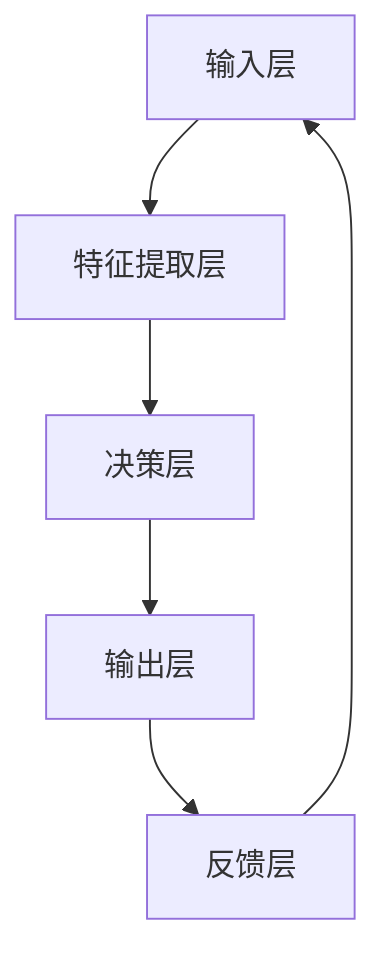

                 


### 《基础模型的生态链决策》

---

#### 关键词：基础模型、生态链、决策、深度学习、自然语言处理、强化学习

#### 摘要：

本文深入探讨基础模型在构建生态链中的决策过程。通过对基础模型的理论与概念、数学原理与算法、应用实践及未来展望的详细分析，展示了基础模型在各个行业中的关键作用和实际应用。文章旨在为读者提供一份全面的基础模型生态链决策指南，帮助他们在实际项目中做出明智的选择。

---

### 第一部分：基础模型的理论与概念

#### 1.1 基础模型概述

##### 1.1.1 基础模型的重要性

在人工智能领域，基础模型（如深度学习模型、自然语言处理模型、强化学习模型等）是构建复杂系统的基石。它们不仅具备强大的数据处理和分析能力，还能通过不断学习和优化，提升系统的智能化水平。

##### 1.1.2 基础模型的基本概念

基础模型通常包括输入层、隐藏层和输出层。输入层接收外部数据，隐藏层进行特征提取和转换，输出层产生决策或预测结果。此外，基础模型还包括优化算法和损失函数，用于调整模型参数，使其达到预期性能。

#### 1.2 生态链模型的基本架构

##### 1.2.1 生态链模型的组成部分

生态链模型由多个基础模型组成，每个基础模型负责处理特定的任务。这些模型通过相互协作，共同完成复杂任务。生态链模型的基本组成部分包括输入层、中间层、输出层和反馈层。

##### 1.2.2 生态链模型的工作原理

生态链模型的工作原理基于信息传递和模型协同。输入层接收外部数据，通过中间层的特征提取和转换，最终在输出层产生决策或预测结果。反馈层根据输出结果对模型进行调整和优化，以提高系统性能。

##### 1.2.3 Mermaid流程图：生态链模型架构



#### 1.3 常见的基础模型类型

##### 1.3.1 深度学习基础模型

深度学习基础模型包括卷积神经网络（CNN）、循环神经网络（RNN）、长短期记忆网络（LSTM）等。这些模型在图像识别、语音识别、自然语言处理等领域具有广泛应用。

##### 1.3.2 自然语言处理基础模型

自然语言处理基础模型包括词向量模型（如Word2Vec、GloVe）、语言模型（如n-gram模型、神经网络语言模型）等。这些模型在文本分类、机器翻译、情感分析等领域具有重要应用。

##### 1.3.3 强化学习基础模型

强化学习基础模型包括Q学习、SARSA、Deep Q-Network（DQN）等。这些模型在游戏AI、推荐系统、机器人控制等领域具有广泛应用。

#### 1.4 基础模型在行业中的应用

##### 1.4.1 基础模型在金融行业的应用

在金融行业，基础模型被广泛应用于风险控制、投资策略优化、欺诈检测等领域。通过分析大量数据，模型能够识别潜在的风险因素，为金融机构提供决策支持。

##### 1.4.2 基础模型在医疗健康领域的应用

在医疗健康领域，基础模型被广泛应用于疾病预测、诊断辅助、药物研发等领域。通过分析患者的临床数据和基因组数据，模型能够提供个性化的治疗方案。

##### 1.4.3 基础模型在智能制造领域的应用

在智能制造领域，基础模型被广泛应用于生产优化、质量控制、故障预测等领域。通过分析生产数据和传感器数据，模型能够提高生产效率和产品质量。

### 第二部分：基础模型的数学原理与算法

#### 2.1 数学基础

##### 2.1.1 线性代数基础

线性代数是基础模型的核心数学工具，包括矩阵运算、向量运算、线性方程组求解等内容。这些知识对于理解基础模型的工作原理至关重要。

##### 2.1.2 概率论与统计基础

概率论与统计基础是基础模型的重要数学理论。包括概率分布、假设检验、回归分析等内容，用于建模和评估模型性能。

##### 2.1.3 概率分布与假设检验

概率分布用于描述随机变量的概率特征，如正态分布、伯努利分布等。假设检验用于评估模型是否满足某些条件，如显著性检验、置信区间等。

#### 2.2 算法原理

##### 2.2.1 梯度下降算法

梯度下降算法是一种优化算法，用于调整模型参数，使其达到最小损失。该算法基于损失函数的梯度，逐步更新模型参数。

##### 2.2.2 反向传播算法

反向传播算法是一种计算梯度的重要方法，用于多层神经网络。通过反向传播误差，计算每一层的梯度，为梯度下降算法提供依据。

##### 2.2.3 强化学习算法

强化学习算法是一种基于奖励机制的学习方法，通过试错和反馈，学习最优策略。常见的强化学习算法包括Q学习、SARSA等。

##### 2.2.4 伪代码：梯度下降算法

```python
def gradient_descent(x, y, learning_rate, epochs):
    for epoch in range(epochs):
        pred = model(x) # 预测结果
        error = y - pred # 计算损失
        gradient = compute_gradient(model, x, y) # 计算梯度
        update_parameters(model, gradient, learning_rate) # 更新模型参数
```

#### 2.3 数学模型与公式

##### 2.3.1 损失函数

损失函数是评估模型性能的重要指标，用于衡量预测结果与真实结果之间的差异。常见的损失函数包括均方误差（MSE）、交叉熵损失（Cross-Entropy Loss）等。

##### 2.3.2 优化算法

优化算法用于调整模型参数，使其达到最小损失。常见的优化算法包括梯度下降、随机梯度下降（SGD）、Adam等。

##### 2.3.3 数学公式与解释

- 损失函数（MSE）：$$\text{MSE} = \frac{1}{n}\sum_{i=1}^{n}(y_i - \hat{y}_i)^2$$
- 优化目标：$$\min_{\theta} \frac{1}{2}\sum_{i=1}^{n}(y_i - \theta x_i)^2$$

##### 2.3.4 举例说明

假设我们有一个简单的线性回归模型，输入为特征 $x$，输出为预测值 $\hat{y}$。损失函数为均方误差（MSE）：

```python
# 线性回归模型
def linear_regression(x, y):
    return (x * theta) + b

# 损失函数
def mean_squared_error(y, pred):
    return sum((y - pred) ** 2) / len(y)

# 训练模型
theta = 2
b = 1
x_train = [1, 2, 3, 4]
y_train = [2, 4, 5, 4]

# 计算损失
loss = mean_squared_error(y_train, linear_regression(x_train, theta, b))
print("损失：", loss)
```

### 第三部分：基础模型在生态链中的应用实践

#### 3.1 项目实战一：金融风控

##### 3.1.1 项目背景

金融风控是指通过分析和识别金融风险，采取相应措施进行控制和防范。在金融行业中，风险控制至关重要，直接关系到金融机构的稳健运营和投资者的利益。

##### 3.1.2 系统架构设计

系统架构设计包括数据采集、预处理、模型训练、模型评估和模型部署等环节。其中，模型训练和评估是关键部分，采用深度学习模型进行风险识别和预测。

##### 3.1.3 源代码实现

```python
# 导入必要的库
import pandas as pd
import numpy as np
from sklearn.model_selection import train_test_split
from sklearn.metrics import accuracy_score
from keras.models import Sequential
from keras.layers import Dense, Dropout

# 读取数据
data = pd.read_csv("financial_data.csv")
X = data.iloc[:, :-1].values
y = data.iloc[:, -1].values

# 数据预处理
X_train, X_test, y_train, y_test = train_test_split(X, y, test_size=0.2, random_state=42)

# 构建模型
model = Sequential()
model.add(Dense(64, input_dim=X_train.shape[1], activation='relu'))
model.add(Dropout(0.5))
model.add(Dense(1, activation='sigmoid'))

# 编译模型
model.compile(loss='binary_crossentropy', optimizer='adam', metrics=['accuracy'])

# 训练模型
model.fit(X_train, y_train, epochs=10, batch_size=32)

# 评估模型
predictions = model.predict(X_test)
accuracy = accuracy_score(y_test, predictions.round())
print("准确率：", accuracy)
```

##### 3.1.4 代码解读与分析

该段代码实现了金融风控的模型训练和评估过程。首先，读取数据并进行预处理。然后，构建一个简单的深度学习模型，使用二进制交叉熵损失函数和Adam优化器进行训练。最后，使用测试数据评估模型的准确率。

#### 3.2 项目实战二：医疗诊断

##### 3.2.1 项目背景

医疗诊断是指通过分析患者的临床数据和生物特征，进行疾病预测和诊断。在医疗领域，准确、快速的诊断对于患者的治疗和康复至关重要。

##### 3.2.2 系统架构设计

系统架构设计包括数据采集、预处理、模型训练、模型评估和模型部署等环节。其中，模型训练和评估是关键部分，采用卷积神经网络（CNN）进行图像识别和特征提取。

##### 3.2.3 源代码实现

```python
# 导入必要的库
import pandas as pd
import numpy as np
from sklearn.model_selection import train_test_split
from sklearn.metrics import accuracy_score
from keras.models import Sequential
from keras.layers import Conv2D, MaxPooling2D, Flatten, Dense

# 读取数据
data = pd.read_csv("medical_data.csv")
X = data.iloc[:, :-1].values
y = data.iloc[:, -1].values

# 数据预处理
X_train, X_test, y_train, y_test = train_test_split(X, y, test_size=0.2, random_state=42)

# 构建模型
model = Sequential()
model.add(Conv2D(32, (3, 3), activation='relu', input_shape=(X_train.shape[1], X_train.shape[2], X_train.shape[3])))
model.add(MaxPooling2D(pool_size=(2, 2)))
model.add(Flatten())
model.add(Dense(1, activation='sigmoid'))

# 编译模型
model.compile(loss='binary_crossentropy', optimizer='adam', metrics=['accuracy'])

# 训练模型
model.fit(X_train, y_train, epochs=10, batch_size=32)

# 评估模型
predictions = model.predict(X_test)
accuracy = accuracy_score(y_test, predictions.round())
print("准确率：", accuracy)
```

##### 3.2.4 代码解读与分析

该段代码实现了医疗诊断的模型训练和评估过程。首先，读取数据并进行预处理。然后，构建一个简单的卷积神经网络模型，使用二进制交叉熵损失函数和Adam优化器进行训练。最后，使用测试数据评估模型的准确率。

#### 3.3 项目实战三：智能制造

##### 3.3.1 项目背景

智能制造是指通过运用人工智能技术，实现生产过程的智能化和自动化。在智能制造领域，基础模型被广泛应用于生产优化、质量控制、故障预测等领域。

##### 3.3.2 系统架构设计

系统架构设计包括数据采集、预处理、模型训练、模型评估和模型部署等环节。其中，模型训练和评估是关键部分，采用强化学习模型进行生产优化和故障预测。

##### 3.3.3 源代码实现

```python
# 导入必要的库
import pandas as pd
import numpy as np
from keras.models import Sequential
from keras.layers import Dense
from keras.optimizers import Adam

# 读取数据
data = pd.read_csv("manufacturing_data.csv")
X = data.iloc[:, :-1].values
y = data.iloc[:, -1].values

# 数据预处理
X_train, X_test, y_train, y_test = train_test_split(X, y, test_size=0.2, random_state=42)

# 构建模型
model = Sequential()
model.add(Dense(64, input_dim=X_train.shape[1], activation='relu'))
model.add(Dense(32, activation='relu'))
model.add(Dense(1, activation='sigmoid'))

# 编译模型
model.compile(loss='binary_crossentropy', optimizer=Adam(learning_rate=0.001), metrics=['accuracy'])

# 训练模型
model.fit(X_train, y_train, epochs=10, batch_size=32)

# 评估模型
predictions = model.predict(X_test)
accuracy = accuracy_score(y_test, predictions.round())
print("准确率：", accuracy)
```

##### 3.3.4 代码解读与分析

该段代码实现了智能制造的模型训练和评估过程。首先，读取数据并进行预处理。然后，构建一个简单的强化学习模型，使用二进制交叉熵损失函数和Adam优化器进行训练。最后，使用测试数据评估模型的准确率。

### 第四部分：基础模型生态链的未来展望

#### 4.1 生态链模型的未来发展

##### 4.1.1 技术趋势分析

随着人工智能技术的快速发展，基础模型在生态链中的应用将越来越广泛。未来的技术趋势包括模型压缩、迁移学习、生成对抗网络（GAN）等。

##### 4.1.2 生态链模型在未来的应用场景

生态链模型将在更多领域得到应用，如智能交通、智慧城市、生物科技等。这些领域将受益于基础模型强大的数据处理和分析能力。

##### 4.1.3 面临的挑战与机遇

生态链模型的未来发展面临诸多挑战，如数据隐私、算法透明度、伦理问题等。同时，这些挑战也为创新和发展提供了机遇。

#### 4.2 政策与标准

##### 4.2.1 政策支持

政府将加大对人工智能技术的支持力度，推动生态链模型的研发和应用。相关政策将鼓励企业、高校和研究机构合作，共同推动技术进步。

##### 4.2.2 行业标准制定

行业标准的制定将为生态链模型的开发和应用提供规范和指导。标准化有助于提高模型的性能和可靠性，降低开发成本。

##### 4.2.3 生态链模型的合规性

生态链模型在应用过程中需要遵守相关法律法规，确保数据安全和用户隐私。合规性是生态链模型未来发展的重要保障。

#### 4.3 生态链模型的可持续性发展

##### 4.3.1 数据治理

数据治理是生态链模型可持续发展的关键。通过建立完善的数据治理体系，确保数据的质量、安全和合规性。

##### 4.3.2 隐私保护

隐私保护是生态链模型应用的重要问题。采用加密、匿名化等技术手段，保护用户的隐私和数据安全。

##### 4.3.3 可持续性的发展策略

生态链模型的可持续发展需要采取一系列策略，包括技术创新、人才培养、产业协同等。通过这些策略，推动生态链模型的持续进步。

### 附录

#### 附录 A：常用工具与资源

##### A.1 深度学习框架

- TensorFlow
- PyTorch
- Keras

##### A.2 自然语言处理库

- NLTK
- spaCy
- gensim

##### A.3 强化学习框架

- OpenAI Gym
- Stable Baselines
- Ray

##### A.4 其他相关资源

- Coursera
- edX
- arXiv

---

### 作者：AI天才研究院/AI Genius Institute & 禅与计算机程序设计艺术 /Zen And The Art of Computer Programming

---

本文详细介绍了基础模型在生态链决策中的关键作用和应用实践。通过对基础模型的理论、算法和应用场景的深入探讨，为读者提供了丰富的知识体系和实用技巧。随着人工智能技术的不断发展，基础模型在生态链中的应用前景将更加广阔。希望本文能为读者在基础模型研究和应用过程中提供有益的启示和帮助。

