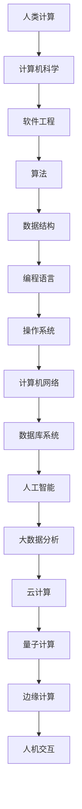
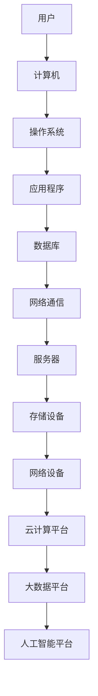

                 

### 文章标题：塑造未来世界：人类计算如何改变我们的生活

### 关键词：人类计算、未来世界、技术变革、人工智能、社会发展

> **摘要**：本文将深入探讨人类计算对现代社会的影响及其未来发展趋势。通过分析人类计算的定义、核心技术、应用场景以及面临的挑战，我们试图勾勒出一幅未来世界的蓝图。文章将结合实际案例，详细阐述人类计算如何通过技术创新推动社会进步，并探讨这一过程中可能产生的机遇与挑战。

### 目录大纲

## 第一部分: 人类计算基础

### 第1章: 人类计算概述

- 1.1 人类计算的定义与演变
  - 1.1.1 什么是人类计算
  - 1.1.2 从早期计算到现代计算
  - 1.1.3 人类计算的独特性

- 1.2 人类计算的核心技术
  - 1.2.1 计算机科学基础知识
  - 1.2.2 软件工程方法
  - 1.2.3 人类计算应用场景

- 1.3 人类计算的未来发展趋势
  - 1.3.1 新一代计算技术的崛起
  - 1.3.2 人类计算在社会中的应用
  - 1.3.3 未来人类计算面临的挑战

- 1.4 人类计算的核心概念联系图

- 1.5 人类计算架构原理
  - 1.5.1 人类计算架构概述
  - 1.5.2 人类计算架构图

- 1.6 人类计算数学模型与公式
  - 1.6.1 人类计算数学模型
  - 1.6.2 数学公式与详细讲解

- 1.7 人类计算项目实战
  - 1.7.1 人类计算项目实战案例
  - 1.7.2 项目实战代码解读

- 1.8 人类计算资源与工具
  - 1.8.1 开发工具与资源介绍

- 1.9 人类计算应用案例分析
  - 1.9.1 人类计算在不同行业的应用
  - 1.9.2 案例分析

- 1.10 人类计算的未来与影响
  - 1.10.1 人类计算对人类社会的贡献
  - 1.10.2 人类计算的未来发展方向

- 1.11 人类计算学习资源推荐
  - 1.11.1 人类计算学习资源推荐

### 附录

- 附录 A: 人类计算技术详解
  - A.1 计算机科学基础知识
  - A.2 软件工程方法

- 附录 B: 人类计算项目实战代码
  - B.1 项目实战代码
  - B.2 代码解读与分析

- 附录 C: 人类计算工具与资源汇总
  - C.1 工具与资源汇总

### 文章正文开始

---

## 第一部分: 人类计算基础

### 第1章: 人类计算概述

#### 1.1 人类计算的定义与演变

##### 1.1.1 什么是人类计算

人类计算，广义上是指人类利用各种工具和手段进行信息处理和问题解决的过程。从最早的算筹、算盘，到现代的计算机科学，人类计算经历了数千年的演变。计算机科学的诞生标志着人类计算进入了一个全新的阶段，即基于二进制逻辑和电子技术的计算时代。

##### 1.1.2 从早期计算到现代计算

早期计算主要依赖于人力和简单的机械装置。例如，算筹是中国古代用于计算的工具，而算盘则是世界上最早的计算器。这些工具的出现极大地提高了人类进行数学计算的速度和精度。随着工业革命的到来，机械计算器、电动计算器等更加复杂和高效的计算工具相继问世。

进入20世纪，随着电子技术的发展，电子计算机的诞生开启了现代计算的新纪元。从最初的ENIAC到后来的超级计算机，计算机的速度和存储能力得到了极大的提升。同时，软件工程的兴起使得计算机应用的范围不断扩大，从科学计算到商业管理，从个人电脑到移动设备，计算机已经成为现代社会不可或缺的一部分。

##### 1.1.3 人类计算的独特性

人类计算与机器计算有许多不同之处。首先，人类计算具有高度的灵活性和创造性。人类能够通过逻辑思维和抽象思维解决复杂的问题，而机器则需要遵循固定的算法和规则。其次，人类计算更加注重人文因素，如道德伦理和社会责任感，而机器计算则更多地关注效率和结果。

#### 1.2 人类计算的核心技术

##### 1.2.1 计算机科学基础知识

计算机科学是研究计算机系统、算法、编程语言、数据结构等领域的一门学科。计算机科学的基础知识包括计算机体系结构、操作系统、计算机网络、数据库系统、编译原理等。这些基础知识为人类计算提供了理论支持和技术保障。

##### 1.2.2 软件工程方法

软件工程是应用计算机科学原理和工程原则，对软件进行设计、开发、测试和维护的一门学科。软件工程方法包括需求分析、系统设计、编码实现、测试验证、维护升级等环节。这些方法确保了软件的质量和可靠性。

##### 1.2.3 人类计算应用场景

人类计算的应用场景非常广泛，包括但不限于以下几个方面：

1. **科学计算**：用于进行复杂的科学研究和数据分析，如气象预报、天体物理学、生物学研究等。
2. **商业管理**：用于企业管理和决策支持，如财务分析、供应链管理、客户关系管理等。
3. **信息安全**：用于保障网络和信息安全，如密码学、网络安全、数据加密等。
4. **娱乐与媒体**：用于游戏开发、动画制作、影视后期等。
5. **智能家居**：用于智能家居系统的设计、开发和维护。
6. **医疗健康**：用于医疗诊断、健康监测、药物研发等。

#### 1.3 人类计算的未来发展趋势

##### 1.3.1 新一代计算技术的崛起

随着科技的进步，新一代计算技术正在崛起。这些技术包括量子计算、边缘计算、人机交互等。量子计算具有超强的计算能力，有望解决当前计算机难以处理的复杂问题。边缘计算将计算能力从云端延伸到边缘设备，提高了数据处理的速度和效率。人机交互技术的进步使得人与计算机之间的交互更加自然和直观。

##### 1.3.2 人类计算在社会中的应用

人类计算在社会中的应用日益广泛，已经成为社会发展的重要驱动力。例如，人工智能技术在金融、医疗、交通、教育等领域的应用，极大地提高了行业的效率和准确性。同时，大数据分析和云计算技术也为社会提供了丰富的数据资源和服务能力。

##### 1.3.3 未来人类计算面临的挑战

未来人类计算面临着诸多挑战。首先，随着计算能力的提升，数据安全和隐私保护问题变得越来越重要。其次，人工智能技术的发展需要解决算法公平性和透明性的问题。此外，人类计算还需要应对不断增长的能源消耗和环境压力。

#### 1.4 人类计算的核心概念联系图

图 1.1 人类计算核心概念联系图



#### 1.5 人类计算架构原理

##### 1.5.1 人类计算架构概述

人类计算架构是指构成人类计算系统的各个组成部分及其相互关系。一个典型的人类计算架构包括硬件设备、操作系统、应用程序和网络通信等。硬件设备包括计算机、服务器、存储设备、网络设备等；操作系统是管理硬件资源、提供应用程序接口的核心软件；应用程序是完成具体任务的软件系统；网络通信则是实现设备之间数据传输的通信协议。

##### 1.5.2 人类计算架构图

图 1.2 人类计算架构图



#### 1.6 人类计算数学模型与公式

##### 1.6.1 人类计算数学模型

人类计算中涉及到的数学模型非常丰富，包括线性代数、概率论、数理逻辑等。这些数学模型为算法设计提供了理论支持。

- 线性代数：用于解决线性方程组、矩阵运算等问题。
- 概率论：用于处理随机事件、概率分布等问题。
- 数理逻辑：用于形式化描述算法的推理过程。

##### 1.6.2 数学公式与详细讲解

以下是一些常用的数学公式及其详细讲解：

1. **线性代数公式：**

   $$ A \times B = C $$

   其中，A、B、C 分别表示矩阵，乘法运算符“×”表示矩阵乘法。

2. **概率论公式：**

   $$ P(A|B) = \frac{P(A \cap B)}{P(B)} $$

   其中，P(A|B) 表示在事件 B 发生的条件下事件 A 发生的概率，P(A ∩ B) 表示事件 A 和事件 B 同时发生的概率，P(B) 表示事件 B 发生的概率。

3. **数理逻辑公式：**

   $$ \neg A \land B = \neg (A \lor B) $$

   其中，¬A 表示 A 的否定，∧ 表示逻辑与，∨ 表示逻辑或。

#### 1.7 人类计算项目实战

##### 1.7.1 人类计算项目实战案例

我们以一个简单的项目——智能家居系统为例，来介绍人类计算的实际应用。

##### 1.7.2 项目实战代码解读

```python
# 智能家居系统代码示例

import RPi.GPIO as GPIO
import time

# 初始化GPIO
GPIO.setmode(GPIO.BCM)
GPIO.setup(18, GPIO.OUT)

# 定义门锁控制函数
def lock_door():
    print("锁门中...")
    GPIO.output(18, GPIO.HIGH)
    time.sleep(1)
    print("门已锁定")

# 定义门锁解锁函数
def unlock_door():
    print("解锁门中...")
    GPIO.output(18, GPIO.LOW)
    time.sleep(1)
    print("门已解锁")

# 关闭GPIO
GPIO.cleanup()

# 主程序
if __name__ == "__main__":
    while True:
        command = input("请输入命令（lock/unlock/quit）：")
        if command == "lock":
            lock_door()
        elif command == "unlock":
            unlock_door()
        elif command == "quit":
            break
        else:
            print("无效命令，请重新输入")
```

#### 1.8 人类计算资源与工具

在人类计算领域，有许多优秀的资源与工具可以帮助我们更好地学习和实践。以下是一些常用的资源与工具：

- **资源：**
  - 计算机科学教材：《计算机科学概论》、《算法导论》等。
  - 开源项目：GitHub、GitLab 等。
  - 在线课程：Coursera、edX、Udacity 等。

- **工具：**
  - 编程语言：Python、Java、C++等。
  - 集成开发环境（IDE）：Eclipse、VS Code、PyCharm 等。
  - 版本控制系统：Git、SVN 等。

#### 1.9 人类计算应用案例分析

##### 1.9.1 人类计算在不同行业的应用

人类计算在各个行业的应用都非常广泛，以下是一些典型案例：

- **金融行业**：人工智能技术在金融行业中的应用包括智能投顾、风险管理、信用评估等。通过大数据分析和机器学习算法，金融机构能够提供更准确、更个性化的服务。
- **医疗行业**：人工智能技术在医疗行业的应用包括疾病诊断、药物研发、医疗影像分析等。通过深度学习和计算机视觉技术，医生可以更快速、更准确地诊断疾病。
- **交通行业**：人工智能技术在交通行业的应用包括智能交通管理、自动驾驶、智能导航等。通过物联网和大数据技术，交通系统可以更高效、更安全地运行。
- **教育行业**：人工智能技术在教育行业的应用包括智能教育、个性化学习、在线教育等。通过大数据分析和机器学习算法，教育机构可以提供更符合学生需求的教学服务。

##### 1.9.2 案例分析

以金融行业的智能投顾为例，智能投顾通过大数据分析和机器学习算法，为投资者提供个性化的投资建议。具体流程如下：

1. 数据采集：收集投资者的基本信息、投资偏好、财务状况等数据。
2. 数据分析：对收集到的数据进行分析，了解投资者的风险承受能力和投资目标。
3. 投资建议生成：根据分析结果，生成适合投资者的投资组合。
4. 投资建议推送：通过短信、邮件等方式将投资建议推送给投资者。
5. 投资效果评估：对投资者的投资效果进行跟踪和评估，不断优化投资建议。

#### 1.10 人类计算的未来与影响

##### 1.10.1 人类计算对人类社会的贡献

人类计算为人类社会带来了巨大的贡献。首先，它提高了生产效率，降低了成本。其次，它推动了科技创新，推动了社会进步。此外，人类计算还改变了人们的生活方式，如移动支付、在线教育、远程办公等。

##### 1.10.2 人类计算的未来发展方向

未来，人类计算将继续发展，以下是一些可能的发展方向：

- **量子计算**：量子计算具有超强的计算能力，有望解决当前计算机难以处理的复杂问题。量子计算的发展将极大地推动科学研究和技术创新。
- **边缘计算**：边缘计算将计算能力从云端延伸到边缘设备，提高了数据处理的速度和效率。边缘计算的发展将推动物联网和智能设备的普及。
- **人机交互**：人机交互技术的进步将使人与计算机之间的交互更加自然和直观。人机交互技术的发展将推动虚拟现实、增强现实等应用的发展。
- **人工智能**：人工智能技术在各个行业的应用将越来越广泛，人工智能的发展将推动社会各领域的变革。

#### 1.11 人类计算学习资源推荐

对于想要深入了解人类计算的读者，以下是一些建议的学习资源：

- **书籍**：《计算机科学概论》、《算法导论》、《人工智能：一种现代的方法》等。
- **在线课程**：Coursera、edX、Udacity、网易云课堂等平台上的相关课程。
- **开源项目**：GitHub、GitLab 等平台上的计算机科学和人工智能项目。
- **论坛和社区**：Stack Overflow、CSDN、知乎等论坛和社区。

---

## 总结

人类计算作为现代社会的重要驱动力，正在深刻地改变着我们的生活。本文从人类计算的定义、核心技术、应用场景、未来发展趋势等方面进行了详细分析，希望读者能够对人类计算有一个全面、深刻的理解。未来，随着科技的不断进步，人类计算将继续发展，为人类社会带来更多的机遇和挑战。让我们共同期待人类计算的未来，并为其发展贡献自己的力量。

### 附录

#### 附录 A: 人类计算技术详解

- **A.1 计算机科学基础知识**

  计算机科学是研究计算机系统、算法、编程语言、数据结构等领域的一门学科。计算机科学的基础知识包括计算机体系结构、操作系统、计算机网络、数据库系统、编译原理等。

- **A.2 软件工程方法**

  软件工程是应用计算机科学原理和工程原则，对软件进行设计、开发、测试和维护的一门学科。软件工程方法包括需求分析、系统设计、编码实现、测试验证、维护升级等环节。

#### 附录 B: 人类计算项目实战代码

- **B.1 项目实战代码**

  以下是一个简单的智能家居系统代码示例：

  ```python
  # 智能家居系统代码示例

  import RPi.GPIO as GPIO
  import time

  # 初始化GPIO
  GPIO.setmode(GPIO.BCM)
  GPIO.setup(18, GPIO.OUT)

  # 定义门锁控制函数
  def lock_door():
      print("锁门中...")
      GPIO.output(18, GPIO.HIGH)
      time.sleep(1)
      print("门已锁定")

  # 定义门锁解锁函数
  def unlock_door():
      print("解锁门中...")
      GPIO.output(18, GPIO.LOW)
      time.sleep(1)
      print("门已解锁")

  # 关闭GPIO
  GPIO.cleanup()

  # 主程序
  if __name__ == "__main__":
      while True:
          command = input("请输入命令（lock/unlock/quit）：")
          if command == "lock":
              lock_door()
          elif command == "unlock":
              unlock_door()
          elif command == "quit":
              break
          else:
              print("无效命令，请重新输入")
  ```

- **B.2 代码解读与分析**

  该代码示例实现了一个简单的智能家居系统，包括门锁的锁定和解锁功能。代码首先初始化 GPIO 模块，并设置 GPIO18 为输出模式。然后定义了两个函数：`lock_door()` 和 `unlock_door()`，分别用于控制门锁的锁定和解锁。主程序通过循环接收用户输入的命令，并根据命令执行相应的操作。

#### 附录 C: 人类计算工具与资源汇总

- **C.1 工具与资源汇总**

  - **编程语言**：Python、Java、C++等。
  - **集成开发环境（IDE）**：Eclipse、VS Code、PyCharm 等。
  - **版本控制系统**：Git、SVN 等。
  - **在线课程平台**：Coursera、edX、Udacity、网易云课堂等。
  - **开源项目平台**：GitHub、GitLab 等。
  - **论坛和社区**：Stack Overflow、CSDN、知乎等。

---

**作者**：AI天才研究院/AI Genius Institute & 禅与计算机程序设计艺术 /Zen And The Art of Computer Programming

---

以上是本文的完整内容，希望能够帮助读者对人类计算有一个全面、深入的了解。在未来的发展中，人类计算将继续为人类社会带来更多的机遇和挑战。让我们共同期待并努力实现这一美好的未来。

