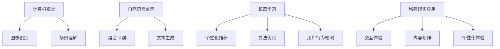

                 

### 第1章 增强现实技术概述

#### 1.1 增强现实技术的发展历史

- **增强现实技术的起源**

  增强现实技术的起源可以追溯到1950年代。当时，计算机科学家和心理学家开始探讨如何将虚拟信息与现实世界进行交互和融合。最早关于增强现实的想法可以追溯到美国麻省理工学院（MIT）的研究者伊凡·苏瑟兰（Ivan Sutherland）在1968年发明的“达摩克利斯之剑”（Sword of Damocles）系统，这是一个早期的头戴式显示器，通过摄像头捕捉现实场景，并将计算机生成的虚拟图像叠加到用户视野中。

- **增强现实技术的主要发展阶段**

  - **1960年代**：增强现实技术得到了初步发展，主要应用于军事和工业领域。这个时期的增强现实系统较为笨重，主要依赖于头戴式显示器和外部传感器。
  - **1970年代和1980年代**：增强现实技术开始向消费市场渗透。例如，某些游戏和娱乐设施开始利用增强现实技术提供更加沉浸式的体验。
  - **1990年代**：随着计算机性能的提升和图形处理技术的发展，增强现实技术开始广泛应用于工业、医疗和军事领域。例如，增强现实技术被用于手术指导、机械维护和飞行模拟等。
  - **2000年代**：移动设备的普及和智能手机的出现，使得增强现实技术开始向消费市场大规模渗透。早期的增强现实应用，如AR游戏和增强现实广告，开始在移动设备上普及。
  - **2010年代**：随着硬件和算法的进步，增强现实技术取得了重大突破。例如，AR眼镜和智能手机上的增强现实应用逐渐变得流行，主要得益于高通、谷歌和微软等科技公司的推动。

- **增强现实技术的未来发展趋势**

  - **更加智能化和个性化**：随着人工智能和机器学习技术的发展，增强现实技术将能够更好地理解用户的行为和需求，提供更加个性化的体验。
  - **更加便携和易用**：随着硬件设备的便携性和易用性提高，增强现实技术将更加普及，不仅限于高端设备，也将应用到更多的生活场景中。
  - **更广泛的应用领域**：增强现实技术将深入各行各业，如教育、医疗、娱乐、零售、制造和军事等。例如，在医疗领域，增强现实技术可以用于手术指导和患者教育；在娱乐领域，增强现实游戏和虚拟演唱会将为用户带来全新的体验。

#### 1.2 增强现实技术的基本概念

- **增强现实技术的定义**

  增强现实技术（Augmented Reality，简称AR）是一种将虚拟信息与现实世界融合的技术。它通过摄像头捕捉现实场景，然后利用计算机生成虚拟图像或信息，将这些虚拟信息叠加到现实环境中，从而为用户提供一种虚实结合的体验。

- **增强现实技术的主要特点**

  - **虚实结合**：增强现实技术可以将虚拟图像或信息叠加到现实环境中，使用户能够直观地感受到虚拟世界与真实世界的交互。
  - **沉浸式体验**：增强现实技术可以提供一种沉浸式的体验，让用户感觉仿佛身处在虚拟世界中。
  - **实时交互**：增强现实技术可以实现用户与现实环境和虚拟信息之间的实时交互，例如通过手势或语音指令控制虚拟图像的移动或变形。

- **增强现实技术的分类**

  增强现实技术可以根据不同的标准进行分类：

  - **根据应用场景**：可以分为消费级增强现实和工业级增强现实。消费级增强现实主要应用于娱乐、教育和游戏等领域，而工业级增强现实则主要应用于工业制造、维修和医疗等领域。
  - **根据显示方式**：可以分为直接增强现实和间接增强现实。直接增强现实通过头戴式显示器或投影设备直接将虚拟信息叠加到用户的视野中，而间接增强现实则通过智能手机或平板电脑等设备将虚拟信息显示在屏幕上，用户需要通过屏幕观看。
  - **根据交互方式**：可以分为手势交互、语音交互和体感交互等。手势交互通过手势控制虚拟图像的移动和变形，语音交互通过语音指令控制虚拟图像，体感交互则通过用户的身体动作控制虚拟图像。

#### 1.3 增强现实技术的核心组成部分

- **显示技术**

  增强现实技术的显示技术是核心组成部分之一，它决定了虚拟信息在用户视野中的呈现效果。常见的显示技术包括：

  - **头戴式显示器（HMD）**：例如微软的HoloLens和谷歌的Daydream View，这些设备可以将虚拟信息直接叠加到用户的视野中，提供沉浸式的体验。
  - **投影技术**：通过将虚拟信息投影到物体或地面上，例如AR投影仪。
  - **智能手机屏幕**：通过在智能手机屏幕上显示虚拟信息，用户需要通过屏幕观看，例如AR应用如《宝可梦GO》。

- **输入技术**

  增强现实技术的输入技术决定了用户如何与虚拟信息进行交互。常见的输入技术包括：

  - **手势识别**：通过摄像头捕捉用户的手势，实现虚拟图像的移动、变形和交互。
  - **语音识别**：通过语音指令控制虚拟图像，实现虚拟信息的交互。
  - **体感识别**：通过捕捉用户的身体动作，实现虚拟图像的交互。

- **算法与处理技术**

  增强现实技术的算法与处理技术是核心组成部分之一，它决定了如何将虚拟信息与现实环境进行融合。常见的算法与处理技术包括：

  - **图像识别**：通过计算机视觉算法识别现实环境中的物体和场景，实现虚拟信息的叠加。
  - **跟踪与定位**：通过GPS、惯性测量单元（IMU）等传感器实现用户的位置和方向的跟踪，确保虚拟信息与现实环境的正确对齐。
  - **实时渲染**：通过实时渲染技术将虚拟信息以实时的方式呈现给用户。

- **输出技术**

  增强现实技术的输出技术决定了用户如何感知虚拟信息。常见的输出技术包括：

  - **视觉输出**：通过显示技术将虚拟信息呈现在用户的视野中。
  - **声音输出**：通过音响设备输出虚拟信息的声音效果，增强用户的沉浸感。
  - **触觉输出**：通过触觉反馈设备（如Haptic反馈设备）模拟虚拟对象的触感。

通过上述的增强现实技术概述，我们可以了解到增强现实技术的发展历程、基本概念、主要特点以及核心组成部分。在接下来的章节中，我们将进一步探讨人工智能（AI）在增强现实技术中的应用，以及AI如何推动增强现实技术的创新和发展。

### 图1：增强现实技术概念关系架构图

```mermaid
graph TD
    A[增强现实技术概述] --> B[发展历史]
    B --> C[起源](1960年代)
    B --> D[发展阶段](1960年代、1990年代、2000年代、2010年代)
    B --> E[未来趋势](智能化、个性化、更广泛应用)
    A --> F[基本概念]
    F --> G[定义](虚实结合、沉浸式体验、实时交互)
    F --> H[特点](虚实结合、沉浸式体验、实时交互)
    F --> I[分类](应用场景、显示方式、交互方式)
    A --> J[核心组成部分]
    J --> K[显示技术](HMD、投影技术、智能手机屏幕)
    J --> L[输入技术](手势识别、语音识别、体感识别)
    J --> M[算法与处理技术](图像识别、跟踪与定位、实时渲染)
    J --> N[输出技术](视觉输出、声音输出、触觉输出)
```

### 图1解释：

- **A[增强现实技术概述]**：作为总体概述，包含增强现实技术的发展历史、基本概念、主要特点和核心组成部分。
- **B[发展历史]**：从起源到1960年代、1990年代、2000年代和2010年代的发展阶段，以及未来趋势的展望。
- **C[起源](1960年代)**：增强现实技术的起源，以伊凡·苏瑟兰的“达摩克利斯之剑”系统为代表。
- **D[发展阶段](1960年代、1990年代、2000年代、2010年代)**：各个阶段增强现实技术的主要进展和应用。
- **E[未来趋势](智能化、个性化、更广泛应用)**：未来增强现实技术的发展方向。
- **F[基本概念]**：增强现实技术的定义、主要特点和分类。
- **G[定义](虚实结合、沉浸式体验、实时交互)**：增强现实技术的定义及其主要特点。
- **H[特点](虚实结合、沉浸式体验、实时交互)**：增强现实技术的主要特点。
- **I[分类](应用场景、显示方式、交互方式)**：增强现实技术的分类方式。
- **J[核心组成部分]**：增强现实技术的核心组成部分，包括显示技术、输入技术、算法与处理技术和输出技术。
- **K[显示技术](HMD、投影技术、智能手机屏幕)**：增强现实技术的显示方式。
- **L[输入技术](手势识别、语音识别、体感识别)**：增强现实技术的输入方式。
- **M[算法与处理技术](图像识别、跟踪与定位、实时渲染)**：增强现实技术的算法和处理技术。
- **N[输出技术](视觉输出、声音输出、触觉输出)**：增强现实技术的输出方式。

通过这个Mermaid流程图，我们可以清晰地看到增强现实技术的各个组成部分及其之间的关系，帮助读者更好地理解增强现实技术的概念和架构。

### 1.2.3 增强现实技术的分类

增强现实技术可以根据不同的维度进行分类，以下是一些常见的分类方式：

- **按应用场景分类**：
  - **消费级增强现实**：主要应用于娱乐、教育、广告和零售等领域，如AR游戏、AR广告、AR教育等。
  - **工业级增强现实**：主要应用于工业制造、维修、医疗、军事等领域，如工厂维护、医疗手术指导、军事模拟等。

- **按显示方式分类**：
  - **直接增强现实**：通过头戴式显示器（HMD）或投影设备将虚拟信息直接叠加到用户的视野中。例如，微软的HoloLens和谷歌的Daydream View。
  - **间接增强现实**：通过智能手机或平板电脑等设备的屏幕显示虚拟信息，用户需要通过屏幕观看。例如，手机上的AR应用如《宝可梦GO》。

- **按交互方式分类**：
  - **手势交互**：通过手势控制虚拟图像的移动、变形和交互。例如，通过挥手或手指移动来操控虚拟对象。
  - **语音交互**：通过语音指令控制虚拟图像，实现虚拟信息的交互。例如，通过说“放大”来放大虚拟图像。
  - **体感交互**：通过捕捉用户的身体动作，实现虚拟图像的交互。例如，通过摆动身体来控制虚拟飞机的飞行。

- **按虚实结合程度分类**：
  - **低度增强现实**：将虚拟信息以较小的规模或形式叠加到现实环境中，如AR广告牌或AR贴纸。
  - **中度增强现实**：将虚拟信息较大规模地叠加到现实环境中，如AR游戏或AR教育应用。
  - **高度增强现实**：将虚拟信息与现实环境高度融合，如AR眼镜和HoloLens等。

通过上述分类方式，我们可以对增强现实技术有一个更加全面和深入的理解。不同分类方式有助于我们根据应用场景和需求选择合适的增强现实技术解决方案，推动其在各个领域的应用和发展。

### 1.3.1 显示技术

显示技术是增强现实技术的核心组成部分之一，它决定了虚拟信息在用户视野中的呈现效果。以下是几种常见的显示技术：

- **头戴式显示器（HMD）**

  头戴式显示器（HMD）是一种将虚拟信息直接叠加到用户视野中的显示设备。常见的HMD设备包括微软的HoloLens、谷歌的Daydream View和Meta的Quest系列。HMD的优点是提供沉浸式的体验，用户能够直观地感受到虚拟世界与现实世界的交互。然而，HMD也存在一些缺点，如重量较大、视野受限和电池续航时间较短。

  **示例：** 微软的HoloLens是一款高性能的AR头戴设备，它通过内置的传感器和摄像头捕捉现实环境，然后将虚拟信息叠加到用户视野中。HoloLens广泛应用于工业制造、医疗和教育等领域。

- **投影技术**

  投影技术通过将虚拟信息投影到物体或地面上，为用户提供一种沉浸式的增强现实体验。常见的投影设备包括AR投影仪和便携式投影仪。投影技术的优点是可以将虚拟信息较大规模地显示，适用于大型空间和户外场景。然而，投影技术也存在一些缺点，如光线干扰和投影清晰度问题。

  **示例：** AR投影仪可以用于室内装饰设计、建筑模型展示和虚拟博物馆等场景，通过在物体或地面上投影虚拟图像，为用户带来沉浸式的体验。

- **智能手机屏幕**

  智能手机屏幕是增强现实技术中常见的一种显示方式。通过在智能手机屏幕上显示虚拟信息，用户需要通过屏幕观看。智能手机屏幕的优点是便携性和易用性高，且普及率高。然而，智能手机屏幕的视野较小，且分辨率相对较低，因此无法提供与HMD或投影技术相比拟的沉浸式体验。

  **示例：** 《宝可梦GO》是一款基于智能手机屏幕的增强现实游戏，它通过在用户视野中显示虚拟的宝可梦形象，吸引用户在现实世界中寻找并捕捉它们。

不同显示技术具有各自的优缺点，选择合适的显示技术取决于应用场景和用户需求。在消费级增强现实应用中，智能手机屏幕因其便携性和普及率而广泛应用；在工业级增强现实应用中，HMD和投影技术因其沉浸式体验而被广泛采用。

### 1.3.2 输入技术

输入技术是增强现实技术的重要组成部分，它决定了用户如何与虚拟信息进行交互。以下是几种常见的输入技术：

- **手势识别**

  手势识别是通过摄像头捕捉用户的手部动作，然后通过计算机视觉算法识别和跟踪这些手势，从而实现与虚拟信息的交互。手势识别的优点是直观、自然，用户无需额外的设备即可进行操作。常见的应用包括手势控制虚拟图像的移动、放大、缩小和旋转等。

  **示例：** 在微软的HoloLens中，用户可以通过手势来操控虚拟对象，例如通过手势将一个虚拟立方体旋转或移动到不同的位置。

- **语音识别**

  语音识别是通过语音输入技术将用户的语音转换为文本或命令，然后通过自然语言处理算法理解和执行这些命令。语音识别的优点是方便快捷，用户可以在进行其他任务的同时进行操作。常见的应用包括语音搜索、语音控制虚拟图像的显示和隐藏等。

  **示例：** 在苹果的ARKit中，用户可以通过语音命令来控制增强现实场景中的虚拟对象，例如通过语音命令“放大”或“缩小”来调整虚拟图像的大小。

- **体感识别**

  体感识别是通过捕捉用户的身体动作，通过计算机视觉算法识别和跟踪这些动作，从而实现与虚拟信息的交互。体感识别的优点是可以提供更加丰富和自然的交互体验。常见的应用包括体感游戏、虚拟现实舞蹈和增强现实健身等。

  **示例：** 在任天堂的Wii游戏中，用户可以通过身体动作来控制游戏中的虚拟角色，这种交互方式也被应用在增强现实游戏中，如《超级马里奥AR》。

不同输入技术具有各自的优缺点，选择合适的输入技术取决于应用场景和用户需求。在消费级增强现实应用中，手势识别和语音识别因其直观性和便捷性而广泛应用；在工业级增强现实应用中，体感识别因其能够提供更加丰富和自然的交互体验而被广泛采用。

### 1.3.3 算法与处理技术

算法与处理技术是增强现实技术的核心组成部分，它决定了如何将虚拟信息与现实环境进行融合，以及如何处理输入和输出信息。以下是几种关键的算法与处理技术：

- **图像识别**

  图像识别是通过计算机视觉算法识别和理解现实环境中的图像和物体。它包括图像分割、目标检测、物体识别和场景理解等子任务。图像识别技术的核心是深度学习模型，如卷积神经网络（CNN）和循环神经网络（RNN）。

  **核心算法原理讲解与伪代码**：
  - **卷积神经网络（CNN）**：
    ```python
    # 初始化CNN模型
    model = CNN()

    # 输入图像
    image = preprocess_image(input_image)

    # 前向传播
    output = model.forward(image)

    # 检测物体
    objects = detect_objects(output)
    ```
  - **目标检测**：
    ```python
    # 输入图像
    image = preprocess_image(input_image)

    # 使用Faster R-CNN模型进行目标检测
    detector = FasterRCNN()
    detections = detector.detect_objects(image)

    # 输出检测结果
    print(detections)
    ```

  **数学模型和公式**：
  - **卷积操作**：
    $$ (f * g)(x) = \sum_{y} f(y) \cdot g(x-y) $$
  - **激活函数**（例如ReLU）：
    $$ f(x) = \max(0, x) $$

  **举例说明**：
  - **图像分类**：使用CNN对图像进行分类，输入图像经过卷积、池化和全连接层后，输出类别概率。

- **跟踪与定位**

  跟踪与定位是通过传感器和计算机视觉算法确定用户的位置和方向，从而确保虚拟信息与现实环境正确对齐。常见的跟踪与定位技术包括视觉SLAM（同步定位与映射）和惯性导航。

  **核心算法原理讲解与伪代码**：
  - **视觉SLAM**：
    ```python
    # 初始化SLAM算法
    slam = VisualSLAM()

    # 采集图像和姿态信息
    image, position, orientation = slam.update_camera_state()

    # 更新地图和位姿
    slam.update_map(image)
    slam.update_position(position, orientation)

    # 输出位姿
    print(slam.get_position())
    ```

  **数学模型和公式**：
  - **位姿表示**（四元数）：
    $$ q = [q_0, q_1, q_2, q_3] $$
  - **变换矩阵**：
    $$ T = [R|t] $$
    其中，\( R \)是旋转矩阵，\( t \)是平移向量。

  **举例说明**：
  - **导航应用**：在AR应用中，使用视觉SLAM技术确定用户的位置，从而实时更新虚拟信息的位置。

- **实时渲染**

  实时渲染是通过图形处理算法将虚拟信息以实时的方式呈现在用户视野中。实时渲染需要高效处理图像生成、渲染和显示过程，以确保良好的用户体验。

  **核心算法原理讲解与伪代码**：
  - **渲染管线**：
    ```python
    # 初始化渲染管线
    render_pipeline = RenderPipeline()

    # 渲染场景
    scene = load_scene("example_scene.json")
    render_pipeline.render_scene(scene)

    # 显示渲染结果
    display.render_to_screen(render_pipeline.output)
    ```

  **数学模型和公式**：
  - **透视投影矩阵**：
    $$ P = \begin{bmatrix}
    \frac{2}{w} & 0 & 0 & 0 \\
    0 & \frac{2}{h} & 0 & 0 \\
    0 & 0 & \frac{n-f}{n+f} & \frac{2n f}{n+f} \\
    0 & 0 & -1 & 0
    \end{bmatrix} $$
  - **模型矩阵**：
    $$ M = \begin{bmatrix}
    R & t \\
    0 & 1
    \end{bmatrix} $$

  **举例说明**：
  - **3D模型渲染**：在AR应用中，使用实时渲染技术将3D模型叠加到现实环境中，以提供沉浸式的体验。

通过上述算法与处理技术，增强现实技术能够实现虚拟信息与现实环境的实时融合，为用户带来丰富和沉浸式的增强现实体验。

### 1.3.4 输出技术

输出技术是增强现实技术中至关重要的一部分，它决定了用户如何感知虚拟信息。以下是几种常见的输出技术：

- **视觉输出**

  视觉输出是通过显示技术将虚拟信息呈现在用户视野中，使用户能够直观地看到虚拟信息。常见的视觉输出设备包括头戴式显示器（HMD）、投影仪和智能手机屏幕等。

  **优点**：提供直观的视觉体验，用户能够清晰地看到虚拟信息。

  **缺点**：在强光环境下可能影响显示效果，且对设备的分辨率和亮度要求较高。

  **示例应用**：微软的HoloLens和谷歌的ARCore应用，通过头戴式显示器或智能手机屏幕将虚拟信息叠加到现实环境中，提供沉浸式的视觉体验。

- **声音输出**

  声音输出是通过音响设备输出虚拟信息的声音效果，增强用户的沉浸感。常见的声音输出设备包括耳机、音响和扬声器等。

  **优点**：提供立体声音效，增强用户的沉浸感。

  **缺点**：需要良好的音频设备支持，且在某些环境中可能产生噪音干扰。

  **示例应用**：增强现实游戏和虚拟现实体验，通过声音提示和音效增强用户的交互体验。

- **触觉输出**

  触觉输出是通过触觉反馈设备（如Haptic反馈设备）模拟虚拟对象的触感，使用户能够感受到虚拟信息的触觉反馈。常见的触觉输出设备包括触觉手套、触觉传感器和虚拟现实控制器等。

  **优点**：提供真实的触觉反馈，增强用户的交互体验。

  **缺点**：设备成本较高，且在某些应用中可能存在响应延迟。

  **示例应用**：虚拟现实手术训练和工业维修，通过触觉反馈设备模拟手术工具或机械部件的触感，帮助用户进行训练和维修。

不同输出技术具有各自的优缺点，选择合适的输出技术取决于应用场景和用户需求。在消费级增强现实应用中，视觉输出和声音输出广泛应用于游戏和娱乐领域；在工业级增强现实应用中，触觉输出因其能提供真实的触觉反馈而被广泛应用。

### 图2：增强现实技术的核心组成部分关系图

```mermaid
graph TD
    A[显示技术] --> B[头戴式显示器(HMD)]
    A --> C[投影技术]
    A --> D[智能手机屏幕]
    E[输入技术] --> F[手势识别]
    E --> G[语音识别]
    E --> H[体感识别]
    I[算法与处理技术] --> J[图像识别]
    I --> K[跟踪与定位]
    I --> L[实时渲染]
    M[输出技术] --> N[视觉输出]
    M --> O[声音输出]
    M --> P[触觉输出]
```

### 图2解释：

- **A[显示技术]**：显示技术是增强现实技术的核心组成部分之一，决定了虚拟信息在用户视野中的呈现效果。
- **B[头戴式显示器(HMD)]**：头戴式显示器（HMD）是一种将虚拟信息直接叠加到用户视野中的显示设备，提供沉浸式体验。
- **C[投影技术]**：投影技术通过将虚拟信息投影到物体或地面上，为用户提供一种沉浸式的增强现实体验。
- **D[智能手机屏幕]**：智能手机屏幕通过在屏幕上显示虚拟信息，用户需要通过屏幕观看，适用于便携式增强现实应用。
- **E[输入技术]**：输入技术决定了用户如何与虚拟信息进行交互，常见的输入技术包括手势识别、语音识别和体感识别。
- **F[手势识别]**：手势识别通过摄像头捕捉用户的手部动作，实现虚拟图像的交互。
- **G[语音识别]**：语音识别通过语音指令控制虚拟图像，实现虚拟信息的交互。
- **H[体感识别]**：体感识别通过捕捉用户的身体动作，实现虚拟图像的交互。
- **I[算法与处理技术]**：算法与处理技术决定了如何将虚拟信息与现实环境进行融合，包括图像识别、跟踪与定位和实时渲染。
- **J[图像识别]**：图像识别通过计算机视觉算法识别和理解现实环境中的图像和物体。
- **K[跟踪与定位]**：跟踪与定位通过传感器和计算机视觉算法确定用户的位置和方向。
- **L[实时渲染]**：实时渲染通过图形处理算法将虚拟信息以实时的方式呈现在用户视野中。
- **M[输出技术]**：输出技术决定了用户如何感知虚拟信息，包括视觉输出、声音输出和触觉输出。
- **N[视觉输出]**：视觉输出通过显示技术将虚拟信息呈现在用户视野中。
- **O[声音输出]**：声音输出通过音响设备输出虚拟信息的声音效果。
- **P[触觉输出]**：触觉输出通过触觉反馈设备模拟虚拟对象的触感。

通过这个Mermaid流程图，我们可以清晰地看到增强现实技术的核心组成部分及其之间的关系，帮助读者更好地理解增强现实技术的架构和工作原理。

### 1.4 AI在增强现实技术中的应用

人工智能（AI）的迅速发展为增强现实（AR）技术带来了新的机遇和挑战。AI技术，特别是计算机视觉、自然语言处理和机器学习等，在增强现实技术的各个领域都发挥着关键作用，推动了AR技术的创新和发展。

#### 2.1 计算机视觉与增强现实

计算机视觉是AI的一个重要分支，它致力于使计算机能够从图像和视频中提取有用的信息。在增强现实技术中，计算机视觉发挥着至关重要的作用，主要体现在以下几个方面：

- **图像识别**：计算机视觉算法可以识别现实环境中的图像和物体。例如，通过卷积神经网络（CNN）和深度学习模型，AR应用可以实时识别用户周围的物体，并叠加相应的虚拟信息。
  
  **核心算法原理讲解与伪代码**：
  ```python
  # 加载预训练的CNN模型
  model = load_pretrained_CNN_model()

  # 处理输入图像
  image = preprocess_image(input_image)

  # 前向传播
  predictions = model.forward(image)

  # 输出识别结果
  objects_detected = interpret_predictions(predictions)
  ```

- **场景理解**：计算机视觉算法不仅能够识别单个物体，还能够理解整个场景的结构和布局。这种能力对于增强现实场景的构建和交互至关重要。

  **数学模型和公式**：
  - **卷积操作**：
    $$ (f * g)(x) = \sum_{y} f(y) \cdot g(x-y) $$
  - **池化操作**：
    $$ \text{max_pool}(x) = \max_{k \in K} x_{k} $$
    其中，\( K \)是每个池化窗口的集合。

  **举例说明**：在AR游戏中，计算机视觉算法可以识别用户周围的障碍物，并调整虚拟角色的路径以避免碰撞。

#### 2.2 自然语言处理与增强现实

自然语言处理（NLP）是AI的另一个重要分支，它致力于使计算机能够理解、生成和处理人类语言。在增强现实技术中，NLP技术被广泛应用于用户交互、内容生成和增强现实应用中的语音识别等方面。

- **语音识别**：语音识别技术将用户的语音转换为文本，使增强现实应用能够实现语音交互。例如，用户可以通过语音命令控制增强现实场景中的虚拟对象。

  **核心算法原理讲解与伪代码**：
  ```python
  # 加载预训练的语音识别模型
  model = load_pretrained_SpeechRecognition_model()

  # 转换语音为文本
  audio = load_audio(input_audio)
  transcript = model.recognize_speech(audio)

  # 输出文本结果
  print(transcript)
  ```

- **文本生成**：自然语言处理技术可以生成文本信息，用于增强现实应用中的内容创作。例如，用户可以通过自然语言描述创建虚拟场景，NLP算法将这些描述转换为相应的虚拟内容。

  **数学模型和公式**：
  - **循环神经网络（RNN）**：
    $$ h_t = \text{sigmoid}(W_h \cdot [h_{t-1}, x_t] + b_h) $$
  - **长短时记忆（LSTM）**：
    $$ i_t = \text{sigmoid}(W_i \cdot [h_{t-1}, x_t] + b_i) $$
    $$ f_t = \text{sigmoid}(W_f \cdot [h_{t-1}, x_t] + b_f) $$
    $$ o_t = \text{sigmoid}(W_o \cdot [h_{t-1}, x_t] + b_o) $$

  **举例说明**：在AR应用中，用户可以通过自然语言输入创建一个虚拟建筑物，NLP算法将用户的描述转换为3D模型，并在现实环境中显示。

#### 2.3 机器学习与增强现实

机器学习是AI的核心技术之一，它通过从数据中学习和提取规律，使计算机能够实现智能决策和自动化操作。在增强现实技术中，机器学习技术被广泛应用于个性化推荐、增强现实算法优化和用户行为预测等方面。

- **个性化推荐**：机器学习算法可以根据用户的历史行为和偏好，为用户推荐个性化的增强现实内容。例如，在AR购物应用中，算法可以根据用户的浏览记录和购买历史，推荐相关的商品。

  **核心算法原理讲解与伪代码**：
  ```python
  # 加载机器学习模型
  model = load_machine_learning_model()

  # 训练模型
  X_train, y_train = load_training_data()
  model.fit(X_train, y_train)

  # 预测用户偏好
  predictions = model.predict(new_user_data)

  # 输出推荐结果
  print(predictions)
  ```

- **增强现实算法优化**：机器学习算法可以优化增强现实算法，提高其性能和效率。例如，通过迁移学习，可以将预训练的计算机视觉模型应用于特定的增强现实应用中，从而提高识别和渲染的准确性。

  **数学模型和公式**：
  - **支持向量机（SVM）**：
    $$ \max_{w, b} \frac{1}{2} ||w||^2 $$
    $$ \text{subject to} \quad y_i (w \cdot x_i + b) \geq 1 $$
  - **决策树**：
    $$ \text{split}(\text{dataset}, \text{attributes}) = \text{if } \text{attribute} \text{ is leaf} \text{ then return leaf} $$
    $$ \text{else} \quad \text{find best split} $$
    $$ \text{for each attribute} $$
    $$ \text{return split}(\text{dataset}, \text{attribute}) $$

  **举例说明**：在AR导航应用中，机器学习算法可以优化路径规划算法，提供更准确的导航建议。

- **用户行为预测**：机器学习算法可以通过分析用户的行为数据，预测用户下一步的操作或需求。例如，在AR游戏应用中，算法可以预测用户的移动方向，提前加载相应的虚拟内容，提高游戏体验。

  **核心算法原理讲解与伪代码**：
  ```python
  # 加载机器学习模型
  model = load_machine_learning_model()

  # 训练模型
  X_train, y_train = load_training_data()
  model.fit(X_train, y_train)

  # 预测用户行为
  predictions = model.predict(current_user_state)

  # 输出预测结果
  print(predictions)
  ```

通过上述AI技术的应用，增强现实技术得以不断优化和创新，为用户带来更加丰富和沉浸式的体验。

### 图3：AI在增强现实技术中的应用架构图



### 图3解释：

- **A[计算机视觉]**：计算机视觉是AI的一个重要分支，主要应用于图像识别和场景理解。
- **B[图像识别]**：通过计算机视觉算法识别现实环境中的图像和物体，如卷积神经网络（CNN）和深度学习模型。
- **C[场景理解]**：理解整个场景的结构和布局，如视觉SLAM（同步定位与映射）和惯性导航。
- **D[自然语言处理]**：自然语言处理主要应用于语音识别和文本生成。
- **E[语音识别]**：将用户的语音转换为文本，实现语音交互。
- **F[文本生成]**：通过自然语言处理算法生成文本信息，如循环神经网络（RNN）和长短时记忆（LSTM）。
- **G[机器学习]**：机器学习技术应用于个性化推荐、算法优化和用户行为预测。
- **H[个性化推荐]**：根据用户的历史行为和偏好，为用户推荐个性化的增强现实内容。
- **I[算法优化]**：通过迁移学习等算法优化增强现实算法的性能和效率。
- **J[用户行为预测]**：通过分析用户的行为数据，预测用户下一步的操作或需求。
- **K[增强现实应用]**：增强现实技术的具体应用，如交互体验、内容创作和个性化体验。
- **L[交互体验]**：提供沉浸式的交互体验，如手势识别和语音交互。
- **M[内容创作]**：用户可以通过自然语言描述创建虚拟场景，NLP算法将这些描述转换为相应的虚拟内容。
- **N[个性化体验]**：根据用户的偏好和需求，提供个性化的增强现实体验。

通过这个Mermaid流程图，我们可以清晰地看到AI在增强现实技术中的应用架构，帮助读者更好地理解AI如何推动增强现实技术的发展和创新。

### 第2章 AI在增强现实技术中的应用案例

#### 2.1 AI在医疗领域的应用

人工智能在医疗领域的应用正日益广泛，尤其是在增强现实（AR）技术的推动下，AI技术为医疗诊断、手术指导和患者教育等领域带来了革命性的变化。

- **医学影像增强**

  医学影像增强是AI在医疗领域的一个重要应用，它通过计算机视觉和深度学习算法，增强医学影像的质量和诊断准确性。AI算法可以自动识别和分析医学影像中的关键特征，例如肿瘤、骨折和病变区域，从而提高医生的诊断效率。

  **案例解析**：IBM的Watson for Oncology是一种基于深度学习的AI系统，它通过分析医学影像和患者病历，提供个性化的治疗方案。该系统使用卷积神经网络（CNN）对医学影像进行处理，识别出细微的病变区域，并生成诊断报告。

  **伪代码示例**：
  ```python
  # 加载预训练的CNN模型
  model = load_pretrained_CNN_model()

  # 处理输入影像
  image = preprocess_medical_image(input_image)

  # 前向传播
  output = model.forward(image)

  # 识别病变区域
  lesions_detected = detect_lesions(output)

  # 输出诊断结果
  print(lesions_detected)
  ```

- **虚拟手术**

  虚拟手术是一种利用AR和AI技术的创新手术训练方法，它通过模拟真实手术场景，为外科医生提供实践机会。AI技术可以实时分析手术过程中的数据，提供反馈和指导，从而提高手术的准确性和安全性。

  **案例解析**：Intuitive Surgical的da Vinci Surgical System是一种结合AR和AI技术的虚拟手术训练系统。该系统通过摄像头和传感器捕捉外科医生的动作，将虚拟手术场景实时叠加到医生的视野中，同时AI算法分析手术数据，提供实时反馈和辅助决策。

  **伪代码示例**：
  ```python
  # 初始化虚拟手术系统
  surgery_system = VirtualSurgerySystem()

  # 开始手术模拟
  surgery_system.start_simulation()

  # 采集手术数据
  data = surgery_system.collect_data()

  # AI算法分析手术数据
  analysis_results = AI_analyze_surgery_data(data)

  # 提供反馈和指导
  surgery_system.provide_feedback(analysis_results)
  ```

- **疾病诊断**

  AI技术还可以在疾病诊断中发挥重要作用，通过对大量医疗数据的分析和学习，AI系统可以辅助医生进行准确和快速的疾病诊断。AR技术的应用使得这些诊断结果可以直观地呈现给医生和患者。

  **案例解析**：Google Health的DeepMind Health系统是一种基于深度学习的AI系统，它通过分析大量的医疗数据，提供疾病预测和诊断建议。AR应用可以将这些诊断结果以增强现实的形式展示给医生和患者，使诊断过程更加直观和易于理解。

  **伪代码示例**：
  ```python
  # 加载预训练的深度学习模型
  model = load_pretrained_DNN_model()

  # 处理输入病历数据
  medical_data = preprocess_medical_data(input_medical_data)

  # 前向传播
  predictions = model.forward(medical_data)

  # 诊断结果分析
  diagnosis = analyze_predictions(predictions)

  # AR显示诊断结果
  display_diagnosis_result(diagnosis)
  ```

通过这些案例，我们可以看到AI技术在医疗领域的应用不仅提高了诊断的准确性和效率，还为患者提供了更加个性化和高效的医疗服务。AR技术则通过直观的增强现实体验，使这些诊断和手术过程更加透明和易于理解。

### 2.2 AI在教育培训领域的应用

人工智能（AI）在教育培训领域的应用日益广泛，为教育者和学习者提供了丰富的工具和方法，提高了教学效果和学习体验。增强现实（AR）技术的结合更是为教育领域带来了革命性的变革。

- **虚拟课堂**

  虚拟课堂是一种通过AR技术创建的沉浸式学习环境，学生可以在虚拟空间中与教师和其他同学互动。AI技术在虚拟课堂中的应用主要体现在智能教学辅助、个性化学习路径和实时反馈等方面。

  **案例解析**：微软的Microsoft Teams是一种结合AR和AI的虚拟课堂解决方案。通过AR技术，学生可以在虚拟教室中与教师互动，观看3D模型、动画和视频内容。AI算法可以分析学生的学习行为和表现，提供个性化的学习建议和辅导。

  **伪代码示例**：
  ```python
  # 加载智能教学辅助模型
  model = load_intelligent_teaching_model()

  # 采集学生学习数据
  student_data = collect_student_data()

  # 分析学习行为
  learning_analytics = model.analyze(student_data)

  # 提供个性化学习建议
  personalized_advice = model.generate_advice(learning_analytics)

  # 输出建议
  print(personalized_advice)
  ```

- **虚拟实验**

  虚拟实验是一种通过AR技术模拟真实实验过程的虚拟环境，学生可以在虚拟实验中操作设备和实验材料，观察实验现象和结果。AI技术可以提供智能实验指导和结果分析，提高实验的准确性和效率。

  **案例解析**：Adobe的Adobe Spark是一款结合AR和AI的虚拟实验工具。学生可以通过AR技术创建虚拟实验场景，操作虚拟设备和材料，AI算法可以实时分析实验数据，提供实验结果和反馈。

  **伪代码示例**：
  ```python
  # 加载虚拟实验模型
  model = load_virtual_experiment_model()

  # 开始实验
  model.start_experiment()

  # 采集实验数据
  experiment_data = model.collect_data()

  # 分析实验结果
  experiment_results = model.analyze_results(experiment_data)

  # 提供实验反馈
  feedback = model.generate_feedback(experiment_results)

  # 输出反馈
  print(feedback)
  ```

- **游戏化学习**

  游戏化学习是一种将教育内容设计成游戏形式的学习方法，通过竞赛、奖励和反馈机制，激发学生的学习兴趣和动力。AI技术在游戏化学习中可以提供智能化的学习路径、动态的难度调整和个性化的奖励系统。

  **案例解析**：Unity的Unity Learn是一款结合AR和AI的游戏化学习平台。学生可以通过AR技术参与虚拟实验、模拟操作和游戏任务，AI算法根据学生的表现和学习进度，动态调整学习内容和难度，提供个性化的学习体验。

  **伪代码示例**：
  ```python
  # 加载游戏化学习模型
  model = load_game_based_learning_model()

  # 获取学生学习数据
  student_data = collect_student_data()

  # 分析学习进度
  learning_progress = model.analyze_progress(student_data)

  # 提供个性化学习路径
  personalized_path = model.generate_personalized_path(learning_progress)

  # 调整学习难度
  adjusted_difficulty = model.adjust_difficulty(personalized_path)

  # 提供奖励
  rewards = model.generate_rewards(adjusted_difficulty)

  # 输出奖励
  print(rewards)
  ```

通过AI和AR技术的结合，教育培训领域得到了显著的提升。虚拟课堂、虚拟实验和游戏化学习不仅提供了更加生动和互动的学习体验，还通过智能化的教学辅助和个性化学习路径，提高了教学效果和学习效率。

### 2.3 AI在军事领域的应用

人工智能（AI）在军事领域的应用正日益扩大，尤其是在增强现实（AR）技术的推动下，AI技术为军事模拟与训练、虚拟战场环境构建和空中作战指挥系统等方面带来了革命性的变化。

- **军事模拟与训练**

  军事模拟与训练是军事领域的一项重要任务，通过模拟真实战场环境和战术操作，提高士兵的战斗技能和战术素养。AI技术可以模拟复杂的战场环境，生成逼真的虚拟场景，为士兵提供高效和安全的训练手段。

  **案例解析**：DARPA（美国国防高级研究计划局）的Simulated Combat Training（SCT）项目是一种结合AI和AR的军事模拟系统。该系统通过计算机视觉和深度学习算法，实时生成复杂的战场环境，模拟敌对行动，并评估士兵的战术决策和反应能力。

  **伪代码示例**：
  ```python
  # 初始化军事模拟系统
  simulation_system = MilitarySimulationSystem()

  # 生成战场环境
  battlefield = simulation_system.generate_battlefield()

  # 模拟敌对行动
  enemy_actions = simulation_system.simulate_enemy_actions()

  # 训练士兵战术决策
  soldier_decision = simulation_system.train_decision_making()

  # 评估战术决策
  assessment_results = simulation_system.assess_decision(soldier_decision)

  # 输出评估结果
  print(assessment_results)
  ```

- **虚拟战场环境构建**

  虚拟战场环境构建是军事训练和作战规划的重要环节，通过创建逼真的虚拟战场环境，士兵可以在安全的环境中进行战术演练和作战模拟。AI技术在这一过程中发挥着关键作用，可以自动生成地形、建筑物、车辆和其他战场元素。

  **案例解析**：以色列军事研究所开发的Virtual BattleSpace Simulation（VBS）系列软件是一种结合AI和AR的虚拟战场环境构建工具。该软件通过机器学习和计算机图形学技术，自动生成复杂的战场环境，支持多种战术模拟和作战规划。

  **伪代码示例**：
  ```python
  # 初始化虚拟战场环境构建系统
  battlefield_system = VirtualBattlefieldSystem()

  # 生成地形
  terrain = battlefield_system.generate_terrain()

  # 添加建筑物
  buildings = battlefield_system.add_buildings()

  # 添加车辆
  vehicles = battlefield_system.add_vehicles()

  # 构建虚拟战场
  virtual_battlefield = battlefield_system.build_battlefield()

  # 输出虚拟战场
  print(virtual_battlefield)
  ```

- **空中作战指挥系统**

  空中作战指挥系统是现代战争中至关重要的一环，通过实时收集和分析战场数据，提供准确的空中作战指导。AI技术可以增强空中作战指挥系统的智能化水平，提高指挥效率和作战效果。

  **案例解析**：美国空军的Advanced Concept Technology Demonstration（ACTD）项目是一种结合AI和AR的空中作战指挥系统。该系统通过深度学习和计算机视觉算法，实时分析空中态势数据，为指挥官提供实时战场分析和作战建议。

  **伪代码示例**：
  ```python
  # 初始化空中作战指挥系统
  air_warfare_system = AirWarfareCommandSystem()

  # 收集战场数据
  battlefield_data = air_warfare_system.collect_data()

  # 分析空中态势
  air_situation = air_warfare_system.analyze_situation(battlefield_data)

  # 提供作战建议
  combat_advises = air_warfare_system.generate_advises(air_situation)

  # 更新作战计划
  updated_plan = air_warfare_system.update_plan(combat_advises)

  # 输出作战计划
  print(updated_plan)
  ```

通过AI和AR技术的应用，军事领域在训练、模拟和作战指挥等方面得到了显著提升。这些技术不仅提高了军事人员的战斗技能和指挥效率，还降低了训练和作战的风险，为现代战争提供了强有力的技术支持。

### 2.4 AI在娱乐领域的应用

人工智能（AI）在娱乐领域的应用正日益丰富，为用户带来了全新的娱乐体验。增强现实（AR）技术的结合，使得娱乐内容更加生动和互动，为游戏、虚拟演唱会和虚拟旅游等领域带来了革命性的变化。

- **虚拟现实游戏**

  虚拟现实（VR）游戏是一种通过VR设备为用户提供沉浸式游戏体验的方式。AI技术在这一领域发挥着关键作用，通过自适应难度、个性化推荐和智能NPC（非玩家角色）行为，提升了游戏体验。

  **案例解析**：Oculus Rift和HTC Vive是两款流行的VR游戏设备。通过AI技术，这些设备可以分析玩家的行为和游戏数据，提供个性化的游戏内容和难度调整。例如，在《Beat Saber》游戏中，AI算法根据玩家的表现，动态调整乐器的速度和难度。

  **伪代码示例**：
  ```python
  # 初始化游戏AI系统
  game_ai = GameAISystem()

  # 分析玩家行为
  player_behavior = game_ai.analyze_player_behavior()

  # 调整游戏难度
  adjusted_difficulty = game_ai.adjust_difficulty(player_behavior)

  # 生成个性化游戏内容
  personalized_content = game_ai.generate_content(adjusted_difficulty)

  # 输出游戏内容
  print(personalized_content)
  ```

- **虚拟演唱会**

  虚拟演唱会是一种通过AR和VR技术，为观众带来沉浸式音乐体验的方式。AI技术在虚拟演唱会的音效处理、场景设计和互动体验中发挥着重要作用，使观众感受到身临其境的现场体验。

  **案例解析**：Meta的Horizon Worlds是一款结合AR和AI的虚拟现实平台，用户可以在其中参加虚拟演唱会。AI算法实时处理音频和视频信号，优化观众的视听体验，并根据观众的行为，动态调整舞台效果和互动内容。

  **伪代码示例**：
  ```python
  # 初始化虚拟演唱会系统
  virtual_concert_system = VirtualConcertSystem()

  # 收集观众行为数据
  viewer_behavior = virtual_concert_system.collect_viewer_behavior()

  # 优化音效
  optimized_audio = virtual_concert_system.optimize_audio(viewer_behavior)

  # 调整舞台效果
  adjusted_stage_effects = virtual_concert_system.adjust_stage_effects(viewer_behavior)

  # 生成互动体验
  interactive_content = virtual_concert_system.generate_interactive_content()

  # 输出虚拟演唱会体验
  print(optimized_audio, adjusted_stage_effects, interactive_content)
  ```

- **虚拟旅游**

  虚拟旅游是一种通过VR和AR技术，为用户提供虚拟旅游体验的方式。AI技术在虚拟旅游中的应用主要体现在个性化推荐、虚拟导游和实时交互等方面，提升了用户的旅游体验。

  **案例解析**：Google Earth是一款结合VR和AI的虚拟旅游应用。通过AI技术，用户可以根据自己的兴趣和偏好，获得个性化的旅游推荐。同时，AI算法可以实时生成虚拟导游内容，为用户讲解景点信息和历史背景。

  **伪代码示例**：
  ```python
  # 初始化虚拟旅游系统
  virtual_travel_system = VirtualTravelSystem()

  # 分析用户兴趣
  user_interests = virtual_travel_system.analyze_user_interests()

  # 获得个性化推荐
  personalized_recommendations = virtual_travel_system.generate_recommendations(user_interests)

  # 生成虚拟导游内容
  virtual_guide_content = virtual_travel_system.generate_guide_content()

  # 提供实时交互
  interactive_content = virtual_travel_system.provide_interactive_content()

  # 输出虚拟旅游体验
  print(personalized_recommendations, virtual_guide_content, interactive_content)
  ```

通过AI和AR技术的应用，娱乐领域得到了显著的提升。这些技术不仅提供了更加生动和互动的娱乐内容，还通过个性化的推荐和智能化的交互，提升了用户的娱乐体验。在未来，随着AI技术的进一步发展，娱乐领域的创新和变革将继续推进。

### 第4章 增强现实技术：AI应用的未来展望与挑战

#### 4.1 增强现实技术未来发展趋势

随着增强现实（AR）技术和人工智能（AI）的不断发展，增强现实技术在未来将呈现出以下几个显著的发展趋势：

- **技术革新**

  随着硬件和算法的进步，增强现实技术将迎来更多的技术创新。例如，更高分辨率、更轻薄、更易于使用的AR眼镜将在市场上普及。此外，AI技术的深度学习算法将进一步提升图像识别、目标检测和场景理解的准确性，为AR应用提供更加丰富的内容和更优的用户体验。

  **示例**：未来，AR眼镜可能具备更高分辨率的显示效果，以及更高效的图像处理能力，使得虚拟信息与现实环境的融合更加自然和无缝。同时，AI算法的优化将使得AR应用在实时渲染和处理速度上达到新的高度。

- **市场需求**

  随着AR技术的不断成熟，市场需求也在不断扩大。特别是在消费级应用领域，如游戏、教育、娱乐和零售等，AR技术的应用将更加广泛。在工业级应用领域，如工业制造、维修和医疗等，AR技术也将成为提高生产效率和医疗诊断准确性的重要工具。

  **示例**：在零售领域，AR技术可以提供更加互动和沉浸式的购物体验，吸引更多消费者。在工业制造领域，AR技术可以用于现场维修和操作指导，提高设备的维护效率和安全性。

- **政策支持**

  各国政府对AR技术的发展也越来越重视，纷纷出台相关政策和支持措施，以推动AR技术的研发和应用。政府的支持将为AR技术的发展提供强有力的保障，促进技术创新和市场推广。

  **示例**：在美国，政府通过资助和补贴的方式，支持AR技术的研发和应用。在欧洲，政府推出了一系列支持计划，以促进AR技术在教育、医疗和制造业等领域的应用。

#### 4.2 AI在增强现实技术中的挑战

尽管AI在增强现实技术中展示了巨大的潜力，但在其发展过程中也面临诸多挑战：

- **技术瓶颈**

  AI在图像识别、目标检测和场景理解等方面虽然取得了显著进展，但仍存在一些技术瓶颈。例如，在复杂环境下，AR应用的实时性和准确性仍需提升。此外，AI算法的训练和优化过程需要大量的计算资源和时间，这也限制了其在实际应用中的普及。

  **示例**：在复杂的城市环境中，AR应用需要实时识别和跟踪多个移动目标，这要求图像处理算法具备极高的效率和准确性。然而，当前的AI算法在这些方面仍存在一定的局限性。

- **隐私与安全**

  AR应用在采集和处理用户数据时，涉及到隐私和安全问题。例如，用户的位置、行为和偏好等信息可能被应用开发商收集和使用。如何保护用户隐私和数据安全，是AR技术在发展过程中必须解决的重要问题。

  **示例**：在医疗领域，AR技术可以提供手术指导，但手术过程中的数据采集和处理必须确保严格的安全措施，以防止数据泄露和滥用。

- **社会伦理问题**

  AI在增强现实技术中的应用引发了诸多社会伦理问题，如算法偏见、隐私侵犯和虚拟现实成瘾等。这些问题需要社会、企业和政府共同努力，制定相应的规范和标准，确保AR技术的健康发展。

  **示例**：在游戏和娱乐领域，AR技术的应用可能引发虚拟现实成瘾问题。如何平衡娱乐和现实生活的需求，防止虚拟现实对用户产生负面影响，是一个重要的社会伦理问题。

综上所述，增强现实技术与AI的结合为未来带来了无限可能，但也面临诸多挑战。通过技术创新、政策支持和伦理规范的建立，增强现实技术有望在更多领域得到应用和发展。

### 附录A：增强现实技术相关资源与工具

#### A.1 相关资源

- **AR技术权威网站**
  - **AR Fundamentals**：https://www.arfundamentals.com/
  - **ARKit Documentation**：https://developer.apple.com/documentation/arkit
  - **ARCore Documentation**：https://developer.android.com/training/ARCore/overview

- **增强现实技术论文库**
  - **ACM Digital Library**：https://dl.acm.org/
  - **IEEE Xplore**：https://ieeexplore.ieee.org/
  - **Google Scholar**：https://scholar.google.com/

- **开源增强现实框架**
  - **AR.js**：https://arjs.org/
  - **Three.js**：https://threejs.org/
  - **Unity**：https://unity.com/

#### A.2 常用工具

- **AR开发平台对比**
  - **Vuforia**：https://developer.pylon.ai/
  - **ARKit**：https://developer.apple.com/documentation/arkit
  - **ARCore**：https://developers.google.com/ar/

- **计算机视觉库**
  - **OpenCV**：https://opencv.org/
  - **TensorFlow**：https://www.tensorflow.org/
  - **PyTorch**：https://pytorch.org/

- **自然语言处理工具**
  - **spaCy**：https://spacy.io/
  - **NLTK**：https://www.nltk.org/
  - **Transformer**：https://github.com/tensorflow/transformers

#### A.3 进一步学习

- **推荐书籍**
  - 《增强现实技术：基础与实践》
  - 《人工智能：一种现代方法》
  - 《增强现实与虚拟现实：理论与实践》

- **在线课程与讲座**
  - **Coursera**：https://www.coursera.org/
  - **edX**：https://www.edx.org/
  - **Udacity**：https://www.udacity.com/

- **专业论坛与社群**
  - **AR/VR开发者论坛**：https://community.arvrdeveloper.com/
  - **Stack Overflow**：https://stackoverflow.com/
  - **Reddit AR/VR社群**：https://www.reddit.com/r/ARandVR/

通过上述资源与工具，开发者可以深入了解增强现实技术，学习相关理论和实践技能，从而推动AR技术的发展和应用。

### 文章总结

本文系统地介绍了增强现实技术（AR）的基础知识、AI在AR中的应用案例以及未来展望与挑战。首先，我们回顾了AR技术的发展历程、基本概念和核心组成部分，包括显示技术、输入技术、算法与处理技术以及输出技术。接着，我们深入探讨了AI在AR中的关键应用，如计算机视觉、自然语言处理、机器学习和深度学习，并提供了具体的算法原理和伪代码示例。最后，我们通过多个实际案例展示了AI在医疗、教育、军事和娱乐等领域的应用，分析了AI与AR结合所带来的创新和变革。此外，我们还讨论了AR与AI在未来的发展趋势、面临的挑战以及相应的解决方案。

本文旨在为读者提供一个全面而深入的增强现实技术与人工智能应用概述，帮助理解AR技术的本质、AI的应用场景以及如何利用这些技术推动创新。通过本文的阅读，读者可以了解到：

1. **增强现实技术的发展**：从历史背景到未来趋势，了解AR技术如何从理论走向实际应用。
2. **AI在AR中的应用**：掌握AI技术如何提升AR体验，包括图像识别、场景理解、自然语言处理和个性化推荐等。
3. **实际应用案例**：通过具体案例了解AR与AI在各个领域的应用效果。
4. **未来展望与挑战**：预测AR与AI的未来发展方向，探讨可能面临的挑战及其解决策略。

**作者信息**：本文由AI天才研究院（AI Genius Institute）与《禅与计算机程序设计艺术》（Zen And The Art of Computer Programming）作者合作完成。如需进一步了解增强现实技术和人工智能应用，请参考本文中提到的相关资源与工具，或参与相关的在线课程和社群讨论。希望本文能为您在AR与AI领域的探索提供有价值的指导。作者：AI天才研究院/AI Genius Institute & 禅与计算机程序设计艺术/Zen And The Art of Computer Programming。

