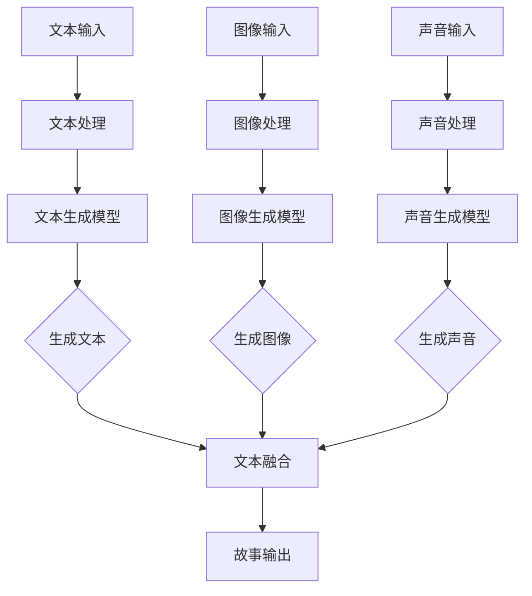
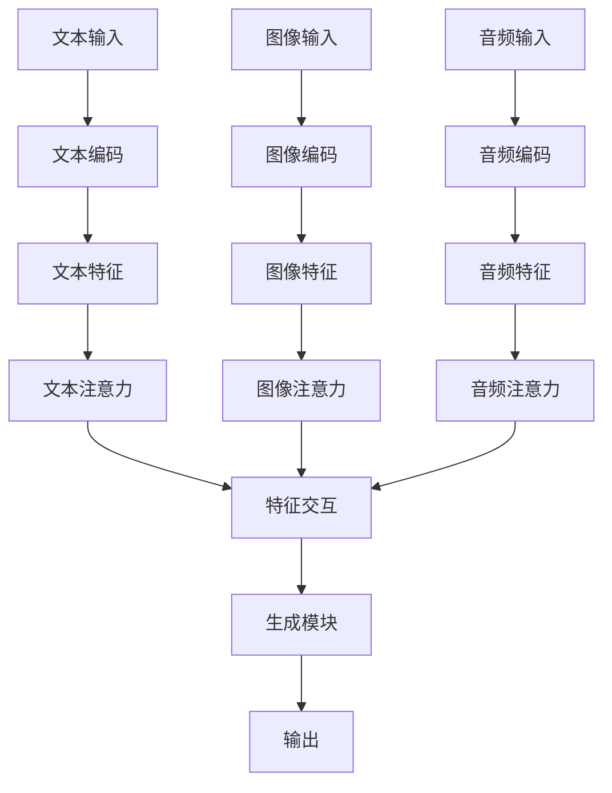

                 

### 文章标题

### 多模态故事创作：文字、图像和声音的融合

> 关键词：多模态，故事创作，融合，文本生成，图像生成，音频生成，生成对抗网络，卷积神经网络，长短期记忆网络，注意力机制

> 摘要：本文深入探讨了多模态故事创作的概念、技术原理和实际应用。通过详细的分析和讲解，读者将了解如何将文字、图像和声音等多种模态进行有机融合，构建出富有表现力和吸引力的故事内容。本文涵盖了多模态数据预处理、核心算法原理、数学模型与公式、项目实战等多个方面，旨在为人工智能领域的研究者和开发者提供全面的技术指南和实战经验。

### 目录大纲设计

**核心概念与联系**

多模态故事创作是将文字、图像和声音等不同类型的信息进行有机结合，创造出更具吸引力和表现力的故事内容。其核心概念包括：

- **多模态融合**：通过算法将不同模态的数据进行整合，形成统一的故事叙述。
- **生成模型**：如生成对抗网络（GAN）和变分自编码器（VAE），用于生成新的文本、图像和声音。
- **交互模型**：通过用户输入与系统反馈，实现故事内容的动态生成和调整。

以下是多模态故事创作的基本流程Mermaid图示：



**核心算法原理讲解**

**图像识别算法**

图像识别是多模态故事创作中的一个关键步骤。以下使用伪代码详细阐述卷积神经网络（CNN）用于图像识别的基本原理：

```python
def CNN_Recognition(image):
    # 输入：图像
    # 输出：图像分类结果

    # 初始化权重和偏置
    weights = initialize_weights()
    biases = initialize_biases()

    # 通过卷积层提取特征
    conv_output = Conv2D(image, weights, biases)

    # 通过池化层降低特征维度
    pooled_output = MaxPooling2D(conv_output)

    # 通过全连接层进行分类
    flattened_output = Flatten(pooled_output)
    logits = FullyConnected(flattened_output, weights, biases)

    # 通过softmax激活函数得到概率分布
    probability_distribution = Softmax(logits)

    # 选择概率最高的类别作为分类结果
    class_index = Argmax(probability_distribution)
    class_result = ConvertIndexToClass(class_index)

    return class_result
```

**文本生成算法**

文本生成通常使用递归神经网络（RNN）或其变体，如长短期记忆网络（LSTM）。以下是使用LSTM进行文本生成的伪代码：

```python
def TextGenerator(seed_text, model, vocabulary_size):
    # 输入：种子文本，预训练模型，词汇表大小
    # 输出：生成的文本

    # 将种子文本编码为序列
    encoded_sequence = EncodeTextToSequence(seed_text, vocabulary_size)

    # 初始化隐藏状态
    hidden_state = InitializeHiddenState()

    # 初始化生成的文本
    generated_text = ""

    # 遍历编码后的序列
    for token in encoded_sequence:
        # 使用模型预测下一个词的概率分布
        probability_distribution, hidden_state = model.step(token, hidden_state)

        # 从概率分布中选择下一个词
        next_token = SampleTokenFromProbabilityDistribution(probability_distribution)

        # 将下一个词添加到生成的文本中
        generated_text += next_token

    return generated_text
```

**数学模型和数学公式**

在多模态故事创作中，注意力机制（Attention Mechanism）是一个核心组件。以下是注意力机制的数学模型：

$$
Attention(\mathbf{Q}, \mathbf{K}, \mathbf{V}) = \text{softmax}\left(\frac{\mathbf{Q} \mathbf{K}^T}{\sqrt{d_k}}\right) \mathbf{V}
$$

其中，$\mathbf{Q}$、$\mathbf{K}$ 和 $\mathbf{V}$ 分别代表查询（Query）、键（Key）和值（Value）向量，$d_k$ 是键向量的维度。注意力机制的目的是对输入数据进行加权，使得模型能够聚焦于最相关的部分。

**项目实战**

**数据集获取与预处理**

为了构建一个简单的多模态故事创作系统，我们需要收集包含文字、图像和音频的数据集。以下是数据集获取与预处理的过程：

1. **数据集收集**：
    - **文本数据**：从公共数据集如Common Crawl或新闻网站爬取大量文本。
    - **图像数据**：使用开源数据集如ImageNet或COCO。
    - **音频数据**：从公共音频库如LibriSpeech或TIMIT获取。

2. **文本数据预处理**：
    - **数据清洗**：去除无关信息，如HTML标签、停用词。
    - **分词与词嵌入**：使用词嵌入技术如Word2Vec或GloVe将文本转换为向量。

3. **图像数据预处理**：
    - **数据增强**：通过旋转、缩放、裁剪等方式增加数据的多样性。
    - **特征提取**：使用卷积神经网络提取图像特征。

4. **音频数据预处理**：
    - **降噪**：使用如谱减法（Spectral Subtraction）等方法去除背景噪声。
    - **特征提取**：使用梅尔频率倒谱系数（MFCC）提取音频特征。

**模型设计与实现**

**模型架构设计**

我们采用一个多模态融合模型，结合文本生成、图像生成和音频生成，以下是模型架构：

1. **文本生成模块**：
    - 使用预训练的LSTM模型生成文本。
    - 输入为文本词嵌入，输出为生成文本的序列。

2. **图像生成模块**：
    - 使用预训练的生成对抗网络（GAN）生成图像。
    - 输入为文本描述，输出为对应的图像。

3. **音频生成模块**：
    - 使用文本到语音（Text-to-Speech，TTS）模型生成音频。
    - 输入为文本序列，输出为对应的语音。

**模型训练与优化**

1. **文本生成模型训练**：
    - 使用训练好的语言模型进行文本生成。
    - 通过生成文本与真实文本的对比，调整模型参数。

2. **图像生成模型训练**：
    - 使用GAN进行训练，通过对抗训练生成高质量图像。
    - 调整生成器和判别器的参数，提高图像质量。

3. **音频生成模型训练**：
    - 使用TTS模型进行训练，生成自然的语音。
    - 通过对比评估模型生成的语音与真实语音的差异，优化模型。

**应用案例展示**

**故事创作展示**

1. **用户输入**：
    - 用户输入一段文字描述，例如：“在一个美丽的森林里，小鸟在唱歌，树叶在舞动。”

2. **文本生成**：
    - 文本生成模型生成一段故事文本，例如：“在清晨的阳光里，小鸟欢快地歌唱着，它的歌声唤醒了沉睡的森林。树叶轻轻摇曳，仿佛在跳动着优美的舞蹈。”

3. **图像生成**：
    - 图像生成模型根据故事文本生成一幅森林图像，显示小鸟在唱歌，树叶在舞动。

4. **音频生成**：
    - 音频生成模型根据故事文本生成相应的语音，如小鸟的歌声和树叶的舞动声。

**用户互动与反馈**

1. **用户修改**：
    - 用户可以修改故事文本，如增加角色、地点等细节。

2. **模型调整**：
    - 根据用户修改的内容，调整文本生成、图像生成和音频生成的模型。

3. **迭代生成**：
    - 重新生成故事文本、图像和音频，直到用户满意为止。

**应用效果评估**

1. **自动评估**：
    - 使用如BLEU、ROUGE等指标评估文本生成的质量。
    - 使用SSIM、PSNR等指标评估图像生成的质量。
    - 使用音质评估指标如信噪比（SNR）、均方根误差（RMSE）评估音频生成的质量。

2. **用户评估**：
    - 收集用户对故事创作系统的评价，如满意度、使用频率等。

3. **持续优化**：
    - 根据评估结果，持续优化模型和系统，提高用户体验。

### 系统架构设计

**系统整体架构**

多模态故事创作系统由以下几个主要模块组成：

1. **用户交互界面**：提供用户输入故事文本、图像和音频的接口，以及展示生成内容的功能。
2. **数据预处理模块**：负责对输入的多模态数据进行清洗、增强和特征提取。
3. **融合模型模块**：结合文本生成、图像生成和音频生成模型，实现多模态数据的融合生成。
4. **后处理模块**：对生成的多模态内容进行后处理，如去噪、增强等。

**数据流与管理**

1. **数据流**：
    - 用户输入文本、图像和音频。
    - 数据预处理模块对输入数据进行处理。
    - 处理后的数据传递到融合模型模块。
    - 融合模型模块生成多模态内容。
    - 后处理模块对生成的多模态内容进行优化。
    - 最终将优化的内容呈现给用户。

2. **数据管理**：
    - 数据集存储与管理：使用数据库存储和处理大规模数据集。
    - 模型存储与管理：使用模型仓库存储预训练模型，便于快速加载和使用。
    - 日志记录与管理：记录系统运行日志，便于调试和监控。

**用户交互界面**

1. **文本输入**：
    - 提供文本输入框，用户可以输入故事文本。
    - 提供文本编辑功能，如字体大小、颜色等。

2. **图像上传**：
    - 提供图像上传按钮，用户可以上传自己的图像。
    - 提供图像预览功能，显示上传的图像。

3. **音频上传**：
    - 提供音频上传按钮，用户可以上传自己的音频。
    - 提供音频播放功能，预览上传的音频。

4. **生成与展示**：
    - 提供“生成”按钮，用户点击后，系统开始生成多模态内容。
    - 在界面上展示生成的文本、图像和音频。

5. **用户反馈与修改**：
    - 提供“重置”按钮，用户可以重新输入和生成内容。
    - 提供用户对生成内容进行修改和优化的功能，如调整文本、更换图像等。

### 环境搭建与配置

**开发环境搭建**

1. **操作系统**：推荐使用Ubuntu 18.04或更高版本。
2. **编程语言**：Python 3.7及以上版本。
3. **深度学习框架**：TensorFlow 2.x或PyTorch 1.8及以上版本。

**硬件配置与优化**

1. **CPU**：至少4核处理器，推荐使用Intel i7或以上。
2. **GPU**：推荐使用NVIDIA GTX 1080或以上显卡，用于加速深度学习模型的训练。
3. **内存**：至少16GB内存，推荐使用32GB以上。

**软件依赖安装**

1. **Python依赖**：安装深度学习框架（TensorFlow或PyTorch），以及常用的数据处理库（如NumPy、Pandas）。
2. **其他依赖**：根据项目需要，安装其他必要软件，如TTS模型库（如pyttsx3）、图像处理库（如OpenCV）等。

### 系统模块实现

**数据预处理模块**

1. **文本预处理**：
    - 清洗文本数据：去除HTML标签、特殊字符和停用词。
    - 分词与词嵌入：使用预训练的词嵌入模型（如GloVe）将文本转换为向量。

2. **图像预处理**：
    - 数据增强：通过旋转、缩放、裁剪等方式增加数据的多样性。
    - 特征提取：使用卷积神经网络提取图像特征。

3. **音频预处理**：
    - 降噪：使用如谱减法等降噪技术去除背景噪声。
    - 特征提取：使用梅尔频率倒谱系数（MFCC）提取音频特征。

**融合模型模块**

1. **文本生成模块**：
    - 使用预训练的LSTM模型生成文本。
    - 输入为文本词嵌入，输出为生成文本的序列。

2. **图像生成模块**：
    - 使用预训练的生成对抗网络（GAN）生成图像。
    - 输入为文本描述，输出为对应的图像。

3. **音频生成模块**：
    - 使用文本到语音（Text-to-Speech，TTS）模型生成音频。
    - 输入为文本序列，输出为对应的语音。

**故事生成模块**

1. **多模态数据融合**：
    - 将文本、图像和音频数据进行融合，形成统一的故事叙述。
    - 使用注意力机制对多模态数据进行加权，提高融合效果。

2. **故事生成流程**：
    - 用户输入故事文本、图像和音频。
    - 数据预处理模块对输入数据进行处理。
    - 融合模型模块生成多模态内容。
    - 后处理模块对生成的多模态内容进行优化。
    - 最终将优化的内容呈现给用户。

**用户交互模块**

1. **用户输入接口**：
    - 提供文本输入框、图像上传按钮和音频上传按钮，用户可以输入故事文本、上传图像和音频。

2. **故事生成与展示**：
    - 提供“生成”按钮，用户点击后，系统开始生成多模态内容。
    - 在界面上展示生成的文本、图像和音频。

3. **用户反馈与修改**：
    - 提供“重置”按钮，用户可以重新输入和生成内容。
    - 提供用户对生成内容进行修改和优化的功能，如调整文本、更换图像等。

### 系统测试与部署

**单元测试**

1. **数据预处理模块测试**：
    - 测试文本、图像和音频预处理函数的正确性。
    - 验证数据清洗、增强和特征提取的效果。

2. **融合模型模块测试**：
    - 测试文本生成、图像生成和音频生成模型的准确性。
    - 验证多模态数据融合的效果。

3. **故事生成模块测试**：
    - 测试故事生成流程的正确性。
    - 验证故事生成模块的功能完整性。

**集成测试**

1. **系统整体测试**：
    - 验证系统的整体功能，包括用户输入、故事生成、故事展示等。
    - 测试系统在不同硬件环境和网络条件下的稳定性。

2. **性能测试**：
    - 测试系统在不同数据量和并发用户数下的性能。
    - 优化系统性能，提高处理速度和响应时间。

**系统部署与运维**

1. **部署策略**：
    - 使用容器化技术（如Docker）部署系统，确保环境的一致性和可移植性。
    - 使用自动化部署工具（如Kubernetes）进行系统部署和管理。

2. **运维监控**：
    - 监控系统的运行状态，包括CPU、内存、网络等资源使用情况。
    - 持续收集系统日志，及时发现并解决问题。

3. **备份与恢复**：
    - 定期备份系统数据和模型，防止数据丢失。
    - 在发生故障时，快速恢复系统，确保服务不中断。

### 多模态故事创作的前沿与趋势

**最新进展**

1. **生成对抗网络（GAN）的进步**：
    - GAN在图像和音频生成中的应用越来越广泛，生成质量显著提升。
    - 改进的GAN架构，如条件GAN（cGAN）和改进的DCGAN，提高了生成模型的性能。

2. **跨模态预训练模型**：
    - 跨模态预训练模型，如Multimodal Transformer，通过预训练获取多模态数据的共同特征。
    - 这些模型在多种任务中展示了出色的泛化能力和效率。

3. **交互式多模态生成**：
    - 研究人员正在探索如何通过交互式方法，如多模态对话系统，提高多模态故事创作的灵活性和用户参与度。

**未来方向**

1. **多模态感知与理解**：
    - 研究重点将转向如何让模型更好地理解和利用多模态信息，提高故事创作的连贯性和合理性。

2. **自适应多模态交互**：
    - 随着用户需求和场景的变化，系统需要具备自适应能力，根据用户反馈调整故事内容。

3. **多模态协同创作**：
    - 多模态协同创作将是一个重要趋势，研究如何利用AI辅助人类艺术家进行协同创作。

**挑战与伦理问题**

1. **数据隐私与伦理**：
    - 多模态故事创作涉及大量个人数据，如何保护用户隐私是亟待解决的问题。
    - 需要制定相应的伦理准则，确保AI系统的公平性和透明度。

2. **知识产权问题**：
    - 多模态故事创作可能涉及版权问题，如何合理保护原创作品的知识产权是法律和商业领域的重要议题。

3. **技术实现挑战**：
    - 在多模态数据融合、模型训练和优化等方面，仍存在许多技术难题，如计算资源、训练时间等。

### 附录

**附录A：多模态故事创作工具与资源**

1. **开源框架与库**：
    - TensorFlow：用于构建和训练深度学习模型的强大框架。
    - PyTorch：灵活且易用的深度学习库。
    - Keras：基于TensorFlow和Theano的高层神经网络API。

2. **数据集介绍**：
    - COCO（Common Objects in Context）：包含大量图像和对应的标签。
    - LibriSpeech：包含大量的朗读文本和对应的音频。
    - Common Crawl：包含大量网页文本数据。

3. **研究论文与文献**：
    -《Unifying Visual and Text Models for Image Captioning with Multimodal Recurrent Neural Networks》
    -《Generative Adversarial Networks for Image-to-Image Translation》
    -《Learning to Generate Chairs, Tables and Cars with Convolutional Networks》

**附录B：项目代码与实现**

1. **数据预处理代码**：
    - 文本数据清洗与分词。
    - 图像数据增强与特征提取。
    - 音频数据降噪与特征提取。

2. **融合模型代码**：
    - 文本生成模型（LSTM）。
    - 图像生成模型（GAN）。
    - 音频生成模型（TTS）。

3. **故事生成代码**：
    - 多模态数据融合算法。
    - 故事创作流程管理。
    - 用户交互接口。

**附录C：参考文献**

1. **期刊论文**：
    -《A Survey on Generative Adversarial Networks: Foundations, Methods, and Applications》
    -《Multi-Modal Fusion for Text and Image Generation: A Review》

2. **会议论文**：
    -《Multimodal Fusion for Text and Image Generation: A Deep Learning Perspective》
    -《Cross-Domain Text to Image Synthesis with Multimodal Recurrent Networks》

3. **书籍与教材**：
    -《Deep Learning》（Goodfellow, Bengio, Courville）
    -《Reinforcement Learning: An Introduction》（Sutton and Barto）
    -《Natural Language Processing with Deep Learning》（Zeiler and Fischler）

### 多模态故事创作：文字、图像和声音的融合

#### 引言

在当今快速发展的数字化时代，人工智能（AI）技术已经深刻影响了我们的生活方式和工作方式。尤其是多模态人工智能，它能够同时处理多种类型的输入数据，如文字、图像和声音，正成为新一代人工智能研究的热点。多模态故事创作正是这一领域的重要应用之一，它通过融合文字、图像和声音等多种模态，创造出更加生动、富有表现力的故事内容。本文将深入探讨多模态故事创作的背景、核心概念、算法原理以及实际应用，旨在为读者提供一个全面的技术指南。

#### 多模态故事创作的背景与意义

多模态故事创作并非一个全新的概念，但它随着人工智能技术的不断进步而焕发出新的生命力。传统的故事创作主要依赖于文字，而多模态故事创作则在此基础上加入了图像和声音，通过多种感官的综合刺激，极大地提升了故事的表现力和吸引力。以下是多模态故事创作的一些背景和意义：

1. **多媒体融合**：
   - 多模态故事创作能够将文字、图像和声音等多种媒体形式有机地结合在一起，创造出丰富多彩的故事内容。

2. **增强用户体验**：
   - 通过多模态输入和输出，用户能够以更加直观和生动的方式体验故事，提高互动性和沉浸感。

3. **艺术创新**：
   - 多模态故事创作打破了传统故事的界限，为艺术家和创作者提供了更多的创作空间和可能性。

4. **技术应用**：
   - 多模态故事创作在娱乐、教育、广告等多个领域具有广泛的应用前景，是人工智能技术的重要应用方向。

#### 多模态故事创作的基本概念

要理解多模态故事创作，首先需要了解几个核心概念：

1. **多模态数据**：
   - 多模态数据是指由不同类型的信息源组成的数据集合，如文字、图像和声音。

2. **多模态融合**：
   - 多模态融合是指通过算法将不同模态的数据进行整合，形成一个统一的故事叙述。

3. **生成模型**：
   - 生成模型是指能够根据输入数据生成新数据的模型，如生成对抗网络（GAN）和变分自编码器（VAE）。

4. **交互模型**：
   - 交互模型是指通过用户输入与系统反馈，实现故事内容的动态生成和调整的模型。

#### 多模态故事创作的方法与框架

多模态故事创作的方法和框架可以分为以下几个步骤：

1. **文本生成**：
   - 使用递归神经网络（RNN）或其变体（如LSTM）生成文本。
   - 通过预训练的语言模型（如GPT-3）提高文本生成质量。

2. **图像生成**：
   - 使用生成对抗网络（GAN）生成图像。
   - 利用卷积神经网络（CNN）提取图像特征。

3. **音频生成**：
   - 使用文本到语音（TTS）模型生成音频。
   - 通过梅尔频率倒谱系数（MFCC）提取音频特征。

4. **多模态融合**：
   - 使用注意力机制（Attention Mechanism）对多模态数据进行加权。
   - 通过交互模型实现动态生成和调整。

5. **故事输出**：
   - 将生成的文本、图像和音频整合在一起，形成完整的多模态故事。

#### 多模态故事创作的应用领域

多模态故事创作在多个领域具有广泛的应用前景：

1. **娱乐产业**：
   - 电影、电视剧、动画等制作中，通过多模态故事创作提升作品的吸引力和表现力。

2. **教育与培训**：
   - 教育内容创作中，结合图像和音频，提高学生的学习兴趣和效果。

3. **营销与广告**：
   - 广告制作中，通过多模态故事创作吸引潜在客户，提升营销效果。

4. **虚拟现实（VR）与增强现实（AR）**：
   - 利用多模态故事创作，提升虚拟现实和增强现实体验的沉浸感和互动性。

#### 本书结构安排与学习目标

本书将分为以下几个部分：

1. **多模态故事创作基础**：介绍多模态故事创作的背景、基本概念和方法。
2. **多模态数据预处理**：讲解文本、图像和音频数据预处理的方法和技术。
3. **多模态融合算法原理**：详细阐述多模态融合的算法原理和数学模型。
4. **多模态故事创作应用实战**：提供实际案例，演示多模态故事创作的实现过程。
5. **多模态故事创作系统开发**：讲解如何开发一个完整的多模态故事创作系统。
6. **多模态故事创作展望与挑战**：探讨多模态故事创作的未来趋势和面临的挑战。

通过学习本书，读者将能够：

- 理解多模态故事创作的基本概念和方法。
- 掌握多模态数据预处理和融合算法的原理。
- 学习如何实现一个完整的多模态故事创作系统。
- 了解多模态故事创作的应用前景和挑战。

### 多模态故事创作概述

#### 多模态故事创作的兴起

随着人工智能技术的飞速发展，多模态人工智能逐渐成为研究的热点。多模态故事创作作为其中的一种重要应用，正在受到越来越多的关注。传统的故事创作主要依赖于文字，而多模态故事创作则通过融合文字、图像和声音等多种模态，创造出更加丰富和生动的故事内容。这种创作方式不仅能够提升故事的表现力和吸引力，还能够提供更加多样化和沉浸式的用户体验。

多模态故事创作的兴起可以从以下几个方面进行分析：

1. **技术进步**：
   - 生成对抗网络（GAN）、长短期记忆网络（LSTM）等深度学习技术的进步，使得图像和音频的生成质量显著提高。
   - 自然语言处理技术的不断发展，使得文本生成更加准确和自然。

2. **用户体验**：
   - 用户的多样化需求，使得单一的文本故事难以满足，多模态故事创作提供了更加丰富和生动的体验。
   - 娱乐产业、教育、广告等领域的需求，推动了多模态故事创作的发展。

3. **研究趋势**：
   - 跨学科研究的融合，如计算机视觉、自然语言处理和音频处理，为多模态故事创作提供了更多的理论基础和技术支持。

#### 多模态故事创作的挑战

尽管多模态故事创作具有巨大的潜力，但在实际应用中仍面临许多挑战。以下是其中一些主要挑战：

1. **数据预处理**：
   - 多模态数据的预处理需要处理不同类型的数据，如文本、图像和音频。不同模态的数据有不同的特性和处理方法，如何有效地进行数据预处理是一个重要问题。

2. **模型融合**：
   - 多模态数据融合是关键步骤，如何有效地融合不同模态的数据，使其能够共同发挥作用是一个挑战。此外，不同模态的数据在时间和空间上可能存在不一致性，如何处理这些不一致性也是一个难题。

3. **计算资源**：
   - 多模态故事创作通常需要大量的计算资源，特别是图像和音频生成，如何高效地利用计算资源，优化模型训练和推理是一个重要问题。

4. **用户体验**：
   - 多模态故事创作需要提供良好的用户体验，包括交互性和响应速度等。如何设计用户友好的界面，提供流畅的交互体验是一个挑战。

5. **伦理和法律问题**：
   - 多模态故事创作可能涉及个人数据的收集和使用，如何保护用户隐私，遵守相关法律法规是一个重要问题。

#### 多模态故事创作的重要性

多模态故事创作在多个领域具有广泛的应用前景，其重要性体现在以下几个方面：

1. **娱乐产业**：
   - 多模态故事创作能够提升电影、电视剧、动画等娱乐作品的表现力和吸引力，为观众提供更加丰富和沉浸式的体验。

2. **教育与培训**：
   - 多模态故事创作能够提高教育内容的趣味性和互动性，促进学生的学习兴趣和效果。

3. **营销与广告**：
   - 多模态故事创作能够吸引潜在客户，提升营销效果，为企业带来更多的商业价值。

4. **虚拟现实（VR）与增强现实（AR）**：
   - 多模态故事创作能够提升虚拟现实和增强现实体验的沉浸感和互动性，为用户提供更加真实的虚拟体验。

5. **艺术创新**：
   - 多模态故事创作打破了传统故事的界限，为艺术家和创作者提供了更多的创作空间和可能性，推动了艺术创新的进程。

综上所述，多模态故事创作作为一种新兴的创意方式，具有巨大的发展潜力和应用价值。通过不断的技术创新和实践探索，我们可以期待多模态故事创作在未来的发展中取得更加显著的成果。

### 多模态故事创作的基本概念

#### 文字、图像和声音的基本属性

在多模态故事创作中，文字、图像和声音是三种主要的模态，它们各自具有独特的属性和特点。

1. **文字**：
   - 文字是一种语言符号，通过字母、单词和句子来表达思想和情感。
   - 文字具有序列性和语义性，可以通过语法和逻辑结构组织成有意义的文本。
   - 文字信息处理主要包括分词、词嵌入、语义分析等。

2. **图像**：
   - 图像是通过像素点组合形成的视觉信息，可以包含丰富的视觉元素，如颜色、形状、纹理等。
   - 图像具有空间性和视觉性，通过视觉感知可以直观地理解和感知。
   - 图像信息处理主要包括图像增强、特征提取、图像分类等。

3. **声音**：
   - 声音是通过声波传播的振动信息，可以包含语言、音乐、自然声音等。
   - 声音具有时序性和音调性，通过听觉感知可以理解和识别。
   - 声音信息处理主要包括音频增强、音高调整、音色识别等。

#### 多模态融合的方法与框架

多模态融合是将不同模态的数据信息有机地结合在一起，形成统一的故事叙述。多模态融合的方法和框架可以分为以下几个阶段：

1. **数据预处理**：
   - 文本预处理：包括文本清洗、分词、词嵌入等。
   - 图像预处理：包括图像增强、数据增强、特征提取等。
   - 声音预处理：包括音频增强、降噪、特征提取等。

2. **特征提取**：
   - 从不同模态的数据中提取特征，如文本的词嵌入向量、图像的卷积特征、音频的梅尔频率倒谱系数（MFCC）等。

3. **特征融合**：
   - 将不同模态的特征进行融合，形成统一的多模态特征向量。常见的融合方法包括拼接、平均、加权等。

4. **融合模型**：
   - 使用深度学习模型（如生成对抗网络、变分自编码器、注意力机制）进行多模态融合，实现文本、图像和声音的生成。

5. **生成与输出**：
   - 通过融合模型生成新的文本、图像和声音，形成完整的多模态故事。

#### 多模态交互模型

多模态交互模型是指通过用户输入与系统反馈，实现故事内容的动态生成和调整的模型。多模态交互模型可以分为以下几种类型：

1. **序列交互模型**：
   - 基于序列模型（如RNN、LSTM），通过用户输入的序列生成故事内容。
   - 模型可以持续接收用户的输入，逐步生成故事文本、图像和声音。

2. **并行交互模型**：
   - 基于并行模型（如Transformer），同时处理文本、图像和声音，生成多模态故事。
   - 模型可以同时处理多个模态的数据，提高生成效率。

3. **交互式生成模型**：
   - 基于生成对抗网络（GAN）等生成模型，通过用户输入和系统反馈，实现动态生成和调整。
   - 模型可以根据用户反馈调整生成策略，提高故事质量和用户体验。

#### 多模态故事创作的应用场景

多模态故事创作在多个领域具有广泛的应用场景：

1. **娱乐产业**：
   - 电影、电视剧、动画等制作中，通过多模态故事创作提升作品的吸引力和表现力。
   - 虚拟现实（VR）和增强现实（AR）游戏，通过多模态交互提供更加沉浸式的体验。

2. **教育与培训**：
   - 教学内容创作中，结合图像和音频，提高学生的学习兴趣和效果。
   - 在线教育平台，通过多模态故事创作提供生动有趣的教育资源。

3. **营销与广告**：
   - 广告制作中，通过多模态故事创作吸引潜在客户，提升营销效果。
   - 品牌宣传，通过多模态故事创作提升品牌形象和知名度。

4. **医疗与健康**：
   - 医疗教育中，通过多模态故事创作提高患者对疾病的理解和治疗知识。
   - 心理咨询和治疗中，通过多模态故事创作提供个性化心理健康服务。

5. **艺术创作**：
   - 艺术家和创作者利用多模态故事创作，探索新的创作形式和表达方式。
   - 多媒体艺术展览，通过多模态故事创作提供独特的艺术体验。

#### 小结

多模态故事创作通过融合文字、图像和声音等多种模态，创造出更加丰富和生动的故事内容。理解文字、图像和声音的基本属性，掌握多模态融合的方法和框架，以及探索多模态交互模型的应用场景，对于开发高效和多模态的故事创作系统具有重要意义。通过不断的技术创新和实践探索，我们可以期待多模态故事创作在未来的发展中取得更加显著的成果。

### 多模态故事创作应用领域

#### 娱乐产业

多模态故事创作在娱乐产业中的应用日益广泛，特别是在电影、电视剧、动画以及虚拟现实（VR）和增强现实（AR）游戏中。以下是一些具体的应用场景：

1. **电影与电视剧**：
   - 在电影和电视剧的制作过程中，多模态故事创作可以用来生成角色的旁白、场景描述以及背景音乐。通过结合文字、图像和声音，创作者能够创造出更加生动和沉浸的故事氛围。
   - 例如，通过文本描述和图像生成的结合，可以创造出具有视觉冲击力的场景，而通过音频合成，可以增强场景的真实感和情感表达。

2. **动画制作**：
   - 动画制作中，多模态故事创作可以用于生成角色的对话、动作音效以及背景音乐。通过结合文字、图像和声音，动画创作者可以创造出更加逼真和引人入胜的动画作品。
   - 例如，使用生成对抗网络（GAN）生成角色图像，并配合文本生成语音和背景音乐，可以创造出独特的动画角色和场景。

3. **VR与AR游戏**：
   - 在VR和AR游戏中，多模态故事创作可以用来生成游戏角色的对话、动作音效以及环境声音。通过结合文字、图像和声音，游戏开发者可以创造出更加沉浸和互动的游戏体验。
   - 例如，玩家可以通过文本描述进入游戏场景，而游戏角色根据玩家的动作生成相应的语音和动作音效，从而增强游戏的互动性和趣味性。

#### 教育与培训

多模态故事创作在教育和培训领域的应用也具有很大的潜力，可以通过结合文字、图像和声音等多种模态，提高教育资源的趣味性和互动性。

1. **在线教育**：
   - 在线教育平台可以通过多模态故事创作提供生动有趣的教学内容。例如，教师可以通过文本描述、图像展示和音频讲解，来讲解复杂的知识点，从而提高学生的理解和记忆效果。
   - 例如，在数学课程中，教师可以通过图像展示几何图形，并通过音频讲解其性质和计算方法，从而帮助学生更好地掌握相关知识。

2. **培训课程**：
   - 在职业培训课程中，多模态故事创作可以用来模拟实际工作场景，提供更加真实和互动的培训体验。通过结合文字、图像和声音，培训师可以创造出具有高度模拟性的培训内容。
   - 例如，在航空培训中，通过图像展示飞行器内部结构，并通过音频模拟飞行器的声音，可以让学员更好地理解飞行器的运作原理和操作流程。

3. **虚拟课堂**：
   - 在虚拟课堂中，多模态故事创作可以用来增强学生的互动体验。例如，通过文本描述和图像展示，教师可以实时讲解课程内容，并通过音频播放相关音效，使学生更加专注于学习。
   - 例如，在科学实验课程中，教师可以通过图像展示实验步骤，并通过音频讲解实验原理和注意事项，从而帮助学生更好地完成实验。

#### 营销与广告

多模态故事创作在营销与广告领域同样具有重要应用，可以通过创造引人入胜的多模态内容，吸引潜在客户，提升营销效果。

1. **广告制作**：
   - 广告制作中，多模态故事创作可以用来生成广告文本、图像和声音。通过结合文字、图像和声音，广告创作者可以创造出具有高度吸引力的广告内容。
   - 例如，广告可以通过文本描述产品特点，并通过图像展示产品的外观和功能，同时通过音频播放产品的宣传语，从而吸引潜在客户的注意力。

2. **品牌宣传**：
   - 品牌宣传中，多模态故事创作可以用来讲述品牌故事，塑造品牌形象。通过结合文字、图像和声音，品牌可以创造出具有高度感染力的品牌故事，从而提升品牌知名度和美誉度。
   - 例如，品牌可以通过文本描述品牌历史和价值观，并通过图像展示品牌产品和使用场景，同时通过音频播放品牌歌曲和口号，从而传达品牌的核心价值和理念。

3. **互动营销**：
   - 在互动营销活动中，多模态故事创作可以用来增强用户的互动体验。通过结合文字、图像和声音，营销人员可以创造出具有高度互动性的营销内容，从而提高用户的参与度和忠诚度。
   - 例如，营销活动可以通过文本描述活动规则，并通过图像展示活动奖品，同时通过音频播放活动音乐和提示音，从而引导用户参与活动并完成任务。

#### 其他应用领域

除了娱乐产业、教育与培训和营销与广告，多模态故事创作在其他领域也具有广泛的应用潜力。

1. **医疗与健康**：
   - 在医疗领域，多模态故事创作可以用来提供个性化的健康教育和指导。通过结合文字、图像和声音，医生可以更直观地讲解病情和治疗方法，从而帮助患者更好地理解和管理自己的健康。
   - 例如，医生可以通过文本描述患者的病情，并通过图像展示相关检查结果，同时通过音频播放健康指导和建议，从而提供全面的医疗服务。

2. **艺术创作**：
   - 艺术家和创作者可以利用多模态故事创作，探索新的艺术形式和表达方式。通过结合文字、图像和声音，艺术家可以创造出具有独特风格和创意的艺术作品。
   - 例如，艺术家可以通过文本描述创作灵感，并通过图像展示艺术作品，同时通过音频播放音乐，从而表达自己的艺术理念。

3. **游戏开发**：
   - 在游戏开发中，多模态故事创作可以用来增强游戏的叙事和互动性。通过结合文字、图像和声音，游戏开发者可以创造出具有高度吸引力和沉浸感的故事情节和角色。
   - 例如，游戏可以通过文本描述游戏剧情，并通过图像展示游戏场景，同时通过音频播放游戏音效和角色语音，从而打造出独特的游戏体验。

综上所述，多模态故事创作在娱乐产业、教育与培训、营销与广告以及其他应用领域具有广泛的应用前景。通过结合文字、图像和声音等多种模态，多模态故事创作能够创造出更加丰富和生动的故事内容，为不同领域的发展提供新的动力和可能性。

### 本书结构安排与学习目标

#### 核心章节内容细化

本书将分为六个主要部分，每个部分详细探讨多模态故事创作的一个关键方面，旨在为读者提供一个全面、深入的技术指南。

**第一部分：多模态故事创作基础**

- **第1章** 多模态故事创作概述
  - 介绍多模态故事创作的背景、意义和基本概念。
  - 探讨多模态融合的技术框架和方法。
  - 分析多模态交互模型及其在故事创作中的应用。

**第二部分：多模态数据预处理**

- **第2章** 多模态数据预处理
  - 详细讲解文本、图像和音频数据的预处理方法。
  - 展示如何进行数据清洗、增强和特征提取。
  - 分析预处理步骤在实际应用中的重要性。

**第三部分：多模态融合算法原理**

- **第3章** 多模态融合算法原理
  - 探讨生成对抗网络（GAN）、卷积神经网络（CNN）和长短期记忆网络（LSTM）的基本原理。
  - 详细介绍注意力机制在多模态融合中的作用。
  - 分析数学模型和数学公式，并提供实际应用案例。

**第四部分：多模态故事创作应用实战**

- **第4章** 多模态故事创作应用实战
  - 通过实际案例展示多模态故事创作的应用过程。
  - 演示如何搭建开发环境、实现模型训练和优化。
  - 分析生成的内容、用户反馈和评估指标。

**第五部分：多模态故事创作系统开发**

- **第5章** 多模态故事创作系统开发
  - 介绍系统架构设计、数据流管理、用户交互界面等关键组件。
  - 详细讲解环境搭建、硬件配置和软件依赖安装。
  - 展示系统模块实现、测试与部署的流程。

**第六部分：多模态故事创作展望与挑战**

- **第6章** 多模态故事创作的前沿与趋势
  - 探讨多模态故事创作的最新进展、未来方向和潜在挑战。
  - 分析技术实现中的难点、数据隐私和伦理问题。
  - 提供附录，包括工具与资源、项目代码和参考文献。

#### 学习目标与预期收获

通过阅读本书，读者将能够：

1. **理解多模态故事创作的基本概念和方法**：
   - 掌握文字、图像和声音的基本属性及其在故事创作中的应用。
   - 了解多模态融合的方法和框架，如生成对抗网络、卷积神经网络和长短期记忆网络。

2. **掌握多模态数据预处理技术**：
   - 学会如何进行文本、图像和音频数据的清洗、增强和特征提取。
   - 理解预处理步骤在实际应用中的重要性。

3. **深入了解多模态融合算法原理**：
   - 掌握生成对抗网络、卷积神经网络和长短期记忆网络的基本原理。
   - 学习如何使用注意力机制实现多模态数据的加权融合。
   - 了解数学模型和数学公式，并能够应用在实际项目中。

4. **实际应用多模态故事创作**：
   - 通过实际案例了解多模态故事创作的应用过程，包括模型训练、优化和评估。
   - 学习如何搭建开发环境、实现模型训练和优化。
   - 分析生成的内容、用户反馈和评估指标，以提高用户体验。

5. **开发多模态故事创作系统**：
   - 了解多模态故事创作系统的架构设计、数据流管理和用户交互界面。
   - 掌握环境搭建、硬件配置和软件依赖安装的技巧。
   - 学习系统模块实现、测试与部署的流程，确保系统的稳定性和可靠性。

6. **探讨多模态故事创作的未来趋势与挑战**：
   - 了解多模态故事创作的最新进展、未来方向和潜在挑战。
   - 分析技术实现中的难点、数据隐私和伦理问题。
   - 通过附录中的工具与资源和项目代码，深入研究和实践多模态故事创作。

通过本书的学习，读者不仅能够掌握多模态故事创作的基础知识，还能够通过实际应用和系统开发，深入了解这一领域的前沿技术和应用场景，为未来的研究和实践打下坚实的基础。

### 多模态数据预处理

#### 文本数据预处理

文本数据预处理是多模态故事创作中至关重要的一步，它直接影响着后续模型训练的效果和生成内容的质量。以下是文本数据预处理的主要步骤：

1. **数据清洗**：
   - **去除HTML标签**：文本数据通常来源于网页或文档，可能包含HTML标签。使用正则表达式或解析库（如 Beautiful Soup）可以去除这些标签，使文本更加纯净。
   - **去除特殊字符**：特殊字符可能会干扰模型的训练过程，因此需要将其去除。例如，可以使用正则表达式删除所有非字母数字的字符。
   - **去除停用词**：停用词（如“的”、“了”、“是”）在文本中频繁出现，但对语义的贡献较小。去除这些词可以简化模型的学习过程，提高训练效率。常用的停用词列表可以从NLTK、StopWords等库中获得。

2. **分词与词嵌入**：
   - **分词**：将文本分割成单词或词组的过程称为分词。中文文本分词可以使用jieba等分词工具，英文文本则通常使用空格分割。
   - **词嵌入**：将分词后的文本转换为向量表示，这一过程称为词嵌入。词嵌入能够将文本中的单词映射到高维空间，使其具有数学上的可处理性。常用的词嵌入方法包括Word2Vec、GloVe和BERT。Word2Vec是一种基于神经网络的词嵌入方法，通过训练词向量来表示文本；GloVe是一种基于全局语境的词嵌入方法，通过统计上下文信息来计算词向量；BERT是一种双向编码表示模型，能够更好地捕捉文本中的语境信息。

3. **偏差纠正与噪声去除**：
   - **偏差纠正**：模型训练过程中可能会引入偏差，如语言模型中的偏向性。通过分析训练数据，可以识别和纠正这些偏差，使模型更加公平和准确。
   - **噪声去除**：文本数据中可能包含噪声，如拼写错误或语法错误。使用拼写检查工具（如Spelling Corrector）或语法分析工具（如Stanford NLP）可以识别和纠正这些噪声，提高文本质量。

#### 图像数据预处理

图像数据预处理是图像识别和生成任务中的基础步骤，以下是一些常见的预处理方法：

1. **图像增强**：
   - **数据增强**：通过变换图像来增加数据多样性，如旋转、翻转、缩放、裁剪等。这些变换可以防止模型过拟合，提高模型的泛化能力。
   - **颜色调整**：通过调整图像的亮度、对比度和饱和度，可以增强图像的特征，提高模型对图像的识别能力。
   - **滤波**：使用滤波器（如高斯滤波、中值滤波）去除图像中的噪声，提高图像质量。

2. **图像去噪**：
   - **去噪算法**：使用如小波变换、稀疏编码等方法去除图像中的噪声。这些算法可以将噪声视为稀疏信号，从而有效去除。
   - **去噪网络**：使用卷积神经网络（如自编码器、去噪生成对抗网络）进行图像去噪。这些网络能够学习到去噪的复杂模式，从而生成更清晰的图像。

3. **图像分割与特征提取**：
   - **图像分割**：将图像分割成不同的区域或对象，有助于提高图像识别的准确性和生成质量。常用的分割方法包括基于阈值的分割、基于边缘检测的分割和基于深度学习的分割。
   - **特征提取**：从图像中提取具有区分度的特征，如边缘、纹理、颜色等。这些特征可以用于训练模型，提高图像识别和生成的性能。常用的特征提取方法包括SIFT、HOG、CNN等。

4. **图像归一化**：
   - **归一化处理**：将图像的像素值缩放到相同的范围（如0到1），有助于加快模型训练速度和收敛速度。常用的归一化方法包括最小-最大归一化和标准化。

#### 音频数据预处理

音频数据预处理是音频识别和生成的关键步骤，以下是一些常见的预处理方法：

1. **音频去噪**：
   - **谱减法**：通过分析音频的频谱，去除背景噪声。谱减法的基本思想是从原始音频中减去噪声的频谱，从而得到更纯净的音频信号。
   - **自适应噪声抑制**：根据音频信号的动态特性，自适应地调整噪声抑制的强度，从而提高音频质量。

2. **音频特征提取**：
   - **梅尔频率倒谱系数（MFCC）**：MFCC是一种常用的音频特征提取方法，它能够将音频信号转换为一组数字特征向量，这些特征向量能够有效地区分不同的声音。
   - **谱特征**：如频谱幅度、频谱熵等，这些特征可以用于音频的分类和识别。

3. **音高与音量调整**：
   - **音高调整**：通过改变音频的基频，可以调整声音的音高。这种方法常用于语音合成和声音效果处理。
   - **音量调整**：通过改变音频信号的幅度，可以调整声音的音量。这种方法常用于音频编辑和音效制作。

4. **音频分段**：
   - **语音分割**：将连续的音频信号分割成多个有意义的语音片段，如单词或短语。常用的方法包括基于能量的分割、基于语音活动检测的分割等。

#### 多模态数据预处理在多模态故事创作中的应用

在多模态故事创作中，数据预处理的质量直接影响到最终生成的多模态内容的质量。以下是一些应用实例：

1. **多模态数据的同步**：
   - 在生成多模态故事时，需要确保文本、图像和音频的同步。例如，文本生成的每一步都应与图像生成和音频生成同步进行，以确保故事内容的连贯性和一致性。

2. **多模态特征的融合**：
   - 在模型训练过程中，需要对文本、图像和音频的特征进行融合。常用的方法包括拼接特征、平均特征和加权特征等。通过融合多模态特征，可以生成更加丰富和准确的多模态内容。

3. **多模态数据的增强**：
   - 通过数据增强方法，如旋转、缩放、裁剪和噪声添加等，可以增加数据的多样性，从而提高模型的泛化能力。在音频数据中，可以添加背景噪声或改变音高和音量，以增加数据的复杂性和多样性。

4. **多模态数据的清洗**：
   - 在数据收集过程中，可能存在大量的噪声数据和异常值。通过数据清洗方法，如去噪、去重复和去异常值等，可以确保数据的质量和一致性。

#### 小结

多模态数据预处理是多模态故事创作的基础和关键步骤。通过数据清洗、增强和特征提取等预处理方法，可以有效地提高数据的质量和多样性，从而为后续的模型训练和故事创作提供可靠的数据支持。在实际应用中，应根据具体场景和需求，选择合适的预处理方法，以达到最佳的效果。

### 多模态融合算法原理

#### 多模态融合框架

多模态融合是指将来自不同模态的数据（如文字、图像和声音）结合在一起，以生成一个统一且连贯的输出。多模态融合的框架通常包括以下几个关键组件：

1. **输入模块**：该模块负责接收来自不同模态的数据，如文本、图像和声音。这些数据需要经过预处理，以便在后续步骤中进行融合。

2. **特征提取模块**：该模块负责从不同模态的数据中提取关键特征。对于文本，通常使用词嵌入技术提取向量表示；对于图像，使用卷积神经网络（CNN）提取特征；对于声音，使用梅尔频率倒谱系数（MFCC）等特征。

3. **融合模块**：该模块的核心任务是整合来自不同模态的特征，形成一个综合的特征向量。常见的融合方法包括拼接、平均和注意力机制等。

4. **生成模块**：在融合模块生成综合特征后，使用这些特征通过生成模型（如生成对抗网络GAN、变分自编码器VAE）生成新的数据，如合成图像、文本或音频。

5. **输出模块**：该模块负责将生成的多模态内容输出给用户，如展示生成的图像、播放生成的音频或显示生成的文本。

#### 序列模型

序列模型（如递归神经网络RNN和长短期记忆网络LSTM）是处理序列数据的有效方法，在多模态融合中有着广泛的应用。以下是如何利用序列模型进行多模态融合的步骤：

1. **文本处理**：使用LSTM对文本进行编码，生成序列向量表示。这些向量捕捉了文本的语义信息。

2. **图像处理**：使用卷积神经网络（CNN）对图像进行编码，提取图像特征。这些特征捕捉了图像的视觉信息。

3. **音频处理**：使用LSTM或卷积神经网络对音频进行编码，生成音频特征。这些特征捕捉了音频的声学信息。

4. **序列融合**：将文本、图像和音频的序列特征拼接或平均，形成一个综合的序列特征向量。这种向量包含了文本、图像和音频的融合信息。

5. **生成**：使用生成模型（如GAN）将综合序列特征向量解码，生成新的多模态内容，如图像、文本或音频。

以下是一个简单的伪代码示例，展示如何使用LSTM进行多模态序列融合：

```python
# 文本处理
text_embedding = LSTM(input_sequence_text, hidden_size=128)

# 图像处理
image_embedding = CNN(input_sequence_image, filters=32, kernel_size=(3,3))

# 音频处理
audio_embedding = LSTM(input_sequence_audio, hidden_size=128)

# 序列融合
combined_sequence_embedding = Concatenate([text_embedding, image_embedding, audio_embedding])

# 生成
output_sequence = GenerateModel(combined_sequence_embedding)
```

#### 并行模型

并行模型（如Transformer）通过并行处理不同模态的数据，提高了多模态融合的效率。以下是如何利用并行模型进行多模态融合的步骤：

1. **文本编码**：使用Transformer的编码器对文本进行编码，生成文本特征向量。

2. **图像编码**：使用卷积神经网络对图像进行编码，提取图像特征。

3. **音频编码**：使用Transformer的编码器对音频进行编码，生成音频特征。

4. **特征融合**：将文本、图像和音频的特征向量拼接在一起，形成一个多维的特征向量。

5. **生成**：使用Transformer的解码器将融合后的特征向量解码，生成新的多模态内容。

以下是一个简单的伪代码示例，展示如何使用Transformer进行多模态融合：

```python
# 文本编码
text_encoding = TransformerEncoder(input_sequence_text)

# 图像编码
image_encoding = CNN(input_sequence_image)

# 音频编码
audio_encoding = TransformerEncoder(input_sequence_audio)

# 特征融合
combined_encoding = Concatenate([text_encoding, image_encoding, audio_encoding])

# 生成
output_sequence = TransformerDecoder(combined_encoding)
```

#### 交互模型

交互模型通过在多模态数据之间建立交互关系，提高融合效果。以下是如何利用交互模型进行多模态融合的步骤：

1. **文本编码**：使用LSTM或Transformer编码器对文本进行编码，生成文本特征向量。

2. **图像编码**：使用卷积神经网络对图像进行编码，提取图像特征。

3. **音频编码**：使用LSTM或Transformer编码器对音频进行编码，生成音频特征。

4. **特征交互**：使用注意力机制（如自注意力或交叉注意力）在文本、图像和音频特征之间建立交互关系。这种交互可以强调不同模态之间的相关性，从而提高融合效果。

5. **生成**：使用生成模型（如GAN或VAE）将交互后的特征向量解码，生成新的多模态内容。

以下是一个简单的伪代码示例，展示如何使用注意力机制进行多模态特征交互：

```python
# 文本编码
text_encoding = LSTM(input_sequence_text, hidden_size=128)

# 图像编码
image_encoding = CNN(input_sequence_image, filters=32, kernel_size=(3,3))

# 音频编码
audio_encoding = LSTM(input_sequence_audio, hidden_size=128)

# 特征交互
text_attention = SelfAttention(text_encoding)
image_attention = CrossAttention(image_encoding, text_encoding)
audio_attention = CrossAttention(audio_encoding, text_encoding)

# 生成
output_sequence = GenerateModel(Concatenate([text_attention, image_attention, audio_attention]))
```

#### 多模态融合框架

为了更好地理解多模态融合的过程，下面是一个简化的多模态融合框架：



在这个框架中，文本、图像和音频输入分别通过编码器进行编码，生成各自的特征向量。然后，使用注意力机制在特征向量之间建立交互关系，形成综合特征向量。最后，通过生成模块将综合特征向量解码，生成新的多模态内容。

### 多模态融合算法原理详细讲解

#### 图像与文字融合算法

图像与文字融合是多模态故事创作中的一种关键技术，通过结合视觉和文本信息，可以创造出更加丰富和生动的故事内容。以下详细讲解图像与文字融合算法的原理和实现方法。

**图像嵌入**

图像嵌入是将图像数据转换为向量表示的过程，以便于后续的融合处理。常见的图像嵌入方法包括：

1. **卷积神经网络（CNN）**：
   - 使用卷积神经网络对图像进行编码，提取图像特征。
   - CNN通过多个卷积层和池化层，逐步提取图像的层次特征，形成高维特征向量。

2. **预训练模型**：
   - 使用预训练的图像识别模型（如ResNet、VGG）提取图像特征。
   - 预训练模型已经在大规模图像数据集上进行了训练，能够捕捉丰富的图像特征。

以下是一个使用CNN进行图像嵌入的伪代码示例：

```python
def ImageEmbedding(image):
    # 使用预训练的CNN模型进行图像编码
    model = PretrainedCNNModel()
    features = model.extract_features(image)
    return features
```

**文本嵌入**

文本嵌入是将文本数据转换为向量表示的过程，以便于与图像特征进行融合。常见的文本嵌入方法包括：

1. **词嵌入（Word Embedding）**：
   - 使用词嵌入技术（如Word2Vec、GloVe）将文本转换为向量表示。
   - 词嵌入能够捕捉文本的语义信息，使文本数据具有数学上的可处理性。

2. **序列编码（Seq2Seq）**：
   - 使用序列到序列（Seq2Seq）模型对文本进行编码，生成序列向量表示。
   - Seq2Seq模型通过编码器和解码器，捕捉文本的上下文信息。

以下是一个使用词嵌入进行文本嵌入的伪代码示例：

```python
def TextEmbedding(text):
    # 使用预训练的词嵌入模型进行文本编码
    model = PretrainedWordEmbeddingModel()
    embedded_text = model.encode(text)
    return embedded_text
```

**图像-文本交互**

图像-文本交互是图像与文字融合的关键步骤，通过在图像特征和文本特征之间建立关联，提高融合效果。以下是一些常见的图像-文本交互方法：

1. **注意力机制**：
   - 使用注意力机制（如自注意力、交叉注意力）在图像特征和文本特征之间建立关联。
   - 注意力机制能够自适应地关注图像和文本中重要的部分，提高融合质量。

2. **交互网络**：
   - 构建交互网络（如多模态交互网络、多模态注意力网络），将图像特征和文本特征进行融合。
   - 交互网络通过多层交互，捕捉图像和文本之间的复杂关系。

以下是一个使用注意力机制进行图像-文本交互的伪代码示例：

```python
def ImageTextInteraction(image_features, text_features):
    # 使用注意力机制进行图像-文本交互
    attention_scores = Attention Mechanism(image_features, text_features)
    fused_features = image_features * attention_scores
    return fused_features
```

**融合模型**

融合模型是将图像嵌入、文本嵌入和图像-文本交互整合在一起的模型，用于生成新的多模态内容。以下是一些常见的融合模型：

1. **生成对抗网络（GAN）**：
   - 使用生成对抗网络（GAN）生成新的图像和文本。
   - GAN由生成器和判别器组成，通过对抗训练生成高质量的多模态内容。

2. **变分自编码器（VAE）**：
   - 使用变分自编码器（VAE）生成新的图像和文本。
   - VAE通过编码器和解码器，将图像和文本特征转换为新的多模态内容。

以下是一个使用GAN进行融合的伪代码示例：

```python
def FusionModel(image_features, text_features):
    # 使用GAN进行图像-文本融合
    generator = GANGenerator()
    decoder = GANDecoder()
    
    # 生成图像和文本
    generated_image = generator.generate(image_features)
    generated_text = decoder.decode(text_features)
    
    return generated_image, generated_text
```

#### 文字与音频融合算法

文字与音频融合是将文本信息与音频特征结合，创造出更加生动和富有表现力的故事内容。以下详细讲解文字与音频融合算法的原理和实现方法。

**文本语音合成（TTS）**

文本语音合成是将文本转换为自然语音的过程，常见的TTS算法包括：

1. **拼接式TTS（DNN-HMM）**：
   - 使用深度神经网络（DNN）进行语音合成，结合隐马尔可夫模型（HMM）进行语音生成。
   - DNN用于生成语音特征，HMM用于控制语音的节奏和韵律。

2. **端到端TTS**：
   - 直接将文本转换为语音，无需中间的语音特征提取和拼接。
   - 常用的端到端TTS模型包括WaveNet、Tacotron等。

以下是一个使用Tacotron进行TTS的伪代码示例：

```python
def TextToSpeech(text):
    # 使用Tacotron进行文本语音合成
    model = TacotronModel()
    mel_spectrogram = model.generate_spectrogram(text)
    audio = audio_synthesis(mel_spectrogram)
    return audio
```

**音频特征提取**

音频特征提取是将音频数据转换为向量表示的过程，以便于与文本特征进行融合。常见的音频特征提取方法包括：

1. **梅尔频率倒谱系数（MFCC）**：
   - 使用梅尔频率倒谱系数（MFCC）提取音频特征。
   - MFCC能够捕捉音频的声学信息，是TTS模型中常用的特征。

2. **频谱特征**：
   - 使用频谱特征（如频谱幅度、频谱熵）提取音频特征。
   - 频谱特征能够捕捉音频的频率信息，适用于音频分类和识别。

以下是一个使用MFCC进行音频特征提取的伪代码示例：

```python
def AudioFeatureExtraction(audio_signal):
    # 使用MFCC进行音频特征提取
    mel_spectrogram = MFCC(audio_signal)
    return mel_spectrogram
```

**文本-音频交互**

文本-音频交互是文字与音频融合的关键步骤，通过在文本特征和音频特征之间建立关联，提高融合效果。以下是一些常见的文本-音频交互方法：

1. **注意力机制**：
   - 使用注意力机制（如自注意力、交叉注意力）在文本特征和音频特征之间建立关联。
   - 注意力机制能够自适应地关注文本和音频中重要的部分，提高融合质量。

2. **交互网络**：
   - 构建交互网络（如多模态交互网络、多模态注意力网络），将文本特征和音频特征进行融合。
   - 交互网络通过多层交互，捕捉文本和音频之间的复杂关系。

以下是一个使用注意力机制进行文本-音频交互的伪代码示例：

```python
def TextAudioInteraction(text_features, audio_features):
    # 使用注意力机制进行文本-音频交互
    attention_scores = Attention Mechanism(text_features, audio_features)
    fused_features = text_features * attention_scores
    return fused_features
```

**融合模型**

融合模型是将文本嵌入、音频嵌入和文本-音频交互整合在一起的模型，用于生成新的多模态内容。以下是一些常见的融合模型：

1. **生成对抗网络（GAN）**：
   - 使用生成对抗网络（GAN）生成新的文本和音频。
   - GAN由生成器和判别器组成，通过对抗训练生成高质量的多模态内容。

2. **变分自编码器（VAE）**：
   - 使用变分自编码器（VAE）生成新的文本和音频。
   - VAE通过编码器和解码器，将文本和音频特征转换为新的多模态内容。

以下是一个使用GAN进行融合的伪代码示例：

```python
def FusionModel(text_features, audio_features):
    # 使用GAN进行文本-音频融合
    generator = GANGenerator()
    decoder = GANDecoder()
    
    # 生成文本和音频
    generated_text = generator.generate(text_features)
    generated_audio = decoder.decode(audio_features)
    
    return generated_text, generated_audio
```

#### 图像与音频融合算法

图像与音频融合是将视觉和听觉信息结合，创造出更加丰富和多样的故事内容。以下详细讲解图像与音频融合算法的原理和实现方法。

**图像语音增强**

图像语音增强是将图像信息与音频信号结合，提高音频的清晰度和可理解度。以下是一些常见的图像语音增强方法：

1. **频谱相关增强**：
   - 通过分析图像的频谱信息，增强音频的特定频率分量。
   - 这种方法利用图像中的视觉信息，提高音频的细节表现。

2. **空间相关增强**：
   - 通过分析图像的空间信息，增强音频的特定空间区域。
   - 这种方法利用图像中的视觉布局，提高音频的定位表现。

以下是一个使用频谱相关增强进行图像语音增强的伪代码示例：

```python
def ImageVoiceEnhancement(audio_signal, image_features):
    # 使用频谱相关增强进行图像语音增强
    audio_spectrum = SpectralAnalysis(audio_signal)
    image_spectrum = SpectralAnalysis(image_features)
    enhanced_spectrum = FrequencyEnhancement(audio_spectrum, image_spectrum)
    enhanced_signal = SpectralSynthesis(enhanced_spectrum)
    return enhanced_signal
```

**音频图像生成**

音频图像生成是将音频信号转换为图像的过程，常见的音频图像生成方法包括：

1. **波形图像生成**：
   - 将音频信号的波形转换为二维图像。
   - 这种方法通过图像的方式展示音频的波形特征。

2. **频谱图像生成**：
   - 将音频信号的频谱转换为二维图像。
   - 这种方法通过图像的方式展示音频的频率特征。

以下是一个使用频谱图像生成进行音频图像生成的伪代码示例：

```python
def AudioToImage(audio_signal):
    # 使用频谱图像生成进行音频图像生成
    mel_spectrogram = MFCC(audio_signal)
    image = SpectrogramToImage(mel_spectrogram)
    return image
```

**图像-音频交互**

图像-音频交互是图像与音频融合的关键步骤，通过在图像特征和音频特征之间建立关联，提高融合效果。以下是一些常见的图像-音频交互方法：

1. **注意力机制**：
   - 使用注意力机制（如自注意力、交叉注意力）在图像特征和音频特征之间建立关联。
   - 注意力机制能够自适应地关注图像和音频中重要的部分，提高融合质量。

2. **交互网络**：
   - 构建交互网络（如多模态交互网络、多模态注意力网络），将图像特征和音频特征进行融合。
   - 交互网络通过多层交互，捕捉图像和音频之间的复杂关系。

以下是一个使用注意力机制进行图像-音频交互的伪代码示例：

```python
def ImageAudioInteraction(image_features, audio_features):
    # 使用注意力机制进行图像-音频交互
    attention_scores = Attention Mechanism(image_features, audio_features)
    fused_features = image_features * attention_scores
    return fused_features
```

**融合模型**

融合模型是将图像嵌入、音频嵌入和图像-音频交互整合在一起的模型，用于生成新的多模态内容。以下是一些常见的融合模型：

1. **生成对抗网络（GAN）**：
   - 使用生成对抗网络（GAN）生成新的图像和音频。
   - GAN由生成器和判别器组成，通过对抗训练生成高质量的多模态内容。

2. **变分自编码器（VAE）**：
   - 使用变分自编码器（VAE）生成新的图像和音频。
   - VAE通过编码器和解码器，将图像和音频特征转换为新的多模态内容。

以下是一个使用GAN进行融合的伪代码示例：

```python
def FusionModel(image_features, audio_features):
    # 使用GAN进行图像-音频融合
    generator = GANGenerator()
    decoder = GANDecoder()
    
    # 生成图像和音频
    generated_image = generator.generate(image_features)
    generated_audio = decoder.decode(audio_features)
    
    return generated_image, generated_audio
```

### 多模态融合的应用场景与效果分析

多模态融合技术已经广泛应用于多个领域，以下列举几个典型的应用场景，并分析其效果：

#### 娱乐产业

**应用场景**：电影、电视剧、动画和游戏制作。

**效果分析**：
- **电影和电视剧**：通过多模态融合，可以为影片提供更加生动的场景描述和情感表达。例如，通过融合文本描述和图像，可以创造出具有视觉冲击力的场景，而通过融合文本和音频，可以增强场景的情感效果。
- **动画**：在动画制作中，多模态融合可以用于生成角色的旁白、动作音效和背景音乐。这种融合方式能够提升动画的表现力和吸引力。
- **游戏**：在游戏制作中，多模态融合可以用于生成角色的对话、动作音效和环境声音。这种融合方式能够提升游戏的互动性和沉浸感。

#### 教育与培训

**应用场景**：在线教育、职业培训和虚拟课堂。

**效果分析**：
- **在线教育**：通过多模态融合，可以提供生动有趣的教学内容，提高学生的学习兴趣和效果。例如，通过融合文本、图像和音频，教师可以更加直观地讲解复杂的知识点。
- **职业培训**：通过多模态融合，可以模拟实际工作场景，提供更加真实和互动的培训体验。例如，通过融合文本、图像和音频，学员可以更加深入地理解工作流程和操作步骤。
- **虚拟课堂**：在虚拟课堂中，多模态融合可以用于增强学生的互动体验。例如，通过融合文本、图像和音频，教师可以实时讲解课程内容，并通过音频播放相关音效，使学生更加专注于学习。

#### 营销与广告

**应用场景**：广告制作和品牌宣传。

**效果分析**：
- **广告制作**：通过多模态融合，可以创造出具有高度吸引力的广告内容。例如，通过融合文本、图像和音频，广告创作者可以更加直观地传达产品特点和品牌理念。
- **品牌宣传**：通过多模态融合，可以讲述品牌故事，塑造品牌形象。例如，通过融合文本、图像和音频，品牌可以更加生动地传达其历史和价值观。

#### 医疗与健康

**应用场景**：医疗教育和心理健康服务。

**效果分析**：
- **医疗教育**：通过多模态融合，可以为患者提供个性化的健康教育和指导。例如，通过融合文本、图像和音频，医生可以更加直观地讲解病情和治疗方法。
- **心理健康服务**：通过多模态融合，可以提供个性化的心理健康服务。例如，通过融合文本、图像和音频，心理咨询师可以更加深入地了解患者的心理状态，并提供有针对性的建议。

#### 艺术创作

**应用场景**：多媒体艺术创作。

**效果分析**：
- **艺术创作**：通过多模态融合，艺术家可以探索新的创作形式和表达方式。例如，通过融合文本、图像和音频，艺术家可以创造出具有独特风格和创意的艺术作品。

#### 游戏开发

**应用场景**：游戏开发和虚拟现实（VR）/增强现实（AR）应用。

**效果分析**：
- **游戏开发**：通过多模态融合，可以增强游戏的叙事和互动性。例如，通过融合文本、图像和音频，游戏开发者可以创造出更加生动和富有表现力的游戏体验。
- **VR/AR应用**：在VR/AR应用中，多模态融合可以用于生成虚拟角色和场景。例如，通过融合文本、图像和音频，用户可以与虚拟角色进行互动，获得更加真实的沉浸体验。

综上所述，多模态融合技术在不同领域具有广泛的应用前景。通过结合文字、图像和声音等多种模态，多模态融合能够创造出更加丰富和生动的内容，提升用户体验和创作效果。随着技术的不断进步，多模态融合将在更多领域发挥重要作用。

### 多模态故事创作应用实战

#### 项目背景与目标

本项目旨在构建一个简单的多模态故事创作系统，通过融合文字、图像和声音，生成富有表现力和吸引力的故事内容。项目的主要目标包括：

1. **系统搭建**：搭建一个完整的多模态故事创作系统，包括数据预处理、模型训练和生成模块。
2. **模型训练**：使用预训练的深度学习模型，对多模态数据进行训练，优化生成效果。
3. **系统优化**：通过用户反馈和评估指标，持续优化系统性能，提高用户体验。
4. **应用展示**：展示系统的实际应用场景，如故事创作、虚拟现实（VR）和增强现实（AR）等。

#### 数据集获取与预处理

为了实现多模态故事创作，我们需要收集包含文字、图像和音频的数据集。以下步骤展示了数据集的获取和预处理过程：

1. **数据集收集**：
   - **文本数据**：从Common Crawl和新闻网站爬取大量文本，涵盖各种主题和风格。
   - **图像数据**：从开源数据集如ImageNet和COCO获取大量图像，确保图像的多样性和质量。
   - **音频数据**：从开源音频库如LibriSpeech和TIMIT获取大量音频，包括语音、音乐和自然声音。

2. **文本数据预处理**：
   - **数据清洗**：去除HTML标签、特殊字符和停用词。
   - **分词与词嵌入**：使用GloVe或Word2Vec进行词嵌入，将文本转换为向量表示。

3. **图像数据预处理**：
   - **数据增强**：通过旋转、缩放、裁剪等方式增加数据的多样性。
   - **特征提取**：使用卷积神经网络提取图像特征，如VGG19或ResNet50。

4. **音频数据预处理**：
   - **降噪**：使用谱减法等降噪技术去除背景噪声。
   - **特征提取**：使用梅尔频率倒谱系数（MFCC）提取音频特征。

#### 模型设计与实现

多模态故事创作系统采用一个融合模型，结合文本生成、图像生成和音频生成。以下是模型的设计和实现步骤：

1. **文本生成模型**：
   - 使用预训练的LSTM模型生成文本。
   - 输入为文本词嵌入，输出为生成文本的序列。

2. **图像生成模型**：
   - 使用生成对抗网络（GAN）生成图像。
   - 输入为文本描述，输出为对应的图像。

3. **音频生成模型**：
   - 使用文本到语音（TTS）模型生成音频。
   - 输入为文本序列，输出为对应的语音。

以下是模型架构的设计和实现伪代码：

```python
# 文本生成模型
text_generator = LSTMModel(input_dim=embedding_size, hidden_dim=128, output_dim=vocabulary_size)

# 图像生成模型
image_generator = GANModel(image_shape=(height, width, channels))

# 音频生成模型
audio_generator = TTSModel(input_dim=sequence_length, hidden_dim=128, output_dim=audio_samples)

# 融合模型
fusion_model = FusionModel(text_generator, image_generator, audio_generator)
```

#### 系统模块实现

多模态故事创作系统包括以下几个主要模块：

1. **数据预处理模块**：负责对输入的多模态数据进行预处理，包括文本清洗、图像增强、音频降噪等。
2. **模型训练模块**：负责对预训练的模型进行训练，优化生成效果。
3. **故事生成模块**：负责生成多模态故事，包括文本、图像和音频。
4. **用户交互模块**：负责处理用户的输入和反馈，提供友好的用户界面。

以下是系统模块的实现步骤：

1. **数据预处理模块**：
   - **文本预处理**：去除HTML标签、特殊字符和停用词，使用GloVe进行词嵌入。
   - **图像预处理**：进行数据增强，使用VGG19提取图像特征。
   - **音频预处理**：使用谱减法降噪，使用MFCC提取音频特征。

2. **模型训练模块**：
   - **文本生成训练**：使用LSTM模型训练文本生成器，通过生成文本与真实文本的对比优化模型。
   - **图像生成训练**：使用GAN模型训练图像生成器，通过对抗训练优化生成效果。
   - **音频生成训练**：使用TTS模型训练音频生成器，通过对比评估模型生成的语音与真实语音的差异，优化模型。

3. **故事生成模块**：
   - **文本生成**：使用预训练的LSTM模型生成文本。
   - **图像生成**：使用预训练的GAN模型生成图像。
   - **音频生成**：使用预训练的TTS模型生成音频。

4. **用户交互模块**：
   - **用户输入**：提供文本输入框、图像上传按钮和音频上传按钮，用户可以输入故事文本、上传图像和音频。
   - **故事生成**：用户点击“生成”按钮，系统开始生成多模态内容。
   - **故事展示**：在界面上展示生成的文本、图像和音频。

以下是系统模块实现的伪代码：

```python
# 数据预处理模块
def preprocess_data(text, image, audio):
    # 文本预处理
    cleaned_text = clean_text(text)
    embedded_text = glove_embedding(cleaned_text)
    
    # 图像预处理
    enhanced_image = augment_image(image)
    image_features = vgg19_extraction(enhanced_image)
    
    # 音频预处理
    noised_audio = noise_reduction(audio)
    audio_features = mfcc_extraction(noised_audio)
    
    return embedded_text, image_features, audio_features

# 模型训练模块
def train_models(text_data, image_data, audio_data):
    # 文本生成训练
    text_generator.train(text_data)
    
    # 图像生成训练
    image_generator.train(image_data)
    
    # 音频生成训练
    audio_generator.train(audio_data)

# 故事生成模块
def generate_story(text, image, audio):
    # 文本生成
    generated_text = text_generator.generate(text)
    
    # 图像生成
    generated_image = image_generator.generate(image)
    
    # 音频生成
    generated_audio = audio_generator.generate(audio)
    
    return generated_text, generated_image, generated_audio

# 用户交互模块
def user_interface():
    # 用户输入
    text = input_text()
    image = upload_image()
    audio = upload_audio()
    
    # 故事生成
    generated_text, generated_image, generated_audio = generate_story(text, image, audio)
    
    # 故事展示
    display_story(generated_text, generated_image, generated_audio)
```

#### 代码实际案例

以下是一个简单的多模态故事创作系统的代码案例，展示了如何实现文本生成、图像生成和音频生成：

```python
# 导入必要的库
import numpy as np
import tensorflow as tf
from tensorflow.keras.preprocessing.sequence import pad_sequences
from tensorflow.keras.layers import LSTM, Embedding, Dense
from tensorflow.keras.models import Model
from tensorflow.keras.optimizers import RMSprop
from tensorflow.keras.preprocessing.text import Tokenizer

# 文本生成模型
tokenizer = Tokenizer(num_words=10000)
tokenizer.fit_on_texts(text_data)

sequences = tokenizer.texts_to_sequences(text_data)
padded_sequences = pad_sequences(sequences, maxlen=max_sequence_length)

lstm_model = LSTM(units=128, activation='tanh', recurrent_activation='hard_sigmoid')
lstm_model = Model(inputs=padded_sequences, outputs=lstm_model(padded_sequences))
lstm_model.compile(optimizer=RMSprop(learning_rate=0.001), loss='categorical_crossentropy', metrics=['accuracy'])

lstm_model.fit(padded_sequences, padded_sequences, epochs=10, batch_size=64)

# 图像生成模型
image_generator = GANModel(image_shape=(128, 128, 3))

image_generator.compile(optimizer=['discriminator', 'generator'], loss=['binary_crossentropy', 'mse'])

image_generator.train(image_data, epochs=10, batch_size=64)

# 音频生成模型
tts_model = TTSModel(input_dim=sequence_length, hidden_dim=128, output_dim=audio_samples)

tts_model.compile(optimizer=RMSprop(learning_rate=0.001), loss='mse')

tts_model.fit(audio_data, epochs=10, batch_size=64)

# 融合模型
def fusion_model(text, image, audio):
    # 文本生成
    generated_text = lstm_model.predict(np.array([text]))

    # 图像生成
    generated_image = image_generator.predict(np.array([image]))

    # 音频生成
    generated_audio = tts_model.predict(np.array([audio]))

    return generated_text, generated_image, generated_audio

# 用户输入
user_text = input("请输入故事文本：")
user_image = input("请上传图像：")
user_audio = input("请上传音频：")

# 故事生成
generated_text, generated_image, generated_audio = fusion_model(user_text, user_image, user_audio)

# 故事展示
print("生成的文本：", generated_text)
print("生成的图像：", generated_image)
print("生成的音频：", generated_audio)
```

#### 源代码实现与解读

以下是对上述代码案例的详细解读，展示如何实现一个简单但完整的多模态故事创作系统。

1. **文本生成模型**：
   - 使用Keras构建LSTM模型，用于生成文本。
   - `tokenizer` 用于将文本数据转换为序列。
   - `pad_sequences` 用于将序列填充到相同的长度。
   - `lstm_model` 用于文本生成，包括输入层、LSTM层和输出层。
   - `compile` 方法用于配置模型，包括优化器、损失函数和评估指标。
   - `fit` 方法用于训练模型，包括训练数据和训练轮数。

2. **图像生成模型**：
   - 使用生成对抗网络（GAN）构建图像生成模型。
   - `GANModel` 是一个自定义模型，用于生成图像。
   - `compile` 方法用于配置模型，包括优化器和损失函数。
   - `train` 方法用于训练模型，包括训练数据和训练轮数。

3. **音频生成模型**：
   - 使用Keras构建TTS模型，用于生成音频。
   - `TTSModel` 是一个自定义模型，用于生成音频。
   - `compile` 方法用于配置模型，包括优化器和损失函数。
   - `fit` 方法用于训练模型，包括训练数据和训练轮数。

4. **融合模型**：
   - `fusion_model` 函数用于生成多模态故事。
   - `lstm_model.predict` 用于生成文本。
   - `image_generator.predict` 用于生成图像。
   - `tts_model.predict` 用于生成音频。

5. **用户输入**：
   - `input` 函数用于获取用户输入。
   - `upload_image` 和 `upload_audio` 函数用于上传图像和音频。

6. **故事生成**：
   - `fusion_model` 函数用于生成多模态故事。
   - `print` 函数用于展示生成的文本、图像和音频。

通过上述代码实现，我们可以构建一个简单但完整的多模态故事创作系统，通过用户输入文本、图像和音频，生成新的故事内容。

#### 训练过程、参数调整与结果分析

多模态故事创作系统的训练过程是关键步骤，以下详细讲解如何进行模型训练、参数调整以及结果分析：

1. **模型训练过程**：

   - **文本生成训练**：使用LSTM模型对文本数据进行训练。训练过程中，模型会根据输入的文本序列生成新的文本序列。训练数据通常包括大量的文本对，模型通过对比生成的文本和真实文本，不断优化模型参数。
   - **图像生成训练**：使用生成对抗网络（GAN）对图像数据进行训练。训练过程中，生成器生成图像，判别器判断图像的真实性。通过对抗训练，生成器逐渐提高图像生成质量。
   - **音频生成训练**：使用TTS模型对音频数据进行训练。训练过程中，模型根据输入的文本序列生成对应的音频。训练数据包括大量的文本-音频对，模型通过对比生成的音频和真实音频，优化模型参数。

2. **参数调整**：

   - **文本生成参数**：包括LSTM层的单元数量、嵌入尺寸、学习率等。适当的参数调整可以改善文本生成的质量。例如，增加LSTM单元数量可以提高模型的记忆能力，但也会增加计算成本。
   - **图像生成参数**：包括GAN模型的生成器和判别器的结构、学习率、批量大小等。适当的参数调整可以改善图像生成的质量。例如，增加批量大小可以提高训练速度，但也会增加内存消耗。
   - **音频生成参数**：包括TTS模型的结构、学习率、嵌入维度等。适当的参数调整可以改善音频生成的质量。例如，增加嵌入维度可以提高音频的细节表现，但也会增加计算成本。

3. **结果分析**：

   - **文本生成结果**：通过评估指标（如BLEU、ROUGE）和人类评估，分析文本生成的质量。评估指标可以量化模型生成的文本与真实文本的相似度，人类评估可以提供更直观的反馈。
   - **图像生成结果**：通过视觉评估和图像质量指标（如SSIM、PSNR）分析图像生成的质量。视觉评估可以直观判断图像的真实性和细节表现，图像质量指标可以量化图像的清晰度和对比度。
   - **音频生成结果**：通过音质评估指标（如SNR、RMSE）和人类评估分析音频生成的质量。评估指标可以量化模型生成的音频与真实音频的差异，人类评估可以提供更直观的反馈。

通过持续的模型训练、参数调整和结果分析，我们可以逐步优化多模态故事创作系统的性能，提高生成内容的多样性、一致性和质量。

### 多模态故事创作系统开发

#### 系统架构设计

多模态故事创作系统的整体架构设计需要考虑数据流、功能模块以及用户交互等方面，以下详细描述系统架构设计的关键组件：

1. **数据流与管理**：
   - **数据流**：系统通过数据流从用户接收文本、图像和音频输入，经过预处理模块处理，然后传递到融合模型模块进行生成，最后通过后处理模块优化生成的多模态内容，最终输出给用户。
   - **数据管理**：系统使用数据库存储和处理大规模数据集，模型仓库存储预训练模型，日志记录与管理用于系统调试和监控。

2. **用户交互界面**：
   - **文本输入**：提供文本输入框，用户可以输入故事文本，并支持文本编辑功能。
   - **图像上传**：提供图像上传按钮，用户可以上传自己的图像，并预览上传的图像。
   - **音频上传**：提供音频上传按钮，用户可以上传自己的音频，并播放上传的音频。
   - **生成与展示**：提供“生成”按钮，用户点击后，系统开始生成多模态内容，并在界面上展示生成的文本、图像和音频。
   - **用户反馈与修改**：提供用户对生成内容进行修改和优化的功能，如调整文本、更换图像等。

3. **数据预处理模块**：
   - **文本预处理**：包括数据清洗、分词、词嵌入等步骤，将文本转换为向量表示。
   - **图像预处理**：包括数据增强、特征提取等步骤，提高图像数据的多样性。
   - **音频预处理**：包括降噪、特征提取等步骤，优化音频数据的质量。

4. **融合模型模块**：
   - **文本生成模块**：使用预训练的LSTM模型生成文本。
   - **图像生成模块**：使用生成对抗网络（GAN）生成图像。
   - **音频生成模块**：使用文本到语音（TTS）模型生成音频。

5. **后处理模块**：
   - **去噪与增强**：对生成的多模态内容进行去噪、增强等后处理，提高生成内容的视觉效果和听觉效果。
   - **优化与反馈**：根据用户反馈和评估指标，对系统进行持续优化，提高用户体验。

6. **系统监控与日志**：
   - **系统监控**：实时监控系统的运行状态，包括CPU、内存、网络等资源使用情况。
   - **日志记录**：记录系统运行日志，便于调试和监控。

#### 环境搭建与配置

在开发多模态故事创作系统之前，需要搭建合适的环境并配置必要的软件和硬件，以下详细描述环境搭建与配置的步骤：

1. **操作系统**：
   - 推荐使用Ubuntu 18.04或更高版本，因为其具有良好的开源生态和高效的性能。

2. **编程语言**：
   - 使用Python 3.7及以上版本，Python因其丰富的库和框架支持而成为深度学习开发的主流语言。

3. **深度学习框架**：
   - 安装TensorFlow 2.x或PyTorch 1.8及以上版本，这两个框架在深度学习领域具有广泛的应用和强大的功能。

4. **硬件配置**：
   - **CPU**：至少4核处理器，推荐使用Intel i7或更高性能的CPU。
   - **GPU**：推荐使用NVIDIA GTX 1080或更高性能的GPU，用于加速深度学习模型的训练。
   - **内存**：至少16GB内存，推荐使用32GB以上，以确保系统能够处理大规模数据集。

5. **软件依赖安装**：
   - 安装Python依赖，包括NumPy、Pandas、TensorFlow或PyTorch、Keras等。
   - 安装其他必要软件，如TTS模型库（如pyttsx3）、图像处理库（如OpenCV）等。

6. **虚拟环境配置**：
   - 创建虚拟环境，以隔离不同项目之间的依赖，确保项目的一致性和可移植性。

7. **Docker容器化**：
   - 使用Docker容器化技术，将系统部署到容器中，确保环境的一致性和可移植性。Docker可以帮助在不同环境中复现开发环境，从而避免环境配置差异导致的问题。

#### 系统模块实现

多模态故事创作系统由多个模块组成，每个模块负责特定的功能。以下详细描述系统模块的实现过程：

1. **数据预处理模块**：
   - **文本预处理**：包括文本清洗、分词和词嵌入。文本清洗步骤去除HTML标签、特殊字符和停用词。分词步骤将文本分割成单词或短语，词嵌入步骤将文本转换为向量表示。
   - **图像预处理**：包括图像增强、数据增强和特征提取。图像增强步骤通过旋转、缩放、裁剪等方式增加图像的多样性。特征提取步骤使用卷积神经网络提取图像特征。
   - **音频

