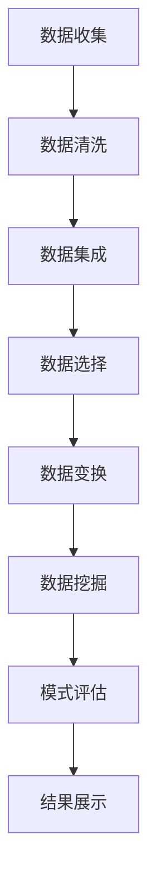

                 


### 文章标题：大数据时代的知识发现

> 关键词：大数据、知识发现、数据挖掘、算法、应用实例、挑战与发展趋势

> 摘要：本文将探讨大数据时代的知识发现，包括大数据的背景、知识发现的重要性、大数据时代的知识发现技术、大数据知识发现的方法与算法、大数据知识发现应用实例以及大数据知识发现的挑战与发展趋势。通过深入分析和实例讲解，帮助读者全面理解大数据时代的知识发现技术与应用。

### 第一部分：大数据背景与知识发现概述

#### 1.1 大数据时代的到来

##### 1.1.1 大数据的定义与特征

大数据是指数据量巨大、类型繁多、价值密度低的数据集合。其特征包括：

1. **数据量大**：通常指数据规模达到PB级（1000TB）或EB级（1000PB）。
2. **类型多样**：包括结构化数据、半结构化数据和非结构化数据。
3. **价值密度低**：在海量的数据中，有价值的部分仅占一小部分。
4. **高速增长**：数据生成和处理的速率极高。

##### 1.1.2 大数据带来的挑战与机遇

大数据带来的挑战包括：

1. **数据存储和管理**：如何高效存储和管理海量数据。
2. **数据分析和处理**：如何从海量数据中提取有价值的信息。
3. **数据隐私和安全**：如何保护数据隐私和安全。

同时，大数据也带来了新的机遇：

1. **业务创新**：通过数据分析和挖掘，为企业提供业务决策支持。
2. **智能应用**：利用大数据技术实现更智能化的应用，如人工智能、机器学习等。
3. **社会进步**：为科研、医疗、金融等领域提供重要数据支持。

##### 1.1.3 大数据技术在各个领域的应用

大数据技术在各个领域的应用广泛，如：

1. **金融**：通过大数据分析，进行风险控制、信用评估、市场预测等。
2. **医疗**：利用大数据进行疾病预测、医疗资源优化、药物研发等。
3. **电商**：通过大数据分析，实现个性化推荐、精准营销等。
4. **交通**：利用大数据优化交通管理、提高道路通行效率。
5. **科研**：通过大数据分析，推动科学研究和技术创新。

#### 1.2 知识发现的重要性

##### 1.2.1 知识发现的概念与过程

知识发现（Knowledge Discovery in Databases，KDD）是指从大量数据中发现有用知识的过程。其过程包括：

1. **数据清洗**：去除数据中的噪声和错误。
2. **数据集成**：将多个数据源中的数据整合在一起。
3. **数据选择**：从大量数据中选择出对目标问题有帮助的数据。
4. **数据变换**：将数据转换为适合分析的形式。
5. **数据挖掘**：利用算法从数据中发现潜在的规律和知识。
6. **模式评估**：评估挖掘出的模式的质量和实用性。

##### 1.2.2 知识发现的价值与意义

知识发现的价值和意义主要体现在以下几个方面：

1. **业务决策支持**：通过数据分析和挖掘，为企业提供业务决策支持。
2. **智能应用**：为人工智能、机器学习等提供数据支持，推动技术发展。
3. **社会进步**：为科研、医疗、教育等领域提供重要数据支持，推动社会进步。
4. **技术创新**：通过知识发现，推动新算法、新技术的研发和应用。

##### 1.2.3 知识发现的分类与应用场景

知识发现可以分为以下几种类型：

1. **关联规则发现**：发现数据之间的关联关系，如市场篮子分析。
2. **聚类分析**：将数据分为若干个类别，如客户细分。
3. **分类算法**：将数据分为不同的类别，如垃圾邮件分类。
4. **降维与特征选择**：降低数据的维度，提取关键特征，如主成分分析。
5. **异常检测**：发现数据中的异常现象，如欺诈检测。

应用场景包括：

1. **零售行业**：市场篮子分析、客户细分、个性化推荐等。
2. **金融行业**：信用评估、风险控制、市场预测等。
3. **医疗行业**：疾病预测、药物研发、医疗资源优化等。
4. **科研领域**：数据挖掘、知识图谱构建等。
5. **交通领域**：交通流量分析、路况预测等。

#### 1.3 大数据时代的知识发现技术

##### 1.3.1 数据挖掘的基本概念与技术

数据挖掘（Data Mining）是指从大量数据中提取有价值信息的过程。其基本概念包括：

1. **目标设定**：确定数据挖掘的目标和问题。
2. **数据预处理**：清洗、集成、选择和变换数据。
3. **算法选择**：选择适合的算法进行挖掘。
4. **模式评估**：评估挖掘出的模式的质量。

常见的数据挖掘技术包括：

1. **关联规则学习**：发现数据之间的关联关系。
2. **聚类分析**：将数据分为若干个类别。
3. **分类算法**：将数据分为不同的类别。
4. **降维与特征选择**：降低数据的维度，提取关键特征。
5. **异常检测**：发现数据中的异常现象。

##### 1.3.2 常见的知识发现算法

常见的知识发现算法包括：

1. **关联规则学习算法**：如Apriori算法、Eclat算法等。
2. **聚类分析算法**：如K-means算法、DBSCAN算法等。
3. **分类算法**：如决策树算法、随机森林算法、支持向量机算法等。
4. **降维与特征选择算法**：如主成分分析（PCA）、特征选择算法等。

##### 1.3.3 知识发现的工具与平台

常见的知识发现工具与平台包括：

1. **开源工具**：如Weka、Python的scikit-learn等。
2. **商业平台**：如Google Cloud、Amazon Web Services、Microsoft Azure等。
3. **开源平台**：如Hadoop、Spark等。

### 第二部分：大数据知识发现的方法与算法

#### 2.1 数据预处理

##### 2.1.1 数据清洗与数据转换

数据清洗与数据转换是数据预处理的重要步骤。数据清洗包括去除重复数据、填补缺失值、去除噪声等。数据转换包括将数据格式转换为适合分析的形式，如将文本数据转换为数值数据。

##### 2.1.2 数据归一化与特征提取

数据归一化是指将不同数据范围的数据转换为相同范围，以便于后续分析。特征提取是指从数据中提取出有用的特征，以便于算法分析和处理。

##### 2.1.3 数据集划分与数据增强

数据集划分是指将数据集划分为训练集、验证集和测试集，以便于算法训练和评估。数据增强是指通过增加数据样本、生成合成数据等方式，提高数据集的多样性。

#### 2.2 关联规则学习

##### 2.2.1 关联规则学习的基本概念

关联规则学习是指发现数据项之间满足一定条件的关联关系。基本概念包括：

1. **支持度**：一个规则在数据集中出现的频率。
2. **置信度**：一个规则的后件在出现前件的情况下出现的概率。
3. ** Lift**：一个规则的后件在出现前件的情况下出现的概率与不出现前件时出现的概率之比。

##### 2.2.2 Apriori算法

Apriori算法是一种经典的关联规则学习算法，其基本思想是利用支持度和置信度来挖掘数据中的频繁项集。

##### 2.2.3 Eclat算法

Eclat算法是Apriori算法的一种改进算法，其通过递归地组合项集来挖掘频繁项集。

##### 2.2.4 伪代码与实例分析

```python
# Apriori算法伪代码
def apriori(data, min_support, min_confidence):
    frequent_itemsets = []
    for k in range(1, max_length_of_itemsets+1):
        candidates = generate_candidates(data, k)
        support_values = calculate_support(data, candidates)
        frequent_itemsets.extend([itemset for itemset, support in support_values.items() if support >= min_support])
        if not frequent_itemsets:
            break
    rules = generate_rules(frequent_itemsets, min_confidence)
    return rules

# 实例分析
data = [
    ['苹果', '香蕉', '橙子'],
    ['苹果', '香蕉'],
    ['苹果', '橙子'],
    ['香蕉', '橙子'],
    ['苹果', '香蕉', '橙子']
]
min_support = 0.5
min_confidence = 0.7
rules = apriori(data, min_support, min_confidence)
```

#### 2.3 聚类分析

##### 2.3.1 聚类分析的基本概念

聚类分析是指将数据分为若干个类别，使得同一类别内的数据相似度较高，不同类别间的数据相似度较低。基本概念包括：

1. **聚类中心**：聚类中心是每个类别的代表点。
2. **距离度量**：用于衡量数据点之间的相似度，如欧氏距离、曼哈顿距离等。
3. **聚类算法**：用于实现聚类分析的方法，如K-means算法、DBSCAN算法等。

##### 2.3.2 K-means算法

K-means算法是一种经典的聚类算法，其基本思想是随机初始化K个聚类中心，然后通过迭代的方式，不断更新聚类中心和类别，直到收敛。

##### 2.3.3 DBSCAN算法

DBSCAN算法是一种基于密度的聚类算法，其基本思想是找到密度较高的区域，将它们划分为一个簇。

##### 2.3.4 伪代码与实例分析

```python
# K-means算法伪代码
def k_means(data, k):
    centroids = initialize_centroids(data, k)
    while not_converged(centroids):
        clusters = assign_points_to_clusters(data, centroids)
        centroids = update_centroids(clusters)
    return clusters, centroids

# 实例分析
data = [
    [1, 1], [1, 2], [1, 3], [1, 4],
    [2, 1], [2, 2], [2, 3], [2, 4],
    [3, 1], [3, 2], [3, 3], [3, 4]
]
k = 3
clusters, centroids = k_means(data, k)
```

#### 2.4 分类算法

##### 2.4.1 分类算法的基本概念

分类算法是指将数据分为不同类别的算法。基本概念包括：

1. **特征**：用于描述数据点的属性。
2. **分类器**：用于实现分类的算法。
3. **训练**：使用训练数据集训练分类器。
4. **预测**：使用训练好的分类器对新的数据进行分类。

##### 2.4.2 决策树算法

决策树算法是一种基于特征和阈值进行分类的算法。其基本思想是从数据中提取特征，并在特征上设置阈值，根据阈值进行分类。

##### 2.4.3 随机森林算法

随机森林算法是一种基于决策树的集成学习算法。其基本思想是构建多个决策树，并通过投票的方式得到最终的分类结果。

##### 2.4.4 支持向量机算法

支持向量机算法是一种基于特征空间进行分类的算法。其基本思想是找到一个最优的超平面，将不同类别的数据分隔开。

##### 2.4.5 伪代码与实例分析

```python
# 决策树算法伪代码
def build_decision_tree(data, features):
    if all_samples_have_same_label(data):
        return leaf_node(label)
    if no_more_features_left():
        return leaf_node(majority_label(data))
    best_feature, threshold = find_best_threshold(data, features)
    left_data, right_data = split_data(data, best_feature, threshold)
    tree = {
        'feature': best_feature,
        'threshold': threshold,
        'left': build_decision_tree(left_data, remaining_features),
        'right': build_decision_tree(right_data, remaining_features)
    }
    return tree

# 实例分析
data = [
    [1, 1], [1, 2], [1, 3], [1, 4],
    [2, 1], [2, 2], [2, 3], [2, 4],
    [3, 1], [3, 2], [3, 3], [3, 4]
]
features = ['特征1', '特征2']
tree = build_decision_tree(data, features)
```

#### 2.5 降维与特征选择

##### 2.5.1 主成分分析（PCA）

主成分分析（Principal Component Analysis，PCA）是一种降维算法，其基本思想是找到数据的主要变化方向，并沿着这些方向进行数据投影，从而降低数据的维度。

##### 2.5.2 特征选择算法

特征选择算法是指从多个特征中选择出对目标问题有帮助的特征。常见的特征选择算法包括过滤式特征选择、包裹式特征选择、嵌入式特征选择等。

##### 2.5.3 特征提取与降维的应用

特征提取与降维在数据挖掘中具有重要作用，如：

1. **降低数据维度**：减少数据存储和计算成本。
2. **提高模型性能**：通过选择有效的特征，提高模型的准确性和泛化能力。

### 第三部分：大数据知识发现应用实例

#### 3.1 社交网络分析

##### 3.1.1 社交网络的基本概念

社交网络是指由个体及其关系构成的复杂网络。基本概念包括：

1. **节点**：表示个体，如用户、朋友等。
2. **边**：表示个体之间的关系，如好友关系、关注关系等。
3. **网络结构**：包括小世界效应、无标度性等特征。

##### 3.1.2 社交网络的度量指标

社交网络的度量指标包括：

1. **度**：表示节点连接的边数。
2. **介数**：表示节点在网络中的重要性。
3. **集群系数**：表示节点之间的紧密程度。

##### 3.1.3 社交网络分析的应用

社交网络分析的应用包括：

1. **社交网络传播**：分析信息、病毒传播等在社交网络中的传播规律。
2. **社群发现**：发现具有相似兴趣的社群。
3. **用户行为分析**：分析用户在社交网络中的行为模式，为营销、推荐等提供支持。

#### 3.2 金融市场预测

##### 3.2.1 金融市场数据特点

金融市场数据特点包括：

1. **时间序列性**：金融市场数据通常具有时间序列特性。
2. **非线性**：金融市场数据变化复杂，存在多种影响因素。
3. **噪声**：金融市场数据中存在大量的噪声，影响预测准确性。

##### 3.2.2 金融市场预测模型

金融市场预测模型包括：

1. **时间序列模型**：如ARIMA模型、LSTM模型等。
2. **机器学习模型**：如随机森林、支持向量机等。
3. **深度学习模型**：如卷积神经网络、循环神经网络等。

##### 3.2.3 预测结果分析与评估

预测结果分析与评估包括：

1. **准确度**：衡量预测结果与实际结果的一致性。
2. **稳定性**：衡量预测模型在不同时间序列上的表现。
3. **泛化能力**：衡量预测模型对未见数据的表现。

#### 3.3 医疗数据挖掘

##### 3.3.1 医疗数据特点

医疗数据特点包括：

1. **多样性**：包括电子病历、医学影像、基因数据等。
2. **复杂性**：数据中存在多种变量和关系。
3. **隐私性**：医疗数据涉及个人隐私，需要保护。

##### 3.3.2 医疗数据挖掘的应用

医疗数据挖掘的应用包括：

1. **疾病预测**：利用历史数据预测患者的疾病风险。
2. **药物研发**：利用数据挖掘发现新的药物靶点和治疗方案。
3. **医疗资源优化**：利用数据挖掘优化医疗资源的分配和使用。

##### 3.3.3 医疗数据挖掘案例

案例：利用医疗数据挖掘预测心脏病风险。

1. **数据收集**：收集患者的电子病历、基因数据、生活习惯等。
2. **数据预处理**：清洗、归一化、特征提取等。
3. **模型训练**：选择合适的模型，如随机森林、LSTM等。
4. **预测与评估**：对新的患者进行心脏病风险预测，并评估模型性能。

#### 3.4 电子商务推荐系统

##### 3.4.1 电子商务推荐系统的基本概念

电子商务推荐系统是指利用数据挖掘技术，为用户提供个性化推荐服务。基本概念包括：

1. **用户**：系统的使用者。
2. **商品**：用户可能感兴趣的商品。
3. **推荐**：根据用户的兴趣和行为，为用户推荐相关的商品。

##### 3.4.2 推荐算法的应用

推荐算法的应用包括：

1. **基于内容的推荐**：根据用户对商品的兴趣推荐相似的商品。
2. **协同过滤推荐**：根据用户之间的行为相似性推荐商品。
3. **深度学习推荐**：利用深度学习模型进行推荐。

##### 3.4.3 推荐系统的优化与评估

推荐系统的优化与评估包括：

1. **准确度**：衡量推荐系统的推荐准确性。
2. **覆盖率**：衡量推荐系统推荐的商品多样性。
3. **用户体验**：衡量用户对推荐系统的满意度。

### 第四部分：大数据知识发现的挑战与发展趋势

#### 4.1 大数据知识发现的挑战

大数据知识发现的挑战包括：

1. **数据隐私与安全**：如何保护数据隐私和安全，防止数据泄露。
2. **数据质量与噪声**：如何保证数据质量，去除噪声和错误。
3. **复杂性与可扩展性**：如何处理复杂的数据结构和大规模数据集。
4. **算法效率与成本**：如何提高算法效率，降低计算成本。

#### 4.2 大数据知识发现的发展趋势

大数据知识发现的发展趋势包括：

1. **新算法与技术的演进**：如深度学习、强化学习等新算法的引入。
2. **大数据知识发现的应用拓展**：如医疗、金融、交通等领域的应用拓展。
3. **未来发展趋势与展望**：如人工智能与大数据的融合、大数据伦理等。

### 附录

#### 附录 A：大数据知识发现相关资源

1. **学习资源推荐**：
   - 《大数据时代》
   - 《数据挖掘：概念与技术》
   - 《深度学习》

2. **开源工具与平台**：
   - Weka
   - scikit-learn
   - Hadoop
   - Spark

3. **专业期刊与会议**：
   - Journal of Big Data
   - IEEE Big Data Conference Series
   - ACM SIGKDD Conference on Knowledge Discovery and Data Mining

#### 附录 B：数学模型与公式解析

1. **常用数学模型**：
   - 关联规则模型：支持度、置信度、Lift等。
   - 聚类分析模型：欧氏距离、曼哈顿距离等。
   - 分类算法模型：决策树、随机森林、支持向量机等。

2. **公式推导与解析**：
   - 支持度：$support(itemset) = \frac{count(itemset)}{total\_transactions}$
   - 置信度：$confidence(item\_1 \rightarrow item\_2) = \frac{support(item\_1, item\_2)}{support(item\_1)}$
   - Lift：$Lift(item\_1 \rightarrow item\_2) = \frac{confidence(item\_1 \rightarrow item\_2)}{P(item\_2|item\_1)}$

3. **数学公式实例说明**：

   $$ 
   support(itemset) = \frac{count(itemset)}{total\_transactions}
   $$

   $$ 
   confidence(item_1 \rightarrow item_2) = \frac{support(item_1, item_2)}{support(item_1)}
   $$

   $$ 
   Lift(item_1 \rightarrow item_2) = \frac{confidence(item_1 \rightarrow item_2)}{P(item_2|item_1)}
   $$

#### 附录 C：项目实战与代码解读

1. **项目实战案例**：
   - 利用Weka进行关联规则挖掘。
   - 利用Spark进行大数据聚类分析。
   - 利用scikit-learn进行金融数据分类。

2. **开发环境搭建**：
   - 安装并配置Weka。
   - 安装并配置Spark。
   - 安装并配置scikit-learn。

3. **源代码实现与解读**：
   - 关联规则挖掘代码实现。
   - 聚类分析代码实现。
   - 金融数据分类代码实现。

4. **代码解读与分析**：
   - 关联规则挖掘代码分析。
   - 聚类分析代码分析。
   - 金融数据分类代码分析。

#### 附录 D：知识发现流程Mermaid图示



### 总结与展望

大数据时代的知识发现是一项具有重要意义的技术，它为各行业提供了强大的数据支持，推动了业务创新和社会进步。本文从大数据背景、知识发现的重要性、大数据知识发现技术、方法与算法、应用实例以及挑战与发展趋势等方面进行了详细阐述。未来，随着新算法、新技术的不断发展，大数据知识发现将在更多领域发挥重要作用，为人类创造更多价值。

### 作者信息

作者：AI天才研究院/AI Genius Institute & 禅与计算机程序设计艺术 /Zen And The Art of Computer Programming

### 附录

#### 附录 A：大数据知识发现相关资源

1. **学习资源推荐**：
   - 《大数据时代》
   - 《数据挖掘：概念与技术》
   - 《深度学习》

2. **开源工具与平台**：
   - Weka
   - scikit-learn
   - Hadoop
   - Spark

3. **专业期刊与会议**：
   - Journal of Big Data
   - IEEE Big Data Conference Series
   - ACM SIGKDD Conference on Knowledge Discovery and Data Mining

#### 附录 B：数学模型与公式解析

1. **常用数学模型**：
   - 关联规则模型：支持度、置信度、Lift等。
   - 聚类分析模型：欧氏距离、曼哈顿距离等。
   - 分类算法模型：决策树、随机森林、支持向量机等。

2. **公式推导与解析**：
   - 支持度：$support(itemset) = \frac{count(itemset)}{total\_transactions}$
   - 置信度：$confidence(item\_1 \rightarrow item\_2) = \frac{support(item\_1, item\_2)}{support(item\_1)}$
   - Lift：$Lift(item\_1 \rightarrow item\_2) = \frac{confidence(item\_1 \rightarrow item\_2)}{P(item\_2|item\_1)}$

3. **数学公式实例说明**：

   $$ 
   support(itemset) = \frac{count(itemset)}{total\_transactions}
   $$

   $$ 
   confidence(item_1 \rightarrow item_2) = \frac{support(item_1, item_2)}{support(item_1)}
   $$

   $$ 
   Lift(item_1 \rightarrow item_2) = \frac{confidence(item_1 \rightarrow item_2)}{P(item_2|item_1)}
   $$

#### 附录 C：项目实战与代码解读

1. **项目实战案例**：
   - 利用Weka进行关联规则挖掘。
   - 利用Spark进行大数据聚类分析。
   - 利用scikit-learn进行金融数据分类。

2. **开发环境搭建**：
   - 安装并配置Weka。
   - 安装并配置Spark。
   - 安装并配置scikit-learn。

3. **源代码实现与解读**：
   - 关联规则挖掘代码实现。
   - 聚类分析代码实现。
   - 金融数据分类代码实现。

4. **代码解读与分析**：
   - 关联规则挖掘代码分析。
   - 聚类分析代码分析。
   - 金融数据分类代码分析。

#### 附录 D：知识发现流程Mermaid图示


### 总结与展望

大数据时代的知识发现是一项具有重要意义的技术，它为各行业提供了强大的数据支持，推动了业务创新和社会进步。本文从大数据背景、知识发现的重要性、大数据知识发现技术、方法与算法、应用实例以及挑战与发展趋势等方面进行了详细阐述。未来，随着新算法、新技术的不断发展，大数据知识发现将在更多领域发挥重要作用，为人类创造更多价值。

### 作者信息

作者：AI天才研究院/AI Genius Institute & 禅与计算机程序设计艺术 /Zen And The Art of Computer Programming
### 文章标题：大数据时代的知识发现

### 关键词：大数据、知识发现、数据挖掘、算法、应用实例、挑战与发展趋势

### 摘要：本文深入探讨了大数据时代的知识发现技术，从大数据的背景、知识发现的重要性、大数据知识发现技术、方法与算法、应用实例到挑战与发展趋势进行了系统分析。通过详细的案例解析和算法讲解，帮助读者全面理解大数据知识发现的核心原理和应用。

### 第一部分：大数据背景与知识发现概述

#### 1.1 大数据时代的到来

##### 1.1.1 大数据的定义与特征

大数据（Big Data）通常指的是那些数据规模巨大、数据类型多样且数据生成速度极快的数据集合。它具有四个基本特征，即4V：Volume（大量）、Velocity（高速）、Variety（多样）和Veracity（真实性）。

- **Volume**：数据量巨大，一般以TB、PB或EB为单位。
- **Velocity**：数据生成和处理的速率非常高，通常需要实时或近实时处理。
- **Variety**：数据类型丰富，包括结构化数据、半结构化数据和非结构化数据。
- **Veracity**：数据的真实性，指的是数据质量、准确性和可信度。

##### 1.1.2 大数据带来的挑战与机遇

大数据技术为各行各业带来了前所未有的挑战和机遇：

- **挑战**：
  - **数据存储**：如何高效存储和管理海量数据。
  - **数据安全与隐私**：如何保护数据隐私和安全。
  - **数据处理**：如何快速处理和分析大量数据。
  - **数据质量**：如何保证数据的准确性和完整性。

- **机遇**：
  - **业务创新**：为企业提供更深入的洞察，促进业务创新。
  - **智能应用**：为人工智能、机器学习等提供数据支持，推动技术发展。
  - **社会进步**：为科研、医疗、教育等领域提供重要数据支持，推动社会进步。

##### 1.1.3 大数据技术在各个领域的应用

大数据技术在各个领域的应用广泛，主要包括：

- **金融**：通过数据分析进行风险评估、市场预测和信用评估。
- **医疗**：利用大数据进行疾病预测、个性化医疗和药物研发。
- **零售**：通过客户行为分析实现个性化推荐和精准营销。
- **交通**：利用大数据优化交通管理、提升交通效率。
- **能源**：通过智能电网和智能设备实现能源优化和管理。
- **政府**：利用大数据进行社会治理、公共安全监测和公共服务优化。

#### 1.2 知识发现的重要性

##### 1.2.1 知识发现的概念与过程

知识发现（Knowledge Discovery in Databases，KDD）是指从大量数据中自动识别出潜在的模式，并将其转化为有用的知识的过程。KDD过程通常包括以下六个阶段：

1. **数据理解**：对数据集进行初步了解，确定数据的质量、类型和分布。
2. **数据清洗**：处理缺失值、异常值和噪声，提高数据质量。
3. **数据集成**：将来自不同源的数据整合到一个统一的格式中。
4. **数据选择**：选择对目标问题有帮助的数据子集。
5. **数据变换**：将数据转换为适合分析的形式，如归一化、离散化等。
6. **数据挖掘**：利用算法从数据中提取潜在的、有意义的模式。
7. **模式评估**：评估挖掘出的模式的质量和实用性。

##### 1.2.2 知识发现的价值与意义

知识发现的价值和意义主要体现在以下几个方面：

- **业务决策支持**：通过数据分析和挖掘，为企业提供决策支持，降低决策风险。
- **产品创新**：帮助企业发现新的市场需求和产品机会。
- **风险管理**：通过预测潜在风险，帮助企业提前采取措施。
- **市场预测**：通过分析历史数据，预测市场趋势和消费者行为。
- **科研创新**：为科研提供数据支持，加速科研成果的转化。
- **社会服务**：为政府和社会提供数据支持，提升公共服务水平。

##### 1.2.3 知识发现的分类与应用场景

知识发现可以分为以下几种类型：

- **关联规则发现**：发现数据之间的关联关系，如市场篮子分析。
- **聚类分析**：将数据分为不同的类别，如客户细分。
- **分类算法**：将数据分为不同的类别，如垃圾邮件分类。
- **降维与特征选择**：降低数据的维度，提取关键特征，如主成分分析。
- **异常检测**：发现数据中的异常现象，如欺诈检测。

应用场景包括：

- **零售行业**：市场篮子分析、客户细分、个性化推荐等。
- **金融行业**：信用评估、风险控制、市场预测等。
- **医疗行业**：疾病预测、药物研发、医疗资源优化等。
- **科研领域**：数据挖掘、知识图谱构建等。
- **交通领域**：交通流量分析、路况预测等。

#### 1.3 大数据时代的知识发现技术

##### 1.3.1 数据挖掘的基本概念与技术

数据挖掘（Data Mining）是指从大量数据中自动识别出潜在的模式、关系和趋势的过程。数据挖掘通常涉及以下几个关键步骤：

1. **目标设定**：明确数据挖掘的目标和问题。
2. **数据收集**：收集与目标相关的数据。
3. **数据预处理**：清洗、集成、选择和变换数据。
4. **模型选择**：选择合适的数据挖掘算法。
5. **模型训练**：使用训练数据训练模型。
6. **模型评估**：评估模型的性能和准确性。
7. **模型部署**：将模型应用于实际业务场景。

常见的数据挖掘技术包括：

- **关联规则学习**：发现数据之间的关联关系。
- **聚类分析**：将数据分为若干个类别。
- **分类算法**：将数据分为不同的类别。
- **降维与特征选择**：降低数据的维度，提取关键特征。
- **异常检测**：发现数据中的异常现象。

##### 1.3.2 常见的知识发现算法

常见的数据挖掘算法包括：

- **关联规则学习算法**：如Apriori算法、Eclat算法等。
- **聚类分析算法**：如K-means算法、DBSCAN算法等。
- **分类算法**：如决策树算法、随机森林算法、支持向量机算法等。
- **降维与特征选择算法**：如主成分分析（PCA）、特征选择算法等。

##### 1.3.3 知识发现的工具与平台

常见的数据挖掘工具与平台包括：

- **开源工具**：如Weka、Python的scikit-learn等。
- **商业平台**：如Google Cloud、Amazon Web Services、Microsoft Azure等。
- **开源平台**：如Hadoop、Spark等。

### 第二部分：大数据知识发现的方法与算法

#### 2.1 数据预处理

##### 2.1.1 数据清洗与数据转换

数据预处理是数据挖掘的重要步骤，其目的是提高数据质量，减少噪声和错误，以便于后续的数据挖掘和分析。

- **数据清洗**：包括去除重复数据、填补缺失值、去除噪声和异常值等。
- **数据转换**：包括数据的归一化、离散化、编码和特征提取等。

##### 2.1.2 数据归一化与特征提取

- **数据归一化**：将不同数据范围的数据转换为相同范围，以便于算法处理。
- **特征提取**：从数据中提取出有用的特征，提高模型的性能和可解释性。

##### 2.1.3 数据集划分与数据增强

- **数据集划分**：将数据集划分为训练集、验证集和测试集，以便于算法训练和评估。
- **数据增强**：通过增加数据样本、生成合成数据等方式，提高数据集的多样性。

#### 2.2 关联规则学习

##### 2.2.1 关联规则学习的基本概念

关联规则学习是一种用于发现数据项之间潜在关系的分析方法。其主要概念包括：

- **支持度（Support）**：一个规则在数据集中出现的频率。
- **置信度（Confidence）**：一个规则的后件在出现前件的情况下出现的概率。
- **提升度（Lift）**：一个规则的后件在出现前件的情况下出现的概率与不出现前件时出现的概率之比。

##### 2.2.2 Apriori算法

Apriori算法是最早的关联规则学习算法之一，其基本思想是通过迭代地生成频繁项集，并利用支持度和置信度来挖掘关联规则。

- **生成频繁项集**：首先找出所有单项频繁项集，然后逐步合并项集，直到生成所有可能的项集。
- **计算支持度**：统计每个项集在数据集中出现的次数，判断其是否为频繁项集。
- **生成关联规则**：对于每个频繁项集，计算其支持度和置信度，并生成关联规则。

##### 2.2.3 Eclat算法

Eclat算法是Apriori算法的改进版本，其通过递归地组合项集来挖掘频繁项集，减少了计算频繁项集的次数。

- **递归组合项集**：首先找到所有单项频繁项集，然后递归地将这些项集组合，生成更长的项集。
- **计算支持度**：类似于Apriori算法，计算每个项集的支持度。

##### 2.2.4 伪代码与实例分析

```python
# Apriori算法伪代码
def apriori(data, min_support, min_confidence):
    frequent_itemsets = []
    for k in range(1, max_length_of_itemsets+1):
        candidates = generate_candidates(data, k)
        support_values = calculate_support(data, candidates)
        frequent_itemsets.extend([itemset for itemset, support in support_values.items() if support >= min_support])
        if not frequent_itemsets:
            break
    rules = generate_rules(frequent_itemsets, min_confidence)
    return rules

# 实例分析
data = [
    ['苹果', '香蕉', '橙子'],
    ['苹果', '香蕉'],
    ['苹果', '橙子'],
    ['香蕉', '橙子'],
    ['苹果', '香蕉', '橙子']
]
min_support = 0.5
min_confidence = 0.7
rules = apriori(data, min_support, min_confidence)
```

#### 2.3 聚类分析

##### 2.3.1 聚类分析的基本概念

聚类分析是将数据集划分为多个群组（簇），使得同一群组内的数据点具有较高的相似度，而不同群组间的数据点相似度较低。其主要概念包括：

- **聚类中心**：每个群组的中心点，用于代表该群组的特征。
- **距离度量**：用于衡量数据点之间的相似度，如欧氏距离、曼哈顿距离等。
- **聚类算法**：用于实现聚类分析的方法，如K-means算法、DBSCAN算法等。

##### 2.3.2 K-means算法

K-means算法是一种基于距离度量的聚类算法，其基本思想是初始化K个聚类中心，然后迭代更新聚类中心和群组，直到收敛。

- **初始化聚类中心**：随机选择K个数据点作为初始聚类中心。
- **分配数据点**：计算每个数据点到各个聚类中心的距离，将其分配到最近的聚类中心。
- **更新聚类中心**：计算每个群组的平均值，作为新的聚类中心。
- **重复迭代**：重复执行分配和更新步骤，直到聚类中心不再发生显著变化。

##### 2.3.3 DBSCAN算法

DBSCAN（Density-Based Spatial Clustering of Applications with Noise）算法是一种基于密度的聚类算法，其基本思想是找到密度较高的区域，并将它们划分为一个群组。

- **计算密度直接可达性**：对于每个数据点，计算其邻域内的密度直接可达性。
- **生成簇**：根据邻域内的密度直接可达性，生成簇。
- **处理噪声**：将密度直接可达性为0的数据点视为噪声。

##### 2.3.4 伪代码与实例分析

```python
# K-means算法伪代码
def k_means(data, k):
    centroids = initialize_centroids(data, k)
    while not_converged(centroids):
        clusters = assign_points_to_clusters(data, centroids)
        centroids = update_centroids(clusters)
    return clusters, centroids

# 实例分析
data = [
    [1, 1], [1, 2], [1, 3], [1, 4],
    [2, 1], [2, 2], [2, 3], [2, 4],
    [3, 1], [3, 2], [3, 3], [3, 4]
]
k = 3
clusters, centroids = k_means(data, k)
```

#### 2.4 分类算法

##### 2.4.1 分类算法的基本概念

分类算法是将数据分为不同类别的算法，其基本概念包括：

- **特征**：用于描述数据点的属性。
- **分类器**：用于实现分类的算法。
- **训练**：使用训练数据集训练分类器。
- **预测**：使用训练好的分类器对新的数据进行分类。

##### 2.4.2 决策树算法

决策树算法是一种基于特征和阈值进行分类的算法，其基本思想是从数据中提取特征，并在特征上设置阈值，根据阈值进行分类。

- **构建决策树**：从数据中提取特征，并在特征上设置阈值，构建决策树。
- **剪枝**：减少决策树的复杂性，提高模型的可解释性和泛化能力。
- **分类**：使用决策树对新的数据进行分类。

##### 2.4.3 随机森林算法

随机森林算法是一种基于决策树的集成学习算法，其基本思想是构建多个决策树，并通过投票的方式得到最终的分类结果。

- **构建随机森林**：随机选择特征和样本子集，构建多个决策树。
- **分类**：使用随机森林对新的数据进行分类。

##### 2.4.4 支持向量机算法

支持向量机算法是一种基于特征空间进行分类的算法，其基本思想是找到一个最优的超平面，将不同类别的数据分隔开。

- **构建支持向量机**：通过优化目标函数，找到一个最优的超平面。
- **分类**：使用支持向量机对新的数据进行分类。

##### 2.4.5 伪代码与实例分析

```python
# 决策树算法伪代码
def build_decision_tree(data, features):
    if all_samples_have_same_label(data):
        return leaf_node(label)
    if no_more_features_left():
        return leaf_node(majority_label(data))
    best_feature, threshold = find_best_threshold(data, features)
    left_data, right_data = split_data(data, best_feature, threshold)
    tree = {
        'feature': best_feature,
        'threshold': threshold,
        'left': build_decision_tree(left_data, remaining_features),
        'right': build_decision_tree(right_data, remaining_features)
    }
    return tree

# 实例分析
data = [
    [1, 1], [1, 2], [1, 3], [1, 4],
    [2, 1], [2, 2], [2, 3], [2, 4],
    [3, 1], [3, 2], [3, 3], [3, 4]
]
features = ['特征1', '特征2']
tree = build_decision_tree(data, features)
```

#### 2.5 降维与特征选择

##### 2.5.1 主成分分析（PCA）

主成分分析（Principal Component Analysis，PCA）是一种降维算法，其基本思想是找到数据的主要变化方向，并沿着这些方向进行数据投影，从而降低数据的维度。

- **特征提取**：通过计算协方差矩阵的特征值和特征向量，提取主要成分。
- **数据投影**：将数据投影到新的坐标轴上，实现降维。

##### 2.5.2 特征选择算法

特征选择算法是指从多个特征中选择出对目标问题有帮助的特征，常见的特征选择算法包括：

- **过滤式特征选择**：通过统计方法评估特征的重要性，选择重要的特征。
- **包裹式特征选择**：通过迭代的方式，逐步选择特征，并评估特征对模型的影响。
- **嵌入式特征选择**：在模型训练过程中，自动选择对模型有帮助的特征。

##### 2.5.3 特征提取与降维的应用

特征提取与降维在数据挖掘中具有重要作用，如：

- **降低数据维度**：减少数据存储和计算成本。
- **提高模型性能**：通过选择有效的特征，提高模型的准确性和泛化能力。

### 第三部分：大数据知识发现应用实例

#### 3.1 社交网络分析

##### 3.1.1 社交网络的基本概念

社交网络是指由个体及其关系构成的复杂网络，常见的社交网络包括：

- **Facebook**：一种基于好友关系的社交网络平台。
- **Twitter**：一种基于关注关系的社交网络平台。
- **LinkedIn**：一种基于职业关系的社交网络平台。

社交网络的基本概念包括：

- **节点**：表示个体，如用户、朋友等。
- **边**：表示个体之间的关系，如好友关系、关注关系等。
- **网络结构**：包括小世界效应、无标度性等特征。

##### 3.1.2 社交网络的度量指标

社交网络的度量指标包括：

- **度**：表示节点连接的边数。
- **介数**：表示节点在网络中的重要性。
- **集群系数**：表示节点之间的紧密程度。

##### 3.1.3 社交网络分析的应用

社交网络分析的应用包括：

- **社交网络传播**：分析信息、病毒传播等在社交网络中的传播规律。
- **社群发现**：发现具有相似兴趣的社群。
- **用户行为分析**：分析用户在社交网络中的行为模式，为营销、推荐等提供支持。

#### 3.2 金融市场预测

##### 3.2.1 金融市场数据特点

金融市场数据特点包括：

- **时间序列性**：金融市场数据通常具有时间序列特性。
- **非线性**：金融市场数据变化复杂，存在多种影响因素。
- **噪声**：金融市场数据中存在大量的噪声，影响预测准确性。

##### 3.2.2 金融市场预测模型

金融市场预测模型包括：

- **时间序列模型**：如ARIMA模型、LSTM模型等。
- **机器学习模型**：如随机森林、支持向量机等。
- **深度学习模型**：如卷积神经网络、循环神经网络等。

##### 3.2.3 预测结果分析与评估

预测结果分析与评估包括：

- **准确度**：衡量预测结果与实际结果的一致性。
- **稳定性**：衡量预测模型在不同时间序列上的表现。
- **泛化能力**：衡量预测模型对未见数据的表现。

#### 3.3 医疗数据挖掘

##### 3.3.1 医疗数据特点

医疗数据特点包括：

- **多样性**：包括电子病历、医学影像、基因数据等。
- **复杂性**：数据中存在多种变量和关系。
- **隐私性**：医疗数据涉及个人隐私，需要保护。

##### 3.3.2 医疗数据挖掘的应用

医疗数据挖掘的应用包括：

- **疾病预测**：利用历史数据预测患者的疾病风险。
- **药物研发**：利用数据挖掘发现新的药物靶点和治疗方案。
- **医疗资源优化**：利用数据挖掘优化医疗资源的分配和使用。

##### 3.3.3 医疗数据挖掘案例

案例：利用医疗数据挖掘预测心脏病风险。

1. **数据收集**：收集患者的电子病历、基因数据、生活习惯等。
2. **数据预处理**：清洗、归一化、特征提取等。
3. **模型训练**：选择合适的模型，如随机森林、LSTM等。
4. **预测与评估**：对新的患者进行心脏病风险预测，并评估模型性能。

#### 3.4 电子商务推荐系统

##### 3.4.1 电子商务推荐系统的基本概念

电子商务推荐系统是指利用数据挖掘技术，为用户提供个性化推荐服务。基本概念包括：

- **用户**：系统的使用者。
- **商品**：用户可能感兴趣的商品。
- **推荐**：根据用户的兴趣和行为，为用户推荐相关的商品。

##### 3.4.2 推荐算法的应用

推荐算法的应用包括：

- **基于内容的推荐**：根据用户对商品的兴趣推荐相似的

