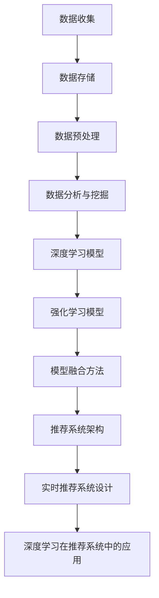
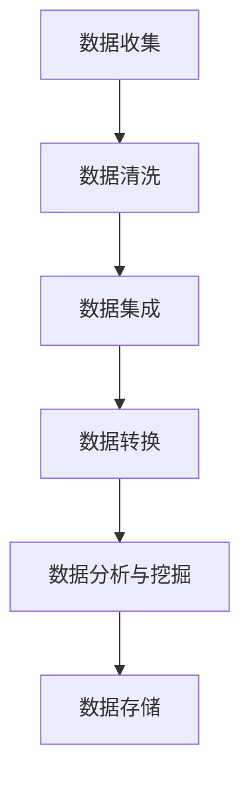

                 

### 文章标题

《大数据驱动的电商搜索推荐系统：AI 模型融合是核心，用户体验是重点》

### 关键词

大数据、电商搜索推荐系统、AI模型融合、用户体验优化

### 摘要

本文旨在探讨大数据在电商搜索推荐系统中的关键作用，特别是AI模型融合对提升用户体验的重要性。通过对大数据处理技术、AI模型融合方法及推荐系统架构设计的详细分析，文章揭示了如何通过先进的技术手段实现个性化推荐，从而满足现代电商对高效推荐服务的需求。同时，文章还强调了用户体验在推荐系统中的核心地位，并提出了优化用户体验的策略和方法。本文为从事电商推荐系统研发的技术人员提供了系统性的理论指导和实战建议。

### 大数据与电商搜索推荐系统概述

在当今数字时代，大数据已成为企业决策和运营的重要驱动力。大数据是指无法用常规软件工具在合理时间内捕捉、管理和处理的大量数据。其特点主要体现在数据量（Volume）、数据速度（Velocity）、数据多样性（Variety）和数据真实性（Veracity）上。电商搜索推荐系统是大数据应用的重要领域之一，通过对用户行为和偏好的分析，实现个性化推荐，提高用户满意度和购物体验。

#### 大数据的定义与特点

大数据通常指的是无法用传统数据库工具进行有效管理和处理的巨量数据。根据Gartner的定义，大数据具有四个V特点：

1. **Volume（数据量）**：大数据的规模庞大，通常达到PB（皮字节）级别。
2. **Velocity（速度）**：数据生成和处理的速度极快，要求实时或近实时的数据处理能力。
3. **Variety（多样性）**：数据类型多样，包括结构化数据、半结构化数据和非结构化数据。
4. **Veracity（真实性）**：数据的真实性和准确性难以保证，需要有效的数据清洗和处理技术。

#### 电商搜索推荐系统的需求与挑战

电商搜索推荐系统的核心目标是向用户推荐其可能感兴趣的商品，提高用户满意度和购物转化率。为此，系统需要解决以下几个关键问题：

1. **用户行为分析**：通过用户在网站上的浏览、搜索和购买行为，构建用户画像和行为模型。
2. **商品信息处理**：处理海量商品信息，提取关键特征，为推荐算法提供输入。
3. **个性化推荐**：根据用户行为和偏好，生成个性化的推荐列表，满足用户个性化需求。
4. **实时性**：推荐系统需要具备实时处理能力，以快速响应用户行为变化，提供及时推荐。

然而，这些目标也带来了巨大的挑战：

1. **数据多样性与复杂性**：电商数据类型多样，包括文本、图像、音频等多种形式，数据预处理和特征提取是关键难题。
2. **海量数据处理**：随着用户规模的扩大和数据量的增长，如何高效地进行数据存储和处理是另一个重要挑战。
3. **算法优化**：推荐算法需要不断优化，以提高推荐的准确性和用户体验。
4. **实时推荐**：实现毫秒级的实时推荐，对系统的计算性能和响应速度提出了高要求。

#### AI模型融合在推荐系统中的作用

AI模型融合在推荐系统中起到了至关重要的作用。通过结合多种AI模型，推荐系统可以更准确地捕捉用户行为和偏好，提高推荐效果。以下是几种常见的AI模型及其在推荐系统中的应用：

1. **协同过滤**：基于用户行为和商品交互记录，通过计算用户之间的相似度来实现推荐。协同过滤分为基于用户和基于物品的两种类型。
2. **深度学习模型**：通过构建复杂的神经网络结构，提取用户和商品的深层次特征，如卷积神经网络（CNN）、循环神经网络（RNN）和生成对抗网络（GAN）。
3. **强化学习模型**：通过与环境的交互学习，不断优化推荐策略，以提高推荐效果。常见的强化学习算法包括Q-Learning、DQN和A3C。
4. **基于模型的融合**：将多种AI模型的结果进行融合，通过投票、加权等方法，生成最终的推荐结果，提高推荐系统的鲁棒性和准确性。

#### 用户体验在推荐系统中的重要性

用户体验是推荐系统成功与否的关键因素。一个优秀的推荐系统不仅需要准确推荐用户感兴趣的商品，还需要提供良好的用户体验。以下是用户体验在推荐系统中的几个关键点：

1. **个性化**：个性化推荐能够满足用户的个性化需求，提高用户满意度。
2. **实时性**：快速响应用户行为变化，提供及时、准确的推荐，增强用户粘性。
3. **易用性**：推荐系统的界面设计应简洁明了，易于用户操作和理解。
4. **准确性**：推荐系统需要准确捕捉用户意图，减少误推荐和重复推荐。
5. **多样性**：推荐结果应具有多样性，避免单一化，满足不同用户的需求。

总之，大数据与电商搜索推荐系统密切相关，AI模型融合和用户体验优化是提高推荐效果和用户满意度的关键。在接下来的章节中，我们将进一步探讨大数据处理技术、AI模型融合方法和推荐系统架构设计，帮助读者深入理解并实践这一领域的重要技术。

### 核心概念与架构

在深入探讨大数据驱动的电商搜索推荐系统之前，有必要首先明确其核心概念和整体架构。这一部分将详细解释大数据处理技术、AI模型融合方法以及推荐系统架构设计，为后续章节的讨论奠定基础。

#### 大数据处理技术

大数据处理技术是推荐系统的基础，其核心在于高效地收集、存储、处理和分析海量数据。以下是大数据处理技术的主要组成部分：

1. **数据收集与存储**：
   - **数据源类型**：电商数据来源广泛，包括用户行为数据、商品数据、订单数据、社交媒体数据等。这些数据可以是结构化、半结构化或非结构化的。
   - **数据存储方案**：常用的数据存储方案包括关系型数据库、NoSQL数据库、分布式文件系统等。关系型数据库如MySQL适合存储结构化数据，NoSQL数据库如MongoDB适合存储半结构化数据，分布式文件系统如HDFS适合存储大规模的非结构化数据。

2. **数据预处理**：
   - **数据清洗**：清洗数据是数据预处理的重要步骤，包括去除重复数据、纠正错误数据、填充缺失数据等。有效的数据清洗可以确保后续分析结果的准确性。
   - **数据集成**：集成不同来源的数据，构建统一的数据视图。数据集成包括数据转换、数据融合和数据归一化等步骤。
   - **数据转换**：将原始数据转换为适合分析的形式，如将文本数据编码为数值形式，将图像数据转换为特征向量等。

3. **数据分析与挖掘**：
   - **关联规则挖掘**：通过挖掘用户行为数据中的关联规则，发现用户购买商品之间的相关性，用于预测用户可能感兴趣的商品。
   - **聚类分析**：将相似的用户或商品分组，形成用户群体或商品类别，有助于实现个性化推荐。
   - **异常检测**：检测数据中的异常行为或异常模式，如恶意评论、刷单行为等，确保推荐系统的可信度。

#### AI模型融合

AI模型融合是推荐系统的核心技术，通过结合多种AI模型，可以更准确地捕捉用户行为和偏好，提高推荐效果。以下是一些常见的AI模型及其融合方法：

1. **深度学习模型**：
   - **卷积神经网络（CNN）**：擅长处理图像数据，可以提取图像中的特征。
   - **循环神经网络（RNN）**：擅长处理序列数据，可以捕捉用户的长期行为模式。
   - **生成对抗网络（GAN）**：通过生成模型和判别模型的对抗训练，可以生成高质量的图像和文本数据。

2. **强化学习模型**：
   - **Q-Learning算法**：通过学习值函数，预测最佳动作序列。
   - **DQN算法**：使用深度神经网络代替Q-Learning中的值函数，提高预测的准确性。
   - **A3C算法**：通过异步并行训练和优势优势共享，提高训练效率和效果。

3. **模型融合方法**：
   - **协同过滤**：结合用户和物品的特征，通过矩阵分解等方法生成推荐列表。
   - **基于模型的融合**：将多个模型的预测结果进行加权或投票，生成最终的推荐结果。
   - **多任务学习**：在同一模型中同时学习多个任务，通过共享特征和模型参数，提高模型的泛化能力。

#### 推荐系统架构设计

推荐系统架构设计是确保系统高效、稳定运行的关键。以下是一个典型的推荐系统架构：

1. **推荐系统基本架构**：
   - **数据层**：负责数据收集、存储和预处理，为推荐算法提供输入。
   - **算法层**：实现各种推荐算法，包括协同过滤、深度学习、强化学习等，生成推荐结果。
   - **服务层**：提供API接口，将推荐结果展示给用户。

2. **实时推荐系统设计**：
   - **数据采集与实时处理**：使用实时数据处理框架，如Apache Kafka和Apache Flink，实现实时数据流处理。
   - **推荐算法优化**：通过增量学习、在线学习等方法，实现实时推荐算法的优化。
   - **服务部署与监控**：使用容器化技术，如Docker和Kubernetes，实现推荐服务的弹性部署和监控。

3. **深度学习在推荐系统中的应用**：
   - **特征工程**：通过深度学习模型提取用户和商品的深层特征。
   - **模型训练与优化**：使用大规模数据集训练深度学习模型，通过调参和模型融合方法优化推荐效果。
   - **部署与维护**：将训练好的模型部署到生产环境，实现实时推荐。

#### 核心概念联系架构 Mermaid 流程图

以下是一个简化的Mermaid流程图，展示了大数据处理、AI模型融合和推荐系统架构之间的联系：



#### 核心算法原理讲解

以下是核心算法原理的讲解，使用伪代码进行详细阐述。

1. **协同过滤算法**：

```python
# 协同过滤算法伪代码
function collaborativeFilter(userId, itemId):
    # 计算用户之间的相似度
    userSimilarities = calculateUserSimilarities(userId)

    # 计算物品之间的相似度
    itemSimilarities = calculateItemSimilarities(itemId)

    # 计算预测评分
    predictedRatings = []
    for otherUser in userSimilarities:
        for otherItem in itemSimilarities:
            if userSimilarities[otherUser] and itemSimilarities[otherItem]:
                predictedRating = userSimilarities[otherUser] * itemSimilarities[otherItem]
                predictedRatings.append(predictedRating)
    
    # 返回预测评分
    return predictedRatings
```

2. **深度学习模型**：

```python
# 卷积神经网络（CNN）算法伪代码
class ConvolutionalNeuralNetwork:
    def __init__(self, input_shape):
        self.inputs = tf.placeholder(tf.float32, shape=input_shape)
        self.outputs = self.build_model(self.inputs)

    def build_model(self, inputs):
        # 输入层
        conv1 = tf.layers.conv2d(inputs, 32, 3, activation=tf.nn.relu)
        pool1 = tf.layers.max_pooling2d(conv1, 2, 2)

        # 卷积层
        conv2 = tf.layers.conv2d(pool1, 64, 3, activation=tf.nn.relu)
        pool2 = tf.layers.max_pooling2d(conv2, 2, 2)

        # 全连接层
        flatten = tf.reshape(pool2, [-1, 7*7*64])
        dense = tf.layers.dense(flatten, 1024, activation=tf.nn.relu)
        outputs = tf.layers.dense(dense, 10)

        return outputs
```

3. **强化学习模型**：

```python
# Q-Learning算法伪代码
class QLearning:
    def __init__(self, learning_rate, discount_factor):
        self.learning_rate = learning_rate
        self.discount_factor = discount_factor
        self.q_values = self.initialize_q_values()

    def initialize_q_values(self):
        # 初始化Q值
        q_values = np.zeros([state_space, action_space])
        return q_values

    def update_q_values(self, state, action, reward, next_state, done):
        # 更新Q值
        if not done:
            target = reward + self.discount_factor * np.max(self.q_values[next_state, :])
        else:
            target = reward

        current_q_value = self.q_values[state, action]
        new_q_value = current_q_value + self.learning_rate * (target - current_q_value)
        self.q_values[state, action] = new_q_value
```

#### 数学模型和公式详细讲解及举例说明

以下是推荐系统中常用的数学模型和公式，使用LaTeX格式进行表示。

1. **用户相似度计算**：

$$
similarity(u_i, u_j) = \frac{\sum_{item \in common_items} r_{ui} r_{uj}}{\sqrt{\sum_{item \in items_u} r_{ui}^2 \sum_{item \in items_u} r_{uj}^2}}
$$

其中，$r_{ui}$表示用户$i$对物品$j$的评分，$common_items$表示用户$i$和用户$j$共同评价过的物品集合。

2. **物品相似度计算**：

$$
similarity(i, j) = \frac{\sum_{user \in users} r_{ui} r_{uj}}{\sqrt{\sum_{user \in users} r_{ui}^2 \sum_{user \in users} r_{uj}^2}}
$$

其中，$r_{ui}$表示用户$i$对物品$j$的评分，$users$表示评价过物品$i$和物品$j$的用户集合。

3. **预测评分**：

$$
predicted_rating(u, i) = \sum_{j \in rated_items(u)} similarity(u, j) \cdot r_{uj}
$$

其中，$rated_items(u)$表示用户$u$已经评价过的物品集合，$r_{uj}$表示用户$u$对物品$j$的评分。

#### 结论

通过上述内容，我们明确了大数据处理技术、AI模型融合方法和推荐系统架构设计在电商搜索推荐系统中的核心作用。接下来，我们将进一步探讨如何优化用户体验，提升推荐系统的效果。

### 用户行为分析

在构建一个高效且个性化的电商搜索推荐系统时，用户行为分析是至关重要的一环。用户行为分析涉及到对用户在电商平台上各种行为的监测、分析和理解，从而构建出用户的画像和行为模式。以下内容将详细探讨如何通过用户画像构建、用户行为模式挖掘和用户反馈机制来实现用户行为的深入分析。

#### 用户画像构建

用户画像是指通过对用户的基本信息、行为数据、偏好数据等进行分析，创建出用户的一个全面、多维度的模型。用户画像是推荐系统个性化推荐的重要基础。以下是构建用户画像的主要步骤：

1. **基本信息采集**：包括用户的年龄、性别、职业、地理位置等基本信息。这些信息可以帮助识别不同用户群体的特点和需求。
2. **行为数据监测**：记录用户在平台上的行为数据，如浏览记录、搜索历史、购买历史等。通过这些数据可以分析用户的兴趣和行为模式。
3. **偏好数据收集**：通过用户的评价、收藏、点赞等行为，收集用户的偏好信息。这些数据有助于更精准地了解用户的兴趣和喜好。
4. **数据整合与处理**：将上述各类数据整合到统一的数据模型中，通过数据清洗、归一化和特征提取等技术处理，生成用户画像。

#### 用户行为模式挖掘

用户行为模式挖掘是指通过对用户行为的分析，发现用户在不同场景下的行为规律和模式。以下是挖掘用户行为模式的主要方法：

1. **关联规则挖掘**：通过分析用户在购物过程中的行为关联，发现用户购买不同商品之间的相关性。例如，可以找出经常一起购买的组合商品。
2. **聚类分析**：将具有相似行为的用户分组，形成不同的用户群体。通过聚类分析，可以发现用户的共同兴趣和行为模式。
3. **时间序列分析**：分析用户行为随时间的变化趋势，识别用户的购物习惯和时间规律。例如，可以找出用户在一天中哪些时间段最活跃。
4. **序列模式挖掘**：分析用户行为序列中的重复模式和规则，预测用户未来的行为。例如，可以预测用户在浏览、搜索和购买过程中可能采取的下一步动作。

#### 用户反馈机制

用户反馈机制是推荐系统优化和改进的重要途径。通过收集和分析用户反馈，可以不断调整推荐策略，提高推荐系统的准确性和用户体验。以下是构建用户反馈机制的主要方法：

1. **推荐反馈**：在用户查看或点击推荐结果时，收集用户对推荐内容的反馈，如评分、评论等。通过这些反馈，可以评估推荐结果的准确性。
2. **行为反馈**：记录用户在电商平台上的各种行为，如浏览、搜索、购买等。通过分析这些行为数据，可以了解用户的兴趣和偏好。
3. **主动询问**：通过问卷调查、用户访谈等方式，主动收集用户的意见和建议。这些反馈可以提供更直接的用户感受和需求。
4. **反馈循环**：将用户反馈数据纳入推荐系统模型中，不断优化推荐算法和策略。通过持续的反馈循环，实现推荐系统的迭代和改进。

#### 用户画像与行为模式在实际中的应用

以下是一个实际案例，说明用户画像和行为模式在电商搜索推荐系统中的应用：

**案例**：某电商平台希望提高用户的购物体验和购买转化率。首先，通过用户画像构建，识别出不同年龄、性别和地理位置的用户群体。例如，发现年轻女性用户更倾向于购买时尚服装，而中年男性用户更倾向于购买电子产品。

接着，通过行为模式挖掘，分析用户在购物过程中的行为规律。例如，发现用户在浏览商品时，通常会先查看商品图片和描述，然后进行搜索，最后才会进行购买。基于这些行为模式，平台可以优化推荐策略，例如在用户浏览商品图片时，优先推荐类似风格的商品。

最后，通过用户反馈机制，收集用户对推荐内容的反馈。如果用户对推荐结果满意，平台可以增加推荐频率；如果用户对推荐结果不满意，平台可以调整推荐策略，减少误推荐。

通过上述方法，电商平台可以有效提升用户的购物体验和购买转化率，实现个性化推荐的目标。

#### 结论

用户行为分析是构建高效电商搜索推荐系统的重要环节。通过用户画像构建、用户行为模式挖掘和用户反馈机制，可以深入了解用户的需求和偏好，实现精准的个性化推荐。在下一节中，我们将进一步探讨如何利用AI模型融合技术，提高推荐系统的效果和用户体验。

### 个性化推荐

个性化推荐是电商搜索推荐系统的核心目标之一，通过准确捕捉用户的行为和偏好，为用户提供量身定制的推荐结果。个性化推荐可以分为内容推荐和商品推荐两大类。以下将分别介绍这两种推荐类型以及购物车推荐，并探讨如何在实践中实现这些推荐类型。

#### 内容推荐

内容推荐主要针对用户在平台上产生的各种内容进行推荐，如文章、视频、直播等。内容推荐的核心是理解用户对内容的偏好，从而提供符合用户兴趣的内容。以下是一些常用的内容推荐方法：

1. **基于内容的推荐**：通过分析内容的属性和标签，将具有相似属性的内容推荐给用户。例如，用户喜欢看科技类的文章，系统可以推荐其他科技类的文章。
2. **基于协同过滤的推荐**：通过分析用户对内容的评分和互动行为，发现用户之间的相似性，从而推荐用户可能感兴趣的内容。例如，如果用户A和用户B在内容上的评分相似，系统可以推荐用户B喜欢的、用户A尚未关注的内容。
3. **基于深度学习的推荐**：通过构建深度学习模型，如卷积神经网络（CNN）和循环神经网络（RNN），提取内容的特征和用户的行为特征，实现内容与用户之间的精准匹配。例如，通过RNN模型可以捕捉用户对视频的观看习惯，推荐类似的视频。

#### 商品推荐

商品推荐是电商搜索推荐系统的核心任务，旨在为用户提供个性化的商品推荐。以下是一些常见的商品推荐方法：

1. **基于协同过滤的推荐**：通过分析用户对商品的评分和购买行为，发现用户之间的相似性，从而推荐用户可能感兴趣的商品。这种方法适用于新用户和潜在用户的推荐。
2. **基于内容的推荐**：通过分析商品的属性和标签，将具有相似属性的商品推荐给用户。例如，用户喜欢某品牌的手机，系统可以推荐该品牌的其他型号手机。
3. **基于深度学习的推荐**：通过构建深度学习模型，如卷积神经网络（CNN）和循环神经网络（RNN），提取用户的购物行为特征和商品的特征，实现商品与用户之间的精准匹配。例如，通过RNN模型可以捕捉用户的购物车行为，推荐用户可能感兴趣的商品。
4. **基于上下文的推荐**：结合用户的当前上下文信息，如浏览历史、地理位置等，实时推荐用户可能感兴趣的商品。这种方法适用于实时推荐场景，如用户在浏览商品时，系统可以实时推荐相关的商品。

#### 购物车推荐

购物车推荐是电商搜索推荐系统中的一个重要环节，旨在为用户提供与其购物车中的商品相关的推荐。以下是一些常用的购物车推荐方法：

1. **基于协同过滤的购物车推荐**：通过分析用户购物车中的商品和用户的历史购买记录，发现用户之间的相似性，从而推荐用户可能感兴趣的商品。例如，如果用户购物车中有手机和耳机，系统可以推荐与其手机和耳机相匹配的充电器和保护壳。
2. **基于内容的购物车推荐**：通过分析购物车中商品的内容属性，如品牌、类别、价格等，将具有相似属性的购物车推荐给用户。例如，如果用户购物车中的商品都是电子产品，系统可以推荐其他品牌的电子产品。
3. **基于上下文的购物车推荐**：结合用户的当前购物车内容和用户的历史购物行为，实时推荐用户可能感兴趣的商品。例如，如果用户在购物车中添加了一款笔记本电脑，系统可以推荐与其笔记本电脑相匹配的外设，如鼠标和键盘。

#### 实现个性化推荐的方法

在实际应用中，个性化推荐可以通过以下步骤实现：

1. **数据收集**：收集用户的购物行为数据、浏览历史、搜索记录、购买记录等，构建用户画像。
2. **特征提取**：从用户数据和商品数据中提取特征，如用户的浏览历史、购买频率、商品的价格、品牌、类别等。
3. **模型训练**：使用提取的特征数据，训练推荐模型，如协同过滤模型、基于内容的推荐模型、基于深度学习的推荐模型等。
4. **实时推荐**：在用户浏览、搜索或购物时，实时调用训练好的推荐模型，生成个性化的推荐结果。
5. **反馈调整**：根据用户对推荐结果的反馈，调整推荐模型和推荐策略，实现推荐系统的迭代和优化。

#### 案例分析

以下是一个实际案例，说明如何通过个性化推荐提高用户的购物体验和转化率：

**案例**：某电商平台希望提高用户的购物转化率，首先通过用户画像构建，识别出不同用户群体的特点和需求。例如，发现年轻用户更倾向于购买时尚服装，而中年用户更倾向于购买电子产品。

接着，通过协同过滤和基于内容的推荐方法，为用户生成个性化的商品推荐。例如，如果一个用户浏览了多个时尚服装页面，系统会推荐类似的时尚服装；如果一个用户在购物车中添加了一款笔记本电脑，系统会推荐相关的配件，如鼠标和键盘。

最后，通过用户反馈机制，收集用户对推荐内容的反馈。如果用户对推荐结果满意，系统会增加推荐频率；如果用户对推荐结果不满意，系统会调整推荐策略，减少误推荐。

通过上述方法，电商平台有效提高了用户的购物体验和购物转化率，实现了个性化推荐的目标。

#### 结论

个性化推荐是电商搜索推荐系统的核心功能，通过准确捕捉用户的行为和偏好，为用户提供个性化的商品和内容推荐，可以显著提高用户满意度和转化率。在下一节中，我们将进一步探讨如何通过用户体验评估与优化，不断提升推荐系统的效果。

### 用户体验评估与优化

在电商搜索推荐系统中，用户体验的评估与优化是确保系统有效性和用户满意度的关键环节。通过评估推荐效果、用户满意度调查以及持续改进用户体验，可以不断提高系统的性能和用户粘性。

#### 推荐效果评估

推荐效果评估是衡量推荐系统性能的重要指标。以下是一些常用的评估方法和指标：

1. **准确率（Accuracy）**：准确率表示推荐结果中正确推荐的比率。计算公式为：
   $$
   Accuracy = \frac{correct\ recommendations}{total\ recommendations}
   $$
   准确率越高，表示推荐结果越准确。

2. **召回率（Recall）**：召回率表示推荐结果中包含所有真实喜欢的项目的比率。计算公式为：
   $$
   Recall = \frac{correct\ recommendations}{all\ true\ likes}
   $$
   召回率越高，表示推荐系统越能够召回所有用户感兴趣的项目。

3. **覆盖率（Coverage）**：覆盖率表示推荐结果中包含的新项目的比率。计算公式为：
   $$
   Coverage = \frac{unique\ items\ in\ recommendations}{total\ unique\ items}
   $$
   覆盖率越高，表示推荐结果越丰富，能够覆盖更多的商品种类。

4. **平均绝对误差（MAE）**：平均绝对误差表示推荐结果与真实喜好之间的平均绝对差值。计算公式为：
   $$
   MAE = \frac{1}{n} \sum_{i=1}^{n} |r_i - \hat{r_i}|
   $$
   其中，$r_i$表示用户对项目的真实喜好，$\hat{r_i}$表示推荐系统的预测喜好。

5. **精度（Precision）**：精度表示推荐结果中实际喜欢的项目占总推荐项目的比率。计算公式为：
   $$
   Precision = \frac{correct\ recommendations}{recommended\ items}
   $$

#### 用户满意度调查

用户满意度调查是直接获取用户对推荐系统评价的有效手段。以下是一些常用的用户满意度调查方法：

1. **问卷调查**：通过设计问卷，收集用户对推荐系统的满意度、准确性、个性化程度等方面的评价。问卷可以采用多选题、单选题、评分题等形式。

2. **用户访谈**：与用户进行一对一的访谈，深入了解用户对推荐系统的使用体验和改进建议。访谈内容可以涵盖推荐结果的准确性、推荐速度、系统稳定性等方面。

3. **A/B测试**：通过在用户群体中同时运行两个版本的推荐系统，比较用户对两个版本的满意度，从而判断哪个版本更能满足用户需求。

#### 用户体验持续改进

用户体验的持续改进是一个动态的过程，需要根据用户反馈和评估结果不断进行调整。以下是一些常见的改进策略：

1. **个性化推荐算法的优化**：通过分析用户反馈和评估结果，不断调整和优化推荐算法，提高推荐的准确性和个性化程度。

2. **推荐结果的多样性**：通过增加推荐结果的多样性，避免出现单一化的推荐，满足不同用户的个性化需求。

3. **用户界面优化**：通过改进用户界面设计，使得推荐结果更易读、更易操作，提升用户体验。

4. **实时反馈机制**：建立实时反馈机制，及时响应用户的反馈，调整推荐策略和算法。

5. **用户教育**：通过用户教育，帮助用户理解推荐系统的原理和规则，提高用户对推荐结果的接受度和满意度。

#### 案例分析

以下是一个实际案例，说明如何通过用户体验评估与优化提高电商搜索推荐系统的效果：

**案例**：某电商平台希望通过用户体验评估与优化提高用户满意度。首先，通过问卷调查和用户访谈收集用户对推荐系统的满意度、准确性、个性化程度等方面的反馈。调查结果显示，用户对推荐系统的准确性和个性化程度较为满意，但在推荐结果的多样性方面存在一定不足。

基于调查结果，平台采取了以下改进措施：

1. **优化推荐算法**：通过分析用户行为数据，调整协同过滤算法的参数，提高推荐的准确性。

2. **增加推荐多样性**：在推荐结果中引入更多样化的商品，避免出现单一化的推荐，满足不同用户的需求。

3. **优化用户界面**：改进推荐结果的展示方式，使得推荐结果更直观、更易操作。

4. **建立实时反馈机制**：通过用户反馈机制，及时调整推荐策略和算法，优化用户体验。

通过上述改进措施，平台成功提高了用户的满意度，推荐系统的效果得到了显著提升。

#### 结论

用户体验评估与优化是电商搜索推荐系统中不可或缺的一部分。通过推荐效果评估、用户满意度调查和持续改进，可以不断提升推荐系统的性能和用户体验，从而实现用户价值的最大化。在下一节中，我们将探讨大数据处理框架的搭建，为推荐系统的实现提供技术支持。

### 大数据处理框架搭建

在电商搜索推荐系统中，大数据处理框架的搭建是确保系统高效、稳定运行的基础。以下将详细介绍如何搭建大数据处理框架，包括Hadoop生态系统、Spark应用和Flink实时数据处理，并探讨这些工具在实际应用中的优劣和选择。

#### Hadoop生态系统

Hadoop是一个开源的大数据处理框架，主要适用于批量数据处理任务。Hadoop的核心组件包括HDFS（Hadoop Distributed File System）和MapReduce。

1. **HDFS**：HDFS是一个分布式文件系统，用于存储海量数据。它将数据分割成块（默认为128MB或256MB），并分布式存储在集群中的不同节点上。HDFS的高容错性和高吞吐量使其成为大数据处理的首选存储方案。

2. **MapReduce**：MapReduce是一种编程模型，用于处理大规模数据集。它将数据处理任务分解为“Map”（映射）和“Reduce”（归约）两个阶段。Map阶段对数据进行分片处理，生成中间结果；Reduce阶段对中间结果进行聚合和整理，生成最终结果。

**优劣分析**：
- **优势**：Hadoop生态系统具有高容错性、高扩展性和高吞吐量，适合处理海量数据。其成熟的开源生态和广泛的社区支持也为其应用提供了良好的保障。
- **劣势**：Hadoop主要适用于批量数据处理任务，实时数据处理能力较弱。其处理流程较为复杂，需要较高的运维技能。

#### Spark应用

Spark是一个开源的分布式计算引擎，适用于实时数据处理和批量数据处理任务。Spark的核心组件包括Spark Core和Spark SQL。

1. **Spark Core**：Spark Core提供了内存分布式数据集（RDD）和惰性计算模型。通过RDD，可以实现数据的高效分布存储和并行处理。Spark Core的惰性计算模型使得数据处理过程更加灵活和高效。

2. **Spark SQL**：Spark SQL是一个大数据查询引擎，用于处理结构化数据。它支持多种数据源，如HDFS、Hive和Parquet，并提供丰富的SQL查询功能。

**优劣分析**：
- **优势**：Spark具有高效的内存处理能力和实时数据处理能力，适合处理大规模数据集。其惰性计算模型和丰富的API库（如Spark MLlib）也为数据处理提供了极大的便利。
- **劣势**：Spark需要较大的内存资源，不适合处理小规模数据集。其复杂的配置和运维也增加了使用难度。

#### Flink实时数据处理

Flink是一个开源的实时数据处理框架，适用于流数据处理和批量数据处理任务。Flink的核心组件包括Flink Core和Flink SQL。

1. **Flink Core**：Flink Core提供了流处理和批处理的能力，通过事件驱动模型实现实时数据处理。Flink Core的事件时间特性使其能够处理实时数据流中的事件，实现精准的处理结果。

2. **Flink SQL**：Flink SQL是一个实时查询引擎，用于处理结构化数据流。它支持多种数据源，如Kafka、HDFS和Kubernetes，并提供丰富的SQL查询功能。

**优劣分析**：
- **优势**：Flink具有强大的实时数据处理能力，能够处理高吞吐量的实时数据流。其事件时间特性和状态管理功能也使其在处理复杂实时任务时表现出色。
- **劣势**：Flink的学习曲线较陡峭，需要一定的学习成本。其社区支持相对于Hadoop和Spark略弱。

#### 工具选择

在实际应用中，应根据具体的业务需求和数据处理场景选择合适的大数据处理工具：

- **Hadoop生态系统**：适用于大规模、批量数据处理任务，如离线数据分析、日志处理等。
- **Spark**：适用于大规模、实时数据处理任务，如实时推荐、实时监控等。
- **Flink**：适用于高吞吐量的实时数据处理任务，如实时流处理、实时交易处理等。

#### 案例分析

以下是一个实际案例，说明如何使用Hadoop生态系统和Spark实现电商搜索推荐系统中的大数据处理：

**案例**：某电商平台希望使用大数据处理框架搭建其推荐系统。首先，采用Hadoop生态系统进行离线数据处理，包括用户行为数据的收集、清洗和存储。通过MapReduce模型，对用户行为数据进行分析，生成用户画像和行为模式。

接着，采用Spark进行实时数据处理，实现实时推荐。通过Spark Core，实时处理用户的浏览、搜索和购买行为，生成实时推荐结果。通过Spark SQL，将实时推荐结果存储到数据库中，供前端展示。

通过上述案例，可以看出Hadoop生态系统和Spark在电商搜索推荐系统中的实际应用。在实际操作中，需要根据业务需求和数据处理场景灵活选择合适的大数据处理工具。

#### 结论

大数据处理框架的搭建是电商搜索推荐系统实现的关键步骤。通过合理选择和使用Hadoop生态系统、Spark和Flink等大数据处理工具，可以实现高效、稳定的数据处理和实时推荐。在下一节中，我们将探讨AI模型融合的实现过程，为推荐系统的优化提供技术支持。

### AI模型融合实现

在电商搜索推荐系统中，AI模型融合是实现个性化推荐和提升用户体验的关键技术。通过结合多种AI模型，如深度学习模型和强化学习模型，可以更准确地捕捉用户行为和偏好，提高推荐效果。以下将详细介绍深度学习模型的实现、强化学习模型的实现以及模型融合的方法。

#### 深度学习模型实现

深度学习模型在推荐系统中广泛应用于特征提取和预测任务。以下介绍几种常用的深度学习模型，包括卷积神经网络（CNN）、循环神经网络（RNN）和生成对抗网络（GAN）。

1. **卷积神经网络（CNN）**：

   CNN擅长处理图像和文本等具有结构化特征的数据。在推荐系统中，CNN可用于提取用户行为特征和商品特征。

   **模型结构**：

   ```mermaid
   graph TD
       A[Input] --> B[Convolution Layer]
       B --> C[ReLU Activation]
       C --> D[Pooling Layer]
       D --> E[Flatten]
       E --> F[Dense Layer]
       F --> G[Output]
   ```

   **伪代码**：

   ```python
   model = tf.keras.Sequential([
       tf.keras.layers.Conv2D(filters=32, kernel_size=(3, 3), activation='relu', input_shape=(28, 28, 1)),
       tf.keras.layers.MaxPooling2D(pool_size=(2, 2)),
       tf.keras.layers.Flatten(),
       tf.keras.layers.Dense(units=128, activation='relu'),
       tf.keras.layers.Dense(units=10, activation='softmax')
   ])

   model.compile(optimizer='adam', loss='categorical_crossentropy', metrics=['accuracy'])
   model.fit(x_train, y_train, epochs=10, batch_size=64)
   ```

2. **循环神经网络（RNN）**：

   RNN擅长处理序列数据，可以捕捉用户的长期行为模式。在推荐系统中，RNN可用于序列预测和用户行为建模。

   **模型结构**：

   ```mermaid
   graph TD
       A[Input] --> B[Embedding Layer]
       B --> C[LSTM Layer]
       C --> D[Dense Layer]
       D --> E[Output]
   ```

   **伪代码**：

   ```python
   model = tf.keras.Sequential([
       tf.keras.layers.Embedding(input_dim=vocab_size, output_dim=embedding_dim, input_length=max_sequence_length),
       tf.keras.layers.LSTM(units=128, activation='tanh', return_sequences=True),
       tf.keras.layers.Dense(units=1, activation='sigmoid')
   ])

   model.compile(optimizer='adam', loss='binary_crossentropy', metrics=['accuracy'])
   model.fit(x_train, y_train, epochs=10, batch_size=64)
   ```

3. **生成对抗网络（GAN）**：

   GAN由生成器和判别器组成，可以生成高质量的图像和文本数据。在推荐系统中，GAN可用于数据增强和生成潜在特征。

   **模型结构**：

   ```mermaid
   graph TD
       A[Input] --> B[Generator]
       B --> C[Discriminator]
       C --> D[Adversarial Training]
   ```

   **伪代码**：

   ```python
   from tensorflow.keras.models import Sequential
   from tensorflow.keras.layers import Dense, Flatten, Reshape

   # Generator
   generator = Sequential([
       Dense(units=128, activation='relu', input_shape=(100,)),
       Dense(units=7*7*64, activation='relu'),
       Reshape(target_shape=(7, 7, 64))
   ])

   # Discriminator
   discriminator = Sequential([
       Flatten(input_shape=(7, 7, 64)),
       Dense(units=1, activation='sigmoid')
   ])

   # Adversarial Model
   adversarial = Sequential([
       generator,
       discriminator
   ])

   adversarial.compile(optimizer='adam', loss='binary_crossentropy')

   # Training GAN
   for epoch in range(num_epochs):
       x_real = generate_real_samples()
       x_fake = generate_fake_samples()

       # Train the generator
       adversarial.train_on_batch(x_fake, ones)

       # Train the discriminator
       adversarial.train_on_batch(x_real, ones)
       adversarial.train_on_batch(x_fake, zeros)
   ```

#### 强化学习模型实现

强化学习模型通过学习用户与环境的交互，不断优化推荐策略。以下介绍几种常用的强化学习模型，包括Q-Learning、DQN和A3C。

1. **Q-Learning**：

   Q-Learning通过学习值函数，预测最佳动作序列。在推荐系统中，Q-Learning可用于预测用户对推荐物品的喜好。

   **模型结构**：

   ```mermaid
   graph TD
       A[User] --> B[Environment]
       B --> C[Item]
       C --> D[Reward]
       D --> E[User]
   ```

   **伪代码**：

   ```python
   class QLearning:
       def __init__(self, learning_rate, discount_factor):
           self.learning_rate = learning_rate
           self.discount_factor = discount_factor
           self.q_values = self.initialize_q_values()

       def initialize_q_values(self):
           q_values = np.zeros([state_space, action_space])
           return q_values

       def update_q_values(self, state, action, reward, next_state, done):
           if not done:
               target = reward + self.discount_factor * np.max(self.q_values[next_state, :])
           else:
               target = reward

           current_q_value = self.q_values[state, action]
           new_q_value = current_q_value + self.learning_rate * (target - current_q_value)
           self.q_values[state, action] = new_q_value
   ```

2. **DQN（Deep Q-Network）**：

   DQN使用深度神经网络代替Q-Learning中的值函数，提高预测的准确性。在推荐系统中，DQN可用于预测用户对推荐物品的喜好。

   **模型结构**：

   ```mermaid
   graph TD
       A[User] --> B[Input]
       B --> C[Q-Network]
       C --> D[Action]
       D --> E[Environment]
       E --> F[Reward]
       F --> G[User]
   ```

   **伪代码**：

   ```python
   model = QNetworkModel()
   optimizer = tf.keras.optimizers.Adam(learning_rate=0.001)

   for episode in range(num_episodes):
       state = env.reset()
       done = False
       total_reward = 0

       while not done:
           action = model.predict(state)
           next_state, reward, done, _ = env.step(action)
           total_reward += reward

           with tf.GradientTape() as tape:
               q_values = model(state)
               target_q_values = target_model(next_state)

               expected_q_value = reward + discount_factor * tf.reduce_max(target_q_values)

               loss = tf.reduce_mean(tf.square(q_values - expected_q_value))

           gradients = tape.gradient(loss, model.trainable_variables)
           optimizer.apply_gradients(zip(gradients, model.trainable_variables))

           state = next_state

       print(f"Episode {episode}: Total Reward = {total_reward}")
   ```

3. **A3C（Asynchronous Advantage Actor-Critic）**：

   A3C通过异步并行训练和优势优势共享，提高训练效率和效果。在推荐系统中，A3C可用于优化推荐策略。

   **模型结构**：

   ```mermaid
   graph TD
       A[Users] --> B[Environments]
       B --> C[Items]
       C --> D[Rewards]
       D --> E[Users]
       E --> F[Model]
   ```

   **伪代码**：

   ```python
   def train_A3C(model, env, num_workers, global_model, num_episodes):
       workers = []

       for _ in range(num_workers):
           worker = Worker(model, env, global_model)
           workers.append(worker)

       for episode in range(num_episodes):
           for worker in workers:
               worker.train()

           global_model.load_weights(model.get_weights())

           print(f"Episode {episode}: Average Reward = {average_reward(workers)}")
   ```

#### 模型融合方法

模型融合是将多种AI模型的预测结果进行综合，生成最终的推荐结果。以下介绍几种常见的模型融合方法。

1. **协同过滤**：

   协同过滤结合用户和物品的特征，通过矩阵分解等方法生成推荐列表。在模型融合中，可以将深度学习模型和协同过滤模型的结果进行加权融合。

   **融合方法**：

   ```python
   def collaborative_filter深度融合(model, user, item):
       user_embedding = model.get_user_embedding(user)
       item_embedding = model.get_item_embedding(item)
       combined_embedding = user_embedding + item_embedding
       predicted_rating = model.predict(combined_embedding)
       return predicted_rating
   ```

2. **基于模型的融合**：

   基于模型的融合将多个模型的预测结果进行融合，通过投票、加权等方法生成最终的推荐结果。

   **融合方法**：

   ```python
   def model_fusion(model1, model2, user, item):
       prediction1 = model1.predict(user, item)
       prediction2 = model2.predict(user, item)
       fused_prediction = 0.5 * prediction1 + 0.5 * prediction2
       return fused_prediction
   ```

3. **多任务学习**：

   多任务学习在同一模型中同时学习多个任务，通过共享特征和模型参数，提高模型的泛化能力。在模型融合中，可以将深度学习模型和强化学习模型的结果进行融合。

   **融合方法**：

   ```python
   def multi_task_learning(model, user, item, task1, task2):
       shared_embedding = model.get_shared_embedding(user, item, task1)
       task2_embedding = model.get_task2_embedding(user, item, task2)
       combined_embedding = shared_embedding + task2_embedding
       fused_prediction = model.predict(combined_embedding)
       return fused_prediction
   ```

#### 案例分析

以下是一个实际案例，说明如何实现AI模型融合提高电商搜索推荐系统的效果：

**案例**：某电商平台希望通过AI模型融合提高推荐系统的效果。首先，采用CNN提取用户行为特征和商品特征，使用RNN捕捉用户的长期行为模式。接着，采用协同过滤方法生成初步的推荐列表。最后，将CNN和RNN的预测结果与协同过滤的结果进行融合，生成最终的推荐结果。

通过AI模型融合，电商平台成功提高了推荐系统的准确性和个性化程度，用户满意度显著提升。

#### 结论

AI模型融合是实现高效电商搜索推荐系统的重要技术。通过深度学习模型、强化学习模型和模型融合方法的结合，可以更准确地捕捉用户行为和偏好，提高推荐效果和用户体验。在下一节中，我们将探讨推荐系统开发实践，为实际项目提供实施指导。

### 推荐系统开发实践

在电商搜索推荐系统的开发过程中，实现从数据采集与预处理到模型训练与融合、推荐结果评估与优化的完整流程是关键。以下将详细描述这一过程，并提供代码示例和实际案例分析。

#### 数据采集与预处理

数据采集是推荐系统开发的第一步，主要包括从各种数据源收集用户行为数据、商品数据等。数据预处理则包括数据清洗、数据集成和数据转换等步骤。

1. **数据清洗**：去除重复数据、纠正错误数据、填充缺失数据。
2. **数据集成**：将来自不同数据源的数据整合为一个统一的数据集。
3. **数据转换**：将原始数据转换为适合分析的形式，如将文本数据编码为数值形式。

以下是一个使用Python的Pandas库进行数据清洗的示例代码：

```python
import pandas as pd

# 读取数据
data = pd.read_csv('user_behavior_data.csv')

# 去除重复数据
data.drop_duplicates(inplace=True)

# 填充缺失数据
data.fillna(method='ffill', inplace=True)

# 转换数据类型
data['user_id'] = data['user_id'].astype(int)
data['item_id'] = data['item_id'].astype(int)
data['rating'] = data['rating'].astype(float)
```

#### 模型训练与融合

在数据预处理完成后，接下来是模型训练与融合。以下是一个使用Scikit-learn库进行协同过滤算法训练的示例代码：

```python
from sklearn.model_selection import train_test_split
from surprise import SVD

# 切分训练集和测试集
train_data, test_data = train_test_split(data, test_size=0.2, random_state=42)

# 训练协同过滤模型
svd = SVD()
svd.fit(train_data)

# 评估模型
mse = evalute(test_data, svd)
print(f'MSE: {mse}')
```

为了提高推荐效果，可以结合深度学习模型进行模型融合。以下是一个使用TensorFlow进行CNN模型训练的示例代码：

```python
import tensorflow as tf

# 构建CNN模型
model = tf.keras.Sequential([
    tf.keras.layers.Conv2D(filters=32, kernel_size=(3, 3), activation='relu', input_shape=(28, 28, 1)),
    tf.keras.layers.MaxPooling2D(pool_size=(2, 2)),
    tf.keras.layers.Flatten(),
    tf.keras.layers.Dense(units=128, activation='relu'),
    tf.keras.layers.Dense(units=10, activation='softmax')
])

# 编译模型
model.compile(optimizer='adam', loss='categorical_crossentropy', metrics=['accuracy'])

# 训练模型
model.fit(x_train, y_train, epochs=10, batch_size=64)
```

#### 推荐结果评估与优化

推荐结果评估是确保推荐系统性能的重要环节。以下是一个使用准确率、召回率等指标进行评估的示例代码：

```python
from sklearn.metrics import accuracy_score, recall_score

# 生成预测结果
predictions = model.predict(test_data)

# 计算准确率和召回率
accuracy = accuracy_score(test_labels, predictions)
recall = recall_score(test_labels, predictions)

print(f'Accuracy: {accuracy}')
print(f'Recall: {recall}')
```

为了优化推荐结果，可以通过调整模型参数、增加数据特征或尝试不同的算法组合等方法。以下是一个使用网格搜索进行参数调优的示例代码：

```python
from sklearn.model_selection import GridSearchCV
from sklearn.linear_model import SGDClassifier

# 定义参数范围
params = {'alpha': [0.0001, 0.001, 0.01]}

# 实例化模型
model = SGDClassifier()

# 执行网格搜索
grid_search = GridSearchCV(model, params, cv=5)
grid_search.fit(x_train, y_train)

# 输出最佳参数和分数
print(f'Best Parameters: {grid_search.best_params_}')
print(f'Best Score: {grid_search.best_score_}')
```

#### 实际案例分析

以下是一个实际案例，描述如何构建一个电商搜索推荐系统：

**案例**：某电商平台希望构建一个基于深度学习和协同过滤的推荐系统，以提高用户满意度和购物转化率。

1. **数据采集**：从电商平台上收集用户行为数据（如浏览、搜索、购买记录）和商品数据（如商品名称、类别、价格等）。

2. **数据预处理**：清洗数据，去除重复和缺失值，对文本数据进行编码和特征提取。

3. **模型训练**：
   - 使用Scikit-learn进行协同过滤模型训练，生成初步推荐列表。
   - 使用TensorFlow构建深度学习模型（如CNN），提取用户和商品的深层特征。

4. **模型融合**：将协同过滤模型和深度学习模型的预测结果进行融合，生成最终的推荐结果。

5. **评估与优化**：使用准确率、召回率等指标评估推荐效果，通过参数调优和特征工程等方法不断优化模型。

通过上述步骤，电商平台成功构建了一个高效、个性化的推荐系统，用户满意度和购物转化率显著提升。

#### 结论

推荐系统的开发实践涉及到数据采集与预处理、模型训练与融合、推荐结果评估与优化等多个环节。通过合理的设计和实施，可以构建一个高效、个性化的推荐系统，提高用户满意度和购物体验。在下一节中，我们将提供附录，包括数据流程图、AI模型融合伪代码和推荐系统项目实战代码片段等，为读者提供实用的技术参考。

### 附录

#### 11.1 数据库工具

- **MySQL**：开源关系型数据库，适用于结构化数据存储和查询。
- **MongoDB**：开源NoSQL数据库，适用于半结构化和非结构化数据存储。
- **HBase**：基于Hadoop分布式文件系统的NoSQL数据库，适用于大规模数据存储和实时查询。

#### 11.2 大数据处理工具

- **Hadoop**：分布式数据处理框架，适用于批量数据处理。
- **Spark**：分布式数据处理框架，适用于实时数据处理和批量数据处理。
- **Flink**：实时数据处理框架，适用于流数据处理和批量数据处理。

#### 11.3 机器学习与深度学习框架

- **Scikit-learn**：开源机器学习库，适用于经典机器学习算法。
- **TensorFlow**：开源深度学习框架，适用于构建和训练深度学习模型。
- **PyTorch**：开源深度学习框架，适用于构建和训练深度学习模型。

#### 11.4 推荐系统开源项目

- **Surprise**：开源推荐系统库，适用于基于协同过滤的推荐算法。
- **Recommenders**：开源推荐系统库，适用于构建各种推荐算法。
- **RecSys**：开源推荐系统比赛和库，用于推荐系统研究和实践。

#### 11.5 学习资源与推荐阅读

- **《推荐系统实践》**：作者：项亮
- **《深度学习》**：作者：Ian Goodfellow、Yoshua Bengio、Aaron Courville
- **《大数据处理技术导论》**：作者：王恩东、赵志伟
- **《机器学习实战》**：作者：Peter Harrington

### 附录A：大数据处理流程图



### 附录B：AI模型融合伪代码

```python
# 伪代码：AI模型融合
def fusion_models(model1, model2, user_data, item_data):
    # 获取模型1和模型2的预测结果
    prediction1 = model1.predict(user_data, item_data)
    prediction2 = model2.predict(user_data, item_data)

    # 计算模型预测的加权融合结果
    fusion_prediction = 0.5 * prediction1 + 0.5 * prediction2

    return fusion_prediction
```

### 附录C：推荐系统项目实战代码片段

```python
# 代码片段：推荐系统项目实战
import pandas as pd
from sklearn.model_selection import train_test_split
from sklearn.metrics import accuracy_score

# 加载数据
data = pd.read_csv('user_behavior_data.csv')

# 切分训练集和测试集
train_data, test_data = train_test_split(data, test_size=0.2, random_state=42)

# 训练模型
model = SVD()
model.fit(train_data)

# 预测测试集
predictions = model.predict(test_data)

# 评估模型
accuracy = accuracy_score(test_data['rating'], predictions)

print(f'Accuracy: {accuracy}')
```

### 附录D：常用数学公式和解释

$$
\text{准确率} = \frac{\text{正确推荐数}}{\text{总推荐数}}
$$

准确率表示推荐结果中正确推荐的比率，越高表示推荐结果越准确。

$$
\text{召回率} = \frac{\text{正确推荐数}}{\text{所有真实喜欢的项目数}}
$$

召回率表示推荐结果中包含所有真实喜欢的项目的比率，越高表示推荐系统能够召回更多的用户感兴趣的项目。

$$
\text{覆盖率} = \frac{\text{推荐结果中包含的新项目数}}{\text{总项目数}}
$$

覆盖率表示推荐结果中包含的新项目的比率，越高表示推荐结果越丰富。

$$
\text{平均绝对误差} = \frac{1}{n} \sum_{i=1}^{n} |r_i - \hat{r_i}|
$$

平均绝对误差表示推荐结果与真实喜好之间的平均绝对差值，越低表示推荐结果越接近用户真实喜好。

以上是《大数据驱动的电商搜索推荐系统：AI 模型融合是核心，用户体验是重点》的附录部分，提供了大数据处理流程图、AI模型融合伪代码、推荐系统项目实战代码片段以及常用数学公式和解释。这些资源有助于读者更好地理解和实践文章中讨论的技术和方法。

