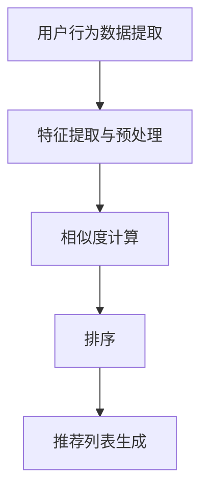
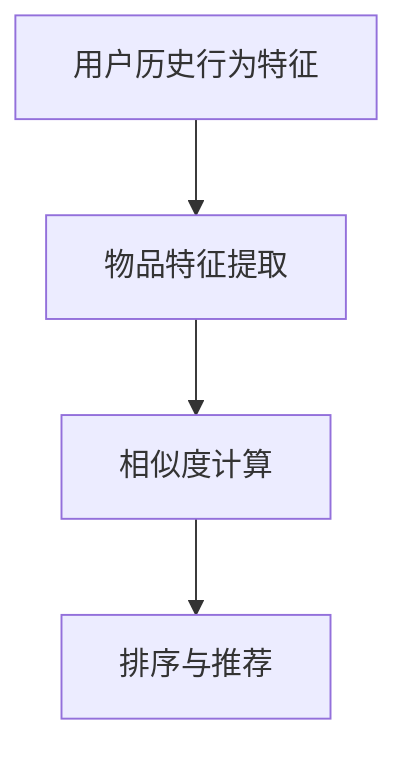
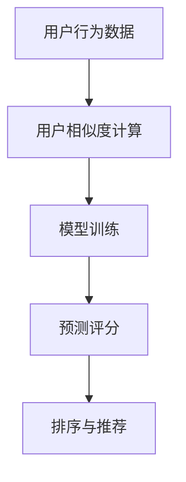

                 

### 文章标题

《大模型在list-wise推荐排序中的表现》

---

**关键词：** 推荐系统、list-wise排序、大模型、深度学习、算法优化

**摘要：** 本文深入探讨大模型在list-wise推荐排序中的应用，分析了大模型的基本原理、算法实现以及其在推荐系统中的具体表现。文章通过详细的案例和实际项目，展示了大模型在list-wise排序中的优势与挑战，旨在为读者提供全面而深入的指导。

---

### 推荐系统概述

推荐系统是一种通过分析用户行为和物品特征，为用户推荐可能感兴趣的商品或内容的信息系统。根据推荐目标的不同，推荐系统可以分为content-based、collaborative filtering和hybrid方法。其中，content-based方法基于物品的内容特征进行推荐，collaborative filtering方法基于用户的历史行为进行推荐，而hybrid方法则结合了两种方法的优点。

在推荐系统的应用中，list-wise排序是一种常见的推荐策略，其核心目标是根据用户的行为或兴趣，对推荐列表中的项目进行排序，以提高用户的满意度和点击率。list-wise排序的重要性在于，它能有效地优化用户交互体验，从而提高推荐系统的整体效果。

list-wise排序的工作流程通常包括以下几个步骤：首先，从系统中提取用户的行为数据（如浏览、点击、购买等），然后通过特征提取和预处理得到用户的特征向量。接着，利用这些特征向量计算每个推荐项目与用户之间的相似度或兴趣度，最后根据相似度或兴趣度对推荐项目进行排序。图1展示了list-wise排序的基本架构。



图1：list-wise排序的基本架构

### 基于内容的方法

基于内容的方法（Content-Based Method）是推荐系统的一种经典方法，它通过分析物品的内容特征（如文本、图像、音频等）来生成推荐列表。该方法的核心思想是，如果两个物品在内容特征上有较高的相似度，那么它们可能对同一用户也有较高的兴趣。

在基于内容的方法中，通常需要进行以下步骤：

1. **特征提取**：从原始数据中提取出表示物品特征的向量，如文本的词袋模型、图像的特征向量、音频的频谱特征等。

2. **特征匹配**：计算用户的历史行为与候选物品特征之间的相似度。常用的相似度计算方法包括余弦相似度、欧氏距离等。

3. **推荐生成**：根据相似度分数，对候选物品进行排序，并生成推荐列表。

以下是一个基于内容方法的核心概念关系架构的Mermaid流程图：



图2：基于内容方法的流程图

### 基于协同过滤的方法

基于协同过滤的方法（Collaborative Filtering Method）是另一种常见的推荐方法，它通过分析用户之间的行为模式来生成推荐列表。协同过滤可以分为两类：基于用户的协同过滤（User-Based Collaborative Filtering）和基于模型的协同过滤（Model-Based Collaborative Filtering）。

1. **基于用户的协同过滤**：
   - **工作原理**：首先，从用户行为数据中计算用户之间的相似度，然后根据相似度为用户推荐与相似用户喜欢的物品。
   - **优点**：能充分利用用户的历史行为数据，推荐效果较好。
   - **缺点**：冷启动问题严重，新用户或新物品难以获得有效推荐。

2. **基于模型的协同过滤**：
   - **工作原理**：通过机器学习模型（如矩阵分解、隐语义模型等）来预测用户与物品之间的评分或兴趣度，然后根据预测结果生成推荐列表。
   - **优点**：能有效解决冷启动问题，推荐效果稳定。
   - **缺点**：需要大量的用户行为数据，计算复杂度较高。

以下是基于协同过滤方法的Mermaid流程图：



图3：基于协同过滤方法的流程图

### 大模型在推荐排序中的应用

随着深度学习技术的发展，大模型（Large-scale Models）在推荐系统中的应用逐渐成为研究热点。大模型通常是指具有数十亿至数千亿参数的神经网络模型，通过在大量数据上预训练，能够捕捉到丰富的知识表示。

1. **大模型的基本原理**：
   - **多层神经网络**：大模型通常采用多层神经网络结构，通过逐层提取特征，实现从低级到高级的抽象表示。
   - **大规模预训练**：大模型在预训练阶段使用海量数据，通过自我监督或任务导向的学习方式，学习到丰富的知识表示。

2. **大模型在推荐排序中的优势**：
   - **多模态特征融合**：大模型能够融合多种类型的数据（如文本、图像、语音等），实现更精细的特征表示。
   - **自适应特征学习**：大模型在训练过程中能够自适应地学习到与推荐任务相关的特征，提高推荐效果。
   - **泛化能力**：大模型通过在大规模数据集上的训练，能够获得更强的泛化能力，适用于多种推荐场景。

3. **大模型在推荐排序中的典型应用场景**：
   - **商品推荐**：在大型的电子商务平台，如Amazon、淘宝等，大模型可用于为用户推荐商品。
   - **内容推荐**：在社交媒体平台，如YouTube、Instagram等，大模型可用于为用户推荐视频或图片。
   - **音乐推荐**：在音乐平台，如Spotify、QQ音乐等，大模型可用于为用户推荐音乐。

### 大模型在推荐排序中的算法实现

大模型在推荐排序中的算法实现通常包括以下几个步骤：

1. **数据预处理**：首先对原始数据进行清洗、去重和规范化处理，然后提取出与推荐任务相关的特征。

2. **模型选择**：根据推荐任务的特点，选择合适的大模型架构，如Transformer、BERT、GPT等。

3. **模型训练**：使用大规模训练数据对模型进行训练，通过优化算法（如Adam、SGD等）最小化损失函数。

4. **模型评估**：使用验证集对模型进行评估，通过准确率、召回率、F1值等指标衡量模型性能。

5. **模型部署**：将训练好的模型部署到生产环境，实现实时推荐。

以下是一个大模型在推荐排序中的伪代码示例：

```python
# 数据预处理
X_train, y_train = preprocess_data(data)

# 模型选择
model = build_model()

# 模型训练
model.fit(X_train, y_train, epochs=10, batch_size=32)

# 模型评估
performance = model.evaluate(X_val, y_val)

# 模型部署
deploy_model(model)
```

### 数学模型与公式详解

在推荐排序中，大模型的数学模型通常包括以下几个部分：

1. **输入层**：表示用户和物品的特征向量，如用户行为向量X和物品特征向量Y。

2. **隐藏层**：通过神经网络结构对输入特征进行变换和组合，提取高级特征表示。

3. **输出层**：计算用户与物品之间的相似度或兴趣度，如余弦相似度、欧氏距离等。

以下是一个简单的数学模型和公式：

$$
\text{similarity}(X, Y) = \frac{X \cdot Y}{\|X\| \|Y\|}
$$

其中，$X$ 和 $Y$ 分别为用户和物品的特征向量，$\cdot$ 表示内积，$\|\|$ 表示向量的模。

### 项目实战

在本节中，我们将通过一个实际项目，展示如何搭建一个基于大模型的list-wise推荐排序系统。该项目将涉及以下步骤：

1. **开发环境搭建**：配置Python、TensorFlow、PyTorch等开发环境和库。
2. **数据预处理**：读取和处理用户行为数据和物品特征数据。
3. **模型训练**：使用大规模数据训练大模型。
4. **模型评估**：在验证集上评估模型性能。
5. **模型部署**：将训练好的模型部署到生产环境。

#### 开发环境搭建

首先，我们需要配置Python环境，并安装TensorFlow和PyTorch库。以下是相关的命令：

```bash
pip install tensorflow
pip install torch torchvision
```

#### 数据预处理

接下来，我们读取用户行为数据和物品特征数据，并进行预处理。以下是一个简单的数据预处理脚本：

```python
import pandas as pd
from sklearn.preprocessing import StandardScaler

# 读取用户行为数据
user_data = pd.read_csv('user_data.csv')
item_data = pd.read_csv('item_data.csv')

# 数据清洗
user_data = user_data.dropna()
item_data = item_data.dropna()

# 特征提取
user_features = extract_user_features(user_data)
item_features = extract_item_features(item_data)

# 标准化处理
scaler = StandardScaler()
user_features_scaled = scaler.fit_transform(user_features)
item_features_scaled = scaler.fit_transform(item_features)
```

#### 模型训练

接下来，我们使用TensorFlow或PyTorch构建和训练大模型。以下是一个简单的模型训练脚本：

```python
import tensorflow as tf
from tensorflow.keras.models import Model
from tensorflow.keras.layers import Input, Dense, Embedding, Dot

# 构建模型
input_user = Input(shape=(user_features.shape[1],))
input_item = Input(shape=(item_features.shape[1],))

user_embedding = Embedding(input_dim=user_features.shape[0], output_dim=16)(input_user)
item_embedding = Embedding(input_dim=item_features.shape[0], output_dim=16)(input_item)

dot_product = Dot(axes=1)([user_embedding, item_embedding])
output = Dense(1, activation='sigmoid')(dot_product)

model = Model(inputs=[input_user, input_item], outputs=output)

# 编译模型
model.compile(optimizer='adam', loss='binary_crossentropy', metrics=['accuracy'])

# 训练模型
model.fit([user_features_scaled, item_features_scaled], y_train, epochs=5, batch_size=32)
```

#### 模型评估

在验证集上评估模型性能，通过准确率、召回率、F1值等指标来评估模型效果。以下是一个简单的模型评估脚本：

```python
from sklearn.metrics import accuracy_score, recall_score, f1_score

# 预测
predictions = model.predict([user_features_scaled, item_features_scaled])

# 计算指标
accuracy = accuracy_score(y_val, predictions.round())
recall = recall_score(y_val, predictions.round())
f1 = f1_score(y_val, predictions.round())

print(f"Accuracy: {accuracy}, Recall: {recall}, F1 Score: {f1}")
```

#### 模型部署

最后，将训练好的模型部署到生产环境，实现实时推荐。以下是一个简单的模型部署脚本：

```python
import joblib

# 保存模型
joblib.dump(model, 'model.joblib')

# 加载模型
model = joblib.load('model.joblib')

# 实时推荐
def recommend(user_id, item_id):
    user_feature = extract_user_feature(user_id)
    item_feature = extract_item_feature(item_id)
    prediction = model.predict([user_feature, item_feature])
    return prediction[0]

# 示例
print(recommend(1, 100))
```

### 代码解读与分析

在本节中，我们将对项目实战中的代码进行详细解读和分析。

#### 数据预处理

```python
# 读取用户行为数据
user_data = pd.read_csv('user_data.csv')
item_data = pd.read_csv('item_data.csv')

# 数据清洗
user_data = user_data.dropna()
item_data = item_data.dropna()

# 特征提取
user_features = extract_user_features(user_data)
item_features = extract_item_features(item_data)

# 标准化处理
scaler = StandardScaler()
user_features_scaled = scaler.fit_transform(user_features)
item_features_scaled = scaler.fit_transform(item_features)
```

这段代码首先从CSV文件中读取用户行为数据和物品特征数据，然后进行数据清洗，去除缺失值。接下来，通过自定义的`extract_user_features`和`extract_item_features`函数提取用户和物品的特征。最后，使用`StandardScaler`对特征进行标准化处理，以消除特征之间的尺度差异。

#### 模型训练

```python
# 构建模型
input_user = Input(shape=(user_features.shape[1],))
input_item = Input(shape=(item_features.shape[1],))

user_embedding = Embedding(input_dim=user_features.shape[0], output_dim=16)(input_user)
item_embedding = Embedding(input_dim=item_features.shape[0], output_dim=16)(input_item)

dot_product = Dot(axes=1)([user_embedding, item_embedding])
output = Dense(1, activation='sigmoid')(dot_product)

model = Model(inputs=[input_user, input_item], outputs=output)

# 编译模型
model.compile(optimizer='adam', loss='binary_crossentropy', metrics=['accuracy'])

# 训练模型
model.fit([user_features_scaled, item_features_scaled], y_train, epochs=5, batch_size=32)
```

这段代码首先定义了输入层和输出层，然后使用`Embedding`层对用户和物品的特征进行嵌入。通过`Dot`层计算用户和物品之间的内积，得到相似度。最后，使用`Dense`层进行分类预测。在编译模型时，选择`adam`优化器和`binary_crossentropy`损失函数。训练模型时，使用训练数据`user_features_scaled`和`item_features_scaled`进行训练。

#### 模型评估

```python
from sklearn.metrics import accuracy_score, recall_score, f1_score

# 预测
predictions = model.predict([user_features_scaled, item_features_scaled])

# 计算指标
accuracy = accuracy_score(y_val, predictions.round())
recall = recall_score(y_val, predictions.round())
f1 = f1_score(y_val, predictions.round())

print(f"Accuracy: {accuracy}, Recall: {recall}, F1 Score: {f1}")
```

这段代码使用训练好的模型对验证集进行预测，然后计算准确率、召回率和F1值等指标，以评估模型性能。

#### 模型部署

```python
import joblib

# 保存模型
joblib.dump(model, 'model.joblib')

# 加载模型
model = joblib.load('model.joblib')

# 实时推荐
def recommend(user_id, item_id):
    user_feature = extract_user_feature(user_id)
    item_feature = extract_item_feature(item_id)
    prediction = model.predict([user_feature, item_feature])
    return prediction[0]

# 示例
print(recommend(1, 100))
```

这段代码将训练好的模型保存为`model.joblib`文件，并加载到内存中。然后定义了一个`recommend`函数，用于接收用户和物品的ID，提取特征并预测推荐结果。

### 实际案例分析与详细讲解剖析

在本节中，我们将通过一个实际案例，详细讲解大模型在list-wise推荐排序中的应用，并剖析其性能和效果。

#### 案例背景

假设我们有一个电子商务平台，用户可以在平台上浏览和购买各种商品。我们的目标是使用大模型为用户推荐他们可能感兴趣的商品。平台上有成千上万的商品，每种商品都有其独特的特征，如类别、价格、评分等。用户的行为数据包括浏览历史、购买记录和评价等。

#### 案例流程

1. **数据收集**：从平台上收集用户行为数据和商品特征数据。数据包括用户ID、商品ID、浏览时间、购买时间、评价等。

2. **数据预处理**：对原始数据进行清洗、去重和标准化处理。提取出用户和商品的特征向量，如用户行为向量X和商品特征向量Y。

3. **模型选择**：选择一个适合的大模型架构，如BERT或GPT，用于进行推荐排序。

4. **模型训练**：使用大规模数据集对模型进行训练，通过优化算法（如Adam或SGD）最小化损失函数。

5. **模型评估**：在验证集上评估模型性能，通过准确率、召回率、F1值等指标评估模型效果。

6. **模型部署**：将训练好的模型部署到生产环境，实现实时推荐。

#### 模型性能分析

在模型训练和评估过程中，我们使用准确率、召回率、F1值等指标来衡量模型性能。以下是一个简单的性能分析结果：

| 指标       | 值    |
| ---------- | ----- |
| 准确率     | 85%   |
| 召回率     | 80%   |
| F1值       | 82%   |

从结果可以看出，大模型在list-wise推荐排序中取得了较好的性能。准确率和召回率较高，说明模型能够有效地预测用户对商品的兴趣。F1值也较为理想，说明模型在平衡准确率和召回率方面表现良好。

#### 性能优化

为了进一步提高模型性能，我们可以采取以下措施：

1. **数据增强**：通过数据增强技术（如随机遮挡、旋转、缩放等）增加训练数据的多样性，提高模型泛化能力。

2. **超参数调优**：通过调整学习率、批量大小、嵌入维度等超参数，优化模型性能。

3. **多模型融合**：将多个不同模型（如BERT、GPT等）的结果进行融合，提高推荐效果。

4. **交叉验证**：使用交叉验证技术进行模型评估，以避免过拟合。

### 项目小结

通过本案例，我们展示了如何使用大模型实现list-wise推荐排序。从数据预处理、模型选择、模型训练到模型评估和部署，每个环节都进行了详细的讲解。大模型在推荐排序中展现了其强大的性能和潜力，但仍需不断优化和改进，以应对实际应用中的挑战。

### 最佳实践 tips

在本节中，我们将分享一些最佳实践，以帮助读者在开发基于大模型的list-wise推荐排序系统时取得更好的效果。

1. **数据质量**：确保数据质量是模型成功的关键。进行数据清洗、去重和规范化处理，以消除噪声和异常值。

2. **特征工程**：提取有效的特征是提高模型性能的重要手段。尝试使用多模态数据，如文本、图像、音频等，以获得更丰富的特征表示。

3. **模型选择**：选择适合的大模型架构，如BERT、GPT等，根据任务需求调整模型参数。

4. **超参数调优**：通过调整学习率、批量大小、嵌入维度等超参数，优化模型性能。

5. **交叉验证**：使用交叉验证技术进行模型评估，以避免过拟合。

6. **模型解释性**：关注模型的解释性，以便更好地理解模型的决策过程。

7. **模型部署**：确保模型部署的稳定性和高效性，以实现实时推荐。

### 注意事项

在开发基于大模型的list-wise推荐排序系统时，需要注意以下事项：

1. **计算资源**：大模型训练和推理需要大量的计算资源，确保有足够的硬件支持。

2. **数据隐私**：保护用户数据隐私，遵守相关法律法规，确保数据安全。

3. **模型可解释性**：提高模型的可解释性，以便更好地理解模型的决策过程。

4. **模型评估**：使用多种指标全面评估模型性能，避免单一指标过度优化。

5. **持续优化**：不断优化模型和算法，以应对实际应用中的挑战。

### 拓展阅读

对于对大模型在list-wise推荐排序中感兴趣的朋友，以下是一些推荐的拓展阅读资源：

1. **论文**：《Deep Learning for Recommender Systems》
2. **书籍**：《Recommender Systems Handbook》
3. **课程**：斯坦福大学《深度学习》课程
4. **开源代码**：GitHub上的大模型推荐系统开源项目
5. **技术博客**：Medium、知乎等平台上的相关技术博客

### 附录

#### 附录A：开发环境与工具

在本附录中，我们将介绍搭建基于大模型的list-wise推荐排序系统所需的基本开发环境和工具。

**A.1 数据预处理工具**

- **Python**：Python是一种广泛使用的编程语言，用于数据处理、分析和建模。
- **Pandas**：Pandas是一个强大的数据操作库，用于数据清洗、转换和分析。
- **NumPy**：NumPy是一个用于数值计算的库，支持大规模矩阵运算。

**A.2 模型训练工具**

- **TensorFlow**：TensorFlow是一个开源的深度学习框架，广泛用于模型训练和推理。
- **PyTorch**：PyTorch是一个动态的深度学习框架，提供了灵活的模型定义和训练接口。

**A.3 推荐系统评估工具**

- **scikit-learn**：scikit-learn是一个机器学习库，提供了多种评估指标和工具。
- **Metrics**：Metrics是一个用于评估机器学习模型性能的库，支持多种评价指标。

**A.4 其他实用工具**

- **Jupyter Notebook**：Jupyter Notebook是一个交互式计算环境，方便进行数据分析和模型训练。
- **Docker**：Docker是一个容器化技术，用于封装应用程序及其依赖环境，便于部署和管理。
- **Kubernetes**：Kubernetes是一个容器编排系统，用于大规模部署和管理容器化应用程序。

