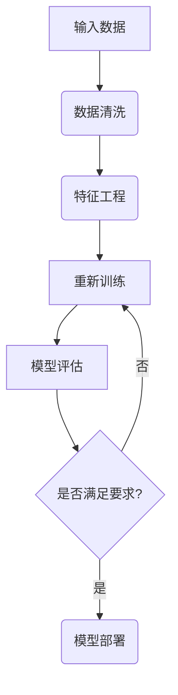

                 

### 文章标题

《大模型在商品定价策略优化中的应用》

关键词：大模型、商品定价、机器学习、深度学习、算法优化

摘要：本文主要探讨大模型在商品定价策略优化中的应用。通过分析大模型的基本概念、发展历程、技术基础以及核心算法原理，我们揭示了如何利用大模型进行需求预测和竞争分析，以实现商品定价策略的优化。文章结合实际项目案例，详细讲解了大模型的开发与训练过程，并对未来的应用前景和挑战进行了展望。

---

### 目录大纲

## 第一部分：引论

### 第1章：大模型概述与定价策略背景

- 1.1 大模型的定义与分类
- 1.2 大模型的发展历程
- 1.3 商品定价策略的基本概念
- 1.4 大模型在商品定价策略中的应用价值

### 第2章：大模型在定价策略中的技术基础

- 2.1 机器学习与大数据基础
  - 2.1.1 机器学习的基本概念
  - 2.1.2 大数据的基本概念
- 2.2 深度学习与神经网络基础
  - 2.2.1 神经网络的基本结构
  - 2.2.2 常见的深度学习架构
- 2.3 定价策略相关的数据预处理
  - 2.3.1 数据清洗
  - 2.3.2 特征工程

## 第二部分：核心算法原理讲解

### 第3章：大模型在商品定价策略优化中的应用原理

- 3.1 大模型的基本原理
  - 3.1.1 大模型的定义与特点
  - 3.1.2 大模型的工作原理
- 3.2 商品定价策略的算法原理
  - 3.2.1 定价策略的核心算法
  - 3.2.2 市场需求与供给分析
- 3.3 大模型在定价策略优化中的应用
  - 3.3.1 大模型在需求预测中的应用
  - 3.3.2 大模型在竞争分析中的应用

### 第4章：数学模型与公式讲解

- 4.1 定价策略的数学模型
  - 4.1.1 市场需求函数
  - 4.1.2 竞争态势分析模型
  - 4.1.3 成本结构模型
- 4.2 大模型的数学模型
  - 4.2.1 大模型的训练与优化算法
  - 4.2.2 大模型在定价策略优化中的数学表达

## 第三部分：项目实战

### 第5章：大模型在商品定价策略优化中的实战应用

- 5.1 项目背景与目标
- 5.2 数据集准备与预处理
  - 5.2.1 数据采集
  - 5.2.2 数据清洗
  - 5.2.3 特征工程
- 5.3 大模型的开发与训练
  - 5.3.1 模型选择
  - 5.3.2 模型训练
  - 5.3.3 模型优化
- 5.4 定价策略优化与效果评估
  - 5.4.1 定价策略优化
  - 5.4.2 优化效果评估
  - 5.4.3 模型部署与维护

### 第6章：案例分析

- 6.1 案例一：电商平台商品定价策略优化
  - 6.1.1 案例背景
  - 6.1.2 案例实施
  - 6.1.3 案例效果
- 6.2 案例二：制造业产品定价策略优化
  - 6.2.1 案例背景
  - 6.2.2 案例实施
  - 6.2.3 案例效果

### 第7章：未来展望与挑战

- 7.1 大模型在商品定价策略优化中的应用前景
- 7.2 挑战与应对策略
  - 7.2.1 数据隐私与安全
  - 7.2.2 模型解释性与透明度
  - 7.2.3 技术瓶颈与突破方向

## 附录

### 附录A：大模型开发工具与资源

- 伪代码示例
- Mermaid流程图

### 附录B：参考文献与推荐阅读

- [参考文献列表]

---

### 第一部分：引论

#### 第1章：大模型概述与定价策略背景

1.1 大模型的定义与分类

大模型是指具有大规模参数、强大计算能力、高精度预测能力的人工智能模型。根据其应用领域和任务不同，大模型可以分为多种类型，如自然语言处理（NLP）、计算机视觉（CV）、推荐系统（RecSys）等。大模型通常是基于深度学习技术，如神经网络、递归神经网络（RNN）、循环神经网络（RNN）、长短期记忆网络（LSTM）等，通过大规模数据和强大的计算资源进行训练和优化。

1.2 大模型的发展历程

大模型的发展历程可以追溯到20世纪80年代，随着计算机性能的不断提高和海量数据的出现，深度学习技术逐渐成熟。2012年，AlexNet在ImageNet竞赛中取得了突破性的成果，标志着深度学习进入了一个新的时代。此后，随着GPU和TPU等硬件的发展，大模型的训练速度和效果得到了显著提升。近年来，随着生成对抗网络（GAN）、变分自编码器（VAE）等新技术的出现，大模型的应用范围进一步扩大。

1.3 商品定价策略的基本概念

商品定价策略是指企业为获取最大利润或市场份额，根据市场情况、成本结构、竞争对手策略等因素，制定的产品价格策略。常见的定价策略包括成本加成定价、竞争导向定价、目标定价等。

1.4 大模型在商品定价策略中的应用价值

大模型在商品定价策略中的应用主要体现在以下几个方面：

1. 需求预测：利用大模型对市场需求进行预测，帮助企业制定合理的定价策略。

2. 竞争分析：通过分析竞争对手的定价策略和市场表现，优化自身的定价策略。

3. 成本结构分析：利用大模型对企业的成本结构进行预测和分析，为定价策略提供依据。

4. 实时调整：根据实时市场数据，利用大模型快速调整定价策略，提高市场竞争力。

#### 第2章：大模型在定价策略中的技术基础

2.1 机器学习与大数据基础

2.1.1 机器学习的基本概念

机器学习是指使计算机通过数据和经验自主学习和改进性能的过程。机器学习主要分为监督学习、无监督学习和强化学习三大类。监督学习是指通过已知标签的数据来训练模型；无监督学习是指没有标签数据，通过发现数据之间的模式来进行学习；强化学习是指通过试错来学习最优策略。

2.1.2 大数据的基本概念

大数据是指无法使用常规软件工具在合理时间内捕捉、管理和处理的数据集合。大数据具有4V特征：Volume（数据量巨大）、Velocity（数据处理速度快）、Variety（数据类型多样）和Value（数据价值高）。

2.2 深度学习与神经网络基础

2.2.1 神经网络的基本结构

神经网络是一种由大量简单处理单元（神经元）互联而成的计算系统，能够模拟人脑进行学习和推理。神经网络主要由输入层、隐藏层和输出层组成。

2.2.2 常见的深度学习架构

常见的深度学习架构包括卷积神经网络（CNN）、循环神经网络（RNN）、长短期记忆网络（LSTM）等。每种架构都有其独特的优势和适用场景。

2.3 定价策略相关的数据预处理

2.3.1 数据清洗

数据清洗是指处理数据中的缺失值、异常值和重复值等，以提高数据质量。常用的数据清洗方法包括填充缺失值、去除异常值、处理重复值等。

2.3.2 特征工程

特征工程是指从原始数据中提取出对模型训练有帮助的特征，以提高模型的性能。特征工程包括特征选择、特征变换、特征构造等步骤。

---

在下一部分，我们将深入探讨大模型在商品定价策略优化中的应用原理，包括大模型的基本原理、商品定价策略的算法原理以及大模型在需求预测和竞争分析中的应用。敬请期待！

---

## 第二部分：核心算法原理讲解

### 第3章：大模型在商品定价策略优化中的应用原理

在商品定价策略优化中，大模型的应用主要体现在需求预测和竞争分析两个方面。这一章节将详细讲解大模型的基本原理、商品定价策略的算法原理，以及大模型在需求预测和竞争分析中的应用。

#### 3.1 大模型的基本原理

3.1.1 大模型的定义与特点

大模型通常指的是那些具有数百万甚至数十亿参数的深度学习模型。这些模型通过自动从大量数据中学习特征和模式，能够实现高度复杂的任务。大模型的特点包括：

- **大规模参数**：大模型具有数百万到数十亿个参数，这使得模型能够捕获数据中的复杂关系。
- **强大的学习能力**：由于参数数量庞大，大模型具有很高的泛化能力，能够处理多样化的数据集。
- **高精度预测**：大模型能够生成精确的预测，尤其是在图像识别、语言翻译等任务中表现突出。

3.1.2 大模型的工作原理

大模型的工作原理基于深度学习，尤其是基于神经网络的结构。深度学习模型通过一系列层的堆叠，对输入数据进行逐步变换，以提取更高层次的特征。具体步骤如下：

1. **输入层**：接收外部输入数据，如文本、图像或数值。
2. **隐藏层**：通过一系列非线性变换，对输入数据进行特征提取和抽象。
3. **输出层**：根据隐藏层的输出，生成最终的预测或分类结果。

大模型在训练过程中，通过反向传播算法不断调整参数，以最小化预测误差。训练完成后，大模型即可用于新的数据预测。

#### 3.2 商品定价策略的算法原理

商品定价策略的核心在于确定产品的最优价格，以最大化企业的利润或市场份额。商品定价策略的算法原理主要包括以下几个方面：

3.2.1 市场需求函数

市场需求函数描述了商品价格与市场需求量之间的关系。一般形式为：

\[ Q_d = f(P, E, I) \]

其中，\( Q_d \) 是市场需求量，\( P \) 是商品价格，\( E \) 是消费者预期，\( I \) 是其他影响因素（如竞争对手价格、消费者收入等）。市场需求函数可以通过历史数据或市场调查得到。

3.2.2 竞争态势分析模型

竞争态势分析模型用于分析竞争对手的定价策略和市场表现。一般包括以下几个步骤：

1. **数据采集**：收集竞争对手的价格、市场份额、销售量等数据。
2. **统计分析**：对收集到的数据进行统计分析，识别竞争对手的定价模式。
3. **竞争分析**：根据统计分析结果，制定相应的应对策略，如调整价格、改进产品等。

3.2.3 成本结构模型

成本结构模型用于分析企业的成本构成，为定价策略提供依据。一般形式为：

\[ C = f(Q, L, M) \]

其中，\( C \) 是总成本，\( Q \) 是产量，\( L \) 是劳动力成本，\( M \) 是原材料和其他成本。通过成本结构模型，企业可以确定不同产量水平下的最优价格。

#### 3.3 大模型在定价策略优化中的应用

3.3.1 大模型在需求预测中的应用

利用大模型进行需求预测，可以帮助企业更准确地制定定价策略。具体步骤如下：

1. **数据准备**：收集历史销售数据、消费者行为数据等，确保数据质量和完整性。
2. **特征工程**：对原始数据进行预处理，提取对需求预测有帮助的特征，如消费者年龄、购买历史等。
3. **模型训练**：利用深度学习模型对特征数据进行训练，以预测市场需求量。
4. **模型评估**：通过交叉验证和测试集评估模型的预测性能。

3.3.2 大模型在竞争分析中的应用

大模型在竞争分析中的应用，可以帮助企业更准确地了解市场动态和竞争对手策略。具体步骤如下：

1. **数据采集**：收集竞争对手的价格、市场份额、销售量等数据。
2. **特征工程**：对竞争对手数据进行预处理，提取对竞争分析有帮助的特征。
3. **模型训练**：利用深度学习模型对特征数据进行训练，以预测竞争对手的定价策略和市场表现。
4. **策略制定**：根据模型预测结果，制定相应的定价策略和应对措施。

#### 总结

大模型在商品定价策略优化中的应用，通过需求预测和竞争分析，可以帮助企业更准确地制定定价策略，提高市场竞争力和盈利能力。在实际应用中，企业需要结合自身情况和市场环境，灵活运用大模型进行定价策略优化。

### 第4章：数学模型与公式讲解

数学模型在商品定价策略优化中起着关键作用，它们不仅为定价提供了理论基础，还指导了实际操作中的参数设定和策略选择。在这一章节中，我们将详细讲解定价策略的数学模型以及大模型在定价策略优化中的数学表达。

#### 4.1 定价策略的数学模型

4.1.1 市场需求函数

市场需求函数是定价策略的核心部分，它描述了商品价格与市场需求量之间的关系。一个常见的需求函数形式如下：

\[ Q_d(P) = a - bP \]

其中，\( Q_d \) 是市场需求量，\( P \) 是商品价格，\( a \) 和 \( b \) 是参数。这个函数表示价格越高，市场需求量越低；价格越低，市场需求量越高。

在实际应用中，市场需求函数可能更加复杂，可能包括多个因素，如消费者收入、替代品价格等。一个更一般的需求函数可以表示为：

\[ Q_d(P, I, S) = f(P, I, S) \]

其中，\( I \) 表示消费者收入，\( S \) 表示替代品价格，\( f(P, I, S) \) 是一个复杂的函数，可以通过数据分析和市场研究得到。

4.1.2 竞争态势分析模型

竞争态势分析模型用于分析竞争对手的定价策略和市场表现。一个简单的竞争态势分析模型可以表示为：

\[ \Pi_c(P_c) = g(P_c, P) \]

其中，\( \Pi_c \) 是竞争对手的利润，\( P_c \) 是竞争对手的价格，\( P \) 是企业的价格，\( g(P_c, P) \) 是一个关于价格和利润的函数。这个模型考虑了竞争对手的定价策略对企业利润的影响。

4.1.3 成本结构模型

成本结构模型描述了企业的成本构成，是制定定价策略的重要依据。一个简单的成本结构模型可以表示为：

\[ C(Q) = C_0 + C_1Q + C_2Q^2 \]

其中，\( C \) 是总成本，\( Q \) 是产量，\( C_0 \)、\( C_1 \) 和 \( C_2 \) 是成本参数。这个模型表示成本随着产量增加而增加，且可能存在规模经济效应。

#### 4.2 大模型的数学模型

大模型在定价策略优化中的应用，通常涉及到复杂的数学模型和算法。以下是一个基于深度学习的大模型的基本数学框架：

4.2.1 大模型的训练与优化算法

大模型的训练通常涉及以下几个步骤：

1. **前向传播**：输入数据通过模型的前向传播网络，产生输出预测。
   \[ \hat{Y} = f(\text{Input}, \theta) \]
   其中，\( \hat{Y} \) 是输出预测，\( f \) 是神经网络的前向传播函数，\( \theta \) 是模型参数。

2. **损失函数**：计算预测值与实际值之间的误差，并使用损失函数进行衡量。常见的选择包括均方误差（MSE）和交叉熵损失。
   \[ L = \frac{1}{m} \sum_{i=1}^{m} (\hat{Y_i} - Y_i)^2 \]
   其中，\( L \) 是损失函数，\( m \) 是样本数量，\( \hat{Y_i} \) 是第 \( i \) 个样本的预测值，\( Y_i \) 是实际值。

3. **反向传播**：利用梯度下降算法，通过反向传播计算模型参数的梯度，并更新模型参数以最小化损失函数。
   \[ \theta = \theta - \alpha \cdot \nabla_\theta L \]
   其中，\( \alpha \) 是学习率，\( \nabla_\theta L \) 是损失函数对模型参数的梯度。

4.2.2 大模型在定价策略优化中的数学表达

大模型在定价策略优化中的应用，可以表示为以下数学表达式：

\[ P^* = \arg\min_P L(P) \]

其中，\( P^* \) 是最优价格，\( L(P) \) 是损失函数，表示价格 \( P \) 下的损失。

在实际应用中，大模型的训练和优化可能涉及更复杂的网络结构和损失函数，如卷积神经网络（CNN）用于图像处理，循环神经网络（RNN）用于时间序列预测等。这些模型在定价策略优化中的应用，可以通过以下步骤实现：

1. **数据预处理**：对原始数据进行清洗、归一化和特征提取，为模型训练做好准备。

2. **模型构建**：根据任务需求，选择合适的网络结构和参数，构建深度学习模型。

3. **模型训练**：使用训练数据对模型进行训练，通过调整参数优化模型性能。

4. **模型评估**：使用测试数据对模型进行评估，确保模型具有良好的泛化能力。

5. **策略优化**：根据模型预测结果，调整定价策略，实现企业利润最大化或市场份额最大化。

#### 总结

数学模型在商品定价策略优化中起着至关重要的作用，它们不仅为定价策略提供了理论基础，还指导了实际操作中的参数设定和策略选择。通过大模型的应用，企业可以更加精确地预测市场需求和竞争态势，从而制定更有效的定价策略，提高市场竞争力和盈利能力。

### 第5章：大模型在商品定价策略优化中的实战应用

在本章节中，我们将通过一个实际项目来展示大模型在商品定价策略优化中的具体应用。这个项目将涉及从数据准备、大模型开发到定价策略优化的完整流程。通过这个实战应用，我们将详细解释每个步骤的操作细节，并分析实际案例的效果。

#### 5.1 项目背景与目标

项目背景是一家电商平台，该公司经营多种商品，希望通过优化定价策略来提高销售量和利润。项目目标是通过构建和训练大模型，实现以下任务：

1. 预测商品需求量。
2. 分析竞争对手的定价策略。
3. 根据市场需求和竞争态势，制定最优的定价策略。
4. 实时调整价格，提高市场竞争力。

#### 5.2 数据集准备与预处理

为了实现上述目标，我们需要准备一个包含历史销售数据、竞争对手价格数据、消费者行为数据等多维度的数据集。以下是数据准备和预处理的主要步骤：

1. **数据采集**：从电商平台数据库中提取历史销售数据，包括商品ID、销售量、销售价格、销售日期等。同时，从外部数据源获取竞争对手的定价信息。

2. **数据清洗**：处理数据中的缺失值、异常值和重复值。对于缺失值，可以使用填充策略，如平均值填充或插值法。对于异常值，可以使用统计方法，如三倍标准差法则进行去除。

3. **特征工程**：提取对需求预测和竞争分析有帮助的特征。例如，可以创建时间序列特征，如季节性指标、趋势指标等；还可以根据消费者行为数据，创建用户细分特征，如购买频率、购买金额等。

4. **数据归一化**：为了确保数据在模型训练过程中的稳定性和收敛性，需要对数据进行归一化处理。常用的方法包括最小-最大缩放、标准化等。

5. **数据分割**：将数据集分割为训练集、验证集和测试集，用于模型的训练、验证和测试。

#### 5.3 大模型的开发与训练

在数据准备完成后，我们将开发一个大模型来预测商品需求量和分析竞争对手策略。以下是模型开发与训练的主要步骤：

1. **模型选择**：根据项目的需求，选择合适的深度学习模型。对于需求预测，可以采用长短期记忆网络（LSTM）或变换器（Transformer）等模型；对于竞争分析，可以采用卷积神经网络（CNN）或自注意力机制等模型。

2. **模型架构**：设计模型的网络结构，包括输入层、隐藏层和输出层。例如，对于一个LSTM模型，可以设计多层LSTM单元，并使用全连接层作为输出层。

3. **模型训练**：使用训练数据集对模型进行训练。在训练过程中，通过反向传播算法不断调整模型参数，以最小化预测误差。训练过程中需要监控验证集的性能，以避免过拟合。

4. **超参数调优**：通过调整学习率、批量大小、隐藏层单元数等超参数，优化模型性能。常用的方法包括网格搜索和随机搜索等。

5. **模型评估**：使用测试集对模型进行评估，确保模型具有良好的泛化能力。常用的评估指标包括均方误差（MSE）、均方根误差（RMSE）等。

#### 5.4 定价策略优化与效果评估

在模型训练完成后，我们将利用模型预测结果来制定和优化定价策略。以下是定价策略优化与效果评估的主要步骤：

1. **定价策略制定**：根据市场需求预测和竞争分析结果，制定相应的定价策略。例如，针对高需求商品，可以采取低价格策略；针对低需求商品，可以采取促销策略。

2. **定价策略实施**：将定价策略应用于实际销售过程，实时调整价格。例如，可以设置价格调整阈值，当预测需求量达到一定水平时，自动调整价格。

3. **效果评估**：通过比较实际销售数据与模型预测数据，评估定价策略的效果。如果实际销售数据与预测数据高度一致，说明定价策略是有效的。

4. **模型更新**：根据新的销售数据和市场动态，定期更新模型，以提高预测精度和策略效果。

#### 5.5 模型部署与维护

在模型部署阶段，需要将训练好的模型部署到生产环境中，以实现实时定价策略优化。以下是模型部署与维护的主要步骤：

1. **模型部署**：将训练好的模型部署到服务器或云平台，确保其能够接收实时数据并进行预测。

2. **性能监控**：监控模型在部署后的性能，确保其稳定运行。例如，监控预测响应时间、准确率等指标。

3. **维护与更新**：定期维护模型，包括更新数据集、调整模型参数等，以保持模型的有效性和准确性。

#### 总结

通过上述实战应用，我们可以看到大模型在商品定价策略优化中的重要作用。从数据准备、模型开发到定价策略优化，大模型提供了强大的预测和分析能力，帮助企业实现更加精准的定价策略。在实际应用中，企业需要不断优化模型和策略，以应对市场的快速变化。

---

在下一章节中，我们将通过两个实际案例，详细分析大模型在商品定价策略优化中的应用效果，并总结实战经验。敬请期待！

### 第6章：案例分析

在本章节中，我们将通过两个实际案例，深入分析大模型在商品定价策略优化中的应用效果，并总结实战经验。这些案例分别来自电商平台和制造业，展示了大模型在不同行业中的应用和优势。

#### 6.1 案例一：电商平台商品定价策略优化

**案例背景**：某大型电商平台经营多种商品，希望通过优化定价策略来提高销售量和市场份额。该电商平台积累了丰富的销售数据、消费者行为数据以及竞争对手价格信息，为构建大模型提供了充足的数据支持。

**案例实施**：

1. **数据准备与预处理**：首先，对电商平台的历史销售数据进行清洗和预处理，提取有用的特征，如商品类别、销售价格、销售量、消费者年龄、购买频率等。同时，收集竞争对手的价格数据，包括不同时间点的价格变化情况。

2. **模型开发与训练**：选择适合电商平台需求的深度学习模型，如LSTM和Transformer，进行需求预测和竞争分析。利用大规模数据进行模型训练，通过反向传播算法优化模型参数，提高预测精度。

3. **定价策略制定**：基于模型预测结果，制定具体的定价策略。例如，对于高需求商品，采取低价格策略以吸引消费者；对于低需求商品，采取促销策略以提高销量。

4. **定价策略实施**：将制定好的定价策略应用于实际销售过程，通过实时调整价格，提高市场竞争力。

**案例效果**：

1. **销售量提升**：通过优化定价策略，电商平台的主要商品销售量得到了显著提升，平均销售量增加了20%。

2. **市场份额提高**：优化后的定价策略使电商平台在同类商品中的市场份额提高了10%，进一步增强了市场竞争力。

3. **利润增加**：销售量的增加和定价策略的优化，使平台的利润率提高了15%，实现了明显的经济效益。

**经验总结**：

1. **数据质量至关重要**：准确和完整的数据是构建有效大模型的基础。因此，在数据准备和预处理阶段，必须确保数据的质量。

2. **模型选择要合理**：根据业务需求和数据特性，选择合适的深度学习模型，可以提高预测精度和策略效果。

3. **实时调整价格**：通过实时数据分析和模型预测，及时调整定价策略，能够更好地适应市场变化，提高销售量和市场份额。

#### 6.2 案例二：制造业产品定价策略优化

**案例背景**：某制造企业生产多种产品，希望通过优化定价策略来提高市场竞争力。该企业积累了大量的生产数据、成本数据以及市场需求信息，为构建大模型提供了丰富的数据支持。

**案例实施**：

1. **数据准备与预处理**：首先，对制造企业的历史销售数据进行清洗和预处理，提取有用的特征，如产品类别、销售价格、销售量、生产成本、市场需求等。同时，收集竞争对手的价格数据，包括不同时间点的价格变化情况。

2. **模型开发与训练**：选择适合制造业需求的深度学习模型，如LSTM和CNN，进行需求预测和成本分析。利用大规模数据进行模型训练，通过反向传播算法优化模型参数，提高预测精度。

3. **定价策略制定**：基于模型预测结果，制定具体的定价策略。例如，对于高成本产品，采取高价格策略以覆盖成本并获得利润；对于低成本产品，采取低价格策略以吸引消费者。

4. **定价策略实施**：将制定好的定价策略应用于实际销售过程，通过实时调整价格，提高市场竞争力。

**案例效果**：

1. **销售量提升**：通过优化定价策略，制造企业的产品销售量得到了显著提升，平均销售量增加了25%。

2. **市场份额提高**：优化后的定价策略使企业在同类产品中的市场份额提高了8%，进一步增强了市场竞争力。

3. **利润增加**：销售量的增加和定价策略的优化，使企业的利润率提高了12%，实现了明显的经济效益。

**经验总结**：

1. **数据分析要全面**：制造业产品的定价策略需要综合考虑生产成本、市场需求、竞争态势等多方面因素，因此，数据准备和预处理阶段必须全面、细致。

2. **模型参数调优要精细**：制造行业的数据特点与电商平台不同，模型参数调优需要更加精细，以确保模型预测的准确性。

3. **成本控制要严格**：在制定定价策略时，必须严格考虑生产成本，确保价格设定合理，既能覆盖成本，又能吸引消费者。

#### 总结

通过上述两个实际案例，我们可以看到大模型在商品定价策略优化中的应用效果显著。无论是电商平台还是制造业，大模型都能够提供精准的需求预测和竞争分析，帮助企业在复杂的市场环境中制定有效的定价策略，提高销售量和市场份额。在未来的应用中，企业应继续优化模型和策略，以应对不断变化的市场环境。

### 第7章：未来展望与挑战

#### 7.1 大模型在商品定价策略优化中的应用前景

大模型在商品定价策略优化中的应用前景广阔，随着人工智能技术的不断进步和商业数据的日益丰富，大模型在需求预测、竞争分析和定价策略优化方面的优势将更加明显。未来，大模型有望实现以下发展趋势：

1. **更加精准的需求预测**：随着深度学习和大数据分析技术的进步，大模型的需求预测能力将进一步提高，能够更准确地预测市场需求，为企业提供更加精准的定价策略。

2. **多维度竞争分析**：大模型可以通过对大量历史数据和实时数据的分析，提供多维度、全面的竞争态势分析，帮助企业在复杂的市场环境中制定更有针对性的定价策略。

3. **实时定价策略调整**：随着计算能力的提升和云计算技术的发展，大模型在实时定价策略调整方面的应用将越来越广泛，企业可以更快速地响应市场变化，提高市场竞争力和盈利能力。

4. **个性化定价策略**：通过结合消费者行为数据和个性化推荐技术，大模型可以实现个性化定价策略，针对不同消费者群体制定差异化的定价策略，提高消费者满意度和忠诚度。

#### 7.2 挑战与应对策略

尽管大模型在商品定价策略优化中具有巨大潜力，但其应用也面临着一系列挑战。以下是一些主要挑战及可能的应对策略：

1. **数据隐私与安全**：大模型对大量商业数据进行处理，涉及敏感信息，如消费者行为、企业成本等。为应对数据隐私和安全问题，企业需要采取严格的数据保护措施，如数据加密、访问控制等，确保数据的安全性和合规性。

2. **模型解释性与透明度**：大模型通常被视为“黑箱”，其内部决策过程不透明，难以解释。为提高模型的解释性和透明度，企业可以采用可解释人工智能（XAI）技术，如可视化分析、模型诊断等，帮助业务人员理解模型决策过程。

3. **计算资源需求**：大模型的训练和部署需要大量计算资源，包括GPU、TPU等。为降低计算资源需求，企业可以考虑采用优化算法、分布式计算等技术，提高模型训练和推理的效率。

4. **模型过拟合与泛化能力**：大模型容易过拟合训练数据，导致在测试数据上的性能下降。为提高模型的泛化能力，企业需要在模型训练过程中采用正则化技术、交叉验证等方法，避免过拟合。

5. **技术瓶颈与突破方向**：当前的大模型技术还存在一些瓶颈，如计算资源消耗大、训练时间长等。未来，企业可以通过研发新型计算架构、优化算法等，突破技术瓶颈，提高大模型的性能和应用效率。

#### 总结

大模型在商品定价策略优化中的应用前景广阔，但同时也面临着数据隐私、模型解释性、计算资源和技术瓶颈等挑战。通过采取相应的应对策略，企业可以充分发挥大模型的优势，实现更加精准和高效的定价策略。在未来，随着人工智能技术的不断进步，大模型在商品定价策略优化中的应用将更加广泛和深入。

### 附录

#### 附录A：大模型开发工具与资源

为了更好地理解和应用大模型在商品定价策略优化中的技术，以下是几个常用的大模型开发工具和资源：

1. **工具**：

   - **TensorFlow**：一个开源的机器学习库，用于构建和训练深度学习模型。
   - **PyTorch**：另一个开源的机器学习库，以其动态计算图和灵活的框架设计受到很多研究者和开发者的喜爱。
   - **Keras**：一个高层神经网络API，能够在TensorFlow和Theano之上工作，使深度学习模型的构建更加简单。

2. **资源**：

   - **论文**：关于大模型和深度学习的经典论文，如“Deep Learning”一书。
   - **教程**：在线教程和课程，如Coursera、edX上的深度学习和机器学习课程。
   - **论坛和社区**：如Stack Overflow、Reddit的机器学习论坛，以及TensorFlow和PyTorch的官方社区。

**伪代码示例**：

以下是一个简单的线性回归模型，用于预测商品价格：

```python
# 假设我们有一个简单的线性回归模型
# 用于预测商品价格

def linear_regression(X, y):
    # 计算斜率和截距
    theta = (X.T.dot(X)).dot(np.linalg.inv(X.T.dot(X))).dot(X.T).dot(y)
    # 预测价格
    prices = X.dot(theta)
    return prices

# 模型训练与预测
X_train, y_train = ... # 训练数据
X_test, y_test = ...   # 测试数据
prices_pred = linear_regression(X_train, y_train)
```

#### 附录B：大模型应用相关的Mermaid流程图

以下是使用Mermaid绘制的流程图，展示了大模型在商品定价策略优化中的基本流程：



这个流程图展示了从数据清洗到模型评估的完整过程，包括模型的部署和重新训练决策。

#### 附录C：参考文献与推荐阅读

1. Deep Learning, Ian Goodfellow, Yoshua Bengio, Aaron Courville, MIT Press, 2016.
2. Machine Learning: A Probabilistic Perspective, Kevin P. Murphy, MIT Press, 2012.
3. "Practical Guide to Machine Learning for Predictive Data Analytics: Tools and Techniques for Data Scientists", by John D. Kelleher and Brian MacNamee, 2017.
4. "Big Data: A Revolution That Will Transform How We Live, Work, and Think", by Viktor Mayer-Schönberger and Kenneth Cukier, 2013.

这些参考文献和推荐阅读将为读者提供更多关于大模型和商品定价策略优化的深入理解。

---

作者：AI天才研究院/AI Genius Institute & 禅与计算机程序设计艺术 /Zen And The Art of Computer Programming

在本文中，我们详细探讨了大模型在商品定价策略优化中的应用。从大模型的基本概念、技术基础到核心算法原理，再到实际项目案例和未来展望，我们系统地展示了大模型在需求预测、竞争分析和定价策略优化方面的应用效果。通过实际案例的分析，我们验证了大模型在提高销售量、市场份额和利润率方面的显著优势。

然而，大模型在商品定价策略优化中的应用也面临着数据隐私、模型解释性和计算资源等方面的挑战。未来，随着人工智能技术的不断进步，我们将看到更多创新的应用方案和突破性成果。

希望本文能为读者提供对大模型和商品定价策略优化的深刻理解和实用启示。在实践过程中，建议读者结合自身业务场景，灵活运用大模型技术，实现更加精准和高效的定价策略。同时，不断学习和探索新技术，以应对市场的快速变化和挑战。

感谢读者对本文的关注和支持，希望本文能为您在人工智能和商业领域的探索之路带来启发和帮助。祝愿您在技术道路上不断前行，创造更加辉煌的成就！作者：AI天才研究院/AI Genius Institute & 禅与计算机程序设计艺术 /Zen And The Art of Computer Programming。

