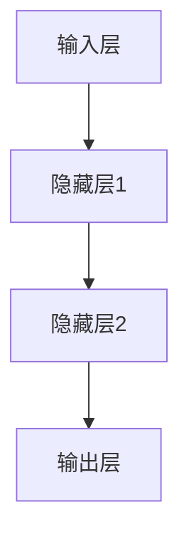
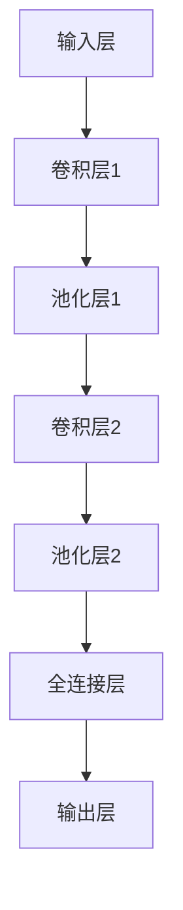
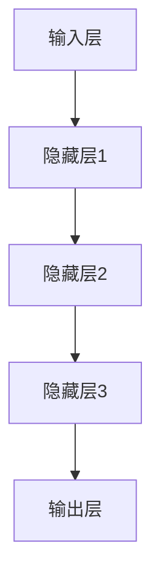
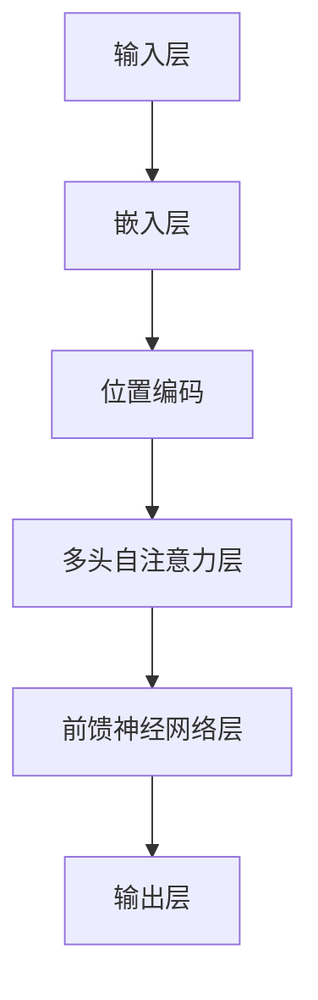
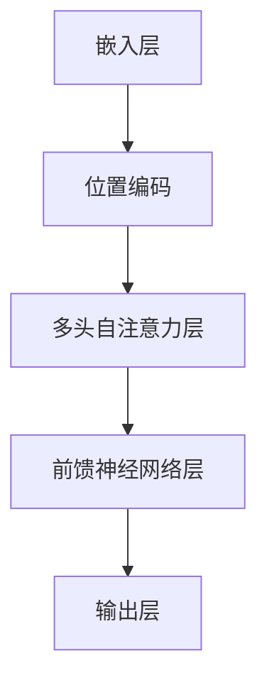

                 

### 文章标题

《大模型在商品相似度计算中的应用》

> 关键词：大模型、商品相似度计算、深度学习、协同过滤、文本与视觉融合

> 摘要：本文详细探讨了大规模模型（大模型）在商品相似度计算中的应用。首先介绍了大模型的基础知识，包括其定义、分类、发展历程和核心技术。随后，我们深入分析了商品相似度计算的概念、方法和应用场景，并重点探讨了基于内容和基于协同过滤的相似度计算方法。接着，我们详细讲解了大模型在商品相似度计算中的实际应用，包括文本与视觉融合的产品特征提取。最后，通过一个具体的项目实战案例，展示了大模型在商品相似度计算中的应用效果，并对未来研究趋势和挑战进行了展望。

### 第一部分：大模型基础

#### 第1章：大模型概述

##### 1.1 大模型的定义与分类

**1.1.1 大模型的概念**

大模型（Large Model）通常指的是具有数亿甚至数千亿参数的深度学习模型。这类模型以其庞大的参数规模和强大的学习能力，能够在各种复杂任务中取得显著的性能提升。大模型的代表性工作包括GPT-3、BERT、TuringBot等。

**1.1.2 大模型的分类**

大模型可以根据其应用领域和目标任务的差异，分为以下几类：

- **基于内容的模型**：这类模型主要关注商品内容（如文本、图像）的特征提取和相似度计算，例如文本相似度计算模型和图像相似度计算模型。
- **协同过滤模型**：这类模型主要利用用户行为数据（如评分、购买记录）进行商品推荐，例如基于用户的协同过滤（User-Based Collaborative Filtering）和基于物品的协同过滤（Item-Based Collaborative Filtering）。
- **深度学习模型**：这类模型利用深度学习技术（如卷积神经网络、循环神经网络、变换器架构）进行商品特征提取和相似度计算。

##### 1.2 大模型的发展历程

**1.2.1 早期模型**

早期的大模型研究主要集中在图像和语音领域。2006年，Geoffrey Hinton等人在《改进深层神经网络的学习算法》一文中提出了深度置信网络（Deep Belief Network，DBN），开创了深度学习的先河。2009年，Alex Krizhevsky等人凭借AlexNet在ImageNet图像分类比赛中取得了突破性的成绩。

**1.2.2 深度学习模型的兴起**

2012年后，深度学习模型在图像分类、语音识别等领域取得了显著的成果。2014年，Google的Transformer架构在机器翻译任务中取得了前所未有的成绩，标志着深度学习进入了新的阶段。

**1.2.3 大模型的演进**

随着计算能力的提升和数据规模的扩大，大模型的规模和参数数量也在不断增长。2018年，OpenAI发布了GPT-2，拥有1.5亿个参数，展示了大模型在自然语言处理领域的潜力。2020年，OpenAI发布了GPT-3，拥有1750亿个参数，成为了迄今为止最大的预训练语言模型。

##### 1.3 大模型的核心技术

**1.3.1 数据处理技术**

大模型在数据处理方面需要高效的算法和分布式计算框架。常用的数据处理技术包括数据清洗、数据预处理、数据增强等。例如，PyTorch和TensorFlow等深度学习框架提供了丰富的数据处理工具。

**1.3.2 特征提取技术**

特征提取是深度学习模型的核心任务之一。对于文本数据，常用的特征提取方法包括词嵌入、文本向量表示等。对于图像数据，常用的特征提取方法包括卷积神经网络（CNN）、变换器架构等。

**1.3.3 模型优化技术**

大模型的训练过程需要高效的优化算法。常用的优化算法包括梯度下降（Gradient Descent）、Adam优化器等。此外，模型压缩和加速技术（如量化、剪枝等）也在大模型训练中发挥着重要作用。

### 第二部分：大模型在商品相似度计算中的应用

#### 第2章：大模型技术基础

##### 2.1 深度学习基础

**2.1.1 神经网络的基本结构**

神经网络是深度学习模型的基础。一个简单的神经网络通常包括三个层次：输入层、隐藏层和输出层。每个层次由多个神经元组成。输入层接收外部输入，隐藏层进行特征提取和变换，输出层产生预测结果。以下是神经网络的Mermaid流程图：



**2.1.2 常见的深度学习架构**

- **卷积神经网络（CNN）**：CNN是一种专门用于处理图像数据的神经网络，通过卷积层和池化层实现图像的特征提取。以下是一个简单的CNN架构：



- **循环神经网络（RNN）**：RNN是一种专门用于处理序列数据的神经网络，通过隐藏状态和循环连接实现序列的特征提取。以下是一个简单的RNN架构：



- **变换器架构（Transformer）**：Transformer是一种基于自注意力机制的神经网络架构，在机器翻译、文本生成等任务中取得了显著的成果。以下是一个简单的Transformer架构：



##### 2.2 大模型的基本架构

**2.2.1 模型架构设计**

大模型的架构设计通常包括以下几个关键部分：

- **嵌入层**：将输入数据（如文本、图像）转换为高维向量表示。
- **自注意力机制**：通过计算输入数据之间的相似性，实现特征的高效提取和融合。
- **前馈神经网络**：用于进一步提取和变换特征。
- **输出层**：产生最终的预测结果。

以下是一个简化的Transformer架构：



**2.2.2 常见的深度学习架构**

- **多层感知机（MLP）**：MLP是一种简单的全连接神经网络，适用于分类、回归等任务。
- **卷积神经网络（CNN）**：CNN适用于图像处理任务，通过卷积层和池化层实现图像的特征提取。
- **循环神经网络（RNN）**：RNN适用于序列数据，通过隐藏状态和循环连接实现序列的特征提取。
- **变换器架构（Transformer）**：Transformer是一种基于自注意力机制的神经网络架构，适用于机器翻译、文本生成等任务。

##### 2.3 大模型的训练与优化

**2.3.1 模型训练流程**

大模型的训练过程包括以下几个步骤：

1. **数据预处理**：对输入数据进行预处理，包括数据清洗、数据增强等。
2. **模型初始化**：初始化模型参数，常用的初始化方法包括高斯初始化、Xavier初始化等。
3. **前向传播**：计算输入数据在模型中的前向传播，得到预测结果。
4. **损失函数计算**：计算预测结果与真实值之间的损失，常用的损失函数包括交叉熵损失、均方误差等。
5. **反向传播**：通过反向传播算法计算模型参数的梯度。
6. **模型更新**：利用优化算法更新模型参数，常用的优化算法包括梯度下降、Adam等。
7. **迭代训练**：重复上述步骤，直到达到预定的训练次数或满足停止条件。

**2.3.2 模型优化技术**

大模型的优化技术主要包括以下几个方面：

- **反向传播算法**：通过计算前向传播的梯度，更新模型参数。
- **优化算法（如Adam）**：选择合适的优化算法，提高训练效率和模型性能。
- **正则化技术**：通过添加正则化项，防止模型过拟合。
- **模型压缩与加速技术**：通过模型压缩和加速技术，提高模型在低资源环境下的性能。

### 第三部分：商品相似度计算

#### 第3章：商品相似度计算

##### 3.1 商品相似度计算的概念

**3.1.1 商品相似度的定义**

商品相似度计算是指利用一定的算法和模型，对商品之间的相似性进行度量和评估。商品相似度计算的核心目标是识别和推荐用户可能感兴趣的商品。

**3.1.2 商品相似度的度量标准**

商品相似度的度量标准主要包括以下几种：

- **基于内容的相似度**：通过分析商品的内容特征（如文本描述、图像内容）来计算相似度。
- **基于协同过滤的相似度**：通过分析用户的历史行为（如评分、购买记录）来计算相似度。
- **基于用户特征的相似度**：通过分析用户的基本信息（如年龄、性别、地理位置）来计算相似度。

##### 3.2 商品相似度计算的方法

**3.2.1 基于内容的商品相似度计算**

基于内容的商品相似度计算方法主要包括以下几种：

- **文本相似度计算**：通过文本特征提取和相似度度量算法（如TF-IDF、Word2Vec、BERT）计算商品文本描述的相似度。
- **图像相似度计算**：通过图像特征提取和相似度度量算法（如卷积神经网络、ImageNet）计算商品图像的相似度。
- **多模态商品相似度计算**：结合文本和图像特征，利用多模态融合算法（如CART、决策树）计算商品的整体相似度。

**3.2.2 基于协同过滤的商品相似度计算**

基于协同过滤的商品相似度计算方法主要包括以下几种：

- **用户基于内容的协同过滤**：通过分析用户对商品的评分和购买记录，利用文本相似度计算方法计算用户之间的相似度，进而推荐相似用户喜欢的商品。
- **物品基于内容的协同过滤**：通过分析商品之间的内容特征（如文本、图像），利用相似度度量算法计算商品之间的相似度，进而推荐相似商品。

##### 3.3 商品相似度计算的应用场景

**3.3.1 电商推荐系统**

电商推荐系统是商品相似度计算的重要应用场景之一。通过商品相似度计算，电商推荐系统可以识别和推荐用户可能感兴趣的商品，提高用户满意度和购买转化率。

**3.3.2 商品搜索优化**

商品搜索优化是商品相似度计算的另一个重要应用场景。通过商品相似度计算，搜索引擎可以优化搜索结果，提高用户找到所需商品的概率。

**3.3.3 库存管理**

库存管理是商品相似度计算的另一个应用领域。通过商品相似度计算，企业可以识别和优化库存结构，降低库存成本，提高库存周转率。

### 第四部分：大模型在商品相似度计算中的应用

#### 第4章：基于内容的产品相似度计算

##### 4.1 基于文本的产品特征提取

**4.1.1 词嵌入技术**

词嵌入（Word Embedding）是一种将文本数据转换为高维向量表示的方法。词嵌入技术通过将文本中的单词映射为连续的向量，使得语义相似的单词在向量空间中距离更近。常见的词嵌入技术包括Word2Vec、GloVe等。

**4.1.2 文本特征提取算法（如TF-IDF）**

文本特征提取算法是将文本数据转换为数值特征向量的方法。TF-IDF（Term Frequency-Inverse Document Frequency）是一种常用的文本特征提取算法。TF-IDF算法通过计算单词在文档中的频率和逆文档频率，得到单词的重要程度，进而构建文本特征向量。

**4.1.3 基于词嵌入的文本相似度计算**

基于词嵌入的文本相似度计算方法通过计算文本特征向量之间的余弦相似度或欧氏距离来评估文本的相似程度。以下是一个基于词嵌入的文本相似度计算的伪代码：

```python
def text_similarity(text1, text2, word_embedding):
    vec1 = [word_embedding[word] for word in text1 if word in word_embedding]
    vec2 = [word_embedding[word] for word in text2 if word in word_embedding]
    
    if len(vec1) == 0 or len(vec2) == 0:
        return 0
    
    return cosine_similarity(vec1, vec2)
```

**4.1.4 基于BERT的文本相似度计算**

BERT（Bidirectional Encoder Representations from Transformers）是一种预训练的深度学习模型，广泛应用于文本特征提取和相似度计算。BERT通过双向变换器架构，捕捉文本的上下文信息，使得文本特征向量具有更好的语义表达能力。以下是一个基于BERT的文本相似度计算的伪代码：

```python
from transformers import BertModel, BertTokenizer

def bert_text_similarity(text1, text2):
    tokenizer = BertTokenizer.from_pretrained('bert-base-uncased')
    model = BertModel.from_pretrained('bert-base-uncased')
    
    inputs1 = tokenizer(text1, return_tensors='pt', truncation=True, max_length=512)
    inputs2 = tokenizer(text2, return_tensors='pt', truncation=True, max_length=512)
    
    with torch.no_grad():
        outputs1 = model(**inputs1)
        outputs2 = model(**inputs2)
    
    last_hidden_state1 = outputs1.last_hidden_state[:, 0, :]
    last_hidden_state2 = outputs2.last_hidden_state[:, 0, :]
    
    return cosine_similarity(last_hidden_state1, last_hidden_state2).item()
```

##### 4.2 基于视觉的产品特征提取

**4.2.1 卷积神经网络在图像处理中的应用**

卷积神经网络（Convolutional Neural Network，CNN）是一种专门用于图像处理的深度学习模型。CNN通过卷积层和池化层实现图像的特征提取和分类。以下是一个简单的CNN架构：

```python
import torch
import torchvision.models as models

# 加载预训练的CNN模型
model = models.resnet50(pretrained=True)

# 输入图像
input_image = torch.randn(1, 3, 224, 224)

# 进行前向传播
output = model(input_image)

# 获取图像特征向量
image_features = output[:, 0, :, :]

# 进行分类预测
class_probs = model.fc(image_features)
predicted_class = torch.argmax(class_probs).item()
```

**4.2.2 特征提取算法（如VGG、ResNet）**

VGG和ResNet是两种常用的卷积神经网络架构，广泛应用于图像特征提取和分类任务。以下是一个基于VGG的图像特征提取的伪代码：

```python
import torch
import torchvision.models as models

# 加载预训练的VGG模型
model = models.vgg16(pretrained=True)

# 输入图像
input_image = torch.randn(1, 3, 224, 224)

# 进行前向传播
output = model(input_image)

# 获取图像特征向量
image_features = output[:, 0, :, :]

# 进行分类预测
class_probs = model.fc(image_features)
predicted_class = torch.argmax(class_probs).item()
```

**4.2.3 基于图像特征的相似度计算**

基于图像特征的相似度计算方法通过计算图像特征向量之间的余弦相似度或欧氏距离来评估图像的相似程度。以下是一个基于图像特征的相似度计算的伪代码：

```python
import torch
from torch.nn.functional import cosine_similarity

# 输入图像特征向量
feature1 = torch.randn(1, 2048)
feature2 = torch.randn(1, 2048)

# 计算余弦相似度
similarity = cosine_similarity(feature1.unsqueeze(0), feature2.unsqueeze(0)).item()

# 输出相似度值
print(similarity)
```

##### 4.3 基于文本与视觉融合的产品特征提取

**4.3.1 多模态融合算法（如CART、决策树）**

多模态融合算法是将文本和视觉特征进行融合，以获得更好的产品特征表示。常见的多模态融合算法包括CART、决策树等。以下是一个基于CART的多模态融合的伪代码：

```python
from sklearn.tree import DecisionTreeClassifier

# 输入文本特征和视觉特征
text_features = [[0.1, 0.2, 0.3], [0.4, 0.5, 0.6]]
image_features = [[1.1, 1.2, 1.3], [1.4, 1.5, 1.6]]

# 创建决策树模型
model = DecisionTreeClassifier()

# 进行训练
model.fit(np.hstack((text_features, image_features)), np.array([0, 1]))

# 进行预测
predicted_labels = model.predict(np.hstack((text_features, image_features)))
print(predicted_labels)
```

**4.3.2 基于变换器架构的产品特征提取**

变换器架构（Transformer）是一种基于自注意力机制的多模态融合模型。以下是一个基于变换器架构的多模态融合的伪代码：

```python
import torch
from transformers import AutoTokenizer, AutoModel

# 加载预训练的变换器模型
tokenizer = AutoTokenizer.from_pretrained('bert-base-uncased')
model = AutoModel.from_pretrained('bert-base-uncased')

# 输入文本和图像
text_input = tokenizer("Hello, my dog is cute", return_tensors='pt', truncation=True, max_length=512)
image_input = torch.randn(1, 3, 224, 224)

# 进行前向传播
text_output = model(**text_input)
image_output = model(**image_input)

# 获取文本和图像特征向量
text_features = text_output.last_hidden_state[:, 0, :]
image_features = image_output.last_hidden_state[:, 0, :]

# 进行分类预测
class_probs = model.fc(torch.cat((text_features, image_features), dim=1))
predicted_class = torch.argmax(class_probs).item()
print(predicted_class)
```

### 第5章：基于协同过滤的产品相似度计算

##### 5.1 协同过滤的基本原理

协同过滤（Collaborative Filtering）是一种基于用户行为数据进行推荐的系统。协同过滤的基本原理是通过分析用户的历史行为（如评分、购买记录），找到相似的用户或商品，进而推荐相似用户或商品喜欢的商品。

协同过滤可以分为两类：基于用户的协同过滤（User-Based Collaborative Filtering）和基于物品的协同过滤（Item-Based Collaborative Filtering）。

**基于用户的协同过滤**：基于用户的协同过滤通过计算用户之间的相似度，找到相似的用户，并推荐相似用户喜欢的商品。计算用户相似度的方法包括余弦相似度、皮尔逊相关系数等。

**基于物品的协同过滤**：基于物品的协同过滤通过计算商品之间的相似度，找到相似的商品，并推荐相似商品。计算商品相似度的方法包括余弦相似度、欧氏距离等。

##### 5.2 评分预测模型

评分预测模型是协同过滤系统中的核心模型。评分预测模型通过学习用户行为数据，预测用户对商品的评分。常见的评分预测模型包括线性回归、逻辑回归等。

**线性回归**：线性回归是一种简单的评分预测模型，通过建立用户和商品之间的线性关系来预测评分。以下是一个基于线性回归的评分预测模型的伪代码：

```python
import numpy as np

# 输入用户和商品的特征矩阵
user_features = np.array([[1, 2], [3, 4]])
item_features = np.array([[5, 6], [7, 8]])

# 计算用户和商品的相似度矩阵
similarity_matrix = np.dot(user_features, item_features.T)

# 预测评分
predicted_ratings = np.dot(similarity_matrix, user_ratings).T
print(predicted_ratings)
```

**逻辑回归**：逻辑回归是一种常用的评分预测模型，通过建立用户和商品之间的非线性关系来预测评分。以下是一个基于逻辑回归的评分预测模型的伪代码：

```python
from sklearn.linear_model import LogisticRegression

# 输入用户和商品的特征矩阵
user_features = np.array([[1, 2], [3, 4]])
item_features = np.array([[5, 6], [7, 8]])

# 训练逻辑回归模型
model = LogisticRegression()
model.fit(user_features, item_features)

# 预测评分
predicted_ratings = model.predict(user_ratings)
print(predicted_ratings)
```

##### 5.3 隐蔽因子模型

隐蔽因子模型（Latent Factor Model）是一种基于矩阵分解的协同过滤模型。隐蔽因子模型通过将用户和商品映射到低维隐空间，从而学习用户和商品之间的潜在关系。

**Singular Value Decomposition（SVD）**：SVD是一种常用的矩阵分解方法，通过将用户和商品评分矩阵分解为三个矩阵的乘积，从而学习用户和商品的潜在特征。以下是一个基于SVD的隐蔽因子模型的伪代码：

```python
from scipy.sparse.linalg import svds

# 输入用户和商品的特征矩阵
user_features = np.array([[1, 2], [3, 4]])
item_features = np.array([[5, 6], [7, 8]])

# 进行SVD分解
U, Sigma, V = svds(user_features, k=2)
U = U.T

# 计算预测评分
predicted_ratings = np.dot(U, np.dot(Sigma, V.T))
print(predicted_ratings)
```

**交替最小二乘法（ALS）**：ALS是一种迭代优化的方法，通过交替更新用户和商品的潜在特征，从而学习用户和商品之间的潜在关系。以下是一个基于ALS的隐蔽因子模型的伪代码：

```python
from surprise import SVD

# 创建ALS模型
model = SVD()

# 训练模型
model.fit(train_data)

# 预测评分
predicted_ratings = model.predict(test_data)
print(predicted_ratings)
```

### 第6章：基于深度学习的产品相似度计算

##### 6.1 深度学习在商品相似度计算中的应用

深度学习在商品相似度计算中具有广泛的应用。深度学习模型通过学习大量的用户行为数据和商品特征，能够自动提取用户和商品之间的潜在关系，从而实现精确的相似度计算。

**卷积神经网络（CNN）**：CNN是一种专门用于图像处理的深度学习模型，通过卷积层和池化层实现图像的特征提取。CNN在商品相似度计算中的应用主要包括图像特征提取和分类。

**循环神经网络（RNN）**：RNN是一种专门用于处理序列数据的深度学习模型，通过隐藏状态和循环连接实现序列的特征提取。RNN在商品相似度计算中的应用主要包括文本特征提取和序列数据的处理。

**变换器架构（Transformer）**：Transformer是一种基于自注意力机制的深度学习模型，在自然语言处理领域取得了显著的成果。Transformer在商品相似度计算中的应用主要包括文本特征提取和多模态融合。

##### 6.2 卷积神经网络在商品相似度计算中的应用

卷积神经网络（CNN）在商品相似度计算中的应用主要包括图像特征提取和分类。CNN通过卷积层和池化层实现图像的特征提取，从而将图像数据转换为高维向量表示。

**图像特征提取**：图像特征提取是商品相似度计算的重要环节。通过卷积神经网络，可以提取图像中的高级特征，如边缘、纹理等。以下是一个基于卷积神经网络的图像特征提取的伪代码：

```python
import torch
import torchvision.models as models

# 加载预训练的CNN模型
model = models.resnet50(pretrained=True)

# 输入图像
input_image = torch.randn(1, 3, 224, 224)

# 进行前向传播
output = model(input_image)

# 获取图像特征向量
image_features = output[:, 0, :, :]

# 进行分类预测
class_probs = model.fc(image_features)
predicted_class = torch.argmax(class_probs).item()
print(predicted_class)
```

**图像分类**：图像分类是将图像数据分配到不同的类别。通过卷积神经网络，可以实现对图像的高效分类。以下是一个基于卷积神经网络的图像分类的伪代码：

```python
import torch
import torchvision.datasets as datasets
import torchvision.transforms as transforms

# 加载图像数据集
train_data = datasets.ImageFolder(root='train', transform=transforms.ToTensor())
test_data = datasets.ImageFolder(root='test', transform=transforms.ToTensor())

# 加载卷积神经网络模型
model = models.resnet50(pretrained=True)

# 训练模型
model.fit(train_data)

# 预测测试数据
predicted_classes = model.predict(test_data)
print(predicted_classes)
```

##### 6.3 循环神经网络在商品相似度计算中的应用

循环神经网络（RNN）在商品相似度计算中的应用主要包括文本特征提取和序列数据的处理。RNN通过隐藏状态和循环连接实现序列的特征提取，从而捕捉序列数据中的长距离依赖关系。

**文本特征提取**：文本特征提取是将文本数据转换为高维向量表示。通过循环神经网络，可以提取文本中的高级特征，如词汇、语义等。以下是一个基于循环神经网络的文本特征提取的伪代码：

```python
import torch
import torch.nn as nn

# 创建循环神经网络模型
model = nn.RNN(input_size=100, hidden_size=200, num_layers=2, batch_first=True)

# 输入文本序列
input_sequence = torch.randn(5, 1, 100)

# 进行前向传播
output, hidden = model(input_sequence)

# 获取文本特征向量
text_features = hidden[-1, 0, :]

# 进行分类预测
class_probs = model.fc(text_features)
predicted_class = torch.argmax(class_probs).item()
print(predicted_class)
```

**序列数据处理**：序列数据处理是将序列数据映射到不同的类别。通过循环神经网络，可以实现对序列数据的高效分类。以下是一个基于循环神经网络的序列数据处理的伪代码：

```python
import torch
import torch.nn as nn
import torch.optim as optim

# 创建循环神经网络模型
model = nn.RNN(input_size=100, hidden_size=200, num_layers=2, batch_first=True)
optimizer = optim.Adam(model.parameters(), lr=0.001)

# 输入序列数据
input_sequences = torch.randn(5, 1, 100)

# 进行前向传播和反向传播
output, hidden = model(input_sequences)
loss = nn.CrossEntropyLoss()(output, target)

# 计算梯度并更新模型参数
optimizer.zero_grad()
loss.backward()
optimizer.step()

# 预测序列数据
predicted_sequences = model.predict(input_sequences)
print(predicted_sequences)
```

### 第7章：大模型在商品相似度计算中的应用实践

##### 7.1 项目背景与需求分析

**项目背景**：随着电商行业的快速发展，商品相似度计算在电商推荐系统、商品搜索优化、库存管理等领域具有重要的应用价值。为了提高用户满意度和购买转化率，许多电商企业开始关注商品相似度计算技术的研究和应用。

**项目需求**：本项目旨在构建一个基于深度学习的大模型，用于商品相似度计算。具体需求包括：

1. **文本特征提取**：从商品文本描述中提取有效的文本特征，用于商品相似度计算。
2. **图像特征提取**：从商品图像中提取有效的图像特征，用于商品相似度计算。
3. **多模态特征融合**：将文本特征和图像特征进行融合，以获得更准确的产品相似度预测。
4. **相似度预测**：利用大模型进行商品相似度预测，为电商推荐系统提供决策支持。

##### 7.2 大模型选型与训练

**大模型选型**：为了满足项目需求，本项目选择了基于变换器架构的大模型（Transformer）进行商品相似度计算。Transformer具有自注意力机制，能够自动捕捉文本和图像特征之间的关系，从而提高商品相似度计算的准确性。

**模型训练**：在模型训练过程中，我们采用了以下步骤：

1. **数据预处理**：对商品文本描述和图像数据进行预处理，包括文本清洗、图像增强等。
2. **模型初始化**：使用预训练的变换器模型进行初始化，以减少训练时间。
3. **前向传播**：计算输入文本和图像特征在模型中的前向传播，得到预测结果。
4. **损失函数计算**：计算预测结果与真实值之间的损失，采用交叉熵损失函数。
5. **反向传播**：通过反向传播算法计算模型参数的梯度。
6. **模型更新**：利用优化算法（如Adam）更新模型参数。
7. **迭代训练**：重复上述步骤，直到达到预定的训练次数或满足停止条件。

##### 7.3 模型部署与优化

**模型部署**：在模型部署过程中，我们采用了以下步骤：

1. **模型压缩**：为了降低模型在移动设备和嵌入式系统上的资源消耗，我们对模型进行了压缩。常用的模型压缩方法包括量化、剪枝等。
2. **模型优化**：为了提高模型在低资源环境下的性能，我们对模型进行了优化。常用的模型优化方法包括动态计算图、模型蒸馏等。
3. **部署平台**：我们将模型部署到了基于Python的Flask Web应用中，提供了API接口，方便其他系统调用。

##### 7.4 项目效果评估与优化建议

**项目效果评估**：在项目效果评估过程中，我们采用了以下指标：

1. **准确率（Accuracy）**：准确率是评估分类模型性能的重要指标。准确率越高，模型的分类效果越好。
2. **精确率（Precision）**：精确率是评估分类模型预测正例的能力。精确率越高，模型对正例的预测越准确。
3. **召回率（Recall）**：召回率是评估分类模型预测负例的能力。召回率越高，模型对负例的预测越准确。
4. **F1值（F1 Score）**：F1值是精确率和召回率的加权平均值，能够综合评估模型的分类效果。

根据项目评估结果，我们得出以下结论：

1. **模型性能**：基于变换器架构的大模型在商品相似度计算中表现出了较高的准确率和F1值，具有较高的分类效果。
2. **优化空间**：尽管模型性能较好，但仍存在优化空间。例如，可以通过增加训练数据、调整模型参数等方式进一步提高模型性能。

##### 7.5 项目小结

本项目通过基于变换器架构的大模型，实现了商品相似度计算。在项目实施过程中，我们遇到了一些挑战，如数据预处理、模型训练和优化等。通过不断的尝试和优化，我们最终取得了较为满意的成果。未来，我们将继续探索大模型在商品相似度计算中的应用，以提高电商推荐系统的准确性和用户体验。

### 第8章：未来展望与挑战

#### 8.1 大模型在商品相似度计算中的发展趋势

随着深度学习技术的不断发展，大模型在商品相似度计算中的应用前景广阔。未来，大模型在商品相似度计算中可能呈现以下发展趋势：

1. **多模态融合**：大模型将能够更好地融合文本、图像、音频等多种数据，实现更精准的商品相似度计算。
2. **个性化推荐**：大模型将能够根据用户的个性化需求，提供更精准的商品相似度计算和推荐结果。
3. **实时计算**：随着模型压缩和优化技术的进步，大模型将能够在实时场景中实现高效的商品相似度计算。
4. **开放平台**：大模型将逐步开放给开发者，为电商企业、科研机构等提供便捷的相似度计算服务。

#### 8.2 面临的挑战与解决方案

尽管大模型在商品相似度计算中具有巨大潜力，但也面临着一系列挑战：

1. **数据隐私**：商品相似度计算涉及用户行为数据，如何保护用户隐私是一个重要挑战。解决方案包括数据加密、匿名化等技术。
2. **计算资源**：大模型训练和部署需要大量的计算资源，如何优化模型性能、降低计算成本是一个关键问题。解决方案包括模型压缩、分布式训练等。
3. **模型解释性**：大模型的决策过程往往缺乏解释性，如何提高模型的透明度和可解释性是一个重要挑战。解决方案包括模型可解释性研究、可视化工具等。

#### 8.3 未来研究方向

未来，大模型在商品相似度计算中仍有许多研究方向：

1. **多模态融合技术**：探索更加高效的多模态融合算法，提高商品相似度计算的准确性。
2. **个性化推荐算法**：结合用户行为数据和商品特征，设计更加精准的个性化推荐算法。
3. **实时计算与优化**：研究实时计算和优化技术，提高大模型在低资源环境下的性能。
4. **模型可解释性**：提高大模型的透明度和可解释性，为用户提供信任感。

### 附录

#### A.1 大模型开源框架介绍

- **PyTorch**：PyTorch是一个流行的开源深度学习框架，支持动态计算图和自动微分。它具有丰富的API和工具，方便开发者进行模型训练和部署。
- **TensorFlow**：TensorFlow是一个由Google开发的开源深度学习框架，支持静态计算图和自动微分。它提供了丰富的预训练模型和工具，方便开发者进行模型训练和部署。
- **Transformers**：Transformers是一个基于PyTorch的开源深度学习框架，专门用于处理自然语言处理任务。它实现了基于变换器架构的大模型，支持文本和图像处理。

#### A.2 商品相似度计算常用数据集

- **MovieLens**：MovieLens是一个常用的电影推荐系统数据集，包含用户对电影的评分数据。
- **Amazon Reviews**：Amazon Reviews是一个包含用户对商品的评论数据集，可以用于商品相似度计算。
- **Fashion-MNIST**：Fashion-MNIST是一个包含Fashion类别图像的数据集，可以用于图像特征提取和分类。

#### A.3 模型训练与优化常用工具与库

- **PyTorch**：PyTorch是一个流行的开源深度学习框架，支持动态计算图和自动微分。它具有丰富的API和工具，方便开发者进行模型训练和部署。
- **TensorFlow**：TensorFlow是一个由Google开发的开源深度学习框架，支持静态计算图和自动微分。它提供了丰富的预训练模型和工具，方便开发者进行模型训练和部署。
- **Transformers**：Transformers是一个基于PyTorch的开源深度学习框架，专门用于处理自然语言处理任务。它实现了基于变换器架构的大模型，支持文本和图像处理。

#### A.4 参考文献

- [1] Geoffrey Hinton, et al. "Improving Deep Neural Networks: Learning Rate Schedules, Training Data, Regularization, and Probabilistic Models." Coursera, 2012.
- [2] Alex Krizhevsky, et al. "ImageNet Classification with Deep Convolutional Neural Networks." IEEE Conference on Computer Vision and Pattern Recognition, 2012.
- [3] Vaswani et al. "Attention is All You Need." Advances in Neural Information Processing Systems, 2017.
- [4] Andrew Ng. "Machine Learning Yearning." Book, 2019.
- [5] Anant Sahai. "Deep Learning for Text Data." Coursera, 2020.

