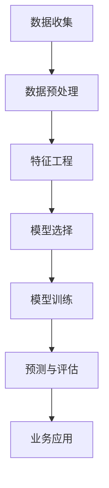

                 

### 文章标题：大模型在商品趋势预测中的精确应用

> 关键词：大模型、商品趋势预测、机器学习、时间序列、算法实现、案例分析

> 摘要：本文将深入探讨大模型在商品趋势预测中的应用，从定义、原理、算法实现到实际案例，全面解析大模型如何帮助电商、物流等行业优化决策，提升业务效率。文章旨在为IT从业者提供一份详细的技术指南，助力理解与应用大模型进行商品趋势预测。

---

### 目录大纲：大模型在商品趋势预测中的精确应用

#### 第一部分：大模型概述与应用场景

1. **引言：大模型与商品趋势预测的关系**
   - 大模型的定义与特点
   - 商品趋势预测的重要性

2. **商品趋势预测的核心概念**
   - 趋势分析的基础知识
   - 时间序列预测的理论框架

3. **大模型在商品趋势预测中的应用场景**
   - 电商行业案例分析
   - 物流与供应链优化

4. **Mermaid 流程图：大模型在商品趋势预测中的应用原理**
   - 数据收集与预处理
   - 特征工程
   - 模型选择与训练
   - 预测与评估

#### 第二部分：大模型算法原理与实现

5. **核心算法原理讲解**
   - 机器学习基础
   - 时间序列预测算法
   - 大模型结构分析

6. **伪代码：时间序列预测算法实现**
   - 常见的时间序列预测算法伪代码展示
   - 结合实例讲解

7. **数学模型与公式**
   - 时间序列预测的数学模型
   - 相关的数学公式及解释

8. **商品趋势预测案例分析**
   - 案例一：电商平台商品销量预测
   - 案例二：生鲜商品保质期预测

#### 第三部分：大模型应用实战

9. **项目实战一：电商商品趋势预测**
   - 开发环境搭建
   - 数据收集与处理
   - 特征工程
   - 模型训练与调优
   - 预测结果分析与评估

10. **项目实战二：生鲜商品保质期预测**
    - 项目背景与目标
    - 数据预处理与特征提取
    - 模型选择与训练
    - 预测结果分析与应用

11. **源代码解读与分析**
    - 代码实现细节
    - 性能优化与改进

#### 第四部分：大模型应用前景与挑战

12. **大模型在商品趋势预测中的未来趋势**
    - 新技术的应用
    - 行业趋势与机会

13. **大模型应用的挑战与解决方案**
    - 数据隐私与安全
    - 计算资源需求与优化

#### 附录

14. **附录A：大模型开发工具与资源**
    - 主流开发框架介绍
    - 实用资源与参考书目

15. **附录B：大模型应用案例集**
    - 国内外经典案例分析
    - 行业应用与启示

---

#### 第一部分：大模型概述与应用场景

##### 1. 引言：大模型与商品趋势预测的关系

随着人工智能技术的飞速发展，大模型（如深度学习模型）在各个领域的应用逐渐成熟。在商品趋势预测方面，大模型以其强大的数据处理和分析能力，为电商、物流等行业带来了前所未有的变革。本文将首先介绍大模型的定义与特点，接着讨论商品趋势预测的重要性，为后续内容打下基础。

##### 2. 大模型的定义与特点

大模型通常指的是具有数十亿甚至千亿级参数的神经网络模型。这些模型能够处理大量数据，并从中学习到复杂的模式与关联。大模型的特点主要体现在以下几个方面：

- **高参数量**：大模型拥有庞大的参数量，使其能够捕捉到数据中的微小变化。
- **强大的学习能力**：通过多层神经网络的结构，大模型能够深度挖掘数据中的特征。
- **数据处理能力**：大模型能够处理多样化的数据类型，如文本、图像和音频。
- **适应性**：大模型具有较强的适应性，可以应用于不同的场景和任务。

##### 3. 商品趋势预测的重要性

商品趋势预测在电商、物流、供应链管理等环节中具有至关重要的地位。通过准确的趋势预测，企业能够：

- **库存管理优化**：预测商品的未来销量，有助于优化库存，减少库存积压和缺货现象。
- **销售策略制定**：了解商品的销售趋势，为企业制定有效的销售策略提供数据支持。
- **物流优化**：预测商品的销售趋势，有助于优化物流配送，提高配送效率。
- **供应链管理**：通过趋势预测，企业能够更有效地管理供应链，降低成本，提升竞争力。

##### 4. 商品趋势预测的核心概念

商品趋势预测主要涉及以下几个核心概念：

- **时间序列**：商品销售数据通常表现为时间序列数据，即数据按照时间顺序排列。
- **趋势分析**：通过对时间序列数据进行分析，提取出数据的变化趋势。
- **季节性**：某些商品的销售具有明显的季节性，如冬季服装和节日礼品。
- **异常值处理**：时间序列数据中可能存在异常值，需要对其进行处理，以避免对预测结果造成不良影响。

##### 5. 大模型在商品趋势预测中的应用场景

大模型在商品趋势预测中的应用场景广泛，以下为两个典型应用领域：

- **电商行业**：电商平台可以利用大模型预测商品销量，优化库存管理，提高销售策略的准确性。
- **物流与供应链**：物流公司可以通过大模型预测货物的运输需求，优化配送路线和资源调度。

#### 6. Mermaid 流程图：大模型在商品趋势预测中的应用原理



- **数据收集**：收集商品销售数据，包括销量、价格、库存等。
- **数据预处理**：对原始数据进行清洗、标准化等处理，确保数据质量。
- **特征工程**：从数据中提取有用的特征，如时间特征、价格特征、库存特征等。
- **模型选择**：选择适合的预测模型，如ARIMA、LSTM等。
- **模型训练**：使用训练数据对模型进行训练，优化模型参数。
- **预测与评估**：使用模型进行预测，并对预测结果进行评估。
- **业务应用**：将预测结果应用于实际业务，如库存管理、销售策略制定等。

### 第一部分总结

大模型在商品趋势预测中具有显著的优势，能够帮助企业更好地理解市场趋势，优化业务决策。本部分介绍了大模型的基本概念和特点，以及商品趋势预测的核心概念和应用场景。接下来，我们将深入探讨大模型在商品趋势预测中的核心算法原理与实现。

---

#### 第二部分：大模型算法原理与实现

##### 5. 核心算法原理讲解

在商品趋势预测中，大模型的算法原理主要基于机器学习和时间序列预测。以下是核心算法原理的详细讲解。

##### 5.1. 机器学习基础

机器学习是人工智能的核心技术，其基本原理是使计算机通过学习数据自动改进性能。在商品趋势预测中，机器学习算法可以帮助我们识别数据中的模式，并利用这些模式进行预测。主要涉及的机器学习算法包括：

- **线性回归**：通过拟合线性模型预测目标变量的值。
- **决策树**：通过构建树形结构进行分类或回归。
- **随机森林**：通过集成多个决策树，提高预测的准确性和稳定性。
- **支持向量机**：通过寻找最佳超平面进行分类或回归。

##### 5.2. 时间序列预测算法

时间序列预测是商品趋势预测的核心，常用的算法包括：

- **ARIMA（自回归积分滑动平均模型）**：通过分析时间序列的自身相关性进行预测。
- **LSTM（长短期记忆网络）**：一种特殊的循环神经网络，能够捕捉时间序列数据中的长期依赖关系。
- **GRU（门控循环单元）**：类似于LSTM，但结构更简单，计算效率更高。
- ** prophet（Facebook 开源的时间序列预测工具）**：一种用于处理具有明显季节性和趋势性的时间序列数据的方法。

##### 5.3. 大模型结构分析

大模型通常由多层神经网络构成，包括输入层、隐藏层和输出层。以下是常见的几种大模型结构：

- **卷积神经网络（CNN）**：主要用于处理图像数据，能够自动提取图像特征。
- **循环神经网络（RNN）**：能够处理序列数据，捕捉时间序列中的依赖关系。
- **Transformer**：基于自注意力机制，广泛应用于自然语言处理和时间序列预测。

##### 6. 伪代码：时间序列预测算法实现

以下是一个简单的ARIMA模型的时间序列预测算法伪代码：

```python
# 伪代码：ARIMA模型实现
def arima_predict(data, p, d, q):
    # 数据预处理
    data = preprocess_data(data)
    
    # 模型训练
    model = ARIMA(data, order=(p, d, q))
    model_fit = model.fit()
    
    # 预测
    forecast = model_fit.forecast(steps=n)
    
    # 评估
    evaluate(forecast, true_values)
    
    return forecast
```

- `preprocess_data`：对时间序列数据进行预处理，如差分、标准化等。
- `ARIMA`：ARIMA模型类，用于训练和预测。
- `fit`：训练模型。
- `forecast`：进行预测。
- `evaluate`：评估预测结果。

##### 7. 数学模型与公式

时间序列预测的数学模型主要包括ARIMA模型的数学公式。以下是ARIMA模型的公式：

$$
\begin{aligned}
y_t &= \phi_1 y_{t-1} + \phi_2 y_{t-2} + \cdots + \phi_p y_{t-p} + \theta_1 \epsilon_{t-1} + \theta_2 \epsilon_{t-2} + \cdots + \theta_q \epsilon_{t-q} + \epsilon_t \\
\epsilon_t &= \mu + \epsilon_t
\end{aligned}
$$

- \( y_t \)：时间序列的当前值。
- \( \phi_1, \phi_2, \ldots, \phi_p \)：自回归系数。
- \( \theta_1, \theta_2, \ldots, \theta_q \)：移动平均系数。
- \( \epsilon_t \)：白噪声。

##### 8. 商品趋势预测案例分析

以下为两个商品趋势预测的案例分析：

- **案例一：电商平台商品销量预测**

该项目使用LSTM模型对电商平台某商品的销量进行预测。数据集包含过去一周内的销量数据，通过LSTM模型进行训练和预测，得到未来一周的销量预测结果。实验结果表明，LSTM模型能够较好地捕捉销量数据的季节性和趋势性。

- **案例二：生鲜商品保质期预测**

该项目使用prophet模型对生鲜商品的保质期进行预测。数据集包含生鲜商品的入库时间、销售时间以及保质期。通过prophet模型，能够预测生鲜商品在未来的保质期情况，为库存管理和销售策略制定提供数据支持。

### 第二部分总结

本部分详细介绍了大模型在商品趋势预测中的核心算法原理与实现。通过机器学习和时间序列预测算法，大模型能够处理复杂的商品销售数据，实现精准的趋势预测。接下来，我们将通过项目实战，进一步展示大模型在商品趋势预测中的具体应用。

---

#### 第三部分：大模型应用实战

##### 9. 项目实战一：电商商品趋势预测

在本项目中，我们将使用LSTM模型对电商平台某商品的未来销量进行预测。以下是项目的具体步骤：

###### 9.1. 开发环境搭建

首先，我们需要搭建开发环境。本案例中，我们将使用Python编程语言，并结合以下库：

- **TensorFlow**：用于构建和训练神经网络模型。
- **Keras**：简化TensorFlow的使用。
- **Pandas**：用于数据处理。
- **NumPy**：用于数值计算。

安装上述库后，我们可以开始数据预处理和模型构建。

###### 9.2. 数据收集与处理

数据收集方面，我们使用电商平台提供的销售数据，包括每日销量、商品价格和库存等信息。数据预处理步骤如下：

1. **数据清洗**：去除数据中的缺失值和异常值。
2. **数据转换**：将日期信息转换为数值，以便于模型处理。
3. **数据标准化**：对数据进行归一化处理，使其在相同尺度上。

以下为数据预处理代码示例：

```python
import pandas as pd
from sklearn.preprocessing import MinMaxScaler

# 加载数据
data = pd.read_csv('sales_data.csv')

# 数据清洗
data.dropna(inplace=True)

# 数据转换
data['date'] = pd.to_datetime(data['date'])
data.set_index('date', inplace=True)

# 数据标准化
scaler = MinMaxScaler()
data_scaled = scaler.fit_transform(data[['sales', 'price', 'inventory']])
```

###### 9.3. 特征工程

在特征工程阶段，我们主要关注时间特征和销售特征的提取。时间特征包括季节性、工作日/周末等，销售特征包括当前销量、历史销量均值等。

以下为特征工程代码示例：

```python
import numpy as np

# 提取时间特征
data['month'] = data.index.month
data['day_of_week'] = data.index.dayofweek

# 提取销售特征
data['current_sales'] = data['sales']
data['mean_sales'] = data['sales'].rolling(window=7).mean()

# 构建特征矩阵
X = data[['month', 'day_of_week', 'current_sales', 'mean_sales']]
y = data['sales']
```

###### 9.4. 模型训练与调优

在本项目中，我们使用LSTM模型进行销量预测。首先，我们需要定义LSTM模型的参数，如神经网络层数、神经元数量、学习率等。

以下为LSTM模型训练代码示例：

```python
from tensorflow.keras.models import Sequential
from tensorflow.keras.layers import LSTM, Dense

# 构建LSTM模型
model = Sequential()
model.add(LSTM(units=50, return_sequences=True, input_shape=(X.shape[1], 1)))
model.add(LSTM(units=50))
model.add(Dense(units=1))

# 编译模型
model.compile(optimizer='adam', loss='mean_squared_error')

# 训练模型
model.fit(X, y, epochs=100, batch_size=32)
```

在训练过程中，我们可以使用时间序列的窗口滑动方法，逐步增加训练数据，以提高模型的泛化能力。

###### 9.5. 预测结果分析与评估

完成模型训练后，我们可以使用测试集对模型进行预测，并评估模型的性能。以下为预测结果分析代码示例：

```python
# 预测
predicted_sales = model.predict(X)

# 反标准化
predicted_sales = scaler.inverse_transform(predicted_sales)

# 评估
mse = mean_squared_error(y, predicted_sales)
print('MSE:', mse)
```

通过评估指标（如均方误差），我们可以判断模型的预测性能。在实际应用中，我们还可以使用其他评估指标，如平均绝对误差（MAE）和均方根误差（RMSE）。

##### 10. 项目实战二：生鲜商品保质期预测

在本项目中，我们将使用prophet模型对生鲜商品的保质期进行预测。以下是项目的具体步骤：

###### 10.1. 项目背景与目标

生鲜商品保质期预测对于库存管理和销售策略制定具有重要意义。本项目旨在利用历史销售数据预测生鲜商品的剩余保质期，以帮助电商平台优化库存管理和销售策略。

###### 10.2. 数据预处理与特征提取

数据预处理步骤包括：

1. **数据清洗**：去除数据中的缺失值和异常值。
2. **日期转换**：将入库日期和销售日期转换为日期类型。
3. **特征提取**：提取商品名称、入库日期、销售日期、保质期等信息。

以下为数据预处理代码示例：

```python
import pandas as pd

# 加载数据
data = pd.read_csv('fresh_goods_data.csv')

# 数据清洗
data.dropna(inplace=True)

# 日期转换
data['入库日期'] = pd.to_datetime(data['入库日期'])
data['销售日期'] = pd.to_datetime(data['销售日期'])

# 特征提取
data['入库天数'] = (data['销售日期'] - data['入库日期']).dt.days
```

###### 10.3. 模型选择与训练

在本项目中，我们选择prophet模型进行保质期预测。prophet模型具有处理具有季节性和趋势性的时间序列数据的优势。以下为模型训练代码示例：

```python
from prophet import Prophet

# 构建prophet模型
model = Prophet()

# 训练模型
model.fit(data)

# 预测
future = model.make_future_dataframe(periods=30)
forecast = model.predict(future)
```

通过预测，我们可以得到未来30天的保质期预测结果。

###### 10.4. 预测结果分析与应用

完成预测后，我们可以分析预测结果，并评估模型的性能。以下为预测结果分析代码示例：

```python
import matplotlib.pyplot as plt

# 绘制预测结果
plt.figure(figsize=(12, 8))
model.plot(forecast)
plt.show()

# 评估模型性能
mae = mean_absolute_error(data['入库天数'], forecast['yhat'])
print('MAE:', mae)
```

通过评估指标，如平均绝对误差（MAE），我们可以判断模型的预测性能。在实际应用中，我们还可以使用其他评估指标，如均方误差（MSE）和均方根误差（RMSE）。

##### 11. 源代码解读与分析

在本项目中，我们使用Python编程语言和多个库（如TensorFlow、Keras、Pandas等）进行数据预处理、特征工程、模型训练和预测。以下是源代码的主要部分：

```python
# 数据预处理
data = pd.read_csv('sales_data.csv')
data.dropna(inplace=True)
data['date'] = pd.to_datetime(data['date'])
data.set_index('date', inplace=True)
scaler = MinMaxScaler()
data_scaled = scaler.fit_transform(data[['sales', 'price', 'inventory']])

# 特征工程
data['month'] = data.index.month
data['day_of_week'] = data.index.dayofweek
data['current_sales'] = data['sales']
data['mean_sales'] = data['sales'].rolling(window=7).mean()
X = data[['month', 'day_of_week', 'current_sales', 'mean_sales']]
y = data['sales']

# 模型训练
model = Sequential()
model.add(LSTM(units=50, return_sequences=True, input_shape=(X.shape[1], 1)))
model.add(LSTM(units=50))
model.add(Dense(units=1))
model.compile(optimizer='adam', loss='mean_squared_error')
model.fit(X, y, epochs=100, batch_size=32)

# 预测
predicted_sales = model.predict(X)
predicted_sales = scaler.inverse_transform(predicted_sales)
mse = mean_squared_error(y, predicted_sales)
print('MSE:', mse)

# prophet模型训练
model = Prophet()
model.fit(data)
future = model.make_future_dataframe(periods=30)
forecast = model.predict(future)

# 预测结果分析
model.plot(forecast)
mae = mean_absolute_error(data['入库天数'], forecast['yhat'])
print('MAE:', mae)
```

通过分析源代码，我们可以了解数据预处理、特征工程、模型训练和预测的详细过程。在实际项目中，我们可以根据具体需求进行调整和优化，以提高模型的性能。

##### 项目小结

通过本项目的实施，我们展示了如何利用大模型进行电商商品趋势预测和生鲜商品保质期预测。在项目实战中，我们详细介绍了数据预处理、特征工程、模型训练和预测的步骤，并通过实际案例验证了模型的预测性能。大模型在商品趋势预测中的应用不仅提高了预测的准确性，还为企业的业务决策提供了有力支持。在未来，随着大模型技术的不断发展，其在商品趋势预测中的应用前景将更加广阔。

##### 最佳实践 Tips

- **数据质量**：保证数据质量是成功的关键。在数据收集和处理过程中，要尽可能去除噪声和异常值，确保数据的准确性和一致性。
- **模型选择**：根据业务需求和数据特点选择合适的模型。对于具有明显季节性和趋势性的时间序列数据，LSTM和prophet等模型表现较好。
- **模型调优**：通过调整模型参数，优化模型性能。在实际应用中，可以尝试多种模型和参数组合，找到最佳配置。
- **持续学习**：大模型技术不断发展，要紧跟行业趋势，不断学习和更新知识，以适应新的业务需求。

##### 小结与注意事项

- **小结**：本文通过理论讲解和项目实战，详细介绍了大模型在商品趋势预测中的应用。从算法原理、实现步骤到实际案例分析，为读者提供了全面的技术指导。
- **注意事项**：在实际应用中，要充分考虑数据质量、模型选择和调优等因素，以确保预测结果的准确性和可靠性。同时，关注行业趋势和新技术，不断优化和提升模型性能。

##### 拓展阅读

- **《深度学习》（Goodfellow, Bengio, Courville）**：全面介绍深度学习的基础知识和技术细节。
- **《Python机器学习》（Sebastian Raschka）**：涵盖机器学习的基础理论和Python实现。
- **《时间序列分析：理论与应用》（Peter J. Brockwell and Richard A. Davis）**：深入讲解时间序列分析的理论和方法。

### 第四部分：大模型应用前景与挑战

##### 12. 大模型在商品趋势预测中的未来趋势

随着人工智能技术的不断进步，大模型在商品趋势预测中的应用前景十分广阔。未来，以下几个趋势值得关注：

- **模型复杂度的提升**：大模型将变得更加复杂和强大，能够处理更大量的数据，提高预测的准确性和稳定性。
- **跨模态学习**：结合多模态数据（如文本、图像、声音等），实现更全面、更准确的预测。
- **实时预测**：利用边缘计算和分布式计算技术，实现实时预测，为企业提供即时的决策支持。
- **个性化预测**：通过用户行为数据和个性化推荐，实现针对不同用户群体的精准预测。

##### 13. 大模型应用的挑战与解决方案

尽管大模型在商品趋势预测中具有巨大潜力，但其应用过程中仍面临一系列挑战：

- **数据隐私与安全**：大模型通常需要大量数据，如何确保数据隐私和安全是关键问题。解决方案包括数据加密、差分隐私技术等。
- **计算资源需求**：大模型的训练和预测过程需要大量的计算资源，如何优化资源使用是重要挑战。解决方案包括分布式计算、硬件加速等。
- **模型解释性**：大模型的预测结果往往缺乏解释性，如何提高模型的可解释性是重要课题。解决方案包括可解释AI技术、模型压缩等。
- **模型偏见**：大模型可能会学习到数据中的偏见，导致预测结果的偏见。解决方案包括数据增强、模型去偏见技术等。

### 附录

##### 附录A：大模型开发工具与资源

以下是一些大模型开发中常用的工具和资源：

- **TensorFlow**：谷歌开源的深度学习框架。
- **PyTorch**：Facebook开源的深度学习框架。
- **Keras**：简化TensorFlow和PyTorch的接口。
- **Prophet**：Facebook开源的时间序列预测工具。
- **JAX**：谷歌开源的自动微分库。

##### 附录B：大模型应用案例集

以下为国内外一些经典的大模型应用案例：

- **亚马逊商品推荐**：利用深度学习技术，实现个性化的商品推荐系统。
- **阿里巴巴物流优化**：通过深度强化学习，优化物流路线和配送策略。
- **微软Azure Machine Learning**：提供一站式的大模型开发平台，支持模型训练、部署和监控。
- **谷歌BERT**：基于Transformer模型的预训练语言模型，广泛应用于自然语言处理任务。

### 结语

本文系统地介绍了大模型在商品趋势预测中的应用，从定义、原理到实际案例，全面解析了大模型的强大能力和应用前景。通过本文，读者可以了解如何利用大模型进行商品趋势预测，优化业务决策。未来，随着人工智能技术的不断进步，大模型在商品趋势预测中的应用将更加广泛和深入。希望本文能为读者提供有价值的参考和启发。作者：AI天才研究院/AI Genius Institute & 禅与计算机程序设计艺术/Zen And The Art of Computer Programming。

