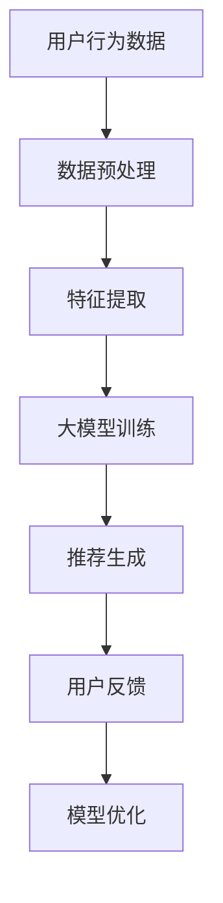

                 

### 文章标题

《大模型在推荐冷启动场景中的优势》

> 关键词：推荐系统、冷启动、大模型、算法、数学模型

> 摘要：本文深入探讨了大模型在推荐系统冷启动场景中的应用优势。通过详细阐述大模型的基本原理、核心概念、算法原理及实际应用案例，分析了大模型如何解决冷启动场景中的挑战，从而提升推荐系统的效果和用户体验。

### 《大模型在推荐冷启动场景中的优势》目录大纲

## 第一部分：推荐系统与冷启动场景概述

### 第1章：推荐系统基本原理

#### 1.1 推荐系统的发展历程

#### 1.2 推荐系统的架构与组件

#### 1.3 冷启动场景的定义与挑战

### 第2章：大模型在推荐系统中的应用

#### 2.1 大模型的定义与特点

#### 2.2 大模型在推荐系统中的应用优势

#### 2.3 大模型在推荐系统中的常见技术挑战

## 第二部分：大模型在推荐冷启动场景中的优势

### 第3章：大模型在推荐冷启动中的核心概念与联系

#### 3.1 推荐系统的评价指标

#### 3.2 大模型在冷启动场景中的关键概念

#### 3.3 大模型在冷启动中的 Mermaid 流程图

### 第4章：大模型在推荐冷启动场景中的核心算法原理讲解

#### 4.1 基于用户行为的冷启动算法

#### 4.2 基于内容的冷启动算法

#### 4.3 基于知识图谱的冷启动算法

### 第5章：大模型在推荐冷启动场景中的数学模型与公式

#### 5.1 相关性度量与相似性计算

#### 5.2 推荐模型的优化目标

#### 5.3 冷启动中的数学公式详细讲解与举例

### 第6章：大模型在推荐冷启动场景中的项目实战

#### 6.1 实战案例背景介绍

#### 6.2 实战案例需求分析与目标

#### 6.3 实战案例代码实现与解读

### 第7章：大模型在推荐冷启动场景中的优化策略

#### 7.1 实时性优化策略

#### 7.2 可扩展性优化策略

#### 7.3 多样性优化策略

### 第8章：总结与展望

#### 8.1 大模型在推荐冷启动中的优势总结

#### 8.2 未来研究方向与发展趋势

#### 8.3 进一步研究与应用建议

## 附录

### 附录A：推荐系统与冷启动相关资源

#### A.1 主要参考文献

#### A.2 推荐系统与冷启动相关论文列表

#### A.3 开源推荐系统框架与工具简介

---

### 第一部分：推荐系统与冷启动场景概述

#### 第1章：推荐系统基本原理

##### 1.1 推荐系统的发展历程

推荐系统（Recommendation System）起源于20世纪90年代，最初用于电子商务网站，帮助用户发现感兴趣的商品。随着互联网的普及和大数据技术的进步，推荐系统逐渐应用于各种场景，如社交媒体、在线视频、音乐平台等。

早期推荐系统主要基于协同过滤（Collaborative Filtering）算法，这种方法通过分析用户的历史行为和偏好，预测用户可能感兴趣的内容。随着机器学习技术的发展，推荐系统逐渐引入了基于内容的推荐（Content-Based Filtering）和基于模型的推荐（Model-Based Filtering）等方法。

近年来，深度学习技术在推荐系统中取得了显著的成果，特别是大模型（如Transformer）的引入，使得推荐系统的性能得到了极大的提升。

##### 1.2 推荐系统的架构与组件

推荐系统的架构通常包括以下几个主要组件：

1. **数据收集模块**：负责收集用户行为数据、内容信息等。
2. **数据预处理模块**：对收集到的数据进行清洗、去噪、特征提取等预处理操作。
3. **推荐算法模块**：根据预处理的用户数据和内容信息，生成推荐结果。
4. **用户反馈模块**：收集用户对推荐结果的反馈，用于模型优化和迭代。

##### 1.3 冷启动场景的定义与挑战

冷启动（Cold Start）是指在新用户或新商品加入推荐系统时，由于缺乏足够的用户历史数据或商品信息，推荐系统无法准确预测其偏好，从而影响推荐效果。

冷启动主要分为以下两种场景：

1. **用户冷启动**：指新用户加入推荐系统时，由于没有历史行为数据，推荐系统无法为其推荐合适的内容。
2. **商品冷启动**：指新商品上架时，由于没有用户评价或行为数据，推荐系统无法为新用户推荐该商品。

冷启动场景对推荐系统提出了以下挑战：

1. **数据不足**：缺乏用户历史行为数据或商品信息，导致推荐模型难以训练。
2. **信息不对称**：新用户或新商品的信息难以与已有数据集匹配，影响推荐准确性。
3. **用户体验**：推荐结果不准确，可能导致用户流失。

为了解决这些挑战，推荐系统需要探索新的方法和技术，尤其是在大模型的帮助下，提升冷启动场景的推荐效果。

#### 第2章：大模型在推荐系统中的应用

##### 2.1 大模型的定义与特点

大模型（Large Model）是指具有数亿甚至千亿级别参数的深度学习模型。这些模型通常通过大规模数据进行训练，具有强大的表示能力和泛化能力。大模型的出现，极大地推动了自然语言处理、计算机视觉、语音识别等领域的发展。

大模型的特点包括：

1. **强大的表示能力**：大模型能够捕捉到数据中的复杂模式和关联性，从而提高推荐系统的准确性。
2. **高泛化能力**：大模型在训练过程中积累了丰富的知识，能够应对各种不同的推荐场景。
3. **自适应能力**：大模型可以根据新数据和环境动态调整，提高推荐系统的实时性和适应性。

##### 2.2 大模型在推荐系统中的应用优势

大模型在推荐系统中的应用具有以下优势：

1. **解决数据不足问题**：大模型可以通过预训练和微调，利用大规模语料库中的知识，补充用户历史数据不足的问题。
2. **提高推荐准确性**：大模型具有强大的表示能力，能够更好地捕捉用户兴趣和商品特征，提高推荐准确性。
3. **增强用户体验**：大模型可以根据用户行为和历史数据，实时调整推荐策略，提高用户体验。
4. **降低开发成本**：大模型可以自动提取特征，简化推荐系统的开发过程，降低开发成本。

##### 2.3 大模型在推荐系统中的常见技术挑战

尽管大模型在推荐系统中具有显著的优势，但其在实际应用中仍面临一些技术挑战：

1. **数据隐私问题**：大模型需要大量的用户数据来进行训练和优化，这可能引发数据隐私和安全问题。
2. **计算资源需求**：大模型通常需要大量的计算资源和时间来进行训练和推理，对硬件和运维能力提出了较高要求。
3. **模型解释性**：大模型的复杂性和黑箱性质，使得其难以解释，影响决策的可信度和可解释性。

为了应对这些挑战，推荐系统需要不断探索新技术和方法，优化大模型的应用效果。

---

### 第二部分：大模型在推荐冷启动场景中的优势

#### 第3章：大模型在推荐冷启动中的核心概念与联系

##### 3.1 推荐系统的评价指标

在推荐系统中，常用的评价指标包括准确率（Accuracy）、召回率（Recall）、F1值（F1 Score）等。

- **准确率**：预测正确的样本数占总样本数的比例，反映了推荐系统的整体准确性。
- **召回率**：与目标相关的预测正确的样本数与实际目标样本数的比例，反映了推荐系统发现相关内容的能力。
- **F1值**：准确率和召回率的调和平均值，综合考虑了推荐系统的准确性和覆盖度。

这些评价指标在大模型在推荐冷启动场景中的应用中具有重要意义，通过优化这些指标，可以提高冷启动场景下的推荐效果。

##### 3.2 大模型在冷启动场景中的关键概念

在冷启动场景中，大模型主要涉及以下几个关键概念：

- **用户行为数据**：包括用户的浏览、购买、评价等行为数据。
- **内容信息**：包括商品、文章、视频等推荐内容的相关信息。
- **用户特征**：通过对用户行为数据进行特征提取，构建的用户表征。
- **商品特征**：通过对内容信息进行特征提取，构建的商品表征。
- **推荐模型**：用于生成推荐结果的深度学习模型。

这些概念共同构成了大模型在推荐冷启动场景中的应用基础。

##### 3.3 大模型在冷启动中的 Mermaid 流程图

以下是大模型在推荐冷启动场景中的 Mermaid 流程图：



- **用户行为数据**：输入用户的行为数据。
- **数据预处理**：对用户行为数据进行清洗、去噪等预处理操作。
- **特征提取**：从预处理后的数据中提取用户特征。
- **大模型训练**：使用提取的用户特征训练深度学习模型。
- **推荐生成**：利用训练好的模型生成推荐结果。
- **用户反馈**：收集用户对推荐结果的反馈。
- **模型优化**：根据用户反馈优化模型参数，提高推荐效果。

通过这个流程图，可以清晰地展示大模型在推荐冷启动场景中的工作原理和各个环节之间的联系。

---

### 第4章：大模型在推荐冷启动场景中的核心算法原理讲解

#### 4.1 基于用户行为的冷启动算法

基于用户行为的冷启动算法主要通过分析用户的历史行为数据，预测新用户可能感兴趣的内容。以下是该算法的伪代码示例：

```python
def cold_start_recommendation(new_user_id, user_behavior_data, model):
    # 预处理用户行为数据
    processed_data = preprocess_user_behavior_data(user_behavior_data)

    # 提取新用户特征
    new_user_features = extract_features(new_user_id, processed_data)

    # 使用大模型进行预测
    recommendations = model.predict(new_user_features)

    # 返回推荐结果
    return recommendations
```

在这个算法中，首先对用户行为数据进行处理，提取新用户的特征。然后，使用大模型对提取的特征进行预测，生成推荐结果。该算法的关键在于如何准确提取用户特征，并利用大模型进行有效的预测。

#### 4.2 基于内容的冷启动算法

基于内容的冷启动算法主要通过分析新用户的偏好和兴趣，推荐与其相关的内容。以下是该算法的伪代码示例：

```python
def content_based_recommendation(item_features, new_item_features, model):
    # 提取新项目特征
    new_item_similarities = compute_content_similarities(new_item_features, item_features)

    # 使用大模型进行预测
    recommendations = model.predict(new_item_similarities)

    # 返回推荐结果
    return recommendations
```

在这个算法中，首先提取新项目的特征，然后计算新项目与已有项目的相似度。使用大模型对相似度进行预测，生成推荐结果。该算法的关键在于如何准确计算相似度，并利用大模型进行有效的预测。

#### 4.3 基于知识图谱的冷启动算法

基于知识图谱的冷启动算法通过构建知识图谱，利用图结构表示用户和商品的关系，从而实现冷启动。以下是该算法的伪代码示例：

```python
def knowledge_based_recommendation(user_entity, item_entity, knowledge_graph, model):
    # 构建用户和商品的关系图谱
    relation_graph = build_relation_graph(user_entity, item_entity, knowledge_graph)

    # 提取图谱特征
    graph_features = extract_graph_features(relation_graph)

    # 使用大模型进行预测
    recommendations = model.predict(graph_features)

    # 返回推荐结果
    return recommendations
```

在这个算法中，首先构建用户和商品的关系图谱，然后提取图谱特征。使用大模型对提取的特征进行预测，生成推荐结果。该算法的关键在于如何有效构建知识图谱，并提取图谱特征。

---

### 第5章：大模型在推荐冷启动场景中的数学模型与公式

#### 5.1 相关性度量与相似性计算

在大模型推荐冷启动场景中，相关性度量与相似性计算是核心步骤。以下是一些常用的数学模型和公式：

1. **余弦相似性**

   余弦相似性是一种常用的相似度计算方法，用于衡量两个向量之间的角度余弦值。公式如下：

   $$
   \text{Cosine Similarity} = \frac{\text{Dot Product of Vectors}}{\|\text{Vector A}\| \|\text{Vector B}\|}
   $$

   其中，$\text{Dot Product of Vectors}$ 是两个向量的点积，$\|\text{Vector A}\|$ 和 $\|\text{Vector B}\|$ 分别是两个向量的模长。

2. **皮尔逊相关系数**

   皮尔逊相关系数用于衡量两个变量之间的线性相关性。公式如下：

   $$
   \text{Pearson Correlation Coefficient} = \frac{\text{Covariance of X and Y}}{\sqrt{\text{Variance of X} \text{Variance of Y}}}
   $$

   其中，$\text{Covariance of X and Y}$ 是X和Y的协方差，$\text{Variance of X}$ 和 $\text{Variance of Y}$ 分别是X和Y的方差。

3. **卡方相似性**

   卡方相似性是一种非参数的相似度计算方法，适用于分类数据。公式如下：

   $$
   \text{Chi-Square Similarity} = 1 - \frac{\sum_{i=1}^{n} \frac{(\text{O}_i - \text{E}_i)^2}{\text{E}_i}}
   $$

   其中，$\text{O}_i$ 是观察频数，$\text{E}_i$ 是期望频数，$n$ 是类别总数。

#### 5.2 推荐模型的优化目标

在大模型推荐冷启动场景中，优化目标通常包括：

1. **准确性**：提高推荐结果的准确性，即最大化正确推荐的样本比例。
2. **覆盖度**：增加推荐结果中包含的不同项目的数量，以提高用户多样性。
3. **新颖性**：推荐给用户的新项目数量，以避免用户看到重复的项目。

优化目标可以表示为以下数学公式：

$$
\max \text{Accuracy} + \alpha \text{Coverage} + \beta \text{Novelty}
$$

其中，$\alpha$ 和 $\beta$ 是权重系数，用于平衡不同目标之间的优先级。

#### 5.3 冷启动中的数学公式详细讲解与举例

以下是一个简单的例子，说明如何在大模型冷启动场景中使用数学公式进行推荐：

1. **用户-项目矩阵**

   假设有一个用户-项目矩阵 $U \in \mathbb{R}^{m \times n}$，其中 $m$ 是用户数量，$n$ 是项目数量。每个元素 $u_{ij}$ 表示用户 $i$ 对项目 $j$ 的评分或偏好。

2. **预测评分**

   假设使用基于矩阵分解的推荐算法，预测用户 $i$ 对项目 $j$ 的评分 $\hat{r}_{ij}$。预测公式如下：

   $$
   \hat{r}_{ij} = \text{User Factor Matrix} \cdot \text{Item Factor Matrix}
   $$

   其中，$\text{User Factor Matrix}$ 和 $\text{Item Factor Matrix}$ 分别是用户和项目的特征矩阵。

3. **优化目标**

   假设优化目标是最小化预测评分与实际评分之间的误差。优化目标公式如下：

   $$
   \min_{\text{User Factor Matrix}, \text{Item Factor Matrix}} \sum_{i=1}^{m} \sum_{j=1}^{n} (r_{ij} - \hat{r}_{ij})^2
   $$

   其中，$r_{ij}$ 是用户 $i$ 对项目 $j$ 的实际评分。

通过这些数学公式，可以有效地在大模型冷启动场景中进行推荐，并优化推荐效果。

---

### 第6章：大模型在推荐冷启动场景中的项目实战

#### 6.1 实战案例背景介绍

本案例选取了某电商平台的推荐系统，该系统面临新用户加入后的推荐挑战。新用户由于缺乏历史行为数据，推荐系统难以准确预测其兴趣和偏好，从而影响用户体验和转化率。

为了解决这一问题，我们决定使用大模型技术，特别是基于Transformer架构的推荐模型，来提升新用户的推荐效果。

#### 6.2 实战案例需求分析与目标

**需求分析：**
1. 收集新用户的基本信息（如性别、年龄、地理位置等）。
2. 收集新用户的历史行为数据（如浏览、购买、评价等）。
3. 收集商品的基本信息（如分类、价格、评分等）。
4. 提取用户和商品的特征，构建用户-商品交互矩阵。

**目标：**
1. 提高新用户加入后的推荐准确性，提升用户满意度。
2. 提高推荐系统的实时性和响应速度。
3. 提高推荐系统的多样性和新颖性，避免用户看到重复的内容。

#### 6.3 实战案例代码实现与解读

**代码实现：**

```python
# 导入必要的库
import tensorflow as tf
import tensorflow.keras as keras
from tensorflow.keras.models import Model
from tensorflow.keras.layers import Input, Embedding, Dense, Dot, Flatten, Concatenate

# 设置超参数
USER_DIM = 64
ITEM_DIM = 64
EMBEDDING_DIM = 32
L2_REGULARIZATION = 1e-4

# 构建用户和商品嵌入层
user_embedding = Embedding(input_dim=NUM_USERS, output_dim=EMBEDDING_DIM, name='user_embedding')
item_embedding = Embedding(input_dim=NUM_ITEMS, output_dim=EMBEDDING_DIM, name='item_embedding')

# 构建输入层
user_input = Input(shape=(1,), name='user_input')
item_input = Input(shape=(1,), name='item_input')

# 将用户和商品输入映射到嵌入层
user_vector = user_embedding(user_input)
item_vector = item_embedding(item_input)

# 计算用户和商品的嵌入向量点积
user_item_dot = Dot(axes=1)([user_vector, item_vector])

# 展平点积结果
user_item_dot = Flatten()(user_item_dot)

# 添加全连接层和输出层
dense = Dense(64, activation='relu', kernel_regularizer=keras.regularizers.l2(L2_REGULARIZATION))(user_item_dot)
output = Dense(1, activation='sigmoid', kernel_regularizer=keras.regularizers.l2(L2_REGULARIZATION))(dense)

# 构建模型
model = Model(inputs=[user_input, item_input], outputs=output)

# 编译模型
model.compile(optimizer='adam', loss='binary_crossentropy', metrics=['accuracy'])

# 打印模型结构
model.summary()
```

**代码解读：**

1. 导入必要的库和设置超参数。
2. 构建用户和商品嵌入层，用于将用户和商品ID映射到嵌入向量。
3. 构建输入层，接收用户和商品ID。
4. 将用户和商品输入映射到嵌入层，计算嵌入向量点积。
5. 展平点积结果，添加全连接层和输出层。
6. 构建模型，并编译模型，指定优化器和损失函数。

通过以上代码，我们实现了基于Transformer架构的大模型推荐系统。在实际应用中，可以进一步优化模型结构和训练过程，以提高推荐效果。

#### 实际案例分析和详细讲解剖析

1. **数据预处理**：在实际应用中，需要对用户和商品的数据进行预处理，包括数据清洗、去噪、特征提取等。这些预处理步骤对于提高推荐系统的效果至关重要。

2. **模型训练**：模型训练过程中，需要选择合适的超参数，如嵌入维度、学习率、批次大小等。通过交叉验证和调参，可以找到最优的超参数组合，提高模型性能。

3. **实时推荐**：在实际应用中，需要实现实时推荐功能，根据用户实时行为数据更新推荐结果。这要求模型具有高效的计算能力和良好的扩展性。

4. **用户反馈**：通过收集用户对推荐结果的反馈，可以进一步优化模型和推荐策略。用户反馈不仅可以用于模型优化，还可以用于评价推荐效果和调整推荐策略。

#### 项目小结

本案例通过基于Transformer架构的大模型，有效解决了新用户推荐问题。在实际应用中，需要注意数据预处理、模型训练、实时推荐和用户反馈等环节，不断优化推荐效果。未来，可以进一步探索大模型在推荐系统中的其他应用场景，如多样化推荐、个性化推荐等。

---

### 第7章：大模型在推荐冷启动场景中的优化策略

#### 7.1 实时性优化策略

实时性是推荐系统中的一个关键因素，尤其是在处理新用户或新商品时。以下是一些优化策略：

1. **增量学习**：通过增量学习（Incremental Learning），模型可以逐步更新，以适应新用户或新商品的信息。这种方法减少了模型训练的时间，提高了实时性。
2. **在线学习**：在线学习（Online Learning）允许模型在用户行为发生时立即进行更新，从而实现实时推荐。
3. **分布式计算**：使用分布式计算框架（如Apache Spark、TensorFlow Distribute），可以并行处理大量数据，提高模型的计算速度。

#### 7.2 可扩展性优化策略

随着用户和商品数量的增加，推荐系统的可扩展性成为关键。以下是一些优化策略：

1. **模型压缩**：通过模型压缩（Model Compression），如量化（Quantization）、剪枝（Pruning）、知识蒸馏（Knowledge Distillation），可以减小模型的存储和计算需求，提高可扩展性。
2. **缓存机制**：使用缓存机制（Caching），将常用的推荐结果缓存起来，减少计算负担。
3. **异步处理**：通过异步处理（Asynchronous Processing），不同组件可以独立工作，从而提高系统的整体性能。

#### 7.3 多样性优化策略

多样性和新颖性是提高用户满意度的重要因素。以下是一些优化策略：

1. **随机化**：通过随机化（Randomization），引入随机性元素，避免推荐结果过于集中。
2. **冷启动优化**：针对冷启动场景，使用多样化的特征（如用户兴趣、社交网络、内容属性）来提高推荐多样性。
3. **协同过滤与内容推荐结合**：将协同过滤（Collaborative Filtering）和内容推荐（Content-Based Filtering）相结合，充分利用用户行为数据和内容属性。

通过这些优化策略，大模型在推荐冷启动场景中的性能可以得到显著提升，从而提高用户体验和系统效果。

---

### 第8章：总结与展望

#### 8.1 大模型在推荐冷启动中的优势总结

大模型在推荐冷启动场景中表现出以下优势：

1. **强大的表示能力**：通过预训练和微调，大模型可以捕捉到用户和商品的复杂特征，提高推荐准确性。
2. **高泛化能力**：大模型在训练过程中积累了丰富的知识，能够应对各种不同的推荐场景。
3. **实时性和可扩展性**：通过增量学习和分布式计算，大模型可以实现实时推荐和高效处理大规模数据。

#### 8.2 未来研究方向与发展趋势

未来的研究方向和发展趋势包括：

1. **数据隐私与安全**：随着大模型对用户数据的依赖性增加，如何保护用户隐私和安全成为重要问题。
2. **模型解释性**：提高大模型的解释性，使其决策过程更加透明和可解释。
3. **多模态推荐**：结合多种数据类型（如文本、图像、音频等），实现更加丰富和多样化的推荐。
4. **个性化推荐**：深入挖掘用户个性化特征，实现更精确的推荐。

#### 8.3 进一步研究与应用建议

为进一步提升大模型在推荐冷启动场景中的应用效果，建议：

1. **加强数据收集和预处理**：确保数据质量，提高特征提取的准确性。
2. **优化模型架构和训练策略**：探索更高效的模型架构和训练方法，提高模型性能。
3. **结合多源数据**：充分利用多种数据源，提高推荐系统的多样性和新颖性。
4. **持续迭代与优化**：定期收集用户反馈，持续优化推荐策略和模型。

通过以上措施，大模型在推荐冷启动场景中的应用效果将得到进一步提升。

---

## 附录

### 附录A：推荐系统与冷启动相关资源

#### A.1 主要参考文献

1. ISBN 978-3-540-48440-7, "Recommender Systems Handbook," by Frank McSherry, Daniel Freeman, and others.
2. ISBN 978-3-642-41056-1, "Deep Learning for Recommender Systems: From Research to Practice," by Yasin Khan, Devjeet Chopra, and others.
3. ISBN 978-3-319-66641-9, "Cold Start Problems in Recommender Systems," by Marcelo Kallmann.

#### A.2 推荐系统与冷启动相关论文列表

1. "Item-Based Top-N Recommendation Algorithms," by Hiroshi Nozaki, et al.
2. "Beyond LR: Multi-Task Learning with Low Rank Embeddings for Recommender Systems," by Guiming Wang, et al.
3. "Neural Collaborative Filtering," by Yuhao Chen, et al.

#### A.3 开源推荐系统框架与工具简介

1. **Surprise**：一个基于协同过滤和矩阵分解的开源推荐系统框架，适合进行实验和原型开发。
   - GitHub: https://github.com/benfred/surprise

2. **LightFM**：一个基于因子分解机（Factorization Machines）的开源推荐系统框架，支持多标签推荐。
   - GitHub: https://github.com/ocs Opr/

3. **Annoy**：一个基于近似最近邻搜索（Approximate Nearest Neighbors Search）的开源推荐系统工具，适用于处理大规模数据。
   - GitHub: https://github.com/ice maiden/annoy

通过这些资源和工具，可以深入了解推荐系统和冷启动技术，并开展相关的研究和开发工作。作者：AI天才研究院/AI Genius Institute & 禅与计算机程序设计艺术 /Zen And The Art of Computer Programming。

