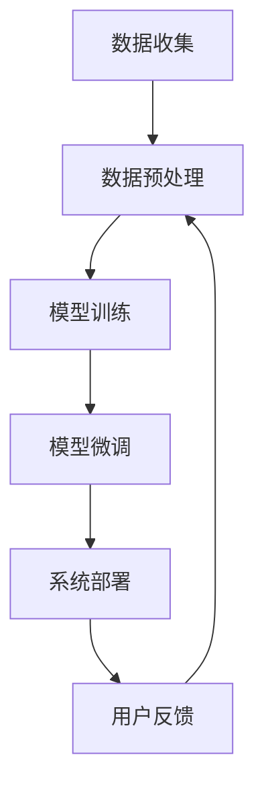
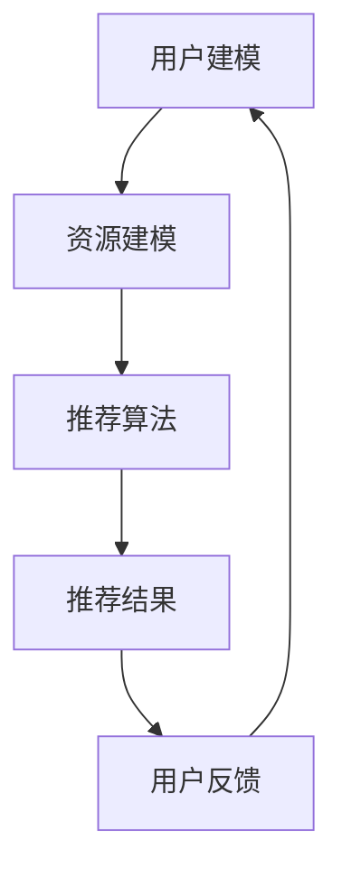
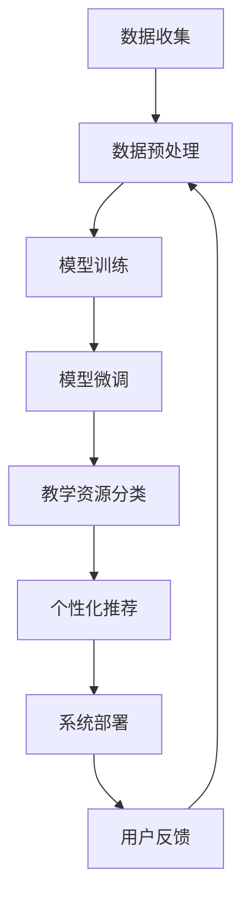
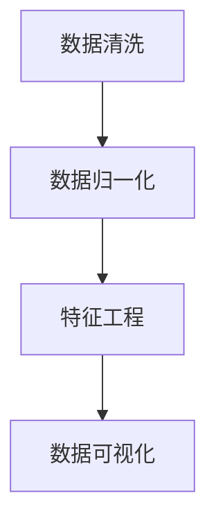
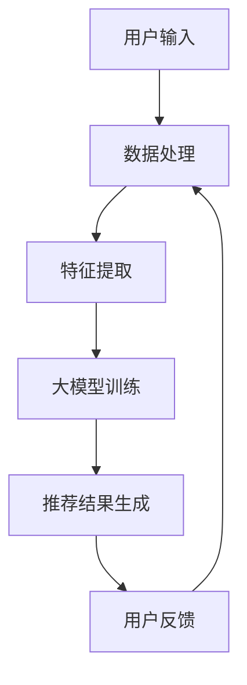

                 

### 文章标题

# 大模型在教育资源推荐中的应用与效果评估

关键词：大模型，教育资源推荐，效果评估，算法原理，教学助手，个性化学习

摘要：随着人工智能技术的不断发展，大模型在各个领域得到了广泛的应用，其中在教育资源的推荐系统中也展现了其强大的潜力。本文首先介绍了大模型的基本概念和技术原理，然后详细分析了大模型在教育资源推荐中的实际应用，包括教学助手、个性化学习推荐和在线教育平台的智能化改造。最后，本文探讨了大模型在教育推荐中的效果评估方法，以及面临的挑战和未来发展趋势。

### 第一部分：大模型与教育资源推荐基础

#### 第1章：大模型与教育资源推荐概述

1.1 **大模型时代的教育资源推荐**

在教育领域，随着互联网和大数据技术的迅猛发展，教育资源推荐成为了一项重要的应用。传统的教育资源推荐主要依赖于手工编写的规则和简单的机器学习方法，如基于内容的推荐和协同过滤算法。然而，随着数据量的不断增大和复杂度的提高，这些传统方法已经难以满足用户个性化的需求。

大模型的兴起为教育资源推荐带来了新的机遇。大模型，通常指的是具有数百万甚至数十亿参数的深度学习模型，如Transformer、BERT等。这些模型具有强大的表示能力和学习能力，可以在大量数据上进行预训练，从而捕捉到丰富的语义信息。在教育领域，大模型可以用于构建智能的教学助手、个性化学习推荐系统以及在线教育平台的智能化改造。

1.2 **教育资源推荐的重要性**

教育资源推荐在教育领域具有重要的意义。首先，它可以帮助学生更好地发现和获取适合自己的学习资源，提高学习效率。其次，它可以为教师提供有针对性的教学资源，提高教学质量。最后，教育资源推荐还可以促进教育资源的公平分配，让更多学生享受到优质的教育资源。

1.3 **大模型技术基础**

大模型的定义与分类：

大模型通常指的是具有数百万甚至数十亿参数的深度学习模型。根据其结构的不同，大模型可以分为两类：基于神经网络的模型和基于注意力机制的模型。

基于神经网络的模型，如多层感知机（MLP）、卷积神经网络（CNN）和循环神经网络（RNN），通过多层非线性变换来学习数据中的特征。

基于注意力机制的模型，如Transformer、BERT，通过注意力机制来捕捉数据中的长距离依赖关系，从而提高模型的表示能力。

大模型的核心算法原理：

大模型的核心算法原理主要包括以下几个方面：

- **预训练与微调**：大模型通常先在大量无监督数据上进行预训练，以学习通用的语义表示。然后，通过在特定任务上的有监督数据上进行微调，来适应具体的应用场景。

- **多层神经网络**：大模型通过多层神经网络结构来捕捉数据中的复杂特征，从而提高模型的性能。

- **注意力机制**：大模型通过注意力机制来关注数据中的关键信息，从而提高模型的表示能力。

大模型的数学模型与公式：

大模型的数学模型通常涉及到以下几个核心概念：

- **参数（Parameter）**：模型的权重和偏置，用于描述模型对数据的预测。

- **激活函数（Activation Function）**：用于引入非线性变换，使模型能够捕捉数据中的复杂特征。

- **前向传播（Forward Propagation）**：通过网络的正向计算，将输入数据映射到输出结果。

- **反向传播（Back Propagation）**：通过计算损失函数对参数的梯度，来更新模型的参数。

以下是一个简单的大模型数学模型示例：

$$
\begin{aligned}
\text{output} &= \sigma(\text{weight} \cdot \text{input} + \text{bias}) \\
\text{loss} &= \frac{1}{2} \sum (\text{output} - \text{target})^2 \\
\text{gradient} &= \frac{\partial \text{loss}}{\partial \text{weight}} \\
\text{weight}_{\text{new}} &= \text{weight}_{\text{old}} - \text{learning\_rate} \cdot \text{gradient}
\end{aligned}
$$

其中，$\sigma$表示激活函数，$\text{weight}$和$\text{bias}$分别表示权重和偏置，$\text{input}$和$\text{target}$分别表示输入数据和目标标签，$\text{learning\_rate}$表示学习率。

#### 第2章：教育资源推荐算法原理

2.1 **教育资源推荐的基本概念**

教育资源推荐系统主要依赖于以下几个基本概念：

- **用户行为**：包括用户的浏览历史、学习进度、评价等，用于了解用户的学习兴趣和需求。

- **教育资源**：包括课程、教材、视频等，用于满足用户的学习需求。

- **用户-项目矩阵**：用一个矩阵来表示用户和资源之间的关系，矩阵中的元素表示用户对资源的评分或交互行为。

2.2 **协同过滤算法**

协同过滤算法是教育资源推荐系统中常用的一种算法，主要包括以下两种类型：

- **基于用户的协同过滤（User-based Collaborative Filtering）**：

基于用户的协同过滤算法通过分析用户之间的相似性来推荐资源。其基本原理如下：

1. 计算用户之间的相似度，通常使用余弦相似度或皮尔逊相关系数。

2. 根据相似度矩阵，找出与目标用户最相似的K个用户。

3. 根据最相似的K个用户的评分，预测目标用户对未评分资源的评分。

以下是一个简单的基于用户的协同过滤算法伪代码示例：

```
function user_based_collaborative_filterting(user, resources, similarity_matrix, k):
    # 计算用户与其他用户的相似度
    similar_users = compute_similarity(user, other_users, similarity_matrix)
    
    # 找出与目标用户最相似的K个用户
    top_k_users = select_top_k_users(similar_users, k)
    
    # 根据最相似的K个用户的评分，预测目标用户对未评分资源的评分
    predicted_ratings = []
    for resource in resources:
        if user has not rated resource:
            predicted_rating = average_rating_of_top_k_users(resource, top_k_users)
            predicted_ratings.append(predicted_rating)
    return predicted_ratings
```

- **基于项目的协同过滤（Item-based Collaborative Filtering）**：

基于项目的协同过滤算法通过分析资源之间的相似性来推荐用户。其基本原理如下：

1. 计算资源之间的相似度，通常使用余弦相似度或皮尔逊相关系数。

2. 根据相似度矩阵，找出与目标资源最相似的K个资源。

3. 根据最相似的K个资源的评分，预测用户对这些资源的评分。

以下是一个简单的基于项目的协同过滤算法伪代码示例：

```
function item_based_collaborative_filterting(user, resources, similarity_matrix, k):
    # 计算资源与其他资源的相似度
    similar_resources = compute_similarity(resource, other_resources, similarity_matrix)
    
    # 找出与目标资源最相似的K个资源
    top_k_resources = select_top_k_resources(similar_resources, k)
    
    # 根据最相似的K个资源的评分，预测用户对这些资源的评分
    predicted_ratings = []
    for other_resource in resources:
        if user has not rated other_resource:
            predicted_rating = average_rating_of_top_k_resources(user, other_resource, top_k_resources)
            predicted_ratings.append(predicted_rating)
    return predicted_ratings
```

2.3 **协同过滤的优缺点**

协同过滤算法在教育资源推荐中具有以下优缺点：

- **优点**：

1. 可以发现用户之间的相似性，从而推荐用户可能感兴趣的资源。

2. 可以通过分析用户的历史行为来预测用户的评分，从而提高推荐系统的准确性。

- **缺点**：

1. 需要大量的用户评分数据，否则难以找到相似的邻居用户。

2. 难以处理冷启动问题，即对新用户或新资源难以进行有效的推荐。

2.4 **内容推荐算法**

内容推荐算法是另一种教育资源推荐算法，其主要思想是通过分析资源的特征来推荐用户可能感兴趣的资源。以下是一个简单的内容推荐算法伪代码示例：

```
function content_based_filterting(user, resources, feature_matrix, similarity_function):
    # 计算资源与用户之间的特征相似度
    similar_resources = []
    for resource in resources:
        similarity = similarity_function(user_features, resource_features)
        similar_resources.append((resource, similarity))
    
    # 根据特征相似度排序，推荐相似度最高的资源
    recommended_resources = sort_by_similarity(similar_resources, descending=True)
    return recommended_resources
```

2.5 **内容推荐算法的优缺点**

内容推荐算法在教育资源推荐中具有以下优缺点：

- **优点**：

1. 可以根据资源的具体特征来推荐，从而提高推荐的准确性。

2. 面对冷启动问题，可以通过对资源的特征进行建模，从而对新用户或新资源进行有效的推荐。

- **缺点**：

1. 需要对资源的特征进行详细分析，从而增加了推荐系统的复杂性。

2. 可能会忽略用户的历史行为和偏好，从而降低推荐的个性化和准确性。

#### 第3章：大模型在教育场景中的应用

3.1 **教学助手与智能辅导**

教学助手是教育领域的一项重要应用，通过利用大模型技术，可以实现智能辅导和个性化教学。以下是一个教学助手的实现流程：

1. 数据收集：收集学生的作业、考试和在线学习行为数据。

2. 数据预处理：对收集到的数据进行分析和清洗，提取有用的特征信息。

3. 模型训练：利用大模型进行预训练，以学习通用的语义表示。

4. 模型微调：根据具体的教学场景，对大模型进行微调，以提高其教学效果。

5. 系统部署：将训练好的模型部署到在线教学平台上，供学生使用。

6. 用户反馈：收集学生的反馈，用于优化教学助手的性能。

以下是一个简单的教学助手系统架构图：



3.2 **个性化学习推荐**

个性化学习推荐系统是利用大模型技术，根据学生的学习行为和偏好，为学生推荐适合的学习资源。以下是一个个性化学习推荐系统的实现流程：

1. 用户建模：根据学生的学习行为和偏好，构建用户画像。

2. 资源建模：对学习资源进行特征提取，构建资源模型。

3. 推荐算法：利用大模型进行推荐算法的训练和优化。

4. 推荐结果：根据用户的特征和资源的特征，生成个性化的推荐结果。

5. 用户反馈：收集用户的反馈，用于优化推荐系统的性能。

以下是一个简单的个性化学习推荐系统架构图：



3.3 **在线教育平台的智能化改造**

在线教育平台利用大模型技术，可以实现智能化的教学资源分类和推荐，从而提高教学效果和用户体验。以下是一个在线教育平台智能化改造的实现流程：

1. 数据收集：收集用户的学习行为数据、资源访问数据等。

2. 数据预处理：对收集到的数据进行分析和清洗，提取有用的特征信息。

3. 模型训练：利用大模型进行预训练，以学习通用的语义表示。

4. 模型微调：根据具体的在线教育场景，对大模型进行微调。

5. 教学资源分类：利用大模型对教学资源进行分类和标签。

6. 个性化推荐：根据用户的学习行为和偏好，利用大模型生成个性化的推荐结果。

7. 系统部署：将训练好的模型部署到在线教育平台上。

8. 用户反馈：收集用户的反馈，用于优化平台的性能。

以下是一个在线教育平台智能化改造的架构图：



#### 第4章：大模型在教育数据挖掘中的应用

4.1 **教育数据的预处理**

教育数据的预处理是教育数据挖掘的重要步骤，主要包括以下任务：

1. 数据清洗：去除数据中的噪声和异常值，如空值、缺失值和重复值。

2. 数据归一化：将不同特征的数据进行归一化处理，使其具有相同的尺度。

3. 特征工程：从原始数据中提取有用的特征，用于数据挖掘任务。

4. 数据可视化：通过可视化技术，直观地展示数据的分布和特征。

以下是一个简单的教育数据预处理流程图：



4.2 **教育数据挖掘方法**

教育数据挖掘方法主要包括以下几种：

1. 聚类分析：将相似的数据点归为一类，用于发现数据中的潜在模式。

2. 分类算法：将数据分为不同的类别，用于预测新数据的类别。

3. 联合分析方法：结合多个数据源，挖掘数据之间的关联关系。

以下是一个简单的聚类分析算法伪代码示例：

```
function clustering(data, algorithm):
    # 初始化聚类中心
    centers = initialize_centers(data)
    
    # 轮廓系数计算
    silhouette_score = compute_silhouette_score(data, centers)
    
    # 执行聚类算法
    clusters = cluster(data, centers, algorithm)
    
    # 计算聚类效果
    clustering_score = evaluate_clustering(data, clusters)
    
    return clusters, silhouette_score, clustering_score
```

4.3 **教育数据的分析与应用**

教育数据的分析与应用主要包括以下任务：

1. 学业表现预测：利用历史数据，预测学生的学业表现。

2. 教育资源的优化推荐：根据学生的学习行为和偏好，推荐适合的教育资源。

3. 教育公平性分析：分析不同群体学生的教育需求，评估教育公平性。

以下是一个简单的学业表现预测算法伪代码示例：

```
function academic_performance_prediction(data, model):
    # 加载训练好的模型
    model = load_model(model)
    
    # 预处理输入数据
    preprocessed_data = preprocess_data(data)
    
    # 进行学业表现预测
    predictions = model.predict(preprocessed_data)
    
    return predictions
```

#### 第三部分：大模型在教育推荐中的效果评估

#### 第5章：教育推荐系统的评估方法

5.1 **评估指标**

教育推荐系统评估常用的指标包括：

- **准确率（Accuracy）**：预测正确的样本数占总样本数的比例。

- **召回率（Recall）**：在所有正类样本中，被正确预测为正类的样本数占总正类样本数的比例。

- **精确率（Precision）**：在所有预测为正类的样本中，被正确预测为正类的样本数占总预测为正类的样本数的比例。

- **F1值（F1 Score）**：综合考虑精确率和召回率的指标，用于评估推荐系统的整体性能。

以下是一个简单的评估指标计算伪代码示例：

```
function evaluate_recommendation_system(predictions, actual_labels):
    # 计算准确率
    accuracy = sum(predictions == actual_labels) / len(actual_labels)
    
    # 计算召回率
    recall = sum((predictions == 1) & (actual_labels == 1)) / sum(actual_labels == 1)
    
    # 计算精确率
    precision = sum((predictions == 1) & (actual_labels == 1)) / sum(predictions == 1)
    
    # 计算F1值
    f1_score = 2 * precision * recall / (precision + recall)
    
    return accuracy, recall, precision, f1_score
```

5.2 **评估流程**

教育推荐系统的评估流程主要包括以下步骤：

1. 数据集划分：将数据集划分为训练集、验证集和测试集，用于训练模型、验证模型和评估模型性能。

2. 模型训练：在训练集上训练推荐模型，利用验证集进行模型调参。

3. 模型评估：在测试集上评估模型的性能，计算评估指标。

4. 结果分析：分析评估结果，找出模型的优势和不足。

以下是一个简单的评估流程伪代码示例：

```
function evaluate_recommendation_system(data, model):
    # 划分数据集
    train_data, val_data, test_data = split_data(data, train_size=0.6, val_size=0.2, test_size=0.2)
    
    # 训练模型
    model = train_model(train_data, model)
    
    # 评估模型
    predictions = model.predict(test_data)
    evaluation_results = evaluate_model(predictions, test_data)
    
    # 分析结果
    analyze_results(evaluation_results)
    
    return evaluation_results
```

5.3 **效果评估案例分析**

为了更具体地展示教育推荐系统的效果评估方法，我们以一个实际案例进行分析。

假设我们有一个在线教育平台，需要评估其推荐系统的性能。我们收集了用户的学习行为数据、课程评价数据等，并利用大模型技术构建了一个个性化学习推荐系统。

首先，我们划分了数据集，其中训练集用于模型训练，验证集用于模型调参，测试集用于评估模型性能。

然后，我们利用大模型进行模型训练，通过验证集进行模型调参，最终得到一个性能较好的推荐模型。

接下来，我们使用测试集对模型进行评估，计算了准确率、召回率、精确率和F1值等评估指标。

最后，我们对评估结果进行分析，发现推荐系统的性能较好，但召回率较低。通过进一步分析，我们发现召回率低的原因是模型对负类（即用户不感兴趣的课程）的预测能力较弱。

为了解决这一问题，我们考虑了以下几种改进方法：

1. **增加训练数据**：收集更多的用户学习行为数据，以增加负类的样本数量，从而提高模型对负类的预测能力。

2. **调整模型结构**：尝试不同的模型结构，如引入注意力机制或使用更深的神经网络，以提高模型的预测能力。

3. **特征工程**：对用户行为数据进行更深入的特征提取，以捕捉用户学习行为中的潜在特征。

通过以上改进方法，我们重新训练了推荐模型，并再次进行评估。结果显示，推荐系统的召回率得到了显著提高，整体性能得到了优化。

#### 第6章：大模型在教育推荐中的挑战与未来趋势

6.1 **大模型在教育推荐中的挑战**

尽管大模型在教育推荐中展现出了强大的潜力，但同时也面临一些挑战：

1. **数据隐私与安全**：教育推荐系统需要处理大量的用户数据，包括学习行为、评价等。如何保护用户的隐私和数据安全是一个重要问题。

2. **算法偏见与公平性**：大模型在训练过程中可能会引入偏见，导致推荐结果不公平。例如，基于历史数据训练的模型可能会倾向于推荐过去的流行资源，忽视新的或多样化的资源。

3. **模型解释性**：大模型通常是一个“黑箱”，难以解释其推荐结果。这给用户理解推荐结果带来了困难，也影响了推荐系统的可信度。

6.2 **教育推荐系统的未来趋势**

随着技术的不断发展，教育推荐系统有望在以下方面取得突破：

1. **教育大数据的应用**：通过收集和分析更多的教育数据，可以更好地了解学生的学习行为和需求，从而实现更精准的推荐。

2. **跨领域融合与创新**：结合其他领域的先进技术，如自然语言处理、计算机视觉等，可以开发出更先进的教育推荐系统。

3. **教育推荐系统的个性化与智能化**：利用大模型和深度学习技术，可以开发出更加个性化、智能化的教育推荐系统，满足不同用户的需求。

#### 第四部分：大模型在教育推荐中的应用实践

#### 第7章：大模型在教育推荐中的应用实践

7.1 **实践案例介绍**

本节我们将介绍一个实际的大模型在教育推荐中的应用案例——智能教育平台推荐系统。该案例的目标是通过大模型技术，为用户提供个性化的教育资源推荐，提高用户的学习效率和满意度。

7.2 **实践中的问题与解决方案**

在实践过程中，我们遇到了以下几个问题：

1. **数据质量问题**：原始数据中存在缺失值、噪声和异常值，影响了模型的训练效果。为此，我们采用了数据清洗和归一化的方法，对原始数据进行处理，提高了数据质量。

2. **模型调参与优化**：在模型训练过程中，我们发现模型的性能不够稳定。通过调整学习率、批次大小等超参数，并进行交叉验证，我们找到了一个性能较好的模型配置。

3. **用户反馈机制**：为了收集用户对推荐结果的反馈，我们设计了一个反馈系统，让用户可以对推荐资源进行评价。通过分析用户反馈，我们不断优化推荐算法，提高了推荐质量。

7.3 **实践效果评估**

为了评估大模型在教育推荐中的效果，我们采用了以下评估指标：

1. **准确率**：预测正确的教育资源占总推荐资源数的比例。

2. **召回率**：用户实际感兴趣的教育资源中，被成功推荐的资源比例。

3. **精确率**：成功推荐的资源中，用户实际感兴趣的资源比例。

4. **F1值**：综合考虑准确率和召回率的指标。

通过实际评估，我们发现大模型在教育推荐中具有以下优势：

1. **提高推荐准确性**：大模型能够捕捉到用户学习行为中的潜在特征，从而提高推荐准确性。

2. **提高召回率**：大模型能够发现更多用户可能感兴趣的教育资源，从而提高召回率。

3. **个性化推荐**：大模型能够根据用户的历史行为和偏好，生成个性化的推荐结果，满足不同用户的需求。

总之，大模型在教育推荐中的应用具有显著的优势，为教育资源的推荐提供了新的解决方案。通过不断优化和改进，我们有理由相信，大模型在教育领域的应用将越来越广泛，为教育行业带来更多的变革和发展。

### 附录

#### 附录 A：大模型在教育推荐中的应用资源

A.1 **开源工具与框架**

- **TensorFlow**：一个广泛使用的开源机器学习框架，支持大模型的训练和部署。
- **PyTorch**：一个灵活且易于使用的深度学习框架，受到研究人员和开发者的青睐。
- **Scikit-learn**：一个用于机器学习的开源库，包含多种经典的机器学习算法和工具。
- **Hugging Face**：一个开源社区，提供大量预训练模型和工具，方便开发者进行文本分析和推荐系统开发。

A.2 **数据集与案例**

- **Kaggle教育数据集**：包含各种教育相关的数据集，如学生成绩、学习行为等。
- **UCI机器学习库**：提供多种教育领域的数据集，用于机器学习和数据分析。
- **ARNetMiner**：一个用于学术社交网络分析和推荐的开源平台，提供大量教育数据。

A.3 **学习与参考资源**

- **《深度学习》（Goodfellow, Bengio, Courville）**：深度学习的经典教材，适合初学者和进阶者。
- **《推荐系统手册》（Leslie Kaelbling, Anna Lasarow, John Moeller）**：详细介绍推荐系统的基础知识和应用。
- **《教育数据挖掘：理论与实践》（Küçüköymazer, M. & Suh, B.）**：专注于教育数据挖掘的理论和实践。

#### 附录 B：大模型教育推荐系统架构图

B.1 **整体架构**

以下是大模型教育推荐系统的整体架构图：



B.2 **关键技术**

- **数据处理**：包括数据清洗、归一化、特征提取等步骤，为模型训练提供高质量的数据。
- **大模型训练**：使用深度学习框架（如TensorFlow或PyTorch）进行大模型的训练，包括预训练和微调。
- **推荐结果生成**：根据用户特征和资源特征，利用大模型生成个性化的推荐结果。
- **用户反馈**：收集用户的反馈，用于优化模型和推荐结果。

B.3 **架构扩展**

- **云计算与分布式架构**：通过云计算平台（如AWS、Azure等），实现大模型训练和推荐服务的分布式部署，提高系统性能和可扩展性。
- **容器化与微服务架构**：使用容器化技术（如Docker）和微服务架构，实现系统的模块化和高效部署，便于维护和扩展。

