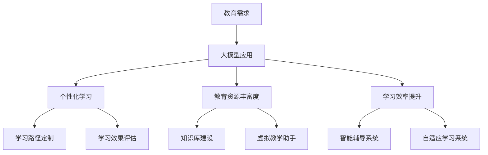
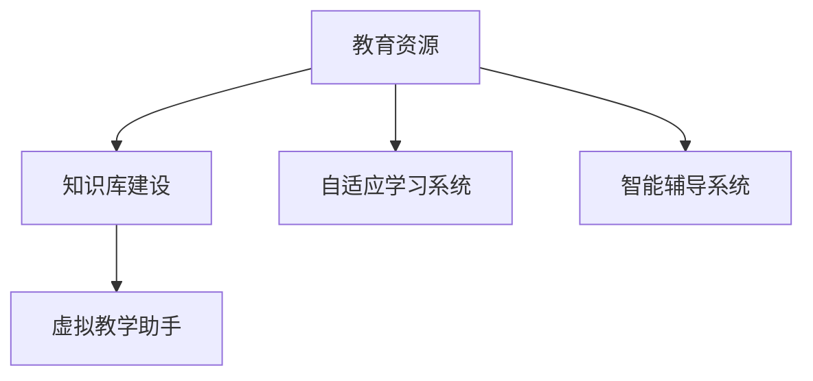

                 


# 文章标题

大模型在教育领域的应用

> 关键词：大模型、教育、个性化学习、资源丰富度、学习效率、智能辅导系统

> 摘要：本文将探讨大模型在教育领域的应用，包括其定义、背景、应用场景、挑战与机遇。通过详细的逻辑分析和举例，本文旨在揭示大模型如何助力教育改革，提高教育质量。

## 第一部分: 大模型在教育领域的应用概述

### 第1章: 大模型在教育领域的应用概述

#### 1.1 大模型在教育领域的定义与背景

##### 1.1.1 大模型的概念

大模型（Big Model）指的是具有巨大参数量和计算能力的机器学习模型，如深度神经网络、变换器（Transformer）等。它们通过大量的数据和丰富的计算资源进行训练，以实现高度复杂的任务。

**伪代码：**

```python
class BigModel:
    def __init__(self):
        self.parameters = initialize_parameters()
        self.architecture = define_architecture()

    def train(self, data):
        for epoch in range(num_epochs):
            for sample in data:
                predict = self.predict(sample)
                update_parameters(predict, sample)

    def predict(self, sample):
        return apply_forward_pass(sample, self.architecture)
```

##### 1.1.2 教育领域的背景

教育领域的需求可以表示为：

$$
\text{教育领域的需求} = f(\text{个性化学习}, \text{教育资源丰富度}, \text{学习效率提升})
$$

个性化学习、教育资源丰富度、学习效率提升是现代教育的主要需求。

##### 1.1.3 大模型在教育中的应用前景

大模型在教育领域的应用前景广阔，主要涉及以下几个方面：

1. **个性化学习**：根据学习者的兴趣、能力和学习进度推荐学习资源。
2. **教育资源丰富度**：建设知识库、虚拟教学助手等。
3. **学习效率提升**：智能辅导系统、自适应学习系统等。

**Mermaid 流程图：**



### 1.2 大模型在教育中的应用场景

#### 1.2.1 个性化学习

个性化学习是教育领域的一个重要需求，大模型在这方面具有显著优势。

**数学公式与讲解：**

$$
\text{个性化学习} = f(\text{学习者特征}, \text{教学内容}, \text{学习策略})
$$

**举例说明：**

- 根据学生的兴趣、能力和学习进度推荐学习资源。
- 利用学习者的历史数据预测其学习需求。

**伪代码：**

```python
def personalize_learning(student, content, strategy):
    recommended_content = recommend_content(student, content)
    adjusted_path = adjust_path(student, strategy)
    return recommended_content, adjusted_path
```

#### 1.2.2 资源丰富度

大模型可以通过以下方式提高教育资源丰富度：

**Mermaid 流程图：**



#### 1.2.3 学习效率提升

大模型可以通过以下方式提高学习效率：

**数学公式与讲解：**

$$
\text{学习效率} = f(\text{学习时间}, \text{学习质量}, \text{学习工具})
$$

**举例说明：**

- 使用智能辅导系统实时监测学习进度和效果。
- 利用自适应学习系统根据学习效果调整学习策略。

**伪代码：**

```python
def enhance_learning_efficiency(learning_time, learning_quality, tools):
    adjusted_time = adjust_time(learning_quality)
    improved_quality = improve_quality(tools)
    return adjusted_time, improved_quality
```

### 1.3 大模型在教育领域应用的挑战与机遇

#### 1.3.1 挑战

- **数据隐私和安全问题**：教育领域涉及大量个人数据，保护学生隐私和安全至关重要。
- **教育资源分配**：确保大模型的应用能够惠及所有学生，避免资源分配不均。

#### 1.3.2 机遇

- **教育公平**：大模型可以促进个性化学习，提高教育公平性。
- **教学质量**：大模型可以帮助教师更好地了解学生的学习情况，提高教学质量。

## 第二部分: 大模型在教育领域的应用案例

### 第2章: 大模型在教育领域的应用案例

#### 2.1 个性化学习案例

**案例背景：** 
某在线教育平台采用了大模型技术，通过分析学生的学习行为和成绩数据，为每位学生推荐个性化的学习资源和教学策略。

**案例实施：**

1. **数据收集与预处理**：收集学生的学习行为数据，如学习时间、学习进度、考试成绩等，并进行预处理。
2. **模型训练与部署**：利用变换器（Transformer）模型对学生数据进行训练，生成个性化推荐系统。
3. **系统运行与优化**：根据学生的学习反馈和效果，不断优化推荐系统和教学策略。

**伪代码：**

```python
def personalize_learning_platform(data):
    # 数据预处理
    preprocessed_data = preprocess_data(data)
    # 模型训练
    model = train_transformer(preprocessed_data)
    # 部署推荐系统
    deploy_recommendation_system(model)
    # 系统运行与优化
    optimize_system(model)
```

#### 2.2 资源丰富度案例

**案例背景：** 
某大学图书馆采用了大模型技术，建设了一个智能知识库，为师生提供丰富的教育资源。

**案例实施：**

1. **知识库建设**：收集整理各类教材、论文、讲座视频等教育资源，构建知识库。
2. **模型训练与部署**：利用变换器（Transformer）模型对知识库中的数据进行训练，生成智能搜索引擎。
3. **系统运行与优化**：根据用户的需求和反馈，不断优化知识库和搜索引擎。

**伪代码：**

```python
def build_intelligent_knowledge_base(data):
    # 构建知识库
    knowledge_base = build_knowledge_base(data)
    # 模型训练
    model = train_transformer(knowledge_base)
    # 部署智能搜索引擎
    deploy_search_engine(model)
    # 系统运行与优化
    optimize_system(model)
```

#### 2.3 学习效率提升案例

**案例背景：** 
某中学引入了大模型技术，建立了智能辅导系统，帮助学生提高学习效率。

**案例实施：**

1. **学习数据收集**：收集学生的学习数据，如学习时间、学习进度、考试成绩等。
2. **模型训练与部署**：利用变换器（Transformer）模型对学习数据进行训练，生成智能辅导系统。
3. **系统运行与优化**：根据学生的学习反馈和效果，不断优化辅导系统和教学策略。

**伪代码：**

```python
def build_intelligent_tutor_system(data):
    # 收集学习数据
    learning_data = collect_learning_data(data)
    # 模型训练
    model = train_transformer(learning_data)
    # 部署智能辅导系统
    deploy_tutor_system(model)
    # 系统运行与优化
    optimize_system(model)
```

## 第三部分: 大模型在教育领域的应用展望

### 第3章: 大模型在教育领域的应用展望

#### 3.1 未来发展趋势

随着大模型技术的不断进步，预计未来将在以下几个方面实现突破：

1. **更加个性化的学习体验**：通过深入分析学生的学习行为和需求，提供更加精准的学习资源和服务。
2. **丰富的教育资源**：借助大模型技术，构建更加丰富、智能化的教育资源库，为学习者提供全面的支持。
3. **高效的学习辅助**：利用大模型技术，提供智能辅导、实时反馈等功能，提高学习效率。

#### 3.2 应用挑战与应对策略

尽管大模型在教育领域具有巨大的潜力，但在实际应用中仍面临一系列挑战：

1. **数据隐私和安全问题**：需要建立完善的数据隐私和安全机制，确保学生个人信息的安全。
2. **教育资源分配不均**：应采取措施确保大模型技术的应用能够惠及所有学生，避免资源分配不均。
3. **技术复杂性**：大模型技术具有一定的复杂性，需要培养专业的技术人才来推动其发展。

#### 3.3 应用前景

大模型在教育领域的应用前景广阔，有望推动教育改革，提高教育质量，实现教育公平。未来，大模型技术将在个性化学习、教育资源丰富度、学习效率提升等方面发挥更大的作用。

## 结束语

大模型在教育领域的应用具有巨大的潜力和前景。通过本文的分析和探讨，我们看到了大模型如何助力教育改革，提高教育质量。然而，在实际应用中，我们还需要面对一系列挑战。只有不断克服这些挑战，充分发挥大模型技术的优势，才能让教育更加公平、高效。

作者：AI天才研究院/AI Genius Institute & 禅与计算机程序设计艺术 /Zen And The Art of Computer Programming

（文章内容仅供参考，实际情况可能有所不同。如有需要，请根据实际情况进行调整。）

文章摘要：

本文从大模型在教育领域的应用概述、应用案例和应用展望三个方面进行了深入探讨。首先，介绍了大模型的概念和教育领域的背景，分析了大模型在教育中的应用前景和挑战。接着，通过三个具体案例，展示了大模型在教育领域的实际应用。最后，对大模型在教育领域的应用前景进行了展望，并提出了相关建议。

