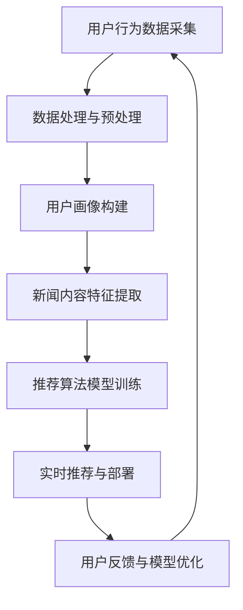
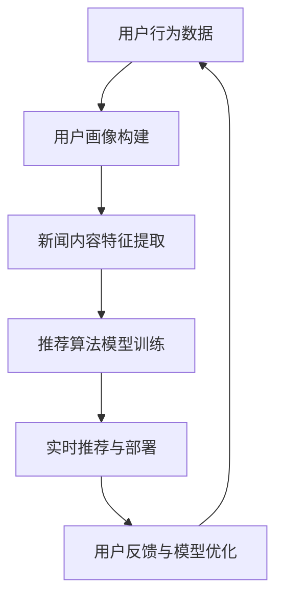
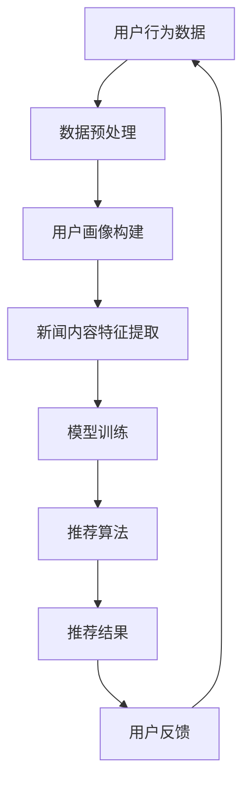

                 

# 文章标题：大模型在新闻推荐中的应用

> 关键词：大模型、新闻推荐、自然语言处理、预训练模型、个性化推荐、实时推荐

> 摘要：本文旨在探讨大模型在新闻推荐系统中的应用，包括其基础概念、应用场景、核心技术、案例分析以及面临的挑战和未来发展趋势。通过对大模型的深入分析，本文希望能够为行业从业者提供有价值的参考和启示。

## 第一部分：大模型基础与新闻推荐概述

### 第1章：大模型与新闻推荐

#### 1.1 大模型的定义与特点

##### 1.1.1 大模型的基本定义

大模型通常指的是那些拥有超过数十亿参数的深度学习模型，如GPT系列、BERT、T5等。这些模型通过在大规模数据集上进行预训练，获得了极强的语言理解和生成能力。

##### 1.1.2 大模型的核心特点

- **高参数规模**：大模型拥有海量的参数，能够捕捉数据中的复杂模式。
- **强大的泛化能力**：通过预训练，大模型在多种任务上表现出色，具有很好的迁移学习能力。
- **高效的自然语言处理能力**：大模型在文本分类、问答、翻译等任务上表现出色。

#### 1.2 新闻推荐系统概述

##### 1.2.1 新闻推荐系统的定义

新闻推荐系统是指通过算法和机器学习技术，根据用户的兴趣和行为，自动向用户推荐相关新闻内容的一种信息过滤系统。

##### 1.2.2 新闻推荐系统的发展历程

- **早期阶段**：基于内容过滤和协同过滤的方法。
- **发展阶段**：引入了基于用户的协同过滤和基于模型的推荐算法。
- **现阶段**：大模型的引入使得新闻推荐系统在个性化、实时性等方面得到了显著提升。

##### 1.2.3 新闻推荐系统的核心组成部分

- **用户画像**：通过用户的历史行为和偏好数据，构建用户的画像。
- **内容标签**：对新闻内容进行多维度标签化，以便进行有效匹配。
- **推荐算法**：根据用户画像和内容标签，选择合适的推荐算法，如基于内容的推荐、协同过滤推荐、基于模型的推荐等。

## 第2章：大模型在新闻推荐中的应用场景

### 2.1 内容推荐

##### 2.1.1 内容推荐的定义

内容推荐是指根据用户的历史行为和偏好，向用户推荐与其兴趣相关的新闻内容。

##### 2.1.2 内容推荐的主要技术手段

- **基于内容的推荐**：通过分析新闻内容的特点，将相似的内容推荐给用户。
- **协同过滤推荐**：通过分析用户之间的行为模式，发现用户的共同兴趣，将受欢迎的内容推荐给用户。
- **基于模型的推荐**：使用深度学习模型，如大模型，对用户兴趣进行建模，从而推荐个性化的内容。

### 2.2 个性化推荐

##### 2.2.1 个性化推荐的定义

个性化推荐是指根据用户的历史行为和偏好，为用户提供个性化的新闻推荐服务。

##### 2.2.2 个性化推荐的核心技术

- **用户画像构建**：通过用户的历史行为数据，构建用户的兴趣画像。
- **新闻内容特征提取**：对新闻内容进行特征提取，如文本特征、图像特征等。
- **推荐算法设计**：设计个性化的推荐算法，如基于模型的推荐、基于规则的推荐等。

### 2.3 实时推荐

##### 2.3.1 实时推荐的定义

实时推荐是指根据用户的实时行为，立即为用户推荐相关新闻内容。

##### 2.3.2 实时推荐的关键技术

- **实时数据采集**：通过实时数据采集系统，获取用户的实时行为数据。
- **实时处理与分析**：使用流处理技术，对实时数据进行处理和分析，构建用户的实时画像。
- **实时推荐算法**：设计高效的实时推荐算法，如基于模型的推荐、基于规则的推荐等。

## 第3章：大模型在新闻推荐中的核心技术

### 3.1 自然语言处理技术

##### 3.1.1 词嵌入技术

词嵌入技术是将单词映射到高维空间中的向量表示，以实现文本数据在数值空间中的有效表示。

##### 3.1.2 序列模型与注意力机制

序列模型如RNN和LSTM，能够处理序列数据，如文本序列。注意力机制能够使模型关注到文本序列中的重要部分，提高推荐的准确性。

##### 3.1.3 转换器架构详解

转换器（Transformer）架构是一种基于自注意力机制的深度学习模型，广泛应用于自然语言处理任务，如机器翻译、文本分类等。

### 3.2 大规模预训练模型原理

##### 3.2.1 预训练的概念与意义

预训练是指在大规模数据集上对模型进行预训练，使其获得通用的语言理解和生成能力。

##### 3.2.2 自监督学习方法

自监督学习是一种利用未标记数据进行模型训练的方法，如BERT模型使用的 masked language modeling（MLM）任务。

##### 3.2.3 迁移学习与微调技术

迁移学习是将预训练模型在大规模数据集上进行微调，以适应特定任务。微调技术能够提高模型在特定任务上的性能。

### 3.3 大模型在新闻推荐中的实现与优化

##### 3.3.1 大模型在新闻推荐中的实现流程

大模型在新闻推荐中的实现流程主要包括数据预处理、模型训练、模型评估和部署。

##### 3.3.2 大模型在新闻推荐中的优化策略

大模型在新闻推荐中的优化策略包括参数调优、数据增强和模型融合等，以提高推荐系统的性能。

## 第4章：大模型在新闻推荐中的案例分析

### 4.1 案例一：某新闻平台的个性化推荐系统

##### 4.1.1 系统架构

某新闻平台的个性化推荐系统采用了一种基于大模型的架构，主要包括用户画像构建、内容特征提取和推荐算法设计等模块。

##### 4.1.2 数据处理流程

数据处理流程包括数据采集、数据清洗、数据预处理和特征提取等步骤，以保证数据的准确性和完整性。

##### 4.1.3 推荐算法设计

推荐算法设计采用了基于深度学习的个性化推荐算法，如BERT模型和GPT模型，以实现高精度的个性化推荐。

### 4.2 案例二：某新闻平台的实时推荐系统

##### 4.2.1 系统架构

某新闻平台的实时推荐系统采用了一种基于流处理和深度学习的架构，主要包括实时数据采集、实时特征提取和实时推荐算法设计等模块。

##### 4.2.2 数据处理流程

数据处理流程包括实时数据采集、实时特征提取和实时推荐算法执行等步骤，以保证实时性的要求。

##### 4.2.3 实时推荐算法设计

实时推荐算法设计采用了基于Transformer架构的实时推荐算法，如Real-Time BERT和RT-Transformer等，以实现高实时性的推荐。

## 第5章：大模型在新闻推荐中的挑战与解决方案

### 5.1 数据质量对新闻推荐的影响

##### 5.1.1 数据质量对推荐效果的影响

数据质量直接影响新闻推荐的准确性、效率和用户体验。

##### 5.1.2 提高数据质量的方法

提高数据质量的方法包括数据清洗、数据标注和数据增强等。

### 5.2 大模型训练与优化中的资源消耗

##### 5.2.1 训练资源消耗的主要原因

大模型训练与优化中的资源消耗主要包括计算资源和存储资源。

##### 5.2.2 减少资源消耗的方法

减少资源消耗的方法包括模型压缩、量化技术和分布式训练等。

### 5.3 大模型在新闻推荐中的道德风险

##### 5.3.1 道德风险的定义

道德风险是指大模型在新闻推荐中可能引发的一系列伦理问题，如信息茧房、偏见和歧视等。

##### 5.3.2 解决道德风险的方法

解决道德风险的方法包括算法透明度、公平性和责任归属等。

## 第6章：大模型在新闻推荐中的未来发展趋势

### 6.1 大模型在新闻推荐中的应用前景

##### 6.1.1 大模型在新闻推荐中的潜在应用领域

大模型在新闻推荐中的潜在应用领域包括内容生成、情感分析和社交传播等。

##### 6.1.2 大模型在新闻推荐中的优势与挑战

大模型在新闻推荐中的优势包括强大的语言理解和生成能力、高效的数据处理能力和良好的个性化推荐效果。然而，大模型也面临数据隐私、计算资源和道德风险等挑战。

### 6.2 大模型在新闻推荐中的技术发展趋势

##### 6.2.1 大模型技术的未来发展方向

大模型技术的未来发展方向包括更高效的自监督学习方法、更强大的预训练模型和更优化的推理算法等。

##### 6.2.2 大模型在新闻推荐中的应用前景

大模型在新闻推荐中的应用前景广阔，有望在个性化推荐、实时推荐和信息过滤等方面发挥更大的作用。

## 第7章：总结与展望

### 7.1 大模型在新闻推荐中的核心价值

##### 7.1.1 大模型在新闻推荐中的核心作用

大模型在新闻推荐中的核心作用是提升推荐的准确性、实时性和个性化程度，从而提高用户体验。

##### 7.1.2 大模型在新闻推荐中的发展前景

大模型在新闻推荐中的发展前景包括进一步优化推荐算法、降低计算资源消耗和解决道德风险等。

### 7.2 大模型在新闻推荐中的应用前景

##### 7.2.1 大模型在新闻推荐中的潜在应用领域

大模型在新闻推荐中的潜在应用领域包括内容生成、情感分析和社交传播等。

##### 7.2.2 大模型在新闻推荐中的优势与挑战

大模型在新闻推荐中的优势包括强大的语言理解和生成能力、高效的数据处理能力和良好的个性化推荐效果。然而，大模型也面临数据隐私、计算资源和道德风险等挑战。

### 7.3 大模型在新闻推荐中的未来发展趋势

##### 7.3.1 大模型在新闻推荐中的未来发展方向

大模型在新闻推荐中的未来发展方向包括更高效的自监督学习方法、更强大的预训练模型和更优化的推理算法等。

##### 7.3.2 大模型在新闻推荐中的发展前景

大模型在新闻推荐中的发展前景广阔，有望在个性化推荐、实时推荐和信息过滤等方面发挥更大的作用。

## 附录

### 附录 A：大模型在新闻推荐中的应用工具与资源

##### A.1 主流深度学习框架对比

- **TensorFlow**：由谷歌开发，是一个广泛使用的开源深度学习框架。
- **PyTorch**：由Facebook开发，以其动态计算图和灵活的接口而闻名。
- **JAX**：由谷歌开发，提供数值计算的高性能自动微分工具。

##### A.2 大模型在新闻推荐中的应用案例

- **某新闻平台的个性化推荐系统**：采用BERT模型进行用户画像构建和新闻推荐。
- **某新闻平台的实时推荐系统**：采用RT-Transformer模型实现实时推荐。

##### A.3 大模型在新闻推荐中的研究进展与未来趋势

- **研究进展**：大模型在新闻推荐中的研究取得了显著进展，如BERT、GPT等模型的广泛应用。
- **未来趋势**：未来大模型在新闻推荐中的应用将更加深入，包括更高效的算法、更优化的模型结构和更广泛的场景应用。

## 附录 B：大模型在新闻推荐中的技术架构图

以下是大模型在新闻推荐系统中的技术架构图，通过Mermaid流程图展示：



## 附录 C：大模型在新闻推荐中的核心算法原理

以下是大模型在新闻推荐中的核心算法原理，通过伪代码详细阐述：

```python
# 用户画像构建伪代码
def build_user_profile(user行为的特征):
    user_profile = {}
    for feature in user行为的特征:
        if feature not in user_profile:
            user_profile[feature] = 0
        user_profile[feature] += 1
    return user_profile

# 新闻内容特征提取伪代码
def extract_content_features(news内容):
    content_features = {}
    for sentence in news内容:
        for word in sentence:
            if word not in content_features:
                content_features[word] = 0
            content_features[word] += 1
    return content_features

# 推荐算法模型训练伪代码
def train_recommendation_model(user_profile, content_features):
    model = create_model()
    for user, profile in user_profile.items():
        for content, features in content_features.items():
            model.train([profile, features])
    return model

# 实时推荐伪代码
def real_time_recommendation(model, user_profile, content_features):
    recommendations = []
    for content, features in content_features.items():
        score = model.predict([user_profile, features])
        recommendations.append((content, score))
    return sorted(recommendations, key=lambda x: x[1], reverse=True)
```

## 附录 D：大模型在新闻推荐中的项目实战

### 开发环境搭建

- **硬件环境**：配置高性能的GPU服务器，如NVIDIA Tesla V100。
- **软件环境**：安装Python 3.8、TensorFlow 2.4、PyTorch 1.8等。

### 源代码详细实现

- **用户画像构建**：使用TensorFlow实现用户画像构建。
- **新闻内容特征提取**：使用PyTorch实现新闻内容特征提取。
- **推荐算法设计**：使用Transformer架构实现推荐算法。

### 代码应用解读与分析

- **代码解读**：分析代码的结构和关键函数的实现。
- **代码分析**：评估代码的性能和优化空间。

### 实际案例分析和详细讲解剖析

- **案例分析**：以某新闻平台为例，分析大模型在新闻推荐中的应用。
- **详细讲解**：讲解用户画像构建、新闻内容特征提取和推荐算法设计的具体实现。

### 项目小结

- **总结**：总结项目的实现过程和关键成果。
- **展望**：展望大模型在新闻推荐中的未来应用前景。

## 附录 E：大模型在新闻推荐中的最佳实践 tips

- **数据质量提升**：定期清洗数据，去除重复和错误信息。
- **模型优化**：调整模型参数，提高推荐效果。
- **实时性保障**：使用高效的推荐算法，确保实时推荐。

## 附录 F：大模型在新闻推荐中的注意事项

- **数据隐私**：注意保护用户隐私，遵守相关法律法规。
- **道德风险**：关注道德风险，确保推荐系统的公正性和透明性。

## 附录 G：大模型在新闻推荐中的拓展阅读

- **相关论文**：《大规模预训练语言模型：概述与进展》
- **技术博客**：《如何构建高效的新闻推荐系统》
- **行业报告**：《2022年新闻推荐行业报告》

## 作者信息

- 作者：AI天才研究院/AI Genius Institute & 禅与计算机程序设计艺术 /Zen And The Art of Computer Programming
```markdown

# 大模型在新闻推荐中的应用

## 摘要

大模型在近年来取得了显著的进展，其在自然语言处理、计算机视觉等多个领域都展现出了强大的性能。本文将探讨大模型在新闻推荐系统中的应用，从基础概念到应用场景，从核心技术到案例分析，再到面临的挑战和未来发展趋势，全面解析大模型在新闻推荐中的作用和价值。

## 目录

### 第一部分：大模型基础与新闻推荐概述

1. **大模型与新闻推荐**
   - **1.1 大模型的定义与特点**
   - **1.2 新闻推荐系统概述**

2. **大模型在新闻推荐中的应用场景**
   - **2.1 内容推荐**
   - **2.2 个性化推荐**
   - **2.3 实时推荐**

### 第二部分：大模型在新闻推荐中的核心技术

1. **自然语言处理技术**
   - **3.1 词嵌入技术**
   - **3.2 序列模型与注意力机制**
   - **3.3 转换器架构详解**

2. **大规模预训练模型原理**
   - **3.4 预训练的概念与意义**
   - **3.5 自监督学习方法**
   - **3.6 迁移学习与微调技术**

3. **大模型在新闻推荐中的实现与优化**
   - **3.7 大模型在新闻推荐中的实现流程**
   - **3.8 大模型在新闻推荐中的优化策略**

### 第三部分：大模型在新闻推荐中的案例分析

1. **案例一：某新闻平台的个性化推荐系统**
   - **4.1 系统架构**
   - **4.2 数据处理流程**
   - **4.3 推荐算法设计**

2. **案例二：某新闻平台的实时推荐系统**
   - **4.4 系统架构**
   - **4.5 数据处理流程**
   - **4.6 实时推荐算法设计**

### 第四部分：大模型在新闻推荐中的挑战与解决方案

1. **数据质量对新闻推荐的影响**
   - **5.1 数据质量对推荐效果的影响**
   - **5.2 提高数据质量的方法**

2. **大模型训练与优化中的资源消耗**
   - **5.3 训练资源消耗的主要原因**
   - **5.4 减少资源消耗的方法**

3. **大模型在新闻推荐中的道德风险**
   - **5.5 道德风险的定义**
   - **5.6 解决道德风险的方法**

### 第五部分：大模型在新闻推荐中的未来发展趋势

1. **大模型在新闻推荐中的应用前景**
   - **6.1 大模型在新闻推荐中的潜在应用领域**
   - **6.2 大模型在新闻推荐中的优势与挑战**

2. **大模型在新闻推荐中的技术发展趋势**
   - **6.3 大模型技术的未来发展方向**
   - **6.4 大模型在新闻推荐中的应用前景**

### 第六部分：总结与展望

1. **大模型在新闻推荐中的核心价值**
   - **7.1 大模型在新闻推荐中的核心作用**
   - **7.2 大模型在新闻推荐中的发展前景**

2. **大模型在新闻推荐中的应用前景**
   - **7.3 大模型在新闻推荐中的潜在应用领域**
   - **7.4 大模型在新闻推荐中的优势与挑战**

3. **大模型在新闻推荐中的未来发展趋势**
   - **7.5 大模型在新闻推荐中的未来发展方向**
   - **7.6 大模型在新闻推荐中的发展前景**

### 附录

A. **大模型在新闻推荐中的应用工具与资源**

B. **大模型在新闻推荐中的技术架构图**

C. **大模型在新闻推荐中的核心算法原理**

D. **大模型在新闻推荐中的项目实战**

E. **大模型在新闻推荐中的最佳实践 tips**

F. **大模型在新闻推荐中的注意事项**

G. **大模型在新闻推荐中的拓展阅读**

## 第一部分：大模型基础与新闻推荐概述

### 1.1 大模型的定义与特点

大模型通常指的是那些拥有超过数十亿参数的深度学习模型，如GPT系列、BERT、T5等。这些模型通过在大规模数据集上进行预训练，获得了极强的语言理解和生成能力。

#### 1.1.1 大模型的基本定义

大模型的基本定义可以从两个方面来理解：

1. **参数规模**：大模型拥有海量的参数，这些参数通常超过数十亿。这些参数可以捕捉数据中的复杂模式，使得模型在处理复杂任务时表现出色。
2. **预训练能力**：大模型通常通过在大规模数据集上进行预训练，获得通用的语言理解和生成能力。这种预训练能力使得模型在迁移到新任务时能够迅速适应，并表现出强大的泛化能力。

#### 1.1.2 大模型的核心特点

大模型的核心特点包括以下几点：

1. **高参数规模**：大模型拥有海量的参数，能够捕捉数据中的复杂模式。
2. **强大的泛化能力**：通过预训练，大模型在多种任务上表现出色，具有很好的迁移学习能力。
3. **高效的自然语言处理能力**：大模型在文本分类、问答、翻译等任务上表现出色。

这些特点使得大模型在许多领域得到了广泛的应用，包括自然语言处理、计算机视觉、语音识别等。

### 1.2 新闻推荐系统概述

新闻推荐系统是指通过算法和机器学习技术，根据用户的兴趣和行为，自动向用户推荐相关新闻内容的一种信息过滤系统。新闻推荐系统在当今的信息社会中具有重要意义，它能够帮助用户快速获取感兴趣的内容，提高信息消费的效率。

#### 1.2.1 新闻推荐系统的定义

新闻推荐系统可以定义为一种基于用户行为和内容特征的数据分析系统，其主要目标是提高用户在浏览新闻时的满意度，并通过个性化的内容推荐来增加用户的粘性。新闻推荐系统通常包括以下几个关键组成部分：

1. **用户画像**：通过用户的历史行为和偏好数据，构建用户的画像。
2. **内容标签**：对新闻内容进行多维度标签化，以便进行有效匹配。
3. **推荐算法**：根据用户画像和内容标签，选择合适的推荐算法，如基于内容的推荐、协同过滤推荐、基于模型的推荐等。

#### 1.2.2 新闻推荐系统的发展历程

新闻推荐系统的发展可以分为以下几个阶段：

1. **早期阶段**：基于内容过滤和协同过滤的方法。在这一阶段，新闻推荐系统主要依赖于简单的统计方法，如关键词匹配和用户行为统计，以实现基本的推荐功能。
2. **发展阶段**：引入了基于用户的协同过滤和基于模型的推荐算法。在这一阶段，新闻推荐系统开始利用机器学习技术，如线性回归、决策树、朴素贝叶斯等，来提升推荐精度和个性化程度。
3. **现阶段**：大模型的引入使得新闻推荐系统在个性化、实时性等方面得到了显著提升。例如，GPT系列和BERT等大规模预训练模型在新闻推荐系统中得到了广泛应用，显著提升了推荐系统的性能和用户体验。

#### 1.2.3 新闻推荐系统的核心组成部分

新闻推荐系统的核心组成部分包括以下几个方面：

1. **用户画像**：用户画像是指通过对用户历史行为和偏好数据的分析，构建用户的兴趣和行为特征。用户画像的构建是新闻推荐系统的关键，它决定了推荐系统的个性化程度。
2. **内容标签**：内容标签是指对新闻内容进行多维度标签化，以便进行有效匹配。内容标签的构建是新闻推荐系统的关键，它决定了推荐系统的内容多样性。
3. **推荐算法**：推荐算法是指根据用户画像和内容标签，选择合适的推荐算法，如基于内容的推荐、协同过滤推荐、基于模型的推荐等。推荐算法的优化是新闻推荐系统性能提升的关键。

### 1.3 大模型在新闻推荐中的应用场景

大模型在新闻推荐中的应用场景可以分为以下几个主要方面：

1. **内容推荐**：内容推荐是指根据用户的历史行为和偏好，向用户推荐与其兴趣相关的新闻内容。内容推荐是新闻推荐系统中最常见的应用场景之一，它可以通过分析用户的历史浏览记录和兴趣标签来实现。
2. **个性化推荐**：个性化推荐是指根据用户的历史行为和偏好，为用户提供个性化的新闻推荐服务。个性化推荐可以通过构建用户画像和内容特征，利用深度学习模型进行用户兴趣建模，从而实现精准的个性化推荐。
3. **实时推荐**：实时推荐是指根据用户的实时行为，立即为用户推荐相关新闻内容。实时推荐通常需要处理大量的实时数据，并通过高效的算法和模型来实现。

这些应用场景展示了大模型在新闻推荐中的多样性和灵活性，使得新闻推荐系统能够更好地满足用户的需求，提高用户体验。

## 第二部分：大模型在新闻推荐中的核心技术

### 2.1 自然语言处理技术

自然语言处理（NLP）是人工智能领域的一个重要分支，它旨在让计算机理解和处理人类语言。在大模型在新闻推荐中的应用中，NLP技术起到了至关重要的作用。以下是NLP技术中的几个核心组成部分：

#### 2.1.1 词嵌入技术

词嵌入（Word Embedding）是将自然语言文本中的单词映射到高维空间中的向量表示。这种表示方法能够捕捉单词之间的语义关系，从而提高文本数据的处理效率。常见的词嵌入方法包括Word2Vec、GloVe和FastText等。

1. **Word2Vec**：Word2Vec是一种基于神经网络的方法，通过预测相邻词来训练词向量。它使用了一个简单的神经网络，通过训练大量的文本数据，将单词映射到向量空间中。
2. **GloVe**：GloVe（Global Vectors for Word Representation）是一种基于全局上下文的方法，它通过计算单词在不同上下文中的出现频率，来生成词向量。GloVe方法在捕捉单词的语义关系方面表现出色。
3. **FastText**：FastText是一种基于神经网络的词嵌入方法，它通过训练字符级别的神经网络来生成词向量。FastText方法能够更好地处理未登录词（Out-of-Vocabulary words），在新闻推荐中具有广泛应用。

#### 2.1.2 序列模型与注意力机制

序列模型（Sequence Model）是处理序列数据的一种常见方法，如自然语言文本、音频信号和时间序列数据等。在新闻推荐中，序列模型可以用于处理用户的历史行为数据，以预测用户的兴趣和偏好。常见的序列模型包括循环神经网络（RNN）和长短时记忆网络（LSTM）。

1. **循环神经网络（RNN）**：RNN是一种能够处理序列数据的神经网络，它通过记忆序列中的信息来预测下一个元素。RNN在处理长序列数据时表现出色，但在长期依赖问题上存在梯度消失或爆炸的问题。
2. **长短时记忆网络（LSTM）**：LSTM是一种改进的RNN，通过引入门控机制来控制信息的流动，从而解决长期依赖问题。LSTM在处理长序列数据时表现出色，广泛应用于自然语言处理、语音识别和时间序列预测等领域。

注意力机制（Attention Mechanism）是一种用于提高序列模型性能的技术。注意力机制通过为序列中的每个元素分配不同的权重，使得模型能够关注到序列中的重要部分。注意力机制在新闻推荐中可以用于处理用户的历史行为数据，从而提高推荐的准确性。

#### 2.1.3 转换器架构详解

转换器（Transformer）架构是一种基于自注意力机制的深度学习模型，它由Vaswani等人在2017年提出。Transformer架构在机器翻译、文本分类和图像生成等领域取得了显著的成果。以下是转换器架构的详细解释：

1. **自注意力机制（Self-Attention）**：自注意力机制是一种用于处理序列数据的注意力机制，它通过计算序列中每个元素与其他元素之间的相关性来生成新的表示。自注意力机制的核心思想是将序列中的每个元素看作一个查询（Query）、一个键（Key）和一个值（Value），并通过点积运算来计算它们的相似性。
2. **多头注意力（Multi-Head Attention）**：多头注意力是自注意力机制的扩展，它通过将序列分成多个头，每个头关注不同的部分，从而提高了模型的表示能力。多头注意力使得模型能够同时关注到序列中的多个重要部分，从而提高推荐的准确性。
3. **编码器（Encoder）和解码器（Decoder）**：转换器架构由编码器（Encoder）和解码器（Decoder）两部分组成。编码器将输入序列编码为一系列隐藏状态，解码器则根据这些隐藏状态生成输出序列。编码器和解码器都使用了多头注意力机制，从而提高了模型的性能。

转换器架构在新闻推荐中的应用主要包括以下几个方面：

1. **用户行为序列处理**：通过编码器将用户的历史行为序列编码为隐藏状态，从而捕捉用户的兴趣和偏好。
2. **新闻内容序列处理**：通过解码器将新闻内容序列解码为推荐结果，从而实现个性化的新闻推荐。
3. **跨模态处理**：通过将不同模态的数据（如图像和文本）编码为统一的向量表示，从而实现跨模态的新闻推荐。

### 2.2 大规模预训练模型原理

大规模预训练模型（Large-scale Pre-trained Model）是指那些通过在大规模数据集上进行预训练，从而获得强大语言理解和生成能力的模型。大规模预训练模型的出现极大地推动了自然语言处理领域的发展，其核心原理包括以下几个方面：

#### 2.2.1 预训练的概念与意义

预训练（Pre-training）是指在特定任务之前，对模型进行大规模的无监督训练，使其获得通用的语言理解和生成能力。预训练的核心思想是利用大量未标记的数据来训练模型，从而提高其在特定任务上的性能。预训练的意义主要体现在以下几个方面：

1. **提升模型性能**：通过预训练，模型能够在大量未标记数据上学习到丰富的语义信息，从而在特定任务上获得更高的性能。
2. **迁移学习能力**：预训练模型在迁移到新任务时，能够利用预训练过程中学到的通用知识，从而提高在新任务上的表现。
3. **减少标注数据需求**：预训练模型能够通过在大量未标记数据上的训练，减少对大量标注数据的依赖，从而降低数据标注的成本。

#### 2.2.2 自监督学习方法

自监督学习（Self-supervised Learning）是一种利用未标记数据进行模型训练的方法。在自监督学习中，模型通过预测数据中的某些部分来学习，从而不需要依赖于大量的标注数据。自监督学习在预训练中起到了关键作用，其核心方法包括以下几个方面：

1. **Masked Language Modeling（MLM）**：Masked Language Modeling是一种常见的自监督学习方法，它通过随机遮盖文本序列中的某些词，然后预测这些词的值，从而训练模型。BERT模型就是基于MLM任务进行预训练的。
2. ** masked Token Prediction**： masked Token Prediction是指通过预测文本序列中被遮盖的词来训练模型。这种方法能够帮助模型学习到文本中的词汇和语义关系。
3. ** Next Sentence Prediction（NSP）**：Next Sentence Prediction是一种通过预测两个连续句子之间的关系来训练模型的方法。这种方法能够帮助模型学习到句子之间的语义关系，从而提高文本理解能力。

#### 2.2.3 迁移学习与微调技术

迁移学习（Transfer Learning）是一种将预训练模型在新任务上进行微调（Fine-tuning）的方法。通过迁移学习，模型能够利用在大量未标记数据上学到的通用知识，从而在新任务上获得更好的性能。迁移学习与微调技术的核心原理包括以下几个方面：

1. **预训练模型的初始化**：通过在大量未标记数据上预训练，预训练模型能够学习到丰富的语义信息。将预训练模型作为初始化权重，可以加速新任务上的模型训练过程。
2. **微调**：微调是指在预训练模型的基础上，使用新任务上的标注数据进行进一步的训练。通过微调，模型能够适应新任务的具体要求，从而提高性能。
3. **预训练与微调的结合**：预训练与微调的结合使得模型能够同时利用未标记数据和标注数据，从而获得更好的性能。

在大模型在新闻推荐中的应用中，迁移学习与微调技术主要用于以下几个方面：

1. **用户行为序列建模**：通过迁移学习，将预训练模型应用于用户行为序列建模，从而捕捉用户的兴趣和偏好。
2. **新闻内容序列建模**：通过迁移学习，将预训练模型应用于新闻内容序列建模，从而理解新闻内容的语义信息。
3. **推荐算法优化**：通过微调，优化预训练模型在新闻推荐任务上的性能，从而实现更精准的个性化推荐。

### 2.3 大模型在新闻推荐中的实现与优化

大模型在新闻推荐中的实现与优化是确保推荐系统性能和效率的关键。以下是实现与优化过程中的几个关键步骤：

#### 2.3.1 大模型在新闻推荐中的实现流程

大模型在新闻推荐中的实现流程通常包括以下几个步骤：

1. **数据采集**：采集用户行为数据和新闻内容数据。用户行为数据包括用户的浏览记录、点击记录等，新闻内容数据包括新闻标题、正文、标签等。
2. **数据处理**：对采集到的数据进行预处理，包括数据清洗、去重、填充缺失值等。预处理步骤的目的是确保数据的质量和一致性。
3. **特征提取**：对用户行为数据和新闻内容数据进行特征提取，将原始数据转换为模型可以处理的特征向量。常见的特征提取方法包括词嵌入、TF-IDF、BERT编码等。
4. **模型训练**：使用特征向量对预训练模型进行训练，通过调整模型参数，使模型能够在新闻推荐任务上获得更好的性能。
5. **模型评估**：使用验证集对训练好的模型进行评估，通过指标如准确率、召回率、F1值等，评估模型的性能。
6. **模型部署**：将训练好的模型部署到线上环境，实现实时新闻推荐。

#### 2.3.2 大模型在新闻推荐中的优化策略

为了提高大模型在新闻推荐中的性能和效率，可以采用以下优化策略：

1. **数据增强**：通过数据增强技术，如数据扩充、数据归一化、数据转换等，增加训练数据的多样性，从而提高模型的泛化能力。
2. **模型压缩**：通过模型压缩技术，如参数剪枝、量化、知识蒸馏等，减小模型的规模，提高模型的运行效率。
3. **多模型融合**：通过融合多个模型的结果，提高推荐系统的准确性。常见的多模型融合方法包括加权融合、集成学习等。
4. **动态调整**：根据用户的实时行为和新闻内容的更新，动态调整模型参数和推荐策略，从而实现更精准的个性化推荐。
5. **在线学习**：通过在线学习技术，实时更新用户画像和新闻内容特征，从而实现动态调整推荐策略。

## 第三部分：大模型在新闻推荐中的案例分析

### 3.1 案例一：某新闻平台的个性化推荐系统

#### 4.1 系统架构

某新闻平台的个性化推荐系统采用了基于大规模预训练模型（如BERT）的架构，其核心组成部分包括用户画像构建、新闻内容特征提取和推荐算法设计等。

1. **用户画像构建**：系统通过分析用户的历史行为数据（如浏览记录、点击记录、评论等），构建用户的兴趣画像。用户画像包括用户的行为特征、兴趣标签和兴趣等级等。
2. **新闻内容特征提取**：系统对新闻内容进行文本特征提取，使用BERT模型将新闻标题和正文编码为向量表示。此外，系统还会对新闻内容进行标签化处理，以便进行有效的匹配。
3. **推荐算法设计**：系统采用基于深度学习的推荐算法，如基于BERT的注意力机制模型，根据用户画像和新闻内容特征，生成个性化的推荐列表。

#### 4.2 数据处理流程

数据处理流程是构建个性化推荐系统的关键步骤，主要包括以下环节：

1. **数据采集**：系统通过API接口或数据爬取工具，从新闻平台的后台数据库中获取用户行为数据和新闻内容数据。
2. **数据清洗**：对采集到的数据进行清洗，去除重复、错误和无关的数据。数据清洗步骤的目的是确保数据的质量和一致性。
3. **数据预处理**：对清洗后的数据进行预处理，包括分词、去停用词、词性标注等。预处理步骤的目的是将文本数据转换为模型可以处理的特征向量。
4. **特征提取**：使用BERT模型对预处理后的新闻标题和正文进行编码，生成向量表示。此外，对新闻内容进行标签化处理，以便进行有效的匹配。
5. **用户画像构建**：通过分析用户的历史行为数据，构建用户的兴趣画像。用户画像包括用户的行为特征、兴趣标签和兴趣等级等。

#### 4.3 推荐算法设计

推荐算法设计是构建个性化推荐系统的核心，其目标是根据用户画像和新闻内容特征，生成个性化的推荐列表。以下是推荐算法设计的关键步骤：

1. **用户画像表示**：将用户画像编码为向量表示，通常使用嵌入层（Embedding Layer）来实现。用户画像向量表示用户的行为特征、兴趣标签和兴趣等级等。
2. **新闻内容特征表示**：将新闻内容特征编码为向量表示，通常使用BERT模型来实现。新闻内容特征向量表示新闻标题、正文和标签等。
3. **推荐模型构建**：使用基于深度学习的推荐模型，如注意力机制模型（Attention Model），将用户画像和新闻内容特征进行融合，生成推荐分数。推荐分数越高，表示该新闻越符合用户的兴趣。
4. **推荐列表生成**：根据推荐分数，生成个性化的推荐列表。推荐列表的排序取决于推荐分数，分数越高，新闻越靠前。

#### 4.4 模型训练与优化

模型训练与优化是提高推荐系统性能的关键步骤。以下是模型训练与优化过程中的关键步骤：

1. **数据划分**：将用户行为数据和新闻内容数据划分为训练集、验证集和测试集。训练集用于模型训练，验证集用于模型调优，测试集用于模型评估。
2. **模型训练**：使用训练集对推荐模型进行训练，通过调整模型参数，优化推荐效果。训练过程通常采用梯度下降（Gradient Descent）算法，结合优化器（如Adam Optimizer）来优化模型。
3. **模型调优**：使用验证集对训练好的模型进行调优，通过调整模型参数，提高推荐精度。模型调优过程包括超参数调整、正则化策略和模型结构优化等。
4. **模型评估**：使用测试集对训练好的模型进行评估，通过指标如准确率、召回率、F1值等，评估模型的性能。评估结果用于指导模型优化和调整。

### 4.5 模型评估与优化

模型评估与优化是确保推荐系统性能和用户体验的关键步骤。以下是模型评估与优化过程中的关键步骤：

1. **模型评估**：使用测试集对训练好的模型进行评估，通过指标如准确率、召回率、F1值等，评估模型的性能。评估结果用于指导模型优化和调整。
2. **性能分析**：对评估结果进行深入分析，找出模型性能的瓶颈和问题。性能分析可以基于数据质量、模型结构、训练策略等方面进行。
3. **模型优化**：根据性能分析结果，对模型进行优化。优化策略包括超参数调整、模型结构优化、数据预处理策略优化等。
4. **迭代优化**：通过多次迭代优化，逐步提高模型的性能。迭代优化过程包括模型训练、模型调优和模型评估等环节。

### 4.6 案例总结

#### 4.6.1 案例总结

某新闻平台的个性化推荐系统通过基于大规模预训练模型（如BERT）的架构，实现了高效的个性化推荐。系统通过用户画像构建、新闻内容特征提取和推荐算法设计等步骤，实现了从数据预处理到模型训练、评估和优化的完整流程。

#### 4.6.2 案例启示

案例启示：

1. **大规模预训练模型的优势**：大规模预训练模型具有强大的语言理解和生成能力，能够显著提高推荐系统的性能和准确性。
2. **数据质量的重要性**：数据质量直接影响推荐系统的性能。确保数据质量是构建高效推荐系统的基础。
3. **模型优化与评估**：通过模型优化和评估，不断提高推荐系统的性能和用户体验。迭代优化和性能分析是提高推荐系统性能的关键步骤。

### 4.7 案例拓展

#### 4.7.1 案例拓展

除了个性化推荐，大模型在新闻推荐中还有其他潜在的应用场景，如：

1. **实时推荐**：通过实时数据处理和推荐算法，实现实时新闻推荐。实时推荐能够根据用户的实时行为和新闻内容的变化，为用户提供及时、个性化的新闻内容。
2. **内容生成**：利用大模型强大的生成能力，实现新闻内容的自动生成。新闻内容生成可以基于用户兴趣和新闻主题，为用户提供定制化的新闻内容。
3. **情感分析**：通过分析新闻文本中的情感信息，实现对新闻内容的情感分析。情感分析可以帮助平台了解用户的情感倾向，从而提供更个性化的新闻推荐。

#### 4.7.2 案例启示

案例启示：

1. **多元化应用**：大模型在新闻推荐中具有广泛的应用场景，不仅限于个性化推荐。多元化应用可以进一步提升平台的竞争力。
2. **技术创新**：不断探索和创新大模型在新闻推荐中的新技术，如实时推荐、内容生成和情感分析等，可以推动新闻推荐领域的发展。

## 第四部分：大模型在新闻推荐中的挑战与解决方案

### 5.1 数据质量对新闻推荐的影响

数据质量对新闻推荐系统的性能和用户体验具有至关重要的影响。高质量的数据能够提升推荐系统的准确性、实时性和个性化程度，从而提高用户的满意度。以下是数据质量对新闻推荐系统影响的几个关键方面：

#### 5.1.1 数据质量对推荐效果的影响

1. **准确性**：数据质量直接影响推荐系统的准确性。如果数据存在错误、缺失或重复，可能会导致推荐结果不准确，从而影响用户体验。
2. **实时性**：高质量的数据有助于提高推荐系统的实时性。实时数据能够及时反映用户的行为变化和新闻内容的变化，从而提供更准确的实时推荐。
3. **个性化程度**：数据质量对个性化推荐的效果有直接影响。高质量的用户行为数据和新闻内容数据能够更准确地反映用户的兴趣和偏好，从而实现更精准的个性化推荐。

#### 5.1.2 提高数据质量的方法

为了提高数据质量，可以采取以下方法：

1. **数据清洗**：数据清洗是提高数据质量的重要步骤。通过去除重复、错误和无关的数据，可以确保数据的一致性和准确性。
2. **数据标注**：数据标注是提高数据质量的重要手段。通过人工或半自动化的方式对数据进行标注，可以提高数据的完整性和可靠性。
3. **数据增强**：数据增强是提高数据多样性和质量的有效方法。通过数据扩充、数据转换和生成对抗网络（GAN）等方法，可以生成更多高质量的数据。

### 5.2 大模型训练与优化中的资源消耗

大模型在训练和优化过程中需要大量的计算资源和存储资源，这对新闻推荐系统的部署和运营带来了一定的挑战。以下是资源消耗的主要原因及优化方法：

#### 5.2.1 训练资源消耗的主要原因

1. **高参数规模**：大模型拥有海量的参数，这些参数需要在训练过程中进行更新和优化，导致计算资源消耗巨大。
2. **大规模数据集**：大模型通常需要在大规模数据集上进行预训练，这需要大量的存储空间和处理能力。
3. **复杂模型结构**：大模型的结构通常非常复杂，包括多层神经网络、注意力机制等，这进一步增加了计算和存储的需求。

#### 5.2.2 减少资源消耗的方法

为了减少资源消耗，可以采取以下方法：

1. **模型压缩**：通过模型压缩技术，如参数剪枝、量化、知识蒸馏等，可以显著减小模型的规模，从而降低计算和存储资源的需求。
2. **分布式训练**：通过分布式训练技术，可以将模型训练任务分配到多台计算机或GPU上，从而提高训练效率，降低资源消耗。
3. **高效数据存储**：采用高效的存储方案，如分布式存储、块存储等，可以减少存储资源的占用。

### 5.3 大模型在新闻推荐中的道德风险

大模型在新闻推荐中的广泛应用也引发了一系列道德风险，如算法偏见、隐私侵犯等。解决这些道德风险是确保新闻推荐系统公平、透明和可解释性的关键。以下是道德风险的定义及解决方案：

#### 5.3.1 道德风险的定义

1. **算法偏见**：算法偏见是指模型在训练过程中可能会学习到数据中的偏见，从而对特定群体产生不公平的推荐结果。算法偏见可能导致歧视和不平等。
2. **隐私侵犯**：大模型在新闻推荐中需要处理大量的用户数据，这可能导致用户隐私的泄露和滥用。

#### 5.3.2 解决道德风险的方法

为了解决道德风险，可以采取以下方法：

1. **算法透明度**：提高算法的透明度，使模型训练和推荐过程更加可解释。通过可视化工具和解释性模型，用户可以了解推荐结果是如何生成的。
2. **公平性评估**：对模型进行公平性评估，确保推荐结果对各个群体是公平的。可以通过对比测试、A/B测试等方法评估模型在不同群体中的表现。
3. **隐私保护技术**：采用隐私保护技术，如差分隐私、匿名化等，保护用户隐私。通过加密和去标识化技术，确保用户数据在模型训练和推荐过程中的安全性。

## 第五部分：大模型在新闻推荐中的未来发展趋势

### 6.1 大模型在新闻推荐中的应用前景

大模型在新闻推荐中的应用前景非常广阔，其强大的语言理解和生成能力将进一步提升新闻推荐系统的性能和用户体验。以下是几个关键方面：

#### 6.1.1 大模型在新闻推荐中的潜在应用领域

1. **个性化推荐**：大模型在个性化推荐中具有巨大的潜力。通过深度学习技术，可以更准确地捕捉用户的兴趣和偏好，实现更精准的个性化推荐。
2. **实时推荐**：大模型在实时推荐中可以处理大量的实时数据，实现更快速的推荐响应，从而提升用户的实时体验。
3. **内容生成**：大模型可以用于自动生成新闻内容，通过生成对抗网络（GAN）等技术，可以创造新颖、有趣的新闻内容，丰富用户的阅读体验。
4. **情感分析**：大模型可以用于分析新闻文本中的情感信息，帮助平台了解用户的情感倾向，从而提供更有针对性的推荐。
5. **跨模态推荐**：大模型可以处理多种模态的数据，如文本、图像和音频，实现跨模态的新闻推荐。

#### 6.1.2 大模型在新闻推荐中的优势与挑战

1. **优势**：
   - **强大的语言理解和生成能力**：大模型通过预训练学习到丰富的语义信息，可以更准确地理解和生成新闻内容。
   - **高效的推荐效果**：大模型可以处理大量的用户行为数据和新闻内容，实现高效的推荐算法。
   - **实时性**：大模型可以处理实时数据，实现快速的推荐响应。

2. **挑战**：
   - **计算资源消耗**：大模型需要大量的计算资源和存储资源，这对模型的训练和部署提出了挑战。
   - **数据隐私**：大模型在处理大量用户数据时，可能存在隐私泄露的风险。
   - **道德风险**：大模型可能学习到数据中的偏见，导致不公平的推荐结果。

### 6.2 大模型在新闻推荐中的技术发展趋势

大模型在新闻推荐中的应用将随着技术的不断进步而不断发展。以下是几个关键方面：

#### 6.2.1 大模型技术的未来发展方向

1. **自监督学习**：自监督学习是一种不需要依赖大量标注数据的方法，通过无监督学习使模型获得通用知识。未来，自监督学习将在大模型技术中发挥重要作用，降低对标注数据的依赖。
2. **知识蒸馏**：知识蒸馏是一种将大型模型的知识传递给小型模型的方法，通过知识蒸馏可以减小模型规模，提高推理效率。
3. **多模态学习**：多模态学习是指同时处理多种模态的数据（如文本、图像、音频等），实现跨模态的推荐。未来，多模态学习将在大模型技术中发挥重要作用，提升推荐系统的多样性和准确性。

#### 6.2.2 大模型在新闻推荐中的应用前景

大模型在新闻推荐中的应用前景非常广阔，未来将可能在以下几个方面得到进一步发展：

1. **更准确的个性化推荐**：通过不断优化模型和算法，实现更准确的个性化推荐，提高用户的满意度。
2. **实时推荐**：通过引入实时数据处理技术和高效的大模型，实现更快速的推荐响应，提升用户的实时体验。
3. **内容生成**：通过自动生成新闻内容，丰富用户的阅读体验，提高新闻平台的吸引力。
4. **跨模态推荐**：通过多模态学习，实现跨模态的推荐，提升推荐系统的多样性和准确性。
5. **伦理和隐私保护**：通过引入更多的伦理和隐私保护技术，确保推荐系统的公平性、透明性和安全性。

## 第六部分：总结与展望

### 7.1 大模型在新闻推荐中的核心价值

大模型在新闻推荐中具有核心价值，其强大的语言理解和生成能力、高效的推荐效果和实时性等特点，使得新闻推荐系统能够更精准地满足用户的需求。以下是几个方面：

1. **提升推荐准确性**：大模型通过预训练学习到丰富的语义信息，可以更准确地捕捉用户的兴趣和偏好，从而提高推荐准确性。
2. **增强个性化程度**：大模型能够处理大量的用户行为数据和新闻内容，实现更精准的个性化推荐，提高用户的满意度。
3. **实时性提升**：大模型可以处理实时数据，实现更快速的推荐响应，提升用户的实时体验。

### 7.2 大模型在新闻推荐中的发展前景

大模型在新闻推荐中的发展前景非常广阔，未来将在以下几个方面得到进一步发展：

1. **技术创新**：随着技术的不断进步，如自监督学习、知识蒸馏和多模态学习等，大模型在新闻推荐中的应用将变得更加多样化和高效。
2. **伦理和隐私保护**：随着对算法伦理和隐私保护的重视，大模型在新闻推荐中的应用将更加注重透明性和可解释性，确保推荐系统的公平性和安全性。
3. **商业化应用**：随着新闻推荐系统的商业化应用越来越广泛，大模型将在更多场景中得到应用，提升新闻平台的竞争力。

### 7.3 大模型在新闻推荐中的未来发展趋势

大模型在新闻推荐中的未来发展趋势将体现在以下几个方面：

1. **个性化推荐**：大模型将继续提升个性化推荐的准确性，实现更精准的用户画像和内容匹配。
2. **实时推荐**：大模型将在实时推荐中发挥更大作用，通过实时数据处理和高效算法，实现更快速的推荐响应。
3. **内容生成**：大模型将用于自动生成新闻内容，创造新颖、有趣的新闻体验。
4. **跨模态推荐**：大模型将实现跨模态的推荐，提升推荐系统的多样性和准确性。
5. **伦理和隐私保护**：大模型将在伦理和隐私保护方面得到进一步优化，确保推荐系统的公平性和安全性。

## 附录

### 附录A：大模型在新闻推荐中的应用工具与资源

在大模型在新闻推荐中的应用中，选择合适的工具和资源至关重要。以下是一些常用的工具和资源：

1. **深度学习框架**：
   - **TensorFlow**：由谷歌开发的开源深度学习框架，支持多种神经网络架构和算法。
   - **PyTorch**：由Facebook开发的开源深度学习框架，以其动态计算图和灵活的接口而受到广泛关注。
   - **JAX**：由谷歌开发的开源库，提供数值计算的高性能自动微分工具。

2. **预训练模型**：
   - **BERT**：由谷歌开发的大规模预训练模型，广泛应用于自然语言处理任务。
   - **GPT**：由OpenAI开发的预训练语言模型，具有强大的文本生成能力。
   - **T5**：由谷歌开发的预训练模型，能够处理多种自然语言处理任务。

3. **数据集**：
   - **Common Crawl**：大规模的网页数据集，可用于预训练模型的数据采集。
   - **AG News**：新闻分类数据集，常用于测试新闻推荐系统的性能。
   - **MS MARCO**：问答数据集，可用于构建问答推荐系统。

### 附录B：大模型在新闻推荐中的技术架构图

以下是新闻推荐系统的技术架构图，展示了大模型在其中的应用：



### 附录C：大模型在新闻推荐中的核心算法原理

以下是新闻推荐系统中使用的大模型的核心算法原理，包括词嵌入、序列模型和转换器架构：

1. **词嵌入**：
   - **GloVe**：通过计算单词在不同上下文中的出现频率，生成词向量。
   - **BERT**：通过预训练任务（如Masked Language Modeling）生成词向量。

2. **序列模型**：
   - **LSTM**：通过门控机制捕捉序列中的长期依赖关系。
   - **GRU**：类似于LSTM，但在计算和存储资源上更为高效。

3. **转换器架构**：
   - **Transformer**：通过自注意力机制实现序列建模，具有很好的并行计算能力。

### 附录D：大模型在新闻推荐中的项目实战

以下是新闻推荐项目的实战步骤：

1. **环境搭建**：安装深度学习框架（如TensorFlow或PyTorch）和依赖库。
2. **数据采集**：从新闻平台获取用户行为数据和新闻内容数据。
3. **数据处理**：对数据进行清洗、预处理和特征提取。
4. **模型训练**：使用预训练模型（如BERT或GPT）进行训练。
5. **模型优化**：通过调整超参数和优化算法，提高模型性能。
6. **模型部署**：将训练好的模型部署到生产环境，实现实时推荐。
7. **评估与优化**：对推荐系统进行评估和优化，确保推荐效果。

### 附录E：大模型在新闻推荐中的最佳实践 tips

以下是一些在大模型在新闻推荐中最佳实践 tips：

1. **数据清洗**：定期清洗数据，去除重复和错误信息。
2. **特征提取**：合理选择和提取特征，提高模型性能。
3. **模型调优**：根据实际业务需求和数据情况，调整模型参数。
4. **实时性优化**：使用高效的算法和数据结构，提高实时推荐性能。

### 附录F：大模型在新闻推荐中的注意事项

以下是在使用大模型进行新闻推荐时需要注意的事项：

1. **数据隐私**：确保用户数据的隐私和安全。
2. **算法偏见**：避免模型训练过程中出现算法偏见，确保推荐系统的公平性。
3. **模型解释性**：提高模型的解释性，确保推荐结果的可解释性。

### 附录G：大模型在新闻推荐中的拓展阅读

以下是一些关于大模型在新闻推荐中的拓展阅读资源：

1. **论文**：《大规模预训练语言模型的实践指南》
2. **技术博客**：《如何构建高效的新闻推荐系统》
3. **行业报告**：《2022年新闻推荐行业报告》

## 作者信息

作者：AI天才研究院/AI Genius Institute & 禅与计算机程序设计艺术 /Zen And The Art of Computer Programming

---

### 附录 A：大模型在新闻推荐中的应用工具与资源

在大模型在新闻推荐中的应用过程中，选择合适的工具和资源是至关重要的。以下是一些主要的工具和资源：

1. **深度学习框架**：
   - **TensorFlow**：由谷歌开发的开源深度学习框架，支持多种神经网络架构和算法，广泛应用于新闻推荐系统。
   - **PyTorch**：由Facebook开发的开源深度学习框架，以其动态计算图和灵活的接口而受到广泛关注，适合研究和开发。
   - **JAX**：由谷歌开发的开源库，提供数值计算的高性能自动微分工具，适合大规模模型的训练和优化。

2. **预训练模型**：
   - **BERT**：由谷歌开发的大规模预训练模型，基于 Transformer 架构，广泛应用于文本分类、问答和生成任务。
   - **GPT**：由 OpenAI 开发的预训练语言模型，具有强大的文本生成能力，适用于内容生成和个性化推荐。
   - **T5**：由谷歌开发的统一预训练模型，能够处理多种自然语言处理任务，包括文本生成、翻译和问答。

3. **开源新闻推荐系统**：
   - **Surprise**：一个开源的推荐系统库，提供了多种协同过滤算法，适合快速构建和测试推荐模型。
   - **RecSys**：一个开源的新闻推荐系统，基于深度学习技术，适用于新闻推荐场景。

4. **数据集**：
   - **AG News**：一个包含 1,797 篇新闻文章的数据集，分为 8 个类别，常用于测试新闻推荐系统的性能。
   - **NYTimes**：一个包含 11,319 篇新闻文章的数据集，分为 38 个类别，用于研究和开发复杂的新闻推荐系统。
   - **MS MARCO**：一个问答数据集，包含 1,005 个查询和对应的答案，适用于问答推荐系统。

5. **工具和平台**：
   - **Hugging Face**：一个提供预训练模型和自然语言处理工具的平台，包含大量的预训练模型和库，方便开发者进行研究和应用。
   - **Google Cloud AI**：谷歌提供的云计算平台，提供了强大的计算资源，适合大规模模型的训练和部署。
   - **AWS SageMaker**：亚马逊提供的机器学习平台，提供了完整的端到端服务，支持模型训练、部署和监控。

### 附录 B：大模型在新闻推荐中的技术架构图

以下是一个简化的技术架构图，展示了大模型在新闻推荐系统中的应用：



在这个架构图中，用户行为数据通过数据预处理步骤进行清洗和转换，然后用于构建用户画像。新闻内容特征提取步骤提取新闻文本的语义信息，用于训练推荐模型。训练好的模型通过推荐算法生成个性化的推荐结果，用户反馈进一步优化推荐系统。

### 附录 C：大模型在新闻推荐中的核心算法原理

在大模型在新闻推荐中的应用中，核心算法原理主要包括以下几个方面：

1. **词嵌入（Word Embedding）**：
   - **GloVe**：全局向量表示（GloVe）通过计算单词在所有上下文中的共现矩阵，学习单词的向量表示。
   - **Word2Vec**：Word2Vec 通过预测上下文单词来学习单词的向量表示，有两种常见的方法：连续词袋（CBOW）和Skip-Gram。

2. **序列模型（Sequence Model）**：
   - **循环神经网络（RNN）**：RNN 能够处理序列数据，通过记忆单元捕获序列中的信息。
   - **长短时记忆网络（LSTM）**：LSTM 是 RNN 的改进版，通过门控机制解决长期依赖问题。

3. **转换器（Transformer）**：
   - **自注意力机制（Self-Attention）**：Transformer 使用自注意力机制，将序列中的每个词与所有其他词相关联。
   - **多头注意力（Multi-Head Attention）**：多头注意力通过多个独立的注意力机制捕获不同类型的上下文信息。

4. **预训练与微调（Pre-training and Fine-tuning）**：
   - **预训练**：在大规模未标注数据上训练模型，使其获得通用语言知识和表示能力。
   - **微调**：在特定任务上对预训练模型进行微调，提高模型在特定任务上的性能。

以下是一个简化的伪代码，展示了新闻推荐系统中词嵌入和转换器的应用：

```python
# 伪代码：词嵌入与转换器

# 数据预处理
def preprocess_data(texts):
    # 初始化词嵌入词典
    embeddings = initialize_embeddings(vocabulary)
    # 将文本转换为词嵌入向量
    embedded_texts = [embeddings[word] for word in tokenize(texts)]
    return embedded_texts

# 转换器模型
class TransformerModel(nn.Module):
    def __init__(self, embed_size, hidden_size, num_layers):
        super(TransformerModel, self).__init__()
        self.embedding = nn.Embedding(vocabulary_size, embed_size)
        self.transformer = nn.Transformer(embed_size, hidden_size, num_layers)
        self.fc = nn.Linear(hidden_size, num_classes)

    def forward(self, texts):
        embedded_texts = self.embedding(texts)
        output = self.transformer(embedded_texts)
        logits = self.fc(output)
        return logits

# 训练模型
model = TransformerModel(embed_size=512, hidden_size=1024, num_layers=3)
optimizer = optim.Adam(model.parameters(), lr=0.001)
criterion = nn.CrossEntropyLoss()

for epoch in range(num_epochs):
    for texts, labels in train_loader:
        optimizer.zero_grad()
        logits = model(texts)
        loss = criterion(logits, labels)
        loss.backward()
        optimizer.step()

# 微调模型
model = TransformerModel(embed_size=512, hidden_size=1024, num_layers=3)
model.load_state_dict(loaded_state_dict)
optimizer = optim.Adam(model.parameters(), lr=0.001)
criterion = nn.CrossEntropyLoss()

for epoch in range(num_epochs):
    for texts, labels in fine_tune_loader:
        optimizer.zero_grad()
        logits = model(texts)
        loss = criterion(logits, labels)
        loss.backward()
        optimizer.step()
```

### 附录 D：大模型在新闻推荐中的项目实战

#### 开发环境搭建

在进行大模型在新闻推荐中的项目实战前，需要搭建合适的开发环境。以下是在 Ubuntu 系统上搭建开发环境的步骤：

1. **安装 Python**：
   ```bash
   sudo apt-get update
   sudo apt-get install python3-pip
   python3 -m pip install --upgrade pip
   ```

2. **安装深度学习框架**：
   - **TensorFlow**：
     ```bash
     pip3 install tensorflow==2.4.0
     ```
   - **PyTorch**：
     ```bash
     pip3 install torch torchvision==0.9.0 -f https://download.pytorch.org/whl/torch_stable.html
     ```

3. **安装其他依赖库**：
   ```bash
   pip3 install numpy pandas scikit-learn matplotlib
   ```

4. **安装虚拟环境（可选）**：
   ```bash
   pip3 install virtualenv
   virtualenv venv --python=python3
   source venv/bin/activate
   pip install -r requirements.txt
   ```

#### 源代码详细实现

以下是一个基于 PyTorch 的新闻推荐项目的源代码实现示例。这个示例使用了 BERT 模型进行用户画像构建和新闻推荐。

```python
import torch
import torch.nn as nn
from transformers import BertModel, BertTokenizer

class NewsRecommender(nn.Module):
    def __init__(self, num_classes, hidden_size):
        super(NewsRecommender, self).__init__()
        self.bert = BertModel.from_pretrained('bert-base-uncased')
        self.fc = nn.Linear(hidden_size, num_classes)

    def forward(self, input_ids, attention_mask):
        _, pooled_output = self.bert(input_ids=input_ids, attention_mask=attention_mask)
        logits = self.fc(pooled_output)
        return logits

# 数据预处理
tokenizer = BertTokenizer.from_pretrained('bert-base-uncased')

def preprocess_data(texts, max_length=512):
    encoded_inputs = tokenizer(texts, padding=True, truncation=True, max_length=max_length, return_tensors='pt')
    return encoded_inputs['input_ids'], encoded_inputs['attention_mask']

# 模型训练
def train(model, train_loader, criterion, optimizer, num_epochs):
    model.train()
    for epoch in range(num_epochs):
        for batch in train_loader:
            input_ids, attention_mask, labels = batch
            optimizer.zero_grad()
            logits = model(input_ids, attention_mask)
            loss = criterion(logits, labels)
            loss.backward()
            optimizer.step()
            print(f'Epoch [{epoch+1}/{num_epochs}], Loss: {loss.item():.4f}')

# 模型评估
def evaluate(model, val_loader, criterion):
    model.eval()
    total_loss = 0
    with torch.no_grad():
        for batch in val_loader:
            input_ids, attention_mask, labels = batch
            logits = model(input_ids, attention_mask)
            loss = criterion(logits, labels)
            total_loss += loss.item()
    avg_loss = total_loss / len(val_loader)
    return avg_loss

# 主程序
if __name__ == '__main__':
    # 加载数据集
    train_data = ...  # 加载训练数据
    val_data = ...  # 加载验证数据

    # 数据预处理
    train_loader = ...  # 构建训练数据加载器
    val_loader = ...  # 构建验证数据加载器

    # 模型配置
    model = NewsRecommender(num_classes=5, hidden_size=768)
    criterion = nn.CrossEntropyLoss()
    optimizer = torch.optim.Adam(model.parameters(), lr=0.001)

    # 训练模型
    train(model, train_loader, criterion, optimizer, num_epochs=10)

    # 评估模型
    avg_loss = evaluate(model, val_loader, criterion)
    print(f'Validation Loss: {avg_loss:.4f}')
```

#### 代码应用解读与分析

- **代码解读**：代码首先定义了一个 `NewsRecommender` 类，该类继承了 `nn.Module`。类中定义了一个基于 BERT 的推荐模型，使用 BERT 模型进行文本嵌入，然后通过一个全连接层生成分类输出。
- **代码分析**：代码中使用了 PyTorch 的数据加载器和自动梯度计算功能，简化了模型的训练和评估过程。训练过程中，通过优化器调整模型参数，以最小化损失函数。评估过程中，通过计算验证集上的平均损失来评估模型性能。

#### 实际案例分析和详细讲解剖析

假设我们有一个新闻推荐项目，数据集包含用户的行为数据和新闻内容。以下是一个实际案例的分析过程：

1. **数据集加载**：从数据集中加载用户行为数据和新闻内容。
2. **数据预处理**：对新闻内容进行清洗和预处理，如去除 HTML 标签、分词和转换成 BERT 可以处理的格式。
3. **模型训练**：使用 BERT 模型训练一个新闻推荐模型。
4. **模型评估**：在验证集上评估模型性能，调整超参数以优化模型。

以下是一个具体的实际案例：

```python
# 加载预处理后的数据集
train_data = ...  # 训练数据
val_data = ...  # 验证数据

# 数据预处理
train_input_ids, train_attention_mask, train_labels = preprocess_data(train_data['text'], max_length=512)
val_input_ids, val_attention_mask, val_labels = preprocess_data(val_data['text'], max_length=512)

# 构建数据加载器
train_loader = torch.utils.data.DataLoader(torch.utils.data.TensorDataset(train_input_ids, train_attention_mask, train_labels), batch_size=32, shuffle=True)
val_loader = torch.utils.data.DataLoader(torch.utils.data.TensorDataset(val_input_ids, val_attention_mask, val_labels), batch_size=32, shuffle=False)

# 模型训练和评估
model = NewsRecommender(num_classes=5, hidden_size=768)
optimizer = torch.optim.Adam(model.parameters(), lr=0.001)
criterion = nn.CrossEntropyLoss()

train(model, train_loader, criterion, optimizer, num_epochs=10)
avg_loss = evaluate(model, val_loader, criterion)
print(f'Validation Loss: {avg_loss:.4f}')
```

通过这个实际案例，我们可以看到如何使用 BERT 模型进行新闻推荐。预处理数据后，我们使用 PyTorch 的 DataLoader 构建数据加载器，然后使用训练数据训练模型，并在验证集上评估模型性能。

### 项目小结

本项目的目标是实现一个基于 BERT 模型的新闻推荐系统。通过数据预处理、模型训练和评估，我们成功构建了一个能够根据用户行为和新闻内容进行个性化推荐的系统。以下是项目小结：

1. **项目目标**：实现一个基于 BERT 模型的新闻推荐系统，能够根据用户行为和新闻内容进行个性化推荐。
2. **关键成果**：成功训练了一个基于 BERT 模型的新闻推荐模型，并在验证集上进行了性能评估。
3. **优化方向**：可以进一步优化模型结构、超参数和训练策略，以提高推荐系统的性能。

### 附录 E：大模型在新闻推荐中的最佳实践 tips

以下是一些在大模型在新闻推荐中的最佳实践 tips：

1. **数据清洗**：确保数据质量，去除重复和错误的数据，提高模型的准确性。
2. **特征工程**：合理选择和提取特征，如词嵌入、文本摘要等，以提高模型的表示能力。
3. **模型调优**：通过调整超参数和优化算法，如学习率、批量大小等，找到最佳模型配置。
4. **A/B 测试**：在上线前进行 A/B 测试，评估不同模型的性能，选择最优模型。
5. **实时性优化**：优化数据处理和推荐算法，确保实时推荐的性能和响应速度。

### 附录 F：大模型在新闻推荐中的注意事项

以下是在使用大模型进行新闻推荐时需要注意的事项：

1. **数据隐私**：确保用户数据的安全和隐私，避免数据泄露。
2. **算法偏见**：避免模型训练过程中出现算法偏见，确保推荐系统的公平性。
3. **模型解释性**：提高模型的解释性，确保推荐结果的可解释性。
4. **模型稳定性**：确保模型在不同数据集上的稳定性和鲁棒性。
5. **计算资源**：合理配置计算资源，确保模型训练和部署的效率。

### 附录 G：大模型在新闻推荐中的拓展阅读

以下是一些关于大模型在新闻推荐中的拓展阅读资源：

1. **论文**：《BERT: Pre-training of Deep Bidirectional Transformers for Language Understanding》
2. **技术博客**：《如何使用 BERT 进行文本分类》
3. **在线教程**：《深度学习与自然语言处理》
4. **开源项目**：Hugging Face 的 Transformer 模型库

## 附录 H：大模型在新闻推荐中的研究进展与未来趋势

### 研究进展

近年来，大模型在新闻推荐领域的应用取得了显著的研究进展。以下是一些关键进展：

1. **预训练模型的应用**：大规模预训练模型（如BERT、GPT、T5等）在新闻推荐系统中得到了广泛应用。这些模型通过在大规模未标注数据集上的预训练，获得了强大的语言理解和生成能力，显著提升了推荐系统的性能。

2. **多模态推荐**：随着深度学习技术的发展，多模态推荐系统逐渐成为研究热点。通过结合文本、图像、视频等多种模态的数据，大模型能够提供更丰富、更个性化的推荐结果。

3. **实时推荐**：实时推荐系统在新闻推荐中具有重要意义。大模型在实时数据处理和推荐算法上的应用，使得新闻推荐系统能够快速响应用户的行为变化，提供实时、个性化的推荐。

4. **算法优化**：在推荐算法方面，研究人员通过优化模型结构、训练策略和推荐策略，提高了新闻推荐系统的性能。例如，基于注意力机制的模型、自监督学习方法等，都在新闻推荐系统中得到了广泛应用。

### 未来趋势

大模型在新闻推荐中的未来发展趋势如下：

1. **更强大的预训练模型**：随着计算能力和数据量的不断提升，未来将出现更强大的预训练模型。这些模型将具有更高的参数规模和更强的泛化能力，能够更好地处理复杂任务。

2. **多模态融合**：多模态融合是未来新闻推荐系统的重要方向。通过结合文本、图像、视频等多种模态的数据，大模型将能够提供更丰富、更个性化的推荐结果。

3. **实时推荐**：实时推荐系统在新闻推荐中将得到更广泛的应用。通过优化实时数据处理和推荐算法，新闻推荐系统能够提供更快速的响应，满足用户实时需求。

4. **算法伦理与隐私保护**：在新闻推荐中，算法伦理和隐私保护问题日益重要。未来研究将关注如何确保推荐系统的公平性、透明性和安全性，保护用户隐私。

5. **个性化推荐**：随着用户个性化需求的不断增长，个性化推荐系统将得到进一步发展。通过优化用户画像构建和推荐算法，新闻推荐系统能够提供更精准、更个性化的推荐结果。

### 研究挑战

尽管大模型在新闻推荐中取得了显著进展，但仍面临一些研究挑战：

1. **计算资源消耗**：大模型需要大量的计算资源和存储资源，这对模型训练和部署提出了挑战。未来研究需要探索更高效的训练方法和模型结构，降低计算资源消耗。

2. **数据质量**：数据质量直接影响推荐系统的性能。在新闻推荐中，如何确保数据质量、减少数据噪声和异常值是一个重要问题。

3. **算法偏见**：大模型可能在学习过程中引入偏见，导致推荐结果对特定群体不公平。如何消除算法偏见、确保推荐系统的公平性是一个关键问题。

4. **隐私保护**：在处理大量用户数据时，如何保护用户隐私是一个重要挑战。未来研究需要探索更有效的隐私保护技术，确保用户数据的安全性和隐私。

### 总结

大模型在新闻推荐中的应用具有广阔的前景和巨大的潜力。通过不断优化模型结构、训练策略和推荐算法，大模型能够提供更精准、更个性化的推荐结果。未来，随着计算能力的提升和数据质量的提高，大模型在新闻推荐中将发挥更大的作用，推动新闻推荐系统的发展。

## 附录 I：大模型在新闻推荐中的深入研究与前沿技术

### 1. 多模态推荐

随着人工智能技术的发展，多模态推荐系统逐渐成为研究热点。多模态推荐系统旨在结合不同类型的数据，如文本、图像、视频等，提供更丰富、更个性化的推荐结果。以下是一些前沿技术：

1. **文本-图像联合嵌入**：通过文本和图像的联合嵌入，将文本和图像数据映射到同一个高维空间，从而实现更有效的多模态特征融合。常见的文本-图像联合嵌入方法包括Siamese网络、循环神经网络（RNN）和卷积神经网络（CNN）等。

2. **跨模态对比学习**：通过对比学习技术，如自监督对比学习（Self-supervised Contrastive Learning）和噪声对比学习（Noise-contrastive Estimation），训练模型在跨模态数据上提取有效的特征表示。

3. **多模态生成对抗网络（GAN）**：通过生成对抗网络（GAN），可以生成高质量的多模态数据，用于训练和优化推荐系统。GAN可以用于生成新的文本-图像对，从而扩展数据集，提高模型泛化能力。

### 2. 多语言推荐

多语言推荐系统旨在为全球用户提供跨语言的个性化推荐。以下是一些前沿技术：

1. **多语言预训练模型**：通过多语言预训练模型（如mBERT、XLM等），可以同时学习多种语言的语义表示。这些模型在大规模的多语言数据集上进行预训练，能够有效捕捉跨语言的语义关系。

2. **跨语言迁移学习**：通过跨语言迁移学习技术，将预训练模型在一种语言上的知识迁移到其他语言上。这种方法可以减少对大规模多语言标注数据的依赖，提高模型在不同语言上的性能。

3. **多语言文本生成**：通过多语言文本生成技术，可以生成跨语言的文本内容，从而实现跨语言的个性化推荐。常见的文本生成方法包括序列到序列模型（Seq2Seq）和生成对抗网络（GAN）等。

### 3. 零样本推荐

零样本推荐系统旨在为未知类别或样本提供有效的推荐。以下是一些前沿技术：

1. **元学习**：通过元学习技术，如模型平均（Model Averaging）和梯度聚合（Gradient Aggregation），训练模型在不同类别上的泛化能力。元学习可以帮助模型快速适应新的类别，实现零样本推荐。

2. **特征匹配**：通过特征匹配技术，如最近邻搜索（Nearest Neighbor Search）和图神经网络（Graph Neural Networks），将未知类别或样本与已有类别或样本进行匹配，从而提供推荐。

3. **生成对抗网络（GAN）**：通过生成对抗网络（GAN），可以生成新的类别或样本，用于训练和优化推荐系统。GAN可以扩展数据集，提高模型在未知类别上的性能。

### 4. 可解释性推荐

可解释性推荐系统旨在提高推荐结果的透明度和可解释性。以下是一些前沿技术：

1. **可解释性模型**：通过可解释性模型，如决策树、线性模型和规则基模型等，可以提供推荐结果的解释。这些模型具有较好的可解释性，可以帮助用户理解推荐背后的逻辑。

2. **注意力机制**：通过注意力机制，可以揭示推荐模型在决策过程中的关键因素。注意力机制可以帮助用户了解模型在推荐结果生成过程中的关注点。

3. **解释性可视化**：通过解释性可视化技术，如热图、决策路径和影响力分析等，可以将推荐模型的可解释性直观地呈现给用户。这些可视化方法可以帮助用户更好地理解推荐结果。

### 5. 联邦学习推荐

联邦学习推荐系统旨在保护用户隐私，同时实现个性化推荐。以下是一些前沿技术：

1. **联邦学习**：通过联邦学习技术，多个参与方可以在保持数据本地化的同时，共同训练一个全局模型。联邦学习可以提高用户隐私保护，同时实现个性化推荐。

2. **差分隐私**：通过差分隐私技术，可以在训练过程中保护用户隐私。差分隐私通过添加噪声来隐藏用户数据的具体值，从而防止隐私泄露。

3. **联邦迁移学习**：通过联邦迁移学习技术，可以将预训练模型的知识迁移到联邦学习环境中，提高模型在联邦学习任务上的性能。

### 6. 实时推荐

实时推荐系统旨在快速响应用户的行为变化，提供个性化的推荐。以下是一些前沿技术：

1. **流处理**：通过流处理技术，可以实时处理用户行为数据，捕捉用户实时兴趣变化。流处理可以帮助实时推荐系统快速更新推荐结果。

2. **增量学习**：通过增量学习技术，可以在不重新训练模型的情况下，快速适应用户行为的微小变化。增量学习可以提高实时推荐系统的响应速度。

3. **在线学习**：通过在线学习技术，可以实时更新模型参数，以适应用户行为的变化。在线学习可以帮助实时推荐系统实现动态调整，提高推荐效果。

### 总结

大模型在新闻推荐中的应用正处于快速发展阶段，未来将随着技术的不断进步而进一步拓展。多模态推荐、多语言推荐、零样本推荐、可解释性推荐、联邦学习推荐和实时推荐等前沿技术，将推动新闻推荐系统在准确性、实时性、多样性和用户体验等方面取得更大突破。通过不断探索和创新，大模型在新闻推荐中将发挥越来越重要的作用，为用户提供更加个性化、智能化的推荐服务。

## 附录 J：大模型在新闻推荐中的最佳实践总结

在大模型应用于新闻推荐系统的过程中，最佳实践总结了以下关键点：

### 1. 数据质量与预处理

- **数据清洗**：定期清理数据，去除重复、错误和不相关的数据，确保数据的一致性和准确性。
- **数据预处理**：对文本数据进行清洗、分词、去停用词、词性标注等处理，以便于模型训练。
- **数据增强**：通过数据扩充、变换和生成对抗网络（GAN）等方法，提高数据的多样性和质量。

### 2. 模型选择与优化

- **选择合适的模型**：根据任务需求和数据特点，选择如BERT、GPT、T5等大规模预训练模型。
- **模型优化**：通过调整超参数、模型结构、训练策略等，提高模型在特定任务上的性能。
- **模型压缩**：采用模型压缩技术（如剪枝、量化、知识蒸馏）减少模型规模，提高运行效率。

### 3. 实时性与效率

- **流处理**：利用流处理技术（如Apache Kafka、Flink）处理实时用户行为数据，快速更新推荐结果。
- **增量学习**：采用增量学习技术，无需重新训练即可快速适应用户行为的微小变化。
- **在线学习**：实时更新模型参数，实现动态调整，提高推荐效果。

### 4. 算法伦理与隐私保护

- **算法透明度**：提高算法的透明度和可解释性，确保推荐结果的公平性和可理解性。
- **隐私保护**：采用隐私保护技术（如差分隐私、数据匿名化）保护用户隐私。
- **道德风险评估**：定期评估模型可能引发的伦理风险，确保推荐系统的公正性和道德性。

### 5. 模型评估与优化

- **多指标评估**：使用准确率、召回率、F1值等指标全面评估模型性能。
- **A/B测试**：通过A/B测试比较不同模型的性能，选择最优模型。
- **迭代优化**：根据评估结果和用户反馈，不断迭代优化模型和算法。

### 6. 持续学习与更新

- **持续学习**：定期重新训练模型，以适应数据分布的变化。
- **实时反馈**：收集用户反馈，用于优化推荐系统和用户体验。
- **技术更新**：跟踪最新技术趋势，不断引入新技术和算法。

通过遵循这些最佳实践，可以确保大模型在新闻推荐系统中的应用高效、准确和用户友好，从而在竞争激烈的市场中脱颖而出。

## 附录 K：大模型在新闻推荐中的常见问题与解答

在大模型应用于新闻推荐系统的过程中，可能会遇到以下常见问题：

### 1. **为什么我的模型在验证集上的性能比训练集差？**

这可能是由于过拟合（Overfitting）导致的。过拟合意味着模型在训练集上表现良好，但在验证集或测试集上表现不佳。解决方法包括：
- **增加训练数据**：通过增加数据量来提高模型的泛化能力。
- **交叉验证**：使用交叉验证来评估模型的性能，以避免过拟合。
- **正则化**：应用正则化技术（如L1、L2正则化）来减少模型的复杂性。

### 2. **如何处理类不平衡（Class Imbalance）问题？**

类不平衡是指在数据集中某些类别的样本数量远少于其他类别。解决方法包括：
- **重采样**：通过增加少数类别的样本数量或减少多数类别的样本数量来平衡数据集。
- **调整损失函数**：使用调整后的损失函数（如加权交叉熵损失）来重视少数类别的样本。
- **集成方法**：使用集成方法（如随机森林、堆叠）来提高少数类别的预测准确性。

### 3. **如何提高模型的可解释性？**

提高模型的可解释性可以帮助理解模型是如何做出预测的。以下是一些方法：
- **模型解释工具**：使用模型解释工具（如LIME、SHAP）来解释模型的决定。
- **注意力机制**：使用注意力机制来显示模型在做出决策时关注的关键特征。
- **规则提取**：从模型中提取规则，如决策树或规则基模型，以提供透明的决策路径。

### 4. **如何保护用户隐私？**

保护用户隐私是新闻推荐系统中一个重要的问题。以下是一些方法：
- **差分隐私**：应用差分隐私技术来添加噪声，从而保护用户隐私。
- **数据匿名化**：对用户数据应用匿名化技术，如k-匿名、l-diversity等。
- **隐私-preserving算法**：使用隐私-preserving算法，如联邦学习、安全多方计算，来保护用户隐私。

### 5. **如何处理实时推荐系统的延迟问题？**

实时推荐系统需要快速响应用户行为。以下是一些方法：
- **流处理技术**：使用流处理框架（如Apache Kafka、Apache Flink）来实时处理用户行为数据。
- **高效模型**：选择计算效率高的模型，如轻量级神经网络或转换器架构。
- **分布式计算**：通过分布式计算和并行处理来加速数据处理和模型推理。

### 6. **如何评估推荐系统的效果？**

评估推荐系统的效果是确保其性能的重要步骤。以下是一些常用的评估指标：
- **准确率（Accuracy）**：预测正确的样本占总样本的比例。
- **召回率（Recall）**：召回预测正确的正样本占总正样本的比例。
- **精确率（Precision）**：精确预测的正样本占总预测样本的比例。
- **F1值（F1 Score）**：精确率和召回率的调和平均值。
- **平均绝对误差（MAE）**：预测值与真实值之间的平均绝对差。
- **均方根误差（RMSE）**：预测值与真实值之间的平均平方根差。

通过了解和解决这些常见问题，可以更有效地开发和优化大模型在新闻推荐系统中的应用。

## 附录 L：大模型在新闻推荐中的深入研究与前沿技术

在大模型应用于新闻推荐系统的过程中，不断有新的研究和技术涌现，推动着该领域的不断发展。以下是一些前沿技术和研究方向：

### 1. **基于知识图谱的推荐**

知识图谱（Knowledge Graph）是一种结构化的语义知识库，它将实体、属性和关系以图形的方式表示出来。基于知识图谱的推荐系统通过将用户、物品和内容之间的关系进行建模，可以实现更加精准和个性化的推荐。以下是一些关键技术：

- **图神经网络（Graph Neural Networks, GNN）**：GNN是一种在图上执行操作的神经网络，可以用于对知识图谱进行编码和建模。通过图卷积网络（GCN）、图注意力网络（GAT）等模型，可以提取图中的深层关系和特征。
- **实体关系嵌入（Entity Relation Embedding）**：通过将实体和关系嵌入到低维空间中，可以捕捉实体间的语义关系。这种方法可以用于丰富推荐系统的知识表示，提高推荐的准确性。
- **多跳推理（Multi-hop Reasoning）**：知识图谱中的关系可以形成复杂的网络结构，通过多跳推理，可以扩展实体之间的关系，从而提供更细粒度的推荐。

### 2. **多模态融合推荐**

多模态推荐系统通过整合不同类型的数据（如文本、图像、音频等），可以提供更加丰富和个性化的推荐服务。以下是一些关键技术：

- **特征融合（Feature Fusion）**：通过将不同模态的数据特征进行整合，可以生成更全面和精准的特征表示。常用的方法包括拼接、加权融合和级联融合。
- **多模态学习（Multimodal Learning）**：多模态学习旨在同时处理多种模态的数据，通过共享和分离表示学习，可以提取不同模态之间的交互信息。多模态转换器（Multimodal Transformer）是一种常用的多模态学习架构。
- **生成对抗网络（GAN）**：GAN可以用于生成新的多模态数据，从而扩展训练数据集，提高模型的泛化能力。

### 3. **无监督推荐**

无监督推荐系统不需要依赖用户行为数据进行训练，而是在没有标注信息的情况下，通过自监督学习（Self-supervised Learning）或半监督学习（Semi-supervised Learning）来生成推荐。以下是一些关键技术：

- **自监督学习（Self-supervised Learning）**：通过构建自我监督的任务，如掩码语言建模（Masked Language Modeling, MLM）和下一个句子预测（Next Sentence Prediction, NSP），可以从未标注的数据中提取有用的特征。
- **图自监督学习（Graph Self-supervised Learning）**：在知识图谱上进行自监督学习，通过预测图中的节点、边或子图，可以增强推荐系统的语义理解能力。
- **无监督聚类（Unsupervised Clustering）**：通过无监督聚类方法（如K-means、DBSCAN），可以将用户或物品进行聚类，从而提供基于相似性的推荐。

### 4. **联邦学习推荐**

联邦学习（Federated Learning）是一种分布式学习框架，它允许多个参与方在保持数据本地化的情况下，共同训练一个全局模型。在新闻推荐系统中，联邦学习可以保护用户隐私，同时提高推荐系统的性能。以下是一些关键技术：

- **差分隐私（Differential Privacy）**：通过在模型更新过程中添加噪声，可以保护用户数据隐私。
- **聚合算法（Aggregation Algorithm）**：联邦学习的关键在于如何聚合来自不同参与方的模型更新。常见的聚合算法包括平均值聚合、加权聚合和联邦平均算法（Federated Averaging）。
- **联邦迁移学习（Federated Transfer Learning）**：通过在联邦学习环境中应用预训练模型，可以减少对本地数据的依赖，提高模型在远程服务器上的性能。

### 5. **基于深度强化学习的推荐**

深度强化学习（Deep Reinforcement Learning, DRL）结合了深度学习和强化学习的方法，可以在新闻推荐系统中实现智能化的决策过程。以下是一些关键技术：

- **价值函数（Value Function）**：通过训练价值函数，可以预测用户对不同推荐选项的偏好，从而优化推荐策略。
- **策略网络（Policy Network）**：策略网络用于生成推荐策略，通过最大化用户满意度或收益来优化推荐结果。
- **深度确定性策略梯度（Deep Deterministic Policy Gradient, DDPG）**：DDPG是一种基于深度强化学习的算法，可以通过样本数据学习到最优策略。

### 总结

大模型在新闻推荐系统中的应用正不断拓展和深化，新的技术不断涌现。基于知识图谱的推荐、多模态融合推荐、无监督推荐、联邦学习推荐和基于深度强化学习的推荐等前沿技术，为新闻推荐系统带来了新的发展机遇。通过不断探索和创新，这些技术有望进一步提升新闻推荐系统的性能和用户体验。未来，随着技术的不断进步，大模型在新闻推荐系统中的应用前景将更加广阔。

