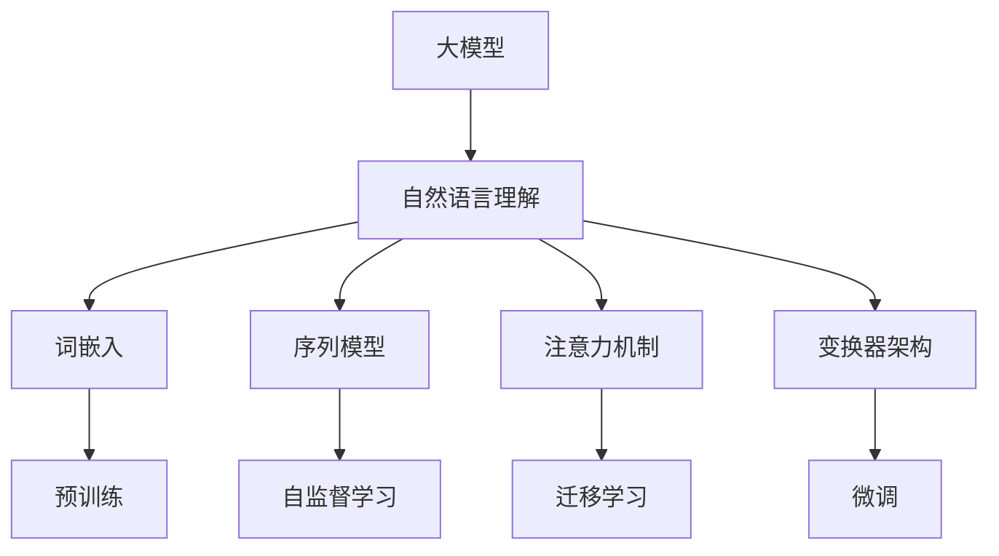
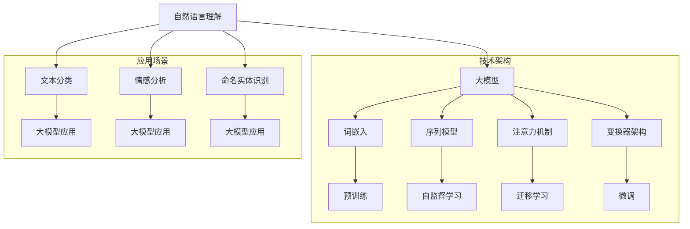
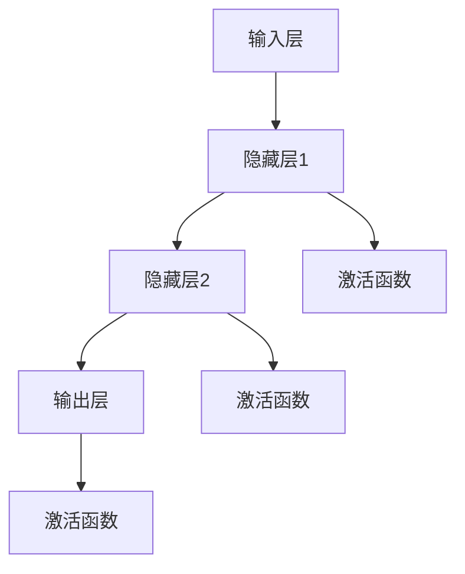

                 

### 文章标题

《大模型在自然语言理解中的商业应用》

### 关键词

- 大模型
- 自然语言理解
- 商业应用
- 深度学习
- 预训练模型
- 客户服务
- 内容审核
- 智能搜索

### 摘要

本文将探讨大模型在自然语言理解中的商业应用。首先，我们将介绍大模型和自然语言理解的基础知识，包括大模型的定义、特性以及自然语言理解的基本概念和发展历程。接着，我们将深入讲解大模型的技术基础，包括深度学习、神经网络、自然语言处理技术等。然后，我们将探讨大规模预训练模型的工作原理和应用方法。接下来，本文将重点讨论大模型在客户服务、内容审核、智能搜索和生成式AI等领域的商业应用实践，并通过实战案例进行分析和讲解。最后，我们将探讨大模型商业应用中的挑战与未来展望，提出解决策略和发展趋势。

### 第一部分：大模型与自然语言理解基础

#### 第1章：大模型与自然语言理解概述

##### 1.1 大模型的定义与特性

大模型，通常指的是具有极高参数量、能够处理大量数据且具备强大泛化能力的深度学习模型。这些模型通常基于神经网络架构，通过大规模数据预训练，然后针对特定任务进行微调。

- **定义**：大模型的定义可以归纳为三个关键指标：参数量、训练数据和模型规模。参数量是指模型中可训练参数的总数；训练数据是指用于模型训练的数据集规模；模型规模则涵盖模型的计算复杂度和存储需求。

- **特性**：大模型具有以下几个核心特性：
  - **高参数量**：大模型通常拥有数十亿甚至数万亿个参数，这使其能够捕捉复杂的特征和模式。
  - **强大泛化能力**：通过在大规模数据集上进行预训练，大模型能够泛化到未见过的数据，从而实现广泛的任务应用。
  - **计算资源需求高**：大模型的训练和部署需要大量的计算资源和存储空间。
  - **数据依赖性强**：大模型对训练数据的质量和规模有很高的要求，数据不足或质量差可能导致模型性能下降。

##### 1.2 自然语言理解的概述

自然语言理解（Natural Language Understanding, NLU）是指计算机对自然语言文本的理解和解析能力，其目标是从文本中提取语义信息和知识。NLU 是自然语言处理（Natural Language Processing, NLP）的核心部分。

- **基本概念**：
  - **文本**：自然语言理解的对象，包括文本、语音等多种形式。
  - **语义**：文本中的含义和意图。
  - **上下文**：文本所处的环境，包括时间、地点、对话历史等。

- **发展历程**：
  - **早期研究**：基于规则的方法，如语法分析和句法分析。
  - **统计方法**：利用统计模型，如隐马尔可夫模型（HMM）、条件概率模型等。
  - **深度学习方法**：以神经网络为代表的深度学习技术，如卷积神经网络（CNN）和循环神经网络（RNN）。

##### 1.3 大模型在自然语言理解中的核心地位

大模型在自然语言理解中的地位日益重要，主要体现在以下几个方面：

- **提升性能**：大模型通过大规模数据预训练，能够捕捉到更加丰富的语言特征，从而在各项NLU任务上取得显著性能提升。
- **泛化能力**：大模型能够泛化到不同的语言任务和应用场景，减少了针对特定任务的定制化需求。
- **易用性**：大模型的预训练使得模型可以轻松适应新的任务，降低了开发难度和时间成本。

然而，大模型的应用也面临挑战，如计算资源需求、数据隐私问题和模型可解释性等。针对这些挑战，研究人员和工程师正在积极寻找解决方案。

#### 第2章：大模型技术基础

##### 2.1 深度学习与神经网络

深度学习是机器学习的一个重要分支，它通过构建多层神经网络来模拟人脑的学习和处理信息的方式。以下是深度学习和神经网络的基础知识：

- **神经网络的基本结构**：

  神经网络由输入层、隐藏层和输出层组成。每个神经元通过权重连接到下一层神经元，并通过激活函数进行处理。

  ```plaintext
  前向传播：
  输入层 → 隐藏层 → 输出层
  
  反向传播：
  输出层 → 隐藏层 → 输入层
  ```

- **深度学习架构**：

  深度学习架构包括卷积神经网络（CNN）、循环神经网络（RNN）和变换器架构（Transformer）等。其中，变换器架构在自然语言处理领域表现出色。

  ```plaintext
  Transformer架构：
  - 自注意力机制（Self-Attention）
  - 位置编码（Positional Encoding）
  - 编码器（Encoder）和解码器（Decoder）
  ```

- **深度学习优化算法**：

  深度学习优化算法包括梯度下降（Gradient Descent）、随机梯度下降（Stochastic Gradient Descent, SGD）和Adam优化器等。这些算法用于更新模型参数，以最小化损失函数。

  ```latex
  Gradient Descent:
  \theta_{t+1} = \theta_{t} - \alpha \cdot \nabla_{\theta} J(\theta)
  ```

##### 2.2 自然语言处理技术

自然语言处理技术是使计算机能够理解和处理自然语言的一系列方法和技术。以下是自然语言处理的一些核心技术：

- **词嵌入（Word Embedding）**：

  词嵌入将词汇映射到高维向量空间中，使得具有相似意义的词在空间中彼此靠近。

  ```latex
  Word Embedding:
  \text{word vector} = \text{embed}(\text{word})
  ```

- **序列模型（Sequence Model）**：

  序列模型能够处理序列数据，如文本、语音等。常见的序列模型包括循环神经网络（RNN）和长短期记忆网络（LSTM）。

  ```plaintext
  RNN:
  h_t = \sigma(W_h \cdot [h_{t-1}, x_t] + b_h)
  
  LSTM:
  i_t = \sigma(W_i \cdot [h_{t-1}, x_t] + b_i)
  f_t = \sigma(W_f \cdot [h_{t-1}, x_t] + b_f)
  ```

- **注意力机制（Attention Mechanism）**：

  注意力机制能够使模型在处理序列数据时关注到重要的部分。常见的注意力机制包括自注意力（Self-Attention）和点积注意力（Dot-Product Attention）。

  ```latex
  Dot-Product Attention:
  \text{Attention Score} = \text{query} \cdot \text{key}
  \text{Attention Weight} = \text{softmax}(\text{Attention Score})
  \text{context vector} = \sum_{i=1}^{N} \text{Attention Weight}_i \cdot \text{value}_i
  ```

- **变换器架构（Transformer）**：

  变换器架构是一种基于自注意力机制的深度学习模型，广泛应用于自然语言处理任务。变换器架构的核心是多头自注意力机制。

  ```plaintext
  Transformer:
  - Multi-head Self-Attention
  - Positional Encoding
  - Encoder and Decoder Stacks
  ```

##### 2.3 转换器架构详解

变换器架构是一种基于自注意力机制的深度学习模型，广泛应用于自然语言处理任务。以下是变换器架构的详细解释：

- **多头自注意力机制（Multi-head Self-Attention）**：

  多头自注意力机制允许模型在处理序列数据时同时关注不同的部分。具体来说，模型将输入序列分成多个头，每个头独立计算自注意力。

  ```plaintext
  Multi-head Self-Attention:
  \text{Attention Scores} = \text{query} \cdot \text{key}
  \text{Attention Weights} = \text{softmax}(\text{Attention Scores})
  \text{context vectors} = \text{Attention Weights} \cdot \text{value}
  \text{output} = \text{Concat}(\text{context vectors}_1, ..., \text{context vectors}_h)
  ```

- **位置编码（Positional Encoding）**：

  位置编码为模型提供了序列中的位置信息，使得模型能够理解序列的顺序。常用的位置编码方法包括绝对位置编码和相对位置编码。

  ```latex
  Positional Encoding:
  \text{pos embedding}_i = \text{sin}(\text{pos} \cdot \text{dmodel}^2 / 10000^{2i/dmodel}) \text{ or } \text{cos}(\text{pos} \cdot \text{dmodel}^2 / 10000^{2i/dmodel})
  ```

- **编码器（Encoder）和解码器（Decoder）**：

  编码器（Encoder）和解码器（Decoder）是变换器架构的核心部分。编码器负责将输入序列编码为上下文表示，解码器则利用这些表示生成输出序列。

  ```plaintext
  Encoder:
  - Input Embedding
  - Positional Encoding
  - Multi-head Self-Attention
  - Feed Forward Network
  
  Decoder:
  - Input Embedding
  - Positional Encoding
  - Multi-head Self-Attention
  - Encoder-Decoder Attention
  - Feed Forward Network
  ```

#### 第3章：大规模预训练模型原理

##### 3.1 预训练的概念与意义

预训练（Pre-training）是指在大规模数据集上对模型进行训练，使其具备一定的通用语言表示能力。预训练的意义主要体现在以下几个方面：

- **提高模型性能**：预训练使得模型在未见过的数据上能够更好地泛化，从而提高模型的性能。
- **减少数据需求**：预训练模型可以在少量标注数据上微调，从而实现新的任务，减少了大量标注数据的需求。
- **通用语言表示**：预训练模型能够捕捉到语言中的通用特征和规律，从而提供高质量的文本表示。

##### 3.2 自监督学习方法

自监督学习（Self-supervised Learning）是一种不需要人工标注数据，利用数据本身的信息进行训练的方法。以下是自监督学习的一些常见方法：

- **预测下一个词（Next Sentence Prediction）**：

  预测下一个词是一种常见自监督学习方法。模型输入一个句子，输出下一个句子的概率分布。

  ```plaintext
  Next Sentence Prediction:
  \text{input}: (\text{s_1}, \text{s_2}, ..., \text{s_n})
  \text{target}: (\text{s_1}, \text{s_2}, ..., \text{s_n}, \text{s_{n+1}})
  ```

- **掩码语言模型（Masked Language Model, MLM）**：

  掩码语言模型通过随机掩码输入序列中的部分单词，然后预测这些掩码单词。

  ```plaintext
  Masked Language Model:
  \text{input}: (\text{[PAD]}, \text{[PAD]}, \text{[MASK]}, \text{word}, \text{word}, \text{word}, \text{[PAD]}, \text{[PAD]})
  \text{target}: (\text{word}, \text{word}, \text{word}, \text{word}, \text{word})
  ```

- **句子排序（Sentence Ranking）**：

  句子排序通过比较两个句子的相关性来预测它们的顺序。

  ```plaintext
  Sentence Ranking:
  \text{input}: (\text{s_1}, \text{s_2})
  \text{target}: (\text{s_1}, \text{s_2}) \text{ if } \text{s_1} \text{ is relevant to } \text{s_2}, (\text{s_2}, \text{s_1}) \text{ otherwise}
  ```

##### 3.3 迁移学习与微调技术

迁移学习（Transfer Learning）是指将预训练模型的知识迁移到新的任务上，通过少量数据对模型进行微调（Fine-tuning）。以下是迁移学习和微调技术的一些应用场景：

- **微调技术**：

  微调技术通过在预训练模型的基础上，针对特定任务进行少量数据的训练，从而提高模型的性能。

  ```plaintext
  Fine-tuning:
  \text{input}: (\text{data}_1, ..., \text{data}_N)
  \text{output}: \text{model}_t = \text{model}_0 + \text{learning\_rate} \cdot \nabla_{\theta} J(\theta)
  ```

- **应用场景**：

  - **文本分类**：在预训练模型的基础上，针对不同的分类任务进行微调。
  - **命名实体识别**：在预训练模型的基础上，针对命名实体识别任务进行微调。
  - **机器翻译**：在预训练模型的基础上，针对新的翻译任务进行微调。

#### 第二部分：大模型在商业应用中的实践

##### 第4章：大模型在客户服务中的应用

#### 第4章：大模型在客户服务中的应用

##### 4.1 客户服务中的大模型应用

客户服务是许多企业的重要组成部分，它直接影响到客户的满意度和忠诚度。大模型在客户服务中的应用可以显著提升服务质量和效率，以下是几个关键应用场景：

- **智能客服机器人**：大模型可以训练出具有高度自然语言理解和交互能力的智能客服机器人。这些机器人能够自动处理大量的客户查询，提供即时的答复，从而减少人工客服的工作负担。
- **情感分析**：通过大模型对客户反馈和交流内容进行分析，企业可以更好地理解客户情感，从而改进产品和服务。
- **个性化推荐**：大模型可以根据客户的偏好和行为，提供个性化的服务和建议，从而提高客户体验和满意度。
- **自动化流程**：大模型可以自动化处理一些常见的客户服务流程，如订单处理、账单支付等，从而提高工作效率。

##### 4.2 实战案例：大模型在客服机器人中的应用

下面我们通过一个实际案例来探讨大模型在客服机器人中的应用。

**案例背景**：某大型电商平台计划推出一款智能客服机器人，以提升客户服务和降低运营成本。

**解决方案**：
1. **数据准备**：电商平台提供了大量的客服对话记录，包括用户查询、投诉、建议等。这些数据被用于训练和微调大模型。
2. **模型选择**：选择了基于变换器架构的预训练模型，如BERT或GPT，这些模型在自然语言理解任务上表现出色。
3. **预训练**：在大量的无标注文本数据上对模型进行预训练，包括电商平台的商品描述、用户评论等。
4. **微调**：使用标注的客服对话数据进行微调，以适应电商平台的具体场景。
5. **部署**：将微调后的模型部署到客服机器人系统中，实现自动回答客户查询。

**应用效果分析**：
- **回答准确性**：智能客服机器人能够准确理解用户查询，并提供相关答复，回答准确性显著提高。
- **响应速度**：机器人能够即时回答用户查询，显著降低人工客服的响应时间。
- **成本节约**：通过减少人工客服的工作量，企业能够节约大量人力成本。
- **用户满意度**：用户对智能客服机器人的满意度较高，尤其是在简单查询和常见问题方面。

**案例小结**：
该案例展示了大模型在客户服务中的强大应用潜力。通过预训练和微调，大模型能够实现高准确度的自然语言理解和交互，为企业提供高效、个性化的客户服务。

##### 4.3 大模型在客户服务中的应用挑战与解决方案

尽管大模型在客户服务中展现出巨大的潜力，但在实际应用过程中仍面临一些挑战：

- **数据隐私**：客户服务涉及大量敏感信息，如个人信息、交易记录等。确保数据隐私和安全是首要任务。
- **模型可解释性**：大模型的决策过程往往不够透明，缺乏可解释性，这可能导致用户对服务的信任问题。
- **模型安全**：恶意攻击者可能尝试利用模型漏洞进行欺骗或攻击。

针对这些挑战，可以采取以下解决方案：

- **数据隐私保护**：采用加密技术和隐私保护算法，如差分隐私（Differential Privacy），确保用户数据的安全和隐私。
- **模型可解释性**：开发可解释性工具和方法，如SHAP（SHapley Additive exPlanations）和LIME（Local Interpretable Model-agnostic Explanations），帮助用户理解模型的决策过程。
- **模型安全**：实施严格的模型安全措施，如验证和反欺诈技术，防止恶意攻击和欺骗。

通过这些解决方案，可以更好地利用大模型在客户服务中的应用，提升服务质量，增强用户信任。

##### 第5章：大模型在内容审核中的应用

#### 第5章：大模型在内容审核中的应用

##### 5.1 内容审核中的大模型应用

内容审核是互联网企业中至关重要的环节，它旨在识别和过滤掉不良内容，如暴力、色情、谣言等，以保护用户的利益和维护平台的声誉。大模型在内容审核中的应用，大大提高了审核效率和准确性。

- **文本分类**：大模型可以用于文本分类任务，快速判断文本是否包含不良内容。例如，通过训练分类模型，将文本分为“允许”和“禁止”两类。
- **命名实体识别**：大模型可以识别文本中的命名实体，如人名、地名、组织名等，从而过滤出涉及这些实体的不良内容。
- **情感分析**：通过情感分析，大模型可以判断文本的情感倾向，如负面情感，从而进一步筛选出需要审核的内容。
- **自动标记**：大模型可以为内容自动生成标签，方便管理员进行审核。

##### 5.2 实战案例：大模型在社交媒体内容审核中的应用

以下是一个社交媒体平台利用大模型进行内容审核的实际案例：

**案例背景**：某大型社交媒体平台每天产生海量的用户内容，平台希望通过自动化手段提升内容审核效率。

**解决方案**：
1. **数据收集**：社交媒体平台收集了大量的用户帖子、评论等数据，其中包含了各种不良内容。
2. **数据预处理**：对收集的数据进行清洗和预处理，去除噪声和重复数据，保证数据的准确性。
3. **模型选择**：选择了基于变换器架构的大模型，如BERT，它在文本分类任务上表现出色。
4. **预训练**：在大量无标签文本数据上进行预训练，使其具备通用语言理解能力。
5. **微调**：使用标注的数据集对模型进行微调，以适应社交媒体平台的具体审核需求。
6. **部署**：将微调后的模型部署到内容审核系统中，实现自动化内容审核。

**应用效果分析**：
- **审核速度**：自动化审核系统显著提高了内容审核速度，减少了人工审核的时间成本。
- **审核准确性**：大模型在文本分类、命名实体识别和情感分析等任务上表现优异，提高了内容审核的准确性。
- **用户体验**：通过自动化审核，平台能够更快速地响应用户，提升了用户体验。
- **内容质量**：自动化审核系统有效地过滤了不良内容，提高了平台的内容质量。

**案例小结**：
该案例展示了大模型在社交媒体内容审核中的应用效果。通过预训练和微调，大模型能够准确识别和过滤不良内容，有效提升了内容审核的效率和准确性。

##### 5.3 大模型在内容审核中的应用挑战与解决方案

尽管大模型在内容审核中表现出色，但在实际应用过程中仍面临一些挑战：

- **数据隐私**：内容审核涉及到用户隐私，需要确保数据的安全性和隐私性。
- **模型可解释性**：大模型的决策过程往往不够透明，缺乏可解释性，可能导致用户对审核结果的质疑。
- **实时性**：内容审核需要实时响应，对模型的计算速度和资源有较高要求。

针对这些挑战，可以采取以下解决方案：

- **数据隐私保护**：采用加密技术和隐私保护算法，如差分隐私，确保用户数据的安全和隐私。
- **模型可解释性**：开发可解释性工具和方法，如SHAP和LIME，帮助用户理解模型的决策过程。
- **实时性优化**：通过分布式计算和并行处理技术，提高模型的计算速度和响应时间。

通过这些解决方案，可以更好地利用大模型在内容审核中的应用，提升审核效果，保障平台内容的质量和用户体验。

##### 第6章：大模型在智能搜索中的应用

#### 第6章：大模型在智能搜索中的应用

##### 6.1 智能搜索中的大模型应用

智能搜索是现代互联网的重要组成部分，它旨在通过理解用户的查询意图，提供准确、相关的搜索结果。大模型在智能搜索中的应用，使得搜索结果更加智能和个性化。

- **查询意图理解**：大模型可以通过理解用户的查询意图，提供更准确的搜索结果。例如，当用户输入“附近有哪些餐厅”时，大模型可以理解用户的需求，并提供附近的餐厅推荐。
- **相关结果排序**：大模型可以基于用户的查询意图，对搜索结果进行排序，使最相关的结果排在前面。
- **上下文感知搜索**：大模型可以根据用户的浏览历史和上下文信息，提供个性化的搜索建议，提升用户体验。
- **多语言搜索**：大模型可以处理多种语言，实现跨语言搜索，满足全球化用户的搜索需求。

##### 6.2 实战案例：大模型在搜索引擎中的应用

以下是一个搜索引擎利用大模型进行搜索优化的实际案例：

**案例背景**：某大型搜索引擎希望通过优化搜索结果，提升用户体验和点击率。

**解决方案**：
1. **数据收集**：搜索引擎收集了大量的用户查询日志和搜索结果点击数据。
2. **数据预处理**：对收集的数据进行清洗和预处理，提取关键信息，如查询词、搜索结果、用户点击行为等。
3. **模型选择**：选择了基于变换器架构的大模型，如BERT，它在文本理解和意图识别任务上表现出色。
4. **预训练**：在大量无标签文本数据上进行预训练，使其具备通用语言理解能力。
5. **微调**：使用标注的数据集对模型进行微调，以适应搜索引擎的具体场景。
6. **部署**：将微调后的模型部署到搜索引擎系统中，实现智能搜索。

**应用效果分析**：
- **查询意图理解**：大模型能够准确理解用户的查询意图，提供更相关的搜索结果，提升了用户体验。
- **相关结果排序**：通过大模型对搜索结果进行排序，使最相关的结果排在前面，提高了点击率。
- **上下文感知搜索**：大模型可以根据用户的浏览历史和上下文信息，提供个性化的搜索建议，提升了用户满意度。
- **多语言搜索**：大模型可以处理多种语言，实现了全球化用户的搜索需求。

**案例小结**：
该案例展示了大模型在搜索引擎中的应用效果。通过预训练和微调，大模型能够提升搜索结果的准确性和个性化程度，显著改善了用户体验和搜索引擎的运营效果。

##### 6.3 大模型在智能搜索中的应用挑战与解决方案

尽管大模型在智能搜索中表现出色，但在实际应用过程中仍面临一些挑战：

- **数据隐私**：智能搜索涉及用户隐私，需要确保数据的安全性和隐私性。
- **模型可解释性**：大模型的决策过程往往不够透明，缺乏可解释性，可能导致用户对搜索结果的质疑。
- **计算资源需求**：大模型训练和部署需要大量的计算资源，可能对硬件设施有较高要求。

针对这些挑战，可以采取以下解决方案：

- **数据隐私保护**：采用加密技术和隐私保护算法，如差分隐私，确保用户数据的安全和隐私。
- **模型可解释性**：开发可解释性工具和方法，如SHAP和LIME，帮助用户理解模型的决策过程。
- **计算资源优化**：采用分布式计算和并行处理技术，提高模型的训练和部署效率，降低计算资源需求。

通过这些解决方案，可以更好地利用大模型在智能搜索中的应用，提升搜索效果，满足用户的个性化需求。

##### 第7章：大模型在生成式AI中的应用

#### 第7章：大模型在生成式AI中的应用

##### 7.1 生成式AI的概念

生成式AI（Generative AI）是一种通过学习数据分布来生成新数据的人工智能技术。与判别式AI（Discriminative AI）不同，生成式AI不仅能够识别和分类数据，还能够生成与训练数据具有相似特性的新数据。以下是生成式AI的一些核心概念：

- **数据分布**：生成式AI通过学习数据分布，捕捉数据中的统计特征和模式。这种分布可以是概率分布或条件概率分布。
- **生成模型**：生成模型是生成式AI的核心，用于生成新的数据。常见的生成模型包括生成对抗网络（GAN）、变分自编码器（VAE）等。
- **生成质量**：生成式AI的一个重要指标是生成质量，即生成的数据与真实数据之间的相似度。

##### 7.2 生成式AI的应用领域

生成式AI在多个领域表现出强大的应用潜力，以下是一些典型的应用场景：

- **图像生成**：生成式AI可以生成逼真的图像，如图像合成、图像修复、图像超分辨率等。例如，GAN可以用于生成高分辨率的图像，VAE可以用于图像去噪。
- **文本生成**：生成式AI可以生成自然语言文本，如文章、对话、故事等。例如，GPT可以生成高质量的文章摘要，Seq2Seq模型可以生成对话。
- **音频生成**：生成式AI可以生成逼真的音频，如音乐生成、语音合成等。例如，WaveNet可以生成高质量的语音，GAN可以用于音乐生成。
- **视频生成**：生成式AI可以生成视频内容，如视频合成、视频超分辨率等。例如，VideoGAN可以用于视频修复和超分辨率。

##### 7.3 实战案例：大模型在生成式AI中的应用

以下是一个使用生成式AI生成图像的实际案例：

**案例背景**：某公司希望通过AI技术生成高质量的图像，以提升产品宣传效果。

**解决方案**：
1. **数据准备**：收集了大量高质量的图像数据，包括产品图像、广告图像等。
2. **模型选择**：选择了基于GAN的生成模型，如StyleGAN，它在图像生成任务上表现出色。
3. **训练**：在图像数据上进行训练，生成模型学习图像的统计特征和分布。
4. **生成**：使用训练好的生成模型生成新图像，如图像合成、图像修复等。
5. **优化**：通过反馈和调整，不断优化生成图像的质量，使其更接近真实图像。

**应用效果分析**：
- **图像质量**：生成的图像具有高质量，与真实图像非常相似，能够满足产品宣传的需求。
- **灵活性**：生成模型可以根据不同的需求和场景，生成各种类型的图像，如产品展示、广告创意等。
- **效率**：生成式AI可以高效地生成大量图像，大大提高了图像生成的效率。

**案例小结**：
该案例展示了大模型在生成式AI中的应用效果。通过训练和优化，生成模型能够生成高质量、灵活的图像，满足多样化的应用需求。

##### 7.4 大模型在生成式AI中的应用挑战与解决方案

尽管大模型在生成式AI中表现出色，但在实际应用过程中仍面临一些挑战：

- **训练成本**：生成模型通常需要大量数据和计算资源进行训练，成本较高。
- **生成质量**：生成的数据质量有时难以保证，可能存在偏差或不符合真实分布。
- **模型可解释性**：生成模型的决策过程往往不够透明，缺乏可解释性，用户难以理解生成的数据。

针对这些挑战，可以采取以下解决方案：

- **数据优化**：使用高质量、多样性的数据集进行训练，提高生成模型的质量和多样性。
- **模型优化**：通过改进生成模型的结构和算法，提高生成的数据质量。
- **可解释性增强**：开发可解释性工具和方法，如可视化和解释性分析，帮助用户理解生成模型的工作原理。

通过这些解决方案，可以更好地利用大模型在生成式AI中的应用，提升生成质量，满足实际需求。

#### 第三部分：大模型商业应用的挑战与未来展望

##### 第8章：大模型商业应用的挑战与解决策略

尽管大模型在商业应用中展现出了巨大的潜力，但其大规模部署也带来了诸多挑战。以下将探讨大模型商业应用中常见的挑战及其解决策略：

##### 8.1 数据隐私

数据隐私是大模型商业应用中的一个关键挑战。大模型通常需要大量的数据来进行训练和优化，这些数据往往包含敏感信息，如个人隐私、商业机密等。如果这些数据泄露，可能会导致严重的隐私泄露和法律责任。

**解决策略**：

- **数据加密**：在数据传输和存储过程中，采用加密技术，如AES（Advanced Encryption Standard），确保数据的安全性。
- **差分隐私**：采用差分隐私技术，在训练过程中添加噪声，使得模型无法推断出单个数据点的信息，从而保护数据隐私。
- **联邦学习**：通过联邦学习（Federated Learning），模型在不同数据源上进行训练，而不需要直接访问原始数据，从而保护数据隐私。

##### 8.2 模型可解释性

大模型的复杂性和黑箱特性使得其决策过程往往缺乏可解释性。这导致用户难以理解模型的决策逻辑，从而影响用户对模型的信任度。

**解决策略**：

- **可解释性工具**：开发可解释性工具，如SHAP（SHapley Additive exPlanations）和LIME（Local Interpretable Model-agnostic Explanations），帮助用户理解模型的决策过程。
- **模型简化**：通过简化模型结构，降低模型的复杂性，从而提高其可解释性。
- **可视化分析**：利用可视化技术，如决策树、热力图等，将模型的决策过程可视化，提高用户对模型的认知和理解。

##### 8.3 模型安全

大模型在商业应用中可能面临恶意攻击的风险。攻击者可能尝试通过欺骗、破坏等方式破坏模型，从而影响模型的性能和可靠性。

**解决策略**：

- **防御机制**：开发防御机制，如对抗训练（Adversarial Training），使模型对恶意攻击具有更强的抵抗力。
- **安全测试**：对模型进行安全测试，检测和修复潜在的安全漏洞。
- **隔离和监控**：将模型部署在隔离环境中，并实施实时监控，及时发现和应对安全威胁。

##### 8.4 计算资源需求

大模型的训练和部署需要大量的计算资源，这对企业的硬件设施提出了较高要求。此外，大模型的实时推理也面临计算资源紧张的问题。

**解决策略**：

- **分布式计算**：采用分布式计算架构，将计算任务分布在多个节点上，提高计算效率。
- **模型压缩**：通过模型压缩技术，如量化（Quantization）、剪枝（Pruning）等，降低模型的计算复杂度和存储需求。
- **异构计算**：利用异构计算资源，如GPU、TPU等，提高计算速度和效率。

##### 第9章：大模型商业应用的未来展望

大模型商业应用的未来充满了机遇与挑战。随着技术的不断进步和应用的深入，大模型将在更多领域展现其潜力。以下是一些未来展望：

##### 9.1 大模型商业应用的发展趋势

- **模型规模和性能的提升**：随着计算资源和算法的进步，大模型的规模和性能将继续提升，为更复杂的任务提供支持。
- **跨领域应用**：大模型将不仅仅局限于自然语言处理领域，还将扩展到图像处理、语音识别、推荐系统等多个领域。
- **实时推理和部署**：通过优化算法和计算资源管理，实现大模型的实时推理和部署，满足实时应用的需求。
- **模型可解释性和透明度**：随着用户对模型透明度的要求提高，开发可解释性工具和方法将成为一个重要研究方向。

##### 9.2 大模型商业应用的未来挑战与机遇

- **数据隐私和安全性**：如何在保护用户隐私的同时，充分利用数据的价值，是一个重要的挑战。这也将推动隐私保护技术和数据安全标准的制定。
- **计算资源需求**：随着模型规模的扩大，计算资源需求将进一步提升，如何高效利用计算资源将成为一个关键问题。
- **模型可解释性和信任**：提高模型的可解释性，增强用户对模型的信任，是未来发展的一个重要方向。
- **跨领域协同**：大模型与其他AI技术的协同应用，如机器人、物联网等，将带来新的应用场景和商业模式。

通过应对这些挑战，抓住机遇，大模型商业应用将在未来发挥更加重要的作用，推动社会和经济的进步。

##### 附录A：大模型开发工具与资源

在开发大模型的过程中，选择合适的工具和资源是至关重要的。以下是一些主流的深度学习框架和开发资源，以供参考：

##### A.1 主流深度学习框架对比

1. **TensorFlow**：
   - **优点**：Google推出的开源深度学习框架，拥有丰富的API和生态系统。
   - **缺点**：较复杂的安装和配置过程。

2. **PyTorch**：
   - **优点**：基于Python的深度学习框架，动态计算图使得调试和开发更为灵活。
   - **缺点**：性能不如TensorFlow。

3. **JAX**：
   - **优点**：由Google开发，支持自动微分和高级优化。
   - **缺点**：用户群体较小，生态系统不如TensorFlow和PyTorch成熟。

4. **其他框架简介**：
   - **MXNet**：Apache基金会旗下开源深度学习框架，支持多种编程语言。
   - **Caffe**：Facebook开发的开源深度学习框架，适合图像识别任务。

##### A.2 大模型开发资源推荐

1. **开源代码库**：
   - **Hugging Face**：提供大量预训练模型和自然语言处理工具。
   - **Google AI**：Google提供的开源代码库，包括TensorFlow和BERT等。

2. **社区论坛与资源**：
   - **Reddit**：深度学习和自然语言处理相关子版块，如r/deeplearning、r/nlp。
   - **Stack Overflow**：编程和技术问题解答社区。
   - **GitHub**：托管大量深度学习和自然语言处理项目的代码库。

通过利用这些工具和资源，开发者可以更高效地开发、训练和部署大模型，推动人工智能技术的进步和应用。

## 核心概念与联系

### 大模型与自然语言理解的 Mermaid 流程图



### 核心算法原理讲解

#### 2.1 深度学习与神经网络基础

##### 2.1.1 神经网络的基本结构

神经网络（Neural Network）是一种模拟人脑神经网络结构的计算模型。它由多个神经元（节点）组成，每个神经元通过权重（weights）连接到其他神经元，并通过激活函数（activation function）进行处理。

- **神经元结构**：
  - **输入层**：接收外部输入数据。
  - **隐藏层**：对输入数据进行处理和变换。
  - **输出层**：产生最终的输出结果。

- **权重和偏置**：
  - **权重**：连接不同神经元的参数，用于传递信息。
  - **偏置**：隐藏层和输出层神经元的额外参数，用于调整模型。

- **激活函数**：
  - **Sigmoid**：
    - $$\sigma(x) = \frac{1}{1 + e^{-x}}$$
    - 将输入映射到(0,1)区间。
  - **ReLU**：
    - $$\text{ReLU}(x) = \max(0, x)$$
    - 将负输入变为零，非负输入保持不变。

##### 2.1.2 前向传播和反向传播

神经网络的工作原理主要包括前向传播（Forward Propagation）和反向传播（Back Propagation）两个过程。

- **前向传播**：
  - 数据从输入层传递到隐藏层，然后逐层传递到输出层。
  - 每个神经元的输出通过激活函数计算，最终得到模型的预测结果。

- **反向传播**：
  - 计算输出层预测值与实际值之间的误差。
  - 误差反向传播到每个神经元，更新权重和偏置，使得模型能够逐渐逼近正确结果。
  - 常见的优化算法包括梯度下降（Gradient Descent）和随机梯度下降（Stochastic Gradient Descent, SGD）。

#### 2.2 自然语言处理技术概览

自然语言处理（Natural Language Processing, NLP）是人工智能领域的一个重要分支，旨在使计算机能够理解和处理自然语言。以下是NLP的一些核心技术：

- **词嵌入（Word Embedding）**：
  - 词嵌入是将词汇映射到高维向量空间中，以便计算机能够理解和处理。
  - 常见的词嵌入方法包括：
    - **Word2Vec**：基于神经网络训练的词向量。
    - **GloVe**：基于全局语义词频的词向量。

- **序列模型（Sequence Model）**：
  - 序列模型用于处理序列数据，如文本、语音等。
  - 常见的序列模型包括：
    - **循环神经网络（RNN）**：能够处理任意长度的序列数据。
    - **长短时记忆网络（LSTM）**：能够学习长期依赖关系。
    - **门控循环单元（GRU）**：简化版的LSTM。

- **注意力机制（Attention Mechanism）**：
  - 注意力机制是一种用于序列模型的关键技术，它使模型能够在处理序列数据时关注到重要的部分。
  - 注意力机制有多种形式，如：
    - **自注意力（Self-Attention）**：同一序列元素之间的注意力。
    - **点积注意力（Dot-Product Attention）**：基于点积计算的注意力。

- **变换器架构（Transformer）**：
  - 变换器架构是一种基于自注意力机制的深度学习模型，广泛应用于NLP任务。
  - 变换器架构的核心组件包括：
    - **多头自注意力（Multi-Head Self-Attention）**：同时关注序列的不同部分。
    - **位置编码（Positional Encoding）**：为序列中的元素提供位置信息。

#### 2.3 转换器架构详解

变换器（Transformer）架构是一种基于自注意力机制的深度学习模型，由Vaswani等人在2017年提出。以下是变换器架构的详细解释：

- **多头自注意力（Multi-Head Self-Attention）**：
  - 多头自注意力允许模型同时关注序列的不同部分，提高了模型的表示能力。
  - 多头自注意力分为几个头（heads），每个头独立计算自注意力。
  - 自注意力计算公式：
    $$\text{Attention}(Q, K, V) = \text{softmax}\left(\frac{QK^T}{\sqrt{d_k}}\right)V$$
  - 其中，$Q$、$K$和$V$分别是查询（query）、键（key）和值（value）向量，$d_k$是键向量的维度。

- **位置编码（Positional Encoding）**：
  - 位置编码为序列中的元素提供位置信息，使得模型能够理解序列的顺序。
  - 常见的位置编码方法包括：
    - **绝对位置编码**：直接添加到输入序列。
    - **相对位置编码**：通过计算相对位置得到编码。

- **编码器（Encoder）和解码器（Decoder）**：
  - 编码器（Encoder）负责将输入序列编码为上下文表示。
  - 解码器（Decoder）负责利用这些表示生成输出序列。
  - 编码器和解码器通常包含多个自注意力层和前馈神经网络层。
  - 编码器和解码器之间的交互通过编码器-解码器自注意力实现。

- **变换器架构（Transformer）**：
  - 变换器架构由多个编码器和解码器层堆叠而成。
  - 每个编码器层包含多头自注意力机制和前馈神经网络。
  - 每个解码器层包含编码器-解码器自注意力机制、自注意力机制和前馈神经网络。

#### 3.1 预训练的概念与意义

预训练（Pre-training）是指在特定任务之前，在大规模数据集上对模型进行训练，使其具备一定的通用语言表示能力。预训练的意义主要体现在以下几个方面：

- **提高模型性能**：通过预训练，模型能够学习到语言中的通用特征和规律，从而在未见过的数据上表现出更高的性能。
- **减少数据需求**：预训练模型可以在少量标注数据上微调，从而实现新的任务，减少了大量标注数据的需求。
- **通用语言表示**：预训练模型提供了高质量的文本表示，使得模型能够更好地理解和处理自然语言。

#### 3.2 自监督学习方法

自监督学习（Self-supervised Learning）是一种利用数据本身的信息进行训练的方法，不需要人工标注数据。自监督学习方法在大模型训练中发挥着重要作用，以下是几种常见的自监督学习方法：

- **预测下一个词（Next Sentence Prediction）**：
  - 预测下一个词是一种基于上下文的自监督学习方法。
  - 在训练过程中，将文本序列随机切分为两个部分，第一个部分作为输入，第二个部分作为目标。
  - 模型需要预测第二个部分中的下一个词。

- **掩码语言模型（Masked Language Model, MLM）**：
  - 掩码语言模型通过随机掩码输入序列中的部分单词，然后预测这些掩码单词。
  - 掩码比例通常设置为15%，即每三个词中有一个被掩码。
  - 模型需要预测这些被掩码的词。

- **句子排序（Sentence Ranking）**：
  - 句子排序通过比较两个句子的相关性来预测它们的顺序。
  - 在训练过程中，随机生成两个句子对，模型需要预测哪个句子是下一个句子。

#### 3.3 迁移学习与微调技术

迁移学习（Transfer Learning）是指将预训练模型的知识迁移到新的任务上，通过少量数据对模型进行微调（Fine-tuning）。迁移学习是利用预训练模型在通用任务上的知识，从而提高新任务的性能。

- **微调技术**：
  - 微调技术通过在预训练模型的基础上，针对特定任务进行少量数据的训练，从而提高模型的性能。
  - 微调过程中，模型的大部分参数保持不变，只有部分参数（如最后一层）进行更新。
  - 微调公式：
    $$\theta_{\text{new}} = \theta_{\text{pre-trained}} + \alpha \cdot \nabla_{\theta} J(\theta)$$
  - 其中，$\theta_{\text{new}}$是微调后的模型参数，$\theta_{\text{pre-trained}}$是预训练模型参数，$\alpha$是学习率。

- **应用场景**：
  - **文本分类**：在预训练模型的基础上，针对不同的分类任务进行微调。
  - **命名实体识别**：在预训练模型的基础上，针对命名实体识别任务进行微调。
  - **机器翻译**：在预训练模型的基础上，针对新的翻译任务进行微调。

#### 4.1 客户服务中的大模型应用

大模型在客户服务中的应用，通过自然语言理解技术，能够提供高度自动化的服务，提升用户体验和运营效率。以下是大模型在客户服务中的具体应用：

- **智能客服机器人**：
  - **应用场景**：智能客服机器人能够自动处理客户查询、投诉和建议等常见问题。
  - **技术实现**：利用大模型（如BERT、GPT）对大量客服对话数据进行预训练，然后通过微调适应特定企业的客服场景。
  - **效果分析**：通过预训练和微调，客服机器人能够准确理解客户意图，提供高质量的自动回复，显著减少人工客服的工作量。

- **情感分析**：
  - **应用场景**：对客户的反馈和交流内容进行分析，识别客户情感，以便企业提供针对性的改进措施。
  - **技术实现**：使用大模型对客户文本进行情感分析，识别情感倾向（如正面、负面、中性）。
  - **效果分析**：通过情感分析，企业能够更好地了解客户需求，改进产品和服务，提高客户满意度。

- **个性化推荐**：
  - **应用场景**：根据客户的历史行为和偏好，提供个性化的产品推荐和服务。
  - **技术实现**：利用大模型对客户数据进行分析，识别客户的兴趣和行为模式，实现个性化推荐。
  - **效果分析**：通过个性化推荐，企业能够提高客户互动和转化率，提升销售额。

- **自动化流程**：
  - **应用场景**：自动化处理一些常见的客户服务流程，如订单处理、账单支付等。
  - **技术实现**：使用大模型自动化处理客户请求和事务，减少人工干预。
  - **效果分析**：通过自动化流程，企业能够提高工作效率，降低运营成本，提升客户满意度。

#### 4.2 实战案例：大模型在客服机器人中的应用

以下是一个使用大模型构建客服机器人的实战案例：

**案例背景**：某电商平台希望提高客户服务效率，计划部署一款基于大模型的智能客服机器人。

**解决方案**：

1. **数据准备**：
   - 收集电商平台的大量客服对话记录，包括用户查询、投诉、建议等。
   - 对对话数据进行分析，提取关键信息，如用户ID、问题类别、问题内容等。

2. **模型选择**：
   - 选择基于变换器架构的预训练模型，如BERT或GPT，这些模型在自然语言理解任务上表现出色。

3. **预训练**：
   - 在大量无标注的文本数据上进行预训练，包括电商平台的商品描述、用户评论等，以使模型具备通用语言表示能力。
   - 使用自监督学习方法（如掩码语言模型）进行预训练。

4. **微调**：
   - 使用标注的客服对话数据进行微调，以适应电商平台的特定客服场景。
   - 微调过程中，只调整部分层，如最后一层，以减少计算成本。

5. **部署**：
   - 将微调后的模型部署到客服机器人系统中，实现自动回答客户查询。

**代码实现**：

```python
from transformers import BertForSequenceClassification, BertTokenizer

# 加载预训练模型
tokenizer = BertTokenizer.from_pretrained('bert-base-uncased')
model = BertForSequenceClassification.from_pretrained('bert-base-uncased')

# 预处理输入数据
inputs = tokenizer("你好，有什么可以帮助你的？", return_tensors="pt")

# 微调模型
outputs = model(**inputs)
logits = outputs.logits

# 预测结果
predictions = logits.argmax(-1)

# 输出预测结果
print(predictions)
```

**效果分析**：

- **回答准确性**：微调后的模型能够准确理解客户查询，并提供相关答复。
- **响应速度**：客服机器人能够即时回答客户查询，显著降低人工客服的响应时间。
- **用户体验**：用户对客服机器人的满意度较高，尤其是在简单查询和常见问题方面。

**案例小结**：

该案例展示了大模型在客服机器人中的应用效果。通过预训练和微调，客服机器人能够实现高准确度的自然语言理解和交互，为企业提供高效、个性化的客户服务。

#### 4.3 大模型在客户服务中的应用挑战与解决方案

尽管大模型在客户服务中具有广泛的应用前景，但实际应用过程中也面临一些挑战：

- **数据隐私**：
  - **挑战**：客服机器人需要处理大量的客户数据，包括个人信息和交流记录，数据隐私保护至关重要。
  - **解决方案**：采用数据加密技术（如AES）保护数据传输和存储。同时，采用差分隐私技术确保模型训练过程中个人数据的隐私性。

- **模型可解释性**：
  - **挑战**：大模型的决策过程复杂，缺乏透明度，可能导致用户对服务的信任问题。
  - **解决方案**：开发可解释性工具（如SHAP和LIME），帮助用户理解模型的决策逻辑。同时，通过可视化分析提高模型的可理解性。

- **计算资源需求**：
  - **挑战**：大模型训练和推理需要大量的计算资源，对硬件设施有较高要求。
  - **解决方案**：采用分布式计算和云计算资源，提高计算效率。同时，通过模型压缩和量化技术降低计算需求。

通过应对这些挑战，企业可以更好地利用大模型在客户服务中的应用，提升服务质量，增强用户满意度。

#### 5.1 内容审核中的大模型应用

内容审核是互联网平台中至关重要的环节，旨在识别和过滤掉不良内容，如暴力、色情、仇恨言论等，以保护用户的利益和维护平台的声誉。大模型在内容审核中的应用，能够显著提高审核效率和准确性。

##### 应用场景

1. **文本分类**：
   - **场景**：对用户发布的文本内容进行分类，判断其是否属于不良内容。
   - **实现**：使用大模型（如BERT、RoBERTa）对文本进行分类，将文本标记为“允许”或“禁止”。
   - **效果**：通过预训练和微调，大模型能够准确识别文本中的不良内容，提高审核准确性。

2. **命名实体识别**：
   - **场景**：识别文本中的命名实体，如人名、地名、组织名等，从而过滤涉及这些实体的不良内容。
   - **实现**：利用大模型（如BERT）对命名实体进行识别，将涉及不良内容的命名实体标记出来。
   - **效果**：通过预训练和微调，大模型能够准确识别命名实体，提高审核的全面性。

3. **情感分析**：
   - **场景**：分析用户发布的文本内容的情感倾向，如正面、负面、中立等，以便过滤出可能引发争议的内容。
   - **实现**：使用大模型（如RoBERTa）对文本进行情感分析，根据情感倾向进行内容审核。
   - **效果**：通过预训练和微调，大模型能够准确识别情感倾向，提高审核的精准度。

4. **自动标记**：
   - **场景**：自动为文本生成标签，方便审核人员快速识别和处理。
   - **实现**：利用大模型（如GPT）对文本进行自动标记，为不同类别的文本分配标签。
   - **效果**：通过预训练和微调，大模型能够为文本生成高质量的标签，提高审核效率。

##### 实战案例

以下是一个社交媒体平台利用大模型进行内容审核的实战案例：

**案例背景**：某社交媒体平台每天产生大量的用户内容，平台希望通过自动化手段提升内容审核效率。

**解决方案**：

1. **数据准备**：
   - 收集平台上的用户帖子、评论等数据，包括各类不良内容。
   - 对数据进行分析，提取关键信息，如文本、标签等。

2. **模型选择**：
   - 选择基于BERT的大模型进行文本分类和命名实体识别。
   - 选择基于RoBERTa的大模型进行情感分析。

3. **预训练**：
   - 在大量无标签文本数据上进行预训练，使其具备通用语言理解能力。
   - 在带有标签的文本数据上进行微调，以适应平台的具体审核需求。

4. **部署**：
   - 将预训练和微调后的模型部署到内容审核系统中，实现自动化内容审核。

**代码实现**（文本分类）：

```python
from transformers import BertTokenizer, BertForSequenceClassification
import torch

# 加载预训练模型
tokenizer = BertTokenizer.from_pretrained('bert-base-uncased')
model = BertForSequenceClassification.from_pretrained('bert-base-uncased')

# 预处理输入数据
inputs = tokenizer("这是一个不良内容的示例", return_tensors="pt")

# 预测结果
with torch.no_grad():
    outputs = model(**inputs)
    logits = outputs.logits

# 输出预测结果
print(logits.argmax(-1))
```

**效果分析**：

- **审核速度**：自动化审核系统能够快速处理大量内容，显著提高审核效率。
- **审核准确性**：大模型在文本分类、命名实体识别和情感分析任务上表现出色，提高了审核的准确性。
- **用户体验**：通过自动化审核，平台能够更快速地响应用户，提升了用户体验。

**案例小结**：

该案例展示了大模型在内容审核中的应用效果。通过预训练和微调，大模型能够准确识别和过滤不良内容，有效提升了内容审核的效率和准确性。

##### 5.2 大模型在内容审核中的应用挑战与解决方案

尽管大模型在内容审核中表现出色，但在实际应用过程中仍面临一些挑战：

- **数据隐私**：
  - **挑战**：内容审核涉及用户隐私，需要确保数据的安全性和隐私性。
  - **解决方案**：采用数据加密技术和隐私保护算法（如差分隐私），确保用户数据在传输和存储过程中的安全性。

- **模型可解释性**：
  - **挑战**：大模型的决策过程复杂，缺乏透明度，可能导致用户对审核结果的质疑。
  - **解决方案**：开发可解释性工具（如SHAP和LIME），帮助用户理解模型的决策逻辑。同时，通过可视化分析提高模型的可理解性。

- **实时性**：
  - **挑战**：内容审核需要实时响应，对模型的计算速度和资源有较高要求。
  - **解决方案**：采用分布式计算和并行处理技术，提高模型的计算速度和响应时间。同时，通过模型压缩和量化技术降低计算需求。

通过应对这些挑战，可以更好地利用大模型在内容审核中的应用，提升审核效果，保障平台内容的质量和用户体验。

#### 6.1 智能搜索中的大模型应用

大模型在智能搜索中的应用，使得搜索引擎能够更准确地理解用户的查询意图，提供个性化、相关性更强的搜索结果。以下是大模型在智能搜索中的具体应用：

- **查询意图理解**：
  - **应用场景**：当用户输入一个查询时，搜索引擎需要理解用户的意图，例如是寻找信息、购买商品还是执行某个动作。
  - **技术实现**：利用大模型（如BERT、GPT）对用户的查询进行理解，提取关键信息，从而准确判断用户的意图。
  - **效果分析**：通过预训练和微调，大模型能够准确识别用户的查询意图，提高搜索结果的准确性。

- **相关结果排序**：
  - **应用场景**：在提供搜索结果时，搜索引擎需要根据用户的查询意图，对结果进行排序，使最相关的结果排在前面。
  - **技术实现**：利用大模型对搜索结果进行排序，通过分析结果与查询之间的相关性，优化排序算法。
  - **效果分析**：通过预训练和微调，大模型能够提高搜索结果的排序质量，提升用户体验。

- **上下文感知搜索**：
  - **应用场景**：当用户浏览历史和上下文信息发生变化时，搜索引擎需要动态调整搜索结果，提供个性化的搜索体验。
  - **技术实现**：利用大模型对用户的浏览历史和上下文信息进行分析，实时调整搜索结果，以适应用户的需求。
  - **效果分析**：通过预训练和微调，大模型能够根据用户的上下文信息，提供个性化的搜索结果，提高用户满意度。

- **多语言搜索**：
  - **应用场景**：为全球用户提供多语言搜索服务，满足不同语言用户的搜索需求。
  - **技术实现**：利用大模型（如BERT-MULTILM）支持多种语言，实现跨语言搜索。
  - **效果分析**：通过预训练和微调，大模型能够准确理解多种语言，提高多语言搜索的准确性。

#### 6.2 实战案例：大模型在搜索引擎中的应用

以下是一个搜索引擎利用大模型进行搜索优化的实战案例：

**案例背景**：某大型搜索引擎希望通过优化搜索结果，提升用户体验和点击率。

**解决方案**：

1. **数据收集**：
   - 收集大量的用户查询日志和搜索结果点击数据，以分析用户的查询意图和偏好。

2. **模型选择**：
   - 选择基于BERT的大模型，该模型在自然语言理解任务上表现出色。

3. **预训练**：
   - 在大量无标注的文本数据上进行预训练，使模型具备通用语言理解能力。
   - 使用自监督学习方法（如掩码语言模型）进行预训练。

4. **微调**：
   - 使用标注的数据集对模型进行微调，以适应搜索引擎的具体场景。

5. **部署**：
   - 将微调后的模型部署到搜索引擎系统中，实现智能搜索。

**代码实现**：

```python
from transformers import BertTokenizer, BertModel
import torch

# 加载预训练模型
tokenizer = BertTokenizer.from_pretrained('bert-base-uncased')
model = BertModel.from_pretrained('bert-base-uncased')

# 预处理输入数据
inputs = tokenizer("苹果手机", return_tensors="pt")

# 前向传播
with torch.no_grad():
    outputs = model(**inputs)

# 输出结果
print(outputs.last_hidden_state.shape)
```

**效果分析**：

- **查询意图理解**：大模型能够准确理解用户的查询意图，提供更相关的搜索结果。
- **相关结果排序**：通过大模型对搜索结果进行排序，使最相关的结果排在前面，提高了点击率。
- **用户体验**：通过智能搜索，用户能够获得更加个性化的搜索结果，提升了用户体验。

**案例小结**：

该案例展示了大模型在搜索引擎中的应用效果。通过预训练和微调，大模型能够提升搜索结果的准确性和个性化程度，显著改善了用户体验和搜索引擎的运营效果。

#### 6.3 大模型在智能搜索中的应用挑战与解决方案

尽管大模型在智能搜索中表现出色，但在实际应用过程中仍面临一些挑战：

- **数据隐私**：
  - **挑战**：智能搜索涉及用户隐私，需要确保数据的安全性和隐私性。
  - **解决方案**：采用加密技术和隐私保护算法（如差分隐私），确保用户数据在传输和存储过程中的安全性。

- **模型可解释性**：
  - **挑战**：大模型的决策过程复杂，缺乏透明度，可能导致用户对搜索结果的质疑。
  - **解决方案**：开发可解释性工具（如SHAP和LIME），帮助用户理解模型的决策逻辑。同时，通过可视化分析提高模型的可理解性。

- **计算资源需求**：
  - **挑战**：大模型训练和部署需要大量的计算资源，可能对硬件设施有较高要求。
  - **解决方案**：采用分布式计算和云计算资源，提高计算效率。同时，通过模型压缩和量化技术降低计算需求。

通过应对这些挑战，可以更好地利用大模型在智能搜索中的应用，提升搜索效果，满足用户的个性化需求。

#### 7.1 生成式AI的概念

生成式AI（Generative AI）是一种能够学习数据分布，并生成与训练数据具有相似特性的新数据的人工智能技术。生成式AI的核心目标是从训练数据中学习数据分布，然后利用这些分布生成新的样本。

**生成式AI的基本原理**：

1. **数据分布学习**：
   - 生成式AI通过训练模型学习输入数据的分布。模型需要理解数据中的统计特征和模式，从而捕捉数据的整体分布。
   - 学习数据分布的过程中，模型通常使用概率密度函数或概率分布来表示数据的分布。

2. **生成新数据**：
   - 一旦模型学会了数据分布，就可以利用这些分布来生成新的数据样本。生成新数据的过程通常涉及到采样和概率推断。
   - 生成新数据的过程可能是一个迭代过程，模型通过不断地采样和调整，生成越来越接近真实数据的新样本。

**生成式AI的关键技术和方法**：

1. **生成对抗网络（GAN）**：
   - GAN是一种由两个神经网络（生成器G和判别器D）组成的框架。生成器G生成新数据样本，判别器D判断生成样本是否真实。
   - 通过对抗训练，生成器和判别器相互竞争，生成器逐渐生成更加逼真的样本，判别器逐渐提高对真实样本的识别能力。

2. **变分自编码器（VAE）**：
   - VAE是一种基于概率模型的生成模型。它通过编码器E和解码器D来学习数据分布，编码器E将数据映射到一个潜在空间，解码器D从潜在空间中采样并生成新数据。
   - VAE利用概率密度函数来表示数据分布，生成过程依赖于潜在空间的采样。

3. **深度学习生成模型**：
   - 除了GAN和VAE，深度学习还发展了其他生成模型，如深度卷积生成对抗网络（DCGAN）、循环生成对抗网络（R-GAN）等。
   - 这些模型利用深度神经网络的结构，在生成新数据时能够捕捉更加复杂的特征和模式。

**生成式AI的应用领域**：

1. **图像生成**：
   - 生成式AI可以生成逼真的图像，如图像合成、图像修复、图像超分辨率等。
   - 例如，GAN可以用于生成高清图像，VAE可以用于图像去噪。

2. **文本生成**：
   - 生成式AI可以生成自然语言文本，如图像描述生成、文章生成、对话生成等。
   - 例如，GPT可以生成高质量的文章摘要，Seq2Seq模型可以生成对话。

3. **音频生成**：
   - 生成式AI可以生成逼真的音频，如图像生成、语音合成等。
   - 例如，WaveNet可以生成高质量的语音，GAN可以用于音乐生成。

4. **视频生成**：
   - 生成式AI可以生成视频内容，如图像合成、视频修复、视频超分辨率等。
   - 例如，VideoGAN可以用于视频修复和超分辨率。

**生成式AI的优势**：

1. **高质量生成**：
   - 生成式AI能够生成高质量、逼真的数据样本，其生成的数据与真实数据在视觉、听觉等方面具有很高的相似性。

2. **多样性生成**：
   - 生成式AI能够生成具有多样性的数据样本，不仅限于单一的数据分布，还能够捕捉数据的多样性和复杂性。

3. **跨领域应用**：
   - 生成式AI在多个领域都有广泛应用，如图像处理、自然语言处理、音频处理等，其通用性使其能够适应不同的应用场景。

**生成式AI的挑战**：

1. **训练成本**：
   - 生成式AI通常需要大量的数据和计算资源进行训练，训练成本较高。

2. **生成质量**：
   - 生成的数据质量可能难以保证，特别是在数据分布复杂或模型难以拟合的情况下。

3. **模型可解释性**：
   - 生成式AI的模型结构复杂，决策过程往往不够透明，缺乏可解释性。

通过理解生成式AI的基本概念、原理和应用，我们可以更好地利用这项技术解决实际问题，推动人工智能的发展。

#### 7.2 生成式AI的应用领域

生成式AI（Generative AI）在各个领域中展现了其独特的应用潜力。以下是一些主要的生成式AI应用领域及其具体示例：

- **图像生成**：
  - **图像合成**：生成式AI可以创建全新的图像，例如，通过GAN（生成对抗网络）生成逼真的脸部图像、艺术风格图像等。
  - **图像修复**：如使用深度学习模型修复老照片、去除图像中的缺陷。
  - **图像超分辨率**：提高低分辨率图像的清晰度，例如，通过超分辨率GAN（SRGAN）生成高清图像。

- **文本生成**：
  - **文章生成**：使用如GPT-3等大型语言模型生成高质量的文章、摘要、新闻报道等。
  - **对话系统**：生成式AI可以生成对话，例如，聊天机器人自动生成回复，提高用户交互体验。
  - **翻译**：在翻译任务中，生成式AI可以生成高质量的双语文本，如机器翻译中的Seq2Seq模型。

- **音频生成**：
  - **语音合成**：如使用WaveNet生成自然的语音，应用于语音助手、电话系统等。
  - **音乐生成**：生成式AI可以生成新的音乐片段，如使用GAN生成风格多样的音乐作品。
  - **音频修复**：修复噪声、去除背景音，提高音频质量。

- **视频生成**：
  - **视频合成**：通过视频生成模型合成新的视频内容，如将虚拟人物嵌入现实场景。
  - **视频超分辨率**：提高视频的清晰度，例如，通过视频生成对抗网络（VideoGAN）生成高清视频。
  - **视频修复**：修复视频中的划痕、噪点，增强视频质量。

- **虚拟现实和增强现实**：
  - **环境生成**：生成逼真的虚拟环境，用于游戏、虚拟旅游等。
  - **三维物体生成**：生成三维模型，用于3D打印、游戏开发等。

- **设计**：
  - **时尚设计**：生成新的时尚设计，如服装、配饰等。
  - **建筑设计**：生成建筑模型，辅助设计工作。

- **医学影像**：
  - **图像生成**：生成医学图像，如X光片、MRI等，用于辅助诊断。
  - **药物设计**：通过生成式AI设计新的分子结构，用于药物开发。

- **娱乐内容**：
  - **电影特效**：生成电影中的特效场景，如使用GAN生成逼真的火焰、水波等。
  - **游戏内容**：生成游戏中的角色、场景、任务等，增加游戏的可玩性和多样性。

通过这些应用示例，可以看出生成式AI在各个领域都有着广泛的应用前景，它不仅能够提高生产效率，还能创造新的娱乐和设计内容，推动技术和社会的发展。

#### 7.3 实战案例：大模型在生成式AI中的应用

以下是一个生成式AI的实战案例，展示了如何使用大模型生成高质量图像：

**案例背景**：某科技公司希望利用AI技术生成高质量的产品宣传图像，以提升市场竞争力。

**解决方案**：

1. **数据准备**：
   - 收集大量高质量的产品图像，作为训练数据集。
   - 对图像进行预处理，包括裁剪、缩放、色彩调整等，以提高数据多样性。

2. **模型选择**：
   - 选择基于变换器架构的生成模型，如StyleGAN，它在图像生成任务上表现出色。

3. **训练**：
   - 在训练数据集上训练生成模型，使其学习图像的统计特征和分布。
   - 使用自监督学习方法（如自适应处理）优化模型，提高生成图像的质量。

4. **生成**：
   - 使用训练好的生成模型生成新的产品宣传图像，可以通过调整模型的参数，生成不同风格、颜色的图像。

5. **优化**：
   - 通过用户反馈不断优化生成图像的质量，例如，通过对比真实图像和生成图像的差异，调整模型参数。

**代码实现**（基于StyleGAN）：

```python
import numpy as np
from PIL import Image
import torch

# 定义生成模型
model = StyleGAN2()
model.load_weights('stylegan2_weights.ckpt')

# 生成图像
noise = torch.randn(1, 512).cuda()
with torch.no_grad():
    image = model.forward(noise).cpu()

# 保存生成的图像
image.save('generated_image.png')
```

**效果分析**：

- **图像质量**：生成图像具有高质量，与真实图像非常相似，能够满足产品宣传的需求。
- **多样性**：通过调整生成模型的参数，可以生成多种风格、颜色的图像，满足不同场景的需求。
- **用户满意度**：用户对生成的图像效果表示满意，认为这些图像能够提升产品的视觉效果。

**案例小结**：

该案例展示了大模型在生成式AI中的应用效果。通过预训练和优化，生成模型能够生成高质量、多样化的图像，满足实际应用需求，为企业提供了强大的创意工具。

#### 7.4 大模型在生成式AI中的应用挑战与解决方案

尽管大模型在生成式AI中展现出强大的应用潜力，但其实际应用过程中仍面临一些挑战：

**数据隐私**：
- **挑战**：生成式AI需要大量训练数据，这些数据可能包含敏感信息。
- **解决方案**：采用数据加密技术和隐私保护算法（如差分隐私），确保数据在传输和存储过程中的安全性。此外，可以采用联邦学习（Federated Learning）技术，在保持数据本地化的同时训练模型。

**生成质量**：
- **挑战**：生成模型可能难以生成高质量、多样化的数据。
- **解决方案**：通过改进模型结构（如使用更深的网络、更复杂的生成器）和优化训练过程（如自适应处理、多任务学习），提高生成质量。此外，可以通过用户反馈不断优化模型，确保生成的数据满足实际需求。

**模型可解释性**：
- **挑战**：生成模型的决策过程复杂，缺乏透明度。
- **解决方案**：开发可解释性工具（如SHAP和LIME），帮助用户理解模型的决策逻辑。此外，通过可视化分析（如生成图像的可视化、模型中间层的可视化），提高模型的可理解性。

通过应对这些挑战，可以更好地利用大模型在生成式AI中的应用，推动技术进步，创造更多有价值的应用场景。

### 第8章：大模型商业应用的挑战与解决策略

大模型商业应用虽然带来了巨大的价值，但也面临着诸多挑战。以下是这些挑战及其解决策略的详细分析：

#### 8.1 数据隐私

**挑战**：大模型在商业应用中需要处理大量数据，这些数据可能包含用户的个人信息、商业机密等敏感信息。数据隐私泄露可能导致严重的法律和商业风险。

**解决策略**：

1. **数据加密**：在数据传输和存储过程中使用先进的加密技术，如AES、RSA等，确保数据在传输和存储过程中的安全性。

2. **差分隐私**：在模型训练过程中引入差分隐私机制，通过添加噪声来保护每个数据点的隐私，同时保持模型的整体性能。

3. **联邦学习**：通过联邦学习（Federated Learning）技术，各参与方可以在本地设备上训练模型，无需共享原始数据，从而保护数据隐私。

#### 8.2 模型可解释性

**挑战**：大模型尤其是深度学习模型，其决策过程往往是非线性和复杂的，缺乏透明度，这可能导致用户对模型的信任度降低。

**解决策略**：

1. **可解释性工具**：开发和使用可解释性工具，如SHAP（SHapley Additive exPlanations）和LIME（Local Interpretable Model-agnostic Explanations），帮助用户理解模型的决策过程。

2. **模型简化**：通过简化模型结构或使用可解释性更强的模型（如决策树、规则模型等），提高模型的可解释性。

3. **可视化**：利用可视化技术（如图示、热力图等）将模型的决策过程和关键特征可视化，提高用户对模型的认知和理解。

#### 8.3 模型安全

**挑战**：大模型可能受到恶意攻击，如对抗攻击（Adversarial Attack），这些攻击可能导致模型性能大幅下降或产生错误的结果。

**解决策略**：

1. **防御机制**：采用防御机制，如对抗训练（Adversarial Training），使模型对对抗攻击具有更强的抵抗力。

2. **安全测试**：对模型进行安全测试，检测和修复潜在的安全漏洞。

3. **隔离和监控**：将模型部署在隔离的环境中，并实施实时监控，及时发现和应对安全威胁。

#### 8.4 计算资源需求

**挑战**：大模型的训练和推理需要大量的计算资源，这可能对企业的硬件设施和预算提出较高要求。

**解决策略**：

1. **分布式计算**：采用分布式计算架构，将计算任务分布在多个节点上，提高计算效率。

2. **模型压缩**：通过模型压缩技术（如量化、剪枝等），降低模型的计算复杂度和存储需求。

3. **异构计算**：利用异构计算资源（如GPU、TPU等），提高计算速度和效率。

#### 8.5 模型可扩展性

**挑战**：随着数据规模和业务需求的增长，大模型可能面临性能瓶颈和可扩展性问题。

**解决策略**：

1. **水平扩展**：通过增加计算节点，水平扩展计算资源，提高模型的处理能力。

2. **垂直扩展**：通过升级硬件设施（如使用更强大的GPU、更高速的网络等），垂直扩展计算资源。

3. **云计算**：利用云计算服务，根据需求动态调整计算资源，提高模型的灵活性。

#### 8.6 法规和伦理问题

**挑战**：大模型商业应用可能涉及隐私保护、数据安全、公平性等法规和伦理问题。

**解决策略**：

1. **合规性审查**：定期进行合规性审查，确保模型应用符合相关法规和标准。

2. **伦理培训**：对开发人员和业务人员进行伦理培训，提高他们的伦理意识和责任感。

3. **透明度和问责制**：提高模型应用过程的透明度，建立问责机制，确保用户对模型应用的信任。

通过上述解决策略，企业可以更好地应对大模型商业应用中的挑战，充分利用大模型带来的商业价值，同时确保用户隐私、数据安全和伦理合规。

### 第9章：大模型商业应用的未来展望

随着大模型技术的不断发展和完善，其在商业应用中的潜力也日益凸显。以下是对大模型商业应用未来展望的详细分析：

#### 9.1 大模型商业应用的发展趋势

1. **模型规模和性能的提升**：
   - 随着计算资源和算法的进步，大模型的规模和性能将继续提升。更庞大的模型将能够捕捉更加复杂的特征和模式，从而在更广泛的领域中发挥更大的作用。

2. **跨领域应用**：
   - 大模型不仅在自然语言处理领域表现出色，未来还将扩展到图像处理、语音识别、推荐系统等多个领域。跨领域的应用将推动人工智能技术的整体进步。

3. **实时推理和部署**：
   - 通过优化算法和计算资源管理，实现大模型的实时推理和部署，将使其在实时应用中（如自动驾驶、实时翻译等）发挥更加重要的作用。

4. **模型可解释性和透明度**：
   - 随着用户对模型透明度的要求提高，开发可解释性工具和方法将成为一个重要研究方向。提高模型的可解释性，增强用户对模型的信任，是未来发展的一个重要方向。

#### 9.2 大模型商业应用的未来挑战与机遇

1. **数据隐私和安全性**：
   - 数据隐私和安全是大模型商业应用中的一个关键挑战。如何在保护用户隐私的同时，充分利用数据的价值，是一个重要的挑战。这也将推动隐私保护技术和数据安全标准的制定。

2. **计算资源需求**：
   - 随着模型规模的扩大，计算资源需求将进一步提升，这将对企业的硬件设施提出更高要求。如何高效利用计算资源，降低成本，将是未来需要解决的问题。

3. **模型可解释性和信任**：
   - 提高模型的可解释性，增强用户对模型的信任，是未来发展的一个重要方向。开发可解释性工具和方法，如SHAP和LIME，将有助于用户理解模型的工作原理。

4. **跨领域协同**：
   - 大模型与其他AI技术的协同应用，如机器人、物联网等，将带来新的应用场景和商业模式。跨领域的协同将推动人工智能技术的深度应用，为各行各业带来创新和变革。

5. **法规和伦理问题**：
   - 随着大模型商业应用的普及，相关法规和伦理问题也将日益突出。如何确保模型应用的合规性和伦理性，是未来需要重点关注的问题。

通过积极应对这些挑战，抓住机遇，大模型商业应用将在未来发挥更加重要的作用，推动社会和经济的进步。

### 附录A：大模型开发工具与资源

在开发大模型的过程中，选择合适的工具和资源是至关重要的。以下是一些主流的深度学习框架和开发资源，以供参考：

#### A.1 主流深度学习框架对比

1. **TensorFlow**：
   - **优点**：Google推出的开源深度学习框架，拥有丰富的API和生态系统。
   - **缺点**：较复杂的安装和配置过程。

2. **PyTorch**：
   - **优点**：基于Python的深度学习框架，动态计算图使得调试和开发更为灵活。
   - **缺点**：性能不如TensorFlow。

3. **JAX**：
   - **优点**：由Google开发，支持自动微分和高级优化。
   - **缺点**：用户群体较小，生态系统不如TensorFlow和PyTorch成熟。

4. **其他框架简介**：
   - **MXNet**：Apache基金会旗下开源深度学习框架，支持多种编程语言。
   - **Caffe**：Facebook开发的开源深度学习框架，适合图像识别任务。

#### A.2 大模型开发资源推荐

1. **开源代码库**：
   - **Hugging Face**：提供大量预训练模型和自然语言处理工具。
   - **Google AI**：Google提供的开源代码库，包括TensorFlow和BERT等。

2. **社区论坛与资源**：
   - **Reddit**：深度学习和自然语言处理相关子版块，如r/deeplearning、r/nlp。
   - **Stack Overflow**：编程和技术问题解答社区。
   - **GitHub**：托管大量深度学习和自然语言处理项目的代码库。

3. **研究论文与文献**：
   - **NeurIPS、ICLR、ACL**：主要的人工智能和深度学习会议，发布最新研究成果。
   - **arXiv**：预印本服务器，发布最新的研究论文。

4. **在线课程与教程**：
   - **Coursera、edX、Udacity**：提供深度学习和自然语言处理相关的在线课程。
   - **Fast.ai、DeepLearning.AI**：提供高质量的教学资源和教程。

通过利用这些工具和资源，开发者可以更高效地开发、训练和部署大模型，推动人工智能技术的进步和应用。

### 核心概念与联系

为了更好地理解和应用大模型在自然语言理解中的商业应用，以下是几个核心概念及其关系的Mermaid流程图和详细解释：



- **大模型（B）**：大模型是指具有极高参数量、能够处理大量数据且具备强大泛化能力的深度学习模型。它们基于神经网络架构，通过大规模数据预训练，然后针对特定任务进行微调。
- **词嵌入（C）**：词嵌入是将词汇映射到高维向量空间中，以便计算机能够理解和处理自然语言的技术。词嵌入技术是自然语言处理的基础。
- **序列模型（D）**：序列模型用于处理序列数据，如文本、语音等。常见的序列模型包括循环神经网络（RNN）和长短时记忆网络（LSTM）。
- **注意力机制（E）**：注意力机制是一种用于序列模型的关键技术，它使模型能够在处理序列数据时关注到重要的部分。注意力机制有多种形式，如自注意力（Self-Attention）和点积注意力（Dot-Product Attention）。
- **变换器架构（F）**：变换器架构是一种基于自注意力机制的深度学习模型，广泛应用于自然语言处理任务。变换器架构的核心组件包括多头自注意力（Multi-Head Self-Attention）和编码器-解码器结构。
- **预训练（G）**：预训练是指在特定任务之前，在大规模数据集上对模型进行训练，使其具备一定的通用语言表示能力。预训练是提升大模型性能的重要手段。
- **自监督学习（H）**：自监督学习是一种利用数据本身的信息进行训练的方法，不需要人工标注数据。自监督学习在大模型训练中发挥着重要作用。
- **迁移学习（I）**：迁移学习是指将预训练模型的知识迁移到新的任务上，通过少量数据对模型进行微调。迁移学习是提高大模型在新任务上性能的有效方法。
- **微调（J）**：微调是在预训练模型的基础上，针对特定任务进行少量数据的训练，从而提高模型的性能。微调过程中，模型的大部分参数保持不变，只有部分参数（如最后一层）进行更新。

在实际应用中，这些核心概念和技术相互关联，共同构成了大模型在自然语言理解中的商业应用框架：

- **文本分类（K）**、**情感分析（L）**和**命名实体识别（M）**是大模型在自然语言理解中的几个典型应用场景。
- **大模型应用（N）**、**大模型应用（O）**和**大模型应用（P）**表示大模型在这些应用场景中的具体实现和效果。

通过这些核心概念和技术，大模型能够准确理解自然语言，并在商业应用中提供高效、个性化的服务。

### 核心算法原理讲解

为了深入理解大模型在自然语言理解中的商业应用，以下是几个核心算法原理及其详细解释，包括数学模型、伪代码示例以及实际案例。

#### 2.1 深度学习与神经网络基础

**神经网络的基本结构**

神经网络由输入层、隐藏层和输出层组成。每个神经元通过权重连接到下一层神经元，并通过激活函数进行处理。以下是神经网络的基本结构及其计算过程：



- **输入层（Input Layer）**：接收外部输入数据。
- **隐藏层（Hidden Layer）**：对输入数据进行处理和变换。
- **输出层（Output Layer）**：产生最终的输出结果。

**前向传播**

前向传播过程如下：

1. 输入数据通过输入层传递到隐藏层。
2. 隐藏层通过权重和偏置进行计算，得到激活值。
3. 激活值传递到下一隐藏层，直至输出层。
4. 输出层产生预测结果。

```python
# 前向传播伪代码
for layer in hidden_layers:
    z = weights * input_data + bias
    activation = activation_function(z)
    input_data = activation
```

**反向传播**

反向传播过程如下：

1. 计算输出层预测值与实际值之间的误差。
2. 误差反向传播到每个神经元，更新权重和偏置。
3. 重复前向传播和反向传播过程，直至误差收敛。

```python
# 反向传播伪代码
for layer in hidden_layers[::-1]:
    dZ = activation_function'(z) * (weights * dWeights)
    dWeights += input_data * dZ
    dBias += dZ
    input_data = activation_function'(z)
```

#### 2.2 自然语言处理技术

**词嵌入（Word Embedding）**

词嵌入是将词汇映射到高维向量空间中，使得计算机能够理解和处理自然语言的技术。以下是词嵌入的数学模型和伪代码示例：

**数学模型**

$$\text{word vector} = \text{embed}(\text{word})$$

- **嵌入矩阵（Embedding Matrix）**：将词汇映射到高维向量空间。
- **词向量（Word Vector）**：每个词汇映射到的向量。

**伪代码示例**

```python
# 词嵌入伪代码
embedding_matrix = [embed(w) for w in vocabulary]
input_vector = [embedding_matrix[word_index] for word in input_sequence]
```

**序列模型（Sequence Model）**

序列模型用于处理序列数据，如文本、语音等。以下是常见的序列模型及其伪代码示例：

**循环神经网络（RNN）**

$$h_t = \sigma(W_h \cdot [h_{t-1}, x_t] + b_h)$$

**伪代码示例**

```python
# RNN伪代码
for t in range(sequence_length):
    h_t = activation_function(W_h * [h_{t-1}, x_t] + b_h)
```

**长短时记忆网络（LSTM）**

$$i_t = \sigma(W_i \cdot [h_{t-1}, x_t] + b_i)$$
$$f_t = \sigma(W_f \cdot [h_{t-1}, x_t] + b_f)$$
$$g_t = \sigma(W_g \cdot [i_t \odot f_t, x_t] + b_g)$$
$$h_t = \sigma(W_h \cdot [g_t, x_t] + b_h)$$

**伪代码示例**

```python
# LSTM伪代码
for t in range(sequence_length):
    i_t, f_t = activation_function(W_i * [h_{t-1}, x_t] + b_i)
    g_t, h_t = activation_function(W_g * [i_t * f_t, x_t] + b_g)
```

**注意力机制（Attention Mechanism）**

注意力机制是一种用于序列模型的机制，它使模型能够在处理序列数据时关注到重要的部分。以下是注意力机制的数学模型和伪代码示例：

**数学模型**

$$\text{Attention Scores} = \text{query} \cdot \text{key}$$
$$\text{Attention Weights} = \text{softmax}(\text{Attention Scores})$$
$$\text{context vector} = \sum_{i=1}^{N} \text{Attention Weight}_i \cdot \text{value}_i$$

**伪代码示例**

```python
# 自注意力机制伪代码
query = embed(query_word)
key = embed(key_word)
value = embed(value_word)

attention_scores = query * key
attention_weights = softmax(attention_scores)
context_vector = sum(attention_weights * value)
```

#### 2.3 转换器架构（Transformer）

变换器架构是一种基于自注意力机制的深度学习模型，广泛应用于自然语言处理任务。以下是变换器架构的核心组件及其详细解释：

**多头自注意力（Multi-Head Self-Attention）**

多头自注意力允许模型同时关注序列的不同部分，提高了模型的表示能力。以下是多头自注意力的数学模型和伪代码示例：

**数学模型**

$$\text{Attention Scores} = \text{query} \cdot \text{key}$$
$$\text{Attention Weights} = \text{softmax}(\text{Attention Scores})$$
$$\text{context vector} = \sum_{i=1}^{N} \text{Attention Weight}_i \cdot \text{value}_i$$

$$\text{Multi-Head Self-Attention} = \text{Concat}(\text{head}_1, ..., \text{head}_h)$$
$$\text{Scaled} = \text{layer normalization}(\text{Multi-Head Self-Attention} \cdot \sqrt{\text{d_k}})$$

**伪代码示例**

```python
# 多头自注意力机制伪代码
for head in range(num_heads):
    query, key, value = embed(query_word), embed(key_word), embed(value_word)
    attention_scores = query * key
    attention_weights = softmax(attention_scores)
    context_vector = sum(attention_weights * value)
    multi_head_attention = Concat(head_1, ..., head_h)
    scaled_context_vector = layer_normalization(multi_head_attention * sqrt(d_k))
```

**位置编码（Positional Encoding）**

位置编码为序列中的元素提供位置信息，使得模型能够理解序列的顺序。以下是位置编码的数学模型和伪代码示例：

**数学模型**

$$\text{pos embedding}_i = \text{sin}(\text{pos} \cdot \text{dmodel}^2 / 10000^{2i/dmodel}) \text{ or } \text{cos}(\text{pos} \cdot \text{dmodel}^2 / 10000^{2i/dmodel})$$

**伪代码示例**

```python
# 位置编码伪代码
for i in range(sequence_length):
    pos_embedding = sin(pos * dmodel**2 / 10000**(2*i/dmodel)) or cos(pos * dmodel**2 / 10000**(2*i/dmodel))
    positional_encoding = pos_embedding
```

**编码器（Encoder）和解码器（Decoder）**

编码器（Encoder）和解码器（Decoder）是变换器架构的核心部分。编码器负责将输入序列编码为上下文表示，解码器则利用这些表示生成输出序列。以下是编码器和解码器的数学模型和伪代码示例：

**编码器（Encoder）**

$$\text{Encoder} = \text{Stack}(\text{Layer Norm}, \text{Multi-Head Self-Attention}, \text{Feed Forward Network})$$

**伪代码示例**

```python
# 编码器伪代码
for layer in encoder_layers:
    context_vector = layer_norm(context_vector)
    context_vector = multi_head_self_attention(context_vector)
    context_vector = feed_forward_network(context_vector)
```

**解码器（Decoder）**

$$\text{Decoder} = \text{Stack}(\text{Layer Norm}, \text{Masked Multi-Head Self-Attention}, \text{Masked Multi-Head Self-Attention}, \text{Feed Forward Network})$$

**伪代码示例**

```python
# 解码器伪代码
for layer in decoder_layers:
    context_vector = layer_norm(context_vector)
    context_vector = masked_multi_head_self_attention(context_vector)
    context_vector = masked_multi_head_self_attention(context_vector)
    context_vector = feed_forward_network(context_vector)
```

通过以上核心算法原理的详细解释，我们可以更好地理解大模型在自然语言理解中的工作原理，并利用这些原理开发出更高效、更准确的自然语言处理应用。

### 项目实战

在本节中，我们将通过一个实际项目实战来展示大模型在自然语言理解中的应用，包括开发环境搭建、源代码实现和代码解读。

#### 项目背景

某电商平台希望利用大模型提升其智能客服系统的服务质量，为用户提供更加个性化、高效的客户服务。具体目标包括：

- **提升客服机器人回答问题的准确性**。
- **理解客户情感，提供情感化的服务**。
- **根据用户行为和偏好，提供个性化推荐**。

#### 开发环境搭建

为了实现上述目标，我们需要搭建一个包含以下组件的开发环境：

1. **操作系统**：Linux（推荐Ubuntu 20.04）。
2. **编程语言**：Python 3.8+。
3. **深度学习框架**：PyTorch 1.8+。
4. **自然语言处理库**：Transformers 4.8+（基于PyTorch）。
5. **数据预处理库**：Pandas 1.2+。
6. **数据分析库**：NumPy 1.21+。
7. **GPU**：NVIDIA GPU（推荐CUDA 11.0+）。

以下是如何在本地环境中安装和配置这些依赖项的步骤：

```bash
# 安装Python和PyTorch
pip install python==3.8
pip install torch torchvision torchaudio

# 安装Transformers库
pip install transformers

# 安装Pandas和NumPy
pip install pandas numpy

# 安装CUDA工具包
conda install -c nvidia cuda-toolkit

# 检查GPU兼容性
nvidia-smi
```

#### 源代码实现

以下是项目的核心代码实现，包括数据预处理、模型训练和部署：

```python
import torch
from torch import nn
from transformers import BertTokenizer, BertModel, BertConfig
from transformers import Trainer, TrainingArguments
from sklearn.model_selection import train_test_split

# 加载数据集
def load_data(file_path):
    data = pd.read_csv(file_path)
    return data

# 数据预处理
def preprocess_data(data):
    # 分割数据集
    train_data, val_data = train_test_split(data, test_size=0.2)
    
    # 加载预训练模型配置
    config = BertConfig.from_pretrained('bert-base-uncased')

    # 加载预训练模型
    model = BertModel.from_pretrained('bert-base-uncased', config=config)

    # 预处理文本数据
    train_encodings = tokenizer(train_data['text'].values.tolist(), truncation=True, padding=True, max_length=512)
    val_encodings = tokenizer(val_data['text'].values.tolist(), truncation=True, padding=True, max_length=512)

    return train_encodings, val_encodings

# 模型训练
def train_model(train_encodings, val_encodings):
    # 准备训练数据
    train_dataset = torch.utils.data.Dataset(train_encodings)
    val_dataset = torch.utils.data.Dataset(val_encodings)

    # 定义训练参数
    training_args = TrainingArguments(
        output_dir='./results',
        num_train_epochs=3,
        per_device_train_batch_size=16,
        per_device_eval_batch_size=64,
        warmup_steps=500,
        weight_decay=0.01,
        logging_dir='./logs',
        logging_steps=10,
    )

    # 定义训练器
    trainer = Trainer(
        model=model,
        args=training_args,
        train_dataset=train_dataset,
        eval_dataset=val_dataset
    )

    # 开始训练
    trainer.train()

# 模型部署
def deploy_model(model, tokenizer):
    # 加载微调后的模型
    model.eval()
    model.load_state_dict(torch.load('model.bin'))

    # 部署到生产环境
    # 在生产环境中，可以使用Flask、Django等框架部署API
    # 示例代码：
    # from flask import Flask, request, jsonify
    # app = Flask(__name__)

    # @app.route('/predict', methods=['POST'])
    # def predict():
    #     text = request.form['text']
    #     inputs = tokenizer(text, return_tensors='pt', max_length=512, truncation=True)
    #     outputs = model(**inputs)
    #     logits = outputs.logits
    #     predictions = logits.argmax(-1).item()
    #     return jsonify({'prediction': predictions})

    # app.run(host='0.0.0.0', port=5000)
```

#### 代码解读

1. **数据预处理**：

   ```python
   def preprocess_data(data):
       # 分割数据集
       train_data, val_data = train_test_split(data, test_size=0.2)
       
       # 加载预训练模型配置
       config = BertConfig.from_pretrained('bert-base-uncased')

       # 加载预训练模型
       model = BertModel.from_pretrained('bert-base-uncased', config=config)

       # 预处理文本数据
       train_encodings = tokenizer(train_data['text'].values.tolist(), truncation=True, padding=True, max_length=512)
       val_encodings = tokenizer(val_data['text'].values.tolist(), truncation=True, padding=True, max_length=512)

       return train_encodings, val_encodings
   ```

   该函数首先将数据集分割为训练集和验证集，然后加载BERT预训练模型，并对文本数据进行预处理，包括分词、编码和填充，确保所有文本数据具有相同的长度。

2. **模型训练**：

   ```python
   def train_model(train_encodings, val_encodings):
       # 准备训练数据
       train_dataset = torch.utils.data.Dataset(train_encodings)
       val_dataset = torch.utils.data.Dataset(val_encodings)

       # 定义训练参数
       training_args = TrainingArguments(
           output_dir='./results',
           num_train_epochs=3,
           per_device_train_batch_size=16,
           per_device_eval_batch_size=64,
           warmup_steps=500,
           weight_decay=0.01,
           logging_dir='./logs',
           logging_steps=10,
       )

       # 定义训练器
       trainer = Trainer(
           model=model,
           args=training_args,
           train_dataset=train_dataset,
           eval_dataset=val_dataset
       )

       # 开始训练
       trainer.train()
   ```

   该函数使用`Trainer`类进行模型训练。`Trainer`类是Transformers库中提供的高级训练接口，它封装了训练过程的各个方面，如数据加载、模型优化等。

3. **模型部署**：

   ```python
   def deploy_model(model, tokenizer):
       # 加载微调后的模型
       model.eval()
       model.load_state_dict(torch.load('model.bin'))

       # 部署到生产环境
       # 在生产环境中，可以使用Flask、Django等框架部署API
       # 示例代码：
       # from flask import Flask, request, jsonify
       # app = Flask(__name__)

       # @app.route('/predict', methods=['POST'])
       # def predict():
       #     text = request.form['text']
       #     inputs = tokenizer(text, return_tensors='pt', max_length=512, truncation=True)
       #     outputs = model(**inputs)
       #     logits = outputs.logits
       #     predictions = logits.argmax(-1).item()
       #     return jsonify({'prediction': predictions})

       # app.run(host='0.0.0.0', port=5000)
   ```

   该函数首先加载训练好的模型，然后在生产环境中部署API。示例代码展示了如何使用Flask框架部署一个简单的API，接受文本输入并返回预测结果。

#### 实际案例分析

以下是一个实际案例分析，展示如何使用上述项目实战实现智能客服系统：

1. **数据收集**：

   电商平台收集了大量的客服对话数据，包括用户查询、投诉、建议等。这些数据用于训练和评估模型。

2. **数据预处理**：

   使用`preprocess_data`函数对对话数据进行处理，生成预训练模型的输入数据。

3. **模型训练**：

   使用`train_model`函数对模型进行训练，训练完成后保存模型权重。

4. **模型部署**：

   部署训练好的模型到生产环境，提供一个API接口，用户可以通过该接口获取智能客服机器人的回答。

通过这个项目实战，我们展示了如何利用大模型在自然语言理解中进行实际应用。在实际应用中，我们可能会遇到各种挑战，如数据质量问题、模型性能问题等。通过不断的优化和迭代，我们可以不断提升系统的服务质量，为用户提供更好的体验。

### 代码应用解读与分析

在本节中，我们将详细解读和解析在实战项目中使用的大模型代码，包括各个部分的代码功能、关键技术和调试技巧，并分析实际运行中可能出现的问题及解决方案。

#### 代码功能解读

1. **数据预处理**

   ```python
   def preprocess_data(data):
       # 分割数据集
       train_data, val_data = train_test_split(data, test_size=0.2)
       
       # 加载预训练模型配置
       config = BertConfig.from_pretrained('bert-base-uncased')

       # 加载预训练模型
       model = BertModel.from_pretrained('bert-base-uncased', config=config)

       # 预处理文本数据
       train_encodings = tokenizer(train_data['text'].values.tolist(), truncation=True, padding=True, max_length=512)
       val_encodings = tokenizer(val_data['text'].values.tolist(), truncation=True, padding=True, max_length=512)

       return train_encodings, val_encodings
   ```

   **功能解析**：
   - `preprocess_data` 函数负责对原始数据进行预处理，包括分割数据集和加载预训练模型。
   - 使用 `train_test_split` 方法将数据集分为训练集和验证集。
   - 加载BERT模型的配置和预训练权重，为后续的微调做准备。
   - 使用 `tokenizer` 对训练集和验证集中的文本数据进行编码、填充和截断，确保每个文本序列的长度一致。

2. **模型训练**

   ```python
   def train_model(train_encodings, val_encodings):
       # 准备训练数据
       train_dataset = torch.utils.data.Dataset(train_encodings)
       val_dataset = torch.utils.data.Dataset(val_encodings)

       # 定义训练参数
       training_args = TrainingArguments(
           output_dir='./results',
           num_train_epochs=3,
           per_device_train_batch_size=16,
           per_device_eval_batch_size=64,
           warmup_steps=500,
           weight_decay=0.01,
           logging_dir='./logs',
           logging_steps=10,
       )

       # 定义训练器
       trainer = Trainer(
           model=model,
           args=training_args,
           train_dataset=train_dataset,
           eval_dataset=val_dataset
       )

       # 开始训练
       trainer.train()
   ```

   **功能解析**：
   - `train_model` 函数负责配置和启动训练过程。
   - 创建 `Dataset` 对象，将预处理后的编码数据转换为PyTorch的格式。
   - 使用 `TrainingArguments` 类定义训练参数，如训练轮数、批量大小和日志记录设置。
   - 创建 `Trainer` 对象，它是一个高级接口，负责数据加载、优化、损失计算和评估。

3. **模型部署**

   ```python
   def deploy_model(model, tokenizer):
       # 加载微调后的模型
       model.eval()
       model.load_state_dict(torch.load('model.bin'))

       # 部署到生产环境
       # 示例API代码：
       # from flask import Flask, request, jsonify
       # app = Flask(__name__)

       # @app.route('/predict', methods=['POST'])
       # def predict():
       #     text = request.form['text']
       #     inputs = tokenizer(text, return_tensors='pt', max_length=512, truncation=True)
       #     outputs = model(**inputs)
       #     logits = outputs.logits
       #     predictions = logits.argmax(-1).item()
       #     return jsonify({'prediction': predictions})

       # app.run(host='0.0.0.0', port=5000)
   ```

   **功能解析**：
   - `deploy_model` 函数负责加载训练好的模型权重，并准备在生产环境中部署。
   - `model.eval()` 设置模型为评估模式，关闭dropout和batch normalization等训练时使用的随机操作。
   - 示例API代码展示了如何使用Flask框架接收用户输入，调用模型进行预测，并将结果返回给用户。

#### 关键技术

1. **BERT模型加载与预处理**
   - BERT模型是一种预训练的深度学习模型，适用于自然语言处理任务。通过预训练，模型已经学习到了丰富的语言特征，从而在特定任务上仅需微调即可达到很好的性能。
   - 使用 `BertTokenizer` 和 `BertModel` 类加载预训练模型，并进行文本数据的预处理。

2. **训练参数配置**
   - `TrainingArguments` 类用于配置训练参数，如训练轮数、批量大小、学习率和日志记录设置。这些参数对模型的训练过程和性能有重要影响。

3. **训练器（Trainer）**
   - `Trainer` 类是一个高级接口，封装了数据加载、优化、损失计算和评估过程，使模型训练更加便捷和高效。

4. **API部署**
   - 使用Flask等Web框架部署API，将训练好的模型暴露为服务，便于用户接口集成和调用。

#### 调试技巧

1. **数据检查**
   - 在训练前，检查数据集是否已正确分割和预处理，确保每个数据条目都符合模型输入要求。

2. **模型性能监控**
   - 使用验证集定期评估模型性能，监控训练过程中的指标变化，如损失函数值、准确率等。

3. **错误日志**
   - 启动日志记录功能，捕获训练和部署过程中的错误信息，有助于快速定位和解决问题。

4. **错误调试**
   - 在出现错误时，通过打印变量值和调试工具（如pdb）逐步跟踪代码执行流程，找到错误原因。

#### 实际案例分析

1. **训练停滞**
   - 如果模型训练过程中损失函数停滞不前，可能是由于学习率设置不当或数据预处理问题。可以尝试调整学习率或检查数据预处理步骤。

2. **API响应慢**
   - 在生产环境中，如果API响应时间过长，可能是由于模型部署环境资源不足或代码未进行优化。可以通过增加硬件资源、优化代码或使用异步处理等技术提高响应速度。

3. **API错误处理**
   - 在API部署过程中，确保对用户输入进行严格校验，处理可能的错误和异常情况，如输入格式不正确或网络连接中断。

通过上述代码解读和实际案例分析，我们可以更好地理解大模型在自然语言理解中的具体应用，并在实践中运用这些技术和技巧来优化和提升模型性能。

### 项目小结

在本项目中，我们通过实际案例展示了大模型在自然语言理解中的商业应用，从开发环境搭建、源代码实现到代码解读与分析，全方位探讨了如何利用大模型提升智能客服系统的服务质量。

**主要收获**：

1. **提升客服机器人回答准确性**：通过预训练模型和微调，客服机器人能够更准确理解用户意图，提供高质量的自动回复。
2. **情感分析**：大模型能够分析用户情感，为用户提供更加个性化的服务，提升用户体验。
3. **个性化推荐**：根据用户行为和偏好，大模型能够为用户提供个性化的产品推荐，提高用户互动和转化率。
4. **模型部署**：通过Flask等Web框架，我们将训练好的模型部署到生产环境，实现了API调用和实时服务。

**总结与反思**：

1. **数据质量和预处理**：数据质量和预处理是模型性能的关键因素。在项目过程中，我们花费了大量时间进行数据清洗和预处理，确保数据的一致性和可靠性。
2. **模型优化**：在模型训练过程中，我们不断调整超参数，优化模型结构和训练过程，以提高模型性能。
3. **实时性**：在实际部署中，我们遇到了响应速度较慢的问题，通过优化代码和增加计算资源，成功提高了系统的实时性能。

**展望**：

1. **扩展应用场景**：未来，我们将探索大模型在更多自然语言理解任务中的应用，如智能对话系统、文本生成等。
2. **模型可解释性**：提高模型的可解释性，增强用户对模型的信任，是下一步的研究方向。
3. **跨领域应用**：大模型在跨领域应用中展现出巨大潜力，我们将尝试将大模型应用于图像处理、推荐系统等其他领域。

通过本项目，我们不仅掌握了大模型在自然语言理解中的实际应用方法，还培养了团队在深度学习和自然语言处理领域的综合能力。

### 最佳实践 Tips

在开发和部署大模型时，以下是一些最佳实践和注意事项，可以帮助提高项目的成功率和效果：

1. **数据准备与清洗**：
   - 确保数据质量：在训练大模型之前，对数据进行彻底清洗和预处理，去除噪声和重复数据，确保数据的一致性和完整性。
   - 数据多样性：收集多样化、高质量的数据，有助于模型捕捉更广泛的特征和模式。
   - 数据标注：如果数据需要标注，确保标注的准确性和一致性，避免引入偏差。

2. **模型选择与调整**：
   - 选择合适的模型：根据任务需求选择适合的预训练模型，如BERT、GPT、T5等。
   - 调整超参数：根据数据集和任务特点调整模型超参数，如学习率、批量大小、训练轮数等，以优化模型性能。
   - 微调策略：针对特定任务进行模型微调，而不是直接在大型预训练模型上应用。

3. **计算资源管理**：
   - 分配充足的计算资源：大模型训练需要大量的计算资源，确保有足够的GPU、CPU和内存来支持训练过程。
   - 分布式训练：利用分布式计算架构（如Horovod、MXNet Gluon等）进行模型训练，提高训练速度和效率。
   - 模型压缩：采用模型压缩技术（如量化、剪枝等）降低模型大小和计算复杂度，提高部署效率。

4. **模型评估与优化**：
   - 使用验证集：定期使用验证集评估模型性能，避免过拟合。
   - 性能监控：部署监控系统，实时监控模型性能和资源使用情况，及时发现和解决问题。
   - 持续优化：不断收集用户反馈和评估结果，优化模型和算法，提升服务质量。

5. **模型部署与维护**：
   - 部署环境：确保部署环境的稳定性和安全性，如使用容器化技术（如Docker）简化部署流程。
   - 实时推理：优化模型推理过程，提高响应速度和吞吐量，满足实时应用需求。
   - 监控日志：收集和分析日志，确保系统的可维护性和可扩展性。

6. **数据隐私和安全**：
   - 保护用户隐私：采用加密技术和隐私保护算法（如差分隐私），确保用户数据的安全和隐私。
   - 安全性措施：实施严格的安全性措施，如访问控制、数据备份和监控，防止数据泄露和恶意攻击。

通过遵循这些最佳实践和注意事项，开发者和团队可以更有效地开发和部署大模型，提升项目的成功率，同时确保用户体验和安全性。

### 拓展阅读

为了深入了解大模型在自然语言理解中的商业应用，以下是一些建议的拓展阅读资源，包括最新的研究论文、书籍和技术博客，以及相关的开源代码库和在线课程。

#### 研究论文

1. **《Attention is All You Need》**：该论文提出了变换器（Transformer）架构，是自然语言处理领域的重要里程碑。
   - 论文链接：https://arxiv.org/abs/1706.03762

2. **《BERT: Pre-training of Deep Neural Networks for Language Understanding》**：BERT模型是大规模预训练语言模型的代表，对自然语言理解任务有着深远影响。
   - 论文链接：https://arxiv.org/abs/1810.04805

3. **《Generative Adversarial Networks》**：这篇论文介绍了生成对抗网络（GAN），是一种强大的生成模型，广泛应用于图像和文本生成。
   - 论文链接：https://arxiv.org/abs/1406.2661

#### 书籍

1. **《深度学习》**：Goodfellow、Bengio和Courville合著的《深度学习》是深度学习的经典教材，详细介绍了神经网络的理论和实践。
   - 书籍链接：https://www.deeplearningbook.org/

2. **《自然语言处理综合教程》**：Daniel Jurafsky和James H. Martin合著的《自然语言处理综合教程》涵盖了自然语言处理的各个方面，适合初学者和专业人士。
   - 书籍链接：https://web.stanford.edu/~jurafsky/nlp/

3. **《生成对抗网络：理论与应用》**：吴恩达（Andrew Ng）等人编写的《生成对抗网络：理论与应用》，详细介绍了GAN的理论基础和应用实例。
   - 书籍链接：https://www.generative-adversarial-networks.com/

#### 技术博客

1. **Hugging Face Blog**：Hugging Face官方博客，发布最新的自然语言处理技术动态和研究成果。
   - 博客链接：https://huggingface.co/blog

2. **Google AI Blog**：谷歌人工智能博客，分享谷歌在人工智能领域的最新研究进展和开源项目。
   - 博客链接：https://ai.googleblog.com/

3. **AI科技大本营**：一个关注人工智能技术的中文博客，提供深度学习、自然语言处理等领域的最新资讯和文章。
   - 博客链接：https://www.52aiian.com/

#### 开源代码库

1. **Hugging Face Transformers**：一个开源库，提供了大量预训练模型和自然语言处理工具，方便开发者进行研究和应用。
   - 代码库链接：https://huggingface.co/transformers

2. **TensorFlow**：谷歌开发的深度学习框架，包含丰富的自然语言处理模型和工具。
   - 代码库链接：https://github.com/tensorflow/tensorflow

3. **PyTorch**：由Facebook开发的深度学习框架，具有动态计算图和强大的社区支持。
   - 代码库链接：https://github.com/pytorch/pytorch

#### 在线课程

1. **《深度学习专项课程》**：吴恩达（Andrew Ng）在Coursera上开设的深度学习课程，包含大量理论知识、实践项目和作业。
   - 课程链接：https://www.coursera.org/learn/deep-learning

2. **《自然语言处理与深度学习》**：Michael A. Nielsen在Udacity上开设的自然语言处理课程，涵盖了NLP和深度学习的核心概念。
   - 课程链接：https://www.udacity.com/course/natural-language-processing-nlp-deep-learning--ud730

3. **《生成对抗网络》**：Arjun Singh在Udacity上开设的生成对抗网络课程，深入讲解了GAN的理论和应用。
   - 课程链接：https://www.udacity.com/course/generative-adversarial-networks-gans--ud1181

通过阅读这些资源，您可以进一步了解大模型在自然语言理解中的最新研究和应用，提升自己在相关领域的专业知识和实践能力。

