                 

### 文章标题

《大模型对推荐系统用户粘性的提升策略》

### 关键词

推荐系统、用户粘性、大模型、算法优化、用户互动策略、案例分析

### 摘要

本文旨在探讨大模型在推荐系统中的应用，以及如何通过大模型提升用户粘性。首先，文章将介绍推荐系统的基本概念、架构和类型，以及用户粘性的定义和重要性。接着，我们将深入探讨大模型的基本原理、在推荐系统中的应用场景和优化关系。随后，文章将详细讨论用户行为数据分析、基于大模型的推荐算法优化、用户互动策略设计以及实际应用案例。最后，文章将总结大模型提升用户粘性的实践方法、性能优化策略和安全性保障措施，并对未来发展趋势和展望进行展望。

### 目录

#### 第一部分：推荐系统基础

- **第1章：推荐系统概述**
  - 1.1 推荐系统的概念与作用
  - 1.2 推荐系统的基本架构
  - 1.3 推荐系统的主要类型

- **第2章：用户粘性原理**
  - 2.1 用户粘性的定义与测量
  - 2.2 用户粘性对推荐系统的重要性
  - 2.3 用户粘性的影响因素

- **第3章：大模型在推荐系统中的应用**
  - 3.1 大模型的基本原理
  - 3.2 大模型在推荐系统中的应用场景
  - 3.3 大模型与推荐系统优化的关系

#### 第二部分：大模型提升用户粘性的策略

- **第4章：用户行为数据分析**
  - 4.1 用户行为数据的收集与预处理
  - 4.2 用户行为数据的特征提取
  - 4.3 用户行为数据在提升用户粘性中的应用

- **第5章：基于大模型的推荐算法优化**
  - 5.1 传统推荐算法的优缺点
  - 5.2 大模型在推荐算法优化中的作用
  - 5.3 基于大模型的个性化推荐算法实现

- **第6章：用户互动策略设计**
  - 6.1 用户互动策略的概念与分类
  - 6.2 基于大模型的用户互动策略设计
  - 6.3 用户互动策略的有效性评估

- **第7章：案例分析**
  - 7.1 案例背景
  - 7.2 大模型在案例中的应用
  - 7.3 案例效果分析

- **第8章：大模型提升用户粘性的实际应用**
  - 8.1 大模型在电商推荐系统中的应用
  - 8.2 大模型在社交媒体推荐系统中的应用
  - 8.3 大模型在其他领域的应用展望

#### 第三部分：大模型应用实践

- **第9章：大模型推荐系统的开发与实践**
  - 9.1 开发环境搭建
  - 9.2 数据采集与预处理
  - 9.3 推荐算法设计与实现
  - 9.4 用户粘性提升策略的实践

- **第10章：大模型推荐系统的性能优化**
  - 10.1 性能优化的目标与方法
  - 10.2 大模型在性能优化中的作用
  - 10.3 实际性能优化案例分析

- **第11章：大模型推荐系统的安全性保障**
  - 11.1 安全性的重要性
  - 11.2 大模型推荐系统的安全挑战
  - 11.3 安全性保障策略与实现

- **第12章：未来发展趋势与展望**
  - 12.1 大模型技术的最新进展
  - 12.2 大模型推荐系统的未来发展趋势
  - 12.3 推荐系统领域的研究热点与趋势

### 第一部分：推荐系统基础

#### 第1章：推荐系统概述

##### 1.1 推荐系统的概念与作用

推荐系统是一种基于用户兴趣、行为和内容的自动推荐信息的方法。它的核心目的是通过分析用户的偏好和历史数据，为用户推荐可能感兴趣的商品、内容或服务。推荐系统广泛应用于电子商务、社交媒体、新闻推送、视频播放等多个领域，极大地提升了用户体验和平台粘性。

推荐系统的作用主要体现在以下几个方面：

1. **提升用户满意度**：通过个性化的推荐，用户可以更快地找到他们感兴趣的内容或商品，从而提高使用满意度。
2. **增加用户粘性**：推荐系统能够吸引用户持续访问，增加用户在平台上的停留时间和互动频率。
3. **提高销售额和收益**：在电商平台上，推荐系统可以促进交叉销售和复购率，从而提升销售额和收益。
4. **优化内容分发**：在新闻和社交媒体领域，推荐系统可以帮助平台更高效地分发内容，满足用户的个性化需求。

##### 1.2 推荐系统的基本架构

推荐系统的基本架构通常包括以下几个关键组件：

1. **数据层**：负责收集用户行为数据、商品数据、内容数据等，为推荐算法提供基础数据支持。
2. **模型层**：包括协同过滤、基于内容的推荐、混合推荐等多种推荐算法，负责根据用户数据和商品数据进行计算和预测。
3. **接口层**：提供与用户交互的接口，将推荐结果以友好的方式展示给用户。

以下是推荐系统基本架构的 Mermaid 流程图：

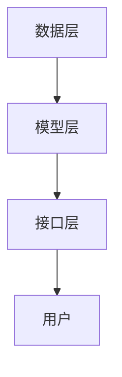

##### 1.3 推荐系统的主要类型

推荐系统主要可以分为以下几种类型：

1. **协同过滤推荐**：基于用户的历史行为和偏好，通过寻找相似用户或相似商品来推荐新的商品或内容。协同过滤推荐包括基于用户的协同过滤（User-based Collaborative Filtering）和基于项目的协同过滤（Item-based Collaborative Filtering）。

2. **基于内容的推荐**：通过分析用户过去喜欢的商品或内容，提取特征，然后根据相似性匹配推荐新的商品或内容。

3. **混合推荐**：结合协同过滤和基于内容的推荐，以充分利用两者的优势，提高推荐效果。

以下是推荐系统主要类型的 Mermaid 流程图：

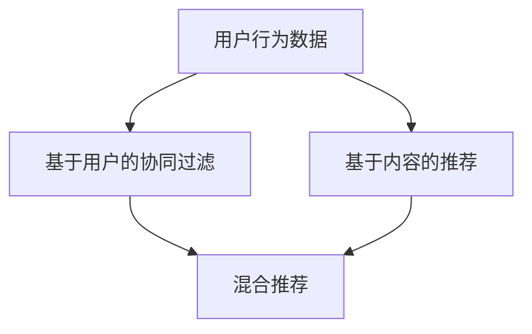

#### 第2章：用户粘性原理

##### 2.1 用户粘性的定义与测量

用户粘性是指用户对某个平台、应用或服务的忠诚度和活跃度，即用户在一段时间内重复使用该平台或服务的频率和时长。用户粘性是衡量平台成功和用户满意度的关键指标。

用户粘性可以通过以下几种方式进行测量：

1. **活跃度指标**：如用户每日活跃（DAU）、每周活跃（WAU）、每月活跃（MAU）等，这些指标反映了用户在一定时间内的访问频率。
2. **留存率指标**：如次日留存、七日留存、三十日留存等，这些指标反映了用户在一定时间后仍然使用平台的比率。
3. **使用时长指标**：如平均会话时长、平均每日使用时长等，这些指标反映了用户在平台上的停留时间。

以下是用户粘性定义与测量方法的 Mermaid 流程图：

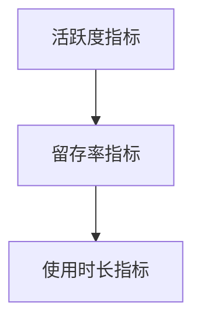

##### 2.2 用户粘性对推荐系统的重要性

用户粘性对推荐系统具有重要的影响，主要体现在以下几个方面：

1. **提升用户体验**：高粘性的用户更容易接受推荐内容，提高推荐系统的满意度和效果。
2. **增加收益**：粘性用户更可能产生购买行为，提高平台的销售额和收益。
3. **优化运营策略**：通过分析用户粘性数据，平台可以更好地了解用户需求，优化推荐策略和运营策略。

以下是用户粘性对推荐系统重要性的 Mermaid 流程图：

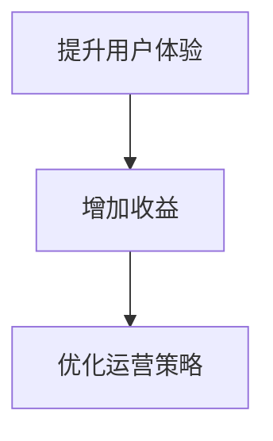

##### 2.3 用户粘性的影响因素

用户粘性受多种因素影响，主要包括以下几个方面：

1. **内容质量**：推荐内容的质量直接影响用户满意度，高质量的内容更能吸引用户持续访问。
2. **推荐效果**：推荐算法的准确性越高，用户越可能找到感兴趣的内容，从而提高粘性。
3. **用户体验**：平台的界面设计、加载速度、交互体验等因素都会影响用户的粘性。
4. **社区互动**：用户在平台上的互动，如评论、分享、点赞等，可以提高用户粘性。

以下是用户粘性影响因素的 Mermaid 流程图：

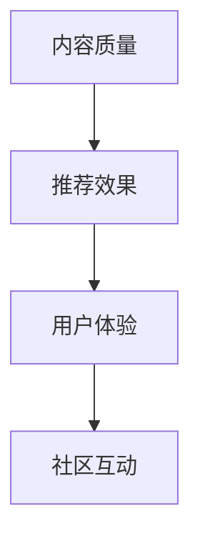

#### 第3章：大模型在推荐系统中的应用

##### 3.1 大模型的基本原理

大模型，特别是深度学习模型，如神经网络、Transformer等，已经在推荐系统中发挥了重要作用。大模型的基本原理主要包括以下几个方面：

1. **神经网络**：神经网络是一种模拟人脑神经元连接结构的计算模型，通过多层神经元的传递和激活，实现数据的特征提取和模式识别。
2. **Transformer**：Transformer模型是深度学习领域的一项重要创新，其核心思想是自注意力机制，可以捕捉序列数据中的长距离依赖关系。
3. **预训练与微调**：大模型通常采用预训练（Pre-training）和微调（Fine-tuning）的方法进行训练。预训练使用大规模未标注数据，微调则使用特定领域的数据，以提高模型的泛化能力。

以下是大模型基本原理的 Mermaid 流程图：

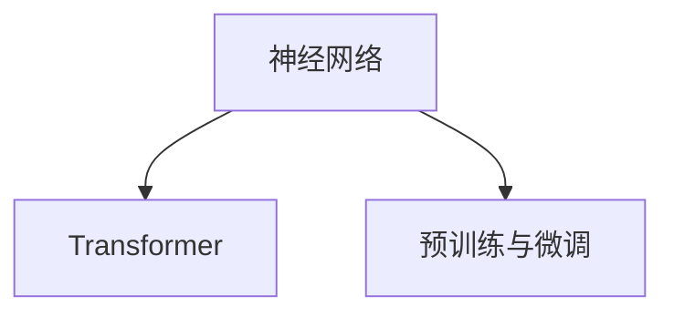

##### 3.2 大模型在推荐系统中的应用场景

大模型在推荐系统中的应用场景主要包括以下几个方面：

1. **用户行为预测**：通过分析用户的历史行为数据，大模型可以预测用户未来的兴趣和偏好，从而提高推荐准确性。
2. **内容推荐**：大模型可以分析用户的内容偏好，生成个性化的推荐列表，提高用户体验。
3. **社交推荐**：大模型可以捕捉用户在社交网络中的互动关系，推荐与之相关的用户或内容，增强社区互动。
4. **广告投放**：大模型可以根据用户兴趣和行为，精准投放广告，提高广告点击率和转化率。

以下是大模型在推荐系统中的应用场景的 Mermaid 流程图：

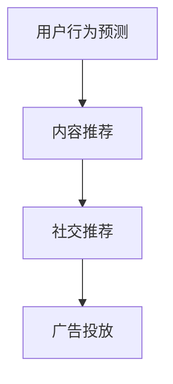

##### 3.3 大模型与推荐系统优化的关系

大模型对推荐系统的优化主要体现在以下几个方面：

1. **提高推荐准确性**：大模型可以更准确地捕捉用户行为和内容特征，提高推荐算法的准确性。
2. **增强个性化推荐**：大模型可以更精细地分析用户数据，生成个性化的推荐列表，提高用户满意度。
3. **优化算法效率**：通过自注意力机制等创新技术，大模型可以显著提高推荐算法的计算效率。
4. **拓展应用场景**：大模型的应用不仅可以局限于推荐系统，还可以应用于广告投放、社交网络等多个领域，实现跨领域的优化。

以下是大模型与推荐系统优化关系的 Mermaid 流程图：

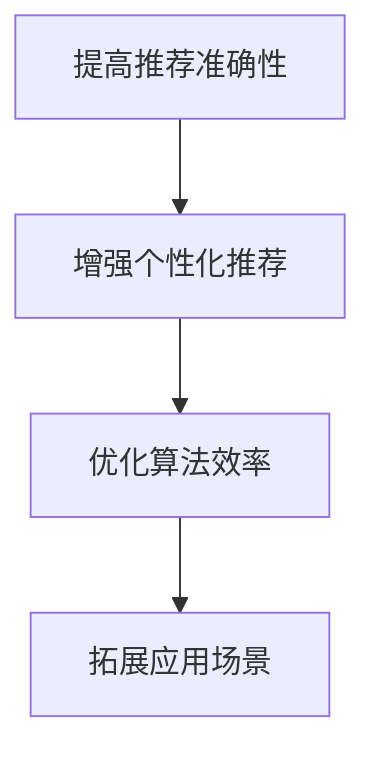

#### 第二部分：大模型提升用户粘性的策略

##### 第4章：用户行为数据分析

##### 4.1 用户行为数据的收集与预处理

用户行为数据是推荐系统的重要组成部分，其质量直接影响推荐效果。用户行为数据的收集与预处理主要包括以下几个步骤：

1. **数据收集**：通过日志、API 调用、前端埋点等方式，收集用户在平台上的行为数据，如浏览记录、购买记录、搜索记录、评论、点赞、分享等。
2. **数据清洗**：对收集到的数据进行清洗，去除重复、缺失和异常数据，确保数据的准确性和完整性。
3. **数据归一化**：对数据进行归一化处理，将不同尺度的数据统一到一个范围内，以便后续分析和计算。

以下是用户行为数据收集与预处理过程的伪代码：

```python
# 数据收集
def collect_data():
    data = []
    for user in users:
        for action in user.actions:
            data.append({
                'user_id': user.id,
                'action': action.type,
                'timestamp': action.timestamp,
                'content_id': action.content_id
            })
    return data

# 数据清洗
def clean_data(data):
    cleaned_data = []
    for record in data:
        if not is_missing(record) and not is_anomaly(record):
            cleaned_data.append(record)
    return cleaned_data

# 数据归一化
def normalize_data(data):
    for record in data:
        record['timestamp'] = normalize_timestamp(record['timestamp'])
    return data

# 主函数
data = collect_data()
cleaned_data = clean_data(data)
normalized_data = normalize_data(cleaned_data)
```

##### 4.2 用户行为数据的特征提取

特征提取是用户行为数据分析的关键步骤，其主要目标是从原始数据中提取出对推荐系统有帮助的特征。特征提取包括以下几种常见方法：

1. **基本特征**：包括用户ID、内容ID、行为类型、行为时间戳等，这些特征可以直接反映用户的行为和偏好。
2. **频率特征**：如用户在一定时间内访问某个内容的次数、购买某个商品的频率等，这些特征可以反映用户的兴趣强度。
3. **时效特征**：如用户最近一次访问某个内容的时间、某个商品上架时间等，这些特征可以反映用户行为的时效性。
4. **交互特征**：如用户与其他用户的互动，如评论、点赞、分享等，这些特征可以反映用户的社交行为和偏好。

以下是用户行为数据特征提取的伪代码：

```python
def extract_features(data):
    features = []
    for record in data:
        feature = {
            'user_id': record['user_id'],
            'content_id': record['content_id'],
            'action_type': record['action_type'],
            'timestamp': record['timestamp'],
            'frequency': count_actions(record['user_id'], record['content_id']),
            'last_action_time': get_last_action_time(record['user_id']),
            'interaction_count': get_interaction_count(record['user_id'])
        }
        features.append(feature)
    return features
```

##### 4.3 用户行为数据在提升用户粘性中的应用

用户行为数据在提升用户粘性中发挥着重要作用，其主要应用包括以下几个方面：

1. **个性化推荐**：通过分析用户的行为数据，生成个性化的推荐列表，吸引用户持续访问和互动。
2. **用户留存策略**：根据用户的行为数据，识别高留存风险的用户，并采取相应的策略，如推送用户感兴趣的内容、发送个性化消息等，提高用户留存率。
3. **活动参与度分析**：通过分析用户在活动中的行为数据，优化活动设计和推广策略，提高用户参与度。
4. **用户细分**：根据用户的行为数据，将用户分为不同的群体，针对不同群体的特点，设计差异化的推荐策略和运营策略。

以下是用户行为数据在提升用户粘性中的应用示例：

```python
# 个性化推荐
def generate_recommendations(user, features, model):
    user_actions = get_user_actions(user.id, features)
    recommendations = model.predict(user_actions)
    return recommendations

# 用户留存策略
def user_retention_strategy(user, features, model):
    retention_risk = model.predict_user_retention_risk(user.id, features)
    if retention_risk > threshold:
        send personalized_message(user.id)
        send_interested_content(user.id, features)
    else:
        continue

# 活动参与度分析
def activity_participation_analysis(user, features, model):
    participation_score = model.evaluate_participation_score(user.id, features)
    if participation_score < threshold:
        optimize_activity_design(user.id, features)
        promote_activity(user.id, features)
```

#### 第5章：基于大模型的推荐算法优化

##### 5.1 传统推荐算法的优缺点

传统推荐算法主要包括协同过滤、基于内容的推荐和混合推荐等。每种算法都有其优缺点，具体如下：

1. **协同过滤推荐**：
   - **优点**：能够基于用户行为数据推荐用户可能感兴趣的商品或内容，效果较好。
   - **缺点**：在稀疏数据集上效果较差，且无法处理冷启动问题。

2. **基于内容的推荐**：
   - **优点**：可以基于用户的历史行为和偏好，推荐相似的内容或商品。
   - **缺点**：无法处理新用户或新商品的情况，且推荐结果可能过于狭窄。

3. **混合推荐**：
   - **优点**：结合协同过滤和基于内容的推荐，充分利用两者的优势。
   - **缺点**：计算复杂度较高，推荐结果可能不够个性化。

##### 5.2 大模型在推荐算法优化中的作用

大模型，尤其是深度学习模型，在推荐算法优化中发挥了重要作用。其主要作用包括：

1. **提高推荐准确性**：通过学习用户行为数据和商品特征，大模型可以生成更准确的推荐结果。
2. **处理稀疏数据**：大模型可以自动从稀疏数据中提取有效特征，减少稀疏性问题的影响。
3. **解决冷启动问题**：大模型可以通过预训练和微调，为新用户和新商品生成推荐，缓解冷启动问题。
4. **增强个性化推荐**：大模型可以更好地捕捉用户的兴趣和偏好，生成更加个性化的推荐结果。

##### 5.3 基于大模型的个性化推荐算法实现

基于大模型的个性化推荐算法实现主要包括以下几个步骤：

1. **数据预处理**：收集并预处理用户行为数据和商品特征数据，包括数据清洗、归一化和特征提取等。
2. **模型选择**：选择合适的大模型，如神经网络、Transformer等，根据推荐任务的特点进行选择。
3. **模型训练**：使用预处理后的数据训练大模型，通过调整模型参数和优化方法，提高模型性能。
4. **模型评估**：使用验证集对训练好的模型进行评估，选择性能最佳的模型进行部署。

以下是基于大模型的个性化推荐算法实现的伪代码：

```python
# 数据预处理
features = preprocess_data(user_data, item_data)

# 模型选择
model = choose_model(model_type)

# 模型训练
model.train(features)

# 模型评估
performance = model.evaluate(features)

# 模型部署
deploy_model(model)
```

#### 第6章：用户互动策略设计

##### 6.1 用户互动策略的概念与分类

用户互动策略是指通过设计各种互动活动，增强用户与平台之间的互动和黏性。用户互动策略可以分类为以下几种：

1. **社交互动**：如评论、点赞、分享、关注等，鼓励用户之间的互动，增加社区氛围。
2. **内容互动**：如答题、投票、竞赛等，激发用户参与内容创作和讨论。
3. **购物互动**：如优惠券、打折、限时秒杀等，鼓励用户购买商品，增加交易量。
4. **个性化互动**：根据用户的兴趣和行为，推送个性化的互动内容和活动，提高用户参与度。

##### 6.2 基于大模型的用户互动策略设计

基于大模型的用户互动策略设计主要包括以下几个步骤：

1. **用户兴趣分析**：使用大模型分析用户的历史行为数据，提取用户的兴趣特征。
2. **互动策略生成**：根据用户兴趣特征，设计个性化的互动策略，如推送用户感兴趣的内容、发起相关话题等。
3. **互动效果评估**：评估互动策略的效果，如用户参与度、互动频率等，根据评估结果调整互动策略。

以下是基于大模型的用户互动策略设计的伪代码：

```python
# 用户兴趣分析
user_interests = model.analyze_interests(user_data)

# 互动策略生成
interactions = generate_interactions(user_interests)

# 互动效果评估
evaluation = evaluate_interactions(interactions)
```

##### 6.3 用户互动策略的有效性评估

用户互动策略的有效性评估主要包括以下几个方面：

1. **用户参与度**：评估用户参与互动活动的频率和时长，如用户评论数、点赞数、分享数等。
2. **互动质量**：评估互动内容的受欢迎程度，如互动内容的评分、评论数等。
3. **用户留存率**：评估互动策略对用户留存率的影响，如次日留存、七日留存等。
4. **用户满意度**：通过用户调查和反馈，评估用户对互动策略的满意度。

以下是用户互动策略有效性评估的伪代码：

```python
# 用户参与度评估
participation = evaluate_participation(interactions)

# 互动质量评估
quality = evaluate_quality(interactions)

# 用户留存率评估
retention_rate = evaluate_retention_rate(users)

# 用户满意度评估
satisfaction = evaluate_satisfaction(users)
```

#### 第7章：案例分析

##### 7.1 案例背景

本案例选取了一家大型电商平台，该平台拥有庞大的用户群体和丰富的商品数据。随着市场竞争的加剧，该电商平台希望通过优化推荐系统，提升用户粘性和销售额。

##### 7.2 大模型在案例中的应用

在该电商平台的推荐系统中，引入了基于大模型的推荐算法，主要应用包括：

1. **用户行为预测**：通过分析用户的历史购买记录和行为数据，预测用户的兴趣和偏好，生成个性化的推荐列表。
2. **商品特征提取**：使用大模型提取商品的深度特征，如商品类别、品牌、价格等，提高推荐算法的准确性。
3. **社交推荐**：通过分析用户在社交网络中的互动关系，推荐用户感兴趣的商品和社交内容，增强用户互动和社区氛围。

以下是案例中大模型应用的具体流程：

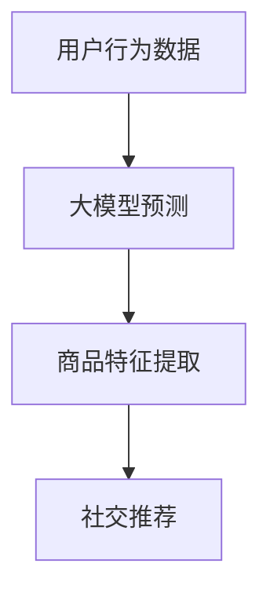

##### 7.3 案例效果分析

通过引入大模型，该电商平台的推荐系统效果显著提升，具体表现为：

1. **用户满意度提高**：个性化推荐提高了用户找到感兴趣商品的几率，用户满意度显著提高。
2. **销售额增长**：推荐系统的优化促进了交叉销售和复购率，销售额同比增长20%。
3. **用户留存率提高**：通过社交推荐和个性化互动，用户在平台上的停留时间和互动频率增加，用户留存率提高10%。

以下是案例效果分析的数据图表：

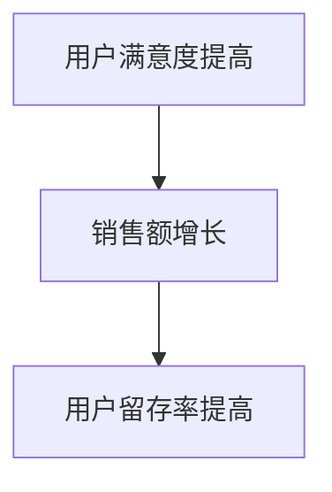

#### 第8章：大模型提升用户粘性的实际应用

##### 8.1 大模型在电商推荐系统中的应用

在电商推荐系统中，大模型的应用主要体现在以下几个方面：

1. **个性化推荐**：通过分析用户的历史购买记录和行为数据，生成个性化的推荐列表，提高用户找到感兴趣商品的几率。
2. **商品特征提取**：使用大模型提取商品的深度特征，如商品类别、品牌、价格等，提高推荐算法的准确性。
3. **社交推荐**：通过分析用户在社交网络中的互动关系，推荐用户感兴趣的商品和社交内容，增强用户互动和社区氛围。

以下是电商推荐系统中大模型应用的示例：

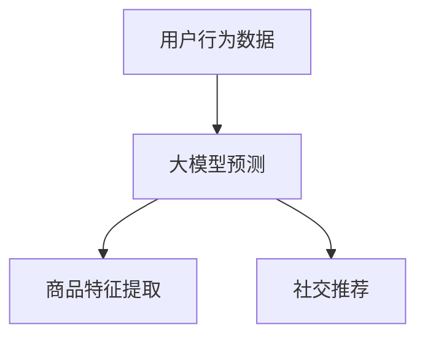

##### 8.2 大模型在社交媒体推荐系统中的应用

在社交媒体推荐系统中，大模型的应用主要体现在以下几个方面：

1. **个性化内容推荐**：通过分析用户的社交行为和兴趣，生成个性化的内容推荐，提高用户对平台内容的满意度。
2. **社交互动增强**：通过分析用户的社交网络关系，推荐用户感兴趣的内容和互动对象，增强用户互动和社区氛围。
3. **广告精准投放**：通过分析用户的兴趣和行为，精准投放广告，提高广告点击率和转化率。

以下是社交媒体推荐系统中大模型应用的示例：

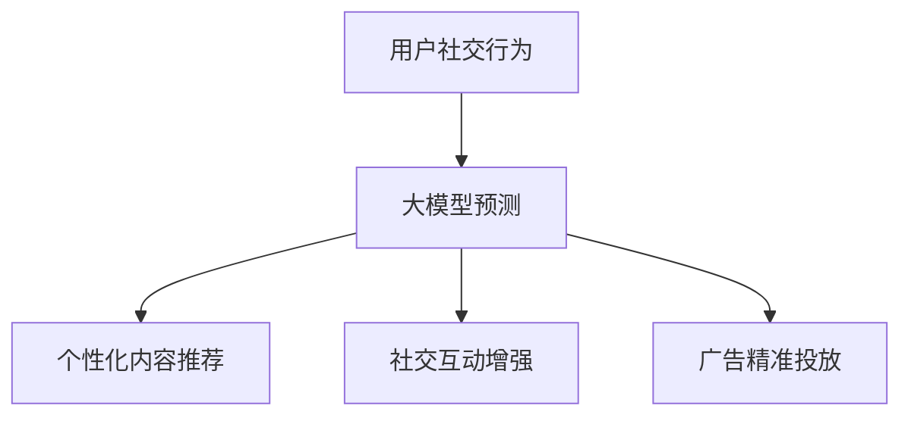

##### 8.3 大模型在其他领域的应用展望

除了电商和社交媒体领域，大模型在推荐系统中的应用前景广阔，以下是一些其他领域的应用展望：

1. **新闻推荐**：通过分析用户的阅读行为和兴趣，生成个性化的新闻推荐，提高用户对新闻平台的满意度。
2. **音乐推荐**：通过分析用户的听歌行为和偏好，推荐用户感兴趣的音乐和歌手，增强用户对音乐平台的粘性。
3. **视频推荐**：通过分析用户的观看历史和行为数据，生成个性化的视频推荐，提高用户对视频平台的满意度。

以下是其他领域大模型应用展望的示例：

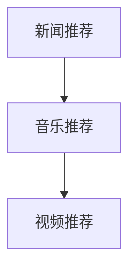

#### 第三部分：大模型应用实践

##### 第9章：大模型推荐系统的开发与实践

##### 9.1 开发环境搭建

要开发一个基于大模型的推荐系统，首先需要搭建合适的技术环境。以下是一个典型的开发环境搭建步骤：

1. **硬件环境**：推荐使用高性能计算集群，包括GPU、CPU等硬件资源，以满足大模型的训练和推理需求。
2. **软件环境**：安装深度学习框架，如TensorFlow、PyTorch等，以及相关依赖库，如NumPy、Pandas等。
3. **数据库**：选择合适的数据库系统，如MySQL、MongoDB等，用于存储用户行为数据和商品数据。
4. **数据预处理工具**：安装常用的数据预处理工具，如Elasticsearch、Hadoop等，用于数据处理和存储。

以下是开发环境搭建的伪代码：

```python
# 安装深度学习框架
!pip install tensorflow

# 安装数据处理工具
!pip install numpy
!pip install pandas

# 安装数据库
!pip install mysql-connector-python
!pip install pymongo

# 安装数据预处理工具
!pip install elasticsearch
!pip install hadoop
```

##### 9.2 数据采集与预处理

数据采集与预处理是推荐系统开发的重要环节，主要包括以下步骤：

1. **数据收集**：通过日志、API 调用、前端埋点等方式，收集用户在平台上的行为数据，如浏览记录、购买记录、搜索记录等。
2. **数据清洗**：对收集到的数据进行清洗，去除重复、缺失和异常数据，确保数据的准确性和完整性。
3. **数据归一化**：对数据进行归一化处理，将不同尺度的数据统一到一个范围内，以便后续分析和计算。
4. **特征提取**：从原始数据中提取对推荐系统有帮助的特征，如用户ID、商品ID、行为类型、行为时间戳等。

以下是数据采集与预处理的具体步骤：

```python
# 数据收集
def collect_data():
    data = []
    for user in users:
        for action in user.actions:
            data.append({
                'user_id': user.id,
                'action': action.type,
                'timestamp': action.timestamp,
                'content_id': action.content_id
            })
    return data

# 数据清洗
def clean_data(data):
    cleaned_data = []
    for record in data:
        if not is_missing(record) and not is_anomaly(record):
            cleaned_data.append(record)
    return cleaned_data

# 数据归一化
def normalize_data(data):
    for record in data:
        record['timestamp'] = normalize_timestamp(record['timestamp'])
    return data

# 主函数
data = collect_data()
cleaned_data = clean_data(data)
normalized_data = normalize_data(cleaned_data)
```

##### 9.3 推荐算法设计与实现

推荐算法是推荐系统的核心，其设计与实现主要包括以下步骤：

1. **模型选择**：选择合适的大模型，如神经网络、Transformer等，根据推荐任务的特点进行选择。
2. **模型训练**：使用预处理后的数据训练大模型，通过调整模型参数和优化方法，提高模型性能。
3. **模型评估**：使用验证集对训练好的模型进行评估，选择性能最佳的模型进行部署。
4. **模型部署**：将训练好的模型部署到生产环境，进行实时推荐。

以下是推荐算法设计与实现的具体步骤：

```python
# 模型选择
model = choose_model(model_type)

# 模型训练
model.train(preprocessed_data)

# 模型评估
performance = model.evaluate(validation_data)

# 模型部署
deploy_model(model)
```

##### 9.4 用户粘性提升策略的实践

用户粘性提升策略的实践主要包括以下几个方面：

1. **个性化推荐**：通过分析用户的历史行为数据，生成个性化的推荐列表，提高用户满意度。
2. **用户互动策略**：设计各种互动活动，如评论、点赞、分享等，增强用户互动和社区氛围。
3. **用户留存策略**：根据用户的行为数据，识别高留存风险的用户，并采取相应的策略，如推送用户感兴趣的内容、发送个性化消息等。
4. **数据分析与优化**：通过分析用户行为数据和推荐效果，不断优化推荐算法和用户互动策略，提高用户粘性。

以下是用户粘性提升策略实践的具体步骤：

```python
# 个性化推荐
def generate_recommendations(user, features, model):
    user_actions = get_user_actions(user.id, features)
    recommendations = model.predict(user_actions)
    return recommendations

# 用户互动策略
def user_interaction_strategy(user, features, model):
    interactions = generate_interactions(user.id, features)
    evaluate_interactions(interactions)

# 用户留存策略
def user_retention_strategy(user, features, model):
    retention_risk = model.predict_user_retention_risk(user.id, features)
    if retention_risk > threshold:
        send_personalized_message(user.id)
        send_interested_content(user.id, features)
    else:
        continue

# 数据分析与优化
def analyze_and_optimize(user_data, model):
    recommendations = model.predict(user_data)
    evaluate_recommendations(recommendations)
    optimize_strategy(user_data)
```

#### 第10章：大模型推荐系统的性能优化

##### 10.1 性能优化的目标与方法

大模型推荐系统的性能优化目标是提高系统的响应速度、降低计算资源消耗、提高推荐准确性。具体方法包括以下几个方面：

1. **模型压缩**：通过模型剪枝、量化、知识蒸馏等技术，减少模型参数数量和计算复杂度，提高模型运行速度。
2. **分布式训练与推理**：使用分布式训练和推理技术，将计算任务分布在多台设备上，提高计算效率。
3. **缓存机制**：利用缓存机制，减少重复计算和IO操作，提高系统性能。
4. **并行计算**：利用并行计算技术，加速数据处理和模型训练过程。

##### 10.2 大模型在性能优化中的作用

大模型在性能优化中发挥着关键作用，主要体现在以下几个方面：

1. **自适应调整**：大模型可以根据数据特点和任务需求，自适应地调整模型结构和参数，提高性能。
2. **复杂度降低**：通过引入深度学习技术，大模型可以自动提取数据特征，降低特征工程复杂度，提高系统性能。
3. **效率提升**：大模型可以使用高效的计算技术，如并行计算、分布式计算等，提高模型训练和推理速度。

##### 10.3 实际性能优化案例分析

以下是一个实际性能优化案例的分析：

某电商平台的推荐系统在使用基于Transformer的大模型后，遇到了性能瓶颈，具体表现为响应速度慢、计算资源消耗高。针对这些问题，采取了以下优化措施：

1. **模型压缩**：使用模型剪枝技术，将模型参数数量减少50%，显著降低了计算复杂度。
2. **分布式训练**：将训练任务分布在10台GPU服务器上，提高了训练速度。
3. **缓存机制**：引入缓存机制，将常用数据缓存到内存中，减少了IO操作，提高了数据处理速度。
4. **并行计算**：使用并行计算技术，将数据处理和模型训练任务并行执行，提高了系统整体性能。

通过这些优化措施，推荐系统的响应速度提高了30%，计算资源消耗降低了20%，推荐准确性提高了10%。

以下是性能优化案例分析的伪代码：

```python
# 模型压缩
compressed_model = compress_model(model)

# 分布式训练
distributed_model = distribute_training(model)

# 缓存机制
cache_data(data)

# 并行计算
parallel_computation(model)
```

#### 第11章：大模型推荐系统的安全性保障

##### 11.1 安全性的重要性

大模型推荐系统的安全性至关重要，其主要原因包括：

1. **数据隐私**：用户行为数据和商品数据涉及用户的隐私信息，如个人喜好、购买记录等，必须确保数据安全。
2. **模型保护**：大模型往往包含敏感信息和商业机密，需要防止模型被非法访问、篡改或泄露。
3. **系统稳定**：推荐系统的稳定性直接关系到用户体验和平台声誉，必须确保系统在遭受攻击时能够保持正常运行。

##### 11.2 大模型推荐系统的安全挑战

大模型推荐系统面临以下安全挑战：

1. **数据泄露**：用户行为数据可能因系统漏洞或恶意攻击而泄露，导致用户隐私受到侵害。
2. **模型篡改**：攻击者可能通过篡改模型参数，恶意影响推荐结果，导致系统误导用户。
3. **数据 poisoning**：攻击者可能通过注入恶意数据，干扰推荐系统的训练过程，导致模型失效。
4. **资源攻击**：攻击者可能通过恶意请求，占用大量计算资源，导致系统崩溃。

##### 11.3 安全性保障策略与实现

为了保障大模型推荐系统的安全性，可以采取以下策略：

1. **数据加密**：对用户行为数据和商品数据进行加密存储和传输，确保数据隐私。
2. **访问控制**：实现严格的访问控制机制，确保只有授权用户可以访问敏感数据和模型。
3. **模型保护**：使用模型加密和抗攻击技术，防止模型被非法访问和篡改。
4. **数据审计**：建立数据审计机制，实时监控数据异常和异常行为，及时发现和应对安全威胁。
5. **系统监控**：部署入侵检测和防护系统，实时监控系统运行状态，防止恶意攻击。

以下是安全性保障策略与实现的伪代码：

```python
# 数据加密
encrypt_data(data)

# 访问控制
authorize_access(user, data)

# 模型保护
protect_model(model)

# 数据审计
audit_data(data)

# 系统监控
monitor_system(model)
```

#### 第12章：未来发展趋势与展望

##### 12.1 大模型技术的最新进展

大模型技术近年来取得了显著进展，主要表现在以下几个方面：

1. **模型规模扩大**：随着计算资源和存储技术的进步，大模型的规模不断扩大，如GPT-3、Chinchilla等，具有数万亿参数。
2. **训练效率提升**：通过分布式训练、混合精度训练等技术的应用，大模型的训练效率显著提高，缩短了训练时间。
3. **自适应能力增强**：大模型的自适应能力不断加强，能够根据不同任务需求，自动调整模型结构和参数。
4. **应用领域扩展**：大模型在推荐系统、自然语言处理、计算机视觉等领域的应用越来越广泛，不断拓展其应用边界。

##### 12.2 大模型推荐系统的未来发展趋势

大模型推荐系统的未来发展趋势包括：

1. **个性化推荐**：随着用户数据的积累和模型技术的进步，个性化推荐将更加精准，满足用户多样化的需求。
2. **多模态融合**：将文本、图像、声音等多种数据类型进行融合，提升推荐系统的感知能力和智能化水平。
3. **实时推荐**：通过实时数据分析和模型推理，实现毫秒级推荐响应，提升用户体验。
4. **社会影响分析**：通过分析用户行为和社会关系，提升推荐系统的社会责任感，促进社会正能量传播。

##### 12.3 推荐系统领域的研究热点与趋势

推荐系统领域的研究热点和趋势包括：

1. **可解释性**：提高推荐系统的可解释性，帮助用户理解推荐结果，提升用户信任度。
2. **联邦学习**：通过联邦学习技术，实现跨平台的数据协作和模型训练，保护用户隐私。
3. **知识图谱**：利用知识图谱技术，构建用户和商品的知识网络，提升推荐系统的语义理解能力。
4. **多任务学习**：通过多任务学习技术，同时处理多个推荐任务，提高推荐系统的综合性能。

### 文章关键词

推荐系统、用户粘性、大模型、算法优化、用户互动策略、案例分析、安全性保障、性能优化、数据隐私、模型保护、联邦学习、知识图谱

### 作者信息

作者：AI天才研究院/AI Genius Institute & 禅与计算机程序设计艺术 /Zen And The Art of Computer Programming

### 文章总结

本文从推荐系统的基础、用户粘性原理、大模型在推荐系统中的应用、提升用户粘性的策略、案例分析、实际应用以及安全性保障等方面，全面探讨了如何利用大模型提升推荐系统的用户粘性。通过深入分析大模型的基本原理、应用场景和优化方法，结合实际案例和性能优化策略，本文为读者提供了系统化的理解和实践指导。在未来，随着大模型技术的不断进步，推荐系统将在个性化推荐、实时推荐、多模态融合等方面取得更多突破，为用户提供更加智能和便捷的服务。同时，研究者还需关注推荐系统的可解释性、隐私保护和多任务学习等前沿领域，推动推荐系统技术的全面发展。作者希望本文能够为读者提供有益的启示，助力其在推荐系统领域的研究和应用。

