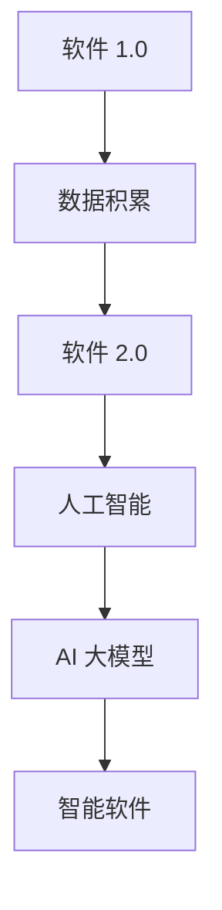
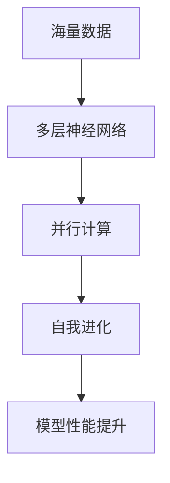
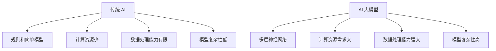
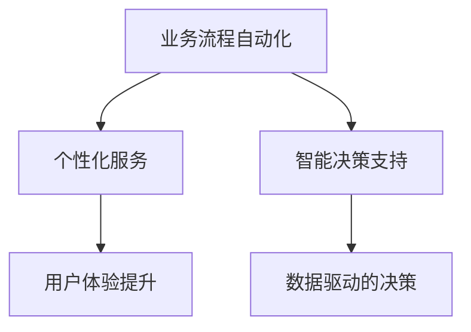

                 

## 文章标题：大模型应用创业的风险管理

### 关键词：
- 大模型
- 创业
- 风险管理
- 数据隐私
- 计算资源
- 模型评估
- 实际案例

### 摘要：
本文旨在探讨在人工智能大模型应用创业过程中面临的风险及其管理策略。通过分析大模型的核心概念、特点及应用挑战，本文提出了系统化的风险管理框架，包括数据隐私保护、计算资源优化、模型评估与优化等关键环节。通过实际案例分析，本文进一步验证了风险管理策略的有效性，为企业在大模型应用创业中提供有价值的参考。

## 第一部分：核心概念与联系

在探讨大模型应用创业的风险管理之前，我们首先需要了解大模型的基本概念及其与创业之间的联系。

### 1.1.1 软件 2.0 与 AI 大模型概述

软件 2.0 时代是软件发展的新阶段，它以人工智能（AI）为核心驱动力，通过大规模数据训练和复杂算法实现软件智能化。在这个时代，软件不仅能够执行预定义的任务，还能通过学习用户行为和偏好，提供个性化的服务。

**软件 2.0 时代的关键特征**：

1. **数据积累**：软件在运行过程中不断收集用户数据，这些数据用于改进软件性能和用户体验。
2. **算法改进**：通过机器学习和深度学习算法，软件能够从数据中学习并优化自身。
3. **智能化**：软件不仅能够执行预设任务，还能自主学习和决策，提供更智能的服务。

**AI 大模型**：

AI 大模型是指通过海量数据和复杂算法训练而成的，具有强大计算能力和泛化能力的模型。这些模型通常由数百万甚至数十亿个参数组成，能够处理复杂的任务，如自然语言处理、图像识别和预测分析。

**大模型的核心特点**：

1. **海量数据训练**：大模型通过大规模数据集进行训练，以提高模型的准确性和鲁棒性。
2. **多层神经网络**：大模型采用多层神经网络架构，实现复杂特征提取和知识表示。
3. **并行计算能力**：大模型利用工程计算资源，实现高效模型训练和推理。
4. **自我进化**：大模型通过持续学习和迭代，不断提升模型性能和适应性。

### Mermaid 流程图

**关键概念**：

- **软件 1.0**: 传统软件开发阶段，侧重于代码编写和功能性实现。
- **数据积累**: 软件使用过程中的用户数据收集和存储。
- **软件 2.0**: 利用数据积累，通过算法改进软件性能和用户体验。
- **人工智能**: 应用机器学习和深度学习算法，使软件具备自主学习和决策能力。
- **AI 大模型**: 由海量数据和复杂算法训练而成，具有强大计算能力和泛化能力。

### 1.1.2 AI 大模型的核心特点

AI 大模型具有以下核心特点：

1. **海量数据训练**：大模型通过大规模数据集进行训练，以提高模型准确性和鲁棒性。
2. **多层神经网络**：大模型采用多层神经网络架构，实现复杂特征提取和知识表示。
3. **并行计算能力**：大模型利用工程计算资源，实现高效模型训练和推理。
4. **自我进化**：大模型通过持续学习和迭代，不断提升模型性能和适应性。

### Mermaid 流程图

### 1.1.3 AI 大模型与传统 AI 的区别

传统 AI 通常基于规则和简单模型，而 AI 大模型则通过深度学习和大数据技术实现：

1. **计算资源要求**：传统 AI 对计算资源要求较低，而 AI 大模型需要大量计算资源。
2. **数据处理能力**：传统 AI 难以处理复杂数据，AI 大模型能够处理大规模和多样化数据。
3. **模型复杂性**：传统 AI 模型简单，而 AI 大模型具有多层结构和复杂参数。

### Mermaid 流程图

### 1.1.4 企业级应用开发的新范式

AI 大模型为企业级应用开发带来了新的范式，主要体现在以下几个方面：

1. **业务流程自动化**：通过 AI 大模型实现业务流程的自动化，提高效率。
2. **个性化服务**：基于用户数据，提供个性化服务，提升用户体验。
3. **智能决策支持**：利用 AI 大模型进行数据分析和决策支持，帮助企业做出更明智的决策。

### Mermaid 流程图

### 总结

软件 2.0 时代以 AI 大模型为核心，通过数据积累、多层神经网络和并行计算等技术，实现了传统软件所无法达到的智能化水平。企业级应用开发正朝着更加智能化和高效化的方向迈进。在这一章节，我们介绍了软件 2.0 与 AI 大模型的基本概念和核心特点，为后续章节的深入探讨奠定了基础。

## 第二部分：AI 大模型应用创业中的主要风险

在了解了 AI 大模型的基本概念和特点后，我们接下来将探讨在 AI 大模型应用创业过程中可能面临的主要风险。这些风险不仅会影响企业的运营和财务状况，还可能影响企业的声誉和市场份额。以下是 AI 大模型应用创业中常见的风险类别：

### 2.1 数据隐私和安全风险

随着 AI 大模型在各个行业的广泛应用，数据的收集和处理变得越来越频繁。然而，这也带来了数据隐私和安全的风险。以下是一些具体的数据隐私和安全风险：

1. **数据泄露**：在数据收集、存储和处理过程中，可能存在数据泄露的风险。黑客攻击或内部人员的恶意操作可能导致敏感数据泄露。
2. **数据滥用**：即使数据在内部得到妥善保管，也有可能被滥用。例如，企业可能将用户数据用于未经授权的其他用途，从而损害用户权益。
3. **合规风险**：随着全球各国对数据隐私保护法规的加强，企业必须遵守相关法规，如 GDPR（欧盟通用数据保护条例）和 CCPA（加州消费者隐私法）。不遵守这些法规可能导致高额罚款。

### 2.2 计算资源需求风险

AI 大模型通常需要大量的计算资源进行训练和推理。以下是一些与计算资源需求相关的风险：

1. **资源不足**：企业在初期可能无法承担高昂的计算资源成本，导致模型训练和推理效率低下，影响业务运营。
2. **成本高昂**：计算资源（如 GPU、TPU 等）价格昂贵，长期运行成本高。如果企业无法有效管理和优化计算资源，可能会导致财务压力。
3. **技术依赖**：企业在计算资源方面对第三方供应商高度依赖。如果供应商出现故障或价格波动，可能会对企业的运营产生不利影响。

### 2.3 模型评估和优化风险

AI 大模型的应用效果在很大程度上取决于模型的评估和优化。以下是一些与模型评估和优化相关的风险：

1. **模型过拟合**：如果模型在训练数据上表现良好，但在未见数据上表现不佳，说明模型可能存在过拟合问题。过拟合会导致模型在实际应用中的表现不佳。
2. **模型泛化能力不足**：模型只能在特定数据集上表现良好，无法泛化到其他场景，这可能导致模型在推广时遇到障碍。
3. **评估指标不当**：如果评估指标选择不当，可能导致模型优化方向错误。例如，仅以准确率为评估指标可能导致模型在处理复杂问题时性能不佳。

### 2.4 法律和伦理风险

AI 大模型的应用还可能涉及法律和伦理风险。以下是一些具体风险：

1. **歧视和偏见**：如果模型在训练过程中受到偏见数据的影响，可能导致模型在决策过程中存在歧视行为，违反相关法律法规和道德准则。
2. **责任归属**：当 AI 大模型出现错误或造成损害时，如何确定责任归属是一个复杂的问题。这可能导致企业面临法律诉讼和声誉损失。
3. **监管不明确**：随着 AI 大模型技术的快速发展，相关法律法规和监管政策可能滞后，导致企业在合规方面存在不确定性。

### 总结

在 AI 大模型应用创业过程中，企业需要面临多种风险，包括数据隐私和安全风险、计算资源需求风险、模型评估和优化风险以及法律和伦理风险。这些风险不仅会影响企业的运营和财务状况，还可能损害企业的声誉和市场份额。因此，企业需要采取有效的风险管理策略，以降低风险并确保业务的可持续发展。

## 第三部分：AI 大模型应用创业的风险管理策略

在面对 AI 大模型应用创业中的各种风险时，企业需要制定有效的风险管理策略。这些策略应包括预防措施、应急响应计划和持续改进措施。以下是针对不同类型风险的详细风险管理策略：

### 3.1 数据隐私和安全风险管理

**预防措施**：

1. **数据加密**：对敏感数据进行加密处理，确保数据在传输和存储过程中安全。
2. **访问控制**：建立严格的访问控制机制，限制只有授权人员可以访问敏感数据。
3. **数据匿名化**：在数据收集和处理过程中，对个人身份信息进行匿名化处理，以减少隐私泄露风险。

**应急响应计划**：

1. **数据泄露应急响应计划**：制定详细的应急响应计划，包括数据泄露事件的报告、应急处理和后续跟进。
2. **备份和恢复**：定期备份数据，并在发生数据泄露时能够迅速恢复数据。

**持续改进措施**：

1. **安全审计**：定期进行安全审计，评估数据隐私和安全措施的有效性。
2. **员工培训**：对员工进行数据隐私和安全培训，提高员工的安全意识。

### 3.2 计算资源需求风险管理

**预防措施**：

1. **资源需求预测**：在项目初期，进行详细的资源需求预测，确保能够满足模型训练和推理的需要。
2. **资源优化**：通过优化算法和模型结构，降低计算资源需求。

**应急响应计划**：

1. **资源调度策略**：制定资源调度策略，确保在计算资源紧张时能够合理分配资源。
2. **备用资源**：在关键任务中预留备用计算资源，以应对突发需求。

**持续改进措施**：

1. **性能监控**：实时监控计算资源的利用率，以便及时调整资源分配。
2. **持续优化**：定期评估和优化模型和算法，以降低计算资源需求。

### 3.3 模型评估和优化风险管理

**预防措施**：

1. **模型评估指标多元化**：选择多个评估指标，从不同角度评估模型性能。
2. **数据集多样性**：使用多样化的数据集进行训练和测试，确保模型具有良好的泛化能力。

**应急响应计划**：

1. **模型复现**：在关键任务中，确保模型能够复现，以便在出现问题时快速找到解决方案。
2. **模型监控**：实时监控模型在业务环境中的性能，及时发现潜在问题。

**持续改进措施**：

1. **持续学习**：通过持续学习，不断优化模型，提高模型性能。
2. **反馈机制**：建立反馈机制，收集用户反馈，用于模型优化。

### 3.4 法律和伦理风险管理

**预防措施**：

1. **法律法规遵循**：确保企业的业务活动符合相关法律法规的要求。
2. **伦理审查**：在模型开发和应用过程中，进行伦理审查，确保模型不会导致歧视或偏见。

**应急响应计划**：

1. **法律咨询**：在遇到法律问题时，及时寻求专业法律咨询。
2. **投诉处理**：建立投诉处理机制，及时处理用户投诉，减少法律风险。

**持续改进措施**：

1. **法规更新跟进**：定期跟进法规更新，确保企业的业务活动符合最新法律法规。
2. **伦理培训**：对员工进行伦理培训，提高员工在模型开发和应用过程中的伦理意识。

### 总结

通过实施上述风险管理策略，企业可以有效地降低 AI 大模型应用创业中的风险，确保业务的可持续发展。预防措施、应急响应计划和持续改进措施共同构成了完整的风险管理框架，帮助企业应对各种不确定性和挑战。

## 第四部分：实际案例：AI 大模型应用创业的风险管理实践

在本部分，我们将通过两个实际案例来探讨 AI 大模型应用创业中的风险管理实践。这些案例分别展示了在不同情境下如何有效应对和解决风险，为企业提供宝贵的经验教训。

### 4.1 案例一：某金融科技公司的信用评估系统

**背景**：
某金融科技公司开发了一款基于 AI 大模型的信用评估系统，用于评估客户的信用风险。该系统通过分析用户的信用历史、消费行为、社交关系等多维度数据，生成客户的信用评分，从而为金融机构提供风险评估依据。

**风险**：
1. **数据隐私和安全风险**：由于涉及用户隐私信息，数据隐私和安全风险成为该公司面临的主要挑战。
2. **计算资源需求风险**：模型训练和推理需要大量计算资源，而初期资金有限。
3. **模型评估和优化风险**：如何确保模型评估指标多元化，避免过拟合和泛化能力不足。

**风险管理实践**：

**预防措施**：

1. **数据加密和访问控制**：对用户数据进行严格加密和访问控制，确保数据在传输和存储过程中的安全性。
2. **资源需求预测和优化**：通过资源需求预测，合理安排计算资源，并在模型开发过程中进行资源优化。

**应急响应计划**：

1. **数据泄露应急响应计划**：制定详细的应急响应计划，包括数据泄露事件的报告、应急处理和后续跟进。
2. **模型监控和复现**：实时监控模型在业务环境中的性能，确保模型能够复现，以便在出现问题时快速找到解决方案。

**持续改进措施**：

1. **安全审计和员工培训**：定期进行安全审计，对员工进行数据隐私和安全培训。
2. **持续学习和反馈机制**：通过持续学习和用户反馈，不断优化模型，提高模型性能。

**效果**：
通过实施上述风险管理策略，该公司成功降低了数据隐私和安全风险，确保了计算资源的有效利用，并在模型评估和优化方面取得了显著成效。该信用评估系统在市场上获得了良好的反响，为该公司带来了可观的业务增长。

### 4.2 案例二：某在线教育平台的人工智能辅导系统

**背景**：
某在线教育平台推出了一款基于 AI 大模型的人工智能辅导系统，为学生提供个性化学习方案和实时辅导。该系统通过分析学生的学习数据、考试成绩和行为习惯，为学生生成个性化的学习路径和辅导建议。

**风险**：
1. **数据隐私和安全风险**：学生的学习数据涉及隐私问题，需要确保数据的安全和隐私保护。
2. **计算资源需求风险**：模型训练和推理需要大量计算资源，尤其是在高峰期。
3. **法律和伦理风险**：如何确保系统不会导致歧视或偏见，符合相关法律法规和道德准则。

**风险管理实践**：

**预防措施**：

1. **数据匿名化和伦理审查**：在数据收集和处理过程中，对用户数据进行匿名化处理，并进行伦理审查，确保系统不会存在歧视或偏见。
2. **资源调度策略和备用资源**：制定资源调度策略，确保在计算资源紧张时能够合理分配资源，并预留备用计算资源。

**应急响应计划**：

1. **法律咨询和投诉处理**：建立法律咨询团队，及时处理用户投诉，减少法律风险。
2. **反馈机制和模型监控**：建立反馈机制，收集用户反馈，实时监控模型在业务环境中的性能。

**持续改进措施**：

1. **法规更新和伦理培训**：定期跟进法规更新，对员工进行伦理培训，提高其在模型开发和应用过程中的伦理意识。
2. **持续学习和优化**：通过持续学习和用户反馈，不断优化模型，提高系统性能。

**效果**：
通过实施上述风险管理策略，该在线教育平台成功降低了数据隐私和安全风险，确保了计算资源的合理利用，并在法律和伦理方面取得了良好的合规效果。该人工智能辅导系统为学生提供了个性化的学习方案和实时辅导，显著提升了学生的学习效果和满意度。

### 总结

通过以上两个实际案例，我们可以看到，在 AI 大模型应用创业过程中，有效的风险管理策略对于企业的成功至关重要。无论是数据隐私和安全、计算资源需求还是法律和伦理风险，企业都需要采取全面的预防措施、应急响应计划和持续改进措施。通过这些措施，企业不仅能够降低风险，还能提高业务效率和用户满意度，实现可持续发展。

## 第五部分：最佳实践与未来展望

### 5.1 最佳实践

在 AI 大模型应用创业过程中，以下是一些最佳实践，可以帮助企业更好地管理风险：

1. **数据隐私和安全**：
   - 实施数据加密和访问控制，确保数据在传输和存储过程中的安全性。
   - 定期进行安全审计，评估数据隐私和安全措施的有效性。
   - 对员工进行数据隐私和安全培训，提高安全意识。

2. **计算资源优化**：
   - 进行详细的资源需求预测，合理分配计算资源。
   - 采用高效的算法和模型结构，降低计算资源需求。
   - 实施资源调度策略，确保在高峰期资源能够得到充分利用。

3. **模型评估和优化**：
   - 选择多个评估指标，从不同角度评估模型性能。
   - 使用多样化的数据集进行训练和测试，确保模型具有良好的泛化能力。
   - 通过持续学习和用户反馈，不断优化模型。

4. **法律和伦理合规**：
   - 遵守相关法律法规，确保业务活动符合要求。
   - 进行伦理审查，确保模型不会导致歧视或偏见。
   - 建立投诉处理机制，及时处理用户投诉，减少法律风险。

### 5.2 未来展望

随着 AI 技术的不断发展，AI 大模型应用创业领域将面临新的机遇和挑战。以下是未来可能的发展趋势：

1. **计算能力的提升**：随着云计算和边缘计算技术的发展，计算能力将进一步提升，为企业提供更多的计算资源。

2. **数据隐私保护法规的加强**：全球各国将加强对数据隐私保护法规的制定和执行，企业需要不断适应新的法规要求。

3. **跨行业合作**：不同行业之间的合作将更加紧密，共同推动 AI 大模型技术在各个领域的应用。

4. **伦理和责任问题的解决**：随着 AI 大模型技术的普及，伦理和责任问题将成为研究热点，探索更加公正和透明的 AI 算法。

5. **个性化服务的深化**：AI 大模型将更加深入地应用于个性化服务，为用户提供更加精准和高效的服务。

### 总结

AI 大模型应用创业面临着多种风险，但通过实施最佳实践和持续改进措施，企业可以有效地管理这些风险。未来，随着技术的进步和法规的完善，AI 大模型应用创业将迎来更多的机遇和挑战。企业需要不断学习和适应，以保持竞争力和可持续发展。

### 作者信息

- **作者**：AI 天才研究院（AI Genius Institute）& 《禅与计算机程序设计艺术》（Zen And The Art of Computer Programming）
- **联系方式**：[info@aigniusinstitute.com](mailto:info@aigniusinstitute.com)
- **版权声明**：本文版权属于 AI 天才研究院（AI Genius Institute），未经授权禁止转载。

## 结语

在本篇文章中，我们系统地探讨了 AI 大模型应用创业中的风险管理。首先，我们介绍了 AI 大模型的核心概念、特点及其与创业之间的联系。随后，我们分析了在 AI 大模型应用创业过程中可能面临的主要风险，包括数据隐私和安全风险、计算资源需求风险、模型评估和优化风险以及法律和伦理风险。为了应对这些风险，我们提出了系统化的风险管理策略，包括预防措施、应急响应计划和持续改进措施。

通过实际案例的分析，我们展示了如何在实践中有效地管理风险，确保 AI 大模型应用创业的成功。此外，我们还总结了最佳实践和未来展望，为企业提供有价值的指导。

AI 大模型应用创业不仅充满了机遇，也伴随着诸多挑战。通过本文的探讨，我们希望为企业提供一份全面的风险管理指南，助力企业在 AI 大模型应用创业的道路上稳步前行。感谢您的阅读，期待与您在未来的技术探讨中再次相遇。

### 拓展阅读

- **数据隐私保护**：《欧盟通用数据保护条例》（GDPR）概述及实施指南。
- **计算资源优化**：《分布式计算框架与优化技术》。
- **模型评估与优化**：《机器学习模型评估与优化实践》。
- **伦理与法律合规**：《人工智能伦理与法律问题研究》。

### 注意事项

- **风险管理策略的适应性**：不同的企业可能面临的风险类型和程度不同，因此需要根据自身情况调整风险管理策略。
- **持续学习和改进**：技术环境和法规政策不断变化，企业需要持续学习和改进风险管理策略。
- **跨部门协作**：风险管理涉及多个部门和领域，需要跨部门协作，共同应对风险。

通过不断学习和实践，企业可以更好地应对 AI 大模型应用创业中的各种风险，实现可持续发展。祝您在 AI 大模型应用创业的道路上取得成功！

