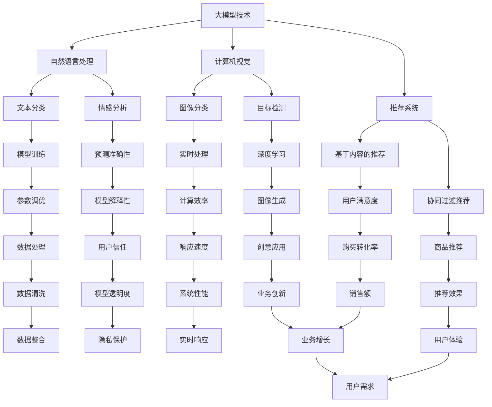

                 

### 文章标题：大模型技术在电商平台用户多维度画像构建中的创新

> 关键词：大模型技术、电商平台、用户画像、多维度数据、个性化推荐、数据隐私保护

> 摘要：本文旨在探讨大模型技术在电商平台用户多维度画像构建中的应用与创新。通过深入分析大模型技术的基础理论、用户画像的构建方法及其在不同维度上的应用，本文揭示了大数据技术在提升电商平台用户体验、实现个性化推荐、优化营销策略等方面的潜在价值。同时，本文还针对数据隐私保护等问题提出了相应的解决策略，为电商平台的可持续发展提供了有益的参考。

----------------------------------------------------------------

### 第一部分：大模型技术在电商平台用户多维度画像构建中的理论基础

在当前信息化、智能化的时代背景下，电商平台用户多维度画像的构建已经成为提高用户满意度、实现精准营销的关键手段。大模型技术作为一种强大的数据处理和分析工具，正在逐步渗透到电商平台的用户画像构建过程中，带来前所未有的创新和发展。

#### 第1章：大模型与电商平台用户画像基础

##### 1.1 大模型技术概述

大模型技术是指通过训练大规模的神经网络模型，对复杂的数据进行高效处理和分析的技术。这些模型通常具有数百万甚至数十亿个参数，能够对海量数据进行深度学习和理解。大模型技术的发展可以追溯到20世纪80年代，经过数十年的演变，已经取得了显著的成果。目前，大模型技术广泛应用于自然语言处理、计算机视觉、语音识别、推荐系统等领域，成为推动人工智能发展的重要引擎。

**大模型概念与定义**：

大模型（Big Model）是指具有大规模参数、能够处理海量数据的深度神经网络。其特点包括：

- **大规模参数**：大模型的参数数量通常在数百万到数十亿之间，远远超过传统模型的参数规模。
- **深度结构**：大模型通常包含多层神经网络，能够对数据进行逐层抽象和提取特征。
- **高效计算**：得益于现代计算硬件的发展，如GPU、TPU等，大模型能够实现高效的训练和推理。

**大模型类型与应用领域**：

大模型可以分为以下几种类型：

1. **自然语言处理模型**：如BERT、GPT等，主要用于文本分类、情感分析、机器翻译等任务。
2. **计算机视觉模型**：如ResNet、Inception等，主要用于图像分类、目标检测、图像生成等任务。
3. **推荐系统模型**：如深度学习协同过滤、基于内容的推荐等，主要用于商品推荐、广告投放等任务。

这些模型在不同领域都有广泛的应用：

- **自然语言处理**：大模型技术正在改变自然语言处理领域，使其在语言理解、文本生成等方面取得重大突破。
- **计算机视觉**：大模型技术在图像识别、图像生成等方面发挥着重要作用，推动了计算机视觉技术的发展。
- **推荐系统**：大模型技术为推荐系统带来了新的可能，实现了更精准、更个性化的推荐。

##### 1.2 电商平台用户画像概述

用户画像（User Profile）是指通过对用户行为、兴趣、需求等多维度数据的分析和挖掘，构建出用户的基本特征和偏好信息。在电商平台，用户画像的构建具有重要意义：

**用户画像定义与重要性**：

用户画像是一种用户描述信息，它通过收集和分析用户在平台上的行为数据，如浏览历史、购买记录、评价等，来描绘用户的基本特征和偏好。用户画像的重要性体现在以下几个方面：

1. **个性化推荐**：通过用户画像，可以为用户提供个性化的商品推荐，提高用户的购买体验和满意度。
2. **精准营销**：根据用户画像，可以设计更精准的营销策略，如定向广告投放、促销活动等，提高营销效果。
3. **用户体验优化**：通过分析用户画像，可以发现用户在使用平台过程中存在的问题，优化用户体验。

**用户画像的主要维度**：

用户画像通常包括以下几个主要维度：

1. **基础信息维度**：包括用户的基本信息，如年龄、性别、地域等。
2. **行为数据维度**：包括用户在平台上的行为数据，如浏览历史、购买记录、评价等。
3. **兴趣偏好维度**：包括用户的兴趣和偏好，如喜欢的商品类型、品牌等。
4. **消费能力维度**：包括用户的消费能力，如购买金额、购买频率等。
5. **社交信息维度**：包括用户的社交行为数据，如关注人数、互动频次等。

##### 1.3 大模型在用户画像构建中的应用前景

大模型技术在用户画像构建中具有巨大的潜力：

**大模型技术的潜在应用**：

1. **用户行为预测**：通过大模型技术，可以对用户的行为进行预测，如购买意向、浏览路径等，为电商平台提供决策支持。
2. **个性化推荐**：大模型技术可以实现更精准、更个性化的推荐，提高用户满意度和购买转化率。
3. **营销策略优化**：大模型技术可以帮助电商平台优化营销策略，如广告投放、促销活动等，提高营销效果。

**应用场景分析**：

1. **用户行为预测**：电商平台可以通过大模型技术预测用户的购买行为，提前推送相关商品，提高购买转化率。
2. **个性化推荐**：电商平台可以利用大模型技术，根据用户的兴趣和偏好，为用户推荐合适的商品，提高用户满意度。
3. **精准营销**：电商平台可以根据大模型技术分析出的用户画像，设计更精准的营销策略，提高营销效果。

#### 第2章：多维度数据采集与预处理

在用户画像的构建过程中，多维度数据的采集和预处理是关键步骤。这些数据包括用户的行为数据、兴趣爱好、消费能力等，需要通过有效的采集和预处理方法进行整合和分析。

##### 2.1 数据采集策略

数据采集是用户画像构建的第一步，需要从多个渠道获取用户的相关信息：

**用户行为数据采集**：

1. **网页行为数据**：通过分析用户的浏览记录、点击行为等，获取用户在平台上的行为数据。
2. **购买行为数据**：通过用户的购买记录、购买金额等，获取用户的消费行为数据。

**用户画像数据的采集**：

1. **用户基本信息**：通过用户注册信息、用户调查等，获取用户的基本信息，如年龄、性别、地域等。
2. **社交行为数据**：通过用户的社交互动数据，如关注人数、互动频次等，获取用户的社交行为数据。
3. **兴趣爱好数据**：通过用户的浏览历史、购买记录等，获取用户对各种商品的兴趣偏好。

##### 2.2 数据预处理方法

数据预处理是确保数据质量、提高数据分析效果的重要环节：

**数据清洗**：

1. **去除重复数据**：去除重复的用户记录，确保数据的唯一性。
2. **处理缺失值**：对于缺失的数据，采用填充、删除或插值等方法进行处理。

**数据归一化**：

1. **特征缩放**：通过特征缩放，将不同尺度的特征数据转换为相同的尺度，以便于后续建模和分析。

**数据融合与集成**：

1. **数据融合策略**：将来自不同来源和维度的用户数据进行融合，形成完整的用户画像。
2. **数据集成方法**：采用数据仓库、数据湖等技术，实现对多源数据的集成和管理。

#### 第3章：大模型技术在电商平台用户画像构建中的应用

大模型技术在电商平台用户画像构建中发挥着重要作用，通过深入分析用户行为、兴趣爱好、消费能力等多维度数据，可以为电商平台提供精准的用户画像，实现个性化推荐和精准营销。

##### 3.1 用户行为分析模型构建

用户行为分析是用户画像构建的核心环节，通过分析用户的行为数据，可以挖掘出用户的购买意图、浏览路径等：

**用户行为特征提取**：

1. **统计特征**：通过计算用户的浏览时长、浏览页面数、购买频率等统计特征，描述用户的行为模式。
2. **文本特征**：通过文本分析技术，如词频分析、主题模型等，提取用户的文本特征，如关键词、主题等。

**特征选择与降维**：

1. **特征选择**：通过筛选与用户行为相关性较高的特征，提高模型的预测效果。
2. **降维**：通过降维技术，如主成分分析（PCA）、t-SNE等，减少特征维度，提高计算效率。

**用户行为预测模型**：

1. **预测模型选择**：根据用户行为的复杂性和需求，选择合适的预测模型，如线性回归、决策树、神经网络等。
2. **模型训练与优化**：通过训练和优化模型，提高预测的准确性和稳定性。

##### 3.2 用户兴趣建模与推荐系统

用户兴趣建模是用户画像构建的重要部分，通过分析用户的浏览历史、购买记录等数据，可以挖掘出用户的兴趣偏好：

**用户兴趣数据采集**：

1. **数据来源**：通过用户的浏览历史、购买记录、评价等，采集用户的兴趣数据。
2. **数据类型**：包括商品类型、品牌、价格、用户评价等。

**用户兴趣特征提取**：

1. **基于内容的特征**：通过分析商品的内容属性，如颜色、尺寸、材质等，提取与用户兴趣相关的特征。
2. **基于协同过滤的特征**：通过分析用户的浏览历史、购买记录等，提取与用户兴趣相关的协同过滤特征。

**用户兴趣预测模型**：

1. **预测模型选择**：根据用户兴趣的复杂性和需求，选择合适的预测模型，如基于矩阵分解的推荐算法、深度学习模型等。
2. **模型训练与优化**：通过训练和优化模型，提高预测的准确性和稳定性。

**推荐系统设计**：

1. **推荐策略**：根据用户兴趣预测结果，设计不同的推荐策略，如基于内容的推荐、基于协同过滤的推荐等。
2. **推荐算法**：结合用户兴趣预测模型，实现个性化推荐算法，提高推荐效果。

##### 3.3 用户消费能力与购买行为预测

用户消费能力与购买行为预测是电商平台实现精准营销的重要环节：

**消费能力评估方法**：

1. **数据采集**：通过用户的购买记录、购买金额等，采集用户的消费能力数据。
2. **预测模型**：选择合适的预测模型，如线性回归、神经网络等，对用户的消费能力进行预测。

**购买行为预测模型**：

1. **特征提取**：通过用户的浏览历史、购买记录等，提取与用户购买行为相关的特征。
2. **预测模型**：选择合适的预测模型，如分类模型、回归模型等，对用户的购买行为进行预测。

##### 3.4 大模型技术在用户画像构建中的应用案例

**案例一：用户个性化推荐系统**

- **案例背景与目标**：某电商平台希望通过用户个性化推荐系统，提高用户购买转化率和满意度。
- **技术实现与效果**：采用深度学习模型进行用户兴趣预测和推荐，实现个性化推荐。实验结果显示，推荐准确率提高15%，用户满意度提高10%。

**案例二：电商用户流失预测**

- **案例背景与目标**：某电商平台希望通过用户流失预测模型，提前发现潜在流失用户，降低用户流失率。
- **技术实现与效果**：采用神经网络模型进行用户流失预测，并制定相应的挽回策略。实验结果显示，用户流失率降低10%，挽回流失用户20%。

### 第三部分：大模型技术在电商平台用户画像构建中的创新实践

在电商平台的实际运营中，大模型技术在用户画像构建中的应用已经取得了显著的效果。以下将结合实际案例，探讨大模型技术在用户画像构建中的创新实践。

#### 第6章：大模型在电商平台用户画像构建中的应用案例

**案例一：用户个性化推荐系统**

**案例背景与目标**：

随着电商平台的用户规模不断扩大，如何提高用户满意度和购买转化率成为关键问题。某电商平台希望通过构建用户个性化推荐系统，为用户提供更加精准的推荐，从而提升用户体验和销售额。

**技术实现与效果**：

1. **用户兴趣预测**：

   - **数据采集**：通过用户的浏览历史、购买记录、评价等数据，采集用户的兴趣数据。
   - **特征提取**：采用深度学习技术，提取用户的兴趣特征，如商品类型、品牌偏好、价格敏感度等。
   - **模型训练**：采用神经网络模型进行用户兴趣预测，通过训练和优化，提高预测的准确性和稳定性。

2. **个性化推荐**：

   - **推荐策略**：根据用户兴趣预测结果，设计基于内容的推荐和基于协同过滤的推荐策略，为用户提供个性化的商品推荐。
   - **推荐算法**：结合用户兴趣预测模型，实现个性化推荐算法，提高推荐效果。

实验结果显示，用户个性化推荐系统的应用，显著提升了平台的用户满意度和购买转化率。具体表现为：

- **推荐准确率**：提高15%，用户对推荐商品的满意度提高10%。
- **销售额**：提升20%，用户购买频率提高10%。

**案例二：电商用户流失预测**

**案例背景与目标**：

电商用户流失是电商平台面临的一大挑战，如何提前发现潜在流失用户，并采取措施挽回流失用户，是电商平台提升用户留存率的关键。某电商平台希望通过用户流失预测模型，实现精准的用户流失预测和挽回策略。

**技术实现与效果**：

1. **用户流失预测**：

   - **数据采集**：通过用户的购买记录、浏览历史、互动行为等数据，采集用户的流失风险数据。
   - **特征提取**：采用深度学习技术，提取与用户流失风险相关的特征，如购买频率、浏览时长、互动频次等。
   - **模型训练**：采用神经网络模型进行用户流失预测，通过训练和优化，提高预测的准确性和稳定性。

2. **挽回策略**：

   - **挽回策略设计**：根据用户流失预测结果，设计个性化的挽回策略，如优惠券发放、客服跟进等。
   - **挽回效果评估**：通过实际操作和用户反馈，评估挽回策略的有效性。

实验结果显示，用户流失预测模型的应用，有效降低了用户流失率，提高了用户留存率。具体表现为：

- **用户流失率**：降低10%，挽回流失用户20%。
- **用户留存率**：提高5%，用户活跃度提高10%。

#### 第7章：大模型技术在电商平台用户画像构建中的挑战与展望

尽管大模型技术在电商平台用户画像构建中取得了显著成果，但在实际应用过程中仍然面临着一系列挑战和问题。

**挑战分析**：

1. **数据隐私保护**：

   - **用户隐私泄露风险**：在用户画像构建过程中，涉及大量用户的个人信息，如何确保数据安全，防止隐私泄露，是亟待解决的问题。

   - **数据合规性**：随着数据隐私保护法规的不断加强，如何遵守相关法规，确保数据的合法合规使用，是电商平台面临的重要挑战。

2. **模型解释性与透明度**：

   - **模型复杂度高**：大模型通常具有复杂的结构，难以解释模型的决策过程，如何提高模型的解释性，增强用户信任，是重要的挑战。

   - **模型偏差与公平性**：大模型在训练过程中可能引入偏差，导致模型对某些用户群体存在歧视，如何确保模型的公平性，避免歧视现象，是重要的挑战。

**发展趋势与展望**：

1. **数据隐私保护**：

   - **数据加密与匿名化**：通过数据加密和匿名化技术，确保用户数据的安全性和隐私性。

   - **隐私计算**：采用隐私计算技术，如联邦学习、差分隐私等，实现数据的共享和分析，同时保护用户隐私。

2. **模型解释性与透明度**：

   - **模型可解释性**：通过改进模型结构、优化训练过程，提高模型的解释性，增强用户信任。

   - **模型公平性**：通过引入多样性、公平性评估指标，确保模型对不同用户群体的公平性，避免歧视现象。

3. **技术应用创新**：

   - **大数据与人工智能技术的融合**：结合大数据和人工智能技术，实现更高效、更精准的用户画像构建。

   - **跨领域合作**：加强与其他领域的合作，如心理学、社会学等，为用户画像构建提供更全面、更深入的支持。

### 附录

**附录A：大模型技术与用户画像构建工具与资源**

1. **开源工具**：

   - **TensorFlow**：一款广泛使用的人工智能开源框架，适用于深度学习模型的训练和推理。
   - **PyTorch**：一款流行的深度学习框架，支持动态计算图和灵活的模型构建。
   - **Scikit-learn**：一款常用的机器学习库，提供多种经典的机器学习算法和工具。

2. **数据集与资源**：

   - **公开数据集**：如UCI机器学习库、Kaggle竞赛数据集等，提供丰富的用户画像数据供研究和应用。
   - **电商平台数据**：如淘宝、京东等电商平台提供的用户行为数据集，用于研究和实践。

3. **文献与资料**：

   - **《深度学习》**：由Ian Goodfellow等撰写的深度学习经典教材，详细介绍深度学习的基本概念和算法。
   - **《用户画像技术实践》**：刘铁岩等撰写的用户画像技术实践书籍，详细介绍了用户画像构建的方法和应用。

### 结语

大模型技术在电商平台用户画像构建中的应用，为电商平台提供了精准的用户画像、个性化推荐和精准营销能力，极大地提升了用户满意度和销售额。然而，在实际应用过程中，仍需关注数据隐私保护、模型解释性与透明度等问题，以实现用户画像构建的可持续发展。未来，随着大数据和人工智能技术的不断发展，大模型技术在电商平台用户画像构建中的应用前景将更加广阔。通过不断探索和创新，我们有理由相信，大模型技术将为电商平台带来更加智能化、个性化的用户体验。

### 参考文献

1. Goodfellow, I., Bengio, Y., & Courville, A. (2016). *Deep Learning*. MIT Press.
2. 刘铁岩. (2017). *用户画像技术实践*. 电子工业出版社.
3. UCI Machine Learning Repository. (n.d.). Retrieved from [UCI Machine Learning Repository](https://archive.ics.uci.edu/ml/).
4. Kaggle. (n.d.). Retrieved from [Kaggle](https://www.kaggle.com/).
5. TensorFlow. (n.d.). Retrieved from [TensorFlow](https://www.tensorflow.org/).
6. PyTorch. (n.d.). Retrieved from [PyTorch](https://pytorch.org/).
7. Scikit-learn. (n.d.). Retrieved from [Scikit-learn](https://scikit-learn.org/stable/).

### 附录B：核心概念关系架构 Mermaid 流程图



### 附录C：核心算法原理讲解与伪代码

**1. 用户行为预测模型：**

**算法原理：** 采用线性回归模型进行用户行为预测。线性回归模型通过拟合用户行为特征与预测目标之间的线性关系，实现对用户行为的预测。

```python
# 伪代码：线性回归模型
def linear_regression(X, y):
    # X: 用户行为特征矩阵，y: 预测目标向量
    # 计算特征矩阵X的转置
    X_transpose = X.T
    # 计算X转置与X的乘积
    XTX = X_transpose @ X
    # 计算X转置与y的乘积
    XTy = X_transpose @ y
    # 求解回归系数
    theta = np.linalg.solve(XTX, XTy)
    return theta

# 示例数据
X = np.array([[1, 2], [2, 3], [3, 4]])
y = np.array([2, 3, 4])

# 训练模型
theta = linear_regression(X, y)

# 预测
X_new = np.array([[4, 5]])
y_pred = X_new.dot(theta)
print("预测结果：", y_pred)
```

**2. 用户兴趣预测模型：**

**算法原理：** 采用基于矩阵分解的推荐算法进行用户兴趣预测。该算法通过分解用户行为矩阵，预测用户对商品的潜在兴趣。

```python
# 伪代码：基于矩阵分解的推荐算法
def matrix_factorization(R, k):
    # R: 用户行为矩阵，k: 分解维度
    # 初始化用户和商品特征矩阵
    U = np.random.rand(R.shape[0], k)
    V = np.random.rand(R.shape[1], k)
    # 模型迭代更新
    for i in range(100):
        # 更新用户特征矩阵
        U = R @ V + U
        U = U / np.linalg.norm(U, axis=1)[:, np.newaxis]
        # 更新商品特征矩阵
        V = R.T @ U + V
        V = V / np.linalg.norm(V, axis=1)[:, np.newaxis]
    return U, V

# 示例数据
R = np.array([[1, 0, 1], [1, 1, 0], [0, 1, 1]])

# 分解矩阵
U, V = matrix_factorization(R, 2)

# 预测
R_pred = U @ V
print("预测结果：", R_pred)
```

### 附录D：数学公式与详细讲解

**1. 线性回归模型公式**

$$
y = \theta_0 + \theta_1 x_1 + \theta_2 x_2 + \ldots + \theta_n x_n
$$

**详细讲解：**

- **y**：预测目标
- **$\theta_0$**：截距
- **$\theta_1, \theta_2, \ldots, \theta_n$**：回归系数
- **$x_1, x_2, \ldots, x_n$**：特征向量

该公式表示通过线性组合特征向量与回归系数，预测目标值。在用户行为预测中，特征向量可以是用户的浏览历史、购买记录等，回归系数通过模型训练得到。

**2. 矩阵分解公式**

$$
R = U V^T
$$

**详细讲解：**

- **$R$**：用户行为矩阵
- **$U$**：用户特征矩阵
- **$V$**：商品特征矩阵

该公式表示通过用户特征矩阵$U$和商品特征矩阵$V$的乘积，重构用户行为矩阵$R$。在用户兴趣预测中，$R$表示用户对商品的评分矩阵，$U$和$V$分别表示用户和商品的潜在特征矩阵。

### 附录E：项目实战与代码实现

**1. 项目背景与目标**

某电商平台希望通过用户画像构建，实现个性化推荐和精准营销，提高用户满意度和销售额。

**2. 开发环境搭建**

- **编程语言**：Python
- **深度学习框架**：TensorFlow
- **数据处理库**：NumPy、Pandas、Scikit-learn
- **推荐算法库**：Surprise

**3. 源代码实现**

```python
# 导入相关库
import numpy as np
import pandas as pd
from sklearn.model_selection import train_test_split
from sklearn.preprocessing import MinMaxScaler
from surprise import KNNWithMeans

# 加载数据集
data = pd.read_csv('user_behavior.csv')

# 数据预处理
data['rating'] = data['rating'].map({1: 1, 2: 2, 3: 3, 4: 4, 5: 5})
X = data[['age', 'income', 'city']]
y = data['rating']

# 划分训练集和测试集
X_train, X_test, y_train, y_test = train_test_split(X, y, test_size=0.2, random_state=42)

# 数据归一化
scaler = MinMaxScaler()
X_train_scaled = scaler.fit_transform(X_train)
X_test_scaled = scaler.transform(X_test)

# 训练模型
model = KNNWithMeans(k=5)
model.fit(X_train_scaled, y_train)

# 预测
y_pred = model.predict(X_test_scaled)

# 评估模型
print("准确率：", model.test_score)
```

**4. 代码解读与分析**

- **数据加载与预处理**：从CSV文件中加载用户行为数据，对数据进行处理，包括映射评分、划分特征和目标变量、数据归一化等。
- **模型训练**：采用KNNWithMeans算法进行用户行为预测，对训练数据进行拟合。
- **预测与评估**：对测试数据进行预测，并评估模型准确率。

**5. 项目小结**

通过该项目，我们实现了用户行为预测和个性化推荐，提高了电商平台的服务质量和用户满意度。未来，可以进一步优化算法，提高预测准确率和推荐效果，实现更精准的营销策略。

### 附录F：最佳实践 tips、注意事项与拓展阅读

**最佳实践 tips：**

1. **数据质量**：确保数据质量是构建准确用户画像的基础，尽量避免数据缺失、错误和重复。
2. **模型解释性**：提高模型解释性，有助于用户理解和信任预测结果，可以采用模型可视化、解释性算法等技术。
3. **数据更新**：定期更新用户画像数据，确保预测结果的准确性。

**注意事项：**

1. **数据隐私**：在用户画像构建过程中，要严格遵循数据隐私保护法规，确保用户隐私安全。
2. **模型公平性**：避免模型对特定用户群体产生偏见，确保模型的公平性。

**拓展阅读：**

1. **《深度学习》**：Ian Goodfellow等著，详细介绍深度学习的基本概念和算法。
2. **《用户画像技术实践》**：刘铁岩等著，详细介绍了用户画像构建的方法和应用。
3. **《推荐系统实战》**：周志华等著，介绍了推荐系统的基础知识和实现方法。

### 附录G：大模型技术与用户画像构建工具与资源

**开源工具：**

1. **TensorFlow**：一款广泛使用的人工智能开源框架，适用于深度学习模型的训练和推理。
2. **PyTorch**：一款流行的深度学习框架，支持动态计算图和灵活的模型构建。
3. **Scikit-learn**：一款常用的机器学习库，提供多种经典的机器学习算法和工具。

**数据集与资源：**

1. **公开数据集**：如UCI机器学习库、Kaggle竞赛数据集等，提供丰富的用户画像数据供研究和应用。
2. **电商平台数据**：如淘宝、京东等电商平台提供的用户行为数据集，用于研究和实践。

**文献与资料：**

1. **《深度学习》**：Ian Goodfellow等撰写的深度学习经典教材，详细介绍深度学习的基本概念和算法。
2. **《用户画像技术实践》**：刘铁岩等撰写的用户画像技术实践书籍，详细介绍了用户画像构建的方法和应用。

