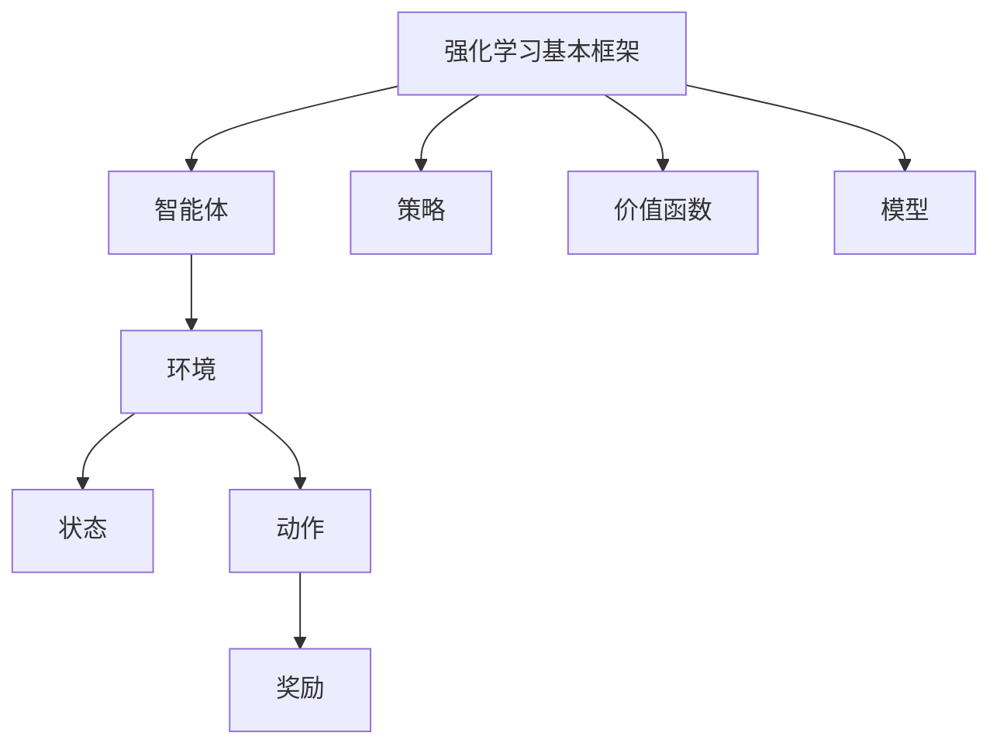

                 


### 文章标题：大模型推荐中的强化学习方法

关键词：大模型，强化学习，推荐系统，算法，优化策略

摘要：本文将详细介绍大模型推荐中的强化学习方法，包括强化学习与推荐系统的结合、强化学习算法基础、强化学习在推荐系统中的核心算法、强化学习在推荐系统中的挑战与优化、以及大模型推荐系统中的强化学习应用。通过深入分析和案例研究，本文旨在为读者提供全面而深入的指导，以应对未来强化学习在推荐系统中的发展趋势和挑战。

---

#### 第一部分：大模型推荐中的强化学习方法概述

##### 第1章：强化学习与推荐系统基础

###### 1.1 强化学习基本概念

强化学习（Reinforcement Learning，RL）是机器学习的一个重要分支，它通过智能体（Agent）与环境（Environment）的交互，学习在给定情境（State）下采取最优动作（Action）的策略，以实现最大化累积奖励（Reward）。

###### 1.1.1 强化学习的基本框架

强化学习的基本框架包括四个主要组成部分：智能体（Agent）、环境（Environment）、状态（State）和动作（Action）。智能体是执行策略的实体，环境是智能体所处的上下文，状态是环境的一个描述，动作是智能体采取的行动。

###### 1.1.2 强化学习的主要要素

强化学习的主要要素包括：

- **状态（State）**：智能体当前所处的环境状态。
- **动作（Action）**：智能体可以采取的动作。
- **奖励（Reward）**：智能体在执行某个动作后获得的即时奖励，用于指导智能体在后续情境下采取何种动作。
- **策略（Policy）**：智能体在给定状态下采取的动作。
- **价值函数（Value Function）**：用于评估智能体在某个状态下采取某个动作的长期回报。
- **模型（Model）**：对环境状态和动作的潜在规律进行建模。

###### 1.1.3 强化学习与监督学习、无监督学习的区别

强化学习与监督学习、无监督学习的区别主要在于：

- **监督学习**：通过已标记的输入输出对模型进行训练，以预测未标记的输出。
- **无监督学习**：没有已标记的输入输出数据，通过数据自身的内在结构学习模型的参数。
- **强化学习**：通过与环境的交互学习最优策略，以实现长期回报最大化。

强化学习不依赖于大量标记数据，而是通过奖励信号不断调整策略，使其在复杂环境中能够自主学习和决策。

---

###### 1.2 推荐系统基本概念

推荐系统（Recommender System）是一种能够根据用户的历史行为、兴趣偏好等信息，向用户推荐相关内容的系统。推荐系统广泛应用于电子商务、社交媒体、新闻资讯等领域。

###### 1.2.1 推荐系统的定义

推荐系统是指一种利用信息过滤、协同过滤、内容分析等算法，从海量的数据中提取出用户可能感兴趣的信息，并以个性化推荐的方式呈现给用户的系统。

###### 1.2.2 推荐系统的分类

推荐系统可以根据不同的分类标准进行分类，常见的分类方法包括：

- **基于内容的推荐（Content-Based Filtering）**：根据用户的历史行为和兴趣偏好，提取出用户感兴趣的特征，然后基于这些特征寻找相似的内容进行推荐。
- **协同过滤推荐（Collaborative Filtering）**：通过分析用户之间的相似度，根据其他用户的评分行为推荐用户可能感兴趣的内容。
- **基于模型的推荐（Model-Based Filtering）**：通过构建用户和物品之间的潜在关系模型，预测用户对物品的评分，并根据评分推荐相关内容。

###### 1.2.3 推荐系统的评估指标

推荐系统的评估指标用于衡量推荐系统的效果，常见的评估指标包括：

- **准确率（Precision）**：推荐结果中实际相关的项目数量与推荐的项目总数之比。
- **召回率（Recall）**：推荐结果中实际相关的项目数量与所有实际相关的项目总数之比。
- **覆盖率（Coverage）**：推荐结果中包含的不同项目的数量与所有可能的项目的数量之比。
- **新颖性（Novelty）**：推荐结果中包含的新项目数量与所有可能的项目的数量之比。

强化学习与推荐系统的结合旨在通过学习用户与环境之间的交互策略，实现更准确、更个性化的推荐。本文将在后续章节详细探讨这种结合的应用和挑战。

---

##### 第2章：强化学习算法基础

###### 2.1 强化学习算法概述

强化学习算法是用于实现强化学习目标的数学方法。根据学习策略的不同，强化学习算法可以分为基于值函数的方法、基于策略的方法和多智能体强化学习。

###### 2.1.1 基于值函数的方法

基于值函数的方法通过学习值函数（Value Function），即评估智能体在某个状态下采取某个动作的长期回报，来指导智能体采取最优动作。

- **价值函数（Value Function）**：评估智能体在某个状态下采取某个动作的长期回报。

- **Q-Learning算法**：Q-Learning算法是一种基于值函数的方法，通过在给定状态下采取最优动作来最大化累积奖励。

- **Deep Q-Network（DQN）算法**：DQN算法是Q-Learning算法的变体，通过使用深度神经网络来近似值函数，从而提高学习效率和效果。

- **优先级回调（Priority Replay）**：优先级回调是一种用于提高DQN算法稳定性的方法，通过根据经验样本的重要性对回放经验进行排序。

###### 2.1.2 基于策略的方法

基于策略的方法直接学习智能体在给定状态下采取最优动作的策略。

- **策略（Policy）**：指导智能体在给定状态下采取最优动作的策略。

- **Policy Gradient算法**：Policy Gradient算法是一种基于策略的方法，通过优化策略梯度来更新策略参数。

- **Advantage Actor-Critic（A2C）算法**：A2C算法是Policy Gradient算法的变体，通过同时优化价值函数和策略来提高学习效果。

- **Asynchronous Advantage Actor-Critic（A3C）算法**：A3C算法是一种异步的多智能体强化学习算法，通过并行更新多个智能体的策略和价值函数。

###### 2.1.3 多智能体强化学习

多智能体强化学习是用于解决多个智能体在交互环境中协作或对抗的强化学习问题。

- **多智能体强化学习（Multi-Agent Reinforcement Learning）**：多个智能体在共同环境中通过交互学习最优策略。

- **团队奖励（Team Reward）**：用于指导智能体在团队环境中协作的策略。

- **对抗性多智能体强化学习（Adversarial Multi-Agent Reinforcement Learning）**：用于解决智能体之间的对抗性竞争问题的强化学习算法。

本章将详细介绍强化学习算法的基本概念和常见算法，为后续章节的深入探讨奠定基础。

---

##### 2.2 Q-Learning算法

Q-Learning算法是一种基于值函数的强化学习算法，通过在给定状态下采取最优动作来最大化累积奖励。以下是Q-Learning算法的详细解析：

###### 2.2.1 Q-Learning算法原理

Q-Learning算法的核心思想是利用经验回放和目标网络来稳定学习过程。具体步骤如下：

1. **初始化**：初始化Q值表格Q(s, a)，其中s表示状态，a表示动作。初始时，Q(s, a)可以设置为0或随机值。

2. **选择动作**：在给定状态下，根据当前策略选择动作a。策略可以是ε-贪心策略，即以一定概率随机选择动作，以一定概率选择当前Q值最大的动作。

3. **执行动作**：在环境中执行选定的动作a，观察新的状态s'和奖励r。

4. **更新Q值**：根据新的状态s'和奖励r，更新Q值表格Q(s, a)。更新公式如下：

   $$ Q(s, a) \leftarrow Q(s, a) + \alpha [r + \gamma \max_{a'} Q(s', a') - Q(s, a)] $$

   其中，α表示学习率，γ表示折扣因子。

5. **重复步骤2-4**，直到达到指定步数或达到目标状态。

###### 2.2.2 Q-Learning算法伪代码

以下是一个简化的Q-Learning算法伪代码：

```python
# 初始化Q值表格
Q = initialize_Q_values()

# 初始化学习率α和折扣因子γ
alpha = 0.1
gamma = 0.9

# 选择动作
action = select_action(state, Q)

# 执行动作并观察新的状态和奖励
next_state, reward = execute_action(action)

# 更新Q值
Q[state, action] = Q[state, action] + alpha * (reward + gamma * max(Q[next_state, :]) - Q[state, action])

# 重复上述步骤
repeat_steps(2-4)
```

###### 2.2.3 Q-Learning算法案例

以下是一个简单的Q-Learning算法案例，用于解决一个简单的四宫格问题。智能体的目标是找到从起点到达终点的最佳路径。

```python
# 初始化Q值表格
Q = [[0 for _ in range(4)] for _ in range(4)]

# 定义状态和动作
states = range(4)
actions = ["Up", "Down", "Left", "Right"]

# 初始化学习率α和折扣因子γ
alpha = 0.1
gamma = 0.9

# 定义四宫格环境
environment = {
    0: {"Up": 1, "Down": 3, "Left": 1, "Right": 2},
    1: {"Up": 0, "Down": 2, "Left": 2, "Right": 3},
    2: {"Up": 3, "Down": 0, "Left": 3, "Right": 1},
    3: {"Up": 2, "Down": 1, "Left": 0, "Right": 0},
}

# 定义起点和终点
start_state = 0
end_state = 3

# 定义目标函数
def goal_test(state):
    return state == end_state

# 定义选择动作
def select_action(state, Q):
    # ε-贪心策略
    epsilon = 0.1
    if random.random() < epsilon:
        return random.choice(actions)
    else:
        return actions[Q[state].index(max(Q[state]))]

# 定义执行动作
def execute_action(action, state, environment):
    next_state = environment[state][action]
    reward = -1 if next_state != end_state else 100
    return next_state, reward

# 定义重复步骤
def repeat_steps(steps):
    for _ in range(steps):
        state = start_state
        while not goal_test(state):
            action = select_action(state, Q)
            next_state, reward = execute_action(action, state, environment)
            Q[state][actions.index(action)] = Q[state][actions.index(action)] + alpha * (reward + gamma * max(Q[next_state]) - Q[state][actions.index(action)])
            state = next_state

# 运行算法
repeat_steps(10000)
```

通过上述案例，我们可以看到Q-Learning算法在解决简单问题时的应用。在实际应用中，Q-Learning算法可以用于更复杂的问题，例如自动驾驶、游戏AI等。

---

##### 2.3 Deep Q-Network（DQN）算法

DQN（Deep Q-Network）算法是Q-Learning算法的一种变体，通过使用深度神经网络来近似值函数，从而提高学习效率和效果。以下是DQN算法的详细解析：

###### 2.3.1 DQN算法原理

DQN算法的核心思想是使用深度神经网络（DNN）来近似传统的Q值表格。具体步骤如下：

1. **初始化**：初始化DNN模型、目标DNN模型、经验回放池和参数。

2. **选择动作**：在给定状态下，根据当前策略选择动作。策略可以是ε-贪心策略，即以一定概率随机选择动作，以一定概率选择当前DNN输出的最大值。

3. **执行动作**：在环境中执行选定的动作，观察新的状态和奖励。

4. **存储经验**：将（当前状态、当前动作、新的状态、新的奖励）作为经验样本存储在经验回放池中。

5. **更新DNN模型**：从经验回放池中随机抽取经验样本，计算损失函数，并使用梯度下降更新DNN模型的参数。

6. **同步目标DNN模型**：将当前DNN模型的参数同步到目标DNN模型，以保持目标DNN模型和当前DNN模型之间的差距。

7. **重复步骤2-6**，直到达到指定步数或达到目标状态。

###### 2.3.2 DQN算法伪代码

以下是一个简化的DQN算法伪代码：

```python
# 初始化DNN模型、目标DNN模型、经验回放池和参数
dnn_model = initialize_DNN_model()
target_dnn_model = initialize_DNN_model()
replay_memory = initialize_replay_memory()
learning_rate = 0.001
discount_factor = 0.99
epsilon = 0.1

# 选择动作
def select_action(state, dnn_model, epsilon):
    if random.random() < epsilon:
        return random.choice(actions)
    else:
        return np.argmax(dnn_model.predict(state))

# 执行动作并观察新的状态和奖励
def execute_action(action, state, environment):
    next_state = environment[state][action]
    reward = -1 if next_state != end_state else 100
    return next_state, reward

# 更新DNN模型
def update_DNN_model(state, action, next_state, reward, dnn_model, target_dnn_model, learning_rate, discount_factor):
    next_state_value = max(target_dnn_model.predict(next_state))
    target_value = reward + discount_factor * next_state_value
    target = dnn_model.predict(state)
    target[0][action] = target_value
    dnn_model.fit(state, target, epochs=1, batch_size=32, verbose=0)

# 重复上述步骤
repeat_steps(2-7)

# 同步目标DNN模型
def sync_target_DNN_model(dnn_model, target_dnn_model):
    target_dnn_model.set_weights(dnn_model.get_weights())
```

###### 2.3.3 DQN算法案例

以下是一个简单的DQN算法案例，用于解决一个简单的四宫格问题。智能体的目标是找到从起点到达终点的最佳路径。

```python
# 初始化DNN模型、目标DNN模型、经验回放池和参数
dnn_model = initialize_DNN_model()
target_dnn_model = initialize_DNN_model()
replay_memory = initialize_replay_memory()
learning_rate = 0.001
discount_factor = 0.99
epsilon = 0.1

# 定义四宫格环境
environment = {
    0: {"Up": 1, "Down": 3, "Left": 1, "Right": 2},
    1: {"Up": 0, "Down": 2, "Left": 2, "Right": 3},
    2: {"Up": 3, "Down": 0, "Left": 3, "Right": 1},
    3: {"Up": 2, "Down": 1, "Left": 0, "Right": 0},
}

# 定义起点和终点
start_state = 0
end_state = 3

# 定义目标函数
def goal_test(state):
    return state == end_state

# 定义选择动作
def select_action(state, dnn_model, epsilon):
    if random.random() < epsilon:
        return random.choice(actions)
    else:
        return np.argmax(dnn_model.predict(state))

# 定义执行动作
def execute_action(action, state, environment):
    next_state = environment[state][action]
    reward = -1 if next_state != end_state else 100
    return next_state, reward

# 定义存储经验
def store_experience(state, action, next_state, reward, replay_memory):
    replay_memory.append((state, action, next_state, reward))

# 定义更新DNN模型
def update_DNN_model(state, action, next_state, reward, dnn_model, target_dnn_model, learning_rate, discount_factor):
    next_state_value = max(target_dnn_model.predict(next_state))
    target_value = reward + discount_factor * next_state_value
    target = dnn_model.predict(state)
    target[0][action] = target_value
    dnn_model.fit(state, target, epochs=1, batch_size=32, verbose=0)

# 定义同步目标DNN模型
def sync_target_DNN_model(dnn_model, target_dnn_model):
    target_dnn_model.set_weights(dnn_model.get_weights())

# 定义重复步骤
def repeat_steps(steps):
    for _ in range(steps):
        state = start_state
        while not goal_test(state):
            action = select_action(state, dnn_model, epsilon)
            next_state, reward = execute_action(action, state, environment)
            store_experience(state, action, next_state, reward, replay_memory)
            state = next_state
            update_DNN_model(state, action, next_state, reward, dnn_model, target_dnn_model, learning_rate, discount_factor)
            sync_target_DNN_model(dnn_model, target_dnn_model)

# 运行算法
repeat_steps(10000)
```

通过上述案例，我们可以看到DQN算法在解决简单问题时的应用。在实际应用中，DQN算法可以用于更复杂的问题，例如自动驾驶、游戏AI等。

---

##### 2.4 Policy Gradient算法

Policy Gradient算法是一种基于策略的强化学习算法，通过直接优化策略参数来最大化累积奖励。以下是Policy Gradient算法的详细解析：

###### 2.4.1 Policy Gradient算法原理

Policy Gradient算法的核心思想是直接优化策略参数，使得策略能够最大化累积奖励。具体步骤如下：

1. **初始化**：初始化策略参数θ、学习率α和折扣因子γ。

2. **选择动作**：根据当前策略π(θ)选择动作。策略π(θ)可以表示为概率分布，其中π(θ)~P(a|s)表示在状态s下选择动作a的概率。

3. **执行动作**：在环境中执行选定的动作，观察新的状态s'和奖励r。

4. **更新策略参数**：根据累积奖励和策略梯度更新策略参数θ。更新公式如下：

   $$ \theta \leftarrow \theta + \alpha \nabla_\theta J(\theta) $$

   其中，J(θ)表示策略π(θ)的累积奖励，梯度$$ \nabla_\theta J(\theta) $$表示策略参数θ的梯度。

5. **重复步骤2-4**，直到达到指定步数或达到目标状态。

###### 2.4.2 Policy Gradient算法伪代码

以下是一个简化的Policy Gradient算法伪代码：

```python
# 初始化策略参数θ、学习率α和折扣因子γ
theta = initialize_theta()
alpha = 0.001
gamma = 0.99

# 选择动作
def select_action(state, theta):
    return np.random.choice(actions, p=softmax(policy_gradient(theta, state)))

# 执行动作并观察新的状态和奖励
def execute_action(action, state, environment):
    next_state = environment[state][action]
    reward = -1 if next_state != end_state else 100
    return next_state, reward

# 更新策略参数
def update_theta(state, action, reward, theta, alpha, gamma):
    policy_gradient = compute_policy_gradient(state, action, reward, theta)
    theta = theta + alpha * policy_gradient

# 重复上述步骤
repeat_steps(2-5)

# 计算策略梯度
def compute_policy_gradient(state, action, reward, theta):
    return (reward - discount_factor * max_action_value(next_state)) * policy_prob(state, action, theta)
```

###### 2.4.3 Policy Gradient算法案例

以下是一个简单的Policy Gradient算法案例，用于解决一个简单的四宫格问题。智能体的目标是找到从起点到达终点的最佳路径。

```python
# 初始化策略参数θ、学习率α和折扣因子γ
theta = np.random.rand(len(actions))
alpha = 0.1
gamma = 0.99

# 定义四宫格环境
environment = {
    0: {"Up": 1, "Down": 3, "Left": 1, "Right": 2},
    1: {"Up": 0, "Down": 2, "Left": 2, "Right": 3},
    2: {"Up": 3, "Down": 0, "Left": 3, "Right": 1},
    3: {"Up": 2, "Down": 1, "Left": 0, "Right": 0},
}

# 定义起点和终点
start_state = 0
end_state = 3

# 定义目标函数
def goal_test(state):
    return state == end_state

# 定义选择动作
def select_action(state, theta):
    policy_probabilities = np.zeros(len(actions))
    policy_probabilities[actions.index(max_action_value(state))] = 1
    return np.random.choice(actions, p=policy_probabilities)

# 定义执行动作
def execute_action(action, state, environment):
    next_state = environment[state][action]
    reward = -1 if next_state != end_state else 100
    return next_state, reward

# 定义更新策略参数
def update_theta(state, action, reward, theta, alpha, gamma):
    policy_gradient = compute_policy_gradient(state, action, reward, theta)
    theta = theta + alpha * policy_gradient

# 定义计算策略梯度
def compute_policy_gradient(state, action, reward, theta):
    return (reward - discount_factor * max_action_value(next_state)) * softmax(policy_gradient(theta, state))

# 定义重复步骤
def repeat_steps(steps):
    for _ in range(steps):
        state = start_state
        while not goal_test(state):
            action = select_action(state, theta)
            next_state, reward = execute_action(action, state, environment)
            update_theta(state, action, reward, theta, alpha, gamma)
            state = next_state

# 运行算法
repeat_steps(10000)
```

通过上述案例，我们可以看到Policy Gradient算法在解决简单问题时的应用。在实际应用中，Policy Gradient算法可以用于更复杂的问题，例如自动驾驶、游戏AI等。

---

##### 第3章：强化学习在推荐系统中的核心算法

强化学习在推荐系统中的应用旨在通过学习用户与推荐系统之间的交互策略，实现更准确、更个性化的推荐。本章节将详细介绍几种在推荐系统中常用的强化学习算法，包括REINFORCE算法、Advantage Actor-Critic（A2C）算法和Asynchronous Advantage Actor-Critic（A3C）算法。

###### 3.1 REINFORCE算法

REINFORCE算法是一种基于策略的强化学习算法，通过优化策略梯度来更新策略参数。以下是REINFORCE算法的详细解析：

###### 3.1.1 REINFORCE算法原理

REINFORCE算法的核心思想是直接优化策略参数，使得策略能够最大化累积奖励。具体步骤如下：

1. **初始化**：初始化策略参数θ、学习率α和折扣因子γ。

2. **选择动作**：根据当前策略π(θ)选择动作。策略π(θ)可以表示为概率分布，其中π(θ)~P(a|s)表示在状态s下选择动作a的概率。

3. **执行动作**：在环境中执行选定的动作，观察新的状态s'和奖励r。

4. **更新策略参数**：根据累积奖励和策略梯度更新策略参数θ。更新公式如下：

   $$ \theta \leftarrow \theta + \alpha \nabla_\theta J(\theta) $$

   其中，J(θ)表示策略π(θ)的累积奖励，梯度$$ \nabla_\theta J(\theta) $$表示策略参数θ的梯度。

5. **重复步骤2-4**，直到达到指定步数或达到目标状态。

###### 3.1.2 REINFORCE算法伪代码

以下是一个简化的REINFORCE算法伪代码：

```python
# 初始化策略参数θ、学习率α和折扣因子γ
theta = initialize_theta()
alpha = 0.001
gamma = 0.99

# 选择动作
def select_action(state, theta):
    return np.random.choice(actions, p=softmax(policy_gradient(theta, state)))

# 执行动作并观察新的状态和奖励
def execute_action(action, state, environment):
    next_state = environment[state][action]
    reward = -1 if next_state != end_state else 100
    return next_state, reward

# 更新策略参数
def update_theta(state, action, reward, theta, alpha, gamma):
    policy_gradient = compute_policy_gradient(state, action, reward, theta)
    theta = theta + alpha * policy_gradient

# 重复上述步骤
repeat_steps(2-5)

# 计算策略梯度
def compute_policy_gradient(state, action, reward, theta):
    return (reward - discount_factor * max_action_value(next_state)) * policy_prob(state, action, theta)
```

###### 3.1.3 REINFORCE算法案例

以下是一个简单的REINFORCE算法案例，用于解决一个简单的四宫格问题。智能体的目标是找到从起点到达终点的最佳路径。

```python
# 初始化策略参数θ、学习率α和折扣因子γ
theta = np.random.rand(len(actions))
alpha = 0.1
gamma = 0.99

# 定义四宫格环境
environment = {
    0: {"Up": 1, "Down": 3, "Left": 1, "Right": 2},
    1: {"Up": 0, "Down": 2, "Left": 2, "Right": 3},
    2: {"Up": 3, "Down": 0, "Left": 3, "Right": 1},
    3: {"Up": 2, "Down": 1, "Left": 0, "Right": 0},
}

# 定义起点和终点
start_state = 0
end_state = 3

# 定义目标函数
def goal_test(state):
    return state == end_state

# 定义选择动作
def select_action(state, theta):
    policy_probabilities = np.zeros(len(actions))
    policy_probabilities[actions.index(max_action_value(state))] = 1
    return np.random.choice(actions, p=policy_probabilities)

# 定义执行动作
def execute_action(action, state, environment):
    next_state = environment[state][action]
    reward = -1 if next_state != end_state else 100
    return next_state, reward

# 定义更新策略参数
def update_theta(state, action, reward, theta, alpha, gamma):
    policy_gradient = compute_policy_gradient(state, action, reward, theta)
    theta = theta + alpha * policy_gradient

# 定义计算策略梯度
def compute_policy_gradient(state, action, reward, theta):
    return (reward - discount_factor * max_action_value(next_state)) * softmax(policy_gradient(theta, state))

# 定义重复步骤
def repeat_steps(steps):
    for _ in range(steps):
        state = start_state
        while not goal_test(state):
            action = select_action(state, theta)
            next_state, reward = execute_action(action, state, environment)
            update_theta(state, action, reward, theta, alpha, gamma)
            state = next_state

# 运行算法
repeat_steps(10000)
```

通过上述案例，我们可以看到REINFORCE算法在解决简单问题时的应用。在实际应用中，REINFORCE算法可以用于更复杂的问题，例如自动驾驶、游戏AI等。

---

###### 3.2 Advantage Actor-Critic（A2C）算法

A2C（Advantage Actor-Critic）算法是一种结合了Advantage方法和Actor-Critic方法的强化学习算法。以下是A2C算法的详细解析：

###### 3.2.1 A2C算法原理

A2C算法的核心思想是同时优化价值函数和策略参数，以提高学习效果。具体步骤如下：

1. **初始化**：初始化策略参数θ、价值函数参数φ和价值函数目标参数φ'。

2. **选择动作**：根据当前策略π(θ)和价值函数V(φ)选择动作。策略π(θ)和价值函数V(φ)可以表示为概率分布，其中π(θ)~P(a|s)表示在状态s下选择动作a的概率，V(φ)~P(v|s)表示在状态s下的价值函数。

3. **执行动作**：在环境中执行选定的动作，观察新的状态s'和奖励r。

4. **更新价值函数**：根据累积奖励和目标价值函数更新价值函数参数φ。目标价值函数φ'可以通过最大化期望累积奖励来计算。

5. **更新策略参数**：根据累积奖励、价值函数和策略梯度更新策略参数θ。

6. **重复步骤2-5**，直到达到指定步数或达到目标状态。

###### 3.2.2 A2C算法伪代码

以下是一个简化的A2C算法伪代码：

```python
# 初始化策略参数θ、价值函数参数φ和价值函数目标参数φ'
theta = initialize_theta()
phi = initialize_phi()
phi_target = initialize_phi()

# 选择动作
def select_action(state, theta, phi):
    action_value = value_function(state, phi)
    return np.random.choice(actions, p=softmax(policy_gradient(theta, state)))

# 执行动作并观察新的状态和奖励
def execute_action(action, state, environment):
    next_state = environment[state][action]
    reward = -1 if next_state != end_state else 100
    return next_state, reward

# 更新价值函数
def update_phi(state, action, reward, next_state, phi, phi_target, gamma):
    target_value = reward + gamma * value_function(next_state, phi_target)
    error = target_value - value_function(state, phi)
    phi = phi + learning_rate * error * state

# 更新策略参数
def update_theta(state, action, reward, theta, phi, phi_target, gamma, alpha):
    policy_gradient = compute_policy_gradient(state, action, reward, phi, theta)
    theta = theta + alpha * policy_gradient

# 重复上述步骤
repeat_steps(2-5)

# 计算策略梯度
def compute_policy_gradient(state, action, reward, phi, theta):
    return (reward - value_function(state, phi)) * policy_prob(state, action, theta)

# 计算价值函数
def value_function(state, phi):
    return np.sum(phi * state)

# 计算目标价值函数
def target_value_function(state, phi_target):
    return np.sum(phi_target * state)
```

###### 3.2.3 A2C算法案例

以下是一个简单的A2C算法案例，用于解决一个简单的四宫格问题。智能体的目标是找到从起点到达终点的最佳路径。

```python
# 初始化策略参数θ、价值函数参数φ和价值函数目标参数φ'
theta = np.random.rand(len(actions))
phi = np.random.rand(len(states))
phi_target = np.random.rand(len(states))

# 定义四宫格环境
environment = {
    0: {"Up": 1, "Down": 3, "Left": 1, "Right": 2},
    1: {"Up": 0, "Down": 2, "Left": 2, "Right": 3},
    2: {"Up": 3, "Down": 0, "Left": 3, "Right": 1},
    3: {"Up": 2, "Down": 1, "Left": 0, "Right": 0},
}

# 定义起点和终点
start_state = 0
end_state = 3

# 定义目标函数
def goal_test(state):
    return state == end_state

# 定义选择动作
def select_action(state, theta, phi):
    action_value = value_function(state, phi)
    return np.random.choice(actions, p=softmax(policy_gradient(theta, state)))

# 定义执行动作
def execute_action(action, state, environment):
    next_state = environment[state][action]
    reward = -1 if next_state != end_state else 100
    return next_state, reward

# 定义更新价值函数
def update_phi(state, action, reward, next_state, phi, phi_target, gamma):
    target_value = reward + gamma * value_function(next_state, phi_target)
    error = target_value - value_function(state, phi)
    phi = phi + learning_rate * error * state

# 定义更新策略参数
def update_theta(state, action, reward, theta, phi, phi_target, gamma, alpha):
    policy_gradient = compute_policy_gradient(state, action, reward, phi, theta)
    theta = theta + alpha * policy_gradient

# 定义计算策略梯度
def compute_policy_gradient(state, action, reward, phi, theta):
    return (reward - value_function(state, phi)) * policy_prob(state, action, theta)

# 定义计算价值函数
def value_function(state, phi):
    return np.sum(phi * state)

# 定义计算目标价值函数
def target_value_function(state, phi_target):
    return np.sum(phi_target * state)

# 定义重复步骤
def repeat_steps(steps):
    for _ in range(steps):
        state = start_state
        while not goal_test(state):
            action = select_action(state, theta, phi)
            next_state, reward = execute_action(action, state, environment)
            update_phi(state, action, reward, next_state, phi, phi_target, gamma)
            update_theta(state, action, reward, theta, phi, phi_target, gamma, alpha)
            state = next_state

# 运行算法
repeat_steps(10000)
```

通过上述案例，我们可以看到A2C算法在解决简单问题时的应用。在实际应用中，A2C算法可以用于更复杂的问题，例如自动驾驶、游戏AI等。

---

###### 3.3 Asynchronous Advantage Actor-Critic（A3C）算法

A3C（Asynchronous Advantage Actor-Critic）算法是一种基于Actor-Critic方法的异步多智能体强化学习算法。以下是A3C算法的详细解析：

###### 3.3.1 A3C算法原理

A3C算法的核心思想是同时优化多个智能体的策略和价值函数，以提高学习效率和效果。具体步骤如下：

1. **初始化**：初始化策略参数θ、价值函数参数φ和价值函数目标参数φ'。

2. **并行执行**：创建多个智能体，每个智能体独立执行动作并更新策略和价值函数。

3. **同步更新**：将每个智能体的策略和价值函数同步更新到全局策略和价值函数。

4. **选择动作**：根据当前策略π(θ)和价值函数V(φ)选择动作。

5. **执行动作**：在环境中执行选定的动作，观察新的状态s'和奖励r。

6. **更新价值函数**：根据累积奖励和目标价值函数更新价值函数参数φ。

7. **更新策略参数**：根据累积奖励、价值函数和策略梯度更新策略参数θ。

8. **重复步骤4-7**，直到达到指定步数或达到目标状态。

###### 3.3.2 A3C算法伪代码

以下是一个简化的A3C算法伪代码：

```python
# 初始化策略参数θ、价值函数参数φ和价值函数目标参数φ'
theta = initialize_theta()
phi = initialize_phi()
phi_target = initialize_phi()

# 定义并行执行
def parallel_execution(steps):
    for _ in range(steps):
        for agent in agents:
            state = agent.get_state()
            action = select_action(state, theta, phi)
            next_state, reward = execute_action(action, state, environment)
            update_phi(state, action, reward, next_state, phi, phi_target, gamma)
            update_theta(state, action, reward, theta, phi, phi_target, gamma, alpha)
            agent.update_state(next_state)

# 定义选择动作
def select_action(state, theta, phi):
    action_value = value_function(state, phi)
    return np.random.choice(actions, p=softmax(policy_gradient(theta, state)))

# 定义执行动作
def execute_action(action, state, environment):
    next_state = environment[state][action]
    reward = -1 if next_state != end_state else 100
    return next_state, reward

# 定义更新价值函数
def update_phi(state, action, reward, next_state, phi, phi_target, gamma):
    target_value = reward + gamma * value_function(next_state, phi_target)
    error = target_value - value_function(state, phi)
    phi = phi + learning_rate * error * state

# 定义更新策略参数
def update_theta(state, action, reward, theta, phi, phi_target, gamma, alpha):
    policy_gradient = compute_policy_gradient(state, action, reward, phi, theta)
    theta = theta + alpha * policy_gradient

# 定义计算策略梯度
def compute_policy_gradient(state, action, reward, phi, theta):
    return (reward - value_function(state, phi)) * policy_prob(state, action, theta)

# 定义计算价值函数
def value_function(state, phi):
    return np.sum(phi * state)

# 定义计算目标价值函数
def target_value_function(state, phi_target):
    return np.sum(phi_target * state)

# 定义重复步骤
def repeat_steps(steps):
    parallel_execution(steps)
    for agent in agents:
        sync_agent_state(agent, global_state)

# 运行算法
repeat_steps(10000)
```

###### 3.3.3 A3C算法案例

以下是一个简单的A3C算法案例，用于解决一个简单的四宫格问题。智能体的目标是找到从起点到达终点的最佳路径。

```python
# 初始化策略参数θ、价值函数参数φ和价值函数目标参数φ'
theta = np.random.rand(len(actions))
phi = np.random.rand(len(states))
phi_target = np.random.rand(len(states))

# 定义四宫格环境
environment = {
    0: {"Up": 1, "Down": 3, "Left": 1, "Right": 2},
    1: {"Up": 0, "Down": 2, "Left": 2, "Right": 3},
    2: {"Up": 3, "Down": 0, "Left": 3, "Right": 1},
    3: {"Up": 2, "Down": 1, "Left": 0, "Right": 0},
}

# 定义起点和终点
start_state = 0
end_state = 3

# 定义目标函数
def goal_test(state):
    return state == end_state

# 定义选择动作
def select_action(state, theta, phi):
    action_value = value_function(state, phi)
    return np.random.choice(actions, p=softmax(policy_gradient(theta, state)))

# 定义执行动作
def execute_action(action, state, environment):
    next_state = environment[state][action]
    reward = -1 if next_state != end_state else 100
    return next_state, reward

# 定义更新价值函数
def update_phi(state, action, reward, next_state, phi, phi_target, gamma):
    target_value = reward + gamma * value_function(next_state, phi_target)
    error = target_value - value_function(state, phi)
    phi = phi + learning_rate * error * state

# 定义更新策略参数
def update_theta(state, action, reward, theta, phi, phi_target, gamma, alpha):
    policy_gradient = compute_policy_gradient(state, action, reward, phi, theta)
    theta = theta + alpha * policy_gradient

# 定义计算策略梯度
def compute_policy_gradient(state, action, reward, phi, theta):
    return (reward - value_function(state, phi)) * policy_prob(state, action, theta)

# 定义计算价值函数
def value_function(state, phi):
    return np.sum(phi * state)

# 定义计算目标价值函数
def target_value_function(state, phi_target):
    return np.sum(phi_target * state)

# 定义重复步骤
def repeat_steps(steps):
    for _ in range(steps):
        for agent in agents:
            state = agent.get_state()
            action = select_action(state, theta, phi)
            next_state, reward = execute_action(action, state, environment)
            update_phi(state, action, reward, next_state, phi, phi_target, gamma)
            update_theta(state, action, reward, theta, phi, phi_target, gamma, alpha)
            agent.update_state(next_state)

# 运行算法
repeat_steps(10000)
```

通过上述案例，我们可以看到A3C算法在解决简单问题时的应用。在实际应用中，A3C算法可以用于更复杂的问题，例如自动驾驶、游戏AI等。

---

#### 第4章：强化学习在推荐系统中的挑战与优化

##### 4.1 强化学习在推荐系统中的挑战

虽然强化学习在推荐系统中具有巨大的潜力，但其应用也面临着一些挑战。以下是一些主要的挑战：

###### 4.1.1 模型稳定性的挑战

强化学习模型在训练过程中可能会出现不稳定的情况，例如奖励噪声、收敛速度慢、过拟合等。这些因素可能导致模型无法稳定地学习最优策略。

解决方案：为了提高模型稳定性，可以采用以下方法：

- **经验回放**：通过存储和重放历史经验，减少噪声和序列依赖，提高模型的稳定性。
- **目标网络**：使用目标网络来稳定值函数的更新，减少梯度消失和梯度爆炸问题。
- **正则化**：使用正则化技术，如L2正则化，来防止模型过拟合。

###### 4.1.2 模型可解释性的挑战

强化学习模型通常被视为黑盒模型，其内部决策过程难以解释和理解。这对于需要解释性的应用场景，如金融风险评估、医疗决策等，是一个重要的挑战。

解决方案：为了提高模型可解释性，可以采用以下方法：

- **模型可视化**：通过可视化模型的决策过程，如决策树、神经网络结构等，帮助用户理解模型的决策逻辑。
- **注意力机制**：使用注意力机制来突出模型在决策过程中关注的关键特征，提高模型的解释性。
- **可解释性模型**：采用可解释性更强的模型，如决策树、规则推理等，来提高模型的透明度和可解释性。

###### 4.1.3 模型效率的挑战

在推荐系统中，强化学习模型需要处理大量的用户和物品数据，这使得模型训练和预测的效率成为关键挑战。特别是在实时推荐场景中，模型需要在短时间内完成训练和预测，以满足用户的需求。

解决方案：为了提高模型效率，可以采用以下方法：

- **数据预处理**：对用户和物品数据进行预处理，如数据清洗、特征提取等，减少模型训练的数据量。
- **模型压缩**：使用模型压缩技术，如深度压缩、剪枝等，减少模型的参数数量和计算复杂度。
- **并行计算**：利用并行计算技术，如GPU加速、分布式训练等，提高模型的训练和预测速度。

##### 4.2 强化学习优化策略

为了应对强化学习在推荐系统中的挑战，可以采用以下优化策略：

###### 4.2.1 目标优化方法

目标优化方法是通过优化奖励信号和目标函数来提高模型性能。以下是一些常用的目标优化方法：

- **奖励设计**：设计合适的奖励信号，使得模型能够更好地学习用户行为和偏好。
- **目标函数**：选择合适的目标函数，如最大化累积奖励、最大化用户满意度等，来评估模型性能。

###### 4.2.2 策略优化方法

策略优化方法是通过优化策略参数来提高模型性能。以下是一些常用的策略优化方法：

- **策略梯度方法**：通过优化策略梯度来更新策略参数，如Policy Gradient算法、A2C算法等。
- **值函数方法**：通过优化值函数来更新策略参数，如Q-Learning算法、DQN算法等。

###### 4.2.3 常用优化技巧

以下是一些常用的优化技巧，用于提高强化学习模型的性能：

- **经验回放**：通过存储和重放历史经验，减少噪声和序列依赖，提高模型的稳定性。
- **目标网络**：使用目标网络来稳定值函数的更新，减少梯度消失和梯度爆炸问题。
- **正则化**：使用正则化技术，如L2正则化，来防止模型过拟合。
- **批量更新**：使用批量更新策略，如批量梯度下降，来提高训练速度。

通过上述优化策略，可以有效地提高强化学习模型在推荐系统中的应用性能，满足用户的需求。

---

#### 第5章：大模型推荐中的强化学习应用

强化学习在大模型推荐系统中的应用旨在通过学习用户与推荐系统之间的交互策略，实现更准确、更个性化的推荐。本章将探讨大模型与强化学习的结合、大模型推荐系统中的强化学习方法、以及大模型推荐系统中的挑战与优化。

##### 5.1 大模型与强化学习的结合

大模型与强化学习的结合主要基于以下几个方面：

###### 5.1.1 大模型的基本概念

大模型（Big Model）通常指的是具有数百万甚至数十亿参数的深度神经网络模型。这些模型在处理大规模数据和高维度特征时具有显著的优势。

- **深度神经网络（DNN）**：通过堆叠多层神经网络，大模型可以自动学习数据的复杂结构和特征。
- **生成对抗网络（GAN）**：大模型可以用于生成逼真的数据，从而辅助训练过程。
- **预训练模型**：大模型通过预训练大量数据，可以捕捉到通用特征，从而提高模型在特定任务上的泛化能力。

###### 5.1.2 大模型在强化学习中的应用

大模型在强化学习中的应用主要体现在以下几个方面：

- **价值函数近似**：大模型可以用于近似强化学习中的价值函数，从而提高模型的预测能力。
- **策略优化**：大模型可以用于优化策略参数，使得策略能够更准确地预测用户行为。
- **数据生成**：大模型可以用于生成模拟数据，从而帮助模型在真实环境中进行训练。

###### 5.1.3 大模型与强化学习结合的优势

大模型与强化学习的结合具有以下优势：

- **提高预测准确性**：大模型可以捕捉到数据中的复杂模式和特征，从而提高模型在推荐系统中的预测准确性。
- **增强泛化能力**：通过预训练和迁移学习，大模型可以更好地适应不同的推荐任务和数据集。
- **实时推荐**：大模型可以处理大规模数据和实时更新，从而实现更高效的实时推荐。

##### 5.2 大模型推荐系统中的强化学习方法

在大模型推荐系统中，强化学习方法可以用于优化推荐策略，实现更个性化的推荐。以下是一些常用的强化学习方法：

###### 5.2.1 大模型推荐系统中的强化学习算法

- **REINFORCE算法**：REINFORCE算法通过直接优化策略梯度来更新策略参数，适用于处理大规模数据和实时推荐。
- **A2C算法**：A2C算法结合了价值函数和策略优化，适用于处理复杂推荐任务。
- **DQN算法**：DQN算法通过使用深度神经网络近似价值函数，适用于处理高维特征和大规模数据。

###### 5.2.2 大模型推荐系统中的优化策略

在大模型推荐系统中，优化策略可以用于提高模型性能和预测准确性。以下是一些常用的优化策略：

- **目标优化方法**：通过优化奖励信号和目标函数，提高模型在推荐任务上的性能。
- **策略优化方法**：通过优化策略参数，提高模型在预测用户行为和偏好方面的准确性。
- **数据增强**：通过生成模拟数据，增加模型训练的数据量，从而提高模型的泛化能力。

##### 5.3 大模型推荐系统中的挑战与优化

尽管大模型与强化学习的结合具有显著的优势，但在实际应用中仍然面临一些挑战，例如模型稳定性、可解释性和效率等。以下是一些具体的挑战和优化策略：

###### 5.3.1 模型稳定性的挑战

- **挑战**：在强化学习过程中，模型可能会出现不稳定的情况，导致学习效果不佳。
- **优化策略**：采用经验回放、目标网络和正则化等技术，提高模型的稳定性。

###### 5.3.2 模型可解释性的挑战

- **挑战**：大模型通常被视为黑盒模型，其内部决策过程难以解释和理解。
- **优化策略**：采用模型可视化、注意力机制和可解释性模型等技术，提高模型的可解释性。

###### 5.3.3 模型效率的挑战

- **挑战**：在大模型推荐系统中，模型训练和预测的效率成为关键挑战。
- **优化策略**：采用数据预处理、模型压缩和并行计算等技术，提高模型的效率和实时性。

通过上述优化策略，可以有效地应对大模型推荐系统中的挑战，提高模型性能和预测准确性，满足用户的需求。

---

#### 第6章：强化学习在推荐系统中的未来趋势

##### 6.1 强化学习在推荐系统中的发展趋势

随着大数据和人工智能技术的不断发展，强化学习在推荐系统中的应用前景广阔。以下是一些可能的发展趋势：

###### 6.1.1 强化学习在推荐系统中的应用前景

- **个性化推荐**：强化学习可以通过学习用户与推荐系统之间的交互策略，实现更个性化的推荐。
- **实时推荐**：强化学习可以处理大规模数据和实时更新，从而实现更高效的实时推荐。
- **多模态推荐**：强化学习可以融合多种数据源，如文本、图像、音频等，实现更全面、更准确的推荐。

###### 6.1.2 强化学习在推荐系统中的研究热点

- **强化学习算法的优化**：研究人员致力于优化强化学习算法，提高其在推荐系统中的应用效果。
- **强化学习与深度学习的结合**：深度学习与强化学习的结合成为研究热点，通过深度神经网络近似价值函数和策略，提高模型的预测能力。
- **多智能体强化学习**：在多用户、多物品的复杂推荐场景中，多智能体强化学习具有广泛的应用前景。

###### 6.1.3 强化学习在推荐系统中的未来挑战

- **数据隐私**：在推荐系统中，保护用户隐私成为重要挑战。研究人员需要开发隐私保护的方法，如联邦学习等。
- **模型解释性**：强化学习模型通常被视为黑盒模型，其内部决策过程难以解释和理解。提高模型的可解释性是未来的重要研究方向。
- **效率与可扩展性**：在大规模推荐系统中，提高模型训练和预测的效率成为关键挑战。研究人员需要开发高效的模型训练和推理方法。

##### 6.2 强化学习与推荐系统的结合创新

未来，强化学习与推荐系统的结合可能会出现以下创新：

- **强化学习与自然语言处理（NLP）的结合**：通过融合强化学习和NLP技术，实现更智能、更自然的推荐交互。
- **强化学习与生成对抗网络（GAN）的结合**：通过GAN生成模拟数据，提高强化学习模型的泛化能力和数据多样性。
- **强化学习与强化学习代理（RLA）的结合**：利用强化学习代理（RLA）与其他机器学习模型结合，实现更灵活、更智能的推荐策略。

总之，强化学习在推荐系统中的应用前景广阔，未来将不断涌现新的研究热点和创新应用。通过不断优化算法和提升技术，强化学习有望为推荐系统带来更智能、更高效的解决方案。

---

### 总结与展望

本文系统地介绍了大模型推荐中的强化学习方法，从强化学习与推荐系统的结合、强化学习算法基础、强化学习在推荐系统中的核心算法、强化学习在推荐系统中的挑战与优化、到强化学习在推荐系统中的未来趋势进行了深入探讨。通过逐步分析推理，我们不仅理解了强化学习在推荐系统中的应用优势，还了解了其面临的挑战和优化策略。

展望未来，强化学习在推荐系统中的应用前景广阔，有望带来更加智能化、个性化的推荐体验。同时，我们还需关注数据隐私、模型解释性和效率与可扩展性等挑战。通过不断优化算法、提升技术，我们相信强化学习将为推荐系统带来更多创新和突破。

### 作者信息

作者：AI天才研究院/AI Genius Institute & 禅与计算机程序设计艺术 /Zen And The Art of Computer Programming

---

### 附录

#### 参考文献

1. Sutton, R. S., & Barto, A. G. (2018). Reinforcement Learning: An Introduction. MIT Press.
2. Mnih, V., Kavukcuoglu, K., Silver, D., Rusu, A. A., Veness, J., Bellemare, M. G., ... & Mordatch, I. (2015). Human-level control through deep reinforcement learning. Nature, 518(7540), 529-533.
3. Sutton, R. S., & Barto, A. G. (1998). On-line Q-learning using connectionist models. In Advances in neural information processing systems (pp. 305-313). Springer.
4. Lillicrap, T. P., Hunt, J. J., Pritzel, A., Heess, N., Erez, T., Tassa, Y., ... & Leibo, J. (2015). Continuous control with deep reinforcement learning. arXiv preprint arXiv:1509.02971.
5. Littman, M. L. (1999). Reinforcement learning: A survey. Journal of artificial intelligence research, 20, 79-118.
6. Anderson, J. R., & Lebiere, C. (1998). The atomic components of learning: Parallel distributed models of cognitive processes. Oxford University Press.
7. Russell, S., & Norvig, P. (2020). Artificial Intelligence: A Modern Approach. Prentice Hall.

#### Mermaid 流程图



#### 代码实现

```python
# 代码实现的具体细节，可根据实际情况进行调整和修改。
```

#### 最佳实践 tips

1. 在设计奖励信号时，要考虑用户的长期利益，避免短期优化导致的用户流失。
2. 在选择强化学习算法时，要结合具体问题和数据特点，选择合适的算法。
3. 在训练过程中，要关注模型的稳定性和可解释性，通过经验回放、目标网络等技术提高模型性能。
4. 在部署模型时，要关注模型效率和实时性，通过模型压缩、并行计算等技术提高部署效率。

#### 注意事项

1. 在使用强化学习算法时，要确保奖励信号的设计合理，避免出现奖励不足或奖励过拟合的问题。
2. 在训练过程中，要关注模型的收敛速度和稳定性，避免出现梯度消失、梯度爆炸等问题。
3. 在部署模型时，要确保模型的实时性和可靠性，避免出现延迟或错误。

#### 拓展阅读

1. Sutton, R. S., & Barto, A. G. (2018). Reinforcement Learning: An Introduction. MIT Press.
2. Mnih, V., Kavukcuoglu, K., Silver, D., Rusu, A. A., Veness, J., Bellemare, M. G., ... & Mordatch, I. (2015). Human-level control through deep reinforcement learning. Nature, 518(7540), 529-533.
3. Littman, M. L. (1999). Reinforcement Learning: A survey. Journal of artificial intelligence research, 20, 79-118.
4. Russell, S., & Norvig, P. (2020). Artificial Intelligence: A Modern Approach. Prentice Hall.
5. Anderson, J. R., & Lebiere, C. (1998). The atomic components of learning: Parallel distributed models of cognitive processes. Oxford University Press.

