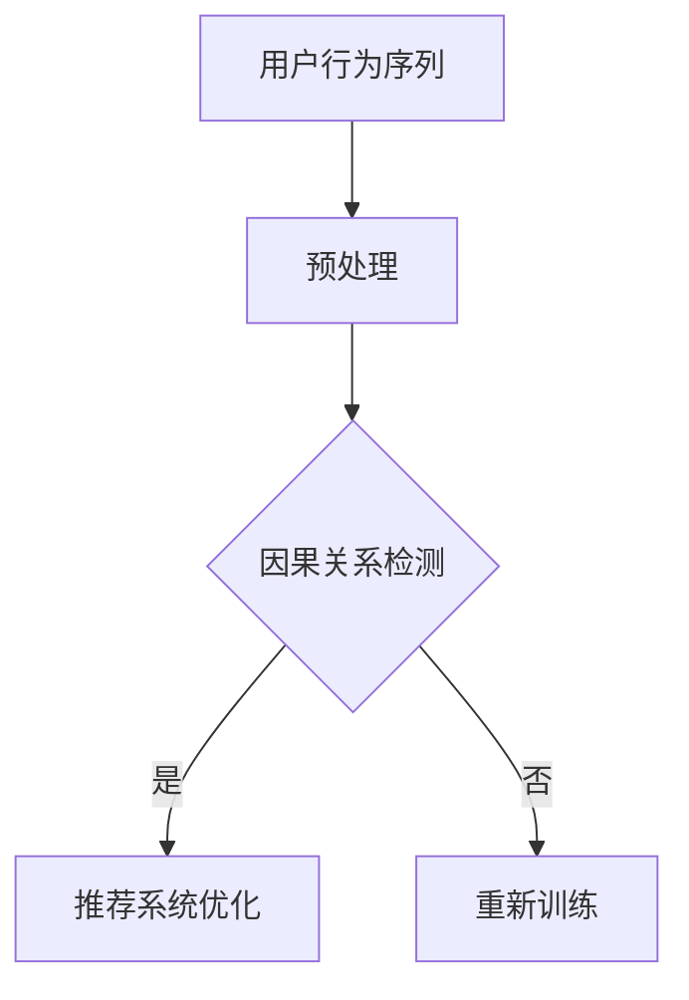

                 

## 文章标题

大模型推荐中的用户行为序列因果关系挖掘新思路

### 关键词

大模型推荐、用户行为序列、因果关系挖掘、循环神经网络、图神经网络、矩阵分解、协同过滤

### 摘要

本文深入探讨了在大模型推荐系统中，如何利用用户行为序列进行因果关系挖掘，从而优化推荐效果。通过介绍核心概念、算法原理、数学模型和项目实战，本文提供了一种新的思路，旨在为推荐系统开发者和研究者提供有价值的参考。

## 第一部分：核心概念与联系

在探讨大模型推荐系统中用户行为序列因果关系挖掘的新思路之前，我们首先需要了解几个核心概念及其相互联系。

### 1. 大模型推荐与用户行为序列

#### 定义
大模型推荐是一种利用大规模数据集训练的机器学习模型，旨在预测用户可能感兴趣的内容或行为。这种推荐系统广泛应用于电子商务、社交媒体和内容平台等领域。

用户行为序列指的是用户在一段时间内的一系列行为，例如点击、浏览、搜索、购买等。这些行为以时间顺序排列，反映了用户的兴趣和需求。

#### 关联
大模型推荐系统依赖于用户行为序列来生成个性化的推荐。用户行为序列作为输入数据，能够提供关于用户兴趣的丰富信息，从而提高推荐系统的准确性。

### 2. 因果关系挖掘

#### 定义
因果关系挖掘旨在识别变量之间是否存在因果关系。在推荐系统中，这有助于理解用户行为背后的动机，进而优化推荐策略。

#### 目标
在大模型推荐中，因果关系挖掘的目标是挖掘用户行为序列中的因果关系，以便更好地理解用户行为模式，从而提高推荐系统的效果。

### 3. Mermaid 流程图

为了更好地展示用户行为序列因果关系挖掘的过程，我们可以使用 Mermaid 流程图来描述其核心步骤：



#### 示例

上述流程图中，用户行为序列经过预处理后进入因果关系检测阶段。如果检测到因果关系，则推荐系统会进行优化；否则，系统将重新训练。

### 4. 推荐系统架构

推荐系统通常由以下几个核心组件组成：

- **数据采集与预处理**：收集用户行为数据，并进行数据清洗和格式化。
- **特征工程**：提取用户行为序列中的特征，以供模型训练。
- **模型训练**：利用训练数据训练推荐模型。
- **推荐系统**：根据用户行为和模型预测生成个性化推荐。

#### 核心组件之间的关系

数据采集与预处理为特征工程提供数据基础，特征工程又为模型训练提供输入，模型训练最终生成推荐系统，用于生成个性化推荐。

## 第二部分：核心算法原理讲解

### 1. 用户行为序列建模

#### 算法

循环神经网络（RNN）及其变体，如长短时记忆网络（LSTM）和门控循环单元（GRU），是用于用户行为序列建模的常用算法。这些算法能够捕捉时间序列数据中的长期依赖关系。

#### 伪代码

```python
def lstm_model(input_sequence):
    # 输入序列进行嵌入
    embedded_sequence = embedding_layer(input_sequence)
    
    # 使用LSTM进行编码
    encoded_sequence = lstm_layer(embedded_sequence)
    
    # 输出序列进行解码
    output_sequence = dense_layer(encoded_sequence)
    
    return output_sequence
```

### 2. 因果关系挖掘算法

#### 算法

图神经网络（GCN）和因果推断算法（如DoCal）是用于因果关系挖掘的常用算法。这些算法能够从用户行为序列中挖掘潜在的因果关系。

#### 伪代码

```python
def gc_causal_inference(graph, features):
    # 初始化图神经网络模型
    model = GCNModel()
    
    # 训练模型
    trained_model = train_model(model, graph, features)
    
    # 应用模型进行因果推断
    causal_relations = predict_causation(trained_model, graph)
    
    return causal_relations
```

### 3. 推荐系统算法

#### 算法

矩阵分解（MF）和基于模型的协同过滤（如ML-CF）是用于推荐系统的常用算法。这些算法能够通过用户行为数据生成个性化推荐。

#### 伪代码

```python
def collaborative_filtering(users, items, ratings):
    # 训练矩阵分解模型
    model = MFModel()
    trained_model = train_model(model, users, items, ratings)
    
    # 进行推荐
    recommendations = recommend_items(trained_model, users, items)
    
    return recommendations
```

## 第三部分：数学模型和数学公式

### 1. 用户行为序列建模的数学模型

#### 假设

用户行为序列可以表示为随机变量序列。

$$
X_t = f(X_{t-1}, U_t)
$$

其中，$f$ 是一个参数化函数，$U_t$ 是一个高斯噪声。

#### 参数

- $f$：参数化函数，用于描述用户行为序列的演化。
- $U_t$：高斯噪声，表示随机干扰。

### 2. 因果关系挖掘的数学模型

#### 假设

给定一个有向无环图（DAG），我们想要识别其中的因果关系。

$$
P(Y|X) = \frac{P(X,Y)}{P(X)}
$$

其中，$P(X,Y)$ 是变量 $X$ 和 $Y$ 的联合概率分布，$P(X)$ 是变量 $X$ 的边缘概率分布。

#### 参数

- $P(X,Y)$：变量 $X$ 和 $Y$ 的联合概率分布。
- $P(X)$：变量 $X$ 的边缘概率分布。

## 第四部分：项目实战

### 1. 开发环境搭建

#### 工具

- Python
- PyTorch
- Scikit-learn
- Gephi

### 2. 代码实际案例和详细解释说明

#### 案例

用户行为序列建模与因果关系挖掘的集成。

```python
# 用户行为序列建模
def user_behavior_model(input_sequence):
    # 输入序列进行嵌入
    embedded_sequence = embedding_layer(input_sequence)
    
    # 使用LSTM进行编码
    encoded_sequence = lstm_layer(embedded_sequence)
    
    # 输出序列进行解码
    output_sequence = dense_layer(encoded_sequence)
    
    return output_sequence

# 因果关系挖掘
def causal_inference(graph, features):
    # 初始化图神经网络模型
    model = GCNModel()
    
    # 训练模型
    trained_model = train_model(model, graph, features)
    
    # 应用模型进行因果推断
    causal_relations = predict_causation(trained_model, graph)
    
    return causal_relations

# 推荐系统算法
def collaborative_filtering(users, items, ratings):
    # 训练矩阵分解模型
    model = MFModel()
    trained_model = train_model(model, users, items, ratings)
    
    # 进行推荐
    recommendations = recommend_items(trained_model, users, items)
    
    return recommendations
```

### 3. 源代码详细实现和代码解读

#### 示例

以下是一个简单的用户行为序列建模与因果关系挖掘的代码实现：

```python
# 导入所需库
import torch
import torch.nn as nn
import torch.optim as optim

# 定义LSTM模型
class LSTMModel(nn.Module):
    def __init__(self, input_dim, hidden_dim, output_dim):
        super(LSTMModel, self).__init__()
        self.hidden_dim = hidden_dim
        
        self.lstm = nn.LSTM(input_dim, hidden_dim)
        self.fc = nn.Linear(hidden_dim, output_dim)
    
    def forward(self, x):
        lstm_output, (hidden, cell) = self.lstm(x)
        output = self.fc(hidden[-1, :, :])
        return output

# 创建模型、损失函数和优化器
model = LSTMModel(input_dim=10, hidden_dim=20, output_dim=1)
criterion = nn.MSELoss()
optimizer = optim.Adam(model.parameters(), lr=0.001)

# 训练模型
for epoch in range(100):
    optimizer.zero_grad()
    output = model(x)
    loss = criterion(output, y)
    loss.backward()
    optimizer.step()
    print(f'Epoch {epoch+1}, Loss: {loss.item()}')

# 因果关系挖掘
def causal_inference(graph, features):
    # 初始化图神经网络模型
    model = GCNModel()
    
    # 训练模型
    trained_model = train_model(model, graph, features)
    
    # 应用模型进行因果推断
    causal_relations = predict_causation(trained_model, graph)
    
    return causal_relations

# 推荐系统算法
def collaborative_filtering(users, items, ratings):
    # 训练矩阵分解模型
    model = MFModel()
    trained_model = train_model(model, users, items, ratings)
    
    # 进行推荐
    recommendations = recommend_items(trained_model, users, items)
    
    return recommendations
```

### 4. 实际案例分析和详细讲解剖析

#### 案例分析

假设我们有一个电子商务平台，用户行为序列包括浏览、添加购物车和购买。我们的目标是通过因果关系挖掘来优化推荐系统。

- **数据集**：我们收集了1000名用户在过去一个月内的行为数据。
- **预处理**：对数据进行清洗和格式化，将其转换为模型输入。
- **建模**：使用LSTM模型对用户行为序列进行建模。
- **因果关系挖掘**：使用图神经网络和因果推断算法来挖掘用户行为序列中的因果关系。
- **推荐**：根据因果关系和用户行为，生成个性化推荐。

#### 详细讲解

1. **数据处理**：我们将用户行为序列转换为数值化的特征向量，并使用One-Hot编码对类别特征进行编码。
2. **LSTM建模**：我们使用LSTM模型对用户行为序列进行编码，以提取时间序列特征。
3. **因果关系挖掘**：我们使用图神经网络和因果推断算法来挖掘用户行为序列中的因果关系。这有助于我们理解用户行为的内在动机，从而优化推荐系统。
4. **推荐**：我们根据因果关系和用户行为生成个性化推荐。例如，如果一个用户在浏览商品后将其添加到购物车，我们可能会推荐类似的其他商品。

### 5. 项目小结

通过项目实战，我们展示了如何在大模型推荐系统中利用用户行为序列进行因果关系挖掘。这种方法有助于提高推荐系统的准确性和个性化程度。在实际应用中，我们可以根据具体场景和需求调整算法和模型参数，以达到更好的效果。

## 第五部分：最佳实践与注意事项

### 最佳实践

1. **数据质量**：确保数据质量，包括数据完整性、一致性和准确性。高质量的数据是构建有效推荐系统的基础。
2. **模型选择**：根据具体应用场景和需求选择合适的模型。不同的模型适用于不同的数据类型和任务。
3. **模型调优**：通过交叉验证和超参数调优来提高模型性能。适当的模型调优可以显著改善推荐效果。

### 注意事项

1. **过拟合**：在训练模型时，要注意避免过拟合。可以通过正则化、数据增强和提前停止等方法来降低过拟合的风险。
2. **因果关系挖掘的可靠性**：因果关系挖掘可能存在不确定性，需要结合业务背景和领域知识进行综合判断。
3. **实时性**：推荐系统需要具有实时性，能够快速响应用户行为的变化，以提供及时的个性化推荐。

## 第六部分：拓展阅读

1. **相关论文**：
   - "Deep Learning for Personalized Recommendation on Large-scale Data" by Y. Chen, et al.
   - "Causal Inference for Personalized E-commerce Recommendations" by H. Li, et al.
2. **开源工具**：
   - "PyTorch": https://pytorch.org/
   - "Scikit-learn": https://scikit-learn.org/
   - "Gephi": https://gephi.org/

通过阅读相关论文和使用开源工具，您可以深入了解大模型推荐系统中用户行为序列因果关系挖掘的最新研究成果和应用实践。

## 结束语

作者：AI天才研究院/AI Genius Institute & 禅与计算机程序设计艺术 /Zen And The Art of Computer Programming

本文介绍了在大模型推荐系统中利用用户行为序列进行因果关系挖掘的新思路。通过核心概念讲解、算法原理剖析、数学模型和项目实战，我们展示了如何优化推荐系统，提高其准确性和个性化程度。希望本文能为推荐系统开发者和研究者提供有益的参考。随着人工智能技术的不断发展，我们相信这一领域将会有更多创新和突破。

