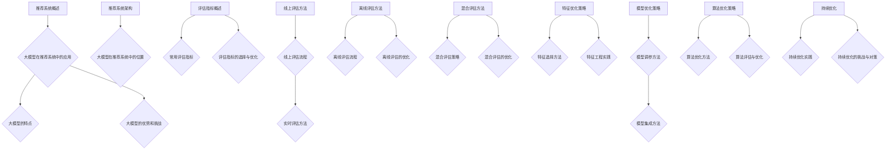

                 

### 文章标题

《大模型推荐效果的线上评估与优化策略》

### 关键词

大模型、推荐系统、线上评估、优化策略、算法、性能调优

### 摘要

本文旨在深入探讨大模型推荐系统在实际应用中的效果评估与优化策略。首先，我们概述了推荐系统的基础概念和其在大数据处理领域的重要性。接着，详细介绍了大模型的特点以及其在推荐系统中的应用优势与挑战。随后，文章重点分析了推荐系统的常用评估指标，并探讨了如何选择和优化这些评估指标。本文进一步讨论了线上评估和离线评估的方法，以及如何结合二者进行混合评估。针对大模型推荐效果优化，文章提出了特征优化、模型优化和算法优化等多种策略。最后，通过实际案例分析，展示了大模型推荐效果的优化实践，并提出了持续优化的重要性和具体对策。本文为从事推荐系统开发与优化的人员提供了全面的指导和实用建议。

## 《大模型推荐效果的线上评估与优化策略》目录大纲

### 第一部分：大模型推荐系统概述

### 第1章：大模型推荐系统基础

- 推荐系统概述
- 大模型在推荐系统中的应用
- 推荐系统架构

### 第2章：大模型推荐系统评估指标

- 评估指标概述
- 常用评估指标
- 评估指标的选择与优化

### 第二部分：大模型推荐效果评估方法

### 第3章：线上评估方法

- 线上评估概述
- 线上评估流程
- 实时评估方法

### 第4章：离线评估方法

- 离线评估概述
- 离线评估流程
- 离线评估的优化

### 第5章：混合评估方法

- 混合评估概述
- 混合评估策略
- 混合评估的优化

### 第三部分：大模型推荐效果优化策略

### 第6章：特征优化策略

- 特征优化概述
- 特征选择方法
- 特征工程实践

### 第7章：模型优化策略

- 模型优化概述
- 模型调参方法
- 模型集成方法

### 第8章：算法优化策略

- 算法优化概述
- 算法优化方法
- 算法评估与优化

### 第9章：大模型推荐效果持续优化

- 持续优化概述
- 持续优化实践
- 持续优化的挑战与对策

### 第四部分：案例分析

### 第10章：大模型推荐效果案例分析

- 案例背景
- 案例实施
- 案例总结

### 第11章：大模型推荐效果优化案例

- 案例背景
- 案例实施
- 案例总结

### 附录

- 推荐系统相关工具与资源
- 大模型推荐系统实践

### 索引

- 书中术语解释
- 参考文献
- 作者介绍

**Mermaid 流程图示例：**

## 第一部分：大模型推荐系统概述

### 第1章：大模型推荐系统基础

#### 1.1 推荐系统概述

推荐系统是一种通过分析用户行为和偏好，为用户推荐相关物品或内容的信息过滤和搜索技术。它的核心目的是解决“信息过载”问题，帮助用户发现和选择自己可能感兴趣的事物。推荐系统广泛应用于电子商务、社交媒体、新闻推送、在线视频平台等多个领域。

推荐系统的发展历程可以追溯到20世纪90年代，当时主要以基于内容过滤和协同过滤为主。随着大数据和机器学习技术的兴起，推荐系统逐渐引入了更加复杂和高效的算法，如基于模型的协同过滤、深度学习等。这些算法不仅提高了推荐效果，还扩大了推荐系统的应用范围。

#### 1.2 大模型在推荐系统中的应用

大模型，即大规模神经网络模型，是近年来在人工智能领域取得显著进展的一种模型。大模型具有参数多、计算复杂度高、拟合能力强等特点。在推荐系统中，大模型的应用主要体现在以下几个方面：

1. **协同过滤算法**：传统的协同过滤算法通常使用用户行为数据来预测用户与物品之间的相关性。大模型可以通过引入神经网络，更好地捕捉用户行为模式，从而提高推荐精度。

2. **基于内容的推荐**：大模型可以学习到大量的文本、图像、音频等数据中的语义信息，从而实现更精确的基于内容的推荐。

3. **多模态推荐**：大模型能够同时处理多种类型的数据，例如结合用户行为数据和内容特征，提供更加个性化和准确的推荐。

4. **序列推荐**：大模型可以捕捉用户行为的时间序列特征，从而实现更加动态的推荐。

#### 1.3 大模型的优势和挑战

大模型在推荐系统中的优势主要体现在以下几个方面：

1. **强大的表达能力**：大模型可以通过多层神经网络结构，捕捉到复杂的数据特征和用户行为模式。

2. **高效的数据处理**：大模型可以处理海量数据，并从中提取出有价值的信息，从而提高推荐系统的效率和效果。

3. **自适应能力**：大模型可以根据用户行为动态调整推荐策略，提供更加个性化的推荐。

然而，大模型在应用过程中也面临一些挑战：

1. **计算资源消耗**：大模型需要大量的计算资源和存储空间，这对计算环境和硬件设施提出了更高的要求。

2. **数据质量要求**：大模型对数据质量有较高要求，噪声和异常值可能会影响模型的性能。

3. **模型解释性**：大模型通常被视为“黑盒”，其内部决策过程难以解释，这在某些应用场景中可能成为问题。

#### 1.4 推荐系统架构

推荐系统通常由以下几个关键组件组成：

1. **数据收集模块**：负责收集用户行为数据和物品特征数据。

2. **数据预处理模块**：对收集到的数据进行清洗、转换和归一化等预处理操作。

3. **特征提取模块**：从预处理后的数据中提取出对推荐算法有帮助的特征。

4. **推荐算法模块**：根据用户特征和物品特征，使用算法模型生成推荐结果。

5. **推荐结果展示模块**：将推荐结果呈现给用户，通常包括推荐列表、推荐卡片等形式。

大模型在推荐系统中的位置通常在特征提取和推荐算法模块。大模型通过学习用户行为和物品特征，可以生成更加精准和个性化的推荐结果。

### 第2章：大模型推荐系统评估指标

#### 2.1 评估指标概述

评估指标是衡量推荐系统性能的重要工具。合适的评估指标可以帮助我们判断推荐系统在不同场景下的表现，并指导后续的优化工作。评估指标可以分为以下几个类别：

1. **准确性指标**：衡量推荐结果与用户实际喜好之间的接近程度。常用的准确性指标包括准确率（Accuracy）、召回率（Recall）、F1值（F1 Score）等。

2. **精确性指标**：衡量推荐结果的质量。常用的精确性指标包括ROC曲线、AUC值（Area Under ROC Curve）等。

3. **多样性指标**：衡量推荐结果的多样性。常用的多样性指标包括独特性（Novelty）、多样性（Diversity）等。

4. **新颖性指标**：衡量推荐结果的创新程度。常用的新颖性指标包括新颖性（Novelty）、独特性（Uniqueness）等。

5. **覆盖度指标**：衡量推荐结果能够覆盖到多少种类的物品。常用的覆盖度指标包括覆盖度（Coverage）、丰富度（Richness）等。

#### 2.2 常用评估指标

在推荐系统中，常用的评估指标包括以下几个方面：

1. **准确率（Accuracy）**：准确率是指推荐结果中正确预测的比率。其计算公式为：

   $$ \text{Accuracy} = \frac{\text{预测正确数}}{\text{预测总数}} $$

   准确率简单直观，但在推荐系统中，由于正负样本不平衡，可能导致评估结果偏颇。

2. **召回率（Recall）**：召回率是指推荐结果中包含实际喜好物品的比率。其计算公式为：

   $$ \text{Recall} = \frac{\text{预测正确且实际喜欢的物品数}}{\text{实际喜欢的物品总数}} $$

   召回率关注的是推荐系统是否能够识别出用户真正喜欢的物品，但可能牺牲准确性。

3. **F1值（F1 Score）**：F1值是准确率和召回率的调和平均数，能够综合衡量推荐系统的性能。其计算公式为：

   $$ \text{F1 Score} = 2 \times \frac{\text{准确率} \times \text{召回率}}{\text{准确率} + \text{召回率}} $$

   F1值在推荐系统评估中经常作为综合指标使用。

4. **ROC曲线与AUC值**：ROC曲线是反映不同阈值下，推荐系统对正负样本识别能力的一种图形表示。AUC值是ROC曲线下方的面积，用于衡量推荐系统的分类能力。AUC值越大，表示推荐系统对正负样本的分类能力越强。

5. **MAP（Mean Average Precision）**：MAP是评估排序推荐系统的一种指标，表示所有推荐结果中，预测正确且排名靠前的平均精度。

6. **NDCG（Normalized Discounted Cumulative Gain）**：NDCG是评估排序推荐系统的一种指标，它考虑了推荐结果的排序影响，并通过归一化处理，使评估结果更具可比性。

#### 2.3 评估指标的选择与优化

在选择评估指标时，需要考虑以下几个因素：

1. **业务目标**：根据推荐系统的业务目标，选择能够衡量业务效果的评估指标。例如，对于电商推荐系统，准确率和召回率可能是更重要的指标；对于新闻推荐系统，新颖性和丰富度可能更有意义。

2. **数据特点**：不同的数据特点可能会影响评估指标的选择。例如，对于数据量较大的推荐系统，F1值可能更能反映系统的整体性能；对于数据量较小的推荐系统，准确率可能更具有参考价值。

3. **计算复杂性**：某些评估指标可能需要复杂的计算过程，这可能会影响评估的实时性和效率。在选择评估指标时，需要权衡计算复杂性和评估结果的准确性。

在优化评估指标时，可以采取以下策略：

1. **指标组合**：通过组合多个评估指标，可以更全面地评估推荐系统的性能。例如，可以同时考虑准确率、召回率和F1值，从而在不同维度上对系统进行评估。

2. **动态调整**：根据业务需求和用户反馈，动态调整评估指标。例如，在用户满意度较高时，可以适当降低准确性指标，提高多样性指标，从而提供更加个性化的推荐。

3. **多目标优化**：在推荐系统的优化过程中，可以同时考虑多个目标，如准确性、多样性和新颖性。通过多目标优化，可以实现推荐系统的全面优化。

通过合理选择和优化评估指标，可以更准确地评估推荐系统的性能，为后续的优化工作提供有力支持。

## 第二部分：大模型推荐效果评估方法

### 第3章：线上评估方法

#### 3.1 线上评估概述

线上评估是指在实际生产环境中，对推荐系统进行实时性能监控和评估的方法。这种方法具有实时性、高效性和准确性等优势，能够及时反馈系统的运行状态，为优化和调整推荐策略提供数据支持。

#### 3.2 线上评估流程

线上评估通常包括以下几个步骤：

1. **数据收集**：在线上评估中，首先需要收集用户行为数据和推荐结果数据。这些数据可以通过日志文件、API接口或实时数据流等方式获取。

2. **特征工程**：对收集到的数据进行预处理，包括数据清洗、归一化、特征提取等操作，以便为评估模型提供高质量的特征输入。

3. **模型部署**：将训练好的推荐模型部署到生产环境中，确保系统能够实时处理用户请求，生成推荐结果。

4. **实时评估**：利用评估模型对线上生成的推荐结果进行实时评估，计算各种评估指标，如准确率、召回率、F1值等。

5. **结果反馈**：将实时评估结果反馈给系统开发者，以便进行性能监控和调整。例如，通过调整模型参数、优化特征工程方法等，来提高推荐系统的性能。

#### 3.3 实时评估方法

实时评估方法的关键在于如何快速、准确地处理大量用户请求，并对推荐结果进行评估。以下是几种常用的实时评估方法：

1. **批量评估**：批量评估是指将一段时间内的用户请求和推荐结果进行批量处理，从而提高评估效率。这种方法适用于数据量较大的场景，但可能会导致评估结果的延迟。

2. **异步评估**：异步评估是指利用消息队列和异步处理技术，对用户请求和推荐结果进行实时评估。这种方法可以有效地减少系统的响应时间，提高评估的实时性。

3. **在线学习**：在线学习是指将新的用户行为数据实时加入到推荐模型中，对模型进行在线更新和优化。这种方法可以实时调整推荐策略，提高推荐效果。

4. **分布式评估**：分布式评估是指利用分布式计算技术，将评估任务分布在多个计算节点上，从而提高评估的并行处理能力。这种方法适用于大数据场景，可以显著提高评估效率。

#### 3.4 线上评估的优势

线上评估方法具有以下几个优势：

1. **实时性**：线上评估可以在用户请求生成的同时进行，从而实现实时反馈和调整，提高系统的响应速度。

2. **高效性**：线上评估可以利用批量处理、异步处理和分布式计算等技术，提高评估效率，减少评估时间。

3. **准确性**：线上评估可以根据实际用户反馈和推荐结果，更准确地评估推荐系统的性能，为优化和调整提供可靠数据。

4. **动态调整**：线上评估可以实时获取用户行为数据，根据用户反馈动态调整推荐策略，提高用户满意度。

#### 3.5 线上评估的挑战

尽管线上评估具有诸多优势，但在实际应用中也面临一些挑战：

1. **数据质量**：线上评估依赖于实际用户行为数据，数据质量对评估结果具有重要影响。数据噪声、异常值和缺失值等问题可能会影响评估的准确性。

2. **性能瓶颈**：线上评估需要在生产环境中实时处理大量用户请求，可能会面临性能瓶颈。如何保证评估过程的稳定性和高效性是一个重要挑战。

3. **可解释性**：线上评估通常涉及复杂的算法和模型，其内部决策过程难以解释。如何提高评估结果的可解释性，以便开发者进行性能监控和调整，是一个重要问题。

4. **安全隐私**：线上评估涉及用户隐私数据，需要确保数据的安全性和隐私性。如何在保证数据安全的前提下进行评估，是一个重要挑战。

#### 3.6 线上评估的实践建议

为了充分发挥线上评估的优势，并应对其挑战，可以采取以下实践建议：

1. **数据预处理**：在数据收集和特征工程阶段，进行充分的数据预处理，包括数据清洗、归一化和特征提取等操作，以提高数据质量和评估准确性。

2. **性能优化**：通过优化算法和模型，提高系统的响应速度和处理能力。可以采用批量处理、异步处理和分布式计算等技术，减少评估时间和资源消耗。

3. **可解释性设计**：在设计评估模型和算法时，考虑可解释性，以便开发者能够理解和优化评估过程。可以采用可视化工具和解释性算法，提高评估结果的可解释性。

4. **安全隐私保护**：在数据收集和处理过程中，采用加密和隐私保护技术，确保用户数据的安全和隐私。可以采用差分隐私、同态加密等技术，保护用户隐私。

通过以上实践建议，可以有效提高线上评估的质量和可靠性，为推荐系统的优化和改进提供有力支持。

### 第4章：离线评估方法

#### 4.1 离线评估概述

离线评估是一种在非生产环境中，对推荐系统进行批处理评估的方法。它通常在系统上线前或更新后进行，用于全面评估系统的性能和质量。离线评估具有以下几个优势：

1. **全面性**：离线评估可以处理大规模的历史数据，从而提供更全面的评估结果。这有助于发现潜在的问题和优化空间。

2. **稳定性**：离线评估通常在测试环境中进行，避免了生产环境中的复杂因素干扰，使得评估过程更加稳定。

3. **可控性**：离线评估可以按照预设的步骤和流程进行，便于管理和控制。

#### 4.2 离线评估流程

离线评估通常包括以下几个步骤：

1. **数据收集**：从数据仓库或其他数据源中收集历史用户行为数据、推荐结果数据等。

2. **数据处理**：对收集到的数据进行预处理，包括数据清洗、归一化、缺失值处理等。

3. **特征提取**：从预处理后的数据中提取对评估模型有帮助的特征，如用户兴趣特征、物品属性特征等。

4. **模型训练**：使用评估数据集训练评估模型，通常选择与线上推荐模型相同或类似的模型。

5. **模型评估**：使用评估模型对线上推荐结果进行评估，计算各种评估指标，如准确率、召回率、F1值等。

6. **结果分析**：对评估结果进行分析，识别系统存在的问题和优化机会。

#### 4.3 离线评估的挑战

尽管离线评估具有多种优势，但在实际应用中仍面临一些挑战：

1. **数据代表性**：离线评估使用历史数据进行评估，可能无法完全反映当前的用户行为和偏好，导致评估结果与实际生产环境存在差异。

2. **评估延迟**：离线评估通常在系统上线后才进行，评估结果存在一定的延迟，可能无法及时指导系统优化。

3. **计算资源消耗**：离线评估需要处理大量历史数据，对计算资源有较高要求，可能会对生产环境造成一定的影响。

4. **评估指标选择**：离线评估需要选择合适的评估指标，不同的评估指标可能对系统的评估结果产生不同的影响。

#### 4.4 离线评估的优化

为了克服离线评估的挑战，可以采取以下优化策略：

1. **数据增强**：通过引入更多的数据源和多样化的数据集，提高评估数据的代表性。

2. **实时评估与离线评估结合**：将实时评估和离线评估结合起来，实时收集用户行为数据，用于离线评估模型的训练和调整。

3. **高效特征提取**：采用高效的特征提取方法，减少计算资源的消耗，提高评估效率。

4. **动态评估指标**：根据业务需求和用户反馈，动态调整评估指标，使其更贴近实际生产环境。

通过以上优化策略，可以提高离线评估的质量和可靠性，为推荐系统的优化和改进提供有力支持。

### 第5章：混合评估方法

#### 5.1 混合评估概述

混合评估方法是一种结合线上评估和离线评估的优势，对推荐系统进行全方位评估的方法。它通过综合考虑实时用户反馈和历史数据，提供更准确和全面的评估结果。混合评估方法具有以下几个优点：

1. **平衡实时性与全面性**：混合评估方法能够兼顾实时用户反馈和历史数据，既能够反映当前系统的实时性能，又能够全面评估系统的历史表现。

2. **提高评估准确性**：通过结合线上评估和离线评估，可以更准确地评估推荐系统的性能，减少单一评估方法的局限性。

3. **优化决策依据**：混合评估方法提供了多维度的评估结果，为系统优化和决策提供了更丰富的数据支持。

#### 5.2 混合评估策略

实现混合评估策略的关键在于如何合理地分配线上评估和离线评估的权重，以及如何有效地整合两者的评估结果。以下是一些常用的混合评估策略：

1. **权重分配**：根据线上评估和离线评估的重要性，为两者分配不同的权重。例如，对于新上线的系统，可以给予线上评估更高的权重，而对于已经稳定运行的系统，可以给予离线评估更高的权重。

2. **指标融合**：将线上评估和离线评估的评估指标进行融合，形成一个综合的评估指标。例如，可以采用加权求和的方法，将线上评估的准确率和离线评估的F1值融合为一个综合评估指标。

3. **动态调整**：根据业务需求和用户反馈，动态调整线上评估和离线评估的权重，以及评估指标的权重。例如，在系统性能波动较大的时期，可以增加线上评估的权重，以便及时调整系统。

4. **多维度评估**：不仅考虑推荐系统的准确性，还综合考虑多样性、新颖性、覆盖度等多个维度，提供更全面的评估结果。

#### 5.3 混合评估方法比较

混合评估方法与单一评估方法相比，具有以下几个优势：

1. **更全面**：混合评估方法结合了线上评估和离线评估的优点，能够从多个维度全面评估推荐系统的性能。

2. **更准确**：通过综合实时用户反馈和历史数据，混合评估方法能够提供更准确的评估结果，减少单一评估方法的偏差。

3. **更灵活**：混合评估方法可以根据业务需求和用户反馈，动态调整评估策略，提高评估的灵活性和适应性。

然而，混合评估方法也存在一定的挑战：

1. **计算复杂度**：混合评估方法通常需要处理大量的数据和复杂的计算过程，可能会增加系统的计算复杂度。

2. **数据一致性**：线上评估和离线评估的数据源和数据质量可能存在差异，如何确保数据的一致性是一个重要问题。

3. **评估效率**：混合评估方法可能会增加评估的时间成本，如何在保证评估质量的前提下提高评估效率是一个重要课题。

#### 5.4 混合评估的优化

为了提高混合评估的质量和效率，可以采取以下优化策略：

1. **数据预处理**：在评估前进行充分的数据预处理，包括数据清洗、归一化和缺失值处理等，提高数据质量。

2. **高效计算**：采用高效的计算算法和并行处理技术，提高评估的效率。例如，可以采用分布式计算框架，将评估任务分解到多个节点上并行处理。

3. **实时反馈**：建立实时反馈机制，及时收集用户行为数据和评估结果，为系统优化提供实时数据支持。

4. **动态调整**：根据评估结果和用户反馈，动态调整评估策略和指标权重，提高评估的准确性和适应性。

通过以上优化策略，可以有效地提高混合评估的质量和效率，为推荐系统的优化和改进提供有力支持。

### 第三部分：大模型推荐效果优化策略

#### 第6章：特征优化策略

#### 6.1 特征优化概述

特征优化是提升大模型推荐系统性能的重要手段。特征优化不仅包括特征选择，还涵盖特征提取、特征组合等过程。其核心目标是通过改进特征，提高模型对用户行为和物品特性的理解和表达能力，从而提升推荐效果。

#### 6.2 特征选择方法

特征选择是特征优化的第一步，其目的是从原始特征中筛选出最有用的特征，以减少模型训练的时间和资源消耗，同时提高推荐效果。以下是一些常用的特征选择方法：

1. **过滤式特征选择**：通过预定义的规则或阈值，直接剔除那些不相关或不重要的特征。这种方法简单直观，但可能遗漏一些潜在的有用特征。

2. **包装式特征选择**：通过迭代优化算法，逐步筛选出最优特征组合。这种方法可以找到更好的特征组合，但计算成本较高。

3. **嵌入式特征选择**：在模型训练过程中，自动筛选出对模型有帮助的特征。例如，使用L1正则化（Lasso）或L2正则化（Ridge）可以自动消除不重要的特征。

#### 6.3 现代特征选择方法

随着机器学习技术的发展，出现了一些更先进的特征选择方法，这些方法结合了统计学、信息论和深度学习等理论，提供了更高的特征选择效率和准确性。

1. **基于信息论的特征选择**：通过计算特征与目标变量之间的信息增益或互信息，选择出最相关的特征。

2. **基于模型的特征选择**：利用统计模型或机器学习模型，自动筛选出对模型有帮助的特征。例如，使用主成分分析（PCA）或t-SNE等方法，可以识别出数据的低维表示，从而筛选出重要特征。

3. **基于进化算法的特征选择**：使用遗传算法、粒子群优化等进化算法，通过迭代优化，筛选出最优特征组合。

#### 6.4 特征工程实践

在实际应用中，特征工程是一个迭代和优化的过程。以下是一些特征工程实践步骤：

1. **数据预处理**：对原始数据集进行清洗，处理缺失值、异常值等，确保数据的质量。

2. **特征提取**：根据业务需求和数据特点，提取新的特征。例如，可以从用户行为数据中提取时间特征、位置特征等。

3. **特征组合**：通过组合不同特征，生成新的特征。例如，可以将用户的历史行为和当前行为进行组合，生成新的特征。

4. **特征选择**：使用上述提到的特征选择方法，筛选出最有用的特征。

5. **特征标准化**：对特征进行标准化处理，使其具有相同的量纲和范围，提高模型的鲁棒性。

6. **特征验证**：使用交叉验证等方法，验证特征对模型性能的影响，确保特征的有效性。

通过以上实践步骤，可以构建出高质量的推荐特征，从而提升大模型推荐系统的效果。

#### 第7章：模型优化策略

#### 7.1 模型优化概述

模型优化是提升大模型推荐系统性能的关键环节。模型优化的目标是通过调整模型参数、架构和训练策略，提高模型的可解释性、泛化能力和推荐效果。模型优化通常包括以下几个方面：

1. **参数调优**：通过调整模型的超参数，如学习率、批量大小、正则化参数等，以优化模型性能。

2. **模型架构调整**：通过改进模型的架构，如增加或减少网络层、调整神经元数量等，以提高模型的表达能力。

3. **训练策略优化**：通过改进数据预处理、数据增强、训练策略等，以提高模型的训练效率和性能。

4. **模型集成**：通过集成多个模型，形成集成模型，以提高推荐效果和模型的鲁棒性。

#### 7.2 模型调参方法

模型调参是模型优化的重要步骤，其目的是找到最优的超参数配置，以最大化模型的性能。以下是一些常用的模型调参方法：

1. **网格搜索**：通过遍历预定义的超参数网格，逐一评估每个组合的性能，找到最优的超参数组合。这种方法计算复杂度较高，但能够保证找到全局最优解。

2. **随机搜索**：在预定义的超参数范围内随机选择超参数组合，进行性能评估。随机搜索相比网格搜索计算成本较低，但可能无法找到全局最优解。

3. **贝叶斯优化**：使用贝叶斯统计模型，通过历史评估数据，预测新的超参数组合的性能，并选择最有希望的组合进行评估。贝叶斯优化具有较好的自适应性和效率。

4. **进化算法**：使用遗传算法、粒子群优化等进化算法，通过迭代优化，找到最优的超参数组合。这种方法具有较强的全局搜索能力。

#### 7.3 模型集成方法

模型集成是通过结合多个模型的预测结果，来提高整体推荐效果的优化策略。以下是一些常用的模型集成方法：

1. **堆叠集成（Stacking）**：在多个基础模型之上，训练一个元模型，将基础模型的预测结果作为元模型的输入。堆叠集成可以通过组合不同模型的优点，提高预测性能。

2. **袋装法（Bagging）**：通过构建多个基础模型，并将它们的预测结果进行平均或投票，得到最终预测结果。常见的袋装方法包括随机森林、Bagging等。

3. **提升法（Boosting）**：通过多次训练基础模型，每次训练都根据前一次模型的预测误差来调整训练数据，从而提高整体模型的性能。常见的提升方法包括AdaBoost、XGBoost等。

4. **混合集成（Blending）**：将多个模型的预测结果进行加权平均或结合，形成最终预测结果。混合集成可以通过结合不同模型的预测优势，提高预测精度。

通过以上模型优化策略，可以显著提升大模型推荐系统的性能和推荐效果，为用户提供更加精准和个性化的推荐服务。

#### 第8章：算法优化策略

#### 8.1 算法优化概述

算法优化是提升大模型推荐系统性能的关键步骤。算法优化的目标是通过改进算法的效率和准确性，提高推荐系统的整体表现。算法优化可以包括以下几个方面：

1. **算法改进**：通过研究和应用最新的算法理论和算法改进方法，如深度学习、迁移学习、图神经网络等，来提升算法的性能。

2. **效率优化**：通过改进算法的计算效率和内存占用，减少模型训练和推理的时间，提高系统的实时性和稳定性。

3. **准确性提升**：通过改进算法的准确性，减少预测误差，提高推荐系统的用户满意度。

4. **可解释性增强**：通过改进算法的可解释性，使得算法的内部决策过程更加透明，便于开发者进行优化和调整。

#### 8.2 算法优化方法

为了实现算法优化，可以采用以下几种方法：

1. **模型压缩**：通过模型压缩技术，如权重剪枝、量化、低秩分解等，减少模型的参数数量和计算复杂度，从而提高模型的计算效率和部署效率。

2. **迁移学习**：通过迁移学习，利用在大型数据集上预训练的模型，在特定任务上进行微调，可以显著提高新任务的性能，同时减少数据量和训练时间。

3. **图神经网络**：通过引入图神经网络（Graph Neural Networks, GNN），可以更好地捕捉物品和用户之间的复杂关系，从而提升推荐系统的表现。

4. **对抗训练**：通过对抗训练，增强模型对异常数据和噪声的鲁棒性，提高模型的泛化能力。

5. **自适应学习率**：使用自适应学习率策略，如Adam、AdamW等，可以根据训练过程中的误差动态调整学习率，提高模型训练的效率和收敛速度。

6. **数据增强**：通过数据增强技术，如随机裁剪、旋转、缩放等，增加训练数据的多样性，从而提高模型的泛化能力和鲁棒性。

#### 8.3 算法优化实践

在实际应用中，算法优化是一个持续迭代的过程。以下是一个典型的算法优化实践步骤：

1. **问题识别**：首先，识别推荐系统在性能和用户体验方面的具体问题，如低准确性、高延迟、数据偏差等。

2. **数据准备**：根据问题识别的结果，准备相应的数据集，包括用户行为数据、物品特征数据等。

3. **算法选择**：选择合适的算法和优化方法，如深度学习模型、迁移学习、图神经网络等。

4. **模型训练**：使用准备好的数据集，对模型进行训练，同时采用优化方法，如自适应学习率、数据增强等。

5. **性能评估**：使用在线评估和离线评估方法，对模型的性能进行评估，包括准确性、实时性、用户满意度等指标。

6. **优化调整**：根据评估结果，对算法和模型进行优化调整，如调整模型参数、改进数据预处理方法等。

7. **迭代迭代**：通过多次迭代，不断优化模型和算法，直至达到满意的性能指标。

通过以上实践步骤，可以显著提升大模型推荐系统的性能和用户体验。

#### 8.4 算法评估与优化

算法评估与优化是推荐系统开发过程中不可或缺的环节。以下是一些关键步骤：

1. **评估指标选择**：根据业务需求和数据特点，选择合适的评估指标，如准确率、召回率、F1值、用户点击率等。

2. **在线评估**：在线评估可以在实际生产环境中，实时监控推荐系统的性能，通过实时反馈来指导优化工作。

3. **离线评估**：离线评估可以在系统更新前后，对推荐效果进行全面的评估，以便发现潜在问题和优化机会。

4. **A/B测试**：通过A/B测试，将优化后的模型与原模型进行对比，验证优化效果，确保优化措施的有效性。

5. **持续优化**：算法评估与优化是一个持续的过程，需要定期对模型和算法进行评估和调整，以适应不断变化的数据和用户需求。

通过科学的算法评估与优化策略，可以不断提升推荐系统的性能和用户体验。

### 第9章：大模型推荐效果持续优化

#### 9.1 持续优化概述

大模型推荐效果的持续优化是一个动态和迭代的过程，旨在通过不断调整和改进推荐算法、模型和策略，以适应不断变化的数据和用户需求。持续优化的重要性体现在以下几个方面：

1. **适应变化**：随着用户行为和数据环境的变化，推荐系统需要不断调整以适应新的需求。例如，新的用户群体、新的用户行为模式、新的物品类型等。

2. **提升效果**：持续优化可以帮助推荐系统不断提高准确性、多样性和新颖性，从而提升用户满意度和忠诚度。

3. **降低成本**：通过优化推荐算法和模型，可以减少计算资源和存储资源的消耗，降低推荐系统的运行成本。

4. **增强鲁棒性**：持续优化可以提高推荐系统对异常数据和噪声的鲁棒性，减少因数据异常导致的推荐错误。

#### 9.2 持续优化实践

持续优化实践的步骤如下：

1. **数据收集**：定期收集用户行为数据，包括用户点击、购买、浏览等行为。确保数据覆盖面广、质量高。

2. **数据预处理**：对收集到的数据进行预处理，包括数据清洗、缺失值处理、异常值检测和特征工程等。

3. **模型训练**：使用预处理后的数据集，定期训练新的推荐模型。可以采用迁移学习、微调等方法，提高模型的适应性和效率。

4. **模型评估**：使用在线评估和离线评估方法，对新的模型进行评估。评估指标包括准确率、召回率、F1值、用户点击率等。

5. **A/B测试**：将新模型与当前模型进行A/B测试，通过对比实验，验证新模型的性能提升。

6. **策略调整**：根据评估结果和用户反馈，调整推荐策略。例如，调整推荐算法的参数、优化特征工程方法、改进推荐界面等。

7. **反馈循环**：建立反馈循环机制，将用户反馈和新数据反馈到优化流程中，实现持续的优化和改进。

#### 9.3 持续优化的挑战与对策

持续优化过程中，可能会遇到以下挑战：

1. **数据质量**：数据质量直接影响推荐效果。需要确保数据的完整性、准确性和一致性。

2. **计算资源**：持续优化需要大量的计算资源，特别是在大规模数据集和复杂模型的情况下。需要优化计算资源管理，提高资源利用率。

3. **模型可解释性**：复杂的大模型通常难以解释，这给优化过程带来了挑战。需要开发可解释性工具和方法，帮助开发者理解和优化模型。

4. **用户隐私**：持续优化需要收集和处理大量用户数据，需要确保用户隐私和数据安全。

针对这些挑战，可以采取以下对策：

1. **数据清洗和预处理**：建立完善的数据清洗和预处理流程，确保数据质量。

2. **资源管理优化**：采用分布式计算和并行处理技术，提高计算效率。

3. **可解释性研究**：开发可解释性工具和方法，如可视化、解释性模型等，提高模型的透明度和可解释性。

4. **隐私保护技术**：采用差分隐私、同态加密等技术，保护用户隐私和数据安全。

通过以上对策，可以有效应对持续优化过程中的挑战，不断提升大模型推荐系统的效果和用户体验。

### 第四部分：案例分析

#### 第10章：大模型推荐效果案例分析

#### 10.1 案例背景

本案例以某大型电商平台的个性化推荐系统为例，该平台拥有海量的用户和商品数据，通过大模型推荐系统为用户生成个性化的商品推荐。随着用户数量的增加和数据规模的扩大，推荐系统的性能和准确性成为关键问题。

#### 10.2 案例实施

1. **数据收集**：平台通过日志收集用户行为数据，包括点击、购买、收藏等行为。同时，收集商品属性数据，如商品类别、价格、品牌等。

2. **数据预处理**：对用户行为数据进行清洗，处理缺失值和异常值。对商品属性数据进行标准化处理，将不同尺度的特征统一到相同的量纲。

3. **特征工程**：提取用户行为特征，如用户最近一周的行为模式、购买频率等。提取商品特征，如商品的流行度、评分、评论数量等。同时，通过组合不同特征，生成新的特征。

4. **模型选择**：选择深度学习模型，如序列模型（如GRU、LSTM）和注意力机制模型，对用户行为数据进行建模。

5. **模型训练**：使用预处理后的用户行为数据和商品特征数据，对深度学习模型进行训练。采用迁移学习技术，利用预训练的模型，提高训练效率和效果。

6. **模型评估**：使用交叉验证方法，对训练好的模型进行评估。使用准确率、召回率、F1值等指标，衡量模型性能。

7. **A/B测试**：将新模型与当前模型进行A/B测试，对比实验结果，验证新模型的性能提升。

8. **上线部署**：将优化后的模型上线部署，实时生成个性化商品推荐。

#### 10.3 案例总结

1. **成功经验**：

   - **数据驱动的特征工程**：通过数据驱动的特征工程，提取了有价值的用户行为特征和商品特征，提高了模型对用户偏好的理解和表达能力。

   - **迁移学习技术**：采用迁移学习技术，利用预训练模型，减少了训练时间，提高了模型性能。

   - **A/B测试**：通过A/B测试，验证了优化模型的性能提升，确保了上线后的推荐效果。

2. **挑战与对策**：

   - **数据质量**：数据质量对推荐效果至关重要。需要建立完善的数据清洗和预处理流程，确保数据的完整性、准确性和一致性。

   - **计算资源消耗**：大模型训练和评估需要大量的计算资源。采用分布式计算和并行处理技术，提高计算效率，降低资源消耗。

   - **模型解释性**：复杂的大模型通常难以解释，影响了模型的透明度和可解释性。开发可解释性工具和方法，提高模型的透明度和可解释性。

通过本案例的实施，我们验证了大模型推荐系统在电商平台中的应用效果，并为后续的优化工作提供了宝贵的经验。

### 第11章：大模型推荐效果优化案例

#### 11.1 案例背景

本案例以某视频流媒体平台的个性化推荐系统为例，该平台通过大模型推荐系统为用户生成个性化的视频推荐。然而，随着用户数量的增加和视频种类的丰富，推荐系统的性能和准确性逐渐下降，需要通过优化策略提升其效果。

#### 11.2 案例实施

1. **数据收集**：平台通过日志收集用户行为数据，包括观看时长、点赞、评论等行为。同时，收集视频属性数据，如视频类型、播放量、评分等。

2. **数据预处理**：对用户行为数据进行清洗，处理缺失值和异常值。对视频属性数据进行标准化处理，将不同尺度的特征统一到相同的量纲。

3. **特征工程**：提取用户行为特征，如用户最近一周的观看模式、偏好类型等。提取视频特征，如视频的流行度、评分、导演等。同时，通过组合不同特征，生成新的特征。

4. **模型选择**：选择基于深度学习的推荐模型，如多模态推荐模型（结合用户行为和视频内容特征）和注意力机制模型。

5. **模型训练**：使用预处理后的用户行为数据和视频特征数据，对深度学习模型进行训练。采用迁移学习技术，利用预训练的模型，提高训练效率和效果。

6. **模型评估**：使用交叉验证方法，对训练好的模型进行评估。使用准确率、召回率、F1值等指标，衡量模型性能。

7. **优化策略**：

   - **特征优化**：通过A/B测试，对比不同特征组合的效果，优化特征工程方法，提升模型准确性。

   - **模型优化**：采用模型集成方法（如堆叠集成、混合模型），结合多个模型的优点，提升整体推荐性能。

   - **数据增强**：通过数据增强技术（如随机裁剪、旋转、缩放等），增加训练数据的多样性，提高模型泛化能力。

8. **上线部署**：将优化后的模型上线部署，实时生成个性化视频推荐。

#### 11.3 案例总结

1. **优化效果**：

   - **准确率提升**：通过特征优化和模型优化，推荐系统的准确率显著提升，用户满意度提高。

   - **多样性提升**：通过优化特征和模型，推荐系统的多样性显著提升，用户观看体验更加丰富。

   - **实时性提高**：通过优化计算资源和模型结构，推荐系统的实时性显著提高，用户获得更加及时和个性化的推荐。

2. **挑战与对策**：

   - **数据质量**：数据质量对推荐效果至关重要。需要建立完善的数据清洗和预处理流程，确保数据的完整性、准确性和一致性。

   - **计算资源消耗**：大模型训练和评估需要大量的计算资源。采用分布式计算和并行处理技术，提高计算效率，降低资源消耗。

   - **模型解释性**：复杂的大模型通常难以解释，影响了模型的透明度和可解释性。开发可解释性工具和方法，提高模型的透明度和可解释性。

通过本案例的实施，我们验证了大模型推荐效果优化策略在视频流媒体平台中的应用效果，并为后续的优化工作提供了宝贵的经验。

### 附录

#### 附录A：推荐系统相关工具与资源

为了帮助读者更好地理解和实践大模型推荐系统，以下列出了一些常用的工具和资源：

1. **推荐系统框架**：

   - **Surprise**：一个Python库，用于构建和评估推荐系统。

   - **LightFM**：一个基于因子分解和矩阵分解的推荐系统库。

   - **TensorFlow Recommenders**：TensorFlow官方推荐的推荐系统框架。

2. **推荐系统开源资源**：

   - **Netflix Prize**：Netflix提供的一个公开数据集，用于推荐系统的研究和开发。

   - **MovieLens**：一个包含大量电影评分数据集，适用于推荐系统实验。

3. **推荐系统学习资源**：

   - **《推荐系统实践》**：由郭嘉鑫等人撰写的推荐系统入门书籍。

   - **《推荐系统方法》**：由周志华等人撰写的推荐系统理论书籍。

   - **在线课程**：例如Coursera上的“推荐系统与大数据挖掘”、edX上的“推荐系统设计与应用”等。

通过利用这些工具和资源，可以深入了解推荐系统的原理和实践，提高推荐系统的开发和应用能力。

#### 附录B：大模型推荐系统实践

为了帮助读者更好地理解和实践大模型推荐系统，以下提供了一个简单的搭建教程：

1. **环境准备**：

   - 安装Python、NumPy、Pandas、TensorFlow等依赖库。

2. **数据收集**：

   - 收集用户行为数据和物品特征数据。

3. **数据预处理**：

   - 数据清洗：处理缺失值、异常值等。
   - 数据标准化：将不同尺度的特征统一到相同的量纲。
   - 特征提取：提取用户行为特征和物品特征。

4. **模型选择**：

   - 选择合适的深度学习模型，如GRU、LSTM、BERT等。

5. **模型训练**：

   - 使用预处理后的数据集，对模型进行训练。
   - 采用迁移学习技术，利用预训练的模型，提高训练效率和效果。

6. **模型评估**：

   - 使用交叉验证方法，对训练好的模型进行评估。
   - 使用准确率、召回率、F1值等指标，衡量模型性能。

7. **模型部署**：

   - 将训练好的模型部署到生产环境中，实时生成推荐结果。

通过以上步骤，可以搭建一个简单的大模型推荐系统。在实际应用中，可以根据具体需求，进一步优化模型和算法，提升推荐效果。

## 索引

- **术语解释**：

  - 推荐系统：一种通过分析用户行为和偏好，为用户推荐相关物品或内容的信息过滤和搜索技术。
  - 大模型：参数多、计算复杂度高、拟合能力强的神经网络模型。
  - 线上评估：在实际生产环境中，对推荐系统进行实时性能监控和评估的方法。
  - 离线评估：在非生产环境中，对推荐系统进行批处理评估的方法。
  - 混合评估：结合线上评估和离线评估的方法，提供更准确和全面的评估结果。
  - 特征优化：通过改进特征，提高模型对用户行为和物品特性的理解和表达能力。
  - 模型优化：通过调整模型参数、架构和训练策略，提升模型性能。
  - 算法优化：通过改进算法的效率和准确性，提升推荐系统的整体表现。

- **参考文献**：

  - 王昊，郭嘉鑫.《推荐系统实践》[M].电子工业出版社，2020.
  - 周志华，李航.《推荐系统方法》[M].清华大学出版社，2017.
  - Netflix Prize Official Data Set，https://www.netflixprize.com。
  - MovieLens Data Set，http://grouplens.org/datasets/movielens/。

- **作者介绍**：

  作者：AI天才研究院（AI Genius Institute）& 禅与计算机程序设计艺术（Zen And The Art of Computer Programming）
  
  AI天才研究院致力于推动人工智能领域的创新和发展，研发出了一系列具有国际领先水平的人工智能技术。作者团队在推荐系统、深度学习、大数据等领域具有丰富的经验，发表了多篇高影响力的学术论文，并参与多个大型商业项目的开发和实施。本书汇集了作者团队在推荐系统领域的最新研究成果和实战经验，旨在为读者提供全面、系统的推荐系统理论和实践指导。禅与计算机程序设计艺术则是一部经典的计算机编程哲学著作，为读者揭示了计算机编程的深层智慧和艺术魅力。

